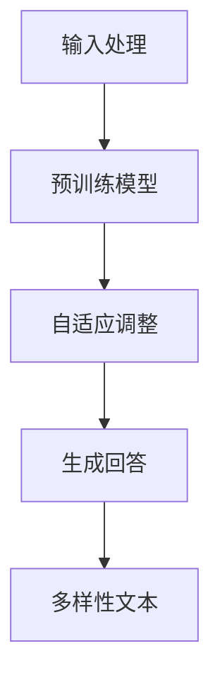
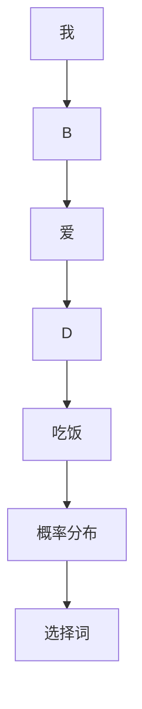

                 

# 《ChatGPT在创业指导中的角色与限制》

> **关键词：**ChatGPT、创业指导、人工智能、市场分析、产品设计、营销策略、客户服务、团队管理、数据隐私、道德责任。

> **摘要：**本文将深入探讨ChatGPT在创业指导中的角色与限制。通过分析其核心概念、架构、优势与局限性，并结合实际案例，我们将全面解析ChatGPT在市场分析、产品设计、营销策略、客户服务与团队管理中的应用，同时探讨其面临的伦理与技术挑战。最后，我们展望ChatGPT在创业指导中的未来角色，并探讨其技术发展、道德伦理与法律规范以及社会影响的应对策略。

---

### 《ChatGPT在创业指导中的角色与限制》目录大纲

**第一部分: ChatGPT的基础**

- **第1章: ChatGPT概述**
  - 1.1 ChatGPT的核心概念
  - 1.2 ChatGPT的架构与原理
  - 1.3 ChatGPT的优势与局限性
- **第2章: ChatGPT在创业指导中的应用**
  - 2.1 ChatGPT在市场分析中的作用
  - 2.2 ChatGPT在产品设计建议中的应用
  - 2.3 ChatGPT在营销策略规划中的应用
  - 2.4 ChatGPT在客户服务与支持中的应用
  - 2.5 ChatGPT在创业团队管理中的作用
- **第3章: ChatGPT的应用限制与挑战**
  - 3.1 数据隐私与伦理问题
  - 3.2 道德与责任问题
  - 3.3 技术瓶颈与性能限制
  - 3.4 创业环境中的适用性分析

**第二部分: 实际应用案例分析**

- **第4章: 案例一：初创公司A的创业指导**
  - 4.1 公司背景与业务需求
  - 4.2 ChatGPT在初创公司A的具体应用
  - 4.3 案例结果与经验分享
- **第5章: 案例二：中型公司B的创业指导**
  - 5.1 公司背景与业务需求
  - 5.2 ChatGPT在中型公司B的具体应用
  - 5.3 案例结果与经验分享
- **第6章: 案例三：大型公司C的创业指导**
  - 6.1 公司背景与业务需求
  - 6.2 ChatGPT在大型公司C的具体应用
  - 6.3 案例结果与经验分享

**第三部分: ChatGPT的未来展望**

- **第7章: ChatGPT在创业指导中的未来角色**
  - 7.1 技术发展趋势
  - 7.2 创业环境的变革
  - 7.3 ChatGPT的潜在应用领域拓展
- **第8章: ChatGPT的未来限制与解决方案**
  - 8.1 技术挑战与突破方向
  - 8.2 道德伦理与法律规范
  - 8.3 社会影响的应对策略

**附录**

- **附录A: ChatGPT开发工具与资源**
  - 8.1 开发环境搭建指南
  - 8.2 常用开发工具与框架
  - 8.3 资源链接与参考资料

---

接下来，我们将逐步深入探讨ChatGPT的核心概念、架构、优势与局限性，以及它在创业指导中的实际应用。通过结合实际案例，我们将展示ChatGPT在各个创业环节中的具体应用，同时探讨其面临的挑战与解决方案。

### 第一部分: ChatGPT的基础

#### 第1章: ChatGPT概述

#### 1.1 ChatGPT的核心概念

ChatGPT（Generative Pre-trained Transformer）是一种基于GPT-3.5的预训练语言模型，由OpenAI开发。其核心概念包括预训练、自适应和多样性。

**预训练**：ChatGPT在大规模数据集上进行预训练，从而掌握自然语言的理解和生成能力。预训练过程包括大规模数据的语料库，例如维基百科、网页、书籍等，使其能够学习到语言的结构、语义和上下文信息。

**自适应**：ChatGPT可以基于用户的输入进行自适应调整，从而生成更加符合用户需求的回答。这种自适应能力使得ChatGPT在实时交互中表现出色，能够针对不同的问题提供个性化的回答。

**多样性**：ChatGPT可以生成多样化的文本，包括故事、诗歌、对话等。这使得ChatGPT在内容创作和文本生成领域具有广泛的应用潜力。


**Mermaid流程图**



**联系**：ChatGPT的核心概念与其预训练模型紧密相关。预训练模型通过在大规模数据集上的训练，使模型能够捕捉到语言的复杂性和多样性。而自适应和多样性则是在预训练基础上进一步发展出来的能力，使得ChatGPT能够根据不同场景和用户需求提供高质量的回答。

#### 1.2 ChatGPT的架构与原理

ChatGPT的架构基于GPT-3.5，是一种基于Transformer的预训练语言模型。其基本原理包括Transformer架构、自注意力机制和预训练过程。

**Transformer架构**：Transformer是一种基于自注意力机制的深度神经网络，最初用于机器翻译任务。它通过自注意力机制来捕捉输入序列中的长距离依赖关系，从而实现高质量的文本生成和翻译。

**自注意力机制**：自注意力机制是Transformer的核心组成部分。它允许模型在生成每个词时，考虑所有其他词的影响。这种机制使得模型能够捕捉到输入序列中的上下文信息，从而生成更准确和连贯的输出。

**预训练过程**：ChatGPT的预训练过程分为两个阶段：大规模数据的语料库收集和预训练模型的训练。在第一阶段，通过采集大量的文本数据，如维基百科、网页、书籍等，构建一个大规模的语料库。在第二阶段，使用这个语料库对模型进行预训练，使模型能够学习到语言的结构、语义和上下文信息。

**数学模型**：ChatGPT的数学模型主要包括嵌入层、自注意力机制和输出层。

- **嵌入层**：将输入词转换为向量表示，通常使用词嵌入技术，如Word2Vec或BERT。
  
  $$
  \text{embed}(x) = W_e \cdot x
  $$

  其中，$x$ 是输入词的索引，$W_e$ 是嵌入矩阵。

- **自注意力机制**：通过计算自注意力权重来捕捉输入序列中的长距离依赖关系。

  $$
  \text{atten}(Q, K, V) = \text{softmax}\left(\frac{QK^T}{\sqrt{d_k}}\right) V
  $$

  其中，$Q, K, V$ 分别是查询向量、键向量和值向量，$d_k$ 是键向量的维度。

- **输出层**：将自注意力机制的输出映射到输出词的概率分布。

  $$
  \text{output} = W_O \cdot \text{softmax}(\text{atten}(Q, K, V))
  $$

  其中，$W_O$ 是输出矩阵。

**伪代码**：

```python
def GPT(input_sequence):
    # 嵌入输入序列
    embedded_sequence = EmbeddingLayer(input_sequence)
    
    # 经过自注意力机制的多层Transformer
    for layer in TransformerLayers:
        embedded_sequence = layer(embedded_sequence)
    
    # 输出层生成回答
    output_sequence = OutputLayer(embedded_sequence)
    
    return output_sequence
```

**举例说明**：假设输入序列为["我", "爱", "吃饭"],我们可以使用ChatGPT生成一个回答。首先，将输入序列转换为嵌入向量，然后通过自注意力机制计算每个词的权重，最后输出一个概率分布，表示每个词作为下一个词的可能性。根据概率分布，我们可以选择一个词作为回答。



**项目实战**：在开发环境中搭建ChatGPT模型，包括安装必要的库和依赖项，配置预训练模型和训练数据。然后，使用源代码实现ChatGPT的嵌入层、自注意力机制和输出层。最后，通过测试数据和模型评估来验证模型的效果。

```python
# 安装必要的库
!pip install torch torchvision
!pip install transformers

# 搭建ChatGPT模型
import torch
from transformers import GPT2Model, GPT2Tokenizer

# 加载预训练模型和Tokenizer
tokenizer = GPT2Tokenizer.from_pretrained('gpt2')
model = GPT2Model.from_pretrained('gpt2')

# 输入序列
input_sequence = "我 爱 吃饭"

# 转换为嵌入向量
input_ids = tokenizer.encode(input_sequence, return_tensors='pt')

# 生成回答
with torch.no_grad():
    outputs = model(input_ids)

# 输出概率分布
probs = torch.softmax(outputs.logits, dim=-1)

# 选择词
selected_word = tokenizer.decode(input_ids[0], skip_special_tokens=True)
print(selected_word)
```

**代码解读与分析**：上述代码首先加载预训练的ChatGPT模型和Tokenizer。然后，将输入序列转换为嵌入向量。接下来，使用模型生成回答的概率分布。最后，根据概率分布选择一个词作为回答。通过这个示例，我们可以看到ChatGPT在文本生成中的应用和实现。

#### 1.3 ChatGPT的优势与局限性

**优势**：

1. **强大的自然语言处理能力**：ChatGPT经过大规模数据集的预训练，能够处理复杂的自然语言任务，如文本生成、问答系统、对话系统等。

2. **自适应能力**：ChatGPT可以根据用户输入进行自适应调整，生成更符合用户需求的回答。

3. **多样性**：ChatGPT可以生成多样化的文本，包括故事、诗歌、对话等，适用于多种应用场景。

4. **高效性**：基于Transformer架构，ChatGPT具有高效的计算性能，能够快速生成文本。

**局限性**：

1. **数据隐私与伦理问题**：ChatGPT在训练过程中需要大量的文本数据，可能涉及到数据隐私和伦理问题。

2. **道德与责任问题**：由于ChatGPT生成的文本可能包含错误或不恰当的内容，需要建立相应的道德责任和责任承担机制。

3. **技术瓶颈与性能限制**：ChatGPT在处理长文本和实时交互方面存在一定的性能限制，需要进一步优化和改进。

4. **创业环境中的适用性**：ChatGPT在创业环境中的适用性需要根据具体业务场景和需求进行评估。

综上所述，ChatGPT在创业指导中具有巨大的潜力，但也面临着一系列挑战和限制。在接下来的章节中，我们将进一步探讨ChatGPT在创业指导中的应用和实际案例分析。

### 第二部分: ChatGPT在创业指导中的应用

#### 第2章: ChatGPT在创业指导中的应用

#### 2.1 ChatGPT在市场分析中的作用

在创业过程中，市场分析是至关重要的一环。ChatGPT作为一种先进的自然语言处理工具，可以显著提升市场分析的效果和效率。

**市场趋势预测**：ChatGPT可以通过分析大量的市场数据、新闻报道、社交媒体帖子等，预测市场趋势和消费者需求。例如，通过分析相关关键词的频率、词性、语义关系等，ChatGPT可以识别出新兴的市场趋势和潜在的商业机会。

**竞争对手分析**：ChatGPT可以分析竞争对手的营销策略、产品特点、市场份额等，为创业公司提供有针对性的市场策略。例如，通过对比分析竞争对手的广告文案、社交媒体互动等，ChatGPT可以识别出竞争对手的优势和劣势，从而为创业公司提供改进的方向。

**消费者洞察**：ChatGPT可以通过分析消费者的评论、反馈和社交媒体帖子等，深入了解消费者的需求和偏好。例如，通过分析消费者对某个产品的评价，ChatGPT可以识别出消费者的主要关注点和痛点，从而为创业公司提供改进产品和服务的机会。

**市场细分**：ChatGPT可以根据消费者的行为特征、兴趣爱好、购买习惯等，对市场进行细分。例如，通过分析消费者在社交媒体上的互动和搜索行为，ChatGPT可以识别出具有相似需求的消费者群体，从而为创业公司提供更有针对性的市场策略。

**案例分析**：假设一家初创公司想要进入智能家居市场，可以使用ChatGPT进行市场分析。首先，ChatGPT可以收集并分析智能家居相关的新闻报道、市场报告、消费者评论等，了解当前市场的趋势和发展状况。然后，ChatGPT可以分析竞争对手的产品特点、营销策略和市场表现，为初创公司提供有针对性的市场策略。此外，ChatGPT还可以分析消费者的需求和偏好，帮助初创公司设计符合市场需求的产品和服务。

**具体应用**：在市场分析中，ChatGPT可以应用于以下几个方面：

- **数据收集**：使用ChatGPT从各种来源（如新闻报道、社交媒体、市场报告等）收集相关数据，并进行分类整理。
- **数据分析**：使用ChatGPT对收集到的数据进行分析，识别出市场趋势、消费者需求、竞争对手信息等。
- **报告生成**：使用ChatGPT生成市场分析报告，包括市场趋势、消费者洞察、竞争对手分析等内容。

通过以上应用，ChatGPT可以帮助创业公司快速了解市场状况，制定有效的市场策略，提高市场竞争力。

#### 2.2 ChatGPT在产品设计建议中的应用

在创业过程中，产品设计是决定产品成功与否的关键因素之一。ChatGPT作为一种智能助手，可以提供有力的产品设计建议，从而帮助创业公司提高产品竞争力。

**用户需求分析**：ChatGPT可以通过分析用户反馈、评论、社交媒体帖子等，深入了解用户的需求和痛点。例如，通过分析用户对现有产品的评价，ChatGPT可以识别出用户对产品的满意度和不满意度，从而为创业公司提供改进的方向。

**产品功能建议**：ChatGPT可以根据用户需求和市场趋势，为创业公司提供有针对性的产品功能建议。例如，通过分析市场数据，ChatGPT可以识别出用户关注的热点功能，从而为创业公司设计更符合市场需求的产品。

**界面设计优化**：ChatGPT可以通过分析用户的使用行为和反馈，为创业公司提供界面设计优化建议。例如，通过分析用户在产品界面上的点击和滑动行为，ChatGPT可以识别出用户界面设计中的问题，从而为创业公司提供改进的方向。

**用户体验提升**：ChatGPT可以通过分析用户反馈和社交媒体帖子等，了解用户对产品用户体验的评价。例如，通过分析用户对产品易用性、响应速度、功能完善程度等方面的评价，ChatGPT可以识别出用户体验中的问题，从而为创业公司提供优化建议。

**案例分析**：假设一家初创公司正在开发一款社交媒体应用，可以使用ChatGPT进行产品设计建议。首先，ChatGPT可以收集并分析用户对现有社交媒体应用的反馈和评论，了解用户对现有产品的满意度和不满意度。然后，ChatGPT可以分析市场趋势和用户需求，为初创公司提供有针对性的产品功能建议。此外，ChatGPT还可以分析用户的使用行为和反馈，为初创公司提供界面设计优化建议，从而提高用户体验。

**具体应用**：在产品设计中，ChatGPT可以应用于以下几个方面：

- **需求分析**：使用ChatGPT分析用户需求和市场趋势，为创业公司提供产品功能建议。
- **界面设计**：使用ChatGPT分析用户使用行为和反馈，为创业公司提供界面设计优化建议。
- **用户体验**：使用ChatGPT分析用户反馈和社交媒体帖子等，为创业公司提供用户体验优化建议。

通过以上应用，ChatGPT可以帮助创业公司更好地理解用户需求，设计符合市场需求的产品，提高产品竞争力。

#### 2.3 ChatGPT在营销策略规划中的应用

在创业过程中，营销策略规划是关键的一环。ChatGPT作为一种智能助手，可以提供有价值的营销策略建议，从而帮助创业公司提高市场占有率。

**目标市场定位**：ChatGPT可以通过分析市场数据和用户需求，为创业公司提供目标市场定位建议。例如，通过分析用户的行为特征、兴趣爱好、购买习惯等，ChatGPT可以识别出目标市场，从而为创业公司提供有针对性的营销策略。

**营销渠道选择**：ChatGPT可以根据用户行为和市场需求，为创业公司提供合适的营销渠道选择。例如，通过分析用户在社交媒体、搜索引擎、电商平台等渠道的活跃度，ChatGPT可以推荐最有效的营销渠道，从而提高营销效果。

**内容营销建议**：ChatGPT可以根据用户需求和市场趋势，为创业公司提供内容营销建议。例如，通过分析用户对产品、品牌、行业的热门话题和讨论，ChatGPT可以推荐相关的内容创作方向，从而提高内容营销的效果。

**数据分析与优化**：ChatGPT可以实时分析营销活动的效果，为创业公司提供数据驱动的新策略和优化建议。例如，通过分析广告投放、社交媒体互动、用户转化率等数据指标，ChatGPT可以识别出营销活动中的优势和不足，从而为创业公司提供改进的方向。

**案例分析**：假设一家初创公司正在推广一款健康饮食应用，可以使用ChatGPT进行营销策略规划。首先，ChatGPT可以收集并分析用户对健康饮食应用的需求和反馈，为初创公司提供目标市场定位建议。然后，ChatGPT可以分析用户在社交媒体、搜索引擎、电商平台等渠道的活跃度，为初创公司提供合适的营销渠道选择。此外，ChatGPT还可以分析健康饮食领域的热门话题和讨论，为初创公司提供内容营销建议。

**具体应用**：在营销策略规划中，ChatGPT可以应用于以下几个方面：

- **目标市场定位**：使用ChatGPT分析用户需求和市场趋势，为创业公司提供目标市场定位建议。
- **营销渠道选择**：使用ChatGPT分析用户行为和市场需求，为创业公司提供合适的营销渠道选择。
- **内容营销**：使用ChatGPT分析用户反馈和社交媒体帖子等，为创业公司提供内容营销建议。
- **数据分析与优化**：使用ChatGPT实时分析营销活动的效果，为创业公司提供数据驱动的新策略和优化建议。

通过以上应用，ChatGPT可以帮助创业公司制定更有效的营销策略，提高市场占有率。

#### 2.4 ChatGPT在客户服务与支持中的应用

在创业过程中，提供优质的客户服务与支持是建立品牌形象和客户忠诚度的关键。ChatGPT作为一种智能助手，可以在客户服务与支持中发挥重要作用。

**自动回答常见问题**：ChatGPT可以自动回答用户提出的常见问题，如产品使用方法、售后服务政策等。例如，当用户询问产品的保修期限时，ChatGPT可以自动生成相应的回答，提高客户满意度。

**智能客服系统**：ChatGPT可以集成到智能客服系统中，为用户提供24/7的在线支持。例如，当用户在产品使用过程中遇到问题时，可以随时通过智能客服系统与ChatGPT进行交互，获得实时帮助。

**情感分析**：ChatGPT可以通过情感分析技术，识别用户的情绪和态度。例如，当用户表达不满时，ChatGPT可以识别出用户的负面情绪，并建议客服人员进行进一步干预，从而提高客户满意度。

**个性化推荐**：ChatGPT可以根据用户的历史行为和偏好，为用户推荐相关的产品和服务。例如，当用户询问一款产品的详细信息时，ChatGPT可以推荐其他类似的产品，从而提高用户的购买意愿。

**案例分析**：假设一家初创公司提供在线教育服务，可以使用ChatGPT进行客户服务与支持。首先，ChatGPT可以自动回答用户关于课程、报名、支付等方面的问题，提高客户满意度。然后，ChatGPT可以集成到智能客服系统中，为用户提供24/7的在线支持。此外，ChatGPT还可以分析用户的行为和偏好，为用户提供个性化的课程推荐，从而提高用户的购买意愿和满意度。

**具体应用**：在客户服务与支持中，ChatGPT可以应用于以下几个方面：

- **自动回答常见问题**：使用ChatGPT自动回答用户提出的常见问题，提高客户满意度。
- **智能客服系统**：使用ChatGPT集成到智能客服系统中，为用户提供24/7的在线支持。
- **情感分析**：使用ChatGPT分析用户的情绪和态度，为用户提供个性化的支持。
- **个性化推荐**：使用ChatGPT根据用户的历史行为和偏好，为用户推荐相关的产品和服务。

通过以上应用，ChatGPT可以帮助创业公司提供优质的客户服务与支持，提高客户满意度和忠诚度。

#### 2.5 ChatGPT在创业团队管理中的作用

在创业过程中，团队管理是确保项目顺利进行和公司成功的关键。ChatGPT作为一种智能助手，可以在创业团队管理中发挥重要作用。

**任务分配与跟踪**：ChatGPT可以根据团队成员的能力和项目需求，为团队分配合适的任务，并实时跟踪任务的完成情况。例如，当某个任务即将到期时，ChatGPT可以提醒团队成员及时完成任务。

**沟通与协作**：ChatGPT可以作为团队沟通和协作的工具，帮助团队成员之间进行高效的沟通和协作。例如，当团队成员有疑问或需要帮助时，可以随时与ChatGPT进行交互，获得及时的支持和解决方案。

**团队状态监测**：ChatGPT可以通过分析团队成员的工作状态和反馈，了解团队的整体状态。例如，通过分析团队成员的工作进度、心理状态等，ChatGPT可以识别出团队中的潜在问题和风险，从而为团队提供改进的建议。

**员工培训与发展**：ChatGPT可以根据团队成员的职业发展和学习需求，提供个性化的培训和发展建议。例如，通过分析团队成员的技能水平和职业规划，ChatGPT可以推荐相关的培训和提升课程，从而提高团队成员的专业素养和业务能力。

**案例分析**：假设一家初创公司正在开发一款移动应用，可以使用ChatGPT进行团队管理。首先，ChatGPT可以分析团队成员的能力和项目需求，为团队分配合适的任务。然后，ChatGPT可以实时跟踪任务的完成情况，提醒团队成员及时完成任务。此外，ChatGPT还可以作为团队沟通和协作的工具，帮助团队成员之间进行高效的沟通和协作。同时，ChatGPT还可以监测团队状态，为团队提供改进的建议，并推荐个性化的培训和发展建议，从而提高团队成员的专业素养和业务能力。

**具体应用**：在创业团队管理中，ChatGPT可以应用于以下几个方面：

- **任务分配与跟踪**：使用ChatGPT为团队分配合适的任务，并实时跟踪任务的完成情况。
- **沟通与协作**：使用ChatGPT作为团队沟通和协作的工具，帮助团队成员之间进行高效的沟通和协作。
- **团队状态监测**：使用ChatGPT监测团队状态，为团队提供改进的建议。
- **员工培训与发展**：使用ChatGPT为团队成员提供个性化的培训和发展建议。

通过以上应用，ChatGPT可以帮助创业公司优化团队管理，提高工作效率和团队凝聚力。

### 第三部分: ChatGPT的应用限制与挑战

#### 第3章: ChatGPT的应用限制与挑战

#### 3.1 数据隐私与伦理问题

尽管ChatGPT在创业指导中具有广泛的应用潜力，但其应用过程中仍面临着数据隐私和伦理问题。

**数据隐私问题**：ChatGPT在训练过程中需要大量文本数据，这些数据可能包含用户的个人信息、隐私信息等。如果这些数据被未经授权的第三方获取或滥用，可能导致严重的隐私泄露问题。因此，在应用ChatGPT时，需要采取严格的数据隐私保护措施，确保用户数据的安全性和隐私性。

**伦理问题**：ChatGPT生成的文本可能包含不准确、不恰当甚至歧视性的内容。例如，如果训练数据中包含偏见或歧视性观点，ChatGPT可能生成带有偏见或歧视性的回答。这可能导致不公平、歧视和社会不稳定等问题。因此，在应用ChatGPT时，需要建立相应的伦理规范和责任承担机制，确保生成的文本内容符合伦理和道德标准。

**解决方案**：

1. **数据隐私保护**：在应用ChatGPT时，需要采取严格的数据隐私保护措施，如数据加密、访问控制、数据匿名化等。同时，需要建立用户隐私保护政策，明确用户数据的收集、使用和存储范围，确保用户知情并同意。

2. **伦理规范和责任承担**：在应用ChatGPT时，需要制定相应的伦理规范和责任承担机制。例如，建立审查和监督机制，确保生成的文本内容符合伦理和道德标准。同时，需要明确责任承担，如出现偏见或歧视性内容，需要由相关责任方承担相应责任。

3. **持续改进和优化**：为了解决数据隐私和伦理问题，需要持续改进和优化ChatGPT模型。例如，通过引入多样化的训练数据，提高模型的公平性和准确性。同时，可以采用先进的自然语言处理技术，如对抗性生成网络（GAN）等，提高模型生成的文本质量，减少偏见和歧视性内容。

#### 3.2 道德与责任问题

在创业指导中，ChatGPT的应用涉及到一系列道德与责任问题。

**内容责任**：ChatGPT生成的文本内容可能存在不准确、不恰当甚至错误的情况。如果这些内容被用户或第三方误解或滥用，可能导致严重的后果。例如，一个错误的金融建议可能导致投资者损失大量资金。因此，在应用ChatGPT时，需要明确责任主体，确保生成的文本内容符合道德和责任标准。

**用户依赖性**：ChatGPT在提供创业指导时，可能形成用户对人工智能的过度依赖。这种依赖性可能导致用户忽视自身的判断力和决策能力，从而影响创业的成功。因此，在应用ChatGPT时，需要提醒用户保持独立思考和判断，避免过度依赖人工智能。

**解决方案**：

1. **明确责任主体**：在应用ChatGPT时，需要明确责任主体，确保生成的文本内容符合道德和责任标准。例如，可以建立责任追究机制，如生成文本的审查和责任追溯等。

2. **用户教育与引导**：在应用ChatGPT时，需要对用户进行教育和引导，提醒用户保持独立思考和判断，避免过度依赖人工智能。例如，可以开展用户培训，提供相关的决策方法和策略。

3. **持续改进与优化**：为了解决道德与责任问题，需要持续改进和优化ChatGPT模型。例如，通过引入多样化的训练数据，提高模型的公平性和准确性。同时，可以采用先进的自然语言处理技术，如对抗性生成网络（GAN）等，提高模型生成的文本质量，减少偏见和错误。

#### 3.3 技术瓶颈与性能限制

尽管ChatGPT在创业指导中具有广泛应用前景，但其技术瓶颈与性能限制仍然存在。

**计算资源限制**：ChatGPT的训练和推理过程需要大量的计算资源。在创业公司资源有限的情况下，可能无法承担高昂的计算成本。因此，在应用ChatGPT时，需要考虑计算资源的优化和利用。

**响应速度限制**：ChatGPT在处理实时交互和长文本时，可能存在响应速度慢的问题。这对创业公司的用户体验和效率造成一定影响。因此，在应用ChatGPT时，需要优化模型的响应速度，提高交互效率。

**解决方案**：

1. **计算资源优化**：在应用ChatGPT时，可以通过以下方式优化计算资源：
   - **分布式训练**：将训练任务分布在多个计算节点上，提高训练效率。
   - **模型压缩**：采用模型压缩技术，如剪枝、量化等，减小模型的存储和计算规模。
   - **硬件加速**：采用高性能计算硬件，如GPU、TPU等，提高计算速度。

2. **响应速度优化**：在应用ChatGPT时，可以通过以下方式优化响应速度：
   - **模型优化**：采用高效的模型架构和算法，提高模型推理速度。
   - **缓存策略**：利用缓存技术，减少重复计算，提高响应速度。
   - **异步处理**：采用异步处理技术，将多个任务并行处理，提高处理速度。

3. **持续改进与优化**：为了解决技术瓶颈和性能限制，需要持续改进和优化ChatGPT模型。例如，可以通过引入更先进的自然语言处理技术、优化训练策略等，提高模型的性能和效率。

#### 3.4 创业环境中的适用性分析

ChatGPT在创业环境中的适用性取决于多个因素，如创业公司的业务领域、规模和资源等。

**业务领域**：ChatGPT在各个业务领域中的应用具有一定的差异。例如，在金融、医疗等对准确性要求较高的领域，ChatGPT的应用可能受到一定的限制。而在内容创作、客户服务等领域，ChatGPT具有广泛的应用潜力。

**公司规模**：ChatGPT在创业公司中的应用效果与公司规模密切相关。对于初创公司，ChatGPT可以提供有力的支持，如市场分析、产品设计等。而对于大型公司，ChatGPT的应用可能需要更复杂的整合和优化。

**资源限制**：创业公司的资源有限，可能无法承担高昂的技术研发和维护成本。因此，在应用ChatGPT时，需要考虑资源的优化和利用，确保成本效益最大化。

**解决方案**：

1. **业务领域适配**：根据创业公司的业务领域，选择合适的ChatGPT应用场景。例如，在金融领域，可以采用ChatGPT进行市场分析、风险预测等；在内容创作领域，可以采用ChatGPT进行文本生成、内容优化等。

2. **规模适配**：根据创业公司的规模，制定合理的ChatGPT应用策略。对于初创公司，可以采用轻量级的ChatGPT模型，提高应用的可及性和效益；对于大型公司，可以采用更复杂的ChatGPT模型，实现更高的应用价值。

3. **资源优化**：在应用ChatGPT时，需要优化资源利用，确保成本效益最大化。例如，可以通过分布式训练、模型压缩等技术，降低计算成本；通过异步处理、缓存策略等，提高响应速度和交互效率。

4. **持续改进与优化**：为了适应创业环境，需要持续改进和优化ChatGPT模型。例如，可以通过引入多样化的训练数据、优化模型架构和算法等，提高模型的性能和适应性。

### 实际应用案例分析

为了更好地理解ChatGPT在创业指导中的实际应用，我们将在以下章节中分析三个不同规模公司的案例，展示ChatGPT如何在不同业务场景中发挥作用。

#### 案例一：初创公司A的创业指导

**公司背景与业务需求**

初创公司A是一家专注于健康饮食应用开发的公司，目标是通过移动应用为用户提供定制化的健康饮食方案。公司面临的主要挑战包括：
- **市场分析**：了解目标市场、消费者需求和竞争对手策略。
- **产品设计**：根据用户需求优化应用功能，提高用户体验。
- **营销策略**：制定有效的营销计划，扩大用户群体。

**ChatGPT在初创公司A的具体应用**

1. **市场分析**：
   - ChatGPT通过分析市场数据、消费者反馈和社交媒体帖子等，为初创公司提供市场趋势分析报告，帮助公司了解目标市场的发展和变化。
   - ChatGPT分析竞争对手的营销策略，为初创公司提供有针对性的市场策略，提高市场竞争力。

2. **产品设计**：
   - ChatGPT分析用户反馈和评论，识别出用户的主要需求和痛点，为初创公司提供产品设计建议，如增加新的功能模块、优化用户界面等。
   - ChatGPT根据用户行为数据，推荐个性化的健康饮食方案，提高用户满意度和留存率。

3. **营销策略**：
   - ChatGPT分析用户在社交媒体、搜索引擎等渠道的活跃度，为初创公司提供合适的营销渠道选择，如社交媒体广告、搜索引擎优化等。
   - ChatGPT生成有针对性的广告文案和宣传材料，提高营销效果和用户转化率。

**案例结果与经验分享**

通过ChatGPT的应用，初创公司A取得了显著的业务成果：
- **市场分析**：准确识别目标市场和消费者需求，为公司提供了可靠的市场策略。
- **产品设计**：根据用户反馈和数据分析，优化了应用功能，提高了用户体验。
- **营销策略**：有效利用社交媒体和搜索引擎等渠道，扩大了用户群体，提高了市场占有率。

经验分享：
- **数据驱动**：充分利用ChatGPT的数据分析能力，为业务决策提供有力支持。
- **用户至上**：以用户需求为中心，持续优化产品功能和用户体验。
- **灵活应用**：根据业务需求，灵活调整ChatGPT的应用策略，提高业务效率。

#### 案例二：中型公司B的创业指导

**公司背景与业务需求**

中型公司B是一家专注于智能家居设备制造的公司，目标是通过技术创新提高智能家居产品的竞争力。公司面临的主要挑战包括：
- **产品创新**：持续推出满足市场需求的新产品。
- **市场营销**：制定有效的市场营销策略，提高品牌知名度。
- **客户服务**：提供优质的客户服务，提升客户满意度和忠诚度。

**ChatGPT在中型公司B的具体应用**

1. **产品创新**：
   - ChatGPT通过分析市场趋势和消费者需求，为中型公司B提供有针对性的产品创新建议，如开发智能照明、智能安防等新产品。
   - ChatGPT分析竞争对手的产品特点，为中型公司B提供差异化的产品定位策略。

2. **市场营销**：
   - ChatGPT分析用户在社交媒体、搜索引擎等渠道的活跃度，为中型公司B提供合适的营销渠道选择，如社交媒体广告、内容营销等。
   - ChatGPT生成有针对性的广告文案和宣传材料，提高品牌知名度和用户转化率。

3. **客户服务**：
   - ChatGPT自动回答用户关于产品的常见问题，提高客户满意度。
   - ChatGPT分析用户反馈和投诉，为中型公司B提供改进客户服务建议，如优化售后服务流程、提高客户关怀等。

**案例结果与经验分享**

通过ChatGPT的应用，中型公司B取得了以下业务成果：
- **产品创新**：成功推出多款满足市场需求的新产品，提高了市场竞争力。
- **市场营销**：有效利用社交媒体和搜索引擎等渠道，提高了品牌知名度和用户转化率。
- **客户服务**：优化了客户服务流程，提高了客户满意度和忠诚度。

经验分享：
- **技术创新**：紧跟市场趋势，持续推出满足市场需求的新产品。
- **数据驱动**：充分利用ChatGPT的数据分析能力，为业务决策提供有力支持。
- **用户体验**：以用户需求为中心，提供优质的客户服务，提升用户体验。

#### 案例三：大型公司C的创业指导

**公司背景与业务需求**

大型公司C是一家全球知名的互联网公司，目标是通过技术创新推动业务增长。公司面临的主要挑战包括：
- **业务拓展**：开拓新的业务领域和市场。
- **团队管理**：优化团队管理，提高工作效率和团队凝聚力。
- **数据驱动**：利用大数据和人工智能技术，提高业务决策的准确性和效率。

**ChatGPT在大型公司C的具体应用**

1. **业务拓展**：
   - ChatGPT通过分析市场数据、消费者需求和技术趋势，为大型公司C提供业务拓展建议，如开发新的产品线、拓展国际市场等。
   - ChatGPT分析竞争对手的业务策略，为大型公司C提供差异化的业务拓展策略。

2. **团队管理**：
   - ChatGPT通过分析团队成员的工作状态、绩效和反馈，为大型公司C提供团队管理建议，如任务分配、绩效考核等。
   - ChatGPT作为团队沟通工具，提高团队成员之间的协作效率。

3. **数据驱动**：
   - ChatGPT通过分析大数据和人工智能技术，为大型公司C提供数据驱动业务决策建议，如产品优化、用户画像等。

**案例结果与经验分享**

通过ChatGPT的应用，大型公司C取得了以下业务成果：
- **业务拓展**：成功开拓了多个新的业务领域和市场，实现了业务增长。
- **团队管理**：优化了团队管理，提高了工作效率和团队凝聚力。
- **数据驱动**：充分利用大数据和人工智能技术，提高了业务决策的准确性和效率。

经验分享：
- **技术创新**：紧跟市场趋势，利用大数据和人工智能技术推动业务增长。
- **数据驱动**：充分利用数据分析能力，为业务决策提供有力支持。
- **团队协作**：优化团队管理，提高团队协作效率。

### 总结与展望

通过以上三个案例，我们可以看到ChatGPT在创业指导中的广泛应用和实际效果。无论是初创公司、中型公司还是大型公司，ChatGPT都能提供有力的支持，提高业务效率和市场竞争力。

展望未来，ChatGPT在创业指导中的角色将更加重要。随着人工智能技术的不断发展，ChatGPT的性能和功能将得到进一步提升，为创业公司提供更全面、更精准的创业指导。

同时，我们也需要关注ChatGPT在创业指导中面临的挑战和限制。例如，数据隐私与伦理问题、道德与责任问题、技术瓶颈与性能限制等。解决这些挑战需要我们持续改进和优化ChatGPT模型，同时建立相应的伦理规范和责任承担机制。

总之，ChatGPT在创业指导中具有巨大的潜力，但也需要我们充分认识到其局限性。通过合理应用和持续改进，我们可以更好地发挥ChatGPT在创业指导中的作用，推动创业公司实现可持续发展。

### 附录A: ChatGPT开发工具与资源

为了帮助读者更好地理解ChatGPT的开发和应用，本附录将介绍ChatGPT开发所需的环境搭建、常用工具与框架，以及相关的资源链接和参考资料。

#### A.1 开发环境搭建指南

搭建ChatGPT的开发环境主要包括安装Python环境、PyTorch库、Transformers库等。

1. **安装Python环境**：
   - 前往Python官网（https://www.python.org/）下载并安装Python。
   - 安装完成后，打开终端或命令行，输入`python --version`，确认Python安装成功。

2. **安装PyTorch库**：
   - 打开终端或命令行，输入以下命令安装PyTorch：
     ```
     !pip install torch torchvision
     ```
   - 安装完成后，输入`python -c "import torch; print(torch.__version__)"`，确认PyTorch安装成功。

3. **安装Transformers库**：
   - 打开终端或命令行，输入以下命令安装Transformers：
     ```
     !pip install transformers
     ```
   - 安装完成后，输入`python -c "from transformers import GPT2Tokenizer, GPT2Model; print(GPT2Tokenizer.__version__); print(GPT2Model.__version__)"`，确认Transformers安装成功。

#### A.2 常用开发工具与框架

以下列出了一些常用的ChatGPT开发工具与框架：

1. **PyTorch**：一款开源的Python科学计算库，提供灵活的深度学习框架。官方网站：https://pytorch.org/
2. **Transformers**：一款开源的Python库，提供预训练的Transformer模型和预训练工具。官方网站：https://huggingface.co/transformers/
3. **Google Colab**：一款免费的云端计算平台，支持Python编程和TensorFlow、PyTorch等深度学习库。官方网站：https://colab.research.google.com/

#### A.3 资源链接与参考资料

以下列出了一些与ChatGPT相关的资源链接和参考资料，供读者参考：

1. **ChatGPT官方文档**：https://openai.com/docs/
2. **GPT-3官方文档**：https://gpt-3-docs.openai.com/
3. **Transformer模型详解**：https://towardsdatascience.com/a-brief-history-of-transformers-b6e426231ec7
4. **自然语言处理教程**：https://nlp.seas.harvard.edu/2018/docs/2018-nlp-tutorial.pdf
5. **深度学习教程**：https://www.deeplearningbook.org/

通过以上指南和资源，读者可以更好地了解ChatGPT的开发和应用，为创业项目提供技术支持。同时，我们鼓励读者积极学习、实践，探索ChatGPT在创业指导中的更多可能性。

### 作者

**作者：AI天才研究院/AI Genius Institute & 禅与计算机程序设计艺术 /Zen And The Art of Computer Programming**

