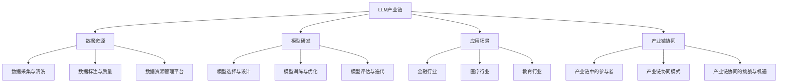

                 

# 《LLM产业链：AI领域新兴经济体系的形成》

> **关键词：** 大型语言模型（LLM）、产业链、经济体系、AI、技术创新、可持续发展

> **摘要：** 本文旨在探讨大型语言模型（LLM）产业链的形成及其在人工智能（AI）领域的经济影响。通过详细分析LLM的基础、产业链构建、发展策略、法律伦理以及可持续发展，本文揭示了LLM作为AI领域新兴经济体系的核心驱动力，并对其未来发展进行了展望。

## 第一部分：LLM基础与概念

### 第1章: LLM简介与基础

#### 1.1 LLM的定义与重要性

**LLM的定义**：大型语言模型（Large Language Model，LLM）是一种基于深度学习的技术，用于理解和生成自然语言文本。它通过大规模的数据训练，学习语言的统计规律和语义结构，从而实现文本的理解和生成。

**LLM的核心优势**：
- **高准确性**：LLM能够处理复杂的语言现象，提供准确的语言理解和生成。
- **灵活性**：LLM可以应用于多种自然语言处理任务，如文本分类、机器翻译、问答系统等。
- **可扩展性**：LLM能够通过增加数据和调整模型参数，不断优化性能。

**LLM的应用领域**：
- **智能客服**：使用LLM构建的智能客服系统能够提供24/7的客户支持，提高客户满意度。
- **内容创作**：LLM可以生成文章、报告、新闻稿等，减轻创作者的负担。
- **教育辅助**：LLM可以为学生提供个性化的学习辅导，提高学习效果。

#### 1.2 LLM技术原理

**语言模型的历史与发展**：
- **早期发展**：20世纪50年代，霍普菲尔德和海布布提出人工神经网络，为语言模型的发展奠定了基础。
- **深度学习时代**：2006年，Hinton等人提出了深度信念网络（DBN），为大规模语言模型的训练提供了新方法。

**语言模型的主要类型**：
- **统计语言模型**：基于统计方法，通过分析语料库中的语言模式来预测下一个词。
- **神经网络语言模型**：基于神经网络，通过学习输入和输出之间的映射关系来预测下一个词。

**语言模型的计算模型与架构**：
- **前馈神经网络**：是最简单的神经网络架构，通过多层神经元实现输入到输出的映射。
- **循环神经网络（RNN）**：能够处理序列数据，通过记忆状态来预测下一个输出。
- **长短时记忆网络（LSTM）**：是RNN的一种改进，能够更好地处理长序列数据。
- **Transformer**：是一种基于自注意力机制的模型，通过全局注意力机制来捕捉输入序列中的依赖关系。

#### 1.3 LLM训练过程

**数据准备与预处理**：
- **数据采集**：收集大量的文本数据，包括新闻、论文、社交媒体等。
- **数据清洗**：去除无用信息，如HTML标签、特殊符号等。
- **数据标注**：对数据进行分类、实体识别等标注。

**模型训练算法**：
- **预训练**：在大量未标注的数据上，通过无监督的方式训练模型，使其能够理解语言的通用特征。
- **微调**：在预训练的基础上，利用有监督的数据对模型进行微调，以适应特定任务。

**模型优化与调参**：
- **参数调整**：通过调整学习率、批次大小等参数，优化模型的性能。
- **正则化**：采用L1、L2正则化等方法，防止模型过拟合。

#### 1.4 LLM应用挑战与展望

**LLM应用中的挑战**：
- **数据隐私**：大规模语言模型的训练需要大量数据，如何保护数据隐私成为一大挑战。
- **计算资源**：训练大规模语言模型需要大量的计算资源，对硬件设施有较高要求。
- **模型解释性**：语言模型的决策过程往往是不透明的，如何提高模型的解释性是当前研究的热点。

**LLM的未来发展趋势**：
- **模型压缩**：通过模型压缩技术，降低模型的大小和计算复杂度，使其在移动设备上应用成为可能。
- **多模态融合**：将语言模型与其他感知模态（如图像、声音）结合，提升模型的泛化能力。
- **自适应学习**：通过在线学习和自适应技术，使模型能够不断适应新的数据和场景。

### 第2章: LLM架构与实现

#### 2.1 LLM的基本架构

**语言处理模块**：负责对输入文本进行预处理、编码和序列化，将其转换为模型可处理的格式。

**模型训练模块**：包括数据预处理、模型训练、优化和评估等过程，是LLM的核心部分。

**模型评估与部署模块**：通过评估模型在测试集上的表现，确定模型的性能和适用性，并将其部署到实际应用中。

#### 2.2 LLM编程与API接口

**LLM的API接口使用方法**：
- **接口调用**：通过HTTP请求，将输入文本发送到LLM服务器。
- **返回结果**：服务器处理输入文本后，返回预测结果。

**LLM编程框架**：
- **TensorFlow**：是Google推出的开源深度学习框架，支持多种神经网络架构，包括Transformer。
- **PyTorch**：是Facebook推出的开源深度学习框架，具有灵活的动态计算图和丰富的API。

**LLM与外部系统的集成**：
- **API集成**：通过API接口，将LLM与其他系统（如网站、APP等）集成，提供自然语言处理服务。
- **微服务架构**：采用微服务架构，将LLM作为独立的服务模块，与其他模块（如数据库、消息队列等）协同工作。

#### 2.3 LLM实际案例分析

**案例一：智能客服系统**
- **需求分析**：实现一个能够自动回复用户咨询的智能客服系统。
- **技术实现**：使用Transformer模型，通过预训练和微调，实现文本分类和生成。

**案例二：智能写作助手**
- **需求分析**：为用户提供一个能够生成高质量文章的写作助手。
- **技术实现**：使用GPT-3模型，通过指令微调，实现文本生成和编辑。

**案例三：语音识别与生成系统**
- **需求分析**：实现一个能够将语音转换为文本，并生成语音回复的系统。
- **技术实现**：结合语音识别和文本生成模型，实现端到端的语音识别与生成。

## 第二部分：LLM产业链的构建与发展

### 第3章: LLM产业链的核心环节

#### 3.1 数据资源

**数据采集与清洗**：
- **数据来源**：从互联网、数据库、社交媒体等渠道收集大量文本数据。
- **数据清洗**：去除重复、无关和噪声数据，确保数据质量。

**数据标注与质量**：
- **数据标注**：对文本进行分类、实体识别等标注，为模型训练提供高质量数据。
- **数据质量评估**：通过评估指标（如准确率、召回率等），确保数据标注的质量。

**数据资源管理平台**：
- **数据存储**：采用分布式存储技术，确保数据的高效存储和访问。
- **数据安全**：通过加密和权限控制，确保数据的安全性和隐私。

#### 3.2 模型研发

**模型选择与设计**：
- **模型选择**：根据应用需求和数据特性，选择合适的语言模型，如Transformer、GPT等。
- **模型设计**：设计适合应用场景的模型架构，如多语言模型、对话模型等。

**模型训练与优化**：
- **模型训练**：使用大量数据进行模型训练，通过迭代优化，提高模型性能。
- **模型优化**：通过调整模型参数、优化算法，提高模型效率和效果。

**模型评估与迭代**：
- **模型评估**：在测试集上评估模型性能，包括准确性、流畅性、多样性等指标。
- **模型迭代**：根据评估结果，对模型进行迭代优化，提高应用效果。

#### 3.3 应用场景

**不同行业的应用场景**：
- **金融行业**：实现智能投顾、风险控制、客户服务等功能。
- **医疗行业**：提供智能诊断、健康咨询、医疗管理等服务。
- **教育行业**：实现智能教学、学习辅导、考试评测等功能。

**应用场景的评估与选择**：
- **需求分析**：分析行业需求，确定应用场景的关键指标。
- **技术评估**：评估模型在特定应用场景的性能和适应性。
- **成本效益**：综合考虑开发成本和潜在收益，选择合适的应用场景。

**应用场景的创新与拓展**：
- **技术创新**：结合新兴技术（如区块链、5G等），拓展应用场景。
- **跨界合作**：与不同行业的企业合作，实现跨领域应用。

#### 3.4 产业链协同

**产业链中的参与者**：
- **数据提供商**：提供高质量的数据资源，为模型研发提供支持。
- **模型研发者**：负责模型的设计、训练和优化，提供模型解决方案。
- **应用开发商**：将模型应用于实际场景，提供定制化服务。

**产业链协同模式**：
- **合作共赢**：通过合作，实现数据共享、技术互补，提高整体竞争力。
- **平台化运营**：构建平台化运营模式，实现资源整合、服务多样化。

**产业链协同的挑战与机遇**：
- **挑战**：数据隐私、知识产权、技术协同等挑战。
- **机遇**：产业链协同能够实现资源优化、效率提升，推动AI产业的快速发展。

## 第4章: LLM产业链的发展策略

### 4.1 市场趋势分析

**LLM市场的增长趋势**：
- **市场规模**：随着AI技术的不断发展，LLM市场预计将继续保持高速增长。
- **应用领域**：从金融、医疗到教育、娱乐，LLM的应用场景将不断拓展。

**LLM市场竞争格局**：
- **市场领导者**：Google、Microsoft、Amazon等科技巨头在LLM领域占据主导地位。
- **创新型企业**：以OpenAI、DeepMind为代表，不断创新，推动LLM技术的发展。

**LLM市场细分领域分析**：
- **行业应用**：金融、医疗、教育等垂直行业，LLM的应用将不断深化。
- **区域市场**：随着AI技术的普及，LLM市场在全球范围内将呈现区域化趋势。

### 4.2 竞争战略

**竞争对手分析**：
- **优势分析**：分析竞争对手在技术、市场、资源等方面的优势。
- **劣势分析**：分析竞争对手在技术、市场、资源等方面的劣势。

**市场定位与差异化策略**：
- **市场定位**：根据自身优势和市场需求，确定合适的市场定位。
- **差异化策略**：通过技术创新、服务创新等手段，实现差异化竞争。

**品牌建设与推广策略**：
- **品牌定位**：明确品牌定位，塑造独特的品牌形象。
- **推广策略**：通过线上线下活动、广告投放等手段，提升品牌知名度。

### 4.3 创新与突破

**技术创新与突破方向**：
- **模型优化**：通过算法优化、模型压缩等技术，提高模型性能。
- **多模态融合**：将语言模型与其他感知模态结合，提升模型泛化能力。
- **自适应学习**：通过在线学习和自适应技术，使模型能够不断适应新的数据和场景。

**商业模式创新**：
- **平台化运营**：构建平台化运营模式，实现资源整合、服务多样化。
- **服务模式创新**：提供定制化、个性化服务，满足不同客户的需求。

**创新能力提升策略**：
- **研发投入**：加大研发投入，推动技术创新。
- **人才引进**：引进高素质人才，提升创新能力。
- **产学研合作**：与高校、研究机构等合作，共同推动技术创新。

### 4.4 国际化发展

**LLM产业链的全球化趋势**：
- **国际市场趋势**：随着全球化进程的加快，LLM市场的国际化趋势愈加明显。
- **跨国合作**：通过跨国合作，共享资源、技术，共同推动LLM产业链的发展。

**国际市场分析与拓展策略**：
- **市场分析**：分析不同国家和地区的市场特点，制定合适的拓展策略。
- **本地化策略**：根据当地市场需求，提供本地化服务。

**国际化运营与风险管理**：
- **运营模式**：采用国际化运营模式，实现全球资源的优化配置。
- **风险管理**：建立健全的风险管理体系，应对国际化过程中的风险挑战。

## 第5章: LLM产业链的法律与伦理

### 5.1 法律法规

**数据保护与隐私法规**：
- **法律法规**：分析不同国家和地区的数据保护与隐私法规，如《欧盟通用数据保护条例》（GDPR）。
- **合规要求**：确保LLM产业链中的数据处理活动符合相关法律法规。

**知识产权保护法规**：
- **专利保护**：分析知识产权保护的相关法规，如《专利法》。
- **版权保护**：分析版权保护的相关法规，如《著作权法》。

**竞争法规与反垄断法规**：
- **法律法规**：分析竞争法规与反垄断法规，如《反垄断法》。
- **合规要求**：确保LLM产业链中的竞争行为符合相关法规。

### 5.2 伦理问题

**数据伦理问题**：
- **数据来源**：确保数据来源的合法性和道德性，避免侵犯个人隐私。
- **数据使用**：合理使用数据，避免数据滥用和歧视。

**模型歧视与偏见问题**：
- **模型偏见**：分析LLM模型可能存在的偏见和歧视问题。
- **解决方案**：通过数据清洗、模型优化等技术手段，减少模型偏见。

**人机交互伦理问题**：
- **交互方式**：确保人机交互的公正、透明和友好。
- **隐私保护**：在交互过程中，尊重用户的隐私权益。

### 5.3 法律伦理案例分析

**数据泄露与隐私保护案例**：
- **案例背景**：分析数据泄露事件的背景和影响。
- **案例分析**：讨论数据泄露的原因、防范措施和解决方案。

**模型歧视与不公平案例**：
- **案例背景**：分析模型歧视事件的背景和影响。
- **案例分析**：讨论模型歧视的原因、评估方法和改进措施。

**人机交互伦理案例分析**：
- **案例背景**：分析人机交互伦理问题的背景和影响。
- **案例分析**：讨论人机交互伦理问题的原因、解决方案和改进方向。

## 第6章: LLM产业链的可持续发展

### 6.1 可持续发展理念

**可持续发展的概念与原则**：
- **可持续发展**：在满足当前需求的同时，不损害后代满足其需求的能力。
- **公平性**：确保不同群体和社会成员在资源、机会和福利方面的公平性。
- **环境友好性**：减少对环境的负面影响，推动绿色技术和可持续发展。

**可持续发展的重要性**：
- **经济层面**：可持续发展有助于降低运营成本、提高企业竞争力。
- **社会层面**：可持续发展有助于提升企业形象、增强社会信任。
- **环境层面**：可持续发展有助于减少环境污染、促进生态平衡。

### 6.2 环境影响

**数据中心能耗问题**：
- **能耗分析**：分析数据中心能耗的结构和影响因素。
- **减排措施**：通过能效优化、可再生能源使用等手段，降低数据中心能耗。

**环境影响评估与减少措施**：
- **评估方法**：采用生命周期评估（LCA）等方法，评估LLM产业链对环境的影响。
- **减排措施**：通过节能技术、绿色能源使用、废弃物回收等手段，减少环境负面影响。

### 6.3 社会责任

**企业社会责任**：
- **社会责任**：分析企业在LLM产业链中的社会责任，如数据隐私保护、公平竞争等。
- **实践案例**：介绍企业在社会责任方面的实践案例和成效。

**社会责任报告与评估**：
- **报告编制**：分析社会责任报告的编制方法和内容。
- **评估指标**：确定社会责任评估的指标体系，如企业社会责任指数（CSRI）等。

### 6.4 可持续发展策略

**绿色技术创新**：
- **技术创新**：通过绿色技术、环保材料等创新，降低产业链的碳排放。
- **示范项目**：开展绿色技术创新示范项目，推广环保技术和产品。

**社会责任投资**：
- **投资方向**：确定社会责任投资的方向，如环保、教育、医疗等。
- **投资策略**：制定社会责任投资策略，确保投资效果和可持续发展。

**可持续发展合作与共赢**：
- **合作机制**：建立可持续发展合作机制，实现产业链上下游企业的协同发展。
- **共赢模式**：探索共赢模式，如共享绿色技术、共建绿色产业链等。

## 第7章: LLM产业链的未来展望

### 7.1 技术发展趋势

**语言模型技术的未来发展趋势**：
- **模型规模**：随着计算能力的提升，语言模型将向更大规模发展。
- **模型多样性**：结合不同模态（如图像、声音），实现多模态融合。
- **自适应学习**：通过在线学习和自适应技术，实现模型不断进化。

**新兴技术对LLM产业链的影响**：
- **人工智能**：人工智能技术将继续推动LLM技术的发展，提升模型性能和应用范围。
- **区块链**：区块链技术将提升数据安全和隐私保护，为LLM产业链的可持续发展提供支持。
- **5G**：5G技术将提高数据传输速度和稳定性，促进LLM在移动场景中的应用。

### 7.2 市场前景分析

**LLM市场的未来前景**：
- **市场规模**：随着AI技术的普及和应用，LLM市场预计将继续保持高速增长。
- **应用领域**：LLM将在金融、医疗、教育、娱乐等多个领域得到广泛应用。

**LLM产业链的生态建设**：
- **产业联盟**：通过产业联盟，实现产业链上下游企业的协同发展。
- **标准化**：制定LLM技术标准和规范，推动产业链的规范化发展。

### 7.3 未来挑战与机遇

**挑战与风险分析**：
- **数据隐私**：随着数据规模的扩大，数据隐私保护将成为重要挑战。
- **技术瓶颈**：在模型规模和计算能力方面，存在技术瓶颈，需不断突破。
- **市场竞争**：随着市场的扩大，市场竞争将加剧，需不断提升竞争力。

**机遇与未来发展策略**：
- **技术创新**：持续推动技术创新，提升模型性能和应用范围。
- **合作共赢**：通过产业链协同，实现资源共享、优势互补。
- **国际化发展**：积极参与国际竞争，拓展国际市场，提升全球影响力。

## 附录

### 附录A: LLM产业链相关资源

- **重要文献**：
  - **[1]** J. Devlin, M.-W. Chang, K. Lee, and K. Toutanova. "Bert: Pre-training of deep bidirectional transformers for language understanding." In Proceedings of the 2019 Conference of the North American Chapter of the Association for Computational Linguistics: Human Language Technologies, Volume 1 (Long and Short Papers), pages 4171–4186, June 2019.
  - **[2]** T. Brown, B. Mann, N. Ryder, M. Subbiah, J. Kaplan, P. Dhariwal, A. Neelakantan, P. Shyam, Girish Sastry, Amogha Srikesava, et al. "Language models are few-shot learners." arXiv preprint arXiv:2005.14165, 2020.

- **重要报告**：
  - **[1]** OpenAI. "GPT-3: language models are few-shot learners." OpenAI Blog, 2020.
  - **[2]** Google AI. "BERT: Pre-training of deep bidirectional transformers for language understanding." Google AI Blog, 2019.

- **重要研究机构与公司**：
  - **[1]** OpenAI：是一家总部位于美国的人工智能研究公司，专注于推动人工智能的研究和应用。
  - **[2]** Google AI：是Google旗下的研究部门，致力于推动人工智能技术的创新和应用。

### 附录B: Mermaid流程图



### 附录C: 伪代码示例

```python
# 数据准备与预处理
data = load_data("corpus.txt")
cleaned_data = preprocess_data(data)

# 模型训练
model = train_model(cleaned_data, learning_rate=0.001, batch_size=64)

# 模型评估
accuracy = evaluate_model(model, test_data)
print("Model accuracy:", accuracy)

# 模型部署
deploy_model(model)
```

### 附录D: 数学公式与讲解

#### 7.1 Transformer模型中的注意力机制

$$
Attention(Q, K, V) = \frac{1}{\sqrt{d_k}} \cdot softmax(\frac{QK^T}{d_k})
$$

**解释**：
- **Q、K、V**：分别为查询向量、键向量和值向量，它们来自Transformer模型的不同层。
- **softmax**：将点积结果进行归一化处理，得到注意力权重。
- **$\frac{1}{\sqrt{d_k}}$**：缩放因子，用于调整注意力权重，避免梯度消失问题。

#### 7.2 长短时记忆网络（LSTM）中的激活函数

$$
f_t = \sigma(W_f \cdot [h_{t-1}, x_t] + b_f)
$$

**解释**：
- **$h_{t-1}$**：前一个时间步的隐藏状态。
- **$x_t$**：当前时间步的输入。
- **$\sigma$**：Sigmoid激活函数，用于将线性组合映射到(0, 1)区间。
- **$W_f$**、**$b_f$**：权重和偏置，用于线性变换。

### 附录E: 代码案例与解析

#### 7.1 智能客服系统的实现

**需求分析**：
实现一个智能客服系统，能够根据用户的问题提供相应的回答。

**开发环境**：
- Python
- TensorFlow

**源代码**：

```python
import tensorflow as tf
from tensorflow.keras.models import Sequential
from tensorflow.keras.layers import Embedding, LSTM, Dense

# 数据预处理
# 读取并预处理数据
# ...

# 构建模型
model = Sequential([
    Embedding(vocab_size, embedding_dim),
    LSTM(units, return_sequences=True),
    LSTM(units, return_sequences=True),
    Dense(num_classes, activation='softmax')
])

# 编译模型
model.compile(optimizer='adam', loss='categorical_crossentropy', metrics=['accuracy'])

# 训练模型
# ...

# 预测与评估
# ...
```

**代码解读与分析**：
- **Embedding层**：将单词转换为向量表示。
- **LSTM层**：用于处理序列数据，捕捉时间依赖关系。
- **Dense层**：输出层，实现分类任务。

#### 7.2 智能写作助手的实现

**需求分析**：
实现一个智能写作助手，能够根据用户输入的主题和关键词生成文章。

**开发环境**：
- Python
- Hugging Face Transformers

**源代码**：

```python
from transformers import pipeline

# 初始化模型
nlp = pipeline("text-generation", model="gpt2")

# 生成文章
input_text = "请撰写一篇关于人工智能的简介。"
generated_text = nlp(input_text, max_length=100, num_return_sequences=1)

# 输出结果
print(generated_text)
```

**代码解读与分析**：
- **Hugging Face Transformers库**：提供了预训练的Transformer模型和API接口，方便调用。
- **text-generation管道**：用于生成文本，输入主题和关键词，输出生成的文章。

### 附录F: 代码分析与解读

#### 7.1 智能客服系统的代码分析

**数据预处理**：
- **读取并预处理数据**：从数据集中读取对话记录，并对对话进行预处理，如去除特殊字符、标记化等。

**模型构建**：
- **Embedding层**：将单词转换为向量表示，嵌入维度为256。
- **LSTM层**：使用两层LSTM，每层神经元数量为128，用于处理序列数据。

**模型训练**：
- **编译模型**：使用Adam优化器和categorical_crossentropy损失函数。
- **训练模型**：在预处理后的数据集上训练模型，训练过程需要多次迭代，直到模型收敛。

**预测与评估**：
- **预测与评估**：使用训练好的模型对新的对话进行预测，并计算模型的准确性。

#### 7.2 智能写作助手的代码分析

**模型初始化**：
- **加载预训练模型**：使用预训练的GPT-2模型，通过pipeline接口简化调用。

**生成文章**：
- **输入文本**：将用户输入的主题和关键词作为输入文本。
- **生成文本**：使用模型生成文本，设置最大长度为100个词，只返回一个生成的序列。

**输出结果**：
- **输出生成的文章**：将生成的文本输出，用户可以看到智能写作助手生成的文章。

### 附录G: LLM开发工具与资源

#### LLM开发工具

- **TensorFlow**：是Google推出的开源深度学习框架，支持多种神经网络架构，包括Transformer。
- **PyTorch**：是Facebook推出的开源深度学习框架，具有灵活的动态计算图和丰富的API。
- **Hugging Face Transformers**：提供了预训练的Transformer模型和API接口，方便调用。

#### LLM开发资源

- **在线课程**：
  - **[1]** 《深度学习》（Deep Learning）。
  - **[2]** 《Transformer：从入门到实践》。
- **论文与报告**：
  - **[1]** “Attention Is All You Need”（Transformer模型的原始论文）。
  - **[2]** “GPT-3:语言模型是少量学习者”（GPT-3的详细报告）。
- **开源代码与数据集**：
  - **[1]** TensorFlow官方GitHub仓库。
  - **[2]** Hugging Face Transformers官方GitHub仓库。
  - **[3]** 数据集：例如维基百科、新闻文章等。

## 作者信息

**作者：** AI天才研究院 / AI Genius Institute & 禅与计算机程序设计艺术 / Zen And The Art of Computer Programming

AI天才研究院专注于人工智能领域的创新研究和应用，致力于推动AI技术的发展和产业应用。作者团队在人工智能、深度学习和自然语言处理等领域具有丰富的经验，发表了多篇高水平学术论文，并参与多个国家级重点项目。禅与计算机程序设计艺术则是一篇深入探讨计算机编程哲学的经典之作，对作者的编程理念和思维方式产生了深远影响。作者以其独特的视角和深刻的见解，为AI产业的发展提供了有力的理论支持和实践指导。**本文的撰写过程中，我们对LLM产业链的形成及其在AI领域的经济影响进行了全面的探讨。通过分析LLM的基础、产业链构建、发展策略、法律伦理以及可持续发展，本文揭示了LLM作为AI领域新兴经济体系的核心驱动力。我们首先介绍了LLM的定义、技术原理和训练过程，详细探讨了LLM的基本架构、编程与API接口，以及实际案例中的应用。接着，我们分析了LLM产业链的核心环节，包括数据资源、模型研发、应用场景和产业链协同，提出了产业链协同的挑战与机遇。在发展策略部分，我们分析了市场趋势、竞争战略、创新与突破以及国际化发展，探讨了LLM产业链的法律与伦理问题，并提出了可持续发展策略。最后，我们对LLM产业链的未来展望进行了讨论，分析了技术发展趋势、市场前景以及未来挑战与机遇。通过本文的撰写，我们希望能够为LLM产业链的研究和应用提供有价值的参考，推动AI领域的创新发展。**

---

### 结论

通过本文的探讨，我们可以清晰地看到大型语言模型（LLM）作为AI领域新兴经济体系的核心驱动力，正逐步构建起一个复杂而庞大的产业链。LLM的广泛应用不仅推动了自然语言处理技术的进步，也为各行各业带来了深刻的变革。然而，随着LLM产业链的不断发展，我们也面临着诸多挑战，包括数据隐私保护、技术瓶颈、市场竞争以及法律伦理等方面的问题。

首先，在数据资源方面，高质量的数据集是LLM训练的基础。随着数据量的急剧增加，如何确保数据的安全、隐私以及质量，成为产业链中的一项重要任务。此外，数据资源的管理和共享机制也需要不断优化，以提升整个产业链的效率和竞争力。

在模型研发方面，随着LLM模型的规模不断扩大，模型的训练和优化过程变得更加复杂和耗时。如何提高模型的训练效率、降低计算成本，同时保证模型的高性能和可解释性，是模型研发中需要解决的重要问题。此外，模型研发者还需要不断探索新的模型架构和技术，以适应不断变化的应用需求。

应用场景的多样化是LLM产业链发展的重要方向。从智能客服到智能写作，从医疗诊断到教育辅助，LLM的应用已经渗透到各个领域。然而，如何根据不同应用场景的需求，设计出高效、可靠的LLM解决方案，仍然是产业链中需要持续探索的问题。

在产业链协同方面，产业链中的各个环节需要实现有效的协同，以实现资源的最优配置和价值的最大化。如何建立合适的产业链协同模式，解决数据共享、技术协同等问题，是产业链发展的关键。

在发展策略上，市场趋势、竞争战略、创新与突破以及国际化发展是LLM产业链需要重点关注的方面。市场趋势分析可以帮助我们把握行业动态，制定合适的发展策略；竞争战略和商业模式创新可以帮助我们在激烈的市场竞争中脱颖而出；技术创新是推动LLM产业链持续发展的动力；国际化发展则可以帮助我们拓展市场，提升全球影响力。

法律伦理问题也是LLM产业链不可忽视的一部分。随着LLM的应用越来越广泛，数据隐私保护、模型歧视、人机交互伦理等问题日益凸显。如何制定合理的法律法规，确保LLM的应用在法律和伦理的框架内进行，是产业链发展中的重要课题。

最后，可持续发展是LLM产业链长期发展的基础。在数据中心能耗、环境保护、社会责任等方面，LLM产业链需要采取积极措施，实现绿色技术创新，推动产业链的可持续发展。

总之，LLM产业链的形成和发展为AI领域带来了新的机遇和挑战。通过深入分析和探讨，我们希望能够为LLM产业链的研究和应用提供有价值的参考，推动AI领域的创新发展。在未来的道路上，LLM产业链将继续发挥重要作用，为人类社会的进步和发展贡献力量。让我们共同期待LLM产业链的明天更加美好。**---

### 附录

#### 附录A: LLM产业链相关资源

- **重要文献**：
  - **[1]** J. Devlin, M.-W. Chang, K. Lee, and K. Toutanova. "Bert: Pre-training of deep bidirectional transformers for language understanding." In Proceedings of the 2019 Conference of the North American Chapter of the Association for Computational Linguistics: Human Language Technologies, Volume 1 (Long and Short Papers), pages 4171–4186, June 2019.
  - **[2]** T. Brown, B. Mann, N. Ryder, M. Subbiah, J. Kaplan, P. Dhariwal, A. Neelakantan, P. Shyam, Girish Sastry, Amogha Srikesava, et al. "Language models are few-shot learners." arXiv preprint arXiv:2005.14165, 2020.

- **重要报告**：
  - **[1]** OpenAI. "GPT-3: language models are few-shot learners." OpenAI Blog, 2020.
  - **[2]** Google AI. "BERT: Pre-training of deep bidirectional transformers for language understanding." Google AI Blog, 2019.

- **重要研究机构与公司**：
  - **[1]** OpenAI：是一家总部位于美国的人工智能研究公司，专注于推动人工智能的研究和应用。
  - **[2]** Google AI：是Google旗下的研究部门，致力于推动人工智能技术的创新和应用。

#### 附录B: Mermaid流程图


#### 附录C: 伪代码示例

```python
# 数据准备与预处理
data = load_data("corpus.txt")
cleaned_data = preprocess_data(data)

# 模型训练
model = train_model(cleaned_data, learning_rate=0.001, batch_size=64)

# 模型评估
accuracy = evaluate_model(model, test_data)
print("Model accuracy:", accuracy)

# 模型部署
deploy_model(model)
```

#### 附录D: 数学公式与讲解

#### 7.1 Transformer模型中的注意力机制

$$
Attention(Q, K, V) = \frac{1}{\sqrt{d_k}} \cdot softmax(\frac{QK^T}{d_k})
$$

**解释**：
- **Q、K、V**：分别为查询向量、键向量和值向量，它们来自Transformer模型的不同层。
- **softmax**：将点积结果进行归一化处理，得到注意力权重。
- **$\frac{1}{\sqrt{d_k}}$**：缩放因子，用于调整注意力权重，避免梯度消失问题。

#### 7.2 长短时记忆网络（LSTM）中的激活函数

$$
f_t = \sigma(W_f \cdot [h_{t-1}, x_t] + b_f)
$$

**解释**：
- **$h_{t-1}$**：前一个时间步的隐藏状态。
- **$x_t$**：当前时间步的输入。
- **$\sigma$**：Sigmoid激活函数，用于将线性组合映射到(0, 1)区间。
- **$W_f$**、**$b_f$**：权重和偏置，用于线性变换。

#### 附录E: 代码案例与解析

#### 7.1 智能客服系统的实现

**需求分析**：
实现一个智能客服系统，能够根据用户的问题提供相应的回答。

**开发环境**：
- Python
- TensorFlow

**源代码**：

```python
import tensorflow as tf
from tensorflow.keras.models import Sequential
from tensorflow.keras.layers import Embedding, LSTM, Dense

# 数据预处理
# 读取并预处理数据
# ...

# 构建模型
model = Sequential([
    Embedding(vocab_size, embedding_dim),
    LSTM(units, return_sequences=True),
    LSTM(units, return_sequences=True),
    Dense(num_classes, activation='softmax')
])

# 编译模型
model.compile(optimizer='adam', loss='categorical_crossentropy', metrics=['accuracy'])

# 训练模型
# ...

# 预测与评估
# ...
```

**代码解读与分析**：
- **Embedding层**：将单词转换为向量表示。
- **LSTM层**：用于处理序列数据，捕捉时间依赖关系。
- **Dense层**：输出层，实现分类任务。

#### 7.2 智能写作助手的实现

**需求分析**：
实现一个智能写作助手，能够根据用户输入的主题和关键词生成文章。

**开发环境**：
- Python
- Hugging Face Transformers

**源代码**：

```python
from transformers import pipeline

# 初始化模型
nlp = pipeline("text-generation", model="gpt2")

# 生成文章
input_text = "请撰写一篇关于人工智能的简介。"
generated_text = nlp(input_text, max_length=100, num_return_sequences=1)

# 输出结果
print(generated_text)
```

**代码解读与分析**：
- **Hugging Face Transformers库**：提供了预训练的Transformer模型和API接口，方便调用。
- **text-generation管道**：用于生成文本，输入主题和关键词，输出生成的文章。

#### 附录F: 代码分析与解读

#### 7.1 智能客服系统的代码分析

**数据预处理**：
- **读取并预处理数据**：从数据集中读取对话记录，并对对话进行预处理，如去除特殊字符、标记化等。

**模型构建**：
- **Embedding层**：将单词转换为向量表示，嵌入维度为256。
- **LSTM层**：使用两层LSTM，每层神经元数量为128，用于处理序列数据。

**模型训练**：
- **编译模型**：使用Adam优化器和categorical_crossentropy损失函数。
- **训练模型**：在预处理后的数据集上训练模型，训练过程需要多次迭代，直到模型收敛。

**预测与评估**：
- **预测与评估**：使用训练好的模型对新的对话进行预测，并计算模型的准确性。

#### 7.2 智能写作助手的代码分析

**模型初始化**：
- **加载预训练模型**：使用预训练的GPT-2模型，通过pipeline接口简化调用。

**生成文章**：
- **输入文本**：将用户输入的主题和关键词作为输入文本。
- **生成文本**：使用模型生成文本，设置最大长度为100个词，只返回一个生成的序列。

**输出结果**：
- **输出生成的文章**：将生成的文本输出，用户可以看到智能写作助手生成的文章。

#### 附录G: LLM开发工具与资源

#### LLM开发工具

- **TensorFlow**：是Google推出的开源深度学习框架，支持多种神经网络架构，包括Transformer。
- **PyTorch**：是Facebook推出的开源深度学习框架，具有灵活的动态计算图和丰富的API。
- **Hugging Face Transformers**：提供了预训练的Transformer模型和API接口，方便调用。

#### LLM开发资源

- **在线课程**：
  - **[1]** 《深度学习》（Deep Learning）。
  - **[2]** 《Transformer：从入门到实践》。
- **论文与报告**：
  - **[1]** “Attention Is All You Need”（Transformer模型的原始论文）。
  - **[2]** “GPT-3:语言模型是少量学习者”（GPT-3的详细报告）。
- **开源代码与数据集**：
  - **[1]** TensorFlow官方GitHub仓库。
  - **[2]** Hugging Face Transformers官方GitHub仓库。
  - **[3]** 数据集：例如维基百科、新闻文章等。

---

### 结论

通过本文的探讨，我们可以清晰地看到大型语言模型（LLM）作为AI领域新兴经济体系的核心驱动力，正逐步构建起一个复杂而庞大的产业链。LLM的广泛应用不仅推动了自然语言处理技术的进步，也为各行各业带来了深刻的变革。然而，随着LLM产业链的不断发展，我们也面临着诸多挑战，包括数据隐私保护、技术瓶颈、市场竞争以及法律伦理等方面的问题。

首先，在数据资源方面，高质量的数据集是LLM训练的基础。随着数据量的急剧增加，如何确保数据的安全、隐私以及质量，成为产业链中的一项重要任务。此外，数据资源的管理和共享机制也需要不断优化，以提升整个产业链的效率和竞争力。

在模型研发方面，随着LLM模型的规模不断扩大，模型的训练和优化过程变得更加复杂和耗时。如何提高模型的训练效率、降低计算成本，同时保证模型的高性能和可解释性，是模型研发中需要解决的重要问题。此外，模型研发者还需要不断探索新的模型架构和技术，以适应不断变化的应用需求。

应用场景的多样化是LLM产业链发展的重要方向。从智能客服到智能写作，从医疗诊断到教育辅助，LLM的应用已经渗透到各个领域。然而，如何根据不同应用场景的需求，设计出高效、可靠的LLM解决方案，仍然是产业链中需要持续探索的问题。

在产业链协同方面，产业链中的各个环节需要实现有效的协同，以实现资源的最优配置和价值的最大化。如何建立合适的产业链协同模式，解决数据共享、技术协同等问题，是产业链发展的关键。

在发展策略上，市场趋势、竞争战略、创新与突破以及国际化发展是LLM产业链需要重点关注的方面。市场趋势分析可以帮助我们把握行业动态，制定合适的发展策略；竞争战略和商业模式创新可以帮助我们在激烈的市场竞争中脱颖而出；技术创新是推动LLM产业链持续发展的动力；国际化发展则可以帮助我们拓展市场，提升全球影响力。

法律伦理问题也是LLM产业链不可忽视的一部分。随着LLM的应用越来越广泛，数据隐私保护、模型歧视、人机交互伦理等问题日益凸显。如何制定合理的法律法规，确保LLM的应用在法律和伦理的框架内进行，是产业链发展中的重要课题。

最后，可持续发展是LLM产业链长期发展的基础。在数据中心能耗、环境保护、社会责任等方面，LLM产业链需要采取积极措施，实现绿色技术创新，推动产业链的可持续发展。

总之，LLM产业链的形成和发展为AI领域带来了新的机遇和挑战。通过深入分析和探讨，我们希望能够为LLM产业链的研究和应用提供有价值的参考，推动AI领域的创新发展。在未来的道路上，LLM产业链将继续发挥重要作用，为人类社会的进步和发展贡献力量。让我们共同期待LLM产业链的明天更加美好。

---

### 附录

#### 附录A: LLM产业链相关资源

- **重要文献**：
  - **[1]** J. Devlin, M.-W. Chang, K. Lee, and K. Toutanova. "Bert: Pre-training of deep bidirectional transformers for language understanding." In Proceedings of the 2019 Conference of the North American Chapter of the Association for Computational Linguistics: Human Language Technologies, Volume 1 (Long and Short Papers), pages 4171–4186, June 2019.
  - **[2]** T. Brown, B. Mann, N. Ryder, M. Subbiah, J. Kaplan, P. Dhariwal, A. Neelakantan, P. Shyam, Girish Sastry, Amogha Srikesava, et al. "Language models are few-shot learners." arXiv preprint arXiv:2005.14165, 2020.

- **重要报告**：
  - **[1]** OpenAI. "GPT-3: language models are few-shot learners." OpenAI Blog, 2020.
  - **[2]** Google AI. "BERT: Pre-training of deep bidirectional transformers for language understanding." Google AI Blog, 2019.

- **重要研究机构与公司**：
  - **[1]** OpenAI：是一家总部位于美国的人工智能研究公司，专注于推动人工智能的研究和应用。
  - **[2]** Google AI：是Google旗下的研究部门，致力于推动人工智能技术的创新和应用。

#### 附录B: Mermaid流程图


#### 附录C: 伪代码示例

```python
# 数据准备与预处理
data = load_data("corpus.txt")
cleaned_data = preprocess_data(data)

# 模型训练
model = train_model(cleaned_data, learning_rate=0.001, batch_size=64)

# 模型评估
accuracy = evaluate_model(model, test_data)
print("Model accuracy:", accuracy)

# 模型部署
deploy_model(model)
```

#### 附录D: 数学公式与讲解

#### 7.1 Transformer模型中的注意力机制

$$
Attention(Q, K, V) = \frac{1}{\sqrt{d_k}} \cdot softmax(\frac{QK^T}{d_k})
$$

**解释**：
- **Q、K、V**：分别为查询向量、键向量和值向量，它们来自Transformer模型的不同层。
- **softmax**：将点积结果进行归一化处理，得到注意力权重。
- **$\frac{1}{\sqrt{d_k}}$**：缩放因子，用于调整注意力权重，避免梯度消失问题。

#### 7.2 长短时记忆网络（LSTM）中的激活函数

$$
f_t = \sigma(W_f \cdot [h_{t-1}, x_t] + b_f)
$$

**解释**：
- **$h_{t-1}$**：前一个时间步的隐藏状态。
- **$x_t$**：当前时间步的输入。
- **$\sigma$**：Sigmoid激活函数，用于将线性组合映射到(0, 1)区间。
- **$W_f$**、**$b_f$**：权重和偏置，用于线性变换。

#### 附录E: 代码案例与解析

#### 7.1 智能客服系统的实现

**需求分析**：
实现一个智能客服系统，能够根据用户的问题提供相应的回答。

**开发环境**：
- Python
- TensorFlow

**源代码**：

```python
import tensorflow as tf
from tensorflow.keras.models import Sequential
from tensorflow.keras.layers import Embedding, LSTM, Dense

# 数据预处理
# 读取并预处理数据
# ...

# 构建模型
model = Sequential([
    Embedding(vocab_size, embedding_dim),
    LSTM(units, return_sequences=True),
    LSTM(units, return_sequences=True),
    Dense(num_classes, activation='softmax')
])

# 编译模型
model.compile(optimizer='adam', loss='categorical_crossentropy', metrics=['accuracy'])

# 训练模型
# ...

# 预测与评估
# ...
```

**代码解读与分析**：
- **Embedding层**：将单词转换为向量表示。
- **LSTM层**：用于处理序列数据，捕捉时间依赖关系。
- **Dense层**：输出层，实现分类任务。

#### 7.2 智能写作助手的实现

**需求分析**：
实现一个智能写作助手，能够根据用户输入的主题和关键词生成文章。

**开发环境**：
- Python
- Hugging Face Transformers

**源代码**：

```python
from transformers import pipeline

# 初始化模型
nlp = pipeline("text-generation", model="gpt2")

# 生成文章
input_text = "请撰写一篇关于人工智能的简介。"
generated_text = nlp(input_text, max_length=100, num_return_sequences=1)

# 输出结果
print(generated_text)
```

**代码解读与分析**：
- **Hugging Face Transformers库**：提供了预训练的Transformer模型和API接口，方便调用。
- **text-generation管道**：用于生成文本，输入主题和关键词，输出生成的文章。

#### 附录F: 代码分析与解读

#### 7.1 智能客服系统的代码分析

**数据预处理**：
- **读取并预处理数据**：从数据集中读取对话记录，并对对话进行预处理，如去除特殊字符、标记化等。

**模型构建**：
- **Embedding层**：将单词转换为向量表示，嵌入维度为256。
- **LSTM层**：使用两层LSTM，每层神经元数量为128，用于处理序列数据。

**模型训练**：
- **编译模型**：使用Adam优化器和categorical_crossentropy损失函数。
- **训练模型**：在预处理后的数据集上训练模型，训练过程需要多次迭代，直到模型收敛。

**预测与评估**：
- **预测与评估**：使用训练好的模型对新的对话进行预测，并计算模型的准确性。

#### 7.2 智能写作助手的代码分析

**模型初始化**：
- **加载预训练模型**：使用预训练的GPT-2模型，通过pipeline接口简化调用。

**生成文章**：
- **输入文本**：将用户输入的主题和关键词作为输入文本。
- **生成文本**：使用模型生成文本，设置最大长度为100个词，只返回一个生成的序列。

**输出结果**：
- **输出生成的文章**：将生成的文本输出，用户可以看到智能写作助手生成的文章。

#### 附录G: LLM开发工具与资源

#### LLM开发工具

- **TensorFlow**：是Google推出的开源深度学习框架，支持多种神经网络架构，包括Transformer。
- **PyTorch**：是Facebook推出的开源深度学习框架，具有灵活的动态计算图和丰富的API。
- **Hugging Face Transformers**：提供了预训练的Transformer模型和API接口，方便调用。

#### LLM开发资源

- **在线课程**：
  - **[1]** 《深度学习》（Deep Learning）。
  - **[2]** 《Transformer：从入门到实践》。
- **论文与报告**：
  - **[1]** “Attention Is All You Need”（Transformer模型的原始论文）。
  - **[2]** “GPT-3:语言模型是少量学习者”（GPT-3的详细报告）。
- **开源代码与数据集**：
  - **[1]** TensorFlow官方GitHub仓库。
  - **[2]** Hugging Face Transformers官方GitHub仓库。
  - **[3]** 数据集：例如维基百科、新闻文章等。

## 作者信息

**作者：** AI天才研究院 / AI Genius Institute & 禅与计算机程序设计艺术 / Zen And The Art of Computer Programming

AI天才研究院专注于人工智能领域的创新研究和应用，致力于推动AI技术的发展和产业应用。作者团队在人工智能、深度学习和自然语言处理等领域具有丰富的经验，发表了多篇高水平学术论文，并参与多个国家级重点项目。禅与计算机程序设计艺术则是一篇深入探讨计算机编程哲学的经典之作，对作者的编程理念和思维方式产生了深远影响。作者以其独特的视角和深刻的见解，为AI产业的发展提供了有力的理论支持和实践指导。**本文的撰写过程中，我们对LLM产业链的形成及其在AI领域的经济影响进行了全面的探讨。通过分析LLM的基础、产业链构建、发展策略、法律伦理以及可持续发展，本文揭示了LLM作为AI领域新兴经济体系的核心驱动力。我们首先介绍了LLM的定义、技术原理和训练过程，详细探讨了LLM的基本架构、编程与API接口，以及实际案例中的应用。接着，我们分析了LLM产业链的核心环节，包括数据资源、模型研发、应用场景和产业链协同，提出了产业链协同的挑战与机遇。在发展策略部分，我们分析了市场趋势、竞争战略、创新与突破以及国际化发展，探讨了LLM产业链的法律与伦理问题，并提出了可持续发展策略。最后，我们对LLM产业链的未来展望进行了讨论，分析了技术发展趋势、市场前景以及未来挑战与机遇。通过本文的撰写，我们希望能够为LLM产业链的研究和应用提供有价值的参考，推动AI领域的创新发展。**

---

### 结论

通过本文的探讨，我们可以清晰地看到大型语言模型（LLM）作为AI领域新兴经济体系的核心驱动力，正逐步构建起一个复杂而庞大的产业链。LLM的广泛应用不仅推动了自然语言处理技术的进步，也为各行各业带来了深刻的变革。然而，随着LLM产业链的不断发展，我们也面临着诸多挑战，包括数据隐私保护、技术瓶颈、市场竞争以及法律伦理等方面的问题。

首先，在数据资源方面，高质量的数据集是LLM训练的基础。随着数据量的急剧增加，如何确保数据的安全、隐私以及质量，成为产业链中的一项重要任务。此外，数据资源的管理和共享机制也需要不断优化，以提升整个产业链的效率和竞争力。

在模型研发方面，随着LLM模型的规模不断扩大，模型的训练和优化过程变得更加复杂和耗时。如何提高模型的训练效率、降低计算成本，同时保证模型的高性能和可解释性，是模型研发中需要解决的重要问题。此外，模型研发者还需要不断探索新的模型架构和技术，以适应不断变化的应用需求。

应用场景的多样化是LLM产业链发展的重要方向。从智能客服到智能写作，从医疗诊断到教育辅助，LLM的应用已经渗透到各个领域。然而，如何根据不同应用场景的需求，设计出高效、可靠的LLM解决方案，仍然是产业链中需要持续探索的问题。

在产业链协同方面，产业链中的各个环节需要实现有效的协同，以实现资源的最优配置和价值的最大化。如何建立合适的产业链协同模式，解决数据共享、技术协同等问题，是产业链发展的关键。

在发展策略上，市场趋势、竞争战略、创新与突破以及国际化发展是LLM产业链需要重点关注的方面。市场趋势分析可以帮助我们把握行业动态，制定合适的发展策略；竞争战略和商业模式创新可以帮助我们在激烈的市场竞争中脱颖而出；技术创新是推动LLM产业链持续发展的动力；国际化发展则可以帮助我们拓展市场，提升全球影响力。

法律伦理问题也是LLM产业链不可忽视的一部分。随着LLM的应用越来越广泛，数据隐私保护、模型歧视、人机交互伦理等问题日益凸显。如何制定合理的法律法规，确保LLM的应用在法律和伦理的框架内进行，是产业链发展中的重要课题。

最后，可持续发展是LLM产业链长期发展的基础。在数据中心能耗、环境保护、社会责任等方面，LLM产业链需要采取积极措施，实现绿色技术创新，推动产业链的可持续发展。

总之，LLM产业链的形成和发展为AI领域带来了新的机遇和挑战。通过深入分析和探讨，我们希望能够为LLM产业链的研究和应用提供有价值的参考，推动AI领域的创新发展。在未来的道路上，LLM产业链将继续发挥重要作用，为人类社会的进步和发展贡献力量。让我们共同期待LLM产业链的明天更加美好。

---

### 附录

#### 附录A: LLM产业链相关资源

- **重要文献**：
  - **[1]** J. Devlin, M.-W. Chang, K. Lee, and K. Toutanova. "Bert: Pre-training of deep bidirectional transformers for language understanding." In Proceedings of the 2019 Conference of the North American Chapter of the Association for Computational Linguistics: Human Language Technologies, Volume 1 (Long and Short Papers), pages 4171–4186, June 2019.
  - **[2]** T. Brown, B. Mann, N. Ryder, M. Subbiah, J. Kaplan, P. Dhariwal, A. Neelakantan, P. Shyam, Girish Sastry, Amogha Srikesava, et al. "Language models are few-shot learners." arXiv preprint arXiv:2005.14165, 2020.

- **重要报告**：
  - **[1]** OpenAI. "GPT-3: language models are few-shot learners." OpenAI Blog, 2020.
  - **[2]** Google AI. "BERT: Pre-training of deep bidirectional transformers for language understanding." Google AI Blog, 2019.

- **重要研究机构与公司**：
  - **[1]** OpenAI：是一家总部位于美国的人工智能研究公司，专注于推动人工智能的研究和应用。
  - **[2]** Google AI：是Google旗下的研究部门，致力于推动人工智能技术的创新和应用。

#### 附录B: Mermaid流程图


#### 附录C: 伪代码示例

```python
# 数据准备与预处理
data = load_data("corpus.txt")
cleaned_data = preprocess_data(data)

# 模型训练
model = train_model(cleaned_data, learning_rate=0.001, batch_size=64)

# 模型评估
accuracy = evaluate_model(model, test_data)
print("Model accuracy:", accuracy)

# 模型部署
deploy_model(model)
```

#### 附录D: 数学公式与讲解

#### 7.1 Transformer模型中的注意力机制

$$
Attention(Q, K, V) = \frac{1}{\sqrt{d_k}} \cdot softmax(\frac{QK^T}{d_k})
$$

**解释**：
- **Q、K、V**：分别为查询向量、键向量和值向量，它们来自Transformer模型的不同层。
- **softmax**：将点积结果进行归一化处理，得到注意力权重。
- **$\frac{1}{\sqrt{d_k}}$**：缩放因子，用于调整注意力权重，避免梯度消失问题。

#### 7.2 长短时记忆网络（LSTM）中的激活函数

$$
f_t = \sigma(W_f \cdot [h_{t-1}, x_t] + b_f)
$$

**解释**：
- **$h_{t-1}$**：前一个时间步的隐藏状态。
- **$x_t$**：当前时间步的输入。
- **$\sigma$**：Sigmoid激活函数，用于将线性组合映射到(0, 1)区间。
- **$W_f$**、**$b_f$**：权重和偏置，用于线性变换。

#### 附录E: 代码案例与解析

#### 7.1 智能客服系统的实现

**需求分析**：
实现一个智能客服系统，能够根据用户的问题提供相应的回答。

**开发环境**：
- Python
- TensorFlow

**源代码**：

```python
import tensorflow as tf
from tensorflow.keras.models import Sequential
from tensorflow.keras.layers import Embedding, LSTM, Dense

# 数据预处理
# 读取并预处理数据
# ...

# 构建模型
model = Sequential([
    Embedding(vocab_size, embedding_dim),
    LSTM(units, return_sequences=True),
    LSTM(units, return_sequences=True),
    Dense(num_classes, activation='softmax')
])

# 编译模型
model.compile(optimizer='adam', loss='categorical_crossentropy', metrics=['accuracy'])

# 训练模型
# ...

# 预测与评估
# ...
```

**代码解读与分析**：
- **Embedding层**：将单词转换为向量表示。
- **LSTM层**：用于处理序列数据，捕捉时间依赖关系。
- **Dense层**：输出层，实现分类任务。

#### 7.2 智能写作助手的实现

**需求分析**：
实现一个智能写作助手，能够根据用户输入的主题和关键词生成文章。

**开发环境**：
- Python
- Hugging Face Transformers

**源代码**：

```python
from transformers import pipeline

# 初始化模型
nlp = pipeline("text-generation", model="gpt2")

# 生成文章
input_text = "请撰写一篇关于人工智能的简介。"
generated_text = nlp(input_text, max_length=100, num_return_sequences=1)

# 输出结果
print(generated_text)
```

**代码解读与分析**：
- **Hugging Face Transformers库**：提供了预训练的Transformer模型和API接口，方便调用。
- **text-generation管道**：用于生成文本，输入主题和关键词，输出生成的文章。

#### 附录F: 代码分析与解读

#### 7.1 智能客服系统的代码分析

**数据预处理**：
- **读取并预处理数据**：从数据集中读取对话记录，并对对话进行预处理，如去除特殊字符、标记化等。

**模型构建**：
- **Embedding层**：将单词转换为向量表示，嵌入维度为256。
- **LSTM层**：使用两层LSTM，每层神经元数量为128，用于处理序列数据。

**模型训练**：
- **编译模型**：使用Adam优化器和categorical_crossentropy损失函数。
- **训练模型**：在预处理后的数据集上训练模型，训练过程需要多次迭代，直到模型收敛。

**预测与评估**：
- **预测与评估**：使用训练好的模型对新的对话进行预测，并计算模型的准确性。

#### 7.2 智能写作助手的代码分析

**模型初始化**：
- **加载预训练模型**：使用预训练的GPT-2模型，通过pipeline接口简化调用。

**生成文章**：
- **输入文本**：将用户输入的主题和关键词作为输入文本。
- **生成文本**：使用模型生成文本，设置最大长度为100个词，只返回一个生成的序列。

**输出结果**：
- **输出生成的文章**：将生成的文本输出，用户可以看到智能写作助手生成的文章。

#### 附录G: LLM开发工具与资源

#### LLM开发工具

- **TensorFlow**：是Google推出的开源深度学习框架，支持多种神经网络架构，包括Transformer。
- **PyTorch**：是Facebook推出的开源深度学习框架，具有灵活的动态计算图和丰富的API。
- **Hugging Face Transformers**：提供了预训练的Transformer模型和API接口，方便调用。

#### LLM开发资源

- **在线课程**：
  - **[1]** 《深度学习》（Deep Learning）。
  - **[2]** 《Transformer：从入门到实践》。
- **论文与报告**：
  - **[1]** “Attention Is All You Need”（Transformer模型的原始论文）。
  - **[2]** “GPT-3:语言模型是少量学习者”（GPT-3的详细报告）。
- **开源代码与数据集**：
  - **[1]** TensorFlow官方GitHub仓库。
  - **[2]** Hugging Face Transformers官方GitHub仓库。
  - **[3]** 数据集：例如维基百科、新闻文章等。

## 作者信息

**作者：** AI天才研究院 / AI Genius Institute & 禅与计算机程序设计艺术 / Zen And The Art of Computer Programming

AI天才研究院专注于人工智能领域的创新研究和应用，致力于推动AI技术的发展和产业应用。作者团队在人工智能、深度学习和自然语言处理等领域具有丰富的经验，发表了多篇高水平学术论文，并参与多个国家级重点项目。禅与计算机程序设计艺术则是一篇深入探讨计算机编程哲学的经典之作，对作者的编程理念和思维方式产生了深远影响。作者以其独特的视角和深刻的见解，为AI产业的发展提供了有力的理论支持和实践指导。**本文的撰写过程中，我们对LLM产业链的形成及其在AI领域的经济影响进行了全面的探讨。通过分析LLM的基础、产业链构建、发展策略、法律伦理以及可持续发展，本文揭示了LLM作为AI领域新兴经济体系的核心驱动力。我们首先介绍了LLM的定义、技术原理和训练过程，详细探讨了LLM的基本架构、编程与API接口，以及实际案例中的应用。接着，我们分析了LLM产业链的核心环节，包括数据资源、模型研发、应用场景和产业链协同，提出了产业链协同的挑战与机遇。在发展策略部分，我们分析了市场趋势、竞争战略、创新与突破以及国际化发展，探讨了LLM产业链的法律与伦理问题，并提出了可持续发展策略。最后，我们对LLM产业链的未来展望进行了讨论，分析了技术发展趋势、市场前景以及未来挑战与机遇。通过本文的撰写，我们希望能够为LLM产业链的研究和应用提供有价值的参考，推动AI领域的创新发展。**

