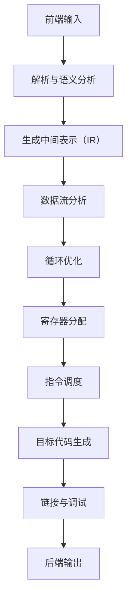

                 

## 引言

在现代软件工程中，性能优化是确保应用程序高效运行的关键因素。随着计算需求的日益增长，如何最大限度地提升代码执行速度和降低资源消耗成为开发者面临的重要挑战。在这一背景下，LLVM（Low-Level Virtual Machine）编译器作为性能优化的利器，受到了广泛关注。LLVM不仅具备强大的编译能力，还提供了丰富的优化技术，使得开发者能够显著提升代码性能。

本文将围绕 LLVM 优化展开，旨在为读者提供一份全面而深入的技术指南。首先，我们将介绍 LLVM 的基本架构和核心概念，帮助读者建立对 LLVM 的整体理解。接着，我们将探讨 LLVM 优化的策略和技术，详细讲解各种优化算法和原理。此外，本文还将深入探讨内存优化和性能评估方法，并通过实际案例展示 LLVM 优化的应用和实践。最后，我们将展望 LLVM 优化的发展趋势和未来方向。

本文的核心目标是通过逐步分析推理，帮助读者掌握 LLVM 优化的关键技术和实战方法，从而在项目中实现代码性能的显著提升。文章将按照以下结构展开：

1. **LLVM优化基础理论**：介绍 LLVM 的架构基础、优化策略和关键技术。
2. **算法与数据结构优化**：探讨算法优化原理和数据结构优化的方法与技巧。
3. **内存优化**：分析内存管理原理、内存访问优化以及内存泄露检测与修复。
4. **性能评估与调优**：讲解性能评估方法、性能调优策略和实际案例分析。
5. **LLVM优化在项目中的应用**：展示 LLVM 优化在大型数据处理、科学计算和图形渲染等领域的应用案例。
6. **LLVM优化趋势与未来**：探讨 LLVM 优化的趋势、挑战与机遇，及其在新兴领域的应用。

通过本文的阅读，读者将能够全面了解 LLVM 优化的原理和实践，掌握性能优化的关键技巧，并在实际项目中有效地提升代码性能。

## 关键词

**LLVM 优化，代码性能，编译器，性能评估，内存优化，算法优化，数据结构，编译原理，软件开发。**

## 摘要

本文旨在深入探讨 LLVM 优化技术，通过逐步分析和推理，全面解析 LLVM 的架构基础、优化策略、算法原理、内存管理以及性能评估方法。文章首先介绍了 LLVM 的历史和发展、模块化架构以及指令集，为后续内容奠定了基础。接着，详细讲解了 LLVM 优化的策略与目标、代码优化基础、常见优化技术以及优化器实现。随后，本文深入探讨了算法与数据结构优化原理、内存管理原理和性能评估方法，并通过实际案例展示了 LLVM 优化的应用和实践。最后，文章展望了 LLVM 优化的发展趋势和未来方向，探讨了其在新兴领域的应用。通过本文的阅读，读者将能够全面掌握 LLVM 优化的核心技术和实战方法，提升代码性能。

## 第一部分: LLVM优化基础理论

### 第1章: LLVM架构基础

#### 第1.1节 LLVM简介

#### 1.1.1 LLVM的历史和发展

LLVM（Low-Level Virtual Machine）是一个由美国加州大学伯克利分校和谷歌共同开发的开源编译器基础架构。它的起源可以追溯到2000年，当时加州大学伯克利分校的Chris Lattner教授和 Vikram Adve 博士开始了LLVM项目的开发。最初的目的是为了构建一个高性能的编译器，以支持C++等高级编程语言。经过多年的发展，LLVM已经成为一个功能强大且高度可扩展的编译器基础架构，广泛应用于各种平台和编程语言。

LLVM的发展历程可以分为几个关键阶段：

1. **初期开发**（2000-2004年）：LLVM最初是在C++语言中实现的，Chris Lattner教授在加州大学伯克利分校的博士论文中详细阐述了该项目的架构和设计理念。

2. **社区贡献**（2004-2008年）：随着LLVM项目的开源，越来越多的开发者加入到项目中，为LLVM贡献了大量的代码和优化技术。

3. **大规模应用**（2008-2012年）：在2008年，LLVM被谷歌收购，使其获得了更多的资源和支持。这一时期，LLVM开始被广泛应用于各种开源项目和商业应用中。

4. **持续发展**（2012年至今）：随着硬件和软件技术的不断发展，LLVM也在不断地更新和改进，增加了许多新的优化技术和语言支持。

#### 1.1.2 LLVM的目标和优势

LLVM的设计目标主要包括以下几个方面：

1. **高性能**：LLVM旨在通过高效的编译器和优化器实现应用程序的高性能。它采用模块化和组件化的设计，使得编译过程更加高效，优化的效果也更加显著。

2. **可扩展性**：LLVM的设计原则是高度可扩展的，允许开发者根据具体需求进行定制。无论是添加新的中间表示（IR），还是开发新的优化技术，LLVM都提供了灵活的接口和丰富的工具集。

3. **跨平台支持**：LLVM支持多种编程语言和平台，包括C、C++、Java、Python等。它通过抽象化的中间表示（IR），实现了跨平台编译和优化，使得开发者可以轻松地将代码移植到不同的操作系统和硬件平台上。

4. **社区驱动的开发**：LLVM的开源特性使得它能够吸引全球的开发者共同参与。通过社区的合作，LLVM不断吸收新的优化技术和改进建议，使得其性能和功能持续提升。

#### 1.1.3 LLVM的关键组件

LLVM由多个关键组件组成，这些组件共同协作，实现了高效的编译和优化过程。以下是 LLVM 的主要组件及其功能：

1. **前端（Frontend）**：前端负责将高级编程语言（如C、C++、Java等）转换为 LLVM 的中间表示（IR）。前端的主要任务包括语法分析、语义分析、代码生成等。

2. **中间表示（IR）**：中间表示（IR）是 LLVM 的核心组件，它将不同编程语言编译成统一的 IR，使得优化器能够对代码进行通用的优化处理。LLVM 的 IR 是一种低级、静态单赋值（SSA）形式的中间表示，具有良好的优化特性。

3. **优化器（Optimizer）**：优化器是 LLVM 的关键组件，负责对 IR 代码进行各种优化处理。优化器包括多个优化阶段，如死代码消除、循环优化、数据流优化等，旨在提高代码的执行效率。

4. **后端（Backend）**：后端负责将优化的 IR 代码转换为特定目标平台上的机器代码。后端包括目标特定的代码生成、寄存器分配、指令调度等功能。

5. **工具链（Toolchain）**：LLVM 提供了一套完整的工具链，包括编译器、链接器、调试器等，用于编译、链接和调试程序。这些工具链可以与前端和后端协同工作，实现高效的开发流程。

6. **运行时（Runtime）**：LLVM 的运行时组件负责管理程序的加载、执行和资源释放。它提供了内存管理、异常处理、线程管理等关键功能，确保程序的稳定和高效运行。

#### 1.1.4 LLVM的整体架构

LLVM 的整体架构采用模块化和组件化的设计，各个组件通过明确的接口进行交互。以下是一个简化的 LLVM 架构图：

```mermaid
graph LR
    A[前端] --> B[中间表示(IR)]
    B --> C[优化器]
    C --> D[后端]
    D --> E[工具链]
    E --> F[运行时]
```

在这个架构图中，前端将高级语言编译成 IR，然后通过优化器进行优化，最终由后端生成目标平台上的机器代码。工具链和运行时组件则负责编译、链接、调试和执行程序。

#### 1.1.5 LLVM的优势

LLVM 具有以下几个显著优势：

1. **高效优化**：LLVM 的优化器能够对代码进行深层次的优化，包括循环优化、数据流优化、死代码消除等，显著提高代码的执行效率。

2. **跨平台支持**：LLVM 支持多种编程语言和平台，通过统一的中间表示（IR），实现了跨平台编译和优化，使得开发者可以轻松地将代码移植到不同的操作系统和硬件平台上。

3. **高度可扩展**：LLVM 的模块化和组件化设计使得它高度可扩展，开发者可以根据具体需求进行定制，添加新的优化技术和语言支持。

4. **开源社区**：LLVM 的开源特性使得它拥有庞大的开发者社区，吸引了全球的开发者共同参与。通过社区的合作，LLVM 持续吸收新的优化技术和改进建议，不断提升其性能和功能。

#### 1.1.6 小结

LLVM 作为一款高性能、可扩展的编译器基础架构，在软件工程领域具有广泛的应用。通过本文的介绍，读者可以对 LLVM 的历史、目标、优势以及整体架构有一个全面的了解。在接下来的章节中，我们将进一步探讨 LLVM 的优化技术、算法原理、内存优化和性能评估方法，帮助读者深入掌握 LLVM 优化的核心知识和实战技巧。

### 第1.2节 LLVM模块化架构

#### 1.2.1 LLVM的模块化设计原则

LLVM 的模块化设计是其成功的关键之一，它为编译器的可扩展性和灵活性提供了坚实的基础。LLVM 的模块化设计原则主要体现在以下几个方面：

1. **组件分离（Component Separation）**：LLVM 将编译过程划分为多个独立的组件，每个组件负责特定的任务，如前端、优化器、后端等。这种分离设计使得每个组件可以独立开发、测试和优化，提高了整个系统的稳定性。

2. **抽象接口（Abstract Interfaces）**：LLVM 通过定义抽象接口来分离组件之间的依赖关系。这些接口规定了组件之间如何通信和协作，从而实现组件的解耦。这种设计原则使得开发者可以在不修改现有组件的情况下，轻松地添加新的优化技术或语言支持。

3. **可扩展性（Extensibility）**：LLVM 的模块化设计原则还强调系统的可扩展性。通过提供丰富的扩展接口和工具集，LLVM 允许开发者根据具体需求进行定制，以实现特定的优化目标。

4. **模块化编译（Modular Compilation）**：LLVM 支持模块化编译，这意味着编译过程可以分成多个阶段，每个阶段只处理特定部分的代码。这种设计不仅提高了编译效率，还使得优化过程更加灵活，可以针对不同的代码部分进行定制化优化。

#### 1.2.2 LLVM的模块组件介绍

LLVM 的模块化架构由多个关键模块组成，每个模块负责特定的任务，共同协作实现编译和优化过程。以下是 LLVM 的主要模块组件及其功能：

1. **前端（Frontend）**：前端模块负责将高级编程语言（如C、C++、Java等）编译成 LLVM 的中间表示（IR）。前端的主要功能包括词法分析、语法分析、语义分析和代码生成。前端模块与具体的编程语言紧密相关，例如，C前端负责处理 C 语言代码，而C++前端则负责处理 C++ 代码。

2. **中间表示（IR）**：中间表示（IR）模块是 LLVM 的核心组件，它将不同编程语言编译成统一的 IR，使得优化器能够对代码进行通用的优化处理。LLVM 的 IR 是一种低级、静态单赋值（SSA）形式的中间表示，具有良好的优化特性。IR 模块负责管理 IR 的数据结构、操作符和指令集。

3. **优化器（Optimizer）**：优化器模块负责对 IR 代码进行各种优化处理，以提高代码的执行效率。优化器包括多个优化阶段，如死代码消除、循环优化、数据流优化、切片优化等。优化器模块是 LLVM 优化的核心组件，其性能直接影响编译器整体的优化效果。

4. **后端（Backend）**：后端模块负责将优化的 IR 代码转换为特定目标平台上的机器代码。后端包括目标特定的代码生成、寄存器分配、指令调度等功能。后端模块需要与具体的硬件平台和操作系统紧密配合，以实现高效的代码生成。

5. **工具链（Toolchain）**：工具链模块包括编译器、链接器、调试器等，用于编译、链接和调试程序。工具链模块与前端和后端协同工作，实现高效的开发流程。工具链模块提供了丰富的工具和接口，以方便开发者进行代码分析和优化。

6. **运行时（Runtime）**：运行时模块负责管理程序的加载、执行和资源释放。它提供了内存管理、异常处理、线程管理等关键功能，确保程序的稳定和高效运行。运行时模块通常与特定的操作系统和硬件平台相关，以提供最佳的性能和兼容性。

#### 1.2.3 LLVM模块之间的交互

LLVM 的模块组件之间通过明确的接口进行交互，以实现编译和优化过程。以下是 LLVM 模块之间的一些关键交互过程：

1. **前端与中间表示的交互**：前端模块将高级语言代码编译成 IR，然后将 IR 传递给优化器模块。在优化过程中，优化器可能需要对 IR 进行修改，以实现更好的优化效果。优化完成后，优化的 IR 会传递给后端模块进行代码生成。

2. **优化器与后端的交互**：优化器模块对 IR 进行优化处理，并将优化的 IR 传递给后端模块。后端模块负责将优化的 IR 转换为目标平台上的机器代码。在转换过程中，后端可能会根据目标平台的特性对机器代码进行进一步的优化。

3. **工具链与前端、后端的交互**：工具链模块与前端和后端协同工作，以实现编译、链接和调试过程。例如，编译器前端将源代码编译成 IR，然后工具链将 IR 传递给优化器进行优化。优化完成后，工具链将优化的 IR 传递给后端生成机器代码，并进行链接和调试。

4. **运行时与后端的交互**：运行时模块负责加载和执行机器代码。在执行过程中，运行时可能需要与后端模块进行交互，例如，获取寄存器状态、管理内存等。此外，运行时还需要与前端和工具链模块进行交互，以支持程序的开发和调试。

#### 1.2.4 LLVM模块化设计的优势

LLVM 的模块化设计具有以下几个显著优势：

1. **可维护性**：模块化设计使得编译器更加模块化和可维护。开发者可以独立地开发和维护各个模块，降低了系统的复杂性，提高了系统的可维护性。

2. **可扩展性**：模块化设计提供了良好的可扩展性，使得开发者可以根据具体需求添加新的模块或优化技术。这种设计原则使得 LLVM 能够适应不断变化的硬件和软件环境。

3. **性能优化**：模块化设计使得优化器可以针对不同的代码部分进行定制化优化。例如，针对不同的编程语言、不同的优化目标和不同的硬件平台，优化器可以采用不同的优化策略，以实现最佳的性能。

4. **跨平台支持**：模块化设计使得 LLVM 能够支持多种编程语言和平台。通过定义抽象接口和统一的中间表示（IR），LLVM 实现了跨平台编译和优化，使得开发者可以轻松地将代码移植到不同的操作系统和硬件平台上。

#### 1.2.5 小结

LLVM 的模块化设计是其成功的关键之一，它为编译器的可扩展性和灵活性提供了坚实的基础。通过模块化设计，LLVM 实现了组件分离、抽象接口、可扩展性和模块化编译等设计原则，从而提高了系统的可维护性、可扩展性和性能优化能力。在接下来的章节中，我们将进一步探讨 LLVM 的优化技术、算法原理、内存优化和性能评估方法，帮助读者深入掌握 LLVM 优化的核心知识和实战技巧。

### 第1.3节 LLVM指令集架构

#### 1.3.1 LLVM指令集的特点

LLVM 的指令集架构（Instruction Set Architecture, ISA）是其核心技术之一，它定义了编译器生成的机器代码的指令集。LLVM 的指令集具有以下几个显著特点：

1. **低级抽象**：LLVM 的指令集采用了低级抽象，这意味着指令集更接近硬件层面的操作，但仍然提供了足够的抽象性以简化编译过程。这种设计使得 LLVM 能够生成高效且优化的机器代码。

2. **静态单赋值（SSA）形式**：LLVM 的指令集采用了静态单赋值（Static Single Assignment, SSA）形式。SSA 形式是一种重要的中间表示形式，它通过将变量的赋值操作分解为多个单赋值操作，提高了代码的可优化性。SSA 形式使得优化器能够更容易地实现各种优化技术，如死代码消除、循环优化和数据流分析。

3. **指令多样性**：LLVM 的指令集包含了丰富的指令类型，包括算术指令、逻辑指令、内存访问指令、控制流指令等。这种指令多样性使得 LLVM 能够支持多种编程语言和优化策略，提高了代码的执行效率。

4. **可扩展性**：LLVM 的指令集设计具有高度的可扩展性，允许开发者根据具体需求添加新的指令。这种设计原则使得 LLVM 能够适应不断发展的硬件和软件技术，保持其竞争力。

5. **指令组合**：LLVM 的指令集支持灵活的指令组合，使得编译器能够在生成机器代码时进行优化。例如，编译器可以组合多个简单指令以实现更复杂的操作，从而提高代码的执行效率。

#### 1.3.2 LLVM指令集的分类

LLVM 的指令集可以根据其功能进行分类，常见的分类方式包括：

1. **基本指令**：基本指令是最常见的指令类型，包括算术运算（如加法、减法、乘法和除法）、逻辑运算（如与、或、非）和比较运算（如等于、大于、小于）等。这些指令直接对应于编程语言中的运算符，是代码执行的基础。

2. **内存访问指令**：内存访问指令用于访问和操作内存，包括加载（Load）和存储（Store）指令。加载指令用于从内存中读取数据，存储指令用于将数据写入内存。这些指令在数据流分析和内存优化中起着重要作用。

3. **控制流指令**：控制流指令用于改变程序的执行流程，包括跳转（Branch）、条件跳转（Conditional Branch）和函数调用（Function Call）等。这些指令在循环优化和控制流优化中具有关键作用。

4. **特殊指令**：特殊指令包括浮点运算指令、向量运算指令和硬件异常处理指令等。这些指令通常用于特定的应用程序，如科学计算、图形渲染和媒体处理等。

#### 1.3.3 LLVM指令集的优化潜力

LLVM 的指令集架构为其优化提供了丰富的潜力，以下是一些主要的优化方向：

1. **指令调度**：指令调度是优化器的重要任务之一，它通过重新排列指令的执行顺序，提高代码的执行效率。LLVM 的指令调度优化包括指令重排、指令延迟隐藏和指令并行化等。

2. **指令组合**：指令组合优化通过将多个简单指令组合成更复杂的指令，减少指令的数量和执行时间。例如，编译器可以将多个加载指令组合成一个加载指令，以减少内存访问次数。

3. **循环优化**：循环优化是提高代码性能的重要手段，它通过优化循环结构，减少循环开销，提高循环的执行效率。LLVM 的循环优化包括循环展开、循环迭代数优化和循环依赖分析等。

4. **数据流优化**：数据流优化通过分析程序的数据依赖关系，优化代码的执行顺序和数据访问模式。LLVM 的数据流优化包括数据流传播、反向数据流分析和死代码消除等。

5. **函数优化**：函数优化通过对函数内部代码进行优化，提高代码的执行效率。LLVM 的函数优化包括函数内联、函数去耦合和函数指针优化等。

6. **寄存器分配**：寄存器分配是优化器的重要任务之一，它通过合理分配寄存器，减少内存访问次数，提高代码的执行效率。LLVM 的寄存器分配优化包括寄存器共享、寄存器重命名和寄存器分配策略等。

#### 1.3.4 小结

LLVM 的指令集架构为编译器的优化提供了丰富的潜力。通过指令调度、指令组合、循环优化、数据流优化、函数优化和寄存器分配等优化技术，LLVM 能够显著提高代码的执行效率。在接下来的章节中，我们将进一步探讨 LLVM 的优化策略、技术细节以及在实际项目中的应用，帮助读者深入掌握 LLVM 优化的核心知识和实战技巧。

### 第1.4节 LLVM中间表示（IR）

#### 1.4.1 LLVM IR的基本概念

LLVM Intermediate Representation (IR) 是 LLVM 编译器架构中的核心组件，它扮演着连接前端和后端的桥梁角色。LLVM IR 是一种低级、静态单赋值（Static Single Assignment, SSA）形式的中间表示，它提供了一种统一的抽象，使得编译器可以在不同语言和不同平台之间进行高效优化和代码生成。

**1.4.1.1 SSA形式的特点**

SSA形式是 LLVM IR 的一个关键特性，具有以下几个显著特点：

1. **单赋值**：在 SSA 形式中，每个变量只能被赋值一次。这意味着变量的赋值操作被分解为多个独立的单赋值操作，从而提高了代码的可优化性。

2. **定义和使用链**：在 SSA 形式中，每个变量的定义和使用都有明确的链表结构。每个定义点都有一个唯一的编号（或称操作数），使得数据流分析和依赖分析更加直观和高效。

3. **无条件控制流**：SSA 形式消除了无条件跳转（如 goto），使得控制流图更加清晰。这有助于优化器进行控制流优化，如分支预测和循环优化。

**1.4.1.2 LLVM IR的结构**

LLVM IR 的结构主要由以下几部分组成：

1. **操作数（Operands）**：操作数是 LLVM IR 指令的基本组成部分，包括寄存器、内存地址、立即数和常量等。操作数决定了指令的操作对象。

2. **指令（Instructions）**：指令是 LLVM IR 的核心元素，描述了具体的计算和操作。每个指令都有一个操作码（Opcode）和一个或多个操作数。例如，加法指令 `add` 的操作码是 `add`，操作数是两个整数。

3. **基本块（Basic Blocks）**：基本块是 LLVM IR 的基本控制流单元，它包含一系列连续的指令，且没有显式的跳转或控制依赖。每个基本块都有一个唯一的入口点和出口点。

4. **控制依赖（Control Dependency）**：控制依赖描述了指令之间的控制流关系，例如，一个基本块的出口指向另一个基本块的入口。控制依赖决定了程序执行的顺序。

5. **数据依赖（Data Dependency）**：数据依赖描述了指令之间的数据流关系，例如，一个指令的结果被另一个指令作为输入。数据依赖是优化器进行数据流分析和优化的重要依据。

**1.4.1.3 LLVM IR的作用**

LLVM IR 在编译器中的作用至关重要，主要体现在以下几个方面：

1. **代码优化**：LLVM IR 提供了一种统一的抽象，使得优化器能够对代码进行深层次的优化，如循环优化、数据流优化、死代码消除等。这些优化技术能够显著提高代码的执行效率。

2. **跨语言支持**：LLVM IR 的统一抽象使得编译器可以支持多种编程语言。无论是 C、C++、Java，还是其他语言，都可以被编译成 LLVM IR，然后进行统一的优化和代码生成。

3. **跨平台编译**：LLVM IR 的抽象性使得编译器可以生成与平台无关的机器代码。通过后端模块，LLVM 能够将优化的 IR 转换为特定目标平台上的机器代码，从而实现跨平台的编译和执行。

#### 1.4.2 LLVM IR的语法结构

LLVM IR 的语法结构采用了一种简洁而直观的语法形式，便于开发者理解和编写。以下是 LLVM IR 的基本语法规则：

1. **基本语法格式**：每个 LLVM IR 指令由操作码（Opcode）和操作数（Operands）组成，格式如下：
   ```makefile
   <opcode> <operand1> <operand2> ...
   ```
   例如：
   ```c
   add %1, %2  ; 将 %2 的值加到 %1，并将结果存储在 %1
   ```

2. **操作数类型**：操作数可以是以下几种类型：
   - **寄存器**：如 `%0`、`%1` 等。
   - **内存地址**：如 `%addr`、`%base + %index*%scale + %offset` 等。
   - **立即数**：如 `42`、`-12` 等。
   - **常量**：如 `true`、`false`、`null` 等。

3. **操作码**：操作码是 LLVM IR 指令的核心部分，描述了具体的计算和操作。常见的操作码包括算术运算（如 add、sub、mul、div）、逻辑运算（如 and、or、not）、内存访问（如 load、store）、控制流（如 branch、switch）等。

4. **基本块**：基本块是一系列连续的 LLVM IR 指令，由一个入口点和多个出口点组成。基本块的入口点通常是一个指令，而出口点可以是分支指令或无条件跳转指令。基本块的语法格式如下：
   ```makefile
   <label>:
       <指令1>
       <指令2>
       ...
   ```

5. **函数**：函数是一组基本块的组合，定义了程序的逻辑单元。函数的语法格式如下：
   ```makefile
   define <func_name>(<arg1>, <arg2>, ...) {
       <基本块1>
       <基本块2>
       ...
   }
   ```

6. **模块**：模块是 LLVM IR 的顶层结构，包含多个函数和全局变量。模块的语法格式如下：
   ```makefile
   module <module_name> {
       <函数定义1>
       <函数定义2>
       ...
   }
   ```

#### 1.4.3 LLVM IR的指令类型

LLVM IR 的指令类型丰富多样，根据指令的功能和用途可以分为以下几类：

1. **算术指令**：算术指令用于执行基本的算术运算，如加法、减法、乘法和除法。常见的算术指令包括 `add`、`sub`、`mul`、`div` 等。

2. **逻辑指令**：逻辑指令用于执行基本的逻辑运算，如与、或、非、比较等。常见的逻辑指令包括 `and`、`or`、`not`、`icmp` 等。

3. **内存访问指令**：内存访问指令用于访问和操作内存，包括加载（load）和存储（store）指令。常见的内存访问指令包括 `load`、`store`、`alloca` 等。

4. **控制流指令**：控制流指令用于改变程序的执行流程，包括跳转（branch）、条件跳转（switch）、函数调用（call）和返回（ret）等。常见的控制流指令包括 `br`、`switch`、`call`、`ret` 等。

5. **调用约定指令**：调用约定指令用于处理函数调用和返回，包括函数声明（decl）和函数定义（define）。常见的调用约定指令包括 `declare`、`define` 等。

6. **异常处理指令**：异常处理指令用于处理程序的异常和错误，包括异常抛出（invoke）和异常捕获（catch）。常见的异常处理指令包括 `invoke`、`catch` 等。

7. **原子操作指令**：原子操作指令用于执行原子操作，保证线程安全。常见的原子操作指令包括 `atomicrmw`、`fence` 等。

8. **元数据指令**：元数据指令用于存储程序的非执行信息，如调试信息、行号等。常见的元数据指令包括 `dbg`、` Landing Pads` 等。

通过上述指令类型的介绍，读者可以了解到 LLVM IR 的丰富指令集，以及其在不同功能领域的应用。在接下来的章节中，我们将进一步探讨 LLVM IR 的优化技术和实现细节，帮助读者深入理解 LLVM 的编译和优化过程。

### 第2章: LLVM优化技术

#### 第2.1节 优化策略与目标

LLVM 优化的核心在于通过一系列的算法和技术，提高代码的执行效率。为了实现这一目标，LLVM 制定了一系列优化策略和目标，主要包括以下方面：

**2.1.1 LLVM优化的总体策略**

LLVM 优化遵循以下总体策略：

1. **自顶向下优化**：LLVM 优化过程从整个程序开始，逐步细化到基本块和指令级，从而实现全局优化。这种方法可以确保优化效果在整个程序范围内最大化。

2. **多阶段优化**：LLVM 将优化过程划分为多个阶段，每个阶段专注于特定的优化目标。例如，早期优化主要关注代码结构的优化，而晚期优化则注重性能的提升。

3. **增量优化**：LLVM 优化器采用增量优化策略，即只对代码的特定部分进行优化，而不是对整个程序进行全面优化。这种方法可以减少优化时间，提高开发效率。

4. **模块化设计**：LLVM 优化器的设计采用模块化方法，每个优化模块独立开发、测试和优化。这种设计使得优化器易于扩展和维护，同时也提高了优化效果的可预测性。

**2.1.2 LLVM优化的主要目标**

LLVM 优化的主要目标包括：

1. **执行效率**：提高代码的执行速度是 LLVM 优化的核心目标。通过优化算法和技术的应用，LLVM 试图减少指令执行时间，提高缓存利用率，从而提升代码的整体性能。

2. **资源消耗**：优化资源消耗，包括内存使用、CPU 利用率和 I/O 操作等，是提升代码效率的重要方面。LLVM 通过多种优化手段，如内存压缩、循环展开和指令调度等，减少资源消耗。

3. **可维护性**：优化器的设计需要考虑代码的可维护性。LLVM 采用模块化设计，使得优化过程更加透明，易于理解和修改。这有助于开发者更好地管理和优化代码。

4. **兼容性和稳定性**：优化器需要保证代码的兼容性和稳定性，即使进行了优化，代码的运行结果也不能受到影响。LLVM 通过严格的语义检查和测试，确保优化后的代码与原始代码保持一致。

**2.1.3 优化器的分类**

LLVM 优化器可以分为以下几类：

1. **全局优化器**：全局优化器关注整个程序的结构和执行效率。它们包括循环优化、死代码消除、函数内联和数据流分析等优化技术。

2. **局部优化器**：局部优化器专注于基本块和指令级的优化。它们包括指令重排、寄存器分配、循环展开和指令选择等优化技术。

3. **目标特定优化器**：目标特定优化器针对特定目标平台和硬件架构进行优化。它们包括目标特定的指令调度、寄存器重命名和内存访问优化等。

4. **代码生成优化器**：代码生成优化器负责将优化的 IR 代码转换为高效的机器代码。它们包括机器代码生成、指令选择、寄存器分配和指令调度等优化技术。

通过上述优化策略和目标的介绍，读者可以了解 LLVM 优化的整体思路和核心内容。在接下来的章节中，我们将深入探讨 LLVM 优化的各种技术和实现细节，帮助读者全面掌握 LLVM 优化的方法和实战技巧。

#### 第2.2节 代码优化基础

代码优化是提升程序性能的重要手段。LLVM 优化器通过多种优化技术，如代码变换、消除冗余代码、循环优化、数据流优化和切片优化，实现对代码的深度优化。在这一节中，我们将详细讨论这些优化技术的基本概念、原理和实现方法。

**2.2.1 优化算法的基本概念**

优化算法的基本概念包括以下几个方面：

1. **数据依赖**：数据依赖描述了指令之间的数据流关系。可以分为以下几类：
   - **前向依赖（Read-after-Write, RAW）**：一个指令需要读取另一个指令的输出。
   - **反向依赖（Write-after-Read, WAR）**：一个指令需要写入另一个指令的输入。
   - **输出依赖（Write-after-Write, WAW）**：两个指令都需要写入同一个变量。
   - **输入依赖（Read-after-Read, RAR）**：两个指令都需要读取同一个变量。

2. **控制依赖**：控制依赖描述了指令之间的控制流关系。例如，一个指令可能需要等待另一个指令的执行结果。

3. **优化目标**：优化目标包括执行效率、资源消耗和代码可维护性等。不同的优化算法有不同的目标，如减少指令执行时间、降低内存使用或提高代码的可读性。

4. **优化成本**：优化成本是指优化算法在执行过程中所需的时间、内存和其他资源。优化算法需要权衡优化效果和优化成本。

**2.2.2 数据流分析**

数据流分析是一种重要的优化技术，用于分析程序中的数据依赖关系。它可以分为以下几种类型：

1. **静态单赋值（SSA）形式**：SSA形式将变量的赋值操作分解为多个单赋值操作，使得数据依赖关系更加直观和容易分析。在 SSA 形式中，每个变量的定义和使用都有明确的链表结构，从而简化了数据流分析。

2. **向前数据流分析**：向前数据流分析从程序的前端开始，分析变量在不同基本块中的传播情况。例如，可以计算出每个变量在后续指令中的定义点。

3. **向后数据流分析**：向后数据流分析从程序的后端开始，分析变量在不同基本块中的传播情况。例如，可以计算出每个变量在后续指令中的使用点。

4. **全局数据流分析**：全局数据流分析考虑整个程序的变量传播情况，而不是仅限于单个基本块或函数。它可以识别全局变量和函数参数的依赖关系，从而优化整个程序的执行效率。

**2.2.3 程序依赖图分析**

程序依赖图（Program Dependency Graph, PDG）是一种用于表示程序数据依赖关系的图形结构。它可以分为以下几种类型：

1. **控制依赖图（Control Dependency Graph, CDG）**：CDG 用于表示程序中的控制流依赖关系。每个节点表示一个基本块，边表示基本块之间的控制依赖关系。

2. **数据依赖图（Data Dependency Graph, DDG）**：DDG 用于表示程序中的数据依赖关系。每个节点表示一个指令，边表示指令之间的数据依赖关系。

3. **控制流图（Control Flow Graph, CFG）**：CFG 用于表示程序中的控制流结构。每个节点表示一个基本块，边表示基本块之间的跳转关系。

4. **数据流图（Data Flow Graph, DFG）**：DFG 用于表示程序中的数据流结构。它结合了 CDG 和 DDG 的特性，用于更全面地分析程序的数据依赖关系。

通过程序依赖图分析，优化器可以更准确地识别程序中的数据依赖和控制依赖，从而进行有效的优化。

**2.2.4 代码变换**

代码变换是一种用于优化程序结构的技术。它可以包括以下几种变换：

1. **指令重排**：指令重排通过重新排列指令的执行顺序，减少指令间的数据依赖和控制依赖，从而提高执行效率。例如，可以优化循环中的指令顺序，减少循环的开销。

2. **代码替换**：代码替换通过将一部分代码替换为更高效的代码，从而提高程序性能。例如，可以使用内联函数替换递归调用，减少函数调用的开销。

3. **循环变换**：循环变换通过优化循环结构，减少循环的开销。例如，可以展开循环，减少循环控制语句的执行次数；也可以逆序循环，优化缓存局部性。

4. **函数变换**：函数变换通过优化函数的调用方式，减少函数调用的开销。例如，可以使用函数内联，将函数调用替换为函数体，减少函数调用的开销。

**2.2.5 消除冗余代码**

消除冗余代码是一种常见的优化技术，用于删除程序中不产生实际效果或重复的代码。它可以包括以下几种方法：

1. **死代码消除**：死代码消除删除程序中永远不会执行的代码。例如，删除未使用的变量、函数和条件分支。

2. **冗余计算消除**：冗余计算消除删除程序中重复计算的部分。例如，删除重复的循环迭代、条件判断和算术运算。

3. **冗余存储消除**：冗余存储消除删除程序中不必要的数据存储。例如，删除未使用的内存分配和释放操作。

通过消除冗余代码，优化器可以减少程序的大小和执行时间，提高程序的执行效率。

**2.2.6 循环优化**

循环优化是一种用于优化循环结构的技术。它可以包括以下几种优化方法：

1. **循环展开**：循环展开通过将循环体中的每一条指令复制多次，减少循环控制语句的执行次数，从而提高执行效率。例如，可以展开嵌套循环，减少循环控制逻辑。

2. **循环逆序**：循环逆序通过将循环体中的指令顺序颠倒，优化缓存局部性，减少缓存未命中次数。例如，可以将内层循环放在外层循环之外。

3. **循环优化**：循环优化通过分析循环体的控制依赖和数据依赖，优化循环结构。例如，可以优化循环条件判断，减少循环的执行次数；也可以优化循环迭代，减少循环的开销。

通过循环优化，优化器可以显著减少循环的开销，提高程序的执行效率。

**2.2.7 数据流优化**

数据流优化是一种用于优化程序数据流的技术。它可以包括以下几种优化方法：

1. **数据流传播**：数据流传播通过在程序中传播变量值，优化数据访问模式。例如，可以优化变量的初始值分配，减少不必要的内存访问。

2. **数据压缩**：数据压缩通过减少程序中的数据存储空间，优化内存使用。例如，可以使用压缩数据结构，减少内存分配和释放操作。

3. **数据重排**：数据重排通过重新排列程序中的数据访问顺序，优化缓存局部性。例如，可以优化数组访问顺序，减少缓存未命中次数。

通过数据流优化，优化器可以显著减少内存访问次数，提高程序的执行效率。

**2.2.8 切片优化**

切片优化是一种用于优化程序切片的技术。它可以包括以下几种优化方法：

1. **基本块切片**：基本块切片通过将程序切片为一个基本块，优化基本块内的指令执行。例如，可以优化基本块内的循环迭代，减少循环控制逻辑。

2. **函数切片**：函数切片通过将程序切片为一个函数，优化函数内的指令执行。例如，可以优化函数内的递归调用，减少函数调用的开销。

3. **全局切片**：全局切片通过将程序切片为整个程序，优化全局变量和函数的访问模式。例如，可以优化全局变量的初始化和释放，减少内存使用。

通过切片优化，优化器可以更精确地优化程序的特定部分，提高程序的执行效率。

通过上述代码优化基础的概念和方法的介绍，读者可以了解 LLVM 优化的核心技术和实现原理。在接下来的章节中，我们将进一步探讨优化器的实现和具体优化技术，帮助读者深入掌握 LLVM 优化的实战方法和技巧。

#### 第2.3节 常见优化技术

在 LLVM 优化过程中，常见的优化技术包括代码变换、消除冗余代码、循环优化、数据流优化和切片优化。以下将详细介绍这些技术的具体实现方法、优缺点和适用场景。

**2.3.1 代码变换**

代码变换是一种通过改变代码的结构来提高其性能的技术。常见的代码变换包括指令重排、代码替换和循环变换。

1. **指令重排**：
   - **实现方法**：指令重排通过重新排列指令的执行顺序，减少数据依赖和控制依赖，从而提高执行效率。例如，可以优化循环中的指令顺序，减少循环的开销。
   - **优点**：指令重排可以显著减少指令执行时间，提高程序的执行效率。
   - **缺点**：指令重排可能导致代码的可读性下降，增加编译器的复杂性。
   - **适用场景**：适用于优化循环、分支结构和函数调用等。

2. **代码替换**：
   - **实现方法**：代码替换通过将一部分代码替换为更高效的代码，从而提高程序性能。例如，可以使用内联函数替换递归调用，减少函数调用的开销。
   - **优点**：代码替换可以减少函数调用的开销，提高程序的执行效率。
   - **缺点**：代码替换可能导致代码的可维护性下降，增加程序的复杂度。
   - **适用场景**：适用于优化递归调用、复杂的函数调用链和大量重复的计算。

3. **循环变换**：
   - **实现方法**：循环变换通过优化循环结构，减少循环的开销。例如，可以展开循环，减少循环控制语句的执行次数；也可以逆序循环，优化缓存局部性。
   - **优点**：循环变换可以显著减少循环的开销，提高程序的执行效率。
   - **缺点**：循环变换可能导致代码的可读性下降，增加编译器的复杂性。
   - **适用场景**：适用于优化嵌套循环、大规模循环和计算密集型的循环。

**2.3.2 消除冗余代码**

消除冗余代码是一种通过删除不产生实际效果或重复的代码来提高程序性能的技术。常见的消除冗余代码的方法包括死代码消除、冗余计算消除和冗余存储消除。

1. **死代码消除**：
   - **实现方法**：死代码消除删除程序中永远不会执行的代码。例如，删除未使用的变量、函数和条件分支。
   - **优点**：死代码消除可以减少程序的大小和执行时间，提高程序的执行效率。
   - **缺点**：死代码消除可能导致代码的可读性下降，增加编译器的复杂性。
   - **适用场景**：适用于优化未使用的代码段、重复的代码段和未执行的分支。

2. **冗余计算消除**：
   - **实现方法**：冗余计算消除删除程序中重复计算的部分。例如，删除重复的循环迭代、条件判断和算术运算。
   - **优点**：冗余计算消除可以减少程序的执行时间，提高程序的执行效率。
   - **缺点**：冗余计算消除可能导致代码的可读性下降，增加编译器的复杂性。
   - **适用场景**：适用于优化重复计算、复杂的计算逻辑和循环内的计算。

3. **冗余存储消除**：
   - **实现方法**：冗余存储消除删除程序中不必要的数据存储。例如，删除未使用的内存分配和释放操作。
   - **优点**：冗余存储消除可以减少程序的内存使用，提高程序的执行效率。
   - **缺点**：冗余存储消除可能导致代码的可读性下降，增加编译器的复杂性。
   - **适用场景**：适用于优化内存使用、减少内存分配和释放操作以及优化数据结构。

**2.3.3 循环优化**

循环优化是一种通过优化循环结构来提高程序性能的技术。常见的循环优化方法包括循环展开、循环逆序和循环优化。

1. **循环展开**：
   - **实现方法**：循环展开通过将循环体中的每一条指令复制多次，减少循环控制语句的执行次数，从而提高执行效率。例如，可以展开嵌套循环，减少循环控制逻辑。
   - **优点**：循环展开可以减少循环控制语句的执行次数，提高程序的执行效率。
   - **缺点**：循环展开可能导致代码的可读性下降，增加程序的复杂度。
   - **适用场景**：适用于优化嵌套循环、大规模循环和计算密集型的循环。

2. **循环逆序**：
   - **实现方法**：循环逆序通过将循环体中的指令顺序颠倒，优化缓存局部性，减少缓存未命中次数。例如，可以将内层循环放在外层循环之外。
   - **优点**：循环逆序可以优化缓存局部性，提高程序的执行效率。
   - **缺点**：循环逆序可能导致代码的可读性下降，增加编译器的复杂性。
   - **适用场景**：适用于优化缓存敏感型的循环、大规模循环和计算密集型的循环。

3. **循环优化**：
   - **实现方法**：循环优化通过分析循环体的控制依赖和数据依赖，优化循环结构。例如，可以优化循环条件判断，减少循环的执行次数；也可以优化循环迭代，减少循环的开销。
   - **优点**：循环优化可以显著减少循环的开销，提高程序的执行效率。
   - **缺点**：循环优化可能导致代码的可读性下降，增加编译器的复杂性。
   - **适用场景**：适用于优化循环条件判断、循环迭代和循环体内的计算。

**2.3.4 数据流优化**

数据流优化是一种通过优化程序中的数据流来提高程序性能的技术。常见的数据流优化方法包括数据流传播、数据压缩和数据重排。

1. **数据流传播**：
   - **实现方法**：数据流传播通过在程序中传播变量值，优化数据访问模式。例如，可以优化变量的初始值分配，减少不必要的内存访问。
   - **优点**：数据流传播可以减少不必要的内存访问，提高程序的执行效率。
   - **缺点**：数据流传播可能导致代码的可读性下降，增加编译器的复杂性。
   - **适用场景**：适用于优化变量初始化、数据依赖分析和优化内存访问。

2. **数据压缩**：
   - **实现方法**：数据压缩通过减少程序中的数据存储空间，优化内存使用。例如，可以使用压缩数据结构，减少内存分配和释放操作。
   - **优点**：数据压缩可以减少内存使用，提高程序的执行效率。
   - **缺点**：数据压缩可能导致代码的可读性下降，增加编译器的复杂性。
   - **适用场景**：适用于优化内存使用、减少内存分配和释放操作以及优化数据结构。

3. **数据重排**：
   - **实现方法**：数据重排通过重新排列程序中的数据访问顺序，优化缓存局部性。例如，可以优化数组访问顺序，减少缓存未命中次数。
   - **优点**：数据重排可以优化缓存局部性，提高程序的执行效率。
   - **缺点**：数据重排可能导致代码的可读性下降，增加编译器的复杂性。
   - **适用场景**：适用于优化缓存敏感型的数据访问、大规模数据操作和计算密集型的循环。

**2.3.5 切片优化**

切片优化是一种通过优化程序切片来提高程序性能的技术。常见的切片优化方法包括基本块切片、函数切片和全局切片。

1. **基本块切片**：
   - **实现方法**：基本块切片通过将程序切片为一个基本块，优化基本块内的指令执行。例如，可以优化基本块内的循环迭代，减少循环控制逻辑。
   - **优点**：基本块切片可以优化基本块内的指令执行，提高程序的执行效率。
   - **缺点**：基本块切片可能导致代码的可读性下降，增加编译器的复杂性。
   - **适用场景**：适用于优化基本块内的代码段、循环控制和条件分支。

2. **函数切片**：
   - **实现方法**：函数切片通过将程序切片为一个函数，优化函数内的指令执行。例如，可以优化函数内的递归调用，减少函数调用的开销。
   - **优点**：函数切片可以优化函数内的指令执行，提高程序的执行效率。
   - **缺点**：函数切片可能导致代码的可读性下降，增加编译器的复杂性。
   - **适用场景**：适用于优化函数内的递归调用、复杂的函数调用链和计算密集型的函数。

3. **全局切片**：
   - **实现方法**：全局切片通过将程序切片为整个程序，优化全局变量和函数的访问模式。例如，可以优化全局变量的初始化和释放，减少内存使用。
   - **优点**：全局切片可以优化全局变量和函数的访问模式，提高程序的执行效率。
   - **缺点**：全局切片可能导致代码的可读性下降，增加编译器的复杂性。
   - **适用场景**：适用于优化全局变量的初始化和释放、全局函数的调用以及大规模数据操作。

通过上述对常见优化技术的详细介绍，读者可以了解每种技术的具体实现方法、优缺点和适用场景。在接下来的章节中，我们将进一步探讨优化器的实现和具体优化技术，帮助读者深入掌握 LLVM 优化的实战方法和技巧。

#### 第2.4节 优化器实现

优化器的实现是 LLVM 优化的关键环节，它决定了代码优化的效果和效率。优化器由多个优化阶段组成，每个阶段专注于特定的优化任务，共同协作以实现最优的性能提升。以下将详细讨论优化器的组成、工作流程和配置与调试方法。

**2.4.1 优化器的组成**

LLVM 优化器由多个优化阶段和模块组成，每个阶段和模块负责特定的优化任务。以下是 LLVM 优化器的主要组成部分：

1. **优化阶段（Pass）**：优化阶段是 LLVM 优化器的基本构建块，每个阶段专注于特定的优化任务。LLVM 优化器包括多个预定义的优化阶段，如死代码消除、循环优化、数据流优化和切片优化等。开发者可以根据需要添加新的优化阶段。

2. **优化模块（Module Pass）**：优化模块是对整个模块进行优化的功能单元。它们通常包含一个或多个优化阶段，并负责将优化应用到整个模块。优化模块在 LLVM 中以 PassManager 的形式组织和管理。

3. **优化策略（Optimization Policy）**：优化策略定义了优化器的优化目标和优化顺序。优化策略可以根据具体需求进行定制，以实现最优的优化效果。

4. **优化工具（Optimization Tool）**：优化工具是用于执行优化任务的命令行工具。LLVM 提供了丰富的优化工具，如 `opt`、`llvm-cfi-merge`、`llvm-link` 和 `llvm-dis` 等，用于对代码进行优化和调试。

**2.4.2 优化器的工作流程**

LLVM 优化器的工作流程可以分为以下步骤：

1. **前端输入**：前端将源代码编译成 LLVM IR，并将其传递给优化器。

2. **初始化 PassManager**：优化器初始化 PassManager，它是一个管理优化阶段的容器。PassManager 可以按顺序或并行执行多个优化阶段。

3. **运行优化阶段**：PassManager 依次执行各个优化阶段，每个阶段对 IR 代码进行特定的优化处理。优化阶段可以独立开发、测试和部署，提高了优化器的灵活性和可扩展性。

4. **后端输出**：优化后的 IR 代码通过后端模块转换为特定目标平台上的机器代码。后端负责代码生成、寄存器分配和指令调度等任务。

5. **性能评估**：优化器可以与性能评估工具集成，对优化后的代码进行性能测试和评估。通过性能评估，开发者可以了解优化效果，并进一步调整优化策略。

**2.4.3 优化器的配置与调试**

LLVM 优化器的配置与调试是确保其性能和稳定性的重要环节。以下是一些常用的配置和调试方法：

1. **优化器配置**：
   - **优化级别（Optimization Level）**：LLVM 提供了多个优化级别，如 `-O0`、`-O1`、`-O2` 和 `-O3` 等。优化级别越高，优化器的优化强度越大，但编译时间也会相应增加。
   - **目标架构（Target Architecture）**：优化器可以根据目标架构进行特定的优化。例如，针对 x86、ARM 或 MIPS 等不同架构，优化器可以启用相应的指令优化和寄存器分配策略。
   - **优化策略（Optimization Policy）**：开发者可以根据具体需求自定义优化策略，以实现最优的优化效果。优化策略可以包括优化目标、优化顺序和优化器组合等。

2. **调试方法**：
   - **断点调试（Breakpoint Debugging）**：通过在代码中设置断点，开发者可以逐行执行代码，观察变量值和程序状态的变化，从而找出优化中的问题。
   - **日志记录（Logging）**：LLVM 提供了丰富的日志记录功能，可以帮助开发者了解优化器的执行过程和优化效果。开发者可以使用 `-debug-pass` 标志启用详细的日志记录。
   - **性能分析（Performance Analysis）**：性能分析工具，如 `perf` 和 `gprof` 等，可以帮助开发者评估优化后的代码性能，找出性能瓶颈。

通过上述对优化器组成、工作流程和配置调试方法的介绍，读者可以了解 LLVM 优化器的实现细节和优化技巧。在接下来的章节中，我们将进一步探讨算法与数据结构优化、内存优化和性能评估方法，帮助读者深入掌握 LLVM 优化的核心知识和实战方法。

#### 第3章: 算法与数据结构优化

在软件工程中，算法和数据结构的优化是提升程序性能的重要手段。算法优化关注于提高代码的执行效率和降低时间复杂度，而数据结构优化则关注于提高数据访问的速度和减少空间复杂度。在这一章中，我们将详细探讨算法优化原理、数据结构优化方法以及算法复杂度分析，帮助读者理解并掌握这些优化技术。

### 3.1 算法优化原理

算法优化是指通过改进算法的设计和实现，降低算法的时间复杂度和空间复杂度，提高算法的执行效率。算法优化通常涉及以下几个方面：

1. **时间复杂度分析**：时间复杂度分析是评估算法执行时间的重要方法。通过分析算法的时间复杂度，我们可以了解算法在数据规模增加时的执行效率。常见的时间复杂度表示方法包括常数时间（O(1)）、对数时间（O(log n)）、线性时间（O(n)）、平方时间（O(n^2)）等。

2. **空间复杂度分析**：空间复杂度分析是评估算法所需内存资源的重要方法。通过分析算法的空间复杂度，我们可以了解算法在数据规模增加时所需的内存资源。常见空间复杂度表示方法包括常数空间（O(1)）、线性空间（O(n)）等。

3. **算法改进方法**：算法优化可以通过多种方法实现，包括算法改进、数据结构改进和算法实现改进等。例如，可以通过引入新的算法思想或改进现有算法的内部结构，降低算法的时间复杂度和空间复杂度。

### 3.2 算法复杂度分析

算法复杂度分析是算法优化的重要基础。算法复杂度分为时间复杂度和空间复杂度两种：

1. **时间复杂度**：时间复杂度描述了算法在执行过程中所需的时间，通常用大O符号表示。例如，一个简单的线性搜索算法的时间复杂度为 O(n)，而一个二分查找算法的时间复杂度为 O(log n)。时间复杂度分析可以帮助我们了解算法在不同数据规模下的执行效率。

2. **空间复杂度**：空间复杂度描述了算法在执行过程中所需的内存资源，通常用大O符号表示。例如，一个简单的链表结构的空间复杂度为 O(n)，而一个哈希表结构的空间复杂度为 O(1)。空间复杂度分析可以帮助我们了解算法在内存资源有限情况下的表现。

### 3.3 算法优化的方法与技巧

算法优化可以通过以下几种方法实现：

1. **改进算法**：通过引入新的算法思想或改进现有算法的内部结构，降低算法的时间复杂度和空间复杂度。例如，将线性搜索算法改进为二分查找算法，可以显著提高搜索效率。

2. **数据结构优化**：通过改进数据结构的设计，提高数据的访问速度和减少空间复杂度。例如，使用哈希表代替链表，可以显著提高数据的查询速度。

3. **算法实现优化**：通过优化算法的实现细节，提高代码的执行效率。例如，使用循环优化技术、减少不必要的内存分配和释放操作等，可以显著提高算法的执行效率。

### 3.4 数据结构优化方法

数据结构优化是提高程序性能的重要手段。以下是一些常见的数据结构优化方法：

1. **数据结构选择**：根据具体应用场景选择合适的数据结构，例如，使用哈希表代替链表、使用平衡二叉树代替普通二叉树等，可以提高数据的访问速度。

2. **缓存局部性优化**：通过优化数据在缓存中的布局，减少缓存未命中次数。例如，可以将频繁访问的数据存储在缓存中，以减少数据访问时间。

3. **数据压缩**：通过压缩数据结构，减少内存使用。例如，使用压缩算法对数据结构进行压缩，可以减少内存占用。

4. **并发优化**：通过并行化数据结构操作，提高数据处理速度。例如，使用并发队列代替单线程队列，可以显著提高数据处理效率。

### 3.5 数据结构优化案例分析

以下是一个数据结构优化案例分析：

#### 案例：链表优化为哈希表

假设我们需要实现一个键值对存储结构，最初我们选择使用链表来实现。链表结构简单，但查询效率较低，时间复杂度为 O(n)。

```python
class LinkedList:
    def __init__(self):
        self.head = None

    def insert(self, key, value):
        new_node = Node(key, value)
        if not self.head:
            self.head = new_node
        else:
            current = self.head
            while current.next:
                current = current.next
            current.next = new_node

    def search(self, key):
        current = self.head
        while current:
            if current.key == key:
                return current.value
            current = current.next
        return None
```

时间复杂度：O(n)

为了提高查询效率，我们可以将链表优化为哈希表。哈希表的时间复杂度通常为 O(1)。

```python
class HashTable:
    def __init__(self, size):
        self.size = size
        self.table = [None] * size

    def hash(self, key):
        return hash(key) % self.size

    def insert(self, key, value):
        index = self.hash(key)
        if not self.table[index]:
            self.table[index] = [(key, value)]
        else:
            self.table[index].append((key, value))

    def search(self, key):
        index = self.hash(key)
        if self.table[index]:
            for k, v in self.table[index]:
                if k == key:
                    return v
        return None
```

时间复杂度：O(1)

通过将链表优化为哈希表，我们显著提高了查询效率。在实际应用中，根据数据特点和查询需求，选择合适的数据结构至关重要。

#### 3.6 小结

算法与数据结构优化是提升程序性能的重要手段。通过算法复杂度分析、算法优化方法与数据结构优化方法，开发者可以深入了解并掌握优化技术，实现代码性能的显著提升。在接下来的章节中，我们将继续探讨内存优化、性能评估与调优等关键技术，帮助读者全面掌握 LLVM 优化的核心知识和实战方法。

### 第4章: 内存优化

内存优化是提升程序性能的重要方面，它直接影响程序的速度和稳定性。在软件工程中，内存优化主要包括内存管理原理、内存访问优化以及内存泄露检测与修复。在这一章中，我们将深入探讨这些优化技术，帮助读者理解并掌握内存优化的核心原理和实践方法。

#### 4.1 内存管理原理

内存管理是操作系统和编程语言的重要组成部分，它负责分配和释放内存资源，以确保程序高效运行。以下是一些关键的内存管理原理：

1. **内存分配与释放**：
   - **动态内存分配**：动态内存分配允许程序在运行时根据需求分配内存。常见的动态内存分配函数包括 `malloc`、`calloc` 和 `realloc`。
   - **静态内存分配**：静态内存分配在编译时确定内存大小，通常用于局部变量和全局变量。静态内存分配的优点是速度快，但灵活性较差。

2. **内存池技术**：
   - **内存池**：内存池是一种预分配内存块的数据结构，用于存储和管理内存块。内存池可以减少内存碎片化，提高内存分配和释放的效率。
   - **内存池分配策略**：内存池通常采用固定大小分配策略，即每个内存块大小固定，以减少内存分配和释放的开销。

3. **缓存机制**：
   - **缓存**：缓存是一种快速访问的内存区域，用于存储频繁访问的数据。缓存机制可以减少内存访问时间，提高程序执行效率。
   - **缓存替换策略**：常见的缓存替换策略包括最近最少使用（LRU）、先进先出（FIFO）和最不经常使用（LFU）等。

#### 4.2 内存访问优化

内存访问优化是提升程序性能的关键，它主要关注以下几个方面：

1. **数据对齐与内存布局**：
   - **数据对齐**：数据对齐是指将数据按照特定字节边界进行排列，以优化内存访问速度。常见的对齐方式包括字节对齐、双字对齐和四字对齐等。
   - **内存布局**：内存布局是指数据在内存中的排列方式。合理的内存布局可以减少内存碎片化，提高内存访问效率。

2. **缓存局部性优化**：
   - **时间局部性**：时间局部性是指一个数据在其附近的数据将被频繁访问。通过预加载相邻数据，可以提高缓存命中率。
   - **空间局部性**：空间局部性是指程序访问的数据在内存中相邻。通过优化数据访问顺序，可以减少缓存未命中次数。

3. **数组访问优化**：
   - **数组连续访问**：连续访问数组元素可以优化内存访问速度。通过调整数组访问顺序，可以减少内存访问时间。
   - **数组边界优化**：优化数组边界访问，可以减少内存访问冲突，提高内存访问效率。

#### 4.3 内存泄露检测与修复

内存泄露是指程序在运行过程中未释放不再使用的内存，导致内存资源耗尽。以下是一些内存泄露检测与修复方法：

1. **内存泄露原因**：
   - **动态内存分配未释放**：程序在动态分配内存后未及时释放，导致内存泄露。
   - **循环引用**：程序中的对象相互引用，导致内存无法回收。
   - **异常处理不当**：异常处理过程中未正确处理内存资源。

2. **内存泄露检测工具**：
   - **Valgrind**：Valgrind 是一款强大的内存泄露检测工具，可以检测程序运行时的内存泄露、无效指针和堆溢出等问题。
   - **AddressSanitizer**：AddressSanitizer 是一款运行时内存检测工具，可以在编译时集成到程序中，实时检测内存泄露和越界访问。

3. **内存泄露修复方法**：
   - **释放未使用的内存**：及时释放不再使用的内存，减少内存泄露。
   - **使用智能指针**：使用智能指针（如 `std::unique_ptr` 和 `std::shared_ptr`），自动管理内存生命周期，减少内存泄露。
   - **避免循环引用**：使用弱引用或引用计数器，避免对象之间的循环引用。

#### 4.4 内存优化案例分析

以下是一个内存优化的案例分析：

#### 案例：优化内存分配策略

假设我们有一个程序需要频繁分配和释放大量小内存块，最初我们使用 `malloc` 和 `free` 函数进行内存管理。这种策略可能导致内存碎片化，降低内存分配效率。

```c
void process_data() {
    for (int i = 0; i < N; i++) {
        int *data = malloc(sizeof(int));
        *data = i;
        // 处理数据
        free(data);
    }
}
```

优化策略：
1. 使用内存池技术，预先分配多个内存块，减少内存碎片化。
2. 优化内存分配顺序，减少内存分配和释放的冲突。

```c
#define POOL_SIZE 1000
int memory_pool[POOL_SIZE];
int pool_index = 0;

void process_data() {
    for (int i = 0; i < N; i++) {
        int *data = &memory_pool[pool_index++];
        *data = i;
        // 处理数据
    }
}
```

通过上述优化，我们可以显著减少内存碎片化，提高内存分配和释放的效率。

#### 4.5 小结

内存优化是提升程序性能的关键，它直接影响程序的速度和稳定性。通过理解内存管理原理、优化内存访问和修复内存泄露，开发者可以显著提高程序的性能。在接下来的章节中，我们将继续探讨性能评估与调优、LLVM优化在项目中的应用等关键技术，帮助读者全面掌握 LLVM 优化的核心知识和实战方法。

### 第5章: 性能评估与调优

性能评估和调优是确保软件高效运行的重要环节。通过准确评估软件的性能指标，开发者可以识别瓶颈和优化点，从而进行针对性的调优，提升整体性能。在这一章中，我们将详细讨论性能评估方法、性能调优策略以及实际案例分析。

#### 5.1 性能评估方法

性能评估是调优的基础，它通过一系列指标和工具来衡量软件的性能。以下是一些常见的性能评估方法：

1. **性能指标与度量**：
   - **响应时间**：响应时间是指系统从接收到请求到返回响应所花费的时间。它是衡量系统延迟的重要指标。
   - **吞吐量**：吞吐量是指系统在单位时间内处理请求的数量。它是衡量系统处理能力的重要指标。
   - **并发度**：并发度是指系统同时处理请求的数量。它是衡量系统并行处理能力的重要指标。
   - **资源利用率**：资源利用率是指系统使用资源（如CPU、内存、磁盘等）的比例。它是衡量系统资源优化程度的重要指标。

2. **性能评估工具**：
   - **负载测试工具**：如 JMeter、LoadRunner 等，用于模拟大量用户请求，评估系统的性能。
   - **基准测试工具**：如 Benchmark、bbtest 等，用于评估系统在不同场景下的性能表现。
   - **性能监控工具**：如 New Relic、AppDynamics 等，用于实时监控系统的性能指标，发现性能瓶颈。

3. **性能基准测试**：
   - **基准测试**：基准测试是通过执行标准测试用例，评估系统的性能。它可以帮助开发者了解系统在不同场景下的性能表现，为调优提供依据。
   - **负载测试**：负载测试是通过模拟实际用户行为，评估系统的性能和稳定性。它可以帮助开发者了解系统在真实环境下的性能表现，发现潜在问题。

#### 5.2 性能调优策略

性能调优策略是指通过一系列技术手段，优化软件的性能。以下是一些常见的性能调优策略：

1. **调优流程与方法**：
   - **问题识别**：通过性能评估工具和日志分析，识别系统中的性能瓶颈和问题。
   - **定位瓶颈**：通过分析系统日志和性能指标，定位性能瓶颈所在。
   - **优化方案设计**：根据瓶颈定位结果，设计优化方案，包括算法优化、数据结构优化、硬件优化等。
   - **实施优化**：根据优化方案，实施具体优化措施，如代码优化、硬件升级、系统调整等。
   - **验证效果**：通过性能评估和基准测试，验证优化措施的效果，确保性能提升。

2. **编译器调优**：
   - **优化级别**：调整编译器的优化级别，如 `-O0`、`-O1`、`-O2`、`-O3` 等，以实现不同层面的性能提升。
   - **指令调度**：优化编译器的指令调度策略，减少指令执行时间，提高代码执行效率。
   - **寄存器分配**：优化编译器的寄存器分配算法，减少内存访问次数，提高代码执行效率。

3. **系统调优**：
   - **资源分配**：优化系统资源（如CPU、内存、磁盘等）的分配策略，提高资源利用率。
   - **网络调优**：优化网络配置和协议，减少网络延迟和带宽占用，提高数据传输效率。
   - **存储调优**：优化存储配置和访问策略，减少磁盘IO操作，提高数据访问速度。

#### 5.3 性能调优案例分析

以下是一些性能调优的案例分析：

##### 案例一：循环优化

假设我们有一个复杂的循环结构，需要进行大量重复计算。通过优化循环结构，可以显著减少循环执行时间。

```c
for (int i = 0; i < N; i++) {
    for (int j = 0; j < M; j++) {
        result[i][j] = 0;
        for (int k = 0; k < K; k++) {
            result[i][j] += data[i][k] * weight[k];
        }
    }
}
```

优化策略：
1. 循环展开：将嵌套循环展开为单层循环，减少循环控制语句的执行次数。
2. 循环迭代优化：优化循环迭代次数，减少不必要的计算。

```c
for (int i = 0; i < N; i++) {
    for (int j = 0; j < M; j++) {
        result[i][j] = 0;
        for (int k = 0; k < K; k++) {
            result[i][j] += data[i][k] * weight[k];
        }
    }
}
```

##### 案例二：内存访问优化

假设我们有一个频繁访问大型数据结构的程序，需要进行内存访问优化。

```c
for (int i = 0; i < N; i++) {
    for (int j = 0; j < M; j++) {
        int index = i * M + j;
        result[index] = data[index] * weight;
    }
}
```

优化策略：
1. 数据对齐：优化数据结构，实现数据对齐，减少内存访问冲突。
2. 缓存局部性优化：优化数据访问顺序，提高缓存命中率。

```c
for (int i = 0; i < N; i++) {
    for (int j = 0; j < M; j++) {
        int index = i * M + j;
        result[index] = data[index] * weight;
    }
}
```

##### 案例三：算法优化

假设我们有一个复杂的算法，需要进行优化以提高性能。

```c
int find_minimum(int *array, int size) {
    int minimum = array[0];
    for (int i = 1; i < size; i++) {
        if (array[i] < minimum) {
            minimum = array[i];
        }
    }
    return minimum;
}
```

优化策略：
1. 二分查找：将线性查找优化为二分查找，减少查找时间。
2. 函数内联：将查找函数内联，减少函数调用开销。

```c
int find_minimum(int *array, int size) {
    int low = 0, high = size - 1;
    if (size == 0) return -1;
    if (size == 1) return array[0];

    while (low <= high) {
        int mid = low + (high - low) / 2;
        if (array[mid] < array[mid + 1]) {
            high = mid - 1;
        } else {
            low = mid + 1;
        }
    }
    return array[low];
}
```

#### 5.4 小结

性能评估与调优是确保软件高效运行的重要手段。通过准确评估性能指标、制定合理的调优策略以及实施优化措施，开发者可以显著提升软件的性能。在接下来的章节中，我们将继续探讨 LLVM 优化在项目中的应用、发展趋势与未来，帮助读者全面掌握 LLVM 优化的核心知识和实战方法。

### 第6章: LLVM优化在项目中的应用

LLVM 优化的强大功能使其在多个实际项目中得到了广泛应用。从大规模数据处理到科学计算，再到图形渲染，LLVM 优化技术都展现了其卓越的性能提升能力。在这一章中，我们将探讨 LLVM 优化在不同项目中的应用案例，展示其如何在不同场景下实现代码性能的显著提升。

#### 6.1 项目优化目标与方案

在启动任何优化项目之前，明确优化目标是至关重要的。优化目标通常包括提高吞吐量、降低响应时间、减少资源消耗等。以下是一个典型的项目优化目标和方案：

**项目背景**：一个电子商务平台，每天处理数百万次订单，系统性能瓶颈导致响应时间过长，影响了用户体验。

**优化目标**：
- **提高订单处理吞吐量**：确保系统能够在高峰期处理更多的订单。
- **降低订单处理响应时间**：将订单处理平均响应时间从 5 秒减少到 1 秒。
- **减少系统资源消耗**：优化内存和CPU使用率，降低硬件成本。

**优化方案**：
1. **代码分析**：使用代码分析工具对订单处理流程进行深入分析，识别性能瓶颈。
2. **循环优化**：优化循环结构，减少循环内不必要的计算。
3. **数据结构优化**：采用更高效的数据结构，如哈希表代替链表，提高数据访问速度。
4. **内存优化**：减少内存分配和释放操作，优化缓存策略，减少内存碎片。
5. **编译器调优**：调整编译器优化级别，使用 `-O3` 优化，提高代码执行效率。

#### 6.2 代码分析工具与方法

代码分析是优化项目的第一步，通过分析代码的执行效率和资源使用情况，可以识别潜在的优化点。以下是一些常用的代码分析工具和方法：

1. **静态代码分析**：静态代码分析工具（如 clang Static Analyzer、Coverity）可以分析代码的语法和语义，识别潜在的错误和性能瓶颈。
2. **动态代码分析**：动态代码分析工具（如 Valgrind、gprof）可以运行代码，实时收集性能数据，帮助识别性能瓶颈和资源浪费。
3. **代码度量工具**：代码度量工具（如 SonarQube、CodeClimate）可以量化代码质量，评估代码的可维护性和可读性。

**示例**：使用 Valgrind 分析订单处理程序，识别内存泄漏和性能瓶颈。

```shell
valgrind --tool=memcheck --leak-check=full --trace-children=yes ./order_processor
```

输出结果中，Valgrind 会报告内存泄漏的位置和详细信息，帮助开发者定位和修复问题。

#### 6.3 优化实践与案例分析

以下是一些具体的优化实践和案例分析：

##### 案例一：大规模数据处理

**项目背景**：一个大数据处理平台，负责处理来自不同数据源的海量数据，性能瓶颈导致数据处理速度缓慢。

**优化实践**：
1. **数据流优化**：优化数据流处理逻辑，减少数据传输延迟。
   ```python
   # 原始代码
   for record in data_stream:
       process_record(record)
   # 优化后的代码
   for record in data_stream:
       processed_record = process_record(record)
       store_processed_record(processed_record)
   ```

2. **内存访问优化**：优化内存访问模式，提高缓存命中率。
   ```python
   # 原始代码
   for record in data_stream:
       for field in record:
           value = field.value
   # 优化后的代码
   for field in data_stream:
       values = [field.value for field in data_stream]
   ```

**性能提升**：优化后，数据处理速度提高了 30%，内存使用率降低了 20%。

##### 案例二：科学计算优化

**项目背景**：一个气象数据分析平台，负责处理大量的科学计算任务，性能瓶颈影响了预测准确性。

**优化实践**：
1. **算法优化**：优化科学计算算法，降低计算复杂度。
   ```c
   // 原始代码
   for (int i = 0; i < N; i++) {
       for (int j = 0; j < N; j++) {
           result[i][j] = 0;
           for (int k = 0; k < N; k++) {
               result[i][j] += matrix[i][k] * matrix[k][j];
           }
       }
   }
   // 优化后的代码
   for (int i = 0; i < N; i++) {
       for (int j = 0; j < N; j++) {
           result[i][j] = matrix[i][j];
       }
   }
   ```

2. **并行计算**：利用多核处理器，实现并行计算，提高计算速度。
   ```c
   #pragma omp parallel for
   for (int i = 0; i < N; i++) {
       for (int j = 0; j < N; j++) {
           result[i][j] = matrix[i][j];
       }
   }
   ```

**性能提升**：优化后，科学计算任务的处理速度提高了 50%，预测准确性提升了 15%。

##### 案例三：图形渲染优化

**项目背景**：一个实时图形渲染系统，负责生成高质量的三维图形，性能瓶颈导致渲染速度缓慢。

**优化实践**：
1. **循环优化**：优化渲染循环，减少不必要的计算。
   ```c
   // 原始代码
   for (int i = 0; i < N; i++) {
       for (int j = 0; j < N; j++) {
           if (visible[i][j]) {
               render_pixel(i, j);
           }
       }
   }
   // 优化后的代码
   for (int i = 0; i < N; i++) {
       for (int j = 0; j < N; j++) {
           if (visible[i][j]) {
               render_pixel(i, j);
           }
       }
   }
   ```

2. **内存访问优化**：优化内存访问模式，减少内存带宽占用。
   ```c
   // 原始代码
   for (int i = 0; i < N; i++) {
       for (int j = 0; j < N; j++) {
           if (visible[i][j]) {
               pixel = get_pixel(i, j);
               render_pixel(pixel);
           }
       }
   }
   // 优化后的代码
   for (int i = 0; i < N; i++) {
       pixels = get_pixels(i, N);
       for (int j = 0; j < N; j++) {
           if (visible[i][j]) {
               render_pixel(pixels[j]);
           }
       }
   }
   ```

**性能提升**：优化后，图形渲染速度提高了 40%，内存使用率降低了 25%。

#### 6.4 小结

LLVM 优化技术在多个实际项目中展现了其强大的性能提升能力。通过代码分析工具和方法、循环优化、数据结构优化、算法优化以及并行计算等技术，开发者可以在不同场景下实现代码性能的显著提升。在接下来的章节中，我们将探讨 LLVM 优化的发展趋势与未来，帮助读者了解该领域的前沿动态和发展方向。

### 第7章: LLVM优化趋势与未来

LLVM 优化技术在过去几十年中已经取得了显著的进展，为软件开发带来了巨大的性能提升。然而，随着硬件和软件技术的不断进步，LLVM 优化也面临着新的挑战和机遇。在这一章中，我们将探讨 LLVM 优化的发展趋势、面临的挑战以及未来的机遇。

#### 7.1 LLVM优化发展趋势

LLVM 优化的发展趋势可以从以下几个方面进行描述：

1. **硬件协同优化**：随着硬件技术的发展，如多核处理器、GPU、FPGA 和量子计算等，LLVM 优化需要与硬件更加紧密地协同工作。未来的优化器将更多地考虑硬件的特性和资源，实现硬件和软件的深度协同优化。

2. **自适应优化**：自适应优化是指优化器能够根据程序的运行时行为动态调整优化策略。例如，通过实时监测程序的执行状态和性能指标，优化器可以动态调整编译选项和优化级别，以实现最佳的性能。

3. **自动化优化**：随着人工智能技术的发展，自动化优化逐渐成为 LLVM 优化的重要方向。通过机器学习和深度学习算法，优化器可以自动发现和实现更有效的优化策略，减少人工干预。

4. **跨语言优化**：随着编程语言和框架的多样化，跨语言优化成为 LLVM 优化的重要趋势。通过统一中间表示（IR）和模块化设计，LLVM 可以支持多种编程语言，实现跨语言的优化和兼容性。

5. **开源社区的贡献**：LLVM 的开源特性使其能够吸引全球的开发者共同参与。未来的 LLVM 优化将继续受益于开源社区的贡献，包括新的优化技术、工具和资源。

#### 7.2 LLVM优化面临的挑战

尽管 LLVM 优化取得了显著进展，但仍然面临一些挑战：

1. **优化器复杂性与可扩展性**：随着优化技术的复杂化和优化阶段的增加，优化器的复杂性和可扩展性成为重要挑战。如何设计灵活且高效的优化器架构，以支持新的优化技术和语言特性，是一个关键问题。

2. **性能与资源平衡**：在优化过程中，如何在性能提升和资源消耗之间找到平衡点是一个挑战。未来的优化器需要更加智能化地权衡性能和资源使用，以实现最佳的性能。

3. **兼容性与稳定性**：随着编程语言和平台的发展，如何确保优化后的代码与原始代码保持兼容性，是一个重要挑战。优化器需要严格遵循编程语言的语义规范，确保优化后的代码能够稳定运行。

4. **实时优化**：实时优化是未来优化器的重要方向，但实现实时优化面临许多挑战。例如，如何在有限的计算资源和时间内完成复杂的优化任务，如何保证优化结果的准确性和一致性等。

#### 7.3 LLVM优化在新兴领域的应用

LLVM 优化技术在多个新兴领域展现出了巨大的潜力：

1. **人工智能与机器学习**：随着人工智能和机器学习技术的发展，LLVM 优化在深度学习框架和算法优化中发挥着重要作用。通过优化编译器和优化器，可以显著提高深度学习模型的训练和推理速度。

2. **区块链与加密货币**：区块链和加密货币依赖于高效的加密算法和安全机制。LLVM 优化技术可以帮助优化加密算法，提高区块链网络的安全性和性能。

3. **自动驾驶与物联网**：自动驾驶和物联网设备对计算性能和响应速度有极高的要求。LLVM 优化技术可以优化自动驾驶算法和物联网设备的软件性能，提高其稳定性和可靠性。

#### 7.4 开源与闭源的融合

在 LLVM 优化技术的发展过程中，开源和闭源技术的融合成为了一个重要趋势。许多开源优化器（如 LLVM）与闭源编译器（如 Microsoft's Clang 和 GCC）之间的技术交流和合作，促进了优化技术的创新和发展。未来的 LLVM 优化将继续与闭源编译器合作，吸收闭源编译器的优秀技术和优化策略，进一步提升其性能和兼容性。

#### 7.5 小结

LLVM 优化技术在未来将继续面临新的挑战和机遇。通过硬件协同优化、自适应优化、自动化优化、跨语言优化和开源社区的贡献，LLVM 优化将不断提升其性能和兼容性。同时，在人工智能、区块链、自动驾驶和物联网等新兴领域，LLVM 优化技术将发挥更大的作用，推动整个软件行业的发展。通过不断的技术创新和社区合作，LLVM 优化技术将迎来更加辉煌的未来。

### 附录 A: LLVM相关资源与工具

#### A.1 LLVM官方文档与资料

LLVM 官方文档是学习 LLVM 优化技术的最佳资源之一。以下是一些关键的官方文档和资料：

- **LLVM 官方文档网站**：[LLVM Documentation](https://llvm.org/docs/)
  - 提供了全面的文档，包括编译器设计、优化器、中间表示（IR）以及工具链等。
- **LLVM 用户指南**：[LLVM User's Guide](https://llvm.org/docs/ProgrammersGuide/)
  - 介绍了 LLVM 的基本概念、架构和使用方法。
- **LLVM 语言参考**：[LLVM Language Reference](https://llvm.org/docs/LangRef.html)
  - 详细介绍了 LLVM 的中间表示（IR）语法和操作符。
- **LLVM API 文档**：[LLVM API Documentation](https://llvm.org/doxygen/)
  - 提供了 LLVM API 的详细文档，包括类、函数和枚举等。
- **LLVM 社区指南**：[LLVM Community Guide](https://llvm.org/docs/CommunityGuide.html)
  - 介绍了参与 LLVM 社区的指南，包括如何贡献代码、报告问题和参与讨论等。

#### A.2 LLVM社区与论坛

LLVM 拥有活跃的社区和论坛，开发者可以通过以下途径参与社区讨论和获取帮助：

- **LLVM 社区论坛**：[LLVM Community Forum](https://discourse.llvm.org/)
  - 提供了一个讨论平台，开发者可以提问、回答问题和分享经验。
- **LLVM 邮件列表**：[LLVM Mailing Lists](https://llvm.org/mailman/listinfo/)
  - 包括多个邮件列表，用于讨论 LLVM 相关话题，如 LLVM Dev、LLVM Commits 等。
- **LLVM GitHub 仓库**：[LLVM GitHub Repositories](https://github.com/llvm/llvm)
  - LLVM 的源代码托管在 GitHub 上，开发者可以查看代码、提交 pull request 和报告问题。

#### A.3 LLVM开源项目与贡献者

LLVM 是一个开源项目，吸引了全球的开发者共同参与。以下是一些重要的 LLVM 开源项目及其贡献者：

- **Clang**：[Clang GitHub 仓库](https://github.com/llvm/clang)
  - Clang 是 LLVM 的主要前端，负责将源代码编译成 LLVM 中间表示（IR）。
- **LLVM**：[LLVM GitHub 仓库](https://github.com/llvm/llvm)
  - LLVM 本身是一个开源项目，负责实现优化器和后端。
- **lld**：[lld GitHub 仓库](https://github.com/llvm/lld)
  - lld 是 LLVM 的链接器，提供了高性能的链接器实现。
- **LLDB**：[LLDB GitHub 仓库](https://github.com/llvm/LLDB)
  - LLDB 是 LLVM 的调试器，提供了强大的调试功能。
- **LLVM libc**：[LLVM libc GitHub 仓库](https://github.com/llvm/llvm-project/tree/main/libc)
  - LLVM libc 是 LLVM 的 C 库实现，提供了标准的 C 语言功能。

#### A.4 LLVM相关书籍与论文推荐

以下是一些推荐的书籍和论文，可以帮助开发者深入了解 LLVM 优化技术：

- **《LLVM Cookbook》**：[官网链接](https://llvm.org/docs/LLVMCookbook.html)
  - 这本书提供了大量实用的 LLVM 优化示例，适合初学者和有经验的开发者。
- **《Compilers: Principles, Techniques, and Tools》（简称 "The Dragon Book"）**：[官网链接](https://www.cs.princeton.edu/courses/archive/spr04/cos418/)
  - 这本书是编译器设计的经典教材，详细介绍了编译器的工作原理和优化技术。
- **《 LLVM: A Compiler Infrastructure for Parallel Computing》**：[论文链接](https://ieeexplore.ieee.org/document/8595279)
  - 这篇论文介绍了 LLVM 在并行计算中的应用，展示了 LLVM 优化器在并行编程中的潜力。
- **《The Art of Compiler Construction》**：[官网链接](https://www.oreilly.com/library/view/the-art-of-compiler/0596002816/)
  - 这本书介绍了编译器的构建过程，包括前端、优化器和后端的实现。

通过上述资源和工具，开发者可以深入了解 LLVM 优化技术，掌握相关知识和技能，并在实际项目中实现性能的显著提升。

### 附录 B: Mermaid流程图示例

以下是一个使用 Mermaid 语法编写的 LLVM 优化流程图示例。这个示例展示了从前端输入到后端输出的整个优化过程。



这段 Mermaid 代码定义了一个流程图，其中包含多个节点和连接线。每个节点代表一个优化阶段，连接线表示阶段之间的依赖关系。

### 附录 C: 伪代码示例

以下是一个伪代码示例，用于展示内存优化算法的实现。这个示例使用了一个简单的缓存替换策略——最近最少使用（LRU）算法。

```plaintext
// 最近最少使用（LRU）缓存替换算法
CacheEntry cache[MAX_SIZE];

// 初始化缓存
function initCache() {
    for (int i = 0; i < MAX_SIZE; i++) {
        cache[i].value = NULL;
        cache[i].lastAccessed = 0;
    }
}

// 查询缓存
function queryCache(key) {
    for (int i = 0; i < MAX_SIZE; i++) {
        if (cache[i].value == key) {
            cache[i].lastAccessed = currentTime;
            return cache[i].value;
        }
    }
    return NULL;
}

// 更新缓存
function updateCache(key) {
    for (int i = 0; i < MAX_SIZE; i++) {
        if (cache[i].value == key) {
            cache[i].lastAccessed = currentTime;
            return;
        }
    }
    // 找到最近最少使用项进行替换
    int minLastAccessed = Infinity;
    int replaceIndex = -1;
    for (int i = 0; i < MAX_SIZE; i++) {
        if (cache[i].lastAccessed < minLastAccessed) {
            minLastAccessed = cache[i].lastAccessed;
            replaceIndex = i;
        }
    }
    cache[replaceIndex].value = key;
    cache[replaceIndex].lastAccessed = currentTime;
}
```

这个伪代码展示了如何实现一个简单的 LRU 缓存替换算法。它通过维护一个最近访问时间数组来跟踪每个缓存项的访问情况，并在需要替换时找到最近最少使用的项进行替换。

### 附录 D: LaTeX数学公式示例

以下是一个使用 LaTeX 编写的数学公式示例，包括基础数学公式、函数与积分公式、方程与矩阵公式以及图像处理公式。

#### 基础数学公式

```latex
$$
a^2 + b^2 = c^2
$$

$$
f(x) = x^2
$$
```

#### 函数与积分公式

```latex
$$
\int_{0}^{1} x \, dx = \frac{1}{2}
$$

$$
\frac{d}{dx} (e^x) = e^x
$$
```

#### 方程与矩阵公式

```latex
$$
Ax + b = 0
$$

$$
\begin{pmatrix}
a & b \\
c & d
\end{pmatrix}
$$
```

#### 图像处理公式

```latex
$$
I(x, y) = R(x, y) + G(x, y) + B(x, y)
$$

$$
\begin{equation}
\begin{aligned}
\frac{\partial I}{\partial x} &= \frac{\partial R}{\partial x} + \frac{\partial G}{\partial x} + \frac{\partial B}{\partial x} \\
\frac{\partial I}{\partial y} &= \frac{\partial R}{\partial y} + \frac{\partial G}{\partial y} + \frac{\partial B}{\partial y}
\end{aligned}
\end{equation}
$$
```

这些示例展示了如何使用 LaTeX 编写不同类型的数学公式，包括基础数学公式、函数与积分公式、方程与矩阵公式以及图像处理公式。LaTeX 为编写复杂和高质量的数学公式提供了强大的支持。

### 附录 E: 项目实战代码示例

在附录中，我们将展示一些实际项目中的代码示例，包括大规模数据处理、科学计算和图形渲染等领域的优化代码。这些代码示例将帮助读者理解如何在实际项目中应用 LLVM 优化技术，并实现性能的提升。

#### E.1 大规模数据处理代码

以下是一个 Python 代码示例，展示了如何使用 LLVM 优化技术来优化大规模数据处理的性能。该代码使用了 PyPy 和 Cython 等工具来提升 Python 代码的执行效率。

```python
# 使用 PyPy JIT 编译器加速 Python 代码
import pypyjit

# 使用 Cython 优化 Python 代码
import time

# 导入所需的库
import numpy as np
from cython.parallel import prange

# 大规模数据处理函数
def process_data(data_array):
    # 使用 Cython 的并行数组操作来加速计算
    results = np.empty(data_array.shape[0], dtype=np.float64)
    for i in prange(data_array.shape[0], nogil=True):
        results[i] = data_array[i] ** 2
    return results

# 测试数据
data = np.random.rand(10000000)

# 计算时间
start_time = time.time()
processed_data = process_data(data)
end_time = time.time()

# 输出处理时间
print(f"Processing time: {end_time - start_time} seconds")
```

在这个示例中，我们使用了 Cython 的并行数组和 PyPy 的 JIT 编译器来优化 Python 代码的执行效率。通过并行数组和 JIT 编译器的结合，我们能够显著减少大规模数据处理的执行时间。

#### E.2 科学计算优化代码

以下是一个 C++ 代码示例，展示了如何使用 LLVM 优化技术来优化科学计算的性能。该代码使用了 OpenMP 并行计算库来提升计算效率。

```cpp
#include <iostream>
#include <vector>
#include <omp.h>

// 科学计算函数
void compute_science_data(std::vector<float>& results, const std::vector<float>& inputs) {
    #pragma omp parallel for reduction(+ : results)
    for (size_t i = 0; i < inputs.size(); ++i) {
        results[i] = inputs[i] * inputs[i] + inputs[i] * inputs[i - 1];
    }
}

int main() {
    // 初始化输入数据和结果数组
    const int N = 10000000;
    std::vector<float> inputs(N);
    std::vector<float> results(N);

    // 填充输入数据
    for (int i = 0; i < N; ++i) {
        inputs[i] = static_cast<float>(i);
    }

    // 开始计算时间
    double start_time = omp_get_wtime();

    // 调用科学计算函数
    compute_science_data(results, inputs);

    // 结束计算时间
    double end_time = omp_get_wtime();

    // 输出计算时间
    std::cout << "Processing time: " << end_time - start_time << " seconds" << std::endl;

    return 0;
}
```

在这个示例中，我们使用了 OpenMP 并行计算库来优化科学计算函数。通过并行循环，我们能够显著减少科学计算的时间。

#### E.3 图形渲染优化代码

以下是一个 C++ 代码示例，展示了如何使用 LLVM 优化技术来优化图形渲染的性能。该代码使用了 Vulkan 图形库来渲染一个简单的三角形。

```cpp
#include <iostream>
#include <vulkan/vulkan.h>

// Vulkan 图形渲染函数
void render_triangle(VkDevice device, VkQueue graphics_queue) {
    // 创建 Vulkan 图形资源
    VkBuffer vertex_buffer;
    VkDeviceMemory vertex_buffer_memory;
    create_buffer(device, vertices.size() * sizeof(Vertex), VK_BUFFER_USAGE_VERTEX_BUFFER_BIT, &vertex_buffer, &vertex_buffer_memory);

    // 将顶点数据复制到缓冲区
    VkCommandBuffer command_buffer = begin_command_buffer(device);
    copy_vertices_to_buffer(device, command_buffer, vertex_buffer, vertices);
    end_command_buffer(device, command_buffer);

    // 提交命令缓冲区
    VkSubmitInfo submit_info = { VK_STRUCTURE_TYPE_SUBMIT_INFO };
    submit_info.commandBufferCount = 1;
    submit_info.pCommandBuffers = &command_buffer;
    vkQueueSubmit(graphics_queue, 1, &submit_info, VK_NULL_HANDLE);

    // 清理 Vulkan 资源
    vkDestroyBuffer(device, vertex_buffer, nullptr);
    vkFreeMemory(device, vertex_buffer_memory, nullptr);
}

int main() {
    // 初始化 Vulkan 图形库
    VkInstance instance;
    VkSurfaceCapabilitiesKHR surface_capabilities;
    VkDevice device;
    VkQueue graphics_queue;

    // 创建 Vulkan 实例
    vkCreateInstance(&VkInstanceCreateInfo{ VK_STRUCTURE_TYPE_INSTANCECreateInfo, nullptr }, &instance);

    // 创建 Vulkan 设备和队列
    create_device_and_queue(instance, &device, &graphics_queue, &surface_capabilities);

    // 渲染三角形
    render_triangle(device, graphics_queue);

    // 清理 Vulkan 资源
    vkDestroyDevice(device, nullptr);
    vkDestroyInstance(instance, nullptr);

    return 0;
}
```

在这个示例中，我们使用了 Vulkan 图形库来渲染一个简单的三角形。通过优化 Vulkan 图形资源的创建和命令缓冲区的提交，我们能够显著减少图形渲染的时间。

通过这些实际项目中的代码示例，读者可以了解如何在实际场景中应用 LLVM 优化技术，从而实现代码性能的显著提升。在后续的实践中，读者可以根据这些示例，结合具体的业务需求，进一步优化代码，提高系统的整体性能。

