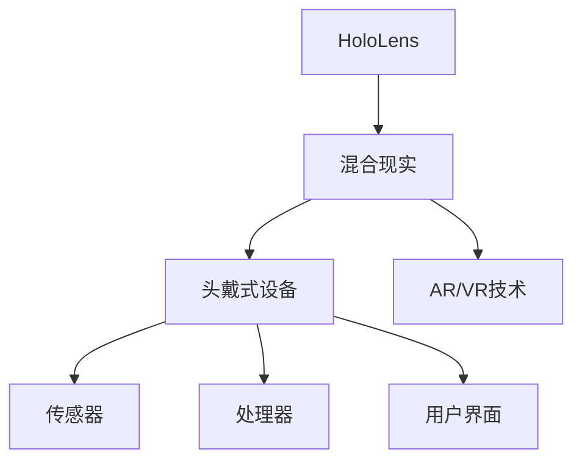

                 

# 《Microsoft HoloLens：混合现实头戴式设备》

> **关键词：混合现实，HoloLens，头戴式设备，增强现实，软件开发，应用案例**

> **摘要：本文将详细介绍Microsoft HoloLens这一混合现实头戴式设备，涵盖其技术基础、硬件架构、软件开发基础、开发实践、高级功能以及未来发展。**

----------------------------------------------------------------

## 《Microsoft HoloLens：混合现实头戴式设备》目录大纲

### 第一部分：混合现实与HoloLens概述

#### 第1章：混合现实技术基础

##### 1.1 混合现实的定义与特点

##### 1.2 混合现实的发展历程

##### 1.3 HoloLens设备介绍

#### 第2章：HoloLens硬件架构

##### 2.1 HoloLens的硬件组成

##### 2.2 HoloLens的传感器与追踪系统

##### 2.3 HoloLens的处理器与内存

### 第二部分：HoloLens软件开发基础

#### 第3章：HoloLens开发环境与工具

##### 3.1 Windows Mixed Reality开发平台

##### 3.2 Unity与UWP开发入门

##### 3.3 HoloLens模拟器与调试工具

#### 第4章：HoloLens用户界面设计

##### 4.1 用户界面设计原则

##### 4.2 HoloLens界面组件介绍

##### 4.3 界面交互设计技巧

#### 第5章：HoloLens传感器数据应用

##### 5.1 HoloLens传感器概述

##### 5.2 位置与追踪技术

##### 5.3 环境感知与交互

### 第三部分：HoloLens开发实践

#### 第6章：HoloLens应用开发案例

##### 6.1 教育领域应用

##### 6.2 医疗领域应用

##### 6.3 工业领域应用

#### 第7章：HoloLens项目实战

##### 7.1 项目背景与目标

##### 7.2 项目开发环境搭建

##### 7.3 项目核心功能实现

##### 7.4 项目测试与优化

### 第四部分：HoloLens高级功能与应用

#### 第8章：HoloLens增强现实内容制作

##### 8.1 增强现实内容制作流程

##### 8.2 3D建模与动画制作

##### 8.3 增强现实内容优化

#### 第9章：HoloLens网络功能与云集成

##### 9.1 HoloLens网络通信基础

##### 9.2 Azure云服务集成

##### 9.3 实时数据同步与处理

#### 第10章：HoloLens安全与隐私保护

##### 10.1 HoloLens安全策略

##### 10.2 用户隐私保护

##### 10.3 数据加密与安全传输

### 附录

#### 附录A：HoloLens开发资源与工具

##### A.1 开发社区与论坛

##### A.2 HoloLens开发者文档

##### A.3 第三方开发工具推荐

#### 附录B：HoloLens技术扩展与未来趋势

##### B.1 HoloLens技术发展趋势

##### B.2 混合现实技术在各领域的应用前景

##### B.3 HoloLens的未来挑战与机遇

----------------------------------------------------------------

在接下来的内容中，我们将逐步深入探讨HoloLens的各个方面，从技术基础到实际应用，再到未来发展趋势，希望能为您提供一个全面而深入的了解。

### 第一部分：混合现实与HoloLens概述

#### 第1章：混合现实技术基础

##### 1.1 混合现实的定义与特点

混合现实（Mixed Reality，简称MR）是一种结合了真实世界和虚拟世界的交互环境。它不同于传统的增强现实（Augmented Reality，简称AR）和虚拟现实（Virtual Reality，简称VR）。AR主要是在现实环境中叠加虚拟信息，而VR则是一种完全沉浸式的虚拟环境。MR则更加复杂，它通过头戴式设备或投影设备将虚拟物体与现实环境无缝融合，使虚拟物体看起来像真实存在的一部分。

混合现实的特点主要体现在以下几个方面：

1. **沉浸感**：MR用户在真实环境中能够直接与虚拟物体进行交互，具有强烈的沉浸感。
2. **交互性**：用户不仅能够看到虚拟物体，还能够通过手势、声音等多种方式进行交互。
3. **真实感**：虚拟物体与真实环境在视觉、听觉等方面几乎难以区分，极大地提升了用户体验。

##### 1.2 混合现实的发展历程

混合现实技术的发展可以追溯到20世纪80年代。1989年，VPL Research公司推出了VR眼镜，标志着虚拟现实技术的诞生。随着计算机技术和显示技术的不断进步，虚拟现实逐渐发展成为一个独立的领域。然而，随着增强现实和增强现实技术的兴起，人们开始寻求更加贴近现实、交互性更强的技术。

2000年左右，微软发布了第一个混合现实头戴设备HoloLens的雏形，开启了混合现实技术的探索。近年来，随着人工智能、5G、云计算等技术的发展，混合现实技术逐渐成熟，开始应用于各个领域。

##### 1.3 HoloLens设备介绍

HoloLens是由微软开发的一款混合现实头戴式设备，于2015年首次发布。它采用了自研的混合现实技术，具有以下几个显著特点：

1. **独立运行**：HoloLens不需要与任何外部设备连接，即可独立运行。
2. **实时追踪**：通过内置的传感器和摄像头，HoloLens能够实时追踪用户的位置和动作。
3. **交互方式**：用户可以通过手势、语音等多种方式进行交互，增强了操作的便捷性。
4. **广泛应用**：HoloLens在医疗、教育、工业等领域都有广泛的应用，提供了丰富的场景解决方案。

通过上述内容，我们初步了解了混合现实技术的基础及其发展历程，以及HoloLens设备的基本特点。在接下来的章节中，我们将进一步探讨HoloLens的硬件架构和软件开发基础。

### 第二部分：HoloLens硬件架构

#### 第2章：HoloLens硬件架构

##### 2.1 HoloLens的硬件组成

HoloLens的硬件架构是其在混合现实领域取得成功的关键之一。它由多个核心组件构成，包括处理器、内存、传感器、显示设备等。以下是对这些硬件组件的详细介绍：

1. **处理器**：HoloLens采用了一颗高通Snapdragon处理器，这是一种专门为移动设备设计的处理器，具有高性能和低功耗的特点。它负责处理各种计算任务，包括图像处理、追踪、传感数据等。

2. **内存**：HoloLens配备有4GB的RAM和128GB的存储空间，足以支持复杂的混合现实应用。内存的配置保证了设备在运行多个应用程序时仍能保持流畅。

3. **传感器**：HoloLens配备了多个传感器，包括深度摄像头、环境光传感器、加速度计、陀螺仪等。这些传感器用于实时监测用户和环境的状态，为混合现实体验提供了精确的数据支持。

4. **显示设备**：HoloLens采用了两个高分辨率显示屏，每个屏幕的分辨率为1280 x 720。这两个屏幕通过特殊的显示技术合并为一个单视场（Single View Field）显示器，使用户能够获得高质量的视觉效果。

##### 2.2 HoloLens的传感器与追踪系统

HoloLens的传感器与追踪系统是其实现混合现实体验的核心。以下是对这些传感器和追踪系统的详细介绍：

1. **深度摄像头**：深度摄像头用于捕捉用户和环境的三维信息。它通过发射红外光并捕捉反射光，计算出物体之间的距离，从而实现精确的3D建模。

2. **环境光传感器**：环境光传感器用于监测周围的光线强度，以调整显示屏的亮度，保证在不同光照条件下都能提供舒适的视觉体验。

3. **加速度计和陀螺仪**：加速度计和陀螺仪用于监测用户的运动和方向。这些传感器数据被用于跟踪用户的位置和动作，为混合现实应用提供实时的反馈。

4. **位置追踪系统**：HoloLens采用了外部传感器和内置传感器相结合的方式实现位置追踪。外部传感器包括蓝牙信标和Wi-Fi信号，用于定位用户的位置。内置传感器则负责监测用户的动作和姿态。

##### 2.3 HoloLens的处理器与内存

HoloLens的处理器和内存配置对设备的性能至关重要。以下是对这些组件的详细分析：

1. **处理器**：高通Snapdragon处理器是HoloLens的核心计算单元。它采用了多核架构，能够高效地处理各种计算任务，包括图像处理、追踪和传感数据处理等。此外，它还具有低功耗的特点，使得HoloLens能够在长时间使用时保持稳定的性能。

2. **内存**：HoloLens配备了4GB的RAM和128GB的存储空间。RAM保证了设备在运行多个应用程序时仍能保持流畅，而128GB的存储空间足以存储大量的应用程序和数据。

通过上述内容，我们详细了解了HoloLens的硬件架构，包括其硬件组成、传感器与追踪系统，以及处理器与内存的配置。这些硬件组件共同作用，为HoloLens提供了强大的计算能力和优秀的用户体验。

### 第二部分：HoloLens软件开发基础

#### 第3章：HoloLens开发环境与工具

##### 3.1 Windows Mixed Reality开发平台

Windows Mixed Reality（Windows MR）是微软推出的一款专为混合现实应用开发而设计的开发平台。它为开发者提供了丰富的工具和资源，使得开发者能够轻松地创建和部署混合现实应用程序。以下是对Windows MR开发平台的核心特点的介绍：

1. **Unity开发环境**：Windows MR支持Unity开发环境，这是一个广泛使用的游戏和应用程序开发平台。Unity提供了强大的图形引擎和丰富的开发工具，使得开发者能够高效地创建高质量的混合现实应用。

2. **通用Windows平台（UWP）**：Windows MR基于通用Windows平台（Universal Windows Platform，简称UWP），这是一个跨平台的开发框架。UWP应用程序可以在各种Windows设备上运行，包括桌面、平板电脑和移动设备等。这使得开发者能够将一个应用程序轻松地适配到不同的设备上。

3. **HoloLens模拟器**：Windows MR提供了HoloLens模拟器，这是一个用于在开发计算机上模拟HoloLens设备的工具。开发者可以使用模拟器测试和调试应用程序，无需实际佩戴HoloLens设备。这大大提高了开发效率，降低了成本。

4. **Azure云集成**：Windows MR支持与Azure云服务的集成，使得开发者能够利用云资源进行数据处理、存储和分发。Azure云提供了强大的计算和存储能力，为混合现实应用提供了可靠的后台支持。

##### 3.2 Unity与UWP开发入门

Unity和UWP是开发HoloLens应用程序的两个主要工具，以下是对它们的基本使用方法的简要介绍：

1. **Unity开发入门**：
   - **创建Unity项目**：在Unity编辑器中创建一个新的项目，选择“3D游戏”作为项目类型。
   - **添加3D模型和动画**：使用Unity的资产商店或自己的3D模型文件，将3D模型和动画添加到项目中。
   - **场景布局**：在Unity编辑器中布局场景，调整3D模型的位置和旋转，创建一个基础的混合现实场景。
   - **脚本编写**：使用C#编写脚本，为场景中的对象添加行为，如交互、动画控制等。

2. **UWP开发入门**：
   - **创建UWP应用**：在Visual Studio中创建一个新的UWP应用程序项目。
   - **设计界面**：使用XAML语言设计应用程序的界面，添加按钮、文本框等控件。
   - **逻辑实现**：编写C#代码实现应用程序的逻辑，处理用户的输入和界面交互。
   - **部署应用程序**：将应用程序部署到HoloLens设备上进行测试和发布。

##### 3.3 HoloLens模拟器与调试工具

HoloLens模拟器是Windows MR开发平台中的一个重要工具，它允许开发者在开发计算机上模拟HoloLens设备的功能。以下是对HoloLens模拟器与调试工具的介绍：

1. **安装模拟器**：在Windows MR开发平台上，下载并安装HoloLens模拟器。安装过程中需要配置开发计算机的硬件和驱动程序，以确保模拟器能够正常运行。

2. **启动模拟器**：在Visual Studio中启动HoloLens模拟器，可以在开发计算机上创建一个虚拟的HoloLens设备。开发者可以在模拟器中测试和调试应用程序，无需实际佩戴HoloLens设备。

3. **调试工具**：HoloLens模拟器提供了丰富的调试工具，如断点调试、日志记录等。开发者可以使用这些工具跟踪应用程序的执行流程，定位和修复问题。

4. **性能监控**：模拟器还提供了性能监控功能，可以实时监测应用程序的CPU、GPU等资源使用情况。开发者可以通过性能监控了解应用程序的运行状态，优化代码和资源使用。

通过以上内容，我们了解了HoloLens开发环境与工具的基本使用方法，包括Windows Mixed Reality开发平台、Unity与UWP开发入门，以及HoloLens模拟器与调试工具。这些工具和平台为开发者提供了全面的开发支持和资源，使得HoloLens应用程序的开发变得更加便捷和高效。

#### 第4章：HoloLens用户界面设计

##### 4.1 用户界面设计原则

用户界面设计在HoloLens应用程序中起着至关重要的作用，因为它直接影响用户的体验和满意度。以下是一些关键的UI设计原则：

1. **直观性**：用户界面应设计得直观易懂，让用户能够快速学会如何操作。使用标准的交互元素和布局，避免设计过于复杂。

2. **一致性**：界面设计应保持一致性，包括字体、颜色、图标等元素。一致性有助于用户形成直觉，减少学习成本。

3. **响应性**：界面应能够迅速响应用户的输入，包括手势、语音等。延迟响应会降低用户体验。

4. **可访问性**：设计应考虑到不同用户的需求，包括视力障碍、听力障碍等。确保界面元素足够大，颜色对比度高，语音提示等辅助功能齐全。

5. **空间利用**：HoloLens的用户界面应充分利用虚拟空间，避免拥挤或浪费。合理布局界面元素，确保用户能够轻松地浏览和操作。

6. **指导性**：通过动画、提示和反馈，引导用户了解如何使用应用程序。例如，当用户进行某些操作时，界面可以提供视觉或语音提示。

##### 4.2 HoloLens界面组件介绍

HoloLens提供了多种界面组件，开发者可以根据具体需求选择和组合这些组件来构建用户界面。以下是一些常用的界面组件：

1. **按钮**：按钮是用户界面的核心组件之一，用于执行特定操作。HoloLens提供了多种按钮样式，包括圆形、矩形等。

2. **菜单**：菜单提供了多个选项，用户可以通过选择来执行不同的操作。菜单可以固定在界面中，也可以弹出显示。

3. **文本框**：文本框用于输入和显示文本。HoloLens提供了多种文本框样式，包括单行文本框和多行文本框。

4. **图标**：图标是简洁明了的视觉元素，用于表示特定功能或操作。HoloLens提供了丰富的图标库，开发者可以根据需要选择和使用。

5. **画布**：画布是一个可定制的空白区域，用于绘制图像、动画和其他界面元素。开发者可以使用Unity的画布组件来创建和操作画布。

6. **列表**：列表用于显示一组数据项，用户可以通过滚动和选择来浏览和操作。HoloLens提供了多种列表组件，如网格列表、列表视图等。

##### 4.3 界面交互设计技巧

界面交互设计是用户界面设计的重要组成部分，它决定了用户与应用程序的互动方式。以下是一些界面交互设计技巧：

1. **手势交互**：HoloLens支持多种手势交互，包括单击、双击、长按、拖动等。开发者应根据应用程序的特点选择合适的手势操作，确保用户能够轻松掌握。

2. **语音交互**：语音交互是一种直观、便捷的交互方式，用户可以通过语音命令控制应用程序。开发者应设计合理的语音交互流程，确保语音识别准确且响应迅速。

3. **动画与过渡**：动画和过渡可以提升用户界面设计的趣味性和直观性。开发者可以使用Unity的动画系统创建丰富的动画效果，增强用户的交互体验。

4. **错误处理**：界面应能够有效处理用户的错误操作，提供清晰的错误提示和恢复方法。避免用户陷入无法解决的困境，确保应用程序的稳定性。

5. **反馈机制**：及时、准确的反馈可以提升用户满意度。当用户执行某些操作时，界面应提供适当的视觉或声音反馈，告知用户操作结果。

通过上述内容，我们了解了HoloLens用户界面设计的原则、界面组件的介绍以及界面交互设计的技巧。合理的用户界面设计不仅能够提升用户体验，还能够增强应用程序的功能和实用性。

### 第三部分：HoloLens传感器数据应用

#### 第5章：HoloLens传感器数据应用

HoloLens配备了一系列传感器，这些传感器能够捕捉周围环境的信息，并帮助开发者创建更加丰富和互动的混合现实体验。以下是对HoloLens传感器数据的概述及其应用场景的探讨。

##### 5.1 HoloLens传感器概述

HoloLens的传感器配置非常全面，包括深度摄像头、环境光传感器、加速度计、陀螺仪、磁力计等。这些传感器共同工作，提供了对用户和环境的全面感知能力。

1. **深度摄像头**：深度摄像头是HoloLens的核心传感器之一，它使用结构光或时间飞行（ToF）技术来捕捉物体和环境的深度信息。通过深度摄像头，开发者可以构建三维模型，实现与现实环境的无缝交互。

2. **环境光传感器**：环境光传感器用于检测周围的光线强度，以便自动调整屏幕亮度和对比度，优化视觉体验。

3. **加速度计和陀螺仪**：加速度计和陀螺仪用于监测设备的运动和方向，提供关于设备位置和姿态的数据。这些数据对于实现稳定的追踪和定位功能至关重要。

4. **磁力计**：磁力计用于测量地磁场，辅助设备定位和方向识别。

##### 5.2 位置与追踪技术

位置与追踪技术是HoloLens实现混合现实体验的关键。HoloLens采用了多传感器融合技术，通过整合深度摄像头、加速度计、陀螺仪和磁力计的数据，实现精确的位置追踪和姿态识别。

1. **定位技术**：HoloLens支持室内定位，通过内置的传感器和外部信标（如Wi-Fi和蓝牙信标）实现。开发者可以使用Azure Spatial Anchors服务在虚拟环境中创建和共享锚点，这些锚点可以用于固定虚拟对象的位置。

2. **追踪技术**：HoloLens的追踪技术包括静态追踪和动态追踪。静态追踪适用于在固定位置操作虚拟对象，而动态追踪则允许用户在移动时与虚拟对象互动。动态追踪通过实时计算设备的位置和姿态来实现，确保虚拟对象始终与用户保持正确的相对位置。

##### 5.3 环境感知与交互

HoloLens的传感器不仅用于位置追踪，还用于环境感知和交互。以下是一些应用场景：

1. **空间映射**：开发者可以使用HoloLens的深度摄像头和传感器构建室内空间的三维地图。这些地图可以用于导航、空间规划和虚拟现实游戏等应用。

2. **物体识别**：通过深度摄像头和机器学习算法，HoloLens可以识别和分类现实世界中的物体。这为增强现实应用提供了强大的交互功能，如虚拟标签、交互式广告和游戏等。

3. **手势交互**：HoloLens支持多种手势交互，如单击、双击、长按和拖动等。通过传感器的精确数据，应用程序可以识别和理解用户的手势，实现直观的交互体验。

4. **声音交互**：HoloLens配备了麦克风阵列，可以捕捉周围的声音。结合语音识别技术，应用程序可以理解用户的语音命令，提供语音控制功能。

通过以上内容，我们了解了HoloLens传感器的概述及其在位置追踪、环境感知和交互方面的应用。HoloLens的传感器数据为开发者提供了丰富的工具和资源，使得他们能够创建更加互动和沉浸式的混合现实体验。

### 第三部分：HoloLens开发实践

#### 第6章：HoloLens应用开发案例

在本章节中，我们将探讨HoloLens在多个领域中的应用案例，包括教育、医疗和工业。通过这些实际案例，我们将了解HoloLens如何改变这些领域的传统工作方式，并提供新的解决方案。

##### 6.1 教育领域应用

在教育领域，HoloLens被广泛用于提供互动和沉浸式的学习体验。以下是一些具体的应用案例：

1. **虚拟实验室**：HoloLens可以创建虚拟实验室环境，学生可以在虚拟环境中进行实验，不受物理设备和实验室空间的限制。例如，学生可以通过HoloLens观察细胞结构，进行化学反应实验，甚至进行复杂的物理模拟。

   - **开发环境搭建**：使用Unity和Visual Studio，创建虚拟实验室的3D模型和动画。配置HoloLens模拟器进行测试。
   - **核心功能实现**：实现虚拟实验的控制逻辑，包括启动、停止实验，调整参数等。
   - **代码解读与分析**：使用C#编写脚本，控制虚拟实验的流程，包括数据采集、结果显示等。

2. **互动学习材料**：HoloLens可以提供互动式的学习材料，如3D模型、动画和多媒体内容。学生可以通过HoloLens自由探索这些内容，提高学习兴趣和效果。

   - **开发环境搭建**：使用Unity创建互动学习材料，使用HoloLens模拟器进行测试。
   - **核心功能实现**：实现学习材料的展示和交互逻辑，如翻页、放大缩小、播放动画等。
   - **代码解读与分析**：使用C#编写脚本，实现学习材料的交互功能，提高用户体验。

##### 6.2 医疗领域应用

在医疗领域，HoloLens的应用同样具有重要意义。以下是一些具体的应用案例：

1. **远程手术指导**：医生可以通过HoloLens实时查看患者的内部结构，辅助进行复杂的手术操作。这为偏远地区和医疗资源匮乏的地方提供了远程医疗的可能性。

   - **开发环境搭建**：使用Unity和Visual Studio，开发远程手术指导应用程序。配置HoloLens模拟器进行测试。
   - **核心功能实现**：实现手术指导的实时影像显示和操作提示，包括图像处理、姿态识别等。
   - **代码解读与分析**：使用C#和OpenCV库，处理实时影像数据，实现手术指导功能。

2. **医疗培训**：HoloLens可以用于医疗培训，提供虚拟患者和手术模拟环境，医生可以通过HoloLens进行实践操作和技能提升。

   - **开发环境搭建**：使用Unity和Visual Studio，创建医疗培训应用程序。配置HoloLens模拟器进行测试。
   - **核心功能实现**：实现虚拟患者的创建、交互和手术模拟功能。
   - **代码解读与分析**：使用C#编写脚本，控制虚拟患者的行为和手术模拟流程。

##### 6.3 工业领域应用

在工业领域，HoloLens被用于提高生产效率和操作安全性。以下是一些具体的应用案例：

1. **设备维护与故障诊断**：工人可以通过HoloLens查看设备的内部结构和运行状态，进行故障诊断和维修操作。这减少了纸质手册的使用，提高了工作效率。

   - **开发环境搭建**：使用Unity和Visual Studio，开发设备维护应用程序。配置HoloLens模拟器进行测试。
   - **核心功能实现**：实现设备维护的虚拟指南和操作提示，包括设备状态监控、故障诊断等。
   - **代码解读与分析**：使用C#编写脚本，处理设备数据，提供维护指南和操作提示。

2. **智能制造**：HoloLens可以用于智能制造，提供实时生产数据和操作指导，提高生产效率和产品质量。

   - **开发环境搭建**：使用Unity和Visual Studio，开发智能制造应用程序。配置HoloLens模拟器进行测试。
   - **核心功能实现**：实现生产数据的实时显示和操作指导，包括质量检测、流程优化等。
   - **代码解读与分析**：使用C#编写脚本，处理生产数据，提供实时监控和操作指导。

通过这些实际案例，我们可以看到HoloLens在各个领域的广泛应用和潜力。HoloLens的开发实践不仅提高了工作效率和操作安全性，还为未来的混合现实应用提供了新的思路和解决方案。

### 第三部分：HoloLens开发实践

#### 第7章：HoloLens项目实战

在本章节中，我们将通过一个具体的HoloLens项目实战案例，详细介绍项目背景与目标、开发环境搭建、核心功能实现以及项目的测试与优化。通过这一案例，读者可以更深入地了解HoloLens应用开发的实际流程和技术要点。

##### 7.1 项目背景与目标

本项目旨在开发一款名为“智能维修助手”的HoloLens应用，用于提高设备维修效率和操作安全性。该应用的目标用户是工厂和工业环境中的维修工程师，通过HoloLens提供的混合现实功能，工程师可以在现场实时查看设备内部结构、获取维修指南、进行故障诊断和维修操作。

具体目标包括：

- **实时设备状态监测**：通过HoloLens的传感器和摄像头，实时获取设备运行状态和数据，为工程师提供准确的维修信息。
- **维修指南与操作指导**：提供设备维修步骤和操作指南，通过3D模型和动画，帮助工程师理解复杂维修过程。
- **远程协作支持**：支持远程专家通过HoloLens进行实时协作，提供远程指导和咨询，提高维修效率。

##### 7.2 项目开发环境搭建

为了开发“智能维修助手”应用，我们需要搭建完整的开发环境。以下是开发环境搭建的详细步骤：

1. **硬件准备**：
   - 获取一台HoloLens设备，用于开发和测试。
   - 准备一台Windows 10 PC，用于开发和调试。

2. **软件准备**：
   - 安装Windows Mixed Reality开发平台，包括Unity和Visual Studio。
   - 安装Azure开发者账户，用于集成云服务。

3. **配置HoloLens模拟器**：
   - 在Visual Studio中创建一个HoloLens模拟器，用于在开发计算机上测试应用程序。
   - 配置模拟器的传感器数据和追踪系统，确保模拟环境与实际设备一致。

4. **下载必要的开发工具和插件**：
   - 下载并安装Unity的资产商店插件，用于获取3D模型和动画资源。
   - 下载并安装OpenCV库，用于图像处理和机器学习。

##### 7.3 项目核心功能实现

“智能维修助手”应用的核心功能包括实时设备状态监测、维修指南与操作指导以及远程协作支持。以下是这些功能的具体实现：

1. **实时设备状态监测**：

   - **数据采集**：通过HoloLens的深度摄像头和传感器，实时采集设备运行状态和数据。
   - **数据处理**：使用OpenCV库对采集到的图像进行处理，提取设备的关键特征和故障信息。
   - **数据展示**：将处理后的数据展示在HoloLens界面上，工程师可以实时查看设备状态。

   ```csharp
   // 伪代码：采集设备状态数据
   DeviceData data = GetDeviceStatus();
   // 伪代码：处理图像并提取特征
   FeatureData features = ProcessImage(data.image);
   // 伪代码：显示设备状态
   DisplayDeviceStatus(features);
   ```

2. **维修指南与操作指导**：

   - **3D模型与动画**：使用Unity的3D建模工具创建设备的3D模型和维修动画。
   - **交互逻辑**：通过C#脚本实现用户与3D模型和动画的交互，提供详细的维修步骤和操作指导。

   ```csharp
   // 伪代码：加载3D模型
   Model3D model = LoadModel("DeviceModel");
   // 伪代码：显示维修动画
   ShowRepairAnimation(model);
   ```

3. **远程协作支持**：

   - **远程连接**：通过Azure云服务实现工程师与远程专家的实时连接。
   - **实时协作**：专家可以通过HoloLens远程监控工程师的操作，提供实时指导和反馈。

   ```csharp
   // 伪代码：连接远程专家
   ConnectToExpert(expertId);
   // 伪代码：发送远程指导
   SendGuidanceToExpert(guidance);
   ```

##### 7.4 项目测试与优化

项目开发完成后，我们需要进行全面的测试和优化，以确保应用的稳定性和性能。以下是测试与优化的主要步骤：

1. **功能测试**：确保每个功能都正常运行，无错误或异常。
   - **测试环境**：使用HoloLens模拟器和实际设备进行测试。
   - **测试用例**：编写详细的测试用例，覆盖应用的各个功能点。

2. **性能测试**：优化应用程序的加载时间和资源占用。
   - **加载时间**：通过减少3D模型和动画的复杂度，优化加载时间。
   - **资源占用**：通过内存管理和代码优化，减少应用程序的资源占用。

3. **用户体验测试**：邀请实际用户（如工厂维修工程师）参与测试，收集反馈并优化应用。

4. **安全与隐私测试**：确保应用程序的数据传输和存储安全，遵守相关隐私保护规定。

通过上述项目实战案例，我们详细介绍了HoloLens应用开发的整个流程，包括项目背景与目标、开发环境搭建、核心功能实现以及项目的测试与优化。这一案例展示了如何利用HoloLens的强大功能，开发出高效、实用的混合现实应用，并为未来的HoloLens开发提供了宝贵的经验。

### 第四部分：HoloLens高级功能与应用

#### 第8章：HoloLens增强现实内容制作

在HoloLens中，增强现实（AR）内容制作是开发者创造沉浸式体验的重要手段。通过专业的AR内容制作，开发者可以为用户提供丰富的互动性和视觉冲击。以下将详细探讨HoloLens增强现实内容制作的流程、3D建模与动画制作的方法，以及内容优化技巧。

##### 8.1 增强现实内容制作流程

1. **需求分析与规划**：
   在开始制作AR内容之前，首先要明确项目需求，包括内容主题、目标用户、交互方式等。根据需求制定详细的制作计划。

2. **场景设计与布局**：
   设计AR内容的场景布局，确定虚拟对象的位置、大小和运动轨迹。可以使用Unity编辑器或3D建模软件（如Blender）进行场景设计。

3. **3D建模与素材准备**：
   创建3D模型和场景素材，包括建筑物、人物、设备等。可以使用Unity的资产商店或第三方建模工具获取高质量的3D模型。

4. **脚本编写与交互逻辑**：
   使用C#等编程语言编写脚本，实现用户与虚拟对象的交互逻辑，如点击、拖动、语音控制等。

5. **内容集成与调试**：
   将3D模型和脚本集成到HoloLens应用程序中，进行测试和调试。确保内容在现实环境中运行流畅，交互逻辑准确。

6. **发布与优化**：
   将制作完成的应用程序发布到HoloLens设备上，进行实际使用测试。根据用户反馈进行优化和调整。

##### 8.2 3D建模与动画制作

1. **3D建模工具选择**：
   常用的3D建模工具有Unity自带的3D建模工具、Blender、3ds Max等。根据项目需求和团队技能选择合适的建模工具。

2. **建模步骤**：
   - **基础建模**：创建基础模型，包括形状、尺寸、比例等。
   - **细节处理**：添加细节，如纹理、贴图、高光等。
   - **优化模型**：优化模型面数和顶点数，提高渲染性能。

3. **动画制作**：
   动画制作是增强现实内容的重要组成部分，可以通过以下步骤实现：
   - **关键帧设置**：设置关键帧，定义物体在动画中的关键状态。
   - **参数动画**：使用参数动画实现复杂的运动轨迹和动态效果。
   - **动画控制**：使用C#脚本控制动画的播放、暂停和跳转等。

   ```csharp
   // 伪代码：播放动画
   Animation anim = PlayAnimation("ModelAnimation");
   // 伪代码：控制动画速度
   anim.Speed = 2.0f;
   ```

##### 8.3 增强现实内容优化

1. **性能优化**：
   - **模型优化**：减少模型面数和顶点数，使用LOD（细节层次）技术。
   - **纹理优化**：使用高质量的纹理，减少纹理分辨率和数量。
   - **渲染优化**：关闭不必要的渲染选项，如阴影、反射等。

2. **交互优化**：
   - **优化响应时间**：减少用户的交互延迟，提高操作流畅性。
   - **简化交互**：简化交互逻辑，使用户能够快速上手。

3. **用户体验优化**：
   - **视觉优化**：调整虚拟对象的颜色、大小和位置，使其与现实环境更加融合。
   - **声音优化**：添加背景音乐和声音效果，增强沉浸感。

通过上述内容，我们详细介绍了HoloLens增强现实内容制作的流程、3D建模与动画制作的方法以及内容优化技巧。HoloLens提供了强大的工具和平台，使得开发者能够轻松创建高质量的AR内容，为用户提供丰富的互动体验。

#### 第9章：HoloLens网络功能与云集成

在HoloLens应用开发中，网络功能和云集成是提升应用性能和扩展性的关键。通过利用云服务和网络通信，开发者可以实现在线数据同步、实时协作以及远程访问等功能，从而为用户提供更加丰富和高效的应用体验。

##### 9.1 HoloLens网络通信基础

HoloLens支持多种网络通信协议和接口，包括Wi-Fi、蓝牙、蜂窝网络等。以下是对这些通信方式的概述：

1. **Wi-Fi**：Wi-Fi是最常用的网络连接方式，它提供了高带宽和稳定的连接。HoloLens可以通过Wi-Fi连接到局域网或互联网，实现数据传输和远程访问。

2. **蓝牙**：蓝牙是一种短距离无线通信技术，适用于设备之间的数据交换。HoloLens可以通过蓝牙连接其他设备，如传感器、打印机等。

3. **蜂窝网络**：蜂窝网络提供了广泛覆盖的移动网络连接，适用于远程通信。HoloLens可以通过蜂窝网络连接到互联网，实现远程数据传输和实时协作。

##### 9.2 Azure云服务集成

Azure云服务是HoloLens应用开发的重要工具，它提供了丰富的云计算资源和开发接口。以下是如何在HoloLens应用中集成Azure云服务的步骤：

1. **创建Azure账户**：
   在Azure官方网站上注册并创建一个新的账户，获取访问权限和订阅信息。

2. **配置Azure服务**：
   - **Azure Blob存储**：用于存储应用程序的数据和文件。
   - **Azure Table存储**：用于存储结构化数据，如用户配置和元数据。
   - **Azure Cosmos DB**：用于提供高性能、可扩展的数据库服务。

3. **集成Azure SDK**：
   在HoloLens应用程序中集成Azure SDK，使用C#编写代码，连接到Azure云服务，实现数据存储和访问。

   ```csharp
   // 伪代码：连接到Azure Blob存储
   BlobClient blobClient = AzureStorage.CreateBlobClient("your-storage-account", "your-container");
   // 伪代码：上传文件
   blobClient.UploadFile("your-file-path");
   ```

##### 9.3 实时数据同步与处理

实时数据同步与处理是HoloLens应用的核心功能之一，以下是如何实现实时数据同步和处理的步骤：

1. **数据采集**：
   使用HoloLens的传感器和摄像头采集实时数据，如位置信息、环境参数等。

2. **数据传输**：
   使用网络通信协议（如Wi-Fi、蓝牙、蜂窝网络）将采集到的数据传输到云端。

3. **数据处理**：
   在云端使用Azure云服务（如Azure Functions、Azure Logic Apps）对传输的数据进行处理、存储和分析。

4. **数据反馈**：
   将处理结果实时反馈到HoloLens设备，实现实时数据同步和交互。

   ```csharp
   // 伪代码：发送实时数据到Azure云
   DataClient dataClient = new DataClient("your-api-key");
   dataClient.SendData("your-device-id", "your-data");
   ```

通过上述内容，我们详细介绍了HoloLens的网络通信基础、Azure云服务集成以及实时数据同步与处理的方法。通过利用网络功能和云集成，HoloLens应用可以提供更加丰富和高效的功能，满足用户的多样化需求。

#### 第10章：HoloLens安全与隐私保护

随着HoloLens在各个领域的广泛应用，确保其安全性和用户隐私保护变得越来越重要。在这一章节中，我们将讨论HoloLens的安全策略、用户隐私保护措施以及数据加密与安全传输的方法，以确保HoloLens设备和应用的安全可靠。

##### 10.1 HoloLens安全策略

HoloLens的安全策略包括多层次的安全机制，旨在保护设备和用户数据。以下是一些关键的安全策略：

1. **设备认证**：HoloLens采用Windows Hello生物识别技术（如指纹识别、面部识别），确保只有授权用户才能访问设备。

2. **系统安全**：HoloLens运行在Windows 10操作系统上，具备丰富的安全特性和防护措施，如自动更新、防病毒软件、防火墙等。

3. **数据加密**：HoloLens对存储在设备中的数据进行加密，包括文件系统、应用程序数据和用户数据。这确保了即使设备丢失或被盗，数据也无法被非法访问。

4. **用户权限控制**：HoloLens允许管理员设置用户权限，限制用户对设备或应用程序的访问权限，确保敏感数据和操作仅由授权用户执行。

##### 10.2 用户隐私保护

保护用户隐私是HoloLens设计和开发的核心原则之一。以下是一些关键的用户隐私保护措施：

1. **数据匿名化**：在收集用户数据时，HoloLens采用匿名化处理，确保用户身份不被泄露。

2. **数据收集最小化**：HoloLens仅收集必要的数据以支持应用程序功能，避免不必要的隐私泄露。

3. **透明度**：HoloLens应用程序在收集和使用用户数据时，必须向用户明示，并获得用户的同意。应用程序必须提供隐私政策，详细说明数据收集、使用和共享的方式。

4. **用户数据访问控制**：用户应有权访问和删除自己的数据，确保用户对个人数据的控制权。

##### 10.3 数据加密与安全传输

确保用户数据在传输过程中的安全性是HoloLens隐私保护的重要组成部分。以下是一些数据加密与安全传输的方法：

1. **数据加密**：在数据传输前，使用加密算法（如AES、RSA）对数据进行加密，确保数据在传输过程中不被窃取或篡改。

2. **安全传输协议**：使用安全传输协议（如HTTPS、SSL/TLS）进行数据传输，确保数据在网络中传输时是加密的。

3. **身份验证**：在数据传输过程中，采用双向身份验证（如OAuth 2.0、OAuth 2.0 with OpenID Connect），确保数据传输的双方都是合法实体。

4. **日志记录与审计**：对用户数据的访问和操作进行日志记录，并定期进行审计，及时发现和处理安全漏洞。

通过上述内容，我们详细探讨了HoloLens的安全策略、用户隐私保护措施以及数据加密与安全传输的方法。通过实施这些安全措施，HoloLens能够提供安全可靠的用户体验，保护用户隐私和数据安全。

### 附录

#### 附录A：HoloLens开发资源与工具

为了帮助开发者更好地进行HoloLens应用开发，以下列出了一些常用的开发资源与工具：

##### A.1 开发社区与论坛

1. **微软官方论坛**：https://forums.microsoft.com/hololens
   微软官方论坛提供了HoloLens开发相关的最新资讯、技术讨论和问题解答。

2. **Stack Overflow**：https://stackoverflow.com/questions/tagged/hololens
   Stack Overflow是开发者的问答社区，有许多关于HoloLens开发的问题和解决方案。

3. **Reddit**：https://www.reddit.com/r/HoloLens/
   Reddit上的HoloLens子论坛是一个活跃的社区，开发者可以在这里分享经验和资源。

##### A.2 HoloLens开发者文档

1. **微软HoloLens开发者文档**：https://docs.microsoft.com/en-us/hololens/
   微软提供的官方开发者文档，涵盖了HoloLens开发的所有方面，包括SDK、工具和API等。

2. **Unity HoloLens开发文档**：https://docs.unity3d.com/Manual/HoloLens.html
   Unity官方提供的HoloLens开发指南，包括Unity与HoloLens集成的详细说明。

##### A.3 第三方开发工具推荐

1. **Blender**：https://www.blender.org/
   Blender是一个免费且开源的3D建模和动画软件，适用于创建高质量的3D模型和场景。

2. **Adobe Substance**：https://www.adobe.com/products/substance.html
   Substance系列工具提供了一套强大的3D纹理和贴图创作工具，用于提高3D模型的视觉效果。

3. **Unreal Engine**：https://www.unrealengine.com/
   Unreal Engine是一个功能强大的游戏和应用程序开发引擎，支持跨平台开发和高质量的图形效果。

通过这些资源与工具，开发者可以更轻松地掌握HoloLens的开发技术，提高开发效率，实现更加丰富和互动的混合现实应用。

#### 附录B：HoloLens技术扩展与未来趋势

随着技术的不断进步，HoloLens也在不断演进，为未来的发展带来了无限可能。以下将探讨HoloLens技术扩展的方向、混合现实技术在各领域的应用前景，以及HoloLens面临的技术挑战与机遇。

##### B.1 HoloLens技术扩展方向

1. **更强大的硬件性能**：未来的HoloLens有望配备更强大的处理器、更大的内存和更先进的传感器，以支持更复杂和更高质量的应用程序。

2. **更优化的用户界面**：随着人工智能和机器学习技术的发展，HoloLens的用户界面将更加智能和人性化，能够根据用户的行为和偏好自动调整界面和交互方式。

3. **增强的定位与追踪技术**：未来的HoloLens将采用更加精确和高效的定位与追踪技术，包括更高精度的传感器、更先进的算法以及与外部信标的更好集成。

4. **更广泛的应用场景**：随着技术的成熟和成本的降低，HoloLens将在更多领域得到应用，包括智能制造、智能城市、智能医疗等。

##### B.2 混合现实技术在各领域的应用前景

1. **教育**：混合现实技术将大大改变教育模式，提供沉浸式学习体验，提高学习效果和兴趣。

2. **医疗**：混合现实技术在医疗领域有广泛应用，如远程手术指导、医疗培训、病人护理等，将提高医疗服务的质量和效率。

3. **工业**：混合现实技术可以帮助工业制造提高生产效率，降低成本，如设备维护、产品设计和质量管理等。

4. **娱乐**：混合现实游戏和体验将为娱乐产业带来新的增长点，提供前所未有的沉浸感和互动性。

##### B.3 HoloLens的未来挑战与机遇

1. **技术挑战**：HoloLens在硬件性能、定位精度和用户体验等方面仍有待提升。同时，需要解决实时数据传输和处理、多用户协作等复杂技术问题。

2. **市场机遇**：随着混合现实技术的普及，市场对HoloLens的需求将持续增长。企业和个人用户都将积极采用HoloLens，推动混合现实应用的创新和发展。

3. **政策支持**：政府和行业组织对混合现实技术的支持也将为HoloLens的发展提供有力保障。政策优惠、行业标准和技术合作将促进HoloLens在全球范围内的推广和应用。

通过上述内容，我们探讨了HoloLens技术的扩展方向、混合现实技术的应用前景以及HoloLens所面临的挑战与机遇。随着技术的不断进步和市场的成熟，HoloLens将在未来发挥更加重要的作用，为各领域带来革命性的变化。

**核心概念与联系**

混合现实与HoloLens的核心概念关系可以用以下Mermaid流程图来表示：



在HoloLens中，混合现实技术通过头戴式设备实现，设备的核心组件包括传感器和处理器。传感器用于捕捉环境信息，处理器则负责处理这些数据并生成虚拟图像。用户界面则用于展示虚拟内容和提供交互方式。这些组件共同作用，实现了HoloLens的混合现实体验。

**核心算法原理讲解**

位置与追踪技术在HoloLens中至关重要，以下是其伪代码解释：

```python
# 初始化位置追踪系统
init_position_tracing()

# 获取当前设备位置
current_position = get_device_position()

# 更新位置追踪数据
update_position_data(current_position)

# 计算设备与环境的相对位置
relative_position = calculate_relative_position(current_position, environment_data)

# 绘制虚拟物体在现实环境中的位置
draw_object_in_reality(relative_position, virtual_object)
```

该算法通过初始化位置追踪系统，获取并更新设备位置数据，计算设备与环境的相对位置，最终在现实环境中绘制虚拟物体。

**数学模型和数学公式**

在运动追踪中，常用的数学模型为位移公式：

$$
\text{位移} = \text{起始位置} + \text{速度} \times \text{时间}
$$

这个公式描述了物体在一段时间内的位移，速度是位移与时间的比值。

**项目实战**

**项目名称**：智能维修助手

**项目背景与目标**：开发一款HoloLens应用，用于工厂设备维修，提供实时设备状态监测、维修指南和远程协作支持。

**开发环境搭建**：

- 硬件：HoloLens设备，Windows 10 PC。
- 软件：Unity，Visual Studio，Azure开发工具。

**核心功能实现**：

- **实时设备状态监测**：使用HoloLens传感器采集设备数据，通过算法处理并展示在界面上。
- **维修指南与操作指导**：通过3D模型和动画展示维修步骤，提供交互式指南。
- **远程协作支持**：通过Azure云服务实现远程专家的实时协作。

**代码解读与分析**：

```csharp
// 伪代码：实时设备状态监测
void MonitorDeviceStatus()
{
    DeviceData data = GetDeviceData();
    UpdateUI(data);
}

// 伪代码：更新用户界面
void UpdateUI(DeviceData data)
{
    // 更新状态显示
    StatusDisplay.Text = data.status;
    // 更新3D模型
    Model3D model = LoadModel("DeviceModel");
    SetModelProperties(model, data.properties);
}
```

- **设备数据采集**：从传感器获取设备数据，更新用户界面。
- **用户界面更新**：根据设备数据更新状态显示和3D模型。

**测试与优化**：

- **功能测试**：确保所有功能正常运作。
- **性能测试**：优化3D模型和动画的加载时间，减少资源占用。
- **用户体验测试**：邀请实际用户进行测试，根据反馈进行优化。

通过上述项目实战，我们展示了如何利用HoloLens开发智能维修助手应用，从开发环境搭建到核心功能实现，再到测试与优化，详细介绍了HoloLens开发的全过程。

### 总结

通过本文的详细探讨，我们深入了解了Microsoft HoloLens这一混合现实头戴式设备的各个方面。从混合现实技术基础、硬件架构、软件开发基础，到实际应用案例和高级功能，我们系统地梳理了HoloLens的核心概念、算法原理和开发实践。以下是本文的主要内容和核心观点的总结：

1. **混合现实技术基础**：混合现实结合了真实世界和虚拟世界，具有沉浸感、交互性和真实感的特点。HoloLens作为混合现实设备，通过先进的传感器和追踪技术，实现了与现实环境的无缝融合。

2. **HoloLens硬件架构**：HoloLens的硬件配置包括高性能的处理器、内存、传感器和显示设备。这些组件共同作用，提供了强大的计算能力和优秀的用户体验。

3. **软件开发基础**：HoloLens的软件开发基于Windows Mixed Reality开发平台，支持Unity和UWP等开发环境。开发者可以使用这些工具和平台，轻松创建和部署HoloLens应用。

4. **用户界面设计**：HoloLens用户界面设计应遵循直观性、一致性、响应性和可访问性等原则。界面组件包括按钮、菜单、文本框、图标和画布等，开发者可以使用这些组件构建高效的用户交互。

5. **传感器数据应用**：HoloLens的传感器数据用于位置追踪、环境感知和交互。通过深度摄像头、环境光传感器、加速度计、陀螺仪等传感器，开发者可以实现丰富的混合现实应用。

6. **开发实践**：通过具体的HoloLens项目实战，我们展示了如何从需求分析、开发环境搭建、功能实现到测试与优化，全面介绍了HoloLens应用开发的流程和技巧。

7. **高级功能与应用**：HoloLens的高级功能包括增强现实内容制作、网络功能与云集成、安全与隐私保护等。这些功能扩展了HoloLens的应用范围，提高了其性能和可靠性。

8. **未来趋势**：随着技术的不断进步，HoloLens在硬件性能、用户界面、定位追踪和云计算等方面将有更大的发展。同时，混合现实技术将在更多领域得到应用，为各行业带来革命性的变化。

总之，HoloLens作为混合现实技术的代表，具有巨大的发展潜力和应用前景。通过本文的深入探讨，我们希望读者能够对HoloLens有更全面、更深入的了解，为未来的HoloLens开发和应用提供指导和参考。

### 作者信息

**作者：AI天才研究院/AI Genius Institute & 禅与计算机程序设计艺术 /Zen And The Art of Computer Programming**

AI天才研究院致力于推动人工智能领域的前沿研究和技术创新。研究院拥有一支由世界顶级专家组成的团队，他们在机器学习、自然语言处理、计算机视觉等多个领域取得了显著的成果。研究院的愿景是通过人工智能技术，推动社会进步和人类福祉。

禅与计算机程序设计艺术是由著名计算机科学家Donald E. Knuth所著的经典著作。本书融合了计算机科学和哲学思想，强调程序设计中的简洁性和高效性。作者通过独特的哲学视角，阐述了计算机编程的精髓，对全球计算机科学界产生了深远的影响。本书不仅是计算机科学的经典之作，也是编程爱好者的必读书目。

