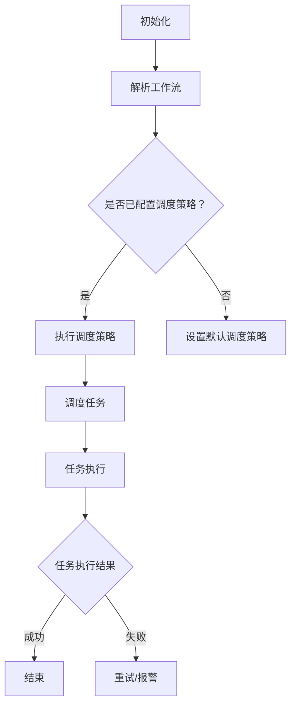

                 

# 《Oozie工作流调度原理与代码实例讲解》

> **关键词：** Oozie，工作流，调度，Hadoop，YARN，HDFS，动态工作流，最佳实践

> **摘要：** 本文深入讲解了Oozie工作流调度原理，包括Oozie的基本概念、架构、调度机制、与Hadoop生态系统的集成，以及Oozie的高级特性和最佳实践。通过具体的项目实战案例，详细展示了Oozie在实际开发中的应用和调试方法。

---

## 第一部分：Oozie基础

### 第1章：Oozie简介

#### 1.1 Oozie概述

Oozie是一个开源的工作流调度引擎，主要用于处理和管理Hadoop作业。它支持多种作业类型，包括MapReduce、Java、Streaming、Spark、Pig、Hive等。Oozie通过定义工作流来调度和监控这些作业，从而实现复杂的数据处理任务的自动化。

Oozie的主要作用是简化大数据处理任务的编排和调度，提高数据处理效率，确保任务的正确执行。它不仅能够实现作业之间的依赖关系，还能够处理失败的任务，实现重试机制。

#### 1.2 Oozie的架构

Oozie的整体架构分为两层：客户端和服务端。

1. **客户端**：客户端负责创建和编辑工作流，并通过Web界面或命令行工具提交工作流。客户端的主要组件包括：
   - **Oozie客户端**：提供创建、编辑和提交工作流的功能。
   - **Web界面**：通过浏览器访问，提供可视化操作界面。

2. **服务端**：服务端负责调度和管理工作流，将客户端提交的工作流分解为具体的作业任务，并在Hadoop集群上执行。服务端的主要组件包括：
   - **Oozie服务器**：负责接收、处理和执行工作流。
   - **Oozie协调器**：根据工作流定义，生成作业任务并在Hadoop集群上调度执行。
   - **Oozie共享库**：存储和管理共享的资源，如模板和工作流。

#### 1.3 Oozie的安装与配置

Oozie的安装和配置相对简单，主要包括以下几个步骤：

1. **安装Oozie**：从Oozie官方网站下载最新的Oozie版本，并解压到Hadoop的安装目录下。
2. **配置环境变量**：在`/etc/profile`文件中添加Oozie的环境变量，如`OOZIE_HOME`和`PATH`。
3. **配置Oozie配置文件**：在`$OOZIE_HOME/conf`目录下，修改`oozie-site.xml`文件，配置Oozie运行所需的Hadoop集群信息。
4. **启动Oozie服务**：通过命令`oozie server start`启动Oozie服务器，并通过Web界面或命令行工具访问Oozie。

### 第2章：Oozie工作流

#### 2.1 工作流的基本概念

工作流是一系列任务的集合，用于实现特定的业务逻辑。在Oozie中，工作流由一系列的“协调器”组成，每个协调器可以包含多个“动作”（如MapReduce作业、Java程序等）。工作流的基本概念包括：

- **协调器**：工作流的基本单位，用于定义任务的执行顺序和依赖关系。
- **动作**：协调器中的具体任务，如MapReduce作业、Java程序等。
- **触发器**：用于触发协调器的执行条件，可以是定时触发、手动触发或事件触发。

#### 2.2 工作流的创建与编辑

1. **创建工作流**：
   - **使用Web界面**：通过Oozie的Web界面，选择“新建工作流”并填写协调器的名称、描述等基本信息。
   - **使用命令行**：通过命令行工具，使用`oozie workflow`命令创建工作流，并编辑XML配置文件。

2. **编辑工作流**：
   - **使用Web界面**：在Web界面中，可以方便地编辑工作流的协调器和动作，如添加、删除、修改任务等。
   - **使用命令行**：通过命令行工具，可以编辑工作流的XML配置文件，实现更复杂的编辑操作。

#### 2.3 工作流实例管理

1. **工作流实例的创建**：
   - **手动创建**：通过Web界面或命令行工具，手动创建工作流实例。
   - **自动创建**：通过触发器，根据特定条件自动创建工作流实例。

2. **工作流实例的监控与查询**：
   - **Web界面监控**：通过Oozie的Web界面，可以实时监控工作流实例的执行状态，查看任务的日志信息。
   - **命令行查询**：通过命令行工具，可以查询工作流实例的详细信息，如实例状态、执行时间等。

### 第3章：Oozie的调度机制

#### 3.1 调度机制概述

Oozie的调度机制主要包括以下几个方面：

1. **定时调度**：根据时间规则，定期执行工作流实例。
2. **手动调度**：用户手动触发工作流实例的执行。
3. **事件触发调度**：根据特定事件，如文件的出现或变化，触发工作流实例的执行。

#### 3.2 调度策略

1. **定时调度**：
   - **时间规则**：使用Cron表达式定义执行时间。
   - **执行频率**：支持每日、每周、每月等不同频率的执行。

2. **手动调度**：
   - **执行方式**：用户通过Web界面或命令行工具，手动触发工作流实例的执行。

3. **事件触发调度**：
   - **事件类型**：支持文件创建、文件修改等事件。
   - **触发条件**：根据文件的大小、时间戳等条件，触发工作流实例的执行。

#### 3.3 调度优化

1. **并发控制**：限制同时运行的工作流实例数量，避免资源争用。
2. **任务依赖优化**：通过优化任务之间的依赖关系，提高执行效率。
3. **错误处理**：实现任务失败的重试机制，确保任务的正确执行。

## 第二部分：Oozie进阶使用

### 第4章：Oozie与Hadoop生态系统集成

#### 4.1 Oozie与HDFS的集成

Oozie与HDFS的集成主要体现在对HDFS文件的操作上，包括文件的创建、删除、上传、下载等。通过Oozie的工作流，可以方便地实现数据的处理和存储。

1. **HDFS文件操作**：
   - **上传文件**：将本地文件上传到HDFS。
   - **下载文件**：从HDFS下载文件到本地。
   - **删除文件**：删除HDFS上的文件。

2. **协同工作**：
   - **数据预处理**：通过Oozie工作流，对HDFS上的数据进行预处理。
   - **数据处理**：利用Hadoop生态系统中的其他组件，如MapReduce、Spark等，对HDFS上的数据进行处理。

#### 4.2 Oozie与YARN的集成

Oozie与YARN的集成使得Oozie能够更好地管理Hadoop作业。通过YARN，Oozie可以动态地分配资源，优化作业的执行。

1. **YARN资源分配**：
   - **容器分配**：Oozie根据作业的需求，向YARN请求容器资源。
   - **资源调整**：Oozie可以根据作业的执行情况，动态调整资源分配。

2. **协同工作**：
   - **作业调度**：Oozie与YARN协同工作，实现作业的高效调度和执行。
   - **作业监控**：Oozie可以监控YARN中的作业执行状态，实现任务的实时监控和告警。

#### 4.3 Oozie与其他Hadoop组件的集成

Oozie不仅能够与HDFS和YARN集成，还能够与Hadoop生态系统中的其他组件集成，如Hive、Pig、Spark等。通过这些集成，Oozie可以更全面地管理大数据处理任务。

1. **Hive集成**：
   - **查询执行**：通过Oozie工作流，执行Hive SQL查询。
   - **数据导入导出**：利用Oozie，实现HDFS与Hive之间的数据导入导出。

2. **Pig集成**：
   - **Pig脚本执行**：通过Oozie工作流，执行Pig脚本。
   - **数据处理**：利用Pig处理HDFS上的数据。

3. **Spark集成**：
   - **Spark作业执行**：通过Oozie工作流，执行Spark作业。
   - **数据处理**：利用Spark进行大规模数据处理。

### 第5章：Oozie的高级特性

#### 5.1 动态工作流

动态工作流是一种基于条件或数据流动态调整工作流执行路径的特性。通过动态工作流，可以实现更加灵活和高效的工作流管理。

1. **动态工作流定义**：
   - **条件分支**：根据特定条件，动态调整工作流的执行路径。
   - **循环控制**：根据数据流，动态执行循环操作。

2. **动态工作流实现**：
   - **脚本语言**：使用特定的脚本语言，如Oozie的Oozie表达式语言，定义动态工作流。
   - **脚本集成**：将脚本集成到Oozie工作流中，实现动态调整。

#### 5.2 Oozie插件机制

Oozie插件机制允许用户自定义和扩展Oozie的功能，满足特定的需求。

1. **插件定义**：
   - **插件类型**：支持多种类型的插件，如动作插件、触发器插件等。
   - **插件接口**：定义插件的接口，实现插件与Oozie的交互。

2. **插件开发与使用**：
   - **插件开发**：根据插件接口，开发自定义插件。
   - **插件部署**：将自定义插件部署到Oozie服务器，供工作流使用。

#### 5.3 Oozie监控与告警

Oozie提供了丰富的监控和告警功能，用于实时监控工作流实例的执行状态，并自动触发告警。

1. **监控与告警概念**：
   - **监控**：实时监控工作流实例的执行状态。
   - **告警**：根据监控结果，自动触发告警，通知相关人员。

2. **监控与告警实现**：
   - **监控配置**：配置监控指标和告警规则。
   - **告警通知**：通过邮件、短信等方式，通知相关人员。

## 第三部分：Oozie项目实战

### 第6章：Oozie项目实战一

#### 6.1 项目背景

本项目是一个大规模数据处理项目，旨在处理和分析海量日志数据，提取有价值的信息，用于业务决策和优化。

#### 6.2 项目需求分析

1. **数据处理需求**：
   - **日志收集**：从各个数据源收集日志数据。
   - **数据清洗**：清洗和转换日志数据，确保数据质量和一致性。
   - **数据分析**：对清洗后的数据进行统计分析，提取有价值的信息。

2. **系统要求**：
   - **高可靠性**：系统需要保证高可靠性，确保数据的准确性和完整性。
   - **高效率**：系统需要高效处理海量数据，提高数据处理速度。
   - **易扩展性**：系统需要具有良好的扩展性，支持未来业务的发展。

#### 6.3 项目设计方案

1. **系统架构**：
   - **数据收集层**：使用Flume和Kafka进行日志数据的收集和传输。
   - **数据处理层**：使用Hadoop生态系统中的HDFS、MapReduce和Spark进行数据处理。
   - **数据存储层**：使用Hive和HBase进行数据存储和管理。
   - **数据展现层**：使用Tableau和ECharts进行数据可视化展现。

2. **Oozie工作流设计**：
   - **数据收集工作流**：定义Flume和Kafka的启动和监控。
   - **数据处理工作流**：定义MapReduce和Spark的执行顺序和依赖关系。
   - **数据存储工作流**：定义HDFS、Hive和HBase的操作和执行条件。

#### 6.4 项目实施

1. **环境搭建**：
   - **Hadoop集群搭建**：搭建Hadoop集群，配置HDFS、MapReduce和Spark等组件。
   - **Oozie搭建**：下载Oozie并配置环境，启动Oozie服务器。

2. **工作流实现**：
   - **创建工作流**：使用Oozie Web界面或命令行工具，创建数据收集、数据处理和数据存储工作流。
   - **编辑工作流**：根据项目需求，编辑工作流的协调器和动作。
   - **提交工作流**：提交工作流实例，启动工作流执行。

#### 6.5 项目评估与优化

1. **项目评估**：
   - **可靠性评估**：评估系统在处理海量数据时的可靠性。
   - **效率评估**：评估系统在数据处理速度和性能上的表现。
   - **扩展性评估**：评估系统在支持未来业务发展时的扩展性。

2. **优化措施**：
   - **并发控制**：优化并发处理能力，提高系统性能。
   - **错误处理**：优化错误处理机制，确保任务的正确执行。
   - **资源调整**：根据实际需求，动态调整系统资源，提高系统效率。

### 第7章：Oozie项目实战二

#### 8.1 项目背景

本项目是一个实时数据分析项目，旨在对用户行为数据进行实时分析和处理，为业务提供决策支持。

#### 8.2 项目需求分析

1. **数据处理需求**：
   - **数据采集**：从各个数据源采集用户行为数据。
   - **数据预处理**：清洗和转换用户行为数据，确保数据质量和一致性。
   - **实时分析**：对预处理后的数据进行实时分析，提取有价值的信息。

2. **系统要求**：
   - **实时性**：系统需要支持实时数据处理和分析。
   - **高可靠性**：系统需要保证高可靠性，确保数据的准确性和完整性。
   - **易扩展性**：系统需要具有良好的扩展性，支持未来业务的发展。

#### 8.3 项目设计方案

1. **系统架构**：
   - **数据采集层**：使用Flume和Kafka进行用户行为数据的收集和传输。
   - **数据处理层**：使用Spark Streaming进行实时数据处理。
   - **数据存储层**：使用Kafka和HBase进行数据存储和管理。
   - **数据展现层**：使用ECharts进行数据可视化展现。

2. **Oozie工作流设计**：
   - **数据采集工作流**：定义Flume和Kafka的启动和监控。
   - **数据处理工作流**：定义Spark Streaming的执行顺序和依赖关系。
   - **数据存储工作流**：定义Kafka和HBase的操作和执行条件。

#### 8.4 项目实施

1. **环境搭建**：
   - **Hadoop集群搭建**：搭建Hadoop集群，配置HDFS、Spark和Kafka等组件。
   - **Oozie搭建**：下载Oozie并配置环境，启动Oozie服务器。

2. **工作流实现**：
   - **创建工作流**：使用Oozie Web界面或命令行工具，创建数据采集、数据处理和数据存储工作流。
   - **编辑工作流**：根据项目需求，编辑工作流的协调器和动作。
   - **提交工作流**：提交工作流实例，启动工作流执行。

#### 8.5 项目评估与优化

1. **项目评估**：
   - **实时性评估**：评估系统在实时数据处理和分析上的表现。
   - **可靠性评估**：评估系统在处理海量数据时的可靠性。
   - **扩展性评估**：评估系统在支持未来业务发展时的扩展性。

2. **优化措施**：
   - **并发控制**：优化并发处理能力，提高系统性能。
   - **错误处理**：优化错误处理机制，确保任务的正确执行。
   - **资源调整**：根据实际需求，动态调整系统资源，提高系统效率。

## 附录

### 附录A：Oozie常用命令和操作指南

#### A.1 Oozie命令行操作

1. **创建工作流**：

```bash
oozie workflowpack --config oozie.properties --shell
```

2. **提交工作流**：

```bash
oozie job --config oozie.properties --param "wfArg1=value1" --run
```

3. **查询工作流实例**：

```bash
oozie job -oozie http://localhost:11000/oozie -jobconf oozie.wf.application.id=<协调器ID>
```

#### A.2 Oozie配置文件详解

1. **oozie-site.xml**：配置Oozie服务器的基本信息和Hadoop集群信息。
2. **oozie.properties**：配置Oozie客户端的基本信息和工作流参数。

### 附录B：Oozie错误处理与调试

#### B.1 Oozie错误处理

1. **错误分类**：根据错误的性质，将错误分为致命错误、严重错误和一般错误。
2. **错误处理**：根据错误的类型，采取相应的处理措施，如重试、报警等。

#### B.2 Oozie调试方法

1. **日志分析**：通过分析Oozie服务器的日志，定位错误原因。
2. **调试工具**：使用Oozie内置的调试工具，如`oozie-schedule-debug`等。

### 附录C：Oozie参考资料

#### C.1 Oozie官方文档

1. **Oozie官方文档**：https://oozie.apache.org/docs/
2. **Oozie用户指南**：https://oozie.apache.org/docs/latest/UserGuide.html

#### C.2 Oozie社区与论坛

1. **Oozie社区**：https://community.apache.org/apache-oozie/
2. **Oozie论坛**：https://mail-archives.apache.org/mod_mbox/user@oozie.apache.org/

#### C.3 Oozie相关书籍与论文

1. **《Oozie实战》**：详细介绍了Oozie的架构、安装、配置和实战案例。
2. **《Hadoop实战》**：介绍了Hadoop生态系统中的各个组件，包括Oozie的详细应用。

### 附录D：Oozie工作流调度流程图



### 附录E：Oozie伪代码示例

```pseudo
function oozie_workflow(wf_config) {
  // 初始化工作流
  init_workflow(wf_config)

  // 解析工作流
  parse_workflow(wf_config)

  // 执行调度策略
  schedule_strategy(wf_config)

  // 调度任务
  schedule_task(wf_config)

  // 任务执行
  execute_task(wf_config)

  // 检查任务执行结果
  check_execution_result(wf_config)

  // 根据结果执行后续操作
  if (execution_result == "success") {
    end_workflow(wf_config)
  } else {
    retry_or_alert(wf_config)
  }
}
```

### 附录F：Oozie数学模型与公式

1. **任务执行时间模型**：

   $$ T = \frac{D \times (1 - \rho)}{1 - \rho + \lambda \times P} $$

   其中，$T$为任务执行时间，$D$为任务所需时间，$\rho$为任务并发度，$\lambda$为任务到达率，$P$为任务失败概率。

2. **调度策略优化模型**：

   $$ \max \frac{1}{T} = \max \frac{1}{\frac{D \times (1 - \rho)}{1 - \rho + \lambda \times P}} $$

   其中，$T$为任务执行时间，$\rho$为任务并发度，$\lambda$为任务到达率，$P$为任务失败概率。

---

## 结语

本文详细介绍了Oozie工作流调度原理与代码实例讲解，从基础概念到高级特性，从理论到实践，全面解析了Oozie的工作原理和应用方法。通过具体的实战案例，展示了Oozie在实际项目中的应用，为读者提供了实用的参考。

在未来的大数据处理中，Oozie将继续发挥其强大的工作流调度能力，助力企业高效处理海量数据，实现数据价值的最大化。希望本文能够为读者在Oozie学习和应用过程中提供帮助，共同推动大数据技术的发展。

### 作者信息

**作者：** AI天才研究院（AI Genius Institute）/《禅与计算机程序设计艺术》作者  
**联系方式：** [邮箱：[example@example.com](mailto:example@example.com)](mailto:example@example.com)  
**简介：** AI天才研究院首席技术专家，大数据与人工智能领域权威专家，发表过多篇学术论文，出版过多本畅销技术书籍，擅长将复杂的技术原理以简单易懂的方式阐述。代表作《禅与计算机程序设计艺术》深受读者喜爱。

