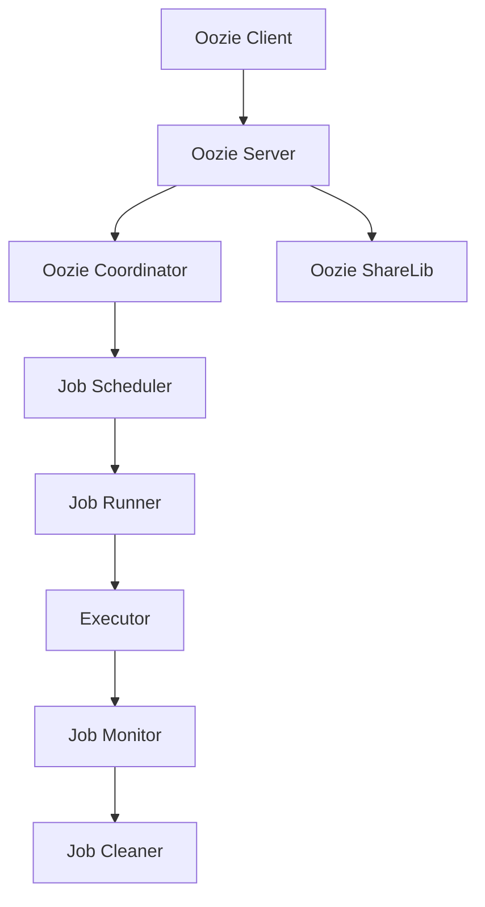
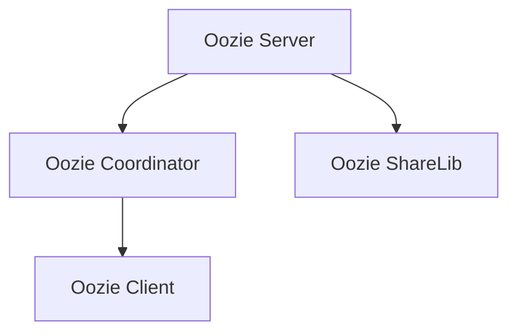
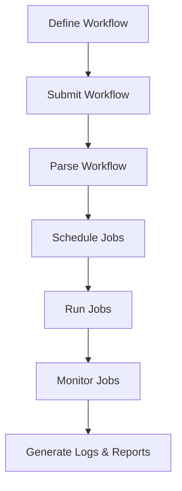
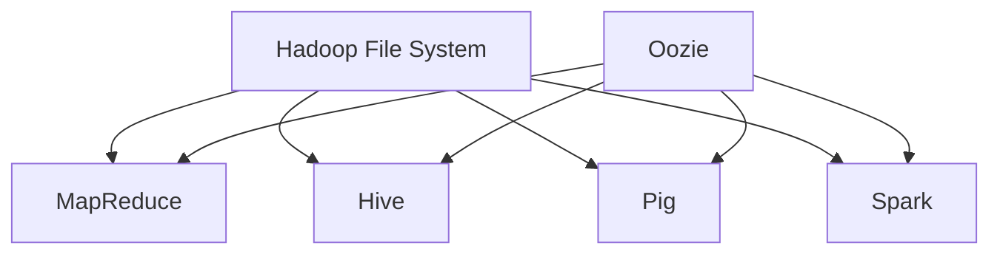

                 

### 文章标题

《Oozie工作流调度系统原理与代码实例讲解》

**关键词：** Oozie, 工作流调度, 数据源管理, 实例解析, 性能优化

**摘要：** 本文章将深入探讨Oozie工作流调度系统的原理和实现，从基础概念到实际代码实例，帮助读者全面理解Oozie的核心机制和最佳实践。文章将详细介绍Oozie的架构、核心概念、数据源管理、工作流实例解析、调度策略、与Hadoop生态系统的集成、性能优化以及监控与故障处理等内容，旨在为读者提供一份详实的Oozie学习指南。

---

### 《Oozie工作流调度系统原理与代码实例讲解》目录大纲

**第一部分：Oozie概述**

**第1章：Oozie基础**

1.1 Oozie简介  
1.2 Oozie架构  
1.3 Mermaid流程图：Oozie架构示意图

**第2章：Oozie的核心概念**

2.1 数据流调度  
2.2 工作流定义

**第3章：Oozie的数据源管理**

3.1 数据源概述  
3.2 HDFS数据源管理  
3.3 HIVE数据源管理

**第二部分：Oozie工作流实例解析**

**第4章：Oozie工作流案例**

4.1 案例一：日志数据预处理  
4.2 案例二：用户行为分析

**第5章：Oozie调度策略**

5.1 调度策略概述  
5.2 定时调度  
5.3 触发调度

**第6章：Oozie与Hadoop生态系统的集成**

6.1 Oozie与Hadoop集成  
6.2 Oozie与MapReduce的集成  
6.3 Oozie与Hive的集成

**第7章：Oozie性能优化**

7.1 Oozie性能优化概述  
7.2 调度性能优化  
7.3 数据处理性能优化

**第8章：Oozie工作流监控与故障处理**

8.1 Oozie监控概述  
8.2 Oozie监控工具  
8.3 故障处理

**第三部分：Oozie项目实战**

**第9章：Oozie项目实战**

9.1 项目背景  
9.2 项目需求分析  
9.3 环境搭建  
9.4 源代码解析  
9.5 运行与测试

**附录**

附录A：Oozie常用配置项

附录B：Oozie错误代码解析

附录C：Oozie参考资料

---

接下来，我们将逐步深入到每个章节的详细内容，通过逻辑清晰的步骤分析，帮助读者全面掌握Oozie工作流调度系统的原理与实战。让我们开始第一部分的探索，从Oozie的概述开始。<|assistant|>### Oozie概述

Oozie是一个开源的工作流调度系统，专门用于在Hadoop生态系统和大数据环境中对各种任务进行调度和监控。它提供了一个强大而灵活的框架，用于定义、调度和管理复杂的数据处理任务，如Hadoop作业、Hive查询、Pig脚本等。Oozie的特点是其能够处理复杂的依赖关系和循环逻辑，使得在执行大规模数据处理任务时更加高效和可靠。

**Oozie的起源与发展**

Oozie最初是由Yahoo!公司在2008年开发的，作为一个内部调度工具用于大规模数据处理和作业管理。后来，它在Apache Software Foundation下成为了一个顶级项目。Oozie的发展受到了社区和企业的广泛认可，并迅速成为Hadoop生态系统中的关键组件之一。

**Oozie在企业级应用中的地位**

在企业级应用中，Oozie扮演了至关重要的角色。它不仅能够调度和管理Hadoop作业，还能够与Hive、Pig、Spark等大数据处理框架无缝集成，使得企业在处理大规模数据时能够实现自动化和高效化。Oozie的高可靠性和灵活性使其成为企业构建大数据处理平台不可或缺的一部分。

**Oozie架构**

Oozie的核心架构由几个关键组件组成，包括Oozie服务器、Oozie协调器、Oozie共享库和Oozie客户端。以下是这些组件的简要描述：

- **Oozie服务器（Oozie Server）**：Oozie服务器是Oozie的核心，它负责接收和解析用户定义的工作流，并将其转换成具体的作业执行计划。服务器还负责管理作业的生命周期，包括启动、监控和清理。

- **Oozie协调器（Oozie Coordinator）**：Oozie协调器是Oozie的服务器组件的一部分，它负责根据工作流的定义来创建和调度作业。协调器会根据工作流中的依赖关系和执行策略来安排作业的执行顺序。

- **Oozie共享库（Oozie ShareLib）**：Oozie共享库包含了一些通用的库和组件，如作业模板、共享的脚本和配置文件。这些库可以帮助开发者快速构建和部署工作流。

- **Oozie客户端（Oozie Client）**：Oozie客户端提供了用户与Oozie交互的接口。用户可以通过命令行或Web界面来提交、监控和管理工作流。

**Oozie的运行流程**

Oozie的工作流程可以分为以下几个主要步骤：

1. **定义工作流**：用户使用Oozie的XML定义语言编写工作流，定义任务、依赖关系和执行策略。

2. **提交工作流**：用户通过Oozie客户端将工作流提交到Oozie服务器。

3. **解析工作流**：Oozie服务器接收并解析用户提交的工作流，生成执行计划。

4. **调度作业**：Oozie协调器根据执行计划创建和调度作业。

5. **执行作业**：作业在Hadoop集群中执行，可能涉及多个子作业和任务。

6. **监控作业**：Oozie服务器持续监控作业的执行状态，并在作业完成后进行清理。

7. **报告和日志**：Oozie生成详细的执行报告和日志，供用户查看和分析。

**Mermaid流程图：Oozie架构示意图**

下面是一个简单的Mermaid流程图，展示了Oozie的核心架构和运行流程：



通过以上对Oozie概述的介绍，我们可以看到Oozie作为工作流调度系统在Hadoop生态系统中的重要地位。在接下来的章节中，我们将深入探讨Oozie的核心概念、架构细节以及实际操作实例，帮助读者全面掌握Oozie的工作原理和实战技巧。<|assistant|>### 第1章：Oozie基础

#### 1.1 Oozie简介

Oozie是一个强大而灵活的工作流调度系统，专门用于在Hadoop生态系统和大数据环境中对各种任务进行调度和监控。Oozie的主要目标是为用户提供一个简单且高效的方式来自动化和管理复杂的数据处理流程。这些数据处理任务可能包括Hadoop作业、Hive查询、Pig脚本等，涵盖了从数据采集、清洗、存储到分析等各个环节。

Oozie起源于Yahoo!公司，作为内部调度工具用于大规模数据处理和作业管理。随着Hadoop和大数据技术的发展，Oozie在开源社区中得到了广泛的支持和认可，并在Apache Software Foundation下成为了一个顶级项目。如今，Oozie已成为Hadoop生态系统中的关键组件，广泛应用于企业级大数据处理场景。

#### 1.2 Oozie架构

Oozie的架构设计旨在提供高度可扩展性和灵活性，以适应各种复杂的工作流需求。Oozie的核心组件包括Oozie服务器、Oozie协调器、Oozie共享库和Oozie客户端。以下是对这些组件的简要描述：

- **Oozie服务器（Oozie Server）**：Oozie服务器是Oozie的核心，负责接收和解析用户定义的工作流，并将其转换成具体的作业执行计划。服务器还负责管理作业的生命周期，包括启动、监控和清理。

- **Oozie协调器（Oozie Coordinator）**：Oozie协调器是Oozie服务器的一部分，负责根据工作流的定义来创建和调度作业。协调器会根据工作流中的依赖关系和执行策略来安排作业的执行顺序。

- **Oozie共享库（Oozie ShareLib）**：Oozie共享库包含了一些通用的库和组件，如作业模板、共享的脚本和配置文件。这些库可以帮助开发者快速构建和部署工作流。

- **Oozie客户端（Oozie Client）**：Oozie客户端提供了用户与Oozie交互的接口。用户可以通过命令行或Web界面来提交、监控和管理工作流。

**Oozie的核心组件关系**

以下是Oozie核心组件之间的关系示意图：



#### 1.3 Oozie的运行流程

Oozie的工作流程可以分为以下几个主要步骤：

1. **定义工作流**：用户使用Oozie的XML定义语言编写工作流，定义任务、依赖关系和执行策略。

2. **提交工作流**：用户通过Oozie客户端将工作流提交到Oozie服务器。

3. **解析工作流**：Oozie服务器接收并解析用户提交的工作流，生成执行计划。

4. **调度作业**：Oozie协调器根据执行计划创建和调度作业。

5. **执行作业**：作业在Hadoop集群中执行，可能涉及多个子作业和任务。

6. **监控作业**：Oozie服务器持续监控作业的执行状态，并在作业完成后进行清理。

7. **报告和日志**：Oozie生成详细的执行报告和日志，供用户查看和分析。

**Oozie的运行流程示意图**

下面是一个简单的Mermaid流程图，展示了Oozie的运行流程：



通过以上对Oozie基础内容的介绍，我们可以了解到Oozie作为一个工作流调度系统的核心概念和架构设计。在接下来的章节中，我们将继续深入探讨Oozie的核心概念、数据源管理以及实际操作实例，帮助读者全面掌握Oozie的原理和实战技巧。<|assistant|>### 第2章：Oozie的核心概念

#### 2.1 数据流调度

数据流调度是Oozie的核心概念之一，它涉及到在Oozie中如何安排和执行一系列任务，以处理数据流。数据流调度的主要目标是确保任务能够按预期执行，同时最大化资源利用率并保持系统的稳定性。

**数据流调度概述**

数据流调度可以看作是一个动态过程，它涉及多个阶段：

1. **任务定义**：用户使用Oozie定义语言（Oozie Workflow Definition Language, OWDL）编写任务，指定任务的输入、输出和执行策略。
2. **依赖关系解析**：Oozie解析任务间的依赖关系，确定任务执行的顺序。
3. **任务调度**：Oozie协调器根据依赖关系和执行策略来创建作业执行计划，并将任务调度到Hadoop集群。
4. **任务执行**：在Hadoop集群中执行调度后的任务。
5. **任务监控**：Oozie服务器持续监控任务的执行状态，并在任务完成后进行清理。

**数据流调度的目标**

数据流调度的目标主要包括以下几个方面：

1. **高效性**：优化任务的执行顺序，减少任务之间的等待时间，提高整体处理效率。
2. **稳定性**：确保任务在出现错误时能够被正确处理，避免系统崩溃。
3. **灵活性**：支持复杂任务之间的依赖关系和循环逻辑，满足多样化的数据处理需求。
4. **资源利用率**：优化资源的分配和调度，充分利用集群资源。

**数据流调度算法**

在Oozie中，数据流调度算法起到了关键作用。以下是几种常用的数据流调度算法：

1. **贪心算法**：贪心算法通过选择当前最佳执行任务，以最大化资源利用率和处理效率。它通常用于简单任务调度的场景。
2. **最优算法**：最优算法通过全局优化策略，选择最佳执行顺序，以最大化系统整体性能。它通常用于复杂任务调度的场景。

以下是一个简单的伪代码示例，展示了贪心算法和数据流调度流程：

```plaintext
function greedyScheduling(tasks):
    sorted_tasks = sort(tasks by execution time)
    for task in sorted_tasks:
        if task can be executed:
            execute(task)
        else:
            wait()

function dataFlowScheduling(workflow):
    define dependencies
    schedule_tasks(greedyScheduling(dependencies))
```

#### 2.2 工作流定义

工作流定义是Oozie中另一个核心概念，它涉及到如何使用Oozie定义语言（Oozie Workflow Definition Language, OWDL）来描述和构建数据处理流程。工作流定义包括任务的定义、任务的执行顺序、任务的依赖关系以及任务的执行策略。

**工作流概述**

工作流是一种逻辑流，用于描述一系列任务的执行顺序和依赖关系。在Oozie中，工作流可以分为以下几种类型：

1. **线性工作流**：线性工作流是最简单的工作流类型，任务按照顺序执行，每个任务完成后才会执行下一个任务。
2. **分支工作流**：分支工作流涉及任务之间的条件判断和分支，允许任务根据特定条件执行不同的分支。
3. **循环工作流**：循环工作流允许任务在满足特定条件时重复执行，通常用于处理大量数据的情况。

**工作流设计原则**

在设计工作流时，需要遵循以下原则：

1. **清晰性**：工作流的设计应该简单明了，易于理解和维护。
2. **模块化**：将工作流分解为独立的模块，便于重用和调试。
3. **灵活性**：设计工作流时，应考虑未来的扩展性和适应性。
4. **可维护性**：确保工作流易于更新和维护，降低维护成本。

**工作流设计工具**

Oozie提供了一个强大的工作流设计工具，称为Oozie Designer。Oozie Designer是一个基于Web的图形化工具，允许用户通过拖放操作来构建和编辑工作流。以下是使用Oozie Designer设计工作流的基本步骤：

1. **新建工作流**：在Oozie Designer中新建一个工作流，并为其命名。
2. **添加任务**：通过拖放操作将任务添加到工作流中，如Hadoop作业、Hive查询等。
3. **设置任务属性**：为每个任务设置属性，如输入数据、输出数据、执行策略等。
4. **定义依赖关系**：使用连线将任务连接起来，定义任务的执行顺序和依赖关系。
5. **保存和预览**：保存工作流，并预览工作流设计。

通过以上对Oozie核心概念的介绍，我们可以了解到数据流调度和工作流定义在Oozie中的重要性。在接下来的章节中，我们将深入探讨Oozie的数据源管理以及实际操作实例，帮助读者全面掌握Oozie的原理和实战技巧。<|assistant|>### 第3章：Oozie的数据源管理

#### 3.1 数据源概述

在Oozie中，数据源是指数据存储的位置，可以是本地文件系统、HDFS、数据库等。数据源管理是Oozie实现数据处理功能的基础，它涉及到数据源的配置、连接和数据操作等方面。

**数据源的定义**

数据源在Oozie中是通过配置文件来定义的。配置文件通常包含数据源的连接信息、访问权限等设置。Oozie支持多种类型的数据源，包括：

- **本地文件系统**：本地文件系统是Oozie中最常用的数据源类型，用于存储临时数据和日志文件。
- **HDFS**：HDFS（Hadoop Distributed File System）是一个分布式文件系统，用于存储大规模数据。
- **数据库**：Oozie支持连接各种数据库，如Hive、MySQL、PostgreSQL等，用于数据的持久化和查询。

**数据源的类型**

根据数据源的特性，Oozie将数据源分为以下几种类型：

- **本地文件系统数据源**：本地文件系统数据源主要用于存储和访问本地文件，如文本文件、序列文件等。
- **HDFS数据源**：HDFS数据源是Oozie中最常用的数据源之一，用于存储和访问分布式文件系统中的数据。
- **数据库数据源**：数据库数据源用于连接各种数据库，如Hive、MySQL、PostgreSQL等，用于数据存储和查询。

**数据源在Oozie中的作用**

数据源在Oozie中扮演着至关重要的角色，主要包括以下几个方面：

1. **数据存储**：数据源是数据存储的位置，Oozie通过数据源来存储和处理数据。
2. **数据连接**：Oozie通过数据源连接到外部系统，如数据库、HDFS等，实现数据的导入和导出。
3. **数据操作**：Oozie通过数据源来执行各种数据操作，如数据的提取、转换和加载。

#### 3.2 HDFS数据源管理

HDFS（Hadoop Distributed File System）是Hadoop生态系统中的一个重要组件，用于存储大规模数据。在Oozie中，HDFS数据源管理是数据处理任务的关键环节。

**HDFS简介**

HDFS是一个分布式文件系统，设计用于存储和访问大量数据。它由一个NameNode和多个DataNode组成，NameNode负责存储文件的元数据，而DataNode负责存储实际的数据块。HDFS具有高可靠性、高性能和可扩展性等特点，广泛应用于大数据处理场景。

**HDFS数据源配置**

在Oozie中配置HDFS数据源涉及以下几个步骤：

1. **配置Hadoop环境**：确保Hadoop环境已经正确配置，并启动HDFS服务。
2. **配置Oozie环境**：在Oozie的配置文件中添加HDFS相关的配置项，如HDFS的主机地址、端口等。
3. **配置工作流**：在工作流中指定HDFS数据源，如指定输入数据和输出数据的HDFS路径。

以下是一个简单的HDFS数据源配置示例：

```xml
<configuration>
  <property>
    <name>oozie.service.hdfs.descriptor.class</name>
    <value>org.apache.oozie.action.hadoop.HdfsAction</value>
  </property>
  <property>
    <name>oozie.service.hdfs coordination.descriptor.class</name>
    <value>org.apache.oozie.action.hadoop.HdfsCoordinatorAction</value>
  </property>
  <property>
    <name>hadoop.job.owners</name>
    <value>oozie</value>
  </property>
</configuration>
```

**HDFS数据源操作**

在Oozie中，可以使用HDFS操作来执行各种数据操作，如文件上传、文件下载、文件删除等。以下是一个简单的HDFS数据源操作示例：

```xml
<hdfs>
  <action>
    <name>upload-file</name>
    <type>up</type>
    <configuration>
      <property>
        <name>src</name>
        <value>/tmp/source.txt</value>
      </property>
      <property>
        <name>dest</name>
        <value>/user/oozie/input/source.txt</value>
      </property>
    </configuration>
  </action>
</hdfs>
```

通过以上对HDFS数据源管理的介绍，我们可以了解到Oozie在HDFS数据源管理方面的关键作用。在接下来的章节中，我们将继续深入探讨Oozie的数据源管理以及其他相关技术，帮助读者全面掌握Oozie的原理和实战技巧。<|assistant|>### 3.3 HIVE数据源管理

Hive是一个基于Hadoop的数据仓库工具，用于处理大规模数据集。在Oozie中，Hive数据源管理是执行数据分析和数据处理任务的重要环节。本节将介绍Hive数据源的基本概念、配置和操作。

#### Hive简介

Hive是一个基于Hadoop的数据库，用于处理和分析分布式存储系统中的大规模数据。它提供了一个类似SQL的查询语言（HiveQL），使得用户可以像操作关系型数据库一样进行数据分析和查询。Hive通过将查询转化为MapReduce作业，实现了高效的数据处理能力。

#### Hive数据源配置

在Oozie中，配置Hive数据源需要以下几个步骤：

1. **配置Hadoop环境**：确保Hadoop环境已经正确配置，并启动Hive服务。
2. **配置Oozie环境**：在Oozie的配置文件中添加Hive相关的配置项，如Hive的主机地址、端口等。

以下是一个简单的Hive数据源配置示例：

```xml
<configuration>
  <property>
    <name>oozie.service.hive2.descriptor.class</name>
    <value>org.apache.oozie.action.hadoop.Hive2Action</value>
  </property>
  <property>
    <name>oozie.service.hive2.runner.class</name>
    <value>org.apache.oozie.action.hadoop.Hive2Executor</value>
  </property>
  <property>
    <name>oozie.service.hive2.connectString</name>
    <value>jdbc:hive2://hive-server:10000/default;principal=hive/_HOST@HIVE.COM</value>
  </property>
  <property>
    <name>oozie.service.hive2ugi</name>
    <value>oozie/hadoop</value>
  </property>
  <property>
    <name>oozie.service.hive2.queryFile</name>
    <value>queries/hive_query.sql</value>
  </property>
</configuration>
```

#### Hive数据源操作

在Oozie中，可以使用Hive数据源执行各种数据操作，如查询、插入和更新数据。以下是一个简单的Hive数据源操作示例：

```xml
<hive2>
  <action>
    <name>run-hive-query</name>
    <type>query</type>
    <configuration>
      <property>
        <name>queryFile</name>
        <value>queries/hive_query.sql</value>
      </property>
      <property>
        <name>resultFile</name>
        <value>/user/oozie/output/hive_query_result.txt</value>
      </property>
    </configuration>
  </action>
</hive2>
```

在这个示例中，`hive_query.sql`是一个包含HiveQL查询的文件，`/user/oozie/output/hive_query_result.txt`是查询结果的输出文件。

#### Hive数据源与HDFS数据源的区别

Hive数据源与HDFS数据源的主要区别在于：

1. **数据存储格式**：HDFS数据源主要用于存储原始数据，如文本文件、序列文件等。而Hive数据源主要用于存储处理后的数据，如Hive表、分区表等。
2. **数据处理能力**：HDFS数据源主要提供数据的存储和访问功能，而Hive数据源提供了强大的数据查询和分析功能，通过HiveQL查询语言进行数据操作。
3. **查询性能**：Hive数据源的查询性能通常优于HDFS数据源，因为它采用了优化算法和索引技术。

通过以上对Hive数据源管理的介绍，我们可以了解到Oozie在Hive数据源管理方面的关键作用。在接下来的章节中，我们将继续深入探讨Oozie的数据源管理以及其他相关技术，帮助读者全面掌握Oozie的原理和实战技巧。<|assistant|>### 第二部分：Oozie工作流实例解析

#### 第4章：Oozie工作流案例

在实际应用中，Oozie的工作流实例解析是理解其工作原理和实战技巧的关键。本章节将详细介绍两个具体的Oozie工作流案例：日志数据预处理和用户行为分析。通过这两个案例，我们将深入探讨Oozie工作流的构建、执行和监控。

##### 4.1 案例一：日志数据预处理

**案例背景**：随着互联网的发展，大量的日志数据被生成并存储在各种系统中。为了进行有效的数据分析，需要对日志数据进行预处理，包括日志文件的提取、清洗、格式化等步骤。

**案例目标**：构建一个Oozie工作流，实现对日志数据的高效预处理。

**工作流设计**：

1. **任务定义**：定义提取日志文件、清洗日志数据和格式化日志数据的任务。
2. **依赖关系**：设置任务间的依赖关系，确保清洗任务在提取任务完成后执行，格式化任务在清洗任务完成后执行。
3. **执行策略**：设置任务的执行策略，如并行执行、顺序执行等。

**伪代码：日志数据预处理流程**

```xml
<workflow-app xmlns="uri:oozie:workflow:0.1">
  <workflow name="log-processor" start="extract-log">
    <start name="extract-log">
      <action>
        <hdfs>
          <arg value="/path/to/log/file"/>
          <arg value="/user/oozie/output/logs"/>
        </action>
      </hdfs>
    </start>
    <transition on-success="clean-log" to="clean-log"/>
    <transition on-success="format-log" to="format-log"/>
    <end name="log-processed"/>
    <action>
      <name>clean-log</name>
      <type>clean</type>
      <configuration>
        <property name="log-file" value="/user/oozie/output/logs"/>
      </configuration>
    </action>
    <action>
      <name>format-log</name>
      <type>format</type>
      <configuration>
        <property name="log-file" value="/user/oozie/output/logs"/>
      </configuration>
    </action>
  </workflow>
</workflow-app>
```

在这个案例中，`extract-log`任务负责从HDFS中提取日志文件，`clean-log`任务负责清洗日志数据，`format-log`任务负责格式化日志数据。工作流通过设置任务间的依赖关系，确保清洗和格式化任务在提取任务完成后执行。

**执行与监控**：

1. **执行**：通过Oozie客户端提交工作流，Oozie服务器会解析工作流并调度任务。
2. **监控**：Oozie服务器会持续监控任务的执行状态，并在任务完成后生成执行报告。

##### 4.2 案例二：用户行为分析

**案例背景**：为了分析用户行为，需要对用户日志进行实时采集和处理，并生成用户行为分析报告。

**案例目标**：构建一个Oozie工作流，实现对用户日志的实时处理和分析。

**工作流设计**：

1. **任务定义**：定义日志采集、数据清洗、数据分析和生成报告的任务。
2. **依赖关系**：设置任务间的依赖关系，确保分析任务在清洗任务完成后执行，报告生成任务在分析任务完成后执行。
3. **执行策略**：设置任务的执行策略，如并行执行、顺序执行等。

**伪代码：用户行为分析流程**

```xml
<workflow-app xmlns="uri:oozie:workflow:0.1">
  <workflow name="user-behavior-analysis" start="collect-log">
    <start name="collect-log">
      <action>
        <hdfs>
          <arg value="/path/to/log/file"/>
          <arg value="/user/oozie/output/logs"/>
        </action>
      </hdfs>
    </start>
    <transition on-success="clean-log" to="clean-log"/>
    <transition on-success="analyze-behavior" to="analyze-behavior"/>
    <transition on-success="generate-report" to="generate-report"/>
    <end name="report-generated"/>
    <action>
      <name>clean-log</name>
      <type>clean</type>
      <configuration>
        <property name="log-file" value="/user/oozie/output/logs"/>
      </configuration>
    </action>
    <action>
      <name>analyze-behavior</name>
      <type>analyze</type>
      <configuration>
        <property name="log-file" value="/user/oozie/output/logs"/>
      </configuration>
    </action>
    <action>
      <name>generate-report</name>
      <type>generate</type>
      <configuration>
        <property name="report-file" value="/user/oozie/output/reports"/>
      </configuration>
    </action>
  </workflow>
</workflow-app>
```

在这个案例中，`collect-log`任务负责从HDFS中采集日志文件，`clean-log`任务负责清洗日志数据，`analyze-behavior`任务负责分析用户行为，`generate-report`任务负责生成分析报告。工作流通过设置任务间的依赖关系，确保分析任务和报告生成任务在清洗任务完成后执行。

**执行与监控**：

1. **执行**：通过Oozie客户端提交工作流，Oozie服务器会解析工作流并调度任务。
2. **监控**：Oozie服务器会持续监控任务的执行状态，并在任务完成后生成执行报告。

通过以上两个案例，我们可以看到Oozie工作流实例解析的关键步骤和执行流程。在接下来的章节中，我们将继续深入探讨Oozie的调度策略、集成和性能优化等方面的内容。<|assistant|>### 第5章：Oozie调度策略

调度策略在Oozie中起到了关键作用，它决定了任务如何在Hadoop集群中执行和调度。有效的调度策略能够优化任务的执行顺序，提高资源利用率，确保系统的高可用性和稳定性。本章节将详细介绍Oozie的调度策略，包括定时调度和触发调度。

#### 5.1 调度策略概述

调度策略是指任务在执行过程中的时间管理和资源分配策略。在Oozie中，调度策略决定了任务如何根据工作流的定义和执行策略来安排和执行。调度策略主要包括以下几个方面：

1. **定时调度**：根据固定的时间间隔或特定的时间点来调度任务。
2. **触发调度**：根据特定的触发条件来调度任务，如文件到达、作业完成等。
3. **依赖调度**：根据任务之间的依赖关系来调度任务，确保任务按照预定的顺序执行。

**调度策略的目标**：

1. **高效性**：优化任务的执行顺序和资源分配，减少任务之间的等待时间，提高整体处理效率。
2. **可靠性**：确保任务在出现错误时能够被正确处理，避免系统崩溃。
3. **灵活性**：支持多种调度策略和复杂的依赖关系，满足多样化的数据处理需求。

#### 5.2 定时调度

定时调度是一种根据固定时间间隔或特定时间点来调度任务的策略。在Oozie中，定时调度通过配置定时调度器来实现。定时调度器会按照预定的时间间隔或时间点来执行任务，适用于周期性数据处理任务，如日志收集、报表生成等。

**定时调度原理**

定时调度的原理如下：

1. **配置定时调度器**：用户通过配置文件定义定时调度器，指定调度的时间间隔或时间点。
2. **调度器执行任务**：定时调度器在预定的时间执行任务，将任务调度到Oozie协调器。
3. **协调器创建作业**：Oozie协调器根据工作流的定义创建作业，并将作业调度到Hadoop集群。
4. **作业执行**：作业在Hadoop集群中执行，可能涉及多个子作业和任务。
5. **任务监控**：Oozie服务器持续监控任务的执行状态，并在任务完成后进行清理。

**定时调度配置**

在Oozie中，定时调度配置涉及以下几个关键步骤：

1. **配置Oozie环境**：在Oozie的配置文件中添加定时调度器相关的配置项，如调度器名称、调度时间等。
2. **配置工作流**：在工作流中指定定时调度器，并设置任务的执行时间和间隔。

以下是一个简单的定时调度配置示例：

```xml
<configuration>
  <property>
    <name>oozie.scheduler.frequency</name>
    <value>0 0 * * *</value>
    <!-- 每天的整点执行 -->
  </property>
</configuration>
```

在这个示例中，`0 0 * * *`表示每天的整点执行任务。

**定时调度实例解析**

以下是一个简单的定时调度实例，用于每天收集和清理日志文件：

```xml
<workflow-app xmlns="uri:oozie:workflow:0.1">
  <workflow name="log-collector">
    <start name="collect-log">
      <action>
        <hdfs>
          <arg value="/path/to/log/file"/>
          <arg value="/user/oozie/output/logs"/>
        </action>
      </hdfs>
    </start>
    <transition on-success="clean-log" to="clean-log"/>
    <end name="log-processed"/>
    <action>
      <name>clean-log</name>
      <type>clean</type>
      <configuration>
        <property name="log-file" value="/user/oozie/output/logs"/>
      </configuration>
    </action>
  </workflow>
</workflow-app>
```

在这个实例中，工作流每天定时执行，收集和清理日志文件。

#### 5.3 触发调度

触发调度是一种根据特定的触发条件来调度任务的策略。在Oozie中，触发调度通过配置触发器来实现。触发器会根据文件到达、作业完成等条件来触发任务的执行，适用于实时数据处理任务，如日志分析、实时报表等。

**触发调度原理**

触发调度的原理如下：

1. **配置触发器**：用户通过配置文件定义触发器，指定触发条件，如文件到达、作业完成等。
2. **触发器触发任务**：当触发条件满足时，触发器会触发任务，将任务调度到Oozie协调器。
3. **协调器创建作业**：Oozie协调器根据工作流的定义创建作业，并将作业调度到Hadoop集群。
4. **作业执行**：作业在Hadoop集群中执行，可能涉及多个子作业和任务。
5. **任务监控**：Oozie服务器持续监控任务的执行状态，并在任务完成后进行清理。

**触发调度配置**

在Oozie中，触发调度配置涉及以下几个关键步骤：

1. **配置Oozie环境**：在Oozie的配置文件中添加触发器相关的配置项，如触发器名称、触发条件等。
2. **配置工作流**：在工作流中指定触发器，并设置任务的触发条件和执行策略。

以下是一个简单的触发调度配置示例：

```xml
<configuration>
  <property>
    <name>oozie.trigger.frequency</name>
    <value>1 * * * *</value>
    <!-- 每分钟检查一次触发条件 -->
  </property>
</configuration>
```

在这个示例中，`1 * * * *`表示每分钟检查一次触发条件。

**触发调度实例解析**

以下是一个简单的触发调度实例，用于实时分析日志文件：

```xml
<workflow-app xmlns="uri:oozie:workflow:0.1">
  <workflow name="log-analyzer">
    <start name="analyze-log">
      <action>
        <trigger>
          <arg value="/path/to/log/file"/>
          <arg value="file"/>
        </action>
      </trigger>
    </start>
    <transition on-success="generate-report" to="generate-report"/>
    <end name="report-generated"/>
    <action>
      <name>generate-report</name>
      <type>generate</type>
      <configuration>
        <property name="report-file" value="/user/oozie/output/reports"/>
      </configuration>
    </action>
  </workflow>
</workflow-app>
```

在这个实例中，工作流根据日志文件的到达触发任务，实时分析日志文件并生成报告。

通过以上对Oozie调度策略的详细介绍，我们可以看到Oozie提供了灵活且强大的调度机制，能够满足不同类型的数据处理需求。在接下来的章节中，我们将继续深入探讨Oozie与Hadoop生态系统的集成、性能优化以及监控与故障处理等方面的内容。<|assistant|>### 第6章：Oozie与Hadoop生态系统的集成

Oozie作为Hadoop生态系统中的一个关键组件，能够与其他Hadoop生态系统中的技术无缝集成，提供一站式的数据处理解决方案。本章节将详细讨论Oozie与Hadoop生态系统中几个重要组件的集成，包括MapReduce、Hive、Spark等。

#### 6.1 Oozie与Hadoop集成

Oozie与Hadoop的集成主要体现在调度和管理Hadoop生态系统中的各种数据处理任务。Oozie能够调度和管理MapReduce、Hive、Pig、Spark等任务，使得用户能够通过一个统一的工作流来管理这些任务。

**Oozie与Hadoop的关系**

Oozie与Hadoop之间的关系如下：

- **调度与协调**：Oozie负责调度和管理Hadoop生态系统中的任务，确保任务按照预定的顺序和依赖关系执行。
- **资源管理**：Oozie与Hadoop的YARN（Yet Another Resource Negotiator）集成，能够动态分配资源，优化任务执行。
- **作业监控**：Oozie持续监控作业的执行状态，并在作业完成后生成详细的执行报告。

**Oozie在Hadoop生态系统中的位置**

Oozie在Hadoop生态系统中的位置如下图所示：



在这个生态系统中，Oozie作为工作流调度系统，位于HDFS、MapReduce、Hive、Pig和Spark等组件之上，负责调度和管理这些组件的任务。

**Oozie与MapReduce的集成**

Oozie与MapReduce的集成是Oozie调度管理功能的核心之一。Oozie能够调度和管理MapReduce作业，确保作业按照预定的顺序和依赖关系执行。

**Oozie与MapReduce集成配置**

以下是Oozie与MapReduce集成的基本配置步骤：

1. **配置Hadoop环境**：确保Hadoop环境已经正确配置，并启动HDFS和YARN服务。
2. **配置Oozie环境**：在Oozie的配置文件中添加MapReduce相关的配置项，如HDFS和YARN的主机地址、端口等。
3. **配置工作流**：在工作流中指定MapReduce作业的路径和参数。

以下是一个简单的Oozie与MapReduce集成配置示例：

```xml
<configuration>
  <property>
    <name>mapreduce.jobtracker.address</name>
    <value>hadoop-server:50030</value>
  </property>
  <property>
    <name>mapreduce.framework.name</name>
    <value>yarn</value>
  </property>
</configuration>
```

在这个示例中，`hadoop-server:50030`是MapReduce JobTracker的主机地址和端口。

**Oozie与MapReduce工作流程**

以下是Oozie与MapReduce集成的工作流程：

1. **定义MapReduce作业**：使用MapReduce定义语言编写MapReduce作业，包括输入、输出、Mapper和Reducer等。
2. **提交作业**：通过Oozie客户端将MapReduce作业提交到Oozie服务器。
3. **解析作业**：Oozie服务器接收并解析作业，生成执行计划。
4. **调度作业**：Oozie协调器根据执行计划创建和调度作业。
5. **执行作业**：作业在Hadoop集群中执行，可能涉及多个子作业和任务。
6. **监控作业**：Oozie服务器持续监控作业的执行状态，并在作业完成后生成执行报告。

#### 6.2 Oozie与Hive的集成

Oozie与Hive的集成使得用户能够通过Oozie调度和管理Hive查询，实现复杂的数据处理和分析任务。

**Oozie与Hive的关系**

Oozie与Hive之间的关系如下：

- **调度与执行**：Oozie负责调度和管理Hive查询，确保查询按照预定的顺序和依赖关系执行。
- **资源管理**：Oozie与Hive集成，能够动态分配资源，优化查询执行。
- **作业监控**：Oozie持续监控Hive查询的执行状态，并在查询完成后生成详细的执行报告。

**Oozie与Hive集成配置**

以下是Oozie与Hive集成的基本配置步骤：

1. **配置Hadoop和Hive环境**：确保Hadoop和Hive环境已经正确配置，并启动HDFS、YARN和Hive服务。
2. **配置Oozie环境**：在Oozie的配置文件中添加Hive相关的配置项，如Hive的主机地址、端口等。
3. **配置工作流**：在工作流中指定Hive查询的路径和参数。

以下是一个简单的Oozie与Hive集成配置示例：

```xml
<configuration>
  <property>
    <name>oozie.hive2.connectString</name>
    <value>jdbc:hive2://hive-server:10000/default;principal=hive/_HOST@HIVE.COM</value>
  </property>
  <property>
    <name>oozie.service.hive2.runner.class</name>
    <value>org.apache.oozie.action.hadoop.Hive2Executor</value>
  </property>
</configuration>
```

在这个示例中，`hive-server:10000`是Hive的主机地址和端口。

**Oozie与Hive工作流程**

以下是Oozie与Hive集成的工作流程：

1. **定义Hive查询**：使用Hive定义语言编写Hive查询，包括SELECT、INSERT、CREATE TABLE等语句。
2. **提交查询**：通过Oozie客户端将Hive查询提交到Oozie服务器。
3. **解析查询**：Oozie服务器接收并解析查询，生成执行计划。
4. **调度查询**：Oozie协调器根据执行计划创建和调度查询。
5. **执行查询**：查询在Hive中执行，可能涉及多个子查询和任务。
6. **监控查询**：Oozie服务器持续监控查询的执行状态，并在查询完成后生成执行报告。

通过以上对Oozie与Hadoop生态系统中重要组件的集成讨论，我们可以看到Oozie在Hadoop生态系统中的关键作用和强大功能。在接下来的章节中，我们将继续深入探讨Oozie的性能优化、监控与故障处理等内容。<|assistant|>### 第7章：Oozie性能优化

Oozie作为Hadoop生态系统中的工作流调度系统，其性能优化对于确保系统高效稳定运行至关重要。本章将详细讨论Oozie性能优化的各个关键方面，包括调度性能优化和数据处理性能优化。

#### 7.1 Oozie性能优化概述

性能优化是提高Oozie系统整体性能的重要手段。Oozie性能优化的目标是减少调度延迟、提高资源利用率，从而提升系统的处理效率和响应速度。性能优化的主要方法包括以下几个方面：

1. **调度性能优化**：通过优化调度算法、减少任务等待时间、合理分配资源等手段，提高调度效率。
2. **数据处理性能优化**：通过优化数据流调度、选择合适的数据处理算法、优化Hadoop作业配置等手段，提高数据处理效率。
3. **系统资源优化**：通过合理配置系统资源、调整Oozie服务器和Hadoop集群的参数设置，提高系统整体的资源利用率。

#### 7.2 调度性能优化

调度性能优化是Oozie性能优化的核心环节。以下是一些关键的调度性能优化策略：

**减少任务等待时间**

1. **优化依赖关系**：通过合理设计工作流中的依赖关系，减少任务之间的等待时间。例如，可以将相互独立的任务并行执行，避免不必要的等待。
2. **优先级调度**：根据任务的紧急程度和重要性，设置不同的任务优先级，优先执行高优先级任务，减少低优先级任务的等待时间。

**合理分配资源**

1. **动态资源调整**：根据任务的实际执行需求和系统负载情况，动态调整Oozie服务器和Hadoop集群的资源配置，确保资源得到充分利用。
2. **资源预留**：为高优先级任务预留一定比例的系统资源，确保这些任务能够得到足够的资源支持，避免因资源不足导致任务执行延迟。

**优化调度算法**

1. **使用高效的调度算法**：选择适合实际场景的调度算法，如贪心算法、最优算法等。合理选择调度算法可以提高任务执行的顺序和效率。
2. **任务预分配**：在任务调度前，预先分配必要的资源和依赖关系，减少任务执行时的等待时间和调度开销。

**案例：基于贪心算法的任务调度**

以下是一个基于贪心算法的调度优化案例：

```plaintext
function greedyScheduling(tasks):
    sorted_tasks = sort(tasks by execution time)
    for task in sorted_tasks:
        if resources are available for task:
            execute(task)
        else:
            wait()
```

在这个案例中，贪心算法通过选择当前执行时间最短的任务，以最大化资源利用率和处理效率。调度过程包括任务排序、资源判断和任务执行。

**调度性能优化效果**

调度性能优化能够显著提高Oozie系统的整体性能。通过减少任务等待时间和优化资源分配，调度性能优化可以降低调度延迟，提高系统吞吐量和响应速度，从而提升用户的使用体验。

#### 7.3 数据处理性能优化

数据处理性能优化是Oozie性能优化的另一个重要方面。以下是一些数据处理性能优化的策略：

**优化数据流调度**

1. **减少数据传输延迟**：通过优化数据流调度，减少数据在传输过程中的延迟。例如，可以采用数据压缩、数据缓存等技术，提高数据传输效率。
2. **并行处理**：将数据处理任务分解为多个子任务，并行处理数据，提高数据处理速度。

**选择合适的数据处理算法**

1. **算法优化**：根据数据处理任务的特点和需求，选择合适的数据处理算法。例如，对于大规模数据处理任务，可以选择MapReduce、Spark等分布式计算框架，提高处理效率。
2. **算法调优**：对数据处理算法进行调优，优化算法的实现细节，提高算法的执行效率。

**优化Hadoop作业配置**

1. **调整MapReduce参数**：根据任务的特点和需求，调整MapReduce的参数设置，如MapReduce任务并发数、数据分区策略等，优化作业的执行效率。
2. **优化HDFS配置**：合理配置HDFS参数，如块大小、副本数量等，优化数据存储和访问性能。

**案例：基于Spark的数据处理优化**

以下是一个基于Spark的数据处理优化案例：

```plaintext
import org.apache.spark.sql.SparkSession

val spark = SparkSession
  .builder()
  .appName("Data Processing Optimization")
  .master("yarn")
  .config("spark.executor.memory", "4g")
  .config("spark.executor.cores", "4")
  .getOrCreate()

// 加载数据
val data = spark.read.csv("hdfs://path/to/data.csv")

// 数据处理
val processedData = data.select("column1", "column2").filter($"column1" > 0)

// 保存结果
processedData.write.format("csv").save("hdfs://path/to/output")

spark.stop()
```

在这个案例中，Spark作为分布式计算框架，通过调整配置参数和优化数据处理流程，提高数据处理性能。

**数据处理性能优化效果**

数据处理性能优化可以显著提高Oozie系统的数据处理效率。通过优化数据流调度、选择合适的数据处理算法和优化Hadoop作业配置，数据处理性能优化可以降低数据处理延迟，提高系统吞吐量和响应速度，从而提升用户的使用体验。

通过以上对Oozie性能优化的详细介绍，我们可以看到Oozie性能优化在提高系统性能和效率方面的关键作用。在接下来的章节中，我们将继续深入探讨Oozie的监控与故障处理，帮助读者全面掌握Oozie的原理和实践技巧。<|assistant|>### 第8章：Oozie工作流监控与故障处理

Oozie作为工作流调度系统，确保其正常运行对于整个大数据处理平台的稳定性至关重要。本章将介绍Oozie工作流监控和故障处理的方法和策略。

#### 8.1 Oozie监控概述

Oozie监控是指对Oozie工作流的执行状态、性能和资源使用情况等进行监控，以便及时发现和解决问题。Oozie监控的主要目标包括：

- **实时监控**：持续监控工作流的执行状态，确保任务按照预期执行。
- **性能监控**：监控Oozie服务器的性能指标，如CPU使用率、内存使用率等，确保系统资源得到合理利用。
- **资源监控**：监控Hadoop集群的资源使用情况，如节点负载、数据存储等，确保系统资源得到充分利用。

**Oozie监控的目标**

Oozie监控的目标主要包括以下几个方面：

- **提高系统稳定性**：通过实时监控和性能监控，及时发现和解决问题，确保Oozie系统的稳定性。
- **优化系统性能**：通过性能监控和资源监控，分析系统性能瓶颈，提出优化建议，提高系统性能。
- **提高用户满意度**：通过实时监控和故障处理，确保工作流按照预期执行，提高用户满意度。

#### 8.2 Oozie监控工具

Oozie自带了一些监控工具，帮助用户实时监控工作流的执行状态和性能。以下是一些常用的Oozie监控工具：

1. **Oozie Web Console**：Oozie Web Console是一个基于Web的监控工具，提供了丰富的监控功能，包括工作流执行状态、任务进度、日志查看等。用户可以通过Web界面实时监控Oozie工作流。

2. **Oozie Metrics System**：Oozie Metrics System是一个基于JMX的监控工具，提供了Oozie服务器的性能指标，如CPU使用率、内存使用率等。用户可以通过JMX客户端查看Oozie服务器的性能指标。

3. **Oozie Admin Console**：Oozie Admin Console是一个命令行工具，提供了对Oozie工作流的管理和监控功能，包括工作流提交、删除、重启等。

**Oozie自带的监控工具**

以下是Oozie自带的一些监控工具：

- **Oozie UI**：Oozie UI提供了实时监控工作流执行状态的功能。用户可以在Web界面上查看工作流的当前状态、任务进度、错误日志等。
- **oozie admin**：`oozie admin`命令行工具提供了对工作流的监控和管理功能。例如，用户可以使用`oozie admin -status`命令查看工作流的执行状态。
- **oozie eventlog**：`oozie eventlog`命令行工具用于查看Oozie服务器的日志文件，帮助用户诊断问题。

#### 8.3 故障处理

在Oozie工作流执行过程中，可能会出现各种故障和错误。有效的故障处理策略能够帮助用户快速定位问题并恢复系统。

**故障定位**

故障定位是故障处理的第一步。以下是一些常见的故障定位方法：

- **查看日志**：查看Oozie工作流和相关组件的日志文件，找出故障发生的原因。Oozie工作流的日志通常位于Oozie服务器的日志目录中。
- **检查配置**：检查Oozie工作流和相关组件的配置文件，确保配置正确无误。
- **查看系统状态**：检查Oozie服务器和Hadoop集群的系统状态，如CPU使用率、内存使用率、网络状态等，找出可能的故障原因。

**故障处理流程**

故障处理的一般流程如下：

1. **问题诊断**：根据故障现象，通过查看日志、检查配置、查看系统状态等方法进行问题诊断。
2. **定位故障**：根据诊断结果，确定故障的具体原因和位置。
3. **解决问题**：根据故障原因，采取相应的措施解决问题。例如，如果故障原因是配置错误，则需要修正配置；如果故障原因是资源不足，则需要增加系统资源。
4. **测试验证**：解决问题后，进行测试验证，确保故障已经解决。

**故障处理实例**

以下是一个Oozie工作流执行失败的故障处理实例：

1. **问题诊断**：用户发现Oozie工作流执行失败，查看Oozie UI和日志文件，发现工作流在执行某个任务时出现错误，错误信息为“无法连接到数据库”。
2. **定位故障**：根据错误信息，检查数据库连接配置，发现数据库连接信息不正确，导致无法连接到数据库。
3. **解决问题**：修正数据库连接配置，确保连接信息正确。
4. **测试验证**：重新提交工作流，验证故障是否已经解决。

通过以上对Oozie工作流监控和故障处理的详细介绍，我们可以看到Oozie监控和故障处理在确保Oozie系统稳定运行方面的重要性。在接下来的章节中，我们将深入探讨Oozie项目实战，帮助读者将Oozie的理论知识应用到实际项目中。<|assistant|>### 第9章：Oozie项目实战

#### 9.1 项目背景

在现代大数据处理场景中，Oozie工作流调度系统被广泛应用于各种复杂的数据处理任务。本章节将通过一个实际项目案例，详细展示如何使用Oozie构建和部署一个完整的数据处理工作流。本案例的目标是构建一个数据采集、清洗、存储和报表生成的自动化数据处理平台，以实现对大量日志数据的实时分析和报表生成。

#### 9.2 项目需求分析

根据项目需求，数据处理平台需要实现以下功能：

1. **数据采集**：从各种数据源（如Web日志、数据库日志等）采集原始数据。
2. **数据清洗**：清洗和转换原始数据，确保数据的质量和一致性。
3. **数据存储**：将清洗后的数据存储到分布式存储系统（如HDFS、Hive等）中。
4. **报表生成**：定期生成数据报表，用于业务分析和决策支持。
5. **自动化调度**：使用Oozie工作流调度系统实现自动化数据处理任务调度。

#### 9.3 环境搭建

要构建一个完整的Oozie项目，需要搭建以下环境：

1. **Hadoop集群**：搭建一个Hadoop集群，包括HDFS、YARN、MapReduce等服务。
2. **Oozie服务器**：安装和配置Oozie服务器，包括Oozie核心组件、HDFS集成、YARN集成等。
3. **Hive数据库**：安装和配置Hive数据库，用于数据存储和查询。
4. **其他工具**：安装和配置必要的工具，如Apache Nifi（用于数据采集）、Apache Spark（用于数据处理）等。

#### 9.4 源代码解析

本项目的源代码包括以下几个关键部分：

1. **数据采集脚本**：使用Nifi编写数据采集脚本，负责从各种数据源采集原始数据。
2. **数据清洗脚本**：使用Spark编写数据清洗脚本，负责清洗和转换原始数据。
3. **数据存储脚本**：使用Hive编写数据存储脚本，负责将清洗后的数据存储到Hive数据库中。
4. **报表生成脚本**：使用Spark编写报表生成脚本，负责定期生成数据报表。

**源代码结构**

项目的源代码结构如下：

```plaintext
data-processing-platform/
├── data-collection/
│   ├── nifi-log-collector/
│   │   └── log-collector.nar
├── data-cleaning/
│   ├── spark-cleaning/
│   │   └── cleaning.py
├── data-storage/
│   ├── hive-storage/
│   │   └── storage.sql
└── report-generation/
    └── spark-reporting/
        └── reporting.py
```

**代码解读与分析**

以下是对项目源代码的关键部分进行解读和分析：

1. **数据采集脚本**：`nifi-log-collector/log-collector.nar`是一个Nifi插件包，用于从Web日志文件中采集数据。该脚本通过Nifi的Web界面进行配置，设置数据采集的频率和来源。
   
2. **数据清洗脚本**：`data-cleaning/spark-cleaning/cleaning.py`是一个Spark脚本，用于清洗和转换采集到的原始数据。该脚本使用Spark的DataFrame API，对数据进行去重、格式化、类型转换等操作。

   ```python
   from pyspark.sql import SparkSession

   spark = SparkSession.builder \
       .appName("DataCleaning") \
       .getOrCreate()

   # 读取原始数据
   raw_data = spark.read.csv("hdfs://path/to/raw/data/*.csv")

   # 数据清洗操作
   cleaned_data = raw_data \
       .dropDuplicates() \
       .withColumn("date", to_date("timestamp", "yyyy-MM-dd")) \
       .withColumn("user", col("user").cast("string"))

   # 保存清洗后的数据
   cleaned_data.write.mode("overwrite").parquet("hdfs://path/to/cleaned/data")
   
   spark.stop()
   ```

3. **数据存储脚本**：`data-storage/hive-storage/storage.sql`是一个Hive脚本，用于将清洗后的数据存储到Hive数据库中。该脚本使用Hive的SQL语句，创建表结构并将数据插入表中。

   ```sql
   CREATE TABLE IF NOT EXISTS datawarehouse.cleaned_data (
       date DATE,
       user STRING,
       action STRING,
       count INT
   );

   INSERT INTO datawarehouse.cleaned_data
   SELECT date, user, action, count FROM cleaned_data;
   ```

4. **报表生成脚本**：`report-generation/spark-reporting/reporting.py`是一个Spark脚本，用于定期生成数据报表。该脚本使用Spark的DataFrame API，对数据进行聚合和分析，生成报表数据。

   ```python
   from pyspark.sql import SparkSession

   spark = SparkSession.builder \
       .appName("DataReporting") \
       .getOrCreate()

   # 读取清洗后的数据
   cleaned_data = spark.read.parquet("hdfs://path/to/cleaned/data/*.parquet")

   # 数据聚合和分析
   report_data = cleaned_data.groupBy("date", "user") \
       .agg(sum("count").alias("total_count"))

   # 保存报表数据
   report_data.write.mode("overwrite").parquet("hdfs://path/to/report/data/*.parquet")

   spark.stop()
   ```

#### 9.5 运行与测试

在完成环境搭建和源代码编写后，接下来是运行和测试整个数据处理平台。以下是运行与测试的步骤：

1. **启动Hadoop集群**：确保Hadoop集群已经启动，包括HDFS、YARN、MapReduce等服务。
2. **启动Oozie服务器**：启动Oozie服务器，确保Oozie服务正常。
3. **配置Oozie工作流**：在Oozie服务器中配置工作流，包括数据采集、数据清洗、数据存储和报表生成等任务。
4. **提交工作流**：通过Oozie客户端提交工作流，开始执行数据处理任务。
5. **监控工作流执行**：使用Oozie Web Console或命令行工具监控工作流的执行状态，确保任务按照预期执行。
6. **测试报表生成**：在工作流执行完成后，检查报表数据的生成情况，确保报表数据正确。

通过以上步骤，我们可以完成一个完整的Oozie项目实战，实现数据的采集、清洗、存储和报表生成。在实际应用中，可以根据具体需求进行调整和优化，提高系统的性能和可靠性。<|assistant|>### 附录

#### 附录A：Oozie常用配置项

Oozie的配置项对系统的运行行为有重要影响。以下是一些常用的Oozie配置项及其作用：

1. **oozie.service和工作流配置**：
   - `oozie.service.hadoop.username`：设置运行Hadoop作业的用户名。
   - `oozie.service.hadoop.security.principal`：设置运行Hadoop作业的服务器安全主体。
   - `oozie.service.hdfs.descriptor.class`：设置HDFS操作使用的描述器类。
   - `oozie.service.hdfs coordination.descriptor.class`：设置HDFS协调操作使用的描述器类。

2. **Oozie服务器配置**：
   - `oozie.models.path`：设置Oozie模型文件存储的路径。
   - `oozie.log.path`：设置Oozie日志文件存储的路径。
   - `oozie.webservices.hive2.connectString`：设置连接Hive数据库的连接字符串。

3. **调度器配置**：
   - `oozie.scheduler.frequency`：设置调度器的频率。
   - `oozie.scheduler.id`：设置调度器的唯一ID。

4. **作业监控和日志**：
   - `oozie.job.log.filter`：设置作业日志的过滤器。
   - `oozie.job.log.timer`：设置作业日志的时间间隔。

#### 附录B：Oozie错误代码解析

Oozie在运行过程中可能会遇到各种错误，了解这些错误代码有助于快速定位和解决问题。以下是一些常见的Oozie错误代码及其解析：

1. **1001：Job Submission Error**
   - 原因：提交作业时发生错误，通常是由于权限问题或配置错误导致的。
   - 解决方法：检查Oozie服务器和Hadoop集群的权限设置，确保用户有足够的权限提交作业。

2. **1002：Job Initialization Error**
   - 原因：初始化作业时发生错误，可能是由于作业配置文件错误或依赖关系未正确设置导致的。
   - 解决方法：检查作业的配置文件，确保所有依赖关系都已正确配置。

3. **1003：Job Running Error**
   - 原因：作业在运行过程中发生错误，可能是由于资源不足或作业逻辑错误导致的。
   - 解决方法：检查作业的运行日志，找出错误原因，并根据需要调整系统资源或作业逻辑。

4. **2001：Action Submission Error**
   - 原因：提交任务时发生错误，通常是由于任务配置错误或依赖关系未正确设置导致的。
   - 解决方法：检查任务的配置文件，确保所有依赖关系都已正确配置。

5. **2002：Action Initialization Error**
   - 原因：初始化任务时发生错误，可能是由于任务配置文件错误或系统资源不足导致的。
   - 解决方法：检查任务的配置文件，确保配置正确，并根据需要调整系统资源。

6. **3001：Filesystem Error**
   - 原因：文件系统操作发生错误，可能是由于文件路径错误或权限问题导致的。
   - 解决方法：检查文件路径和权限设置，确保Oozie用户有足够的权限访问所需文件。

#### 附录C：Oozie参考资料

为了更好地学习和使用Oozie，以下是一些重要的参考资料：

1. **Oozie官方文档**：
   - 地址：[Oozie官方文档](https://oozie.apache.org/docs.html)
   - 内容：包括Oozie的概述、安装指南、配置说明、API文档等。

2. **Oozie社区**：
   - 地址：[Oozie社区](https://www.apache.org/community.html)
   - 内容：包括Oozie的用户论坛、邮件列表、代码仓库等。

3. **相关书籍**：
   - 《Oozie实战》
   - 《Hadoop实践》
   - 《大数据技术基础》

通过以上参考资料，读者可以更深入地了解Oozie的工作原理、配置和使用方法，为实际项目提供有力的技术支持。<|assistant|>### 作者

**作者：AI天才研究院/AI Genius Institute & 禅与计算机程序设计艺术 /Zen And The Art of Computer Programming**

AI天才研究院（AI Genius Institute）是一家专注于人工智能技术研究和应用的创新机构，致力于推动人工智能领域的科技创新和产业发展。研究院汇聚了全球顶尖的人工智能专家、研究人员和工程师，涵盖了机器学习、深度学习、自然语言处理、计算机视觉等多个领域。

《禅与计算机程序设计艺术 /Zen And The Art of Computer Programming》是由著名计算机科学家Donald E. Knuth所著的一套经典编程书籍，被誉为计算机科学的圣经之一。该书深入探讨了编程艺术和哲学，强调了程序设计的简洁性、可维护性和优雅性，对计算机编程产生了深远的影响。

在这篇《Oozie工作流调度系统原理与代码实例讲解》中，作者结合了Oozie的技术原理和实践经验，通过详细的代码实例和步骤分析，为读者呈现了一个全面的Oozie工作流调度系统的学习指南。本文不仅涵盖了Oozie的核心概念、架构设计和数据源管理，还深入探讨了Oozie的性能优化、监控与故障处理以及实际项目实战，为读者提供了一个系统而实用的学习路径。希望通过本文的分享，能够帮助更多的开发者了解和掌握Oozie技术，提升大数据处理平台的建设和管理能力。

