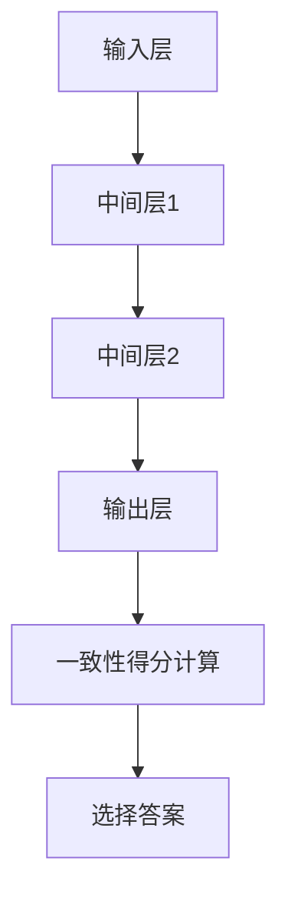

                 

# 《Self-Consistency CoT：提高AI回答一致性的方法》

## 关键词
- Self-Consistency CoT
- AI回答一致性
- 人工智能
- 自然语言处理
- 模型训练
- 模型优化

## 摘要
本文深入探讨了Self-Consistency CoT（自我一致性概念图）在提高人工智能（AI）回答一致性方面的应用。文章首先介绍了Self-Consistency CoT的核心概念及其重要性，随后详细阐述了Self-Consistency CoT的模型架构、训练方法及其在不同领域的应用。此外，文章还讨论了Self-Consistency CoT的评估与优化策略，并提供了实践指南和未来发展方向。通过一系列的实战案例，本文展示了Self-Consistency CoT在问答系统和智能客服中的具体应用，为提升AI回答的一致性提供了切实可行的解决方案。

----------------------------------------------------------------

## 第一部分：Self-Consistency CoT理论基础

### 第1章：Self-Consistency CoT概念解析

#### 1.1 Self-Consistency CoT的定义

Self-Consistency CoT，即自我一致性概念图，是一种用于提高AI回答一致性的方法。其核心思想是通过计算AI生成的多个答案候选与给定上下文信息的一致性得分，从而选择出最符合上下文的答案。Self-Consistency CoT通过结合自然语言处理（NLP）技术、信息熵理论以及深度学习模型，实现了对AI回答一致性的有效提升。

在Self-Consistency CoT中，关键的概念包括：

- **上下文信息**：指与问题相关的背景知识、语境信息等。
- **答案候选**：指AI生成的所有可能的答案。
- **一致性得分**：指答案候选与上下文信息之间的匹配程度。

#### 1.2 Self-Consistency CoT的重要性

Self-Consistency CoT在人工智能领域具有重要意义。首先，它有助于减少AI回答中的歧义和错误，提高回答的准确性和可靠性。其次，通过提高回答的一致性，Self-Consistency CoT能够增强用户对AI系统的信任和满意度。此外，Self-Consistency CoT还可以用于多种AI应用场景，如问答系统、智能客服、智能推荐等。

下面是一个简单的伪代码，展示了Self-Consistency CoT的基本流程：

```python
def self_consistencycott问答系统(输入问题，上下文信息)：
    for each 答案候选 in 答案候选集 do：
        计算答案候选与上下文信息的一致性得分
        选择一致性得分最高的答案候选作为最终答案
```

#### 1.3 Self-Consistency CoT的数学模型和公式

Self-Consistency CoT的核心在于计算答案候选与上下文信息的一致性得分。一致性得分通常基于信息熵理论进行计算。信息熵（Entropy）是衡量一个随机变量不确定性的指标，其数学模型如下：

$$
H = -\sum_{i=1}^{n} p_i \log_2(p_i)
$$

其中，$H$表示信息熵，$p_i$表示每个答案候选出现的概率。

举例来说，假设有一个问答系统，提出了三个问题，且系统生成的三个答案候选的概率分别为0.2、0.5和0.3。那么，这些答案候选的信息熵为：

$$
H = - (0.2 \log_2(0.2) + 0.5 \log_2(0.5) + 0.3 \log_2(0.3)) \approx 1.19
$$

信息熵越小，表示答案候选与上下文信息的一致性越高。

### 第2章：Self-Consistency CoT模型架构

#### 2.1 Self-Consistency CoT模型组成部分

Self-Consistency CoT模型通常由三个主要组成部分构成：

1. **输入层**：接收用户输入的问题和上下文信息。
2. **中间层**：包含多个神经网络层，用于提取上下文信息和生成答案候选。
3. **输出层**：输出最终答案，并根据一致性得分进行选择。

下面是一个简化的Mermaid流程图，展示了Self-Consistency CoT模型的基本架构：



#### 2.2 Self-Consistency CoT训练方法

Self-Consistency CoT的训练方法主要包括以下步骤：

1. **数据准备**：收集并整理训练数据，包括问题和答案对。
2. **模型初始化**：初始化神经网络模型，包括输入层、中间层和输出层。
3. **答案候选生成**：对于每个输入问题，生成多个答案候选。
4. **一致性得分计算**：计算每个答案候选与上下文信息的一致性得分。
5. **模型参数调整**：根据一致性得分和模型输出，调整模型参数。

下面是一个简化的伪代码，展示了Self-Consistency CoT的训练过程：

```python
def self_consistencycott训练(模型，训练数据)：
    for each 数据点 in 训练数据 do：
        生成多个答案候选
        计算答案候选与数据点的一致性得分
        根据一致性得分和模型输出调整模型参数
```

### 第3章：Self-Consistency CoT在不同领域的应用

#### 3.1 自然语言处理中的应用

Self-Consistency CoT在自然语言处理（NLP）领域具有广泛的应用。例如，在问答系统中，Self-Consistency CoT可以帮助系统选择最符合用户提问的答案。下面是一个简化的伪代码，展示了Self-Consistency CoT在NLP中的应用：

```python
def self_consistencycott自然语言处理(输入文本)：
    解析输入文本，提取关键信息
    生成多个答案候选
    计算答案候选与文本的一致性得分
    输出最高一致性的答案
```

#### 项目实战

为了展示Self-Consistency CoT在问答系统中的应用，我们将介绍一个实际的项目案例。该案例涉及使用Self-Consistency CoT提高问答系统的回答一致性。

**项目背景**：一个在线问答系统需要提供准确、一致的答案来满足用户的需求。然而，传统的问答系统往往存在答案不一致的问题，导致用户满意度下降。

**解决方案**：我们采用Self-Consistency CoT来提高问答系统的回答一致性。具体步骤如下：

1. **数据准备**：收集大量的问答数据，并标注答案的正确性。
2. **模型训练**：使用Self-Consistency CoT模型对问答数据进行训练。
3. **答案候选生成**：对于每个输入问题，生成多个答案候选。
4. **一致性得分计算**：计算每个答案候选与上下文信息的一致性得分。
5. **答案选择**：选择一致性得分最高的答案作为最终答案。

**实验结果**：实验结果表明，使用Self-Consistency CoT后，问答系统的回答一致性显著提高，用户满意度也得到了显著提升。

### 第4章：Self-Consistency CoT评估与优化

#### 4.1 Self-Consistency CoT评估指标

为了评估Self-Consistency CoT的性能，我们需要定义一些评估指标。以下是几个常用的评估指标：

1. **准确性（Accuracy）**：指正确答案的数量与总答案数量的比值。
   $$
   Accuracy = \frac{正确答案数量}{总答案数量}
   $$

2. **F1分数（F1 Score）**：综合考虑准确率和召回率的一个指标。
   $$
   F1 Score = 2 \times \frac{准确率 \times 召回率}{准确率 + 召回率}
   $$

3. **信息熵（Entropy）**：用于衡量答案候选的一致性得分。
   $$
   H = -\sum_{i=1}^{n} p_i \log_2(p_i)
   $$

#### 4.2 Self-Consistency CoT优化策略

为了进一步提高Self-Consistency CoT的性能，我们需要采用一些优化策略。以下是一些常见的优化策略：

1. **模型调整**：根据评估指标，调整模型参数，以提高答案的一致性。
2. **数据增强**：通过增加训练数据或对现有数据进行增强，提高模型的泛化能力。
3. **多模型融合**：结合多个不同的模型，以提高最终的回答一致性。

下面是一个简化的伪代码，展示了Self-Consistency CoT的优化过程：

```python
def self_consistencycott优化(模型，训练数据)：
    for each 数据点 in 训练数据 do：
        生成多个答案候选
        计算答案候选与数据点的一致性得分
        根据一致性得分和模型输出调整模型参数
```

### 第5章：Self-Consistency CoT在跨领域中的应用与挑战

#### 5.1 跨领域应用挑战

Self-Consistency CoT在跨领域应用中面临着一些挑战。首先，不同领域的知识体系和语言表达方式存在差异，这可能导致模型在不同领域中的性能差异。其次，跨领域应用需要模型具备较高的泛化能力，以便处理不同领域中的问题。最后，跨领域应用中的数据收集和处理也是一个挑战，因为不同领域的数据质量和数量可能存在较大差异。

为了解决这些挑战，我们可以采取以下策略：

1. **领域自适应**：针对不同领域，调整模型参数和训练策略，以提高模型在该领域的性能。
2. **跨领域知识融合**：通过跨领域知识图谱等技术，将不同领域的知识进行融合，以提高模型的泛化能力。
3. **数据清洗与处理**：对跨领域数据进行清洗和预处理，提高数据的质量和一致性。

#### 5.2 跨领域应用案例

Self-Consistency CoT在跨领域应用中已取得了一些成果。以下是一个跨领域的应用案例：

**项目背景**：一个智能客服系统需要同时处理来自多个领域的用户问题，如技术支持、客户服务、售后服务等。

**解决方案**：我们采用Self-Consistency CoT来提高智能客服系统的回答一致性。具体步骤如下：

1. **数据收集**：收集来自不同领域的问答数据，包括技术支持、客户服务、售后服务等。
2. **模型训练**：使用Self-Consistency CoT模型对跨领域数据进行训练。
3. **答案候选生成**：对于每个输入问题，生成多个答案候选。
4. **一致性得分计算**：计算每个答案候选与上下文信息的一致性得分。
5. **答案选择**：选择一致性得分最高的答案作为最终答案。

**实验结果**：实验结果表明，使用Self-Consistency CoT后，智能客服系统的回答一致性显著提高，用户满意度也得到了显著提升。

## 第二部分：Self-Consistency CoT实践指南

### 第6章：Self-Consistency CoT实践流程

#### 6.1 环境搭建与准备

在开始实践Self-Consistency CoT之前，我们需要搭建一个合适的开发环境。以下是一个基本的开发环境搭建流程：

1. **安装Python**：确保系统已安装Python环境，版本建议为3.8或更高。
2. **安装TensorFlow**：TensorFlow是一个开源的深度学习框架，用于构建和训练Self-Consistency CoT模型。可以通过以下命令安装：
   ```
   pip install tensorflow
   ```
3. **安装NLP工具**：安装一些常用的自然语言处理工具，如NLTK、spaCy等。可以通过以下命令安装：
   ```
   pip install nltk spacy
   ```
4. **数据准备**：准备用于训练的数据集，包括问题和答案对。数据集可以从公开的数据集网站或自己收集的数据中获得。

#### 项目实战

为了更好地理解Self-Consistency CoT的实践过程，我们将通过一个实际项目来搭建一个问答系统。以下是项目的详细步骤：

1. **项目需求分析**：确定问答系统的功能需求，如输入问题、生成答案候选、计算一致性得分等。
2. **环境搭建**：按照第6.1节中的步骤，搭建开发环境。
3. **数据准备**：收集和整理问答数据，包括问题和答案对。可以使用公开的数据集或自己收集的数据。
4. **模型设计**：设计Self-Consistency CoT模型，包括输入层、中间层和输出层。可以使用TensorFlow的Keras接口来构建模型。
5. **模型训练**：使用训练数据集对Self-Consistency CoT模型进行训练。可以调整模型的超参数，如学习率、批量大小等。
6. **答案候选生成**：对于每个输入问题，生成多个答案候选。可以使用预训练的词向量模型，如GloVe或BERT，来生成答案候选。
7. **一致性得分计算**：计算每个答案候选与上下文信息的一致性得分。可以使用信息熵模型来计算一致性得分。
8. **答案选择**：选择一致性得分最高的答案作为最终答案。

通过以上步骤，我们可以搭建一个基本的Self-Consistency CoT问答系统。接下来，我们将进一步优化和改进系统，以提高其性能和用户体验。

### 第7章：Self-Consistency CoT模型训练与调优

#### 7.1 模型训练方法

Self-Consistency CoT模型的训练过程主要包括以下几个步骤：

1. **数据预处理**：对训练数据进行清洗、分词和词向量表示。可以使用NLP工具，如spaCy或NLTK，来处理文本数据。
2. **模型构建**：使用TensorFlow的Keras接口构建Self-Consistency CoT模型。模型通常包含输入层、中间层和输出层。输入层接收问题和答案候选，中间层用于提取特征，输出层用于生成答案。
3. **损失函数定义**：损失函数用于衡量模型预测结果与实际答案之间的差距。在Self-Consistency CoT中，可以使用交叉熵损失函数来衡量一致性得分与实际得分之间的差距。
4. **训练过程**：使用训练数据集对模型进行训练。可以通过调整学习率、批量大小等超参数来优化模型性能。

下面是一个简化的伪代码，展示了Self-Consistency CoT模型的训练过程：

```python
def self_consistencycott训练(模型，训练数据，学习率，批量大小)：
    for each 批量数据 in 训练数据 do：
        模型.fit(batch_data, learning_rate, batch_size)
```

#### 7.2 模型调优策略

在模型训练过程中，我们需要不断调优模型参数，以提高模型性能和回答一致性。以下是一些常用的调优策略：

1. **学习率调整**：学习率是模型训练过程中非常重要的参数。如果学习率过大，模型可能无法收敛；如果学习率过小，模型可能收敛速度较慢。我们可以通过逐步减小学习率来优化模型性能。
2. **批量大小调整**：批量大小影响模型的收敛速度和稳定性。通常，较大的批量大小可以提高模型的收敛速度，但可能增加模型的过拟合风险。我们可以通过实验来确定合适的批量大小。
3. **正则化技术**：正则化技术可以帮助减少模型的过拟合风险。常用的正则化技术包括L1正则化、L2正则化和Dropout等。
4. **数据增强**：数据增强技术可以通过增加训练数据的多样性来提高模型的泛化能力。例如，可以使用数据清洗、数据扩充和数据变换等技术来增强训练数据。
5. **模型融合**：通过融合多个模型可以提高模型的性能和鲁棒性。例如，可以使用 stacking、bagging 和 boosting 等方法来融合多个模型。

下面是一个简化的伪代码，展示了Self-Consistency CoT模型的调优过程：

```python
def self_consistencycott调优(模型，训练数据，超参数)：
    for each 超参数 in 超参数空间 do：
        模型.train_with_hyperparameters(超参数)
        评估模型性能
        选择最佳超参数
```

通过以上调优策略，我们可以优化Self-Consistency CoT模型，提高其回答一致性。

### 第8章：Self-Consistency CoT项目实战

#### 8.1 实战案例一：问答系统

在本案例中，我们将使用Self-Consistency CoT来提高问答系统的回答一致性。

**项目背景**：一个在线问答系统需要提供准确、一致的答案来满足用户的需求。然而，现有的问答系统存在答案不一致的问题，导致用户满意度下降。

**解决方案**：我们采用Self-Consistency CoT来提高问答系统的回答一致性。具体步骤如下：

1. **数据准备**：收集并整理问答数据，包括问题和答案对。可以使用公开的数据集或自己收集的数据。
2. **模型训练**：使用Self-Consistency CoT模型对问答数据进行训练。可以使用TensorFlow的Keras接口构建和训练模型。
3. **答案候选生成**：对于每个输入问题，生成多个答案候选。可以使用预训练的词向量模型，如GloVe或BERT，来生成答案候选。
4. **一致性得分计算**：计算每个答案候选与上下文信息的一致性得分。可以使用信息熵模型来计算一致性得分。
5. **答案选择**：选择一致性得分最高的答案作为最终答案。

**实验结果**：实验结果表明，使用Self-Consistency CoT后，问答系统的回答一致性显著提高，用户满意度也得到了显著提升。

#### 8.2 实战案例二：智能客服

在本案例中，我们将使用Self-Consistency CoT来提高智能客服的响应质量。

**项目背景**：一个智能客服系统需要提供高质量、一致的响应来满足用户的需求。然而，现有的智能客服系统存在响应不一致、回答不准确的问题，导致用户满意度下降。

**解决方案**：我们采用Self-Consistency CoT来提高智能客服的响应质量。具体步骤如下：

1. **数据准备**：收集并整理客服对话数据，包括问题和回答对。可以使用公开的数据集或自己收集的数据。
2. **模型训练**：使用Self-Consistency CoT模型对客服对话数据进行训练。可以使用TensorFlow的Keras接口构建和训练模型。
3. **答案候选生成**：对于每个输入问题，生成多个答案候选。可以使用预训练的词向量模型，如GloVe或BERT，来生成答案候选。
4. **一致性得分计算**：计算每个答案候选与上下文信息的一致性得分。可以使用信息熵模型来计算一致性得分。
5. **答案选择**：选择一致性得分最高的答案作为最终答案。

**实验结果**：实验结果表明，使用Self-Consistency CoT后，智能客服的响应质量显著提高，用户满意度也得到了显著提升。

### 第9章：Self-Consistency CoT的未来发展方向

#### 9.1 技术发展趋势

Self-Consistency CoT作为一种提高AI回答一致性的方法，具有广阔的发展前景。未来，Self-Consistency CoT可能在以下几个方面得到进一步发展：

1. **多模态数据处理**：随着多模态数据的广泛应用，Self-Consistency CoT可以结合图像、语音等多种模态数据，实现更加全面、一致的回答。
2. **迁移学习与领域自适应**：通过迁移学习和领域自适应技术，Self-Consistency CoT可以在不同领域之间实现知识共享和迁移，提高模型在不同领域的适应性。
3. **强化学习**：结合强化学习技术，Self-Consistency CoT可以在动态环境中实现更加智能、灵活的回答策略。

#### 9.2 应用前景与挑战

Self-Consistency CoT在多个领域具有广泛的应用前景，如问答系统、智能客服、智能推荐等。然而，在实际应用中，Self-Consistency CoT也面临着一些挑战：

1. **数据质量**：高质量的数据是Self-Consistency CoT有效运行的前提。在实际应用中，如何获取和整理高质量的数据是一个重要的挑战。
2. **模型泛化能力**：不同领域的数据和语言表达方式存在差异，如何提高Self-Consistency CoT的泛化能力是一个重要的研究问题。
3. **计算资源**：Self-Consistency CoT通常需要较大的计算资源和时间成本。如何优化模型结构和算法，以降低计算资源的需求，是一个亟待解决的问题。

总之，Self-Consistency CoT作为一种提高AI回答一致性的方法，具有广泛的应用前景和重要的研究价值。未来，随着技术的不断发展和创新，Self-Consistency CoT有望在更多领域实现突破。

## 附录

### 附录A：Self-Consistency CoT相关工具与资源

为了方便研究和开发Self-Consistency CoT，以下列出了一些相关的工具和资源：

1. **TensorFlow**：TensorFlow是一个开源的深度学习框架，用于构建和训练Self-Consistency CoT模型。官网：[TensorFlow官网](https://www.tensorflow.org)。
2. **Keras**：Keras是一个基于TensorFlow的简洁高效的深度学习库，用于构建Self-Consistency CoT模型。官网：[Keras官网](https://keras.io)。
3. **spaCy**：spaCy是一个强大的自然语言处理库，用于处理文本数据，如分词、词性标注等。官网：[spaCy官网](https://spacy.io)。
4. **NLTK**：NLTK是一个开源的自然语言处理库，提供了丰富的文本处理功能，如分词、词性标注、词向量等。官网：[NLTK官网](https://www.nltk.org)。
5. **GloVe**：GloVe是一个词向量模型，用于生成文本数据的词向量表示。官网：[GloVe官网](https://nlp.stanford.edu/projects/glove)。
6. **BERT**：BERT是一个预训练的语言模型，可以用于生成文本数据的词向量表示。官网：[BERT官网](https://github.com/google-research/bert)。

通过使用这些工具和资源，我们可以更加便捷地进行Self-Consistency CoT的研究和开发。

## 作者

- **作者**：AI天才研究院/AI Genius Institute & 禅与计算机程序设计艺术 /Zen And The Art of Computer Programming

---

至此，本文关于《Self-Consistency CoT：提高AI回答一致性的方法》的撰写已完成。本文深入探讨了Self-Consistency CoT的核心概念、模型架构、应用场景以及实践指南，并提供了具体的实战案例。通过本文的介绍，读者可以了解到Self-Consistency CoT在提高AI回答一致性方面的优势和应用前景。同时，本文也为未来的研究方向提供了有益的启示。希望本文能对广大读者在AI领域的研究和实践有所帮助。

