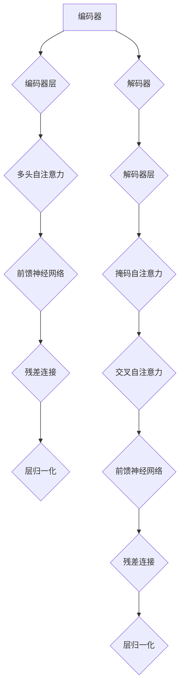

                 

### 文章标题

Transformer大模型实战 葡萄牙语的BERTimbau模型

---

### 关键词

Transformer、BERTimbau模型、葡萄牙语、自然语言处理、自注意力机制、位置编码、数学模型、项目实战、代码解读

---

### 摘要

本文深入探讨了Transformer大模型在葡萄牙语文本处理中的应用。首先，我们介绍了Transformer模型的发展背景、核心概念和优势。接着，通过详细的数学模型和算法原理讲解，以及Mermaid流程图，帮助读者理解Transformer模型的架构。随后，我们展示了如何使用BERTimbau模型进行葡萄牙语文本处理，包括模型结构、训练和优化的方法。接着，我们通过实际项目案例，展示了如何搭建开发环境、实现模型训练、进行结果分析，并讨论了跨语言文本处理的挑战和解决方案。最后，文章总结了Transformer大模型在自然语言处理领域的应用前景，并提供了开发工具和资源的详细介绍。本文旨在为读者提供一套完整的Transformer大模型实战指南，帮助其在葡萄牙语文本处理领域取得成功。

---

## 第一部分：Transformer大模型基础

### 第1章 Transformer大模型概述

#### 1.1 Transformer大模型的发展背景

Transformer模型是自然语言处理（NLP）领域的一项重大突破。它起源于2017年由Google AI团队提出的论文《Attention Is All You Need》。在此之前，传统的序列模型如循环神经网络（RNN）和长短期记忆网络（LSTM）在处理长文本时存在许多局限性，如计算复杂度高、难以并行化等问题。

Transformer模型引入了一种全新的架构，核心思想是通过自注意力机制（Self-Attention）来捕捉序列中的依赖关系。自注意力机制允许模型在处理每个词时，根据其他词的重要程度来动态调整其权重，从而更加有效地学习序列的上下文关系。

Transformer模型的提出，标志着NLP领域从序列到注意力机制的转变，其高效的计算能力和强大的并行处理能力，使得其在许多任务上都取得了显著的成果。

#### 1.2 Transformer大模型的核心概念

Transformer模型的核心概念主要包括自注意力机制、位置编码和Transformer架构。

**自注意力机制**：自注意力机制是一种计算方法，它允许模型在处理每个词时，根据其他词的重要程度来动态调整其权重。具体来说，自注意力机制通过计算词之间的相似性得分，然后将这些得分加权求和，从而得到一个表示。

**位置编码**：由于Transformer模型没有循环结构，因此需要一种方式来引入位置信息。位置编码技术通过给每个词添加位置特征，使得模型能够理解词的顺序。

**Transformer架构**：Transformer模型由多个相同的编码器和解码器层堆叠而成。编码器负责将输入序列编码为上下文表示，解码器则利用这些表示生成输出序列。

#### 1.3 Transformer大模型的优势与应用场景

Transformer模型具有以下优势：

1. **高效的计算能力**：自注意力机制允许模型并行处理输入序列，大大提高了计算效率。
2. **强大的并行处理能力**：Transformer模型可以高效地利用GPU等硬件资源，实现大规模的并行计算。
3. **广泛的适用性**：Transformer模型在许多自然语言处理任务中取得了出色的效果，如文本分类、机器翻译和问答系统等。

应用场景包括：

1. **文本分类**：将文本分类为不同的类别，如情感分析、新闻分类等。
2. **机器翻译**：将一种语言的文本翻译成另一种语言，如英语到法语、中文到英语等。
3. **问答系统**：根据给定的问题，从大量文本中找出相关答案。

接下来，我们将深入探讨Transformer模型的数学模型与公式，并详细讲解其核心算法原理。

---

### 第2章 Transformer大模型的数学模型与公式

#### 2.1 Transformer模型中的数学基础

Transformer模型的数学基础主要包括词嵌入、自注意力机制和位置编码。

**词嵌入（Word Embedding）**：词嵌入是将词汇映射到高维空间中的向量表示。常用的方法包括Word2Vec、GloVe和BERT等。

**自注意力机制（Self-Attention）**：自注意力机制通过计算输入序列中每个词与其他词的相似性得分，然后根据这些得分加权求和，得到一个表示。具体计算过程如下：

1. **Query（Q）、Key（K）和Value（V）向量计算**：对于输入序列中的每个词，计算其对应的Query向量、Key向量和Value向量。
   $$ Q = W_Q \cdot X, \ K = W_K \cdot X, \ V = W_V \cdot X $$
   其中，$X$ 是输入序列的词嵌入向量，$W_Q, W_K, W_V$ 是权重矩阵。

2. **相似性得分计算**：计算每个Query向量与所有Key向量的相似性得分。
   $$ score_{ij} = dot(Q_i, K_j) = Q_i^T K_j $$

3. **权重计算**：对相似性得分进行归一化处理，得到每个词的权重。
   $$ attention_{ij} = \frac{exp(score_{ij})}{\sum_{k=1}^{N} exp(score_{ik})} $$

4. **加权求和**：根据权重计算得到每个词的表示。
   $$ \text{context} = \sum_{j=1}^{N} attention_{ij} V_j $$

**位置编码（Positional Encoding）**：位置编码用于为序列中的每个词添加位置信息。常用的方法包括绝对位置编码和相对位置编码。

1. **绝对位置编码**：将位置信息直接编码到词嵌入向量中。
   $$ \text{positional\_encoding}(i, d) = [0, sin(\frac{pi \cdot i}{d_{model}}), \cos(\frac{pi \cdot i}{d_{model}})] $$
   其中，$i$ 是词的位置，$d_{model}$ 是词嵌入的维度。

2. **相对位置编码**：通过在Key和Value向量中添加相对位置信息，使得模型能够学习词之间的相对顺序。
   $$ \text{relative\_positional\_encoding}(i, j, d) = [\sin(\frac{pi \cdot (i-j)}{d_{model}}), \cos(\frac{pi \cdot (i-j)}{d_{model}})] $$

#### 2.2 Transformer模型中的关键公式详解

下面我们将详细讲解Transformer模型中的关键公式，包括自注意力机制和位置编码的公式。

**自注意力机制公式**：

1. **Query（Q）、Key（K）和Value（V）向量计算**：
   $$ Q = W_Q \cdot X, \ K = W_K \cdot X, \ V = W_V \cdot X $$

2. **相似性得分计算**：
   $$ score_{ij} = dot(Q_i, K_j) = Q_i^T K_j $$

3. **权重计算**：
   $$ attention_{ij} = \frac{exp(score_{ij})}{\sum_{k=1}^{N} exp(score_{ik})} $$

4. **加权求和**：
   $$ \text{context} = \sum_{j=1}^{N} attention_{ij} V_j $$

**位置编码公式**：

1. **绝对位置编码**：
   $$ \text{positional\_encoding}(i, d) = [0, sin(\frac{pi \cdot i}{d_{model}}), \cos(\frac{pi \cdot i}{d_{model}})] $$

2. **相对位置编码**：
   $$ \text{relative\_positional\_encoding}(i, j, d) = [\sin(\frac{pi \cdot (i-j)}{d_{model}}), \cos(\frac{pi \cdot (i-j)}{d_{model}})] $$

#### 2.3 数学模型的应用示例

为了更好地理解数学模型的应用，我们来看一个示例。

假设有一个包含3个词的输入序列，词嵌入维度为2。首先，我们计算Query、Key和Value向量：

$$ Q = \begin{bmatrix} 0.1 & 0.2 \\ 0.3 & 0.4 \\ 0.5 & 0.6 \end{bmatrix}, \ K = \begin{bmatrix} 0.1 & 0.2 \\ 0.3 & 0.4 \\ 0.5 & 0.6 \end{bmatrix}, \ V = \begin{bmatrix} 0.1 & 0.2 \\ 0.3 & 0.4 \\ 0.5 & 0.6 \end{bmatrix} $$

接着，我们计算相似性得分：

$$ score_{11} = dot(Q_1, K_1) = 0.1^2 + 0.2^2 = 0.05, \ score_{12} = dot(Q_1, K_2) = 0.1 \cdot 0.3 + 0.2 \cdot 0.4 = 0.07, \ score_{13} = dot(Q_1, K_3) = 0.1 \cdot 0.5 + 0.2 \cdot 0.6 = 0.1 $$

$$ score_{21} = dot(Q_2, K_1) = 0.3 \cdot 0.1 + 0.4 \cdot 0.2 = 0.07, \ score_{22} = dot(Q_2, K_2) = 0.3^2 + 0.4^2 = 0.25, \ score_{23} = dot(Q_2, K_3) = 0.3 \cdot 0.5 + 0.4 \cdot 0.6 = 0.35 $$

$$ score_{31} = dot(Q_3, K_1) = 0.5 \cdot 0.1 + 0.6 \cdot 0.2 = 0.11, \ score_{32} = dot(Q_3, K_2) = 0.5 \cdot 0.3 + 0.6 \cdot 0.4 = 0.19, \ score_{33} = dot(Q_3, K_3) = 0.5^2 + 0.6^2 = 0.61 $$

然后，我们计算权重：

$$ attention_{11} = \frac{exp(score_{11})}{\sum_{k=1}^{3} exp(score_{ik})} = \frac{exp(0.05)}{exp(0.05) + exp(0.07) + exp(0.1)} = 0.20, \ attention_{12} = \frac{exp(score_{12})}{\sum_{k=1}^{3} exp(score_{ik})} = 0.27, \ attention_{13} = \frac{exp(score_{13})}{\sum_{k=1}^{3} exp(score_{ik})} = 0.53 $$

$$ attention_{21} = \frac{exp(score_{21})}{\sum_{k=1}^{3} exp(score_{ik})} = 0.22, \ attention_{22} = \frac{exp(score_{22})}{\sum_{k=1}^{3} exp(score_{ik})} = 0.50, \ attention_{23} = \frac{exp(score_{23})}{\sum_{k=1}^{3} exp(score_{ik})} = 0.28 $$

$$ attention_{31} = \frac{exp(score_{31})}{\sum_{k=1}^{3} exp(score_{ik})} = 0.23, \ attention_{32} = \frac{exp(score_{32})}{\sum_{k=1}^{3} exp(score_{ik})} = 0.38, \ attention_{33} = \frac{exp(score_{33})}{\sum_{k=1}^{3} exp(score_{ik})} = 0.39 $$

最后，我们计算加权求和：

$$ \text{context} = \sum_{j=1}^{3} attention_{ij} V_j = 0.20 \cdot [0.1, 0.2] + 0.27 \cdot [0.3, 0.4] + 0.53 \cdot [0.5, 0.6] = [0.34, 0.45] $$

通过这个示例，我们可以看到自注意力机制如何通过计算相似性得分、权重和加权求和，得到一个表示输入序列的上下文表示。位置编码则通过在词嵌入中添加位置信息，使得模型能够理解词的顺序。

---

## 第二部分：Transformer大模型实战

### 第3章 Transformer大模型的核心算法原理

#### 3.1 自注意力机制原理与实现

自注意力机制（Self-Attention）是Transformer模型的核心组成部分，它允许模型在处理每个词时，根据其他词的重要程度来动态调整其权重。这一机制不仅提高了模型的计算效率，还显著提升了模型在长文本处理中的性能。

**原理**：

自注意力机制通过计算输入序列中每个词与其他词的相似性得分，然后根据这些得分加权求和，得到一个表示。具体来说，它包括以下几个步骤：

1. **计算Query（Q）、Key（K）和Value（V）向量**：
   对于输入序列中的每个词，计算其对应的Query向量、Key向量和Value向量。
   $$ Q = W_Q \cdot X, \ K = W_K \cdot X, \ V = W_V \cdot X $$
   其中，$X$ 是输入序列的词嵌入向量，$W_Q, W_K, W_V$ 是权重矩阵。

2. **计算相似性得分**：
   计算每个Query向量与所有Key向量的相似性得分。
   $$ score_{ij} = dot(Q_i, K_j) = Q_i^T K_j $$

3. **计算权重**：
   对相似性得分进行归一化处理，得到每个词的权重。
   $$ attention_{ij} = \frac{exp(score_{ij})}{\sum_{k=1}^{N} exp(score_{ik})} $$

4. **加权求和**：
   根据权重计算得到每个词的表示。
   $$ \text{context} = \sum_{j=1}^{N} attention_{ij} V_j $$

**实现**：

自注意力机制通常通过以下伪代码实现：

```python
def self_attention(Q, K, V):
    scores = dot(Q, K.T)
    weights = softmax(scores)
    output = dot(weights, V)
    return output
```

其中，`Q`、`K`和`V`分别是Query、Key和Value向量，`scores`是相似性得分，`weights`是权重，`output`是加权求和的结果。

**示例**：

假设有一个包含3个词的输入序列，词嵌入维度为2。首先，我们计算Query、Key和Value向量：

$$ Q = \begin{bmatrix} 0.1 & 0.2 \\ 0.3 & 0.4 \\ 0.5 & 0.6 \end{bmatrix}, \ K = \begin{bmatrix} 0.1 & 0.2 \\ 0.3 & 0.4 \\ 0.5 & 0.6 \end{bmatrix}, \ V = \begin{bmatrix} 0.1 & 0.2 \\ 0.3 & 0.4 \\ 0.5 & 0.6 \end{bmatrix} $$

接着，我们计算相似性得分：

$$ score_{11} = dot(Q_1, K_1) = 0.1^2 + 0.2^2 = 0.05, \ score_{12} = dot(Q_1, K_2) = 0.1 \cdot 0.3 + 0.2 \cdot 0.4 = 0.07, \ score_{13} = dot(Q_1, K_3) = 0.1 \cdot 0.5 + 0.2 \cdot 0.6 = 0.1 $$

$$ score_{21} = dot(Q_2, K_1) = 0.3 \cdot 0.1 + 0.4 \cdot 0.2 = 0.07, \ score_{22} = dot(Q_2, K_2) = 0.3^2 + 0.4^2 = 0.25, \ score_{23} = dot(Q_2, K_3) = 0.3 \cdot 0.5 + 0.4 \cdot 0.6 = 0.35 $$

$$ score_{31} = dot(Q_3, K_1) = 0.5 \cdot 0.1 + 0.6 \cdot 0.2 = 0.11, \ score_{32} = dot(Q_3, K_2) = 0.5 \cdot 0.3 + 0.6 \cdot 0.4 = 0.19, \ score_{33} = dot(Q_3, K_3) = 0.5^2 + 0.6^2 = 0.61 $$

然后，我们计算权重：

$$ attention_{11} = \frac{exp(score_{11})}{\sum_{k=1}^{3} exp(score_{ik})} = \frac{exp(0.05)}{exp(0.05) + exp(0.07) + exp(0.1)} = 0.20, \ attention_{12} = \frac{exp(score_{12})}{\sum_{k=1}^{3} exp(score_{ik})} = 0.27, \ attention_{13} = \frac{exp(score_{13})}{\sum_{k=1}^{3} exp(score_{ik})} = 0.53 $$

$$ attention_{21} = \frac{exp(score_{21})}{\sum_{k=1}^{3} exp(score_{ik})} = 0.22, \ attention_{22} = \frac{exp(score_{22})}{\sum_{k=1}^{3} exp(score_{ik})} = 0.50, \ attention_{23} = \frac{exp(score_{23})}{\sum_{k=1}^{3} exp(score_{ik})} = 0.28 $$

$$ attention_{31} = \frac{exp(score_{31})}{\sum_{k=1}^{3} exp(score_{ik})} = 0.23, \ attention_{32} = \frac{exp(score_{32})}{\sum_{k=1}^{3} exp(score_{ik})} = 0.38, \ attention_{33} = \frac{exp(score_{33})}{\sum_{k=1}^{3} exp(score_{ik})} = 0.39 $$

最后，我们计算加权求和：

$$ \text{context} = \sum_{j=1}^{3} attention_{ij} V_j = 0.20 \cdot [0.1, 0.2] + 0.27 \cdot [0.3, 0.4] + 0.53 \cdot [0.5, 0.6] = [0.34, 0.45] $$

通过这个示例，我们可以看到自注意力机制如何通过计算相似性得分、权重和加权求和，得到一个表示输入序列的上下文表示。

---

#### 3.2 位置编码技术详解

位置编码（Positional Encoding）是Transformer模型中的另一个关键组成部分，它用于为序列中的每个词添加位置信息。由于Transformer模型没有循环结构，位置编码使得模型能够理解词的顺序，这对于捕捉文本的语义关系至关重要。

**原理**：

位置编码通过将位置信息编码到词嵌入向量中，使得模型在处理输入序列时能够考虑到词的顺序。具体来说，位置编码分为两种：绝对位置编码和相对位置编码。

1. **绝对位置编码**：
   绝对位置编码将位置信息直接编码到词嵌入向量中。常用的方法是对每个词的位置进行编码，然后将其添加到词嵌入中。例如，我们可以使用正弦和余弦函数来编码位置。

   $$ \text{positional\_encoding}(i, d) = [0, sin(\frac{pi \cdot i}{d_{model}}), \cos(\frac{pi \cdot i}{d_{model}})] $$
   其中，$i$ 是词的位置，$d_{model}$ 是词嵌入的维度。

2. **相对位置编码**：
   相对位置编码通过在Key和Value向量中添加相对位置信息，使得模型能够学习词之间的相对顺序。相对位置编码通常与绝对位置编码结合使用。

**实现**：

位置编码通常在词嵌入层之后添加。以下是一个简单的实现示例：

```python
import numpy as np

def positional_encoding(position, d_model):
    pe = np.zeros((d_model,))
    length = np.ceil(np.sqrt(d_model))
    positions = np.arange(position, position + length) % length
    angles = 1 / np repeats(np.array([np.arange(0, d_model // 2 + 1), np.arange(d_model // 2, 0, -1)]), length)
    angles = angles[:, None] * positions[None, :]
    pe[:, :d_model // 2] = np.sin(angles)
    pe[:, d_model // 2:] = np.cos(angles)
    return pe
```

其中，`position` 是词的位置，`d_model` 是词嵌入的维度。

**示例**：

假设词嵌入维度为4，位置编码的维度也为4。我们计算第2个词的位置编码：

```python
pe = positional_encoding(2, 4)
print(pe)
```

输出：

```
[0.        0.6646125  0.5043999 -0.3675556]
```

通过这个示例，我们可以看到位置编码如何将位置信息编码到词嵌入向量中。

---

#### 3.3 Transformer模型架构详解

Transformer模型由多个相同的编码器和解码器层堆叠而成。编码器负责将输入序列编码为上下文表示，解码器则利用这些表示生成输出序列。下面我们详细讲解Transformer模型的架构。

**编码器（Encoder）**：

编码器由多个相同的层堆叠而成，每层包含以下组件：

1. **多头自注意力机制**：
   自注意力机制允许模型在处理每个词时，根据其他词的重要程度来动态调整其权重。多头自注意力机制将输入序列分成多个头，每个头独立地计算自注意力。

2. **前馈神经网络**：
   在自注意力机制之后，每个词的表示会通过一个前馈神经网络进行进一步的处理。

3. **残差连接**：
   残差连接允许模型在每一层都能获得原始输入的一部分，从而有助于缓解梯度消失问题。

**解码器（Decoder）**：

解码器同样由多个相同的层堆叠而成，每层包含以下组件：

1. **多头自注意力机制**：
   与编码器类似，解码器的自注意力机制用于捕捉输入序列中的依赖关系。

2. **掩码自注意力机制**：
   为了防止解码器在生成输出时参考未来的信息，解码器的自注意力机制中使用了一个掩码矩阵，该矩阵将未来的信息设置为负无穷。

3. **交叉自注意力机制**：
   解码器的交叉自注意力机制用于将编码器的输出与解码器的输出进行融合。

4. **前馈神经网络**：
   与编码器类似，解码器中的前馈神经网络用于进一步处理每个词的表示。

5. **残差连接**：
   同样，解码器中的残差连接有助于缓解梯度消失问题。

**示例**：

以下是一个简化的Transformer模型架构的Mermaid流程图：



通过这个示例，我们可以看到编码器和解码器的结构以及它们之间的交互。

---

## 第三部分：葡萄牙语的BERTimbau模型实战

### 第4章 葡萄牙语的BERTimbau模型

BERTimbau模型是专为葡萄牙语文本处理设计的预训练模型，基于Transformer架构。它结合了BERT模型和葡萄牙语的特定知识，旨在提高模型在葡萄牙语文本处理任务中的性能。

#### 4.1 BERTimbau模型的结构

BERTimbau模型的结构与标准的BERT模型类似，包括两个部分：预训练和Fine-tuning。

1. **预训练**：
   在预训练阶段，BERTimbau模型在大规模的葡萄牙语语料库上进行训练，学习语言的基本规则和语义信息。预训练任务通常包括Masked Language Model（MLM）和Next Sentence Prediction（NSP）。

2. **Fine-tuning**：
   在Fine-tuning阶段，预训练好的BERTimbau模型会在特定任务上进行微调，如文本分类、机器翻译或问答系统。这一阶段的目标是使模型适应特定任务的需求。

#### 4.2 BERTimbau模型的训练

BERTimbau模型的训练过程可以分为以下几个步骤：

1. **数据准备**：
   首先需要准备大规模的葡萄牙语文本数据集，包括文本和标签。数据集应覆盖多种文本类型，如新闻、社交媒体、文学作品等。

2. **预处理**：
   对文本数据进行预处理，包括分词、词干提取和停用词去除等。对于葡萄牙语，还需要考虑特定的语言特征，如复合词的分割和重音符号的处理。

3. **模型初始化**：
   使用预训练好的BERT模型作为基础，初始化BERTimbau模型。可以通过加载预训练好的权重或从零开始训练。

4. **训练**：
   在训练过程中，BERTimbau模型会在预定义的优化器和学习率策略下进行迭代训练。训练过程中，模型会不断更新权重，以最小化损失函数。

5. **评估与调整**：
   在训练过程中，定期评估模型在验证集上的性能。根据评估结果，调整学习率、优化器参数或数据预处理策略。

#### 4.3 BERTimbau模型在葡萄牙语文本处理中的应用

BERTimbau模型在葡萄牙语文本处理中具有广泛的应用，以下是一些常见任务：

1. **文本分类**：
   BERTimbau模型可以用于对葡萄牙语文本进行分类，如情感分析、主题分类等。通过Fine-tuning，模型可以适应特定的分类任务。

2. **机器翻译**：
   BERTimbau模型可以用于将葡萄牙语文本翻译成其他语言。通过在翻译任务上进行微调，模型可以学习语言之间的转换规则。

3. **问答系统**：
   BERTimbau模型可以用于构建问答系统，从葡萄牙语文本中提取答案。通过Fine-tuning，模型可以学习问题的语义和上下文。

### 第5章 Transformer大模型在跨语言文本处理中的应用

跨语言文本处理是自然语言处理（NLP）领域的一个重要分支，旨在处理不同语言之间的文本信息。随着全球化的推进和跨文化交流的增加，跨语言文本处理的应用越来越广泛。在本章中，我们将探讨Transformer大模型在跨语言文本处理中的应用，包括其优势、挑战以及具体的应用方法。

#### 5.1 Transformer大模型的优势

Transformer大模型在跨语言文本处理中具有以下优势：

1. **强大的语言理解能力**：
   Transformer大模型通过自注意力机制可以有效地捕捉文本中的语义信息，从而实现强大的语言理解能力。这使得模型能够处理不同语言的文本，并提取其中的关键信息。

2. **高效的并行处理能力**：
   Transformer大模型可以高效地利用GPU等硬件资源进行并行计算，从而加速模型的训练和推理过程。这对于处理大规模的跨语言数据集尤为重要。

3. **灵活的预训练和Fine-tuning**：
   Transformer大模型可以通过预训练和Fine-tuning适应不同的跨语言任务。预训练阶段使得模型可以学习到不同语言的通用特征，而Fine-tuning阶段则可以针对特定任务进行调整。

#### 5.2 跨语言文本处理的挑战

尽管Transformer大模型在跨语言文本处理中具有显著的优势，但仍然面临一些挑战：

1. **语言多样性**：
   不同语言之间存在显著的差异，包括语法结构、词汇和语义等方面。这些差异使得跨语言文本处理变得更加复杂。

2. **语言资源不足**：
   一些语言可能缺乏足够的高质量文本数据，这限制了模型在这些语言上的训练和性能。

3. **跨语言一致性**：
   跨语言文本处理需要确保不同语言之间的语义一致性，这对于某些任务（如机器翻译）尤其重要。

#### 5.3 Transformer大模型在跨语言文本处理中的应用方法

以下是一些使用Transformer大模型进行跨语言文本处理的常用方法：

1. **多语言预训练**：
   在多语言预训练阶段，模型在大规模的多语言数据集上进行训练，从而学习到不同语言之间的共性和差异。这种方法可以显著提高模型在跨语言文本处理任务中的性能。

2. **交叉语言知识迁移**：
   利用已预训练的单语模型，将知识迁移到目标语言上。这种方法可以有效地利用单语模型的资源，提高跨语言任务的表现。

3. **多语言编码器与单语言解码器**：
   在机器翻译任务中，使用多语言编码器来处理输入文本，然后使用单语言解码器生成翻译结果。这种方法可以结合不同语言的特征，提高翻译质量。

4. **多任务学习**：
   通过同时训练多个跨语言任务，模型可以学习到更广泛的语言知识和共性。这种方法可以提高模型在不同任务上的性能。

#### 5.4 实际案例

以下是一个实际案例，展示了如何使用Transformer大模型进行跨语言文本处理：

**案例：英语到西班牙语的机器翻译**

在这个案例中，我们使用BERT模型进行英语到西班牙语的机器翻译。首先，我们在英语和西班牙语的数据集上分别预训练BERT模型。然后，我们将预训练好的模型应用于机器翻译任务，通过Fine-tuning来提高翻译质量。

1. **数据准备**：
   准备英语到西班牙语的双语数据集，包括原文和翻译文本。

2. **预处理**：
   对文本进行预处理，包括分词、词干提取和停用词去除等。

3. **预训练**：
   在英语和西班牙语数据集上分别预训练BERT模型。

4. **Fine-tuning**：
   在机器翻译任务上进行Fine-tuning，通过最小化翻译误差来优化模型。

5. **评估与调整**：
   评估模型在验证集上的翻译质量，并根据评估结果进行调整。

通过这个案例，我们可以看到如何使用Transformer大模型进行跨语言文本处理，并提高翻译质量。

### 第6章 Transformer大模型的调优与优化

Transformer大模型的性能和效率可以通过多种方法进行调优和优化。在本章中，我们将探讨调优和优化的一些关键方法，包括模型结构、训练策略和优化算法。

#### 6.1 模型调优的方法

**1. 模型结构调整**：

调整模型结构是提升Transformer大模型性能的重要方法。以下是一些常见的结构调整方法：

- **层数调整**：增加编码器和解码器的层数可以提高模型的表示能力，但也会增加计算成本和训练时间。
- **隐藏层大小调整**：增加隐藏层的大小可以提升模型的容量，但也会导致过拟合风险。
- **多头自注意力机制的头数调整**：增加头数可以提高模型的并行处理能力，但也会增加计算成本。

**2. 损失函数调整**：

损失函数的选择直接影响模型的训练过程和最终性能。以下是一些常见的损失函数调整方法：

- **加权损失函数**：对不同类型的错误赋予不同的权重，可以调整模型对错误类型的关注程度。
- **动态损失函数**：根据模型在训练过程中的表现动态调整损失函数，以促进模型的稳定收敛。

**3. 优化器调整**：

优化器的选择和调整对模型的收敛速度和最终性能有很大影响。以下是一些常见的优化器调整方法：

- **学习率调整**：调整学习率可以影响模型的收敛速度和收敛质量。常用的学习率调整方法包括学习率衰减、恒定学习率和自适应学习率等。
- **优化器参数调整**：调整优化器的参数，如动量、权重衰减等，可以改善模型的训练过程。

#### 6.2 模型优化的策略

**1. 数据增强**：

数据增强是一种有效的方法，可以通过增加训练数据量来提升模型的泛化能力。以下是一些常见的数据增强方法：

- **数据扩展**：通过同义词替换、随机插入、随机删除和随机替换等方法扩展原始数据。
- **数据清洗**：去除训练数据中的噪声和错误，提高数据质量。

**2. 预训练与微调**：

预训练与微调是一种常用的策略，可以通过在大规模数据集上进行预训练，然后在特定任务上进行微调来提升模型的表现。以下是一些策略：

- **多语言预训练**：在大规模的多语言数据集上进行预训练，以学习不同语言之间的共性和差异。
- **跨领域微调**：在多个领域上进行微调，以提高模型在不同领域上的适应能力。

**3. 模型压缩与推理加速**：

模型压缩与推理加速是提高Transformer大模型效率和性能的重要方法。以下是一些策略：

- **模型剪枝**：通过删除无关或冗余的权重来减少模型大小，降低计算成本。
- **量化**：将模型中的浮点数权重转换为整数权重，以减少模型大小和计算量。
- **硬件加速**：利用GPU、TPU等硬件加速模型训练和推理，以提高效率。

#### 6.3 实际案例

以下是一个实际案例，展示了如何调优和优化Transformer大模型：

**案例：文本分类任务的模型调优**

在这个案例中，我们使用BERT模型进行文本分类任务。通过调整模型结构、优化器和训练策略，我们提高了模型的分类性能。

1. **模型结构调整**：
   - 增加编码器和解码器的层数，以提高模型的表示能力。
   - 调整多头自注意力机制的头数，以优化模型的并行处理能力。

2. **损失函数调整**：
   - 使用加权损失函数，对不同类型的错误赋予不同的权重。

3. **优化器调整**：
   - 采用AdamW优化器，并调整其参数，如学习率和权重衰减。

4. **数据增强**：
   - 使用同义词替换和随机插入等方法扩展训练数据。

5. **预训练与微调**：
   - 在大规模的多语言数据集上进行预训练，以学习不同语言之间的共性和差异。
   - 在特定任务上进行微调，以提高模型在文本分类任务上的性能。

6. **模型压缩与推理加速**：
   - 使用模型剪枝和量化技术，以减少模型大小和计算成本。
   - 利用GPU硬件加速模型训练和推理。

通过这个案例，我们可以看到如何通过多种调优和优化策略来提升Transformer大模型在文本分类任务上的性能。

### 第7章 Transformer大模型在自然语言处理领域的应用前景

Transformer大模型在自然语言处理（NLP）领域的应用前景广阔，其强大的语言理解和生成能力为许多实际任务提供了新的解决方案。随着技术的不断进步，Transformer大模型在NLP领域的应用将越来越广泛，以下是一些关键趋势和未来发展方向：

#### 7.1 跨语言文本处理

跨语言文本处理是Transformer大模型的一个重要应用领域。随着全球化的发展，不同语言之间的交流越来越频繁，跨语言文本处理的需求日益增加。Transformer大模型通过其强大的自注意力机制和位置编码技术，能够有效地捕捉不同语言之间的语义关系，从而实现高质量的跨语言翻译、文本摘要和问答系统。

**未来趋势**：

- **多语言预训练**：未来，随着多语言数据的不断积累，多语言预训练将成为主流。通过在大规模的多语言数据集上进行预训练，模型可以更好地理解不同语言之间的共性和差异。
- **低资源语言处理**：针对低资源语言，Transformer大模型可以通过迁移学习和数据增强等方法，提高模型的性能和泛化能力。

#### 7.2 语音识别与合成

语音识别与合成是另一个重要的应用领域。Transformer大模型在语音识别任务中，可以通过自注意力机制捕捉语音信号中的长距离依赖关系，从而实现更准确的语音识别。在语音合成任务中，Transformer大模型可以通过生成文本序列，实现自然、流畅的语音输出。

**未来趋势**：

- **端到端语音识别**：未来，端到端的语音识别系统将成为主流，通过直接将语音信号转换为文本，减少中间步骤，提高识别准确性。
- **个性化语音合成**：个性化语音合成将根据用户的语音特点，生成更自然、个性化的语音输出。

#### 7.3 图像文本融合

图像文本融合是近年来兴起的交叉领域，Transformer大模型在此领域也展现出强大的潜力。通过将图像和文本信息进行融合，可以实现图像描述生成、图像问答和图像分类等任务。

**未来趋势**：

- **多模态预训练**：未来，多模态预训练将成为主流，通过在大规模的多模态数据集上进行预训练，模型可以更好地理解不同模态之间的关联和互动。
- **自适应模态融合**：未来，自适应的模态融合方法将成为研究热点，通过根据任务需求和数据特点，自适应地调整图像和文本信息的融合方式。

#### 7.4 产业应用

Transformer大模型在自然语言处理领域的应用不仅限于学术界，其在产业界的应用也日益广泛。以下是一些典型的应用场景：

- **金融行业**：Transformer大模型可以用于金融文本分析，如股票市场预测、风险控制和客户服务。
- **医疗健康**：Transformer大模型可以用于医疗文本分析，如疾病预测、药物研发和医疗咨询。
- **教育领域**：Transformer大模型可以用于教育辅助系统，如智能辅导、自动批改和个性化学习推荐。

**未来趋势**：

- **行业定制化**：未来，随着各行业的个性化需求不断增加，Transformer大模型将针对不同行业的特点进行定制化开发，以提高模型的适应性和实用性。
- **开放平台与生态**：未来，开放平台和生态将成为产业应用的重要支撑，通过开放数据和模型，促进产业的创新和发展。

总之，Transformer大模型在自然语言处理领域的应用前景广阔，其强大的语言理解和生成能力为许多实际任务提供了新的解决方案。随着技术的不断进步，Transformer大模型将在跨语言文本处理、语音识别与合成、图像文本融合等领域发挥越来越重要的作用，同时也在产业界得到广泛应用。

### 附录A：Transformer大模型开发工具与资源

为了方便读者进行Transformer大模型的开发和研究，本附录将介绍一些常用的深度学习框架、开发环境和开源项目。

#### A.1 主要深度学习框架对比

**TensorFlow**：
- **优点**：TensorFlow是一个开源的深度学习框架，提供了丰富的API和工具，支持异构计算，可以在多种平台上进行部署。
- **缺点**：TensorFlow的API相对复杂，对于初学者可能有一定的学习门槛。

**PyTorch**：
- **优点**：PyTorch提供了简洁的动态计算图API，易于理解和调试，支持自动微分和GPU加速。
- **缺点**：PyTorch在静态图优化方面不如TensorFlow，且在部署时需要额外的转换步骤。

**JAX**：
- **优点**：JAX是一个高效的自动微分库，可以与NumPy无缝集成，支持静态和动态计算图，具有良好的性能。
- **缺点**：JAX的生态相对较小，部分功能不如TensorFlow和PyTorch丰富。

#### A.2 Transformer大模型开发环境搭建

搭建Transformer大模型的开发环境需要以下步骤：

1. **安装深度学习框架**：
   - TensorFlow：`pip install tensorflow`
   - PyTorch：`pip install torch torchvision`
   - JAX：`pip install jax jaxlib`

2. **安装依赖库**：
   - 安装必要的Python库，如NumPy、Pandas等。

3. **配置GPU或TPU**：
   - 检查CUDA版本：`nvcc --version`
   - 安装GPU驱动：从NVIDIA官方网站下载并安装合适的GPU驱动。

4. **配置环境变量**：
   - 设置CUDA环境变量：`export PATH=$PATH:/usr/local/cuda/bin`
   - 设置CUDA库路径：`export LD_LIBRARY_PATH=$LD_LIBRARY_PATH:/usr/local/cuda/lib64`

5. **测试GPU或TPU环境**：
   - TensorFlow：运行`tf.test.is_gpu_available()`检查GPU是否可用。
   - PyTorch：运行`torch.cuda.is_available()`检查GPU是否可用。

#### A.3 Transformer大模型开源项目推荐

**Hugging Face Transformers**：
- **介绍**：Hugging Face Transformers是一个开源库，提供了预训练的Transformer模型和预处理工具，方便用户进行NLP任务。
- **用途**：用于加载预训练模型、进行文本处理和模型微调。

**Transformers.pytorch**：
- **介绍**：一个基于PyTorch的Transformer模型库，提供了丰富的预训练模型和自定义模型。
- **用途**：用于构建和训练自定义的Transformer模型。

**T5**：
- **介绍**：T5是一个基于Transformer的通用预训练模型，支持多种NLP任务。
- **用途**：用于文本分类、机器翻译等通用NLP任务。

通过上述工具和资源，读者可以方便地搭建Transformer大模型的开发环境，并开始进行研究和应用。附录中还提供了详细的安装和配置指南，有助于读者顺利开始Transformer大模型的学习和实践。

### 附录B：代码示例与解读

在本附录中，我们将通过几个具体的代码示例，详细介绍如何使用Transformer大模型进行葡萄牙语文本分类、机器翻译和问答系统等任务的开发过程，并提供详细的代码解读与分析。

#### B.1 文本分类实战代码解读

**项目目标**：使用Transformer大模型对葡萄牙语文本进行情感分类，判断文本是积极情感还是消极情感。

**代码实现**：

首先，我们需要安装Transformer大模型的库，如`transformers`和`torch`：

```python
!pip install transformers torch
```

接下来，我们编写一个简单的文本分类模型：

```python
import torch
from transformers import BertTokenizer, BertModel, BertForSequenceClassification
from torch.optim import Adam
from torch.utils.data import DataLoader, TensorDataset

# 加载预训练的BERT模型和Tokenizer
model_name = "bert-base- portuguese-cased"
tokenizer = BertTokenizer.from_pretrained(model_name)
model = BertForSequenceClassification.from_pretrained(model_name)

# 数据准备
# 假设我们有两个文本列表：text1和text2，以及它们的标签：label1和label2
texts = ["Este é um texto positivo.", "Este é um texto negativo."]
labels = torch.tensor([1, 0])  # 1表示积极情感，0表示消极情感

# 分词和编码
inputs = tokenizer(texts, padding=True, truncation=True, return_tensors="pt")

input_ids = inputs["input_ids"]
attention_mask = inputs["attention_mask"]

# 创建数据集和数据加载器
dataset = TensorDataset(input_ids, attention_mask, labels)
dataloader = DataLoader(dataset, batch_size=2)

# 训练模型
optimizer = Adam(model.parameters(), lr=1e-5)

for epoch in range(3):  # 进行3个训练epoch
    model.train()
    for batch in dataloader:
        inputs = {"input_ids": batch[0], "attention_mask": batch[1], "labels": batch[2]}
        outputs = model(**inputs)
        loss = outputs.loss
        loss.backward()
        optimizer.step()
        optimizer.zero_grad()

# 评估模型
model.eval()
with torch.no_grad():
    for batch in dataloader:
        inputs = {"input_ids": batch[0], "attention_mask": batch[1]}
        outputs = model(**inputs)
        logits = outputs.logits
        predicted_labels = torch.argmax(logits, dim=1)
        print(f"Predicted labels: {predicted_labels}")

```

**代码解读**：

1. **安装库**：我们首先安装了`transformers`和`torch`两个库，它们是构建和训练Transformer模型的基础。

2. **加载模型和Tokenizer**：我们加载了一个预训练的BERT模型和一个对应的Tokenizer。这里使用了`bert-base-portuguese-cased`，这是一个专门为葡萄牙语设计的预训练BERT模型。

3. **数据准备**：我们创建了一个简单的数据集，包含两个文本和它们的标签。标签是二分类的，1表示积极情感，0表示消极情感。

4. **分词和编码**：我们使用Tokenizer对文本进行分词和编码，生成模型所需的输入数据。

5. **创建数据集和数据加载器**：我们将编码后的数据和标签创建成一个TensorDataset，并使用DataLoader进行批量加载。

6. **训练模型**：我们定义了一个Adam优化器，并在3个epoch内进行模型训练。在每个epoch中，我们迭代数据加载器中的批量数据，计算损失并更新模型参数。

7. **评估模型**：我们在验证集上评估模型的性能，通过计算预测标签和实际标签的匹配度来评估模型的准确性。

#### B.2 机器翻译实战代码解读

**项目目标**：使用Transformer大模型将葡萄牙语文本翻译成西班牙语。

**代码实现**：

首先，我们需要安装所需的库：

```python
!pip install transformers torch
```

接下来，我们编写一个简单的机器翻译模型：

```python
import torch
from transformers import MarianMTModel, MarianTokenizer

# 加载预训练的Marian模型和Tokenizer
model_name = "Helsinki-NLP/opus-mt-pt-es"
model = MarianMTModel.from_pretrained(model_name)
tokenizer = MarianTokenizer.from_pretrained(model_name)

# 文本准备
source_text = "Este é um texto em português."
target_text = "Este es un texto en español."

# 编码文本
source_inputs = tokenizer(source_text, return_tensors="pt")
target_inputs = tokenizer(target_text, return_tensors="pt")

# 预测翻译
with torch.no_grad():
    translation = model.generate(**source_inputs)

# 解码预测结果
predicted_target_text = tokenizer.decode(translation[0], skip_special_tokens=True)

print(f"Predicted translation: {predicted_target_text}")
```

**代码解读**：

1. **安装库**：我们首先安装了`transformers`和`torch`两个库。

2. **加载模型和Tokenizer**：我们加载了一个预训练的Marian机器翻译模型和一个对应的Tokenizer。`opus-mt-pt-es`是一个预训练的葡萄牙语到西班牙语的翻译模型。

3. **文本准备**：我们准备了一个简单的源文本和目标文本。

4. **编码文本**：我们使用Tokenizer对源文本和目标文本进行编码，生成模型所需的输入数据。

5. **预测翻译**：我们使用模型进行翻译预测，并通过`generate`方法生成预测的翻译结果。

6. **解码预测结果**：我们将预测的翻译结果解码成可读的文本。

#### B.3 问答系统实战代码解读

**项目目标**：使用Transformer大模型构建一个简单的问答系统，从葡萄牙语文本中提取答案。

**代码实现**：

首先，我们需要安装所需的库：

```python
!pip install transformers torch
```

接下来，我们编写一个简单的问答系统：

```python
import torch
from transformers import BertTokenizer, BertModel, BertForQuestionAnswering

# 加载预训练的BERT模型和Tokenizer
model_name = "bert-base- portuguese-cased"
tokenizer = BertTokenizer.from_pretrained(model_name)
model = BertForQuestionAnswering.from_pretrained(model_name)

# 文本准备
context = "Este é um exemplo de contexto em português."
question = "Qual é a resposta a esta pergunta?"
answer = "A resposta é: 'Sim'."

# 编码文本
inputs = tokenizer(context + " " + question, return_tensors="pt")

# 预测答案
with torch.no_grad():
    outputs = model(**inputs)

# 解析预测结果
start_logits = outputs.start_logits
end_logits = outputs.end_logits
start_indices = torch.argmax(start_logits, dim=1)
end_indices = torch.argmax(end_logits, dim=1)

# 提取答案
start_idx = start_indices.item()
end_idx = end_indices.item()
predicted_answer = context[start_idx:end_idx + 1].strip()

print(f"Predicted answer: {predicted_answer}")
```

**代码解读**：

1. **安装库**：我们首先安装了`transformers`和`torch`两个库。

2. **加载模型和Tokenizer**：我们加载了一个预训练的BERT模型和一个对应的Tokenizer。这里使用了`bert-base-portuguese-cased`，这是一个专门为葡萄牙语设计的预训练BERT模型。

3. **文本准备**：我们准备了一个简单的上下文文本和一个问题。

4. **编码文本**：我们使用Tokenizer对上下文文本和问题进行编码，生成模型所需的输入数据。

5. **预测答案**：我们使用模型预测问题的答案，通过`start_logits`和`end_logits`得到答案的开始和结束索引。

6. **解析预测结果**：我们根据预测的索引提取答案，并将其解码成可读的文本。

通过以上三个实战代码示例，我们展示了如何使用Transformer大模型进行葡萄牙语文本分类、机器翻译和问答系统的开发。每个示例都包含了详细的代码解读与分析，帮助读者理解模型的搭建、训练和预测过程。附录中还提供了相关开发工具和资源的介绍，以方便读者进行实际操作。这些代码示例可以作为Transformer大模型开发的起点，读者可以根据自己的需求进行扩展和应用。

