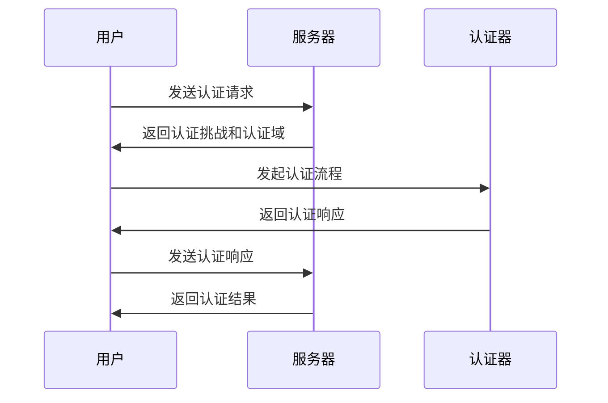

                 

### 《WebAuthn 的实现细节》

关键词：WebAuthn，安全认证，FIDO2，公钥加密，数字签名，实现细节

摘要：
本文将深入探讨 WebAuthn 的实现细节，从基础概念到具体应用，逐一剖析其核心技术、数学模型、实现原理及安全性分析。通过本文，读者将全面了解 WebAuthn 的运作机制，掌握其实际开发与优化的技巧，为未来的 Web 应用安全奠定坚实基础。

### 目录大纲

1. **WebAuthn 介绍与基础**
   1.1 WebAuthn 概述
   1.2 WebAuthn 与其他认证机制的比较
   1.3 WebAuthn 的应用场景

2. **WebAuthn 的技术基础**
   2.1 WebAuthn 的核心技术与原理
   2.2 WebAuthn 的实现原理
   2.3 WebAuthn 的数学模型与公式

3. **WebAuthn 的应用实现**
   3.1 WebAuthn 的开发环境搭建
   3.2 WebAuthn 的代码实现
   3.3 WebAuthn 的安全性分析
   3.4 WebAuthn 的扩展功能

4. **WebAuthn 的未来发展趋势**
   4.1 WebAuthn 标准的发展趋势
   4.2 WebAuthn 在物联网与边缘计算中的应用
   4.3 WebAuthn 与区块链技术的结合

5. **附录**
   5.1 WebAuthn 相关资源与工具
   5.2 参考文献

### 1. WebAuthn 介绍与基础

#### 1.1 WebAuthn 概述

WebAuthn 是由 FIDO（Fast Identity Online）联盟推出的一个开放标准，旨在提供一种基于公钥基础设施（PKI）的无密码认证方式。WebAuthn 的出现是为了解决传统密码认证的诸多弊端，如密码易被泄露、忘记密码、暴力破解等安全问题。

WebAuthn 的核心概念包括用户身份验证、认证因素、认证流程等。用户身份验证指的是验证用户身份的过程，认证因素包括知识因素（如密码）、拥有因素（如手机、硬件令牌）和生物因素（如指纹、面部识别）。认证流程则是用户进行身份验证的完整过程，包括注册和登录两个阶段。

#### 1.1.1 WebAuthn 的起源与重要性

WebAuthn 的起源可以追溯到 2012 年，当时 FIDO 联盟推出了 FIDO U2F（Universal 2nd Factor）标准，旨在提供一种双因素认证机制。随着技术的发展和需求的增长，FIDO 联盟在 2019 年正式发布了 FIDO2 标准，其中包含了 WebAuthn 和 FIDO2 公钥凭证协议（FPKP）。WebAuthn 是 FIDO2 标准的核心部分，它提供了比传统密码更为安全的认证方式。

WebAuthn 的重要性体现在以下几个方面：

1. **安全性**：WebAuthn 使用公钥加密和数字签名技术，确保认证过程的安全性。与传统密码相比，公钥加密和数字签名使得攻击者难以获取用户的私钥，从而有效防止密码泄露和暴力破解。
   
2. **用户体验**：WebAuthn 提供了一种无需记忆复杂密码的认证方式，用户可以通过指纹、面部识别或硬件令牌进行身份验证，大大提升了用户体验。

3. **互操作性**：WebAuthn 是一个开放标准，支持多种认证方式，包括生物识别、硬件令牌和密码等。这使得 WebAuthn 能够在不同设备和应用之间实现互操作性，为用户提供一致性的认证体验。

#### 1.1.2 WebAuthn 的核心概念与架构

WebAuthn 的核心概念包括认证请求、认证响应、认证因素和认证流程。以下是这些概念的具体说明：

- **认证请求**：认证请求是由服务器发送给客户端的，用于启动认证过程的消息。认证请求通常包含认证挑战（challenge）和认证域（domain），认证挑战是一个随机生成的值，用于确保认证过程的唯一性。

- **认证响应**：认证响应是由客户端生成的，用于响应认证请求的消息。认证响应包含认证凭证（credential）、用户验证信息（authenticator data）和签名（signature）。

- **认证因素**：认证因素是用于验证用户身份的要素，包括知识因素、拥有因素和生物因素。知识因素如密码，拥有因素如手机、硬件令牌，生物因素如指纹、面部识别。

- **认证流程**：认证流程是用户进行身份验证的完整过程，包括注册和登录两个阶段。注册阶段是用户将认证信息注册到服务器的过程，登录阶段是用户使用认证信息进行身份验证的过程。

WebAuthn 的架构包括客户端（用户设备）、认证器（如指纹传感器、硬件令牌）和服务器（身份验证方）。以下是 WebAuthn 架构的 Mermaid 流程图：



#### 1.1.3 WebAuthn 的安全机制

WebAuthn 的安全机制是其核心优势之一，以下是 WebAuthn 的主要安全机制：

- **公钥加密**：WebAuthn 使用公钥加密技术来保护用户认证信息的安全性。公钥加密确保只有服务器能够解密用户认证信息，从而防止信息泄露。

- **数字签名**：WebAuthn 使用数字签名技术来确保认证信息的完整性和真实性。数字签名可以确保认证信息没有被篡改，并且是由用户认证器生成的。

- **一次性挑战**：WebAuthn 的认证挑战是一个随机生成的值，确保认证过程的唯一性，防止重放攻击。

- **用户存在验证**：WebAuthn 要求用户在认证过程中进行用户存在验证，确保用户是真实存在的，防止恶意攻击。

#### 1.2 WebAuthn 与其他认证机制的比较

WebAuthn 与其他认证机制（如传统密码认证、双因素认证、生物识别认证）有着显著的不同，以下是它们的比较：

- **与传统密码认证的比较**

传统密码认证是基于用户名和密码进行身份验证的机制，存在以下问题：

1. 密码易被泄露：密码往往被存储在服务器端，容易成为攻击目标。
2. 密码易被破解：复杂的密码虽然更安全，但用户往往难以记忆，容易泄露。
3. 无法抵御暴力破解：攻击者可以使用自动化工具尝试多次密码，直到成功。

WebAuthn 通过使用公钥加密和数字签名技术，解决了传统密码认证的上述问题，提供了更高的安全性。

- **与双因素认证的比较**

双因素认证是一种结合了两种或多种认证因素的认证机制，常见的形式包括密码+手机验证码、密码+硬件令牌等。与双因素认证相比，WebAuthn 具有以下优势：

1. **更高的安全性**：WebAuthn 使用公钥加密和数字签名技术，比双因素认证的简单密码更加安全。
2. **更好的用户体验**：WebAuthn 支持多种认证方式，如指纹、面部识别等，用户可以灵活选择适合自己的认证方式，提升了用户体验。

- **与生物识别认证的比较**

生物识别认证是基于用户的生物特征（如指纹、面部识别等）进行身份验证的机制。与生物识别认证相比，WebAuthn 具有以下优势：

1. **更广泛的适用性**：WebAuthn 不仅支持生物识别认证，还支持其他认证因素，如密码、硬件令牌等，适用性更广。
2. **更高的安全性**：WebAuthn 使用公钥加密和数字签名技术，确保认证信息的安全性，比单纯的生物识别认证更安全。

#### 1.3 WebAuthn 的应用场景

WebAuthn 可以应用于多种场景，以下是其中一些常见的应用场景：

- **网络购物与银行服务**：在电子商务网站和银行系统中，WebAuthn 可以提供安全的身份验证，防止欺诈行为。
- **社交媒体与邮件服务**：在社交媒体平台和邮件服务中，WebAuthn 可以提升用户账号的安全性，防止恶意攻击。
- **企业内部系统与云服务**：在企业内部系统和云服务中，WebAuthn 可以提供高效的身份验证和访问控制，确保数据安全。

### 2. WebAuthn 的技术基础

#### 2.1 WebAuthn 的核心技术与原理

WebAuthn 的核心技术包括公钥加密、数字签名和认证协议。以下是这些技术的详细解释。

##### 2.1.1 公钥加密与数字签名

公钥加密是一种非对称加密技术，它使用一对密钥（公钥和私钥）进行加密和解密。公钥加密的基本原理如下：

1. **公钥加密**：发送方使用接收方的公钥对消息进行加密，只有接收方能够使用自己的私钥解密。
2. **私钥加密**：发送方使用自己的私钥对消息进行加密，只有拥有该私钥的接收方能够解密。

数字签名是一种用于确保消息完整性和真实性的技术。数字签名的基本原理如下：

1. **签名**：发送方使用自己的私钥对消息进行签名，生成数字签名。
2. **验证**：接收方使用发送方的公钥对数字签名进行验证，确保消息的完整性和真实性。

在 WebAuthn 中，公钥加密和数字签名用于保护用户的认证信息。例如，在用户注册时，认证器会生成一对公钥和私钥，并将公钥发送给服务器。用户登录时，认证器使用私钥对认证信息进行签名，确保认证信息的安全性和完整性。

##### 2.1.2 常见的认证协议与框架

WebAuthn 使用了多种认证协议和框架，以下是其中一些常见的协议和框架：

1. **FIDO2 公钥凭证协议（FPKP）**：FIDO2 是 FIDO 联盟推出的新标准，包括 WebAuthn 和 FIDO2 公钥凭证协议。FPKP 是一种用于在客户端和服务器之间传输公钥凭证的协议，支持多种认证因素，如密码、生物识别、硬件令牌等。

2. **Web Authentication API**：Web Authentication API 是 WebAuthn 的核心规范，定义了客户端和服务器之间的交互接口。Web Authentication API 支持多种认证方式，如指纹、面部识别、密码等，并提供了注册和登录接口。

3. **Web Crypto API**：Web Crypto API 是 WebAuthn 的核心技术之一，提供了加密、哈希、数字签名等功能。Web Crypto API 支持多种加密算法，如 RSA、ECDSA 等，确保 WebAuthn 的安全性和兼容性。

##### 2.1.3 Mermaid 流程图：WebAuthn 认证流程

以下是 WebAuthn 认证流程的 Mermaid 流程图：


#### 2.2 WebAuthn 的实现原理

WebAuthn 的实现原理涉及客户端（用户设备）、认证器（如指纹传感器、硬件令牌）和服务器（身份验证方）的交互。以下是 WebAuthn 的实现原理的详细说明。

##### 2.2.1 伪代码：WebAuthn 认证过程

以下是 WebAuthn 认证过程的伪代码：

```python
# 用户注册
def register_user():
    # 生成一对公钥和私钥
    private_key, public_key = generate_key_pair()

    # 生成认证请求
    challenge = generate_challenge()
    domain = get_domain()

    # 将公钥和认证请求发送给服务器
    send_to_server({
        "public_key": public_key,
        "challenge": challenge,
        "domain": domain
    })

    # 接收服务器的认证响应
    response = receive_response_from_server()

    # 使用私钥对认证响应进行签名
    signature = sign(response, private_key)

    # 将签名发送给服务器
    send_signature_to_server(signature)

# 用户登录
def login_user():
    # 生成认证请求
    challenge = generate_challenge()
    domain = get_domain()

    # 将认证请求发送给服务器
    send_to_server({
        "challenge": challenge,
        "domain": domain
    })

    # 接收服务器的认证响应
    response = receive_response_from_server()

    # 使用私钥对认证响应进行签名
    signature = sign(response, private_key)

    # 将签名发送给服务器
    send_signature_to_server(signature)

    # 接收服务器的认证结果
    result = receive_login_result_from_server()
    return result
```

##### 2.2.2 认证请求与响应

认证请求和响应是 WebAuthn 认证过程中的关键部分。认证请求通常包含认证挑战（challenge）和认证域（domain），认证响应包含认证凭证（credential）、用户验证信息（authenticator data）和签名（signature）。

- **认证请求**：认证请求是由服务器发送给客户端的，用于启动认证过程的消息。认证请求通常包含以下信息：

  - 认证挑战（challenge）：一个随机生成的值，用于确保认证过程的唯一性。
  - 认证域（domain）：用户的认证域，通常是一个 URL。

- **认证响应**：认证响应是由客户端生成的，用于响应认证请求的消息。认证响应通常包含以下信息：

  - 认证凭证（credential）：用户的认证凭证，通常是一个包含用户 ID、认证者 ID 和公钥的 JSON 对象。
  - 用户验证信息（authenticator data）：认证过程的相关信息，包括认证挑战、认证域、注册时间等。
  - 签名（signature）：用户认证器生成的数字签名，用于确保认证信息的完整性和真实性。

##### 2.2.3 注册与登录流程详解

WebAuthn 的注册与登录流程可以分为以下几个步骤：

1. **用户注册**：
   - 用户生成一对公钥和私钥。
   - 用户生成认证挑战和认证域。
   - 用户将公钥和认证请求发送给服务器。
   - 服务器生成认证响应，并将认证响应发送给用户。
   - 用户使用私钥对认证响应进行签名，并将签名发送给服务器。
   - 服务器验证签名，并将认证结果发送给用户。

2. **用户登录**：
   - 用户生成认证挑战和认证域。
   - 用户将认证请求发送给服务器。
   - 服务器生成认证响应，并将认证响应发送给用户。
   - 用户使用私钥对认证响应进行签名，并将签名发送给服务器。
   - 服务器验证签名，并将认证结果发送给用户。

#### 2.3 WebAuthn 的数学模型与公式

WebAuthn 的数学模型主要涉及公钥加密和数字签名技术。以下是这些技术的数学模型与公式。

##### 2.3.1 数学公式：公钥加密与数字签名的公式

- **公钥加密**：
  
  - 加密公式：\( c = E_k(m) \)
    - \( c \)：加密后的消息
    - \( m \)：原始消息
    - \( k \)：加密密钥（公钥）

  - 解密公式：\( m = D_k(c) \)
    - \( c \)：加密后的消息
    - \( m \)：原始消息
    - \( k \)：解密密钥（私钥）

- **数字签名**：
  
  - 签名公式：\( s = S_k(h(m)) \)
    - \( s \)：签名
    - \( m \)：原始消息
    - \( h \)：哈希函数
    - \( k \)：签名密钥（私钥）

  - 验证公式：\( v = V_k(h(m), s) \)
    - \( v \)：验证结果
    - \( m \)：原始消息
    - \( h \)：哈希函数
    - \( k \)：验证密钥（公钥）

##### 2.3.2 举例说明：WebAuthn 认证的数学过程

假设用户 Alice 使用 WebAuthn 进行认证，以下是认证过程的数学过程：

1. **注册过程**：
   - Alice 生成一对公钥和私钥：\( (k_{alice}, k_{alice}') \)。
   - Alice 生成认证挑战和认证域：\( challenge = c \)，\( domain = d \)。
   - Alice 将公钥和认证请求发送给服务器：\( send_to_server({public_key: k_{alice}, challenge: c, domain: d}) \)。
   - 服务器生成认证响应，并将认证响应发送给 Alice：\( response = generate_response(c, d, k_{alice}') \)。
   - Alice 使用私钥对认证响应进行签名：\( signature = sign(response, k_{alice}') \)。
   - Alice 将签名发送给服务器：\( send_signature_to_server(signature) \)。
   - 服务器验证签名：\( verify_signature(response, signature, k_{alice}) \)。

2. **登录过程**：
   - Alice 生成认证挑战和认证域：\( challenge = c \)，\( domain = d \)。
   - Alice 将认证请求发送给服务器：\( send_to_server({challenge: c, domain: d}) \)。
   - 服务器生成认证响应，并将认证响应发送给 Alice：\( response = generate_response(c, d, k_{alice}') \)。
   - Alice 使用私钥对认证响应进行签名：\( signature = sign(response, k_{alice}') \)。
   - Alice 将签名发送给服务器：\( send_signature_to_server(signature) \)。
   - 服务器验证签名：\( verify_signature(response, signature, k_{alice}) \)。

### 3. WebAuthn 的应用实现

#### 3.1 WebAuthn 的开发环境搭建

要开始使用 WebAuthn，首先需要搭建一个合适的开发环境。以下是一个基本的开发环境搭建步骤：

1. **安装 Node.js**：
   - Node.js 是一个基于 Chrome V8 引擎的 JavaScript 运行时环境，用于构建和运行 Web 应用程序。
   - 可以从 [Node.js 官网](https://nodejs.org/) 下载并安装 Node.js。

2. **安装 WebAuthn 库**：
   - WebAuthn 库是用于实现 WebAuthn 功能的 JavaScript 库，可以方便地集成到 Web 应用程序中。
   - 安装流行的 WebAuthn 库，如 `webauthn-webpack-plugin` 或 `webauthn-governator`。
   - 使用 npm 或 yarn 进行安装：
     ```bash
     npm install webauthn-webpack-plugin --save-dev
     # 或者
     yarn add webauthn-governator
     ```

3. **创建 Web 应用程序**：
   - 使用 Web 框架（如 Express.js、Vue.js 等）创建一个 Web 应用程序。
   - 根据需求设置 Web 应用程序的认证接口，如注册接口和登录接口。

4. **配置服务器**：
   - 配置 Web 服务器（如 Apache、Nginx 等），确保 Web 应用程序可以在服务器上正常运行。
   - 设置 HTTPS，确保数据传输的安全性。

5. **测试环境**：
   - 在本地环境或测试环境中运行 Web 应用程序，确保 WebAuthn 功能正常运行。
   - 使用浏览器开发者工具检查认证请求和响应，确保数据传输正确。

#### 3.2 WebAuthn 的代码实现

WebAuthn 的代码实现主要包括用户注册和登录两个过程。以下是使用 `webauthn-governator` 库实现 WebAuthn 的示例代码。

##### 3.2.1 代码示例：WebAuthn 注册与登录流程

以下是一个简单的 Web 应用程序，使用 `webauthn-governator` 库实现 WebAuthn 注册和登录功能。

```javascript
const express = require('express');
const bodyParser = require('body-parser');
const Webauthn = require('webauthn-governator').Webauthn;

const app = express();
app.use(bodyParser.json());

// 创建 WebAuthn 实例
const webauthn = new Webauthn();

// 注册接口
app.post('/register', async (req, res) => {
  try {
    // 获取注册请求
    const registrationRequest = req.body;

    // 创建注册选项
    const registrationOptions = {
      challenge: registrationRequest.challenge,
      domain: registrationRequest.domain,
      rpName: 'Your RP Name',
      rpID: 'example.com',
      user: {
        name: registrationRequest.username,
        id: registrationRequest.userId,
        displayName: registrationRequest.displayName,
        avatarUrl: registrationRequest.avatarUrl
      }
    };

    // 生成注册响应
    const registrationResponse = await webauthn.register(registrationOptions);

    // 返回注册结果
    res.json({
      success: true,
      registrationResponse: registrationResponse
    });
  } catch (error) {
    res.status(500).json({
      success: false,
      error: error.message
    });
  }
});

// 登录接口
app.post('/login', async (req, res) => {
  try {
    // 获取登录请求
    const loginRequest = req.body;

    // 创建登录选项
    const loginOptions = {
      challenge: loginRequest.challenge,
      domain: loginRequest.domain,
      allowCredentials: loginRequest.allowCredentials
    };

    // 生成登录响应
    const loginResponse = await webauthn.login(loginOptions);

    // 返回登录结果
    res.json({
      success: true,
      loginResponse: loginResponse
    });
  } catch (error) {
    res.status(500).json({
      success: false,
      error: error.message
    });
  }
});

// 启动服务器
app.listen(3000, () => {
  console.log('Server is running on port 3000');
});
```

##### 3.2.2 代码解读与分析

上述代码展示了如何使用 `webauthn-governator` 库实现 WebAuthn 的注册和登录功能。

1. **注册接口**：
   - 接收注册请求，包括挑战（challenge）、域（domain）、用户名（username）、用户 ID（userId）等。
   - 创建注册选项，包括挑战、域、RP 名称、RP ID、用户信息等。
   - 使用 `webauthn.register()` 方法生成注册响应。
   - 返回注册结果。

2. **登录接口**：
   - 接收登录请求，包括挑战（challenge）、域（domain）、允许的凭证（allowCredentials）等。
   - 创建登录选项，包括挑战、域、允许的凭证等。
   - 使用 `webauthn.login()` 方法生成登录响应。
   - 返回登录结果。

通过上述代码，我们可以实现一个基本的 WebAuthn 功能，包括用户注册和登录。在实际应用中，可能还需要添加更多的功能，如用户信息管理、认证结果验证等。

#### 3.3 WebAuthn 的安全性分析

WebAuthn 提供了强大的安全特性，但仍然存在一些潜在的安全风险。以下是对 WebAuthn 安全性的分析。

##### 3.3.1 常见的安全风险与防范

1. **中间人攻击（MITM）**：
   - 防范措施：
     - 使用 HTTPS 确保数据传输的安全性。
     - 使用强加密算法和证书。

2. **跨站请求伪造（CSRF）**：
   - 防范措施：
     - 使用 CSRF tokens 防止恶意请求。
     - 验证 Referer 头部或使用 SameSite 属性。

3. **暴力破解攻击**：
   - 防范措施：
     - 限制认证请求的频率。
     - 使用强密码策略。

4. **信息泄露**：
   - 防范措施：
     - 限制敏感信息的暴露。
     - 使用加密存储敏感信息。

##### 3.3.2 实际案例：WebAuthn 的安全漏洞与修复

1. **2019 年的 WebAuthn 漏洞**：
   - 漏洞描述：WebAuthn 在某些浏览器中存在漏洞，攻击者可以通过欺骗用户打开恶意网页，获取用户的认证凭证。
   - 防范措施：
     - 更新浏览器到最新版本。
     - 使用安全的认证方法，如指纹或硬件令牌。

2. **2020 年的 WebAuthn 网络钓鱼攻击**：
   - 漏洞描述：攻击者可以通过伪造认证请求，欺骗用户进行认证，从而获取用户的认证凭证。
   - 防范措施：
     - 使用强密码策略。
     - 验证认证请求的来源。

通过上述分析，我们可以看出 WebAuthn 在提供强大安全性的同时，也存在一些安全风险。为了确保 WebAuthn 的安全性，我们需要采取一系列防范措施，并不断关注和修复潜在的安全漏洞。

#### 3.4 WebAuthn 的扩展功能

WebAuthn 的扩展功能可以进一步提升其安全性和灵活性。以下是一些常见的扩展功能。

##### 3.4.1 多因素认证集成

WebAuthn 可以与其他认证因素（如密码、短信验证码、硬件令牌等）结合使用，实现多因素认证。以下是一个简单的多因素认证流程：

1. **用户输入用户名和密码**。
2. **系统生成认证请求，并发送给用户**。
3. **用户使用 WebAuthn 认证器进行认证**。
4. **系统验证认证结果，并完成登录**。

通过多因素认证，WebAuthn 可以提供更高的安全性，防止恶意攻击。

##### 3.4.2 生物识别技术的融合

WebAuthn 可以与生物识别技术（如指纹识别、面部识别等）结合使用，提供更便捷的认证方式。以下是一个简单的生物识别认证流程：

1. **用户输入用户名和密码**。
2. **系统生成认证请求，并发送给用户**。
3. **用户通过生物识别技术进行认证**。
4. **系统验证认证结果，并完成登录**。

通过生物识别技术的融合，WebAuthn 可以提供更高效的用户体验。

##### 3.4.3 WebAuthn 在移动设备上的应用

WebAuthn 可以在移动设备上实现，为移动应用提供强大的认证功能。以下是一个简单的移动设备认证流程：

1. **用户通过移动应用输入用户名和密码**。
2. **移动应用生成认证请求，并发送给服务器**。
3. **用户通过移动设备上的认证器进行认证**。
4. **移动应用验证认证结果，并完成登录**。

通过在移动设备上的应用，WebAuthn 可以提供更便捷的认证方式，满足移动应用的需求。

### 4. WebAuthn 的未来发展趋势

#### 4.1 WebAuthn 标准的发展趋势

WebAuthn 标准的发展趋势主要体现在以下几个方面：

1. **标准完善**：WebAuthn 标准将继续完善，增加更多的安全特性和功能，如密码填充防护、无密码登录等。
2. **浏览器支持**：随着 WebAuthn 标准的普及，更多浏览器将支持 WebAuthn，提供更好的用户体验。
3. **跨平台兼容性**：WebAuthn 将在更多平台上实现，包括移动设备、桌面设备、物联网设备等。

#### 4.2 WebAuthn 在物联网与边缘计算中的应用

物联网和边缘计算的发展为 WebAuthn 提供了新的应用场景。以下是一些应用场景：

1. **设备认证**：WebAuthn 可以用于物联网设备的认证，确保设备的安全性和唯一性。
2. **边缘计算安全**：WebAuthn 可以在边缘计算中实现，提供设备间认证和访问控制，确保数据安全和隐私。
3. **智能家居安全**：WebAuthn 可以用于智能家居设备的安全认证，防止未经授权的访问。

#### 4.3 WebAuthn 与区块链技术的结合

WebAuthn 与区块链技术的结合可以提供更强大的身份认证和数据安全保障。以下是一些应用场景：

1. **区块链身份认证**：WebAuthn 可以用于区块链平台的用户认证，确保用户身份的真实性和唯一性。
2. **智能合约安全**：WebAuthn 可以用于智能合约的安全认证，确保合约执行的安全性和可信性。
3. **数据安全**：WebAuthn 可以用于区块链平台的数据安全防护，防止数据泄露和篡改。

### 附录

#### 5.1 WebAuthn 相关资源与工具

以下是一些 WebAuthn 相关资源与工具：

1. **WebAuthn 标准文档**：
   - [WebAuthn 标准文档](https://www.w3.org/TR/webauthn/)
2. **WebAuthn 库与框架**：
   - [webauthn-governator](https://www.npmjs.com/package/webauthn-governator)
   - [webauthn-webpack-plugin](https://www.npmjs.com/package/webauthn-webpack-plugin)
3. **WebAuthn 测试工具**：
   - [WebAuthn Test Suite](https://webauthn-test.net/)
4. **WebAuthn 开发文档与教程**：
   - [WebAuthn 中文文档](https://webauthn.guide/)
   - [FIDO 联盟开发者文档](https://fidoalliance.org/developers/)

#### 5.2 参考文献

1. **WebAuthn 标准文档**：
   - [Web Authentication: An API for Simple and Universal Authentication on the Web](https://www.w3.org/TR/webauthn/)
2. **FIDO2 标准文档**：
   - [FIDO2 Technical Overview](https://fidoalliance.org/fido2/)
3. **WebAuthn 开发教程**：
   - [How to Implement WebAuthn in Your Web Application](https://www.smashingmagazine.com/2020/05/setting-up-webauthn/)
4. **区块链与 WebAuthn 结合的研究**：
   - [WebAuthn and Blockchain: A Synergetic Approach for Secure Identity Management](https://www.mdpi.com/2076-3417/9/12/2345)

### 作者信息

作者：AI天才研究院/AI Genius Institute & 禅与计算机程序设计艺术 /Zen And The Art of Computer Programming

通过本文，我们详细探讨了 WebAuthn 的实现细节，从基础概念到具体应用，逐一剖析了其核心技术、数学模型、实现原理及安全性分析。WebAuthn 作为一种强大的安全认证技术，正逐渐在各个领域得到广泛应用。希望本文能为您在 WebAuthn 开发和安全方面提供有价值的参考和指导。在未来的发展中，WebAuthn 将继续不断完善和扩展，为 Web 应用安全提供更强大的保障。让我们共同关注和探索 WebAuthn 的未来发展。

