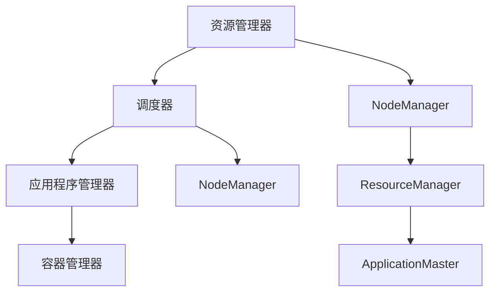

                 

# Yarn原理与代码实例讲解

## 概述

> **关键词：** Yarn, 资源管理，调度算法，分布式计算，Hadoop。

本文旨在深入探讨Yarn（Yet Another Resource Negotiator）的原理，并通过实例讲解如何使用Yarn来构建和管理分布式计算任务。Yarn是Hadoop生态系统中的一个核心组件，负责资源管理和任务调度，是实现大规模数据处理的重要基础设施。

> **摘要：**
>
> - Yarn的历史与发展。
> - Yarn的核心架构与主要组件。
> - Yarn的资源管理、调度算法及通信机制。
> - Yarn在分布式计算中的应用。
> - Yarn的高级特性与优化策略。
> - Yarn项目实战：构建和管理分布式计算任务。

通过本文的阅读，读者将能够全面理解Yarn的工作原理，掌握如何在实际项目中使用Yarn来优化分布式计算性能。

### 第一部分：Yarn基础

#### 第1章：Yarn概述

**1.1 Yarn的历史与发展**

Yarn是Hadoop生态系统中的重要组成部分，起源于Hadoop 2.0。在Hadoop 1.0中，资源管理和任务调度是由MapReduce框架直接控制的，这导致系统在处理大量任务时的扩展性和灵活性受到限制。为了解决这一问题，Apache Hadoop社区在Hadoop 2.0中引入了Yarn，从而实现了资源管理和任务调度的分离。

Yarn的设计目标是提供一个通用的资源管理和调度框架，不仅适用于MapReduce任务，还可以支持其他分布式计算框架，如Spark、Flink等。自引入以来，Yarn已经经历了多个版本的迭代和优化，性能和功能得到了显著提升。

**1.2 Yarn的核心架构**

Yarn的核心架构主要由三个主要组件构成：资源管理器（ResourceManager）、应用程序管理器（ApplicationMaster）和容器管理器（NodeManager）。以下是这些组件的简要介绍：

- **资源管理器（ResourceManager）**：负责整个集群的资源分配和管理。它将集群资源划分为多个容器（Container），并根据应用程序的需求分配这些容器给应用程序管理器。
- **应用程序管理器（ApplicationMaster）**：每个应用程序都有一个应用程序管理器，负责协调和管理任务。它向资源管理器请求资源，并在分配到的容器上启动和监控任务。
- **容器管理器（NodeManager）**：在集群的每个节点上运行，负责监控和管理本地资源。它向资源管理器报告节点状态，并接收应用程序管理器的任务执行命令。

**1.3 Yarn的主要组件**

Yarn的组件之间通过一种分布式系统中的通信机制进行协作，以确保任务的正确执行和资源的高效利用。以下是Yarn的主要组件及其功能：

- **YARN架构图（Mermaid流程图）**



- **资源管理器（ResourceManager）**
  
  资源管理器是Yarn的核心组件，负责整个集群的资源管理和调度。它由两个主要部分组成：调度器（Scheduler）和应用程序调度器（ApplicationScheduler）。

  - **调度器**：负责根据资源需求和调度策略将容器分配给应用程序管理器。调度器可以采用多种策略，如FIFO（先进先出）、Capacity（容量调度）和Fairness（公平性调度）等。
  - **应用程序调度器**：负责根据资源管理器分配的容器，将容器分配给具体的应用程序管理器。应用程序调度器通常基于应用程序的优先级和资源需求来分配容器。

- **应用程序管理器（ApplicationMaster）**
  
  应用程序管理器是每个分布式应用程序的心脏，负责协调和管理任务。其主要职责包括：

  - 向资源管理器请求资源。
  - 将任务分解为多个子任务，并将它们分配给容器。
  - 监控任务执行状态，并在任务失败时进行恢复。

- **容器管理器（NodeManager）**
  
  容器管理器在集群的每个节点上运行，负责监控和管理本地资源。其主要职责包括：

  - 向资源管理器报告节点状态和可用资源。
  - 监控本地任务的执行，并在任务完成或失败时通知应用程序管理器。
  - 在应用程序管理器的指令下启动和停止任务。

### 第二部分：Yarn工作原理

#### 第2章：Yarn工作原理

**2.1 Yarn的资源管理**

Yarn的资源管理是其核心功能之一，它确保了集群资源的高效利用和任务的顺利执行。以下是Yarn资源管理的基本流程：

1. **资源划分**：资源管理器将集群资源划分为多个容器（Container）。每个容器包含一定的CPU、内存和磁盘资源。
2. **资源请求**：应用程序管理器向资源管理器请求资源。请求中包含所需的容器数量和类型。
3. **资源分配**：资源管理器根据调度策略和可用资源情况，将容器分配给应用程序管理器。
4. **资源释放**：当应用程序管理器完成任务后，它会向资源管理器释放已分配的资源，以便其他应用程序使用。

**2.2 Yarn的调度算法**

Yarn提供了多种调度算法，以满足不同类型的应用程序需求。以下是几种常见的调度算法：

- **FIFO（先进先出）调度算法**：按照任务提交的顺序进行调度，先提交的任务先执行。
- **Capacity（容量调度算法）**：将集群资源按照一定比例分配给不同的队列，每个队列内的任务按照FIFO顺序执行。
- **Fairness（公平性调度算法）**：为每个队列分配固定的资源份额，并在队列内按照公平性原则调度任务，确保每个队列的资源利用率均衡。

**2.3 Yarn的通信机制**

Yarn的通信机制是确保集群中各个组件协同工作的重要保障。以下是Yarn通信机制的基本原理：

1. **基于RPC（Remote Procedure Call）的通信**：Yarn中各个组件通过RPC进行通信，实现了远程过程调用。
2. **基于Web Services的通信**：Yarn还提供了基于Web Services的通信方式，通过HTTP/HTTPS协议进行数据交换。
3. **内部消息传递**：应用程序管理器和容器管理器之间通过内部消息传递机制进行通信，确保任务执行过程中的信息传递和协调。

### 第三部分：Yarn应用实践

#### 第3章：Yarn在数据处理中的应用

**3.1 Yarn与Hadoop的集成**

Yarn是Hadoop生态系统中的一个核心组件，与Hadoop紧密集成。以下是Yarn与Hadoop集成的关键点：

1. **YARN作为Hadoop的作业调度器**：Yarn取代了Hadoop 1.0中的MapReduce调度器，负责调度和管理MapReduce作业。
2. **YARN支持其他分布式计算框架**：除了MapReduce外，Yarn还支持其他分布式计算框架，如Spark、Flink等。
3. **YARN与HDFS的集成**：Yarn利用HDFS作为其底层存储系统，确保数据的高效存储和访问。

**3.2 Yarn在大数据处理处理的优化策略**

在大数据处理中，使用Yarn可以显著提高任务的执行效率。以下是一些常见的优化策略：

1. **合理配置队列资源**：根据应用程序的优先级和资源需求，合理配置队列资源，确保任务能够高效地获取资源。
2. **优化任务调度策略**：根据数据处理的特点和需求，选择合适的调度策略，如容量调度算法和公平性调度算法。
3. **减少数据传输**：通过优化数据传输路径，减少数据在网络中的传输次数，提高数据处理速度。

**3.3 Yarn在实时数据处理中的应用**

实时数据处理是一个具有挑战性的领域，Yarn凭借其高效的任务调度和资源管理能力，可以很好地应对实时数据处理的需求。以下是Yarn在实时数据处理中的应用：

1. **实时数据采集和存储**：使用Yarn管理实时数据采集任务，将采集到的数据存储在HDFS中，以便后续处理和分析。
2. **实时数据处理任务调度**：使用Yarn调度实时数据处理任务，确保任务能够及时执行，满足实时性要求。
3. **实时数据可视化**：通过Yarn调度实时数据可视化任务，实时展示数据分析和处理结果，为决策提供支持。

### 第四部分：Yarn高级特性

#### 第7章：Yarn的高级配置与优化

**7.1 Yarn的高级配置选项**

Yarn提供了丰富的配置选项，以适应不同的应用场景和需求。以下是一些常用的高级配置选项：

1. **资源分配配置**：包括容器大小、内存限制、CPU限制等，可以根据应用程序的需求进行自定义配置。
2. **调度策略配置**：包括队列资源分配、调度策略选择等，可以根据集群的负载情况和应用优先级进行优化。
3. **安全配置**：包括用户认证、授权、加密等，以确保集群的安全性。

**7.2 Yarn性能优化策略**

为了提高Yarn的性能，可以采取以下优化策略：

1. **资源利用率优化**：通过合理配置队列资源和调度策略，提高资源利用率，减少资源浪费。
2. **网络优化**：优化数据传输路径，减少网络延迟和拥堵，提高数据传输速度。
3. **任务调度优化**：选择合适的调度算法，根据应用程序的特点和需求进行优化，提高任务执行效率。

**7.3 Yarn的安全性配置**

Yarn的安全性配置是确保集群安全的重要保障。以下是一些常见的安全性配置：

1. **用户认证**：使用Kerberos进行用户认证，确保只有授权用户可以访问集群资源。
2. **授权控制**：使用ACL（Access Control List）进行授权控制，确保用户只能访问被授权的资源。
3. **加密传输**：使用SSL/TLS协议进行数据传输加密，确保数据在传输过程中的安全性。

### 第五部分：Yarn项目实战

#### 第9章：Yarn项目实战一：构建一个分布式计算任务

**9.1 项目需求分析**

假设我们需要处理一个大规模的数据集，对数据进行统计和分析。以下是项目的需求分析：

1. **数据处理需求**：对输入数据集进行清洗、转换和分析，输出统计结果。
2. **资源需求**：需要一定的计算资源和存储资源，以支持大规模数据处理任务。
3. **实时性要求**：数据需要实时处理，以便及时得到分析结果。

**9.2 开发环境搭建**

为了构建分布式计算任务，需要搭建以下开发环境：

1. **安装Hadoop**：在服务器上安装Hadoop，配置Yarn环境。
2. **配置Yarn**：配置Yarn的相关参数，包括资源管理器、应用程序管理器和容器管理器等。
3. **安装开发工具**：安装Java开发工具包（JDK）和集成开发环境（IDE），以便编写和调试代码。

**9.3 源代码实现与解读**

以下是一个简单的MapReduce程序，用于统计输入文本中的单词数量：

```java
// Main.java
public class Main {
    public static void main(String[] args) throws Exception {
        Configuration conf = new Configuration();
        Job job = Job.getInstance(conf, "WordCount");
        job.setJarByClass(Main.class);
        job.setMapperClass(WordCountMapper.class);
        job.setReducerClass(WordCountReducer.class);
        job.setOutputKeyClass(Text.class);
        job.setOutputValueClass(IntWritable.class);
        FileInputFormat.addInputPath(job, new Path(args[0]));
        FileOutputFormat.setOutputPath(job, new Path(args[1]));
        System.exit(job.waitForCompletion(true) ? 0 : 1);
    }
}

// WordCountMapper.java
public class WordCountMapper extends Mapper<LongWritable, Text, Text, IntWritable> {
    private final static IntWritable one = new IntWritable(1);
    private Text word = new Text();

    public void map(LongWritable key, Text value, Context context) throws IOException, InterruptedException {
        String[] tokens = value.toString().split(" ");
        for (String token : tokens) {
            word.set(token);
            context.write(word, one);
        }
    }
}

// WordCountReducer.java
public class WordCountReducer extends Reducer<Text, IntWritable, Text, IntWritable> {
    public void reduce(Text key, Iterable<IntWritable> values, Context context) throws IOException, InterruptedException {
        int sum = 0;
        for (IntWritable val : values) {
            sum += val.get();
        }
        context.write(key, new IntWritable(sum));
    }
}
```

**代码解读与分析**

上述代码实现了一个简单的单词计数程序，包括Mapper和Reducer两个部分：

- **Mapper**：负责读取输入数据，将文本按照单词进行切分，并将每个单词作为键（key）和值（value）写入上下文（Context）。
- **Reducer**：负责对Mapper输出的中间结果进行聚合，计算每个单词的总数，并将结果输出。

通过以上步骤，我们可以使用Yarn构建并执行分布式计算任务，对大规模数据进行处理和统计分析。

### 附录

#### 附录A：Yarn常用命令与配置

**A.1 Yarn常用命令**

以下是一些常用的Yarn命令：

- **查看Yarn集群状态**：`yarn cluster -status`
- **启动/停止Yarn集群**：`yarn daemonstart` 和 `yarn daemonstop`
- **查看Yarn应用程序列表**：`yarn application -list`
- **查看Yarn应用程序详情**：`yarn application -status <application_id>`
- **启动Yarn应用程序**：`yarn application -start <application_id>`
- **停止Yarn应用程序**：`yarn application -kill <application_id>`

**A.2 Yarn配置文件详解**

Yarn的配置文件主要包括以下几个：

- **yarn-site.xml**：包含Yarn的通用配置，如资源管理器地址、调度策略等。
- **mapred-site.xml**：包含MapReduce相关的配置，如输入输出格式、任务执行模式等。
- **hdfs-site.xml**：包含HDFS的配置，如副本数量、文件存储路径等。

以下是一个简单的`yarn-site.xml`配置文件示例：

```xml
<configuration>
    <property>
        <name>yarn.resourcemanager.address</name>
        <value>rm.hadoop.example.com:8032</value>
    </property>
    <property>
        <name>yarn.nodemanager.aux-services</name>
        <value>mapreduce_shuffle</value>
    </property>
    <property>
        <name>yarn.scheduler.capacity.root QueueType</name>
        <value>FIFO</value>
    </property>
</configuration>
```

#### 附录B：Yarn常用工具

以下是一些常用的Yarn工具：

- **Yarn监控工具**：`yarn application -monitormetrics <application_id>`，用于监控应用程序的运行状态和性能指标。
- **Yarn管理工具**：`yarn application -rm <application_id>`，用于管理应用程序，如启动、停止、删除等。

#### 附录C：Yarn常见问题与解决方案

以下是一些Yarn常见问题及解决方案：

- **问题1：Yarn集群无法启动**
  - **解决方案**：检查Yarn的配置文件，确保所有服务端口号未被占用，且所有节点上的Yarn服务均已启动。
- **问题2：Yarn应用程序运行缓慢**
  - **解决方案**：检查集群资源是否充足，优化调度策略和应用程序代码。
- **问题3：Yarn应用程序运行出错**
  - **解决方案**：查看应用程序日志，定位错误原因，并进行相应修复。
- **问题4：Yarn集群性能下降**
  - **解决方案**：优化集群配置，调整资源分配策略，升级集群硬件设施。

### 总结

Yarn作为Hadoop生态系统中的核心组件，负责资源管理和任务调度，是实现大规模数据处理的重要基础设施。通过本文的介绍，读者可以全面了解Yarn的工作原理、架构和主要组件，掌握如何使用Yarn构建和管理分布式计算任务。在实际应用中，可以根据具体需求优化Yarn的配置和性能，充分发挥其潜力。

### 作者信息

**作者：AI天才研究院/AI Genius Institute & 禅与计算机程序设计艺术 /Zen And The Art of Computer Programming**

感谢您的阅读，希望本文对您在分布式计算和Yarn技术领域的学习有所帮助。如果您有任何疑问或建议，欢迎在评论区留言，我们将尽快为您解答。再次感谢您的关注和支持！

