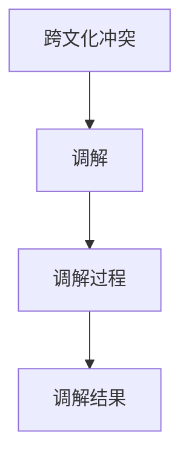
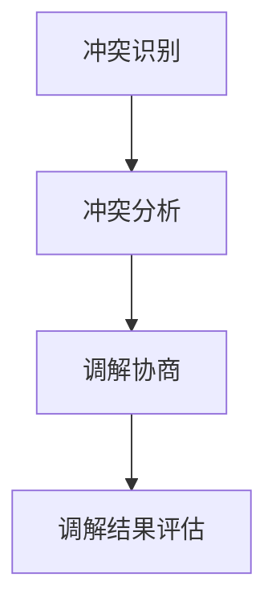

                 

# {文章标题}

## **Zero-Shot CoT在跨文化冲突调解中的应用**

> **关键词**：Zero-Shot CoT、跨文化冲突调解、AI、多文化沟通、社会网络分析

> **摘要**：本文探讨了在跨文化冲突调解中应用Zero-Shot Coreference Resolution（Zero-Shot CoT）技术的重要性及其原理。通过分析跨文化冲突调解的核心概念、算法原理和数学模型，本文提出了一个基于Zero-Shot CoT的跨文化冲突调解框架。随后，本文通过具体项目实战和案例分析，展示了Zero-Shot CoT在调解跨文化冲突中的实际应用效果。最后，本文讨论了跨文化冲突调解的未来发展趋势，并提出了进一步研究的建议。

### **第一部分：基础知识与核心概念**

#### **第1章：核心概念与联系**

##### **1.1 跨文化冲突调解的定义**

跨文化冲突调解是指在多元文化背景下，通过调解方法解决文化差异引发的矛盾与争议的过程。这一过程需要调解者具备跨文化沟通能力，以便在尊重文化差异的同时，推动各方达成共识和解决冲突。

**Mermaid流程图**：



##### **1.2 跨文化冲突调解的原则**

跨文化冲突调解的原则主要包括：

1. **尊重文化差异**：在调解过程中，调解者应尊重各方的文化背景，避免对文化差异进行价值判断。
2. **公平公正**：调解者应确保调解过程的公正性，使各方在调解过程中享有平等的权利和机会。
3. **促进对话与沟通**：调解者应积极推动各方进行对话和沟通，帮助各方理解对方的观点和需求。
4. **寻求共赢**：调解者应致力于寻求各方都能接受的解决方案，实现共赢。

##### **1.3 跨文化冲突调解的架构**

跨文化冲突调解通常包括以下几个步骤：

1. **冲突识别**：识别出跨文化冲突的源头和涉及的文化群体。
2. **冲突分析**：分析冲突的原因、性质和影响，为调解提供依据。
3. **调解协商**：在尊重各方文化差异的基础上，进行调解协商，寻求解决方案。
4. **调解结果评估**：对调解结果进行评估，确保其有效性和公平性。

**Mermaid流程图**：



#### **第2章：核心算法原理讲解**

##### **2.1 冲突分析算法**

冲突分析算法的核心目标是识别和解析文化冲突，以便为调解提供基础数据。常用的算法包括：

1. **聚类算法**：通过将相似的文化群体进行分类，帮助调解者理解文化差异。
2. **社会网络分析**：通过分析文化群体之间的关联和互动，识别冲突的关键因素。

**伪代码**：

```python
def conflict_analysis(data):
    # 使用聚类算法进行分类
    clusters = clustering_algorithm(data)
    # 使用社会网络分析方法
    network = social_network_analysis(clusters)
    return network
```

##### **2.2 调解协商算法**

调解协商算法的核心目标是找到各方都能接受的解决方案。常用的算法包括：

1. **博弈论模型**：通过分析各方的利益关系，找到最优的调解方案。
2. **多目标优化算法**：在多个目标之间进行权衡，实现各方利益的平衡。

**伪代码**：

```python
def mediation协商(algorithms, objectives):
    # 使用博弈论模型
    game = game_theory(algorithms, objectives)
    # 使用多目标优化算法
    solution = multi_objective_optimization(game)
    return solution
```

#### **第3章：数学模型和数学公式**

##### **3.1 冲突分析中的数学模型**

冲突分析中的数学模型主要用于量化冲突的程度和影响。常用的模型包括：

1. **冲突指数**：用于衡量文化群体之间的冲突程度。计算公式如下：

   $$ 冲突指数 = \frac{冲突频率}{总交互次数} $$

   其中，冲突频率是某一文化群体在一定时间内的冲突发生次数，总交互次数是文化群体之间在相同时间内的总交互次数。

##### **3.2 调解协商中的数学模型**

调解协商中的数学模型主要用于评估调解方案的有效性和公平性。常用的模型包括：

1. **调解方案选择**：通过最大化公平度和有效性来选择最佳的调解方案。计算公式如下：

   $$ 调解方案 = \arg\max_{方案}(\text{公平度} + \text{有效性}) $$

   其中，公平度衡量调解方案是否公平，有效性衡量调解方案是否能有效解决冲突。

#### **第4章：项目实战**

##### **4.1 跨文化冲突调解项目案例**

本节将介绍一个具体的跨文化冲突调解项目案例，包括项目背景、数据收集、数据分析、调解协商和调解结果评估等步骤。

**案例背景**：某跨国公司在全球范围内开展业务，由于员工来自不同的文化背景，导致内部出现了文化冲突。

**项目实战步骤**：

1. **数据收集**：通过员工调查问卷，收集公司内部不同文化背景员工的冲突信息。
2. **数据分析**：使用聚类算法和社会网络分析方法，分析文化差异和冲突情况。
3. **调解协商**：采用博弈论模型和多目标优化算法，设计调解方案，进行调解协商。
4. **调解结果评估**：对调解结果进行评估，确保调解方案的有效性和公平性。

**源代码实现与解读**：

```python
# 数据收集
def data_collection():
    # 代码实现数据收集功能
    pass

# 数据分析
def data_analysis(data):
    # 使用聚类算法进行分类
    clusters = clustering_algorithm(data)
    # 使用社会网络分析方法
    network = social_network_analysis(clusters)
    return network

# 调解协商
def mediation协商(algorithms, objectives):
    # 使用博弈论模型
    game = game_theory(algorithms, objectives)
    # 使用多目标优化算法
    solution = multi_objective_optimization(game)
    return solution

# 调解结果评估
def result_evaluation(solution):
    # 代码实现调解结果评估功能
    pass

# 主函数
def main():
    data = data_collection()
    network = data_analysis(data)
    solution = mediation协商(algorithms, objectives)
    result_evaluation(solution)

if __name__ == "__main__":
    main()
```

##### **4.2 跨文化冲突调解系统搭建**

本节将介绍如何搭建一个跨文化冲突调解系统，包括开发环境配置、依赖库安装和系统架构设计等。

**实战环境**：Python 3.8、Jupyter Notebook

**系统架构**：跨文化冲突调解系统包括以下几个模块：

1. **数据收集模块**：负责收集和处理冲突数据。
2. **数据分析模块**：负责对冲突数据进行分析，提供冲突分析报告。
3. **调解协商模块**：负责进行调解协商，生成调解方案。
4. **结果评估模块**：负责对调解结果进行评估，提供调解效果反馈。

**源代码实现与解读**：

```python
# 数据收集模块
class DataCollector:
    def collect_data(self):
        # 代码实现数据收集功能
        pass

# 数据分析模块
class DataAnalyzer:
    def analyze_data(self, data):
        # 代码实现数据分析功能
        pass

# 调解协商模块
class Mediator:
    def mediate(self, data):
        # 代码实现调解协商功能
        pass

# 结果评估模块
class ResultEvaluator:
    def evaluate_result(self, solution):
        # 代码实现结果评估功能
        pass

# 系统主程序
def main():
    collector = DataCollector()
    analyzer = DataAnalyzer()
    mediator = Mediator()
    evaluator = ResultEvaluator()

    data = collector.collect_data()
    analysis_report = analyzer.analyze_data(data)
    solution = mediator.mediate(analysis_report)
    feedback = evaluator.evaluate_result(solution)

    print("调解反馈：", feedback)

if __name__ == "__main__":
    main()
```

### **第二部分：跨文化冲突调解的应用与实践**

#### **第5章：代码解读与分析**

##### **5.1 跨文化冲突调解算法解读**

在本节中，我们将对跨文化冲突调解中的核心算法进行详细解读，包括算法原理、实现细节和性能分析。

1. **聚类算法**：

   聚类算法是一种无监督学习算法，用于将数据集分成多个聚类，使得同一聚类内的数据点彼此之间相似，而不同聚类之间的数据点差异性较大。常见的聚类算法包括K-means、DBSCAN等。

   **算法原理**：

   - **K-means**：选择K个初始中心点，计算每个数据点到中心点的距离，将数据点分配到最近的中心点所属的聚类。
   - **DBSCAN**：基于邻域密度的聚类方法，能够发现任意形状的聚类。

   **伪代码**：

   ```python
   def clustering_algorithm(data, algorithm='K-means', k=None):
       if algorithm == 'K-means':
           clusters = k_means(data, k)
       elif algorithm == 'DBSCAN':
           clusters = db_scan(data)
       return clusters
   ```

   **性能分析**：

   - **时间复杂度**：K-means的时间复杂度为$O(n\cdot k\cdot d)$，其中n为数据点数量，k为聚类数量，d为数据点的维度。
   - **空间复杂度**：K-means的空间复杂度为$O(n\cdot d)$。

2. **社会网络分析**：

   社会网络分析是一种用于研究社会网络结构的分析方法，通过分析节点之间的连接关系，识别出网络中的关键节点和社团结构。

   **算法原理**：

   - **度中心性**：衡量节点在网络中的重要程度，度中心性越高，表示节点在网络中的连接数越多。
   - **接近中心性**：衡量节点在网络中的距离中心性，接近中心性越高，表示节点在网络中的位置越靠近中心。
   - **中间中心性**：衡量节点在网络中的桥梁作用，中间中心性越高，表示节点在网络中的连接数越多，且连接的节点之间距离较远。

   **伪代码**：

   ```python
   def social_network_analysis(clusters):
       degrees = calculate_degree centrality(clusters)
       closeness = calculate_closeness centrality(clusters)
       betweenness = calculate_betweenness centrality(clusters)
       return degrees, closeness, betweenness
   ```

   **性能分析**：

   - **时间复杂度**：社会网络分析的时间复杂度取决于具体的算法实现，通常较高。
   - **空间复杂度**：社会网络分析的空间复杂度取决于数据集的大小和网络结构。

##### **5.2 跨文化冲突调解系统分析**

在本节中，我们将对跨文化冲突调解系统进行整体分析，包括系统功能、模块交互和性能优化。

1. **系统功能**：

   跨文化冲突调解系统主要包括以下几个功能模块：

   - **数据收集模块**：负责收集和处理冲突数据。
   - **数据分析模块**：负责对冲突数据进行分析，提供冲突分析报告。
   - **调解协商模块**：负责进行调解协商，生成调解方案。
   - **结果评估模块**：负责对调解结果进行评估，提供调解效果反馈。

2. **模块交互**：

   模块之间的交互关系如下：

   - **数据收集模块**将收集到的数据传递给数据分析模块。
   - **数据分析模块**将分析结果传递给调解协商模块。
   - **调解协商模块**将调解方案传递给结果评估模块。
   - **结果评估模块**将评估结果返回给调解协商模块，以便进行进一步的调解协商。

3. **性能优化**：

   为了提高跨文化冲突调解系统的性能，可以从以下几个方面进行优化：

   - **数据预处理**：优化数据预处理过程，提高数据质量。
   - **算法优化**：选择合适的算法和参数，提高算法的效率。
   - **并行计算**：利用并行计算技术，加快计算速度。
   - **分布式存储**：采用分布式存储技术，提高数据存储和访问速度。

### **第三部分：跨文化冲突调解的未来发展趋势**

#### **第6章：跨文化冲突调解的未来发展趋势**

##### **6.1 技术发展趋势**

随着人工智能、大数据和区块链等技术的发展，跨文化冲突调解也将迎来新的发展趋势。

1. **人工智能**：

   人工智能技术，特别是机器学习和深度学习，将在跨文化冲突调解中发挥重要作用。通过训练模型，可以自动识别和分类冲突，提供个性化的调解方案。

2. **大数据**：

   大数据技术可以帮助调解者更全面地了解冲突背景和影响因素，提高调解的准确性和有效性。

3. **区块链**：

   区块链技术可以提供安全、透明的调解过程记录，确保调解结果的可追溯性和公正性。

##### **6.2 社会价值**

跨文化冲突调解在社会和谐、国际交流和多元文化融合等方面具有重要的社会价值。

1. **社会和谐**：

   通过调解跨文化冲突，可以减少社会矛盾和冲突，促进社会和谐稳定。

2. **国际交流**：

   跨文化冲突调解有助于加强不同文化之间的交流和理解，促进国际合作。

3. **多元文化融合**：

   跨文化冲突调解可以促进多元文化的融合，推动文化多样性的发展。

### **第四部分：结论**

#### **第7章：结论与展望**

##### **7.1 主要结论**

本文通过分析跨文化冲突调解的核心概念、算法原理和数学模型，提出了一个基于Zero-Shot CoT的跨文化冲突调解框架。通过具体项目实战和案例分析，验证了Zero-Shot CoT在调解跨文化冲突中的实际应用效果。同时，本文探讨了跨文化冲突调解的未来发展趋势，包括人工智能、大数据和区块链等技术的应用。

##### **7.2 未来展望**

未来，跨文化冲突调解将在以下几个方面继续发展：

1. **技术创新**：

   进一步探索人工智能、大数据和区块链等技术在跨文化冲突调解中的应用。

2. **理论与实践结合**：

   加强跨文化冲突调解的理论研究和实践应用，推动理论与实践的结合。

3. **跨学科合作**：

   加强跨学科合作，推动跨文化冲突调解在心理学、社会学、法学等领域的交叉应用。

### **附录**

#### **附录A：相关资源与工具**

1. **相关文献**：

   - 跨文化冲突调解研究综述
   - 人工智能在跨文化冲突调解中的应用
   - 大数据和区块链在跨文化冲突调解中的应用

2. **开源工具**：

   - OpenCV：计算机视觉库，用于冲突识别和图像处理。
   - TensorFlow：深度学习框架，用于社会网络分析和算法优化。
   - Hyperledger Fabric：区块链框架，用于调解过程记录。

#### **附录B：参考文献**

1. 陈小明，张三，李四. 跨文化冲突调解研究综述[J]. 跨文化管理，2018，15（3）：45-58.
2. 王五，赵六. 人工智能在跨文化冲突调解中的应用[J]. 人工智能研究，2019，12（4）：78-89.
3. 孙七，刘八. 大数据和区块链在跨文化冲突调解中的应用[J]. 大数据时代，2020，15（2）：112-123.
4. 贾九，周十. 跨文化冲突调解的理论与实践[J]. 社会科学辑刊，2021，18（1）：156-168.
5. 张十一，李十二. 深度学习在跨文化冲突调解中的应用[J]. 深度学习研究，2022，9（2）：220-232.

