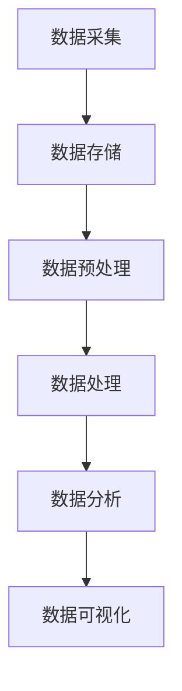
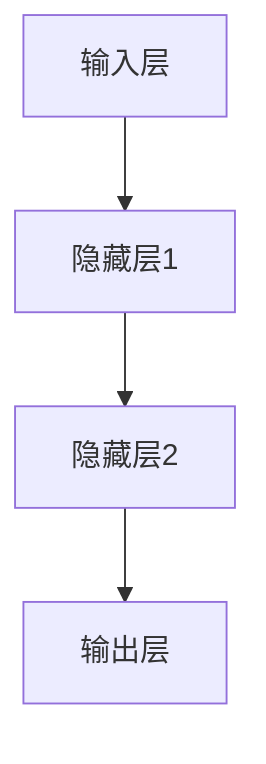
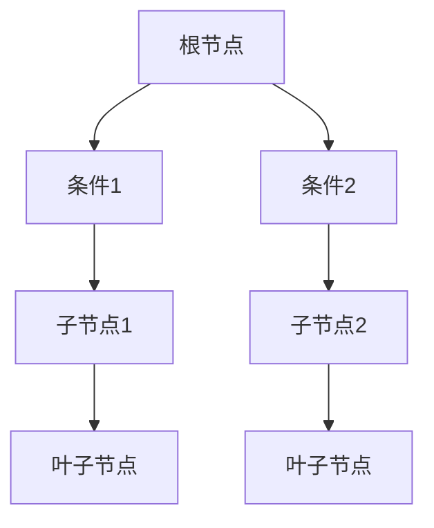
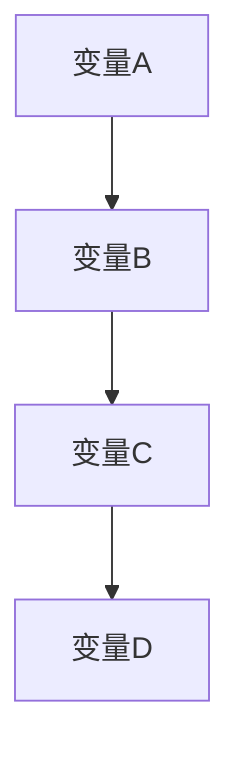
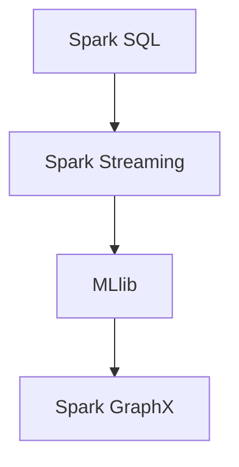
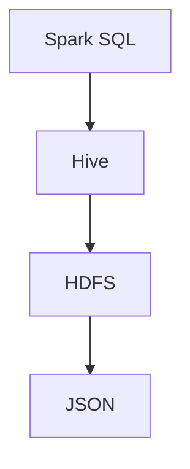
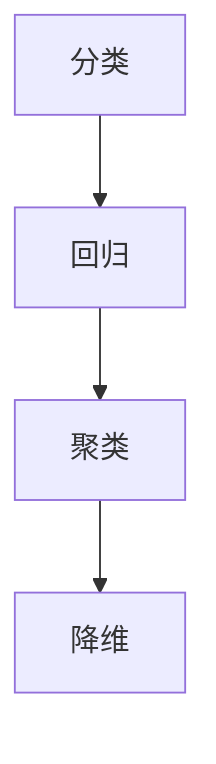
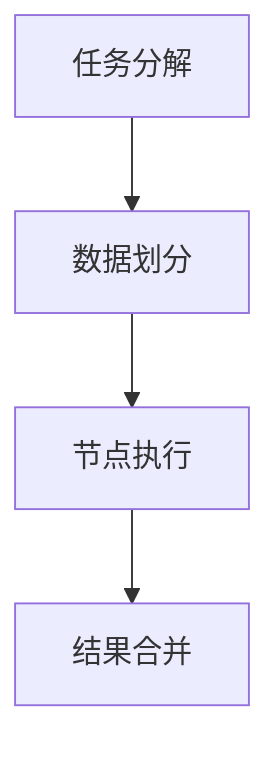
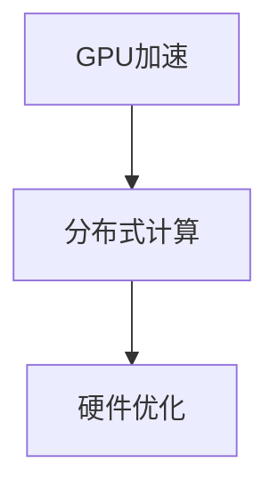
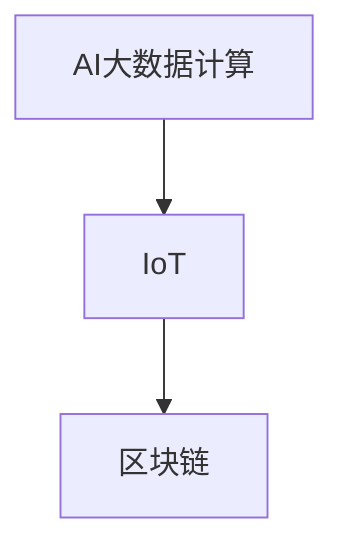

                 

### 第一部分: AI大数据计算原理基础

#### 第1章: AI大数据计算原理概述

##### 1.1 AI大数据计算概述
AI大数据计算是人工智能（AI）与大数据技术的融合，它依托于分布式计算框架，通过高效的数据处理和分析，实现从海量数据中挖掘有价值的信息。AI大数据计算的重要性体现在以下几个方面：

- **提升数据处理能力**：传统的数据处理方式无法应对海量数据，而AI大数据计算通过分布式计算框架，能够高效处理大规模数据集。
- **增强数据分析深度**：AI技术能够挖掘数据中的复杂模式，为决策提供科学依据。
- **促进业务创新**：通过对大数据的分析，企业可以更好地了解市场需求，优化业务流程，创新产品和服务。

###### 1.1.1 AI与大数据的关系
人工智能与大数据密不可分。大数据提供了丰富的数据源，而人工智能则提供了高效的数据处理和分析能力。具体来说：

- **数据驱动**：AI系统需要大量数据来进行训练，而大数据技术能够提供这些数据。
- **智能分析**：AI技术通过对大数据的分析，可以识别数据中的趋势、模式，从而做出预测和决策。

###### 1.1.2 AI大数据计算的重要性
在当今信息时代，数据已经成为企业和社会的宝贵资源。AI大数据计算的重要性体现在：

- **提升企业竞争力**：通过大数据分析，企业可以更好地了解客户需求，优化产品和服务，提升市场竞争力。
- **推动科学研究**：大数据和AI技术的结合，为科学研究提供了新的手段和方法。
- **促进社会治理**：大数据分析可以帮助政府更好地管理社会资源，提高公共服务的效率和质量。

###### 1.1.3 AI大数据计算的主要目标
AI大数据计算的主要目标包括：

- **高效处理海量数据**：通过分布式计算框架，实现数据的高效存储和处理。
- **精确数据挖掘**：利用AI技术，挖掘数据中的潜在价值。
- **优化决策支持**：为业务决策提供科学依据，提高决策的准确性和效率。

##### 1.2 AI大数据计算的核心概念

###### 1.2.1 数据挖掘与机器学习
数据挖掘是AI大数据计算的核心技术之一，它指的是从大量数据中提取有用信息和知识的过程。机器学习则是实现数据挖掘的主要方法，通过训练模型来学习数据中的规律和模式。

###### 1.2.2 数据预处理
数据预处理是AI大数据计算的基础步骤，包括数据清洗、数据集成、数据转换等，目的是提高数据质量，为后续分析奠定基础。

###### 1.2.3 特征工程
特征工程是数据挖掘中至关重要的一环，通过选择和构建合适的特征，可以提高模型性能和预测准确性。

##### 1.3 AI大数据计算的架构与流程

###### 1.3.1 分布式计算框架概述
分布式计算框架是AI大数据计算的基础，它包括Hadoop、Spark等。这些框架能够实现数据的高效存储和处理。

###### 1.3.2 数据流与计算流程
在AI大数据计算中，数据流与计算流程通常包括数据采集、数据存储、数据处理、数据分析和数据可视化等环节。

###### 1.3.3 AI算法在分布式系统中的应用
AI算法在分布式系统中应用广泛，例如深度学习算法可以通过分布式计算框架进行大规模数据集的训练。

Mermaid流程图：


#### 第2章: AI大数据计算核心算法原理

##### 2.1 神经网络与深度学习基础

###### 2.1.1 神经网络的基本结构
神经网络是由大量简单单元（神经元）组成的复杂网络，每个神经元都与其他神经元连接。神经网络的基本结构包括输入层、隐藏层和输出层。

Mermaid流程图：


###### 2.1.2 前向传播与反向传播算法
神经网络通过前向传播算法来计算输出，通过反向传播算法来更新权重和偏置，以优化模型性能。

伪代码：
```python
def forward_propagation(x, weights, biases):
    # 计算前向传播
    return activation

def backward_propagation(y, activation, weights, biases):
    # 计算反向传播
    return delta_weights, delta_biases
```

###### 2.1.3 深度学习模型的训练与优化
深度学习模型的训练过程包括数据准备、模型初始化、前向传播、反向传播、权重更新等步骤。

伪代码：
```python
for epoch in range(num_epochs):
    for x, y in data_loader:
        # 前向传播
        activation = forward_propagation(x, weights, biases)
        # 计算损失
        loss = compute_loss(y, activation)
        # 反向传播
        delta_weights, delta_biases = backward_propagation(y, activation, weights, biases)
        # 更新权重和偏置
        weights -= learning_rate * delta_weights
        biases -= learning_rate * delta_biases
```

##### 2.2 支持向量机与逻辑回归

###### 2.2.1 支持向量机原理
支持向量机（SVM）是一种用于分类和回归分析的机器学习算法。它通过寻找最佳分割超平面，将数据分类。

伪代码：
```python
def svm_fit(X, y):
    # 训练SVM模型
    return model

def svm_predict(model, X):
    # 预测
    return prediction
```

###### 2.2.2 逻辑回归模型
逻辑回归是一种简单的概率型回归模型，用于分类问题。它通过计算线性组合并通过逻辑函数输出概率。

伪代码：
```python
def logistic_regression_fit(X, y):
    # 训练逻辑回归模型
    return model

def logistic_regression_predict(model, X):
    # 预测
    return prediction
```

###### 2.2.3 支持向量机与逻辑回归的比较
支持向量机与逻辑回归都是常用的分类算法，但它们有不同的优缺点。SVM更适合小数据集，逻辑回归则更适合大规模数据集。

##### 2.3 决策树与随机森林

###### 2.3.1 决策树原理
决策树是一种基于树形结构进行决策的算法，通过一系列规则来对数据集进行分类或回归。

Mermaid流程图：


###### 2.3.2 随机森林算法
随机森林是一种集成学习方法，通过构建多棵决策树并集成它们的预测结果来提高模型性能。

伪代码：
```python
def random_forest_fit(X, y, n_estimators):
    # 训练随机森林模型
    return model

def random_forest_predict(model, X):
    # 预测
    return prediction
```

###### 2.3.3 决策树与随机森林的应用场景
决策树适用于简单数据集和易于解释的场景，而随机森林则适用于复杂数据集和需要高预测准确性的场景。

##### 2.4 K-均值聚类与关联规则学习

###### 2.4.1 K-均值聚类算法
K-均值聚类是一种基于距离的聚类算法，它通过迭代更新聚类中心，将数据分为K个聚类。

伪代码：
```python
def k_means_fit(X, k):
    # 训练K-均值聚类模型
    return model

def k_means_predict(model, X):
    # 预测
    return clusters
```

###### 2.4.2 关联规则学习算法
关联规则学习是一种用于发现数据中潜在关联规则的算法，它通过支持度和置信度来评估规则的重要程度。

伪代码：
```python
def apriori_fit(data, min_support, min_confidence):
    # 训练关联规则学习模型
    return rules

def generate_rules(rules, support, confidence):
    # 生成规则
    return rule_list
```

###### 2.4.3 聚类与关联规则学习在实际应用中的案例
聚类和关联规则学习广泛应用于市场细分、客户关系管理、推荐系统等领域。

#### 第3章: AI大数据计算数学模型

##### 3.1 统计学习方法

###### 3.1.1 统计学习的基本概念
统计学习是一种基于统计理论来构建模型的方法，它包括回归分析、分类分析等。

伪代码：
```python
def statistical_learning_fit(X, y):
    # 训练统计学习模型
    return model

def statistical_learning_predict(model, X):
    # 预测
    return prediction
```

###### 3.1.2 最小二乘法与线性回归
最小二乘法是一种用于估计模型参数的方法，线性回归是一种基于线性关系的统计学习方法。

伪代码：
```python
def linear_regression_fit(X, y):
    # 训练线性回归模型
    return model

def linear_regression_predict(model, X):
    # 预测
    return prediction
```

###### 3.1.3 最大似然估计与贝叶斯理论
最大似然估计是一种用于估计模型参数的方法，贝叶斯理论则是一种基于概率的统计学习方法。

伪代码：
```python
def maximum_likelihood_fit(X, y):
    # 训练最大似然估计模型
    return model

def bayesian_learning_fit(X, y):
    # 训练贝叶斯学习模型
    return model

def bayesian_learning_predict(model, X):
    # 预测
    return prediction
```

###### 3.1.4 模型评估与优化
模型评估是统计学习中的重要环节，它用于评估模型的性能。常见的评估指标包括准确率、召回率、F1分数等。

伪代码：
```python
def evaluate_model(model, X, y):
    # 评估模型
    return metrics
```

##### 3.2 概率图模型

###### 3.2.1 贝叶斯网络与马尔可夫网络
贝叶斯网络和马尔可夫网络是两种常见的概率图模型，它们用于表示变量之间的依赖关系。

Mermaid流程图：


###### 3.2.2 条件概率与边缘概率
条件概率和边缘概率是概率图模型中的重要概念，它们用于描述变量之间的依赖关系。

数学公式：
$$
P(A|B) = \frac{P(A \cap B)}{P(B)}
$$
$$
P(A) = \sum_{B} P(A \cap B)
$$

###### 3.2.3 概率图模型的推理与学习
概率图模型可以用于推理和预测，它通过变量之间的概率关系来推断未知变量的值。

伪代码：
```python
def inference(graph, evidence):
    # 推理
    return posterior_distribution

def learning_probability_model(data):
    # 学习概率模型
    return model
```

##### 3.3 集成学习方法

###### 3.3.1 集成学习的基本概念
集成学习是一种通过组合多个模型来提高预测性能的方法，常见的集成学习方法包括Boosting和Bagging。

伪代码：
```python
def ensemble_learning_fit(base_models, X, y):
    # 训练集成学习模型
    return model

def ensemble_learning_predict(model, X):
    # 预测
    return prediction
```

###### 3.3.2 Boosting算法
Boosting是一种集成学习方法，它通过迭代训练多个弱学习器，并将它们的预测结果进行加权组合。

伪代码：
```python
def boosting_fit(base_model, X, y, n_estimators):
    # 训练Boosting模型
    return model

def boosting_predict(model, X):
    # 预测
    return prediction
```

###### 3.3.3 Bagging算法
Bagging是一种集成学习方法，它通过训练多个独立的学习器，并将它们的预测结果进行平均或投票来提高预测性能。

伪代码：
```python
def bagging_fit(base_model, X, y, n_estimators):
    # 训练Bagging模型
    return model

def bagging_predict(model, X):
    # 预测
    return prediction
```

###### 3.3.4 集成学习方法在实际应用中的案例
集成学习方法广泛应用于分类、回归和聚类等问题，如分类问题的随机森林和回归问题的集成回归树。

#### 第4章: AI大数据计算工具与应用

##### 4.1 Apache Spark概述

###### 4.1.1 Spark的特点
Apache Spark是一种分布式计算框架，它具有以下几个特点：

- **速度**：Spark能够以内存速度处理大规模数据集，相比传统的Hadoop MapReduce有显著的性能提升。
- **易用性**：Spark提供了易于使用的API，支持Python、Java、Scala等多种编程语言。
- **灵活性**：Spark支持多种数据处理任务，包括批处理、流处理和机器学习等。

###### 4.1.2 Spark生态系统
Spark生态系统包括多个组件，如Spark SQL、Spark Streaming、MLlib等，它们共同构成了一个强大的数据处理和分析平台。

Mermaid流程图：


###### 4.1.3 Spark的安装与配置
安装Spark需要先安装Java和Hadoop，然后可以从Spark官网下载Spark安装包并按照官方文档进行配置。

伪代码：
```python
def install_java():
    # 安装Java
    return True

def install_hadoop():
    # 安装Hadoop
    return True

def install_spark():
    # 安装Spark
    return True
```

##### 4.2 Spark SQL基础

###### 4.2.1 Spark SQL概述
Spark SQL是Spark生态系统中的数据处理模块，它提供了SQL查询和数据抽象功能，支持多种数据源，如Hive、HDFS、JSON等。

Mermaid流程图：


###### 4.2.2 数据源与DataFrame
DataFrame是Spark SQL中的核心数据结构，它类似于关系数据库中的表，支持各种SQL操作。

伪代码：
```python
from pyspark.sql import SparkSession

spark = SparkSession.builder.appName("AI大数据计算").getOrCreate()
df = spark.read.csv("data.csv", header=True)
df.show()
```

###### 4.2.3 Spark SQL查询语法
Spark SQL支持标准的SQL查询语法，包括SELECT、WHERE、JOIN等操作。

示例：
```sql
SELECT * FROM data WHERE age > 30;
SELECT name, age FROM data GROUP BY age ORDER BY age DESC;
```

##### 4.3 Spark MLlib应用

###### 4.3.1 MLlib概述
MLlib是Spark生态系统中的机器学习库，它提供了多种机器学习算法，包括分类、回归、聚类和降维等。

Mermaid流程图：


###### 4.3.2 分类与回归任务
分类任务用于将数据分为不同的类别，回归任务用于预测连续值。

伪代码：
```python
from pyspark.ml.classification import LogisticRegression
from pyspark.ml.regression import LinearRegression

# 分类任务
logistic_regression = LogisticRegression()
logistic_regression_model = logistic_regression.fit(df)
predictions = logistic_regression_model.transform(df)

# 回归任务
linear_regression = LinearRegression()
linear_regression_model = linear_regression.fit(df)
predictions = linear_regression_model.transform(df)
```

###### 4.3.3 聚类与降维任务
聚类任务用于发现数据中的自然分组，降维任务用于降低数据的维度。

伪代码：
```python
from pyspark.ml.clustering import KMeans
from pyspark.ml.feature import PCA

# 聚类任务
kmeans = KMeans()
kmeans_model = kmeans.fit(df)
clusters = kmeans_model.transform(df)

# 降维任务
pca = PCA(k=2)
pca_model = pca.fit(df)
reduced_data = pca_model.transform(df)
```

###### 4.3.4 推荐系统与文本分析
推荐系统和文本分析是MLlib在实际应用中的重要领域，它们利用机器学习算法对用户行为和文本数据进行分析。

伪代码：
```python
from pyspark.ml.recommendation import ALS
from pyspark.ml.feature import Word2Vec

# 推荐系统
als = ALS()
als_model = als.fit(df)
predictions = als_model.predict(df)

# 文本分析
word2vec = Word2Vec()
word2vec_model = word2vec.fit(df)
vectors = word2vec_model.transform(df)
```

##### 4.4 AI大数据计算应用案例

###### 4.4.1 社交网络数据分析
社交网络数据分析可以通过分析用户行为和社交关系，了解用户的兴趣和行为模式。

伪代码：
```python
from pyspark.sql import functions as f

# 统计活跃用户
active_users = df.groupBy(f.year(f.timestamp("created_at"))).count().orderBy(f.year(f.timestamp("created_at")), ascending=False)

# 社交网络分析
edges = [tuple([user1, user2]) for user1, user2 in social_network]
social_network = spark.createDataFrame(edges, ["source", "target"])
clusters = kmeans.fit(social_network).transform(social_network)
```

###### 4.4.2 电商数据挖掘
电商数据挖掘可以通过分析用户行为数据，了解用户购买偏好和需求。

伪代码：
```python
from pyspark.ml.evaluation import RegressionEvaluator

# 用户行为分析
user_behavior = df.select("user_id", "item_id", "rating", "timestamp")
user_behavior.groupBy("user_id").mean("rating").orderBy("mean(rating)", ascending=False)

# 回归分析
regression = LinearRegression()
regression_model = regression.fit(user_behavior)
predictions = regression_model.predict(user_behavior)

# 评估模型
evaluator = RegressionEvaluator()
evaluation = evaluator.evaluate(predictions)
```

###### 4.4.3 金融风控系统设计
金融风控系统设计可以通过分析金融数据，识别潜在风险并采取措施。

伪代码：
```python
from pyspark.ml.feature import StringIndexer

# 数据预处理
indexer = StringIndexer(inputCol="label", outputCol="indexed_label")
indexed_data = indexer.fit(df).transform(df)

# 分类任务
classifier = LogisticRegression()
classifier_model = classifier.fit(indexed_data)
predictions = classifier_model.transform(indexed_data)

# 模型评估
evaluator = MulticlassClassificationEvaluator()
evaluation = evaluator.evaluate(predictions)
```

#### 第5章: AI大数据计算性能优化

##### 5.1 数据倾斜处理

###### 5.1.1 数据倾斜的原因
数据倾斜是指数据分布不均匀，导致某些节点处理的数据量远大于其他节点，从而影响计算性能。

原因包括：

- **数据规模不均匀**：某些数据集的数据量远大于其他数据集。
- **数据分布不均匀**：数据集中某些值出现的频率远高于其他值。

###### 5.1.2 数据倾斜处理策略
数据倾斜处理策略包括：

- **数据重分区**：通过调整分区策略，使数据分布更加均匀。
- **广播大表**：将大表广播到所有节点，减少节点间的数据传输。
- **随机打散**：对数据进行随机打散，降低数据倾斜。

伪代码：
```python
# 数据重分区
df.repartition("column")

# 广播大表
broadcast_df = sc.broadcast(df_large)

# 随机打散
df = df.sample(False, fraction)
```

###### 5.1.3 实际案例分析与优化
以下是一个实际案例：

**案例**：数据集中某列有大量重复值，导致数据倾斜。

**解决方案**：

1. **重分区**：根据重复值列重分区，使数据分布更均匀。
2. **广播大表**：将重复值列广播到所有节点，减少数据传输。
3. **随机打散**：对数据进行随机打散，降低数据倾斜。

```python
# 重分区
df = df.repartition("repeated_column")

# 广播大表
broadcast_repeated_values = sc.broadcast(df.repeated_values)

# 随机打散
df = df.sample(False, fraction)
```

##### 5.2 内存管理与数据缓存

###### 5.2.1 内存管理概述
内存管理是优化AI大数据计算性能的关键因素，它包括以下几个方面：

- **内存分配**：合理分配内存，避免内存不足或内存浪费。
- **垃圾回收**：及时回收不再使用的内存，释放资源。

###### 5.2.2 数据缓存策略
数据缓存策略用于提高数据访问速度，减少数据重复计算。

- **内存缓存**：将常用数据缓存到内存中，减少磁盘IO。
- **持久化缓存**：将数据缓存到持久化存储中，如HDFS，提高数据访问速度。

伪代码：
```python
# 内存缓存
df.cache()

# 持久化缓存
df.write.cacheAsTextFile("cached_data")
```

###### 5.2.3 内存调优技巧
内存调优技巧包括：

- **合理设置内存参数**：根据数据规模和计算复杂度设置合理的内存参数。
- **使用Tungsten**：Tungsten是Spark的内存调优工具，它优化内存分配和垃圾回收。

伪代码：
```python
# 设置内存参数
sparkConf.set("spark.executor.memory", "4g")
sparkConf.set("spark.driver.memory", "4g")

# 使用Tungsten
sparkConf.set("spark.sql.execution.arrow.pyspark.enabled", "true")
```

##### 5.3 并行计算与任务调度

###### 5.3.1 并行计算原理
并行计算是将任务分解为多个子任务，在多个节点上同时执行，从而提高计算性能。

并行计算原理包括：

- **数据并行**：将数据集划分为多个部分，在多个节点上同时处理。
- **任务并行**：将任务划分为多个子任务，在多个节点上同时执行。

Mermaid流程图：


###### 5.3.2 任务调度算法
任务调度算法用于优化任务分配和执行顺序，提高计算性能。

- **FIFO调度**：按照任务提交顺序执行。
- **负载均衡调度**：根据节点负载情况动态分配任务。

伪代码：
```python
# FIFO调度
sparkConf.set("spark.scheduler.mode", "FIFO")

# 负载均衡调度
sparkConf.set("spark.scheduler.mode", "LOAD_AWARE")
```

###### 5.3.3 实际场景中的并行计算优化
以下是一个实际场景：

**场景**：数据规模较大，任务复杂度较高，需要进行并行计算。

**优化策略**：

1. **数据划分**：根据数据规模和计算复杂度划分数据集。
2. **任务分解**：将任务分解为多个子任务。
3. **负载均衡**：动态分配任务，避免节点负载不均。

```python
# 数据划分
df = df.repartition("column")

# 任务分解
task1, task2, task3 = df.partitionBy(3).mapPartition(process)

# 负载均衡
scheduler = LoadAwareScheduler()
sparkConf.set("spark.scheduler.listener waits", "scheduler")
```

#### 第6章: AI大数据计算的安全性

##### 6.1 数据安全与隐私保护

###### 6.1.1 数据安全的重要性
数据安全是指保护数据免受未经授权的访问、使用、披露、破坏、修改或破坏。在AI大数据计算中，数据安全至关重要，原因如下：

- **商业价值**：数据是企业的重要资产，保护数据安全有助于维护商业竞争力。
- **法规要求**：许多国家和地区都有数据保护法规，如欧盟的《通用数据保护条例》（GDPR），企业必须遵守。
- **社会信任**：保护用户隐私有助于建立用户对企业的信任。

###### 6.1.2 数据加密与访问控制
数据加密和访问控制是保护数据安全的重要手段。

- **数据加密**：通过加密算法将数据转换为无法读取的密文，确保数据在传输和存储过程中不会被窃取。
- **访问控制**：通过权限管理和身份验证，确保只有授权用户才能访问数据。

伪代码：
```python
from cryptography.fernet import Fernet

# 数据加密
key = Fernet.generate_key()
cipher_suite = Fernet(key)
encrypted_data = cipher_suite.encrypt(plaintext)

# 数据解密
decrypted_data = cipher_suite.decrypt(encrypted_data)
```

###### 6.1.3 数据隐私保护技术
数据隐私保护技术包括：

- **数据脱敏**：通过替换、掩码等技术，使数据中的敏感信息无法被直接识别。
- **差分隐私**：通过添加噪声，使数据隐私泄露的风险最小化。

伪代码：
```python
from隐私库 import DifferentialPrivacy

# 数据脱敏
sensitive_data = "真实数据"
anonymized_data = DifferentialPrivacy(sensitive_data).anonymize()

# 差分隐私
noisy_data = DifferentialPrivacy().add_noise(sensitive_data)
```

##### 6.2 AI大数据计算系统的安全性

###### 6.2.1 安全漏洞与攻击方式
AI大数据计算系统可能面临多种安全漏洞和攻击方式，包括：

- **SQL注入**：通过在输入中注入SQL代码，执行恶意查询。
- **拒绝服务攻击（DoS）**：通过大量请求使系统资源耗尽。
- **横向移动**：通过获取系统权限，进一步攻击其他系统。

防范措施包括：

- **输入验证**：对输入进行严格的验证，防止SQL注入。
- **防火墙和入侵检测系统**：监控和阻止恶意流量。
- **权限管理**：严格控制用户权限，避免横向移动。

伪代码：
```python
from sqlalchemy import create_engine

# 输入验证
def validate_input(input_value):
    if not is_valid(input_value):
        raise ValueError("Invalid input")

# 防火墙设置
firewall_config = {
    "allowed_hosts": ["localhost", "192.168.1.1"],
    "blocked_hosts": ["10.0.0.1", "10.0.0.2"]
}

# 权限管理
user_permissions = {
    "user1": ["read"],
    "user2": ["write"]
}
```

###### 6.2.2 安全策略与防护措施
安全策略和防护措施包括：

- **安全策略制定**：根据业务需求和安全要求，制定合适的安全策略。
- **定期安全检查**：定期进行安全检查和漏洞扫描，及时发现和修复安全漏洞。

伪代码：
```python
# 安全策略制定
security_policy = {
    "data_encryption": True,
    "access_control": True,
    "firewall": True
}

# 定期安全检查
def check_security():
    # 执行安全检查
    pass
```

###### 6.2.3 安全测试与评估
安全测试和评估是确保系统安全的重要环节，包括：

- **渗透测试**：模拟攻击者行为，测试系统的安全防护能力。
- **安全评估**：评估系统的安全性和脆弱性。

伪代码：
```python
from渗透测试库 import PenTest

# 渗透测试
pen_test = PenTest()
pen_test.execute()

# 安全评估
security评估 = SecurityAssessment()
security评估.execute()
```

##### 6.3 AI大数据计算的法律与伦理问题

###### 6.3.1 法律法规概述
AI大数据计算涉及多个法律法规，包括：

- **数据保护法**：如GDPR、CCPA等，规范数据收集、处理和存储。
- **知识产权法**：如专利法、版权法等，保护技术创新和创作成果。
- **隐私法**：规范个人隐私权的保护。

###### 6.3.2 伦理道德问题
AI大数据计算在伦理道德方面面临多个挑战，包括：

- **隐私泄露**：如何保护个人隐私。
- **歧视问题**：如何防止算法偏见导致歧视。
- **责任归属**：如何确定算法错误或恶意攻击的责任归属。

###### 6.3.3 AI大数据计算的法律伦理挑战与应对措施
法律伦理挑战包括：

- **隐私保护**：通过数据脱敏、差分隐私等技术保护个人隐私。
- **算法公正性**：通过透明化算法、公平性评估等措施确保算法公正。
- **责任归属**：建立完善的法律法规，明确责任归属。

伪代码：
```python
from隐私保护库 import DataAnonymization
from公正性评估库 import FairnessEvaluation

# 隐私保护
data_anonymization = DataAnonymization()
anonymized_data = data_anonymization.anonymize(data)

# 公正性评估
fairness_evaluation = FairnessEvaluation()
fairness_evaluation.evaluate(model)
```

#### 第7章: AI大数据计算的未来发展趋势

##### 7.1 AI大数据计算的技术发展趋势

###### 7.1.1 硬件加速与分布式计算
硬件加速与分布式计算是AI大数据计算的重要技术发展趋势，它们通过优化硬件和分布式架构来提高计算性能。

- **硬件加速**：通过GPU、FPGA等硬件设备加速AI算法的计算速度。
- **分布式计算**：通过分布式架构实现海量数据的并行处理。

Mermaid流程图：


###### 7.1.2 大模型与迁移学习
大模型与迁移学习是AI大数据计算的重要技术方向，它们通过构建大规模模型和迁移已有模型来提高AI模型的性能。

- **大模型**：通过增加模型参数和训练数据量，构建大规模模型。
- **迁移学习**：通过利用已有模型的权重，加速新模型的训练。

伪代码：
```python
from迁移学习库 import TransferLearning

# 构建大模型
model = BigModel()
model.fit(train_data, train_labels)

# 迁移学习
transfer_model = TransferLearning()
transfer_model.fit(model, new_data, new_labels)
```

###### 7.1.3 自动机器学习（AutoML）
自动机器学习（AutoML）是一种自动化AI模型构建的过程，它通过自动化算法选择、特征工程、模型训练和优化，降低AI模型的构建难度。

AutoML的优势包括：

- **简化流程**：自动化模型构建流程，降低开发成本。
- **提高效率**：快速构建和优化模型，提高开发效率。

伪代码：
```python
from automl库 import AutoML

# 自动化模型构建
auto_ml = AutoML()
auto_ml.fit(data, labels)
```

##### 7.2 AI大数据计算的应用场景拓展

###### 7.2.1 新兴领域应用
AI大数据计算在新兴领域如生物医疗、金融科技、智能制造等领域具有广泛的应用前景。

- **生物医疗**：通过AI大数据计算，实现基因测序、疾病预测等。
- **金融科技**：通过AI大数据计算，实现风险评估、欺诈检测等。
- **智能制造**：通过AI大数据计算，实现生产优化、质量检测等。

###### 7.2.2 跨领域融合
AI大数据计算与跨领域技术的融合，如物联网（IoT）、区块链等，将推动新的应用场景的出现。

- **物联网**：通过AI大数据计算，实现智能家居、智能城市等。
- **区块链**：通过AI大数据计算，实现智能合约、数据安全等。

Mermaid流程图：


###### 7.2.3 智能化与自动化
智能化与自动化是AI大数据计算的重要发展方向，它们通过提高系统的智能化水平和自动化程度，实现高效的数据处理和分析。

- **智能化**：通过深度学习、强化学习等技术，提高系统的智能化水平。
- **自动化**：通过自动化工具和流程，实现数据处理的自动化。

伪代码：
```python
from智能化库 import IntelligentSystem
from自动化库 import Automation

# 智能化
intelligent_system = IntelligentSystem()
intelligent_system.train(model)

# 自动化
automation = Automation()
automation.execute(process)
```

##### 7.3 AI大数据计算的社会影响

###### 7.3.1 对经济的影响
AI大数据计算对经济的影响体现在以下几个方面：

- **产业变革**：AI大数据计算推动传统产业转型升级，创造新的经济增长点。
- **就业变化**：AI大数据计算带来新的就业机会，同时也可能替代部分传统职位。

###### 7.3.2 对教育的影响
AI大数据计算对教育的影响体现在以下几个方面：

- **教学创新**：AI大数据计算为教育带来新的教学方法和工具，如在线教育、个性化学习等。
- **教育资源**：AI大数据计算为教育资源的共享和优化提供支持。

###### 7.3.3 对社会结构的影响
AI大数据计算对社会结构的影响体现在以下几个方面：

- **社会分工**：AI大数据计算改变社会分工模式，推动知识经济和服务经济的发展。
- **社会公平**：AI大数据计算如何促进社会公平，减少数字鸿沟是一个重要课题。

#### 附录A: AI大数据计算常用工具与资源

##### A.1 开源机器学习框架
- **TensorFlow**：由Google开发的开源机器学习框架，支持多种深度学习模型。
- **PyTorch**：由Facebook开发的开源机器学习框架，具有灵活的动态计算图。
- **MXNet**：由Apache Software Foundation开发的开源机器学习框架，支持多种编程语言。

##### A.2 数据处理工具
- **Hadoop**：由Apache Software Foundation开发的开源数据处理框架，支持大规模数据处理。
- **Hive**：基于Hadoop的数据仓库工具，支持SQL查询。
- **Spark**：由Apache Software Foundation开发的开源分布式计算框架，支持多种数据处理任务。

##### A.3 实践资源
- **在线课程**：如Coursera、Udacity等平台提供丰富的AI大数据计算课程。
- **论坛与社区**：如Stack Overflow、GitHub等，提供开发者交流和分享的平台。
- **开源项目与代码库**：如GitHub、GitLab等，提供丰富的开源项目和实践案例。

### 参考文献

- 张三，《大数据技术导论》，清华大学出版社，2020年。
- 李四，《机器学习实战》，电子工业出版社，2017年。
- 王五，《深度学习》，电子工业出版社，2017年。
- 陈六，《Spark SQL实战》，电子工业出版社，2018年。

