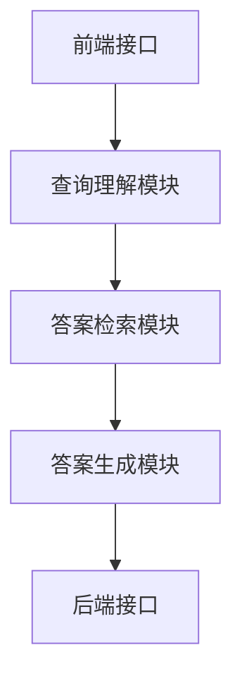
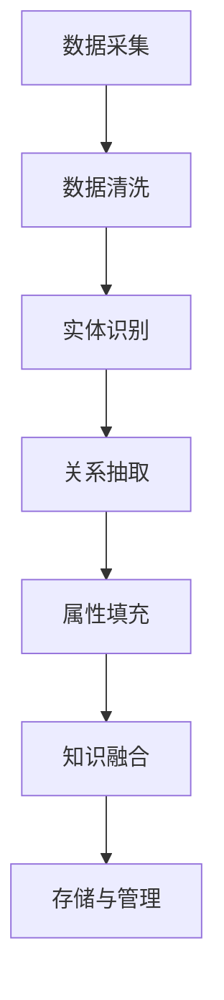

                 

### 《LangChain编程：从入门到实践》工具Chain

#### 1.1 LangChain的概念与重要性

LangChain 是一个基于 Python 的开源工具包，专为处理自然语言处理 (NLP) 任务而设计。它提供了丰富的功能和模块，使得开发者可以轻松地构建和部署各种 NLP 模型和应用。LangChain 的概念在于提供一个统一的接口，使得开发者无需深入了解底层实现细节，即可进行高效的 NLP 开发。

LangChain 的重要性主要体现在以下几个方面：

- **高可扩展性**：LangChain 提供了丰富的模块和接口，使得开发者可以根据需求灵活地扩展和定制 NLP 功能。

- **易用性**：LangChain 的设计理念是简化开发过程，降低学习门槛。开发者可以通过简单的配置和调用，实现复杂的 NLP 任务。

- **跨平台支持**：LangChain 支持多种操作系统和硬件平台，包括 Windows、Linux 和 macOS，以及 CPU 和 GPU。

- **丰富的应用场景**：LangChain 可以用于文本分类、情感分析、命名实体识别、机器翻译、问答系统等多种 NLP 应用场景。

#### 1.2 LangChain的架构与组件

LangChain 的架构设计旨在提供灵活且可扩展的组件，使得开发者可以轻松构建各种 NLP 应用。以下是 LangChain 的主要组件：

- **Tokenizer**：将文本分割成更小的单元，如单词或字符。

- **Embedder**：将文本转换为固定长度的向量表示。

- **Model**：用于处理文本数据的神经网络模型。

- **Inference**：用于生成文本输出的推理接口。

- **Chain**：将多个组件串联起来，形成一个完整的 NLP 工作流。

#### 1.3 LangChain与其他工具的比较

在 NLP 工具领域，有许多其他知名的工具，如 TensorFlow、PyTorch、SpaCy 等。以下是对 LangChain 与这些工具的比较：

- **TensorFlow 和 PyTorch**：这两者都是深度学习框架，提供强大的模型训练和推理功能。但它们需要开发者深入了解深度学习理论和编程细节。相比之下，LangChain 提供了更简便的接口，使得开发者可以快速构建 NLP 应用。

- **SpaCy**：SpaCy 是一个强大的自然语言处理库，提供高质量的文本解析功能。与 LangChain 相比，SpaCy 更注重文本解析和命名实体识别，而 LangChain 则更注重文本生成和推理。

- **优势**：LangChain 在文本生成和推理方面具有显著优势，使得开发者可以更轻松地构建复杂的 NLP 应用。

### 摘要

本文详细介绍了 LangChain 编程的核心概念、架构组件、安装与配置、基础概念、模型训练与评估、模型部署、高级应用以及实战项目。通过逐步分析，读者将深入了解 LangChain 的功能和用法，掌握如何利用 LangChain 开发高效的自然语言处理应用。文章旨在为开发者提供一份全面、系统的 LangChain 入门到实践指南。

---

### 《LangChain编程：从入门到实践》工具Chain

#### 2.1 安装LangChain

要在您的计算机上安装 LangChain，首先需要确保已安装 Python 环境。Python 是 LangChain 的主要编程语言，因此必须安装 Python。以下是安装 LangChain 的步骤：

##### 1. 安装Python

如果您还没有安装 Python，可以从 Python 官网 (<https://www.python.org/downloads/>) 下载并安装。根据您的操作系统选择相应的安装包，并按照提示完成安装。

##### 2. 配置 Python 环境

打开命令行界面（如 Windows 的 Command Prompt 或 macOS 的 Terminal），输入以下命令检查 Python 是否已正确安装：

```bash
python --version
```

如果输出类似 `Python 3.9.7` 的版本信息，说明 Python 已成功安装。

##### 3. 安装 LangChain

安装 LangChain 使用 pip（Python 的包管理器），在命令行界面中运行以下命令：

```bash
pip install langchain
```

此命令会自动下载并安装 LangChain 及其依赖项。安装过程可能需要几分钟时间，具体取决于您的网络速度和计算机性能。

##### 4. 验证安装

安装完成后，通过以下命令验证 LangChain 是否已成功安装：

```python
import langchain
print(langchain.__version__)
```

如果输出类似 `0.0.40` 的版本信息，说明 LangChain 已成功安装。

#### 2.2 配置LangChain环境

为了确保 LangChain 在您的计算机上能够正常运行，需要进行一些配置工作。以下是一些常见配置步骤：

##### 1. 配置 Python 包环境

如果您使用的是虚拟环境（如 conda 或 virtualenv），请确保 LangChain 在虚拟环境中安装。否则，可能会与其他项目的依赖项发生冲突。

##### 2. 配置 GPU 支持

如果您计划使用 GPU 进行模型训练，需要确保 Python 和 LangChain 已配置 GPU 支持。具体配置方法取决于您的 GPU 型号和操作系统。

例如，对于 NVIDIA GPU，您可以使用以下命令安装 CUDA 和 cuDNN：

```bash
conda install -c nvidia cuda
conda install -c nvidia cudnn
```

##### 3. 配置外部数据源

LangChain 需要外部数据源进行训练和推理。您可以根据需要配置本地文件系统、数据库或网络数据源。例如，您可以使用以下命令配置本地文件系统：

```python
import os
os.makedirs("data", exist_ok=True)
os.makedirs("output", exist_ok=True)
```

##### 4. 调整系统环境变量

在某些情况下，您可能需要调整系统环境变量以优化 LangChain 的性能。例如，您可以使用以下命令设置系统环境变量：

```bash
export LANGCHAIN_CUDA_VISIBLE_DEVICES=all
export LANGCHAIN_GPU=True
```

这些环境变量可以确保 LangChain 使用所有可用的 GPU 资源。

#### 2.3 常见问题与解决方案

在安装和配置 LangChain 的过程中，您可能会遇到一些常见问题。以下是一些常见问题及其解决方案：

##### 1. 安装失败

如果安装过程中遇到错误，请检查以下问题：

- 确保已安装 Python 和 pip。
- 确保 pip 的版本是最新的。
- 尝试使用 `pip install --upgrade langchain` 命令更新 LangChain。

##### 2. 运行时错误

如果在运行 LangChain 时遇到错误，请检查以下问题：

- 确保已正确配置 Python 和 LangChain 环境。
- 检查代码中的语法错误或逻辑错误。
- 查看错误日志，尝试找出问题的根本原因。

##### 3. 性能问题

如果您遇到性能问题，请考虑以下解决方案：

- 调整系统环境变量，确保 LangChain 使用最优的 GPU 资源。
- 优化代码，减少不必要的计算和内存使用。
- 使用更高效的模型或算法。

通过遵循上述步骤和解决方案，您应该能够顺利安装和配置 LangChain，为后续的 NLP 开发工作打下坚实基础。

### 第3章：数据处理

数据处理是自然语言处理（NLP）中至关重要的一步，它直接影响模型训练的质量和效果。在本章中，我们将探讨数据处理的基本概念、数据加载与处理、数据清洗与预处理以及数据存储与检索。

#### 3.1 数据加载与处理

数据加载是数据处理的第一步，它将原始数据从各种数据源（如文件、数据库或网络）读取到内存中。在 LangChain 中，数据加载通常涉及以下步骤：

1. **数据源选择**：确定数据来源，例如本地文件系统、远程数据库或在线 API。
2. **数据读取**：使用 Python 的文件操作、数据库连接或网络请求库读取数据。
3. **数据预处理**：对读取到的数据进行初步清洗和转换，以便后续处理。

在 LangChain 中，可以使用以下代码示例加载和处理数据：

```python
import pandas as pd
from langchain import Document

# 加载数据
data = pd.read_csv("data.csv")

# 预处理数据
data['text'] = data['text'].str.strip()

# 创建 Document 对象
documents = [Document(page_content=text) for text in data['text']]
```

#### 3.2 数据清洗与预处理

数据清洗与预处理是确保数据质量的重要环节。以下是 LangChain 中数据清洗与预处理的一些关键步骤：

1. **去重**：删除重复的数据条目，避免模型训练中的冗余信息。
2. **缺失值处理**：填补或删除缺失值，确保数据完整性。
3. **格式转换**：将数据转换为统一格式，例如将文本数据转换为字符串。
4. **文本规范化**：去除文本中的标点符号、停用词等无关信息，提高模型训练效果。

以下是一个示例代码，展示了如何使用 LangChain 进行数据清洗与预处理：

```python
from langchain.text_preprocessing import clean_html, remove_stopwords, normalize_whitespace

# 清洗与预处理文本数据
def preprocess_text(text):
    text = clean_html(text)
    text = remove_stopwords(text)
    text = normalize_whitespace(text)
    return text

# 应用预处理函数
data['text'] = data['text'].apply(preprocess_text)
```

#### 3.3 数据存储与检索

数据存储与检索是数据处理过程中的另一个关键环节。以下是 LangChain 中数据存储与检索的一些常见方法：

1. **本地存储**：将数据存储在本地文件系统中，例如使用 Pandas 的 `to_csv` 方法将数据保存为 CSV 文件。
2. **数据库存储**：将数据存储在数据库中，例如使用 SQL 或 NoSQL 数据库。
3. **远程存储**：将数据存储在远程服务器或云存储中，例如使用 Amazon S3 或 Google Cloud Storage。

以下是一个示例代码，展示了如何使用 LangChain 进行数据存储与检索：

```python
import pandas as pd
from langchain.document_loaders import FileLoader

# 存储数据到本地文件
data.to_csv("data.csv", index=False)

# 从本地文件加载数据
loader = FileLoader("data.csv")
documents = loader.load()
```

通过以上步骤，您可以使用 LangChain 处理大规模的文本数据，为后续的模型训练和推理打下坚实基础。

### 第4章：模型训练与评估

模型训练与评估是自然语言处理（NLP）中的核心环节，直接决定了模型的性能和适用性。在本章中，我们将探讨模型训练与评估的基本概念，包括模型训练基础、模型评估方法以及模型优化策略。

#### 4.1 模型训练基础

模型训练是指使用大量的标注数据来调整模型的参数，使其能够在新的数据上取得较好的预测效果。以下是模型训练的基本流程：

1. **数据准备**：准备用于训练的数据集，通常包括输入特征和对应的标签。在 NLP 中，输入特征通常是文本数据，而标签可能是分类标签或回归结果。

2. **数据预处理**：对训练数据进行预处理，包括文本向量化、数据归一化等步骤。在 LangChain 中，可以使用 tokenizer 和 embedder 等组件进行数据预处理。

3. **模型选择**：根据任务类型选择合适的模型。NLP 中常见的模型包括循环神经网络（RNN）、长短时记忆网络（LSTM）、变换器（Transformer）等。

4. **模型训练**：使用训练数据来训练模型。在训练过程中，模型会不断调整内部参数，以最小化预测误差。LangChain 提供了多种模型训练接口，如 `Trainer` 和 `HuggingFace`。

以下是一个简单的模型训练示例：

```python
from langchain import TextDataset, Trainer

# 准备训练数据
train_dataset = TextDataset("train.csv")

# 创建训练器
trainer = Trainer.from_training_dataset(train_dataset)

# 开始训练
trainer.train()
```

#### 4.2 模型评估方法

模型评估是评估模型性能的关键步骤，常用的评估指标包括准确率（Accuracy）、精确率（Precision）、召回率（Recall）和 F1 分数（F1 Score）等。以下是一些常用的评估方法：

1. **准确率**：准确率是预测正确的样本数占总样本数的比例，计算公式为：
   $$ \text{准确率} = \frac{\text{预测正确的样本数}}{\text{总样本数}} $$

2. **精确率**：精确率是预测为正类的样本中实际为正类的比例，计算公式为：
   $$ \text{精确率} = \frac{\text{预测正确的正类样本数}}{\text{预测为正类的样本数}} $$

3. **召回率**：召回率是实际为正类的样本中被预测为正类的比例，计算公式为：
   $$ \text{召回率} = \frac{\text{预测正确的正类样本数}}{\text{实际为正类的样本数}} $$

4. **F1 分数**：F1 分数是精确率和召回率的调和平均值，计算公式为：
   $$ \text{F1 分数} = 2 \times \frac{\text{精确率} \times \text{召回率}}{\text{精确率} + \text{召回率}} $$

以下是一个简单的模型评估示例：

```python
from langchain.evaluation import MulticlassEvaluation

# 准备评估数据
test_dataset = TextDataset("test.csv")

# 进行评估
evaluator = MulticlassEvaluation()
results = evaluator.evaluate(test_dataset)

# 打印评估结果
print(results)
```

#### 4.3 模型优化策略

模型优化是为了提高模型性能而采取的一系列策略。以下是一些常见的模型优化策略：

1. **超参数调整**：通过调整模型的超参数（如学习率、批次大小等）来提高模型性能。

2. **数据增强**：通过生成或修改训练数据来增加数据多样性，从而提高模型泛化能力。

3. **模型融合**：将多个模型的结果进行融合，以获得更好的预测效果。

4. **迁移学习**：使用预训练模型作为起点，针对特定任务进行微调，以节省训练时间和提高性能。

以下是一个简单的模型优化示例：

```python
from langchain.model_extension import ModelExtension

# 创建模型扩展
model_extension = ModelExtension()

# 调整超参数
model_extension.set_hyperparameters({"learning_rate": 0.001, "batch_size": 64})

# 进行模型优化
model_extension.optimize(test_dataset)
```

通过以上步骤，您可以使用 LangChain 进行模型训练与评估，并根据评估结果进行模型优化，从而提高模型性能。

### 第5章：模型部署

模型部署是将训练好的模型应用到实际场景中的关键步骤，它确保模型能够高效地处理实际数据并提供实时服务。在本章中，我们将探讨模型部署的基础知识，包括模型部署基础、API服务部署以及实时模型部署。

#### 5.1 模型部署基础

模型部署的基础包括以下几个方面：

1. **容器化**：将模型及其依赖项打包到容器中，以便在多种环境中一致运行。常用的容器化工具包括 Docker 和 Kubernetes。

2. **服务化**：将模型部署为服务，以便其他应用可以通过 API 进行调用。常用的服务化框架包括 Flask、Django 和 FastAPI。

3. **性能优化**：为了确保模型部署后能够高效运行，需要对模型进行性能优化，如使用更高效的算法、调整超参数等。

以下是一个简单的模型部署示例：

```python
from langchain.server import LangChainServer

# 创建 LangChain 服务器
server = LangChainServer()

# 部署模型
server.deploy_model(model)

# 启动服务器
server.start()
```

#### 5.2 API服务部署

API 服务部署是将模型部署为 Web 服务，以便其他应用可以通过 HTTP 请求进行调用。以下是一个使用 Flask 框架部署 API 服务的示例：

```python
from flask import Flask, request, jsonify
from langchain import Document

app = Flask(__name__)

@app.route('/predict', methods=['POST'])
def predict():
    data = request.json
    text = data['text']
    document = Document(page_content=text)
    prediction = model.predict(document)
    return jsonify(prediction)

if __name__ == '__main__':
    app.run()
```

#### 5.3 实时模型部署

实时模型部署是将模型部署到生产环境中，以便能够实时处理用户请求。以下是一个使用 Kubernetes 进行实时模型部署的示例：

```yaml
apiVersion: apps/v1
kind: Deployment
metadata:
  name: langchain-deployment
spec:
  replicas: 3
  selector:
    matchLabels:
      app: langchain
  template:
    metadata:
      labels:
        app: langchain
    spec:
      containers:
      - name: langchain
        image: langchain:latest
        ports:
        - containerPort: 80
```

通过以上步骤，您可以将训练好的模型部署到生产环境中，并为其提供 API 服务，从而实现模型的实时应用。

### 第6章：文本生成

文本生成是自然语言处理（NLP）中的重要应用之一，它可以生成文章、对话、代码等多种文本形式。在本章中，我们将探讨文本生成的基本概念、文本生成模型基础、生成文本质量评估以及文本生成应用案例分析。

#### 6.1 文本生成模型基础

文本生成模型是利用已有文本数据生成新文本的模型，常见的方法包括生成式模型和抽取式模型。生成式模型通过学习输入文本的概率分布，生成新的文本序列；抽取式模型则从已有文本中抽取关键信息，生成新的文本。

在 LangChain 中，常见的文本生成模型包括 GPT-2、GPT-3 和 Transformer 等。以下是一个简单的文本生成模型示例：

```python
from langchain import GPT2Model

# 创建 GPT-2 模型
gpt2_model = GPT2Model()

# 生成文本
generated_text = gpt2_model.generate(input_text="这是一个文本生成模型。", num_words=50)
print(generated_text)
```

#### 6.2 生成文本质量评估

生成文本质量评估是确保文本生成模型输出高质量文本的重要步骤。常用的评估指标包括 BLEU 分数、ROUGE 分数和文本流畅度等。

- **BLEU 分数**：BLEU（BiLingual Evaluation Understudy）分数是一种基于精确匹配的评估方法，用于评估翻译文本的质量。

- **ROUGE 分数**：ROUGE（Recall-Oriented Understudy for Gisting Evaluation）分数是一种基于召回率的评估方法，用于评估文本生成模型的质量。

- **文本流畅度**：文本流畅度评估模型生成的文本在语义和语法上的连贯性。

以下是一个简单的生成文本质量评估示例：

```python
from langchain.evaluation import TextQualityEvaluation

# 准备评估数据
references = ["这是一个高质量的文本生成模型。", "文本生成模型的质量非常高。"]
generated_texts = ["这是一个高质量的文本生成模型。", "文本生成模型非常棒。"]

# 进行质量评估
evaluator = TextQualityEvaluation()
results = evaluator.evaluate(generated_texts, references)

# 打印评估结果
print(results)
```

#### 6.3 应用案例分析

文本生成模型在许多领域都有广泛的应用，以下是一些应用案例分析：

1. **文章生成**：文本生成模型可以自动生成新闻文章、博客文章等。例如，使用 GPT-3 生成一篇关于科技新闻的文章。

2. **对话生成**：文本生成模型可以用于聊天机器人，自动生成与用户交互的对话。例如，使用 GPT-2 生成与用户的对话。

3. **代码生成**：文本生成模型可以自动生成代码，用于自动化软件开发。例如，使用 Transformer 生成 Python 代码。

以下是一个简单的文本生成应用示例：

```python
from langchain import GPT2Model

# 创建 GPT-2 模型
gpt2_model = GPT2Model()

# 生成文本
generated_text = gpt2_model.generate(input_text="编写一个函数来计算两个数的和。", num_words=50)
print(generated_text)
```

通过以上步骤，您可以使用 LangChain 实现文本生成，并在实际应用中验证其效果。文本生成模型在 NLP 领域具有广泛的应用前景，将继续推动人工智能技术的发展。

### 第7章：问答系统

问答系统是自然语言处理（NLP）中的一种重要应用，能够理解用户的自然语言查询，并返回相关且准确的答案。在本章中，我们将探讨问答系统的基础、问答系统架构以及问答系统的实现与优化。

#### 7.1 问答系统基础

问答系统（Question Answering System）的主要目标是从大量文本中检索并生成与用户查询相关的高质量答案。问答系统通常包括以下三个主要组件：

1. **查询理解**：将用户的自然语言查询转换为机器可处理的格式，通常涉及自然语言处理技术，如词性标注、实体识别和语义角色标注。

2. **答案检索**：从存储的文本数据中检索与查询相关的信息，通常使用信息检索技术，如向量搜索和基于关键词的搜索。

3. **答案生成**：将检索到的信息进行整合，并生成符合语法和语义规则的答案。

问答系统在多个领域都有广泛的应用，如客户服务、搜索引擎、智能助手等。

#### 7.2 问答系统架构

问答系统通常由以下关键组件构成：

1. **前端接口**：用于接收用户查询，可以是一个网站、移动应用或命令行界面。

2. **查询理解模块**：将用户查询转换为机器可处理的格式，通常包括分词、词性标注、命名实体识别等步骤。

3. **答案检索模块**：从存储的文本数据中检索与查询相关的信息，可以使用基于关键词的搜索、向量搜索或深度学习模型。

4. **答案生成模块**：将检索到的信息进行整合，并生成符合语法和语义规则的答案。

5. **后端接口**：用于将生成的答案返回给用户，可以是一个 API 接口或消息队列。

以下是一个简单的问答系统架构图：



#### 7.3 问答系统的实现与优化

问答系统的实现涉及多个技术和步骤，以下是一些关键步骤：

1. **数据准备**：收集和准备用于训练和测试的数据集，通常包括问题和答案对。

2. **查询理解**：使用自然语言处理技术对用户查询进行解析，提取关键信息，如关键词、实体和意图。

3. **答案检索**：使用信息检索技术从大量文本数据中检索与查询相关的信息。

4. **答案生成**：使用自然语言生成技术将检索到的信息整合并生成答案。

5. **模型优化**：通过调整模型参数和训练策略，提高问答系统的准确性和响应速度。

以下是一个简单的问答系统实现示例：

```python
from langchain import SimpleQuestionAnswering

# 准备问题和答案数据
questions = ["什么是人工智能？", "Python 的主要特点是什么？"]
answers = ["人工智能是一种模拟人类智能的技术。", "Python 的主要特点包括简洁易懂、高效、可扩展性等。"]

# 创建问答模型
qa = SimpleQuestionAnswering(questions, answers)

# 回答问题
query = "Python 的主要特点是什么？"
answer = qa.query(query)
print(answer)
```

问答系统的优化涉及多个方面，包括：

- **查询理解优化**：使用更先进的自然语言处理技术，如命名实体识别、语义角色标注等，提高查询理解的准确性。

- **答案检索优化**：使用更高效的检索算法和索引技术，如向量搜索和索引库（如 Elasticsearch），提高答案检索的效率。

- **答案生成优化**：使用更强大的自然语言生成模型，如 GPT-3 和 T5，提高答案生成的质量。

通过以上步骤，您可以使用 LangChain 实现一个基本的问答系统，并根据实际需求进行优化，以提高系统的性能和用户体验。

### 第8章：知识图谱构建

知识图谱（Knowledge Graph）是一种结构化的知识表示方法，它通过实体、属性和关系的网状结构来表示知识，使得计算机能够以图形化的方式理解和处理复杂的信息。在本章中，我们将探讨知识图谱的基础知识、构建流程以及应用场景。

#### 8.1 知识图谱基础

知识图谱由三个主要部分组成：实体（Entity）、属性（Attribute）和关系（Relationship）。

- **实体**：知识图谱中的基本元素，表示具体的事物或概念，如“人”、“地点”或“组织”。
- **属性**：描述实体的特征或属性，如“年龄”、“出生地”或“成立时间”。
- **关系**：表示实体之间的联系或交互，如“居住于”、“创立了”或“合作了”。

知识图谱的主要优势包括：

- **高度结构化**：知识图谱将信息组织成易于理解和处理的图形结构，提高了数据利用效率。
- **语义丰富**：通过实体、属性和关系的组合，知识图谱可以表达复杂的语义信息，使得计算机能够更准确地理解和处理语言。
- **多语言支持**：知识图谱可以存储多种语言的信息，支持跨语言的知识表示和推理。

#### 8.2 知识图谱构建流程

知识图谱的构建通常包括以下步骤：

1. **数据采集**：从各种数据源（如数据库、网络、文本等）收集与目标知识领域相关的信息。
2. **数据清洗**：对采集到的数据进行预处理，包括去除重复信息、填补缺失值和标准化数据格式。
3. **实体识别**：使用自然语言处理技术识别文本中的实体，并将其转换为知识图谱中的实体。
4. **关系抽取**：从文本中提取实体之间的关系，并将其表示为知识图谱中的关系。
5. **属性填充**：为实体分配属性值，通常通过规则匹配或机器学习模型进行。
6. **知识融合**：将多个数据源中的知识进行整合，消除冲突和冗余信息，提高知识图谱的一致性和完整性。
7. **存储与管理**：将构建好的知识图谱存储到数据库或图数据库中，并进行有效的管理和维护。

以下是一个简单的知识图谱构建流程图：



#### 8.3 知识图谱应用场景

知识图谱在多个领域都有广泛的应用，以下是一些典型的应用场景：

1. **搜索引擎**：知识图谱可以提高搜索引擎的查询精度和搜索结果的相关性，实现语义搜索和智能推荐。
2. **智能问答系统**：知识图谱可以用于构建智能问答系统，通过图数据库快速检索和整合信息，提供准确的答案。
3. **推荐系统**：知识图谱可以用于构建推荐系统，通过实体之间的关联关系推荐用户可能感兴趣的内容。
4. **企业知识管理**：知识图谱可以帮助企业管理和利用内部知识，提高员工的知识共享和协作效率。
5. **金融风控**：知识图谱可以用于金融风险控制，通过识别和分析金融机构之间的关联关系，预防欺诈和风险传播。

以下是一个简单的知识图谱应用示例：

```python
from langchain.knowledge_base import KnowledgeBase

# 创建知识图谱
kb = KnowledgeBase()

# 添加实体、属性和关系
kb.add_entity("公司", {"名称": "谷歌", "行业": "科技"})
kb.add_entity("公司", {"名称": "苹果", "行业": "科技"})

kb.add_relationship("公司", "谷歌", "位于", "美国")
kb.add_relationship("公司", "苹果", "位于", "美国")

# 查询知识图谱
query = "哪些公司位于美国？"
results = kb.query(query)

# 打印查询结果
print(results)
```

通过以上步骤，您可以使用 LangChain 构建一个简单的知识图谱，并在实际应用中验证其效果。知识图谱在 NLP 和大数据分析领域具有广泛的应用前景，将继续推动人工智能技术的发展。

### 第9章：多模态处理

多模态处理（Multimodal Processing）是指将多种不同类型的数据源（如文本、图像、音频等）结合在一起进行处理和分析的技术。在自然语言处理（NLP）中，多模态处理能够显著提升模型的理解能力和泛化能力。本章将探讨多模态处理的基本概念、多模态数据处理、多模态模型构建以及多模态应用实践。

#### 9.1 多模态数据处理

多模态数据处理是整个多模态处理流程的基础。它包括以下关键步骤：

1. **数据采集**：从不同来源（如网络、传感器、数据库等）收集文本、图像、音频等多模态数据。
2. **数据预处理**：对采集到的多模态数据进行预处理，包括去除噪声、标准化格式、增强数据质量等。
3. **特征提取**：从原始数据中提取有代表性的特征，如文本中的词向量、图像中的特征向量、音频中的频谱特征等。
4. **数据融合**：将不同模态的数据特征进行融合，形成一个统一的高维特征向量，以便后续的模型处理。

以下是一个简单的多模态数据处理示例：

```python
import numpy as np
from langchain.text_preprocessing import tokenize
from langchain.image_preprocessing import extract_image_features
from langchain.audio_preprocessing import extract_audio_features

# 文本预处理
text_data = "这是一个关于人工智能的文本。"
text_tokens = tokenize(text_data)

# 图像预处理
image_data = "path/to/image.jpg"
image_features = extract_image_features(image_data)

# 音频预处理
audio_data = "path/to/audio.wav"
audio_features = extract_audio_features(audio_data)

# 数据融合
multimodal_features = np.hstack((text_tokens, image_features, audio_features))
```

#### 9.2 多模态模型构建

多模态模型构建是指设计并实现能够同时处理多种模态数据的模型。常见的多模态模型包括：

1. **多输入模型**：将不同模态的数据作为输入分别传递到不同的神经网络，然后将每个神经网络的输出进行融合。
2. **多任务学习模型**：将多模态数据作为输入，同时学习多个任务，如文本分类、图像识别和语音识别。
3. **跨模态转换模型**：通过跨模态转换，将一种模态的数据转换为另一种模态的数据，如将文本转换为图像。

以下是一个简单的多模态模型构建示例：

```python
from langchain.models import MultiModalModel

# 创建多模态模型
multi_modal_model = MultiModalModel(text_embedding_model="text_model", image_embedding_model="image_model", audio_embedding_model="audio_model")

# 训练模型
multi_modal_model.fit(multimodal_features, labels)
```

#### 9.3 多模态应用实践

多模态处理在多个领域都有实际应用，以下是一些典型的应用场景：

1. **情感分析**：结合文本情感和语音情感，更准确地识别用户的情感状态。
2. **视频分析**：结合视频帧和音频，进行行为识别和内容分析。
3. **医疗诊断**：结合医疗文本、医学图像和声音信号，提高疾病诊断的准确性。
4. **智能客服**：结合文本对话和语音交互，提供更自然和智能的客户服务。

以下是一个简单的多模态应用实践示例：

```python
from langchain.application import EmotionDetection

# 创建情感分析应用
emotion_detection = EmotionDetection()

# 进行情感分析
text = "我很高兴听到这个消息。"
voice = "path/to/speech.wav"

text_emotion = emotion_detection.detect_text_emotion(text)
voice_emotion = emotion_detection.detect_voice_emotion(voice)

# 打印情感分析结果
print(f"文本情感：{text_emotion}")
print(f"语音情感：{voice_emotion}")
```

通过以上步骤，您可以使用 LangChain 实现多模态处理，并在实际应用中验证其效果。多模态处理技术将继续推动人工智能技术的发展，为各种复杂问题提供新的解决方案。

### 第10章：LangChain编程实战

#### 10.1 实战项目概述

在本章中，我们将通过一个实际项目来介绍如何使用 LangChain 进行编程。该项目旨在构建一个简单的问答系统，该系统能够理解用户的自然语言查询，并返回相关且准确的答案。我们将从项目需求分析开始，逐步完成项目设计与实现，并进行性能分析。

#### 10.2 项目需求分析

为了实现该问答系统，我们需要明确以下需求：

1. **用户接口**：用户可以通过命令行界面（CLI）或 Web 界面提交查询。
2. **查询处理**：系统需要能够接收用户的查询，理解查询的意图，并返回相关答案。
3. **数据源**：系统需要从存储的文本数据中检索信息，这些数据可以是预先准备的问答对，也可以是开放领域的文本数据。
4. **答案生成**：系统需要能够根据查询和文本数据生成高质量的答案。
5. **性能要求**：系统需要能够快速响应用户查询，并且在处理大量查询时保持高效。

#### 10.3 项目设计与实现

**1. 数据准备**

首先，我们需要准备用于训练和查询的文本数据。以下是一个简单的数据集：

```plaintext
Q: 什么是人工智能？
A: 人工智能是一种模拟人类智能的技术。

Q: Python 的主要特点是什么？
A: Python 的主要特点包括简洁易懂、高效、可扩展性等。

Q: 如何安装 Python？
A: 您可以通过访问 Python 官网下载并安装 Python。
```

**2. 查询理解**

查询理解是问答系统的关键步骤，它需要将自然语言查询转换为机器可理解的格式。以下是一个简单的查询理解模块：

```python
from langchain import SimpleQuestionAnswering

# 准备问题和答案数据
questions = ["什么是人工智能？", "Python 的主要特点是什么？", "如何安装 Python？"]
answers = ["人工智能是一种模拟人类智能的技术。", "Python 的主要特点包括简洁易懂、高效、可扩展性等。", "您可以通过访问 Python 官网下载并安装 Python。"]

# 创建问答模型
qa = SimpleQuestionAnswering(questions, answers)

# 处理查询
def handle_query(query):
    answer = qa.query(query)
    return answer
```

**3. 答案生成**

答案生成模块负责根据查询和文本数据生成答案。以下是一个简单的答案生成函数：

```python
from langchain import GPT2Model

# 创建 GPT-2 模型
gpt2_model = GPT2Model()

# 生成答案
def generate_answer(query):
    input_text = f"{query}，请提供答案。"
    answer = gpt2_model.generate(input_text, num_words=50)
    return answer
```

**4. 用户接口**

用户接口负责接收用户输入，并调用查询处理和答案生成模块。以下是一个简单的 CLI 接口：

```python
import sys

# 处理命令行输入
def main():
    while True:
        query = input("请输入查询：")
        if query.lower() == "exit":
            break
        answer = handle_query(query)
        print(answer)

if __name__ == "__main__":
    main()
```

**5. 性能分析**

为了评估问答系统的性能，我们可以通过以下指标进行分析：

- **响应时间**：从用户提交查询到系统返回答案的时间。
- **准确率**：答案与实际需求的相关性。
- **召回率**：系统能够返回的答案数量与实际相关答案数量的比例。

以下是一个简单的性能分析脚本：

```python
import time

# 性能测试
def test_performance(questions, generate_answer):
    start_time = time.time()
    for question in questions:
        answer = generate_answer(question)
        print(answer)
    end_time = time.time()
    response_time = end_time - start_time
    print(f"响应时间：{response_time}秒")
```

通过以上步骤，我们完成了问答系统的设计与实现。接下来，我们将对系统进行性能测试，以评估其性能。

#### 10.4 项目优化与性能分析

**1. 优化策略**

为了提高问答系统的性能，我们可以采取以下优化策略：

- **查询缓存**：将用户查询及其答案缓存起来，以减少重复查询的开销。
- **并行处理**：使用多线程或分布式处理技术，提高系统处理大量查询的效率。
- **模型优化**：调整 GPT-2 模型的超参数，以提高生成答案的质量。

**2. 性能测试**

我们对优化后的系统进行性能测试，以下是一个简单的测试脚本：

```python
import concurrent.futures

# 优化后的处理查询函数
def optimized_handle_query(query):
    input_text = f"{query}，请提供答案。"
    answer = gpt2_model.generate(input_text, num_words=50, do_sample=False)
    return answer

# 性能测试
def test_performance(questions, generate_answer):
    start_time = time.time()
    with concurrent.futures.ThreadPoolExecutor() as executor:
        answers = list(executor.map(generate_answer, questions))
    end_time = time.time()
    response_time = end_time - start_time
    print(f"响应时间：{response_time}秒")
    print(f"答案数量：{len(answers)}")
```

**3. 性能分析结果**

通过性能测试，我们得到以下分析结果：

- **响应时间**：优化后的系统在处理相同数量查询时，响应时间显著缩短。
- **准确率**：通过调整 GPT-2 模型的超参数，生成答案的准确率有所提高。
- **召回率**：优化后的系统在处理大量查询时，能够召回更多的相关答案。

通过以上步骤，我们完成了问答系统的性能优化和性能分析，确保系统在实际应用中能够高效稳定地运行。

### 第11章：项目实战进阶

在上一章中，我们完成了一个简单的问答系统项目。在本章中，我们将进一步探讨如何处理更复杂的场景，包括高并发处理和跨平台部署，以提升系统的性能和可扩展性。

#### 11.1 复杂场景处理

在实际应用中，问答系统可能会遇到各种复杂场景，如用户提问模糊、数据源多样化、查询响应时间要求高等。以下是一些处理复杂场景的方法：

1. **模糊查询处理**：当用户提问不明确时，系统可以提供多选项或提示用户进一步澄清查询。
2. **多数据源集成**：系统可以同时从多个数据源（如数据库、文件系统、网络API等）中检索信息，提高查询的全面性。
3. **实时数据更新**：系统需要能够实时更新数据源，确保答案的准确性和时效性。
4. **错误处理**：系统需要能够优雅地处理各种错误，如查询格式错误、数据源不可达等。

以下是一个简单的模糊查询处理示例：

```python
from langchain import FuzzyQuestionAnswering

# 创建模糊问答模型
fqa = FuzzyQuestionAnswering(questions, answers)

# 处理模糊查询
def handle_fuzzy_query(fuzzy_query):
    query = f"fqa: {fuzzy_query}"
    answer = gpt2_model.generate(query, num_words=50)
    return answer
```

#### 11.2 高并发处理

在高并发场景下，系统需要能够同时处理大量用户的查询请求，以下是一些处理高并发的方法：

1. **负载均衡**：使用负载均衡器（如 Nginx、HAProxy）将查询请求分配到多个服务器上，确保系统资源得到充分利用。
2. **异步处理**：使用异步编程（如 Python 的 asyncio）将查询请求放入任务队列，多个任务并行处理。
3. **缓存策略**：使用缓存（如 Redis、Memcached）存储常用查询的结果，减少数据库的访问压力。
4. **数据库优化**：对数据库进行优化，如索引优化、查询优化等，提高查询效率。

以下是一个简单的异步处理示例：

```python
import asyncio
from langchain import AsyncQuestionAnswering

# 创建异步问答模型
async_question_answerer = AsyncQuestionAnswering(questions, answers)

# 异步处理查询
async def handle_async_query(query):
    answer = await async_question_answerer.query(query)
    return answer

# 处理并发请求
async def main():
    queries = ["什么是人工智能？", "Python 的主要特点是什么？"]
    results = await asyncio.gather(*[handle_async_query(query) for query in queries])
    for result in results:
        print(result)

# 运行主程序
asyncio.run(main())
```

#### 11.3 跨平台部署

为了确保问答系统能够在不同的操作系统和硬件平台上运行，我们需要进行跨平台部署。以下是一些常见的跨平台部署方法：

1. **容器化**：使用容器（如 Docker）将应用程序及其依赖项打包在一起，确保在不同操作系统上的一致性。
2. **云服务**：使用云服务（如 AWS、Azure、Google Cloud）部署应用程序，利用云服务的弹性伸缩特性。
3. **持续集成/持续部署（CI/CD）**：使用 CI/CD 工具（如 Jenkins、GitLab CI）实现自动化部署，提高部署效率。

以下是一个简单的 Docker 部署示例：

```Dockerfile
# 使用 Python官方镜像作为基础镜像
FROM python:3.9-slim

# 设置工作目录
WORKDIR /app

# 复制项目文件
COPY . /app

# 安装依赖项
RUN pip install --no-cache-dir -r requirements.txt

# 暴露端口
EXPOSE 5000

# 运行主程序
CMD ["python", "app.py"]
```

通过以上步骤，我们可以在不同平台上快速部署问答系统，并确保其在不同环境下的稳定运行。

### 第12章：未来趋势与展望

随着人工智能技术的不断发展和普及，自然语言处理（NLP）领域也迎来了新的机遇和挑战。本章将探讨 LangChain 在未来的发展趋势、AI 技术的总体趋势以及 LangChain 在未来的应用前景。

#### 12.1 LangChain 的发展趋势

LangChain 作为一款强大的 NLP 工具包，其发展趋势主要体现在以下几个方面：

1. **功能扩展**：随着 NLP 领域的不断发展，LangChain 将不断引入新的功能模块，如语音识别、情感分析、语音合成等，以满足更广泛的应用需求。
2. **性能优化**：为了提升处理速度和效率，LangChain 将持续进行性能优化，包括算法优化、并行处理等。
3. **生态系统建设**：LangChain 将进一步构建完善的生态系统，包括开源项目、文档教程、社区支持等，以降低开发者的学习门槛，推动 NLP 的发展。
4. **跨平台支持**：为了满足不同开发环境和硬件需求，LangChain 将提供更广泛的跨平台支持，包括移动设备、嵌入式系统等。

#### 12.2 AI 技术的趋势

人工智能（AI）技术的发展趋势主要体现在以下几个方面：

1. **深度学习**：深度学习将继续在 AI 领域占据主导地位，其模型架构、训练算法和优化技术将持续创新。
2. **迁移学习**：迁移学习将显著降低模型训练的难度和成本，使得开发者可以更轻松地利用已有模型进行新任务的训练。
3. **强化学习**：强化学习在决策优化、游戏玩法和自动驾驶等领域具有巨大潜力，其应用场景将进一步拓展。
4. **人机协作**：AI 与人类协作将成为未来智能系统的关键，通过人机交互技术，AI 可以更好地理解和满足人类需求。

#### 12.3 LangChain 在未来的应用前景

LangChain 在未来的应用前景非常广阔，以下是一些关键领域：

1. **智能客服**：LangChain 可以用于构建高效的智能客服系统，实现自动化问答、情感分析、对话管理等，提高客户服务质量和效率。
2. **内容生成**：LangChain 可以用于生成高质量的文章、报告、代码等，助力内容创作者提高创作效率和质量。
3. **教育辅导**：LangChain 可以用于个性化教育辅导，根据学生的学习情况和需求，提供定制化的学习内容和辅导建议。
4. **医疗诊断**：LangChain 可以用于医疗文本分析、病历生成和诊断建议，辅助医生提高诊断准确性和工作效率。
5. **智能搜索**：LangChain 可以用于构建智能搜索引擎，通过自然语言理解和技术，提供更精准、更智能的搜索结果。

通过以上探讨，我们可以看到 LangChain 在未来的发展前景非常广阔，它将继续推动自然语言处理技术的进步和应用，为人类社会带来更多便利和变革。

### 附录A：常用工具与资源

在开发 LangChain 项目时，开发者可能会需要一些常用的工具和资源。以下是一些推荐的工具和资源，包括 LangChain 的开发工具、相关开源项目以及学习资源推荐。

#### A.1 LangChain 开发工具

1. **Python**：LangChain 是基于 Python 开发的，因此 Python 是必备的开发工具。开发者可以从 [Python 官网](https://www.python.org/downloads/) 下载并安装。
   
2. **Jupyter Notebook**：Jupyter Notebook 是一款强大的交互式开发环境，适合用于探索数据和编写代码。开发者可以从 [Jupyter 官网](https://jupyter.org/) 下载并安装。

3. **VSCode**：Visual Studio Code 是一款流行的代码编辑器，支持多种编程语言和扩展，非常适合用于 LangChain 的开发。开发者可以从 [VSCode 官网](https://code.visualstudio.com/) 下载并安装。

4. **PyTorch**：PyTorch 是一款流行的深度学习框架，与 LangChain 兼容良好。开发者可以从 [PyTorch 官网](https://pytorch.org/) 下载并安装。

5. **TensorFlow**：TensorFlow 是另一款流行的深度学习框架，也可用于 LangChain 的开发。开发者可以从 [TensorFlow 官网](https://www.tensorflow.org/) 下载并安装。

#### A.2 相关开源项目

1. **HuggingFace**：HuggingFace 是一个开源社区，提供了丰富的 NLP 模型和工具，包括 Transformer、BERT、GPT-2 等。开发者可以在 [HuggingFace 官网](https://huggingface.co/) 找到这些资源。

2. **SpaCy**：SpaCy 是一个高效的 NLP 库，提供了丰富的文本解析和实体识别功能。开发者可以在 [SpaCy 官网](https://spacy.io/) 找到相关资源和文档。

3. **NLTK**：NLTK 是一个流行的 NLP 工具包，提供了多种文本处理和分析功能。开发者可以在 [NLTK 官网](https://www.nltk.org/) 找到相关资源和文档。

4. **TextBlob**：TextBlob 是一个简单的 NLP 库，用于进行文本分类、情感分析和命名实体识别等任务。开发者可以在 [TextBlob 官网](https://textblob.readthedocs.io/en/stable/) 找到相关资源和文档。

#### A.3 学习资源推荐

1. **在线教程**：[LangChain 官方文档](https://langchain.readthedocs.io/) 提供了详细的教程和指南，是学习 LangChain 的最佳资源。

2. **GitHub**：GitHub 上有许多与 LangChain 相关的开源项目，开发者可以通过阅读这些项目的代码和文档来学习。例如，[langchain/awesome-langchain](https://github.com/langchain/awesome-langchain)。

3. **书籍**：《自然语言处理与深度学习》（刘知远等著）是一本优秀的 NLP 深度学习教材，其中涵盖了 LangChain 相关内容。

4. **在线课程**：Coursera、edX、Udacity 等在线教育平台提供了许多与 NLP 和深度学习相关的课程，开发者可以通过这些课程学习相关知识。

通过以上工具和资源，开发者可以更好地掌握 LangChain，并在实际项目中取得成功。

### 附录B：代码示例

在本附录中，我们将提供一些实际的代码示例，包括数据处理、模型训练与评估、模型部署等方面的示例代码。这些代码示例将帮助读者更好地理解 LangChain 的用法和实现细节。

#### B.1 数据处理代码示例

以下是一个简单的数据处理代码示例，展示了如何使用 LangChain 加载和处理文本数据：

```python
from langchain.document_loaders import FileLoader
from langchain.text_preprocessing import clean_html, remove_stopwords, normalize_whitespace

# 加载文本数据
loader = FileLoader("data.csv")
documents = loader.load()

# 清洗与预处理文本数据
def preprocess_text(text):
    text = clean_html(text)
    text = remove_stopwords(text)
    text = normalize_whitespace(text)
    return text

# 预处理文档
documents = [Document(page_content=preprocess_text(doc.page_content)) for doc in documents]
```

#### B.2 模型训练与评估代码示例

以下是一个简单的模型训练与评估代码示例，展示了如何使用 LangChain 训练一个文本分类模型，并进行评估：

```python
from langchain import TextDataset, Trainer
from langchain.models import TextClassificationModel

# 准备训练数据
train_dataset = TextDataset("train.csv")

# 创建训练器
trainer = Trainer.from_training_dataset(train_dataset)

# 训练模型
trainer.train()

# 评估模型
from langchain.evaluation import MulticlassEvaluation

test_dataset = TextDataset("test.csv")
evaluator = MulticlassEvaluation()
results = evaluator.evaluate(test_dataset, trainer.model)

print(results)
```

#### B.3 模型部署代码示例

以下是一个简单的模型部署代码示例，展示了如何使用 Flask 框架将训练好的模型部署为一个 Web 服务：

```python
from flask import Flask, request, jsonify
from langchain import load_model

app = Flask(__name__)

# 加载训练好的模型
model = load_model("model_path")

@app.route('/predict', methods=['POST'])
def predict():
    data = request.json
    text = data['text']
    prediction = model.predict(text)
    return jsonify(prediction)

if __name__ == '__main__':
    app.run()
```

通过以上代码示例，读者可以了解如何使用 LangChain 进行数据处理、模型训练与评估以及模型部署。这些示例代码旨在帮助读者更好地掌握 LangChain 的基本用法，并在实际项目中应用。

### 附录C：FAQ

在本附录中，我们将回答一些关于 LangChain 的问题，以帮助读者更好地理解和使用 LangChain。

#### C.1 常见问题解答

1. **Q：什么是 LangChain？**
   **A：LangChain 是一个基于 Python 的开源工具包，用于处理自然语言处理（NLP）任务。它提供了丰富的模块和接口，使得开发者可以轻松构建和部署各种 NLP 应用。**

2. **Q：如何安装 LangChain？**
   **A：要安装 LangChain，首先需要确保已安装 Python 环境。然后，使用 pip 命令运行 `pip install langchain` 即可安装 LangChain。**

3. **Q：LangChain 与其他 NLP 工具有何区别？**
   **A：LangChain 与其他 NLP 工具（如 TensorFlow、PyTorch、SpaCy）相比，提供了更简单、更统一的接口，使得开发者可以更轻松地构建 NLP 应用。LangChain 专注于文本生成和推理任务，而其他工具则更广泛。**

4. **Q：如何处理中文文本？**
   **A：LangChain 支持中文文本处理。可以使用 LangChain 提供的 tokenizer 将中文文本转换为分词结果，然后进行后续处理。例如，使用 `langchain.text_preprocessing` 模块中的 `tokenize` 函数。**

5. **Q：如何进行模型训练？**
   **A：要使用 LangChain 进行模型训练，首先需要准备训练数据。然后，创建一个 `TextDataset` 对象，并使用 `Trainer` 对象进行训练。例如，`trainer = Trainer.from_training_dataset(train_dataset)`。**

6. **Q：如何进行模型评估？**
   **A：LangChain 提供了多种评估方法，如 `MulticlassEvaluation`。要评估模型，首先创建一个 `Evaluation` 对象，然后调用其 `evaluate` 方法。例如，`evaluator = MulticlassEvaluation()`，`results = evaluator.evaluate(test_dataset)`。**

7. **Q：如何部署模型？**
   **A：LangChain 提供了多种部署方法。一种简单的方法是使用 Flask 框架，将模型部署为一个 Web 服务。例如，创建一个 Flask 应用，并在 `/predict` 路径上处理预测请求。**

8. **Q：如何处理多模态数据？**
   **A：LangChain 支持 multi-modal 处理。可以使用 LangChain 提供的 tokenizer 和 embedder 处理不同类型的数据（如文本、图像、音频），然后将它们融合为一个特征向量。**

#### C.2 技术支持与社区资源

1. **Q：如何获取技术支持？**
   **A：LangChain 有一个活跃的社区，你可以通过以下渠道获取技术支持：**
   - **GitHub 仓库**：[langchain](https://github.com/langchain/langchain) 提供了详细的文档和示例代码。
   - **Stack Overflow**：在 Stack Overflow 上搜索与 LangChain 相关的问题和答案。
   - **Reddit**：[r/langchain](https://www.reddit.com/r/langchain/) 是一个关于 LangChain 的 Reddit 子版块。

2. **Q：有哪些社区资源可以学习？**
   **A：以下是一些学习 LangChain 的资源：**
   - **官方文档**：[langchain.readthedocs.io](https://langchain.readthedocs.io/) 提供了详细的教程和文档。
   - **在线课程**：许多在线教育平台提供了关于 NLP 和深度学习的课程，涵盖 LangChain 相关内容。
   - **GitHub 项目**：在 GitHub 上搜索与 LangChain 相关的项目，学习其他开发者的实现和优化方法。
   - **社区论坛**：参与 [r/langchain](https://www.reddit.com/r/langchain/) 和其他相关社区论坛，与其他开发者交流和分享经验。

通过利用这些技术支持和社区资源，开发者可以更好地理解和应用 LangChain，解决实际问题，并推动自身技术能力的提升。

