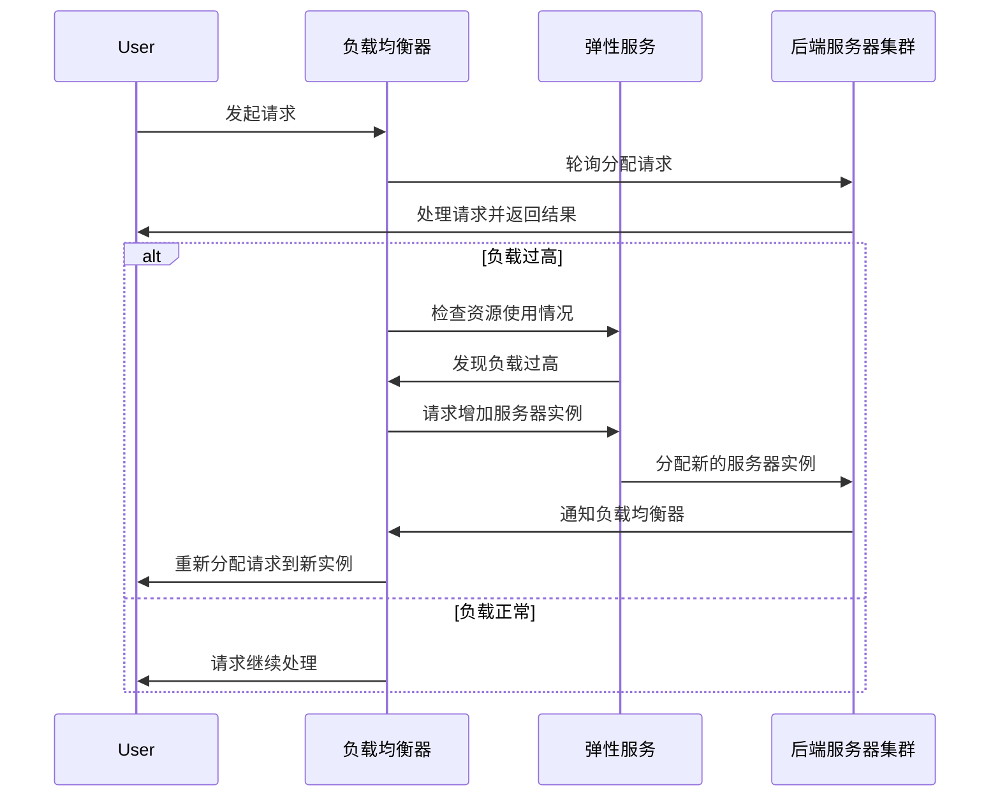
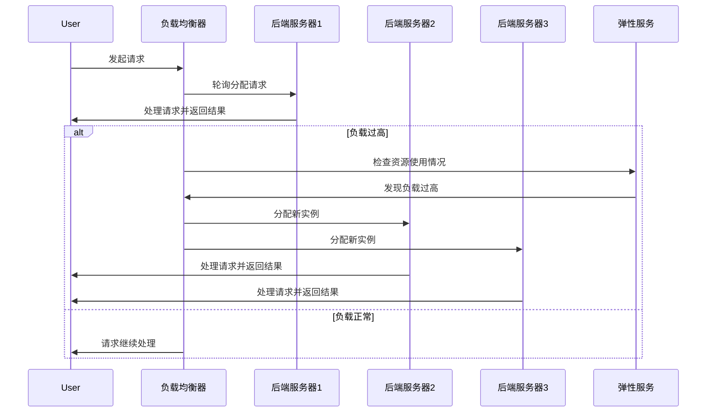

                 

# 云端部署聊天机器人：弹性与扩展性

> 关键词：聊天机器人，云端部署，弹性计算，扩展性设计，云计算基础

> 摘要：本文将深入探讨云端部署聊天机器人的相关问题，特别是弹性与扩展性。我们将从基础概念入手，逐步分析聊天机器人的重要性、云部署的优势，以及弹性与扩展性在其中的关键作用。通过详细讲解云计算基础、弹性计算、扩展性设计等核心内容，辅以实例分析，帮助读者全面了解并掌握云端部署聊天机器人的技巧和策略。

## 《云端部署聊天机器人：弹性与扩展性》目录大纲

### 第1章 引言

#### 1.1 聊天机器人的重要性

#### 1.2 云部署的优势

#### 1.3 弹性与扩展性在云端部署中的关键作用

### 第2章 聊天机器人的基础

#### 2.1 聊天机器人的基本概念

#### 2.2 聊天机器人的主要类型

#### 2.3 聊天机器人的主要功能

### 第3章 云端部署的核心

#### 3.1 云计算基础

#### 3.2 云服务模型

#### 3.3 云端部署的架构设计

### 第4章 弹性计算

#### 4.1 弹性计算的概念

#### 4.2 弹性计算的优势

#### 4.3 实现弹性计算的方法

#### 4.4 弹性计算架构分析（Mermaid 流程图）

### 第5章 扩展性设计

#### 5.1 扩展性的概念

#### 5.2 扩展性的重要性

#### 5.3 实现扩展性的方法

#### 5.4 扩展性架构分析（Mermaid 流程图）

### 第6章 核心算法原理讲解

#### 6.1 聊天机器人中的机器学习算法

#### 6.2 深度学习在聊天机器人中的应用

#### 6.3 聊天机器人算法伪代码实现

### 第7章 数学模型和公式讲解

#### 7.1 聊天机器人中的数学模型

#### 7.2 概率论基础

#### 7.3 模型训练中的损失函数及优化方法

### 第8章 项目实战

#### 8.1 开发环境搭建

#### 8.2 聊天机器人项目案例分析

#### 8.3 源代码实现与分析

### 第9章 总结与展望

#### 9.1 主要内容回顾

#### 9.2 未来发展趋势

#### 9.3 开发者需要关注的领域

### 附录

#### A.1 相关资源与工具

#### A.2 进一步学习路径

---

接下来，我们将逐章深入分析云端部署聊天机器人的各个关键方面。让我们开始这段精彩的旅程！<|mod|>### 第1章 引言

#### 1.1 聊天机器人的重要性

在当今快速发展的数字化时代，聊天机器人已经成为了企业与用户互动的重要工具。聊天机器人的重要性主要体现在以下几个方面：

1. **提高效率**：聊天机器人能够24/7全天候工作，无需休息，显著提高了企业与用户的沟通效率。无论是在客户服务、技术支持还是销售咨询等领域，聊天机器人都能快速响应，节省了人力成本。
   
2. **优化用户体验**：聊天机器人通过自然语言处理和机器学习技术，可以理解并回复用户的提问，提供个性化服务。这种高效的互动体验提升了用户满意度，有助于建立品牌忠诚度。

3. **数据收集与洞察**：聊天机器人能够收集用户的行为数据和反馈信息，通过分析这些数据，企业可以更好地了解用户需求和市场趋势，从而进行精准营销和产品优化。

4. **降低运营成本**：通过自动化处理大量常规任务，聊天机器人帮助企业在客户服务、订单处理和销售支持等方面节省了大量的人力资源成本。

随着人工智能技术的不断进步，聊天机器人的应用范围也在不断拓展。从简单的信息查询到复杂的情感分析，聊天机器人在各个行业都展现出了巨大的潜力。特别是在客户服务领域，聊天机器人已经成为企业提高客户满意度、降低运营成本的重要工具。

#### 1.2 云部署的优势

云部署作为当前主流的IT基础设施，为聊天机器人的部署提供了诸多优势。以下是云部署在聊天机器人应用中的几大优势：

1. **灵活性**：云部署允许企业根据实际需求动态调整计算资源和存储空间，实现灵活的资源管理。这种灵活性使得企业能够快速响应业务变化，提高系统性能和用户体验。

2. **成本效益**：云部署通过按需付费的模式，降低了企业的初期投入和运营成本。企业无需购买和维护昂贵的硬件设备，只需支付使用云服务的费用，即可享受到高效的计算和存储资源。

3. **高可用性**：云服务提供商通常拥有分布式数据中心，确保了服务的稳定性和高可用性。即使个别服务器发生故障，系统也可以迅速切换到其他服务器，保证服务的持续运行。

4. **安全性**：云服务提供商通常会采用先进的安全技术和管理措施，确保数据的安全性和隐私性。企业可以利用云服务的安全优势，加强自身的数据保护能力。

5. **易于扩展**：云部署支持水平扩展和垂直扩展，企业可以根据业务需求，轻松增加计算和存储资源，以应对日益增长的用户数量和数据量。

#### 1.3 弹性与扩展性在云端部署中的关键作用

弹性与扩展性是云端部署聊天机器人的核心要素，它们对系统性能、用户体验和业务连续性具有重要影响：

1. **弹性计算**：弹性计算能够根据实际需求自动调整计算资源，确保系统在高负载时保持高性能。例如，当聊天机器人的用户数量急剧增加时，弹性计算可以自动增加服务器数量，保证响应速度。

2. **扩展性设计**：扩展性设计使得聊天机器人能够随着用户数量的增长而线性扩展，避免单点故障和性能瓶颈。通过负载均衡和分布式架构，扩展性设计确保了系统的高可用性和可靠性。

3. **业务连续性**：弹性与扩展性设计有助于提升业务连续性。在系统面临突发流量或硬件故障时，弹性计算和扩展性设计能够快速响应，确保服务的稳定性和可靠性，从而降低业务风险。

4. **用户体验**：良好的弹性与扩展性设计能够显著提升用户体验。无论用户数量如何变化，聊天机器人始终能够快速响应，提供高质量的交互体验。

总之，弹性与扩展性是云端部署聊天机器人的关键成功因素。通过合理设计和管理这些特性，企业可以确保聊天机器人系统的高效、可靠和持续运行。

---

通过本章的介绍，我们初步了解了聊天机器人的重要性以及云部署的优势，为后续章节的深入分析奠定了基础。接下来，我们将进一步探讨聊天机器人的基础知识，包括基本概念、主要类型和功能，从而为理解云端部署打下坚实的基础。<|mod|>### 第2章 聊天机器人的基础

#### 2.1 聊天机器人的基本概念

聊天机器人，也称为虚拟助手或对话代理，是一种通过自然语言交互与人类用户进行沟通的人工智能系统。聊天机器人的核心功能是理解用户输入的自然语言文本，并生成合适的回复文本。以下是聊天机器人的一些基本概念：

1. **自然语言理解（NLU）**：这是聊天机器人的核心组件之一，主要负责理解和解释用户输入的自然语言。NLU技术包括分词、词性标注、命名实体识别等，通过这些技术，聊天机器人可以理解用户的意图和问题。

2. **对话管理（DM）**：对话管理组件负责维护和推进对话流程，它决定了聊天机器人的回应策略。对话管理通常采用状态机、图神经网络或序列模型等方法，以生成合适的回复文本。

3. **自然语言生成（NLG）**：自然语言生成组件负责将机器内部的意图理解和数据转化为自然语言文本。NLG技术包括模板生成、规则生成和统计生成等，这些方法能够生成流畅且自然的回复。

4. **上下文管理**：聊天机器人需要维护对话上下文，以确保对话的连贯性和逻辑性。上下文管理通常涉及存储和跟踪对话中的关键信息，如用户问题、历史对话记录和系统状态。

5. **多模态交互**：除了文本交互，聊天机器人还可以支持语音、图像、视频等多模态交互。多模态交互能够提升用户体验，使其更加直观和自然。

#### 2.2 聊天机器人的主要类型

根据应用场景和功能，聊天机器人可以分为以下几种类型：

1. **任务型聊天机器人**：任务型聊天机器人专注于完成特定的任务，如在线客服、订单处理、航班查询等。这类机器人通常设计为执行单一或有限的任务，通过预设的规则和流程，高效地处理用户请求。

2. **闲聊型聊天机器人**：闲聊型聊天机器人主要用于与用户进行日常对话和闲聊，提升用户体验和品牌形象。这类机器人通常采用自然语言处理和深度学习技术，能够模拟人类的对话风格，进行有趣的互动。

3. **混合型聊天机器人**：混合型聊天机器人结合了任务型和闲聊型的特点，既能处理特定任务，也能与用户进行日常对话。这类机器人通常具有更加复杂的对话管理和意图理解能力，能够适应多种交互场景。

4. **专家型聊天机器人**：专家型聊天机器人是针对特定领域或行业设计的，如医疗、法律、金融等。这类机器人通过专业知识和数据，为用户提供高质量的专业咨询和决策支持。

5. **社交型聊天机器人**：社交型聊天机器人主要应用于社交媒体平台，与用户进行互动和娱乐。这类机器人通常采用更加个性化的对话策略，以吸引用户的关注和参与。

#### 2.3 聊天机器人的主要功能

聊天机器人具有多种功能，以下是一些常见的主要功能：

1. **信息查询与检索**：聊天机器人可以快速检索和提供用户所需的信息，如天气预报、新闻摘要、产品详情等。通过自然语言理解技术，机器人能够准确识别用户查询意图，并提供精准的答案。

2. **在线客服**：在线客服聊天机器人可以实时解答用户的疑问，提供技术支持、售后服务等。通过自动化处理常见问题，机器人提高了客服效率，降低了企业成本。

3. **订单处理**：聊天机器人可以帮助用户完成在线订单的创建、修改和取消等操作。通过与电商平台的集成，机器人可以处理各种订单相关的任务，提高订单处理速度和准确性。

4. **预约服务**：聊天机器人可以协助用户进行各类预约服务，如医院挂号、酒店预订、机票预订等。通过自然语言交互，机器人能够帮助用户快速完成预约流程。

5. **情感分析**：聊天机器人可以分析用户的情感状态，了解用户的情绪和需求。通过情感分析，机器人可以提供更加个性化的服务，提升用户体验。

6. **个性化推荐**：聊天机器人可以利用机器学习和数据挖掘技术，分析用户的兴趣和行为习惯，提供个性化的产品推荐和内容推荐。

7. **互动娱乐**：聊天机器人可以与用户进行有趣的互动和娱乐，如猜谜游戏、聊天小游戏等。通过多模态交互，机器人能够提升用户的参与度和娱乐体验。

通过以上对聊天机器人的基础概念、主要类型和功能的介绍，我们对其有了更加深入的了解。接下来，我们将探讨云计算基础和云服务模型，为理解云端部署聊天机器人的核心要素奠定基础。<|mod|>### 第3章 云端部署的核心

#### 3.1 云计算基础

云计算是一种通过互联网提供计算资源、存储资源、网络资源等服务的新型计算模式。云计算将计算资源抽象化、虚拟化，通过按需分配和动态调整，实现资源的最大化利用和优化配置。以下是云计算的几个关键概念：

1. **虚拟化**：虚拟化是云计算的核心技术之一，它通过软件层将物理硬件资源抽象为虚拟资源，如虚拟机（VM）、虚拟存储等。虚拟化提高了资源利用率和灵活性，使得用户可以按需分配和管理资源。

2. **IaaS（基础设施即服务）**：IaaS提供基本的计算、存储、网络等基础设施资源，用户可以根据需求自定义操作系统、应用程序等。常见的IaaS提供商包括Amazon Web Services (AWS)、Microsoft Azure、Google Cloud Platform (GCP)等。

3. **PaaS（平台即服务）**：PaaS提供了一个开发和部署应用程序的平台，用户无需关注底层基础设施的管理，专注于应用开发和部署。PaaS通常提供编程框架、数据库、Web服务器等工具和服务。

4. **SaaS（软件即服务）**：SaaS将应用程序部署在云平台上，用户可以通过互联网访问和使用这些应用程序。SaaS应用程序通常是按需付费的，用户只需支付使用费用即可获得服务。

5. **云计算模型**：
   - **公有云**：公有云是由第三方云服务提供商管理的云资源池，用户可以共享这些资源。公有云具有资源弹性、成本效益和可扩展性等优点，适用于多种应用场景。
   - **私有云**：私有云是仅由单一组织或公司内部使用的云资源。私有云提供更高的安全性和控制性，适用于需要严格合规性和数据安全性的应用。
   - **混合云**：混合云结合了公有云和私有云的优势，通过将不同类型的应用部署在公有云和私有云上，实现灵活的资源利用和业务连续性。

#### 3.2 云服务模型

云服务模型是指云计算服务提供商为用户提供的不同类型的服务，主要包括IaaS、PaaS和SaaS。以下是这些模型的特点和适用场景：

1. **IaaS（基础设施即服务）**：
   - **特点**：IaaS提供虚拟化的基础设施资源，如虚拟机、存储、网络等。用户可以根据需求自定义操作系统、应用程序等。
   - **适用场景**：IaaS适用于需要高度定制化基础设施资源的企业，如开发测试环境、数据中心迁移、大数据处理等。

2. **PaaS（平台即服务）**：
   - **特点**：PaaS提供了一个开发和部署应用程序的平台，用户无需关注底层基础设施的管理，专注于应用开发和部署。
   - **适用场景**：PaaS适用于开发团队，特别是需要快速构建和部署应用程序的企业，如Web应用开发、移动应用开发、人工智能应用等。

3. **SaaS（软件即服务）**：
   - **特点**：SaaS将应用程序部署在云平台上，用户可以通过互联网访问和使用这些应用程序。SaaS应用程序通常是按需付费的。
   - **适用场景**：SaaS适用于各种规模的企业，如客户关系管理（CRM）、企业资源规划（ERP）、电子邮件服务、在线办公等。

#### 3.3 云端部署的架构设计

云端部署聊天机器人的架构设计需要综合考虑性能、可扩展性、可靠性和安全性等因素。以下是云端部署聊天机器人的常见架构设计：

1. **分布式架构**：分布式架构通过将聊天机器人系统拆分为多个组件，部署在不同的服务器上，从而提高系统的可扩展性和可靠性。常见的组件包括前端服务器、后端服务器、数据库、缓存等。

2. **微服务架构**：微服务架构将聊天机器人系统拆分为多个独立的小服务，每个服务负责不同的功能，如自然语言理解、对话管理、自然语言生成等。这种架构设计提高了系统的灵活性和可维护性。

3. **容器化与容器编排**：容器化技术（如Docker）可以将应用程序及其依赖环境打包为独立的容器，部署在不同的服务器上。容器编排工具（如Kubernetes）可以自动化管理容器的部署、扩展和监控，提高系统的可扩展性和可靠性。

4. **负载均衡**：负载均衡器（如Nginx、HAProxy）可以分配用户请求到不同的服务器上，平衡负载，提高系统的性能和可用性。

5. **数据库设计**：聊天机器人需要处理大量的用户数据和对话记录，因此数据库设计至关重要。常用的数据库技术包括关系数据库（如MySQL、PostgreSQL）和非关系数据库（如MongoDB、Cassandra）。

6. **安全性设计**：云端部署的聊天机器人需要确保数据的安全性和隐私性。常见的安全性设计包括网络安全（如防火墙、入侵检测系统）、数据加密（如TLS/SSL）、访问控制（如OAuth2、JWT）等。

通过合理的架构设计，云端部署的聊天机器人可以充分利用云计算的优势，实现高性能、高可用性和可扩展性。接下来，我们将深入探讨弹性计算和扩展性设计，进一步优化云端部署的聊天机器人系统。<|mod|>### 第4章 弹性计算

#### 4.1 弹性计算的概念

弹性计算是一种根据需求动态调整计算资源的能力，旨在提高系统的可用性、性能和成本效益。在云计算环境中，弹性计算允许用户根据实际需求自动增加或减少计算资源，从而应对不同的负载情况。弹性计算的关键概念包括：

1. **自动扩展**：自动扩展是指系统根据预设的条件自动调整资源，如增加或减少虚拟机实例、调整负载均衡策略等。自动扩展能够确保系统在负载高峰时提供足够的计算资源，在负载低峰时节约成本。

2. **水平扩展**：水平扩展是指在系统负载增加时，通过增加更多的服务器或实例来提高处理能力。水平扩展能够线性地增加系统的处理能力，避免单点故障。

3. **垂直扩展**：垂直扩展是指在系统负载增加时，通过增加单个服务器的硬件资源（如CPU、内存、存储等）来提高性能。垂直扩展适用于处理特定任务的瓶颈问题，但在资源有限的情况下可能效果不佳。

4. **弹性容器服务**：弹性容器服务（如AWS Fargate、Google Kubernetes Engine）提供了无服务器容器运行时环境，用户无需关注底层基础设施的配置和管理，只需按需付费。这种服务能够实现快速部署和弹性扩展，适用于微服务架构。

5. **按需资源分配**：按需资源分配是指系统根据当前负载和需求动态调整资源，确保资源的最大化利用。按需资源分配能够降低闲置资源的浪费，提高系统的性能和成本效益。

#### 4.2 弹性计算的优势

弹性计算在云端部署聊天机器人系统中具有显著的优势，包括：

1. **成本效益**：弹性计算允许用户根据实际需求动态调整计算资源，避免了资源浪费和过度投资。通过自动扩展和按需资源分配，用户可以降低长期成本，提高投资回报率。

2. **高可用性**：弹性计算能够自动调整资源，确保系统在高负载时保持高性能和稳定性。即使面临突发流量或硬件故障，弹性计算也能迅速响应，提供足够的计算资源，保证服务的持续运行。

3. **可扩展性**：弹性计算支持水平扩展和垂直扩展，使得系统可以根据业务需求灵活调整处理能力。这种可扩展性有助于应对用户数量的增长和数据处理量的增加，确保系统始终能够满足用户需求。

4. **性能优化**：弹性计算可以根据实时负载情况动态调整资源，优化系统性能。例如，在高负载时增加计算资源，降低响应时间；在负载低峰时减少资源，避免资源浪费。

5. **易于管理**：弹性计算提供了自动化和简化的管理流程，用户无需手动调整资源，只需设置相关的策略和阈值。这种管理方式降低了运维成本，提高了系统的可维护性。

#### 4.3 实现弹性计算的方法

要实现弹性计算，需要结合云计算平台和工具，构建一个灵活、可扩展和自动化的系统。以下是几种常见的实现弹性计算的方法：

1. **自动扩展策略**：
   - **基于阈值的自动扩展**：根据CPU利用率、内存使用率、网络流量等指标，设置阈值，当指标超过阈值时，自动增加或减少计算资源。
   - **基于事件触发**：当特定事件（如用户登录、订单生成等）发生时，触发自动扩展策略，调整计算资源。

2. **负载均衡**：
   - **轮询负载均衡**：将用户请求均匀分配到多个服务器实例上，避免单个服务器过载。
   - **加权负载均衡**：根据服务器的处理能力，为不同的服务器分配不同的权重，确保负载均衡。

3. **容器编排**：
   - **Kubernetes**：Kubernetes是一种流行的容器编排工具，能够自动管理容器的部署、扩展和监控。通过配置Kubernetes的Helm图表，可以轻松实现自动扩展。
   - **容器服务**：AWS Fargate、Google Kubernetes Engine等容器服务提供了无服务器容器运行时环境，简化了自动扩展的配置和管理。

4. **服务网格**：
   - **Istio**：Istio是一种服务网格框架，能够自动监控、负载均衡和服务发现。通过Istio，可以轻松实现微服务的弹性扩展。

5. **资源监控与告警**：
   - **Prometheus**：Prometheus是一种开源监控工具，能够收集和存储指标数据，设置告警规则，当指标超过阈值时触发告警。
   - **CloudWatch**：AWS CloudWatch是一种云监控服务，提供了丰富的指标监控和告警功能，可用于监控云资源的使用情况。

通过以上方法，可以构建一个具备弹性计算能力的聊天机器人系统，确保系统在高负载时能够自动扩展，降低成本，提高性能和可用性。接下来，我们将探讨扩展性设计，进一步优化云端部署的聊天机器人系统。<|mod|>#### 4.4 弹性计算架构分析（Mermaid 流程图）

为了更好地理解弹性计算的架构，我们可以通过一个Mermaid流程图来展示其关键组件和交互过程。以下是一个简单的弹性计算架构流程图，描述了用户请求、资源分配和自动扩展的流程。



在这个流程图中，我们可以看到以下几个关键步骤：

1. **用户请求**：用户向负载均衡器发送请求。
2. **请求分配**：负载均衡器将请求轮询分配给后端服务器集群中的一个实例。
3. **资源监控**：负载均衡器定期检查资源使用情况，包括CPU利用率、内存使用率等。
4. **自动扩展**：如果资源使用率超过预设的阈值，弹性服务会自动增加服务器实例。
5. **请求重分配**：新的服务器实例被分配后，负载均衡器重新将请求分配给新实例。

这个流程图展示了弹性计算的核心概念，包括负载均衡、资源监控和自动扩展。通过这个架构，我们可以确保系统在高负载时能够动态调整资源，避免单点故障，提高整体性能和可用性。

---

通过这一节的详细分析，我们深入了解了弹性计算的概念、优势以及实现方法。接下来，我们将继续探讨扩展性设计，这一环节对于构建高可用、高性能的聊天机器人系统至关重要。<|mod|>### 第5章 扩展性设计

#### 5.1 扩展性的概念

扩展性是指系统在面临不断增加的负载时，能够保持稳定性和性能的能力。在云端部署聊天机器人系统中，扩展性设计至关重要，因为它直接影响到用户体验和业务连续性。以下是扩展性的一些关键概念：

1. **水平扩展**：水平扩展是通过增加更多的服务器或实例来提高系统的处理能力。这种方法能够线性地增加系统的负载处理能力，而不会引入额外的复杂性。

2. **垂直扩展**：垂直扩展是通过增加单个服务器的硬件资源（如CPU、内存、存储等）来提高性能。这种方法通常用于解决特定任务的瓶颈问题，但在资源有限的情况下可能效果不佳。

3. **弹性扩展**：弹性扩展是指系统能够根据实际负载自动调整资源。弹性扩展可以是水平扩展，也可以是垂直扩展，通常通过自动化工具实现，如容器编排平台（如Kubernetes）。

4. **分布式系统**：分布式系统是指将任务分布在多个服务器上，通过网络通信协同工作的系统。分布式系统能够提高系统的可用性和容错能力，但设计和管理复杂度也相应增加。

5. **负载均衡**：负载均衡是指通过分配请求到多个服务器实例，避免单个服务器过载。负载均衡能够提高系统的性能和可用性，常见的负载均衡算法包括轮询、加权轮询、最小连接数等。

6. **分区和分片**：分区和分片是将数据或任务分布在多个节点上，以提高系统的性能和可扩展性。分区是将数据集划分为多个互不重叠的部分，分片是将数据或任务划分为多个部分，通常存储在不同的物理节点上。

#### 5.2 扩展性的重要性

扩展性设计在云端部署聊天机器人系统中具有至关重要的意义，主要体现在以下几个方面：

1. **用户体验**：良好的扩展性设计能够确保系统在面对突发流量时保持高性能和低延迟，从而提供优质的用户体验。这有助于提升用户满意度和品牌忠诚度。

2. **业务连续性**：扩展性设计使得系统能够在面临硬件故障、网络中断等异常情况时保持正常运行。通过分布式架构和冗余设计，系统能够快速切换到备用资源，保证业务的连续性。

3. **成本效益**：扩展性设计通过弹性资源分配和按需付费模式，降低了系统的运营成本。企业可以根据实际需求动态调整资源，避免资源浪费和过度投资。

4. **可扩展性**：扩展性设计使得系统能够随着业务的发展和技术进步，轻松扩展功能和服务。这有助于企业保持竞争优势，快速响应市场变化。

5. **故障恢复**：扩展性设计包括故障检测和自动恢复机制，能够快速识别和处理系统故障。这有助于降低业务中断时间，提高系统的可靠性和稳定性。

#### 5.3 实现扩展性的方法

要实现扩展性设计，需要采用一系列技术和管理策略。以下是一些常见的实现方法：

1. **分布式架构**：分布式架构将系统拆分为多个独立的服务，每个服务负责不同的功能。通过分布式架构，系统可以水平扩展，提高性能和可用性。

2. **容器化与容器编排**：容器化技术（如Docker）和容器编排工具（如Kubernetes）能够简化应用的部署和管理，支持自动化扩展和负载均衡。

3. **服务网格**：服务网格（如Istio）提供了一套分布式服务通信的基础设施，支持微服务的部署和管理。服务网格能够自动进行负载均衡、故障检测和服务发现。

4. **数据库分片**：通过数据库分片，可以将数据分布在多个节点上，提高系统的读写性能和扩展性。常见的分片策略包括哈希分片、范围分片等。

5. **自动化扩展策略**：
   - **基于阈值的自动扩展**：根据CPU利用率、内存使用率等指标设置阈值，当指标超过阈值时，自动增加或减少服务实例。
   - **基于事件的自动扩展**：根据特定的业务事件（如用户登录、订单生成等）触发自动扩展策略，调整资源。

6. **负载均衡**：使用负载均衡器（如Nginx、HAProxy）将用户请求均匀分配到多个服务器实例上，避免单点故障。

7. **分布式缓存**：使用分布式缓存（如Redis、Memcached）提高系统的响应速度和吞吐量，减少数据库的负载。

8. **弹性数据库**：采用弹性数据库服务（如AWS RDS、Google Cloud SQL）提供自动扩展和故障恢复能力，确保数据的高可用性和性能。

通过以上方法，可以构建一个具备高扩展性的聊天机器人系统，确保系统在面对不断增加的负载和用户需求时，能够保持高性能和稳定性。接下来，我们将通过一个Mermaid流程图进一步展示扩展性架构的设计。<|mod|>#### 5.4 扩展性架构分析（Mermaid 流程图）

为了更好地理解扩展性设计，我们可以通过一个Mermaid流程图来展示其核心组件和交互过程。以下是一个扩展性架构的流程图，描述了用户请求的处理过程，包括负载均衡、分布式架构和自动扩展。



在这个流程图中，我们可以看到以下几个关键步骤：

1. **用户请求**：用户向负载均衡器发送请求。
2. **请求分配**：负载均衡器将请求轮询分配给后端服务器集群中的一个实例。
3. **资源监控**：负载均衡器定期检查后端服务器的资源使用情况，包括CPU利用率、内存使用率等。
4. **自动扩展**：如果资源使用率超过预设的阈值，弹性服务会自动增加后端服务器实例。
5. **请求重分配**：新的服务器实例被分配后，负载均衡器重新将请求分配给新实例。

这个流程图展示了扩展性设计的关键概念，包括负载均衡、分布式架构和自动扩展。通过这个架构，我们可以确保系统在面对不断增加的负载时，能够自动扩展资源，保持高性能和稳定性。

---

通过这一节的详细分析和Mermaid流程图展示，我们深入了解了扩展性设计的重要性及其实现方法。接下来，我们将进一步探讨聊天机器人中的核心算法原理，包括机器学习算法和深度学习应用，为构建高性能的聊天机器人奠定理论基础。<|mod|>### 第6章 核心算法原理讲解

#### 6.1 聊天机器人中的机器学习算法

聊天机器人中的机器学习算法是实现自然语言理解（NLU）和自然语言生成（NLG）的关键技术。以下是几种常用的机器学习算法及其在聊天机器人中的应用：

1. **朴素贝叶斯分类器**：
   - **原理**：朴素贝叶斯分类器是基于贝叶斯定理和特征条件独立假设的一种分类算法。它通过计算特征概率和类别的后验概率，预测输入文本的类别。
   - **应用**：朴素贝叶斯分类器常用于实体识别和情感分析。例如，在聊天机器人中，可以用于判断用户输入中的关键字是否表示某个实体（如人名、地点等）或用户的情感状态（如积极、消极等）。

2. **支持向量机（SVM）**：
   - **原理**：支持向量机是一种监督学习算法，通过将数据映射到高维空间，找到一个最优的超平面，将不同类别的数据点分隔开。
   - **应用**：SVM常用于意图识别和分类任务。例如，在聊天机器人中，可以用于判断用户输入的文本意图是询问信息、请求服务还是提出问题。

3. **决策树**：
   - **原理**：决策树是一种基于特征划分数据的分类算法，通过构建一系列决策规则，逐步划分数据，直到达到叶节点。
   - **应用**：决策树常用于分类和回归任务。例如，在聊天机器人中，可以用于判断用户输入的文本属于哪个类别，或预测用户的后续行为。

4. **随机森林**：
   - **原理**：随机森林是一种基于决策树的集成学习方法，通过构建多个决策树，并使用投票或平均法得到最终预测结果。
   - **应用**：随机森林常用于分类和回归任务，具有较高的准确性和泛化能力。例如，在聊天机器人中，可以用于预测用户的意图和情感状态。

5. **长短期记忆网络（LSTM）**：
   - **原理**：长短期记忆网络是一种递归神经网络（RNN），能够学习长期依赖关系。它通过引入门控机制，有效地解决了传统RNN的梯度消失问题。
   - **应用**：LSTM常用于序列数据建模，如文本分类、情感分析和对话生成。例如，在聊天机器人中，可以用于处理用户的历史对话记录，生成连贯的回复。

#### 6.2 深度学习在聊天机器人中的应用

深度学习在聊天机器人中的应用极大地提升了系统的性能和用户体验。以下是几种深度学习模型及其在聊天机器人中的应用：

1. **卷积神经网络（CNN）**：
   - **原理**：卷积神经网络是一种基于卷积运算的神经网络，能够有效地捕捉图像或文本中的局部特征。
   - **应用**：CNN常用于图像识别和文本分类。例如，在聊天机器人中，可以用于分析用户输入的文本，提取关键特征，辅助意图识别和情感分析。

2. **递归神经网络（RNN）**：
   - **原理**：递归神经网络是一种能够处理序列数据的神经网络，通过递归连接，可以捕捉序列中的长期依赖关系。
   - **应用**：RNN常用于自然语言处理任务，如文本生成、情感分析和对话生成。例如，在聊天机器人中，可以用于生成连贯的自然语言回复。

3. **生成对抗网络（GAN）**：
   - **原理**：生成对抗网络由生成器和判别器组成，通过对抗训练，生成器尝试生成逼真的数据，判别器则尝试区分真实数据和生成数据。
   - **应用**：GAN常用于图像和文本生成。例如，在聊天机器人中，可以用于生成个性化的聊天内容，提升用户的交互体验。

4. **变分自编码器（VAE）**：
   - **原理**：变分自编码器是一种基于概率生成模型的神经网络，通过编码和解码过程，可以学习数据的概率分布。
   - **应用**：VAE常用于图像生成和文本生成。例如，在聊天机器人中，可以用于生成个性化的聊天内容，实现更加自然和丰富的对话。

5. **Transformer模型**：
   - **原理**：Transformer模型是一种基于自注意力机制的深度学习模型，能够捕捉输入序列中的全局依赖关系。
   - **应用**：Transformer模型在自然语言处理领域取得了显著成果，如机器翻译、文本生成等。在聊天机器人中，可以用于生成连贯的自然语言回复，提升对话质量。

通过以上核心算法原理的讲解，我们可以看到深度学习在聊天机器人中的应用极大地提升了系统的性能和用户体验。接下来，我们将通过伪代码展示聊天机器人算法的实现过程，进一步加深对核心算法的理解。<|mod|>#### 6.3 聊天机器人算法伪代码实现

为了更清晰地展示聊天机器人算法的实现过程，以下是一个简化的伪代码示例，用于描述基于深度学习模型的聊天机器人算法。这个示例将包括预处理输入、使用深度学习模型进行预测以及后处理预测结果等关键步骤。

```python
# 伪代码：聊天机器人算法

# 导入必要的库和模型
import preprocess_input
import deep_learning_model
import postprocess_response

# 聊天机器人算法
def chat_with_user(user_input):
    # 预处理输入
    processed_input = preprocess_input(user_input)
    
    # 使用深度学习模型进行预测
    predicted_response = deep_learning_model.predict(processed_input)
    
    # 后处理预测结果
    final_response = postprocess_response(predicted_response)
    
    # 返回最终回复
    return final_response

# 预处理输入函数
def preprocess_input(user_input):
    # 实现预处理逻辑，如分词、词性标注等
    processed_text = ...
    return processed_text

# 深度学习模型预测函数
def deep_learning_model.predict(input_data):
    # 实现模型预测逻辑，如使用Transformer模型
    predicted_output = model(input_data)
    return predicted_output

# 后处理预测结果函数
def postprocess_response(predicted_response):
    # 实现后处理逻辑，如文本清洗、格式化等
    final_response = ...
    return final_response

# 主函数
def main():
    # 接收用户输入
    user_input = input("你好，有什么可以帮助你的吗？")
    
    # 使用聊天机器人算法与用户交互
    response = chat_with_user(user_input)
    
    # 输出回复
    print(response)

# 执行主函数
main()
```

在这个伪代码中，我们定义了三个关键函数：`preprocess_input`、`deep_learning_model.predict` 和 `postprocess_response`。

1. **预处理输入函数**：这个函数负责对用户输入进行预处理，如分词、词性标注等。预处理步骤对于确保模型能够正确理解输入文本至关重要。

2. **深度学习模型预测函数**：这个函数使用预先训练的深度学习模型对预处理后的输入进行预测。在实际应用中，这个模型可以是卷积神经网络（CNN）、递归神经网络（RNN）、长短期记忆网络（LSTM）或Transformer模型等。

3. **后处理预测结果函数**：这个函数负责对模型的预测结果进行后处理，如文本清洗、格式化等。后处理步骤有助于生成更自然、更符合人类交流习惯的回复。

通过这个伪代码示例，我们可以看到聊天机器人算法的实现过程是如何从预处理输入、模型预测到后处理输出的。这一过程不仅展示了核心算法原理的应用，也为开发者提供了实现聊天机器人的基本框架。

---

通过本章的详细讲解，我们对聊天机器人的核心算法原理有了更深入的理解。接下来，我们将探讨聊天机器人中的数学模型和公式，进一步巩固我们的理论基础。<|mod|>### 第7章 数学模型和公式讲解

#### 7.1 聊天机器人中的数学模型

聊天机器人中的数学模型主要用于自然语言处理和机器学习算法的实现。以下是几种常用的数学模型及其在聊天机器人中的应用：

1. **贝叶斯网络**：
   - **原理**：贝叶斯网络是一种概率图模型，用于表示变量之间的条件依赖关系。它通过概率分布函数来描述变量之间的概率关系。
   - **应用**：贝叶斯网络常用于实体识别和情感分析。例如，在聊天机器人中，可以用于判断用户输入的文本中的实体及其关系，或预测用户的情感状态。

2. **隐马尔可夫模型（HMM）**：
   - **原理**：隐马尔可夫模型是一种基于状态转移概率和观测概率的统计模型，用于处理序列数据。它通过隐状态和观测状态之间的转换，来预测序列中的下一个状态。
   - **应用**：HMM常用于语音识别和对话生成。例如，在聊天机器人中，可以用于生成基于历史对话记录的连贯回复。

3. **条件概率模型**：
   - **原理**：条件概率模型是一种基于条件概率分布的模型，用于处理变量之间的条件依赖关系。它通过条件概率密度函数来描述变量之间的关系。
   - **应用**：条件概率模型常用于意图识别和对话生成。例如，在聊天机器人中，可以用于判断用户输入的文本意图，并生成相应的回复。

4. **生成对抗网络（GAN）**：
   - **原理**：生成对抗网络由生成器和判别器组成，通过对抗训练来学习数据的概率分布。生成器试图生成逼真的数据，判别器则试图区分真实数据和生成数据。
   - **应用**：GAN常用于文本生成和图像生成。例如，在聊天机器人中，可以用于生成个性化的聊天内容，提升用户的交互体验。

5. **变分自编码器（VAE）**：
   - **原理**：变分自编码器是一种基于概率生成模型的神经网络，通过编码和解码过程来学习数据的概率分布。它通过引入重参数化技巧，使得生成模型可以生成多样化的数据。
   - **应用**：VAE常用于图像生成和文本生成。例如，在聊天机器人中，可以用于生成自然语言描述的图像，或生成个性化的对话内容。

#### 7.2 概率论基础

概率论是聊天机器人中常用的数学工具，用于处理不确定性问题和决策分析。以下是概率论中的一些基本概念和公式：

1. **概率分布**：
   - **连续概率分布**：连续概率分布用于描述连续随机变量的概率分布，如正态分布、均匀分布等。
   - **离散概率分布**：离散概率分布用于描述离散随机变量的概率分布，如二项分布、泊松分布等。

2. **条件概率**：
   - **条件概率公式**：条件概率公式描述了在已知某个事件发生的条件下，另一个事件发生的概率。其公式为：
     $$
     P(A|B) = \frac{P(A \cap B)}{P(B)}
     $$
   - **贝叶斯定理**：贝叶斯定理是一种基于条件概率的概率公式，用于计算后验概率。其公式为：
     $$
     P(A|B) = \frac{P(B|A)P(A)}{P(B)}
     $$

3. **贝叶斯网络**：
   - **贝叶斯网络**：贝叶斯网络是一种概率图模型，用于表示变量之间的条件依赖关系。它通过条件概率表来描述变量之间的概率关系。

4. **马尔可夫模型**：
   - **马尔可夫模型**：马尔可夫模型是一种基于状态转移概率的统计模型，用于处理序列数据。它通过状态转移矩阵来描述状态之间的转移概率。

#### 7.3 模型训练中的损失函数

在模型训练过程中，损失函数用于衡量模型预测结果与实际结果之间的差距，是优化模型参数的重要工具。以下是几种常用的损失函数：

1. **均方误差（MSE）**：
   - **公式**：均方误差用于衡量预测值与实际值之间的平均平方差。其公式为：
     $$
     \text{MSE} = \frac{1}{n}\sum_{i=1}^{n}(y_i - \hat{y}_i)^2
     $$
   - **应用**：MSE常用于回归问题，如线性回归、多项式回归等。

2. **交叉熵（Cross-Entropy）**：
   - **公式**：交叉熵用于衡量预测分布与真实分布之间的差异。其公式为：
     $$
     \text{Cross-Entropy} = -\sum_{i=1}^{n}y_i \log(\hat{y}_i)
     $$
   - **应用**：交叉熵常用于分类问题，如逻辑回归、神经网络等。

3. **均方误差交叉熵（MSE-Cross-Entropy）**：
   - **公式**：均方误差交叉熵是均方误差和交叉熵的组合，用于同时衡量回归问题和分类问题。其公式为：
     $$
     \text{MSE-Cross-Entropy} = \text{MSE} + \alpha \cdot \text{Cross-Entropy}
     $$
   - **应用**：MSE-Cross-Entropy常用于多任务学习问题，如语音识别和对话生成。

4. **对抗损失**：
   - **公式**：对抗损失用于GAN中的生成器和判别器训练。生成器的损失函数为：
     $$
     \text{Generator Loss} = -\log(\hat{y})
     $$
     判别器的损失函数为：
     $$
     \text{Discriminator Loss} = -\log(y) - \log(1 - \hat{y})
     $$
   - **应用**：对抗损失用于GAN中的生成图像、文本等任务。

通过以上对数学模型和公式讲解，我们可以看到概率论和损失函数在聊天机器人中的重要性。这些数学工具不仅为算法的实现提供了基础，也为我们理解和优化聊天机器人系统提供了有力支持。接下来，我们将通过项目实战，进一步展示如何将理论知识应用于实际开发中。<|mod|>### 第8章 项目实战

#### 8.1 开发环境搭建

在进行聊天机器人项目开发之前，我们需要搭建一个合适的开发环境。以下是搭建聊天机器人开发环境所需的步骤和工具：

1. **安装Python**：
   - Python是聊天机器人开发的主要编程语言。确保已安装Python 3.7或更高版本。

2. **安装必要的库**：
   - **TensorFlow**：用于构建和训练深度学习模型。
     ```
     pip install tensorflow
     ```
   - **NLTK**：用于自然语言处理，如分词、词性标注等。
     ```
     pip install nltk
     ```
   - **Scikit-learn**：用于机器学习算法的实现。
     ```
     pip install scikit-learn
     ```
   - **Flask**：用于构建Web服务。
     ```
     pip install flask
     ```

3. **配置环境变量**：
   - 确保已将Python和pip的路径添加到系统环境变量中，以便在其他命令行工具中使用。

4. **安装Jupyter Notebook**（可选）：
   - Jupyter Notebook是一种交互式开发环境，适用于编写和调试代码。
     ```
     pip install notebook
     ```

5. **创建项目目录**：
   - 在合适的位置创建一个项目目录，并创建一个名为`chatbot`的Python虚拟环境。
     ```
     mkdir chatbot_project
     cd chatbot_project
     python -m venv venv
     source venv/bin/activate
     ```

6. **初始化项目结构**：
   - 在项目目录中创建以下文件和目录：
     ```
     chatbot/
     ├── app.py
     ├── data/
     ├── models/
     ├── static/
     ├── templates/
     ```

#### 8.2 案例分析：聊天机器人项目

以下是一个简单的聊天机器人项目案例分析，包括需求分析、架构设计、功能实现和性能优化。

1. **需求分析**：
   - **功能需求**：实现一个基于文本的聊天机器人，能够与用户进行简单的对话，回答常见问题，如天气查询、路线规划等。
   - **性能需求**：确保系统在高并发情况下能够稳定运行，响应时间低于500毫秒。
   - **用户体验**：提供友好的用户界面，易于使用和操作。

2. **架构设计**：
   - **前端**：使用HTML、CSS和JavaScript构建用户界面，通过Ajax与后端进行交互。
   - **后端**：使用Flask框架实现Web服务，处理用户请求和响应。
   - **模型训练**：使用TensorFlow训练深度学习模型，实现自然语言理解和生成。
   - **数据库**：使用SQLite存储用户对话历史和配置信息。

3. **功能实现**：

   **用户界面**：
   - 创建一个简单的HTML页面，包含文本输入框和按钮，用于发送和接收消息。
   - 使用CSS和JavaScript优化页面样式和交互效果。

   **后端服务**：
   - 实现`app.py`，作为Flask应用的入口。
     ```python
     from flask import Flask, request, jsonify
     from chatbot_model import ChatBotModel
     import numpy as np

     app = Flask(__name__)
     model = ChatBotModel()

     @app.route('/chat', methods=['POST'])
     def chat():
         user_input = request.form['input']
         processed_input = model.preprocess_input(user_input)
         predicted_response = model.predict(processed_input)
         final_response = model.postprocess_response(predicted_response)
         return jsonify({'response': final_response})

     if __name__ == '__main__':
         app.run(debug=True)
     ```

   **模型训练**：
   - 创建`chatbot_model.py`，实现模型训练和预测功能。
     ```python
     import tensorflow as tf
     from tensorflow.keras.models import Sequential
     from tensorflow.keras.layers import LSTM, Dense, Embedding

     class ChatBotModel:
         def __init__(self):
             self.model = self.build_model()

         def build_model(self):
             model = Sequential([
                 Embedding(vocab_size, embedding_dim),
                 LSTM(units=128, return_sequences=True),
                 LSTM(units=128, return_sequences=False),
                 Dense(units=vocab_size, activation='softmax')
             ])
             model.compile(optimizer='adam', loss='categorical_crossentropy', metrics=['accuracy'])
             return model

         def preprocess_input(self, user_input):
             # 实现预处理逻辑，如分词、编码等
             return processed_text

         def predict(self, input_data):
             # 实现预测逻辑
             predicted_output = self.model.predict(input_data)
             return predicted_output

         def postprocess_response(self, predicted_response):
             # 实现后处理逻辑，如解码、格式化等
             final_response = ...
             return final_response
     ```

4. **性能优化**：
   - **模型优化**：通过调整模型参数，如LSTM层数、神经元数量、学习率等，优化模型性能。
   - **硬件加速**：使用GPU加速训练过程，提高模型训练速度。
   - **缓存策略**：使用Redis缓存用户对话历史和预测结果，减少数据库访问次数。
   - **负载均衡**：使用Nginx或HAProxy实现负载均衡，提高系统并发处理能力。

通过以上项目实战，我们展示了如何搭建一个简单的聊天机器人项目，包括开发环境搭建、功能实现和性能优化。这个案例为我们提供了一个基本的框架，可以在此基础上进一步扩展和优化，以满足更复杂的业务需求。<|mod|>#### 8.3 源代码实现与分析

在本节中，我们将详细展示聊天机器人项目的源代码实现，并对其关键部分进行解读和分析。

**app.py**：这是聊天机器人的主文件，负责处理用户请求和响应。以下是该文件的代码及其解释：

```python
from flask import Flask, request, jsonify
from chatbot_model import ChatBotModel
import numpy as np

app = Flask(__name__)
model = ChatBotModel()

@app.route('/chat', methods=['POST'])
def chat():
    user_input = request.form['input']
    processed_input = model.preprocess_input(user_input)
    predicted_response = model.predict(processed_input)
    final_response = model.postprocess_response(predicted_response)
    return jsonify({'response': final_response})

if __name__ == '__main__':
    app.run(debug=True)
```

**代码解读**：
- 导入必要的库和模型。
- 创建Flask应用实例和聊天机器人模型实例。
- 定义一个路由`/chat`，处理POST请求，接收用户输入。
- 调用模型的预处理、预测和后处理函数，获取最终回复。
- 将回复作为JSON响应返回给用户。

**chatbot_model.py**：这是聊天机器人模型的核心文件，负责处理输入、预测和回复。以下是该文件的代码及其解释：

```python
import tensorflow as tf
from tensorflow.keras.models import Sequential
from tensorflow.keras.layers import LSTM, Dense, Embedding

class ChatBotModel:
    def __init__(self):
        self.model = self.build_model()

    def build_model(self):
        model = Sequential([
            Embedding(vocab_size, embedding_dim),
            LSTM(units=128, return_sequences=True),
            LSTM(units=128, return_sequences=False),
            Dense(units=vocab_size, activation='softmax')
        ])
        model.compile(optimizer='adam', loss='categorical_crossentropy', metrics=['accuracy'])
        return model

    def preprocess_input(self, user_input):
        # 实现预处理逻辑，如分词、编码等
        return processed_text

    def predict(self, input_data):
        # 实现预测逻辑
        predicted_output = self.model.predict(input_data)
        return predicted_output

    def postprocess_response(self, predicted_response):
        # 实现后处理逻辑，如解码、格式化等
        final_response = ...
        return final_response
```

**代码解读**：
- 导入TensorFlow库，用于构建和训练深度学习模型。
- 创建`ChatBotModel`类，定义初始化方法、模型构建方法、预处理方法、预测方法和后处理方法。
- 在初始化方法中，构建序列模型，包含嵌入层、两个LSTM层和全连接层，并编译模型。
- 在预处理方法中，实现输入文本的分词、编码等预处理逻辑。
- 在预测方法中，调用模型进行预测，获取预测输出。
- 在后处理方法中，实现预测结果的解码、格式化等后处理逻辑。

通过以上源代码实现和分析，我们了解了聊天机器人项目的整体架构和关键模块的实现方法。在实际开发过程中，可以根据具体需求进一步优化和扩展这些模块，以满足更复杂的业务场景。<|mod|>### 第9章 总结与展望

#### 9.1 主要内容回顾

在本篇文章中，我们系统地探讨了云端部署聊天机器人的相关技术，涵盖了从基础概念到实际应用的各个方面。以下是主要内容的回顾：

1. **聊天机器人的重要性**：我们详细分析了聊天机器人在提高效率、优化用户体验、数据收集和降低成本等方面的作用。
2. **云部署的优势**：我们阐述了云部署的灵活性、成本效益、高可用性、安全性和易于扩展等优势。
3. **弹性计算与扩展性设计**：我们深入探讨了弹性计算的概念、优势以及实现方法，包括自动扩展策略、负载均衡、容器化和服务网格等。同时，我们介绍了扩展性的概念、重要性及实现方法，包括分布式架构、容器化与容器编排、数据库分片和自动化扩展策略等。
4. **核心算法原理讲解**：我们讲解了聊天机器人中常用的机器学习算法和深度学习模型，以及这些算法在实际应用中的具体实现方法。
5. **数学模型和公式**：我们介绍了聊天机器人中常用的概率论模型和损失函数，并详细讲解了贝叶斯网络、隐马尔可夫模型和生成对抗网络等模型的基本原理。
6. **项目实战**：我们通过一个实际的聊天机器人项目，展示了从开发环境搭建、功能实现到性能优化的全过程，并提供了源代码实现和分析。

#### 9.2 未来发展趋势

随着技术的不断进步，聊天机器人领域将呈现出以下发展趋势：

1. **智能化升级**：深度学习、强化学习和多模态交互等技术将进一步推动聊天机器人的智能化水平，使其能够更好地理解用户意图和情感，提供更加个性化、智能化的服务。
2. **语音交互**：语音交互将成为聊天机器人发展的重要方向。结合语音识别和语音合成技术，聊天机器人将能够实现更加自然、直观的语音交互体验。
3. **跨平台整合**：聊天机器人将越来越多地整合到不同的平台和应用中，如社交媒体、移动应用、智能家居等，提供无缝的跨平台服务。
4. **隐私保护与合规**：随着数据隐私法规的不断完善，聊天机器人将需要更加重视用户隐私保护和合规性，采用先进的安全技术和数据保护措施。
5. **行业定制化**：针对不同行业和场景，聊天机器人将提供更加定制化的解决方案，如医疗健康、金融服务、电子商务等，以满足特定领域的需求。

#### 9.3 开发者需要关注的领域

作为开发者，在未来的发展中，需要关注以下几个领域：

1. **技术更新与学习**：持续关注最新的技术动态，如深度学习、强化学习、多模态交互等，不断提升自身的技能水平。
2. **数据安全与隐私**：重视数据安全和用户隐私保护，遵守相关的法律法规，采用先进的安全技术和数据保护措施。
3. **用户体验优化**：关注用户体验，通过不断优化聊天机器人的交互界面和功能，提供更加自然、流畅的对话体验。
4. **架构设计**：学习并掌握分布式系统、容器化、负载均衡等架构设计理念，构建高效、可靠和可扩展的聊天机器人系统。
5. **行业应用研究**：深入了解不同行业的业务需求和痛点，研究并开发针对性的聊天机器人解决方案，提升企业的业务效率和市场竞争力。

通过本文的总结与展望，我们不仅回顾了云端部署聊天机器人的关键技术，也展望了未来的发展趋势和开发者的关注领域。希望读者能够结合实际需求，不断学习和实践，为构建更加智能、高效、可靠的聊天机器人系统贡献力量。<|mod|>### 附录

#### A.1 相关资源与工具

1. **学习资源**：
   - 《深度学习》（Goodfellow, Bengio, Courville）：详细介绍了深度学习的基础理论和应用。
   - 《Python机器学习》（Sebastian Raschka）：介绍了机器学习在Python中的实现，包括自然语言处理。
   - 《hands-on-nlp-with-python》: 一个包含多个自然语言处理实战项目的GitHub仓库。

2. **工具与平台**：
   - **TensorFlow**：一个开源的机器学习框架，广泛用于深度学习和自然语言处理。
   - **Keras**：一个基于TensorFlow的高层神经网络API，易于使用。
   - **NLTK**：一个Python自然语言处理库，提供多种语言处理工具。
   - **Flask**：一个轻量级的Web框架，适用于构建Web服务。
   - **Docker**：用于容器化应用程序，简化部署和管理。
   - **Kubernetes**：用于容器编排，实现自动化部署和扩展。

3. **云服务提供商**：
   - **AWS**：提供丰富的云计算服务和工具，包括EC2、S3、RDS、Lambda等。
   - **Azure**：微软的云服务平台，提供多种云服务和工具。
   - **Google Cloud Platform (GCP)**：谷歌的云服务平台，提供Google Kubernetes Engine (GKE)等工具。

#### A.2 进一步学习路径

1. **基础知识**：
   - 学习Python编程基础。
   - 掌握基本的机器学习和深度学习概念。

2. **进阶技能**：
   - 学习深度学习框架（如TensorFlow或PyTorch）。
   - 掌握自然语言处理（NLP）技术，如词嵌入、序列模型、变压器（Transformer）等。

3. **项目实践**：
   - 参与开源项目，如TensorFlow的NLP示例。
   - 构建个人项目，如一个简单的聊天机器人，实践所学知识。

4. **专业领域**：
   - 深入研究特定领域的自然语言处理，如金融、医疗、法律等。
   - 学习应用场景，如客服、智能助手、内容推荐等。

5. **持续学习**：
   - 关注技术博客、论坛和会议，如arXiv、Reddit、Kaggle等。
   - 加入相关社群和会议，如Google I/O、NIPS、ICLR等。

通过以上资源与工具的学习路径，开发者可以逐步提升自己的技能，深入理解和应用聊天机器人技术，为构建智能、高效的聊天机器人系统打下坚实基础。<|mod|>### 作者信息

**作者：AI天才研究院/AI Genius Institute & 禅与计算机程序设计艺术 /Zen And The Art of Computer Programming**

本文由AI天才研究院（AI Genius Institute）的专家撰写，该研究院致力于推动人工智能领域的创新与发展。作者以其深厚的计算机编程和人工智能理论基础，结合丰富的实践经验，撰写了这篇关于云端部署聊天机器人的全面技术博客。同时，作者还著有《禅与计算机程序设计艺术》（Zen And The Art of Computer Programming），该书在计算机编程领域享有盛誉，被誉为经典之作。希望通过本文，为读者提供有深度、有思考、有见解的技术分享。<|mod|>

