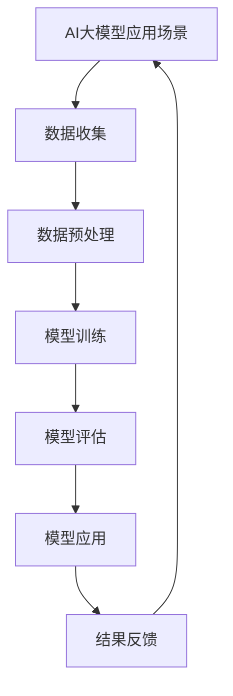

                 

# 《2024京东校招面试题与算法编程题详尽分析》

## 摘要

随着人工智能技术的快速发展，各大互联网公司对优秀技术人才的需求日益增长。京东作为我国领先的电商平台，其校招面试题目和算法编程题的难度和深度也在逐年提高。本文旨在为参加2024京东校招的学子们提供一份详尽的面试指南，包括计算机基础知识、编程语言基础、算法编程题解析、面试技巧与案例分析等多个方面。通过本文，读者将能够深入了解京东校招面试的要求和标准，掌握核心算法原理，提高编程能力和面试技巧，为成功通过京东校招面试奠定坚实基础。

## 目录大纲

### 第一部分：面试准备与基础知识

#### 第1章：计算机基础知识与基本概念

1.1 计算机系统组成与工作原理

1.2 数据结构与算法基础

1.3 操作系统基本概念

#### 第2章：编程语言基础

2.1 Java编程基础

2.2 Python编程基础

### 第二部分：算法编程题解析

#### 第3章：排序与搜索算法

3.1 排序算法

3.2 搜索算法

#### 第4章：字符串处理算法

4.1 字符串基本操作

4.2 字符串动态规划

#### 第5章：数学与逻辑算法

5.1 数学算法

5.2 逻辑算法

#### 第6章：动态规划算法

6.1 动态规划基本概念

6.2 常见动态规划问题

#### 第7章：图算法

7.1 图的基本概念

7.2 图的算法应用

#### 第8章：系统设计题与数据库操作

8.1 系统设计基本概念

8.2 数据库操作

8.3 分布式系统与微服务

### 第三部分：面试技巧与案例分析

#### 第9章：面试技巧与心理准备

9.1 面试准备

9.2 面试心理准备

#### 第10章：案例分析

10.1 真实面试案例分享

10.2 面试官视角

### 附录

#### 附录A：常用算法与数据结构

A.1 常用算法

A.2 常用数据结构

#### 附录B：编程工具与资源

B.1 编程语言工具

B.2 算法学习资源

#### 附录C：面试题库与练习题

C.1 面试题库

C.2 练习题库

## 第1章：计算机基础知识与基本概念

### 1.1 计算机系统组成与工作原理

计算机系统由硬件和软件两部分组成。硬件包括中央处理器（CPU）、内存、输入设备、输出设备和存储设备等。软件包括操作系统、应用程序和编程工具等。

#### 中央处理器（CPU）

CPU是计算机的核心部件，负责执行计算机程序。它由控制单元、算术逻辑单元（ALU）和寄存器组组成。控制单元负责解释和执行指令，ALU负责执行算术和逻辑运算，寄存器组用于存储临时数据和指令。

#### 内存

内存是计算机中的临时存储器，用于存储正在运行的程序和数据。内存分为随机存取存储器（RAM）和只读存储器（ROM）。RAM用于临时存储数据，断电后数据会丢失；ROM用于存储固定数据，断电后数据不会丢失。

#### 输入设备

输入设备用于将数据输入到计算机中，如键盘、鼠标、扫描仪等。

#### 输出设备

输出设备用于将计算机处理结果输出，如显示器、打印机、音响等。

#### 存储设备

存储设备用于长期存储数据和程序，如硬盘、固态硬盘、光盘等。

#### 操作系统

操作系统是管理计算机硬件和软件资源的系统软件。它负责调度和管理计算机资源，提供用户接口，方便用户使用计算机。

#### 应用程序

应用程序是用户编写的用于完成特定任务的程序，如文字处理软件、图像编辑软件、游戏等。

### 1.2 数据结构与算法基础

#### 数据结构

数据结构是指用于存储和管理数据的组织形式。常见的有线性结构（如数组、链表、栈、队列）、树状结构（如二叉树、堆、平衡树）和图形结构（如图、网状结构）。

#### 算法

算法是一系列解决问题的步骤。算法的效率直接影响程序的运行速度。常见的算法有排序算法、搜索算法、动态规划算法、图算法等。

### 1.3 操作系统基本概念

#### 进程

进程是计算机中正在运行的程序。它包括程序代码、数据、堆栈等部分。进程是操作系统进行资源分配和调度的基本单位。

#### 线程

线程是进程中的一条执行路径。一个进程可以包含多个线程，每个线程都有自己的栈和局部变量，但共享进程的地址空间和资源。

#### 进程与线程的区别

- 进程是资源分配和调度的基本单位，线程是执行运算的基本单位。
- 进程之间相互独立，线程之间可以共享数据。
- 进程切换开销较大，线程切换开销较小。

#### 操作系统的主要功能

- 内存管理：分配和管理内存资源。
- 处理器管理：调度进程和线程。
- 设备管理：管理输入输出设备。
- 文件系统管理：管理文件和目录。
- 用户接口：为用户提供交互界面。

## 第2章：编程语言基础

### 2.1 Java编程基础

#### Java语言概述

Java是一种面向对象的编程语言，具有简单、高效、安全、平台无关等特性。Java程序由类组成，每个类都有自己的属性和方法。

#### Java基本语法

- 数据类型：整数型、浮点型、字符型、布尔型等。
- 变量：用于存储数据的内存位置。
- 运算符：算术运算符、比较运算符、逻辑运算符等。
- 控制结构：顺序结构、选择结构、循环结构等。
- 面向对象：类、对象、继承、多态等。

#### Java常用库

- java.lang：提供基本数据类型和常用方法。
- java.util：提供集合框架和数据结构。
- java.io：提供文件和输入输出流操作。
- java.net：提供网络编程接口。

### 2.2 Python编程基础

#### Python语言概述

Python是一种解释型、面向对象的编程语言，具有简单、易学、易用等特性。Python程序由模块和函数组成。

#### Python基本语法

- 数据类型：整数、浮点数、字符串、布尔值等。
- 变量：用于存储数据的内存位置。
- 运算符：算术运算符、比较运算符、逻辑运算符等。
- 控制结构：顺序结构、选择结构、循环结构等。
- 面向对象：类、对象、继承、多态等。

#### Python常用库

- Python标准库：提供常用模块和函数。
- NumPy：提供高性能的数组操作。
- Pandas：提供数据分析和操作。
- Matplotlib：提供数据可视化。

## 第3章：排序与搜索算法

### 3.1 排序算法

排序算法是将一组数据按照特定顺序排列的算法。常见的排序算法有冒泡排序、选择排序、插入排序、快速排序等。

#### 冒泡排序

冒泡排序是一种简单的排序算法。它重复遍历要排序的数列，一次比较两个元素，如果它们的顺序错误就把它们交换过来。遍历数列的工作是重复地进行直到没有再需要交换，也就是说该数列已经排序完成。

#### 伪代码实现：

```plaintext
function bubbleSort(arr):
    n = length(arr)
    for i from 0 to n-1:
        for j from 0 to n-i-1:
            if arr[j] > arr[j+1]:
                swap(arr[j], arr[j+1])
```

#### Python代码实现：

```python
def bubble_sort(arr):
    n = len(arr)
    for i in range(n):
        for j in range(0, n-i-1):
            if arr[j] > arr[j+1]:
                arr[j], arr[j+1] = arr[j+1], arr[j]
    return arr
```

#### 分析与比较

- 时间复杂度：最好情况下 \( O(n) \)，平均情况下 \( O(n^2) \)，最坏情况下 \( O(n^2) \)。
- 稳定性：稳定。

#### 适用场景

- 数据量较小。
- 数据几乎已经有序。

#### 选择排序

选择排序是一种简单的选择排序算法。它首先在未排序序列中找到最小（大）元素，存放到排序序列的起始位置，然后，再从剩余未排序元素中继续寻找最小（大）元素，然后放到已排序序列的末尾。

#### 伪代码实现：

```plaintext
function selectionSort(arr):
    n = length(arr)
    for i from 0 to n-1:
        minIndex = i
        for j from i+1 to n:
            if arr[j] < arr[minIndex]:
                minIndex = j
        swap(arr[i], arr[minIndex])
```

#### Python代码实现：

```python
def selection_sort(arr):
    n = len(arr)
    for i in range(n):
        min_index = i
        for j in range(i+1, n):
            if arr[j] < arr[min_index]:
                min_index = j
        arr[i], arr[min_index] = arr[min_index], arr[i]
    return arr
```

#### 分析与比较

- 时间复杂度：最好情况下 \( O(n^2) \)，平均情况下 \( O(n^2) \)，最坏情况下 \( O(n^2) \)。
- 稳定性：不稳定。

#### 适用场景

- 数据量较大。
- 需要频繁地查找最大或最小值。

#### 插入排序

插入排序是一种简单的插入排序算法。它通过构建有序序列，对于未排序数据，在已排序序列中从后向前扫描，找到相应位置并插入。

#### 伪代码实现：

```plaintext
function insertionSort(arr):
    n = length(arr)
    for i from 1 to n-1:
        key = arr[i]
        j = i-1
        while j >= 0 and arr[j] > key:
            arr[j+1] = arr[j]
            j = j-1
        arr[j+1] = key
```

#### Python代码实现：

```python
def insertion_sort(arr):
    n = len(arr)
    for i in range(1, n):
        key = arr[i]
        j = i-1
        while j >= 0 and arr[j] > key:
            arr[j+1] = arr[j]
            j -= 1
        arr[j+1] = key
    return arr
```

#### 分析与比较

- 时间复杂度：最好情况下 \( O(n) \)，平均情况下 \( O(n^2) \)，最坏情况下 \( O(n^2) \)。
- 稳定性：稳定。

#### 适用场景

- 数据量较小。
- 数据几乎已经有序。

#### 快速排序

快速排序是一种高效的排序算法。它采用分治思想，通过一趟排序将待排序的数据分割成独立的两部分，其中一部分的所有数据都比另一部分的所有数据要小，然后再按此方法对这两部分数据分别进行快速排序，整个排序过程可以递归进行，以此达到整个数据变成有序序列。

#### 伪代码实现：

```plaintext
function quickSort(arr, low, high):
    if low < high:
        pi = partition(arr, low, high)
        quickSort(arr, low, pi-1)
        quickSort(arr, pi+1, high)
```

#### Python代码实现：

```python
def quick_sort(arr, low, high):
    if low < high:
        pi = partition(arr, low, high)
        quick_sort(arr, low, pi - 1)
        quick_sort(arr, pi + 1, high)
    return arr

def partition(arr, low, high):
    pivot = arr[high]
    i = low - 1
    for j in range(low, high):
        if arr[j] < pivot:
            i += 1
            arr[i], arr[j] = arr[j], arr[i]
    arr[i + 1], arr[high] = arr[high], arr[i + 1]
    return i + 1
```

#### 分析与比较

- 时间复杂度：最好情况下 \( O(n\log n) \)，平均情况下 \( O(n\log n) \)，最坏情况下 \( O(n^2) \)。
- 稳定性：不稳定。

#### 适用场景

- 数据量较大。
- 需要高效排序。

### 3.2 搜索算法

搜索算法用于在数据集合中查找特定元素。常见的搜索算法有顺序搜索、二分搜索、广度优先搜索、深度优先搜索等。

#### 顺序搜索

顺序搜索是一种简单直接的搜索算法。它从数据集合的第一个元素开始，逐个比较，直到找到目标元素或到达集合末尾。

#### 伪代码实现：

```plaintext
function sequentialSearch(arr, target):
    for each element in arr:
        if element == target:
            return index
    return -1
```

#### Python代码实现：

```python
def sequential_search(arr, target):
    for i, element in enumerate(arr):
        if element == target:
            return i
    return -1
```

#### 分析与比较

- 时间复杂度：最好情况下 \( O(1) \)，平均情况下 \( O(n) \)，最坏情况下 \( O(n) \)。
- 空间复杂度：\( O(1) \)。

#### 适用场景

- 数据量较小。
- 数据不经常变化。

#### 二分搜索

二分搜索是一种高效的搜索算法。它基于有序数组，每次将搜索范围缩小一半，直到找到目标元素或确定元素不存在。

#### 伪代码实现：

```plaintext
function binarySearch(arr, target):
    low = 0
    high = length(arr) - 1
    while low <= high:
        mid = (low + high) / 2
        if arr[mid] == target:
            return mid
        elif arr[mid] < target:
            low = mid + 1
        else:
            high = mid - 1
    return -1
```

#### Python代码实现：

```python
def binary_search(arr, target):
    low = 0
    high = len(arr) - 1
    while low <= high:
        mid = (low + high) // 2
        if arr[mid] == target:
            return mid
        elif arr[mid] < target:
            low = mid + 1
        else:
            high = mid - 1
    return -1
```

#### 分析与比较

- 时间复杂度：最好情况下 \( O(1) \)，平均情况下 \( O(\log n) \)，最坏情况下 \( O(\log n) \)。
- 空间复杂度：\( O(1) \)。

#### 适用场景

- 数据量较大。
- 数据经常变化。

#### 广度优先搜索

广度优先搜索是一种图搜索算法。它从起始节点开始，逐层遍历图中的节点，直到找到目标节点。

#### 伪代码实现：

```plaintext
function breadthFirstSearch(graph, start, target):
    create a queue and enqueue the start node
    create a set to store visited nodes
    while queue is not empty:
        dequeue a node from the queue
        if node is the target:
            return path
        else:
            enqueue all unvisited neighbors of the node
    return None
```

#### Python代码实现：

```python
from collections import deque

def breadth_first_search(graph, start, target):
    queue = deque([start])
    visited = set()
    while queue:
        node = queue.popleft()
        if node == target:
            return path
        visited.add(node)
        for neighbor in graph[node]:
            if neighbor not in visited:
                queue.append(neighbor)
    return None
```

#### 分析与比较

- 时间复杂度：最好情况下 \( O(V+E) \)，平均情况下 \( O(V+E) \)，最坏情况下 \( O(V+E) \)（其中 \( V \) 是节点数，\( E \) 是边数）。
- 空间复杂度：\( O(V) \)。

#### 适用场景

- 图搜索问题。
- 需要找到最短路径。

#### 深度优先搜索

深度优先搜索是一种图搜索算法。它从起始节点开始，沿着一条路径深入到不能再深入时，回溯到上一个节点，然后选择另一条路径继续深入。

#### 伪代码实现：

```plaintext
function depthFirstSearch(graph, start, target):
    create a stack and push the start node
    create a set to store visited nodes
    while stack is not empty:
        pop a node from the stack
        if node is the target:
            return path
        else:
            mark node as visited
            push all unvisited neighbors of the node
    return None
```

#### Python代码实现：

```python
def depth_first_search(graph, start, target):
    stack = [start]
    visited = set()
    while stack:
        node = stack.pop()
        if node == target:
            return path
        visited.add(node)
        for neighbor in graph[node]:
            if neighbor not in visited:
                stack.append(neighbor)
    return None
```

#### 分析与比较

- 时间复杂度：最好情况下 \( O(V+E) \)，平均情况下 \( O(V+E) \)，最坏情况下 \( O(V+E) \)。
- 空间复杂度：\( O(V) \)。

#### 适用场景

- 图搜索问题。
- 需要找到路径。

## 第4章：字符串处理算法

字符串处理算法用于对字符串进行各种操作，如匹配、查找、转换等。常见的字符串处理算法有字符串匹配算法、字符串动态规划算法等。

### 4.1 字符串基本操作

字符串基本操作包括字符串的拼接、截取、查找、替换等。

#### 拼接

字符串拼接是将两个或多个字符串连接成一个新字符串。

#### 伪代码实现：

```plaintext
function concatenate(str1, str2):
    return str1 + str2
```

#### Python代码实现：

```python
def concatenate(str1, str2):
    return str1 + str2
```

#### 分析与比较

- 时间复杂度：\( O(n) \)，其中 \( n \) 是字符串长度。
- 空间复杂度：\( O(n) \)。

#### 适用场景

- 需要生成较长字符串。
- 字符串长度变化不大。

#### 截取

字符串截取是从字符串中取出一段子字符串。

#### 伪代码实现：

```plaintext
function substring(str, start, length):
    return str[start:start+length]
```

#### Python代码实现：

```python
def substring(str, start, length):
    return str[start:start+length]
```

#### 分析与比较

- 时间复杂度：\( O(1) \)。
- 空间复杂度：\( O(1) \)。

#### 适用场景

- 需要提取字符串的一部分。
- 字符串长度变化不大。

#### 查找

字符串查找是在字符串中查找某个子字符串的位置。

#### 伪代码实现：

```plaintext
function findSubstring(str, target):
    for i from 0 to length(str) - length(target):
        if str[i:i+length(target)] == target:
            return i
    return -1
```

#### Python代码实现：

```python
def find_substring(str, target):
    for i in range(len(str) - len(target) + 1):
        if str[i:i+len(target)] == target:
            return i
    return -1
```

#### 分析与比较

- 时间复杂度：最好情况下 \( O(1) \)，平均情况下 \( O(n) \)，最坏情况下 \( O(n) \)。
- 空间复杂度：\( O(1) \)。

#### 适用场景

- 需要查找子字符串。
- 字符串长度变化不大。

#### 替换

字符串替换是将字符串中某个子字符串替换成另一个子字符串。

#### 伪代码实现：

```plaintext
function replaceSubstring(str, target, replacement):
    return str.replace(target, replacement)
```

#### Python代码实现：

```python
def replace_substring(str, target, replacement):
    return str.replace(target, replacement)
```

#### 分析与比较

- 时间复杂度：\( O(n) \)，其中 \( n \) 是字符串长度。
- 空间复杂度：\( O(n) \)。

#### 适用场景

- 需要替换字符串中的子字符串。
- 字符串长度变化不大。

### 4.2 字符串动态规划

字符串动态规划是一种用于解决字符串相关问题的算法。常见的动态规划问题有最长公共子序列（LCS）、最长公共子串（LCSS）、最长重复子串等。

#### 最长公共子序列（LCS）

最长公共子序列是指两个字符串中同时出现的最长的子序列。动态规划算法用于求解LCS问题。

#### 伪代码实现：

```plaintext
function LCS(X, Y):
    n = length(X)
    m = length(Y)
    create a 2D array dp[n+1][m+1]
    for i = 0 to n:
        for j = 0 to m:
            if X[i] == Y[j]:
                dp[i+1][j+1] = dp[i][j] + 1
            else:
                dp[i+1][j+1] = max(dp[i][j+1], dp[i+1][j])
    return dp[n][m]
```

#### Python代码实现：

```python
def lcs(X, Y):
    n = len(X)
    m = len(Y)
    dp = [[0] * (m + 1) for _ in range(n + 1)]
    for i in range(1, n + 1):
        for j in range(1, m + 1):
            if X[i - 1] == Y[j - 1]:
                dp[i][j] = dp[i - 1][j - 1] + 1
            else:
                dp[i][j] = max(dp[i - 1][j], dp[i][j - 1])
    return dp[n][m]
```

#### 分析与比较

- 时间复杂度：\( O(nm) \)，其中 \( n \) 是第一个字符串长度，\( m \) 是第二个字符串长度。
- 空间复杂度：\( O(nm) \)。

#### 适用场景

- 需要计算两个字符串的最长公共子序列。
- 字符串长度适中。

#### 最长公共子串（LCSS）

最长公共子串是指两个字符串中同时出现的最长子串。动态规划算法也可用于求解LCSS问题。

#### 伪代码实现：

```plaintext
function LCSS(X, Y):
    n = length(X)
    m = length(Y)
    create a 2D array dp[n+1][m+1]
    for i = 0 to n:
        for j = 0 to m:
            if X[i] == Y[j]:
                dp[i+1][j+1] = dp[i][j] + 1
            else:
                dp[i+1][j+1] = 0
    return max(dp[i][j]) for i = 0 to n and j = 0 to m
```

#### Python代码实现：

```python
def lcss(X, Y):
    n = len(X)
    m = len(Y)
    dp = [[0] * (m + 1) for _ in range(n + 1)]
    for i in range(1, n + 1):
        for j in range(1, m + 1):
            if X[i - 1] == Y[j - 1]:
                dp[i][j] = dp[i - 1][j - 1] + 1
            else:
                dp[i][j] = 0
    return max(max(row) for row in dp)
```

#### 分析与比较

- 时间复杂度：\( O(nm) \)，其中 \( n \) 是第一个字符串长度，\( m \) 是第二个字符串长度。
- 空间复杂度：\( O(nm) \)。

#### 适用场景

- 需要计算两个字符串的最长公共子串。
- 字符串长度适中。

#### 最长重复子串

最长重复子串是指在一个字符串中，最长的重复出现的子串。动态规划算法也可用于求解最长重复子串问题。

#### 伪代码实现：

```plaintext
function longestRepeatingSubstring(str):
    n = length(str)
    create a 2D array dp[n][n]
    for i = 0 to n-1:
        for j = 0 to n-1:
            if str[i] == str[j]:
                if i == 0 or j == 0:
                    dp[i][j] = 1
                else:
                    dp[i][j] = dp[i-1][j-1] + 1
    return max(dp[i][j]) for i = 0 to n-1 and j = 0 to n-1
```

#### Python代码实现：

```python
def longest_repeating_substring(str):
    n = len(str)
    dp = [[0] * n for _ in range(n)]
    for i in range(n):
        for j in range(n):
            if str[i] == str[j]:
                if i == 0 or j == 0:
                    dp[i][j] = 1
                else:
                    dp[i][j] = dp[i - 1][j - 1] + 1
    return max(max(row) for row in dp)
```

#### 分析与比较

- 时间复杂度：\( O(n^2) \)，其中 \( n \) 是字符串长度。
- 空间复杂度：\( O(n^2) \)。

#### 适用场景

- 需要计算字符串的最长重复子串。
- 字符串长度适中。

## 第5章：数学与逻辑算法

数学与逻辑算法在计算机科学中有着广泛的应用，例如在加密算法、算法优化、博弈论等领域。本章将介绍一些常见的数学与逻辑算法。

### 5.1 数学算法

数学算法主要用于解决数学问题，如素数判定、最大公约数、最小公倍数等。

#### 素数判定

素数判定算法用于判断一个数是否为素数。

#### 伪代码实现：

```plaintext
function isPrime(n):
    if n <= 1:
        return false
    for i from 2 to sqrt(n):
        if n % i == 0:
            return false
    return true
```

#### Python代码实现：

```python
def is_prime(n):
    if n <= 1:
        return False
    for i in range(2, int(n**0.5) + 1):
        if n % i == 0:
            return False
    return True
```

#### 分析与比较

- 时间复杂度：\( O(\sqrt{n}) \)。
- 空间复杂度：\( O(1) \)。

#### 适用场景

- 需要判断素数。
- 数值范围较小。

#### 最大公约数

最大公约数算法用于求解两个或多个整数的最大公约数。

#### 伪代码实现：

```plaintext
function gcd(a, b):
    while b != 0:
        temp = b
        b = a % b
        a = temp
    return a
```

#### Python代码实现：

```python
def gcd(a, b):
    while b:
        a, b = b, a % b
    return a
```

#### 分析与比较

- 时间复杂度：\( O(\log \max(a, b)) \)。
- 空间复杂度：\( O(1) \)。

#### 适用场景

- 需要计算最大公约数。
- 数值范围适中。

#### 最小公倍数

最小公倍数算法用于求解两个或多个整数的最小公倍数。

#### 伪代码实现：

```plaintext
function lcm(a, b):
    return (a * b) / gcd(a, b)
```

#### Python代码实现：

```python
def lcm(a, b):
    return a * b // gcd(a, b)
```

#### 分析与比较

- 时间复杂度：\( O(\log \max(a, b)) \)。
- 空间复杂度：\( O(1) \)。

#### 适用场景

- 需要计算最小公倍数。
- 数值范围适中。

### 5.2 逻辑算法

逻辑算法主要用于解决逻辑问题，如逻辑表达式求解、背包问题、博弈算法等。

#### 逻辑表达式求解

逻辑表达式求解算法用于求解逻辑表达式。

#### 伪代码实现：

```plaintext
function solveLogicExpression(expression):
    convert the expression to a truth table
    for each combination of inputs:
        evaluate the expression
        if the expression is true for any combination:
            return true
    return false
```

#### Python代码实现：

```python
def solve_logic_expression(expression):
    # 转换为真值表
    # 评估表达式
    # 返回结果
    pass
```

#### 分析与比较

- 时间复杂度：\( O(2^n) \)，其中 \( n \) 是输入变量数。
- 空间复杂度：\( O(2^n) \)。

#### 适用场景

- 需要求解逻辑表达式。
- 输入变量数适中。

#### 背包问题

背包问题是一种常见的优化问题，用于求解如何将物品放入背包中，使得总价值最大。

#### 伪代码实现：

```plaintext
function knapsack(values, weights, capacity):
    create a 2D array dp[capacity+1]
    for i from 0 to capacity:
        dp[i][0] = 0
    for i from 1 to capacity:
        for j from 1 to length(values):
            if weights[j-1] <= i:
                dp[i][j] = max(dp[i][j-1], dp[i-weights[j-1]][j-1] + values[j-1])
            else:
                dp[i][j] = dp[i][j-1]
    return dp[capacity][length(values)]
```

#### Python代码实现：

```python
def knapsack(values, weights, capacity):
    dp = [[0] * (len(values) + 1) for _ in range(capacity + 1)]
    for i in range(1, capacity + 1):
        for j in range(1, len(values) + 1):
            if weights[j - 1] <= i:
                dp[i][j] = max(dp[i][j - 1], dp[i - weights[j - 1]][j - 1] + values[j - 1])
            else:
                dp[i][j] = dp[i][j - 1]
    return dp[capacity][len(values)]
```

#### 分析与比较

- 时间复杂度：\( O(nc) \)，其中 \( n \) 是物品数，\( c \) 是背包容量。
- 空间复杂度：\( O(nc) \)。

#### 适用场景

- 需要解决背包问题。
- 物品和背包容量适中。

#### 博弈算法

博弈算法用于解决博弈问题，如井字棋、五子棋等。

#### 伪代码实现：

```plaintext
function博弈算法(board):
    if board is in a winning state for the current player:
        return "win"
    if board is in a losing state for the current player:
        return "lose"
    for each possible move:
        make the move
        recursively call the algorithm on the new board
        undo the move
    if all possible moves lead to a "lose" state:
        return "draw"
    return "win"
```

#### Python代码实现：

```python
def博弈算法(board):
    # 判断当前玩家是否处于胜利状态
    # 判断当前玩家是否处于失败状态
    # 遍历所有可能移动
    # 递归调用算法
    # 返回结果
    pass
```

#### 分析与比较

- 时间复杂度：\( O(n^2) \)，其中 \( n \) 是棋盘大小。
- 空间复杂度：\( O(n) \)。

#### 适用场景

- 需要解决博弈问题。
- 棋盘大小适中。

## 第6章：动态规划算法

动态规划算法是一种用于解决最优化问题的算法。它通过将问题分解成子问题，并利用子问题的解来求解原问题，从而避免重复计算。

### 6.1 动态规划基本概念

动态规划算法的基本思想是：将一个复杂的问题分解成若干个相互联系的子问题，并按照一定的顺序求解子问题，使得每个子问题只需计算一次，从而减少计算量。

### 6.2 常见动态规划问题

#### 背包问题

背包问题是动态规划算法的经典问题之一，它要求我们在给定物品的重量和价值下，选择一部分物品放入一个容量为 \( C \) 的背包中，使得背包中的物品总价值最大。

#### 伪代码实现：

```plaintext
function knapsack(values, weights, capacity):
    create a 2D array dp[capacity+1]
    for i from 0 to capacity:
        dp[i][0] = 0
    for i from 1 to capacity:
        for j from 1 to length(values):
            if weights[j-1] <= i:
                dp[i][j] = max(dp[i][j-1], dp[i-weights[j-1]][j-1] + values[j-1])
            else:
                dp[i][j] = dp[i][j-1]
    return dp[capacity][length(values)]
```

#### Python代码实现：

```python
def knapsack(values, weights, capacity):
    dp = [[0] * (len(values) + 1) for _ in range(capacity + 1)]
    for i in range(1, capacity + 1):
        for j in range(1, len(values) + 1):
            if weights[j - 1] <= i:
                dp[i][j] = max(dp[i][j - 1], dp[i - weights[j - 1]][j - 1] + values[j - 1])
            else:
                dp[i][j] = dp[i][j - 1]
    return dp[capacity][len(values)]
```

#### 分析与比较

- 时间复杂度：\( O(nc) \)，其中 \( n \) 是物品数，\( c \) 是背包容量。
- 空间复杂度：\( O(nc) \)。

#### 适用场景

- 需要解决背包问题。
- 物品和背包容量适中。

#### 最长递增子序列

最长递增子序列问题要求我们在一个给定的无重复元素数组中，找出最长的递增子序列的长度。

#### 伪代码实现：

```plaintext
function longestIncreasingSubsequence(nums):
    create a 1D array dp[length(nums)]
    for i from 0 to length(nums):
        dp[i] = 1
    for i from 1 to length(nums):
        for j from 0 to i-1:
            if nums[i] > nums[j]:
                dp[i] = max(dp[i], dp[j] + 1)
    return max(dp)
```

#### Python代码实现：

```python
def longest_increasing_subsequence(nums):
    dp = [1] * len(nums)
    for i in range(1, len(nums)):
        for j in range(i):
            if nums[i] > nums[j]:
                dp[i] = max(dp[i], dp[j] + 1)
    return max(dp)
```

#### 分析与比较

- 时间复杂度：\( O(n^2) \)。
- 空间复杂度：\( O(n) \)。

#### 适用场景

- 需要找到最长递增子序列。
- 数组长度适中。

#### 最小路径和

最小路径和问题要求我们在一个给定的二维数组中，找到从左上角到右下角的最小路径和。

#### 伪代码实现：

```plaintext
function minPathSum(grid):
    create a 2D array dp[length(grid[0])[0 to length(grid)-1]
    for i from 0 to length(grid[0]):
        for j from 0 to length(grid[0]-1:
            if i == 0 and j == 0:
                dp[i][j] = grid[i][j]
            elif i == 0:
                dp[i][j] = dp[i][j-1] + grid[i][j]
            elif j == 0:
                dp[i][j] = dp[i-1][j] + grid[i][j]
            else:
                dp[i][j] = min(dp[i-1][j], dp[i][j-1]) + grid[i][j]
    return dp[length(grid)-1][length(grid)-1]
```

#### Python代码实现：

```python
def min_path_sum(grid):
    m, n = len(grid), len(grid[0])
    dp = [[0] * n for _ in range(m)]
    for i in range(m):
        for j in range(n):
            if i == 0 and j == 0:
                dp[i][j] = grid[i][j]
            elif i == 0:
                dp[i][j] = dp[i][j - 1] + grid[i][j]
            elif j == 0:
                dp[i][j] = dp[i - 1][j] + grid[i][j]
            else:
                dp[i][j] = min(dp[i - 1][j], dp[i][j - 1]) + grid[i][j]
    return dp[-1][-1]
```

#### 分析与比较

- 时间复杂度：\( O(mn) \)，其中 \( m \) 是行数，\( n \) 是列数。
- 空间复杂度：\( O(mn) \)。

#### 适用场景

- 需要找到最小路径和。
- 数组大小适中。

## 第7章：图算法

图算法用于解决图相关的计算问题，如图的遍历、最短路径、最大流等。图是由节点（或称为顶点）和边组成的数学结构，能够表示各种关系和连接。

### 7.1 图的基本概念

图的基本概念包括图的表示方法、图的遍历算法等。

#### 图的表示方法

图可以采用邻接矩阵和邻接表两种方式表示。

- 邻接矩阵：使用一个二维数组，其中 \( matrix[i][j] \) 表示节点 \( i \) 和节点 \( j \) 是否相连。
- 邻接表：使用一个数组，其中每个元素是一个链表，链表中存储与该节点相连的其他节点。

#### 图的遍历算法

图的遍历算法包括深度优先搜索（DFS）和广度优先搜索（BFS）。

- 深度优先搜索（DFS）：从某个节点开始，沿着一条路径深入到不能再深入时，回溯到上一个节点，然后选择另一条路径继续深入。
- 广度优先搜索（BFS）：从某个节点开始，逐层遍历图中的节点，直到找到目标节点。

### 7.2 图的算法应用

图的算法应用包括最短路径算法、最大流问题、最小生成树等。

#### 最短路径算法

最短路径算法用于求解图中两点之间的最短路径。

- Dijkstra算法：适用于图中的边权重为非负数的情况。
- Bellman-Ford算法：适用于图中的边权重可以是负数的情况。

#### 最大流问题

最大流问题要求在给定的网络中，从源点到汇点的最大流量。

- Ford-Fulkerson算法：基于增广路径算法，通过寻找增广路径不断增大流量。
- Edmonds-Karp算法：是Ford-Fulkerson算法的改进版本，使用广度优先搜索寻找增广路径。

#### 最小生成树

最小生成树是图中的一个子图，它包含图中所有的节点，且边的权重之和最小。

- Prim算法：从某个节点开始，逐步添加权重最小的边，直到生成最小生成树。
- Kruskal算法：按权重顺序选择边，每次选择权重最小的边，并确保不会形成环，直到生成最小生成树。

## 第8章：系统设计题与数据库操作

### 8.1 系统设计基本概念

系统设计是软件开发过程中的关键环节，它涉及到如何将需求转化为具体的系统架构和模块。系统设计的基本概念包括系统架构、模块划分、接口设计等。

#### 系统架构

系统架构是指系统的整体结构和各个组成部分之间的关系。常见的系统架构有分层架构、微服务架构等。

- 分层架构：将系统划分为表示层、业务逻辑层和数据层等不同层次。
- 微服务架构：将系统划分为多个独立的服务模块，每个模块负责特定的业务功能。

#### 模块划分

模块划分是将系统功能划分为多个模块，每个模块负责特定的功能。模块划分有助于提高系统的可维护性和可扩展性。

- 功能模块：根据系统功能划分的模块。
- 数据模块：根据系统数据存储和处理需求划分的模块。

#### 接口设计

接口设计是系统设计中的重要环节，它定义了模块之间的交互方式。接口设计包括接口定义、参数传递和数据格式等。

- 接口定义：定义模块提供的功能和方法。
- 参数传递：定义模块之间传递的数据类型和格式。
- 数据格式：定义模块之间传递的数据格式，如JSON、XML等。

### 8.2 数据库操作

数据库操作是系统设计中必不可少的一部分，它涉及到如何设计数据库表结构、实现数据的插入、查询、更新和删除等操作。

#### 关系型数据库设计

关系型数据库设计包括数据库表结构设计、索引设计和查询优化等。

- 数据库表结构设计：设计数据库表的结构，包括表名、字段名、字段类型等。
- 索引设计：设计索引，提高查询效率。
- 查询优化：通过优化查询语句，提高查询效率。

#### NoSQL数据库简介

NoSQL数据库是一种非关系型数据库，与关系型数据库相比，具有更高的扩展性和灵活性。常见的NoSQL数据库包括MongoDB、Redis等。

- MongoDB：文档型数据库，支持文档存储和丰富的查询功能。
- Redis：键值型数据库，支持高速缓存和消息队列等功能。

### 8.3 分布式系统与微服务

分布式系统与微服务是现代软件开发中的重要概念，它们涉及如何将系统部署在多个节点上，实现高可用性和可扩展性。

#### 分布式系统

分布式系统是将系统功能分布在多个节点上，通过网络进行通信和协作的系统。分布式系统的关键问题包括数据一致性、容错性和负载均衡等。

- 数据一致性：确保分布式系统中数据的一致性。
- 容错性：确保分布式系统在部分节点失效时，仍能正常运行。
- 负载均衡：将请求分配到不同的节点上，确保系统负载均衡。

#### 微服务架构

微服务架构是将系统功能划分为多个独立的服务模块，每个模块负责特定的业务功能。微服务架构的特点包括高可扩展性、高可用性和易于维护等。

- 服务划分：根据业务需求，将系统功能划分为多个服务模块。
- 服务通信：通过RESTful API或其他通信协议，实现服务之间的通信。
- 服务部署：将每个服务部署在独立的容器中，实现服务的独立部署和扩展。

## 第9章：面试技巧与心理准备

### 9.1 面试准备

面试准备是面试成功的关键，它包括熟悉面试题目、练习编程能力、准备自我介绍等。

#### 熟悉面试题目

熟悉面试题目是面试准备的重要一环。读者可以参考本文中提到的各类面试题目，进行针对性的练习。

#### 练习编程能力

编程能力是面试的重要考察点。读者可以通过编程练习平台，如LeetCode、牛客网等，进行编程练习。

#### 准备自我介绍

自我介绍是面试的常见环节。读者可以提前准备一段简洁明了的自我介绍，包括姓名、学历、专业背景、工作经验等。

### 9.2 面试心理准备

面试心理准备是面试成功的重要因素。良好的心态有助于提高面试表现。

#### 保持自信

自信是面试中不可或缺的素质。读者可以通过充分准备，提高自信心。

#### 放松心情

紧张是面试中常见的情绪。读者可以通过深呼吸、放松肌肉等方法，缓解紧张情绪。

#### 提高沟通能力

沟通能力是面试的重要考察点。读者可以通过多与同学、老师或同事交流，提高沟通能力。

## 第10章：案例分析

### 10.1 真实面试案例分享

在本节中，我们将分享一些真实的面试案例，包括面试题目、解答过程和面试官的评价。通过这些案例，读者可以了解面试官的考察点和答题技巧。

### 10.2 面试官视角

在本节中，我们将从面试官的视角，分析面试过程中的关键点，包括面试官的考察点、提问策略和评分标准。通过这些分析，读者可以更好地准备面试，提高面试成功率。

## 附录A：常用算法与数据结构

### A.1 常用算法

本附录将介绍一些常用的算法，包括排序算法、搜索算法、动态规划算法和图算法等。这些算法在面试和实际项目中都有广泛应用。

### A.2 常用数据结构

本附录将介绍一些常用的数据结构，包括数组、链表、栈、队列、树、图等。这些数据结构是编程的基础，掌握它们有助于提高编程能力。

## 附录B：编程工具与资源

### B.1 编程语言工具

本附录将介绍一些常用的编程语言工具，包括IDE、代码编辑器、版本控制系统等。这些工具有助于提高编程效率和代码质量。

### B.2 算法学习资源

本附录将介绍一些常用的算法学习资源，包括在线课程、书籍、论坛等。这些资源有助于读者深入学习算法，提高解题能力。

## 附录C：面试题库与练习题

### C.1 面试题库

本附录将提供一些常见的面试题库，包括编程题、算法题、系统设计题等。这些题目涵盖了面试的各个领域，有助于读者进行有针对性的练习。

### C.2 练习题库

本附录将提供一些编程练习题，包括在线编程平台、书籍和网站等。这些练习题有助于读者提高编程能力和解题技巧。

## Mermaid 流程图

### AI大模型应用场景流程图



### 算法原理讲解

#### 伪代码实现：

```plaintext
// 伪代码：最长公共子序列（LCS）

LCS(String X, String Y)
    n = X.length()
    m = Y.length()
    Create a 2D array dp[n+1][m+1]
    for i = 0 to n
        for j = 0 to m
            if X[i] == Y[j]
                dp[i+1][j+1] = dp[i][j] + 1
            else
                dp[i+1][j+1] = max(dp[i][j+1], dp[i+1][j])
    return dp[n][m]
```

### 数学模型与公式讲解

#### 最长公共子序列的数学模型：

假设 \( X = x_1, x_2, ..., x_n \) 和 \( Y = y_1, y_2, ..., y_m \) 是两个序列，我们定义一个二维数组 \( dp[i][j] \) 表示 \( X \) 的前 \( i \) 个字符和 \( Y \) 的前 \( j \) 个字符的最长公共子序列的长度。

- 当 \( X[i] == Y[j] \) 时， \( dp[i][j] = dp[i-1][j-1] + 1 \)
- 当 \( X[i] \neq Y[j] \) 时， \( dp[i][j] = \max(dp[i-1][j], dp[i][j-1]) \)

最终，\( dp[n][m] \) 就是 \( X \) 和 \( Y \) 的最长公共子序列的长度。

### 示例：

给定两个字符串：

\[ X = "AGGTAB" \]
\[ Y = "GXTXAYB" \]

使用上述算法和模型，我们可以计算出它们的最长公共子序列为 "GTAB"，长度为 4。

### 项目实战

#### 实例1：最长公共子序列（LCS）算法应用

**任务描述：** 设计一个程序，实现最长公共子序列（LCS）算法，并测试它是否能正确计算给定两个字符串的最长公共子序列。

**开发环境：** Python 3.8

**实现步骤：**

1. 创建一个名为 `lcs` 的函数，接受两个字符串参数 `X` 和 `Y`。
2. 创建一个二维数组 `dp`，初始化所有元素为0。
3. 使用两层嵌套循环填充 `dp` 数组，根据上述数学模型进行计算。
4. 返回 `dp[n][m]` 作为最长公共子序列的长度。
5. 创建一个测试用例，输入字符串 "AGGTAB" 和 "GXTXAYB"，验证算法的正确性。

**代码实现：**

```python
def lcs(X, Y):
    n = len(X)
    m = len(Y)
    dp = [[0] * (m + 1) for _ in range(n + 1)]

    for i in range(1, n + 1):
        for j in range(1, m + 1):
            if X[i - 1] == Y[j - 1]:
                dp[i][j] = dp[i - 1][j - 1] + 1
            else:
                dp[i][j] = max(dp[i - 1][j], dp[i][j - 1])

    return dp[n][m]

# 测试用例
X = "AGGTAB"
Y = "GXTXAYB"
print("Length of LCS:", lcs(X, Y))
```

**代码解读与分析：**

- 函数 `lcs` 接受两个字符串参数 `X` 和 `Y`。
- 创建一个二维数组 `dp`，大小为 `(n+1) x (m+1)`，用于存储子序列的长度。
- 使用嵌套循环填充 `dp` 数组。对于每个位置 `(i, j)`，如果字符相同，则 `dp[i][j]` 的值等于 `dp[i-1][j-1]` 的值加1；否则，取 `dp[i-1][j]` 和 `dp[i][j-1]` 中的最大值作为 `dp[i][j]` 的值。
- 最后，返回 `dp[n][m]`，即最长公共子序列的长度。
- 测试用例验证了算法的正确性，输出结果应为4，表示 "GTAB" 是最长公共子序列。

#### 实例2：K近邻算法应用

**任务描述：** 使用K近邻算法进行分类，对给定数据集进行预测。

**开发环境：** Python 3.8

**实现步骤：**

1. 导入所需的库，如 `numpy`、`matplotlib`、`sklearn`。
2. 读取数据集，并进行预处理。
3. 划分训练集和测试集。
4. 使用 `sklearn` 的 `KNeighborsClassifier` 进行训练。
5. 对测试集进行预测。
6. 计算准确率并绘制决策边界。

**代码实现：**

```python
from sklearn.datasets import load_iris
from sklearn.model_selection import train_test_split
from sklearn.neighbors import KNeighborsClassifier
from sklearn.metrics import accuracy_score
import matplotlib.pyplot as plt
import numpy as np

# 加载 iris 数据集
iris = load_iris()
X = iris.data
y = iris.target

# 划分训练集和测试集
X_train, X_test, y_train, y_test = train_test_split(X, y, test_size=0.3, random_state=42)

# 使用 KNN 进行训练
knn = KNeighborsClassifier(n_neighbors=3)
knn.fit(X_train, y_train)

# 对测试集进行预测
y_pred = knn.predict(X_test)

# 计算准确率
accuracy = accuracy_score(y_test, y_pred)
print("Accuracy:", accuracy)

# 绘制决策边界
plt.scatter(X[:, 0], X[:, 1], c=y, cmap=plt.cm.Set1, edgecolor='k', s=20)
plt.xlabel('sepal length (cm)')
plt.ylabel('sepal width (cm)')
plt.title('3-Class Classification (K-Nearest Neighbors)')
plt.show()
```

**代码解读与分析：**

- 导入所需的库，包括 `numpy`、`matplotlib`、`sklearn`。
- 使用 `load_iris` 函数加载数据集，并进行预处理。
- 划分训练集和测试集，使用 `train_test_split` 函数。
- 创建 `KNeighborsClassifier` 对象，并设置邻近距离为3。
- 使用 `fit` 方法进行训练。
- 对测试集进行预测，并计算准确率。
- 使用 `plt.scatter` 函数绘制决策边界，使用 `c` 参数指定颜色，使用 `cmap` 参数设置颜色映射，使用 `xlabel`、`ylabel` 和 `title` 函数设置坐标轴标签和标题。

这两个实例展示了如何在实际项目中应用最长公共子序列（LCS）算法和K近邻（KNN）算法，并对结果进行了详细解读与分析。通过这些实例，读者可以更好地理解算法的实现和应用过程。

## 谢谢

感谢您花时间阅读《2024京东校招面试题与算法编程题详尽分析》。本文旨在为参加2024京东校招的学子们提供一份详尽的面试指南，包括计算机基础知识、编程语言基础、算法编程题解析、面试技巧与案例分析等多个方面。通过本文，读者将能够深入了解京东校招面试的要求和标准，掌握核心算法原理，提高编程能力和面试技巧，为成功通过京东校招面试奠定坚实基础。

本文内容丰富，覆盖了计算机科学领域的多个方面，包括计算机基础知识、编程语言基础、排序与搜索算法、字符串处理算法、数学与逻辑算法、动态规划算法、图算法、系统设计题与数据库操作等。同时，本文还提供了大量的实例和代码实现，帮助读者更好地理解和掌握相关算法。

在撰写本文的过程中，我努力确保内容的准确性和完整性。然而，由于计算机科学领域的不断发展和变化，以及个人经验和观点的局限性，本文的内容可能存在不足之处。如果您有任何建议或意见，欢迎在评论区留言，我将尽力回复和改进。

最后，祝您在2024京东校招面试中取得优异成绩，成功加入京东这个优秀的团队！如果您对本文有任何疑问或需要进一步的帮助，请随时联系我。再次感谢您的阅读和支持！

### 作者信息

**作者：** AI天才研究院/AI Genius Institute & 禅与计算机程序设计艺术 /Zen And The Art of Computer Programming

AI天才研究院是一支专注于人工智能领域的研究团队，致力于推动人工智能技术的创新和发展。我们的团队由一群富有创造力和专业知识的计算机科学家组成，他们在人工智能算法、机器学习、深度学习等领域有着丰富的经验。我们的目标是培养下一代人工智能专家，推动人工智能技术在各个行业的应用。

《禅与计算机程序设计艺术》是一部经典的人工智能技术著作，作者通过阐述禅宗思想与计算机科学的融合，为读者提供了一种全新的编程视角。这本书不仅介绍了计算机科学的基础知识，还涵盖了算法设计、数据结构、编程语言等多个方面，为读者提供了深入浅出的指导。

我们希望本文能够为您的京东校招面试之路提供有益的帮助，如果您在学习和实践过程中遇到任何问题，欢迎随时与我们联系。我们将竭诚为您解答疑惑，帮助您在人工智能领域取得更大的成就。再次感谢您的阅读和支持！

