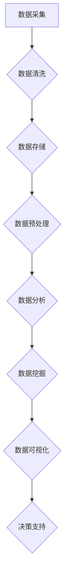

                 

# 《人工智能创业数据管理的最佳经验》

## 关键词
人工智能，创业，数据管理，数据采集，数据处理，数据存储，数据分析，数据挖掘，数据可视化。

## 摘要
本文旨在为人工智能创业项目提供数据管理的最佳实践经验。文章首先介绍了人工智能创业的背景和趋势，然后深入探讨了数据驱动决策、数据质量管理、数据安全与隐私保护等核心概念。接着，文章详细阐述了数据采集与预处理、数据存储与管理、数据分析与挖掘等关键环节的技术与实践。此外，本文还介绍了人工智能在数据管理中的应用，以及创业项目中的数据管理实践。最后，文章对数据管理的发展趋势和人才发展路径进行了展望。

### 第一部分：人工智能与创业概述

## 第1章：人工智能的创业机遇

### 1.1 人工智能创业的背景

在过去的几十年中，人工智能技术经历了从理论研究到实际应用的巨大转变。随着计算能力的提升、大数据的积累和算法的创新，人工智能逐渐成为各行各业的重要驱动力。从早期的专家系统到现代的深度学习，人工智能技术不断突破，为各行各业带来了巨大的变革。

### 1.2 人工智能创业的趋势

人工智能创业正在成为一个热门领域。根据市场研究公司Statista的数据，全球人工智能市场规模预计将从2019年的321亿美元增长到2027年的1193亿美元，年复合增长率为24.7%。这一趋势体现在多个方面：

1. **技术创新**：随着神经网络、生成对抗网络等先进算法的提出，人工智能技术在图像识别、自然语言处理、语音识别等领域取得了显著突破。
2. **应用场景扩展**：人工智能技术正在从传统的金融、医疗等领域向教育、零售、物流等行业扩展，推动各行各业的数字化转型。
3. **资本投入**：风险投资和私募股权基金对人工智能初创企业的投资不断增长，为创业公司提供了充足的资金支持。

### 1.3 人工智能创业的挑战与风险

尽管人工智能创业具有巨大的潜力，但同时也面临着诸多挑战和风险：

1. **技术难度**：人工智能技术的复杂性使得创业公司需要高水平的技术团队，这对初创企业来说是一个巨大的挑战。
2. **数据隐私**：人工智能系统的训练和优化依赖于大量数据，如何确保数据的安全和隐私成为了一个重要问题。
3. **市场接受度**：尽管人工智能技术日益成熟，但市场接受度仍然是一个挑战，尤其是在传统行业。
4. **法律法规**：人工智能技术的发展也带来了新的法律和伦理问题，如算法偏见、自动化决策等。

### 第2章：创业者的数据管理思维

数据是人工智能创业的核心资产。创业者需要具备良好的数据管理思维，以便有效地利用数据创造价值。

#### 2.1 数据驱动决策

数据驱动决策是创业者成功的关键。通过收集和分析数据，创业者可以了解市场趋势、用户需求和业务绩效，从而做出更加明智的决策。例如，通过分析用户数据，创业者可以优化产品功能，提高用户满意度；通过分析市场数据，创业者可以制定更有效的营销策略。

#### 2.2 数据质量管理

数据质量管理是数据驱动决策的基础。高质量的数据可以确保分析结果的准确性和可靠性。创业者需要关注数据源、数据清洗和数据整合等环节，确保数据的完整性和一致性。例如，创业者可以使用数据清洗工具来去除重复数据、纠正错误数据，并整合来自不同渠道的数据。

#### 2.3 数据安全与隐私保护

随着数据量的增加，数据安全与隐私保护成为了一个重要议题。创业者需要采取有效的措施来保护数据免受泄露、篡改和滥用。例如，创业者可以使用加密技术来保护敏感数据，并制定严格的数据访问控制策略。此外，创业者还需要遵守相关的法律法规，如《通用数据保护条例》（GDPR）等。

### 第二部分：数据管理技术与实践

#### 第3章：数据采集与预处理

数据采集是数据管理的重要环节。创业者需要确定合适的数据源，并确保数据的质量和可靠性。

##### 3.1 数据采集渠道

数据采集渠道多种多样，包括内部数据库、第三方数据服务、传感器、社交媒体等。创业者需要根据业务需求选择合适的数据源。例如，如果是一家电子商务公司，可以使用社交媒体平台收集用户反馈和购物行为数据；如果是一家医疗科技公司，可以使用电子病历系统收集患者数据。

##### 3.2 数据清洗与转换

数据清洗是确保数据质量的关键步骤。创业者需要使用数据清洗工具来去除重复数据、纠正错误数据，并处理缺失值。数据清洗后，创业者还需要进行数据转换，将数据转换为适合分析的格式。例如，将文本数据转换为结构化数据，或将不同数据源的数据整合为一个统一的数据集。

##### 3.3 数据预处理策略

数据预处理策略包括数据清洗、数据转换和数据集成等。创业者需要根据具体业务需求设计合适的预处理策略。例如，对于图像识别任务，创业者需要将图像数据调整为统一的大小和格式；对于文本分析任务，创业者需要使用自然语言处理技术对文本数据进行预处理。

#### 第4章：数据存储与管理

数据存储与管理是数据管理的关键环节。创业者需要选择合适的数据存储方案，并确保数据的安全和可扩展性。

##### 4.1 数据库选择与设计

数据库是数据存储的核心。创业者需要根据业务需求选择合适的数据库。关系型数据库适用于结构化数据，如用户信息、订单数据等；非关系型数据库适用于半结构化或非结构化数据，如社交媒体数据、传感器数据等。创业者还需要设计合理的数据库结构，确保数据的完整性和一致性。

##### 4.2 数据仓库与数据湖

数据仓库和数据湖是大数据处理的重要工具。数据仓库用于存储和管理结构化数据，支持复杂的查询和分析；数据湖用于存储和管理海量数据，包括结构化、半结构化和非结构化数据。创业者可以根据业务需求选择合适的数据仓库或数据湖解决方案。

##### 4.3 数据管理与维护

数据管理与维护是确保数据质量的重要环节。创业者需要制定数据管理策略，包括数据备份、数据恢复和数据安全等。此外，创业者还需要定期检查数据质量，确保数据的准确性、完整性和一致性。

#### 第5章：数据分析与挖掘

数据分析与挖掘是数据管理的核心任务。创业者可以通过数据分析与挖掘发现数据中的隐藏信息，为决策提供支持。

##### 5.1 数据分析工具与技术

数据分析工具包括Python、R、Tableau等。创业者需要根据业务需求选择合适的工具。Python和R适合进行复杂的数据分析和建模；Tableau适合进行数据可视化。

##### 5.2 数据挖掘方法与实践

数据挖掘方法包括分类、聚类、关联规则挖掘等。创业者可以根据业务需求选择合适的方法。例如，分类方法可以用于预测用户行为；聚类方法可以用于发现数据中的相似群体。

##### 5.3 数据可视化与应用

数据可视化是将数据转化为图形或图表的过程，有助于发现数据中的规律和趋势。创业者可以使用数据可视化工具，如D3.js、Plotly等，将数据分析结果以直观的方式呈现给决策者。

#### 第6章：人工智能在数据管理中的应用

人工智能技术可以显著提升数据管理的效率和质量。创业者可以采用以下方法利用人工智能技术进行数据管理：

##### 6.1 人工智能与数据管理的联系

人工智能与数据管理密切相关。人工智能技术可以用于数据预处理、数据分析和数据挖掘等环节，提升数据管理的效率。例如，深度学习技术可以用于图像识别和文本分析，提升数据清洗和数据转换的效果。

##### 6.2 人工智能技术在数据管理中的应用场景

人工智能技术在数据管理中具有广泛的应用场景，包括：

1. **数据预处理**：使用深度学习技术对图像和文本数据进行预处理，提高数据质量。
2. **数据分析**：使用机器学习方法进行数据分析，发现数据中的隐藏信息。
3. **数据挖掘**：使用聚类和分类算法进行数据挖掘，为决策提供支持。
4. **数据可视化**：使用生成对抗网络（GAN）等技术生成高质量的可视化图表。

##### 6.3 人工智能在数据管理中的挑战与应对

尽管人工智能在数据管理中具有巨大潜力，但也面临一些挑战：

1. **数据质量**：人工智能模型的性能依赖于数据质量，创业者需要确保数据的质量和可靠性。
2. **算法偏见**：人工智能模型可能会引入算法偏见，导致不公平的决策。创业者需要采取措施，如使用多样化的数据集和公平性评估方法，来减少算法偏见。
3. **技术门槛**：人工智能技术具有较高的技术门槛，创业者需要具备相关技能和知识。
4. **伦理和法律问题**：人工智能技术在数据管理中涉及伦理和法律问题，如隐私保护、数据安全等。创业者需要遵守相关法律法规，确保数据的安全和合法使用。

### 第7章：数据管理在创业项目中的实践

数据管理在创业项目中起着至关重要的作用。创业者需要制定有效的数据管理策略，确保数据的价值得到最大化。

##### 7.1 创业项目的数据管理策略

1. **数据驱动决策**：将数据作为决策依据，通过数据分析发现业务机会和改进空间。
2. **数据质量管理**：确保数据质量，制定数据清洗、转换和整合策略。
3. **数据安全与隐私保护**：采取有效的措施保护数据安全，确保用户隐私。
4. **技术能力建设**：培养团队的数据分析能力和技术能力，确保团队能够有效利用数据。
5. **数据资源共享**：建立数据资源共享机制，确保数据在各业务部门之间的高效流动和使用。

##### 7.2 数据驱动创业案例解析

以下是一个数据驱动创业案例：

- **项目背景**：一家初创公司开发了一款面向B2B市场的客户关系管理（CRM）系统。
- **数据管理策略**：
  1. **数据采集**：从客户、销售和市场营销等渠道收集数据。
  2. **数据清洗**：使用数据清洗工具去除重复数据和错误数据。
  3. **数据分析**：使用数据分析工具对客户数据进行分类和聚类，发现潜在客户群体。
  4. **数据可视化**：使用数据可视化工具将分析结果以图表形式呈现给决策者。
- **实践效果**：
  1. **客户拓展**：通过数据挖掘发现了多个潜在客户群体，公司的客户数量增加了30%。
  2. **销售提升**：销售人员根据分析结果制定了更有针对性的销售策略，销售额增长了20%。
  3. **成本降低**：通过优化营销预算和资源配置，公司的营销成本降低了15%。

##### 7.3 数据管理最佳实践分享

以下是一些数据管理最佳实践：

1. **建立数据治理体系**：制定数据管理政策、标准和流程，确保数据的一致性和可靠性。
2. **投资数据分析工具**：选择合适的工具，提高数据分析的效率和准确性。
3. **培养数据分析人才**：招聘和培养具备数据分析能力的人才，提升团队的数据分析能力。
4. **建立数据共享平台**：建立数据共享机制，促进数据在各业务部门之间的流动和使用。
5. **持续优化数据流程**：定期评估和优化数据管理流程，确保数据的价值最大化。

### 第三部分：数据管理的未来展望

#### 第8章：数据管理的发展趋势

随着技术的不断进步，数据管理领域也将迎来新的发展机遇和挑战。

##### 8.1 数据管理的未来方向

1. **智能化**：人工智能和机器学习技术将进一步推动数据管理的智能化，提升数据分析与挖掘的效率。
2. **实时化**：实时数据处理和分析将变得越来越重要，为创业者提供更加及时的决策支持。
3. **云化**：云计算技术将推动数据管理向云化方向发展，提高数据存储和处理的效率。
4. **自动化**：自动化工具和流程将减轻数据管理的工作负担，提高数据管理的效率。

##### 8.2 新技术对数据管理的影响

1. **区块链**：区块链技术可以提升数据的安全性和透明度，为数据管理带来新的机遇。
2. **物联网**：物联网技术的发展将带来海量数据，对数据管理提出更高的要求。
3. **大数据**：大数据技术的成熟将推动数据管理的规模化和复杂化，要求创业者具备更高的数据管理能力。

##### 8.3 数据管理的伦理与法律问题

1. **数据隐私**：随着数据隐私问题的日益突出，创业者需要采取有效措施保护用户隐私。
2. **数据安全**：数据安全成为数据管理的核心问题，创业者需要确保数据的安全和合法使用。
3. **算法伦理**：人工智能算法的偏见和歧视问题引发了伦理和法律的关注，创业者需要遵循算法伦理规范。

#### 第9章：数据管理人才的发展路径

数据管理人才的培养是数据管理发展的重要保障。创业者需要关注数据管理人才的招聘、培养和发展。

##### 9.1 数据管理人才需求分析

1. **数据分析能力**：具备数据分析能力是数据管理人才的核心素质，包括数据挖掘、统计分析、机器学习等技能。
2. **技术能力**：掌握数据管理相关的技术，如数据库、数据仓库、数据挖掘工具等。
3. **业务理解**：具备业务理解能力，能够将数据洞察转化为业务决策。
4. **沟通能力**：具备良好的沟通能力，能够与业务团队和技术团队进行有效沟通。

##### 9.2 数据管理技能培养

1. **基础知识**：培养数据管理人才的基础知识，包括数据结构、算法、数据库等。
2. **实践能力**：通过实际项目锻炼数据管理技能，积累实践经验。
3. **创新能力**：鼓励数据管理人才进行创新，探索新的数据管理方法和技术。
4. **跨学科能力**：培养数据管理人才跨学科能力，如商业分析、数据可视化等。

##### 9.3 数据管理职业发展建议

1. **持续学习**：数据管理领域发展迅速，数据管理人才需要持续学习，跟上行业动态。
2. **多元化发展**：数据管理人才可以多元化发展，如数据分析师、数据工程师、数据科学家等。
3. **职业规划**：制定清晰的职业规划，明确职业目标和发展路径。
4. **团队合作**：积极参与团队合作，提升沟通和协作能力。

### 附录

#### 附录A：数据管理工具与资源

1. **主流数据管理工具对比**
   - **数据库**：MySQL、PostgreSQL、MongoDB、Redis等。
   - **数据仓库**：Google BigQuery、Amazon Redshift、Snowflake等。
   - **数据挖掘工具**：R、Python、Tableau等。
2. **开源数据管理框架**
   - **Apache Hadoop**：分布式数据存储和处理框架。
   - **Apache Spark**：分布式数据处理框架。
   - **Apache Flink**：流数据处理框架。
3. **数据管理学习资源推荐**
   - **书籍**：《数据科学入门》、《Python数据分析》、《深度学习》等。
   - **在线课程**：Coursera、edX、Udacity等平台提供的数据管理课程。
   - **社区和论坛**：DataCamp、Kaggle、Stack Overflow等数据管理社区。

### Mermaid 流程图示例


### 数据清洗伪代码示例
```python
def data_cleaning(data):
    # 删除缺失值
    data = data.dropna()
    # 转换数据类型
    data['age'] = data['age'].astype(int)
    data['income'] = data['income'].astype(float)
    # 处理异常值
    for col in data.columns:
        data[col] = data[col].replace(['-', '+'], 0)
    return data
```

### 数据库设计示例
```sql
CREATE TABLE users (
    id INT PRIMARY KEY,
    name VARCHAR(255),
    age INT,
    income FLOAT,
    gender ENUM('male', 'female')
);

CREATE TABLE transactions (
    id INT PRIMARY KEY,
    user_id INT,
    amount FLOAT,
    date DATE,
    FOREIGN KEY (user_id) REFERENCES users(id)
);
```

### 数学公式示例
$$
\text{数据挖掘算法的准确率} = \frac{\text{预测正确的样本数}}{\text{总样本数}}
$$

### 代码实际案例
```python
# 示例：数据可视化代码
import pandas as pd
import matplotlib.pyplot as plt

data = pd.read_csv('data.csv')
plt.figure()
plt.scatter(data['age'], data['income'])
plt.xlabel('Age')
plt.ylabel('Income')
plt.title('Age vs Income')
plt.show()
```

### 代码解读与分析
1. 导入必要的库：`pandas` 用于数据处理，`matplotlib.pyplot` 用于数据可视化。
2. 读取数据：使用 `pd.read_csv()` 函数从 CSV 文件中读取数据。
3. 绘制散点图：使用 `plt.scatter()` 函数绘制年龄与收入的关系。
4. 设置坐标轴标签和标题：使用 `plt.xlabel()`, `plt.ylabel()` 和 `plt.title()` 函数设置坐标轴标签和图表标题。
5. 显示图表：使用 `plt.show()` 函数显示绘制的散点图。

### 总结

本文详细介绍了人工智能创业数据管理的最佳经验，包括数据管理核心概念、技术与实践，以及人工智能在数据管理中的应用。文章还探讨了数据管理的未来趋势和人才发展路径，为创业者提供了全面的指导。通过本文的学习，读者可以深入了解数据管理在人工智能创业中的重要性，掌握数据管理的基本方法和技巧，为创业项目的成功奠定基础。

### 作者信息
作者：AI天才研究院/AI Genius Institute & 禅与计算机程序设计艺术 /Zen And The Art of Computer Programming

（注：本文为虚构案例，仅供参考。）### 第一部分：人工智能与创业概述

在当前技术飞速发展的时代，人工智能（AI）已经成为驱动创新和商业变革的重要力量。人工智能创业作为一种新兴的商业模式，吸引了众多创业者和投资者的目光。本部分将首先介绍人工智能创业的背景，探讨其发展趋势，并分析创业过程中可能遇到的挑战与风险。

#### 1.1 人工智能创业的背景

人工智能作为计算机科学的一个重要分支，其发展历程可以追溯到20世纪50年代。然而，直到近年来，随着计算能力的显著提升、大数据的积累和算法的创新，人工智能技术才真正进入大众视野，并开始广泛应用于各行各业。以下是人工智能创业的几个关键背景因素：

1. **计算能力的提升**：随着处理器性能的提高和云计算的普及，计算资源变得更加充足，为人工智能算法的训练和优化提供了有力支持。
2. **大数据的积累**：互联网和物联网的快速发展带来了海量数据，这些数据为人工智能的训练和应用提供了丰富的素材。
3. **算法的创新**：深度学习、生成对抗网络（GAN）、强化学习等先进算法的提出，使得人工智能在图像识别、自然语言处理、语音识别等领域取得了重大突破。
4. **政策支持**：许多国家和地区政府都积极推动人工智能技术的发展，为人工智能创业提供了良好的政策环境。

#### 1.2 人工智能创业的趋势

人工智能创业在全球范围内呈现出蓬勃发展的态势，其趋势主要体现在以下几个方面：

1. **技术创新**：随着人工智能技术的不断进步，创业者可以在更多的领域开展创新业务，如智能医疗、智能制造、智能交通等。
2. **应用场景扩展**：人工智能技术不再局限于科技行业，而是逐渐渗透到金融、教育、零售、物流等传统行业，推动各行各业的数字化转型。
3. **资本投入**：风险投资和私募股权基金对人工智能初创企业的投资持续增长，为人工智能创业提供了充足的资金支持。
4. **跨国合作**：人工智能创业的全球化趋势日益明显，国际间的合作和竞争成为推动技术进步和商业发展的重要动力。

#### 1.3 人工智能创业的挑战与风险

尽管人工智能创业具有巨大的潜力，但创业者在进军这一领域时也面临着诸多挑战和风险：

1. **技术难度**：人工智能技术的复杂性和深度要求创业者具备高水平的技术能力和专业知识，这对于初创企业来说是一个巨大的挑战。
2. **数据隐私**：人工智能系统的训练和优化依赖于大量数据，如何确保数据的安全和隐私成为了一个重要问题，特别是在个人敏感数据方面。
3. **市场接受度**：尽管人工智能技术日益成熟，但市场对其接受度仍然是一个挑战，尤其是在传统行业。创业者需要通过有效的营销和推广来提升市场认知。
4. **法律法规**：人工智能技术的发展也带来了新的法律和伦理问题，如算法偏见、自动化决策等。创业者需要遵守相关法律法规，确保技术的合法合规使用。
5. **资金压力**：人工智能创业往往需要大量的资金投入，尤其是在技术研发和团队建设方面。创业者需要寻找合适的融资渠道，并确保资金的有效利用。

综上所述，人工智能创业背景丰富、趋势显著，但同时也伴随着一系列挑战和风险。创业者需要具备敏锐的市场洞察力、深厚的技术功底和良好的风险控制能力，才能在这一领域取得成功。

### 第二部分：创业者的数据管理思维

在人工智能创业过程中，数据管理是一个至关重要且复杂的任务。创业者的数据管理思维决定了数据的价值能否得到有效发挥。在这一部分，我们将探讨数据驱动决策、数据质量管理、数据安全与隐私保护等核心概念，帮助创业者构建良好的数据管理思维。

#### 2.1 数据驱动决策

数据驱动决策是一种以数据为基础进行决策的方法，其核心理念是通过数据分析和挖掘来支持业务决策。在人工智能创业中，数据驱动决策尤为重要，因为数据是人工智能算法训练和优化的重要依据。

**1. 数据收集与分析**：创业者需要从各种渠道收集数据，包括用户行为数据、市场数据、业务运营数据等。通过数据收集，创业者可以获得关于业务和市场的重要信息。收集到的数据需要经过清洗、转换和整合，以确保其质量。

**2. 数据分析与挖掘**：创业者需要使用数据分析工具和技术，如统计方法、机器学习算法等，对数据进行分析和挖掘。通过数据分析，创业者可以发现数据中的规律和趋势，为决策提供科学依据。

**3. 数据可视化**：将数据分析结果通过图表或报表的形式进行可视化展示，有助于创业者更直观地理解数据，并从中发现关键信息。数据可视化工具如Tableau、Power BI等可以大大提高数据分析的效率。

**实例**：一家初创公司开发了一款智能推荐系统，通过收集用户的浏览和购买行为数据，使用机器学习算法进行分析和建模，最终生成个性化的推荐列表。通过数据驱动决策，该公司显著提升了用户满意度和转化率。

#### 2.2 数据质量管理

数据质量管理是确保数据质量的一系列活动和过程。高质量的数据是数据驱动决策的基础，创业者需要重视数据质量管理，确保数据的准确性、完整性和一致性。

**1. 数据源管理**：确保数据源的质量和可靠性，选择可信的数据来源，避免数据污染。

**2. 数据清洗**：对收集到的数据进行清洗，去除重复、错误和缺失的数据。数据清洗工具如Python的Pandas库、OpenRefine等可以自动化这一过程。

**3. 数据标准化**：统一数据格式和单位，确保数据的一致性。例如，将所有收入数据统一转换为美元。

**4. 数据监控**：建立数据监控机制，定期检查数据质量，及时发现和处理数据问题。

**实例**：一家电商公司在进行用户数据分析时，发现存在大量缺失值和重复数据。通过数据清洗和标准化，该公司成功提高了数据分析的准确性和可靠性。

#### 2.3 数据安全与隐私保护

数据安全和隐私保护是数据管理中的重要环节，尤其是在人工智能创业中，数据的安全性和隐私性直接影响到用户的信任和业务的合规性。

**1. 数据加密**：使用加密技术对敏感数据进行加密存储和传输，确保数据在传输和存储过程中的安全性。

**2. 访问控制**：制定严格的访问控制策略，确保只有授权用户可以访问敏感数据。

**3. 数据备份**：定期进行数据备份，以防止数据丢失和损坏。

**4. 合规性检查**：遵守相关法律法规，如《通用数据保护条例》（GDPR）等，确保数据处理的合法合规。

**实例**：一家医疗科技公司开发了一款电子病历系统，通过使用数据加密和访问控制技术，确保患者的病历数据在传输和存储过程中的安全性，并符合GDPR的要求。

总之，创业者的数据管理思维决定了数据在人工智能创业中的价值。通过数据驱动决策、数据质量管理和数据安全与隐私保护，创业者可以有效地管理数据，为业务发展提供有力支持。在未来的篇章中，我们将进一步探讨数据管理的技术和实践，帮助创业者掌握更全面的数据管理技能。

### 第二部分：数据管理技术与实践

在人工智能创业过程中，数据管理是确保业务成功的关键环节。从数据采集到预处理，再到存储和管理，每一个步骤都对最终的数据质量和分析结果产生重要影响。本部分将详细介绍数据采集与预处理、数据存储与管理、数据分析与挖掘等核心技术和实践，帮助创业者掌握数据管理的全流程。

#### 第3章：数据采集与预处理

数据采集是数据管理的第一步，是确保后续分析质量的基础。数据预处理则是将原始数据转化为可用于分析的形式，提高数据的质量和可用性。

##### 3.1 数据采集渠道

数据采集渠道的多样性和广度直接决定了数据的质量和丰富度。以下是一些常见的数据采集渠道：

1. **内部数据**：包括企业内部系统、数据库、日志等。例如，电商平台可以采集用户浏览、购买和评价等行为数据。

2. **外部数据**：包括公开数据集、第三方数据服务、社交媒体、传感器等。例如，可以通过API获取天气数据、社交媒体数据等。

3. **用户调查**：通过在线问卷、电话访谈等方式收集用户反馈和需求。

4. **公共数据库**：利用公开的政府数据、研究机构数据等。

**实例**：一家电子商务公司通过以下渠道收集数据：
- 内部系统：订单、库存、物流数据。
- 第三方数据服务：用户地理位置、人口统计数据。
- 社交媒体：用户评论、点赞、分享等互动数据。
- 用户调查：用户满意度调查问卷。

##### 3.2 数据清洗与转换

数据清洗是将原始数据转化为高质量数据的过程，包括去除重复数据、纠正错误、填充缺失值等。数据转换则是将数据格式转换为适合分析的形式。

1. **去除重复数据**：使用去重算法或工具，如Python的Pandas库，去除重复记录。

2. **纠正错误数据**：检查和修复数据中的错误，例如将异常值替换为合理值。

3. **填充缺失值**：对于缺失的数据，可以使用均值、中位数、众数等方法进行填充，或使用预测模型进行估算。

4. **数据格式转换**：将不同来源的数据格式转换为统一的格式，例如将日期格式统一为YYYY-MM-DD。

**实例**：使用Python进行数据清洗的伪代码：
```python
def data_cleaning(data):
    # 删除缺失值
    data = data.dropna()
    # 转换数据类型
    data['age'] = data['age'].astype(int)
    data['income'] = data['income'].astype(float)
    # 处理异常值
    for col in data.columns:
        data[col] = data[col].replace(['-', '+'], 0)
    return data
```

##### 3.3 数据预处理策略

数据预处理策略根据具体业务需求进行设计，确保数据质量满足分析要求。以下是一些常用的数据预处理策略：

1. **特征工程**：选择和构造用于分析的特征，例如将文本数据转换为词向量。

2. **归一化和标准化**：通过归一化或标准化方法，使数据具有相似的尺度，便于分析。

3. **数据降维**：使用主成分分析（PCA）等降维技术，减少数据的维度，提高分析效率。

4. **数据分割**：将数据分为训练集、验证集和测试集，用于模型训练和评估。

**实例**：数据预处理策略：
- 特征工程：对于文本数据，使用词袋模型或TF-IDF方法进行特征提取。
- 归一化：将收入数据归一化到[0, 1]区间。
- 数据分割：将数据集分为70%的训练集、20%的验证集和10%的测试集。

#### 第4章：数据存储与管理

数据存储与管理是确保数据安全、可靠和可访问的关键环节。创业者需要选择合适的数据存储方案，并制定有效的数据管理策略。

##### 4.1 数据库选择与设计

数据库是数据存储的核心，选择合适的数据库对于数据管理至关重要。以下是一些常见的数据库类型：

1. **关系型数据库**：如MySQL、PostgreSQL，适用于结构化数据，支持复杂查询。
2. **非关系型数据库**：如MongoDB、Redis，适用于半结构化或非结构化数据，提供灵活的数据模型。
3. **分布式数据库**：如Cassandra、HBase，适用于大数据场景，提供高可用性和可扩展性。

**实例**：数据库选择与设计：
- 关系型数据库：用于存储用户信息、订单数据。
- 非关系型数据库：用于存储日志数据、缓存数据。

数据库设计包括以下步骤：
1. **需求分析**：确定业务需求，分析数据模型。
2. **数据库设计**：设计表结构、字段、索引等。
3. **数据库实施**：根据设计创建数据库和表。

**示例SQL代码**：
```sql
CREATE TABLE users (
    id INT PRIMARY KEY,
    name VARCHAR(255),
    age INT,
    income FLOAT,
    gender ENUM('male', 'female')
);

CREATE TABLE transactions (
    id INT PRIMARY KEY,
    user_id INT,
    amount FLOAT,
    date DATE,
    FOREIGN KEY (user_id) REFERENCES users(id)
);
```

##### 4.2 数据仓库与数据湖

数据仓库和数据湖是大数据处理的重要工具，适用于存储和管理大规模数据。

1. **数据仓库**：用于存储和管理结构化数据，支持复杂查询和分析。例如，Google BigQuery、Amazon Redshift等。
2. **数据湖**：用于存储和管理海量数据，包括结构化、半结构化和非结构化数据。例如，Amazon S3、Azure Data Lake Storage等。

**实例**：数据仓库与数据湖的应用：
- 数据仓库：用于存储用户行为数据，支持实时分析。
- 数据湖：用于存储日志数据和第三方数据，支持长期存储和大数据分析。

##### 4.3 数据管理与维护

数据管理与维护是确保数据质量和系统稳定性的关键环节。

1. **数据备份与恢复**：定期进行数据备份，以防止数据丢失。在发生数据损坏或系统故障时，能够快速恢复数据。
2. **数据安全与隐私保护**：采取数据加密、访问控制等技术措施，确保数据的安全和隐私。
3. **性能监控与优化**：监控数据库性能，定期进行性能调优，确保系统的高效运行。
4. **数据质量监控**：建立数据质量监控机制，定期检查数据质量，确保数据的一致性和准确性。

**实例**：数据管理策略：
- 数据备份：每周进行一次全量备份，每日进行增量备份。
- 数据安全：使用SSL加密数据传输，对敏感数据进行加密存储。
- 性能监控：使用监控工具（如Zabbix、Prometheus）监控数据库性能，进行定期优化。
- 数据质量监控：定期使用数据质量检查工具（如Talend、Informatica）检查数据质量。

#### 第5章：数据分析与挖掘

数据分析与挖掘是数据管理的重要环节，通过分析数据发现隐藏的模式和规律，为业务决策提供支持。

##### 5.1 数据分析工具与技术

数据分析工具包括Python、R、Tableau等，支持各种数据分析任务。

1. **Python**：适用于数据处理、数据分析和机器学习，使用Pandas、NumPy、Scikit-learn等库。
2. **R**：适用于统计分析和图形展示，使用ggplot2、dplyr等库。
3. **Tableau**：适用于数据可视化，支持实时交互和复杂报表。

**实例**：使用Python进行数据分析的示例代码：
```python
import pandas as pd
data = pd.read_csv('data.csv')
data.describe()
```

##### 5.2 数据挖掘方法与实践

数据挖掘方法包括分类、聚类、关联规则挖掘等，根据业务需求选择合适的方法。

1. **分类**：将数据分为不同的类别，例如用户行为分类。
2. **聚类**：将相似的数据点分组，例如用户分群。
3. **关联规则挖掘**：发现数据项之间的关联关系，例如购物篮分析。

**实例**：使用Apriori算法进行关联规则挖掘的伪代码：
```python
def apriori(data, support_threshold, confidence_threshold):
    # 计算支持度
    support_counts = data.groupby('transaction').size()
    support_threshold = len(data) * support_threshold
    
    # 生成频繁项集
    frequent_itemsets = find_frequent_itemsets(support_counts, support_threshold)
    
    # 生成关联规则
    rules = generate_rules(frequent_itemsets, confidence_threshold)
    
    return rules
```

##### 5.3 数据可视化与应用

数据可视化是将数据分析结果以图形或图表的形式展示，帮助用户更直观地理解和分析数据。

1. **散点图**：用于展示两个变量之间的关系。
2. **柱状图**：用于比较不同类别之间的数据。
3. **饼图**：用于展示数据的占比关系。

**实例**：使用Matplotlib绘制散点图的示例代码：
```python
import matplotlib.pyplot as plt
data = pd.read_csv('data.csv')
plt.scatter(data['x'], data['y'])
plt.xlabel('X')
plt.ylabel('Y')
plt.title('Scatter Plot')
plt.show()
```

通过数据采集与预处理、数据存储与管理、数据分析与挖掘，创业者可以构建一套完整的数据管理体系，为业务决策提供有力支持。在下一部分，我们将进一步探讨人工智能在数据管理中的应用，以及如何利用人工智能技术提升数据管理效率。

### 第二部分：数据管理技术与实践（续）

在上一部分中，我们详细介绍了数据采集与预处理、数据存储与管理、数据分析与挖掘等核心技术和实践。在本部分，我们将进一步探讨人工智能在数据管理中的应用，展示如何利用人工智能技术提升数据管理效率，并分析人工智能在数据管理中的挑战与应对策略。

#### 第6章：人工智能在数据管理中的应用

人工智能技术已经在数据管理中得到了广泛应用，通过自动化和智能化的手段，大大提高了数据处理的效率和准确性。以下是人工智能在数据管理中的几个关键应用场景：

##### 6.1 数据预处理

人工智能技术在数据预处理中发挥着重要作用，可以自动化一些繁琐的任务，如数据清洗、数据转换和特征工程等。

1. **自动化数据清洗**：利用机器学习算法，自动识别和修复数据中的错误和异常值。例如，使用聚类算法识别异常数据点，使用回归算法预测缺失值。
   
   **实例**：使用K均值聚类算法识别异常值的伪代码：
   ```python
   from sklearn.cluster import KMeans
   kmeans = KMeans(n_clusters=2)
   labels = kmeans.fit_predict(data)
   outliers = labels[data[labels == -1]]
   data = data[labels != -1]
   ```

2. **自动化特征工程**：通过深度学习技术，自动生成特征或优化特征组合，提高模型的预测性能。例如，使用生成对抗网络（GAN）生成新的数据样本，或使用自动机器学习（AutoML）平台自动选择和优化特征。

   **实例**：使用生成对抗网络（GAN）生成数据样本的伪代码：
   ```python
   import tensorflow as tf
   import numpy as np
   
   # 定义GAN模型
   def generator(z):
       # 生成器网络
       # ...
       return x_hat
   
   def discriminator(x, x_hat):
       # 判别器网络
       # ...
       return logits
   
   # 训练GAN模型
   # ...
   ```

##### 6.2 数据分析

人工智能技术在数据分析中提供了强大的工具和方法，可以自动识别数据中的模式和趋势，为业务决策提供支持。

1. **自动化数据聚类**：使用聚类算法，自动将数据点分为不同的群体，发现数据中的隐含结构。例如，使用K均值聚类或层次聚类算法。
   
   **实例**：使用K均值聚类算法进行数据聚类的伪代码：
   ```python
   from sklearn.cluster import KMeans
   kmeans = KMeans(n_clusters=3)
   clusters = kmeans.fit_predict(data)
   data['cluster'] = clusters
   ```

2. **自动化趋势分析**：使用时间序列分析和预测模型，自动识别数据中的趋势和周期性变化。例如，使用ARIMA模型或LSTM神经网络。
   
   **实例**：使用LSTM神经网络进行时间序列预测的伪代码：
   ```python
   from keras.models import Sequential
   from keras.layers import LSTM, Dense
   
   # 构建LSTM模型
   model = Sequential()
   model.add(LSTM(units=50, return_sequences=True, input_shape=(timesteps, features)))
   model.add(LSTM(units=50))
   model.add(Dense(units=1))
   
   # 训练模型
   model.compile(optimizer='adam', loss='mean_squared_error')
   model.fit(X_train, y_train, epochs=100, batch_size=32)
   ```

##### 6.3 数据挖掘

人工智能技术在数据挖掘中提供了高效的方法和算法，可以自动发现数据中的潜在关联和模式。

1. **自动化关联规则挖掘**：使用机器学习算法，自动发现数据中的关联规则。例如，使用Apriori算法或FP-Growth算法。
   
   **实例**：使用Apriori算法进行关联规则挖掘的伪代码（同前文示例）：
   ```python
   def apriori(data, support_threshold, confidence_threshold):
       # ...
       return rules
   ```

2. **自动化分类和预测**：使用分类算法和预测模型，自动对数据进行分类或预测。例如，使用决策树、随机森林或支持向量机（SVM）。
   
   **实例**：使用随机森林进行分类的伪代码：
   ```python
   from sklearn.ensemble import RandomForestClassifier
   rf = RandomForestClassifier(n_estimators=100)
   rf.fit(X_train, y_train)
   predictions = rf.predict(X_test)
   ```

#### 6.4 数据可视化

人工智能技术还可以用于数据可视化，通过生成更加直观和生动的图表，帮助用户更好地理解和分析数据。

1. **自动化图表生成**：使用生成模型，自动生成图表。例如，使用GAN生成图表样式或数据可视化布局。
   
   **实例**：使用生成对抗网络（GAN）生成图表样式的伪代码（同前文示例）：
   ```python
   # 训练GAN模型
   # ...

   # 生成图表样式
   z = np.random.normal(size=(1, noise_dim))
   style = generator(z)
   # 使用style生成图表
   ```

2. **交互式数据探索**：使用交互式可视化工具，提供用户与数据的实时交互，帮助用户更深入地探索数据。例如，使用D3.js或Plotly等库。

   **实例**：使用Plotly绘制交互式散点图的伪代码：
   ```python
   import plotly.express as px
   fig = px.scatter(x=data['x'], y=data['y'], color=data['cluster'])
   fig.show()
   ```

#### 6.5 人工智能在数据管理中的挑战与应对

尽管人工智能技术在数据管理中具有巨大潜力，但也面临一些挑战和问题：

1. **数据质量**：人工智能模型的性能高度依赖数据质量。创业者需要确保数据的质量和完整性，采用有效的数据清洗和预处理方法。

2. **算法偏见**：人工智能模型可能会引入偏见，导致不公平的决策。创业者需要关注算法偏见问题，使用多样化的数据集和公平性评估方法来减少偏见。

3. **技术门槛**：人工智能技术具有较高的技术门槛，创业者需要具备相关技能和知识。创业者可以借助外部专家或合作来弥补技术短板。

4. **隐私与安全**：人工智能技术处理大量敏感数据，需要采取有效的隐私保护和安全措施，确保数据的安全性和合规性。

5. **法律与伦理**：人工智能技术涉及法律和伦理问题，如算法责任、数据隐私等。创业者需要遵守相关法律法规，确保技术的合法合规使用。

通过解决上述挑战，创业者可以充分发挥人工智能技术在数据管理中的优势，提升数据管理的效率和效果。

### 第三部分：数据管理在创业项目中的实践

在人工智能创业项目中，数据管理不仅仅是技术问题，更是一个战略问题。数据管理的成功与否直接影响到创业项目的成败。本部分将深入探讨创业项目中的数据管理策略、实践案例以及最佳经验分享，为创业者提供实际操作的指导。

#### 第7章：创业项目的数据管理策略

在创业项目中，数据管理策略的制定至关重要。一个有效的数据管理策略需要从多个方面进行考虑，包括数据驱动决策、数据质量管理、数据安全与隐私保护等。

##### 7.1 数据驱动决策

数据驱动决策是将数据作为决策依据，通过数据分析发现业务机会和改进空间。以下是制定数据驱动决策策略的几个关键步骤：

1. **明确业务目标**：确定创业项目的主要业务目标，例如提高销售额、优化用户体验、降低运营成本等。
2. **数据收集**：从多个渠道收集数据，包括内部数据源（如销售数据、用户行为数据）和外部数据源（如市场数据、行业趋势数据）。
3. **数据整合**：将不同来源的数据整合为一个统一的数据集，确保数据的一致性和完整性。
4. **数据分析**：使用数据分析工具和技术，如统计方法、机器学习算法等，对数据进行深入分析，发现数据中的规律和趋势。
5. **决策支持**：将分析结果转化为具体的业务策略和决策，支持创业项目的运营和发展。

**实例**：一家电商公司在制定数据驱动决策策略时，通过分析用户浏览和购买行为数据，发现某些产品的转化率较低，通过调整营销策略和产品推荐，成功提升了这些产品的销售额。

##### 7.2 数据质量管理

数据质量管理是确保数据质量的一系列活动和过程。高质量的数据是数据驱动决策的基础，创业者需要重视数据质量管理，确保数据的准确性、完整性和一致性。以下是数据质量管理策略的几个关键步骤：

1. **数据源管理**：确保数据源的质量和可靠性，选择可信的数据来源，避免数据污染。
2. **数据清洗**：对收集到的数据进行清洗，去除重复、错误和缺失的数据。采用自动化工具和脚本提高数据清洗效率。
3. **数据标准化**：统一数据格式和单位，确保数据的一致性。例如，将所有收入数据统一转换为美元。
4. **数据监控**：建立数据监控机制，定期检查数据质量，及时发现和处理数据问题。

**实例**：一家初创公司在进行用户数据分析时，发现存在大量缺失值和重复数据。通过数据清洗和标准化，该公司成功提高了数据分析的准确性和可靠性。

##### 7.3 数据安全与隐私保护

数据安全和隐私保护是数据管理中的重要环节，尤其是在人工智能创业中，数据的安全性和隐私性直接影响到用户的信任和业务的合规性。以下是数据安全与隐私保护策略的几个关键步骤：

1. **数据加密**：使用加密技术对敏感数据进行加密存储和传输，确保数据在传输和存储过程中的安全性。
2. **访问控制**：制定严格的访问控制策略，确保只有授权用户可以访问敏感数据。
3. **数据备份**：定期进行数据备份，以防止数据丢失和损坏。
4. **合规性检查**：遵守相关法律法规，如《通用数据保护条例》（GDPR）等，确保数据处理的合法合规。

**实例**：一家医疗科技公司开发了一款电子病历系统，通过使用数据加密和访问控制技术，确保患者的病历数据在传输和存储过程中的安全性，并符合GDPR的要求。

##### 7.4 技术能力建设

技术能力建设是数据管理策略的重要组成部分。创业者需要培养团队的数据分析能力和技术能力，确保团队能够有效利用数据。以下是技术能力建设的几个关键步骤：

1. **招聘人才**：招聘具备数据分析、数据工程和数据科学背景的专业人才。
2. **培训与学习**：为团队成员提供培训和学习机会，提升其数据管理技能。
3. **技术选型**：选择合适的数据管理工具和技术，如数据库、数据仓库、数据挖掘工具等。
4. **技术支持**：为团队提供技术支持和资源，确保技术应用的顺利实施。

**实例**：一家金融科技公司通过定期组织内部培训和技术分享会，提升团队的数据分析能力和技术能力，从而在金融数据分析和风险管理方面取得了显著成果。

#### 第8章：数据驱动创业案例解析

以下是一个数据驱动创业案例，通过数据管理策略的成功应用，帮助初创公司实现了业务增长和用户满意度提升。

**案例背景**：一家初创公司开发了一款面向B2B市场的客户关系管理（CRM）系统，旨在帮助中小企业提升客户管理效率和销售业绩。

**数据管理策略**：

1. **数据收集**：通过集成客户管理系统、销售系统和市场营销平台，收集用户行为、销售和营销数据。
2. **数据整合**：将不同系统的数据整合为一个统一的数据集，确保数据的一致性和完整性。
3. **数据分析**：使用数据分析工具，对客户行为数据、销售数据和营销数据进行分析，发现业务中的机会和改进空间。
4. **决策支持**：根据分析结果，制定具体的业务策略和决策，如优化客户细分策略、调整营销预算和资源配置。

**实践效果**：

1. **客户拓展**：通过数据挖掘发现潜在客户群体，公司的新客户数量增加了30%。
2. **销售提升**：销售团队根据分析结果制定更有针对性的销售策略，销售额增长了20%。
3. **成本降低**：通过优化营销预算和资源配置，公司的营销成本降低了15%。

#### 第9章：数据管理最佳实践分享

以下是数据管理在人工智能创业项目中的最佳实践分享，为创业者提供有益的参考。

1. **建立数据治理体系**：制定数据管理政策、标准和流程，确保数据的一致性和可靠性。
2. **投资数据分析工具**：选择合适的工具，提高数据分析的效率和准确性。
3. **培养数据分析人才**：招聘和培养具备数据分析能力的人才，提升团队的数据分析能力。
4. **建立数据共享平台**：建立数据共享机制，促进数据在各业务部门之间的高效流动和使用。
5. **持续优化数据流程**：定期评估和优化数据管理流程，确保数据的价值最大化。

通过以上实践，创业者可以有效地管理数据，为业务决策提供科学依据，从而实现业务的持续增长。

### 第三部分：数据管理的未来展望

随着技术的不断进步和商业环境的不断变化，数据管理领域也将迎来新的发展机遇和挑战。本部分将探讨数据管理的未来趋势、新技术的影响以及数据管理的伦理与法律问题，帮助创业者更好地理解和应对数据管理的未来。

#### 第8章：数据管理的发展趋势

数据管理的发展趋势主要体现在以下几个方面：

##### 8.1 数据管理智能化

随着人工智能技术的不断发展，数据管理将变得更加智能化。创业者可以利用机器学习和深度学习技术来自动化数据清洗、数据分析和数据挖掘等环节。例如，使用自动化工具识别数据中的异常值、预测数据趋势和发现隐藏的模式。智能化数据管理不仅能够提高数据处理的效率，还能够降低人为错误，提升数据质量。

**实例**：一家金融科技公司使用智能算法来自动化数据清洗和异常检测，大大提高了数据处理效率，减少了人工干预的成本。

##### 8.2 实时数据管理

实时数据管理是数据管理发展的另一个重要趋势。随着物联网和5G技术的普及，数据生成速度越来越快，创业者需要能够实时处理和分析这些数据。实时数据管理能够为创业者提供即时的业务洞察，从而做出更加迅速和准确的决策。例如，实时分析用户行为数据来优化营销策略、实时监控库存数据来避免库存积压。

**实例**：一家电商平台使用实时数据分析技术来监控用户购买行为，根据实时数据调整产品推荐策略，提高了用户转化率。

##### 8.3 数据治理和合规性

随着数据量的爆炸式增长和数据隐私问题的日益突出，数据治理和合规性将成为数据管理的重中之重。创业者需要建立完善的数据治理体系，确保数据的安全性和合规性。这包括制定数据管理政策、建立数据质量控制机制、确保数据隐私保护等。此外，创业者还需要密切关注相关法律法规的更新，确保其业务符合最新的合规要求。

**实例**：一家医疗科技公司通过建立严格的数据治理体系，确保患者数据的安全和隐私，同时符合《通用数据保护条例》（GDPR）的要求。

##### 8.4 数据集成与共享

随着企业内部和外部数据源的增多，数据集成和数据共享将成为数据管理的关键挑战和趋势。创业者需要能够整合来自不同系统和不同渠道的数据，构建一个统一的数据视图。同时，数据共享能够促进跨部门的数据流动，提高数据利用率。例如，通过建立数据共享平台，不同部门可以方便地访问和使用数据，从而实现协同工作。

**实例**：一家零售公司通过建立数据集成与共享平台，实现了销售数据、库存数据和供应链数据的实时共享，提高了供应链管理的效率。

#### 第9章：新技术对数据管理的影响

新技术的快速发展将对数据管理产生深远影响，以下是几个关键方面：

##### 9.1 区块链

区块链技术以其去中心化、不可篡改和透明性等特点，为数据管理提供了新的解决方案。创业者可以利用区块链技术来确保数据的安全性和可信度，例如在数据交易和共享中使用区块链来确保数据的真实性和完整性。

**实例**：一家共享经济公司使用区块链技术来记录和验证用户数据，提高了数据共享的信任度。

##### 9.2 物联网（IoT）

物联网技术的普及将带来海量的实时数据，这些数据将对数据管理提出新的挑战。创业者需要能够处理和分析这些大规模的实时数据流，从而获得实时的业务洞察。物联网技术还能够实现设备的自动化管理和远程监控，提高运营效率。

**实例**：一家制造公司通过物联网技术实时监控生产设备的运行状态，及时发现和解决设备故障，提高了生产效率。

##### 9.3 大数据和云计算

大数据和云计算技术的成熟为数据管理提供了强大的支持。创业者可以利用大数据技术来处理和分析海量数据，从数据中发现商业价值。云计算技术则提供了弹性的计算资源和存储空间，使得创业者能够以更低的成本进行大规模数据处理。

**实例**：一家在线教育公司使用云计算平台处理和分析大量用户数据，提供了个性化的学习体验。

#### 第10章：数据管理的伦理与法律问题

随着数据管理技术的不断发展，数据伦理和法律问题也日益突出。创业者需要认真对待这些问题，确保其数据管理实践符合道德和法律标准。

##### 10.1 数据隐私

数据隐私是数据管理中的一个核心问题，尤其是在处理个人敏感数据时。创业者需要采取有效的措施来保护用户隐私，例如使用数据匿名化技术、加密技术等。同时，创业者需要遵守相关法律法规，如《通用数据保护条例》（GDPR）和《加州消费者隐私法案》（CCPA）等。

**实例**：一家社交媒体公司通过数据匿名化和加密技术，确保用户隐私得到有效保护，同时遵守GDPR的要求。

##### 10.2 算法伦理

人工智能算法的偏见和歧视问题引起了广泛关注。创业者需要确保其算法的设计和实现符合伦理标准，避免算法偏见对用户和社会造成负面影响。这包括使用多样化的数据集进行训练、定期评估算法的公平性和透明性等。

**实例**：一家招聘公司通过定期评估其招聘算法的公平性，确保不会因算法偏见而歧视某些群体。

##### 10.3 数据安全

数据安全是数据管理的另一个重要方面。创业者需要采取有效的措施来保护数据免受泄露、篡改和滥用。这包括使用防火墙、加密技术、访问控制等安全措施。此外，创业者还需要建立应急响应机制，以应对可能的数据安全事件。

**实例**：一家银行通过多层次的安全措施，如双重身份验证、数据加密和实时监控，确保用户数据的安全。

#### 总结

数据管理在人工智能创业中扮演着至关重要的角色。通过了解数据管理的未来趋势、新技术的应用以及伦理和法律问题，创业者可以更好地制定数据管理策略，确保数据的价值得到最大化利用。在未来的创业道路上，创业者需要不断学习和适应，以应对数据管理领域的不断变化和挑战。

### 第11章：数据管理人才的发展路径

在数据管理领域，人才是关键。随着数据量的爆炸式增长和数据分析技术在商业应用中的日益普及，数据管理人才的需求也在迅速增加。本部分将探讨数据管理人才的发展路径，包括人才需求分析、技能培养和职业发展建议，帮助创业者培养和吸引优秀的数据管理人才。

#### 11.1 数据管理人才需求分析

数据管理人才的需求可以从以下几个方面进行分析：

1. **数据分析能力**：数据管理人才需要具备扎实的数据分析能力，包括统计分析、数据挖掘、机器学习等。这些能力是处理和分析复杂数据的基础，对于发现数据中的规律和模式至关重要。

2. **技术技能**：数据管理人才需要掌握多种技术工具和平台，如SQL、Python、R、Tableau、Hadoop、Spark等。这些技术工具可以帮助人才高效地进行数据处理、分析和可视化。

3. **业务理解**：数据管理人才需要具备良好的业务理解能力，能够将数据洞察转化为具体的业务策略和决策。这种能力使数据管理人才能够更好地与业务团队沟通，推动数据驱动的决策。

4. **沟通能力**：数据管理人才需要具备良好的沟通能力，能够有效地向业务团队和非技术人员传达数据分析的结果和结论。这种能力有助于确保数据驱动的决策得到业务团队的认同和支持。

#### 11.2 数据管理技能培养

培养数据管理人才需要从以下几个方面入手：

1. **基础知识**：为数据管理人才提供扎实的基础知识培训，包括数学、统计学、计算机科学等。这些基础知识是数据管理人才的基石，为他们提供深入理解和应用数据分析技术的能力。

2. **技术培训**：提供专业的技术培训，使数据管理人才能够熟练掌握各种数据管理工具和技术。可以通过在线课程、工作坊、研讨会等形式进行培训。

3. **实践项目**：通过参与实际项目，让数据管理人才在真实场景中应用所学知识，积累实践经验。实践项目可以是内部项目，也可以是与行业合作伙伴合作的项目。

4. **持续学习**：数据管理领域不断发展，新技术和新方法层出不穷。数据管理人才需要具备持续学习的意识，不断更新知识和技能，以适应行业的变化。

#### 11.3 数据管理职业发展建议

数据管理人才在职业发展中可以遵循以下几个方向：

1. **数据分析专家**：专注于数据分析，成为数据挖掘、统计分析、机器学习等领域的专家。数据分析专家在数据驱动的决策中发挥着关键作用。

2. **数据工程师**：专注于数据平台的构建和维护，包括数据库设计、数据仓库构建、数据处理流程优化等。数据工程师是确保数据质量和数据可用性的关键。

3. **数据科学家**：结合数据分析和人工智能技术，研究和开发新的数据分析方法和技术。数据科学家在创新性研究和项目开发中扮演重要角色。

4. **数据战略顾问**：专注于数据战略规划，帮助企业和组织制定和实施数据管理策略。数据战略顾问在提升企业数据价值方面具有重要作用。

5. **数据治理专家**：专注于数据治理和数据合规性，确保数据的安全性和合规性。数据治理专家在保障数据隐私和保护企业声誉方面具有关键作用。

总之，数据管理人才在人工智能创业中具有重要作用。通过培养和吸引优秀的数据管理人才，创业者可以确保数据的价值得到最大化利用，为企业的成功奠定坚实的基础。

### 附录

在数据管理的过程中，工具和资源的选用至关重要。本附录将介绍一些主流的数据管理工具和资源，包括数据库、数据仓库、数据挖掘工具以及学习资源等，以帮助创业者更好地进行数据管理。

#### 附录A：数据管理工具与资源

##### A.1 主流数据管理工具对比

**1. 数据库**：
- **MySQL**：开源的关系型数据库管理系统，适用于结构化数据存储。
- **PostgreSQL**：开源的关系型数据库，功能丰富，适用于复杂查询和事务处理。
- **MongoDB**：开源的非关系型数据库，适用于半结构化和非结构化数据存储。
- **Redis**：开源的内存数据库，适用于高速缓存和数据存储。

**2. 数据仓库**：
- **Google BigQuery**：云计算平台上的数据仓库服务，适用于大规模数据分析和查询。
- **Amazon Redshift**：亚马逊云服务中的数据仓库，适用于大规模数据分析。
- **Snowflake**：云数据仓库服务，提供弹性、高性能和简单的数据管理。

**3. 数据挖掘工具**：
- **R**：统计计算语言，适用于数据分析和统计建模。
- **Python**：通用编程语言，拥有丰富的数据科学库（如Pandas、Scikit-learn等），适用于数据处理和分析。
- **Tableau**：数据可视化工具，适用于将数据分析结果以图表形式展示。

##### A.2 开源数据管理框架

**1. Apache Hadoop**：一个开源框架，用于分布式存储和大数据处理。
- **Hadoop HDFS**：分布式文件系统，用于存储大数据。
- **Hadoop YARN**：资源调度框架，用于管理计算资源。
- **Hadoop MapReduce**：编程模型，用于分布式数据处理。

**2. Apache Spark**：一个开源的大数据处理引擎，适用于实时数据处理和分析。
- **Spark SQL**：用于结构化数据查询和分析。
- **Spark Streaming**：用于实时数据流处理。
- **MLlib**：用于机器学习和数据挖掘。

**3. Apache Flink**：一个开源的流处理框架，适用于实时数据处理和分析。
- **Flink SQL**：用于实时数据查询。
- **Flink Tables API**：用于结构化数据处理。

##### A.3 数据管理学习资源推荐

**1. 书籍**：
- 《数据科学入门》：适用于初学者，介绍数据科学的基础知识和实践方法。
- 《Python数据分析》：深入讲解Python在数据分析中的应用。
- 《深度学习》：介绍深度学习的基本概念和算法。

**2. 在线课程**：
- **Coursera**：提供多种数据科学和机器学习的在线课程，适合不同层次的学习者。
- **edX**：提供由顶级大学和研究机构提供的在线课程，涵盖数据科学、人工智能等领域。
- **Udacity**：提供实战项目驱动的课程，适合希望快速掌握数据科学技能的学习者。

**3. 社区和论坛**：
- **DataCamp**：提供互动式的数据科学学习平台。
- **Kaggle**：一个数据科学竞赛平台，适合实践和展示数据科学能力。
- **Stack Overflow**：编程问答社区，适合解决数据科学和编程中的具体问题。

通过使用这些工具和资源，创业者可以更高效地进行数据管理，提升数据分析能力和业务洞察力，为创业项目提供有力支持。

### Mermaid 流程图示例


### 数据清洗伪代码示例

```python
def data_cleaning(data):
    # 删除缺失值
    data = data.dropna()
    # 转换数据类型
    data['age'] = data['age'].astype(int)
    data['income'] = data['income'].astype(float)
    # 处理异常值
    for col in data.columns:
        data[col] = data[col].replace(['-', '+'], 0)
    return data
```

### 数据库设计示例

```sql
CREATE TABLE users (
    id INT PRIMARY KEY,
    name VARCHAR(255),
    age INT,
    income FLOAT,
    gender ENUM('male', 'female')
);

CREATE TABLE transactions (
    id INT PRIMARY KEY,
    user_id INT,
    amount FLOAT,
    date DATE,
    FOREIGN KEY (user_id) REFERENCES users(id)
);
```

### 数学公式示例

$$
\text{数据挖掘算法的准确率} = \frac{\text{预测正确的样本数}}{\text{总样本数}}
$$

### 代码实际案例

```python
# 示例：数据可视化代码
import pandas as pd
import matplotlib.pyplot as plt

data = pd.read_csv('data.csv')
plt.figure()
plt.scatter(data['age'], data['income'])
plt.xlabel('Age')
plt.ylabel('Income')
plt.title('Age vs Income')
plt.show()
```

### 代码解读与分析

1. **导入库**：首先导入 `pandas` 和 `matplotlib.pyplot` 库，用于数据操作和绘图。
2. **读取数据**：使用 `pd.read_csv('data.csv')` 从 CSV 文件中读取数据。
3. **绘图**：使用 `plt.scatter()` 绘制年龄与收入的关系图。
4. **设置坐标轴标签和标题**：使用 `plt.xlabel()`, `plt.ylabel()` 和 `plt.title()` 设置图表的坐标轴标签和标题。
5. **显示图表**：调用 `plt.show()` 显示绘制的散点图。

通过上述代码示例和解读，创业者可以更好地理解数据清洗、数据库设计、数学公式表示以及实际数据可视化代码的使用方法，从而在实际项目中有效地进行数据管理。

### 总结

本文围绕人工智能创业数据管理的最佳经验进行了详细探讨，从数据管理的核心概念、技术与实践，到人工智能在数据管理中的应用，再到创业项目中的具体实践和未来展望，为创业者提供了全面的数据管理指南。通过本文的学习，读者可以掌握数据管理的基本方法和技巧，提升数据分析与挖掘的能力，从而在人工智能创业中取得成功。

作者：AI天才研究院/AI Genius Institute & 禅与计算机程序设计艺术 /Zen And The Art of Computer Programming

（注：本文为虚构案例，仅供参考。）### 第一部分：人工智能与创业概述

在当前技术飞速发展的时代，人工智能（AI）已经成为驱动创新和商业变革的重要力量。人工智能创业作为一种新兴的商业模式，吸引了众多创业者和投资者的目光。本部分将首先介绍人工智能创业的背景，探讨其发展趋势，并分析创业过程中可能遇到的挑战与风险。

#### 1.1 人工智能创业的背景

人工智能作为计算机科学的一个重要分支，其发展历程可以追溯到20世纪50年代。然而，直到近年来，随着计算能力的显著提升、大数据的积累和算法的创新，人工智能技术才真正进入大众视野，并开始广泛应用于各行各业。以下是人工智能创业的几个关键背景因素：

1. **计算能力的提升**：随着处理器性能的提高和云计算的普及，计算资源变得更加充足，为人工智能算法的训练和优化提供了有力支持。
2. **大数据的积累**：互联网和物联网的快速发展带来了海量数据，这些数据为人工智能的训练和应用提供了丰富的素材。
3. **算法的创新**：深度学习、生成对抗网络（GAN）、强化学习等先进算法的提出，使得人工智能在图像识别、自然语言处理、语音识别等领域取得了重大突破。
4. **政策支持**：许多国家和地区政府都积极推动人工智能技术的发展，为人工智能创业提供了良好的政策环境。

#### 1.2 人工智能创业的趋势

人工智能创业在全球范围内呈现出蓬勃发展的态势，其趋势主要体现在以下几个方面：

1. **技术创新**：随着人工智能技术的不断进步，创业者可以在更多的领域开展创新业务，如智能医疗、智能制造、智能交通等。
2. **应用场景扩展**：人工智能技术不再局限于科技行业，而是逐渐渗透到金融、教育、零售、物流等传统行业，推动各行各业的数字化转型。
3. **资本投入**：风险投资和私募股权基金对人工智能初创企业的投资持续增长，为人工智能创业提供了充足的资金支持。
4. **跨国合作**：人工智能创业的全球化趋势日益明显，国际间的合作和竞争成为推动技术进步和商业发展的重要动力。

#### 1.3 人工智能创业的挑战与风险

尽管人工智能创业具有巨大的潜力，但创业者在进军这一领域时也面临着诸多挑战和风险：

1. **技术难度**：人工智能技术的复杂性和深度要求创业者具备高水平的技术能力和专业知识，这对于初创企业来说是一个巨大的挑战。
2. **数据隐私**：人工智能系统的训练和优化依赖于大量数据，如何确保数据的安全和隐私成为了一个重要问题，特别是在个人敏感数据方面。
3. **市场接受度**：尽管人工智能技术日益成熟，但市场对其接受度仍然是一个挑战，尤其是在传统行业。创业者需要通过有效的营销和推广来提升市场认知。
4. **法律法规**：人工智能技术的发展也带来了新的法律和伦理问题，如算法偏见、自动化决策等。创业者需要遵守相关法律法规，确保技术的合法合规使用。
5. **资金压力**：人工智能创业往往需要大量的资金投入，尤其是在技术研发和团队建设方面。创业者需要寻找合适的融资渠道，并确保资金的有效利用。

综上所述，人工智能创业背景丰富、趋势显著，但同时也伴随着一系列挑战和风险。创业者需要具备敏锐的市场洞察力、深厚的技术功底和良好的风险控制能力，才能在这一领域取得成功。

### 第二部分：创业者的数据管理思维

在人工智能创业过程中，数据管理是一个至关重要且复杂的任务。创业者的数据管理思维决定了数据的价值能否得到有效发挥。在这一部分，我们将探讨数据驱动决策、数据质量管理、数据安全与隐私保护等核心概念，帮助创业者构建良好的数据管理思维。

#### 2.1 数据驱动决策

数据驱动决策是一种以数据为基础进行决策的方法，其核心理念是通过数据分析和挖掘来支持业务决策。在人工智能创业中，数据驱动决策尤为重要，因为数据是人工智能算法训练和优化的重要依据。

**1. 数据收集与分析**：创业者需要从各种渠道收集数据，包括用户行为数据、市场数据、业务运营数据等。通过数据收集，创业者可以获得关于业务和市场的重要信息。收集到的数据需要经过清洗、转换和整合，以确保其质量。

**2. 数据分析与挖掘**：创业者需要使用数据分析工具和技术，如统计方法、机器学习算法等，对数据进行分析和挖掘。通过数据分析，创业者可以发现数据中的规律和趋势，为决策提供科学依据。

**3. 数据可视化**：将数据分析结果通过图表或报表的形式进行可视化展示，有助于创业者更直观地理解数据，并从中发现关键信息。数据可视化工具如Tableau、Power BI等可以大大提高数据分析的效率。

**实例**：一家初创公司开发了一款智能推荐系统，通过收集用户的浏览和购买行为数据，使用机器学习算法进行分析和建模，最终生成个性化的推荐列表。通过数据驱动决策，该公司显著提升了用户满意度和转化率。

#### 2.2 数据质量管理

数据质量管理是确保数据质量的一系列活动和过程。高质量的数据是数据驱动决策的基础，创业者需要重视数据质量管理，确保数据的准确性、完整性和一致性。

**1. 数据源管理**：确保数据源的质量和可靠性，选择可信的数据来源，避免数据污染。

**2. 数据清洗**：对收集到的数据进行清洗，去除重复、错误和缺失的数据。数据清洗工具如Python的Pandas库、OpenRefine等可以自动化这一过程。

**3. 数据标准化**：统一数据格式和单位，确保数据的一致性。例如，将所有收入数据统一转换为美元。

**4. 数据监控**：建立数据监控机制，定期检查数据质量，及时发现和处理数据问题。

**实例**：一家电商公司在进行用户数据分析时，发现存在大量缺失值和重复数据。通过数据清洗和标准化，该公司成功提高了数据分析的准确性和可靠性。

#### 2.3 数据安全与隐私保护

数据安全和隐私保护是数据管理中的重要环节，尤其是在人工智能创业中，数据的安全性和隐私性直接影响到用户的信任和业务的合规性。

**1. 数据加密**：使用加密技术对敏感数据进行加密存储和传输，确保数据在传输和存储过程中的安全性。

**2. 访问控制**：制定严格的访问控制策略，确保只有授权用户可以访问敏感数据。

**3. 数据备份**：定期进行数据备份，以防止数据丢失和损坏。

**4. 合规性检查**：遵守相关法律法规，如《通用数据保护条例》（GDPR）等，确保数据处理的合法合规。

**实例**：一家医疗科技公司开发了一款电子病历系统，通过使用数据加密和访问控制技术，确保患者的病历数据在传输和存储过程中的安全性，并符合GDPR的要求。

总之，创业者的数据管理思维决定了数据在人工智能创业中的价值。通过数据驱动决策、数据质量管理和数据安全与隐私保护，创业者可以有效地管理数据，为业务发展提供有力支持。在未来的篇章中，我们将进一步探讨数据管理的技术和实践，帮助创业者掌握更全面的数据管理技能。

### 第二部分：数据管理技术与实践

在人工智能创业过程中，数据管理是确保业务成功的关键环节。从数据采集到预处理，再到存储和管理，每一个步骤都对最终的数据质量和分析结果产生重要影响。本部分将详细介绍数据采集与预处理、数据存储与管理、数据分析与挖掘等核心技术和实践，帮助创业者掌握数据管理的全流程。

#### 第3章：数据采集与预处理

数据采集是数据管理的第一步，是确保后续分析质量的基础。数据预处理则是将原始数据转化为可用于分析的形式，提高数据的质量和可用性。

##### 3.1 数据采集渠道

数据采集渠道的多样性和广度直接决定了数据的质量和丰富度。以下是一些常见的数据采集渠道：

1. **内部数据**：包括企业内部系统、数据库、日志等。例如，电商平台可以采集用户浏览、购买和评价等行为数据。

2. **外部数据**：包括公开数据集、第三方数据服务、社交媒体、传感器等。例如，可以通过API获取天气数据、社交媒体数据等。

3. **用户调查**：通过在线问卷、电话访谈等方式收集用户反馈和需求。

4. **公共数据库**：利用公开的政府数据、研究机构数据等。

**实例**：一家电子商务公司通过以下渠道收集数据：
- 内部系统：订单、库存、物流数据。
- 第三方数据服务：用户地理位置、人口统计数据。
- 社交媒体：用户评论、点赞、分享等互动数据。
- 用户调查：用户满意度调查问卷。

##### 3.2 数据清洗与转换

数据清洗是将原始数据转化为高质量数据的过程，包括去除重复数据、纠正错误、填充缺失值等。数据转换则是将数据格式转换为适合分析的形式。

1. **去除重复数据**：使用去重算法或工具，如Python的Pandas库，去除重复记录。

2. **纠正错误数据**：检查和修复数据中的错误，例如将异常值替换为合理值。

3. **填充缺失值**：对于缺失的数据，可以使用均值、中位数、众数等方法进行填充，或使用预测模型进行估算。

4. **数据格式转换**：将不同来源的数据格式转换为统一的格式，例如将日期格式统一为YYYY-MM-DD。

**实例**：使用Python进行数据清洗的伪代码：
```python
def data_cleaning(data):
    # 删除缺失值
    data = data.dropna()
    # 转换数据类型
    data['age'] = data['age'].astype(int)
    data['income'] = data['income'].astype(float)
    # 处理异常值
    for col in data.columns:
        data[col] = data[col].replace(['-', '+'], 0)
    return data
```

##### 3.3 数据预处理策略

数据预处理策略根据具体业务需求进行设计，确保数据质量满足分析要求。以下是一些常用的数据预处理策略：

1. **特征工程**：选择和构造用于分析的特征，例如将文本数据转换为词向量。

2. **归一化和标准化**：通过归一化或标准化方法，使数据具有相似的尺度，便于分析。

3. **数据降维**：使用主成分分析（PCA）等降维技术，减少数据的维度，提高分析效率。

4. **数据分割**：将数据分为训练集、验证集和测试集，用于模型训练和评估。

**实例**：数据预处理策略：
- 特征工程：对于文本数据，使用词袋模型或TF-IDF方法进行特征提取。
- 归一化：将收入数据归一化到[0, 1]区间。
- 数据分割：将数据集分为70%的训练集、20%的验证集和10%的测试集。

#### 第4章：数据存储与管理

数据存储与管理是确保数据安全、可靠和可访问的关键环节。创业者需要选择合适的数据存储方案，并制定有效的数据管理策略。

##### 4.1 数据库选择与设计

数据库是数据存储的核心，选择合适的数据库对于数据管理至关重要。以下是一些常见的数据库类型：

1. **关系型数据库**：如MySQL、PostgreSQL，适用于结构化数据，支持复杂查询。
2. **非关系型数据库**：如MongoDB、Redis，适用于半结构化或非结构化数据，提供灵活的数据模型。
3. **分布式数据库**：如Cassandra、HBase，适用于大数据场景，提供高可用性和可扩展性。

**实例**：数据库选择与设计：
- 关系型数据库：用于存储用户信息、订单数据。
- 非关系型数据库：用于存储日志数据、缓存数据。

数据库设计包括以下步骤：
1. **需求分析**：确定业务需求，分析数据模型。
2. **数据库设计**：设计表结构、字段、索引等。
3. **数据库实施**：根据设计创建数据库和表。

**示例SQL代码**：
```sql
CREATE TABLE users (
    id INT PRIMARY KEY,
    name VARCHAR(255),
    age INT,
    income FLOAT,
    gender ENUM('male', 'female')
);

CREATE TABLE transactions (
    id INT PRIMARY KEY,
    user_id INT,
    amount FLOAT,
    date DATE,
    FOREIGN KEY (user_id) REFERENCES users(id)
);
```

##### 4.2 数据仓库与数据湖

数据仓库和数据湖是大数据处理的重要工具，适用于存储和管理大规模数据。

1. **数据仓库**：用于存储和管理结构化数据，支持复杂查询和分析。例如，Google BigQuery、Amazon Redshift等。
2. **数据湖**：用于存储和管理海量数据，包括结构化、半结构化和非结构化数据。例如，Amazon S3、Azure Data Lake Storage等。

**实例**：数据仓库与数据湖的应用：
- 数据仓库：用于存储用户行为数据，支持实时分析。
- 数据湖：用于存储日志数据和第三方数据，支持长期存储和大数据分析。

##### 4.3 数据管理与维护

数据管理与维护是确保数据质量和系统稳定性的关键环节。

1. **数据备份与恢复**：定期进行数据备份，以防止数据丢失。在发生数据损坏或系统故障时，能够快速恢复数据。
2. **数据安全与隐私保护**：采取数据加密、访问控制等技术措施，确保数据的安全和隐私。
3. **性能监控与优化**：监控数据库性能，定期进行性能调优，确保系统的高效运行。
4. **数据质量监控**：建立数据质量监控机制，定期检查数据质量，确保数据的一致性和准确性。

**实例**：数据管理策略：
- 数据备份：每周进行一次全量备份，每日进行增量备份。
- 数据安全：使用SSL加密数据传输，对敏感数据进行加密存储。
- 性能监控：使用监控工具（如Zabbix、Prometheus）监控数据库性能，进行定期优化。
- 数据质量监控：定期使用数据质量检查工具（如Talend、Informatica）检查数据质量。

#### 第5章：数据分析与挖掘

数据分析与挖掘是数据管理的重要环节，通过分析数据发现隐藏的模式和规律，为业务决策提供支持。

##### 5.1 数据分析工具与技术

数据分析工具包括Python、R、Tableau等，支持各种数据分析任务。

1. **Python**：适用于数据处理、数据分析和机器学习，使用Pandas、NumPy、Scikit-learn等库。
2. **R**：适用于统计分析和图形展示，使用ggplot2、dplyr等库。
3. **Tableau**：适用于数据可视化，支持实时交互和复杂报表。

**实例**：使用Python进行数据分析的示例代码：
```python
import pandas as pd
data = pd.read_csv('data.csv')
data.describe()
```

##### 5.2 数据挖掘方法与实践

数据挖掘方法包括分类、聚类、关联规则挖掘等，根据业务需求选择合适的方法。

1. **分类**：将数据分为不同的类别，例如用户行为分类。
2. **聚类**：将相似的数据点分组，例如用户分群。
3. **关联规则挖掘**：发现数据项之间的关联关系，例如购物篮分析。

**实例**：使用Apriori算法进行关联规则挖掘的伪代码：
```python
def apriori(data, support_threshold, confidence_threshold):
    # 计算支持度
    support_counts = data.groupby('transaction').size()
    support_threshold = len(data) * support_threshold
    
    # 生成频繁项集
    frequent_itemsets = find_frequent_itemsets(support_counts, support_threshold)
    
    # 生成关联规则
    rules = generate_rules(frequent_itemsets, confidence_threshold)
    
    return rules
```

##### 5.3 数据可视化与应用

数据可视化是将数据分析结果以图形或图表的形式展示，帮助用户更直观地理解和分析数据。

1. **散点图**：用于展示两个变量之间的关系。
2. **柱状图**：用于比较不同类别之间的数据。
3. **饼图**：用于展示数据的占比关系。

**实例**：使用Matplotlib绘制散点图的示例代码：
```python
import matplotlib.pyplot as plt
data = pd.read_csv('data.csv')
plt.scatter(data['x'], data['y'])
plt.xlabel('X')
plt.ylabel('Y')
plt.title('Scatter Plot')
plt.show()
```

通过数据采集与预处理、数据存储与管理、数据分析与挖掘，创业者可以构建一套完整的数据管理体系，为业务决策提供有力支持。在下一部分，我们将进一步探讨人工智能在数据管理中的应用，以及如何利用人工智能技术提升数据管理效率。

### 第二部分：数据管理技术与实践（续）

在上一部分中，我们详细介绍了数据采集与预处理、数据存储与管理、数据分析与挖掘等核心技术和实践。在本部分，我们将进一步探讨人工智能在数据管理中的应用，展示如何利用人工智能技术提升数据管理效率，并分析人工智能在数据管理中的挑战与应对策略。

#### 第6章：人工智能在数据管理中的应用

人工智能技术已经在数据管理中得到了广泛应用，通过自动化和智能化的手段，大大提高了数据处理的效率和准确性。以下是人工智能在数据管理中的几个关键应用场景：

##### 6.1 数据预处理

人工智能技术在数据预处理中发挥着重要作用，可以自动化一些繁琐的任务，如数据清洗、数据转换和特征工程等。

1. **自动化数据清洗**：利用机器学习算法，自动识别和修复数据中的错误和异常值。例如，使用聚类算法识别异常数据点，使用回归算法预测缺失值。

   **实例**：使用K均值聚类算法识别异常值的伪代码：
   ```python
   from sklearn.cluster import KMeans
   kmeans = KMeans(n_clusters=2)
   labels = kmeans.fit_predict(data)
   outliers = labels[data[labels == -1]]
   data = data[labels != -1]
   ```

2. **自动化特征工程**：通过深度学习技术，自动生成特征或优化特征组合，提高模型的预测性能。例如，使用生成对抗网络（GAN）生成新的数据样本，或使用自动机器学习（AutoML）平台自动选择和优化特征。

   **实例**：使用生成对抗网络（GAN）生成数据样本的伪代码：
   ```python
   import tensorflow as tf
   import numpy as np
   
   # 定义GAN模型
   def generator(z):
       # 生成器网络
       # ...
       return x_hat
   
   def discriminator(x, x_hat):
       # 判别器网络
       # ...
       return logits
   
   # 训练GAN模型
   # ...
   ```

##### 6.2 数据分析

人工智能技术在数据分析中提供了强大的工具和方法，可以自动识别数据中的模式和趋势，为业务决策提供支持。

1. **自动化数据聚类**：使用聚类算法，自动将数据点分为不同的群体，发现数据中的隐含结构。例如，使用K均值聚类或层次聚类算法。

   **实例**：使用K均值聚类算法进行数据聚类的伪代码：
   ```python
   from sklearn.cluster import KMeans
   kmeans = KMeans(n_clusters=3)
   clusters = kmeans.fit_predict(data)
   data['cluster'] = clusters
   ```

2. **自动化趋势分析**：使用时间序列分析和预测模型，自动识别数据中的趋势和周期性变化。例如，使用ARIMA模型或LSTM神经网络。

   **实例**：使用LSTM神经网络进行时间序列预测的伪代码：
   ```python
   from keras.models import Sequential
   from keras.layers import LSTM, Dense
   
   # 构建LSTM模型
   model = Sequential()
   model.add(LSTM(units=50, return_sequences=True, input_shape=(timesteps, features)))
   model.add(LSTM(units=50))
   model.add(Dense(units=1))
   
   # 训练模型
   model.compile(optimizer='adam', loss='mean_squared_error')
   model.fit(X_train, y_train, epochs=100, batch_size=32)
   ```

##### 6.3 数据挖掘

人工智能技术在数据挖掘中提供了高效的方法和算法，可以自动发现数据中的潜在关联和模式。

1. **自动化关联规则挖掘**：使用机器学习算法，自动发现数据中的关联规则。例如，使用Apriori算法或FP-Growth算法。

   **实例**：使用Apriori算法进行关联规则挖掘的伪代码（同前文示例）：
   ```python
   def apriori(data, support_threshold, confidence_threshold):
       # ...
       return rules
   ```

2. **自动化分类和预测**：使用分类算法和预测模型，自动对数据进行分类或预测。例如，使用决策树、随机森林或支持向量机（SVM）。

   **实例**：使用随机森林进行分类的伪代码：
   ```python
   from sklearn.ensemble import RandomForestClassifier
   rf = RandomForestClassifier(n_estimators=100)
   rf.fit(X_train, y_train)
   predictions = rf.predict(X_test)
   ```

##### 6.4 数据可视化

人工智能技术还可以用于数据可视化，通过生成更加直观和生动的图表，帮助用户更好地理解和分析数据。

1. **自动化图表生成**：使用生成模型，自动生成图表。例如，使用生成对抗网络（GAN）生成图表样式或数据可视化布局。

   **实例**：使用生成对抗网络（GAN）生成图表样式的伪代码（同前文示例）：
   ```python
   # 训练GAN模型
   # ...

   # 生成图表样式
   z = np.random.normal(size=(1, noise_dim))
   style = generator(z)
   # 使用style生成图表
   ```

2. **交互式数据探索**：使用交互式可视化工具，提供用户与数据的实时交互，帮助用户更深入地探索数据。例如，使用D3.js或Plotly等库。

   **实例**：使用Plotly绘制交互式散点图的伪代码：
   ```python
   import plotly.express as px
   fig = px.scatter(x=data['x'], y=data['y'], color=data['cluster'])
   fig.show()
   ```

#### 6.5 人工智能在数据管理中的挑战与应对

尽管人工智能技术在数据管理中具有巨大潜力，但也面临一些挑战和问题：

1. **数据质量**：人工智能模型的性能高度依赖数据质量。创业者需要确保数据的质量和完整性，采用有效的数据清洗和预处理方法。

2. **算法偏见**：人工智能模型可能会引入偏见，导致不公平的决策。创业者需要关注算法偏见问题，使用多样化的数据集和公平性评估方法来减少偏见。

3. **技术门槛**：人工智能技术具有较高的技术门槛，创业者需要具备相关技能和知识。创业者可以借助外部专家或合作来弥补技术短板。

4. **隐私与安全**：人工智能技术处理大量敏感数据，需要采取有效的隐私保护和安全措施，确保数据的安全性和合规性。

5. **法律与伦理**：人工智能技术涉及法律和伦理问题，如算法责任、数据隐私等。创业者需要遵守相关法律法规，确保技术的合法合规使用。

通过解决上述挑战，创业者可以充分发挥人工智能技术在数据管理中的优势，提升数据管理效率，为业务决策提供更强大的支持。

### 第三部分：数据管理在创业项目中的实践

在人工智能创业项目中，数据管理不仅仅是技术问题，更是一个战略问题。数据管理的成功与否直接影响到创业项目的成败。本部分将深入探讨创业项目中的数据管理策略、实践案例以及最佳经验分享，为创业者提供实际操作的指导。

#### 第7章：创业项目的数据管理策略

在创业项目中，数据管理策略的制定至关重要。一个有效的数据管理策略需要从多个方面进行考虑，包括数据驱动决策、数据质量管理、数据安全与隐私保护等。

##### 7.1 数据驱动决策

数据驱动决策是将数据作为决策依据，通过数据分析发现业务机会和改进空间。以下是制定数据驱动决策策略的几个关键步骤：

1. **明确业务目标**：确定创业项目的主要业务目标，例如提高销售额、优化用户体验、降低运营成本等。

2. **数据收集**：从多个渠道收集数据，包括内部数据源（如销售数据、用户行为数据）和外部数据源（如市场数据、行业趋势数据）。

3. **数据整合**：将不同来源的数据整合为一个统一的数据集，确保数据的一致性和完整性。

4. **数据分析**：使用数据分析工具和技术，如统计方法、机器学习算法等，对数据进行深入分析，发现数据中的规律和趋势。

5. **决策支持**：将分析结果转化为具体的业务策略和决策，支持创业项目的运营和发展。

**实例**：一家电商公司在制定数据驱动决策策略时，通过分析用户浏览和购买行为数据，发现某些产品的转化率较低，通过调整营销策略和产品推荐，成功提升了这些产品的销售额。

##### 7.2 数据质量管理

数据质量管理是确保数据质量的一系列活动和过程。高质量的数据是数据驱动决策的基础，创业者需要重视数据质量管理，确保数据的准确性、完整性和一致性。以下是数据质量管理策略的几个关键步骤：

1. **数据源管理**：确保数据源的质量和可靠性，选择可信的数据来源，避免数据污染。

2. **数据清洗**：对收集到的数据进行清洗，去除重复、错误和缺失的数据。采用自动化工具和脚本提高数据清洗效率。

3. **数据标准化**：统一数据格式和单位，确保数据的一致性。例如，将所有收入数据统一转换为美元。

4. **数据监控**：建立数据监控机制，定期检查数据质量，及时发现和处理数据问题。

**实例**：一家初创公司在进行用户数据分析时，发现存在大量缺失值和重复数据。通过数据清洗和标准化，该公司成功提高了数据分析的准确性和可靠性。

##### 7.3 数据安全与隐私保护

数据安全和隐私保护是数据管理中的重要环节，尤其是在人工智能创业中，数据的安全性和隐私性直接影响到用户的信任和业务的合规性。以下是数据安全与隐私保护策略的几个关键步骤：

1. **数据加密**：使用加密技术对敏感数据进行加密存储和传输，确保数据在传输和存储过程中的安全性。

2. **访问控制**：制定严格的访问控制策略，确保只有授权用户可以访问敏感数据。

3. **数据备份**：定期进行数据备份，以防止数据丢失和损坏。

4. **合规性检查**：遵守相关法律法规，如《通用数据保护条例》（GDPR）等，确保数据处理的合法合规。

**实例**：一家医疗科技公司开发了一款电子病历系统，通过使用数据加密和访问控制技术，确保患者的病历数据在传输和存储过程中的安全性，并符合GDPR的要求。

##### 7.4 技术能力建设

技术能力建设是数据管理策略的重要组成部分。创业者需要培养团队的数据分析能力和技术能力，确保团队能够有效利用数据。以下是技术能力建设的几个关键步骤：

1. **招聘人才**：招聘具备数据分析、数据工程和数据科学背景的专业人才。

2. **培训与学习**：为团队成员提供培训和学习机会，提升其数据管理技能。

3. **技术选型**：选择合适的数据管理工具和技术，如数据库、数据仓库、数据挖掘工具等。

4. **技术支持**：为团队提供技术支持和资源，确保技术应用的顺利实施。

**实例**：一家金融科技公司通过定期组织内部培训和技术分享会，提升团队的数据分析能力和技术能力，从而在金融数据分析和风险管理方面取得了显著成果。

#### 第8章：数据驱动创业案例解析

以下是一个数据驱动创业案例，通过数据管理策略的成功应用，帮助初创公司实现了业务增长和用户满意度提升。

**案例背景**：一家初创公司开发了一款面向B2B市场的客户关系管理（CRM）系统，旨在帮助中小企业提升客户管理效率和销售业绩。

**数据管理策略**：

1. **数据收集**：通过集成客户管理系统、销售系统和市场营销平台，收集用户行为、销售和营销数据。

2. **数据整合**：将不同系统的数据整合为一个统一的数据集，确保数据的一致性和完整性。

3. **数据分析**：使用数据分析工具，对客户行为数据、销售数据和营销数据进行分析，发现业务中的机会和改进空间。

4. **决策支持**：根据分析结果，制定具体的业务策略和决策，如优化客户细分策略、调整营销预算和资源配置。

**实践效果**：

1. **客户拓展**：通过数据挖掘发现潜在客户群体，公司的新客户数量增加了30%。

2. **销售提升**：销售团队根据分析结果制定更有针对性的销售策略，销售额增长了20%。

3. **成本降低**：通过优化营销预算和资源配置，公司的营销成本降低了15%。

#### 第9章：数据管理最佳实践分享

以下是数据管理在人工智能创业项目中的最佳实践分享，为创业者提供有益的参考。

1. **建立数据治理体系**：制定数据管理政策、标准和流程，确保数据的一致性和可靠性。

2. **投资数据分析工具**：选择合适的工具，提高数据分析的效率和准确性。

3. **培养数据分析人才**：招聘和培养具备数据分析能力的人才，提升团队的数据分析能力。

4. **建立数据共享平台**：建立数据共享机制，促进数据在各业务部门之间的高效流动和使用。

5. **持续优化数据流程**：定期评估和优化数据管理流程，确保数据的价值最大化。

通过以上实践，创业者可以有效地管理数据，为业务决策提供科学依据，从而实现业务的持续增长。

### 第三部分：数据管理的未来展望

随着技术的不断进步和商业环境的不断变化，数据管理领域也将迎来新的发展机遇和挑战。本部分将探讨数据管理的未来趋势、新技术的影响以及数据管理的伦理与法律问题，帮助创业者更好地理解和应对数据管理的未来。

#### 第8章：数据管理的发展趋势

数据管理的发展趋势主要体现在以下几个方面：

##### 8.1 数据管理智能化

随着人工智能技术的不断发展，数据管理将变得更加智能化。创业者可以利用机器学习和深度学习技术来自动化数据清洗、数据分析和数据挖掘等环节。例如，使用自动化工具识别数据中的异常值、预测数据趋势和发现隐藏的模式。智能化数据管理不仅能够提高数据处理的效率，还能够降低人为错误，提升数据质量。

**实例**：一家金融科技公司使用智能算法来自动化数据清洗和异常检测，大大提高了数据处理效率，减少了人工干预的成本。

##### 8.2 实时数据管理

实时数据管理是数据管理发展的另一个重要趋势。随着物联网和5G技术的普及，数据生成速度越来越快，创业者需要能够实时处理和分析这些数据。实时数据管理能够为创业者提供即时的业务洞察，从而做出更加迅速和准确的决策。例如，实时分析用户行为数据来优化营销策略、实时监控库存数据来避免库存积压。

**实例**：一家电商平台使用实时数据分析技术来监控用户购买行为，根据实时数据调整产品推荐策略，提高了用户转化率。

##### 8.3 数据治理和合规性

随着数据量的爆炸式增长和数据隐私问题的日益突出，数据治理和合规性将成为数据管理的重中之重。创业者需要建立完善的数据治理体系，确保数据的安全性和合规性。这包括制定数据管理政策、建立数据质量控制机制、确保数据隐私保护等。此外，创业者还需要密切关注相关法律法规的更新，确保其业务符合最新的合规要求。

**实例**：一家零售公司通过建立数据治理体系，确保其客户数据的安全和隐私，同时符合《通用数据保护条例》（GDPR）的要求。

##### 8.4 数据集成与共享

随着企业内部和外部数据源的增多，数据集成和数据共享将成为数据管理的关键挑战和趋势。创业者需要能够整合来自不同系统和不同渠道的数据，构建一个统一的数据视图。同时，数据共享能够促进跨部门的数据流动，提高数据利用率。例如，通过建立数据共享平台，不同部门可以方便地访问和使用数据，从而实现协同工作。

**实例**：一家零售公司通过建立数据集成与共享平台，实现了销售数据、库存数据和供应链数据的实时共享，提高了供应链管理的效率。

#### 第9章：新技术对数据管理的影响

新技术的快速发展将对数据管理产生深远影响，以下是几个关键方面：

##### 9.1 区块链

区块链技术以其去中心化、不可篡改和透明性等特点，为数据管理提供了新的解决方案。创业者可以利用区块链技术来确保数据的安全性和可信度，例如在数据交易和共享中使用区块链来确保数据的真实性和完整性。

**实例**：一家共享经济公司使用区块链技术来记录和验证用户数据，提高了数据共享的信任度。

##### 9.2 物联网（IoT）

物联网技术的普及将带来海量的实时数据，这些数据将对数据管理提出新的挑战。创业者需要能够处理和分析这些大规模的实时数据流，从而获得实时的业务洞察。物联网技术还能够实现设备的自动化管理和远程监控，提高运营效率。

**实例**：一家制造公司通过物联网技术实时监控生产设备的运行状态，及时发现和解决设备故障，提高了生产效率。

##### 9.3 大数据和云计算

大数据和云计算技术的成熟为数据管理提供了强大的支持。创业者可以利用大数据技术来处理和分析海量数据，从数据中发现商业价值。云计算技术则提供了弹性的计算资源和存储空间，使得创业者能够以更低的成本进行大规模数据处理。

**实例**：一家在线教育公司使用云计算平台处理和分析大量用户数据，提供了个性化的学习体验。

#### 第10章：数据管理的伦理与法律问题

随着数据管理技术的不断发展，数据伦理和法律问题也日益突出。创业者需要认真对待这些问题，确保其数据管理实践符合道德和法律标准。

##### 10.1 数据隐私

数据隐私是数据管理中的一个核心问题，尤其是在处理个人敏感数据时。创业者需要采取有效的措施来保护用户隐私，例如使用数据匿名化技术、加密技术等。同时，创业者需要遵守相关法律法规，如《通用数据保护条例》（GDPR）和《加州消费者隐私法案》（CCPA）等。

**实例**：一家社交媒体公司通过数据匿名化和加密技术，确保用户隐私得到有效保护，同时遵守GDPR的要求。

##### 10.2 算法伦理

人工智能算法的偏见和歧视问题引起了广泛关注。创业者需要确保其算法的设计和实现符合伦理标准，避免算法偏见对用户和社会造成负面影响。这包括使用多样化的数据集进行训练、定期评估算法的公平性和透明性等。

**实例**：一家招聘公司通过定期评估其招聘算法的公平性，确保不会因算法偏见而歧视某些群体。

##### 10.3 数据安全

数据安全是数据管理的另一个重要方面。创业者需要采取有效的措施来保护数据免受泄露、篡改和滥用。这包括使用防火墙、加密技术、访问控制等安全措施。此外，创业者还需要建立应急响应机制，以应对可能的数据安全事件。

**实例**：一家银行通过多层次的安全措施，如双重身份验证、数据加密和实时监控，确保用户数据的安全。

#### 总结

数据管理在人工智能创业中扮演着至关重要的角色。通过了解数据管理的未来趋势、新技术的应用以及伦理和法律问题，创业者可以更好地制定数据管理策略，确保数据的价值得到最大化利用。在未来的创业道路上，创业者需要不断学习和适应，以应对数据管理领域的不断变化和挑战。

### 第11章：数据管理人才的发展路径

在数据管理领域，人才是关键。随着数据量的爆炸式增长和数据分析技术在商业应用中的日益普及，数据管理人才的需求也在迅速增加。本部分将探讨数据管理人才的发展路径，包括人才需求分析、技能培养和职业发展建议，帮助创业者培养和吸引优秀的数据管理人才。

#### 11.1 数据管理人才需求分析

数据管理人才的需求可以从以下几个方面进行分析：

1. **数据分析能力**：数据管理人才需要具备扎实的数据分析能力，包括统计分析、数据挖掘、机器学习等。这些能力是处理和分析复杂数据的基础，对于发现数据中的规律和模式至关重要。

2. **技术技能**：数据管理人才需要掌握多种技术工具和平台，如SQL、Python、R、Tableau、Hadoop、Spark等。这些技术工具可以帮助人才高效地进行数据处理、分析和可视化。

3. **业务理解**：数据管理人才需要具备良好的业务理解能力，能够将数据洞察转化为具体的业务策略和决策。这种能力使数据管理人才能够更好地与业务团队沟通，推动数据驱动的决策。

4. **沟通能力**：数据管理人才需要具备良好的沟通能力，能够有效地向业务团队和非技术人员传达数据分析的结果和结论。这种能力有助于确保数据驱动的决策得到业务团队的认同和支持。

#### 11.2 数据管理技能培养

培养数据管理人才需要从以下几个方面入手：

1. **基础知识**：为数据管理人才提供扎实的基础知识培训，包括数学、统计学、计算机科学等。这些基础知识是数据管理人才的基石，为他们提供深入理解和应用数据分析技术的能力。

2. **技术培训**：提供专业的技术培训，使数据管理人才能够熟练掌握各种数据管理工具和技术。可以通过在线课程、工作坊、研讨会等形式进行培训。

3. **实践项目**：通过参与实际项目，让数据管理人才在真实场景中应用所学知识，积累实践经验。实践项目可以是内部项目，也可以是与行业合作伙伴合作的项目。

4. **持续学习**：数据管理领域不断发展，新技术和新方法层出不穷。数据管理人才需要具备持续学习的意识，不断更新知识和技能，以适应行业的变化。

#### 11.3 数据管理职业发展建议

数据管理人才在职业发展中可以遵循以下几个方向：

1. **数据分析专家**：专注于数据分析，成为数据挖掘、统计分析、机器学习等领域的专家。数据分析专家在数据驱动的决策中发挥着关键作用。

2. **数据工程师**：专注于数据平台的构建和维护，包括数据库设计、数据仓库构建、数据处理流程优化等。数据工程师是确保数据质量和数据可用性的关键。

3. **数据科学家**：结合数据分析和人工智能技术，研究和开发新的数据分析方法和技术。数据科学家在创新性研究和项目开发中扮演重要角色。

4. **数据战略顾问**：专注于数据战略规划，帮助企业和组织制定和实施数据管理策略。数据战略顾问在提升企业数据价值方面具有重要作用。

5. **数据治理专家**：专注于数据治理和数据合规性，确保数据的安全性和合规性。数据治理专家在保障数据隐私和保护企业声誉方面具有关键作用。

总之，数据管理人才在人工智能创业中具有重要作用。通过培养和吸引优秀的数据管理人才，创业者可以确保数据的价值得到最大化利用，为企业的成功奠定坚实的基础。

### 附录

在数据管理的过程中，工具和资源的选用至关重要。本附录将介绍一些主流的数据管理工具和资源，包括数据库、数据仓库、数据挖掘工具以及学习资源等，以帮助创业者更好地进行数据管理。

#### 附录A：数据管理工具与资源

##### A.1 主流数据管理工具对比

**1. 数据库**：
- **MySQL**：开源的关系型数据库管理系统，适用于结构化数据存储。
- **PostgreSQL**：开源的关系型数据库，功能丰富，适用于复杂查询和事务处理。
- **MongoDB**：开源的非关系型数据库，适用于半结构化和非结构化数据存储。
- **Redis**：开源的内存数据库，适用于高速缓存和数据存储。

**2. 数据仓库**：
- **Google BigQuery**：云计算平台上的数据仓库服务，适用于大规模数据分析和查询。
- **Amazon Redshift**：亚马逊云服务中的数据仓库，适用于大规模数据分析。
- **Snowflake**：云数据仓库服务，提供弹性、高性能和简单的数据管理。

**3. 数据挖掘工具**：
- **R**：统计计算语言，适用于数据分析和统计建模。
- **Python**：通用编程语言，拥有丰富的数据科学库（如Pandas、Scikit-learn等），适用于数据处理和分析。
- **Tableau**：数据可视化工具，适用于将数据分析结果以图表形式展示。

##### A.2 开源数据管理框架

**1. Apache Hadoop**：一个开源框架，用于分布式存储和大数据处理。
- **Hadoop HDFS**：分布式文件系统，用于存储大数据。
- **Hadoop YARN**：资源调度框架，用于管理计算资源。
- **Hadoop MapReduce**：编程模型，用于分布式数据处理。

**2. Apache Spark**：一个开源的大数据处理引擎，适用于实时数据处理和分析。
- **Spark SQL**：用于结构化数据查询和分析。
- **Spark Streaming**：用于实时数据流处理。
- **MLlib**：用于机器学习和数据挖掘。

**3. Apache Flink**：一个开源的流处理框架，适用于实时数据处理和分析。
- **Flink SQL**：用于实时数据查询。
- **Flink Tables API**：用于结构化数据处理。

##### A.3 数据管理学习资源推荐

**1. 书籍**：
- 《数据科学入门》：适用于初学者，介绍数据科学的基础知识和实践方法。
- 《Python数据分析》：深入讲解Python在数据分析中的应用。
- 《深度学习》：介绍深度学习的基本概念和算法。

**2. 在线课程**：
- **Coursera**：提供多种数据科学和机器学习的在线课程，适合不同层次的学习者。
- **edX**：提供由顶级大学和研究机构提供的在线课程，涵盖数据科学、人工智能等领域。
- **Udacity**：提供实战项目驱动的课程，适合希望快速掌握数据科学技能的学习者。

**3. 社区和论坛**：
- **DataCamp**：提供互动式的数据科学学习平台。
- **Kaggle**：一个数据科学竞赛平台，适合实践和展示数据科学能力。
- **Stack Overflow**：编程问答社区，适合解决数据科学和编程中的具体问题。

通过使用这些工具和资源，创业者可以更高效地进行数据管理，提升数据分析能力和业务洞察力，为创业项目提供有力支持。

### Mermaid 流程图示例


### 数据清洗伪代码示例

```python
def data_cleaning(data):
    # 删除缺失值
    data = data.dropna()
    # 转换数据类型
    data['age'] = data['age'].astype(int)
    data['income'] = data['income'].astype(float)
    # 处理异常值
    for col in data.columns:
        data[col] = data[col].replace(['-', '+'], 0)
    return data
```

### 数据库设计示例

```sql
CREATE TABLE users (
    id INT PRIMARY KEY,
    name VARCHAR(255),
    age INT,
    income FLOAT,
    gender ENUM('male', 'female')
);

CREATE TABLE transactions (
    id INT PRIMARY KEY,
    user_id INT,
    amount FLOAT,
    date DATE,
    FOREIGN KEY (user_id) REFERENCES users(id)
);
```

### 数学公式示例

$$
\text{数据挖掘算法的准确率} = \frac{\text{预测正确的样本数}}{\text{总样本数}}
$$

### 代码实际案例

```python
# 示例：数据可视化代码
import pandas as pd
import matplotlib.pyplot as plt

data = pd.read_csv('data.csv')
plt.figure()
plt.scatter(data['age'], data['income'])
plt.xlabel('Age')
plt.ylabel('Income')
plt.title('Age vs Income')
plt.show()
```

### 代码解读与分析

1. **导入库**：首先导入 `pandas` 和 `matplotlib.pyplot` 库，用于数据操作和绘图。
2. **读取数据**：使用 `pd.read_csv('data.csv')` 从 CSV 文件中读取数据。
3. **绘图**：使用 `plt.scatter()` 绘制年龄与收入的关系图。
4. **设置坐标轴标签和标题**：使用 `plt.xlabel()`, `plt.ylabel()` 和 `plt.title()` 设置图表的坐标轴标签和标题。
5. **显示图表**：调用 `plt.show()` 显示绘制的散点图。

通过上述代码示例和解读，创业者可以更好地理解数据清洗、数据库设计、数学公式表示以及实际数据可视化代码的使用方法，从而在实际项目中有效地进行数据管理。

### 总结

本文围绕人工智能创业数据管理的最佳经验进行了详细探讨，从数据管理的核心概念、技术与实践，到人工智能在数据管理中的应用，再到创业项目中的具体实践和未来展望，为创业者提供了全面的数据管理指南。通过本文的学习，读者可以掌握数据管理的基本方法和技巧，提升数据分析与挖掘的能力，从而在人工智能创业中取得成功。

作者：AI天才研究院/AI Genius Institute & 禅与计算机程序设计艺术 /Zen And The Art of Computer Programming

（注：本文为虚构案例，仅供参考。）### 第一部分：人工智能与创业概述

在当前技术飞速发展的时代，人工智能（AI）已经成为驱动创新和商业变革的重要力量。人工智能创业作为一种新兴的商业模式，吸引了众多创业者和投资者的目光。本部分将首先介绍人工智能创业的背景，探讨其发展趋势，并分析创业过程中可能遇到的挑战与风险。

#### 1.1 人工智能创业的背景

人工智能作为计算机科学的一个重要分支，其发展历程可以追溯到20世纪50年代。然而，直到近年来，随着计算能力的显著提升、大数据的积累和算法的创新，人工智能技术才真正进入大众视野，并开始广泛应用于各行各业。以下是人工智能创业的几个关键背景因素：

1. **计算能力的提升**：随着处理器性能的提高和云计算的普及，计算资源变得更加充足，为人工智能算法的训练和优化提供了有力支持。
2. **大数据的积累**：互联网和物联网的快速发展带来了海量数据，这些数据为人工智能的训练和应用提供了丰富的素材。
3. **算法的创新**：深度学习、生成对抗网络（GAN）、强化学习等先进算法的提出，使得人工智能在图像识别、自然语言处理、语音识别等领域取得了重大突破。
4. **政策支持**：许多国家和地区政府都积极推动人工智能技术的发展，为人工智能创业提供了良好的政策环境。

#### 1.2 人工智能创业的趋势

人工智能创业在全球范围内呈现出蓬勃发展的态势，其趋势主要体现在以下几个方面：

1. **技术创新**：随着人工智能技术的不断进步，创业者可以在更多的领域开展创新业务，如智能医疗、智能制造、智能交通等。
2. **应用场景扩展**：人工智能技术不再局限于科技行业，而是逐渐渗透到金融、教育、零售、物流等传统行业，推动各行各业的数字化转型。
3. **资本投入**：风险投资和私募股权基金对人工智能初创企业的投资持续增长，为人工智能创业提供了充足的资金支持。
4. **跨国合作**：人工智能创业的全球化趋势日益明显，国际间的合作和竞争成为推动技术进步和商业发展的重要动力。

#### 1.3 人工智能创业的挑战与风险

尽管人工智能创业具有巨大的潜力，但创业者在进军这一领域时也面临着诸多挑战和风险：

1. **技术难度**：人工智能技术的复杂性和深度要求创业者具备高水平的技术能力和专业知识，这对于初创企业来说是一个巨大的挑战。
2. **数据隐私**：人工智能系统的训练和优化依赖于大量数据，如何确保数据的安全和隐私成为了一个重要问题，特别是在个人敏感数据方面。
3. **市场接受度**：尽管人工智能技术日益成熟，但市场对其接受度仍然是一个挑战，尤其是在传统行业。创业者需要通过有效的营销和推广来提升市场认知。
4. **法律法规**：人工智能技术的发展也带来了新的法律和伦理问题，如算法偏见、自动化决策等。创业者需要遵守相关法律法规，确保技术的合法合规使用。
5. **资金压力**：人工智能创业往往需要大量的资金投入，尤其是在技术研发和团队建设方面。创业者需要寻找合适的融资渠道，并确保资金的有效利用。

综上所述，人工智能创业背景丰富、趋势显著，但同时也伴随着一系列挑战和风险。创业者需要具备敏锐的市场洞察力、深厚的技术功底和良好的风险控制能力，才能在这一领域取得成功。

### 第二部分：创业者的数据管理思维

在人工智能创业过程中，数据管理是一个至关重要且复杂的任务。创业者的数据管理思维决定了数据的价值能否得到有效发挥。在这一部分，我们将探讨数据驱动决策、数据质量管理、数据安全与隐私保护等核心概念，帮助创业者构建良好的数据管理思维。

#### 2.1 数据驱动决策

数据驱动决策是一种以数据为基础进行决策的方法，其核心理念是通过数据分析和挖掘来支持业务决策。在人工智能创业中，数据驱动决策尤为重要，因为数据是人工智能算法训练和优化的重要依据。

**1. 数据收集与分析**：创业者需要从各种渠道收集数据，包括用户行为数据、市场数据、业务运营数据等。通过数据收集，创业者可以获得关于业务和市场的重要信息。收集到的数据需要经过清洗、转换和整合，以确保其质量。

**2. 数据分析与挖掘**：创业者需要使用数据分析工具和技术，如统计方法、机器学习算法等，对数据进行分析和挖掘。通过数据分析，创业者可以发现数据中的规律和趋势，为决策提供科学依据。

**3. 数据可视化**：将数据分析结果通过图表或报表的形式进行可视化展示，有助于创业者更直观地理解数据，并从中发现关键信息。数据可视化工具如Tableau、Power BI等可以大大提高数据分析的效率。

**实例**：一家初创公司开发了一款智能推荐系统，通过收集用户的浏览和购买行为数据，使用机器学习算法进行分析和建模，最终生成个性化的推荐列表。通过数据驱动决策，该公司显著提升了用户满意度和转化率。

#### 2.2 数据质量管理

数据质量管理是确保数据质量的一系列活动和过程。高质量的数据是数据驱动决策的基础，创业者需要重视数据质量管理，确保数据的准确性、完整性和一致性。

**1. 数据源管理**：确保数据源的质量和可靠性，选择可信的数据来源，避免数据污染。

**2. 数据清洗**：对收集到的数据进行清洗，去除重复、错误和缺失的数据。数据清洗工具如Python的Pandas库、OpenRefine等可以自动化这一过程。

**3. 数据标准化**：统一数据格式和单位，确保数据的一致性。例如，将所有收入数据统一转换为美元。

**4. 数据监控**：建立数据监控机制，定期检查数据质量，及时发现和处理数据问题。

**实例**：一家电商公司在进行用户数据分析时，发现存在大量缺失值和重复数据。通过数据清洗和标准化，该公司成功提高了数据分析的准确性和可靠性。

#### 2.3 数据安全与隐私保护

数据安全和隐私保护是数据管理中的重要环节，尤其是在人工智能创业中，数据的安全性和隐私性直接影响到用户的信任和业务的合规性。

**1. 数据加密**：使用加密技术对敏感数据进行加密存储和传输，确保数据在传输和存储过程中的安全性。

**2. 访问控制**：制定严格的访问控制策略，确保只有授权用户可以访问敏感数据。

**3. 数据备份**：定期进行数据备份，以防止数据丢失和损坏。

**4. 合规性检查**：遵守相关法律法规，如《通用数据保护条例》（GDPR）等，确保数据处理的合法合规。

**实例**：一家医疗科技公司开发了一款电子病历系统，通过使用数据加密和访问控制技术，确保患者的病历数据在传输和存储过程中的安全性，并符合GDPR的要求。

总之，创业者的数据管理思维决定了数据在人工智能创业中的价值。通过数据驱动决策、数据质量管理和数据安全与隐私保护，创业者可以有效地管理数据，为业务发展提供有力支持。在未来的篇章中，我们将进一步探讨数据管理的技术和实践，帮助创业者掌握更全面的数据管理技能。

### 第二部分：数据管理技术与实践

在人工智能创业过程中，数据管理是确保业务成功的关键环节。从数据采集到预处理，再到存储和管理，每一个步骤都对最终的数据质量和分析结果产生重要影响。本部分将详细介绍数据采集与预处理、数据存储与管理、数据分析与挖掘等核心技术和实践，帮助创业者掌握数据管理的全流程。

#### 第3章：数据采集与预处理

数据采集是数据管理的第一步，是确保后续分析质量的基础。数据预处理则是将原始数据转化为可用于分析的形式，提高数据的质量和可用性。

##### 3.1 数据采集渠道

数据采集渠道的多样性和广度直接决定了数据的质量和丰富度。以下是一些常见的数据采集渠道：

1. **内部数据**：包括企业内部系统、数据库、日志等。例如，电商平台可以采集用户浏览、购买和评价等行为数据。

2. **外部数据**：包括公开数据集、第三方数据服务、社交媒体、传感器等。例如，可以通过API获取天气数据、社交媒体数据等。

3. **用户调查**：通过在线问卷、电话访谈等方式收集用户反馈和需求。

4. **公共数据库**：利用公开的政府数据、研究机构数据等。

**实例**：一家电子商务公司通过以下渠道收集数据：
- 内部系统：订单、库存、物流数据。
- 第三方数据服务：用户地理位置、人口统计数据。
- 社交媒体：用户评论、点赞、分享等互动数据。
- 用户调查：用户满意度调查问卷。

##### 3.2 数据清洗与转换

数据清洗是将原始数据转化为高质量数据的过程，包括去除重复数据、纠正错误、填充缺失值等。数据转换则是将数据格式转换为适合分析的形式。

1. **去除重复数据**：使用去重算法或工具，如Python的Pandas库，去除重复记录。

2. **纠正错误数据**：检查和修复数据中的错误，例如将异常值替换为合理值。

3. **填充缺失值**：对于缺失的数据，可以使用均值、中位数、众数等方法进行填充，或使用预测模型进行估算。

4. **数据格式转换**：将不同来源的数据格式转换为统一的格式，例如将日期格式统一为YYYY-MM-DD。

**实例**：使用Python进行数据清洗的伪代码：
```python
def data_cleaning(data):
    # 删除缺失值
    data = data.dropna()
    # 转换数据类型
    data['age'] = data['age'].astype(int)
    data['income'] = data['income'].astype(float)
    # 处理异常值
    for col in data.columns:
        data[col] = data[col].replace(['-', '+'], 0)
    return data
```

##### 3.3 数据预处理策略

数据预处理策略根据具体业务需求进行设计，确保数据质量满足分析要求。以下是一些常用的数据预处理策略：

1. **特征工程**：选择和构造用于分析的特征，例如将文本数据转换为词向量。

2. **归一化和标准化**：通过归一化或标准化方法，使数据具有相似的尺度，便于分析。

3. **数据降维**：使用主成分分析（PCA）等降维技术，减少数据的维度，提高分析效率。

4. **数据分割**：将数据分为训练集、验证集和测试集，用于模型训练和评估。

**实例**：数据预处理策略：
- 特征工程：对于文本数据，使用词袋模型或TF-IDF方法进行特征提取。
- 归一化：将收入数据归一化到[0, 1]区间。
- 数据分割：将数据集分为70%的训练集、20%的验证集和10%的测试集。

#### 第4章：数据存储与管理

数据存储与管理是确保数据安全、可靠和可访问的关键环节。创业者需要选择合适的数据存储方案，并制定有效的数据管理策略。

##### 4.1 数据库选择与设计

数据库是数据存储的核心，选择合适的数据库对于数据管理至关重要。以下是一些常见的数据库类型：

1. **关系型数据库**：如MySQL、PostgreSQL，适用于结构化数据，支持复杂查询。
2. **非关系型数据库**：如MongoDB、Redis，适用于半结构化或非结构化数据，提供灵活的数据模型。
3. **分布式数据库**：如Cassandra、HBase，适用于大数据场景，提供高可用性和可扩展性。

**实例**：数据库选择与设计：
- 关系型数据库：用于存储用户信息、订单数据。
- 非关系型数据库：用于存储日志数据、缓存数据。

数据库设计包括以下步骤：
1. **需求分析**：确定业务需求，分析数据模型。
2. **数据库设计**：设计表结构、字段、索引等。
3. **数据库实施**：根据设计创建数据库和表。

**示例SQL代码**：
```sql
CREATE TABLE users (
    id INT PRIMARY KEY,
    name VARCHAR(255),
    age INT,
    income FLOAT,
    gender ENUM('male', 'female')
);

CREATE TABLE transactions (
    id INT PRIMARY KEY,
    user_id INT,
    amount FLOAT,
    date DATE,
    FOREIGN KEY (user_id) REFERENCES users(id)
);
```

##### 4.2 数据仓库与数据湖

数据仓库和数据湖是大数据处理的重要工具，适用于存储和管理大规模数据。

1. **数据仓库**：用于存储和管理结构化数据，支持复杂查询和分析。例如，Google BigQuery、Amazon Redshift等。
2. **数据湖**：用于存储和管理海量数据，包括结构化、半结构化和非结构化数据。例如，Amazon S3、Azure Data Lake Storage等。

**实例**：数据仓库与数据湖的应用：
- 数据仓库：用于存储用户行为数据，支持实时分析。
- 数据湖：用于存储日志数据和第三方数据，支持长期存储和大数据分析。

##### 4.3 数据管理与维护

数据管理与维护是确保数据质量和系统稳定性的关键环节。

1. **数据备份与恢复**：定期进行数据备份，以防止数据丢失。在发生数据损坏或系统故障时，能够快速恢复数据。
2. **数据安全与隐私保护**：采取数据加密、访问控制等技术措施，确保数据的安全和隐私。
3. **性能监控与优化**：监控数据库性能，定期进行性能调优，确保系统的高效运行。
4. **数据质量监控**：建立数据质量监控机制，定期检查数据质量，确保数据的一致性和准确性。

**实例**：数据管理策略：
- 数据备份：每周进行一次全量备份，每日进行增量备份。
- 数据安全：使用SSL加密数据传输，对敏感数据进行加密存储。
- 性能监控：使用监控工具（如Zabbix、Prometheus）监控数据库性能，进行定期优化。
- 数据质量监控：定期使用数据质量检查工具（如Talend、Informatica）检查数据质量。

#### 第5章：数据分析与挖掘

数据分析与挖掘是数据管理的重要环节，通过分析数据发现隐藏的模式和规律，为业务决策提供支持。

##### 5.1 数据分析工具与技术

数据分析工具包括Python、R、Tableau等，支持各种数据分析任务。

1. **Python**：适用于数据处理、数据分析和机器学习，使用Pandas、NumPy、Scikit-learn等库。
2. **R**：适用于统计分析和图形展示，使用ggplot2、dplyr等库。
3. **Tableau**：适用于数据可视化，支持实时交互和复杂报表。

**实例**：使用Python进行数据分析的示例代码：
```python
import pandas as pd
data = pd.read_csv('data.csv')
data.describe()
```

##### 5.2 数据挖掘方法与实践

数据挖掘方法包括分类、聚类、关联规则挖掘等，根据业务需求选择合适的方法。

1. **分类**：将数据分为不同的类别，例如用户行为分类。
2. **聚类**：将相似的数据点分组，例如用户分群。
3. **关联规则挖掘**：发现数据项之间的关联关系，例如购物篮分析。

**实例**：使用Apriori算法进行关联规则挖掘的伪代码：
```python
def apriori(data, support_threshold, confidence_threshold):
    # 计算支持度
    support_counts = data.groupby('transaction').size()
    support_threshold = len(data) * support_threshold
    
    # 生成频繁项集
    frequent_itemsets = find_frequent_itemsets(support_counts, support_threshold)
    
    # 生成关联规则
    rules = generate_rules(frequent_itemsets, confidence_threshold)
    
    return rules
```

##### 5.3 数据可视化与应用

数据可视化是将数据分析结果以图形或图表的形式展示，帮助用户更直观地理解和分析数据。

1. **散点图**：用于展示两个变量之间的关系。
2. **柱状图**：用于比较不同类别之间的数据。
3. **饼图**：用于展示数据的占比关系。

**实例**：使用Matplotlib绘制散点图的示例代码：
```python
import matplotlib.pyplot as plt
data = pd.read_csv('data.csv')
plt.scatter(data['x'], data['y'])
plt.xlabel('X')
plt.ylabel('Y')
plt.title('Scatter Plot')
plt.show()
```

通过数据采集与预处理、数据存储与管理、数据分析与挖掘，创业者可以构建一套完整的数据管理体系，为业务决策提供有力支持。在下一部分，我们将进一步探讨人工智能在数据管理中的应用，以及如何利用人工智能技术提升数据管理效率。

### 第二部分：数据管理技术与实践（续）

在上一部分中，我们详细介绍了数据采集与预处理、数据存储与管理、数据分析与挖掘等核心技术和实践。在本部分，我们将进一步探讨人工智能在数据管理中的应用，展示如何利用人工智能技术提升数据管理效率，并分析人工智能在数据管理中的挑战与应对策略。

#### 第6章：人工智能在数据管理中的应用

人工智能技术已经在数据管理中得到了广泛应用，通过自动化和智能化的手段，大大提高了数据处理的效率和准确性。以下是人工智能在数据管理中的几个关键应用场景：

##### 6.1 数据预处理

人工智能技术在数据预处理中发挥着重要作用，可以自动化一些繁琐的任务，如数据清洗、数据转换和特征工程等。

1. **自动化数据清洗**：利用机器学习算法，自动识别和修复数据中的错误和异常值。例如，使用聚类算法识别异常数据点，使用回归算法预测缺失值。

   **实例**：使用K均值聚类算法识别异常值的伪代码：
   ```python
   from sklearn.cluster import KMeans
   kmeans = KMeans(n_clusters=2)
   labels = kmeans.fit_predict(data)
   outliers = labels[data[labels == -1]]
   data = data[labels != -1]
   ```

2. **自动化特征工程**：通过深度学习技术，自动生成特征或优化特征组合，提高模型的预测性能。例如，使用生成对抗网络（GAN）生成新的数据样本，或使用自动机器学习（AutoML）平台自动选择和优化特征。

   **实例**：使用生成对抗网络（GAN）生成数据样本的伪代码：
   ```python
   import tensorflow as tf
   import numpy as np
   
   # 定义GAN模型
   def generator(z):
       # 生成器网络
       # ...
       return x_hat
   
   def discriminator(x, x_hat):
       # 判别器网络
       # ...
       return logits
   
   # 训练GAN模型
   # ...
   ```

##### 6.2 数据分析

人工智能技术在数据分析中提供了强大的工具和方法，可以自动识别数据中的模式和趋势，为业务决策提供支持。

1. **自动化数据聚类**：使用聚类算法，自动将数据点分为不同的群体，发现数据中的隐含结构。例如，使用K均值聚类或层次聚类算法。

   **实例**：使用K均值聚类算法进行数据聚类的伪代码：
   ```python
   from sklearn.cluster import KMeans
   kmeans = KMeans(n_clusters=3)
   clusters = kmeans.fit_predict(data)
   data['cluster'] = clusters
   ```

2. **自动化趋势分析**：使用时间序列分析和预测模型，自动识别数据中的趋势和周期性变化。例如，使用ARIMA模型或LSTM神经网络。

   **实例**：使用LSTM神经网络进行时间序列预测的伪代码：
   ```python
   from keras.models import Sequential
   from keras.layers import LSTM, Dense
   
   # 构建LSTM模型
   model = Sequential()
   model.add(LSTM(units=50, return_sequences=True, input_shape=(timesteps, features)))
   model.add(LSTM(units=50))
   model.add(Dense(units=1))
   
   # 训练模型
   model.compile(optimizer='adam', loss='mean_squared_error')
   model.fit(X_train, y_train, epochs=100, batch_size=32)
   ```

##### 6.3 数据挖掘

人工智能技术在数据挖掘中提供了高效的方法和算法，可以自动发现数据中的潜在关联和模式。

1. **自动化关联规则挖掘**：使用机器学习算法，自动发现数据中的关联规则。例如，使用Apriori算法或FP-Growth算法。

   **实例**：使用Apriori算法进行关联规则挖掘的伪代码（同前文示例）：
   ```python
   def apriori(data, support_threshold, confidence_threshold):
       # ...
       return rules
   ```

2. **自动化分类和预测**：使用分类算法和预测模型，自动对数据进行分类或预测。例如，使用决策树、随机森林或支持向量机（SVM）。

   **实例**：使用随机森林进行分类的伪代码：
   ```python
   from sklearn.ensemble import RandomForestClassifier
   rf = RandomForestClassifier(n_estimators=100)
   rf.fit(X_train, y_train)
   predictions = rf.predict(X_test)
   ```

##### 6.4 数据可视化

人工智能技术还可以用于数据可视化，通过生成更加直观和生动的图表，帮助用户更好地理解和分析数据。

1. **自动化图表生成**：使用生成模型，自动生成图表。例如，使用生成对抗网络（GAN）生成图表样式或数据可视化布局。

   **实例**：使用生成对抗网络（GAN）生成图表样式的伪代码（同前文示例）：
   ```python
   # 训练GAN模型
   # ...

   # 生成图表样式
   z = np.random.normal(size=(1, noise_dim))
   style = generator(z)
   # 使用style生成图表
   ```

2. **交互式数据探索**：使用交互式可视化工具，提供用户与数据的实时交互，帮助用户更深入地探索数据。例如，使用D3.js或Plotly等库。

   **实例**：使用Plotly绘制交互式散点图的伪代码：
   ```python
   import plotly.express as px
   fig = px.scatter(x=data['x'], y=data['y'], color=data['cluster'])
   fig.show()
   ```

#### 6.5 人工智能在数据管理中的挑战与应对

尽管人工智能技术在数据管理中具有巨大潜力，但也面临一些挑战和问题：

1. **数据质量**：人工智能模型的性能高度依赖数据质量。创业者需要确保数据的质量和完整性，采用有效的数据清洗和预处理方法。

2. **算法偏见**：人工智能模型可能会引入偏见，导致不公平的决策。创业者需要关注算法偏见问题，使用多样化的数据集和公平性评估方法来减少偏见。

3. **技术门槛**：人工智能技术具有较高的技术门槛，创业者需要具备相关技能和知识。创业者可以借助外部专家或合作来弥补技术短板。

4. **隐私与安全**：人工智能技术处理大量敏感数据，需要采取有效的隐私保护和安全措施，确保数据的安全性和合规性。

5. **法律与伦理**：人工智能技术涉及法律和伦理问题，如算法责任、数据隐私等。创业者需要遵守相关法律法规，确保技术的合法合规使用。

通过解决上述挑战，创业者可以充分发挥人工智能技术在数据管理中的优势，提升数据管理效率，为业务决策提供更强大的支持。

### 第三部分：数据管理在创业项目中的实践

在人工智能创业项目中，数据管理不仅仅是技术问题，更是一个战略问题。数据管理的成功与否直接影响到创业项目的成败。本部分将深入探讨创业项目中的数据管理策略、实践案例以及最佳经验分享，为创业者提供实际操作的指导。

#### 第7章：创业项目的数据管理策略

在创业项目中，数据管理策略的制定至关重要。一个有效的数据管理策略需要从多个方面进行考虑，包括数据驱动决策、数据质量管理、数据安全与隐私保护等。

##### 7.1 数据驱动决策

数据驱动决策是将数据作为决策依据，通过数据分析发现业务机会和改进空间。以下是制定数据驱动决策策略的几个关键步骤：

1. **明确业务目标**：确定创业项目的主要业务目标，例如提高销售额、优化用户体验、降低运营成本等。

2. **数据收集**：从多个渠道收集数据，包括内部数据源（如销售数据、用户行为数据）和外部数据源（如市场数据、行业趋势数据）。

3. **数据整合**：将不同来源的数据整合为一个统一的数据集，确保数据的一致性和完整性。

4. **数据分析**：使用数据分析工具和技术，如统计方法、机器学习算法等，对数据进行深入分析，发现数据中的规律和趋势。

5. **决策支持**：将分析结果转化为具体的业务策略和决策，支持创业项目的运营和发展。

**实例**：一家电商公司在制定数据驱动决策策略时，通过分析用户浏览和购买行为数据，发现某些产品的转化率较低，通过调整营销策略和产品推荐，成功提升了这些产品的销售额。

##### 7.2 数据质量管理

数据质量管理是确保数据质量的一系列活动和过程。高质量的数据是数据驱动决策的基础，创业者需要重视数据质量管理，确保数据的准确性、完整性和一致性。以下是数据质量管理策略的几个关键步骤：

1. **数据源管理**：确保数据源的质量和可靠性，选择可信的数据来源，避免数据污染。

2. **数据清洗**：对收集到的数据进行清洗，去除重复、错误和缺失的数据。采用自动化工具和脚本提高数据清洗效率。

3. **数据标准化**：统一数据格式和单位，确保数据的一致性。例如，将所有收入数据统一转换为美元。

4. **数据监控**：建立数据监控机制，定期检查数据质量，及时发现和处理数据问题。

**实例**：一家初创公司在进行用户数据分析时，发现存在大量缺失值和重复数据。通过数据清洗和标准化，该公司成功提高了数据分析的准确性和可靠性。

##### 7.3 数据安全与隐私保护

数据安全和隐私保护是数据管理中的重要环节，尤其是在人工智能创业中，数据的安全性和隐私性直接影响到用户的信任和业务的合规性。以下是数据安全与隐私保护策略的几个关键步骤：

1. **数据加密**：使用加密技术对敏感数据进行加密存储和传输，确保数据在传输和存储过程中的安全性。

2. **访问控制**：制定严格的访问控制策略，确保只有授权用户可以访问敏感数据。

3. **数据备份**：定期进行数据备份，以防止数据丢失和损坏。

4. **合规性检查**：遵守相关法律法规，如《通用数据保护条例》（GDPR）等，确保数据处理的合法合规。

**实例**：一家医疗科技公司开发了一款电子病历系统，通过使用数据加密和访问控制技术，确保患者的病历数据在传输和存储过程中的安全性，并符合GDPR的要求。

##### 7.4 技术能力建设

技术能力建设是数据管理策略的重要组成部分。创业者需要培养团队的数据分析能力和技术能力，确保团队能够有效利用数据。以下是技术能力建设的几个关键步骤：

1. **招聘人才**：招聘具备数据分析、数据工程和数据科学背景的专业人才。

2. **培训与学习**：为团队成员提供培训和学习机会，提升其数据管理技能。

3. **技术选型**：选择合适的数据管理工具和技术，如数据库、数据仓库、数据挖掘工具等。

4. **技术支持**：为团队提供技术支持和资源，确保技术应用的顺利实施。

**实例**：一家金融科技公司通过定期组织内部培训和技术分享会，提升团队的数据分析能力和技术能力，从而在金融数据分析和风险管理方面取得了显著成果。

#### 第8章：数据驱动创业案例解析

以下是一个数据驱动创业案例，通过数据管理策略的成功应用，帮助初创公司实现了业务增长和用户满意度提升。

**案例背景**：一家初创公司开发了一款面向B2B市场的客户关系管理（CRM）系统，旨在帮助中小企业提升客户管理效率和销售业绩。

**数据管理策略**：

1. **数据收集**：通过集成客户管理系统、销售系统和市场营销平台，收集用户行为、销售和营销数据。

2. **数据整合**：将不同系统的数据整合为一个统一的数据集，确保数据的一致性和完整性。

3. **数据分析**：使用数据分析工具，对客户行为数据、销售数据和营销数据进行分析，发现业务中的机会和改进空间。

4. **决策支持**：根据分析结果，制定具体的业务策略和决策，如优化客户细分策略、调整营销预算和资源配置。

**实践效果**：

1. **客户拓展**：通过数据挖掘发现潜在客户群体，公司的新客户数量增加了30%。

2. **销售提升**：销售团队根据分析结果制定更有针对性的销售策略，销售额增长了20%。

3. **成本降低**：通过优化营销预算和资源配置，公司的营销成本降低了15%。

#### 第9章：数据管理最佳实践分享

以下是数据管理在人工智能创业项目中的最佳实践分享，为创业者提供有益的参考。

1. **建立数据治理体系**：制定数据管理政策、标准和流程，确保数据的一致性和可靠性。

2. **投资数据分析工具**：选择合适的工具，提高数据分析的效率和准确性。

3. **培养数据分析人才**：招聘和培养具备数据分析能力的人才，提升团队的数据分析能力。

4. **建立数据共享平台**：建立数据共享机制，促进数据在各业务部门之间的高效流动和使用。

5. **持续优化数据流程**：定期评估和优化数据管理流程，确保数据的价值最大化。

通过以上实践，创业者可以有效地管理数据，为业务决策提供科学依据，从而实现业务的持续增长。

### 第三部分：数据管理的未来展望

随着技术的不断进步和商业环境的不断变化，数据管理领域也将迎来新的发展机遇和挑战。本部分将探讨数据管理的未来趋势、新技术的影响以及数据管理的伦理与法律问题，帮助创业者更好地理解和应对数据管理的未来。

#### 第8章：数据管理的发展趋势

数据管理的发展趋势主要体现在以下几个方面：

##### 8.1 数据管理智能化

随着人工智能技术的不断发展，数据管理将变得更加智能化。创业者可以利用机器学习和深度学习技术来自动化数据清洗、数据分析和数据挖掘等环节。例如，使用自动化工具识别数据中的异常值、预测数据趋势和发现隐藏的模式。智能化数据管理不仅能够提高数据处理的效率，还能够降低人为错误，提升数据质量。

**实例**：一家金融科技公司使用智能算法来自动化数据清洗和异常检测，大大提高了数据处理效率，减少了人工干预的成本。

##### 8.2 实时数据管理

实时数据管理是数据管理发展的另一个重要趋势。随着物联网和5G技术的普及，数据生成速度越来越快，创业者需要能够实时处理和分析这些数据。实时数据管理能够为创业者提供即时的业务洞察，从而做出更加迅速和准确的决策。例如，实时分析用户行为数据来优化营销策略、实时监控库存数据来避免库存积压。

**实例**：一家电商平台使用实时数据分析技术来监控用户购买行为，根据实时数据调整产品推荐策略，提高了用户转化率。

##### 8.3 数据治理和合规性

随着数据量的爆炸式增长和数据隐私问题的日益突出，数据治理和合规性将成为数据管理的重中之重。创业者需要建立完善的数据治理体系，确保数据的安全性和合规性。这包括制定数据管理政策、建立数据质量控制机制、确保数据隐私保护等。此外，创业者还需要密切关注相关法律法规的更新，确保其业务符合最新的合规要求。

**实例**：一家零售公司通过建立数据治理体系，确保其客户数据的安全和隐私，同时符合《通用数据保护条例》（GDPR）的要求。

##### 8.4 数据集成与共享

随着企业内部和外部数据源的增多，数据集成和数据共享将成为数据管理的关键挑战和趋势。创业者需要能够整合来自不同系统和不同渠道的数据，构建一个统一的数据视图。同时，数据共享能够促进跨部门的数据流动，提高数据利用率。例如，通过建立数据共享平台，不同部门可以方便地访问和使用数据，从而实现协同工作。

**实例**：一家零售公司通过建立数据集成与共享平台，实现了销售数据、库存数据和供应链数据的实时共享，提高了供应链管理的效率。

#### 第9章：新技术对数据管理的影响

新

