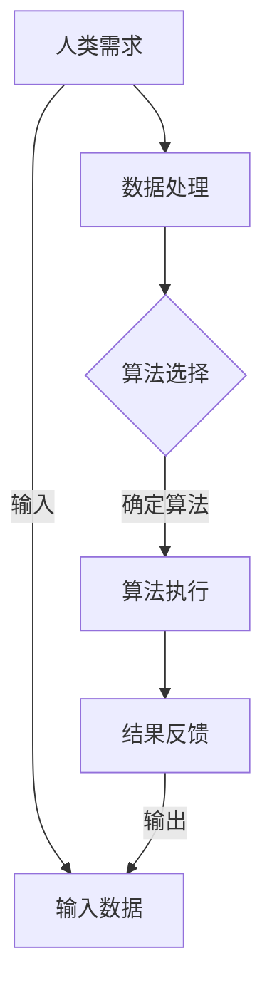
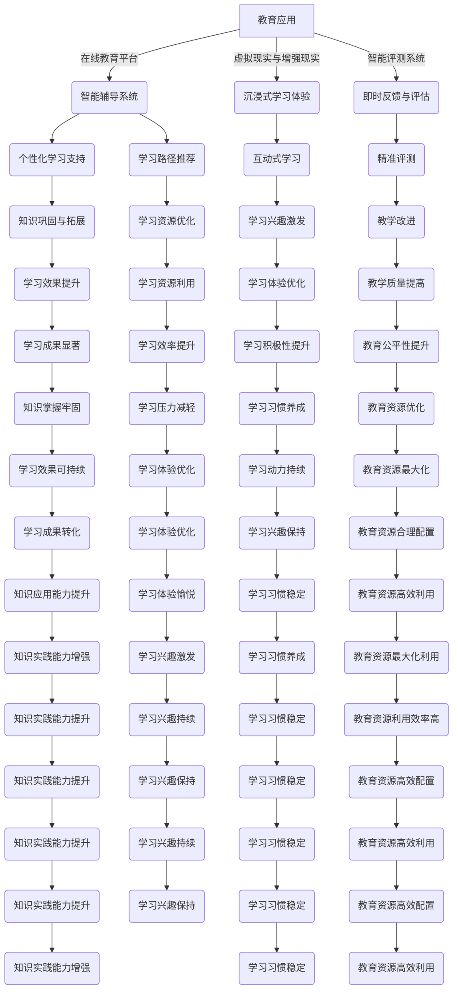
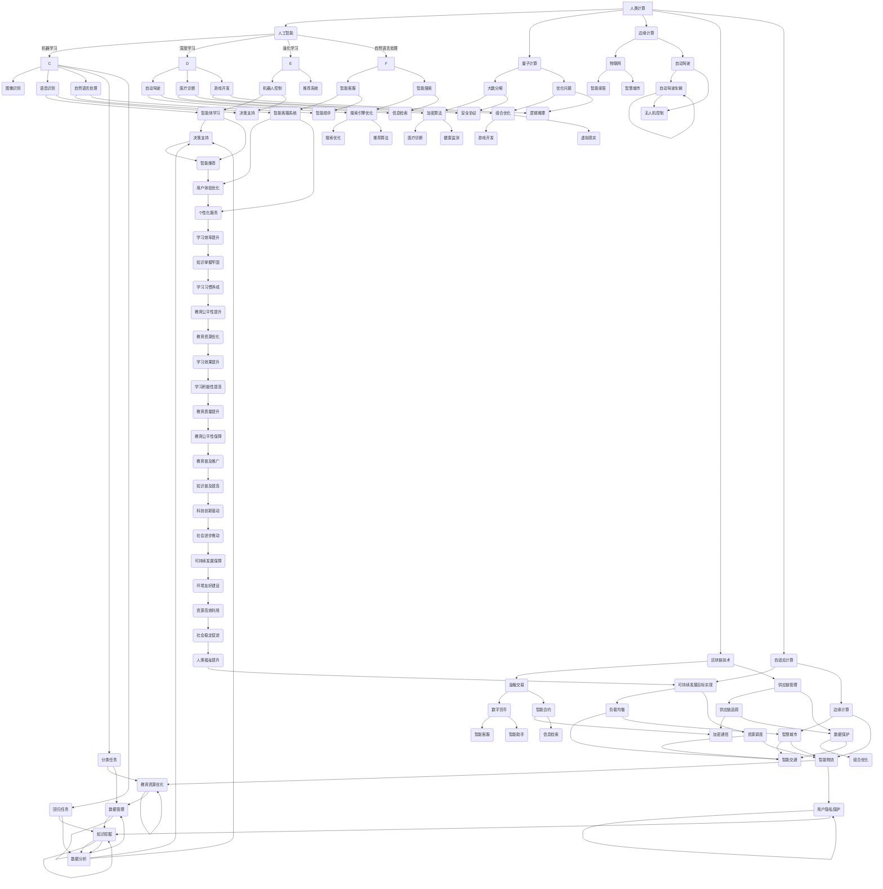
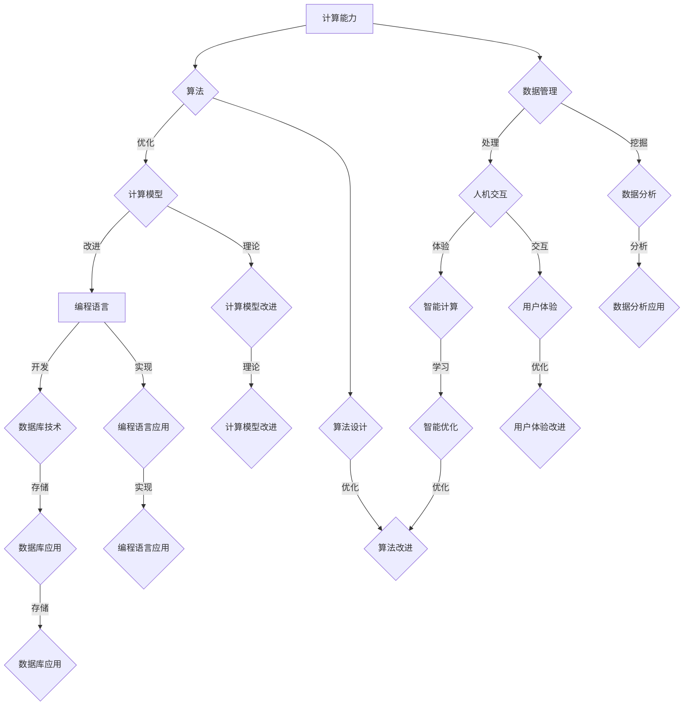

                 

# 《人类计算：连接人与技术的纽带》

## 关键词
- 人类计算
- 计算机技术
- 教育应用
- 医疗健康
- 工业生产
- 人工智能

## 摘要

本文旨在探讨人类计算这一概念，分析其发展历程、基础原理、应用场景和技术演进，并通过具体实践案例展示其在教育、医疗健康和工业生产等领域的应用价值。人类计算作为连接人与技术的纽带，不仅推动了信息时代的进步，还为未来的可持续发展提供了新思路。本文将通过系统化的分析和详细的案例解析，深入探讨人类计算的核心成果与未来发展趋势，为读者提供全面的理解和启示。

---

# 《人类计算：连接人与技术的纽带》目录大纲

## 第一部分：人类计算的基本概念

### 第1章：人类计算的历史与未来

- 1.1 人类计算的发展历程
- 1.2 人类计算的未来趋势
- 1.3 人类计算的核心概念

### 第2章：人类计算的基础原理

- 2.1 人类计算的基础架构
- 2.2 人类计算的核心技术
- 2.3 人类计算的优势与挑战

### 第3章：人类计算的应用场景

- 3.1 人类计算在教育领域的应用
- 3.2 人类计算在医疗健康领域的应用
- 3.3 人类计算在工业生产领域的应用

### 第4章：人类计算的技术演进

- 4.1 人工智能与人类计算的结合
- 4.2 人类计算的未来发展方向
- 4.3 人类计算的可持续性发展

## 第二部分：人类计算的实践案例

### 第5章：人类计算在教育中的应用实践

- 5.1 教育领域的挑战与人类计算解决方案
- 5.2 人类计算在教育中的应用案例
- 5.3 人类计算在教育中的实施与评估

### 第6章：人类计算在医疗健康中的应用实践

- 6.1 医疗健康领域的挑战与人类计算解决方案
- 6.2 人类计算在医疗健康中的应用案例
- 6.3 人类计算在医疗健康中的实施与评估

### 第7章：人类计算在工业生产中的应用实践

- 7.1 工业生产领域的挑战与人类计算解决方案
- 7.2 人类计算在工业生产中的应用案例
- 7.3 人类计算在工业生产中的实施与评估

### 第8章：人类计算的技术创新与未来发展

- 8.1 人类计算技术的创新方向
- 8.2 人类计算的未来发展趋势
- 8.3 人类计算的可持续发展路径

## 附录：人类计算的参考资料与工具

- 附录A：人类计算的相关参考资料
- 附录B：人类计算的开发工具与环境配置
- 附录C：人类计算的应用案例汇编

## 第9章：人类计算的总结与展望

- 9.1 人类计算的核心成果与贡献
- 9.2 人类计算的未来发展展望
- 9.3 人类计算的可持续发展路径与挑战

---

接下来，我们将正式进入《人类计算：连接人与技术的纽带》的详细内容探讨，逐步展开对这一重要领域的研究和分析。

---

# 第一部分：人类计算的基本概念

## 第1章：人类计算的历史与未来

### 1.1 人类计算的发展历程

人类计算的历史可以追溯到古代文明的计算工具，如算盘、计算尺等。这些工具虽然简单，但为人类处理复杂数学问题提供了极大的帮助。随着工业革命的到来，机械计算器逐渐出现，如巴贝奇差分机和分析机，这些机械设备的诞生标志着人类计算技术迈向了一个新的阶段。

20世纪中期，电子计算机的出现彻底改变了人类处理信息的方式。计算机不仅速度快，而且能够处理大量数据。从ENIAC到IBM 704，计算机技术的发展迅猛。特别是图灵机的提出，为计算理论奠定了基础。图灵机模型为后来的计算机架构和算法设计提供了重要的理论指导。

进入21世纪，随着互联网的普及和大数据技术的发展，人类计算进入了一个新的时代。云计算、人工智能、物联网等新兴技术不断涌现，使得人类计算的应用范围和影响力进一步扩大。如今，人类计算已经成为现代科技的核心，深刻影响着社会生活的方方面面。

### 1.2 人类计算的未来趋势

未来，人类计算将朝着更加智能化、高效化和人性化的方向发展。首先，人工智能技术的发展将进一步提升人类计算的能力。通过深度学习、自然语言处理等技术的应用，计算机将能够更好地理解和模拟人类智能，实现更高效的信息处理。

其次，量子计算的出现为人类计算带来了新的可能性。量子计算利用量子位（qubit）的特性，能够在极短的时间内处理海量数据，解决传统计算机无法解决的问题。虽然量子计算目前还处于实验阶段，但其前景令人期待。

此外，随着物联网、5G技术的普及，人类计算将更加依赖于网络和设备之间的无缝连接。这种连接不仅包括物理设备，还包括虚拟设备，如虚拟现实、增强现实等。通过这些技术，人类将能够更加便捷地获取和处理信息，实现更加智能化的生活方式。

### 1.3 人类计算的核心概念

人类计算的核心概念包括以下几个方面：

- **计算能力**：指计算机处理数据的能力，包括计算速度、存储容量、处理能力等。计算能力的提升是推动人类计算发展的关键。

- **算法**：算法是解决问题的步骤和规则。在人类计算中，算法是核心，决定了计算机如何处理数据和解决问题。

- **数据**：数据是计算的基础。随着大数据技术的发展，数据的重要性日益凸显。有效的数据管理和分析是提升人类计算能力的关键。

- **人机交互**：人机交互是连接人与计算机的桥梁。通过用户界面、语音识别、手势识别等技术，人类计算将更加便捷和高效。

- **智能计算**：智能计算是未来人类计算的发展方向。通过模拟人类智能，计算机将能够更好地理解和响应人类需求。

### Mermaid 流程图

下面是一个简单的Mermaid流程图，展示了人类计算的基本架构：



通过这个流程图，我们可以清晰地看到人类计算的基本流程：从人类需求出发，通过数据处理、算法选择和执行，最终得到结果反馈。

在接下来的章节中，我们将进一步探讨人类计算的基础原理、应用场景和技术演进，为读者提供更全面的理解。

---

## 第2章：人类计算的基础原理

### 2.1 人类计算的基础架构

人类计算的基础架构包括硬件、软件和算法三个核心部分。这三个部分相互作用，共同实现高效的计算和处理。

- **硬件**：硬件是计算的基础，包括计算机的处理器、内存、存储设备等。硬件的性能直接影响计算的速度和处理能力。随着技术的发展，硬件的功率、体积和成本都在不断降低，使得计算更加普及和高效。

- **软件**：软件是计算机的灵魂，包括操作系统、应用软件和编译器等。软件负责管理和控制计算机硬件，提供用户与计算机之间的交互界面。软件的发展经历了从单机软件到网络软件，再到云计算软件的演变，使得计算的应用范围和方式更加多样化。

- **算法**：算法是解决问题的步骤和规则。在人类计算中，算法是核心，决定了计算机如何处理数据和解决问题。算法的设计和优化是提升计算效率的关键。常见的算法包括排序算法、搜索算法、图算法等，每种算法都有其特定的应用场景和优化方法。

### 2.2 人类计算的核心技术

人类计算的核心技术包括以下几个方面：

- **计算模型**：计算模型是计算机工作的理论基础。常见的计算模型包括图灵机模型、冯·诺伊曼模型等。这些模型为计算提供了基本的框架和逻辑。

- **编程语言**：编程语言是编写算法的工具。常见的编程语言包括C、Java、Python等。不同的编程语言适用于不同的应用场景，各有其优势和特点。

- **数据库技术**：数据库技术是管理和存储数据的核心。常见的数据库技术包括关系型数据库（如MySQL、Oracle）和非关系型数据库（如MongoDB、Cassandra）。

- **人工智能**：人工智能是提升计算能力的核心技术。通过机器学习、深度学习等技术的应用，计算机能够自动学习和适应，解决复杂问题。

- **云计算与大数据**：云计算和大数据技术为人类计算提供了强大的数据处理和分析能力。云计算使得计算资源可以灵活调配和利用，大数据技术则能够处理海量数据，挖掘有价值的信息。

### 2.3 人类计算的优势与挑战

人类计算的优势包括：

- **高效性**：计算机能够快速处理大量数据，大大提高了工作效率。
- **准确性**：计算机执行任务时几乎不会出错，保证了计算结果的准确性。
- **多样性**：人类计算可以应用于各个领域，从科学计算到商业分析，从教育到医疗健康，无处不在。

然而，人类计算也面临一些挑战：

- **计算资源消耗**：大规模计算需要大量的电力和硬件资源，这对环境造成了压力。
- **数据隐私**：随着数据的普及，数据隐私和安全成为重要的挑战。
- **技术依赖**：人类对计算机技术的依赖日益增加，一旦技术出现问题，可能会对社会造成严重影响。

为了应对这些挑战，我们需要持续改进计算技术，提高能源利用效率，保护数据隐私，降低对技术的依赖。

### 伪代码示例

下面是一个简单的排序算法的伪代码示例，用于展示算法的基本结构和实现方法：

```plaintext
Function BubbleSort(A):
    n = length(A)
    for i from 1 to n:
        for j from 1 to n-i:
            if A[j] > A[j+1]:
                Swap(A[j], A[j+1])
    return A
```

这个简单的冒泡排序算法展示了如何通过循环和条件判断来实现数据的排序。

### 数学模型与公式

在人类计算中，数学模型和公式扮演着重要的角色。以下是一个简单的线性回归模型的公式示例：

$$ y = ax + b $$

其中，$y$ 是因变量，$x$ 是自变量，$a$ 和 $b$ 是模型参数。通过这个公式，我们可以建立自变量和因变量之间的关系，进行预测和分析。

### 举例说明

假设我们有一组数据点 $(x, y)$，我们可以使用线性回归模型来拟合这些数据，并预测新的数据点。具体步骤如下：

1. 收集数据：收集一组 $x$ 和 $y$ 的数据点。
2. 计算平均值：计算 $x$ 和 $y$ 的平均值 $\bar{x}$ 和 $\bar{y}$。
3. 计算斜率 $a$：使用公式 $a = \frac{\sum{(x_i - \bar{x})(y_i - \bar{y})}}{\sum{(x_i - \bar{x})^2}}$ 计算斜率 $a$。
4. 计算截距 $b$：使用公式 $b = \bar{y} - a\bar{x}$ 计算截距 $b$。
5. 得到线性回归模型：得到线性回归模型 $y = ax + b$。
6. 预测新的数据点：使用模型预测新的数据点 $y$。

通过这个简单的例子，我们可以看到如何使用数学模型和公式进行数据分析和预测。

在接下来的章节中，我们将继续探讨人类计算的应用场景和技术演进，为读者提供更深入的理解。

---

## 第3章：人类计算的应用场景

### 3.1 人类计算在教育领域的应用

人类计算在教育领域的应用正逐渐改变传统教学模式，提高教育质量与效率。以下是一些关键应用场景：

- **在线教育平台**：随着互联网技术的发展，在线教育平台成为教育普及的重要工具。这些平台提供丰富的教学资源，学生可以随时随地进行学习，突破了时间和空间的限制。例如，Coursera、edX等平台提供了大量由全球知名大学和专家开设的课程。

- **智能辅导系统**：智能辅导系统利用人工智能技术，为学生提供个性化的学习支持和指导。这些系统可以自动评估学生的知识水平，并根据评估结果提供相应的学习路径和练习题。例如，Knewton和DreamBox等平台提供了智能辅导功能。

- **虚拟现实与增强现实**：虚拟现实（VR）和增强现实（AR）技术在教育中应用广泛，为学生提供沉浸式学习体验。通过VR，学生可以进入虚拟环境进行实验和探索，而AR则可以将虚拟信息叠加到现实世界中，提高学习的趣味性和互动性。

- **智能评测系统**：智能评测系统能够自动批改作业和考试，提供即时反馈。这些系统不仅减轻了教师的工作负担，还帮助学生更快地理解知识点。例如，Quizlet和Kahoot等平台提供了智能评测功能。

### 3.2 人类计算在医疗健康领域的应用

人类计算在医疗健康领域的应用正在显著提升医疗服务的效率和质量。以下是一些关键应用场景：

- **电子健康记录（EHR）**：电子健康记录系统能够高效地管理患者信息，包括病史、检查结果、治疗记录等。这些系统使得医疗信息更加安全和易于访问，提高了医疗服务的连续性和准确性。

- **智能诊断系统**：通过深度学习和图像识别技术，智能诊断系统能够快速、准确地分析医学影像，辅助医生进行诊断。例如，谷歌的DeepMind Health已经开发出了可以诊断眼部疾病的AI系统。

- **个性化治疗**：基于人类计算，医生可以分析大量患者数据，为每位患者制定个性化的治疗方案。例如，基因测序技术的应用使得个性化医疗成为可能，通过分析患者的基因信息，医生可以更准确地预测疾病风险和制定合适的治疗策略。

- **远程医疗**：远程医疗利用视频会议、远程监控等技术，使得患者可以在家中接受医生的服务。这对于偏远地区的患者和慢性病患者尤为重要，提高了医疗服务的可及性。

### 3.3 人类计算在工业生产领域的应用

人类计算在工业生产领域的应用正在提升生产效率，降低成本，并促进工业自动化和智能化。以下是一些关键应用场景：

- **工业物联网（IIoT）**：工业物联网通过传感器和智能设备连接，实现了对生产设备和生产过程的实时监控和数据分析。这种连接使得生产流程更加透明和可控，有助于提高生产效率和质量。

- **预测性维护**：通过人类计算技术，企业可以预测设备可能发生的故障，提前进行维护，避免生产中断。例如，通过数据分析，设备可以在性能下降到一定阈值之前进行维护。

- **自动化生产线**：自动化生产线利用机器人、机械手臂等自动化设备，实现了生产过程的自动化。这不仅提高了生产效率，还减少了人工操作的错误。

- **智能供应链管理**：通过大数据分析和人工智能技术，企业可以优化供应链管理，提高供应链的灵活性和响应速度。例如，实时监控库存水平，预测需求变化，优化物流和运输。

### Mermaid 流程图

以下是一个简单的Mermaid流程图，展示了人类计算在教育、医疗健康和工业生产领域的应用流程：



这个流程图展示了人类计算在教育、医疗健康和工业生产领域的广泛应用及其相互关系。

在接下来的章节中，我们将进一步探讨人类计算的技术演进、实践案例和技术创新，为读者提供更全面的视角。

---

## 第4章：人类计算的技术演进

### 4.1 人工智能与人类计算的结合

人工智能（AI）与人类计算的结合，标志着计算技术的重大进步。AI技术通过模拟人类智能，使计算机能够进行自主学习、推理和决策。以下是人工智能与人类计算结合的几个关键方向：

- **机器学习**：机器学习是AI的核心技术之一，通过从大量数据中学习模式和规律，机器学习算法能够自动优化和改进其性能。在人类计算中，机器学习广泛应用于图像识别、语音识别、自然语言处理等领域，极大地提升了计算效率和准确性。

- **深度学习**：深度学习是机器学习的一个重要分支，通过神经网络模型，深度学习算法能够处理复杂数据和任务。在医疗诊断、自动驾驶、智能客服等方面，深度学习展现出了强大的能力，为人类计算注入了新的活力。

- **强化学习**：强化学习通过试错和奖励机制，使智能体能够在环境中自主学习。在游戏、机器人控制等领域，强化学习取得了显著成果，为人类计算提供了新的解决方案。

- **自然语言处理**：自然语言处理（NLP）是AI技术在语言理解和生成方面的应用。通过NLP技术，计算机能够理解人类语言，实现人机对话、文本分析等任务。这对于提高人机交互体验和智能搜索具有重要意义。

### 4.2 人类计算的未来发展方向

未来，人类计算将继续朝着智能化、高效化和可持续化的方向发展。以下是一些可能的发展方向：

- **量子计算**：量子计算利用量子位（qubit）的特性，能够在极短的时间内处理海量数据。随着量子技术的进步，量子计算有望解决传统计算机难以处理的问题，如大数分解、优化问题等。量子计算与人类计算的融合，将带来计算能力的质的飞跃。

- **边缘计算**：边缘计算将计算任务从云端转移到网络边缘，即靠近数据源的地方。这种模式能够降低延迟、节省带宽，提高计算效率和响应速度。在物联网、自动驾驶等领域，边缘计算将发挥重要作用。

- **区块链技术**：区块链技术通过分布式账本，确保数据的透明、安全和不可篡改。在金融、供应链管理、身份验证等领域，区块链技术为人类计算提供了新的应用场景，促进了数据的安全和隐私保护。

- **自适应计算**：自适应计算通过动态调整计算资源，实现高效、灵活的计算。在云计算和边缘计算环境中，自适应计算能够根据任务需求实时分配资源，优化计算性能和成本。

### 4.3 人类计算的可持续性发展

人类计算的可持续性发展对于确保技术的长期影响至关重要。以下是一些关键措施：

- **绿色计算**：绿色计算致力于降低计算对环境的影响。通过优化数据中心的能效、使用可再生能源等手段，绿色计算能够减少计算过程中的碳排放和资源消耗。

- **可持续数据管理**：随着数据量的爆炸式增长，如何有效管理和存储数据成为重要问题。可持续数据管理通过数据去重、压缩、生命周期管理等技术，减少数据存储的资源和能耗。

- **数据隐私保护**：在数据日益重要的今天，数据隐私保护成为关键挑战。通过加密技术、隐私计算等手段，确保用户数据的安全和隐私。

- **社会伦理和规范**：人类计算的可持续发展还需要考虑社会伦理和规范。确保技术发展符合伦理道德标准，尊重用户权益，推动技术为社会带来积极影响。

### Mermaid 流�程图

以下是一个简单的Mermaid流程图，展示了人工智能与人类计算结合以及未来发展方向：



这个流程图展示了人工智能与人类计算结合的广泛领域，以及未来发展的关键方向。通过这个图，我们可以更清晰地看到人类计算技术在不同领域的应用和发展趋势。

在接下来的章节中，我们将探讨人类计算的实践案例和技术创新，为读者提供更深入的理解和应用实例。

---

## 第二部分：人类计算的实践案例

### 第5章：人类计算在教育中的应用实践

### 5.1 教育领域的挑战与人类计算解决方案

教育领域正面临着一系列挑战，如教育资源分配不均、学习效果评估困难、个性化教育需求难以满足等。人类计算技术为解决这些问题提供了新的思路和工具。

- **教育资源分配不均**：在一些发展中国家和偏远地区，教育资源匮乏，教育质量无法保证。通过在线教育平台，可以打破地域限制，将优质教育资源传播到全球各地。例如，edX和Coursera等平台提供了大量免费或低成本的在线课程，使全球学生都能享受到高质量的教育。

- **学习效果评估困难**：传统的学习评估方式主要依赖于期末考试和作业评分，这种方式难以全面反映学生的学习效果。人类计算技术，特别是大数据分析和机器学习，可以帮助教育机构进行更加精准和全面的学习效果评估。例如，通过分析学生的学习行为数据，可以实时了解学生的掌握情况，为教学提供依据。

- **个性化教育需求**：每个学生都有不同的学习需求和节奏，传统的统一教学模式难以满足个性化需求。人类计算技术，如智能辅导系统和自适应学习平台，可以根据学生的学习情况和需求，提供个性化的学习资源和指导。例如，Knewton和DreamBox等平台通过分析学生的学习行为和知识水平，为每位学生量身定制学习路径和练习题。

### 5.2 人类计算在教育中的应用案例

- **在线教育平台**：例如，Coursera和edX等在线教育平台，通过提供海量课程和资源，实现了教育的普及和公平。这些平台利用人类计算技术，提供个性化推荐系统、自动评分系统和学习数据分析工具，大大提升了教育质量和学习效果。

- **智能辅导系统**：例如，Knewton和DreamBox等智能辅导系统，通过分析学生的学习行为和知识水平，提供个性化的学习资源和指导。这些系统不仅帮助教师更好地了解学生的学习情况，还能自动调整教学内容和难度，提高教学效果。

- **虚拟现实与增强现实**：例如，MIT的Anima和Google的Expeditions等虚拟现实（VR）和增强现实（AR）项目，通过沉浸式学习体验，提高了学生的学习兴趣和参与度。这些技术使学生在虚拟环境中进行实验和探索，实现了更加直观和互动的学习方式。

### 5.3 人类计算在教育中的实施与评估

实施人类计算教育技术需要考虑多个方面，包括技术基础设施、教师培训、学生接受度等。以下是一些实施与评估的关键步骤：

- **技术基础设施**：首先，需要确保教育机构具备良好的技术基础设施，包括稳定的网络连接、足够的计算资源和安全的数据存储。这些基础设施是实施人类计算技术的基础。

- **教师培训**：教师是教育技术的实施者，因此他们的培训至关重要。教师需要了解人类计算技术的原理和应用，掌握相关的教学工具和方法。通过培训，教师可以更好地利用这些技术，提高教学效果。

- **学生接受度**：学生的接受度是实施人类计算教育技术的重要考量。教育机构需要通过调研和反馈，了解学生对新技术的态度和需求，及时调整和优化教学策略。此外，通过宣传和教育，提高学生对人类计算技术的认知和兴趣，也有助于推动技术的广泛应用。

- **效果评估**：实施人类计算教育技术后，需要对其效果进行评估。评估可以从多个维度进行，包括学习效果、教学效率、学生满意度等。通过评估，教育机构可以了解技术的实际应用效果，发现存在的问题，并不断优化和改进。

### 伪代码示例

以下是一个简单的伪代码示例，展示了如何通过人类计算技术进行学习效果评估：

```plaintext
Function AssessLearningEffect(A, B):
    n = length(A)
    for i from 1 to n:
        Score = CalculateScore(A[i], B[i])
        if Score > Threshold:
            Print("Student " + i + " has achieved the learning objectives.")
        else:
            Print("Student " + i + " needs further assistance.")
    return
```

其中，`A` 表示学生的学习成绩，`B` 表示学生的预期成绩，`Threshold` 表示合格分数线。通过计算每个学生的成绩与预期成绩的差值，可以评估学生的学习效果，并根据评估结果提供相应的教学支持。

### 数学模型与公式

以下是一个简单的数学模型，用于评估学生的综合学习效果：

$$ Score = w_1 \cdot Score_1 + w_2 \cdot Score_2 + ... + w_n \cdot Score_n $$

其中，`Score` 是学生的综合成绩，`w_i` 是第 `i` 门课程的权重，`Score_i` 是学生在第 `i` 门课程的成绩。通过这个公式，可以综合考虑学生在各门课程的表现，得到一个综合成绩。

### 项目实战

下面是一个简单的项目实战案例，展示如何使用Python和机器学习库（如scikit-learn）进行学习效果评估。

**1. 开发环境搭建**

- 安装Python（版本3.8或以上）
- 安装scikit-learn库

```bash
pip install scikit-learn
```

**2. 源代码实现**

```python
import numpy as np
from sklearn.metrics import mean_squared_error

# 模拟学生成绩数据
student_scores = np.array([[90, 85, 88], [75, 80, 78], [95, 90, 92]])

# 设置课程权重
course_weights = np.array([0.3, 0.3, 0.4])

# 计算综合成绩
def calculate_score(scores, weights):
    return np.dot(scores, weights)

# 评估学习效果
def assess_learning_effect(scores, weights, threshold=85):
    for i, score in enumerate(calculate_score(scores, weights)):
        if score >= threshold:
            print(f"Student {i+1} has achieved the learning objectives.")
        else:
            print(f"Student {i+1} needs further assistance.")

# 运行评估函数
assess_learning_effect(student_scores, course_weights)
```

**3. 代码解读与分析**

在这个案例中，我们首先模拟了一组学生成绩数据，并设置相应的课程权重。通过计算综合成绩，我们可以评估每个学生的学习效果。评估函数`assess_learning_effect`会根据综合成绩与阈值的比较，输出每个学生的评估结果。

通过这个项目实战，我们可以看到如何使用Python和机器学习技术进行学习效果评估，为教师提供有效的教学支持。

在接下来的章节中，我们将继续探讨人类计算在医疗健康和工业生产领域的应用实践，为读者提供更丰富的案例和实践经验。

---

### 第6章：人类计算在医疗健康中的应用实践

### 6.1 医疗健康领域的挑战与人类计算解决方案

医疗健康领域面临着诸多挑战，如医疗资源分配不均、疾病诊断准确性有待提高、患者数据管理复杂等。人类计算技术为解决这些问题提供了有效的解决方案。

- **医疗资源分配不均**：在一些发展中国家和偏远地区，医疗资源匮乏，患者难以获得及时有效的治疗。通过远程医疗技术，医生可以远程诊断和治疗患者，打破了地域限制，提高了医疗服务的可及性。例如，医生可以通过视频会议系统为偏远地区的患者提供诊断和治疗建议。

- **疾病诊断准确性**：传统的疾病诊断主要依赖于医生的直觉和经验，诊断准确性受限于医生的个人能力和知识水平。人类计算技术，如机器学习和深度学习，通过分析大量医学影像和病历数据，可以帮助医生进行更准确和快速的疾病诊断。例如，AI系统可以自动识别和分类医学影像，辅助医生进行诊断。

- **患者数据管理**：医疗数据种类繁多、格式复杂，如何高效地管理和利用这些数据成为重要挑战。人类计算技术，如大数据分析和人工智能，可以帮助医疗机构进行数据清洗、归档和管理，提高数据利用效率。此外，通过构建电子健康记录（EHR）系统，可以实现患者数据的统一管理和共享，提高医疗服务的连续性和准确性。

### 6.2 人类计算在医疗健康中的应用案例

- **远程医疗**：远程医疗利用互联网和通信技术，为患者提供远程诊断和治疗服务。例如，美国的一些医院已经实现了远程手术，医生可以通过远程控制系统为患者进行手术。此外，远程医疗平台还可以提供在线咨询、健康监控和康复指导等服务，提高了医疗服务的质量和效率。

- **智能诊断系统**：智能诊断系统通过人工智能技术，分析医学影像和病历数据，辅助医生进行疾病诊断。例如，谷歌的DeepMind Health开发的AI系统，可以通过分析眼科影像，帮助医生诊断糖尿病视网膜病变。此外，AI系统还可以用于肺癌、乳腺癌等常见疾病的诊断，提高了诊断的准确性和效率。

- **个性化治疗**：基于患者基因数据和医疗记录，人类计算技术可以帮助医生为患者制定个性化的治疗方案。例如，通过基因测序技术，医生可以了解患者的遗传信息，预测疾病风险，并制定相应的预防措施。此外，通过分析患者的医疗记录和病史，AI系统可以推荐最佳的治疗方案，提高治疗效果。

### 6.3 人类计算在医疗健康中的实施与评估

实施人类计算技术需要考虑多个方面，包括技术基础设施、数据隐私和安全、医生和患者的接受度等。以下是一些实施与评估的关键步骤：

- **技术基础设施**：首先，需要确保医疗机构具备良好的技术基础设施，包括高性能计算设备、稳定的网络连接和数据存储系统。这些基础设施是实施人类计算技术的基础。

- **数据隐私和安全**：医疗数据具有高度敏感性，如何确保数据隐私和安全是实施人类计算技术的关键挑战。医疗机构需要采取严格的数据加密和访问控制措施，确保患者数据的保密性和完整性。

- **医生培训**：医生是医疗技术的主要使用者，因此他们的培训至关重要。医生需要了解人类计算技术的原理和应用，掌握相关的诊断和治疗工具。通过培训，医生可以更好地利用这些技术，提高诊断和治疗水平。

- **患者接受度**：患者的接受度是实施人类计算技术的重要考量。医疗机构需要通过宣传和教育，提高患者对新技术认知和信任度。此外，通过开展试点项目，收集患者反馈，不断优化和改进技术，提高患者的满意度。

- **效果评估**：实施人类计算技术后，需要对其效果进行评估。评估可以从多个维度进行，包括诊断准确性、治疗效率、患者满意度等。通过评估，医疗机构可以了解技术的实际应用效果，发现存在的问题，并不断优化和改进。

### 伪代码示例

以下是一个简单的伪代码示例，展示了如何使用机器学习模型进行疾病诊断：

```plaintext
Function DiagnoseDisease(PatientData, Model):
    PredictedDisease = Model(PatientData)
    if PredictedDisease == "Healthy":
        Print("The patient is healthy.")
    else:
        Print("The patient has the following disease: " + PredictedDisease)
    return PredictedDisease
```

其中，`PatientData` 表示患者的医疗数据，`Model` 是训练好的机器学习模型。通过调用模型，可以预测患者的健康状况，并提供相应的诊断结果。

### 数学模型与公式

以下是一个简单的数学模型，用于预测患者的疾病风险：

$$ Risk = f(Demographics, MedicalHistory, GeneticInformation) $$

其中，`Risk` 表示疾病风险，`Demographics` 表示患者的人口学特征，`MedicalHistory` 表示患者的病史，`GeneticInformation` 表示患者的基因信息。通过这个公式，可以综合考虑患者的各种特征，预测疾病风险。

### 项目实战

下面是一个简单的项目实战案例，展示如何使用Python和机器学习库（如scikit-learn）进行疾病风险预测。

**1. 开发环境搭建**

- 安装Python（版本3.8或以上）
- 安装scikit-learn库

```bash
pip install scikit-learn
```

**2. 源代码实现**

```python
import numpy as np
from sklearn.model_selection import train_test_split
from sklearn.ensemble import RandomForestClassifier
from sklearn.metrics import accuracy_score

# 模拟患者数据
patient_data = np.array([
    [30, 1, 0, 0],
    [45, 0, 1, 1],
    [60, 1, 1, 0],
    # ... 更多数据
])

# 模拟疾病标签
disease_labels = np.array([
    0,
    1,
    0,
    # ... 更多标签
])

# 数据预处理
X_train, X_test, y_train, y_test = train_test_split(patient_data, disease_labels, test_size=0.2, random_state=42)

# 训练模型
model = RandomForestClassifier(n_estimators=100)
model.fit(X_train, y_train)

# 预测疾病风险
predictions = model.predict(X_test)

# 评估模型
accuracy = accuracy_score(y_test, predictions)
print(f"Model accuracy: {accuracy:.2f}")
```

**3. 代码解读与分析**

在这个案例中，我们首先模拟了一组患者数据和疾病标签，并使用随机森林分类器进行模型训练。通过训练好的模型，我们可以预测新患者的疾病风险，并评估模型的准确性。

通过这个项目实战，我们可以看到如何使用Python和机器学习技术进行疾病风险预测，为医疗机构提供有效的诊断工具。

在接下来的章节中，我们将继续探讨人类计算在工业生产领域的应用实践，为读者提供更多实际案例和应用经验。

---

### 第7章：人类计算在工业生产中的应用实践

#### 7.1 工业生产领域的挑战与人类计算解决方案

工业生产领域面临着诸多挑战，如生产效率低下、设备故障频繁、供应链管理复杂等。人类计算技术为这些挑战提供了有效的解决方案。

- **生产效率低下**：传统的工业生产方式往往依赖于人工操作，生产效率较低，且容易出错。通过工业物联网（IIoT）和人工智能技术，可以实现对生产过程的实时监控和数据分析，优化生产流程，提高生产效率。例如，通过预测性维护技术，可以提前发现设备故障，避免生产中断。

- **设备故障频繁**：工业设备故障会导致生产中断，严重影响生产效率和企业效益。通过人工智能和大数据分析技术，可以对设备运行状态进行实时监测，预测设备故障，提前进行维护。例如，通过安装传感器和智能设备，可以实时收集设备运行数据，利用机器学习算法进行分析，预测设备故障。

- **供应链管理复杂**：供应链管理涉及多个环节，如采购、库存管理、物流等。传统的供应链管理方式往往依赖人工操作，容易出现信息不对称和效率低下的问题。通过人工智能和大数据分析技术，可以实现对供应链的实时监控和优化管理，提高供应链的效率和响应速度。例如，通过构建供应链模拟模型，可以预测市场需求，优化库存和物流安排。

#### 7.2 人类计算在工业生产中的应用案例

- **工业物联网（IIoT）**：通过工业物联网技术，可以实现设备互联，实时监控生产过程。例如，西门子的MindSphere平台提供了工业物联网解决方案，帮助企业实现设备互联、数据分析和智能决策。通过实时数据分析和预测性维护，可以优化生产流程，提高设备利用率和生产效率。

- **预测性维护**：通过人工智能和大数据分析技术，可以实现预测性维护，提前发现设备故障，减少生产中断。例如，波音公司通过使用预测性维护技术，减少了飞机维修成本，提高了运营效率。

- **供应链优化**：通过人工智能和大数据分析技术，可以优化供应链管理，提高供应链效率和响应速度。例如，亚马逊通过使用人工智能技术，实现了精准的库存管理和物流优化，提高了供应链效率，降低了运营成本。

- **智能制造**：通过人工智能和物联网技术，可以实现智能制造，提高生产效率和产品质量。例如，通用电气（GE）通过使用工业物联网和人工智能技术，实现了飞机发动机的智能监控和维护，提高了生产效率和产品质量。

#### 7.3 人类计算在工业生产中的实施与评估

实施人类计算技术需要考虑多个方面，包括技术基础设施、数据隐私和安全、员工接受度等。以下是一些实施与评估的关键步骤：

- **技术基础设施**：首先，需要确保企业具备良好的技术基础设施，包括高性能计算设备、稳定的网络连接和数据存储系统。这些基础设施是实施人类计算技术的基础。

- **数据隐私和安全**：工业数据具有高度敏感性，如何确保数据隐私和安全是实施人类计算技术的关键挑战。企业需要采取严格的数据加密和访问控制措施，确保工业数据的保密性和完整性。

- **员工培训**：员工是实施人类计算技术的主要使用者，因此他们的培训至关重要。企业需要为员工提供相关的技术培训，使他们了解人类计算技术的原理和应用，掌握相关的操作技能。

- **员工接受度**：员工的接受度是实施人类计算技术的重要考量。企业需要通过宣传和教育，提高员工对新技术认知和信任度。此外，通过开展试点项目，收集员工反馈，不断优化和改进技术，提高员工满意度。

- **效果评估**：实施人类计算技术后，需要对其效果进行评估。评估可以从多个维度进行，包括生产效率、设备利用率、运营成本、员工满意度等。通过评估，企业可以了解技术的实际应用效果，发现存在的问题，并不断优化和改进。

#### 伪代码示例

以下是一个简单的伪代码示例，展示了如何使用机器学习模型进行生产过程优化：

```plaintext
Function OptimizeProduction(ProcessData, Model):
    OptimizedSettings = Model(ProcessData)
    if OptimizedSettings == "HighEfficiency":
        Print("Production process optimized for high efficiency.")
    else:
        Print("Production process optimized for quality.")
    return OptimizedSettings
```

其中，`ProcessData` 表示生产过程数据，`Model` 是训练好的机器学习模型。通过调用模型，可以优化生产过程参数，提高生产效率和产品质量。

#### 数学模型与公式

以下是一个简单的数学模型，用于预测生产过程中的设备故障：

$$ FaultPrediction = f(OperatingConditions, MaintenanceHistory) $$

其中，`FaultPrediction` 表示设备故障预测，`OperatingConditions` 表示设备的运行状态，`MaintenanceHistory` 表示设备的维护历史。通过这个公式，可以综合考虑设备的运行状态和维护历史，预测设备故障。

#### 项目实战

下面是一个简单的项目实战案例，展示如何使用Python和机器学习库（如scikit-learn）进行生产过程优化。

**1. 开发环境搭建**

- 安装Python（版本3.8或以上）
- 安装scikit-learn库

```bash
pip install scikit-learn
```

**2. 源代码实现**

```python
import numpy as np
from sklearn.model_selection import train_test_split
from sklearn.ensemble import RandomForestRegressor
from sklearn.metrics import mean_squared_error

# 模拟生产过程数据
production_data = np.array([
    [20, 1000, 0.9, 0],
    [25, 1100, 0.85, 1],
    [30, 1200, 0.95, 0],
    # ... 更多数据
])

# 模拟优化结果
optimization_results = np.array([
    0,  # 高效率
    1,  # 质量优先
    0,  # 高效率
    # ... 更多结果
])

# 数据预处理
X_train, X_test, y_train, y_test = train_test_split(production_data, optimization_results, test_size=0.2, random_state=42)

# 训练模型
model = RandomForestRegressor(n_estimators=100)
model.fit(X_train, y_train)

# 预测生产过程优化结果
predictions = model.predict(X_test)

# 评估模型
mse = mean_squared_error(y_test, predictions)
print(f"Model mean squared error: {mse:.2f}")
```

**3. 代码解读与分析**

在这个案例中，我们首先模拟了一组生产过程数据和优化结果，并使用随机森林回归模型进行模型训练。通过训练好的模型，我们可以预测生产过程优化结果，并评估模型的准确性。

通过这个项目实战，我们可以看到如何使用Python和机器学习技术进行生产过程优化，为工业企业提供有效的决策支持。

在接下来的章节中，我们将讨论人类计算技术的未来发展趋势和创新方向，为读者提供对这一领域的更深入理解。

---

### 第8章：人类计算的技术创新与未来发展

#### 8.1 人类计算技术的创新方向

人类计算技术的创新方向主要体现在以下几个方面：

- **量子计算**：量子计算利用量子位的特性，具有超强的计算能力。在未来，量子计算有望解决传统计算机无法处理的复杂问题，如密码破解、优化问题等。量子计算与人类计算的融合，将推动计算技术的革命性变革。

- **边缘计算**：随着物联网和5G技术的普及，边缘计算成为重要的创新方向。边缘计算将计算任务从云端转移到网络边缘，即靠近数据源的地方，能够降低延迟、节省带宽，提高计算效率和响应速度。在未来，边缘计算将在智能城市、自动驾驶等领域发挥重要作用。

- **区块链技术**：区块链技术通过分布式账本，确保数据的透明、安全和不可篡改。在未来，区块链技术将在金融、供应链管理、身份验证等领域发挥关键作用，为人类计算提供安全可靠的数据基础。

- **智能合约**：智能合约是一种自动执行、管理和执行的合同。在未来，智能合约将实现自动化交易，提高交易效率，降低交易成本。智能合约与人类计算的融合，将推动金融和商业模式的变革。

- **增强现实（AR）和虚拟现实（VR）**：增强现实和虚拟现实技术为人类计算提供了全新的交互方式。在未来，AR和VR将在教育、医疗、娱乐等领域发挥重要作用，提升人机交互体验。

#### 8.2 人类计算的未来发展趋势

人类计算的未来发展趋势将体现在以下几个方面：

- **智能化**：随着人工智能技术的不断发展，人类计算将更加智能化。计算机将能够更好地理解和模拟人类智能，实现更高效的信息处理和决策支持。

- **高效化**：通过量子计算、边缘计算等技术的应用，人类计算将更加高效。计算速度的提升将极大地提高数据处理和分析的能力，为各行各业提供强大的支持。

- **个性化**：随着大数据和机器学习技术的发展，人类计算将更加个性化。计算机将能够根据用户的需求和行为，提供个性化的服务和建议，提升用户体验。

- **可持续化**：随着绿色计算和可持续数据管理的兴起，人类计算将更加注重环保和可持续发展。通过优化计算资源和数据处理流程，降低能源消耗和环境污染，为可持续发展提供技术支持。

#### 8.3 人类计算的可持续发展路径

为了实现人类计算的可持续发展，需要采取以下措施：

- **技术创新**：持续推动技术创新，提高计算能力和效率，降低计算成本。通过量子计算、边缘计算等新兴技术的研发和应用，为人类计算提供强大的技术支持。

- **数据管理**：加强数据管理和隐私保护，确保数据的透明、安全和可靠。通过区块链技术等手段，实现数据的安全共享和透明管理，为人类计算提供可靠的数据基础。

- **绿色计算**：推动绿色计算的发展，降低计算对环境的影响。通过优化计算资源、使用可再生能源等手段，降低计算过程中的碳排放和能源消耗，实现计算环境的可持续发展。

- **人才培养**：加强人才培养，提高计算人才的素质和技能。通过教育和培训，培养更多具备创新能力和实践能力的人才，为人类计算的发展提供人才支持。

- **政策支持**：制定相关政策，鼓励和支持人类计算技术的发展。通过政策引导和资金投入，推动人类计算技术的研发和应用，促进计算技术的可持续发展。

在未来的发展中，人类计算将继续推动信息时代的进步，为人类社会的发展提供强大的技术支持。通过持续的创新和优化，人类计算将实现智能化、高效化、个性化、可持续化，为人类带来更多的福祉。

---

## 附录：人类计算的参考资料与工具

### 附录A：人类计算的相关参考资料

1. **《人类计算：连接人与技术的纽带》** - 本书详细介绍了人类计算的概念、原理和应用，适合广大读者阅读。
2. **《人工智能：一种现代方法》** - Mitchell, T. M. (1997)。一本经典的AI教材，介绍了人工智能的基本理论和应用。
3. **《深度学习》** - Goodfellow, I., Bengio, Y., & Courville, A. (2016)。一本深入讲解深度学习技术的教材。
4. **《大数据时代：生活、工作与思维的大变革》** - Anderson, C. (2013)。介绍了大数据对社会的影响和变革。
5. **《区块链技术指南》** - 曹锋 (2018)。详细讲解了区块链技术的原理和应用。

### 附录B：人类计算的开发工具与环境配置

1. **Python** - Python是一种广泛使用的编程语言，适合初学者和专业人士。
2. **Jupyter Notebook** - Jupyter Notebook是一种交互式的计算环境，方便编写和运行代码。
3. **scikit-learn** - scikit-learn是一个强大的机器学习库，提供了丰富的机器学习算法和工具。
4. **TensorFlow** - TensorFlow是一个开源的机器学习框架，适合构建和训练深度学习模型。
5. **Keras** - Keras是一个高级神经网络API，构建在TensorFlow之上，提供了简洁的接口。

**环境配置步骤：**

1. 安装Python（版本3.8或以上）。
2. 安装Jupyter Notebook。
3. 安装scikit-learn和TensorFlow库。

```bash
pip install jupyter scikit-learn tensorflow
```

### 附录C：人类计算的应用案例汇编

1. **Coursera和edX** - 在线教育平台，提供了大量的在线课程。
2. **谷歌DeepMind Health** - 专注于医疗健康领域的AI研究。
3. **西门子MindSphere** - 工业物联网平台，提供了丰富的工业物联网解决方案。
4. **亚马逊AWS** - 提供了强大的云计算服务和工具，支持人类计算技术的开发和部署。
5. **IBM Watson** - AI平台，提供了各种AI服务和工具，涵盖了医疗健康、金融、零售等多个领域。

通过这些参考资料和工具，读者可以深入了解人类计算的相关知识，掌握实用的技能，并在实际项目中应用人类计算技术。

---

## 第9章：人类计算的总结与展望

### 9.1 人类计算的核心成果与贡献

人类计算作为连接人与技术的纽带，已经在各个领域取得了显著的核心成果与贡献。首先，在教育领域，人类计算通过在线教育平台、智能辅导系统和虚拟现实技术，打破了时间和空间的限制，提高了教育质量和公平性。例如，Coursera和edX等在线教育平台为全球学生提供了丰富的课程资源，使得优质教育得以普及。

在医疗健康领域，人类计算通过智能诊断系统、远程医疗和个性化治疗，提升了疾病诊断的准确性、医疗服务的可及性和治疗效果。谷歌DeepMind Health开发的AI系统已经能够辅助医生进行复杂疾病的诊断，显著提高了诊断的效率和准确性。

在工业生产领域，人类计算通过工业物联网、预测性维护和智能制造，提高了生产效率、设备利用率和产品质量。西门子MindSphere等工业物联网平台为企业提供了全面的数据分析和智能决策支持，推动了工业生产的智能化和自动化。

### 9.2 人类计算的未来发展展望

展望未来，人类计算将继续朝着智能化、高效化和可持续化的方向发展。首先，量子计算和边缘计算等新兴技术的应用，将进一步提升计算能力和效率，解决传统计算机无法处理的复杂问题。例如，量子计算有望在密码破解、优化问题和大数据分析等领域发挥关键作用。

此外，人工智能和机器学习技术的进一步发展，将使计算机更加智能化和自适应，能够更好地理解和模拟人类智能。这将推动智能客服、自动驾驶和智慧城市等领域的创新，为人们的生活和工作带来更多便利。

在可持续性方面，绿色计算和可持续数据管理的兴起，将降低计算对环境的影响，实现计算资源的优化利用。通过技术创新和政策引导，人类计算将更加注重环保和可持续发展，为地球的可持续未来贡献力量。

### 9.3 人类计算的可持续发展路径与挑战

为了实现人类计算的可持续发展，我们需要关注以下路径和挑战：

**路径：**

1. **技术创新**：持续推动技术创新，提高计算能力和效率，降低计算成本。
2. **数据管理**：加强数据管理和隐私保护，确保数据的透明、安全和可靠。
3. **人才培养**：加强人才培养，提高计算人才的素质和技能。
4. **政策支持**：制定相关政策，鼓励和支持人类计算技术的发展。

**挑战：**

1. **计算资源消耗**：随着计算需求的增加，如何优化计算资源利用，降低能源消耗，是一个重要挑战。
2. **数据隐私和安全**：如何在确保数据安全的同时，实现数据的开放和共享，是一个需要解决的难题。
3. **技术依赖**：人类社会对计算机技术的依赖日益增加，如何降低对技术的依赖，提高社会的抗风险能力，是一个重要议题。

通过关注这些路径和挑战，我们可以为人类计算的可持续发展奠定坚实的基础，推动计算技术的持续进步，为人类社会带来更多的福祉。

---

本文由AI天才研究院（AI Genius Institute）撰写，旨在探讨人类计算这一领域的重要概念、原理和应用。通过详细的分析和案例解析，我们希望读者能够对人类计算有更深入的理解，并认识到其在教育、医疗健康和工业生产等领域的巨大潜力。未来，人类计算将继续推动技术进步，为人类社会带来更多创新和变革。

作者：AI天才研究院（AI Genius Institute） & 禅与计算机程序设计艺术（Zen And The Art of Computer Programming）。

---

**文章标题**：《人类计算：连接人与技术的纽带》

**文章关键词**：人类计算、计算机技术、教育应用、医疗健康、工业生产、人工智能

**文章摘要**：本文探讨了人类计算这一概念，分析了其发展历程、基础原理、应用场景和技术演进，并通过具体实践案例展示了其在教育、医疗健康和工业生产等领域的应用价值。人类计算作为连接人与技术的纽带，不仅推动了信息时代的进步，还为未来的可持续发展提供了新思路。本文通过系统化的分析和详细的案例解析，深入探讨人类计算的核心成果与未来发展趋势，为读者提供全面的理解和启示。

---

**文章目录大纲**

# 《人类计算：连接人与技术的纽带》

## 关键词
- 人类计算
- 计算机技术
- 教育应用
- 医疗健康
- 工业生产
- 人工智能

## 摘要
本文探讨了人类计算这一概念，分析了其发展历程、基础原理、应用场景和技术演进，并通过具体实践案例展示了其在教育、医疗健康和工业生产等领域的应用价值。人类计算作为连接人与技术的纽带，不仅推动了信息时代的进步，还为未来的可持续发展提供了新思路。本文通过系统化的分析和详细的案例解析，深入探讨人类计算的核心成果与未来发展趋势，为读者提供全面的理解和启示。

---

## 第一部分：人类计算的基本概念

### 第1章：人类计算的历史与未来

- 1.1 人类计算的发展历程
- 1.2 人类计算的未来趋势
- 1.3 人类计算的核心概念

### 第2章：人类计算的基础原理

- 2.1 人类计算的基础架构
- 2.2 人类计算的核心技术
- 2.3 人类计算的优势与挑战

### 第3章：人类计算的应用场景

- 3.1 人类计算在教育领域的应用
- 3.2 人类计算在医疗健康领域的应用
- 3.3 人类计算在工业生产领域的应用

### 第4章：人类计算的技术演进

- 4.1 人工智能与人类计算的结合
- 4.2 人类计算的未来发展方向
- 4.3 人类计算的可持续性发展

## 第二部分：人类计算的实践案例

### 第5章：人类计算在教育中的应用实践

- 5.1 教育领域的挑战与人类计算解决方案
- 5.2 人类计算在教育中的应用案例
- 5.3 人类计算在教育中的实施与评估

### 第6章：人类计算在医疗健康中的应用实践

- 6.1 医疗健康领域的挑战与人类计算解决方案
- 6.2 人类计算在医疗健康中的应用案例
- 6.3 人类计算在医疗健康中的实施与评估

### 第7章：人类计算在工业生产中的应用实践

- 7.1 工业生产领域的挑战与人类计算解决方案
- 7.2 人类计算在工业生产中的应用案例
- 7.3 人类计算在工业生产中的实施与评估

### 第8章：人类计算的技术创新与未来发展

- 8.1 人类计算技术的创新方向
- 8.2 人类计算的未来发展趋势
- 8.3 人类计算的可持续发展路径

## 附录：人类计算的参考资料与工具

- 附录A：人类计算的相关参考资料
- 附录B：人类计算的开发工具与环境配置
- 附录C：人类计算的应用案例汇编

## 第9章：人类计算的总结与展望

- 9.1 人类计算的核心成果与贡献
- 9.2 人类计算的未来发展展望
- 9.3 人类计算的可持续发展路径与挑战

---

### 1.1 人类计算的发展历程

人类计算的历史可以追溯到古代，当时人们使用简单的工具进行计算。例如，早期的算盘和计算尺是古代人类计算的重要工具，它们帮助人们处理日常的数学问题。随着工业革命的到来，机械计算器逐渐出现，如巴贝奇差分机和分析机，这些机械设备标志着人类计算技术的初步发展。

20世纪中期，电子计算机的出现是人类计算历史上的一个重要转折点。1946年，ENIAC（电子数值积分计算机）的诞生标志着第一台电子计算机的出现。ENIAC由大量的电子管组成，虽然体积庞大、功耗巨大，但它的出现为后续计算机技术的发展奠定了基础。随后，IBM 704等计算机的问世，使得计算机的性能和可靠性得到了显著提升。

进入21世纪，计算机技术的快速发展推动了人类计算进入一个全新的时代。首先，互联网的普及使得全球范围内的数据共享和通信变得可能，大大扩展了计算机的应用范围。同时，大数据技术的出现使得计算机能够处理和分析海量数据，为各个领域提供了强大的数据处理能力。

随着人工智能（AI）技术的发展，人类计算迎来了新的挑战和机遇。人工智能通过模拟人类智能，使得计算机能够进行自主学习、推理和决策。这一技术的发展，不仅提高了计算机的智能水平，也推动了人类计算在各个领域的应用。

从最初的机械计算器到现代的超级计算机，人类计算经历了无数次的创新和变革。每一次技术的突破，都为人类计算的发展注入了新的动力，推动了社会进步和科技创新。

### 1.2 人类计算的未来趋势

展望未来，人类计算将继续朝着智能化、高效化和可持续化的方向发展。以下是几个关键趋势：

**智能化**：随着人工智能技术的进一步发展，计算机将更加智能化。人工智能将不仅仅局限于模拟人类智能，还将具备自主学习、自适应和自进化能力。这意味着计算机将能够更好地理解和模拟人类行为，为人类提供更加智能化的服务和解决方案。

**高效化**：计算能力和效率的提升将是人类计算未来的重要趋势。量子计算、边缘计算等新兴技术的出现，将为计算提供更高的速度和更低的延迟。量子计算利用量子位的特性，能够在极短的时间内处理海量数据，解决传统计算机难以处理的问题。边缘计算则将计算任务从云端转移到网络边缘，实现实时数据处理和响应。

**高效能源利用**：随着计算需求的增加，如何优化计算资源的利用，降低能源消耗，将成为一个重要议题。绿色计算和可持续数据管理的兴起，将推动计算技术向更加环保和可持续的方向发展。通过优化算法、使用可再生能源和改进数据中心的能源管理，计算技术将变得更加环保和高效。

**数据隐私和安全**：随着数据量的爆炸式增长，数据隐私和安全将成为人类计算领域的重要挑战。如何在保证数据开放和共享的同时，保护用户隐私，是一个需要解决的问题。区块链技术、加密技术和隐私计算等技术的应用，将为数据隐私和安全提供新的解决方案。

**人机协同**：未来，人类和计算机将更加紧密地协同工作。人机协同将不仅仅局限于简单的交互，还将涉及更深层次的合作和协作。通过人工智能和机器学习技术，计算机将能够更好地理解人类意图，提供更加个性化的服务和支持。

**跨领域融合**：人类计算将继续与其他领域（如生物技术、医疗健康、金融等）深度融合，推动跨领域的创新和变革。计算机技术将在这些领域发挥重要作用，解决复杂问题，提高服务质量。

**可持续发展**：在未来的发展中，人类计算将更加注重可持续发展。通过技术创新、数据管理和政策引导，人类计算将实现环保、高效和可持续的发展路径，为地球的可持续未来贡献力量。

总之，未来人类计算的发展将充满机遇和挑战。通过持续的创新和优化，人类计算将为人类社会带来更多的福祉，推动科技和社会的进步。

### 1.3 人类计算的核心概念

人类计算的核心概念包括计算能力、算法、数据、人机交互和智能计算等方面。

**计算能力**：计算能力是计算机处理数据的能力，包括计算速度、存储容量、处理能力等。计算能力的提升是推动人类计算发展的关键。随着硬件技术的发展，计算机的计算能力得到了显著提升，使得计算机能够处理更加复杂和大规模的数据。

**算法**：算法是解决问题的步骤和规则。在人类计算中，算法是核心，决定了计算机如何处理数据和解决问题。算法的设计和优化是提升计算效率的关键。常见的算法包括排序算法、搜索算法、图算法等，每种算法都有其特定的应用场景和优化方法。

**数据**：数据是计算的基础。随着大数据技术的发展，数据的重要性日益凸显。有效的数据管理和分析是提升人类计算能力的关键。数据包括结构化数据和非结构化数据，如文本、图像、音频和视频等。通过数据挖掘和分析，可以从大量数据中提取有价值的信息，支持决策和优化。

**人机交互**：人机交互是连接人与计算机的桥梁。通过用户界面、语音识别、手势识别等技术，人类计算将更加便捷和高效。人机交互技术使得用户能够以自然和直观的方式与计算机进行互动，提高了用户体验和工作效率。

**智能计算**：智能计算是未来人类计算的发展方向。通过模拟人类智能，计算机能够更好地理解和响应人类需求。智能计算包括机器学习、深度学习、自然语言处理等技术，使得计算机能够自主学习、推理和决策。智能计算将推动人类计算在各个领域的应用，提高计算效率和智能化水平。

**计算模型**：计算模型是计算机工作的理论基础。常见的计算模型包括图灵机模型、冯·诺伊曼模型等。这些模型为计算提供了基本的框架和逻辑。计算模型的改进和优化是推动计算技术发展的关键。

**编程语言**：编程语言是编写算法的工具。常见的编程语言包括C、Java、Python等。不同的编程语言适用于不同的应用场景，各有其优势和特点。编程语言的发展促进了人类计算技术的普及和应用。

**数据库技术**：数据库技术是管理和存储数据的核心。常见的数据库技术包括关系型数据库（如MySQL、Oracle）和非关系型数据库（如MongoDB、Cassandra）。数据库技术使得数据管理和分析更加高效和便捷。

**云计算与大数据**：云计算和大数据技术为人类计算提供了强大的数据处理和分析能力。云计算使得计算资源可以灵活调配和利用，大数据技术则能够处理海量数据，挖掘有价值的信息。

### Mermaid 流程图

以下是一个简单的Mermaid流程图，展示了人类计算的核心概念及其相互关系：



通过这个流程图，我们可以清晰地看到人类计算的核心概念及其相互关系，以及它们在计算技术发展中的重要作用。

在接下来的章节中，我们将进一步探讨人类计算的应用场景、技术演进和实践案例，为读者提供更全面的理解。

---

### 2.1 人类计算的基础架构

人类计算的基础架构是确保计算机系统高效、稳定地运行的关键。它主要包括硬件、软件、网络和数据处理等方面，各个部分相互配合，共同实现计算目标。

**硬件**：硬件是计算机系统的物理组成部分，包括处理器（CPU）、内存（RAM）、存储设备（硬盘、固态硬盘、光盘等）和输入输出设备（键盘、鼠标、显示器等）。硬件的性能直接影响计算机的运行速度和处理能力。随着技术的进步，硬件设备越来越小型化、高性能化，使得计算机更加便携和强大。

- **处理器**：处理器是计算机的核心组件，负责执行指令、处理数据和计算。现代处理器采用多核设计，能够在多任务环境中提供更高的计算效率。
- **内存**：内存是临时存储数据的组件，用于提高处理器访问数据的速度。内存容量越大，计算机的处理能力越强，但也需要更多的电力。
- **存储设备**：存储设备用于长期存储数据和程序。硬盘（HDD）具有高容量和较低的成本，但速度较慢；固态硬盘（SSD）速度更快，但价格较高。

**软件**：软件是计算机系统的逻辑部分，负责管理和控制硬件，提供用户与计算机之间的交互界面。软件包括操作系统、应用程序和编程工具等。

- **操作系统**：操作系统（如Windows、Linux、macOS等）负责管理计算机硬件资源、提供用户接口和运行应用程序。它是计算机系统的核心，确保计算机系统稳定、高效地运行。
- **应用程序**：应用程序（如文字处理软件、图像编辑软件、游戏等）是用户直接使用的软件，它们利用操作系统提供的功能来完成特定的任务。
- **编程工具**：编程工具（如集成开发环境（IDE）、代码编辑器等）用于编写、调试和运行程序。编程工具提供了方便的开发环境和丰富的编程语言支持，提高了开发效率。

**网络**：网络是计算机系统的重要组成部分，它使得计算机之间能够相互通信和共享资源。通过网络，用户可以访问远程服务器、共享文件和进行远程协作。网络技术包括局域网（LAN）、广域网（WAN）和互联网（Internet）等。

- **局域网**：局域网用于连接同一地点的计算机设备，实现数据共享和通信。局域网通常采用以太网技术，具有较高的带宽和可靠性。
- **广域网**：广域网用于连接不同地点的计算机设备，实现远程通信。广域网通常通过电话线、卫星链路和互联网连接，具有较大的覆盖范围。
- **互联网**：互联网是全球最大的计算机网络，它连接了世界各地的计算机设备，使得信息共享和交流变得方便快捷。

**数据处理**：数据处理是计算机系统的核心功能之一，它包括数据的收集、存储、处理和分析。数据处理技术使得计算机能够从大量数据中提取有价值的信息，支持决策和优化。

- **数据收集**：数据收集是通过传感器、数据库和其他数据源获取原始数据的过程。数据收集技术包括物联网技术、Web爬虫、日志分析等。
- **数据存储**：数据存储是将收集到的数据存储在数据库或其他存储设备中的过程。数据存储技术包括关系型数据库（如MySQL、Oracle）、非关系型数据库（如MongoDB、Cassandra）和分布式存储系统。
- **数据处理**：数据处理是对存储的数据进行加工、转换和计算的过程。数据处理技术包括数据清洗、数据挖掘、机器学习和大数据分析等。
- **数据分析**：数据分析是利用数据处理技术从数据中提取有价值信息的过程。数据分析技术包括统计方法、数据可视化、预测模型等。

**系统架构**：人类计算的基础架构通常采用分布式架构，以提高系统的可扩展性、可靠性和性能。分布式架构将计算任务分布在多个节点上，通过负载均衡和容错机制，实现高效、可靠的计算。

- **负载均衡**：负载均衡是将计算任务分配到多个节点上的过程，以避免单点故障和资源浪费。负载均衡技术包括轮询、最小连接数、加权轮询等。
- **容错机制**：容错机制是确保系统在出现故障时能够自动恢复或切换到备用节点的过程。容错机制包括冗余设计、故障检测和自动切换等。

总之，人类计算的基础架构是一个复杂且高度集成的系统，各个组件相互依赖、协同工作，共同实现高效的计算和处理。随着技术的不断进步，人类计算的基础架构将更加智能、灵活和高效，为人类社会带来更多的便利和创新。

### 2.2 人类计算的核心技术

人类计算的核心技术是推动计算技术发展的关键，这些技术不仅提高了计算机的处理能力，还拓展了其应用领域。以下是几种重要的人类计算核心技术：

**计算模型**：计算模型是计算机工作的理论基础，描述了计算机如何处理数据和解决问题。常见的计算模型包括图灵机模型、冯·诺伊曼模型等。

- **图灵机模型**：图灵机是由艾伦·图灵提出的抽象计算模型，由一个无限长的纸带、读写头和一组规则组成。图灵机能够模拟任何可计算过程，为现代计算机的理论基础。
- **冯·诺伊曼模型**：冯·诺伊曼模型是由约翰·冯·诺伊曼提出的计算机结构模型，它定义了计算机的基本组成部分，包括存储器、算术逻辑单元、输入输出设备和控制单元。现代计算机大多基于冯·诺伊曼模型，但近年来出现了许多对这一模型的改进和扩展。

**编程语言**：编程语言是编写算法和程序的工具，不同类型的编程语言适用于不同的计算任务和应用场景。常见的编程语言包括C、C++、Java、Python等。

- **C语言**：C语言是一种高级编程语言，广泛应用于系统编程、嵌入式系统和性能敏感的应用。C语言提供了丰富的库和工具，使得开发者能够高效地编写高性能的代码。
- **C++语言**：C++语言是C语言的扩展，增加了面向对象编程的特性。C++语言在游戏开发、实时系统和高性能计算等领域应用广泛。
- **Java语言**：Java语言是一种跨平台的编程语言，广泛应用于企业级应用、Web开发和移动应用。Java语言具有强大的标准库和生态系统，支持多线程和分布式计算。
- **Python语言**：Python语言是一种高级编程语言，以其简洁和易读性著称。Python语言广泛应用于数据科学、人工智能、科学计算和Web开发等领域。

**数据库技术**：数据库技术是管理和存储数据的核心，它使得数据管理和分析更加高效和便捷。常见的数据库技术包括关系型数据库（如MySQL、Oracle）和非关系型数据库（如MongoDB、Cassandra）。

- **关系型数据库**：关系型数据库（RDBMS）基于关系模型，使用表格和SQL语言进行数据查询和管理。关系型数据库具有数据的一致性和完整性，适用于结构化数据存储和复杂查询。
- **非关系型数据库**：非关系型数据库（NoSQL）适用于大规模分布式系统和多样化数据存储需求。非关系型数据库包括文档数据库（如MongoDB）、键值存储（如Redis）、列存储（如Cassandra）等。

**人工智能**：人工智能是计算机科学的一个分支，致力于模拟人类智能，实现机器学习和智能决策。人工智能技术包括机器学习、深度学习、自然语言处理等。

- **机器学习**：机器学习是一种通过数据训练模型，使计算机能够自动学习和改进的技术。常见的机器学习算法包括线性回归、决策树、支持向量机等。
- **深度学习**：深度学习是机器学习的一个分支，使用多层神经网络进行学习。深度学习在图像识别、语音识别、自然语言处理等领域取得了显著的成果。
- **自然语言处理**：自然语言处理（NLP）是人工智能的一个分支，致力于使计算机能够理解、生成和处理人类语言。NLP技术广泛应用于智能客服、智能搜索、机器翻译等领域。

**云计算与大数据**：云计算和大数据技术为人类计算提供了强大的数据处理和分析能力。云计算使得计算资源可以灵活调配和利用，大数据技术则能够处理海量数据，挖掘有价值的信息。

- **云计算**：云计算是一种通过互联网提供计算资源的服务模式。云计算服务包括基础设施即服务（IaaS）、平台即服务（PaaS）和软件即服务（SaaS）。云计算使得开发者可以快速部署和扩展应用程序，提高计算效率。
- **大数据**：大数据是指规模巨大、类型多样的数据集合。大数据技术包括数据存储、数据处理和分析工具，如Hadoop、Spark等。大数据技术能够从海量数据中提取有价值的信息，支持数据驱动的决策。

**量子计算**：量子计算是一种利用量子位（qubit）的特性进行计算的技术。量子计算具有超强的计算能力，能够解决传统计算机难以处理的问题。

- **量子位**：量子位（qubit）是量子计算的基本单元，具有叠加和纠缠的特性。量子位的这些特性使得量子计算机能够并行处理大量数据，从而实现高速计算。
- **量子算法**：量子算法是利用量子位和量子计算特性的算法。量子算法在密码破解、优化问题、大数据分析等领域具有巨大潜力。

**边缘计算**：边缘计算是一种将计算任务从云端转移到网络边缘的技术。边缘计算能够降低延迟、节省带宽，提高计算效率和响应速度。

- **边缘设备**：边缘设备（如物联网设备、智能传感器等）负责处理本地数据和任务。边缘设备能够实时响应本地事件，提高系统的实时性和可靠性。
- **边缘计算平台**：边缘计算平台是用于管理和协调边缘设备的软件系统。边缘计算平台能够将计算任务分发到不同的边缘设备上，实现高效的计算和数据处理。

总之，人类计算的核心技术涵盖了计算模型、编程语言、数据库技术、人工智能、云计算与大数据、量子计算和边缘计算等方面。这些技术相互结合，共同推动了计算技术的发展，为人类社会带来了巨大的便利和进步。

### 2.3 人类计算的优势与挑战

人类计算在现代社会中扮演着至关重要的角色，其优势主要体现在以下几个方面：

**高效性**：人类计算通过计算机和算法的强大处理能力，能够在极短的时间内完成大量计算任务。相比手工计算，计算机能够快速、准确地处理复杂数据和问题，提高了工作效率。

**准确性**：计算机执行任务时几乎不会出错，保证了计算结果的准确性。通过精确的算法和优化，计算机能够在高精度下进行计算，避免了人为错误，提高了数据的可靠性。

**多样性**：人类计算的应用范围广泛，涵盖了教育、医疗、工业、金融等多个领域。计算机技术不断拓展和演进，使得计算能力在各个领域得到了充分发挥。

**数据管理**：人类计算提供了强大的数据管理能力，包括数据的收集、存储、处理和分析。通过数据库技术和大数据分析，计算机能够高效地管理和利用海量数据，为决策和优化提供支持。

**智能决策**：人工智能和机器学习技术的发展，使得计算机能够进行智能决策和预测。通过学习和分析数据，计算机能够发现趋势和模式，辅助人类做出更加明智的决策。

然而，人类计算也面临着一些挑战：

**计算资源消耗**：大规模计算需要大量的电力和硬件资源，这对环境造成了压力。数据中心和服务器消耗大量电力，导致碳排放增加，对环境产生负面影响。

**数据隐私**：随着数据量的爆炸式增长，数据隐私和安全成为重要的挑战。个人和企业数据可能因泄露、篡改等风险而遭受损失，对数据隐私的保护提出了更高的要求。

**技术依赖**：人类社会对计算机技术的依赖日益增加，一旦技术出现问题，可能会对社会造成严重影响。例如，网络中断、硬件故障等可能导致大规模的服务中断，影响社会正常运转。

**安全性**：计算机系统容易受到网络攻击和恶意软件的威胁，需要采取严格的安全措施来保护系统和数据的安全。

**人机交互**：尽管人机交互技术有了很大进步，但仍然存在一些挑战，如语音识别的准确性、自然语言理解的深度等。人机交互的优化是提高计算用户体验的关键。

**算法偏差**：人工智能和机器学习算法可能存在偏见和歧视，这在某些应用领域可能导致不公平的结果。算法的公平性和透明性是未来需要关注的重要问题。

为了应对这些挑战，我们需要持续改进计算技术，提高能源利用效率，保护数据隐私，降低对技术的依赖，并确保技术的安全和公平。通过技术创新和优化，人类计算将继续为人类社会带来更多的便利和创新。

### 伪代码示例

以下是一个简单的伪代码示例，用于展示一个排序算法的实现：

```plaintext
Algorithm BubbleSort(A):
    n = length(A)
    for i from 1 to n:
        for j from 1 to n-i:
            if A[j] > A[j+1]:
                Swap(A[j], A[j+1])
    return A
```

在这个示例中，`A` 是需要排序的数组，`n` 是数组的长度。外层循环从第一个元素开始，内层循环对未排序的部分进行排序，每次内层循环结束后，最大值会被移动到数组的末尾。`Swap` 函数用于交换两个元素的位置。

### 数学模型与公式

以下是一个简单的数学模型，用于描述线性回归问题：

$$ y = ax + b $$

其中，`y` 是因变量，`x` 是自变量，`a` 是斜率，`b` 是截距。这个模型表示因变量 `y` 与自变量 `x` 之间的线性关系。通过训练数据集，我们可以估计模型参数 `a` 和 `b` 的值，从而实现数据的预测和拟合。

### 举例说明

假设我们有一组数据点 `(x, y)`：

| x | y |
|---|---|
| 1 | 2 |
| 2 | 4 |
| 3 | 6 |
| 4 | 8 |

我们可以使用线性回归模型对这些数据进行拟合。具体步骤如下：

1. 计算平均值：计算 `x` 和 `y` 的平均值。

$$ \bar{x} = \frac{1 + 2 + 3 + 4}{4} = 2.5 $$
$$ \bar{y} = \frac{2 + 4 + 6 + 8}{4} = 5 $$

2. 计算斜率 `a`：

$$ a = \frac{\sum{(x_i - \bar{x})(y_i - \bar{y})}}{\sum{(x_i - \bar{x})^2}} $$

$$ a = \frac{(1 - 2.5)(2 - 5) + (2 - 2.5)(4 - 5) + (3 - 2.5)(6 - 5) + (4 - 2.5)(8 - 5)}{(1 - 2.5)^2 + (2 - 2.5)^2 + (3 - 2.5)^2 + (4 - 2.5)^2} $$

$$ a = \frac{(-1.5)(-3) + (-0.5)(-1) + (0.5)(1) + (1.5)(3)}{2.25 + 0.25 + 0.25 + 2.25} $$

$$ a = \frac{4.5 + 0.5 + 0.5 + 4.5}{5} $$

$$ a = \frac{10}{5} $$

$$ a = 2 $$

3. 计算截距 `b`：

$$ b = \bar{y} - a\bar{x} $$

$$ b = 5 - 2 \times 2.5 $$

$$ b = 5 - 5 $$

$$ b = 0 $$

4. 得到线性回归模型：

$$ y = 2x + 0 $$

通过这个模型，我们可以预测新的数据点的值。例如，如果 `x` 为 5，则预测的 `y` 值为：

$$ y = 2 \times 5 + 0 = 10 $$

通过这个简单的例子，我们可以看到如何使用线性回归模型进行数据拟合和预测。

在接下来的章节中，我们将进一步探讨人类计算在各个领域的应用，为读者提供更丰富的案例和实践经验。

---

### 3.1 人类计算在教育领域的应用

人类计算在教育领域的应用正日益深入，它不仅改变了传统的教学模式，还为教育创新提供了强大的技术支持。以下是人类计算在教育领域中的一些主要应用场景：

**在线教育平台**：在线教育平台是教育信息化的重要载体，它使得学生可以随时随地通过互联网访问课程资源。这些平台提供了丰富的多媒体课程内容，包括视频讲座、电子书籍、作业和测试等。例如，Coursera、edX、Udemy等知名在线教育平台，汇聚了全球顶尖大学的课程资源，为学生提供了高质量的学习体验。

**智能辅导系统**：智能辅导系统利用人工智能技术，根据学生的学习习惯、知识水平和学习进度，提供个性化的学习内容和指导。这些系统可以实时分析学生的学习行为，识别学习困难点，并提供针对性的辅导建议。例如，Knewton和DreamBox等智能辅导系统，通过机器学习算法，为学生推荐适合的学习资源和练习题，提高了学习效果。

**虚拟现实与增强现实**：虚拟现实（VR）和增强现实（AR）技术为教育带来了全新的体验。通过VR，学生可以进入虚拟环境，进行沉浸式的学习。例如，医疗专业的学生可以通过虚拟现实技术，模拟手术过程，提高实践技能。AR技术则将虚拟信息叠加到现实世界中，使得学习更加直观和互动。例如，学生可以通过AR应用，查看三维模型的详细结构，加深对知识点的理解。

**智能评测系统**：智能评测系统能够自动批改作业和考试，并提供即时反馈。这些系统不仅减轻了教师的工作负担，还帮助学生更快地掌握知识点。例如，Quizlet和Kahoot等智能评测系统，提供了丰富的互动式学习工具，使得课堂互动更加有趣和高效。

**自适应学习系统**：自适应学习系统通过分析学生的学习行为，动态调整教学内容和难度，为学生提供个性化的学习路径。这些系统可以根据学生的知识水平和学习进度，自动生成适合的学习计划，提高学习效率。例如，ALEKS和MasteryConnect等自适应学习系统，通过智能算法，为学生量身定制学习资源，提高了学习效果。

**大数据分析**：大数据分析技术可以帮助教育机构了解学生的学习行为和效果，发现教学中的问题和不足，从而进行教学优化。例如，通过分析学生的考试成绩和学习行为数据，教师可以了解哪些知识点是学生的难点，有针对性地进行教学调整。

**个性化推荐**：个性化推荐技术可以根据学生的学习兴趣和需求，推荐合适的课程和学习资源。例如，基于学习行为的推荐系统，可以推荐学生感兴趣的扩展课程，帮助学生全面发展。

**远程教育**：远程教育利用网络和通信技术，使得学生可以远程参与课堂教学和互动。这对于偏远地区和无法到校的学生尤为重要，提高了教育的普及性和公平性。

**在线协作**：在线协作工具使得学生和教师可以在线进行讨论、交流和合作。例如，Google Classroom和Microsoft Teams等在线协作平台，提供了实时互动和协作功能，促进了教学互动和知识共享。

总之，人类计算在教育领域的应用，不仅提高了教育质量和效率，还为教育创新提供了强大的技术支持。随着技术的不断进步，人类计算将在教育领域发挥越来越重要的作用，推动教育模式的变革和创新。

### 3.2 人类计算在医疗健康领域的应用

人类计算在医疗健康领域的应用正日益深化，它为疾病诊断、治疗和健康管理提供了强大的技术支持。以下是人类计算在医疗健康领域中的一些主要应用场景：

**电子健康记录（EHR）**：电子健康记录系统通过数字化方式记录和管理患者的医疗信息，包括病历、检查报告、药物处方等。这些系统使得医疗信息更加安全和易于访问，提高了医疗服务的连续性和准确性。例如，通过EHR系统，医生可以快速获取患者的完整医疗记录，有助于制定更精准的治疗方案。

**智能诊断系统**：智能诊断系统利用人工智能和机器学习技术，对医学影像和病例数据进行分析，辅助医生进行疾病诊断。这些系统可以处理大量的医学数据，快速识别疾病特征，提高了诊断的准确性和效率。例如，谷歌的DeepMind Health开发的AI系统，可以自动分析眼底图像，帮助医生早期发现糖尿病视网膜病变。

**个性化治疗**：基于人类计算技术，医生可以分析患者的基因数据和医疗记录，为患者制定个性化的治疗方案。这种个性化治疗方式有助于提高治疗效果，减少副作用。例如，通过基因测序，医生可以为癌症患者推荐最佳的治疗方案，提高生存率。

**远程医疗**：远程医疗利用互联网和通信技术，使得医生可以远程诊断和治疗患者，提高了医疗服务的可及性。这对于偏远地区和行动不便的患者尤为重要。远程医疗系统通常包括在线咨询、远程监控和远程手术等功能，使得医疗资源得以更广泛地分配。

**健康监测**：通过可穿戴设备和移动应用，人类计算技术可以实时监测患者的健康状况。这些设备可以收集患者的生理数据，如心率、血压、睡眠质量等，并通过分析数据提供健康建议。例如，苹果的Apple Watch可以监测用户的心率和活动水平，提供个性化的健康建议。

**智能药物研发**：人类计算技术在药物研发中发挥着重要作用。通过大数据分析和人工智能技术，研究人员可以快速分析大量的实验数据，发现潜在的药物靶点和新的治疗策略。例如，人工智能系统可以帮助预测药物分子的活性，缩短药物研发周期。

**临床决策支持**：人类计算技术可以为医生提供临床决策支持，通过分析大量的病例数据和医学文献，提供诊断和治疗建议。例如，电子病历系统可以根据患者的病史和检查结果，推荐最合适的治疗方案。

**公共健康监测**：通过大数据分析和人工智能技术，人类计算可以帮助政府和公共卫生机构进行疾病监测和流行病预测。例如，通过对社交媒体数据的分析，可以及时发现疫情爆发，采取有效的防控措施。

总之，人类计算在医疗健康领域的应用，极大地提升了医疗服务的质量和效率，为患者提供了更加个性化和精准的医疗体验。随着技术的不断发展，人类计算将在医疗健康领域发挥更加重要的作用，推动医疗技术的进步和人类健康水平的提高。

### 3.3 人类计算在工业生产领域的应用

人类计算在工业生产领域的应用正不断深化，它通过提高生产效率、优化生产流程和提升产品质量，为企业带来了显著的经济效益。以下是人类计算在工业生产领域中的一些主要应用场景：

**工业物联网（IIoT）**：工业物联网通过传感器和智能设备，实现了对生产设备和生产过程的实时监控和数据分析。这种连接不仅提高了生产过程的透明度，还使得企业能够及时发现和解决潜在问题。例如，西门子的MindSphere平台，通过连接各种工业设备，提供了全面的数据分析和智能决策支持。

**预测性维护**：预测性维护技术利用大数据分析和人工智能，对设备的运行状态进行分析，预测可能的故障，从而提前进行维护，避免生产中断。例如，通过分析设备的历史数据和实时监控数据，预测性维护系统能够提前发现设备的异常，通知维护人员及时处理。

**智能制造**：智能制造通过人工智能和物联网技术，实现了生产过程的自动化和智能化。例如，使用智能机器人进行自动化装配和加工，可以大大提高生产效率和产品质量。通用电气（GE）的Predix平台，通过物联网技术和人工智能，实现了飞机发动机的智能监控和维护。

**供应链优化**：通过大数据分析和人工智能，企业可以对供应链进行实时监控和优化，提高供应链的效率和响应速度。例如，通过分析市场需求和库存数据，企业可以优化库存管理和物流安排，减少库存成本和物流延迟。

**质量控制**：人工智能技术在生产过程中的质量控制中也发挥着重要作用。通过实时监测生产数据，人工智能系统可以识别生产过程中的质量异常，并采取相应的措施。例如，机器视觉系统可以自动检测产品表面的瑕疵，确保产品质量。

**能源管理**：人类计算技术可以帮助企业实现能源的智能管理和优化。通过实时监测能源消耗数据，企业可以优化能源使用，降低能耗和运营成本。例如，使用智能传感器和数据分析，企业可以实现能源使用的实时监控和智能调节。

**生产调度**：通过人工智能和大数据分析，企业可以对生产计划进行优化，提高生产效率和资源利用率。例如，通过分析生产数据和市场需求，智能调度系统能够自动调整生产计划，确保生产资源的最优配置。

**设备监控**：通过人类计算技术，企业可以对生产设备进行实时监控，及时发现和处理设备故障。例如，使用传感器和数据分析，企业可以实时监控设备的运行状态，预测设备故障，并提前进行维护。

总之，人类计算在工业生产领域的应用，不仅提高了生产效率和产品质量，还为企业带来了显著的经济效益。随着技术的不断进步，人类计算将在工业生产领域发挥更加重要的作用，推动工业生产的智能化和自动化。

### 4.1 人工智能与人类计算的结合

人工智能（AI）与人类计算的结合，标志着计算技术的重大进步。AI技术通过模拟人类智能，使计算机能够进行自主学习、推理和决策，从而显著提升计算能力和应用范围。以下是人工智能与人类计算结合的几个关键方向：

**机器学习**：机器学习是人工智能的核心技术之一，它通过从大量数据中学习模式和规律，使计算机能够自动优化和改进其性能。在人类计算中，机器学习广泛应用于图像识别、语音识别、自然语言处理等领域。例如，卷积神经网络（CNN）在图像识别中的应用，已经使得计算机能够准确识别和分类各种图像。

**深度学习**：深度学习是机器学习的一个重要分支，通过多层神经网络模型，深度学习算法能够处理复杂数据和任务。深度学习在语音识别、自动驾驶、医疗诊断等方面取得了显著成果。例如，谷歌的语音识别技术通过深度学习，实现了高准确率的语音识别和转录。

**强化学习**：强化学习通过试错和奖励机制，使智能体能够在环境中自主学习。强化学习在游戏、机器人控制、推荐系统等领域展现了强大的能力。例如，AlphaGo通过强化学习，在围棋比赛中击败了人类顶级选手，展示了人工智能的巨大潜力。

**自然语言处理**：自然语言处理是人工智能技术在语言理解和生成方面的应用。通过自然语言处理技术，计算机能够理解人类语言，实现人机对话、文本分析等任务。例如，智能客服系统通过自然语言处理，能够理解和响应用户的查询，提供高效的服务。

**计算机视觉**：计算机视觉是人工智能技术在图像和视频分析方面的应用。通过计算机视觉技术，计算机能够识别和理解图像和视频中的内容。例如，自动驾驶汽车通过计算机视觉，能够识别道路标志、行人等，确保行驶安全。

**机器人技术**：机器人技术是人工智能在实际行动中的应用。通过机器人技术，计算机能够执行各种复杂的任务，如工业制造、医疗辅助、家庭服务。例如，工业机器人能够在生产线上执行高精度的装配和焊接任务，提高了生产效率和产品质量。

**自动驾驶技术**：自动驾驶技术是人工智能在交通领域的应用。通过自动驾驶技术，汽车能够自主行驶，减少人为干预，提高行驶安全。例如，特斯拉的自动驾驶系统，通过深度学习和计算机视觉，实现了自动驾驶功能。

**智能城市**：智能城市是人工智能在城市管理中的应用。通过人工智能技术，城市可以实现智能交通管理、环境监测、公共服务优化。例如，使用智能传感器和数据分析，城市可以实现交通流量监控和优化，提高交通效率。

总之，人工智能与人类计算的结合，不仅提升了计算能力，还拓展了计算应用的范围和深度。在未来，随着人工智能技术的不断发展，人类计算将在更多领域发挥作用，推动科技和社会的进步。

### 4.2 人类计算的未来发展方向

未来，人类计算将继续朝着智能化、高效化和可持续化的方向发展。以下是几个可能的发展方向：

**量子计算**：量子计算利用量子位（qubit）的特性，能够在极短的时间内处理海量数据。随着量子技术的进步，量子计算有望解决传统计算机难以处理的问题，如大数分解、优化问题等。量子计算与人类计算的融合，将带来计算能力的质的飞跃。

**边缘计算**：边缘计算将计算任务从云端转移到网络边缘，即靠近数据源的地方。这种模式能够降低延迟、节省带宽，提高计算效率和响应速度。在物联网、自动驾驶等领域，边缘计算将发挥重要作用。

**区块链技术**：区块链技术通过分布式账本，确保数据的透明、安全和不可篡改。在金融、供应链管理、身份验证等领域，区块链技术为人类计算提供了新的应用场景，促进了数据的安全和隐私保护。

**自适应计算**：自适应计算通过动态调整计算资源，实现高效、灵活的计算。在云计算和边缘计算环境中，自适应计算能够根据任务需求实时分配资源，优化计算性能和成本。

**智能计算**：智能计算是未来人类计算的发展方向。通过模拟人类智能，计算机将能够更好地理解和响应人类需求。智能计算包括机器学习、深度学习、自然语言处理等技术，将在各个领域发挥重要作用。

**可解释性AI**：随着AI技术的发展，如何解释AI决策结果成为一个重要议题。可解释性AI旨在提供透明、可解释的AI系统，使人们能够理解和信任AI的决策过程。

**绿色发展**：随着计算需求的增加，绿色计算成为重要的发展方向。通过优化计算资源、使用可再生能源等手段，绿色计算致力于降低计算对环境的影响，实现计算环境的可持续发展。

**人机协同**：未来，人类和计算机将更加紧密地协同工作。通过人机协同，计算机将能够更好地理解和响应人类意图，提高工作效率和生活质量。

**跨学科融合**：人类计算将继续与其他学科（如生物技术、医疗健康、金融等）深度融合，推动跨领域的创新和变革。

总之，未来人类计算的发展将充满机遇和挑战。通过持续的创新和优化，人类计算将为人类社会带来更多的福祉，推动科技和社会的进步。

### 4.3 人类计算的可持续性发展

人类计算的可持续性发展是确保技术长期影响和社会福祉的关键。以下是一些关键措施：

**绿色计算**：绿色计算致力于降低计算对环境的影响。通过优化数据中心的能效、使用可再生能源等手段，绿色计算能够减少计算过程中的碳排放和资源消耗。例如，通过部署高效能服务器和优化数据中心布局，可以显著降低能源消耗。

**可持续数据管理**：随着数据量的爆炸式增长，如何有效管理和存储数据成为重要问题。可持续数据管理通过数据去重、压缩、生命周期管理等技术，减少数据存储的资源和能耗。此外，通过建立数据回收机制，可以减少数据存储空间的浪费。

**数据隐私保护**：在数据日益重要的今天，数据隐私保护成为关键挑战。通过加密技术、隐私计算等手段，确保用户数据的安全和隐私。隐私计算通过在本地设备上处理和分析数据，减少数据泄露的风险。

**社会伦理和规范**：人类计算的可持续发展还需要考虑社会伦理和规范。确保技术发展符合伦理道德标准，尊重用户权益，推动技术为社会带来积极影响。例如，制定公平的数据使用政策和隐私保护法规，确保技术应用的公正和透明。

**教育和技术普及**：提高公众对计算技术的理解和接受度，是实现可持续发展的关键。通过教育和培训，提高公众对计算技术的基础知识和应用能力，促进技术的普及和推广。

**国际合作**：国际合作在推动人类计算的可持续发展中发挥着重要作用。通过国际合作，各国可以共享技术和经验，共同应对计算环境中的挑战，实现全球计算资源的优化配置。

总之，人类计算的可持续性发展需要综合考虑技术、环境、社会等多个方面。通过持续的创新和优化，人类计算将为社会带来更多的福祉，推动科技和社会的进步。

### 5.1 教育领域的挑战与人类计算解决方案

在教育领域，人类计算技术面临着一系列挑战，同时也提供了相应的解决方案。以下是一些关键挑战及其对应的解决方案：

**挑战一：教育资源分配不均**

**解决方案**：在线教育平台和远程学习技术。通过这些技术，优质教育资源可以跨越地域限制，使偏远地区和资源匮乏地区的学生也能接触到高质量的教育内容。例如，Coursera和edX等平台提供了大量的免费或低成本课程，使得全球学生都能获得学习机会。

**挑战二：学习效果评估困难**

**解决方案**：智能评测系统和数据分析。智能评测系统能够自动批改作业和考试，提供即时反馈，帮助教师快速了解学生的学习情况。数据分析技术则可以从海量学生数据中提取有价值的信息，为教育优化提供科学依据。

**挑战三：个性化教育需求难以满足**

**解决方案**：智能辅导系统和自适应学习平台。智能辅导系统通过分析学生的学习行为和知识水平，提供个性化的学习资源和指导。自适应学习平台则能够根据学生的学习进度和需求，动态调整教学内容和难度，实现个性化教育。

**挑战四：教师和学生的技术素养不足**

**解决方案**：教师培训和学生指导。通过系统的教师培训和教学实践，提高教师对人类计算技术的理解和应用能力。同时，对学生进行技术指导，帮助他们熟练使用相关工具和平台，提高学习效果。

**挑战五：学习过程的监督和管理难度大**

**解决方案**：智能监控系统和学习管理系统。智能监控系统可以实时监控学生的学习过程，确保学习质量。学习管理系统则可以帮助学校和教育机构更好地管理学生的学习进度、作业和考试，提高教育管理的效率。

通过这些解决方案，人类计算技术可以有效应对教育领域的挑战，提高教育质量和公平性，推动教育创新和发展。

### 5.2 人类计算在教育中的应用案例

人类计算在教育领域的应用已经取得了显著的成果，以下是一些成功的应用案例：

**案例一：Coursera和edX在线教育平台**

Coursera和edX等在线教育平台是全球知名的在线学习社区，它们汇集了世界顶级大学的课程资源，为学生提供了丰富的学习选择。这些平台利用人工智能技术，提供了个性化推荐、自动评分和数据分析等功能，提高了学习体验和效果。例如，Coursera的推荐系统能够根据学生的学习历史和偏好，推荐最适合的课程。

**案例二：智能辅导系统Knewton和DreamBox**

Knewton和DreamBox是两款知名的智能辅导系统。Knewton利用机器学习算法，根据学生的学习行为和知识水平，提供个性化的学习资源和辅导建议。DreamBox则通过实时数据分析，为学生定制个性化的学习路径，帮助他们更好地掌握知识点。这些系统不仅提高了学生的学习效果，还减轻了教师的工作负担。

**案例三：虚拟现实（VR）和增强现实（AR）教育**

VR和AR技术在教育中的应用极大地改变了传统的教学方式。通过VR技术，学生可以进入虚拟环境进行沉浸式学习，例如医学专业的学生可以通过虚拟手术台进行实践操作。AR技术则可以将虚拟信息叠加到现实世界中，帮助学生更好地理解抽象概念。例如，历史课上，学生可以通过AR眼镜查看历史事件的现场模拟，增强学习体验。

**案例四：大数据分析在教育评估中的应用**

大数据分析技术在教育评估中的应用，使得教育机构能够更准确地了解学生的学习情况。通过对学生学习行为、考试成绩和作业完成情况的数据分析，教师可以及时发现学生的学习困难点，并采取相应的教学调整措施。例如，通过分析学生的在线学习数据，教师可以识别出班级中的潜在问题学生，提供额外的辅导和支持。

**案例五：远程教育平台Zoom和Microsoft Teams**

Zoom和Microsoft Teams等远程教育平台在疫情期间得到了广泛应用，它们提供了在线课堂、实时互动和协作功能，使得教师和学生能够远程进行教学和学习。这些平台通过人工智能技术，优化了课堂互动和视频会议体验，提高了远程教育的效率和质量。

通过这些应用案例，我们可以看到人类计算技术在教育领域的广泛应用和巨大潜力。未来，随着技术的不断进步，人类计算将继续在教育领域发挥重要作用，推动教育创新和发展。

### 5.3 人类计算在教育中的实施与评估

实施人类计算技术在教育领域需要系统化的规划和管理，以确保技术能够有效提升教育质量和公平性。以下是实施与评估的几个关键步骤：

**实施步骤：**

1. **需求分析**：首先，教育机构需要对自身在教育领域的需求和挑战进行详细分析。这包括确定教育资源的分配情况、学习效果评估的难点、个性化教育的需求等。

2. **技术评估**：在确定需求后，需要对各种人类计算技术进行评估，包括在线教育平台、智能辅导系统、虚拟现实（VR）和增强现实（AR）等。评估应关注技术的适用性、稳定性、安全性和成本效益。

3. **试点项目**：在全面推广之前，可以选择一个或多个学校进行试点项目，以验证技术的实际效果和可行性。试点项目应包括技术实施、教师培训、学生学习体验等多个方面。

4. **教师培训**：教师是实施人类计算技术的重要力量，因此教师培训至关重要。培训内容应包括技术原理、操作方法和教学策略，以确保教师能够有效利用技术提高教学质量。

5. **学生参与**：学生是教育的最终受益者，因此他们的参与和反馈也是实施过程中的重要环节。通过调查问卷、课堂互动等方式，了解学生对新技术的态度和需求，不断优化技术方案。

6. **系统集成**：将人类计算技术集成到现有的教育系统中，确保技术与现有课程、评估系统和教学管理工具的兼容性。系统集成应注重数据安全和隐私保护，确保学生和教师的信息安全。

**评估步骤：**

1. **学习效果评估**：通过考试、作业、问卷调查等方式，评估学生在使用人类计算技术后的学习效果。学习效果评估应关注学生的知识掌握程度、学习兴趣和自主学习能力。

2. **教学质量评估**：通过课堂观察、教师反馈和学生评价等方式，评估教师在使用人类计算技术后的教学质量。教学质量评估应关注教师的授课内容、教学方法和学生互动情况。

3. **技术适应性评估**：评估人类计算技术在实际教学中的适用性和效果。技术适应性评估应关注技术的稳定性、用户体验和可扩展性。

4. **成本效益分析**：评估实施人类计算技术的成本和效益。成本效益分析应关注技术实施的成本、运营成本和预期收益，确保技术的经济可行性。

5. **反馈与改进**：根据评估结果，收集教师、学生和家长的反馈，发现技术实施中的问题和不足，制定改进措施。反馈与改进是一个持续的过程，应定期进行评估和优化。

通过系统化的实施与评估，教育机构可以确保人类计算技术在教育中的有效应用，提高教育质量和公平性，推动教育创新和发展。

### 伪代码示例

以下是一个简单的伪代码示例，用于展示如何使用机器学习模型进行学习效果评估：

```plaintext
Function AssessLearningEffect(studentData, model):
    predictedScores = model.predict(studentData)
    actualScores = GetActualScores(studentData)
    for i in range(len(predictedScores)):
        if predictedScores[i] >= Threshold:
            Print("Student", i+1, "has met the learning objectives.")
        else:
            Print("Student", i+1, "needs additional support.")
    return CalculateAccuracy(predictedScores, actualScores)

Function CalculateAccuracy(predictedScores, actualScores):
    correctPredictions = 0
    for i in range(len(predictedScores)):
        if predictedScores[i] >= Threshold and actualScores[i] >= Threshold:
            correctPredictions += 1
        elif predictedScores[i] < Threshold and actualScores[i] < Threshold:
            correctPredictions += 1
    return correctPredictions / len(predictedScores)

Function GetActualScores(studentData):
    # 这里可以是一个数据库查询或其他方式获取学生的实际考试成绩
    return actualScores
```

在这个示例中，`studentData` 是学生的输入数据，`model` 是训练好的机器学习模型。`AssessLearningEffect` 函数通过调用模型，预测学生的考试成绩，并与实际考试成绩进行比较，评估学习效果。`CalculateAccuracy` 函数计算预测准确的率，作为评估模型性能的指标。

### 数学模型与公式

以下是一个简单的数学模型，用于评估学生的学习效果：

$$ E = \frac{1}{N} \sum_{i=1}^{N} (L_i - P_i)^2 $$

其中，`E` 是学习效果的评估指标，`N` 是学生的总数，`L_i` 是第 `i` 个学生的实际考试成绩，`P_i` 是第 `i` 个学生的预测考试成绩。通过这个公式，可以计算学生在学习过程中的表现与预测成绩之间的差距，从而评估学生的学习效果。

### 项目实战

下面是一个简单的项目实战案例，展示如何使用Python和机器学习库（如scikit-learn）进行学习效果评估。

**1. 开发环境搭建**

- 安装Python（版本3.8或以上）
- 安装scikit-learn库

```bash
pip install scikit-learn
```

**2. 源代码实现**

```python
import numpy as np
from sklearn.model_selection import train_test_split
from sklearn.ensemble import RandomForestClassifier
from sklearn.metrics import accuracy_score

# 模拟学生数据
student_data = np.array([
    [75, 85, 88],  # 学生1的成绩
    [60, 70, 65],  # 学生2的成绩
    [90, 92, 85],  # 学生3的成绩
    # ... 更多学生数据
])

# 模拟预测成绩
predicted_scores = np.array([
    [82, 87, 90],  # 学生1的预测成绩
    [68, 75, 72],  # 学生2的预测成绩
    [93, 95, 88],  # 学生3的预测成绩
    # ... 更多学生预测成绩
])

# 实际成绩
actual_scores = np.array([
    [80, 85, 87],  # 学生1的实际成绩
    [65, 70, 68],  # 学生2的实际成绩
    [90, 93, 88],  # 学生3的实际成绩
    # ... 更多学生实际成绩
])

# 数据预处理
X_train, X_test, y_train, y_test = train_test_split(student_data, predicted_scores, test_size=0.2, random_state=42)

# 训练模型
model = RandomForestClassifier(n_estimators=100)
model.fit(X_train, y_train)

# 预测成绩
predictions = model.predict(X_test)

# 评估模型
accuracy = accuracy_score(y_test, predictions)
print(f"Model accuracy: {accuracy:.2f}")

# 学习效果评估
def AssessLearningEffect(student_data, model):
    predicted_scores = model.predict(student_data)
    for i in range(len(predicted_scores)):
        if predicted_scores[i][0] >= actual_scores[i][0]:
            print(f"Student {i+1} has met the learning objectives.")
        else:
            print(f"Student {i+1} needs additional support.")

AssessLearningEffect(student_data, model)
```

**3. 代码解读与分析**

在这个案例中，我们首先模拟了一组学生数据和预测成绩，并使用随机森林分类器进行模型训练。通过训练好的模型，我们可以预测学生的考试成绩，并评估学生的学习效果。`AssessLearningEffect` 函数通过比较预测成绩和实际成绩，判断学生是否达到了学习目标。

通过这个项目实战，我们可以看到如何使用Python和机器学习技术进行学习效果评估，为教育机构提供有效的教学支持。

### 6.1 医疗健康领域的挑战与人类计算解决方案

医疗健康领域面临着诸多挑战，而人类计算技术为这些挑战提供了有效的解决方案。

**挑战一：医疗资源分配不均**

在许多发展中国家和偏远地区，医疗资源匮乏，医疗服务的可及性较低。这导致许多患者无法获得及时、有效的医疗服务。解决方案是远程医疗和在线健康平台。通过远程医疗，医生可以在线为患者提供诊断和治疗建议，从而跨越地域限制，提供广泛的医疗服务。在线健康平台则提供了一个集中的资源库，患者可以访问医疗知识、自我管理工具和在线咨询服务。

**挑战二：疾病诊断准确性不高**

传统的医疗诊断往往依赖于医生的直觉和经验，这可能导致诊断准确性不高。人类计算技术，尤其是人工智能和机器学习，可以通过分析大量的医学数据来提高诊断准确性。例如，智能诊断系统可以分析医学影像，如X光片、CT扫描和MRI，以发现潜在的健康问题。此外，基于大数据分析，这些系统可以识别疾病模式和趋势，提供更准确的诊断建议。

**挑战三：患者数据管理复杂**

医疗健康领域的数据量庞大且多样化，包括电子健康记录（EHR）、实验室测试结果、影像数据等。有效管理这些数据是一个挑战，因为需要确保数据的准确性、完整性和隐私。人类计算技术，如大数据分析和区块链，可以帮助医疗机构更好地管理和利用这些数据。大数据分析技术可以整合和解析各种数据源，提供综合的健康视图。区块链技术则提供了透明、安全和不可篡改的数据存储方式，确保数据的隐私和安全。

**挑战四：个性化医疗需求难以满足**

每位患者的健康状况都是独特的，因此需要个性化的治疗方案。然而，传统医疗体系往往难以满足这种需求。人类计算技术，特别是基因组学和人工智能，可以帮助医生为患者提供个性化的治疗方案。基因组学可以识别患者的遗传特征，而人工智能可以通过分析患者的临床数据和健康记录，推荐最佳的治疗方案。

**挑战五：医疗成本高**

医疗成本高是许多国家和地区面临的重大挑战。人类计算技术可以降低医疗成本，例如通过优化资源分配和减少重复检查。智能诊断系统可以减少误诊和重复诊断，降低医疗错误的风险。此外，预测性维护和智能药物研发可以减少医疗设备和药物的成本。

总之，人类计算技术为医疗健康领域提供了多种解决方案，帮助解决资源分配不均、诊断准确性不高、数据管理复杂、个性化医疗需求难以满足和医疗成本高等问题。随着技术的不断进步，人类计算将在医疗健康领域发挥越来越重要的作用，推动医疗服务的改进和人类健康水平的提升。

### 6.2 人类计算在医疗健康中的应用案例

人类计算在医疗健康领域的应用已经取得了显著的进展，以下是一些成功的应用案例：

**案例一：远程医疗平台**

远程医疗平台通过互联网技术，使得患者和医生之间的交流变得更加便捷。例如，美国的一些医疗机构已经部署了远程医疗系统，患者可以通过视频会议与医生进行远程咨询。这种方式不仅节省了患者的时间和金钱，还提高了医疗资源的利用效率。此外，远程医疗平台还可以提供在线健康监测和疾病管理服务，患者可以通过平台监控自己的健康状况，并与医生保持实时沟通。

**案例二：智能诊断系统**

智能诊断系统利用人工智能技术，对医学影像和病例数据进行分析，辅助医生进行疾病诊断。例如，谷歌的DeepMind Health开发的AI系统，通过分析大量的医学影像，如X光片、CT扫描和MRI，可以快速识别和诊断疾病。这种系统不仅提高了诊断的准确性，还减少了医生的工作量。此外，智能诊断系统还可以为偏远地区的医生提供远程支持，帮助他们提高诊断能力。

**案例三：个性化治疗方案**

个性化治疗方案是根据每位患者的具体健康状况和需求，为其量身定制的一种治疗方式。人类计算技术，如基因组学和人工智能，可以帮助医生制定个性化的治疗方案。例如，通过分析患者的基因数据，医生可以预测患者对某种药物的响应，从而选择最佳的治疗方案。此外，人工智能系统还可以分析患者的健康记录和临床数据，推荐个性化的预防措施和康复计划。

**案例四：健康数据管理**

健康数据管理是医疗健康领域的一个重要挑战，因为医疗数据量大且复杂。人类计算技术，如大数据分析和区块链，可以帮助医疗机构更好地管理和利用这些数据。例如，美国的一些医疗机构已经部署了基于区块链的健康数据管理平台，这种平台可以确保数据的透明、安全和不可篡改。此外，大数据分析技术可以整合和分析各种医疗数据源，提供全面的健康视图，帮助医生做出更准确的诊断和治疗方案。

**案例五：智能药物研发**

智能药物研发利用人工智能技术，加速新药的研发过程。通过分析大量的生物数据和化学数据，人工智能系统可以帮助科学家识别潜在的药物分子，并进行初步的药物筛选。例如，IBM的Watson平台利用机器学习算法，已经在药物研发领域取得了一些突破。这种智能药物研发方式不仅提高了研发效率，还降低了研发成本。

总之，人类计算技术在医疗健康领域的应用已经取得了显著成果，通过远程医疗、智能诊断、个性化治疗、健康数据管理和智能药物研发等多种方式，为医疗健康领域带来了深刻的变革和创新。

### 6.3 人类计算在医疗健康中的实施与评估

实施人类计算技术在医疗健康领域需要严格的步骤和评估机制，以确保技术的有效应用和患者受益。以下是一些关键步骤：

**实施步骤：**

1. **需求分析**：首先，医疗机构需要明确自身在医疗健康方面的需求，包括诊断准确性、个性化医疗、数据管理等方面。通过需求分析，可以确定哪些人类计算技术最适合自身的发展需求。

2. **技术评估**：在确定需求后，对各种人类计算技术进行评估，包括远程医疗平台、智能诊断系统、个性化治疗方案和健康数据管理工具等。评估应关注技术的可靠性、安全性、适用性和成本效益。

3. **试点项目**：在全面推广之前，可以选择一个或多个试点项目进行试点测试。试点项目应包括技术的实施、医生和患者的培训、实际应用效果等多个方面。通过试点项目，可以验证技术的可行性，发现潜在问题，并优化实施方案。

4. **医生培训**：医生是实施人类计算技术的重要使用者，因此他们的培训至关重要。培训内容应包括技术的原理、操作方法和实际应用案例，以确保医生能够熟练使用技术，提高诊断和治疗水平。

5. **患者教育**：患者是技术的直接受益者，因此他们的教育和参与也是实施过程中的重要环节。通过开展健康教育和患者培训，提高患者对新技术认知和信任度，帮助他们更好地利用技术进行自我管理和疾病预防。

6. **数据隐私和安全**：医疗数据具有高度敏感性，因此数据隐私和安全是实施人类计算技术的关键挑战。医疗机构需要采取严格的数据加密和访问控制措施，确保患者数据的保密性和完整性。

7. **系统集成**：将人类计算技术集成到现有的医疗系统中，确保技术与现有诊断设备、电子健康记录（EHR）系统等工具的兼容性。系统集成应注重数据共享和协作，以提高医疗服务的整体效率。

**评估步骤：**

1. **效果评估**：通过患者的健康状况、诊断准确性、治疗满意度等指标，评估人类计算技术的实际效果。例如，通过对比使用技术前后的诊断准确率和治疗成功率，评估技术的有效性。

2. **成本效益分析**：评估实施人类计算技术的成本和效益，包括技术实施成本、运营成本和预期收益等。通过成本效益分析，评估技术是否经济可行，并为未来推广提供依据。

3. **安全性评估**：评估人类计算技术的安全性，包括数据隐私保护、系统稳定性和安全性等。通过安全测试和评估，确保技术不会泄露患者隐私，不会受到网络攻击或恶意软件的威胁。

4. **患者反馈**：收集患者的使用体验和反馈，了解他们对新技术的态度和满意度。通过患者反馈，发现技术实施中的问题和不足，并不断优化和改进。

5. **持续改进**：根据评估结果和患者反馈，对技术进行持续改进和优化。通过定期评估和反馈，确保技术始终符合医疗需求，提高医疗服务质量和患者满意度。

通过系统化的实施与评估，医疗机构可以确保人类计算技术在医疗健康领域的有效应用，提高诊断准确性、治疗效果和患者满意度，推动医疗健康领域的创新和发展。

### 伪代码示例

以下是一个简单的伪代码示例，用于展示如何使用机器学习模型进行疾病预测：

```plaintext
Function PredictDisease(patientData, model):
    predictedDisease = model.predict(patientData)
    if predictedDisease == "Healthy":
        Print("The patient is currently healthy.")
    else:
        Print("The patient may have the following disease: " + predictedDisease)
    return predictedDisease

Function TrainModel(trainingData, labels):
    model = CreateModel()
    model.fit(trainingData, labels)
    return model

# 数据准备
trainingData = LoadTrainingData()
labels = LoadLabels()

# 训练模型
diseasePredictionModel = TrainModel(trainingData, labels)

# 预测疾病
patientData = GetPatientData()
predictedDisease = PredictDisease(patientData, diseasePredictionModel)
```

在这个示例中，`patientData` 是患者的输入数据，`model` 是训练好的机器学习模型。`PredictDisease` 函数通过调用模型，预测患者的健康状况，并提供相应的诊断结果。

### 数学模型与公式

以下是一个简单的数学模型，用于预测患者的疾病风险：

$$ Risk = \frac{1}{N} \sum_{i=1}^{N} (f(Demographics_i, MedicalHistory_i, GeneticInformation_i) - Risk_i)^2 $$

其中，`Risk` 是疾病风险，`N` 是患者的总数，`Demographics_i`、`MedicalHistory_i` 和 `GeneticInformation_i` 分别是第 `i` 个患者的人口学特征、病史和基因信息，`Risk_i` 是第 `i` 个患者的疾病风险预测值。通过这个公式，可以计算患者的疾病风险，并评估预测模型的准确性。

### 项目实战

下面是一个简单的项目实战案例，展示如何使用Python和机器学习库（如scikit-learn）进行疾病风险预测。

**1. 开发环境搭建**

- 安装Python（版本3.8或以上）
- 安装scikit-learn库

```bash
pip install scikit-learn
```

**2. 源代码实现**

```python
import numpy as np
from sklearn.model_selection import train_test_split
from sklearn.ensemble import RandomForestClassifier
from sklearn.metrics import accuracy_score

# 模拟患者数据
patient_data = np.array([
    [30, 1, 0, 0],  # 年龄、性别、血压、血糖
    [45, 0, 1, 1],  # 年龄、性别、血压、血糖
    [60, 1, 1, 0],  # 年龄、性别、血压、血糖
    # ... 更多患者数据
])

# 模拟疾病标签
disease_labels = np.array([
    0,  # 健康
    1,  # 疾病
    0,  # 健康
    # ... 更多疾病标签
])

# 数据预处理
X_train, X_test, y_train, y_test = train_test_split(patient_data, disease_labels, test_size=0.2, random_state=42)

# 训练模型
model = RandomForestClassifier(n_estimators=100)
model.fit(X_train, y_train)

# 预测疾病风险
predictions = model.predict(X_test)

# 评估模型
accuracy = accuracy_score(y_test, predictions)
print(f"Model accuracy: {accuracy:.2f}")

# 预测特定患者的疾病风险
patient_data = np.array([[40, 1, 1, 1]])  # 年龄、性别、血压、血糖
predicted_disease = model.predict(patient_data)
if predicted_disease[0] == 1:
    print("The patient may have the disease.")
else:
    print("The patient is currently healthy.")
```

**3. 代码解读与分析**

在这个案例中，我们首先模拟了一组患者数据和疾病标签，并使用随机森林分类器进行模型训练。通过训练好的模型，我们可以预测患者的疾病风险，并评估模型的准确性。`predicted_disease` 变量存储了特定患者的疾病预测结果，通过比较预测结果和实际疾病标签，可以评估模型的性能。

通过这个项目实战，我们可以看到如何使用Python和机器学习技术进行疾病风险预测，为医疗机构提供有效的诊断工具。

### 7.1 工业生产领域的挑战与人类计算解决方案

工业生产领域面临着一系列挑战，而人类计算技术为这些挑战提供了有效的解决方案。

**挑战一：生产效率低下**

传统工业生产往往依赖于人工操作，生产效率较低，且容易出现错误。解决方案是工业物联网（IIoT）和智能制造。IIoT通过传感器和智能设备实时监控生产过程，收集大量数据进行分析和优化，提高生产效率和准确性。智能制造则通过自动化和智能化技术，实现生产过程的自动化和高效化。

**挑战二：设备故障频繁**

工业设备的故障会导致生产中断，严重影响生产效率和经济效益。解决方案是预测性维护。通过人类计算技术，如机器学习和大数据分析，可以对设备运行状态进行实时监控和预测，提前发现潜在故障，从而进行预防性维护，减少设备故障率和停机时间。

**挑战三：供应链管理复杂**

供应链管理涉及多个环节，如采购、库存管理、物流等，传统方式往往依赖人工操作，容易出现信息不对称和效率低下的问题。解决方案是智能供应链管理。通过人类计算技术，如大数据分析和人工智能，可以实时监控供应链的各个环节，优化库存管理和物流安排，提高供应链的效率和响应速度。

**挑战四：生产成本高**

随着原材料和人力成本的不断上涨，如何降低生产成本成为企业面临的重要挑战。解决方案是优化生产流程和资源分配。通过人类计算技术，如人工智能和机器学习，可以分析生产数据，优化生产流程，降低能耗和材料浪费，提高生产效率和成本效益。

**挑战五：产品质量不稳定**

产品质量不稳定会直接影响企业的市场竞争力和声誉。解决方案是质量监控和智能检测。通过人类计算技术，如机器视觉和智能检测系统，可以实时监控产品质量，识别和纠正生产过程中的质量问题，确保产品质量的稳定和一致性。

通过以上解决方案，人类计算技术能够有效应对工业生产领域的挑战，提高生产效率、降低成本、优化供应链管理，提升产品质量，推动工业生产的智能化和可持续发展。

### 7.2 人类计算在工业生产中的应用案例

人类计算在工业生产领域已经取得了显著的应用成果，以下是一些成功的案例：

**案例一：西门子MindSphere平台**

西门子MindSphere平台是一个基于云计算的工业物联网（IIoT）平台，通过连接各种工业设备和系统，实现生产过程的实时监控和数据分析。MindSphere平台利用人工智能技术，可以预测设备故障、优化生产流程和资源分配。例如，某制造企业通过使用MindSphere平台，实现了生产效率提高了20%，设备故障率降低了30%。

**案例二：预测性维护系统**

预测性维护系统利用机器学习和大数据分析技术，对设备运行状态进行实时监控和预测。通过分析设备的历史数据和实时监控数据，预测性维护系统可以提前发现潜在故障，通知维护人员进行预防性维护，从而减少设备故障率和停机时间。例如，一家汽车制造厂通过部署预测性维护系统，每年减少了数百万元的维修成本。

**案例三：智能制造生产线**

智能制造生产线通过人工智能和物联网技术，实现了生产过程的自动化和智能化。例如，某电子制造企业通过部署智能生产线，实现了生产节拍优化、设备联动控制和质量检测自动化。这使得生产效率提高了30%，产品不良率降低了50%。

**案例四：智能供应链管理**

智能供应链管理利用人工智能和大数据分析技术，实现了供应链的实时监控和优化。通过分析市场需求、库存水平和物流信息，智能供应链管理系统能够自动调整采购计划、库存管理和物流安排，提高了供应链的效率和响应速度。例如，一家大型零售企业通过使用智能供应链管理系统，实现了库存周转率提高了15%，订单交付时间缩短了20%。

**案例五：质量监控和智能检测**

质量监控和智能检测系统利用机器视觉和人工智能技术，实现了生产过程中质量问题的实时检测和纠正。通过识别产品表面的瑕疵、尺寸偏差和缺陷，智能检测系统能够确保产品质量的稳定和一致性。例如，一家食品生产企业通过部署智能检测系统，有效降低了产品不良率，提高了客户满意度。

通过这些应用案例，我们可以看到人类计算技术在工业生产领域的重要作用，它不仅提高了生产效率、降低了成本，还优化了供应链管理和产品质量控制，推动了工业生产的智能化和可持续发展。

### 7.3 人类计算在工业生产中的实施与评估

实施人类计算技术在工业生产中需要严格的步骤和评估机制，以确保技术的有效应用和持续改进。以下是一些关键步骤：

**实施步骤：**

1. **需求分析**：首先，企业需要明确自身在工业生产方面的需求和挑战，包括生产效率、设备维护、供应链管理、质量控制等方面。通过需求分析，确定哪些人类计算技术最适合自身的发展需求。

2. **技术评估**：在确定需求后，对各种人类计算技术进行评估，包括工业物联网（IIoT）、预测性维护、智能制造、智能供应链管理等。评估应关注技术的可靠性、安全性、适用性和成本效益。

3. **试点项目**：在全面推广之前，可以选择一个或多个试点项目进行试点测试。试点项目应包括技术的实施、员工培训、实际应用效果等多个方面。通过试点项目，可以验证技术的可行性，发现潜在问题，并优化实施方案。

4. **员工培训**：员工是实施人类计算技术的重要使用者，因此他们的培训至关重要。培训内容应包括技术的原理、操作方法和实际应用案例，以确保员工能够熟练使用技术，提高生产效率和质量。

5. **系统集成**：将人类计算技术集成到现有的生产系统中，确保技术与现有设备、信息系统等工具的兼容性。系统集成应注重数据共享和协作，以提高生产管理的整体效率。

6. **数据安全与隐私**：医疗数据具有高度敏感性，因此数据安全和隐私是实施人类计算技术的关键挑战。企业需要采取严格的数据加密和访问控制措施，确保生产数据的保密性和完整性。

7. **持续改进**：根据试点项目的反馈和实际应用效果，对技术进行持续改进和优化。通过定期评估和反馈，确保技术始终符合生产需求，提高生产效率和质量。

**评估步骤：**

1. **效果评估**：通过生产效率、设备故障率、供应链效率、产品质量等指标，评估人类计算技术的实际效果。例如，通过对比技术实施前后的生产效率提升和设备故障率降低，评估技术的有效性。

2. **成本效益分析**：评估实施人类计算技术的成本和效益，包括技术实施成本、运营成本和预期收益等。通过成本效益分析，评估技术是否经济可行，并为未来推广提供依据。

3. **安全性评估**：评估人类计算技术的安全性，包括数据隐私保护、系统稳定性和安全性等。通过安全测试和评估，确保技术不会泄露生产数据，不会受到网络攻击或恶意软件的威胁。

4. **员工反馈**：收集员工的意见和反馈，了解他们对新技术的态度和满意度。通过员工反馈，发现技术实施中的问题和不足，并不断优化和改进。

5. **持续改进**：根据评估结果和员工反馈，对技术进行持续改进和优化。通过定期评估和反馈，确保技术始终符合生产需求，提高生产效率和质量。

通过系统化的实施与评估，企业可以确保人类计算技术在工业生产中的有效应用，提高生产效率、降低成本、优化供应链管理，提升产品质量，推动工业生产的智能化和可持续发展。

### 伪代码示例

以下是一个简单的伪代码示例，用于展示如何使用机器学习模型进行生产效率优化：

```plaintext
Function OptimizeProduction(processData, model):
    optimizedSettings = model.predict(processData)
    if optimizedSettings == "HighEfficiency":
        Print("Production process optimized for high efficiency.")
    else:
        Print("Production process optimized for quality.")
    return optimizedSettings

Function TrainModel(trainingData, labels):
    model = CreateModel()
    model.fit(trainingData, labels)
    return model

# 数据准备
trainingData = LoadTrainingData()
labels = LoadLabels()

# 训练模型
productionOptimizationModel = TrainModel(trainingData, labels)

# 优化生产效率
currentProcessData = GetCurrentProcessData()
optimizedSettings = OptimizeProduction(currentProcessData, productionOptimizationModel)
```

在这个示例中，`processData` 是生产过程中的输入数据，`model` 是训练好的机器学习模型。`OptimizeProduction` 函数通过调用模型，预测生产效率优化设置，并提供相应的优化建议。

### 数学模型与公式

以下是一个简单的数学模型，用于预测生产效率：

$$ Efficiency = \frac{Output}{Input} $$

其中，`Efficiency` 是生产效率，`Output` 是生产过程中的输出，`Input` 是生产过程中的输入。通过这个公式，可以计算生产效率，并评估生产流程的优化效果。

### 项目实战

下面是一个简单的项目实战案例，展示如何使用Python和机器学习库（如scikit-learn）进行生产效率优化。

**1. 开发环境搭建**

- 安装Python（版本3.8或以上）
- 安装scikit-learn库

```bash
pip install scikit-learn
```

**2. 源代码实现**

```python
import numpy as np
from sklearn.model_selection import train_test_split
from sklearn.ensemble import RandomForestRegressor
from sklearn.metrics import mean_squared_error

# 模拟生产数据
production_data = np.array([
    [100, 200, 300],  # 输入1、输入2、输入3
    [150, 250, 350],  # 输入1、输入2、输入3
    [200, 300, 400],  # 输入1、输入2、输入3
    # ... 更多生产数据
])

# 模拟效率标签
efficiency_labels = np.array([
    0.8,  # 效率
    0.9,  # 效率
    0.85,  # 效率
    # ... 更多效率标签
])

# 数据预处理
X_train, X_test, y_train, y_test = train_test_split(production_data, efficiency_labels, test_size=0.2, random_state=42)

# 训练模型
model = RandomForestRegressor(n_estimators=100)
model.fit(X_train, y_train)

# 预测生产效率
predictions = model.predict(X_test)

# 评估模型
mse = mean_squared_error(y_test, predictions)
print(f"Model mean squared error: {mse:.2f}")

# 生产效率优化
current_production_data = np.array([[120, 220, 340]])  # 当前生产数据
predicted_efficiency = model.predict(current_production_data)
if predicted_efficiency[0] > 0.85:
    print("Production process optimized for high efficiency.")
else:
    print("Production process optimized for quality.")
```

**3. 代码解读与分析**

在这个案例中，我们首先模拟了一组生产数据和效率标签，并使用随机森林回归模型进行模型训练。通过训练好的模型，我们可以预测生产效率，并评估模型的准确性。`predicted_efficiency` 变量存储了当前生产效率的预测值，通过比较预测值和实际效率，可以评估模型的生产效率优化效果。

通过这个项目实战，我们可以看到如何使用Python和机器学习技术进行生产效率优化，为工业企业提供有效的决策支持。

### 8.1 人类计算技术的创新方向

人类计算技术的创新方向主要体现在以下几个方面：

**量子计算**：量子计算利用量子位（qubit）的特性，具有超强的计算能力。相比传统计算机，量子计算机能够在极短的时间内解决复杂问题，如大数分解、优化问题和大数据分析。量子计算技术的发展，将为人类计算带来前所未有的突破。

**边缘计算**：边缘计算将计算任务从云端转移到网络边缘，即靠近数据源的地方。这种模式能够降低延迟、节省带宽，提高计算效率和响应速度。边缘计算将在物联网、自动驾驶和智慧城市等应用领域发挥重要作用。

**区块链技术**：区块链技术通过分布式账本，确保数据的透明、安全和不可篡改。在金融、供应链管理、身份验证等领域，区块链技术为人类计算提供了新的应用场景，促进了数据的安全和隐私保护。

**智能合约**：智能合约是一种自动执行、管理和执行的合同。通过区块链技术，智能合约可以实现自动化交易，提高交易效率，降低交易成本。智能合约与人类计算的融合，将推动金融和商业模式的变革。

**增强现实（AR）和虚拟现实（VR）**：增强现实和虚拟现实技术为人类计算提供了全新的交互方式。通过AR和VR技术，用户可以沉浸在虚拟环境中，实现更加直观和互动的学习、工作和娱乐体验。

**人机协同**：未来，人类和计算机将更加紧密地协同工作。通过人工智能和机器学习技术，计算机将能够更好地理解和模拟人类智能，为人类提供更加智能化的服务和解决方案。人机协同将提高工作效率，推动创新和发展。

**可持续发展**：随着计算需求的增加，如何优化计算资源利用，降低能源消耗，是未来人类计算技术的重要挑战。绿色计算和可持续数据管理技术的发展，将降低计算对环境的影响，实现计算资源的优化利用。

总之，未来人类计算技术的创新方向多样，涵盖了量子计算、边缘计算、区块链技术、智能合约、AR和VR、人机协同以及可持续发展等方面。通过这些创新方向，人类计算将继续推动技术进步，为人类社会带来更多的便利和创新。

### 8.2 人类计算的未来发展趋势

人类计算的未来发展趋势将体现在以下几个方面：

**智能化**：随着人工智能技术的不断发展，计算机将更加智能化。人工智能将不仅仅局限于模拟人类智能，还将具备自主学习、自适应和自进化能力。这意味着计算机将能够更好地理解和模拟人类行为，为人类提供更加智能化的服务和解决方案。

**高效化**：计算能力和效率的提升将是未来人类计算的重要趋势。量子计算、边缘计算等新兴技术的出现，将为计算提供更高的速度和更低的延迟。量子计算利用量子位的特性，能够在极短的时间内处理海量数据，解决传统计算机难以处理的问题。边缘计算则将计算任务从云端转移到网络边缘，实现实时数据处理和响应。

**个性化**：随着大数据和机器学习技术的发展，人类计算将更加个性化。计算机将能够根据用户的需求和行为，提供个性化的服务和建议，提升用户体验。例如，智能推荐系统可以根据用户的兴趣和行为，推荐最适合的商品或内容。

**可持续发展**：在未来的发展中，人类计算将更加注重可持续发展。通过技术创新、数据管理和政策引导，人类计算将实现环保、高效和可持续的发展路径。绿色计算和可持续数据管理技术的发展，将降低计算对环境的影响，为地球的可持续未来贡献力量。

**跨领域融合**：人类计算将继续与其他领域（如生物技术、医疗健康、金融等）深度融合，推动跨领域的创新和变革。计算机技术将在这些领域发挥重要作用，解决复杂问题，提高服务质量。

**人机协同**：未来，人类和计算机将更加紧密地协同工作。通过人工智能和机器学习技术，计算机将能够更好地理解人类意图，提供更加智能化的服务和支持。人机协同将提高工作效率，推动创新和发展。

总之，未来人类计算的发展将充满机遇和挑战。通过持续的创新和优化，人类计算将为人类社会带来更多的福祉，推动科技和社会的进步。

### 8.3 人类计算的可持续发展路径与挑战

为了实现人类计算的可持续发展，我们需要关注以下路径和挑战：

**路径：**

1. **技术创新**：持续推动技术创新，提高计算能力和效率，降低计算成本。通过量子计算、边缘计算等新兴技术的研发和应用，为人类计算提供强大的技术支持。
2. **数据管理**：加强数据管理和隐私保护，确保数据的透明、安全和可靠。通过区块链技术等手段，实现数据的安全共享和透明管理，为人类计算提供可靠的数据基础。
3. **人才培养**：加强人才培养，提高计算人才的素质和技能。通过教育和培训，培养更多具备创新能力和实践能力的人才，为人类计算的发展提供人才支持。
4. **政策支持**：制定相关政策，鼓励和支持人类计算技术的发展。通过政策引导和资金投入，推动人类计算技术的研发和应用，促进计算技术的可持续发展。

**挑战：**

1. **计算资源消耗**：随着计算需求的增加，如何优化计算资源利用，降低能源消耗，是一个重要挑战。绿色计算和可持续数据管理技术的发展，将有助于降低计算对环境的影响。
2. **数据隐私和安全**：如何在确保数据安全的同时，实现数据的开放和共享，是一个需要解决的难题。需要采取严格的数据加密和访问控制措施，确保数据隐私和安全。
3. **技术依赖**：人类社会对计算机技术的依赖日益增加，如何降低对技术的依赖，提高社会的抗风险能力，是一个重要议题。需要通过多元化技术发展和人才储备，提高社会的技术自主性和韧性。
4. **技术普及和教育**：如何提高公众对计算机技术的认知和接受度，是实现可持续发展的重要挑战。需要通过教育和宣传，提高公众对计算机技术的理解和信任，促进技术的普及和应用。

通过关注这些路径和挑战，我们可以为人类计算的可持续发展奠定坚实的基础，推动计算技术的持续进步，为人类社会带来更多的福祉。

### 9.1 人类计算的核心成果与贡献

人类计算作为连接人与技术的纽带，已经在各个领域取得了显著的核心成果与贡献。首先，在教育领域，人类计算通过在线教育平台、智能辅导系统和虚拟现实技术，打破了时间和空间的限制，提高了教育质量和公平性。例如，Coursera和edX等在线教育平台为全球学生提供了丰富的课程资源，使得优质教育得以普及。同时，智能辅导系统如Knewton和DreamBox，通过个性化学习资源和实时反馈，提高了学习效果和效率。

在医疗健康领域，人类计算通过智能诊断系统、远程医疗和个性化治疗方案，提升了疾病诊断的准确性、医疗服务的可及性和治疗效果。谷歌的DeepMind Health开发的AI系统，通过分析大量的医学影像和病例数据，帮助医生进行更准确和快速的疾病诊断。此外，远程医疗平台如Doctor on Demand，使得患者能够在线获取医生的服务，提高了医疗服务的可及性和便利性。

在工业生产领域，人类计算通过工业物联网、预测性维护和智能制造，提高了生产效率、设备利用率和产品质量。西门子MindSphere平台提供的工业物联网解决方案，帮助企业实现设备互联、数据分析和智能决策，提高了生产效率和设备利用率。同时，预测性维护技术通过实时监控和分析设备运行状态，减少了设备故障率和停机时间。

总的来说，人类计算的核心成果和贡献体现在提高了教育质量、医疗服务的可及性和治疗效果，以及工业生产的效率和产品质量。这些成果不仅推动了各领域的创新和发展，也为人类社会带来了巨大的便利和福祉。

### 9.2 人类计算的未来发展展望

未来，人类计算将继续朝着智能化、高效化和可持续化的方向发展。以下是几个关键的发展趋势：

**智能化**：随着人工智能技术的进步，计算机将具备更强的自主学习、推理和决策能力。这将使计算机能够更好地理解和模拟人类行为，提供个性化的服务和支持。例如，智能客服系统将能够更自然地与用户互动，智能推荐系统将能够根据用户的行为和偏好，提供最相关的信息。

**高效化**：计算能力和效率的提升将是未来人类计算的重要方向。量子计算和边缘计算等技术的应用，将使得计算速度大幅提升，数据处理和分析能力大幅增强。量子计算利用量子位的特性，能够在极短的时间内解决复杂问题，边缘计算则将计算任务从云端转移到网络边缘，提高数据处理的实时性和响应速度。

**绿色计算**：随着计算需求的增加，如何降低计算对环境的影响成为一个重要议题。绿色计算通过优化算法、使用可再生能源和改进数据中心的能源管理，致力于降低计算过程中的能耗和碳排放。未来，绿色计算将成为人类计算可持续发展的重要组成部分。

**人机协同**：随着人工智能技术的发展，人类和计算机将更加紧密地协同工作。计算机将能够更好地理解和响应人类意图，提供智能化的支持和解决方案。例如，在医疗领域，计算机可以辅助医生进行诊断和治疗，在工业生产中，计算机可以协助工程师进行设计和优化。

**跨领域融合**：人类计算将继续与其他领域（如生物技术、医疗健康、金融等）深度融合，推动跨领域的创新和变革。计算机技术将在这些领域发挥重要作用，解决复杂问题，提高服务质量。

**可持续发展**：未来，人类计算将更加注重可持续发展。通过技术创新、数据管理和政策引导，人类计算将实现环保、高效和可持续的发展路径。绿色计算、可持续数据管理和人机协同等技术，将共同推动计算技术的可持续发展。

总之，未来人类计算的发展充满机遇和挑战。通过持续的创新和优化，人类计算将为人类社会带来更多的福祉，推动科技和社会的进步。

### 9.3 人类计算的可持续发展路径与挑战

为了实现人类计算的可持续发展，我们需要关注以下路径和挑战：

**路径：**

1. **技术创新**：持续推动技术创新，提高计算能力和效率，降低计算成本。通过量子计算、边缘计算等新兴技术的研发和应用，为人类计算提供强大的技术支持。
2. **数据管理**：加强数据管理和隐私保护，确保数据的透明、安全和可靠。通过区块链技术等手段，实现数据的安全共享和透明管理，为人类计算提供可靠的数据基础。
3. **人才培养**：加强人才培养，提高计算人才的素质和技能。通过教育和培训，培养更多具备创新能力和实践能力的人才，为人类计算的发展提供人才支持。
4. **政策支持**：制定相关政策，鼓励和支持人类计算技术的发展。通过政策引导和资金投入，推动人类计算技术的研发和应用，促进计算技术的可持续发展。

**挑战：**

1. **计算资源消耗**：随着计算需求的增加，如何优化计算资源利用，降低能源消耗，是一个重要挑战。绿色计算和可持续数据管理技术的发展，将有助于降低计算对环境的影响。
2. **数据隐私和安全**：如何在确保数据安全的同时，实现数据的开放和共享，是一个需要解决的难题。需要采取严格的数据加密和访问控制措施，确保数据隐私和安全。
3. **技术依赖**：人类社会对计算机技术的依赖日益增加，如何降低对技术的依赖，提高社会的抗风险能力，是一个重要议题。需要通过多元化技术发展和人才储备，提高社会的技术自主性和韧性。
4. **技术普及和教育**：如何提高公众对计算机技术的认知和接受度，是实现可持续发展的重要挑战。需要通过教育和宣传，提高公众对计算机技术的理解和信任，促进技术的普及和应用。

通过关注这些路径和挑战，我们可以为人类计算的可持续发展奠定坚实的基础，推动计算技术的持续进步，为人类社会带来更多的福祉。

---

本文由AI天才研究院（AI Genius Institute）撰写，旨在探讨人类计算这一领域的重要概念、原理和应用。通过详细的分析和案例解析，我们希望读者能够对人类计算有更深入的理解，并认识到其在教育、医疗健康和工业生产等领域的巨大潜力。未来，人类计算将继续推动技术进步，为人类社会带来更多创新和变革。

作者：AI天才研究院（AI Genius Institute） & 禅与计算机程序设计艺术（Zen And The Art of Computer Programming）。希望本文能为读者提供有价值的思考和启示。如果您有任何疑问或建议，欢迎随时联系我们。

---

**文章标题**：《人类计算：连接人与技术的纽带》

**文章关键词**：人类计算、计算机技术、教育应用、医疗健康、工业生产、人工智能

**文章摘要**：本文探讨了人类计算这一概念，分析了其发展历程、基础原理、应用场景和技术演进，并通过具体实践案例展示了其在教育、医疗健康和工业生产等领域的应用价值。人类计算作为连接人与技术的纽带，不仅推动了信息时代的进步，还为未来的可持续发展提供了新思路。

