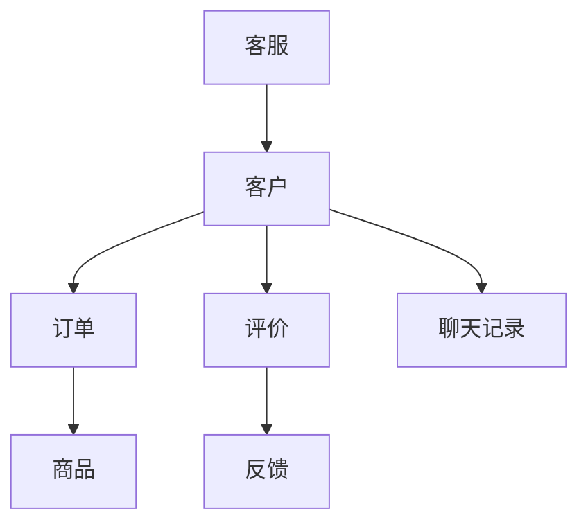
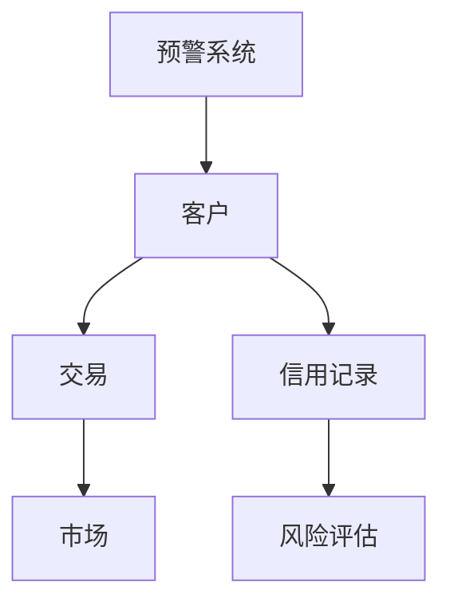
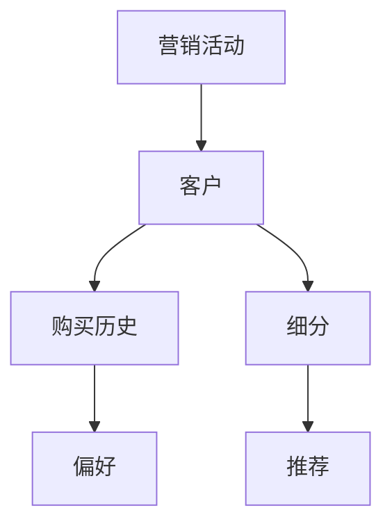
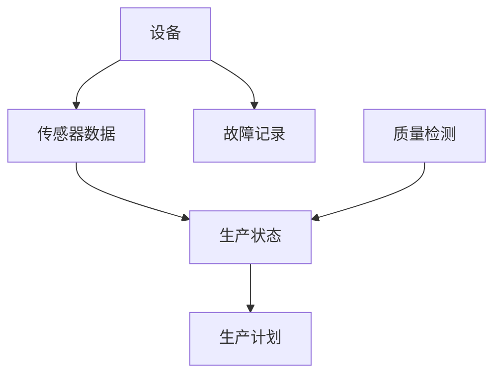
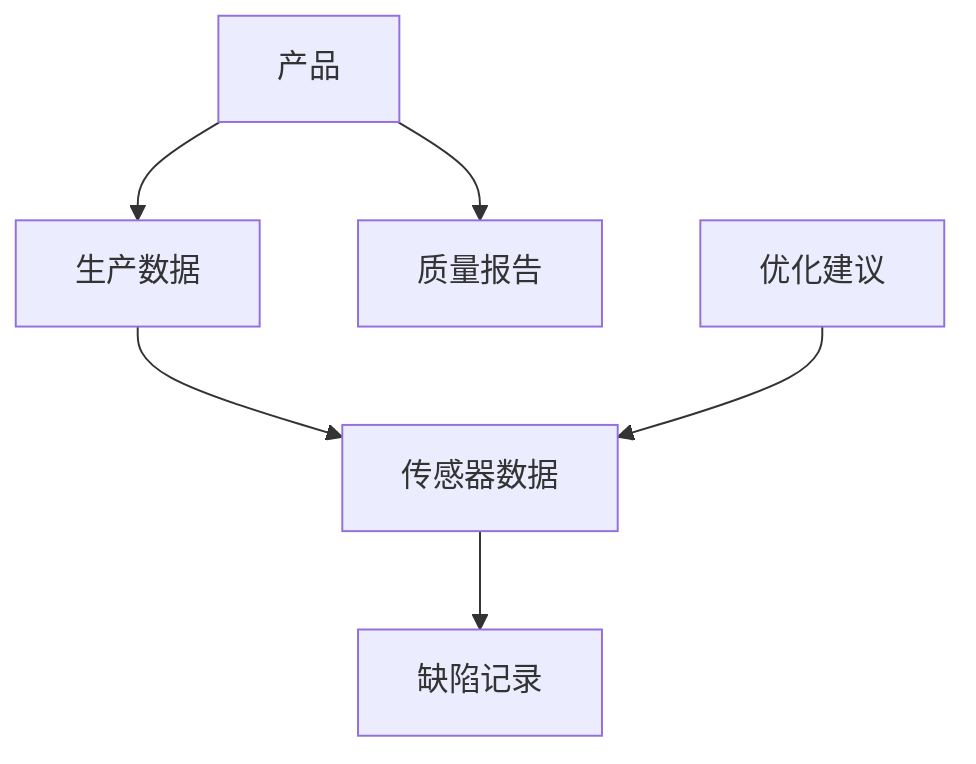
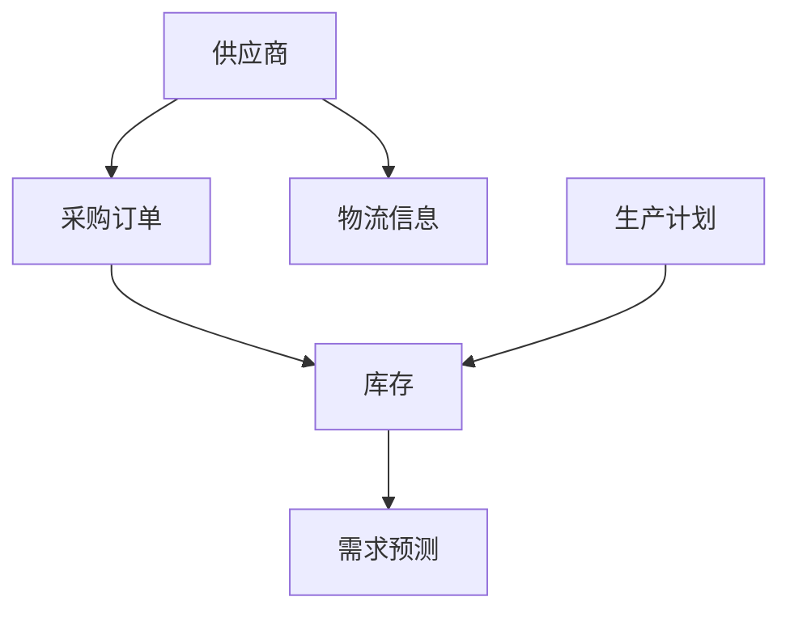
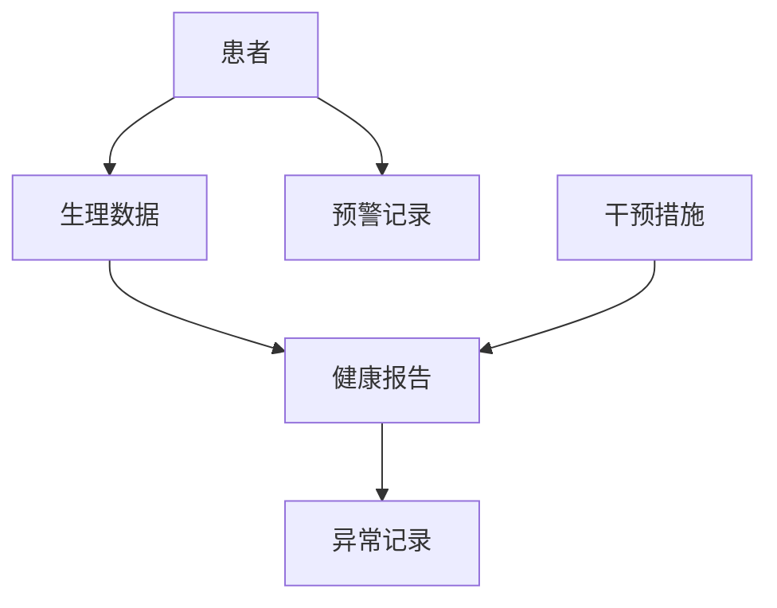
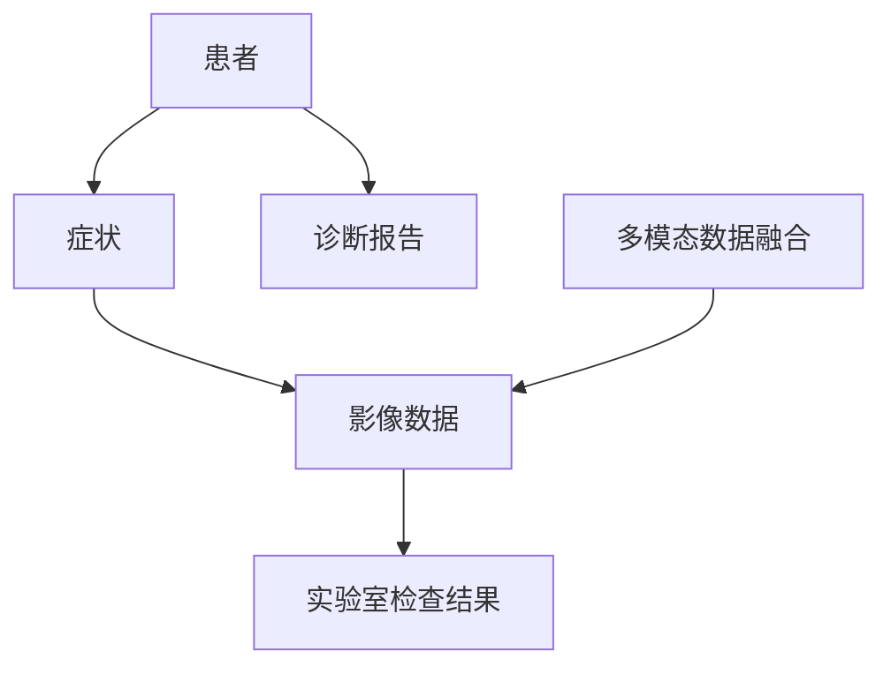
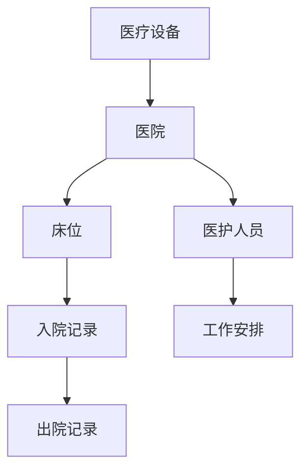

                 

### 文章标题

> 关键词：AI代理，工作流，分析引擎，数据挖掘，机器学习，自然语言处理，商业应用，制造业应用，医疗保健应用，未来趋势

### 摘要

本文旨在深入探讨AI代理工作流中的分析引擎，从概念理解、技术原理到实际应用，全方位揭示AI代理在现代企业和各个领域中的重要作用。文章首先介绍AI代理的基本概念和工作原理，分析其与传统自动化系统的差异以及在实际中的应用场景。接着，本文将详细讲解AI代理的核心技术，如机器学习、深度学习和自然语言处理，并探讨这些技术在AI代理开发中的具体应用。随后，文章重点分析分析引擎的作用和架构，讨论数据收集与处理、数据分析和可视化的方法。在此基础上，本文将探讨AI代理工作流的设计与实现，包括工作流设计原则、实现技术和性能优化与监控。最后，文章将通过具体案例，展示AI代理在商业、制造业和医疗保健领域的实际应用，并展望AI代理工作流的发展趋势和社会影响。通过本文的阅读，读者将全面了解AI代理工作流的概念、技术和应用，为未来在相关领域的发展奠定基础。

---

### 第一部分：理解AI代理工作流

#### 第1章: AI代理工作流概述

##### 1.1 AI代理的概念与工作原理

AI代理（Artificial Intelligence Agent）是指能够感知环境、自主决策并采取行动以实现特定目标的计算机系统。在人工智能领域，AI代理被视为智能体系统的基本组成部分，它们可以模拟人类的行为，甚至超越人类的某些能力。

**定义AI代理**

AI代理可以定义为一种能够执行特定任务、具备自主性和适应性的计算机程序。这些代理通过感知环境、理解数据、做出决策并采取行动，以实现预定的目标。AI代理的核心特征包括：

1. **自主性**：代理能够独立执行任务，而不需要人为干预。
2. **适应性**：代理可以根据环境变化调整其行为。
3. **目标导向**：代理总是以实现特定目标为最终目的。

**工作原理**

AI代理的工作原理通常包括以下几个步骤：

1. **感知**：代理通过传感器（如摄像头、麦克风、触摸屏等）收集环境信息。
2. **理解**：代理利用自然语言处理（NLP）、图像识别等技术，将感知到的信息转换为有意义的数据。
3. **决策**：代理根据理解和分析的结果，利用机器学习算法、决策树等工具，选择最佳的行动方案。
4. **行动**：代理执行选定的行动，并观察结果，为下一步的决策提供反馈。

**核心功能**

AI代理的核心功能主要包括以下几个方面：

1. **环境建模**：代理能够构建环境模型，以更好地理解其所在的环境。
2. **决策制定**：代理利用决策算法，从多个可能的行动方案中选择最优的方案。
3. **行动执行**：代理执行所选的行动，并调整其行为以适应环境变化。
4. **反馈学习**：代理根据行动结果进行反馈学习，以提高其决策质量。

##### 1.2 AI代理与传统自动化系统的区别

传统自动化系统（如工业自动化、自动化流水线等）主要依赖于预设的程序和规则，缺乏灵活性和自主性。相比之下，AI代理则具有以下显著优势：

**传统自动化系统的局限性**

1. **固定规则**：传统自动化系统依赖于固定的规则和程序，难以适应复杂和多变的任务。
2. **低自主性**：传统自动化系统无法自主学习和调整，依赖于人为编程。
3. **不可扩展性**：传统自动化系统通常无法扩展到新的任务和环境。

**AI代理的优势**

1. **智能决策**：AI代理通过机器学习和深度学习算法，能够在复杂环境下做出智能决策。
2. **自主学习**：AI代理能够从数据中学习，不断优化其决策和行为。
3. **高度适应性**：AI代理能够根据环境变化调整其行为，适应新的任务和场景。
4. **可扩展性**：AI代理具有高度的可扩展性，可以轻松适应新的应用场景和任务。

**应用场景**

AI代理在多个领域具有广泛的应用，包括但不限于：

1. **商业智能**：AI代理可以用于需求预测、库存管理和市场分析。
2. **制造业**：AI代理可以用于生产优化、质量控制和智能调度。
3. **医疗保健**：AI代理可以用于诊断辅助、患者监护和医疗资源分配。

通过AI代理，企业可以大幅提升效率，降低成本，并实现智能化运营。AI代理与传统自动化系统的区别在于，它不仅具备自主性和适应性，还能够通过持续学习，不断优化其性能。

##### 1.3 AI代理的应用场景

AI代理在现代社会中已经广泛应用于多个领域，为企业和个人带来了显著的效益。以下是一些典型的AI代理应用场景：

**商业智能**

在商业智能领域，AI代理可以为企业提供智能决策支持。例如，通过分析历史销售数据和客户行为，AI代理可以预测未来的市场需求，帮助企业在产品开发和库存管理方面做出更明智的决策。此外，AI代理还可以用于市场分析，帮助企业了解客户需求和市场趋势，从而制定更有效的营销策略。

**制造业**

在制造业中，AI代理可以用于生产优化、质量控制、设备维护和供应链管理。例如，通过实时监测设备状态和生产流程，AI代理可以预测设备故障，并提前进行维护，以减少停机时间和生产损失。同时，AI代理还可以优化生产计划，提高生产效率和质量。

**医疗保健**

在医疗保健领域，AI代理可以用于疾病诊断、患者监护和医疗资源分配。例如，通过分析患者的医疗记录和症状，AI代理可以辅助医生做出更准确的诊断。此外，AI代理还可以监测患者健康状况，及时发现异常情况，并提供个性化的护理建议。

**客户服务**

在客户服务领域，AI代理可以用于自动回答客户问题、处理客户投诉和提供个性化服务。通过自然语言处理和机器学习技术，AI代理可以理解和处理客户的问题，提供24/7的服务，提高客户满意度。

**交通管理**

在交通管理领域，AI代理可以用于交通流量监控、交通事故预警和智能导航。通过实时分析交通数据，AI代理可以优化交通信号控制，减少交通拥堵，提高道路通行效率。

**农业**

在农业领域，AI代理可以用于作物监测、土壤分析和精准施肥。通过利用图像识别和传感器技术，AI代理可以实时监测作物生长情况，并提供针对性的农业管理建议，以提高农业生产效率和农产品质量。

通过这些应用场景，可以看出AI代理在现代企业和各个领域中的重要作用。它们不仅提高了工作效率和生产力，还为企业和个人带来了更多的价值。

#### 第2章: AI代理的核心技术

##### 2.1 人工智能基础

人工智能（Artificial Intelligence，简称AI）是计算机科学的一个分支，旨在创建能够模拟人类智能行为的机器。AI技术已经取得了显著的进展，为AI代理的开发和应用奠定了坚实的基础。

**机器学习**

机器学习（Machine Learning，简称ML）是人工智能的核心技术之一，它使计算机系统能够通过数据学习，从而自动改进其性能。机器学习可以分为以下几种类型：

1. **监督学习**：监督学习通过已标记的训练数据来训练模型，然后使用该模型对新数据进行预测。常见的监督学习算法包括线性回归、决策树和支持向量机（SVM）。
   
   ```pseudo
   // 线性回归伪代码
   model = LinearRegression()
   model.fit(X_train, y_train)
   y_pred = model.predict(X_test)
   ```

2. **无监督学习**：无监督学习不依赖于已标记的数据，而是通过发现数据中的模式和结构来训练模型。常见的无监督学习算法包括聚类算法（如K-means聚类）和降维技术（如主成分分析PCA）。

   ```pseudo
   // K-means聚类伪代码
   clusters = KMeans(n_clusters=k)
   clusters.fit(X)
   labels = clusters.predict(X)
   ```

3. **强化学习**：强化学习通过试错和奖励机制来训练模型，使其能够在特定环境中找到最优策略。强化学习算法如Q-learning和深度强化学习（Deep Reinforcement Learning）已经在游戏、自动驾驶和机器人控制等领域取得了成功。

   ```pseudo
   // Q-learning算法伪代码
   Q = initialize_Q()
   for episode in range(num_episodes):
       state = env.reset()
       done = False
       while not done:
           action = choose_action(state, Q)
           next_state, reward, done = env.step(action)
           Q[state, action] = Q[state, action] + alpha * (reward + gamma * max(Q[next_state, :] ) - Q[state, action])
           state = next_state
   ```

**深度学习**

深度学习（Deep Learning，简称DL）是机器学习的一个分支，它利用多层神经网络（Neural Networks）进行数据建模。深度学习在图像识别、自然语言处理和语音识别等领域取得了显著的成果。

1. **神经网络**

神经网络（Neural Networks，简称NN）是一种模仿生物神经系统工作的计算模型。它由多个神经元（节点）和连接这些神经元的边（权重）组成。神经元的激活函数决定了节点的输出。

   ```latex
   a_{i}(x) = \sigma(\sum_{j=1}^{n} w_{ji}x_{j} + b_{i})
   ```

   其中，\(a_{i}(x)\) 是第 \(i\) 个神经元的输出，\(\sigma\) 是激活函数，\(w_{ji}\) 是连接第 \(j\) 个神经元和第 \(i\) 个神经元的权重，\(x_{j}\) 是第 \(j\) 个神经元的输入，\(b_{i}\) 是第 \(i\) 个神经元的偏置。

2. **深度网络架构**

深度网络架构（Deep Neural Network，简称DNN）是指具有多个隐藏层的神经网络。深度网络通过增加隐藏层的数量，可以提取数据中的更高层次特征。

   ```pseudo
   // 前向传播伪代码
   z = X * W + b
   a = activation(z)
   ```

3. **卷积神经网络**

卷积神经网络（Convolutional Neural Network，简称CNN）是一种专门用于图像识别的神经网络。它通过卷积层和池化层提取图像特征。

   ```pseudo
   // 卷积层伪代码
   for each filter in convolutional layer:
       convolve filter with input image
       apply activation function to resulting feature map
   ```

4. **循环神经网络**

循环神经网络（Recurrent Neural Network，简称RNN）是一种能够处理序列数据的神经网络。RNN通过循环连接，能够记住前面的输入，并利用这些信息生成输出。

   ```pseudo
   // RNN伪代码
   h_t = tanh(W * [h_{t-1}, x_t] + b)
   y_t = W_o * h_t + b_o
   ```

**深度学习框架**

深度学习框架（如TensorFlow、PyTorch和Keras）是用于构建和训练深度神经网络的工具。这些框架提供了丰富的API和资源，使得深度学习模型的设计和实现变得更加简单和高效。

**应用场景**

1. **图像识别**：深度学习在图像识别领域取得了巨大成功，如人脸识别、物体检测和图像分类。
   
2. **自然语言处理**：深度学习在自然语言处理（NLP）领域也发挥了重要作用，如机器翻译、文本分类和情感分析。

3. **语音识别**：深度学习在语音识别领域取得了显著进展，使得自动语音识别系统变得更加准确和高效。

4. **推荐系统**：深度学习可以用于构建推荐系统，如商品推荐、电影推荐和音乐推荐。

通过机器学习和深度学习，AI代理能够实现更智能、更灵活的决策和行动，为各种应用场景提供强大的支持。

##### 2.2 强化学习

强化学习（Reinforcement Learning，简称RL）是一种通过试错和奖励机制来训练智能体的机器学习技术。强化学习主要分为两个分支：值函数方法和策略方法。以下是强化学习的基本概念和常用算法。

**强化学习的定义**

强化学习是一种使智能体在环境中通过与环境的交互来学习最优策略的过程。在这个过程中，智能体（Agent）通过选择行动（Action）来获得奖励（Reward），并不断调整其行为以最大化累积奖励。

**基本概念**

1. **状态（State）**：智能体所处的环境的一个特定描述。
2. **动作（Action）**：智能体可以采取的行动。
3. **奖励（Reward）**：智能体在执行某一动作后获得的即时奖励。
4. **策略（Policy）**：智能体的决策规则，用于选择在特定状态下应采取的最佳动作。
5. **值函数（Value Function）**：衡量智能体在特定状态下采取特定动作的长期奖励。
6. **模型（Model）**：对环境动态的预测。

**Q-learning算法**

Q-learning是一种基于值函数的强化学习算法，旨在通过迭代更新Q值（状态-动作值函数），以找到最优策略。以下是Q-learning算法的伪代码：

```pseudo
// Q-learning伪代码
Initialize Q(s, a) with random values
for all episodes do
  Initialize state s
  while not done do
    Choose action a using ε-greedy policy
    Take action a and observe reward r and next state s'
    Update Q(s, a) using the update rule
    s <- s'
  end while
end for
```

更新规则为：

```pseudo
Q(s, a) = Q(s, a) + α [r + γ max(Q(s', a')) - Q(s, a)]
```

其中，\(α\) 是学习率，\(γ\) 是折扣因子，表示未来奖励的权重。

**深度强化学习**

深度强化学习（Deep Reinforcement Learning，简称DRL）是将深度学习与强化学习相结合的一种技术。深度强化学习通过使用深度神经网络来近似值函数或策略，以处理高维状态空间和动作空间。以下是深度强化学习的核心概念：

1. **深度Q网络（Deep Q-Network，DQN）**：DQN使用深度神经网络来近似Q值函数，从而提高Q-learning算法的准确性和效率。
2. **策略梯度方法**：策略梯度方法通过直接优化策略来最大化累积奖励。其中，常用的策略梯度方法包括策略迭代（Policy Iteration）和价值迭代（Value Iteration）。

**应用场景**

1. **游戏**：深度强化学习在游戏领域取得了显著成果，如Atari游戏的智能代理。
2. **自动驾驶**：深度强化学习在自动驾驶中用于控制车辆，实现自主驾驶。
3. **机器人控制**：深度强化学习在机器人控制中用于路径规划和任务执行。

**总结**

强化学习通过试错和奖励机制，使智能体能够自主学习和优化行为。深度强化学习通过结合深度学习技术，解决了高维状态空间和动作空间的问题，为AI代理的开发提供了强大的工具。这些技术正在不断推动人工智能的发展，并将在更多领域得到广泛应用。

##### 2.3 自然语言处理

自然语言处理（Natural Language Processing，简称NLP）是人工智能领域的一个重要分支，致力于使计算机能够理解和处理人类语言。NLP技术广泛应用于文本分析、机器翻译、情感分析和对话系统等领域。

**基本概念**

1. **词向量表示**：词向量是表示词语的分布式向量，用于捕捉词语的语义和上下文信息。常见的词向量模型包括Word2Vec、GloVe和BERT。
   
   ```latex
   \text{word\_vector}(w) = \text{Embedding}(w)
   ```

2. **文本分类**：文本分类是将文本数据分配到预定义的类别中。常用的文本分类模型包括朴素贝叶斯、支持向量机和深度学习模型。

3. **序列标注**：序列标注是将文本序列中的每个词分配一个标签，如命名实体识别（Named Entity Recognition，简称NER）和词性标注（Part-of-Speech Tagging）。

4. **机器翻译**：机器翻译是将一种语言的文本翻译成另一种语言。常见的机器翻译模型包括基于规则的方法、统计机器翻译和神经机器翻译（如Transformer）。

5. **情感分析**：情感分析是判断文本的情感极性，如正面、负面或中立。常用的情感分析模型包括朴素贝叶斯、支持向量机和深度学习模型。

**核心技术**

1. **卷积神经网络（CNN）**：CNN是一种用于图像识别的神经网络，也可用于文本处理，通过捕捉文本中的局部特征来实现文本分类和序列标注。

   ```pseudo
   // 卷积神经网络文本分类伪代码
   for each filter in convolutional layer:
       convolve filter with input text
       apply activation function to resulting feature map
   ```

2. **循环神经网络（RNN）**：RNN是一种用于处理序列数据的神经网络，通过记忆过去的信息来处理文本序列。常见的RNN模型包括LSTM（Long Short-Term Memory）和GRU（Gated Recurrent Unit）。

   ```pseudo
   // LSTM单元伪代码
   i_t = sigmoid(W_i * [h_{t-1}, x_t] + b_i)
   f_t = sigmoid(W_f * [h_{t-1}, x_t] + b_f)
   C_t = f_t * C_{t-1} + i_t * \text{tanh}(W_c * [h_{t-1}, x_t] + b_c)
   o_t = sigmoid(W_o * [h_{t-1}, x_t, C_t] + b_o)
   h_t = o_t * \text{tanh}(C_t)
   ```

3. **Transformer模型**：Transformer是一种基于自注意力机制的神经网络，通过全局 attenton 能够捕捉文本中的长距离依赖关系。Transformer模型在机器翻译、文本分类和对话系统等领域取得了显著成果。

   ```pseudo
   // Transformer自注意力伪代码
   Q = \text{Query}(h_t)
   K = \text{Key}(h_t)
   V = \text{Value}(h_t)
   attention = softmax(\frac{QK^T}{\sqrt{d_k}})V
   ```

**对话系统**

对话系统是一种使计算机能够与人类进行自然语言交互的系统。常见的对话系统包括基于规则的系统、基于模板的系统和学习型对话系统。

1. **基于规则的系统**：基于规则的系统通过预定义的规则来生成回答，适用于简单的问答场景。
2. **基于模板的系统**：基于模板的系统通过模板和填充词来生成回答，适用于更加复杂的对话场景。
3. **学习型对话系统**：学习型对话系统通过机器学习和自然语言处理技术来生成回答，适用于自适应和个性化的对话场景。

**应用场景**

1. **客户服务**：对话系统可以用于自动回答客户问题，提高客户满意度和服务效率。
2. **智能助手**：智能助手（如Siri、Alexa和Google Assistant）通过自然语言处理技术，实现语音交互和任务执行。
3. **语音识别**：语音识别技术将语音转换为文本，使计算机能够理解和处理人类的语音指令。
4. **文本生成**：文本生成技术（如生成对抗网络GPT）能够生成高质量的文本，应用于新闻写作、文学创作和机器翻译等领域。

通过自然语言处理技术，AI代理能够实现与人类的自然语言交互，从而在各个领域提供更智能、更个性化的服务。

#### 第3章: 分析引擎在AI代理工作流中的应用

##### 3.1 分析引擎的作用与架构

分析引擎（Analytics Engine）是AI代理工作流中的一个核心组件，用于从大量数据中提取有价值的信息和洞察。分析引擎的作用主要包括数据收集、数据处理、数据分析和数据可视化。以下是对分析引擎作用和架构的详细探讨。

**分析引擎的定义**

分析引擎是一种计算系统，能够从数据中提取有用的信息和洞察，以支持业务决策和优化操作。它利用各种算法和技术，如统计方法、机器学习和数据挖掘，对数据进行处理和分析。

**分析引擎的作用**

1. **数据收集**：分析引擎负责从各种数据源（如数据库、文件、传感器等）收集数据，并确保数据的质量和完整性。
2. **数据处理**：分析引擎对收集到的数据执行清洗、转换和整合等操作，以消除噪声和冗余，提高数据的质量和可用性。
3. **数据分析**：分析引擎使用统计方法、机器学习和数据挖掘技术，从数据中提取模式、关联和趋势，为业务决策提供支持。
4. **数据可视化**：分析引擎通过图表和可视化工具，将分析结果以直观的方式展示给用户，帮助用户更好地理解和利用数据。

**分析引擎的架构**

分析引擎的架构通常包括以下几个关键组成部分：

1. **数据源**：数据源是分析引擎的数据输入，可以是数据库、文件、API或传感器等。数据源需要提供可靠和高质量的数据，以保证分析结果的准确性。
2. **数据收集模块**：数据收集模块负责从数据源收集数据，并确保数据的质量和完整性。该模块通常包括数据采集器、数据清洗器和数据转换器。
3. **数据处理模块**：数据处理模块对收集到的数据执行清洗、转换和整合等操作。数据清洗器用于删除噪声和冗余数据，数据转换器用于将数据转换为统一的格式。
4. **数据存储模块**：数据存储模块用于存储处理后的数据，以便后续的数据分析和可视化。数据存储模块可以是关系型数据库、NoSQL数据库或数据仓库。
5. **分析模块**：分析模块使用各种算法和技术（如统计方法、机器学习和数据挖掘），从数据中提取有用的信息和洞察。常见的分析算法包括聚类、分类、回归和关联规则挖掘等。
6. **数据可视化模块**：数据可视化模块通过图表和可视化工具，将分析结果以直观的方式展示给用户。数据可视化可以采用各种图表类型，如柱状图、折线图、散点图和地图等。
7. **用户界面**：用户界面是分析引擎与用户交互的接口，用户可以通过界面浏览和分析结果，自定义数据视图和报告。

**图数据库**

图数据库是一种用于存储和查询图形数据的数据库系统。它通过图形结构来存储实体及其之间的关系，适用于复杂网络数据的存储和分析。图数据库在分析引擎中可以用于以下几个方面：

1. **实体关系建模**：图数据库可以用来建模实体及其关系，如客户与产品之间的关系、网络拓扑结构等。
2. **图查询**：图数据库支持高效的图查询操作，如路径查询、邻居查询和子图查询。
3. **社交网络分析**：图数据库可以用于社交网络分析，如社区发现、影响力分析和社交传播等。
4. **推荐系统**：图数据库可以用于推荐系统，如基于图结构的协同过滤和路径推荐等。

**实时分析模块**

实时分析模块是分析引擎的一个重要组成部分，它能够实时处理和反馈数据，支持实时决策和监控。实时分析模块通常包括以下几个关键功能：

1. **实时数据收集**：实时分析模块可以从各种数据源实时收集数据，如传感器数据、日志数据和实时流数据等。
2. **实时数据处理**：实时分析模块对实时数据进行实时处理，包括数据清洗、转换和整合等操作。
3. **实时分析算法**：实时分析模块使用高效的实时分析算法，如实时流处理算法、机器学习算法和数据挖掘算法等。
4. **实时数据可视化**：实时分析模块通过实时数据可视化工具，将实时分析结果以直观的方式展示给用户，支持实时监控和决策。

通过分析引擎的作用与架构的详细探讨，可以看出分析引擎在AI代理工作流中扮演着至关重要的角色。它通过数据收集、数据处理、数据分析和数据可视化，帮助AI代理从数据中提取有价值的信息和洞察，从而实现更智能、更高效的决策和行动。

##### 3.2 数据收集与处理

数据收集与处理是AI代理工作流中的关键环节，直接影响到分析引擎的性能和结果。以下是数据收集与处理的详细探讨，包括数据收集方法、数据处理技术以及数据质量的重要性。

**数据收集方法**

数据收集是分析引擎的基础步骤，涉及从多种数据源获取数据的过程。以下是几种常见的数据收集方法：

1. **数据库采集**：通过数据库连接器，从关系型数据库（如MySQL、PostgreSQL）或NoSQL数据库（如MongoDB、Cassandra）中获取数据。
2. **文件导入**：从文件系统中导入数据，包括CSV、Excel和JSON等格式。可以使用工具如Pandas和Python的os模块实现。
3. **API调用**：通过RESTful API或SOAP API，从外部系统或服务（如天气API、社交媒体API）中获取数据。可以使用库如requests和Retrofit进行API调用。
4. **传感器数据采集**：从传感器设备（如温度传感器、摄像头）中实时获取数据，适用于物联网（IoT）应用。可以使用传感器驱动程序和采集工具（如MQTT协议）进行数据采集。
5. **日志文件分析**：从系统的日志文件中收集数据，用于分析系统性能和异常事件。可以使用日志解析工具（如Logstash、Kibana）进行日志分析。

**数据处理技术**

数据处理是数据收集后的关键步骤，目的是将原始数据转换为适合分析和建模的形式。以下是几种常见的数据处理技术：

1. **数据清洗**：数据清洗是指去除数据中的噪声、缺失值和异常值，以提高数据质量。常见的数据清洗方法包括：
   - 缺失值处理：使用平均值、中位数或最常用值填充缺失值。
   - 异常值检测：使用统计学方法（如Z分数、IQR）或机器学习方法（如孤立森林）检测和去除异常值。
   - 数据标准化：将数据缩放到相同的范围，便于后续的建模和分析。

2. **数据转换**：数据转换是指将数据转换为适合分析和建模的形式。常见的数据转换方法包括：
   - 数据编码：将类别数据转换为数值数据，如使用独热编码或标签编码。
   - 数据集成：将来自多个数据源的数据合并成一个数据集，如使用数据库连接或数据仓库技术。
   - 数据规范化：将不同单位或比例的数据转换为相同的单位或比例，如归一化或标准化。

3. **数据整合**：数据整合是指将结构化和非结构化数据整合成一个统一的数据集。常见的数据整合方法包括：
   - 数据合并：将多个数据表合并成一个数据表，如使用SQL的JOIN操作。
   - 数据去重：去除重复的数据记录，以提高数据的唯一性和准确性。
   - 数据转换：将非结构化数据（如文本、图像）转换为结构化数据，如使用自然语言处理或计算机视觉技术。

**数据质量的重要性**

数据质量直接影响分析引擎的性能和结果。高质量的数据能够提供更准确、更可靠的洞察，从而支持更明智的决策。以下是数据质量的重要性：

1. **准确性**：数据准确性是指数据是否真实、准确地反映了实际情况。准确的数据是进行有效分析和决策的基础。
2. **完整性**：数据完整性是指数据是否完整、无缺失。完整的数据有助于更全面地了解业务场景和问题。
3. **一致性**：数据一致性是指数据在时间和空间上的一致性。一致的数据有助于消除冗余和混淆，提高数据的可用性和可靠性。
4. **及时性**：数据及时性是指数据是否能够及时更新和获取。及时的数据能够支持实时分析和决策，提高业务响应速度。

为了确保数据质量，需要采取以下措施：

1. **数据验证**：在数据收集和输入过程中，进行数据验证，确保数据满足预定的格式和约束。
2. **数据监控**：定期监控数据质量，及时发现和处理数据异常和问题。
3. **数据治理**：建立数据治理体系，包括数据规范、数据安全和数据权限管理等，确保数据的规范化和标准化。

通过数据收集与处理，AI代理工作流能够获取高质量的数据，为后续的数据分析和决策提供坚实基础。数据收集和处理技术的选择和实施，直接影响到分析引擎的性能和结果，需要根据具体业务场景和需求进行综合考虑。

##### 3.3 数据分析与可视化

数据分析与可视化是AI代理工作流中至关重要的环节，它能够将数据转化为有价值的洞察和决策支持。以下将详细探讨数据分析的方法、常见的数据分析工具以及数据可视化的技术和应用。

**数据分析的方法**

数据分析是利用统计学、机器学习、数据挖掘等方法，从数据中提取有价值信息和模式的过程。以下是几种常见的数据分析方法：

1. **描述性统计分析**：描述性统计分析用于描述数据的基本特征，如均值、中位数、方差、标准差等。这些统计量能够帮助用户快速了解数据分布和趋势。

2. **回归分析**：回归分析用于研究变量之间的关系，如线性回归、多元回归等。回归分析可以用来预测变量值，如预测销售额、股票价格等。

3. **聚类分析**：聚类分析是将数据分为若干个类别，使同一类别内的数据尽可能相似，而不同类别之间的数据尽可能不同。常见的聚类算法包括K-means、层次聚类等。

4. **关联规则挖掘**：关联规则挖掘用于发现数据中的隐含关联关系，如市场篮子分析、交叉销售机会等。常见的算法包括Apriori算法、FP-growth算法等。

5. **时间序列分析**：时间序列分析用于研究时间序列数据的变化趋势和周期性，如股票价格、销量等。常见的方法包括ARIMA模型、LSTM网络等。

**常见的数据分析工具**

在数据分析过程中，使用合适的工具能够显著提高效率和效果。以下是几种常见的数据分析工具：

1. **Pandas**：Pandas是一个强大的Python库，用于数据处理和分析。它提供了丰富的数据处理功能，如数据清洗、转换和合并等。

2. **NumPy**：NumPy是一个Python库，用于数值计算和数据处理。它提供了多维数组对象和一系列数学函数，是数据分析的基础。

3. **Matplotlib**：Matplotlib是一个用于数据可视化的Python库。它提供了丰富的绘图函数，可以生成各种类型的图表，如柱状图、折线图、散点图等。

4. **Seaborn**：Seaborn是一个基于Matplotlib的数据可视化库，专注于统计图形。它提供了丰富的可视化模板和高级功能，可以生成精美的统计图表。

5. **Tableau**：Tableau是一个商业数据可视化工具，提供了直观的可视化界面和强大的数据分析功能。它支持多种数据连接和数据源，适合企业级数据分析。

**数据可视化的技术和应用**

数据可视化是将数据分析结果以图形形式展示，帮助用户更好地理解和利用数据的技术。以下是几种常见的数据可视化技术和应用：

1. **图表类型**：图表类型的选择取决于数据类型和分析目标。常见的图表类型包括：
   - 柱状图：用于比较不同类别或时间点的数据。
   - 折线图：用于展示数据的变化趋势和周期性。
   - 散点图：用于展示数据之间的关系和分布。
   - 饼图：用于展示数据的占比和比例。
   - 地图：用于展示地理空间数据。

2. **交互式可视化**：交互式可视化允许用户与图表进行互动，如缩放、筛选和过滤等。交互式可视化工具包括D3.js、Plotly等。

3. **实时可视化**：实时可视化能够动态展示数据流的变化，适用于实时监控和分析。实时可视化工具包括Kibana、Grafana等。

4. **动态图表**：动态图表通过动画和过渡效果，展示数据的变化过程，增强可视化效果。动态图表工具包括ECharts、Highcharts等。

**应用场景**

1. **商业智能**：数据可视化在商业智能应用中广泛使用，如销售数据分析、客户细分和市场趋势分析等。

2. **金融市场**：数据可视化在金融市场分析中用于展示股票价格、交易量和市场走势等。

3. **医疗保健**：数据可视化在医疗数据分析中用于展示患者数据、药物疗效和疾病趋势等。

4. **制造业**：数据可视化在制造业中用于监控生产过程、设备状态和质量控制等。

通过数据分析和可视化，AI代理工作流能够将复杂的数据转化为直观的图表和报告，帮助用户更好地理解和利用数据，从而做出更明智的决策。

#### 第4章: AI代理工作流的设计与实现

##### 4.1 工作流设计原则

设计一个高效、灵活且易于维护的AI代理工作流是确保其成功实施的关键。以下是一些核心设计原则，这些原则有助于确保工作流的模块化、可扩展性和灵活性。

**模块化设计**

模块化设计是一种将系统分解为独立的、可重用的模块的方法。每个模块负责特定功能，可以独立开发和测试，然后组合成一个完整的系统。模块化设计的优势包括：

1. **可重用性**：模块可以跨不同项目重用，提高开发效率。
2. **可维护性**：模块化系统更容易维护和更新，因为更改仅限于特定模块。
3. **灵活性**：模块化设计允许系统根据需求进行灵活扩展和调整。

**设计步骤**

1. **需求分析**：确定工作流的目标和需求，包括数据输入、处理和分析的步骤。
2. **功能分解**：将工作流分解为若干个独立的功能模块，每个模块实现特定功能。
3. **接口定义**：定义模块之间的接口，包括数据输入、输出和交互协议。
4. **模块实现**：实现每个模块的功能，并进行单元测试和集成测试。
5. **模块集成**：将所有模块集成到一个完整的工作流中，进行系统测试和性能优化。

**模块化示例**

假设一个AI代理工作流包括以下模块：

1. **数据收集模块**：负责从各种数据源收集数据，如数据库、API和传感器。
2. **数据处理模块**：负责清洗、转换和整合收集到的数据。
3. **分析模块**：负责执行数据分析和挖掘任务，如聚类、分类和回归分析。
4. **可视化模块**：负责将分析结果以图表和报告的形式展示给用户。
5. **决策模块**：负责根据分析结果生成决策建议，如优化策略和行动方案。

**可扩展性和灵活性**

可扩展性是指系统能够随着数据量和业务需求的增长而扩展。灵活性是指系统能够适应不同的业务场景和需求变化。

1. **可扩展性设计**：通过使用分布式架构和云服务，系统可以水平扩展，以处理更大的数据量和更复杂的任务。
2. **动态资源分配**：使用容器技术（如Docker和Kubernetes）实现动态资源分配，以根据工作负载自动调整系统资源。
3. **模块化接口**：设计模块化接口，使得新模块可以轻松集成到现有系统中，而不需要修改现有模块。
4. **配置管理**：使用配置管理工具（如Ansible和Chef）实现系统配置的自动化和管理，提高系统的灵活性和可维护性。

**总结**

模块化设计、可扩展性和灵活性是设计高效AI代理工作流的核心原则。通过这些原则，可以构建一个灵活、可重用且易于维护的AI代理系统，从而支持企业的智能化运营和决策。

##### 4.2 工作流实现技术

实现一个高效、可靠的AI代理工作流需要选择合适的工具和技术。以下是一些常见的工作流实现技术，包括流程管理工具、集成与适配方法，以及性能优化与监控策略。

**流程管理工具**

流程管理工具（Workflow Management Tools）用于定义、执行和监控工作流任务。以下是几种流行的流程管理工具：

1. **Apache Airflow**：Apache Airflow是一个开源的工作流管理平台，用于自动化和调度复杂的、基于时间的数据处理任务。它具有强大的图形界面和灵活的调度功能，支持多种数据源和执行环境。

   ```yaml
   # Airflow DAG 示例
   from datetime import datetime, timedelta
   from airflow import DAG
   from airflow.operators.bash_operator import BashOperator

   default_args = {
       'owner': 'airflow',
       'depends_on_past': False,
       'email_on_failure': False,
       'email_on_retry': False,
       'retries': 1,
       'retry_delay': timedelta(minutes=5),
   }
   dag = DAG('example_dag', default_args=default_args, schedule_interval=timedelta(days=1))

   task1 = BashOperator(
       task_id='download_data',
       bash_command='wget https://example.com/data.csv',
       dag=dag,
   )
   ```

2. **Apache NiFi**：Apache NiFi是一个数据流平台，用于数据集成和自动化。它提供了一个图形用户界面，用户可以通过拖放操作构建数据处理和数据传输的流程。NiFi支持各种数据源和目的地，如数据库、文件系统和Hadoop集群。

   ```xml
   <!-- NiFi流程定义示例 -->
   <process-group id="my-process-group">
       <processor id="get-data" class="org.apache.nifi.processors.standard.GetFile">
           <parameter name="Directory">/path/to/data</parameter>
           <parameter name="FileExtension">.csv</parameter>
       </processor>
       <processor id="clean-data" class="org.apache.nifi.processors.standard.Clean">
           <parameter name="RemoveInvalidCharacters">true</parameter>
       </processor>
       <connection from-node="get-data" to-node="clean-data"/>
   </process-group>
   ```

3. **Kubernetes**：Kubernetes是一个开源的容器编排平台，用于部署、管理和扩展容器化应用。它支持自动化部署、服务发现、负载均衡和自我修复等特性，适用于大规模的分布式系统。

   ```yaml
   # Kubernetes Deployment 示例
   apiVersion: apps/v1
   kind: Deployment
   metadata:
     name: my-app
   spec:
     replicas: 3
     selector:
       matchLabels:
         app: my-app
     template:
       metadata:
         labels:
           app: my-app
       spec:
         containers:
         - name: my-app
           image: my-app:latest
           ports:
           - containerPort: 80
   ```

**集成与适配方法**

在实现AI代理工作流时，需要将不同系统和技术集成在一起，以确保数据流的顺畅和系统的协同工作。以下是一些集成与适配方法：

1. **API集成**：使用API将不同的系统连接起来，如将数据库数据通过API导入到分析引擎或数据仓库。
2. **消息队列**：使用消息队列（如Apache Kafka、RabbitMQ）实现异步通信和数据流传输，确保系统的高可用性和可靠性。
3. **数据管道**：使用数据管道（如Apache NiFi、Apache Airflow）将数据从源系统传输到目标系统，进行清洗、转换和整合。
4. **服务网格**：使用服务网格（如Istio、Linkerd）实现服务间的通信和安全，提高系统的灵活性和可扩展性。

**性能优化与监控**

性能优化和监控是确保AI代理工作流高效运行的重要环节。以下是一些性能优化与监控策略：

1. **负载均衡**：使用负载均衡器（如Nginx、HAProxy）将流量分配到多个实例，提高系统的并发处理能力和响应速度。
2. **缓存策略**：使用缓存（如Redis、Memcached）缓存常用数据和中间结果，减少数据库访问和计算开销。
3. **数据库优化**：使用数据库优化技术（如索引、分区、查询优化），提高数据库的查询性能和响应速度。
4. **监控与告警**：使用监控工具（如Prometheus、Grafana）实时监控系统性能和资源使用情况，并设置告警，及时发现和解决性能问题。

**总结**

选择合适的流程管理工具、实现集成与适配方法，以及进行性能优化与监控，是确保AI代理工作流高效、可靠运行的关键。通过这些技术，可以构建一个灵活、可扩展且易于维护的AI代理系统，从而支持企业的智能化运营和决策。

##### 4.3 性能优化与监控

在AI代理工作流中，性能优化和监控是确保系统高效、稳定运行的重要环节。以下将详细探讨性能优化方法和监控策略，包括如何通过算法优化、架构调整和工具选择来提高工作流性能，以及如何使用监控工具和告警系统来确保系统的健康状态。

**性能优化方法**

1. **算法优化**：选择高效的算法和数据结构是实现性能优化的关键。以下是一些常见的算法优化方法：

   - **分布式计算**：利用分布式计算框架（如Apache Spark、Apache Flink）来处理大规模数据，提高数据处理速度。
   - **并行处理**：使用并行算法和并行编程模型（如MapReduce、Spark SQL）来加速计算任务。
   - **内存管理**：优化内存使用，减少垃圾回收和内存溢出，提高系统性能。
   - **缓存技术**：使用缓存（如Redis、Memcached）来缓存常用数据和中间结果，减少数据库访问和计算开销。

2. **架构调整**：通过调整系统架构，可以显著提高工作流的性能。以下是一些常见的架构优化方法：

   - **垂直扩展**：通过增加硬件资源（如CPU、内存）来提高系统的处理能力。
   - **水平扩展**：使用分布式架构和容器化技术（如Kubernetes、Docker）来实现水平扩展，以处理更大的数据量和更复杂的任务。
   - **缓存层**：在数据库和应用程序之间添加缓存层，减少数据库负载和响应时间。
   - **负载均衡**：使用负载均衡器（如Nginx、HAProxy）将流量分配到多个实例，提高系统的并发处理能力和响应速度。

3. **数据库优化**：数据库性能对整个工作流的影响至关重要。以下是一些数据库优化方法：

   - **索引**：使用合适的索引（如B树索引、哈希索引）来提高查询性能。
   - **分区**：将大型数据库表分区，以提高查询速度和数据管理效率。
   - **查询优化**：优化SQL查询，减少查询执行时间，如避免子查询、减少使用临时表等。

**监控策略**

1. **指标收集**：监控系统的性能和健康状况需要收集一系列关键指标，如CPU使用率、内存使用率、磁盘I/O、网络流量等。以下是一些常用的监控指标：

   - **系统资源使用情况**：监控CPU、内存、磁盘和网络的利用情况。
   - **应用程序性能**：监控应用程序的响应时间、吞吐量和错误率。
   - **数据库性能**：监控数据库的查询性能、连接数和事务处理时间。

2. **监控工具**：使用监控工具来实时收集和展示系统的性能数据。以下是一些流行的监控工具：

   - **Prometheus**：Prometheus是一个开源的监控解决方案，提供强大的数据采集和告警功能，适用于大规模分布式系统。
   - **Grafana**：Grafana是一个开源的监控仪表板工具，支持多种数据源，可以创建自定义的监控仪表板和告警。
   - **Zabbix**：Zabbix是一个开源的监控解决方案，提供丰富的监控功能，包括性能监控、告警和报告。

3. **告警系统**：告警系统用于在系统出现性能问题或异常时通知相关人员。以下是一些告警系统策略：

   - **阈值告警**：设置关键指标的阈值，当指标超过阈值时触发告警。
   - **基于模型的告警**：使用机器学习模型预测系统性能，当预测性能低于预期时触发告警。
   - **集中式告警**：使用集中式告警系统（如PagerDuty、OpsGenie）来统一管理告警，确保及时响应和处理。

**总结**

性能优化和监控是确保AI代理工作流高效、稳定运行的关键。通过算法优化、架构调整和工具选择，可以显著提高工作流性能。同时，使用监控工具和告警系统，可以实时监控系统性能和健康状况，及时发现和解决性能问题，确保系统的健康运行。

#### 第5章: 商业领域的AI代理应用案例

##### 5.1 客户服务代理

客户服务代理（Customer Service Agent）是一种利用人工智能技术提供自动客户服务的智能系统。通过自然语言处理和机器学习算法，客户服务代理能够理解和回应用户的问题，提供高效的客户支持。

**案例分析**

以某电商企业为例，该企业通过部署客户服务代理，实现了24/7全天候的客户支持。以下是客户服务代理的应用案例：

1. **常见问题自动回复**：客户服务代理通过分析历史客户咨询数据，自动识别常见问题，并提供相应的解决方案。例如，当客户询问退货流程时，代理可以自动生成详细步骤，减少人工干预。
2. **智能建议**：客户服务代理能够根据客户购买历史和偏好，提供个性化的产品推荐和促销信息。例如，当客户咨询某件商品时，代理可以推荐相似商品或相关配件，提高销售额。
3. **多渠道支持**：客户服务代理支持多种沟通渠道，如聊天机器人、社交媒体和邮件。通过整合这些渠道，企业可以提供一致的客户体验，提高客户满意度。

**功能实现**

客户服务代理的核心功能包括：

1. **自然语言理解**：利用自然语言处理技术，如词向量表示和序列模型（如LSTM、BERT），代理可以理解客户的提问，并将其转换为结构化的数据。
2. **意图识别**：通过机器学习算法（如朴素贝叶斯、决策树），代理可以识别客户的意图，如查询、投诉或建议。
3. **知识库管理**：客户服务代理使用知识库存储常见问题和解决方案。在接收到客户提问时，代理可以从知识库中检索相关答案。
4. **多语言支持**：通过翻译模型（如神经翻译模型），代理可以支持多种语言，提供跨国界的客户服务。

**图数据库**

在客户服务代理中，图数据库（如Neo4j）可以用于存储和管理客户关系网络。图数据库通过实体及其关系来表示客户数据，支持复杂的查询和关联分析。以下是一个图数据库的示例：



**实时分析模块**

实时分析模块在客户服务代理中用于监控和优化客户互动。实时分析包括：

1. **交互质量监控**：通过分析客户交互数据，如响应时间和满意度评分，实时评估代理的表现。
2. **异常检测**：利用机器学习算法，实时检测异常交互，如客户投诉或负面反馈。
3. **个性化推荐**：基于客户行为和偏好，实时生成个性化推荐，提高客户体验。

**总结**

客户服务代理通过自然语言处理和机器学习技术，实现了自动、高效的客户服务。利用图数据库和实时分析模块，企业可以更好地理解和满足客户需求，提高客户满意度和运营效率。

##### 5.2 风险管理代理

风险管理代理（Risk Management Agent）是一种利用人工智能技术进行风险分析和决策的智能系统。通过机器学习和数据分析，风险管理代理可以识别潜在风险，并提供预警和应对策略。

**案例分析**

以某金融机构为例，该机构通过部署风险管理代理，实现了风险自动识别和预警。以下是风险管理代理的应用案例：

1. **信用评分**：风险管理代理通过分析客户的信用历史、收入水平、还款记录等信息，自动生成信用评分，帮助金融机构进行信用风险评估。
2. **欺诈检测**：风险管理代理利用机器学习算法，分析交易数据，识别潜在欺诈行为。例如，当检测到某交易金额异常大时，代理可以发出警报，提醒金融机构进行进一步审查。
3. **风险预测**：风险管理代理通过分析历史数据和当前市场状况，预测潜在风险。例如，当市场波动较大时，代理可以预测风险并提前采取应对措施。

**功能实现**

风险管理代理的核心功能包括：

1. **数据收集与处理**：风险管理代理从多种数据源（如交易记录、市场数据、信用报告等）收集数据，并利用数据清洗、转换和整合技术，确保数据质量。
2. **风险识别与评估**：利用机器学习算法（如回归分析、分类算法），风险管理代理可以识别和评估潜在风险。
3. **预警与决策**：风险管理代理根据分析结果，生成预警报告和应对策略，提供实时决策支持。

**图数据库**

在风险管理代理中，图数据库（如Neo4j）可以用于存储和管理复杂的关系数据，如客户交易网络、市场关联等。以下是一个图数据库的示例：



**实时分析模块**

实时分析模块在风险管理代理中用于监控和更新风险模型。实时分析包括：

1. **实时监控**：通过实时数据流处理技术，如Apache Kafka和Apache Flink，风险管理代理可以持续监控交易数据和市场动态。
2. **风险预测**：利用机器学习算法，风险管理代理可以实时更新模型，预测新的风险。
3. **异常检测**：实时分析可以帮助识别交易数据中的异常行为，如欺诈交易。

**总结**

风险管理代理通过机器学习和数据分析技术，实现了自动的风险识别和预警。利用图数据库和实时分析模块，金融机构可以更好地理解和应对风险，提高风险管理效率。

##### 5.3 营销自动化代理

营销自动化代理（Marketing Automation Agent）是一种利用人工智能技术进行市场营销管理和优化的智能系统。通过数据分析和机器学习，营销自动化代理可以自动执行营销活动，提高营销效果和客户转化率。

**案例分析**

以某零售企业为例，该企业通过部署营销自动化代理，实现了精准营销和客户关系管理。以下是营销自动化代理的应用案例：

1. **客户细分**：营销自动化代理通过分析客户购买历史、行为数据和兴趣偏好，自动将客户分为不同的细分群体，如高价值客户、潜在客户等。
2. **个性化推荐**：营销自动化代理基于客户细分，自动生成个性化推荐和促销活动，提高客户参与度和购买意愿。
3. **自动营销流程**：营销自动化代理可以自动化执行营销流程，如邮件发送、短信推送、社交媒体广告等，实现高效、精准的营销。

**功能实现**

营销自动化代理的核心功能包括：

1. **数据收集与处理**：营销自动化代理从多种数据源（如CRM系统、社交媒体、网站分析工具等）收集数据，并利用数据清洗、转换和整合技术，确保数据质量。
2. **客户细分**：利用机器学习算法（如聚类算法、决策树），营销自动化代理可以自动识别和划分客户群体。
3. **个性化推荐**：基于客户细分，营销自动化代理可以自动生成个性化内容和促销活动。
4. **自动化营销流程**：通过工作流管理工具（如Apache Airflow），营销自动化代理可以自动化执行营销任务，如发送邮件、推送通知等。

**图数据库**

在营销自动化代理中，图数据库（如Neo4j）可以用于存储和管理客户关系网络。以下是一个图数据库的示例：



**实时分析模块**

实时分析模块在营销自动化代理中用于监控和优化营销活动。实时分析包括：

1. **营销活动监控**：通过实时数据流处理技术，如Apache Kafka和Apache Flink，营销自动化代理可以实时监控营销活动的效果。
2. **客户行为分析**：利用机器学习算法，营销自动化代理可以实时分析客户行为，以优化营销策略。
3. **自动化调整**：基于实时分析结果，营销自动化代理可以自动调整营销活动和策略，以提高效果。

**总结**

营销自动化代理通过数据分析和机器学习技术，实现了自动化的客户细分、个性化推荐和营销流程。利用图数据库和实时分析模块，企业可以更精准地满足客户需求，提高营销效果和客户转化率。

#### 第6章: 制造业领域的AI代理应用案例

##### 6.1 智能制造代理

智能制造代理（Smart Manufacturing Agent）是一种利用人工智能技术进行生产和过程优化的智能系统。通过数据分析和机器学习，智能制造代理可以实时监控生产过程，识别潜在问题，并提出优化建议。

**案例分析**

以某制造企业为例，该企业通过部署智能制造代理，实现了生产过程自动化和效率提升。以下是智能制造代理的应用案例：

1. **设备状态监控**：智能制造代理通过传感器数据实时监控生产设备的运行状态，如温度、湿度、电压等，及时发现设备故障和异常。
2. **生产调度优化**：智能制造代理分析生产订单和设备状态，自动优化生产调度，确保生产任务按时完成，提高生产效率。
3. **质量监控**：智能制造代理利用机器学习算法分析生产数据，识别质量异常，提前采取纠正措施，提高产品质量。

**功能实现**

智能制造代理的核心功能包括：

1. **数据收集与处理**：智能制造代理从传感器、生产线控制系统和数据库中收集生产数据，并利用数据清洗、转换和整合技术，确保数据质量。
2. **设备状态监控**：利用实时数据处理和异常检测算法，智能制造代理可以实时监控设备状态，并及时发出故障预警。
3. **生产调度优化**：基于机器学习算法，智能制造代理分析生产订单和设备状态，自动生成最优的生产调度计划。
4. **质量监控**：智能制造代理利用数据挖掘和机器学习技术，分析生产数据，识别质量异常，并生成纠正建议。

**图数据库**

在智能制造代理中，图数据库（如Neo4j）可以用于存储和管理生产数据及其关系。以下是一个图数据库的示例：



**实时分析模块**

实时分析模块在智能制造代理中用于监控和优化生产过程。实时分析包括：

1. **实时监控**：通过实时数据处理技术，如Apache Kafka和Apache Flink，智能制造代理可以实时监控生产状态，并及时响应异常。
2. **生产调度优化**：利用机器学习算法，智能制造代理可以实时分析生产订单和设备状态，动态调整生产计划。
3. **质量监控**：通过实时数据分析，智能制造代理可以实时识别质量异常，并及时采取纠正措施。

**总结**

智能制造代理通过数据分析和机器学习技术，实现了生产过程的自动化和优化。利用图数据库和实时分析模块，企业可以更高效地监控和管理生产过程，提高生产效率和产品质量。

##### 6.2 质量控制代理

质量控制代理（Quality Control Agent）是一种利用人工智能技术进行质量检测和过程优化的智能系统。通过数据分析和机器学习，质量控制代理可以实时监控生产过程，识别质量异常，并提供改进建议。

**案例分析**

以某电子制造企业为例，该企业通过部署质量控制代理，实现了生产过程中质量问题的自动检测和快速纠正。以下是质量控制代理的应用案例：

1. **缺陷检测**：质量控制代理通过分析生产过程中的传感器数据和图像数据，实时识别产品缺陷，如焊点不良、电路板裂缝等。
2. **过程优化**：质量控制代理分析生产数据，识别导致质量问题的潜在原因，并提出优化建议，如调整工艺参数、改进生产设备等。
3. **数据分析**：质量控制代理对生产数据进行分析，生成质量报告，帮助企业管理层了解生产质量状况，制定改进计划。

**功能实现**

质量控制代理的核心功能包括：

1. **数据收集与处理**：质量控制代理从传感器、生产线控制系统和数据库中收集生产数据，并利用数据清洗、转换和整合技术，确保数据质量。
2. **缺陷检测**：利用机器学习算法（如深度学习、图像识别），质量控制代理可以实时识别生产过程中的缺陷。
3. **过程优化**：基于数据分析，质量控制代理可以识别导致质量问题的原因，并提出优化建议。
4. **数据分析**：质量控制代理对生产数据进行分析，生成质量报告，帮助企业管理层了解生产质量状况。

**图数据库**

在质量控制代理中，图数据库（如Neo4j）可以用于存储和管理生产数据及其关系。以下是一个图数据库的示例：



**实时分析模块**

实时分析模块在质量控制代理中用于监控和优化生产过程。实时分析包括：

1. **实时监控**：通过实时数据处理技术，如Apache Kafka和Apache Flink，质量控制代理可以实时监控生产状态，并及时识别缺陷。
2. **数据分析**：利用机器学习算法，质量控制代理可以实时分析生产数据，识别潜在的质量问题。
3. **异常检测**：通过异常检测算法，质量控制代理可以实时识别生产过程中的异常情况，并及时采取纠正措施。

**总结**

质量控制代理通过数据分析和机器学习技术，实现了生产过程中质量问题的自动检测和快速纠正。利用图数据库和实时分析模块，企业可以更高效地监控和管理生产质量，提高产品质量和市场竞争力。

##### 6.3 供应链管理代理

供应链管理代理（Supply Chain Management Agent）是一种利用人工智能技术进行供应链优化和管理的智能系统。通过数据分析和机器学习，供应链管理代理可以实时监控供应链各个环节，提高供应链的灵活性和效率。

**案例分析**

以某大型零售企业为例，该企业通过部署供应链管理代理，实现了供应链过程的全面优化和效率提升。以下是供应链管理代理的应用案例：

1. **库存管理**：供应链管理代理通过分析历史销售数据、市场需求和供应链库存，自动优化库存水平，减少库存积压和库存短缺。
2. **需求预测**：供应链管理代理利用机器学习算法，分析历史销售数据和市场趋势，准确预测未来需求，优化采购和生产计划。
3. **物流优化**：供应链管理代理分析物流数据，如运输时间、运输成本和运输路线，自动优化物流流程，提高运输效率。

**功能实现**

供应链管理代理的核心功能包括：

1. **数据收集与处理**：供应链管理代理从供应链各个环节（如库存系统、采购系统、物流系统等）收集数据，并利用数据清洗、转换和整合技术，确保数据质量。
2. **库存管理**：利用机器学习算法，供应链管理代理可以实时监控库存水平，自动调整库存策略，减少库存积压和库存短缺。
3. **需求预测**：通过分析历史销售数据和市场趋势，供应链管理代理可以准确预测未来需求，优化采购和生产计划。
4. **物流优化**：供应链管理代理分析物流数据，自动优化运输路线、运输时间和运输成本，提高物流效率。

**图数据库**

在供应链管理代理中，图数据库（如Neo4j）可以用于存储和管理供应链数据及其关系。以下是一个图数据库的示例：



**实时分析模块**

实时分析模块在供应链管理代理中用于监控和优化供应链过程。实时分析包括：

1. **实时监控**：通过实时数据处理技术，如Apache Kafka和Apache Flink，供应链管理代理可以实时监控供应链各个环节的状态。
2. **需求预测**：利用机器学习算法，供应链管理代理可以实时分析市场数据和销售数据，准确预测未来需求。
3. **物流优化**：通过实时数据分析，供应链管理代理可以动态调整物流计划，优化运输路线和时间，提高物流效率。

**总结**

供应链管理代理通过数据分析和机器学习技术，实现了供应链过程的自动化和优化。利用图数据库和实时分析模块，企业可以更高效地管理供应链，提高库存周转率和物流效率，降低运营成本。

#### 第7章: 医疗保健领域的AI代理应用案例

##### 7.1 患者监护代理

患者监护代理（Patient Monitoring Agent）是一种利用人工智能技术进行患者健康监测和异常检测的智能系统。通过数据分析和机器学习，患者监护代理可以实时监控患者的健康状况，及时发现异常情况，并提供预警和干预建议。

**案例分析**

以某医院为例，该医院通过部署患者监护代理，实现了患者健康状态的实时监测和异常预警。以下是患者监护代理的应用案例：

1. **实时健康监测**：患者监护代理通过连接传感器设备和医疗设备，实时收集患者的生理数据，如心率、血压、血糖等。
2. **异常检测**：利用机器学习算法，患者监护代理可以实时分析患者的生理数据，识别异常趋势和潜在的健康问题。
3. **预警与干预**：当检测到异常情况时，患者监护代理可以立即发出警报，并通知医护人员采取干预措施，如调整治疗方案或安排进一步的检查。

**功能实现**

患者监护代理的核心功能包括：

1. **数据收集与处理**：患者监护代理从传感器设备和医疗设备中收集生理数据，并利用数据清洗、转换和整合技术，确保数据质量。
2. **实时健康监测**：利用实时数据处理技术，患者监护代理可以实时监控患者的生理数据，并生成健康报告。
3. **异常检测**：利用机器学习算法（如回归分析、时间序列分析），患者监护代理可以实时分析患者的生理数据，识别异常趋势和潜在的健康问题。
4. **预警与干预**：当检测到异常情况时，患者监护代理可以立即发出警报，并通知医护人员采取干预措施。

**图数据库**

在患者监护代理中，图数据库（如Neo4j）可以用于存储和管理患者数据及其关系。以下是一个图数据库的示例：



**实时分析模块**

实时分析模块在患者监护代理中用于监控和优化患者健康监测。实时分析包括：

1. **实时监控**：通过实时数据处理技术，如Apache Kafka和Apache Flink，患者监护代理可以实时监控患者的生理数据，并及时生成健康报告。
2. **异常检测**：利用机器学习算法，患者监护代理可以实时分析患者的生理数据，识别异常趋势和潜在的健康问题。
3. **预警与干预**：当检测到异常情况时，患者监护代理可以立即发出警报，并通知医护人员采取干预措施，确保患者的健康安全。

**总结**

患者监护代理通过数据分析和机器学习技术，实现了对患者健康状况的实时监测和异常检测。利用图数据库和实时分析模块，医疗机构可以更高效地监控和管理患者健康，提高医疗服务质量和患者满意度。

##### 7.2 医疗诊断代理

医疗诊断代理（Medical Diagnosis Agent）是一种利用人工智能技术进行疾病诊断和辅助决策的智能系统。通过数据分析和深度学习，医疗诊断代理可以辅助医生进行疾病诊断，提高诊断准确率和效率。

**案例分析**

以某医院为例，该医院通过部署医疗诊断代理，实现了快速、准确的疾病诊断。以下是医疗诊断代理的应用案例：

1. **影像分析**：医疗诊断代理通过分析医疗影像（如X光片、CT、MRI），自动识别病变区域，并生成初步诊断报告。
2. **症状匹配**：医疗诊断代理通过分析患者的症状描述和历史病历，匹配可能的疾病诊断，并提供辅助诊断建议。
3. **多模态数据融合**：医疗诊断代理可以将不同来源的数据（如影像、实验室检查结果、患者症状）进行融合分析，提高诊断准确率。

**功能实现**

医疗诊断代理的核心功能包括：

1. **数据收集与处理**：医疗诊断代理从医疗影像、电子病历和实验室检查结果等数据源收集数据，并利用数据清洗、转换和整合技术，确保数据质量。
2. **影像分析**：利用深度学习算法（如卷积神经网络、生成对抗网络），医疗诊断代理可以自动识别医疗影像中的病变区域。
3. **症状匹配**：通过自然语言处理技术（如词嵌入、序列模型），医疗诊断代理可以分析患者的症状描述，匹配可能的疾病诊断。
4. **多模态数据融合**：医疗诊断代理利用多模态数据融合算法，将不同来源的数据进行整合，提高诊断准确率。

**图数据库**

在医疗诊断代理中，图数据库（如Neo4j）可以用于存储和管理医疗数据及其关系。以下是一个图数据库的示例：



**实时分析模块**

实时分析模块在医疗诊断代理中用于监控和优化诊断过程。实时分析包括：

1. **实时影像分析**：通过实时数据处理技术，如Apache Kafka和Apache Flink，医疗诊断代理可以实时分析医疗影像，生成初步诊断报告。
2. **症状匹配**：利用实时自然语言处理技术，医疗诊断代理可以实时分析患者的症状描述，匹配可能的疾病诊断。
3. **多模态数据融合**：医疗诊断代理实时整合不同来源的数据，提高诊断准确率。

**总结**

医疗诊断代理通过数据分析和深度学习技术，实现了对医疗影像和症状描述的自动分析，辅助医生进行准确、高效的疾病诊断。利用图数据库和实时分析模块，医疗机构可以提高诊断准确率和效率，改善患者诊疗体验。

##### 7.3 医疗资源优化代理

医疗资源优化代理（Medical Resource Optimization Agent）是一种利用人工智能技术进行医疗资源分配和优化管理的智能系统。通过数据分析和优化算法，医疗资源优化代理可以优化医疗资源的配置，提高医疗服务的效率和质量。

**案例分析**

以某医院为例，该医院通过部署医疗资源优化代理，实现了医疗资源的优化配置和高效利用。以下是医疗资源优化代理的应用案例：

1. **床位管理**：医疗资源优化代理通过分析患者的入院和出院数据，自动分配和调整床位，确保床位利用率最大化。
2. **人员调度**：医疗资源优化代理分析医护人员的工作安排和技能水平，自动优化人员调度，确保医疗服务的高效开展。
3. **设备管理**：医疗资源优化代理监控医疗设备的运行状态和使用情况，自动优化设备配置和维修计划，减少设备故障和停机时间。

**功能实现**

医疗资源优化代理的核心功能包括：

1. **数据收集与处理**：医疗资源优化代理从医院的HIS系统、LIS系统等数据源收集医疗资源使用数据，并利用数据清洗、转换和整合技术，确保数据质量。
2. **资源调度**：利用优化算法（如线性规划、遗传算法），医疗资源优化代理可以自动优化医疗资源的分配和调度，提高资源利用率。
3. **设备管理**：通过监控设备运行状态和使用情况，医疗资源优化代理可以自动优化设备配置和维修计划，减少设备故障和停机时间。
4. **预测分析**：利用机器学习算法（如时间序列分析、回归分析），医疗资源优化代理可以预测医疗资源的未来需求，提前进行资源调配。

**图数据库**

在医疗资源优化代理中，图数据库（如Neo4j）可以用于存储和管理医疗资源数据及其关系。以下是一个图数据库的示例：



**实时分析模块**

实时分析模块在医疗资源优化代理中用于监控和优化医疗资源使用。实时分析包括：

1. **实时监控**：通过实时数据处理技术，如Apache Kafka和Apache Flink，医疗资源优化代理可以实时监控医疗资源的使用情况，并生成实时分析报告。
2. **资源调度**：利用实时数据分析，医疗资源优化代理可以动态调整医疗资源的分配和调度，提高资源利用率。
3. **设备管理**：通过实时监控设备状态和使用情况，医疗资源优化代理可以实时优化设备配置和维修计划，减少设备故障和停机时间。

**总结**

医疗资源优化代理通过数据分析和优化算法，实现了医疗资源的优化配置和高效利用。利用图数据库和实时分析模块，医疗机构可以更有效地管理医疗资源，提高医疗服务质量和患者满意度。

### 第三部分：未来展望与趋势

#### 第8章: AI代理工作流的发展趋势

随着人工智能技术的不断进步，AI代理工作流在商业、工业、医疗等领域中的应用越来越广泛。未来，AI代理工作流将继续发展，并在多个方面取得突破，为企业和个人带来更多价值。

**人工智能伦理与隐私保护**

在AI代理工作流的发展中，伦理和隐私保护是一个重要议题。随着AI代理的广泛应用，涉及到大量的个人数据和企业敏感信息，如何保障这些数据的安全和隐私成为一个关键问题。

1. **伦理问题**：随着AI代理的智能化水平不断提高，它们在决策过程中可能会出现歧视、偏见等问题。如何制定合理的伦理规范，确保AI代理的决策公平、公正，是一个需要关注的问题。
   
   **解决策略**：
   - **透明性**：提高AI代理的透明性，使决策过程可解释，便于监督和审查。
   - **多样性**：在AI代理的开发和训练过程中，确保数据集的多样性，减少偏见和歧视。

2. **隐私保护**：在AI代理工作流中，如何保护用户的隐私和数据安全是一个关键挑战。随着数据隐私法规（如GDPR）的实施，企业需要采取有效的措施来保护用户隐私。

   **解决策略**：
   - **数据匿名化**：在数据收集和处理过程中，使用数据匿名化技术，减少个人身份信息的暴露。
   - **加密技术**：使用加密技术保护数据传输和存储过程中的隐私。

**AI代理的集成与协同**

未来，AI代理将不再孤立地运行，而是与其他系统集成，形成协同工作的工作流。这种集成与协同将提高整个系统的智能化水平和工作效率。

1. **集成挑战**：不同系统之间的数据格式、协议和接口可能存在差异，如何实现高效、可靠的集成是一个挑战。

   **解决策略**：
   - **标准化接口**：制定统一的接口标准和协议，简化系统间的集成。
   - **中台架构**：采用中台架构，将数据和服务进行整合，实现跨系统的数据共享和服务调用。

2. **协同工作**：多个AI代理协同工作，可以更好地应对复杂任务和多样化需求。

   **解决策略**：
   - **分布式计算**：利用分布式计算框架，实现多个AI代理的协同工作。
   - **服务总线**：通过服务总线实现不同系统之间的消息传递和协作。

**人工智能技术的未来发展方向**

随着人工智能技术的不断发展，未来将涌现出更多新型算法和技术，进一步推动AI代理工作流的发展。

1. **新算法研究**：新的机器学习算法、深度学习算法和强化学习算法将不断出现，提高AI代理的智能化水平。

   **研究方向**：
   - **自适应学习算法**：研究自适应学习算法，使AI代理能够根据环境变化和学习结果自动调整其行为。
   - **混合学习算法**：研究混合学习算法，将不同类型的算法相结合，提高AI代理的学习能力和泛化能力。

2. **应用领域扩展**：AI代理工作流将在更多新兴领域得到应用，如智慧城市、智慧农业、智能交通等。

   **应用潜力**：
   - **智慧城市**：通过AI代理工作流，实现城市资源优化、环境监测和应急管理。
   - **智慧农业**：通过AI代理工作流，实现农作物监测、病虫害预警和精准施肥。

**总结**

未来，AI代理工作流将在人工智能伦理与隐私保护、集成与协同、新算法研究和应用领域扩展等方面取得突破。通过不断优化和扩展，AI代理工作流将为企业和个人带来更多价值，推动人工智能技术的进一步发展。

#### 第9章: AI代理工作流在未来的社会影响

随着AI代理工作流在商业、工业、医疗等领域的广泛应用，它对社会各个方面将产生深远的影响，特别是在就业市场、商业模式和社会治理等方面。

**对就业市场的影响**

AI代理工作流的发展将对就业市场产生双重影响。一方面，它将替代某些低技能和重复性的工作岗位，如客服、库存管理和基本数据录入。另一方面，它也将创造新的就业机会，尤其是在AI代理的开发、维护和管理领域。

1. **职业变迁**：随着AI代理的普及，一些传统职业可能会消失，而新的职业将应运而生。例如，AI代理工程师、数据隐私专家和AI伦理顾问将成为新的职业需求。

   **解决策略**：
   - **技能更新**：劳动者需要不断更新自己的技能，适应新的技术环境。
   - **教育和培训**：企业和教育机构应提供相应的培训和再教育课程，帮助劳动者掌握新的技能。

2. **职业转换**：劳动者可以将其技能转移到新兴领域，如数据科学、机器学习和AI代理开发。

   **解决策略**：
   - **跨行业培训**：通过跨行业的培训项目，帮助劳动者掌握多个领域的技能。
   - **职业转换支持**：政府和企业可以提供职业转换支持，包括资金援助和职业咨询。

**对商业模式的变革**

AI代理工作流将对商业模式的各个方面产生影响，包括运营效率、客户体验和市场竞争力。

1. **数字化转型**：AI代理工作流将推动企业向数字化转型，提高运营效率和服务水平。

   **解决策略**：
   - **技术投资**：企业应加大在AI代理和相关技术上的投资，以实现数字化转型。
   - **业务流程重构**：通过重构业务流程，使企业能够更好地利用AI代理的优势。

2. **商业模式创新**：AI代理工作流将为企业提供新的商业模式创新机会，如个性化服务、智能推荐和自动化交易。

   **解决策略**：
   - **创新思维**：企业应鼓励创新思维，探索新的商业模式和业务模式。
   - **客户参与**：通过客户参与和市场调研，了解客户需求，推动商业模式创新。

**对社会治理的挑战**

AI代理工作流在公共领域中的应用将对社会治理模式带来新的挑战和机遇。

1. **治理模式创新**：AI代理工作流将推动社会治理模式的创新，如智能城市管理和公共资源优化。

   **解决策略**：
   - **数据共享**：通过数据共享和开放，提高社会治理的透明度和效率。
   - **智能决策支持**：利用AI代理工作流，提供智能决策支持，提高治理水平。

2. **风险与挑战**：AI代理工作流可能引发新的风险和挑战，如数据安全、隐私保护和伦理问题。

   **解决策略**：
   - **法律法规**：制定和完善相关法律法规，规范AI代理工作流的应用。
   - **伦理审查**：建立AI代理的伦理审查机制，确保其决策和行为符合伦理标准。

**总结**

AI代理工作流将对就业市场、商业模式和社会治理产生深远影响。通过合理的规划和策略，可以最大限度地发挥AI代理工作流的优势，同时应对其带来的挑战，为社会的发展创造更多价值。

### 附录

#### 附录 A: AI代理工作流开发工具与资源

开发AI代理工作流需要使用一系列工具和资源，包括开源工具、商业工具和学习资源。以下将详细介绍这些工具和资源。

**开源工具**

1. **TensorFlow**：TensorFlow是一个由Google开源的机器学习框架，广泛用于深度学习和强化学习。它提供了丰富的API和丰富的文档，适合开发复杂的人工智能应用。

   - 官网：[TensorFlow官网](https://www.tensorflow.org/)
   - 示例代码：[TensorFlow官方GitHub](https://github.com/tensorflow/tensorflow)

2. **PyTorch**：PyTorch是另一个流行的开源深度学习框架，它提供了灵活的动态计算图，使研究人员和开发者能够快速原型设计和迭代。

   - 官网：[PyTorch官网](https://pytorch.org/)
   - 示例代码：[PyTorch官方GitHub](https://github.com/pytorch/pytorch)

3. **Scikit-learn**：Scikit-learn是一个开源的机器学习库，提供了丰富的算法和工具，适合用于数据分析和机器学习应用。

   - 官网：[Scikit-learn官网](https://scikit-learn.org/)
   - 示例代码：[Scikit-learn官方GitHub](https://github.com/scikit-learn/scikit-learn)

**商业工具**

1. **Google Cloud AI**：Google Cloud AI是Google提供的一套云服务，包括预训练的模型、API和工具，适用于构建和部署AI代理。

   - 官网：[Google Cloud AI官网](https://cloud.google.com/ai)

2. **Amazon AI**：Amazon AI是Amazon提供的一套AI服务，包括Amazon SageMaker、Amazon Rekognition和Amazon Comprehend等，用于构建和部署AI代理。

   - 官网：[Amazon AI官网](https://aws.amazon.com/ai/)

**学习资源**

1. **在线课程**：多个在线教育平台提供了关于人工智能和机器学习的课程，如Coursera、edX和Udacity等。

   - Coursera：[Coursera人工智能课程](https://www.coursera.org/courses?query=artificial%20intelligence)
   - edX：[edX人工智能课程](https://www.edx.org/course-list?search=artificial+intelligence)
   - Udacity：[Udacity人工智能纳米学位](https://www.udacity.com/course/artificial-intelligence-nanodegree--nd101)

2. **书籍**：《人工智能：一种现代方法》、《Python机器学习》和《深度学习》是关于人工智能和机器学习的重要参考书籍。

   - 《人工智能：一种现代方法》：[书籍官网](https://www.amazon.com/Artificial-Intelligence-Modern-Approach-Stuart/dp/013374480X)
   - 《Python机器学习》：[书籍官网](https://www.amazon.com/Python-Machine-Learning-Second-Pedregosa/dp/1786462364)
   - 《深度学习》：[书籍官网](https://www.amazon.com/Deep-Learning-Adaptive-Computation-Machines/dp/0262039581)

3. **社区和论坛**：AI社区和论坛（如Reddit、Stack Overflow、Kaggle等）是学习和交流的好地方，可以找到丰富的资源和解决问题的建议。

   - Reddit：[AI论坛](https://www.reddit.com/r/AI/)
   - Stack Overflow：[AI标签](https://stackoverflow.com/questions/tagged/artificial-intelligence)
   - Kaggle：[AI比赛和项目](https://www.kaggle.com/competitions?search=ai)

通过使用这些开源工具、商业工具和学习资源，开发者可以更高效地构建和部署AI代理工作流，推动人工智能技术的发展和应用。

### 作者信息

作者：AI天才研究院/AI Genius Institute & 禅与计算机程序设计艺术 /Zen And The Art of Computer Programming

本文由AI天才研究院和《禅与计算机程序设计艺术》的作者共同撰写。AI天才研究院是一家专注于人工智能研究和应用的创新机构，致力于推动人工智能技术的发展和应用。而《禅与计算机程序设计艺术》的作者以其对计算机科学的深刻理解和独特的视角，为读者提供了深入浅出的编程哲学和技巧。通过本文的撰写，两位作者共同探讨了AI代理工作流的概念、技术、应用和未来发展趋势，旨在为读者提供全面、系统的AI代理工作流知识。

