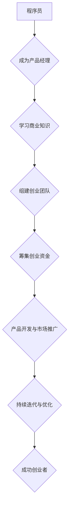

                 

### 《从程序员到创业者的蜕变之路》

> **关键词**：程序员、创业者、转变、准备、成长、案例、未来展望

> **摘要**：本文将探讨程序员转型为创业者的过程，包括自我认知、创业初期的准备与规划、实践与成长、团队管理与文化建设、财务与法律知识，以及创业者的心态与成长。通过成功创业者的经验分享，总结出创业者应具备的素质、经验和教训，为有志于创业的程序员提供参考和启示。

#### 引言

作为程序员，我们拥有独特的技能和专业知识，但你是否曾想过，这些技能和知识是否能够帮助你实现更大的梦想？在科技的快速发展中，许多程序员选择走出舒适区，转型成为创业者。他们希望通过自己的努力和智慧，创造新的价值，实现个人价值和社会贡献。

然而，从程序员到创业者的蜕变并非易事。这不仅需要我们具备深厚的专业技能，还需要我们具备创业所需的综合素质和策略。本文将为你详细解析这一转变之路，帮助你在创业的道路上少走弯路，提高成功的概率。

本文分为三个部分：

1. **入门与基础**：介绍程序员的角色与成长路径，创业者的角色与使命，以及程序员向创业者的转变过程。
2. **实践与成长**：讨论创业初期的准备与规划，产品设计与开发，市场推广与运营，团队管理与文化建设，财务与法律知识，以及创业者的心态与成长。
3. **案例与总结**：分享成功创业者的经验与启示，总结创业者的蜕变之路，并展望创业者的未来方向。

希望通过本文的阅读，你能够对从程序员到创业者的蜕变之路有更深刻的理解和认识，找到适合自己的创业方向，实现人生的价值。

#### 第一部分：入门与基础

### 第1章：从程序员到创业者的自我认知

在从程序员到创业者的转变过程中，自我认知是一个至关重要的环节。它不仅关系到我们如何定位自己，还关系到我们如何找到适合自己的创业方向。

#### 1.1 程序员的角色与成长路径

作为程序员，我们的主要职责是编写、测试、调试和维护代码。在这个过程中，我们不断提升自己的编程技能，掌握更多的编程语言和工具。同时，我们还需要具备良好的逻辑思维能力和问题解决能力。

程序员的职业发展可以分为以下几个阶段：

1. **初级程序员**：刚毕业的程序员通常在这个阶段，主要任务是学习和积累编程经验，熟悉公司的业务流程和开发工具。
2. **中级程序员**：在这个阶段，程序员已经具备了一定的编程技能和经验，能够独立完成中小型项目。他们开始承担更多的责任，参与项目的需求分析和设计。
3. **高级程序员**：高级程序员通常具备丰富的项目经验和专业技能，能够独立负责大型项目的开发和管理。他们还可能参与技术攻关和团队的技术培训。
4. **技术专家**：技术专家是程序员中的佼佼者，他们在某个领域具有深厚的专业知识和丰富的实践经验，能够解决复杂的技术问题，并对公司的技术发展方向提出建议。

#### 1.2 创业者的角色与使命

创业者与程序员有着本质的不同。创业者需要具备创新精神、领导能力和商业眼光，他们的目标是创建一个有价值的公司，为社会带来创新和变革。

创业者的角色和使命包括：

1. **创新者**：创业者需要不断寻找新的商业机会，通过创新的产品和服务来满足市场的需求。
2. **领导者**：创业者需要带领团队，制定战略，解决各种问题和挑战，确保公司的正常运转。
3. **商业推动者**：创业者需要具备商业眼光，了解市场需求，制定有效的营销策略，推动公司的发展。
4. **价值创造者**：创业者的最终目标是创造价值，为社会带来创新和进步。

#### 1.3 程序员向创业者的转变过程

从程序员到创业者的转变是一个复杂的过程，需要我们在多个方面进行提升和转变。

##### 1.3.1 观念的转变

首先，我们需要从程序员的角色中解放出来，摆脱对技术细节的过度关注，更多地关注商业价值和市场机会。这意味着我们需要转变思维模式，从解决问题转变为创造价值。

同时，我们还需要具备创业者的心态，敢于承担风险，勇于面对失败。创业是一条充满不确定性的道路，我们需要有足够的心理准备来应对各种挑战。

##### 1.3.2 技能的提升

在技能方面，我们需要进一步提升自己的领导能力、沟通能力和项目管理能力。这些能力是创业者成功的关键。

1. **领导能力**：创业者需要具备领导能力，能够激励和带领团队，实现共同的目标。
2. **沟通能力**：创业者需要具备良好的沟通能力，能够与团队成员、投资者和客户进行有效的沟通。
3. **项目管理能力**：创业者需要具备项目管理能力，能够制定项目计划，控制项目进度，确保项目成功完成。

##### 1.3.3 创业心态的塑造

最后，我们需要塑造创业心态。创业心态包括乐观、坚韧和持续学习。乐观可以帮助我们面对挑战，坚韧可以让我们在困境中坚持下去，持续学习可以让我们不断进步。

通过自我认知，我们可以更好地了解自己的优势和劣势，找到适合自己的创业方向。在接下来的章节中，我们将详细探讨创业初期的准备与规划，帮助你更好地准备创业之路。

#### 第2章：创业初期的准备与规划

在决定创业之后，如何开始创业初期的准备与规划是每一个创业者都需要面对的重要课题。这一阶段是创业成功的关键，涉及到项目选择、团队组建、资金筹集等多个方面。

##### 2.1 创业项目的选择

创业项目的选择是创业初期最关键的一步。一个有潜力的项目不仅能够为你带来商业上的成功，还能够为社会带来创新和变革。

在选择创业项目时，可以从以下几个方面进行考虑：

1. **市场需求**：首先，要分析市场需求，了解目标用户的需求和痛点。可以通过市场调研、用户访谈等方式获取信息。
2. **竞争分析**：了解市场中的竞争对手，分析他们的优势和劣势，找到自己的差异化竞争优势。
3. **技术可行性**：评估项目的技术可行性，包括所需的技术技能、开发周期、成本等。
4. **个人兴趣和优势**：选择自己感兴趣并且具备相关技能和优势的项目，这样更容易坚持下去。

##### 2.1.1 市场调研

市场调研是选择创业项目的重要步骤。通过市场调研，我们可以获取以下信息：

1. **市场规模**：了解目标市场的规模，包括潜在用户数量、市场份额等。
2. **用户需求**：了解用户的需求和痛点，了解他们希望解决的问题。
3. **竞争情况**：了解市场中的竞争对手，包括他们的产品特点、市场份额、用户评价等。
4. **市场趋势**：了解市场的发展趋势，包括技术的进步、行业变化等。

市场调研可以通过以下几种方式开展：

1. **问卷调查**：通过在线问卷、线下访谈等方式收集用户反馈。
2. **访谈**：与潜在用户、行业专家进行面对面访谈，了解他们的看法和建议。
3. **数据分析**：通过大数据分析，了解市场趋势和用户行为。

##### 2.1.2 项目可行性分析

在市场调研的基础上，我们需要对项目进行可行性分析。项目可行性分析包括以下方面：

1. **技术可行性**：评估项目所需的技术是否成熟，是否具备实现的可能性。
2. **市场可行性**：评估项目在市场中的竞争力和潜在市场规模。
3. **经济可行性**：评估项目的投资回报率和财务可行性。
4. **法律可行性**：评估项目是否符合法律法规，是否存在法律风险。

##### 2.1.3 产品定位与市场细分

在项目可行性分析的基础上，我们需要确定产品的定位和市场细分。产品定位是指确定产品在市场中的独特价值和目标用户群体。市场细分是指将市场划分为不同的子市场，针对不同的子市场制定不同的营销策略。

1. **产品定位**：明确产品的核心价值，找到目标用户群体。
2. **市场细分**：根据用户需求、行为和偏好等因素，将市场划分为不同的子市场。
3. **目标市场**：选择最具有潜力的子市场，针对目标市场制定详细的营销策略。

##### 2.2 创业团队的组建

一个优秀的创业团队是实现创业目标的关键。在创业团队的组建过程中，需要注意以下几个方面：

1. **团队成员的角色与职责**：明确团队成员的角色和职责，确保每个成员都能发挥自己的优势。
2. **团队协作与沟通技巧**：建立良好的团队协作和沟通机制，确保团队成员之间的有效沟通和合作。
3. **人才引进策略**：通过招聘、合作伙伴关系等方式引进人才，确保团队的多样性和互补性。

##### 2.2.1 团队成员的角色与职责

在创业团队中，常见的角色包括：

1. **创始人**：负责制定公司的愿景和战略，带领团队实现目标。
2. **产品经理**：负责产品的需求分析、设计和开发，确保产品符合用户需求和市场趋势。
3. **技术团队**：负责产品的技术实现，包括前端、后端、数据库等。
4. **市场营销团队**：负责产品的市场推广和用户运营。
5. **财务团队**：负责公司的财务管理，包括预算、成本控制等。

##### 2.2.2 团队协作与沟通技巧

团队协作和沟通是创业团队成功的关键。以下是一些实用的技巧：

1. **明确目标与期望**：确保团队成员明确公司的目标和个人的期望，以便更好地协作。
2. **建立沟通渠道**：建立有效的沟通渠道，包括定期的团队会议、即时通讯工具等。
3. **倾听与反馈**：倾听团队成员的意见和建议，给予积极的反馈，促进团队协作。
4. **分工与协作**：明确每个成员的职责，确保任务分配合理，提高工作效率。
5. **激励与认可**：激励团队成员，认可他们的努力和贡献，增强团队凝聚力。

##### 2.2.3 人才引进策略

在人才引进方面，可以考虑以下策略：

1. **内部培养**：通过内部培训和晋升机制，培养内部人才。
2. **外部招聘**：通过招聘网站、社交媒体等渠道招聘外部人才。
3. **合作伙伴**：与高校、科研机构等合作，引进具有专业技能的人才。
4. **兼职与外包**：根据项目需求，聘请兼职人员或外包部分工作。

##### 2.3 创业初期的资金筹集

资金是创业初期的重要保障。在资金筹集方面，可以考虑以下几种方式：

1. **自筹资金**：利用个人储蓄或借款来筹集资金。
2. **天使投资**：寻找天使投资者，他们通常愿意在项目初期提供资金支持。
3. **风险投资**：通过风险投资公司筹集资金，通常用于快速发展的项目。
4. **政府资助**：申请政府资助项目或贷款，降低创业成本。

##### 2.3.1 资金筹集的方式

在筹集资金时，可以选择以下几种方式：

1. **种子轮**：用于项目的初期研发和市场调研，通常由天使投资者提供。
2. **天使轮**：用于产品的原型开发和市场推广，通常由天使投资者或风险投资公司提供。
3. **A轮**：用于产品的市场推广和团队扩展，通常由风险投资公司提供。
4. **B轮及以后**：用于产品的进一步研发和市场扩展，通常由风险投资公司提供。

##### 2.3.2 融资策略与谈判技巧

在融资过程中，需要制定有效的融资策略和谈判技巧：

1. **明确融资目标**：明确融资的具体目标和金额，确保谈判有针对性。
2. **准备融资材料**：包括商业计划书、财务报表、市场分析报告等，以证明项目的可行性和价值。
3. **谈判策略**：了解投资方的需求和关注点，制定合理的谈判策略。
4. **谈判技巧**：保持积极、诚恳的态度，充分展示项目的优势和潜力。

通过以上准备和规划，我们可以为创业之路奠定坚实的基础。在接下来的章节中，我们将进一步探讨创业过程中的实践与成长，帮助你在创业的道路上不断前进。

### 第3章：产品设计与开发

在创业初期，产品设计与开发是至关重要的一环。一个优秀的产品不仅能满足市场需求，还能为公司带来持续的竞争优势。在这一章中，我们将探讨产品设计的理念、软件开发的流程以及项目管理的方法。

##### 3.1 产品设计理念

产品设计的理念是产品成功的关键。以下是一些重要的设计理念：

1. **用户需求分析**：了解用户的需求是产品设计的第一步。通过用户调研、问卷调查等方式，收集用户的反馈和建议，了解他们的使用场景和痛点。
2. **用户体验设计**：用户体验设计（UX Design）是产品设计的核心。它关注用户在使用产品时的感受和体验，包括界面的易用性、响应速度、视觉设计等。
3. **功能规划**：在了解用户需求后，需要进行功能规划。功能规划应考虑产品的核心功能、辅助功能和未来可扩展的功能。
4. **简约设计**：简约设计（Simplicity）是当前产品设计的主流趋势。它强调去除多余的功能和界面元素，让用户能够更快速地理解和使用产品。

##### 3.1.1 用户需求分析

用户需求分析是产品设计的基础。以下是一些常见的用户需求分析方法：

1. **问卷调查**：通过设计问卷，收集大量用户的反馈，了解他们的需求、偏好和痛点。
2. **用户访谈**：与目标用户进行一对一的访谈，深入了解他们的使用习惯和期望。
3. **用户行为分析**：通过分析用户在使用产品时的行为数据，了解他们的使用频率、使用时长、操作路径等。
4. **竞争分析**：分析竞争对手的产品，了解他们的优势和不足，为产品功能设计提供参考。

##### 3.1.2 产品功能规划

产品功能规划是确保产品满足用户需求的重要步骤。以下是一些功能规划的方法：

1. **需求文档**：编写详细的需求文档，明确产品的功能需求、用户故事和场景。
2. **优先级排序**：根据用户需求和市场分析，对功能进行优先级排序，确定哪些功能是必须实现的，哪些功能是可选的。
3. **原型设计**：通过绘制原型图，展示产品的界面布局和功能模块，让团队成员和用户直观地了解产品的设计思路。
4. **迭代开发**：采用敏捷开发（Agile Development）方法，逐步实现功能，并根据用户反馈进行迭代优化。

##### 3.1.3 用户体验设计

用户体验设计是产品成功的重要因素。以下是一些用户体验设计的技巧：

1. **信息架构**：设计清晰的信息架构，确保用户能够快速找到他们需要的信息。
2. **界面设计**：设计简洁、美观的界面，使用户能够轻松操作。
3. **交互设计**：设计流畅、自然的交互流程，使用户能够愉快地使用产品。
4. **可用性测试**：通过用户测试，评估产品的易用性和用户体验，发现并解决潜在问题。

##### 3.2 软件开发流程

软件开发流程是产品实现的重要环节。以下是一些常见的软件开发流程和方法：

1. **瀑布模型**：瀑布模型是一种线性顺序的开发流程，每个阶段完成后才能进入下一阶段。它适合需求明确、变化较小的项目。
2. **敏捷开发**：敏捷开发是一种迭代的开发方法，强调快速响应变化、持续交付可工作的软件。它适合需求变化较快、需要快速迭代的项目。
3. **Scrum**：Scrum是一种敏捷开发框架，它将工作分为多个短周期的迭代（Sprint），每个迭代结束后进行评审和调整。
4. **DevOps**：DevOps是一种将软件开发和运维结合的方法，强调持续集成（CI）、持续交付（CD）和自动化测试，提高软件交付的速度和质量。

##### 3.2.1 代码开发

代码开发是软件开发的核心。以下是一些代码开发的技巧：

1. **版本控制**：使用版本控制工具（如Git）管理代码，确保代码的一致性和可追溯性。
2. **编码规范**：遵循统一的编码规范，提高代码的可读性和可维护性。
3. **代码审查**：进行代码审查，发现并修复潜在的错误和缺陷。
4. **单元测试**：编写单元测试，验证代码的功能和性能。

##### 3.2.2 测试与调试

测试与调试是软件开发过程中不可或缺的步骤。以下是一些测试与调试的方法：

1. **单元测试**：编写单元测试，验证代码的每个模块的功能和性能。
2. **集成测试**：进行集成测试，验证不同模块之间的交互和协作。
3. **性能测试**：进行性能测试，评估系统的响应时间、吞吐量和并发能力。
4. **调试**：使用调试工具（如调试器、日志工具等）找出并修复代码中的错误。

##### 3.3 项目管理

项目管理是确保项目按时、按质完成的关键。以下是一些项目管理的技巧：

1. **项目计划**：制定详细的项目计划，明确项目的目标、任务、资源和时间。
2. **任务分配**：根据团队成员的技能和经验，合理分配任务。
3. **进度监控**：定期监控项目进度，及时发现并解决潜在的问题。
4. **风险管理**：识别项目中的风险，制定相应的应对策略。
5. **团队协作**：建立有效的团队协作机制，提高团队的工作效率和凝聚力。

##### 3.3.1 项目进度管理

项目进度管理是确保项目按时完成的关键。以下是一些项目进度管理的技巧：

1. **任务分解**：将项目任务分解为可管理的子任务，便于监控和调整。
2. **甘特图**：使用甘特图展示项目的进度和任务，直观地了解项目的进展情况。
3. **定期评审**：定期召开项目评审会议，评估项目的进展和存在的问题。
4. **调整计划**：根据项目实际情况，及时调整项目计划，确保项目按时完成。

##### 3.3.2 风险管理

风险管理是项目成功的关键。以下是一些风险管理的技巧：

1. **风险识别**：识别项目中的潜在风险，包括技术风险、市场风险、团队风险等。
2. **风险评估**：评估每个风险的可能性和影响，确定优先级。
3. **风险应对**：制定相应的风险应对策略，包括风险规避、风险减轻、风险接受等。
4. **风险监控**：定期监控风险的发展情况，及时调整应对策略。

通过以上步骤，我们可以确保产品设计与开发的过程顺利进行，为创业的成功奠定坚实的基础。在接下来的章节中，我们将进一步探讨市场推广与运营的策略。

### 第4章：市场推广与运营

市场推广与运营是确保创业项目成功的关键环节。在这个章节中，我们将详细讨论市场推广策略、产品运营以及售后服务与客户关系管理。

##### 4.1 市场推广策略

市场推广策略是产品成功上市的重要手段。以下是一些有效的市场推广策略：

1. **品牌建设**：品牌建设是市场推广的基础。一个强大的品牌能够提高产品的知名度和用户忠诚度。可以通过以下方式建设品牌：
   - **品牌命名**：选择一个简单、易记且具有吸引力的品牌名称。
   - **品牌标志**：设计一个独特的品牌标志，传达品牌的核心价值。
   - **品牌故事**：讲述品牌背后的故事，增加品牌的情感价值。

2. **营销渠道选择**：选择合适的营销渠道能够扩大产品的曝光率和用户覆盖范围。以下是一些常见的营销渠道：
   - **搜索引擎优化（SEO）**：通过优化网站内容和结构，提高在搜索引擎中的排名，吸引更多自然流量。
   - **社交媒体营销**：利用社交媒体平台（如微博、微信、Facebook、Twitter等）发布有吸引力的内容，与用户互动，提高品牌知名度。
   - **内容营销**：通过创作有价值的内容（如博客、视频、白皮书等），吸引用户关注，建立品牌权威。
   - **广告营销**：通过在线广告（如百度推广、谷歌广告等）和线下广告（如报纸、杂志、电视等）扩大品牌影响力。

3. **市场推广活动**：举办各种市场推广活动，吸引潜在用户。以下是一些常见的市场推广活动：
   - **促销活动**：通过限时折扣、礼品赠送等方式，刺激用户购买。
   - **展会活动**：参加行业展会，展示产品，与潜在客户建立联系。
   - **线上活动**：举办线上研讨会、直播活动等，增加用户互动，提高用户参与度。

##### 4.2 产品运营

产品运营是确保产品持续发展的重要环节。以下是一些产品运营的策略：

1. **用户活跃度提升**：提高用户活跃度是产品运营的核心目标。以下是一些提升用户活跃度的策略：
   - **个性化推荐**：根据用户行为和偏好，推荐相关内容，提高用户的参与度。
   - **社群运营**：建立用户社群，鼓励用户互动，增加用户的粘性。
   - **活动策划**：定期举办线上或线下活动，激发用户的兴趣和参与度。

2. **数据分析与优化**：通过数据分析，了解用户行为和需求，不断优化产品。以下是一些数据分析与优化的策略：
   - **用户行为分析**：分析用户的使用行为，了解用户的痛点，优化产品功能。
   - **转化率优化**：通过A/B测试等方法，优化用户界面和操作流程，提高转化率。
   - **性能优化**：定期对产品进行性能优化，提高系统的稳定性和响应速度。

3. **市场反馈与改进**：及时收集用户反馈，根据用户意见进行改进。以下是一些市场反馈与改进的策略：
   - **用户调研**：通过问卷调查、用户访谈等方式收集用户反馈。
   - **反馈机制**：建立用户反馈机制，鼓励用户提出意见和建议。
   - **快速迭代**：根据用户反馈，快速迭代产品，及时解决用户问题。

##### 4.3 售后服务与客户关系管理

售后服务与客户关系管理是维护客户关系和提升客户满意度的关键。以下是一些售后服务与客户关系管理的策略：

1. **服务质量提升**：提供高质量的售后服务，提高客户满意度。以下是一些服务质量提升的策略：
   - **客服培训**：对客服团队进行专业培训，提高他们的服务水平和沟通能力。
   - **快速响应**：建立快速响应机制，确保客户的问题和需求能够得到及时解决。
   - **问题解决**：提供详细的故障排除指南和常见问题解答，帮助用户自行解决问题。

2. **客户反馈与改进**：通过收集客户反馈，不断改进产品和服务。以下是一些客户反馈与改进的策略：
   - **满意度调查**：定期进行客户满意度调查，了解客户对产品和服务的评价。
   - **投诉处理**：建立投诉处理机制，对客户投诉进行及时处理和回复。
   - **持续改进**：根据客户反馈，持续改进产品和服务，提升客户体验。

3. **客户关系维护**：建立良好的客户关系，提升客户忠诚度。以下是一些客户关系维护的策略：
   - **客户关怀**：定期发送节日祝福、生日问候等，表达对客户的关心。
   - **客户活动**：举办线上线下活动，邀请客户参与，增强客户对品牌的认同感。
   - **客户分级**：根据客户的贡献和忠诚度，对客户进行分级管理，提供差异化的服务。

通过以上市场推广与运营的策略，我们可以有效地提升产品的市场知名度和用户满意度，为创业项目的成功奠定坚实的基础。在接下来的章节中，我们将探讨团队管理与文化建设的重要性。

### 第5章：团队管理与文化建设

在创业过程中，团队管理和文化建设是确保企业长期发展的重要基石。一个高效、和谐的团队能够推动企业不断前进，而积极向上的企业文化则能激发员工的潜能，提升整体执行力。

#### 5.1 团队管理

团队管理是确保项目顺利进行、目标达成的关键。以下是一些团队管理的策略和技巧：

##### 5.1.1 团队领导力

团队领导力是团队管理的关键。一个优秀的领导者不仅能够带领团队实现目标，还能激发团队成员的积极性和创造力。以下是一些提升团队领导力的策略：

1. **明确目标与期望**：领导者需要明确团队的目标和期望，确保每个团队成员都清楚自己的职责和使命。
2. **有效沟通**：良好的沟通能力是领导者的必备素质。通过定期会议、一对一沟通等方式，及时了解团队成员的需求和困惑，解决团队中的问题。
3. **激励与认可**：领导者需要通过激励和认可来激发团队成员的积极性。可以设置绩效奖金、晋升机会等方式，鼓励团队成员努力工作。
4. **冲突管理**：团队中难免会出现冲突，领导者需要具备冲突管理能力，及时解决冲突，维护团队的和谐。

##### 5.1.2 员工激励与考核

员工激励与考核是团队管理的重要组成部分。以下是一些员工激励与考核的策略：

1. **目标设定**：为员工设定明确的绩效目标，确保他们明确自己的工作重点和预期成果。
2. **绩效评估**：定期进行绩效评估，客观公正地评价员工的工作表现，给予相应的奖励或改进建议。
3. **激励措施**：根据员工的贡献和绩效，设置多样化的激励措施，如奖金、晋升、培训等，激发员工的积极性和创造力。
4. **反馈与改进**：及时给予员工反馈，鼓励他们不断改进自己的工作方法，提升工作效率。

##### 5.1.3 团队冲突与解决

团队冲突是不可避免的现象，但有效的冲突管理能够促进团队创新和进步。以下是一些解决团队冲突的策略：

1. **倾听与理解**：领导者需要倾听团队成员的意见和观点，理解他们的需求和困惑，找到冲突的根本原因。
2. **公平公正**：在解决冲突时，需要保持公平公正，不偏袒任何一方，确保每个团队成员都有发言权和参与权。
3. **协商与妥协**：鼓励团队成员通过协商和妥协解决冲突，找到双方都能接受的解决方案。
4. **积极沟通**：建立良好的沟通机制，鼓励团队成员表达自己的意见和看法，增进相互理解，减少冲突。

#### 5.2 企业文化建设

企业文化是企业发展的灵魂，能够凝聚员工的共同价值观和行为准则。以下是一些企业文化建设的重要策略：

##### 5.2.1 企业价值观的建立

企业价值观是企业文化的基础。以下是一些建立企业价值观的策略：

1. **明确核心价值观**：企业需要明确自己的核心价值观，并将其传达给全体员工。例如，诚信、创新、客户至上等。
2. **内化于心**：通过培训、活动等方式，让员工深刻理解并内化企业价值观，使其成为员工的行为准则。
3. **践行与传播**：领导者需要以身作则，践行企业价值观，并通过各种方式传播，使员工能够积极践行。

##### 5.2.2 企业文化的传播与实践

企业文化的传播与实践是确保企业文化深入人心的重要环节。以下是一些传播与实践的策略：

1. **企业文化活动**：定期举办企业文化活动，如团队建设、员工庆典等，增强员工的归属感和凝聚力。
2. **内部沟通**：通过内部邮件、公告板、社交媒体等渠道，传播企业文化，让员工时刻关注和践行企业文化。
3. **员工培训**：将企业文化纳入员工培训计划，通过课程、案例分享等方式，让员工深入了解企业文化。
4. **行为引导**：通过行为引导，如表彰、奖励等方式，鼓励员工积极践行企业文化。

##### 5.2.3 企业文化建设策略

企业文化建设是一个长期的过程，需要持续投入和努力。以下是一些企业文化建设策略：

1. **文化地图**：绘制企业文化地图，明确企业的核心价值观、愿景、使命等，为员工提供清晰的方向和指导。
2. **文化氛围**：营造积极向上的企业文化氛围，通过环境布置、文化活动等方式，让员工感受到企业的文化魅力。
3. **文化传承**：建立企业文化传承机制，通过新老员工的交流、导师制度等方式，确保企业文化得以传承和发扬。
4. **文化创新**：鼓励企业文化创新，通过不断尝试和改进，使企业文化与时俱进，适应企业发展的需求。

通过以上团队管理和文化建设的策略，我们可以建立一个高效、和谐的团队，为企业的长期发展奠定坚实的基础。在接下来的章节中，我们将探讨创业者的财务与法律知识。

### 第6章：财务与法律知识

在创业过程中，财务与法律知识是确保企业稳健发展的重要保障。创业者需要具备基本的财务管理和法律知识，以便在经营过程中做出合理的决策，降低风险。

#### 6.1 财务管理

财务管理是企业管理的重要组成部分，它关系到企业的生存和发展。以下是一些财务管理的基本知识和策略：

##### 6.1.1 成本控制

成本控制是财务管理的重要一环，它关系到企业的盈利能力。以下是一些成本控制的策略：

1. **预算管理**：制定详细的预算计划，明确各项支出的预算额度，严格控制预算执行。
2. **成本分析**：定期对各项成本进行分析，找出成本控制的重点和难点，制定相应的控制措施。
3. **成本效益分析**：对各项成本进行成本效益分析，确保每一项支出都能为企业带来相应的收益。
4. **优化资源配置**：合理配置资源，提高资源利用效率，降低不必要的开支。

##### 6.1.2 财务报表解读

财务报表是企业财务状况的反映，创业者需要学会解读财务报表，以便了解企业的财务状况。以下是一些常见的财务报表及其解读方法：

1. **资产负债表**：资产负债表反映了企业在一定时间内的资产、负债和所有者权益状况。创业者可以通过分析资产负债表，了解企业的财务状况和负债水平。
2. **利润表**：利润表反映了企业在一定时间内的收入、成本和利润状况。创业者可以通过分析利润表，了解企业的盈利能力。
3. **现金流量表**：现金流量表反映了企业在一定时间内的现金流入和流出状况。创业者可以通过分析现金流量表，了解企业的现金流状况，确保企业有足够的现金流应对经营风险。

##### 6.1.3 资金筹集与管理

资金筹集是企业发展的重要保障，创业者需要学会如何筹集资金和管理资金。以下是一些资金筹集与管理的策略：

1. **内部筹集**：利用企业的内部资源，如员工入股、企业内部融资等，筹集资金。
2. **外部筹集**：通过银行贷款、风险投资、股权融资等方式，筹集外部资金。创业者需要了解不同融资方式的优缺点，选择适合企业的融资方式。
3. **资金管理**：合理规划资金使用，确保资金的安全和高效运用。创业者需要学会编制财务预算，制定资金使用计划，严格控制资金支出。

#### 6.2 法律知识

在创业过程中，法律知识是保护企业和个人权益的重要工具。以下是一些常见的法律知识和策略：

##### 6.2.1 合同法律知识

合同是创业过程中常见的一种法律形式，它规定了双方的权利和义务。以下是一些合同法律知识的要点：

1. **合同起草**：在签订合同前，应仔细审查合同条款，确保合同内容合法、合理、完整。
2. **合同审查**：在签订合同前，应请专业律师审查合同，确保合同符合法律法规的要求。
3. **合同履行**：在合同签订后，应严格按照合同约定履行义务，确保合同的顺利履行。
4. **合同纠纷解决**：在发生合同纠纷时，应依法解决，通过协商、调解、诉讼等方式维护自身权益。

##### 6.2.2 知识产权保护

知识产权是企业核心竞争力的重要体现，创业者需要了解知识产权的保护措施。以下是一些知识产权保护的策略：

1. **专利申请**：对于具有创新性的技术或产品，应及时申请专利，保护企业的知识产权。
2. **商标注册**：对于企业的品牌和标志，应及时申请商标注册，保护企业的品牌权益。
3. **著作权保护**：对于创作的软件、文档等作品，应及时申请著作权保护，保护企业的创作成果。
4. **侵权处理**：在发现侵权行为时，应依法采取措施，维护企业的知识产权。

##### 6.2.3 企业法律风险防范

企业法律风险是创业过程中常见的一种风险，创业者需要学会防范和应对。以下是一些企业法律风险防范的策略：

1. **合规经营**：遵守相关法律法规，确保企业的经营行为合法合规。
2. **合同审查**：在签订合同前，应仔细审查合同条款，确保合同内容合法、合理、完整。
3. **知识产权保护**：加强知识产权保护，防范侵权行为。
4. **员工关系管理**：建立良好的员工关系，防范劳动纠纷。
5. **法律培训**：定期组织法律培训，提高员工的法律意识和防范能力。

通过以上财务与法律知识的了解和运用，创业者可以更好地管理企业财务，防范法律风险，为企业的稳健发展奠定坚实的基础。在接下来的章节中，我们将探讨创业者的心态与成长。

### 第7章：创业者的心态与成长

在创业的道路上，心态和成长是决定成败的关键因素。一个成功的创业者不仅需要具备深厚的专业技能，还需要拥有良好的心态和持续成长的意识。

#### 7.1 创业者的心态调整

创业过程中，心态的调整至关重要。以下是一些帮助创业者调整心态的策略：

##### 7.1.1 应对挫折与压力

1. **积极面对**：面对挫折和压力，创业者应保持积极的态度，将其视为成长的机会。
2. **寻求支持**：与家人、朋友、同事和导师保持良好的沟通，寻求他们的支持和建议。
3. **调整目标**：适时调整目标，设定短期和长期目标，分阶段实现，减轻压力。

##### 7.1.2 保持创新与学习

1. **持续学习**：创业过程中，新技术和知识层出不穷，创业者应保持学习的态度，不断更新自己的知识和技能。
2. **创新思维**：鼓励创新思维，勇于尝试新方法和新思路，不断寻找突破点。
3. **跨界合作**：与其他领域的专家和创业者合作，跨界思维，带来新的创意和解决方案。

##### 7.1.3 心理健康与压力管理

1. **运动锻炼**：定期进行运动锻炼，保持身心健康。
2. **放松技巧**：学会放松技巧，如冥想、深呼吸等，缓解压力。
3. **时间管理**：合理安排时间，避免过度工作和加班，保持工作与生活的平衡。

#### 7.2 创业者的持续成长

持续成长是创业者成功的关键。以下是一些促进持续成长的策略：

##### 7.2.1 行业发展趋势分析

1. **市场调研**：定期进行市场调研，了解行业趋势和变化。
2. **技术跟踪**：关注新技术的发展，评估其对创业项目的影响。
3. **行业报告**：阅读行业报告和分析，获取行业最新动态。

##### 7.2.2 国际视野与全球化战略

1. **拓展国际市场**：了解国际市场环境和竞争态势，寻找合适的国际市场机会。
2. **国际化团队**：组建国际化团队，吸纳来自不同国家和文化背景的人才。
3. **跨文化交流**：参与跨文化交流活动，提升国际视野。

##### 7.2.3 持续学习与知识管理

1. **专业培训**：参加专业培训课程，提升专业技能和知识水平。
2. **在线学习**：利用在线学习平台，学习最新技术和知识。
3. **知识共享**：建立知识共享机制，鼓励团队成员分享知识和经验。

通过调整心态和持续成长，创业者可以在创业的道路上走得更远。保持积极的心态，勇于面对挑战，不断学习和创新，是每一个创业者都应该具备的素质。在接下来的章节中，我们将分享成功创业者的经验与启示。

### 第8章：成功创业者的经验与启示

成功创业者的经验是我们学习的重要资源。通过他们的故事，我们可以了解创业过程中的困难与挑战，以及他们是如何克服这些挑战、取得成功的。

#### 8.1 成功创业者的故事

##### 8.1.1 创业初期的困难与挑战

许多成功创业者都经历过创业初期的困难与挑战。以下是一些典型的例子：

1. **张小龙**：张小龙是一位知名的互联网创业者，他在创业初期面临的最大挑战是市场认知和用户信任。他的产品微信在初期推广时，面临着与竞争者的激烈竞争，但他通过不断优化用户体验和功能，最终使微信成为全球最受欢迎的社交媒体之一。

2. **李想**：李想是一位汽车创业者，他在创业初期面临着技术和资金的双重压力。为了解决资金问题，他尝试了多种融资方式，包括天使投资、风险投资等。同时，他还不断创新汽车技术，最终成功地推出了自己的汽车品牌。

##### 8.1.2 创业成功的关键因素

成功创业者的故事中，我们可以看到一些共同的关键因素：

1. **坚持与毅力**：创业过程中，面对困难和挫折，成功创业者都展现了极强的坚持和毅力。他们不轻易放弃，不断寻找解决问题的方法。

2. **创新思维**：成功创业者通常具备创新思维，他们能够发现市场的空白点，提供独特的解决方案。

3. **团队协作**：一个强大的团队是创业成功的关键。成功创业者注重团队建设和协作，能够充分发挥团队成员的潜力。

4. **市场敏锐度**：成功创业者具备对市场的敏锐度，能够快速抓住市场机遇，调整战略方向。

#### 8.2 启示与借鉴

从成功创业者的故事中，我们可以得到以下启示和借鉴：

##### 8.2.1 创业者应具备的素质

1. **领导能力**：成功创业者通常具备出色的领导能力，能够激励和带领团队共同前进。

2. **创新精神**：创业过程中，创新是驱动力。创业者应具备创新精神，不断寻找新的解决方案。

3. **学习能力**：创业环境变化迅速，创业者需要具备快速学习的能力，不断适应新的环境和挑战。

4. **执行力**：成功创业者具备强大的执行力，能够迅速行动并确保目标的实现。

##### 8.2.2 创业过程中的经验与教训

1. **市场调研**：在创业初期，充分进行市场调研，了解用户需求和市场竞争状况，为产品定位和战略决策提供依据。

2. **风险管理**：创业者应学会识别和管理风险，制定相应的风险应对策略。

3. **财务规划**：合理的财务规划是创业成功的重要保障，创业者应掌握基本的财务管理知识，确保企业的财务健康。

4. **团队建设**：团队是创业成功的基石，创业者应注重团队建设和培养，建立高效协作的团队文化。

##### 8.2.3 如何借鉴成功经验

1. **学习借鉴**：阅读成功创业者的书籍和分享，参加创业培训课程，学习他们的经验和教训。

2. **实践应用**：将学到的知识和经验应用到实际创业过程中，结合自己的实际情况进行调整和优化。

3. **反思总结**：在创业过程中，不断反思和总结，从成功和失败中吸取经验，不断改进自己的创业策略。

通过学习成功创业者的经验与启示，我们可以更好地理解创业的过程和挑战，为自己的创业之路提供指导。在接下来的章节中，我们将探讨从程序员到创业者的蜕变之路，帮助程序员更好地实现职业转型。

### 第9章：从程序员到创业者的蜕变之路

从程序员到创业者的蜕变，不仅仅是一个角色的转换，更是一种思维模式、技能集和责任感的全面升级。在这个章节中，我们将详细探讨这一蜕变的过程，包括具体的步骤和成功案例。

#### 9.1 蜕变之路的步骤

##### 9.1.1 从程序员到产品经理

1. **技术深度**：作为程序员，首先需要深入理解技术细节，掌握编程语言、数据结构和算法等核心技能。

2. **业务理解**：逐渐从技术角色转向业务角色，理解公司的商业模式、市场需求和用户痛点。

3. **用户研究**：通过用户调研、访谈和数据分析，深入了解用户需求和行为，为产品功能规划提供依据。

4. **项目管理**：学习项目管理工具和方法，如Scrum、Kanban等，提升项目管理和团队协作能力。

5. **跨部门协作**：与市场、设计、运营等部门的同事建立良好的合作关系，确保产品的顺利推进。

##### 9.1.2 从产品经理到创业者

1. **商业洞察**：进一步拓展对商业模式的认知，了解市场的趋势和竞争态势。

2. **财务知识**：学习财务报表的解读和预算管理，确保企业的财务健康。

3. **领导力**：提升领导力，培养团队成员的积极性和创造力，建立高效团队。

4. **市场营销**：掌握市场营销策略和技巧，提升产品的市场影响力。

5. **资金筹集**：学习融资策略，寻找合适的投资者和融资渠道。

#### 9.2 成功案例分享

##### 9.2.1 个人成长故事

1. **张小龙**：从程序员到微信创始人的蜕变

张小龙曾是腾讯的一名程序员，他在编程领域有着深厚的造诣。然而，他的职业生涯并没有止步于此。在2009年，张小龙带领团队开发了微信，这一产品改变了人们的沟通方式，成为了全球最受欢迎的社交媒体之一。他的成功故事告诉我们，技术深度与商业洞察的结合，是创业成功的基石。

##### 9.2.2 团队协作与创业成功

1. **李想**：理想汽车的创业之路

李想是一名汽车行业的资深程序员，他在汽车技术方面有着丰富的经验。2015年，李想创立了理想汽车，致力于开发高性能、低能耗的电动汽车。在他的领导下，团队不断突破技术难题，最终推出了理想ONE，这款车型在市场上取得了巨大成功。李想的故事展示了团队协作和创新精神在创业中的重要性。

##### 9.2.3 创业项目的成功要素

1. **用户需求**：深入了解用户需求，提供符合用户期望的产品。

2. **技术创新**：不断推进技术创新，确保产品在市场上具有竞争力。

3. **市场洞察**：准确把握市场趋势，抓住创业机遇。

4. **团队协作**：建立高效团队，确保项目的顺利推进。

5. **财务管理**：合理规划资金使用，确保企业的财务健康。

通过以上步骤和成功案例的分享，我们可以看到，从程序员到创业者的蜕变，不仅需要个人能力的提升，还需要团队协作和商业洞察。在这个变革的时代，每一位程序员都有可能成为创业者，实现自己的梦想。在接下来的章节中，我们将探讨创业者的未来展望。

### 第10章：创业者的未来展望

随着科技的不断进步和社会的发展，创业者的未来充满了无限可能。在这个章节中，我们将探讨创业环境的变革、新型创业模式的探索，以及创业者应如何应对未来挑战。

#### 10.1 创业环境的变革

1. **数字化时代的创业趋势**

随着数字化技术的普及，创业环境发生了深刻的变化。以下是数字化时代创业的几个趋势：

   - **在线创业**：越来越多的创业者选择在线创业，利用互联网平台开展业务，降低创业成本，扩大市场覆盖范围。
   - **平台经济的崛起**：平台经济已成为创业的重要模式，创业者可以通过搭建平台，连接供需双方，实现商业价值的最大化。
   - **人工智能的应用**：人工智能技术正在改变传统创业模式，创业者可以利用人工智能技术优化产品、提升效率、降低成本。

2. **新型创业模式的探索**

   - **共享经济**：共享经济模式已成为创业的新风口，创业者可以通过共享资源、技能和时间，创造新的商业模式。
   - **绿色创业**：随着环保意识的提高，绿色创业成为趋势。创业者可以通过开发环保产品、推广可持续生活方式，为社会带来积极影响。
   - **区块链创业**：区块链技术为创业者提供了新的机会，创业者可以利用区块链技术打造去中心化的应用，提高数据透明度和安全性。

3. **创业资源的整合与利用**

   - **资本资源**：创业者应积极寻找合适的投资渠道，利用资本资源加速企业发展。
   - **人才资源**：创业者应注重团队建设，吸引和培养优秀人才，提升企业竞争力。
   - **技术资源**：创业者应关注新技术的发展，利用先进技术提升产品和服务的质量。

#### 10.2 创业者的未来方向

1. **创新创业的重要性**

   - **创新驱动**：创新是推动社会进步和经济发展的重要动力，创业者应积极拥抱创新，不断寻找新的商业机会。
   - **创业精神**：创业精神是创业者成功的关键，创业者应具备敢于冒险、勇于尝试的精神，不断挑战自我，追求卓越。

2. **创业者应如何应对未来挑战**

   - **持续学习**：创业者应保持持续学习的态度，关注行业动态，掌握最新技术和知识，提升自身竞争力。
   - **适应变化**：创业者应具备快速适应变化的能力，灵活调整战略，应对市场变化和竞争压力。
   - **风险控制**：创业者应学会识别和管理风险，制定相应的风险应对策略，确保企业稳定发展。

通过以上展望，我们可以看到，创业者的未来充满了机遇和挑战。在这个变革的时代，创业者应积极拥抱变化，勇于创新，不断提升自身能力和竞争力，为实现个人价值和推动社会进步贡献力量。在文章的结尾，让我们一起总结从程序员到创业者的蜕变之路。

### 附录A：创业工具与资源

为了帮助读者更好地开展创业实践，以下是几项推荐的创业工具与资源：

1. **创业工具推荐**
   - **项目管理工具**：Trello、Asana、JIRA等，用于任务分配和进度跟踪。
   - **文档协作工具**：Google Docs、Notion、Confluence等，用于团队协作和文档管理。
   - **数据分析工具**：Google Analytics、Tableau、Looker等，用于数据分析和商业智能。

2. **市场调研资源**
   - **问卷调查工具**：Typeform、SurveyMonkey、Google 表单等。
   - **市场研究公司**：Mintel、IBISWorld、Euromonitor等，提供行业研究报告。

3. **融资平台介绍**
   - **天使投资平台**：AngelList、Cubist、StartUp Nations等。
   - **风险投资平台**：CrunchBase、Investors Club、NVCA等。

4. **创业社区与论坛**
   - **创业社区**：创业邦、36氪、创业家等。
   - **技术论坛**：GitHub、Stack Overflow、Reddit等技术讨论社区。

### 附录B：常见创业误区与应对策略

1. **创业误区**
   - **追求完美**：创业者往往追求完美，导致项目推迟上市。
   - **忽视市场需求**：创业者可能过度依赖自己的想法，而忽视了实际市场需求。
   - **资金管理不善**：创业者可能对资金管理缺乏经验，导致资金链断裂。

2. **误区分析**
   - **追求完美**：完美主义可能导致项目无法及时推向市场，失去市场先机。
   - **忽视市场需求**：如果产品不符合市场需求，将难以获得用户认可。
   - **资金管理不善**：缺乏有效的资金管理可能导致企业无法持续运营。

3. **应对策略与建议**
   - **追求完美**：采用敏捷开发方法，快速迭代，逐步完善产品。
   - **忽视市场需求**：通过市场调研和用户反馈，确保产品符合市场需求。
   - **资金管理不善**：制定详细的预算计划，合理安排资金使用，确保财务健康。

### Mermaid 流程图：程序员到创业者的蜕变过程



通过以上流程图，我们可以清晰地看到从程序员到创业者的蜕变过程，每一个阶段都需要相应的知识和技能，以及不断的努力和坚持。

### 3.1.1 程序员的核心技能（伪代码）

```python
class Programmer:
    def __init__(self):
        self.knowledge = ["编程语言", "数据结构", "算法", "数据库", "操作系统"]
        self.skills = ["代码编写", "代码审查", "单元测试", "调试", "版本控制"]
        self.experience = ["项目经验", "团队合作", "问题解决", "时间管理"]

    def enhance_skills(self):
        self.skills.extend(["架构设计", "系统优化", "项目管理", "敏捷开发"])

    def continue_learning(self):
        self.knowledge.append("新技术")
        self.knowledge.append("最佳实践")
        self.knowledge.append("行业动态")
```

### 成本控制（举例说明）

- **固定成本**：房租、员工工资
- **可变成本**：原材料、生产材料、营销费用
- **成本效益分析**：$$\frac{\text{利润}}{\text{成本}}$$

### 5.1.1 团队领导力（数学公式）

$$
\text{领导力} = \text{影响力} \times \text{沟通能力} \times \text{决策能力}
$$

### 7.2.1 行业发展趋势分析

- **AI与大数据**：自动化、个性化服务
- **物联网**：智能家居、智慧城市
- **区块链**：去中心化应用、数字货币

### 10.2.1 创新创业的重要性

创新是推动社会发展的重要动力，创业是实现个人价值和社会贡献的有效途径。

### 作者

**作者：AI天才研究院/AI Genius Institute & 禅与计算机程序设计艺术 /Zen And The Art of Computer Programming**

### 结论

从程序员到创业者的蜕变是一条充满挑战与机遇的道路。在这个过程中，我们需要不断学习新知识、提升自身能力，同时保持创新思维和积极心态。本文通过详细探讨从程序员到创业者的各个阶段，包括自我认知、准备与规划、实践与成长、团队管理与文化建设、财务与法律知识，以及创业者的心态与成长，为有志于创业的程序员提供了全面的指导。

通过成功创业者的经验分享，我们看到了他们在面对挑战时如何保持坚持与创新，以及如何在创业过程中积累经验和智慧。这些经验对于我们每一个有志于创业的程序员都具有重要的启示意义。

在数字化时代的浪潮中，创业的机遇与挑战并存。创业者应保持敏锐的市场洞察力，勇于尝试新的商业模式，同时注重团队建设和财务管理。通过不断学习和实践，我们将能够在创业的道路上走得更远，实现个人价值和梦想。

最后，让我们一起展望未来，拥抱变化，勇敢地踏上从程序员到创业者的蜕变之路，共同创造一个更加美好的未来。希望本文能够为你的创业之路提供指引和帮助，祝你创业成功！

