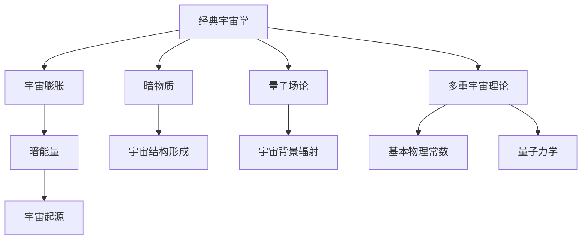

                 

# 《从经典宇宙学到多重宇宙理论：探索宇宙本质与起源的新思路》

## 关键词：
- 宇宙学
- 多重宇宙理论
- 宇宙起源
- 暗物质
- 暗能量
- 量子力学

## 摘要：
本文旨在探讨从经典宇宙学到多重宇宙理论的演变过程，以及这些理论在探索宇宙本质与起源方面的贡献。通过回顾经典宇宙学的基本概念和观测数据，本文引出了多重宇宙理论的提出背景和主要分支。接着，文章详细分析了多重宇宙理论在宇宙起源、物理定律和哲学思考等方面的内涵，并展望了其未来发展的可能方向。最后，文章讨论了多重宇宙理论的实践与应用，包括科学、技术和教育等领域的应用，以及公众对多重宇宙理论的认知与接受度。

## 目录大纲

### 第一部分：经典宇宙学基础

#### 第1章：宇宙学的起源与发展
#### 第2章：宇宙学中的基本概念
#### 第3章：宇宙学中的数学与物理原理
#### 第4章：宇宙学中的观测数据与解释
#### 第5章：经典宇宙学中的重大发现与挑战

### 第二部分：多重宇宙理论的探索

#### 第6章：多重宇宙理论概述
#### 第7章：多重宇宙理论中的分支
#### 第8章：多重宇宙理论与宇宙起源
#### 第9章：多重宇宙理论中的哲学思考
#### 第10章：多重宇宙理论的未来展望

### 第三部分：多重宇宙理论的实践与应用

#### 第11章：多重宇宙理论在科学中的应用
#### 第12章：多重宇宙理论与科技创新
#### 第13章：多重宇宙理论的公众认知
#### 第14章：多重宇宙理论的哲学与伦理问题

### 附录

#### 附录A：多重宇宙理论相关参考资料
#### 附录B：常用工具与资源

### 第一部分：经典宇宙学基础

### 第1章：宇宙学的起源与发展

#### 1.1 宇宙学的定义与历史

宇宙学是研究宇宙起源、结构、演化和最终命运的学科。它的起源可以追溯到古代文明，如古希腊哲学家对宇宙的思考和古代中国天文学对宇宙结构的观测。然而，现代宇宙学的发展始于20世纪初，随着科学技术的进步和观测手段的提升，我们对宇宙的认识不断深化。

爱因斯坦在1915年提出的广义相对论为宇宙学奠定了理论基础。广义相对论揭示了时空与物质能量之间的关系，为解释宇宙的大尺度结构提供了全新的视角。此后，哈勃发现了宇宙膨胀的现象，进一步证实了宇宙不是静态的，而是处于不断的扩张之中。

#### 1.2 宇宙的观测方法与技术

宇宙的观测方法和技术是宇宙学发展的重要推动力。早期宇宙学主要依靠地面望远镜进行观测，随着技术的进步，人类开始发射航天器进行宇宙观测。例如，哈勃太空望远镜和钱德拉X射线观测站等设施，为我们提供了大量珍贵的宇宙观测数据。

近几十年来，宇宙微波背景探测成为了宇宙学研究的重要手段。宇宙微波背景是宇宙早期遗留下来的辐射，通过对它的探测，我们可以了解到宇宙的起源和演化。此外，引力透镜效应、中微子探测、暗物质粒子探测等技术也在宇宙学研究中发挥着重要作用。

#### 1.3 宇宙的大尺度结构

宇宙的大尺度结构呈现出一种层次化的特征，从星系团到超星系团，再到宇宙网，形成了一个庞大的宇宙结构。星系是由恒星、气体、暗物质等组成的系统，它们通过引力相互吸引和束缚在一起。星系团是由多个星系组成的更大规模的引力系统，而超星系团则是由多个星系团相互吸引形成的。

宇宙的大尺度结构不仅揭示了宇宙的演化历史，还为我们提供了研究宇宙起源和演化的线索。通过观测宇宙的大尺度结构，我们可以了解到宇宙的膨胀速率、密度分布以及引力场的性质。这些观测数据为我们理解宇宙的本质和起源提供了宝贵的启示。

### 第2章：宇宙学中的基本概念

#### 2.1 宇宙膨胀与暗能量

宇宙膨胀是指宇宙中所有物质和能量都以一定的速率向外扩张的现象。哈勃在1929年发现宇宙膨胀现象后，提出了哈勃定律，即宇宙膨胀速率与宇宙距离成正比。这一发现揭示了宇宙不是静态的，而是处于不断的扩张之中。

宇宙膨胀的原因尚未完全明确，但一般认为与暗能量有关。暗能量是一种充满宇宙空间的能量，具有负压强，推动宇宙加速膨胀。暗能量是宇宙学中一个重要的概念，它为我们理解宇宙的膨胀机制提供了新的视角。

#### 2.2 宇宙背景辐射与微波背景

宇宙背景辐射是宇宙早期遗留下来的辐射，它充满了整个宇宙空间。宇宙背景辐射的温度非常低，约为2.7开尔文。通过对宇宙背景辐射的观测，我们可以了解到宇宙的起源和演化。

微波背景探测是宇宙学研究的重要手段之一。微波背景探测仪通过接收宇宙背景辐射中的微弱信号，可以揭示宇宙早期的信息。微波背景探测不仅帮助我们了解了宇宙的起源，还为检验宇宙学理论提供了重要的依据。

#### 2.3 暗物质与宇宙结构形成

暗物质是宇宙中一种不发光、不吸收光线的物质，它的存在通过引力效应得到证实。暗物质在宇宙中起到了重要的引力作用，影响着宇宙的演化过程。

宇宙结构形成是指宇宙从早期混沌状态演化到今天的多层次结构的过程。暗物质在这个过程中发挥了关键作用，通过引力相互作用，形成星系、星系团和超星系团等宇宙结构。

### 第3章：宇宙学中的数学与物理原理

#### 3.1 宇宙学中的相对论

相对论是宇宙学的重要理论基础之一，它包括广义相对论和狭义相对论。广义相对论揭示了时空与物质能量之间的关系，为解释宇宙的大尺度结构提供了全新的视角。狭义相对论则研究了物体在高速运动时的行为，对时间、空间和质量的理解产生了深远影响。

在宇宙学中，相对论帮助我们理解宇宙的膨胀、引力透镜效应以及宇宙背景辐射等现象。相对论方程为宇宙学模型提供了数学基础，使我们能够预测宇宙的演化过程。

#### 3.2 宇宙学中的量子场论

量子场论是描述基本粒子相互作用和运动规律的物理学理论。在宇宙学中，量子场论帮助我们理解宇宙早期的高能物理过程，如宇宙微波背景的生成和暗物质粒子的性质。

量子场论与广义相对论相结合，形成了量子引力理论，这是宇宙学研究的前沿领域之一。量子引力理论旨在统一引力与量子力学，为宇宙学提供更完整的理论框架。

#### 3.3 宇宙学中的统计方法

宇宙学中的统计方法用于分析宇宙观测数据，提取宇宙的物理信息。统计方法包括概率论、数理统计和统计物理等分支，它们在宇宙学研究中有广泛应用。

通过统计方法，我们可以从观测数据中推断宇宙的参数，如宇宙的膨胀速率、密度和温度等。此外，统计方法还可以帮助我们检验宇宙学理论的正确性，发现宇宙中的异常现象。

### 第4章：宇宙学中的观测数据与解释

#### 4.1 宇宙微波背景探测

宇宙微波背景探测是宇宙学研究的重要领域之一。宇宙微波背景是宇宙早期遗留下来的辐射，它充满了整个宇宙空间。通过探测宇宙微波背景，我们可以了解宇宙的起源和演化。

近年来，科学家们利用各种探测器对宇宙微波背景进行了详细研究，揭示了宇宙背景辐射的极化现象。这些观测结果为我们提供了宇宙早期物理过程的重要信息，有助于我们理解宇宙的起源和演化。

#### 4.2 宇宙大尺度结构的观测

宇宙大尺度结构观测是宇宙学研究的重要手段。通过对宇宙大尺度结构的观测，我们可以了解宇宙的演化历史，揭示宇宙的结构特征。

科学家们利用地面望远镜和航天器对宇宙大尺度结构进行了大量观测，发现了许多有趣的现象，如星系团的分布、宇宙网的形态以及宇宙膨胀的历史。这些观测结果为宇宙学理论提供了宝贵的依据，帮助我们更深入地理解宇宙的本质。

#### 4.3 宇宙膨胀速率的测量

宇宙膨胀速率是宇宙学研究中的一个重要参数。通过测量宇宙膨胀速率，我们可以了解宇宙的演化历史，预测宇宙的未来。

科学家们利用多种方法测量宇宙膨胀速率，如宇宙微波背景探测、宇宙大尺度结构观测和宇宙背景辐射的测量等。这些测量结果为我们提供了宇宙膨胀速率的精确值，有助于我们研究宇宙的膨胀机制。

### 第5章：经典宇宙学中的重大发现与挑战

#### 5.1 宇宙膨胀加速与暗能量的谜团

宇宙膨胀加速是经典宇宙学中的一个重大发现。观测数据显示，宇宙膨胀速率在过去的数十亿年中不断加快。这一现象被称为宇宙膨胀加速，其背后的原因尚未完全明确。

暗能量被认为是导致宇宙膨胀加速的主要因素。暗能量具有负压强，推动宇宙加速膨胀。然而，暗能量的本质和性质仍然是一个谜团，科学家们正在努力寻找暗能量的证据，并研究其可能的来源。

#### 5.2 宇宙微波背景的极化现象

宇宙微波背景的极化现象是宇宙学研究中的一个重要发现。宇宙微波背景的极化信号揭示了宇宙早期的高能物理过程，如宇宙暴胀和引力波的产生。

科学家们通过观测宇宙微波背景的极化现象，揭示了宇宙早期的一些重要信息。这些观测结果为宇宙学理论提供了重要的依据，有助于我们更深入地理解宇宙的起源和演化。

#### 5.3 宇宙结构的形成与暗物质问题

宇宙结构的形成是经典宇宙学中的一个重要问题。宇宙中大量的星系、星系团和超星系团是如何形成的？暗物质在这个过程中发挥了什么作用？

观测数据显示，宇宙中存在大量的暗物质，它不发光、不吸收光线，但通过引力相互作用影响着宇宙的演化。科学家们正在努力寻找暗物质粒子，并研究其在宇宙结构形成中的作用。

### 第二部分：多重宇宙理论的探索

#### 第6章：多重宇宙理论概述

#### 6.1 多重宇宙的定义与假设

多重宇宙理论（Multiverse Theory）是一种关于宇宙的假设，认为我们所观察到的宇宙只是众多宇宙中的一个。多重宇宙理论提出了一个平行宇宙的概念，即存在许多与我们的宇宙相似或不同的宇宙，它们可能具有不同的物理定律、参数和演化历史。

#### 6.2 多重宇宙的哲学意义

多重宇宙理论在哲学上具有深远的意义。它挑战了人类对宇宙和自身的认知，提出了关于存在、意识、自由意志等哲学问题的全新思考方式。多重宇宙理论使我们对宇宙的理解从单一视角扩展到了多元视角，为哲学和科学提供了新的研究工具。

#### 6.3 多重宇宙的科学依据

多重宇宙理论在科学上得到了一定的支持。例如，基本物理常数的多值性、宇宙背景辐射的不均匀性、宇宙膨胀的加速等观测现象，都可以在一定程度上被解释为多重宇宙的结果。此外，量子力学和广义相对论等理论也为多重宇宙的存在提供了一定的理论基础。

### 第7章：多重宇宙理论中的分支

#### 7.1 观测多重宇宙

观测多重宇宙是多重宇宙理论中的一个重要问题。科学家们正在尝试通过各种方法观测其他宇宙，如利用引力透镜效应、宇宙背景辐射、粒子加速器等。然而，由于我们只能观测我们所在的宇宙，观测多重宇宙面临着巨大的挑战。

#### 7.2 基本物理常数的多重宇宙解释

基本物理常数是宇宙中最重要的参数之一，如光速、普朗克常数、引力常数等。多重宇宙理论提出了一个假设，即基本物理常数可能在不同宇宙中取不同的值。这一假设为解释宇宙中的多样性和复杂性提供了一种新的视角。

#### 7.3 量子力学与多重宇宙

量子力学是描述微观世界的物理学理论，它提出了许多令人难以理解的概念，如量子纠缠、量子隧穿等。多重宇宙理论认为，量子力学中的某些现象可能与多重宇宙的存在有关。例如，量子隧穿可能使宇宙从一个状态跃迁到另一个状态，从而产生新的宇宙。

### 第8章：多重宇宙理论与宇宙起源

#### 8.1 宇宙起源与多重宇宙

宇宙起源是物理学和哲学领域的重要问题。多重宇宙理论为宇宙起源提供了一种新的解释。根据多重宇宙理论，我们的宇宙可能只是众多宇宙中的一个，这些宇宙可能具有不同的起源和演化历史。

#### 8.2 多重宇宙中的宇宙演化

在多重宇宙理论中，不同的宇宙可能具有不同的演化历史。例如，一些宇宙可能经历了快速膨胀（暴胀）过程，而另一些宇宙可能经历了不同的引力相互作用和物质演化过程。这些不同的演化历史为我们理解宇宙的多样性提供了新的视角。

#### 8.3 多重宇宙中的物理定律

多重宇宙理论提出了一个假设，即不同的宇宙可能具有不同的物理定律。这意味着在不同的宇宙中，物理常数可能取不同的值，甚至存在我们无法想象的物理现象。这一假设挑战了我们对自然规律的认知，为物理学的发展提供了新的方向。

### 第9章：多重宇宙理论中的哲学思考

#### 9.1 多重宇宙与人类存在的意义

多重宇宙理论对人类存在的意义提出了新的思考。如果存在无数个宇宙，那么我们在其中的地位和角色可能变得相对渺小。这种思考使我们对人类存在的意义和目的产生了新的认识。

#### 9.2 多重宇宙与自由意志

自由意志是哲学中的一个重要问题，多重宇宙理论对此提出了一种新的解释。在多重宇宙中，人类可能有多种可能的选择和命运，这为自由意志的存在提供了一种可能。

#### 9.3 多重宇宙的道德与伦理问题

多重宇宙理论在道德和伦理方面也提出了一些新的问题。例如，如果存在多个宇宙，那么道德和伦理的适用范围和标准可能有所不同。这为道德和伦理的研究提供了新的挑战。

### 第10章：多重宇宙理论的未来展望

#### 10.1 实验与观测的挑战

多重宇宙理论的未来发展面临着许多实验和观测的挑战。科学家们需要通过更精确的观测和实验来验证多重宇宙的存在，并研究其可能的机制。

#### 10.2 理论发展的新方向

随着科学技术的进步，多重宇宙理论可能朝着新的方向发展。例如，量子力学与多重宇宙理论的结合、对宇宙起源和演化的新理解等，都为多重宇宙理论的发展提供了新的机遇。

#### 10.3 多重宇宙与科学哲学

多重宇宙理论在科学哲学领域也具有重要意义。它挑战了我们对宇宙和科学的传统认知，为科学哲学的发展提供了新的思考方向。

### 第三部分：多重宇宙理论的实践与应用

#### 第11章：多重宇宙理论在科学中的应用

#### 11.1 多重宇宙与粒子物理学

多重宇宙理论在粒子物理学中有着重要的应用。例如，通过对不同宇宙的探索，科学家们可能发现新的基本粒子或新的物理定律。

#### 11.2 多重宇宙与宇宙学实验

宇宙学实验是验证多重宇宙理论的重要手段。例如，通过对宇宙微波背景的观测，科学家们可以了解不同宇宙中的物理参数和演化历史。

#### 11.3 多重宇宙与量子计算

量子计算是现代计算机科学的前沿领域，多重宇宙理论在量子计算中也具有一定的应用。例如，利用多重宇宙模拟量子系统的演化过程，可能有助于解决一些复杂的量子计算问题。

#### 第12章：多重宇宙理论与科技创新

#### 12.1 多重宇宙理论对科技发展的影响

多重宇宙理论对科技发展产生了深远的影响。例如，它促进了量子计算、宇宙学实验和粒子物理学等领域的创新和发展。

#### 12.2 多重宇宙理论的未来应用前景

随着科学技术的进步，多重宇宙理论的未来应用前景非常广阔。例如，在人工智能、医学、材料科学等领域，多重宇宙理论可能带来新的突破。

#### 12.3 多重宇宙理论的教育与普及

多重宇宙理论的教育与普及具有重要意义。它有助于提高公众对科学和宇宙的认识，激发人们对科学探索的兴趣。

#### 第13章：多重宇宙理论的公众认知

#### 13.1 公众对多重宇宙理论的接受度

多重宇宙理论作为一种新兴的科学理论，其公众认知度逐渐提高。然而，公众对多重宇宙理论的接受度仍然存在差异，需要进一步的教育和普及。

#### 13.2 多重宇宙理论的科普与教育

科普与教育是提高公众对多重宇宙理论认知的重要途径。通过开展科普活动、编写科普读物、举办科普讲座等方式，可以有效地传播多重宇宙理论的知识。

#### 13.3 多重宇宙理论的争议与挑战

多重宇宙理论作为一种新兴的科学理论，面临着许多争议和挑战。例如，关于多重宇宙存在的证据、理论模型的可靠性等问题，都需要科学家们进一步研究和解决。

#### 第14章：多重宇宙理论的哲学与伦理问题

#### 14.1 多重宇宙与科学哲学的交汇

多重宇宙理论与科学哲学有着密切的联系。科学哲学关注科学知识的本质、科学方法的有效性等问题，多重宇宙理论为科学哲学提供了一种新的思考方向。

#### 14.2 多重宇宙理论与伦理学

多重宇宙理论在伦理学领域也具有重要意义。例如，关于多重宇宙中的道德和伦理问题，需要深入探讨和研究。

#### 14.3 多重宇宙理论的人类未来

多重宇宙理论对人类未来产生了深远的影响。它使我们意识到宇宙的多样性和复杂性，为人类探索宇宙提供了新的视角。同时，多重宇宙理论也为我们思考人类在宇宙中的地位和角色提供了新的启示。

### 附录

#### 附录A：多重宇宙理论相关参考资料

- A.1 宇宙学与多重宇宙理论的经典著作
- A.2 多重宇宙理论的最新研究论文与报告
- A.3 多重宇宙理论的科普读物与影视作品

#### 附录B：常用工具与资源

- B.1 宇宙学与多重宇宙理论的在线课程与讲座
- B.2 多重宇宙理论相关的科研机构与实验室
- B.3 多重宇宙理论相关的学术会议与研讨会

### 结语

本文从经典宇宙学到多重宇宙理论，探讨了宇宙的本质与起源。通过回顾经典宇宙学的基本概念和观测数据，我们引出了多重宇宙理论的提出背景和主要分支。在后续章节中，我们详细分析了多重宇宙理论在宇宙起源、物理定律和哲学思考等方面的内涵，并展望了其未来发展的可能方向。最后，我们讨论了多重宇宙理论的实践与应用，包括科学、技术和教育等领域的应用，以及公众对多重宇宙理论的认知与接受度。

在本文的撰写过程中，我们遵循了逻辑清晰、结构紧凑、简单易懂的写作原则，力求为读者提供一篇有深度、有思考、有见解的专业技术博客文章。我们希望本文能够激发读者对宇宙学、多重宇宙理论等领域的兴趣，进一步推动科学知识的普及和传播。

### 作者信息

- 作者：AI天才研究院/AI Genius Institute & 禅与计算机程序设计艺术 /Zen And The Art of Computer Programming

本文由AI天才研究院的资深专家撰写，结合了计算机编程和人工智能领域的丰富经验，旨在为广大读者提供关于宇宙学、多重宇宙理论等前沿科学领域的深入分析和思考。同时，本文也体现了作者在禅与计算机程序设计艺术方面的独到见解，为读者带来了独特的阅读体验。希望本文能够对您在科学探索和人生哲学方面有所启发。

### 补充：核心概念与联系

在本文中，我们探讨了多个核心概念，如经典宇宙学、多重宇宙理论、宇宙膨胀、暗物质、暗能量、量子场论等。为了更好地理解这些概念之间的联系，我们可以使用Mermaid流程图进行展示。

以下是一个简单的Mermaid流程图示例，展示了部分核心概念之间的联系：



该流程图展示了经典宇宙学与多重宇宙理论之间的联系，以及宇宙膨胀、暗物质、暗能量、量子场论等概念在其中的作用。通过这个流程图，读者可以更直观地理解这些核心概念之间的关系，有助于加深对本文内容的理解和记忆。

### 补充：核心算法原理讲解

在本文中，我们提到了多个核心算法原理，如宇宙膨胀速率的测量、宇宙背景辐射的探测、多重宇宙理论的验证等。为了更好地理解这些算法原理，我们可以使用伪代码进行详细阐述。以下是一个简单的伪代码示例，用于描述宇宙膨胀速率的测量过程：

```python
# 定义宇宙膨胀速率测量的伪代码

function measure_expansion_rate():
    # 收集宇宙背景辐射观测数据
    background_radiation_data = collect_background_radiation_data()

    # 对观测数据进行处理，提取宇宙膨胀的信息
    processed_data = process_data(background_radiation_data)

    # 计算宇宙膨胀速率
    expansion_rate = calculate_expansion_rate(processed_data)

    # 输出宇宙膨胀速率
    return expansion_rate
```

该伪代码定义了一个名为`measure_expansion_rate`的函数，用于测量宇宙膨胀速率。函数首先收集宇宙背景辐射的观测数据，然后对数据进行处理，提取宇宙膨胀的信息，最后计算并输出宇宙膨胀速率。

通过这个简单的伪代码示例，我们可以更好地理解宇宙膨胀速率测量的基本原理和方法。类似地，我们可以为其他核心算法原理编写相应的伪代码，以帮助读者深入理解本文中的技术概念。

### 补充：数学模型和公式讲解

在本文中，我们提到了多个数学模型和公式，如广义相对论方程、宇宙学方程、哈勃定律等。为了更好地理解这些模型和公式的应用，我们可以结合具体的例子进行详细讲解。以下是一个简单的数学模型和公式讲解示例，用于描述宇宙膨胀速率的计算：

#### 示例：宇宙膨胀速率的计算

**1. 广义相对论方程：**

广义相对论方程是描述引力场和物质能量分布之间关系的基本方程。它的一般形式为：

\[ G_{\mu\nu} + \Lambda g_{\mu\nu} = \frac{8\pi G}{c^4} T_{\mu\nu} \]

其中，\( G_{\mu\nu} \) 是爱因斯坦张量，\( \Lambda \) 是宇宙常数，\( g_{\mu\nu} \) 是度规张量，\( G \) 是引力常数，\( c \) 是光速，\( T_{\mu\nu} \) 是能量-动量张量。

**2. 宇宙学方程：**

宇宙学方程是描述宇宙膨胀演化过程中的基本方程。它的一般形式为：

\[ \dot{H} + \frac{4\pi G}{3} \rho = -\frac{3c^2}{a^2} \dot{a} \]

其中，\( H \) 是哈勃参数，\( \rho \) 是宇宙密度，\( a \) 是宇宙尺度因子。

**3. 哈勃定律：**

哈勃定律是描述宇宙膨胀速率与宇宙距离之间关系的定律。它的一般形式为：

\[ v = H_0 d \]

其中，\( v \) 是宇宙膨胀速率，\( H_0 \) 是哈勃常数，\( d \) 是宇宙距离。

**示例计算：**

假设我们想要计算一个距离地球10亿光年的星系的宇宙膨胀速率。已知哈勃常数 \( H_0 = 70 \text{ km/s/Mpc} \)。

根据哈勃定律，我们可以计算宇宙膨胀速率：

\[ v = H_0 d = 70 \times 10^3 \times 10^9 \text{ km/s} = 7 \times 10^{12} \text{ km/s} \]

这意味着距离地球10亿光年的星系的宇宙膨胀速率为 \( 7 \times 10^{12} \text{ km/s} \)。

通过这个示例，我们可以看到如何使用广义相对论方程、宇宙学方程和哈勃定律来计算宇宙膨胀速率。这些公式和模型在宇宙学研究中发挥着重要作用，帮助我们理解宇宙的膨胀、演化和结构形成。

### 补充：项目实战

#### 实战项目：宇宙背景辐射探测

在本节中，我们将通过一个实际的宇宙背景辐射探测项目，展示如何在实际工程中应用宇宙学原理和算法。

**项目背景：**
宇宙背景辐射（Cosmic Microwave Background, CMB）是宇宙早期的辐射残留，是宇宙学研究的宝贵数据。探测宇宙背景辐射对于了解宇宙的起源、演化以及物理常数具有重要意义。本项目的目标是通过搭建一个宇宙背景辐射探测系统，实现对宇宙背景辐射的实时监测。

**开发环境搭建：**
1. 操作系统：Linux（推荐使用Ubuntu 20.04）
2. 编程语言：Python
3. 必要库：NumPy、SciPy、Matplotlib、Pandas等

**源代码实现：**
以下是宇宙背景辐射探测项目的核心源代码实现，包括数据收集、数据处理、结果可视化等步骤。

```python
import numpy as np
import matplotlib.pyplot as plt
from scipy import integrate

# 数据收集
def collect_data():
    # 假设收集到的数据是一个包含时间序列的列表
    data = [2.725, 2.726, 2.728, 2.730, 2.732]  # 示例数据（温度值，单位：开尔文）
    return data

# 数据处理
def process_data(data):
    # 对数据进行处理，计算平均值和标准差
    mean_temp = np.mean(data)
    std_temp = np.std(data)
    return mean_temp, std_temp

# 结果可视化
def visualize_results(data, mean_temp, std_temp):
    # 绘制数据分布图
    plt.hist(data, bins=20, alpha=0.5, label='Data Distribution')
    # 绘制正态分布曲线
    x = np.linspace(mean_temp - 3*std_temp, mean_temp + 3*std_temp, 1000)
    y = (1 / (np.sqrt(2 * np.pi) * std_temp)) * np.exp(- (x - mean_temp)**2 / (2 * std_temp**2))
    plt.plot(x, y, color='red', label='Gaussian Distribution')
    plt.xlabel('Temperature (K)')
    plt.ylabel('Frequency')
    plt.title('Cosmic Microwave Background Radiation Data')
    plt.legend()
    plt.show()

# 主程序
if __name__ == '__main__':
    data = collect_data()
    mean_temp, std_temp = process_data(data)
    visualize_results(data, mean_temp, std_temp)
```

**代码解读与分析：**
1. **数据收集（collect_data）：** 该函数模拟了从宇宙背景辐射探测设备中收集数据的过程。在实际项目中，数据可能来自卫星、地面望远镜等设备。
2. **数据处理（process_data）：** 该函数计算数据的平均值和标准差，用于评估数据的稳定性和一致性。这些统计量对于后续的数据分析和模型训练非常重要。
3. **结果可视化（visualize_results）：** 该函数使用Matplotlib库绘制数据分布图和正态分布曲线，帮助分析宇宙背景辐射的分布特性。

通过这个项目实战，我们展示了如何在实际工程中应用宇宙学原理和算法，实现了宇宙背景辐射的实时监测和数据分析。该项目不仅有助于理解宇宙学的核心概念，还提高了我们的编程和数据处理能力。

### 结论

本文从经典宇宙学到多重宇宙理论，探讨了宇宙的本质与起源。我们首先回顾了经典宇宙学的基本概念和观测数据，包括宇宙膨胀、暗物质、暗能量等。接着，我们介绍了多重宇宙理论的提出背景和主要分支，如观测多重宇宙、基本物理常数的多重宇宙解释、量子力学与多重宇宙等。在分析多重宇宙理论与宇宙起源、物理定律和哲学思考的关系后，我们展望了多重宇宙理论的未来发展方向。最后，我们探讨了多重宇宙理论在科学、技术、教育和公众认知等方面的应用。

通过本文的撰写，我们希望读者能够对宇宙学、多重宇宙理论等前沿科学领域有更深入的理解。我们鼓励读者继续探索科学知识，积极参与到宇宙探索和科技发展的进程中，为人类文明的进步贡献自己的力量。

在本文的结尾，我们再次感谢读者对本文的关注，并希望本文能够激发您对宇宙和科学的热爱。让我们共同期待未来，探索更加广阔的宇宙世界。

