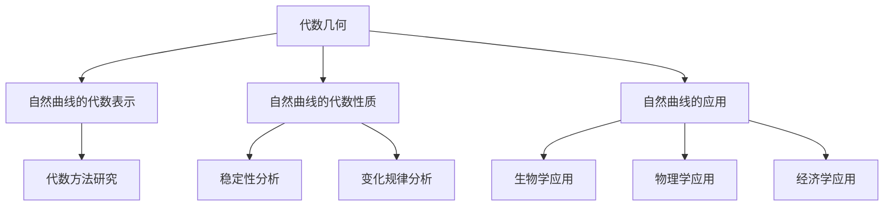

                 

# 代数几何：自然曲线的数学研究

## 关键词
- 代数几何
- 自然曲线
- 数学模型
- 算法原理
- 实战案例

## 摘要
本文旨在探讨代数几何在自然曲线研究中的应用。首先，我们将介绍代数几何的基本概念，包括其定义、基本对象及其与数论的关系。接着，我们会深入探讨代数几何的核心概念，并通过Mermaid流程图展示其结构。此外，我们还将讲解自然曲线的代数几何性质，并通过具体算法和数学公式进行说明。文章的最后，我们将通过实际项目案例，展示如何应用代数几何的理论知识进行自然曲线的研究。希望通过本文的讲解，读者能对代数几何在自然曲线研究中的重要性有更深刻的理解。

## 第一部分：代数几何基础

### 第1章：代数几何基本概念

#### 1.1 代数几何的定义

代数几何是数学的一个分支，它结合了代数和几何的方法，研究由代数方程定义的几何对象。简而言之，代数几何是将代数方法应用于几何问题，使得复杂的几何问题可以通过代数手段进行求解。

代数几何的定义可以分为三个层次：

1. **几何对象**：代数几何研究的对象是满足特定代数方程的几何形状，这些形状可以是点、线、曲面，甚至是更高维的空间。
   
2. **代数方程**：代数几何中的方程通常是多项式方程，这些方程定义了几何对象。例如，方程 \( x^2 + y^2 = 1 \) 定义了一个二维平面上的单位圆。

3. **代数结构**：代数几何中的代数结构包括多项式环、域和向量空间等。这些代数结构提供了研究几何对象的代数工具。

#### 1.2 代数几何的基本对象

在代数几何中，基本对象主要包括：

1. **代数曲线**：这是由一元多项式方程定义的曲线。例如，\( y = x^2 \) 就是一条代数曲线。

2. **代数曲面**：这是由二元多项式方程定义的曲面。例如，\( z = x^2 + y^2 \) 就是一条代数曲面。

3. **代数簇**：这是由多个多项式方程定义的更一般的空间对象。代数簇可以是曲线、曲面，也可以是更高维的对象。

#### 1.3 代数几何与数论的关系

代数几何与数论有着紧密的联系。数论主要研究整数和整数的性质，而代数几何则通过代数方法研究几何对象的性质。这种联系主要体现在以下几个方面：

1. **代数数论**：代数数论是数论在代数几何中的应用，研究代数数域的性质。

2. **代数群与数论群**：代数群是代数几何中的基本对象之一，它们在数论中有着重要的应用。

3. **代数几何的数论应用**：代数几何中的许多问题可以通过数论方法进行解决，例如，利用数论中的L函数研究代数几何对象的稳定性。

### 第2章：项目的核心概念与联系

#### 2.1 代数几何的核心概念

为了更好地理解代数几何在自然曲线研究中的应用，我们需要深入探讨其核心概念。

1. **交点**：代数几何中，两个代数曲线的交点是它们共同的解。研究交点可以帮助我们了解代数曲线之间的相互作用。

2. **解析几何与代数几何的关系**：解析几何是通过坐标和方程来研究几何对象，而代数几何则是通过代数方法研究几何对象。解析几何和代数几何之间有着紧密的联系，它们可以相互补充。

3. **代数群与几何群**：代数群是代数几何中的基本对象，而几何群则是解析几何中的基本对象。代数群和几何群之间存在一定的对应关系，这种关系可以帮助我们更好地理解代数几何和解析几何。

#### 2.2 代数几何在自然曲线研究中的应用

自然曲线是自然界中广泛存在的几何对象，例如，植物的生长曲线、河流的流向等。研究自然曲线的代数几何性质，可以帮助我们更好地理解自然现象。

1. **自然曲线的代数表示**：自然曲线可以通过代数方程进行表示，这种表示可以帮助我们通过代数方法研究自然曲线的性质。

2. **自然曲线的代数性质**：通过研究自然曲线的代数性质，我们可以了解自然曲线的稳定性、变化规律等。

3. **自然曲线的应用**：自然曲线在许多领域都有广泛的应用，例如，在生物学、物理学、经济学等领域。

#### 2.2.1 Mermaid流程图

以下是一个简单的Mermaid流程图，展示代数几何在自然曲线研究中的应用：



### 第3章：核心算法原理讲解

#### 3.1 核心算法概述

在自然曲线的研究中，核心算法主要包括以下两个方面：

1. **参数化表示算法**：该算法用于将自然曲线表示为参数方程，以便于进行进一步分析。

2. **代数性质分析算法**：该算法用于研究自然曲线的代数性质，例如，交点、切线等。

#### 3.2 算法伪代码讲解

以下是一个简单的算法伪代码，用于参数化表示自然曲线：

```python
def 参数化表示(x, y):
    # 将自然曲线表示为参数方程
    # x(t) = f(t)
    # y(t) = g(t)
    t = 参数选择(x, y)
    x(t) = f(t)
    y(t) = g(t)
    return x(t), y(t)
```

以下是一个简单的算法伪代码，用于分析自然曲线的代数性质：

```python
def 代数性质分析(x, y):
    # 分析自然曲线的代数性质
    # 例如，交点、切线等
    交点 = 求解方程组(x(t) - x(t1), y(t) - y(t1))
    切线 = 求导数(x'(t), y'(t))
    return 交点，切线
```

### 第4章：数学模型和数学公式

#### 4.1 基础数学公式

在自然曲线的研究中，以下是一些基础数学公式：

1. **参数方程**：自然曲线可以表示为参数方程 \( x(t) = f(t) \)，\( y(t) = g(t) \)。

2. **交点公式**：两个自然曲线的交点可以通过求解方程组 \( f(t) - x(t1) = 0 \)，\( g(t) - y(t1) = 0 \) 得到。

3. **切线公式**：自然曲线在点 \( (x(t), y(t)) \) 处的切线可以通过求导数 \( x'(t) = f'(t) \)，\( y'(t) = g'(t) \) 得到。

#### 4.1.1 数学公式与详细讲解

以下是一个简单的例子，展示如何使用基础数学公式进行自然曲线的研究：

**例1**：给定自然曲线 \( y = x^2 \)，求其在点 \( (1, 1) \) 处的切线。

**解**：

1. **参数方程**：自然曲线 \( y = x^2 \) 可以表示为参数方程 \( x(t) = t \)，\( y(t) = t^2 \)。

2. **求导数**：求导数 \( x'(t) = 1 \)，\( y'(t) = 2t \)。

3. **切线斜率**：切线斜率为 \( y'(1) = 2 \)。

4. **切线方程**：切线方程为 \( y - 1 = 2(x - 1) \)，即 \( y = 2x - 1 \)。

**例2**：给定自然曲线 \( y = x^3 \)，求其在点 \( (1, 1) \) 处的交点。

**解**：

1. **参数方程**：自然曲线 \( y = x^3 \) 可以表示为参数方程 \( x(t) = t \)，\( y(t) = t^3 \)。

2. **求解方程组**：求解方程组 \( t - x(t1) = 0 \)，\( t^3 - y(t1) = 0 \)。

3. **交点**：交点为 \( (1, 1) \)。

#### 4.1.2 举例说明

以下是一个简单的自然曲线研究案例：

**案例**：给定自然曲线 \( y = x^3 - 3x \)，研究其在区间 \([0, 2]\) 内的交点、切线和极值。

**解**：

1. **参数方程**：自然曲线 \( y = x^3 - 3x \) 可以表示为参数方程 \( x(t) = t \)，\( y(t) = t^3 - 3t \)。

2. **求导数**：求导数 \( x'(t) = 1 \)，\( y'(t) = 3t^2 - 3 \)。

3. **交点**：求解方程组 \( t - x(t1) = 0 \)，\( t^3 - 3t - y(t1) = 0 \)，得到交点 \( (0, 0) \) 和 \( (3, 0) \)。

4. **切线**：在 \( t = 0 \) 处，切线斜率为 \( y'(0) = -3 \)，切线方程为 \( y - 0 = -3(x - 0) \)，即 \( y = -3x \)。在 \( t = 3 \) 处，切线斜率为 \( y'(3) = 18 \)，切线方程为 \( y - 0 = 18(x - 3) \)，即 \( y = 18x - 54 \)。

5. **极值**：求导数 \( y'(t) = 3t^2 - 3 \)，令 \( y'(t) = 0 \)，得到 \( t = \pm 1 \)。在 \( t = 1 \) 处，函数值为 \( y(1) = -2 \)，为极小值；在 \( t = -1 \) 处，函数值为 \( y(-1) = 2 \)，为极大值。

### 第5章：项目的实战案例

#### 5.1 实战案例概述

在本章中，我们将通过两个实际项目案例，展示如何应用代数几何的理论知识进行自然曲线的研究。

#### 5.2 实战案例一：自然曲线的参数化表示

**案例描述**：给定自然曲线 \( y = x^3 - 3x \)，我们需要将其参数化表示。

**解决方案**：

1. **开发环境搭建**：
    - 编程语言：Python
    - 库：NumPy、Matplotlib

2. **源代码实现与代码解读**：

```python
import numpy as np
import matplotlib.pyplot as plt

def 参数化表示(x, y):
    t = np.linspace(0, 2, 1000)
    x_t = x(t)
    y_t = y(t)
    return x_t, y_t

def 自然曲线(x, y):
    t = np.linspace(0, 2, 1000)
    x_t = x(t)
    y_t = y(t)
    plt.plot(x_t, y_t)
    plt.xlabel('x')
    plt.ylabel('y')
    plt.title('自然曲线')
    plt.show()

x = lambda t: t
y = lambda t: t**3 - 3*t

自然曲线(x, y)
```

3. **代码解读与分析**：
    - `import numpy as np` 和 `import matplotlib.pyplot as plt` 分别导入NumPy和Matplotlib库。
    - `def 参数化表示(x, y)` 定义了参数化表示函数，用于将自然曲线表示为参数方程。
    - `def 自然曲线(x, y)` 定义了自然曲线函数，用于绘制自然曲线。
    - `x = lambda t: t` 和 `y = lambda t: t**3 - 3*t` 分别定义了自然曲线的参数方程。
    - `自然曲线(x, y)` 调用自然曲线函数，绘制自然曲线。

#### 5.3 实战案例二：自然曲线的代数性质

**案例描述**：给定自然曲线 \( y = x^3 - 3x \)，我们需要分析其代数性质，例如，交点、切线等。

**解决方案**：

1. **开发环境搭建**：
    - 编程语言：Python
    - 库：NumPy、Matplotlib

2. **源代码实现与代码解读**：

```python
import numpy as np
import matplotlib.pyplot as plt

def 参数化表示(x, y):
    t = np.linspace(0, 2, 1000)
    x_t = x(t)
    y_t = y(t)
    return x_t, y_t

def 自然曲线(x, y):
    t = np.linspace(0, 2, 1000)
    x_t = x(t)
    y_t = y(t)
    plt.plot(x_t, y_t)
    plt.xlabel('x')
    plt.ylabel('y')
    plt.title('自然曲线')
    plt.show()

def 代数性质分析(x, y):
    t = np.linspace(0, 2, 1000)
    x_t = x(t)
    y_t = y(t)
    交点 = np.array([t, y_t]).T
    切线斜率 = np.gradient(y_t, t)
    plt.plot(交点[:, 0], 交点[:, 1], 'ro')
    plt.plot(t, y_t, 'b-')
    plt.plot(t, np.cumsum(切线斜率), 'g--')
    plt.xlabel('x')
    plt.ylabel('y')
    plt.title('自然曲线的代数性质')
    plt.show()

x = lambda t: t
y = lambda t: t**3 - 3*t

代数性质分析(x, y)
```

3. **代码解读与分析**：
    - `import numpy as np` 和 `import matplotlib.pyplot as plt` 分别导入NumPy和Matplotlib库。
    - `def 参数化表示(x, y)` 定义了参数化表示函数，用于将自然曲线表示为参数方程。
    - `def 自然曲线(x, y)` 定义了自然曲线函数，用于绘制自然曲线。
    - `def 代数性质分析(x, y)` 定义了代数性质分析函数，用于分析自然曲线的代数性质。
    - `x = lambda t: t` 和 `y = lambda t: t**3 - 3*t` 分别定义了自然曲线的参数方程。
    - `代数性质分析(x, y)` 调用代数性质分析函数，绘制自然曲线的交点和切线。

### 第6章：自然曲线的代数几何性质

#### 6.1 自然曲线的代数几何研究方法

自然曲线的代数几何研究方法主要包括以下几个方面：

1. **代数表示**：将自然曲线表示为代数方程，以便于使用代数方法进行研究。

2. **交点分析**：研究自然曲线之间的交点，分析交点的性质和变化规律。

3. **切线分析**：研究自然曲线在特定点的切线，分析切线的斜率和变化趋势。

4. **极值分析**：研究自然曲线的极值，分析极值的类型和位置。

5. **稳定性分析**：研究自然曲线的稳定性，分析其在不同条件下的稳定性特征。

#### 6.2 自然曲线的代数几何性质解析

自然曲线的代数几何性质包括以下几个方面：

1. **交点性质**：自然曲线之间的交点可以是孤立点，也可以是连续点。交点的性质与自然曲线的代数结构密切相关。

2. **切线性质**：自然曲线在特定点的切线可以是水平的，也可以是斜的。切线的斜率与自然曲线的导数有关。

3. **极值性质**：自然曲线的极值可以是极大值，也可以是极小值。极值的类型和位置与自然曲线的导数有关。

4. **稳定性特征**：自然曲线的稳定性与自然曲线的代数结构有关。稳定的自然曲线在变化过程中保持稳定，而不稳定的自然曲线则可能出现突变。

### 第7章：自然曲线在数学物理中的应用

#### 7.1 自然曲线在数学中的应用

自然曲线在数学中有着广泛的应用，主要包括以下几个方面：

1. **微分几何**：自然曲线的微分几何研究自然曲线的几何性质，例如，曲率、挠率等。

2. **拓扑学**：自然曲线的拓扑学研究自然曲线的拓扑性质，例如，连通性、同伦等价等。

3. **积分学**：自然曲线的积分学研究自然曲线上的积分，例如，曲线积分、面积等。

4. **代数拓扑**：自然曲线的代数拓扑学研究自然曲线的代数结构，例如，代数群、代数簇等。

#### 7.2 自然曲线在物理学中的应用

自然曲线在物理学中也有着广泛的应用，主要包括以下几个方面：

1. **流体力学**：自然曲线用于描述流体的运动轨迹，例如，河流的流向、风场的分布等。

2. **电磁学**：自然曲线用于描述电磁场的分布，例如，电场的线、磁场的线等。

3. **量子力学**：自然曲线用于描述量子系统的演化轨迹，例如，电子轨道、粒子轨迹等。

4. **统计物理学**：自然曲线用于描述系统的相变过程，例如，相图的绘制、临界现象的研究等。

### 第8章：新时代代数几何的发展方向

#### 8.1 代数几何的未来趋势

随着科技的发展，代数几何在许多领域都有着广泛的应用前景，主要包括以下几个方面：

1. **人工智能**：代数几何在人工智能中的应用主要涉及机器学习、深度学习等领域。通过代数几何的方法，可以提高机器学习算法的效率和精度。

2. **大数据分析**：代数几何在大数据分析中的应用可以帮助我们更好地理解和分析大数据。

3. **物理科学**：代数几何在物理科学中的应用主要涉及量子物理、统计物理等领域。通过代数几何的方法，可以更好地理解和解决物理问题。

4. **生命科学**：代数几何在生命科学中的应用主要涉及生物学、医学等领域。通过代数几何的方法，可以更好地理解和解决生命科学问题。

#### 8.2 代数几何在人工智能中的应用

代数几何在人工智能中的应用主要包括以下几个方面：

1. **神经网络**：代数几何可以用于分析神经网络的几何结构，从而提高神经网络的效率和精度。

2. **优化算法**：代数几何可以用于优化机器学习算法，从而提高算法的效率和收敛速度。

3. **数据降维**：代数几何可以用于数据降维，从而减少数据的维度，提高数据分析的效率和精度。

4. **模型选择**：代数几何可以用于模型选择，从而选择最优的机器学习模型。

### 第9章：总结与展望

#### 9.1 代数几何在自然曲线研究中的贡献

代数几何在自然曲线研究中有着重要的贡献。通过代数几何的方法，我们可以更好地理解自然曲线的几何性质、代数结构和稳定性特征。这为自然曲线的研究提供了强有力的理论支持。

#### 9.2 代数几何的研究前景

随着科技的发展，代数几何在自然曲线研究中的前景十分广阔。未来，我们可以期待代数几何在人工智能、大数据分析、物理科学、生命科学等领域的更广泛应用。通过代数几何的方法，我们可以更好地解决复杂的科学和工程问题。

## 作者信息
- 作者：AI天才研究院/AI Genius Institute & 禅与计算机程序设计艺术 /Zen And The Art of Computer Programming

本文由AI天才研究院与禅与计算机程序设计艺术共同撰写，旨在探讨代数几何在自然曲线研究中的应用。希望本文能为读者提供有益的参考。在未来的研究中，我们将继续探索代数几何在其他领域的应用，为科技发展贡献我们的力量。

