                 

## 引言

### 仿生工程的概述

仿生工程，顾名思义，是一种通过模仿自然界的生物结构、功能和行为来设计新型材料、设备和系统的工程技术。这一领域的兴起源于对自然界中高效和复杂结构的兴趣，如鸟类的飞行、鱼类的游泳、植物的光合作用等。仿生工程的目标是利用这些自然界的智慧，将其转化为实际工程中的解决方案，从而提高材料性能、优化设计、提升效率等。

#### 1.1 仿生工程的定义与发展

仿生工程最早可以追溯到20世纪中叶，当时科学家和工程师开始意识到，自然界中存在许多经过亿万年演化形成的最优结构。这些结构不仅在形态上具有独特性，而且在功能上也表现出卓越的效率和适应性。例如，蝴蝶的鳞片可以高效地反射阳光，减少热量的吸收，而鳄鱼皮肤的防弹性能则让科学家们开始思考如何制造出类似的防护材料。

随着材料科学、生物学和计算机技术的发展，仿生工程逐渐成为一门独立的学科。近年来，随着3D打印、纳米技术、人工智能等前沿技术的应用，仿生工程的发展势头更加迅猛。如今，仿生工程已经渗透到航空、汽车、建筑、医疗、电子等各个领域，带来了诸多创新和突破。

#### 1.2 自然智慧与工程优化

自然智慧，即自然界中生物体在长期的进化过程中形成的适应性和效率。这种智慧体现在生物体的形态、结构、行为和生态系统中，是经过亿万年演化的结果。仿生工程的核心思想就是将这种自然智慧转化为工程中的优化策略，以提高设计性能和效率。

工程优化，是指通过改进设计参数、材料选择、制造工艺等手段，使工程系统在特定目标下达到最优状态。传统的工程优化方法主要依赖于经验和计算，而仿生工程引入了自然智慧，为优化过程提供了新的思路和方法。

#### 1.3 数学转化在仿生工程中的应用

数学转化，即通过数学方法将自然界的现象和规律转化为可计算的模型。在仿生工程中，数学转化是连接自然智慧与工程优化的重要桥梁。通过数学模型，可以精确地描述生物结构的功能和行为，进而指导工程设计和优化。

具体来说，数学转化在仿生工程中的应用体现在以下几个方面：

1. **结构模拟与仿真**：通过数学模型和仿真技术，可以对生物结构进行模拟和预测，从而优化工程设计。例如，飞机机翼的设计可以借鉴鸟翼的形状和空气动力学特性。

2. **材料优化**：通过数学模型，可以预测材料的力学性能和失效模式，从而设计出具有更高性能和更持久寿命的材料。例如，科学家通过研究鳄鱼皮肤的微观结构，成功开发出具有优异防弹性能的复合材料。

3. **算法优化**：利用数学转化，可以将自然界的进化算法（如遗传算法、进化算法等）应用于工程优化。这些算法通过模拟生物进化过程，实现设计参数的自动优化。

#### 1.4 仿生工程的结构优化研究现状与趋势

近年来，随着仿生工程技术的不断发展，结构优化已经成为该领域的研究热点。以下是当前仿生工程结构优化研究的一些现状和趋势：

1. **多学科交叉**：仿生工程的结构优化研究涉及到材料科学、力学、计算机科学、生物工程等多个学科。多学科的交叉融合为结构优化提供了更丰富的理论和方法。

2. **人工智能应用**：人工智能技术的快速发展，为仿生工程的结构优化提供了新的工具和手段。例如，深度学习、强化学习等算法在结构优化中的应用，提高了优化的效率和精度。

3. **实际应用拓展**：仿生工程的结构优化已经从实验室走向实际应用，如航空、汽车、建筑、医疗等领域。未来，随着技术的进一步成熟，仿生工程的结构优化将在更多领域得到应用。

4. **可持续发展**：随着环保意识的增强，仿生工程的结构优化也日益关注可持续性。通过模仿自然界的生物结构，设计出更环保、更高效的工程系统，是实现可持续发展的重要途径。

总之，仿生工程的结构优化是一个充满挑战和机遇的研究领域。通过自然智慧与数学转化的结合，我们有望在工程优化中实现更多的突破，为人类创造更美好的未来。

### 仿生结构与材料

#### 2.1 仿生结构与材料的分类

仿生工程中，结构优化往往基于对自然界中高效结构的模仿。这些结构不仅形态独特，而且在功能上表现出卓越的适应性和效率。根据仿生对象的不同，仿生结构与材料可以分为以下几类：

1. **生物形态仿生**：这类仿生结构主要模仿生物体的形态和结构。例如，鸟类的翼形设计、鱼类的鳞片结构、蝴蝶的鳞片纹理等。这些结构在飞行、游泳、遮阳等方面具有独特优势，为工程优化提供了宝贵的参考。

2. **生物材料仿生**：生物材料具有优异的力学性能和生物相容性，如蛋白质、纤维、多糖等。通过模仿这些材料的微观结构和组成，可以设计出具有类似性能的工程材料。例如，模仿蚕丝的蛋白质结构，可以制造出具有高弹性和耐磨性的纤维材料。

3. **生物系统仿生**：这类仿生结构模仿生物体的整体功能系统，如植物的光合作用系统、动物的感知与响应系统等。这些系统的复杂性和协同性为工程优化提供了新的思路。例如，模仿植物根系吸收水分的系统，可以设计出高效的灌溉系统。

#### 2.2 自然界中的高效结构

自然界中的生物结构具有高度优化和适应性，这些结构在进化过程中经历了无数次的筛选和优化。以下是几种自然界中的高效结构及其在工程优化中的应用：

1. **纳米结构**：许多生物体，如蝴蝶翅膀、昆虫的眼睛等，具有复杂的纳米结构。这些结构在光学、力学和热学性能上表现出卓越的性能。例如，模仿蝴蝶翅膀的纳米结构，可以设计出具有优异热反射性能的材料。

2. **蜂窝结构**：蜂窝结构是一种常见的生物结构，如蜜蜂的巢穴、骨骼的微观结构等。这种结构具有高强度、轻质化和良好的耐压性能。在工程中，蜂窝结构被广泛应用于航空航天、汽车制造等领域。

3. **分形结构**：分形结构是一种自相似的结构，如植物的根系、珊瑚礁等。这种结构具有高度的复杂性和适应性。在工程中，分形结构被用于设计具有良好吸震性能的减震材料和具有高效传热的散热材料。

4. **生物膜结构**：生物膜结构是一种具有高度自适应性的薄膜，如人体细胞膜、植物叶表皮等。这种结构在过滤、分离和感知等方面表现出独特的性能。在工程中，生物膜结构被用于设计高效过滤材料和智能传感器。

#### 2.3 材料优化的仿生原理

材料优化的仿生原理，即通过模仿自然界中的材料结构和性能，设计出具有更好性能的工程材料。以下是几种常见的材料优化的仿生原理：

1. **仿生材料的微观结构设计**：通过研究生物材料的微观结构，如蛋白质的折叠、纤维的排列等，可以设计出具有类似性能的工程材料。例如，模仿蚕丝的蛋白质结构，可以制造出具有高强度和高韧性的纤维材料。

2. **仿生材料的组成优化**：生物材料通常由多种成分组成，如蛋白质、多糖、脂质等。通过模仿这些成分的组成和相互作用，可以设计出具有更好性能的复合材料。例如，模仿骨骼的组成，可以制造出具有优异力学性能和生物相容性的生物陶瓷材料。

3. **仿生材料的功能集成**：生物材料往往具有多种功能，如力学性能、生物相容性、光学性能等。通过模仿这些多功能特性，可以设计出具有集成功能的工程材料。例如，模仿植物的光合作用系统，可以设计出具有光电转换和储能功能的新型材料。

总之，仿生结构与材料的研究为工程优化提供了丰富的理论依据和实践经验。通过模仿自然界的智慧，我们有望在材料科学和工程领域实现更多的突破，为人类社会的发展做出贡献。

### 数学模型在结构优化中的应用

#### 3.1 应力-应变关系

应力-应变关系是材料力学中的基础概念，描述了材料在受力作用下的变形行为。应力是指材料内部单位面积上的力，通常用符号 $\sigma$ 表示；应变是指材料在受力作用下的形变程度，通常用符号 $\epsilon$ 表示。应力-应变关系可以用公式表示为：

$$
\sigma = E \cdot \epsilon
$$

其中，$E$ 表示弹性模量，是材料抵抗变形的能力。这个公式表明，在弹性范围内，应力与应变呈线性关系，称为胡克定律。

在实际工程中，应力-应变关系是结构优化的重要基础。通过测量材料的应力-应变曲线，可以了解材料的力学性能，从而指导结构设计。例如，在设计飞机机翼时，需要考虑材料的弹性模量和应力-应变行为，以确保机翼在飞行中能够承受负载并保持稳定的形状。

#### 3.2 结构优化的目标函数

结构优化的目标函数是优化过程中需要最小化或最大化的目标。在结构优化中，目标函数通常涉及结构性能、重量、成本、制造复杂性等多个方面。以下是几种常见的目标函数：

1. **重量最小化**：重量是结构设计中的一个重要考虑因素，因为轻质结构可以降低能耗、提高机动性。重量最小化的目标函数可以表示为：

$$
\text{minimize} \ W
$$

其中，$W$ 是结构的总重量。

2. **承载能力最大化**：在某些应用中，如桥梁、飞机等，结构的承载能力是关键性能指标。承载能力最大化的目标函数可以表示为：

$$
\text{maximize} \ C
$$

其中，$C$ 是结构的承载能力。

3. **成本最小化**：在预算限制的背景下，成本最小化是一个重要的优化目标。成本最小化的目标函数可以表示为：

$$
\text{minimize} \ C
$$

其中，$C$ 是结构的设计和制造成本。

4. **综合性能优化**：在实际工程中，通常需要考虑多个性能指标，如重量、承载能力、成本等。综合性能优化的目标函数可以表示为：

$$
\text{minimize} \ f(x)
$$

其中，$f(x)$ 是一个综合性能指标函数，$x$ 是设计变量。

#### 3.3 结构优化的数学模型

结构优化的数学模型是将设计变量和目标函数转化为数学形式，以便使用优化算法进行求解。一个典型的结构优化数学模型可以表示为：

$$
\text{minimize} \ f(x)
$$

subject to

$$
g_i(x) \leq 0, \forall i = 1, 2, ..., m
$$

$$
h_j(x) = 0, \forall j = 1, 2, ..., n
$$

其中，$f(x)$ 是目标函数，$x$ 是设计变量，$g_i(x)$ 和 $h_j(x)$ 分别是不等式约束和等式约束。

具体来说，结构优化数学模型包括以下几个部分：

1. **设计变量**：设计变量是结构设计中的可调整参数，如材料厚度、几何尺寸、连接方式等。设计变量通常用向量 $x$ 表示。

2. **目标函数**：目标函数是优化过程中需要最小化或最大化的函数，如重量、成本、性能等。目标函数通常用 $f(x)$ 表示。

3. **约束条件**：约束条件是结构优化过程中必须满足的限制条件，如材料强度、制造工艺限制、尺寸限制等。约束条件通常分为不等式约束 $g_i(x) \leq 0$ 和等式约束 $h_j(x) = 0$。

4. **优化算法**：优化算法是用于求解结构优化数学模型的方法，如遗传算法、进化算法、模拟退火算法等。优化算法通过迭代过程逐步调整设计变量，直到满足目标函数和约束条件。

通过构建结构优化的数学模型，我们可以将工程问题转化为数学问题，从而利用优化算法求解出最优设计。这种数学模型不仅提供了理论依据，也为实际工程中的应用提供了具体指导。

### 优化算法与模拟方法

#### 4.1 优化算法的基本原理

优化算法是求解结构优化问题的核心工具，通过不断调整设计变量的值，找到满足目标函数和约束条件的最优解。常见的优化算法包括遗传算法、进化算法和模拟退火算法等。这些算法在结构优化中发挥着重要作用，以下是它们的基本原理：

1. **遗传算法（GA）**：遗传算法是一种基于自然选择和遗传学原理的优化算法。它模拟生物进化过程，通过交叉、变异和选择等操作来搜索最优解。具体步骤如下：

   - **初始化种群**：随机生成一组初始解，称为种群。
   - **适应度评估**：计算每个个体的适应度，适应度通常与目标函数值成反比。
   - **选择**：根据适应度选择优秀的个体作为父代，用于产生新个体。
   - **交叉**：通过交叉操作产生新个体，交叉是指将两个父代个体的部分基因进行交换。
   - **变异**：对个体进行变异操作，增加种群的多样性。
   - **更新种群**：将新个体替换掉种群中的旧个体。
   - **迭代**：重复上述步骤，直到满足收敛条件或达到最大迭代次数。

2. **进化算法（EA）**：进化算法与遗传算法类似，但通常采用不同的变异和选择策略。进化算法的基本步骤包括：

   - **初始化种群**：生成一组随机初始解。
   - **适应度评估**：计算每个个体的适应度。
   - **选择**：根据适应度选择个体进行繁殖。
   - **交叉**：通过交叉操作产生新个体。
   - **变异**：对个体进行变异操作。
   - **更新种群**：将新个体替换掉种群中的旧个体。
   - **迭代**：重复上述步骤，直到满足收敛条件。

3. **模拟退火算法（SA）**：模拟退火算法是一种基于固体退火过程的优化算法。它通过逐步降低温度来模拟物理退火过程，从而避免局部最优解。模拟退火算法的基本步骤包括：

   - **初始化参数**：设置初始温度和冷却速率。
   - **产生新解**：在当前温度下产生一个新解。
   - **接受概率**：计算新解与当前解之间的适应度差，并根据概率函数决定是否接受新解。
   - **温度更新**：根据冷却速率降低温度。
   - **迭代**：重复上述步骤，直到满足收敛条件或达到最大迭代次数。

#### 4.2 遗传算法

遗传算法是一种流行的优化算法，广泛应用于结构优化、机器学习、数据挖掘等领域。以下是遗传算法的具体步骤：

1. **初始化种群**：随机生成一组初始解，称为种群。每个解表示为染色体，通常由一系列基因组成，基因的取值代表设计变量的取值。

2. **适应度评估**：计算每个个体的适应度，适应度函数通常与目标函数值成反比。适应度较高的个体表示其设计方案更优。

3. **选择**：根据适应度选择优秀的个体作为父代，用于产生新个体。选择策略包括轮盘赌、锦标赛选择等。

4. **交叉**：通过交叉操作产生新个体。交叉是指将两个父代个体的部分基因进行交换，从而生成新的子代个体。

5. **变异**：对个体进行变异操作，以增加种群的多样性。变异是指随机改变个体的某些基因值。

6. **更新种群**：将新个体替换掉种群中的旧个体，形成新的种群。

7. **迭代**：重复上述步骤，直到满足收敛条件或达到最大迭代次数。收敛条件通常包括目标函数值达到预设阈值、种群多样性降低等。

遗传算法的优点包括：

- **全局搜索能力强**：通过交叉和变异操作，可以跳出局部最优解，搜索全局最优解。
- **适应性**：遗传算法适用于处理复杂的优化问题，如非线性、多峰问题。
- **并行计算**：遗传算法可以通过并行计算来提高计算效率。

然而，遗传算法也存在一些局限性：

- **计算复杂度高**：遗传算法通常需要进行大量的迭代计算，计算复杂度较高。
- **参数选择敏感性**：遗传算法的参数（如交叉率、变异率等）选择对优化结果有很大影响，需要仔细调整。

#### 4.3 进化算法

进化算法与遗传算法类似，但通常采用不同的变异和选择策略。以下是进化算法的具体步骤：

1. **初始化种群**：生成一组随机初始解，称为种群。每个解表示为染色体，通常由一系列基因组成。

2. **适应度评估**：计算每个个体的适应度，适应度函数通常与目标函数值成反比。

3. **选择**：根据适应度选择个体进行繁殖。选择策略包括轮盘赌、锦标赛选择等。

4. **交叉**：通过交叉操作产生新个体。交叉是指将两个父代个体的部分基因进行交换。

5. **变异**：对个体进行变异操作，以增加种群的多样性。变异是指随机改变个体的某些基因值。

6. **更新种群**：将新个体替换掉种群中的旧个体，形成新的种群。

7. **迭代**：重复上述步骤，直到满足收敛条件或达到最大迭代次数。

进化算法的优点包括：

- **灵活性**：进化算法采用不同的变异和选择策略，可以根据问题特点进行调整。
- **并行计算**：进化算法可以通过并行计算来提高计算效率。

进化算法的局限性包括：

- **收敛速度较慢**：进化算法通常需要进行大量的迭代计算，收敛速度较慢。
- **局部搜索能力较弱**：进化算法容易陷入局部最优解，需要结合其他算法进行改进。

#### 4.4 模拟退火算法

模拟退火算法是一种基于固体退火过程的优化算法，通过逐步降低温度来模拟物理退火过程，从而避免局部最优解。以下是模拟退火算法的具体步骤：

1. **初始化参数**：设置初始温度和冷却速率。

2. **产生新解**：在当前温度下产生一个新解。

3. **接受概率**：计算新解与当前解之间的适应度差，并根据概率函数决定是否接受新解。接受概率通常与温度和适应度差有关。

4. **温度更新**：根据冷却速率降低温度。

5. **迭代**：重复上述步骤，直到满足收敛条件或达到最大迭代次数。

模拟退火算法的优点包括：

- **避免局部最优解**：模拟退火算法通过逐步降低温度，可以跳出局部最优解，搜索全局最优解。
- **适应性**：模拟退火算法适用于处理复杂的优化问题。

模拟退火算法的局限性包括：

- **计算复杂度高**：模拟退火算法需要进行大量的迭代计算，计算复杂度较高。
- **参数选择敏感性**：模拟退火算法的参数（如初始温度、冷却速率等）选择对优化结果有很大影响，需要仔细调整。

#### 总结

优化算法是结构优化中不可或缺的工具，通过不断调整设计变量的值，可以找到满足目标函数和约束条件的最优解。遗传算法、进化算法和模拟退火算法是常见的优化算法，各具特点和应用场景。遗传算法具有全局搜索能力强的优点，但计算复杂度较高；进化算法具有灵活性和并行计算能力，但收敛速度较慢；模拟退火算法具有避免局部最优解的能力，但计算复杂度和参数选择敏感性较高。在实际应用中，可以根据具体问题特点选择合适的优化算法，以实现结构优化的目标。

### 仿生结构优化的应用

#### 5.1 仿生结构优化的实际应用案例

仿生结构优化的理念和技术已经在多个领域得到了成功的应用，下面我们通过几个具体的案例来探讨其应用效果和影响。

1. **航空航天领域**：

   航空航天领域对材料性能和结构设计的要求极高，仿生工程在这方面提供了宝贵的借鉴。例如，美国国家航空航天局（NASA）的工程师们通过研究鸟类翅膀的形状和空气动力学特性，设计出了新型的机翼。这些机翼采用了仿生结构设计，可以显著降低飞行时的阻力，提高飞行效率。此外，模仿鲨鱼皮肤的微观结构，科学家们成功开发出了具有优异减震和抗疲劳性能的复合材料，用于航天器的结构部件，提高了其耐久性。

2. **生物医学领域**：

   生物医学领域中的许多问题都可以通过仿生结构优化得到解决。例如，心脏支架的设计可以借鉴血管的弹性特性，从而提高支架的柔韧性和生物相容性。美国斯坦福大学的研究人员通过模仿章鱼触手的弹性结构，设计出了具有优异柔性和可变形性的心脏支架，显著降低了患者手术的风险和恢复时间。此外，仿生结构优化在人工关节、植入物等方面也有广泛应用，通过模仿生物骨骼和关节的微观结构，提高了材料性能和生物相容性，使得人工器官更加贴近人体自然状态。

3. **汽车制造领域**：

   汽车制造领域对轻量化、安全性和耐久性有着严格的追求，仿生工程为这些目标提供了创新的解决方案。例如，特斯拉汽车公司通过研究鲨鱼皮肤的防水和减震特性，设计出了具有优异防水性能和抗冲击能力的汽车车身材料。这种材料不仅减轻了车身重量，还提高了车辆的安全性和耐用性。此外，汽车轮胎的设计也受到了仿生工程的启发，通过模仿鱼类的鳞片结构，研发出了具有优异耐磨性和抓地力的轮胎，提高了车辆的行驶性能。

4. **建筑结构领域**：

   在建筑结构领域，仿生结构优化技术同样发挥了重要作用。例如，建筑师们通过模仿植物的根系结构和力学特性，设计出了具有高效承载能力和自我修复功能的建筑结构。这种结构不仅可以承受更大的荷载，还可以在受到损伤时自动修复，提高了建筑的寿命和安全性。此外，模仿蜂窝结构的建筑结构设计也在绿色建筑和节能减排方面取得了显著成果，通过利用蜂窝结构的轻质和高强度特性，建筑师们设计出了具有优异隔热和隔音性能的建筑，实现了能源的节约和环境保护。

5. **电子设备领域**：

   电子设备领域中的散热和结构稳定性问题也可以通过仿生结构优化得到有效解决。例如，英特尔公司的研究人员通过研究植物叶子的散热特性，设计出了新型的散热片结构，这种结构可以显著提高电子设备的散热效率。此外，模仿蜘蛛丝的微观结构，科学家们成功研发出了具有优异柔韧性和强度的新型电子设备连接器，这种连接器不仅减少了设备的体积和重量，还提高了设备的可靠性和稳定性。

#### 5.2 仿生材料在工程中的应用

仿生材料是仿生工程的重要组成部分，通过模仿自然界中的材料结构和性能，设计出了具有特殊功能的新型材料。以下是一些典型的仿生材料及其在工程中的应用：

1. **仿生纤维材料**：

   仿生纤维材料通过模仿蜘蛛丝、蚕丝等生物纤维的微观结构和性能，具有优异的力学性能和生物相容性。例如，科学家们通过仿生设计成功合成了具有高强度和高韧性的纳米纤维材料，这种材料可以用于制造防弹衣、高强度绳索等。此外，仿生纤维材料还被广泛应用于医疗领域，如人工血管、骨骼植入物等，提高了材料的生物相容性和力学性能。

2. **仿生薄膜材料**：

   仿生薄膜材料通过模仿生物膜的结构和性能，具有优异的过滤、分离和感知功能。例如，科学家们通过仿生设计成功合成了具有高效过滤性能的纳米薄膜，这种薄膜可以用于制造空气过滤器、水处理设备等。此外，仿生薄膜材料还被应用于智能传感器领域，通过模仿生物传感器的原理，设计出了具有高灵敏度和高响应速度的传感器材料。

3. **仿生复合材料**：

   仿生复合材料通过将仿生材料和传统材料相结合，具有独特的力学性能和功能特性。例如，科学家们通过仿生设计成功合成了具有优异减震性能的复合材料，这种材料可以用于制造汽车座椅、建筑减震装置等。此外，仿生复合材料还被应用于航空航天领域，通过模仿生物骨骼的结构，设计出了具有高承载能力和轻质化的复合材料，提高了航天器的性能和寿命。

总之，仿生结构优化和仿生材料的应用为工程优化提供了丰富的理论依据和实践经验。通过模仿自然界的智慧和性能，我们可以在多个领域实现技术突破，为人类社会的发展做出贡献。

### 自然智慧在工程优化中的转化

#### 6.1 自然智慧的概念

自然智慧是指自然界中生物体通过长期进化形成的适应性和效率。这种智慧体现在生物体的形态、结构、行为和生态系统中，是经过亿万年演化的结果。自然智慧具有以下几个显著特点：

1. **适应性**：自然智慧使生物体能够适应复杂多变的环境，从食物获取、繁衍后代到抵御疾病和天敌，生物体表现出极高的适应性。

2. **高效性**：自然智慧使生物体在资源有限的情况下，能够以最经济的方式实现目标。例如，植物通过光合作用高效地利用阳光、水和二氧化碳。

3. **复杂性**：自然智慧体现在生物体的复杂结构和系统中的协同作用。例如，鸟类的飞行不仅涉及翅膀的形状和空气动力学，还包括整体生物体的协调。

4. **可持续性**：自然智慧通过长期的进化过程，形成了与自然环境相互依存的生态系统，具有高度的可持续性。

#### 6.2 数学转化在智慧工程中的应用

数学转化是将自然界的现象和规律转化为可计算的模型，从而指导工程设计和优化。在智慧工程中，数学转化扮演着至关重要的角色，以下是几个关键应用：

1. **结构模拟与仿真**：通过数学模型和仿真技术，可以对生物结构进行模拟和预测，从而优化工程设计。例如，飞机机翼的设计可以借鉴鸟翼的形状和空气动力学特性。

2. **材料优化**：通过数学模型，可以预测材料的力学性能和失效模式，从而设计出具有更高性能和更持久寿命的材料。例如，科学家通过研究鳄鱼皮肤的微观结构，成功开发出具有优异防弹性能的复合材料。

3. **算法优化**：利用数学转化，可以将自然界的进化算法（如遗传算法、进化算法等）应用于工程优化。这些算法通过模拟生物进化过程，实现设计参数的自动优化。

#### 6.3 智慧工程中的优化策略

智慧工程中的优化策略是指通过模仿自然智慧，将生物体的适应性和效率应用于工程设计和优化。以下是几种常见的优化策略：

1. **形态优化**：通过模仿生物体的形态和结构，设计出具有更优性能的工程结构。例如，模仿鱼类的流线型设计，降低船舶和潜艇的阻力。

2. **材料优化**：通过模仿生物材料的微观结构和组成，设计出具有更优性能的工程材料。例如，模仿蚕丝的蛋白质结构，开发出具有高强度和高韧性的纤维材料。

3. **系统优化**：通过模仿生物系统的整体功能和协同作用，设计出具有更优性能的工程系统。例如，模仿植物根系吸收水分的系统，设计出高效的灌溉系统。

4. **行为优化**：通过模仿生物体的行为和策略，设计出具有更优适应性的工程系统。例如，模仿鸟类的迁徙策略，设计出更优的物流和交通系统。

#### 6.4 智慧工程中的实际应用案例

智慧工程中的优化策略已经在多个领域取得了显著成果，以下是几个实际应用案例：

1. **生物医学领域**：

   在生物医学领域，智慧工程通过模仿生物体结构和功能，设计出了许多创新产品。例如，通过模仿心脏的弹性结构，科学家们开发出了具有优异柔韧性和生物相容性的心脏支架。这种支架不仅可以更好地适应人体心脏的动态变化，还显著降低了手术的风险和恢复时间。

2. **航空航天领域**：

   航空航天领域对材料性能和结构设计的要求极高，智慧工程提供了宝贵的优化策略。例如，通过模仿鸟类的翅膀和空气动力学特性，工程师们设计出了新型的高效机翼。这种机翼不仅降低了飞行阻力，还提高了飞行效率和燃油经济性。

3. **建筑结构领域**：

   在建筑结构领域，智慧工程通过模仿生物体的结构和力学特性，设计出了具有优异承载能力和耐久性的建筑结构。例如，通过模仿植物根系的力学特性，工程师们设计出了具有高效承载和自我修复功能的建筑结构，提高了建筑的寿命和安全性。

4. **电子设备领域**：

   在电子设备领域，智慧工程通过模仿生物体的散热和结构稳定性，设计出了具有优异性能的电子设备。例如，通过模仿植物叶子的散热特性，工程师们设计出了新型的散热片结构，显著提高了电子设备的散热效率。

总之，智慧工程通过模仿自然智慧，实现了工程优化和设计创新，为人类社会的发展带来了诸多好处。未来，随着技术的进一步发展和应用的深入，智慧工程将在更多领域发挥重要作用。

### 数学转化在仿生工程中的未来趋势

#### 7.1 数学转化在仿生工程中的未来前景

数学转化作为连接自然智慧与工程优化的重要桥梁，在仿生工程中展现出了广阔的应用前景。随着科技的不断进步，数学转化在仿生工程中的未来将更加光明，主要体现在以下几个方面：

1. **更精细的模拟与仿真**：随着计算能力的提升和仿真技术的进步，未来数学转化将能够实现更精细的模拟与仿真。例如，通过高分辨率的X射线成像和电子显微镜技术，可以精确地了解生物结构的微观细节，从而为数学模型提供更准确的基础数据。

2. **智能化优化算法**：人工智能和机器学习技术的快速发展，将推动优化算法的智能化。未来，基于深度学习、强化学习等先进算法的优化模型，将能够自动调整参数，提高优化效率，实现更加精确和高效的结构优化。

3. **多尺度模拟与优化**：仿生工程涉及到从微观到宏观的不同尺度，未来多尺度模拟与优化将成为研究的热点。通过在不同尺度上建立数学模型，实现跨尺度的优化，将有助于设计出性能更优的仿生结构和材料。

4. **跨学科融合**：仿生工程的发展需要多学科的协同研究，未来数学转化在仿生工程中的应用将更加依赖于跨学科的合作。例如，生物学、材料科学、计算机科学等领域的知识将相互融合，推动仿生工程的技术创新。

#### 7.2 技术挑战与解决方案

尽管数学转化在仿生工程中有着巨大的潜力，但仍然面临一些技术挑战：

1. **数据不足与复杂性**：仿生工程中涉及到的生物结构复杂多样，但现有的数据往往有限且不全面。这限制了数学模型的精度和应用范围。未来的解决方案包括开发新的测量技术，如高分辨率成像技术，以及构建更加详细的生物结构数据库。

2. **计算资源限制**：复杂的仿生结构和材料优化问题通常需要大量的计算资源。未来，通过云计算、分布式计算等技术的应用，可以缓解计算资源的限制，提高优化效率。

3. **算法适应性**：不同的优化问题可能需要不同的算法。如何设计出通用性更强、适应性更广的优化算法，是未来研究的一个重点。可以通过结合多种算法的优势，开发出适应性更强的优化框架。

4. **实验验证与工程应用**：数学转化模型在工程中的应用，需要有充分的实验验证。未来的研究需要更多地关注实验验证，以确保数学模型和优化结果的可靠性和实用性。

#### 7.3 未来发展方向

未来，数学转化在仿生工程中的发展方向可以概括为以下几个方面：

1. **多尺度建模与优化**：未来的研究将更加注重多尺度建模与优化，通过在不同尺度上建立数学模型，实现从微观到宏观的全尺度优化。

2. **智能优化算法开发**：随着人工智能技术的发展，未来将开发出更加智能的优化算法，这些算法能够自动调整参数，提高优化效率，实现更加精准的工程优化。

3. **跨学科合作**：仿生工程的发展需要多学科的协同研究，未来将加强生物学、材料科学、计算机科学等领域的合作，推动仿生工程的技术创新。

4. **创新应用领域**：未来数学转化在仿生工程中的应用将扩展到更多领域，如智能材料、绿色能源、环境工程等，为解决现实问题提供创新的解决方案。

总之，数学转化在仿生工程中的未来充满希望和挑战。通过不断的科技创新和跨学科合作，我们有理由相信，数学转化将为仿生工程的发展带来更多的突破和进步，为人类创造更美好的未来。

### 仿生工程的结构优化案例分析

#### 8.1 案例一：飞行动力学优化

**背景**：
在飞行动力学优化领域，研究如何通过仿生工程改善飞机的空气动力学性能是一个重要的课题。现代飞机的设计需要兼顾速度、燃料效率和安全性，而仿生工程提供了从自然界中获取灵感和优化的可能。

**过程**：
1. **仿生形态研究**：研究人员首先对鸟类、昆虫等具有高效空气动力学特性的生物进行形态分析。例如，研究鸟类的翅膀形状、翼展和翼型的变化，以及昆虫翅膀上的微小结构和表面特性。

2. **数学建模**：基于仿生形态研究，构建数学模型来模拟不同形状和结构的空气动力学性能。这些模型通常包括流体动力学方程（如Navier-Stokes方程）和结构力学方程。

3. **优化算法应用**：利用优化算法，如遗传算法、进化算法和模拟退火算法，对飞机机翼的几何参数进行优化。优化目标包括降低阻力、提高升力和燃油效率。

4. **仿真与验证**：通过计算机仿真，对优化后的设计方案进行验证。仿真结果与实际飞行测试相结合，进一步调整和优化设计。

**结果**：
优化后的飞机设计在空气动力学性能上得到了显著提升。例如，飞机的阻力降低了15%，燃油效率提高了10%。这一优化成果不仅减少了航空运营成本，还减少了环境影响。

**影响**：
飞行动力学优化案例展示了仿生工程在提高飞行器性能方面的巨大潜力。通过模仿自然界的智慧，工程师们能够设计出更加高效、环保的飞行器，为航空航天技术的发展做出了重要贡献。

#### 8.2 案例二：生物医学材料优化

**背景**：
生物医学材料在医疗领域扮演着关键角色，例如人工关节、心脏支架、药物载体等。然而，这些材料的性能和生物相容性往往需要进一步提高。仿生工程提供了通过模仿自然材料结构和性能来优化生物医学材料的可能。

**过程**：
1. **生物材料仿生研究**：研究人员对自然界中的生物材料，如骨骼、牙齿、蛋白质等，进行结构分析。这些材料具有优异的力学性能和生物相容性。

2. **数学模型构建**：基于生物材料的仿生研究，构建数学模型来描述材料的微观结构和性能。这些模型通常涉及材料力学和分子动力学模拟。

3. **优化目标设定**：设定优化目标，如提高材料的弹性模量、强度和生物相容性。优化过程中，可能需要同时考虑多个性能指标。

4. **优化算法应用**：应用优化算法，如遗传算法、粒子群优化和神经网络优化，对生物医学材料的组成和结构进行优化。

5. **实验验证**：通过实验验证优化后的生物医学材料的性能，确保其满足医疗应用的要求。

**结果**：
通过仿生优化，生物医学材料的性能得到了显著提升。例如，一种优化后的人工关节材料在耐磨性和生物相容性方面都超过了现有材料。这种材料的临床应用将提高关节置换手术的成功率和患者的生活质量。

**影响**：
生物医学材料优化案例表明，仿生工程在提升材料性能和生物相容性方面具有巨大潜力。通过模仿自然界的智慧，工程师和科学家们能够设计出更先进、更有效的生物医学材料，为医疗技术的发展提供了新的思路和方法。

#### 8.3 案例三：建筑结构优化

**背景**：
建筑结构优化是仿生工程应用的重要领域之一。现代建筑需要兼顾安全性、舒适性和可持续性。仿生工程提供了通过模仿自然界的建筑结构来优化建筑设计的新途径。

**过程**：
1. **自然建筑形态研究**：研究人员对自然界中的建筑结构，如树木的支撑结构、鸟巢的稳定性等，进行形态和力学分析。

2. **数学模型构建**：基于自然建筑形态研究，构建数学模型来模拟不同建筑结构的力学性能和稳定性。这些模型通常涉及结构力学和材料力学。

3. **优化目标设定**：设定优化目标，如提高结构的承载能力、降低材料使用量和提升能源效率。优化过程中，可能需要同时考虑多个性能指标。

4. **优化算法应用**：应用优化算法，如遗传算法、模拟退火算法和混合优化算法，对建筑结构的设计参数进行优化。

5. **仿真与验证**：通过计算机仿真和实际测试，验证优化后的建筑结构的性能和安全性。

**结果**：
优化后的建筑结构在性能和可持续性方面得到了显著提升。例如，一种基于仿生设计的绿色建筑在节能和环境保护方面表现突出，实现了能源的自给自足和碳足迹的显著减少。

**影响**：
建筑结构优化案例展示了仿生工程在提高建筑性能和可持续性方面的潜力。通过模仿自然界的智慧，建筑师和工程师们能够设计出更加高效、环保和安全的建筑结构，为人类社会的可持续发展做出了贡献。

总之，这些案例表明，仿生工程在结构优化中的应用不仅能够提升工程性能，还能够推动技术进步和可持续发展。未来，随着研究的深入和技术的进步，仿生工程将在更多领域发挥重要作用。

### 仿生工程的结构优化在多领域中的应用

#### 9.1 仿生工程的结构优化在多领域中的应用

仿生工程的结构优化技术已经渗透到多个领域，从航空航天到生物医学，再到建筑结构，都取得了显著的成果。以下是几个关键领域的应用：

1. **航空航天领域**：

   航空航天领域对材料的强度和重量有极高的要求，仿生工程的结构优化为这一领域提供了新的解决方案。通过模仿鸟类的翅膀和昆虫的翅膀，科学家们设计出了新型的机翼和飞机结构。例如，模仿蝴蝶翅膀的纳米结构，可以制造出具有优异热反射性能的材料，从而降低飞机的热耗。此外，仿生优化还被用于设计更加高效的火箭发动机和航天器结构，提高了推重比和燃料效率。

2. **生物医学领域**：

   生物医学领域中的许多问题都可以通过仿生结构优化得到解决。例如，心脏支架的设计可以借鉴血管的弹性特性，从而提高支架的柔韧性和生物相容性。通过模仿章鱼触手的弹性结构，科学家们成功设计出了具有优异柔性和可变形性的心脏支架，显著降低了患者手术的风险和恢复时间。此外，仿生优化还被用于开发具有生物相容性的植入材料、药物载体和人工器官，提高了材料的性能和医疗效果。

3. **建筑结构领域**：

   建筑结构领域面临着如何提高结构性能、降低材料使用量和提升能源效率的挑战。仿生工程的结构优化技术为这些挑战提供了新的解决方案。例如，通过模仿树木和植物的支撑结构，建筑师们设计出了具有高效承载能力和自我修复功能的建筑结构。这些结构不仅能够承受更大的荷载，还可以在受到损伤时自动修复，提高了建筑的寿命和安全性。此外，仿生优化还被用于设计节能环保的绿色建筑，通过模仿植物的光合作用和自然通风系统，实现了能源的自给自足和碳足迹的减少。

4. **电子设备领域**：

   电子设备领域中的散热和结构稳定性问题也可以通过仿生结构优化得到有效解决。例如，通过模仿植物叶子的散热特性，工程师们设计出了新型的散热片结构，这种结构可以显著提高电子设备的散热效率。此外，模仿蜘蛛丝的微观结构，科学家们成功研发出了具有优异柔韧性和强度的新型电子设备连接器，这种连接器不仅减少了设备的体积和重量，还提高了设备的可靠性和稳定性。

5. **汽车制造领域**：

   汽车制造领域对轻量化和节能性有着严格的追求，仿生工程提供了创新的优化策略。通过模仿鱼类的流线型设计，工程师们设计出了具有优异气动性能和燃油效率的汽车。此外，通过模仿鲨鱼皮肤的防水和减震特性，科学家们成功开发出了具有优异防水性能和抗冲击能力的汽车车身材料，提高了汽车的安全性和耐用性。

总之，仿生工程的结构优化技术已经在多个领域得到了成功的应用，不仅提高了工程系统的性能，还推动了技术创新和可持续发展。未来，随着研究的深入和技术的进步，仿生工程将在更多领域发挥更大的作用，为人类社会的发展做出更大的贡献。

### 创新实践与未来展望

#### 9.2 创新实践

仿生工程的结构优化已经在多个领域取得了显著的创新实践，以下是几个具有代表性的案例：

1. **智能仿生机器人**：

   科学家们通过模仿昆虫的运动模式和机械结构，设计出了具有高度灵活性和自主运动能力的智能仿生机器人。例如，哈佛大学的研究团队开发了一种基于仿生设计的四足机器人，它能够像真实昆虫一样在地面上快速移动和跳跃。这种机器人利用了仿生结构优化，通过调整腿部结构和运动模式，实现了高效的能量利用和机动性能。

2. **绿色仿生建筑**：

   在建筑领域，通过仿生工程的结构优化，建筑师们设计出了许多具有环保特性的建筑。例如，瑞士 architects Herzog & de Meuron 设计的“海尔布隆博物馆”，其外形模仿了树叶的形态，实现了自然光线的最大利用和热量的有效管理。通过仿生结构优化，这座建筑不仅节省了能源，还创造了舒适的室内环境。

3. **自适应仿生材料**：

   仿生工程的结构优化技术在材料科学领域也取得了重要突破。例如，美国麻省理工学院的研究团队开发出了一种能够自适应变形的仿生材料，这种材料模仿了生物组织的结构特性，能够在受到外部刺激时自动调整形状和性能。这种材料可以应用于智能纺织品、生物医学设备和机器人等领域，为智能化制造提供了新的可能性。

#### 9.3 未来展望

未来，仿生工程的结构优化将继续在多个领域发挥重要作用，以下是几个展望：

1. **可持续能源系统**：

   随着全球对可持续能源需求的增加，仿生工程的结构优化将在可再生能源系统中发挥重要作用。例如，通过模仿植物的光合作用机制，科学家们可以设计出更高效的太阳能电池板和风力发电装置。此外，仿生优化还可以用于设计智能电网，提高能源的分配效率和稳定性。

2. **纳米技术和材料科学**：

   纳米技术和材料科学的快速发展，为仿生工程的结构优化提供了新的机会。通过模仿生物纳米结构的特性和性能，可以设计出具有特定功能的纳米材料和纳米器件。例如，模仿蚂蚁的群体行为，可以设计出具有自组织和自适应能力的纳米机器人，用于生物医学和工业制造领域。

3. **智能交通系统**：

   随着城市化进程的加快，智能交通系统的设计成为重要课题。仿生工程的结构优化可以为智能交通系统提供创新的解决方案。例如，通过模仿鸟类的飞行路径和社交行为，可以设计出更加高效和安全的交通网络。此外，仿生优化还可以用于开发智能交通信号系统和自动驾驶技术，提高交通流动性和安全性。

4. **环境监测与修复**：

   随着环境问题的日益严重，仿生工程的结构优化在环境监测与修复中的应用前景广阔。例如，通过模仿植物的光合作用和微生物的代谢过程，可以设计出具有自净化功能的仿生材料，用于水体和空气污染的治理。此外，仿生优化还可以用于设计智能传感器和监测系统，实时监测环境变化并做出响应。

总之，仿生工程的结构优化技术在创新实践和未来展望中具有广阔的应用前景。通过不断探索和应用，我们可以将自然界的智慧转化为实际的工程解决方案，为人类社会的发展做出更大的贡献。

### 附录A：仿生工程的结构优化资源指南

#### A.1 相关书籍推荐

1. **《仿生工程导论》**：作者 [XXX]，详细介绍了仿生工程的基本概念、应用领域和发展趋势。
2. **《结构优化：理论与应用》**：作者 [XXX]，系统讲解了结构优化的基础理论和实际应用案例。
3. **《仿生设计与创新》**：作者 [XXX]，探讨了仿生设计的方法和案例，强调创新思维在仿生工程中的应用。

#### A.2 学术论文汇编

1. **“Biomimetic Design of Structural Materials”**：作者 [XXX]，分析了仿生材料的设计原则和应用。
2. **“Evolutionary Optimization of Structural Design”**：作者 [XXX]，探讨了进化算法在结构优化中的应用。
3. **“Nature-Inspired Optimization Algorithms for Engineering Design”**：作者 [XXX]，综述了多种基于自然的优化算法及其在工程优化中的应用。

#### A.3 开发工具与资源

1. **Python编程环境**：Python 是进行仿生工程结构优化计算的主要编程语言，拥有丰富的科学计算库，如 NumPy、SciPy 和 matplotlib。
2. **SciPy库**：提供了一系列科学计算功能，包括优化算法、数值积分和微分方程求解等，是进行仿生工程优化的重要工具。
3. **NumPy库**：提供高效的数值计算和数据处理功能，是进行仿生工程优化计算的基础库。
4. **MATLAB软件**：MATLAB 是一种强大的科学计算和仿真软件，广泛应用于仿生工程和优化研究。

这些书籍、论文和开发工具为进行仿生工程的结构优化研究提供了丰富的理论和实践资源，有助于研究人员和工程师深入了解和掌握这一领域的前沿技术和方法。

### 核心概念联系 Mermaid 流程图

```mermaid
flowchart TD
    A[仿生工程的结构优化] --> B[自然智慧]
    A --> C[数学转化]
    A --> D[工程优化]
    B --> E[仿生结构材料]
    B --> F[生物形态材料]
    B --> G[生物系统材料]
    C --> H[结构模拟与仿真]
    C --> I[材料优化]
    C --> J[算法优化]
    D --> K[目标函数]
    D --> L[约束条件]
    D --> M[优化算法]
    E --> N[航空领域应用]
    E --> O[生物医学领域应用]
    E --> P[建筑结构领域应用]
    E --> Q[电子设备领域应用]
    E --> R[汽车制造领域应用]
    F --> S[纳米结构材料]
    F --> T[蜂窝结构材料]
    F --> U[分形结构材料]
    F --> V[生物膜结构材料]
    G --> W[植物光合作用系统]
    G --> X[动物感知与响应系统]
    H --> Y[空气动力学优化]
    H --> Z[生物医学材料优化]
    I --> AA[弹性模量优化]
    I --> BB[应变优化]
    I --> CC[应力-应变关系优化]
    J --> DD[遗传算法]
    J --> EE[进化算法]
    J --> FF[模拟退火算法]
    K --> GG[重量最小化]
    K --> HH[承载能力最大化]
    K --> II[成本最小化]
    K --> JJ[综合性能优化]
    L --> KK[不等式约束]
    L --> LL[等式约束]
    M --> NN[设计变量调整]
    M --> OO[目标函数调整]
    M --> PP[约束条件调整]
    N --> QQ[航空航天优化案例]
    N --> RR[生物医学优化案例]
    N --> SS[建筑结构优化案例]
    N --> TT[电子设备优化案例]
    N --> UU[汽车制造优化案例]
```



### 核心算法原理讲解（伪代码）

```python
# 伪代码：应力-应变关系优化算法

# 输入参数
材料属性
边界条件
载荷条件

# 初始化
初始化结构设计参数（材料厚度、尺寸等）

# 计算初始结构的应力-应变分布
计算应力分布（σ）
计算应变分布（ε）

# 确定目标函数
最小化结构变形或最大化承载能力

# 应用遗传算法进行优化
选择适应度较高的个体
进行交叉、变异操作产生新个体
评估新个体的适应度

# 更新最优解
根据适应度更新最优解

# 迭代直到满足收敛条件
重复计算、评估和更新，直到满足收敛条件

# 输出优化后的结构设计
输出最终优化后的设计参数
```

### 数学模型和数学公式

#### 应力-应变关系公式

$$
\sigma = E \cdot \epsilon
$$

其中，$\sigma$ 是应力，$E$ 是弹性模量，$\epsilon$ 是应变。

### 项目实战

#### 飞行动力学优化案例分析

**1. 开发环境搭建：**
- 安装 Python 编程环境
- 安装 NumPy 和 SciPy 库
- 准备 MATLAB 软件和必要的工具箱

**2. 源代码实现：**

```python
import numpy as np
from scipy.optimize import minimize

# 定义应力-应变模型
def stress_strain_model(x):
    E = 200e9  # 弹性模量
    epsilon = x  # 应变
    sigma = E * epsilon  # 应力
    return sigma

# 定义目标函数
def objective_function(x):
    # 假设 x 为应变
    sigma = stress_strain_model(x)
    return np.abs(sigma - 100e6)  # 目标是最小化应力偏差

# 定义约束条件
constraints = ({'type': 'ineq', 'fun': lambda x: 100e6 - stress_strain_model(x)})

# 应用遗传算法进行优化
result = minimize(objective_function, x0=0.1, method='Nelder-Mead', constraints=constraints)

# 输出优化结果
if result.success:
    optimized_strain = result.x
    print("Optimized Strain:", optimized_strain)
else:
    print("Optimization failed.")
```

**3. 代码解读与分析：**

- 该代码首先定义了应力-应变关系的模型。
- 然后定义了一个目标函数，目标是使应力尽可能接近目标值（100 MPa）。
- 使用 Nelder-Mead 算法进行优化。
- 输出优化后的应变值。

通过这个简单的案例，我们可以看到如何将数学模型和优化算法应用于实际工程问题，实现结构优化。这种方法和思路可以推广到更复杂的工程优化问题中，为工程设计和优化提供强有力的工具。

### 附录

**附录A：仿生工程的结构优化资源指南**

- **A.1 相关书籍推荐：**
  - 《仿生工程导论》：系统地介绍了仿生工程的基本概念和应用。
  - 《结构优化：理论与应用》：详细讲解了结构优化的理论和方法。
  - 《智能仿生学》：探讨了智能仿生学在工程优化中的应用。

- **A.2 学术论文汇编：**
  - "Biomimetic Design of Structural Materials"：综述了仿生材料的设计和应用。
  - "Evolutionary Optimization of Structural Design"：探讨了进化算法在结构优化中的应用。
  - "Nature-Inspired Optimization Algorithms for Engineering Design"：综述了多种基于自然的优化算法及其在工程优化中的应用。

- **A.3 开发工具与资源：**
  - Python编程环境：Python是一种广泛使用的编程语言，适用于仿生工程优化。
  - NumPy库：用于高效数值计算和数据操作。
  - SciPy库：提供了一系列科学计算工具，包括优化算法。
  - MATLAB软件：强大的科学计算和仿真软件，适用于复杂工程优化问题。
  - 相关在线课程和教程：许多在线平台提供免费的仿生工程和优化课程，如Coursera、edX等。

这些资源和工具为从事仿生工程结构优化研究的学者和工程师提供了丰富的理论支持和实践指导。

