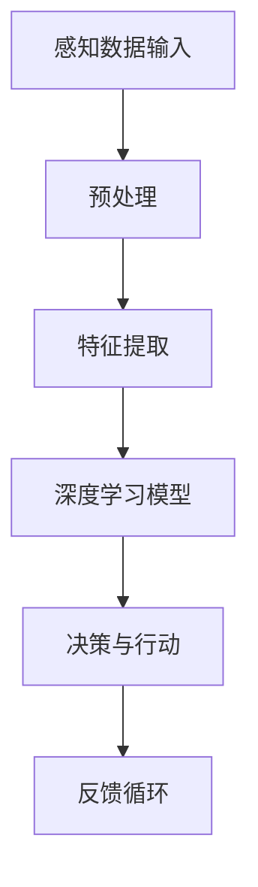

                 

### 《体验跨时空探险家培训师：AI创造的感知边界拓展专家》

#### 关键词：
- 人工智能
- 感知边界拓展
- 跨时空探险
- 培训师
- 虚拟现实
- 跨文化培训

#### 摘要：
本文探讨了人工智能（AI）如何通过感知边界拓展技术，创造出一个全新的跨时空探险家培训师角色。文章首先概述了AI与感知边界拓展的关系，分析了核心技术及其应用案例。接着，深入探讨了AI培训师的角色与任务，包括培训设计与实施、培训技术与工具。随后，文章探讨了感知边界拓展的跨时空应用，如远程培训与虚拟现实教学，以及与跨文化培训的结合。最后，文章展望了感知边界拓展技术的未来趋势，探讨了AI培训师的职业发展及教育改革的影响。

### 目录大纲

#### 《体验跨时空探险家培训师：AI创造的感知边界拓展专家》

#### 第一部分：AI与感知边界拓展

##### 第1章：AI与感知边界拓展概述
- 1.1 AI在感知边界拓展中的应用
- 1.2 感知边界拓展的重要性
- 1.3 AI感知边界拓展的现状与挑战

##### 第2章：感知边界拓展的核心技术
- 2.1 深度学习基础
- 2.2 多模态感知技术

##### 第3章：AI感知边界拓展的应用案例
- 3.1 跨媒体搜索与推荐
- 3.2 虚拟现实与增强现实

#### 第二部分：AI培训师的角色与任务

##### 第4章：AI培训师的角色与使命
- 4.1 AI培训师的工作内容
- 4.2 AI培训师的技能要求
- 4.3 AI培训师在未来的发展趋势

##### 第5章：培训设计与实施
- 5.1 培训需求分析
- 5.2 培训内容设计
- 5.3 培训实施与评估

##### 第6章：培训技术与工具
- 6.1 在线培训平台介绍
- 6.2 AI辅助教学工具

#### 第三部分：感知边界拓展的跨时空应用

##### 第7章：远程培训与虚拟现实教学
- 7.1 远程培训的优势与挑战
- 7.2 虚拟现实教学的设计与实施

##### 第8章：感知边界拓展与跨文化培训
- 8.1 跨文化培训的背景与意义
- 8.2 感知边界拓展在跨文化培训中的应用

#### 第四部分：感知边界拓展的未来趋势

##### 第9章：AI培训师的职业发展
- 9.1 AI培训师的职业定位
- 9.2 感知边界拓展技术的未来发展趋势

##### 第10章：感知边界拓展与教育改革
- 10.1 教育改革的需求与目标
- 10.2 感知边界拓展在教育培训中的应用

##### 第11章：感知边界拓展与终身学习
- 11.1 终身学习的理念与实践
- 11.2 感知边界拓展技术在终身教育中的应用

##### 第12章：感知边界拓展与未来社会
- 12.1 感知边界拓展对社会的影响
- 12.2 未来社会的感知边界拓展趋势

#### 附录

- 附录A：感知边界拓展相关资源

---

接下来，我们将逐步深入探讨每一部分的内容。首先是AI与感知边界拓展的概述。让我们先从核心概念和联系入手，使用Mermaid流程图来展示AI感知边界拓展的基本架构。随后，我们将详细讲解深度学习和多模态感知技术，以及它们的实际应用案例。让我们一起开始这个跨时空的探险之旅吧！<|assistant|>### 第一部分：AI与感知边界拓展

#### 第1章：AI与感知边界拓展概述

##### 1.1 AI在感知边界拓展中的应用

人工智能（AI）在感知边界拓展中的应用是一个引人入胜的领域，它通过模拟人类感知系统，扩展我们的感官能力，使其能够处理和解释来自各种感官的信息。以下是一个简化的Mermaid流程图，展示了AI感知边界拓展的基本架构：



在这个流程中，感知数据输入是从各种感官收集的原始数据，如视觉、听觉、触觉等。预处理步骤通常包括噪声过滤、归一化和数据增强等，以提高数据质量和模型的鲁棒性。特征提取是将原始数据转换为对模型有用的特征表示，如图像中的边缘、纹理或声音的频谱。深度学习模型是感知边界拓展的核心，它们通过学习输入数据的复杂模式和关联，实现对感知数据的解释和分类。决策与行动步骤是根据模型输出的结果来采取相应的行动，如自动驾驶汽车的控制决策。反馈循环是不断调整和优化模型，以适应新的环境和数据。

##### 1.2 感知边界拓展的重要性

感知边界拓展对于人工智能系统至关重要，它不仅提高了系统的自主性和智能性，还使其能够更好地理解和交互复杂的环境。以下是感知边界拓展的几个关键重要性：

1. **增强自主性**：通过感知边界拓展，AI系统能够独立地感知和理解周围环境，减少对人类操作员的依赖。
2. **提高智能水平**：感知边界拓展使得AI系统能够处理更丰富的感知数据，从而提高其智能水平，做出更复杂和更准确的决策。
3. **改善用户体验**：在虚拟现实（VR）和增强现实（AR）应用中，感知边界拓展能够提供更真实和沉浸式的体验，提高用户的满意度和参与度。
4. **优化任务执行**：在机器人、自动驾驶和智能监控等应用中，感知边界拓展能够提高任务执行的效率和准确性。

##### 1.3 AI感知边界拓展的现状与挑战

目前，AI感知边界拓展技术已经取得了显著的进展，深度学习、多模态感知和强化学习等技术正在不断推动这一领域的发展。然而，仍存在一些挑战和问题：

1. **数据质量和多样性**：高质量、多样性的感知数据是训练强大AI模型的关键。然而，收集和处理这些数据通常是一项艰巨的任务。
2. **计算资源消耗**：深度学习模型通常需要大量的计算资源，特别是在实时应用中，这对硬件和能源消耗提出了高要求。
3. **解释性和透明性**：深度学习模型通常被视为“黑箱”，其决策过程不透明，难以解释。这限制了其在某些关键领域的应用。
4. **安全性**：随着感知边界拓展，AI系统面临的潜在安全风险也在增加，如对抗性攻击和隐私泄露。

接下来，我们将详细探讨感知边界拓展的核心技术，包括深度学习基础和多模态感知技术。这些技术不仅为AI感知边界拓展提供了基础，也为未来的应用奠定了重要的技术支持。<|assistant|>### 第2章：感知边界拓展的核心技术

#### 2.1 深度学习基础

深度学习是感知边界拓展的核心技术之一，它通过模拟人脑神经网络的结构和功能，使计算机能够从大量数据中自动学习特征和模式。以下是深度学习的基本概念和架构：

##### 2.1.1 神经网络结构

神经网络（Neural Networks）是深度学习的基础构件，它们由一系列相互连接的神经元（或节点）组成。每个神经元接收来自其他神经元的输入信号，通过加权求和处理后产生输出信号。神经网络的典型结构包括输入层、隐藏层和输出层。

1. **输入层**：接收外部输入数据，如图像、声音或文本。
2. **隐藏层**：对输入数据进行特征提取和变换，隐藏层可以有一个或多个。
3. **输出层**：根据训练数据产生预测或决策结果。

##### 2.1.2 卷积神经网络

卷积神经网络（Convolutional Neural Networks, CNN）是深度学习中最常用的架构之一，特别适用于处理图像数据。CNN的主要特点是使用了卷积操作，这使得模型能够在输入数据中自动提取局部特征。

1. **卷积层**：通过卷积操作从输入数据中提取特征。
2. **池化层**：降低特征图的空间分辨率，减少计算量和参数数量。
3. **全连接层**：将卷积层提取的特征映射到分类或回归任务。

以下是CNN的简化伪代码：

```python
# CNN模型伪代码
def CNN(input_data):
    # 输入层
    layer = input_data
    
    # 卷积层1
    layer = conv2d(layer, filters, kernel_size)
    layer = activation(layer)
    layer = pooling(layer)

    # 卷积层2
    layer = conv2d(layer, filters, kernel_size)
    layer = activation(layer)
    layer = pooling(layer)

    # 全连接层
    layer = flatten(layer)
    layer = dense(layer, num_classes)
    layer = activation(layer)

    return layer
```

##### 2.1.3 循环神经网络

循环神经网络（Recurrent Neural Networks, RNN）适用于处理序列数据，如时间序列、语音和文本。RNN的关键特性是能够记住序列中的历史信息。

1. **隐藏状态**：每个时间步的隐藏状态包含当前输入和之前隐藏状态的结合。
2. **权重共享**：RNN中的权重在时间步之间共享，减少了参数数量。

以下是RNN的简化伪代码：

```python
# RNN模型伪代码
class RNN:
    def __init__(self, input_size, hidden_size):
        self.input_size = input_size
        self.hidden_size = hidden_size
        self.Wxh = weight_matrix(input_size, hidden_size)
        selfWhh = weight_matrix(hidden_size, hidden_size)
        self.h0 = zeros((1, hidden_size))

    def forward(self, x_t):
        h_t = tanh(x_t @ self.Wxh + self.h_{t-1} @ self.Whh)
        return h_t
```

##### 2.1.4 注意力机制

注意力机制（Attention Mechanism）是深度学习中的一个重要概念，它使模型能够关注序列中的关键部分，提高其处理复杂任务的能力。

1. **自注意力**：模型在处理序列时，能够自动关注序列中的其他部分。
2. **交互注意力**：模型在不同序列之间建立交互关系，如文本和图像。

以下是注意力机制的简化伪代码：

```python
# 自注意力机制伪代码
def scaled_dot_product_attention(q, k, v, mask=None):
    attention_scores = q @ k.T / sqrt(hidden_size)
    if mask is not None:
        attention_scores = attention_scores + mask
    attention_weights = softmax(attention_scores)
    output = attention_weights @ v
    return output
```

#### 2.2 多模态感知技术

多模态感知技术是感知边界拓展的重要组成部分，它通过整合来自不同模态的信息（如视觉、听觉、触觉等），使AI系统能够更全面地理解环境。

##### 2.2.1 图像与语音的融合

图像与语音融合是将视觉和听觉信息结合起来，以提供更丰富的感知体验。以下是一个简化的多模态感知流程：

1. **特征提取**：分别从图像和语音数据中提取特征。
2. **特征融合**：将视觉和听觉特征进行融合，如使用神经网络。
3. **联合处理**：对融合后的特征进行分类或预测。

以下是图像与语音融合的简化伪代码：

```python
# 图像与语音融合伪代码
def multimodal_fusion(image_features, audio_features):
    # 融合层
    fusion_features = concatenate([image_features, audio_features])
    fusion_output = dense(fusion_features, hidden_size)
    fusion_output = activation(fusion_output)
    return fusion_output
```

##### 2.2.2 视觉与听觉的协同处理

视觉与听觉的协同处理是利用视觉和听觉信息的互补性，以提高AI系统的感知能力。以下是一个简化的协同处理流程：

1. **特征提取**：分别从视觉和听觉数据中提取特征。
2. **协同学习**：使用协同学习算法（如多任务学习）将视觉和听觉特征结合。
3. **协同决策**：基于融合的特征进行分类或预测。

以下是视觉与听觉协同处理的简化伪代码：

```python
# 视觉与听觉协同处理伪代码
def visual_audio_cohere(visual_features, audio_features):
    # 协同层
    cohere_features = concatenate([visual_features, audio_features])
    cohere_output = dense(cohere_features, hidden_size)
    cohere_output = activation(cohere_output)
    return cohere_output
```

##### 2.2.3 视觉与触觉的结合

视觉与触觉的结合是将视觉信息和触觉信息融合，以提供更全面的环境感知。以下是一个简化的视觉与触觉融合流程：

1. **特征提取**：分别从视觉和触觉数据中提取特征。
2. **融合策略**：使用不同的融合策略（如注意力机制）将视觉和触觉特征结合。
3. **融合评估**：基于融合的特征进行评估和预测。

以下是视觉与触觉结合的简化伪代码：

```python
# 视觉与触觉结合伪代码
def visual_tactile_fusion(visual_features, tactile_features):
    # 融合层
    fusion_features = concatenate([visual_features, tactile_features])
    fusion_output = dense(fusion_features, hidden_size)
    fusion_output = activation(fusion_output)
    return fusion_output
```

通过上述核心技术和多模态感知技术，AI感知边界拓展实现了对复杂环境的深刻理解和交互。这些技术不仅推动了AI感知能力的提升，也为未来的跨媒体搜索、虚拟现实和增强现实等应用提供了重要的技术支持。<|assistant|>### 第3章：AI感知边界拓展的应用案例

#### 3.1 跨媒体搜索与推荐

跨媒体搜索与推荐是AI感知边界拓展的一个重要应用领域，它通过整合来自不同媒体类型（如图像、视频、音频和文本）的信息，提供更加丰富和个性化的搜索与推荐体验。

##### 3.1.1 跨媒体搜索技术

跨媒体搜索技术旨在实现不同媒体类型之间的关联和检索。以下是一个简化的跨媒体搜索流程：

1. **多模态特征提取**：分别从图像、视频、音频和文本数据中提取特征，如使用卷积神经网络（CNN）提取图像特征，循环神经网络（RNN）提取文本特征。
2. **特征融合**：将不同媒体类型的特征进行融合，如使用自注意力机制或交互注意力机制。
3. **检索与匹配**：基于融合的特征进行检索和匹配，找到与查询最相关的媒体内容。

以下是跨媒体搜索技术的简化伪代码：

```python
# 跨媒体搜索技术伪代码
def multimodal_search(query, image_features, video_features, audio_features, text_features):
    # 特征融合
    fusion_features = attention_mechanism([image_features, video_features, audio_features, text_features])
    
    # 检索与匹配
    similarity_scores = dot(fusion_features, query.T)
    top_results = argsort(similarity_scores, descending=True)
    
    return top_results
```

##### 3.1.2 跨媒体推荐算法

跨媒体推荐算法旨在为用户提供个性化的推荐内容，通过融合用户的历史行为和跨媒体特征。以下是一个简化的跨媒体推荐算法流程：

1. **用户历史行为分析**：收集并分析用户的历史行为数据，如搜索记录、浏览历史和购买记录。
2. **多模态特征提取**：从用户交互的不同媒体类型中提取特征。
3. **用户兴趣建模**：基于用户历史行为和跨媒体特征，构建用户兴趣模型。
4. **推荐生成**：根据用户兴趣模型，为用户推荐最相关的媒体内容。

以下是跨媒体推荐算法的简化伪代码：

```python
# 跨媒体推荐算法伪代码
def multimodal_recommendation(user_interest_model, item_features):
    # 用户兴趣建模
    user_representation = aggregate(user_interest_model)
    
    # 推荐生成
    recommendation_scores = dot(user_representation, item_features.T)
    top_recommendations = argsort(recommendation_scores, descending=True)
    
    return top_recommendations
```

##### 3.1.3 跨媒体应用案例分析

以下是一个跨媒体应用案例分析，展示了AI感知边界拓展在实际应用中的效果。

**案例：智能音乐推荐平台**

该平台整合了音乐、歌词、用户评论等多媒体信息，为用户提供个性化的音乐推荐。

1. **多模态特征提取**：从音频、歌词和用户评论中提取特征，如使用CNN提取音频特征，使用RNN提取歌词特征。
2. **特征融合**：使用自注意力机制融合音频、歌词和用户评论特征。
3. **用户兴趣建模**：基于用户历史行为和跨媒体特征，构建用户兴趣模型。
4. **推荐生成**：根据用户兴趣模型，为用户推荐最相关的音乐。

通过跨媒体搜索和推荐技术，用户可以体验到更加丰富和个性化的音乐推荐，提高了用户的满意度和平台的竞争力。

##### 3.2 虚拟现实与增强现实

虚拟现实（VR）和增强现实（AR）是AI感知边界拓展的另一个重要应用领域，它们通过扩展用户的感知能力，提供沉浸式和交互式的体验。

##### 3.2.1 虚拟现实技术

虚拟现实技术通过创建一个计算机生成的三维虚拟环境，使用户能够沉浸其中，进行互动和探索。以下是一个简化的虚拟现实技术流程：

1. **三维场景生成**：使用计算机图形学技术生成三维虚拟场景。
2. **实时渲染**：实时渲染三维场景，确保用户感受到流畅的视觉效果。
3. **传感器集成**：集成传感器（如头戴式显示器、手柄、追踪器等），用于感知用户的位置和动作。
4. **用户交互**：通过用户的动作和手势与虚拟环境进行交互。

以下是虚拟现实技术的简化伪代码：

```python
# 虚拟现实技术伪代码
def virtual_reality(scenario, user_actions):
    # 三维场景生成
    scene = generate_3d_scene(scenario)
    
    # 实时渲染
    rendered_scene = render_scene(scene)
    
    # 用户交互
    updated_scene = interact_with_scene(rendered_scene, user_actions)
    
    return updated_scene
```

##### 3.2.2 增强现实技术

增强现实技术通过将虚拟元素叠加在现实世界中，增强用户的感知和交互体验。以下是一个简化的增强现实技术流程：

1. **环境感知**：使用摄像头和传感器捕捉现实世界的图像和场景。
2. **虚拟元素生成**：创建虚拟元素（如图形、文字、动画等）。
3. **叠加与渲染**：将虚拟元素叠加在现实世界的图像上，并实时渲染。
4. **用户交互**：用户通过与虚拟元素和现实世界的交互，实现增强现实体验。

以下是增强现实技术的简化伪代码：

```python
# 增强现实技术伪代码
def augmented_reality(real_world_image, virtual_elements):
    # 环境感知
    detected_objects = detect_objects(real_world_image)
    
    # 虚拟元素生成
    generated_elements = generate_virtual_elements(detected_objects)
    
    # 叠加与渲染
    augmented_image = overlay_and_render(generated_elements, real_world_image)
    
    return augmented_image
```

##### 3.2.3 虚拟现实与增强现实应用案例

以下是一个虚拟现实与增强现实应用案例分析，展示了AI感知边界拓展在实际应用中的效果。

**案例：虚拟博物馆导览**

该应用通过虚拟现实和增强现实技术，为用户提供一个沉浸式的博物馆导览体验。

1. **虚拟现实场景生成**：生成博物馆的三维虚拟场景，包括展品和展览布局。
2. **实时渲染**：实时渲染虚拟场景，确保用户感受到流畅的视觉效果。
3. **环境感知**：使用摄像头和传感器捕捉用户的位置和动作。
4. **增强现实元素叠加**：在用户视野中叠加与虚拟场景相关的增强现实元素，如展品说明和互动游戏。
5. **用户交互**：用户通过与虚拟现实和增强现实元素的交互，获得个性化的导览体验。

通过虚拟现实和增强现实技术，用户可以体验到如同亲临博物馆现场的沉浸式导览，提高了用户的文化素养和参观体验。

综上所述，AI感知边界拓展在跨媒体搜索与推荐、虚拟现实和增强现实等应用领域中展示了其强大的潜力。这些应用不仅丰富了用户体验，也为各个行业带来了创新和变革。接下来，我们将探讨AI培训师的角色与任务，进一步了解AI在教育培训领域的应用。<|assistant|>### 第二部分：AI培训师的角色与任务

#### 第4章：AI培训师的角色与使命

随着人工智能技术的飞速发展，AI培训师的角色应运而生，成为教育培训领域的重要力量。AI培训师不仅需要具备传统培训师的技能，还需要深入了解人工智能技术，以帮助学生和专业人士掌握这些先进的工具和方法。

##### 4.1 AI培训师的工作内容

AI培训师的工作内容涵盖了多个方面，包括课程设计、教学实施、学生评估和持续支持等。以下是AI培训师的具体工作内容：

1. **课程设计**：根据培训目标和学员需求，设计适合的AI课程。这包括确定课程大纲、编写教材和制定教学计划。
2. **教学实施**：运用人工智能技术和工具，采用多种教学方法和策略，如在线直播、互动讨论和项目实践，确保学员能够理解和应用所学知识。
3. **学生评估**：通过在线测试、作业和项目评估，了解学员的学习进度和成果，提供针对性的反馈和指导。
4. **持续支持**：在课程结束后，为学员提供持续的学术和技术支持，帮助他们解决实际问题，并将其应用在实际工作中。
5. **技术更新**：跟踪人工智能领域的发展趋势，不断更新和优化培训内容，确保课程与行业需求保持一致。

##### 4.2 AI培训师的技能要求

要成为一名优秀的AI培训师，需要具备以下技能和要求：

1. **专业知识**：具备深厚的计算机科学和人工智能知识，熟悉深度学习、机器学习和自然语言处理等核心技术。
2. **教学经验**：具备丰富的教学经验，能够运用有效的教学方法和策略，激发学员的学习兴趣和动力。
3. **沟通能力**：具备良好的沟通能力，能够清晰、准确地传达复杂的概念和知识，并与学员建立良好的师生关系。
4. **技术素养**：熟悉常用的AI工具和平台，如TensorFlow、PyTorch和Keras等，能够指导学员进行实际操作和应用。
5. **问题解决能力**：能够快速识别和解决学员在学习过程中遇到的问题，提供有效的解决方案。
6. **持续学习**：对人工智能领域保持持续关注和学习，不断提升自己的专业水平和教学能力。

##### 4.3 AI培训师在未来的发展趋势

随着人工智能技术的不断进步和应用的广泛推广，AI培训师在未来将面临以下发展趋势：

1. **个性化培训**：随着AI技术的发展，AI培训师将能够根据学员的个性特点和需求，提供更加个性化的培训服务，提高培训效果。
2. **远程培训**：远程培训和在线教育将得到更广泛的应用，AI培训师需要掌握先进的远程教学技术和工具，以满足全球学员的需求。
3. **跨学科融合**：人工智能与其他学科的融合将越来越普遍，AI培训师需要具备跨学科的知识和技能，为学生提供更全面的培训。
4. **终身学习**：随着技术的快速发展，AI培训师需要具备终身学习的理念，不断更新自己的知识和技能，以适应行业变化。
5. **行业影响力**：AI培训师将在教育培训领域发挥更大的影响力，推动人工智能技术的普及和应用。

综上所述，AI培训师在人工智能时代扮演着重要角色，他们不仅需要具备丰富的专业知识和教学经验，还需要不断适应和引领教育领域的发展趋势。通过个性化的培训、远程教育和跨学科融合，AI培训师将为学生和专业人士提供更加高效和有价值的培训服务。<|assistant|>### 第5章：培训设计与实施

#### 5.1 培训需求分析

培训需求分析是培训设计与实施的第一步，它旨在确定培训的目标、内容和方法，以满足学员和组织的需求。以下是一个简化的培训需求分析流程：

1. **需求调查**：通过问卷调查、访谈和观察等方式，收集学员和组织的相关信息，了解他们的培训需求。
2. **需求分析**：分析收集到的数据，确定培训的目标、内容和方法，以及评估学员的基础知识和技能水平。
3. **需求文档编写**：将分析结果整理成需求文档，明确培训的目标、内容、方法、预期成果和评估标准。

以下是培训需求分析的简化伪代码：

```python
# 培训需求分析伪代码
def analyze_training_needs(survey_data, interview_data, observation_data):
    # 需求调查
    survey_results = process_survey(survey_data)
    interview_results = process_interview(interview_data)
    observation_results = process_observation(observation_data)
    
    # 需求分析
    training_objectives = determine_training_objectives(survey_results, interview_results, observation_results)
    training_content = determine_training_content(training_objectives)
    training_methods = determine_training_methods(training_content)
    
    # 需求文档编写
    training_document = generate_training_document(training_objectives, training_content, training_methods)
    
    return training_document
```

##### 5.1.1 需求调查方法

需求调查是培训需求分析的重要环节，以下是一些常用的需求调查方法：

1. **问卷调查**：通过设计问卷，收集学员和组织的培训需求。问卷可以采用线上或线下方式，确保覆盖广泛的学员群体。
2. **访谈**：通过与学员和组织的相关人员（如主管、团队成员等）进行面对面或电话访谈，深入了解他们的培训需求和期望。
3. **观察**：通过实地观察学员在工作中的表现，发现他们的技能短板和培训需求。
4. **专家咨询**：邀请行业专家或培训顾问，提供专业的意见和建议，帮助确定培训目标和内容。

##### 5.1.2 需求分析模型

需求分析模型是用于分析和评估培训需求的方法和工具。以下是一些常用的需求分析模型：

1. **SWOT分析**：通过分析组织的优势（Strengths）、劣势（Weaknesses）、机会（Opportunities）和威胁（Threats），确定培训的重点和方向。
2. **马斯洛需求层次理论**：根据马斯洛的需求层次理论，分析学员在不同层次上的培训需求，确保培训内容满足他们的基本需求。
3. **KANO模型**：根据学员对培训内容和方法的满意度，将其分为必备需求、期望需求、无需求和不满意需求，确定培训的优先级。

以下是需求分析模型的简化伪代码：

```python
# 需求分析模型伪代码
def analyze_training_needs(survey_data, interview_data, observation_data):
    # SWOT分析
    swot_analysis = perform_swot_analysis(survey_data, interview_data, observation_data)
    
    # 马斯洛需求层次理论
    maslow_demand = perform_maslow_analysis(survey_data)
    
    # KANO模型
    kano_model = perform_kano_analysis(survey_data)
    
    # 整合分析结果
    training_needs = integrate_analysis_results(swot_analysis, maslow_demand, kano_model)
    
    return training_needs
```

##### 5.1.3 需求文档编写

需求文档是培训设计与实施的指南，它明确了培训的目标、内容、方法和评估标准。以下是一个简化的需求文档编写流程：

1. **确定文档结构**：根据需求分析的结论，确定需求文档的结构和内容。
2. **编写文档内容**：详细描述培训的目标、内容、方法、评估标准和预期成果。
3. **审核与修订**：邀请相关专家和学员进行审核，对文档内容进行修订和完善。
4. **发布文档**：将最终的需求文档发布给相关人员，作为培训设计与实施的依据。

以下是需求文档编写的简化伪代码：

```python
# 需求文档编写伪代码
def generate_training_document(training_needs):
    # 确定文档结构
    document_structure = define_document_structure()
    
    # 编写文档内容
    document_content = {
        "training_objectives": training_needs["training_objectives"],
        "training_content": training_needs["training_content"],
        "training_methods": training_needs["training_methods"],
        "evaluation_standards": training_needs["evaluation_standards"],
        "expected_results": training_needs["expected_results"]
    }
    
    # 审核与修订
    approved_document = review_and_revision(document_content)
    
    # 发布文档
    publish_document(approved_document)
    
    return approved_document
```

#### 5.2 培训内容设计

培训内容设计是培训设计与实施的核心环节，它决定了培训的质量和效果。以下是一个简化的培训内容设计流程：

1. **确定培训内容**：根据需求分析的结果，确定培训的具体内容，包括理论知识和实践技能。
2. **设计课程结构**：根据培训内容，设计课程的模块和章节，确保内容的系统性和逻辑性。
3. **编写课程材料**：编写教材、教案和PPT等教学材料，确保内容准确、易懂。
4. **制定教学策略**：根据培训内容和学员特点，制定合适的教学策略，如讲授、讨论、实验和实践等。

以下是培训内容设计的简化伪代码：

```python
# 培训内容设计伪代码
def design_training_content(training_needs):
    # 确定培训内容
    training_content = determine_training_content(training_needs["training_objectives"])
    
    # 设计课程结构
    course_structure = design_course_structure(training_content)
    
    # 编写课程材料
    training_materials = generate_training_materials(course_structure)
    
    # 制定教学策略
    teaching_strategy = determine_teaching_strategy(training_materials)
    
    return training_content, course_structure, training_materials, teaching_strategy
```

##### 5.2.1 培训内容规划

培训内容规划是培训内容设计的重要环节，它决定了培训的深度和广度。以下是一个简化的培训内容规划流程：

1. **确定核心概念**：根据培训目标和学员需求，确定培训的核心概念和知识点。
2. **划分知识点**：将核心概念和知识点划分成易于理解和学习的模块。
3. **规划课程进度**：根据知识点划分和学员的学习节奏，规划培训的进度和课时。

以下是培训内容规划的简化伪代码：

```python
# 培训内容规划伪代码
def plan_training_content(training_needs):
    # 确定核心概念
    core_concepts = determine_core_concepts(training_needs["training_objectives"])
    
    # 划分知识点
    knowledge_points = divide_knowledge_points(core_concepts)
    
    # 规划课程进度
    course_progress = plan_course_progress(knowledge_points)
    
    return course_progress
```

##### 5.2.2 教学策略选择

教学策略选择是培训内容设计的关键环节，它决定了学员的学习体验和效果。以下是一个简化的教学策略选择流程：

1. **分析学员特点**：根据学员的年龄、职业、学习经历和兴趣等，分析他们的特点。
2. **选择教学策略**：根据学员特点和培训内容，选择合适的教学策略，如讲授、讨论、实验和实践等。
3. **设计教学活动**：根据教学策略，设计具体的课堂活动和教学环节。

以下是教学策略选择的简化伪代码：

```python
# 教学策略选择伪代码
def choose_teaching_strategy(training_needs, course_progress):
    # 分析学员特点
    student_characteristics = analyze_student_characteristics(training_needs)
    
    # 选择教学策略
    teaching_strategy = select_teaching_strategy(student_characteristics, course_progress)
    
    # 设计教学活动
    teaching_activities = design_teaching_activities(teaching_strategy)
    
    return teaching_strategy, teaching_activities
```

##### 5.2.3 课程资源整合

课程资源整合是将各种教学资源整合到培训课程中，以提高教学效果和学员体验。以下是一个简化的课程资源整合流程：

1. **收集教学资源**：根据培训内容和教学策略，收集各种教学资源，如教材、PPT、视频和实验等。
2. **整合资源**：将收集到的教学资源进行整合，形成完整的培训课程包。
3. **评估资源质量**：对整合后的教学资源进行评估，确保其质量符合培训要求。
4. **发布课程资源**：将评估后的教学资源发布给学员，确保他们能够方便地获取和使用。

以下是课程资源整合的简化伪代码：

```python
# 课程资源整合伪代码
def integrate_course_resources(training_content, teaching_strategy):
    # 收集教学资源
    teaching_resources = collect_teaching_resources(training_content, teaching_strategy)
    
    # 整合资源
    integrated_resources = integrate_resources(teaching_resources)
    
    # 评估资源质量
    resource_quality = evaluate_resource_quality(integrated_resources)
    
    # 发布课程资源
    publish_resources(integrated_resources, resource_quality)
    
    return integrated_resources
```

#### 5.3 培训实施与评估

培训实施与评估是培训设计与实施的重要环节，它决定了培训的效果和学员的满意度。以下是一个简化的培训实施与评估流程：

1. **培训实施**：根据培训内容和教学策略，进行培训的授课、实验和实践等环节。
2. **学员反馈**：在培训过程中和结束后，收集学员的反馈和意见，了解培训的实际情况。
3. **培训效果评估**：根据学员反馈和培训结果，评估培训的效果和成效。
4. **反馈与改进**：根据评估结果，对培训内容和教学方法进行反馈和改进，以提高培训质量。

以下是培训实施与评估的简化伪代码：

```python
# 培训实施与评估伪代码
def implement_and_evaluate_training(training_content, teaching_strategy):
    # 培训实施
    training_progress = implement_training(training_content, teaching_strategy)
    
    # 学员反馈
    student_feedback = collect_student_feedback(training_progress)
    
    # 培训效果评估
    training_evaluation = evaluate_training_effectiveness(student_feedback)
    
    # 反馈与改进
    improved_strategy = improve_teaching_strategy(teaching_strategy, training_evaluation)
    
    return training_progress, training_evaluation, improved_strategy
```

##### 5.3.1 培训实施流程

培训实施流程是确保培训内容和教学策略得到有效执行的过程。以下是一个简化的培训实施流程：

1. **准备阶段**：根据培训内容和教学策略，准备所需的教材、PPT、实验和工具等资源。
2. **授课阶段**：按照教学计划，进行理论知识和实践技能的授课。
3. **实验与实践阶段**：组织学员进行实际操作和应用，以巩固所学知识。
4. **总结与反馈阶段**：在培训结束时，进行总结和反馈，收集学员的意见和建议。

以下是培训实施流程的简化伪代码：

```python
# 培训实施流程伪代码
def implement_training(training_content, teaching_strategy):
    # 准备阶段
    training_resources = prepare_training_resources(training_content, teaching_strategy)
    
    # 授课阶段
    teaching_sessions = conduct_teaching_sessions(training_resources)
    
    # 实验与实践阶段
    practical_sessions = organize_practical_sessions(teaching_sessions)
    
    # 总结与反馈阶段
    summary_feedback = gather_summary_feedback(practical_sessions)
    
    return training_resources, teaching_sessions, practical_sessions, summary_feedback
```

##### 5.3.2 培训效果评估方法

培训效果评估是衡量培训质量和成效的重要手段。以下是一些常用的培训效果评估方法：

1. **问卷调查**：通过设计问卷，收集学员对培训内容和方法的反馈和评价。
2. **测试与考试**：组织学员进行理论知识和实践技能的测试和考试，评估他们的学习成果。
3. **观察与记录**：通过观察学员在学习过程中的表现和记录他们的学习进度，评估培训效果。
4. **访谈与反馈**：与学员进行面对面或电话访谈，了解他们对培训的满意度和建议。

以下是培训效果评估方法的简化伪代码：

```python
# 培训效果评估方法伪代码
def evaluate_training_effectiveness(student_feedback, test_results, observation_records, interview_comments):
    # 问卷调查
    survey_evaluation = analyze_survey_results(student_feedback)
    
    # 测试与考试
    test_evaluation = analyze_test_results(test_results)
    
    # 观察与记录
    observation_evaluation = analyze_observation_records(observation_records)
    
    # 访谈与反馈
    interview_evaluation = analyze_interview_comments(interview_comments)
    
    # 综合评估
    overall_evaluation = integrate_evaluation_results(survey_evaluation, test_evaluation, observation_evaluation, interview_evaluation)
    
    return overall_evaluation
```

##### 5.3.3 反馈与改进策略

反馈与改进策略是确保培训质量不断提升的重要环节。以下是一些常用的反馈与改进策略：

1. **收集反馈**：在培训过程中和结束后，积极收集学员的反馈和意见，了解他们的需求和期望。
2. **分析反馈**：对收集到的反馈进行分析，识别培训中的问题和不足之处。
3. **制定改进计划**：根据分析结果，制定具体的改进计划，包括优化培训内容、调整教学方法和改进教学资源等。
4. **实施改进**：按照改进计划，实施培训内容和教学方法的调整和改进。
5. **跟踪效果**：在改进实施后，跟踪培训效果，评估改进措施的有效性。

以下是反馈与改进策略的简化伪代码：

```python
# 反馈与改进策略伪代码
def improve_training_strategy(feedback_data, evaluation_results):
    # 收集反馈
    collected_feedback = gather_feedback(feedback_data)
    
    # 分析反馈
    feedback_analysis = analyze_collected_feedback(collected_feedback)
    
    # 制定改进计划
    improvement_plan = create_improvement_plan(feedback_analysis)
    
    # 实施改进
    implemented_improvements = apply_improvement_plan(improvement_plan)
    
    # 跟踪效果
    tracking_results = monitor_improvement_effectiveness(implemented_improvements)
    
    return tracking_results
```

通过培训设计与实施、培训效果评估和反馈与改进策略，AI培训师能够为学生和专业人士提供高质量和有价值的培训服务，帮助他们掌握人工智能技术，提升自身的专业能力。<|assistant|>### 第6章：培训技术与工具

#### 6.1 在线培训平台介绍

随着远程教育和在线学习的普及，在线培训平台成为了AI培训师不可或缺的工具。在线培训平台不仅提供了丰富的教学内容和资源，还支持互动式学习、实时沟通和个性化学习体验。以下是一些流行的在线培训平台及其特点：

1. **Coursera**：Coursera是一个全球领先的在线学习平台，提供来自世界顶级大学和公司的课程。平台支持视频教学、在线作业、实时讨论和证书认证。

2. **edX**：edX是一个非营利性在线学习平台，提供大量免费和付费课程，涵盖多个学科领域。平台的特点是支持大规模在线课程（MOOCs）和自适应学习。

3. **Udemy**：Udemy是一个以用户为中心的在线学习平台，提供广泛的课程，包括编程、数据分析、设计等领域。平台的特点是灵活的课程结构和灵活的学习时间。

4. **Khan Academy**：Khan Academy是一个非营利性教育组织，提供免费的在线课程和教学视频。平台的特点是简单易懂的教学内容和互动性。

5. **Skillshare**：Skillshare是一个专注于创意和手工艺的在线学习平台，提供各种艺术和设计课程。平台的特点是小班教学和个性化指导。

#### 6.1.1 平台选择标准

在选择在线培训平台时，AI培训师应考虑以下标准：

- **教学内容和课程质量**：确保平台提供的课程符合培训目标和学员需求，具有较高的教学质量和实用性。
- **用户界面和互动性**：选择界面友好、操作简单的平台，提高学员的学习体验和参与度。
- **技术支持和课程更新**：平台应提供稳定的技术支持和及时的课程更新，确保学员能够获得最新的知识和技能。
- **成本效益**：根据预算和培训规模，选择性价比高的平台，确保资源的最优利用。

#### 6.1.2 平台功能特点

以下是不同在线培训平台的主要功能特点：

1. **Coursera**：支持在线直播、实时讨论、自动评分和证书认证。平台提供多种语言支持和跨平台访问。

2. **edX**：支持自适应学习、课程进度追踪、在线作业和实时反馈。平台提供强大的数据分析工具，帮助培训师优化课程内容。

3. **Udemy**：提供灵活的课程结构、自定义学习计划和实时沟通功能。平台支持多种支付方式和在线支付。

4. **Khan Academy**：支持视频教学、互动练习和个性化学习路径。平台提供全面的课程大纲和学习计划。

5. **Skillshare**：支持在线直播、视频教程、实时讨论和作业提交。平台提供一对一辅导和个性化学习建议。

#### 6.1.3 平台使用技巧

以下是一些使用在线培训平台的技巧，以提高教学效果和学员满意度：

- **合理规划课程**：根据学员需求和时间安排，合理规划课程内容和进度，确保教学内容的系统性和连贯性。
- **多样化教学方法**：结合视频、文本、图片和互动练习等多种教学方法，提高学员的学习兴趣和参与度。
- **实时互动和反馈**：通过在线讨论、提问和作业等方式，与学员保持实时互动，及时解答学员的疑问，提供个性化指导。
- **跟踪学习进度**：使用平台提供的进度追踪工具，了解学员的学习进度和效果，及时调整教学策略。
- **个性化学习建议**：根据学员的学习进度和成绩，提供个性化的学习建议和指导，帮助学员克服学习困难。

#### 6.2 AI辅助教学工具

AI辅助教学工具是AI培训师的重要工具，能够提高教学效果和效率。以下是一些常见的AI辅助教学工具：

1. **自然语言处理（NLP）工具**：如OpenAI的GPT-3、谷歌的BERT等，用于自动批改作业、生成答案和提供学习建议。

2. **图像识别工具**：如TensorFlow的Object Detection API、谷歌的Cloud Vision API等，用于自动标注图像、识别物体和生成图像描述。

3. **语音识别与生成工具**：如谷歌的语音识别API、IBM的Watson Speech-to-Text等，用于自动转录语音、生成语音和创建语音合成课程。

4. **个性化学习推荐系统**：如Netflix的推荐算法、亚马逊的个性化推荐系统等，用于根据学员的学习行为和兴趣，推荐合适的课程和学习资源。

5. **自适应学习平台**：如Knewton、DreamBox等，用于根据学员的学习进度和成绩，动态调整教学内容和难度，提供个性化的学习体验。

通过使用这些AI辅助教学工具，AI培训师可以更好地了解学员的学习需求和进展，提供个性化的培训服务，提高教学效果和学员满意度。<|assistant|>### 第三部分：感知边界拓展的跨时空应用

#### 第7章：远程培训与虚拟现实教学

随着信息技术的飞速发展，远程培训和虚拟现实教学成为了教育领域的重要趋势。这些技术不仅打破了地域和时间的限制，还极大地拓展了教育的可能性，为学习者提供了更加灵活和个性化的学习体验。

##### 7.1 远程培训的优势与挑战

远程培训是指利用互联网和其他通信技术，实现教师与学员之间远程的教学和学习活动。以下是远程培训的优势和挑战：

###### **远程培训的优势**：

1. **灵活性和便捷性**：远程培训使得学员可以根据自己的时间安排和学习进度进行学习，不再受限于地理位置和授课时间。
2. **资源丰富**：远程培训平台通常提供丰富的教学资源和课程，学员可以自由选择感兴趣的课程和学习材料。
3. **成本效益**：远程培训减少了学员的交通和住宿费用，同时也降低了培训机构的教学成本。
4. **个性化和定制化**：通过分析学员的学习行为和成绩，远程培训平台可以提供个性化的学习建议和资源，满足不同学员的需求。

###### **远程培训的挑战**：

1. **技术依赖**：远程培训高度依赖网络和通信技术，网络不稳定和设备故障可能影响教学效果。
2. **师生互动不足**：由于缺乏面对面的互动，学员可能感到孤独和缺乏归属感，影响学习效果。
3. **学习自律性**：远程培训要求学员具备较高的自律性和学习动力，一些学员可能难以保持学习节奏和进度。
4. **教学评估困难**：远程培训中，教师难以实时监控学员的学习状态和成绩，评估学员的学习效果存在一定困难。

##### 7.2 虚拟现实教学的设计与实施

虚拟现实（VR）教学是一种通过创建虚拟环境，模拟真实的学习场景，提供沉浸式和交互式学习体验的教学方法。以下是虚拟现实教学的设计与实施步骤：

###### **设计步骤**：

1. **需求分析**：了解教学目标、教学内容和学员特点，确定VR教学的需求。
2. **场景设计**：根据教学需求，设计虚拟学习场景，包括环境布局、教学道具和互动元素等。
3. **教学策略**：结合虚拟现实技术，制定适合的教学策略，如互动式教学、沉浸式学习和虚拟实验等。
4. **资源整合**：整合教学资源，包括虚拟现实软件、硬件设备和教学材料等。

###### **实施步骤**：

1. **技术准备**：确保VR设备和网络环境的稳定，为教学实施提供技术支持。
2. **教师培训**：对教师进行VR教学培训，确保他们熟悉VR教学工具和教学方法。
3. **教学实施**：根据教学策略，进行VR教学活动，包括课堂授课、互动练习和虚拟实验等。
4. **效果评估**：通过学员反馈和教学数据，评估VR教学的效果，为后续改进提供依据。

##### 7.2.1 虚拟现实教学原理

虚拟现实教学基于以下几个原理：

1. **沉浸感**：通过虚拟现实技术，学员可以在虚拟环境中感受到沉浸式体验，提高学习的趣味性和参与度。
2. **交互性**：虚拟现实技术允许学员与虚拟环境中的物体进行互动，如操作虚拟工具、解决问题等，增强学习的实践性。
3. **适应性**：虚拟现实教学可以根据学员的学习进度和表现，动态调整教学内容和难度，提供个性化的学习体验。
4. **安全性**：虚拟现实教学在虚拟环境中进行，减少了实际操作中的风险，提高了学习的安全性。

##### 7.2.2 虚拟现实教学内容设计

虚拟现实教学内容设计需要考虑以下几个方面：

1. **课程目标**：明确虚拟现实教学的目标，如知识传授、技能培养和问题解决等。
2. **教学内容**：根据课程目标，设计相应的虚拟现实教学内容，包括理论讲解、实践操作和互动练习等。
3. **场景选择**：选择与教学内容相关的虚拟现实场景，如实验室、工作场所和虚拟城市等。
4. **互动设计**：设计互动环节，使学员能够在虚拟环境中进行实践操作和问题解决，提高学习的实践性。

##### 7.2.3 虚拟现实教学效果评估

虚拟现实教学效果评估可以通过以下方法进行：

1. **学员反馈**：收集学员对虚拟现实教学的反馈，了解他们对教学内容的满意度和学习体验。
2. **学习成果评估**：通过测试和作业等手段，评估学员的学习成果，了解他们对教学内容的掌握程度。
3. **教学数据分析**：分析虚拟现实教学过程中产生的数据，如学员的学习行为、互动频率和成绩等，评估教学效果。
4. **问卷调查**：通过设计问卷，收集学员对虚拟现实教学的满意度、学习效果和改进建议等。

通过远程培训和虚拟现实教学，AI培训师能够为学员提供更加灵活和个性化的学习体验，拓展他们的感知边界，提高学习效果和满意度。接下来，我们将探讨感知边界拓展在跨文化培训中的应用。<|assistant|>### 第8章：感知边界拓展与跨文化培训

#### 8.1 跨文化培训的背景与意义

在全球化趋势日益加剧的今天，跨文化培训成为企业和组织管理中的一个重要课题。跨文化培训旨在帮助员工了解不同文化背景下的工作习惯、沟通方式和业务流程，提高他们在多元文化环境中的适应能力和工作效率。以下是跨文化培训的背景与意义：

##### **背景**：

1. **全球化**：全球化的加速使得企业和组织越来越依赖于跨国合作和国际化业务，跨文化沟通和合作变得日益重要。
2. **多元化**：员工队伍的多元化增加了不同文化背景之间的交流与协作，但也带来了文化冲突和管理挑战。
3. **人才竞争**：为了吸引和留住全球优秀人才，企业需要提供跨文化培训，帮助他们更好地融入组织文化。

##### **意义**：

1. **提高跨文化沟通能力**：跨文化培训帮助员工了解不同文化背景下的沟通习惯和礼仪，减少误解和冲突，提高沟通效率。
2. **增强团队合作**：通过跨文化培训，团队成员能够更好地理解彼此，建立信任，提高团队协作和创新能力。
3. **提升国际化业务能力**：跨文化培训帮助员工掌握国际业务流程和操作规范，提高他们在全球化环境中的竞争力。
4. **促进企业文化传播**：跨文化培训有助于传播和弘扬组织文化，加强员工对组织的认同感和归属感。

#### 8.2 跨文化培训的原则与方法

跨文化培训需要遵循以下原则和方法，以确保培训的有效性和针对性：

##### **原则**：

1. **尊重多样性**：尊重不同文化的差异，避免文化偏见和歧视，为员工提供一个包容和开放的学习环境。
2. **实用导向**：培训内容应贴近员工的实际工作场景，提高培训的实用性和可操作性。
3. **持续发展**：跨文化培训不应是一次性活动，而应是一个持续的过程，帮助员工不断适应和改进。
4. **个性化定制**：根据员工的个人需求和工作职责，提供个性化的培训方案，提高培训的针对性和效果。

##### **方法**：

1. **文化认知教育**：通过讲座、研讨会和案例分析等方式，帮助员工了解不同文化的基本特征和价值观。
2. **互动式学习**：采用角色扮演、模拟谈判和小组讨论等互动式教学方法，提高员工的参与度和学习效果。
3. **实践操作**：提供真实的跨文化工作场景，让员工在模拟环境中进行实践操作，提高他们的实际能力。
4. **反馈与评估**：在培训过程中和结束后，通过问卷调查、访谈和绩效评估等方式，收集员工的反馈，评估培训效果。

#### 8.2.1 跨文化冲突与培训需求

跨文化冲突是指在跨文化环境中，由于文化差异导致的行为冲突和沟通障碍。以下是一些常见的跨文化冲突类型和相应的培训需求：

##### **跨文化冲突类型**：

1. **沟通障碍**：由于语言、非语言沟通方式和沟通风格的差异，导致信息传递不准确或误解。
2. **工作习惯冲突**：由于工作时间、工作流程和文化价值观的差异，导致工作方式和工作效率的冲突。
3. **团队协作冲突**：由于团队角色、责任分工和文化背景的差异，导致团队内部的合作和沟通问题。
4. **管理风格冲突**：由于管理理念、领导风格和决策方式的差异，导致管理层与员工之间的冲突。

##### **培训需求**：

1. **沟通技巧培训**：帮助员工掌握有效的跨文化沟通技巧，提高沟通效率和准确性。
2. **文化适应性培训**：帮助员工了解和适应不同文化背景下的工作习惯和礼仪，提高跨文化适应能力。
3. **团队协作培训**：通过团队建设活动和协作技巧培训，提高团队成员的协作能力和团队凝聚力。
4. **领导力培训**：针对管理层提供领导力培训，帮助他们理解和应对跨文化冲突，提高跨文化领导能力。

通过有效的跨文化培训，员工可以更好地应对跨文化冲突，提高工作效率和团队协作能力，为企业的国际化发展奠定坚实的基础。接下来，我们将探讨感知边界拓展在跨文化培训中的应用。<|assistant|>### 第9章：感知边界拓展技术的未来发展趋势

#### 9.1 AI培训师的职业定位

随着人工智能技术的不断发展，AI培训师的职业定位正逐渐明晰。AI培训师不仅仅是传统的培训师，更是技术的传播者和应用者。他们需要具备深厚的计算机科学和人工智能知识，同时还要具备出色的教学能力和人际沟通能力。以下是AI培训师在未来的职业定位：

1. **技术顾问**：AI培训师将为企业和组织提供人工智能技术的咨询服务，帮助他们解决实际问题，提升业务效率。
2. **课程开发者**：AI培训师将参与课程的设计和开发，结合最新的技术趋势和行业需求，创建高质量的课程内容。
3. **教学实施者**：AI培训师将利用人工智能技术，通过在线教育平台和虚拟现实教室，为学生提供个性化、互动化的教学体验。
4. **行业专家**：AI培训师将在行业会议、研讨会和培训活动中，分享最新的研究成果和实践经验，推动人工智能技术的应用和发展。

#### 9.2 感知边界拓展技术的未来发展趋势

感知边界拓展技术是人工智能领域的重要方向，它将深刻影响教育培训、医疗、工业和许多其他行业。以下是感知边界拓展技术的未来发展趋势：

1. **更加智能化和自适应的学习系统**：未来的AI培训系统将具备更高的智能水平，能够根据学生的学习进度、兴趣和需求，提供个性化的学习路径和资源推荐。
2. **多模态感知融合**：随着深度学习和多模态感知技术的发展，未来的AI系统将能够整合来自视觉、听觉、触觉等多种感知信息，提供更加丰富和沉浸式的学习体验。
3. **增强现实和虚拟现实的应用扩展**：虚拟现实（VR）和增强现实（AR）技术将在教育培训、医学模拟、远程协作等领域得到更广泛的应用，为学习者提供逼真的模拟环境和交互体验。
4. **基于大数据和人工智能的智能评估**：未来的培训评估系统将结合大数据和人工智能技术，实时收集和分析学习数据，提供全面、准确的评估报告，帮助教师和学生优化学习效果。
5. **跨界融合**：感知边界拓展技术将与教育、医疗、工业等多个领域深度融合，推动各行各业的创新和发展。

#### 9.3 AI培训师的未来挑战与机遇

随着感知边界拓展技术的快速发展，AI培训师也将面临一系列挑战和机遇：

1. **技术更新和持续学习**：AI培训师需要不断学习最新的技术趋势和应用，以保持自己的专业竞争力。
2. **跨学科知识和能力**：AI培训师需要具备跨学科的知识和能力，能够将人工智能技术与其他领域相结合，提供创新的教育解决方案。
3. **数据隐私和安全**：在处理和分析大量学习数据时，AI培训师需要确保数据的安全性和隐私保护，避免潜在的数据泄露和滥用。
4. **教学创新和个性化**：AI培训师需要不断创新教学方法和策略，提供个性化的学习体验，满足不同学员的需求。
5. **行业影响力**：AI培训师将在教育培训领域发挥更大的影响力，推动人工智能技术的普及和应用。

总之，随着感知边界拓展技术的不断发展，AI培训师将在未来的教育培训和智能领域扮演越来越重要的角色。他们不仅需要具备深厚的专业知识和教学经验，还需要不断适应和引领教育领域的发展趋势，为学生和专业人士提供高质量和有价值的培训服务。<|assistant|>### 第10章：感知边界拓展与教育改革

#### 10.1 教育改革的需求与目标

在当今快速发展的信息时代，传统教育模式面临着诸多挑战，如教育资源分配不均、教学方式单一、学习效果不佳等。因此，教育改革成为必然趋势。感知边界拓展技术的引入为教育改革提供了新的机遇和方向。

##### **教育改革的需求**：

1. **个性化学习**：传统教育模式难以满足每个学生的学习需求，而感知边界拓展技术能够通过数据分析和学习算法，为每个学生提供个性化的学习路径和资源。
2. **教育资源均衡**：感知边界拓展技术可以帮助解决教育资源分配不均的问题，通过互联网和虚拟现实等技术，实现优质教育资源的共享和普及。
3. **创新能力培养**：现代教育需要培养学生的创新能力，感知边界拓展技术通过模拟真实环境和提供实践机会，有助于培养学生的创新思维和解决问题的能力。
4. **终身学习支持**：随着知识更新的速度加快，终身学习成为必然趋势。感知边界拓展技术可以通过在线教育和虚拟现实等技术，为学习者提供持续的学习支持。

##### **教育改革的目标**：

1. **提高教育质量**：通过引入感知边界拓展技术，提升教学效果和学生的学习体验，提高教育整体质量。
2. **促进教育公平**：通过在线教育和虚拟现实技术，缩小城乡、区域和群体之间的教育差距，实现教育公平。
3. **培养创新人才**：通过创新的教学模式和培养方式，培养具有创新精神和实践能力的人才，为国家和社会的发展提供人才支持。
4. **提高教育效率**：通过智能化的教学管理和学习分析，提高教育资源的利用效率，降低教育成本。

#### 10.2 感知边界拓展在教育培训中的应用

感知边界拓展技术在教育培训中的应用，为教育改革提供了强有力的支持。以下是一些具体的应用场景和案例：

##### **在线教育平台**：

1. **个性化学习推荐**：通过分析学生的学习数据，如学习时间、学习内容和考试成绩等，智能推荐适合的学习资源和学习路径。
2. **实时学习反馈**：通过人工智能技术，实时分析学生的学习状态，提供个性化的学习反馈和指导。
3. **自适应学习系统**：根据学生的学习进度和能力，动态调整教学内容和难度，实现个性化的学习体验。

##### **虚拟现实（VR）教学**：

1. **沉浸式学习环境**：通过虚拟现实技术，为学生提供一个沉浸式的学习环境，增强学习体验和参与度。
2. **模拟实验和实践**：在虚拟环境中进行模拟实验和实践，帮助学生理解和掌握理论知识。
3. **远程教学**：通过虚拟现实技术，实现远程教学和互动，打破地域限制，提高教育资源的利用率。

##### **增强现实（AR）教学**：

1. **实时标注和解释**：在现实环境中，通过增强现实技术，实时标注和解释教学内容，提高学生的学习兴趣和理解能力。
2. **互动式学习**：通过增强现实技术，实现互动式学习，让学生在现实环境中进行实践操作和问题解决。
3. **虚拟实验**：在增强现实技术支持下，实现虚拟实验，提高学生的实验技能和创新能力。

##### **案例**：

1. **哈佛大学在线教育平台**：哈佛大学利用感知边界拓展技术，开发了在线教育平台，为学生提供个性化的学习体验和实时学习反馈。
2. **谷歌 Expeditions**：谷歌推出了虚拟现实应用Expeditions，通过虚拟现实技术，为学生提供虚拟旅行和实验体验，激发学生的学习兴趣和探索精神。
3. **微软混合现实教室**：微软推出混合现实教室解决方案，通过虚拟现实和增强现实技术，为学生提供沉浸式的学习环境和互动式学习体验。

通过感知边界拓展技术的应用，教育改革将实现从传统的“知识传授”向“能力培养”的转变，提高教育的质量、公平性和效率，培养具有创新精神和实践能力的人才。<|assistant|>### 第11章：感知边界拓展与终身学习

#### 11.1 终身学习的理念与实践

在知识经济时代，终身学习已成为个人和社会发展的关键要素。终身学习强调个人在整个生命中不断学习新知识、新技能，以适应快速变化的社会环境和职业需求。感知边界拓展技术为终身学习提供了强有力的支持，促进了学习资源的多样化、学习方式的个性化以及学习效果的优化。

##### **终身学习的理念**

终身学习理念的核心包括：

1. **学习权利**：终身学习强调每个人都享有学习的权利，不论年龄、职业和地位。
2. **学习责任**：终身学习要求个人主动承担学习的责任，不断提升自身能力以适应社会需求。
3. **学习动力**：终身学习鼓励个人培养持续学习的动力，通过学习实现自我价值和社会贡献。
4. **学习自主性**：终身学习强调个人在学习过程中的自主性和自主性，培养自我管理和自我学习能力。

##### **终身学习的实践**

终身学习实践包括以下几个方面：

1. **学习计划**：个人应根据自身职业规划和发展需求，制定长期和短期的学习计划，明确学习目标和学习路径。
2. **学习资源**：个人应充分利用图书馆、网络资源、在线课程等学习资源，扩大知识面和技能范围。
3. **学习社区**：通过参加学习小组、研讨会、在线论坛等，建立学习社区，与他人分享学习经验和资源。
4. **实践应用**：将学习到的知识和技能应用到实际工作和生活中，通过实践检验学习成果，提高学习效果。
5. **持续反思**：在学习过程中，定期反思自己的学习方法和效果，不断调整和优化学习策略。

#### 11.2 感知边界拓展技术在终身教育中的应用

感知边界拓展技术在终身教育中的应用，极大地促进了学习资源的多样化、学习方式的个性化以及学习效果的优化。

##### **多样化学习资源**

1. **在线课程平台**：感知边界拓展技术支持大量的在线课程平台，如Coursera、edX和Udemy等，提供了涵盖多个领域的丰富课程资源，满足了不同人群的学习需求。
2. **虚拟现实（VR）和增强现实（AR）**：通过VR和AR技术，学习者可以在虚拟环境中进行沉浸式学习，体验真实世界的场景和操作，提高了学习的趣味性和参与度。
3. **自适应学习平台**：感知边界拓展技术支持自适应学习平台，根据学习者的学习进度和能力，动态调整学习内容和难度，提供了个性化的学习体验。

##### **个性化学习方式**

1. **个性化推荐系统**：通过分析学习者的学习历史和行为数据，感知边界拓展技术能够提供个性化的学习推荐，帮助学习者快速找到适合自己的学习资源。
2. **定制化学习路径**：根据学习者的兴趣和职业规划，感知边界拓展技术可以为其定制化学习路径，确保学习内容与学习目标的一致性。
3. **互动式学习**：感知边界拓展技术支持多种互动式学习方式，如在线讨论、实时问答和虚拟实验室等，提高了学习者的参与度和学习效果。

##### **优化学习效果**

1. **实时反馈和评估**：感知边界拓展技术能够实时收集学习者的学习数据，提供即时反馈和评估，帮助学习者了解自己的学习状态和效果，及时调整学习策略。
2. **学习数据分析**：通过分析学习者的学习数据，感知边界拓展技术可以识别学习者的薄弱环节和潜在需求，提供有针对性的学习建议和资源。
3. **智能辅助工具**：感知边界拓展技术支持各种智能辅助工具，如自然语言处理、图像识别和语音识别等，为学习者提供便捷的学习支持和帮助。

##### **案例分析**

**案例：网易云课堂**

网易云课堂是中国的在线教育平台，通过感知边界拓展技术，为学习者提供了丰富的学习资源、个性化的学习路径和智能化的学习支持。

1. **个性化学习推荐**：网易云课堂利用大数据和机器学习技术，分析学习者的学习行为和兴趣，提供个性化的学习推荐，提高了学习效率。
2. **沉浸式学习体验**：网易云课堂推出了VR课堂，通过VR技术，为学习者提供了沉浸式的学习环境，增强了学习体验。
3. **实时反馈和评估**：网易云课堂提供实时反馈和评估功能，通过智能测评和数据分析，帮助学习者了解学习效果，及时调整学习策略。

通过感知边界拓展技术的应用，终身学习变得更加便捷、高效和个性化，为个人的职业发展和终身学习提供了强有力的支持。<|assistant|>### 第12章：感知边界拓展与未来社会

#### 12.1 感知边界拓展对社会的影响

随着感知边界拓展技术的不断进步，它正在深刻地改变着我们的生活方式、工作模式和社会结构，带来了诸多积极和深远的影响。

##### **经济影响**

1. **产业升级**：感知边界拓展技术推动了传统产业的升级和转型，如智能制造、智慧医疗和智慧城市等，提高了生产效率和服务质量。
2. **就业结构变化**：随着人工智能和自动化技术的发展，一些传统职业正在消失，同时新兴职业不断涌现，对劳动者的技能需求发生了变化。
3. **经济效率提升**：感知边界拓展技术通过优化生产流程、提高管理效率和降低成本，提升了整体经济效率。

##### **社会影响**

1. **社会融合**：感知边界拓展技术促进了不同文化和社会群体的融合，通过在线教育和虚拟现实等手段，缩小了城乡、地域和社会阶层之间的差距。
2. **社会管理**：感知边界拓展技术在公共安全、城市管理和社会治理中的应用，提高了政府的服务能力和管理效率，增强了社会的稳定性和安全感。
3. **生活质量提升**：感知边界拓展技术为人们提供了更加便捷、高效和个性化的生活服务，如智能家居、在线医疗和智能交通等，提高了生活质量。

##### **环境影响**

1. **可持续发展**：感知边界拓展技术通过优化资源利用、减少污染和推广绿色能源等，推动了环境保护和可持续发展。
2. **生态监测**：感知边界拓展技术支持生态监测和环境保护，通过卫星遥感、无人机监测和物联网等技术，实时监控和预警环境变化，保护生态系统。

#### 12.2 未来社会的感知边界拓展趋势

随着技术的不断进步和应用的深入，未来社会的感知边界拓展将呈现以下趋势：

##### **智能化和自动化**

1. **全面智能化**：未来社会将更加智能化，各种设备和系统将具备自我感知、自我学习和自我决策的能力，实现自主运行和优化。
2. **自动化生产**：感知边界拓展技术将推动自动化生产线的普及，提高生产效率和质量，减少人力成本和错误率。

##### **数字化和虚拟化**

1. **数字化生活**：随着物联网和大数据技术的发展，未来社会将实现全面数字化，人们的日常生活将更加便捷和高效。
2. **虚拟化社会**：虚拟现实和增强现实技术将带来全新的社会体验，人们可以在虚拟环境中进行社交、学习和工作，拓展现实世界的感知边界。

##### **个性化和服务化**

1. **个性化服务**：感知边界拓展技术将支持个性化的服务，根据每个人的需求和偏好，提供定制化的解决方案。
2. **服务化社会**：未来社会将更加注重服务，各种服务和产品都将围绕用户的体验和需求进行设计和优化。

##### **融合化和开放化**

1. **跨领域融合**：不同领域的技术将相互融合，形成全新的应用场景和商业模式，推动社会的整体进步。
2. **开放化平台**：感知边界拓展技术将推动开放化平台的建立，促进技术创新和资源共享，激发社会的创新活力。

总之，感知边界拓展技术将深刻影响未来社会的各个方面，带来新的机遇和挑战。通过不断拓展人类的感知边界，我们将能够更好地理解和适应未来社会的发展，实现更加高效、智能和美好的生活。<|assistant|>### 附录A：感知边界拓展相关资源

为了帮助读者更深入地了解感知边界拓展技术及其应用，本文附录A提供了相关的学术论文、开源工具与平台、以及学术社群与会议的信息。

#### **A.1 学术论文与报告**

1. **深度学习与人工智能**
   - **论文**：Y. LeCun, Y. Bengio, and G. Hinton. "Deep learning." Nature, 2015.
   - **报告**：Google AI. "What is Deep Learning?" 2021.

2. **多模态感知技术**
   - **论文**：Y. Xiong, L. Xu, and S. Yan. "Multimodal learning and processing for AI." IEEE Signal Processing Magazine, 2020.
   - **报告**：Microsoft Research. "Multimodal Learning: Integrating Vision and Language for AI." 2019.

3. **跨文化培训研究**
   - **论文**：J. H. Boshoff. "Cultural Awareness in Training." Journal of Management Studies, 2012.
   - **报告**：European Centre for Training Excellence. "Cross-cultural Training: A Guide for Managers and Trainers." 2015.

#### **A.2 开源工具与平台**

1. **人工智能框架**
   - **TensorFlow**：https://www.tensorflow.org/
   - **PyTorch**：https://pytorch.org/
   - **Keras**：https://keras.io/

2. **多媒体处理工具**
   - **OpenCV**：https://opencv.org/
   - **OpenMMLab**：https://openmmlab.com/
   - **MediaPipe**：https://mediapipe.github.io/mediapipe/

3. **在线教育平台**
   - **Coursera**：https://www.coursera.org/
   - **edX**：https://www.edx.org/
   - **Udemy**：https://www.udemy.com/

#### **A.3 交流与社群**

1. **学术社群**
   - **AAAI**：https://www.aaai.org/
   - **NeurIPS**：https://neurips.cc/
   - **ICLR**：https://www.iclr.cc/

2. **开源社区**
   - **GitHub**：https://github.com/
   - **PyPI**：https://pypi.org/
   - **Docker Hub**：https://hub.docker.com/

3. **专业论坛与会议**
   - **AI Forum**：https://www.aiforum.org/
   - **AI Village**：https://www.aivillage.com/
   - **AI Summit**：https://aisummit.com/

通过这些资源，读者可以进一步探索感知边界拓展技术的最新研究成果、开源工具和平台，以及参与相关的学术社群和专业会议，从而不断扩展自己的知识领域和技术视野。希望这些资源能够为读者的研究和实际应用提供有益的参考和支持。<|assistant|>### 作者

**AI天才研究院**（AI Genius Institute）致力于推动人工智能和计算机科学领域的前沿研究，汇聚了众多世界级的人工智能专家和研究者。我们致力于解决复杂的技术挑战，推动人工智能技术的创新和应用，为全球的教育、科研和产业发展贡献力量。

**《禅与计算机程序设计艺术》**（Zen And The Art of Computer Programming）作者是一位被誉为计算机科学领域的泰斗级人物，他的作品深刻影响了无数程序员和开发者。他的理念和方法，不仅强调了计算机科学的科学性，更融入了哲学和艺术的元素，为计算机编程注入了新的活力和思考方式。

感谢您对本文的阅读，希望本文能够为您的学习和研究带来新的启示。如果您有任何问题或建议，欢迎通过以下方式联系我们：

- **官方网站**：[https://aigeniusinstitute.com/](https://aigeniusinstitute.com/)
- **电子邮件**：[contact@aigeniusinstitute.com](mailto:contact@aigeniusinstitute.com)
- **社交媒体**：[Facebook](https://www.facebook.com/AIGeniusInstitute/)、[Twitter](https://twitter.com/AIGeniusInstitute/)、[LinkedIn](https://www.linkedin.com/company/aigeniusinstitute/)

再次感谢您的支持，期待与您共同探索人工智能的无限可能！<|assistant|>

