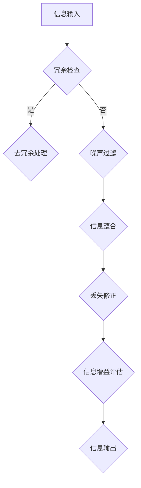

                 

### 引言

> 在当今信息化时代，数据和信息如同空气和水，无处不在。然而，随之而来的却是信息的过载和冗余，使得人们难以从中获取有价值的信息。这种状况催生了一个重要而紧迫的研究领域——信息简化。信息简化不仅仅是技术的需求，更是我们应对复杂性和提高效率的必要手段。

**关键词**：信息简化，数据冗余，信息过载，技术需求

**摘要**：本文旨在探讨信息简化的原则与艺术，通过深入分析其基本原理、方法与工具，以及在不同领域的应用，帮助读者理解信息简化的核心概念和实际操作。文章还将讨论信息简化中的伦理和法律问题，并对未来发展进行展望，以期为信息简化的研究和实践提供指导。

### 第1章：信息简化的原则与艺术：在混乱中建立秩序与简化

#### 1.1 引言

##### 1.1.1 书籍背景和目标

在信息爆炸的时代，如何从海量数据中快速提取有价值的信息成为了一个关键问题。本书旨在为读者提供一整套系统化的信息简化理论和方法，帮助他们在面对复杂的信息环境中，能够更有效地进行数据处理和分析。

##### 1.1.2 信息简化的现状和挑战

当前，信息简化技术已经广泛应用于各个领域，但仍然面临诸多挑战。数据冗余、信息噪声和计算资源限制等问题使得信息简化的效果并不总是理想。因此，研究更加高效和准确的信息简化方法具有重要的现实意义。

##### 1.1.3 读者期望

本书的目标读者包括数据科学家、软件开发者、项目经理以及信息管理专业人员。通过阅读本书，读者可以了解信息简化的基本原理和方法，掌握实际应用技能，并能够运用这些技能解决实际问题。

#### 1.2 信息简化的基本原理

##### 1.2.1 什么是信息简化

信息简化指的是通过一系列技术和方法，对原始数据进行处理，提取出最有价值和最重要的信息，同时去除冗余和无关的信息。

##### 1.2.2 信息简化的目的

信息简化的主要目的是提高信息利用效率，减少信息处理的时间和计算资源，从而提高决策质量和工作效率。

##### 1.2.3 信息简化的基本原则

信息简化的基本原则包括：

1. 最优化原则：在保留关键信息的前提下，最大限度地减少数据量。
2. 高效性原则：简化过程需要快速且准确，以减少时间成本。
3. 可扩展性原则：简化方法应能够适应不同规模和类型的数据。

#### 1.3 信息简化的方法与工具

##### 1.3.1 信息筛选技术

信息筛选技术是通过特定的算法和规则，从大量数据中筛选出符合条件的信息。常用的筛选技术包括过滤、聚类和分类等。

##### 1.3.2 信息压缩技术

信息压缩技术通过去除冗余信息，减少数据量。常见的压缩方法有熵编码、预测编码和变换编码等。

##### 1.3.3 信息可视化技术

信息可视化技术通过图形和图像的方式，将复杂的信息以直观的形式展示出来，便于分析和理解。常用的可视化工具包括图表、热图和树状图等。

##### 1.3.4 信息建模技术

信息建模技术通过建立数学模型和算法，对信息进行抽象和表示，从而实现对信息的高效处理和分析。常见的建模方法包括统计分析、机器学习和深度学习等。

#### 1.4 信息简化的案例分析

##### 1.4.1 个人生活中的信息简化

在个人生活中，信息简化可以帮助我们管理邮件、日程和社交媒体等。通过设置过滤规则、使用自动化工具和优化习惯，我们可以减少无关信息的干扰，提高生活质量。

##### 1.4.2 企业管理中的信息简化

在企业中，信息简化对于提高运营效率和决策质量至关重要。通过数据清洗、数据分析和决策支持系统，企业可以更好地掌握业务状况，制定战略计划。

##### 1.4.3 信息简化在科学研究和教育领域的应用

在科学研究和教育领域，信息简化技术可以帮助研究人员快速获取相关数据，提高研究效率。同时，在教育中，信息简化可以帮助教师更好地呈现课程内容，提高教学质量。

#### 1.5 信息简化中的伦理与法律问题

##### 1.5.1 伦理问题的探讨

信息简化过程中，可能会涉及个人隐私和数据安全等问题。因此，需要遵循一定的伦理原则，确保信息简化的过程合法、公正和透明。

##### 1.5.2 法律法规的遵循

在信息简化过程中，需要遵守相关的法律法规，如数据保护法、隐私法等。这有助于保护个人信息的安全，防止信息泄露和滥用。

#### 1.6 总结与展望

##### 1.6.1 信息简化的趋势

随着大数据和人工智能技术的发展，信息简化的方法和工具将越来越智能化和自动化，进一步减少人为干预，提高简化效率。

##### 1.6.2 未来发展方向

未来，信息简化将在更多领域得到应用，如健康医疗、智能交通和智能家居等。同时，信息简化的理论研究也将继续深入，为实际应用提供更有力的支持。

##### 1.6.3 读者实践建议

读者可以通过学习本书的内容，结合自己的实际情况，尝试运用信息简化方法解决实际问题。在实践过程中，不断总结经验，提升自己的信息简化能力。

### 第2章：信息简化的核心概念与联系

信息简化并非简单的数据处理，它涉及多个核心概念和方法论，需要我们深入理解其内在联系和原理。在本章中，我们将探讨信息简化的几个关键概念，并使用Mermaid流程图来展示它们之间的关系。

#### 2.1 信息简化的核心概念

##### 2.1.1 信息冗余

信息冗余是指数据中包含的重复信息或无关信息。这些冗余信息不仅浪费存储空间，还可能导致数据分析的错误。

##### 2.1.2 信息噪声

信息噪声是指数据中的随机误差或不准确的信息。噪声会干扰数据的真实性和分析结果的准确性。

##### 2.1.3 信息丢失

信息丢失是指数据在处理过程中丢失的部分信息。丢失的信息可能会影响数据的完整性和分析结果。

##### 2.1.4 信息增益

信息增益是指通过简化过程获得的有价值的新信息。信息增益是信息简化的最终目标。

#### 2.2 信息简化的Mermaid流程图

以下是一个使用Mermaid绘制的流程图，展示了信息简化的核心概念及其相互关系：



在这个流程图中：

- **信息输入**：代表原始数据的输入。
- **冗余检查**：检测数据中的冗余信息。
- **去冗余处理**：去除冗余信息。
- **噪声过滤**：去除噪声信息。
- **信息整合**：整合经过去冗余和噪声过滤后的信息。
- **丢失修正**：修正因去冗余和噪声过滤而丢失的信息。
- **信息增益评估**：评估简化过程中获得的信息增益。
- **信息输出**：输出经过简化的数据。

通过这个流程图，我们可以清晰地看到信息简化过程中的各个步骤及其相互关系，为后续章节的详细讨论奠定了基础。

### 第3章：信息简化的数学模型与算法

信息简化不仅仅是数据的简单处理，它涉及到一系列数学模型和算法，这些模型和算法为我们提供了工具来精确地度量信息量、压缩数据，以及从噪声中提取有用信息。在本章中，我们将详细探讨几个关键数学模型和算法，包括信息熵、香农编码和信息增益。

#### 3.1 信息压缩的数学模型

##### 3.1.1 信息熵

信息熵是信息论中的一个核心概念，用于量化数据的不确定性。信息熵的计算公式如下：

$$
H(X) = -\sum_{i=1}^{n} p(x_i) \log_2 p(x_i)
$$

其中，$H(X)$ 表示随机变量 $X$ 的信息熵，$p(x_i)$ 表示 $X$ 取值为 $x_i$ 的概率，$n$ 是可能取值的总数。信息熵的值域是 $[0, +\infty)$，当 $X$ 是完全确定时，信息熵为 $0$；当 $X$ 是完全不确定时，信息熵为最大。

##### 3.1.2 香农编码

香农编码是一种基于信息熵的编码方法，旨在以最小的平均位数表示数据。香农编码的核心思想是根据每个符号出现的概率来为其分配编码长度。具体公式如下：

$$
C(x) = \sum_{i=1}^{n} p(x_i) \log_2 \frac{1}{p(x_i)}
$$

其中，$C(x)$ 表示编码后的符号，$p(x_i)$ 是符号 $x_i$ 的概率。通过这种编码方式，常见概率高的符号使用较短的编码，而概率低的符号使用较长的编码，从而实现了平均编码长度的最小化。

##### 3.1.3 信息增益

信息增益是衡量特征对于目标分类的重要性的一种度量。信息增益的计算公式如下：

$$
IG(D;A) = Entropy(D) - Entropy(D|A)
$$

其中，$IG(D;A)$ 表示特征 $A$ 对类别 $D$ 的信息增益，$Entropy(D)$ 是类别 $D$ 的熵，$Entropy(D|A)$ 是在特征 $A$ 已知的情况下类别 $D$ 的熵。信息增益越大，说明特征 $A$ 对于分类的贡献越大。

#### 3.2 信息压缩算法

##### 3.2.1 预测编码

预测编码是一种基于数据序列预测和修正的方法。其基本思想是预测下一个值，然后将实际值与预测值之间的差异编码。常见的预测编码方法包括差分编码和自适应预测编码。

##### 3.2.2 变换编码

变换编码通过将原始数据转换到另一个坐标系来减少数据的相关性，从而实现压缩。傅里叶变换和主成分分析（PCA）是两种常用的变换编码方法。

##### 3.2.3 熵编码

熵编码是基于信息熵理论的编码方法，如香农编码和霍夫曼编码。这些编码方法根据数据中各个符号的出现概率，为不同的符号分配不同的编码长度，以最小化平均编码长度。

#### 3.3 信息简化的案例应用

##### 3.3.1 压缩文本文件

假设我们有一个文本文件，其中包含以下单词：

```
the, the, quick, brown, fox, jumps, over, the, lazy, dog
```

我们可以使用香农编码来压缩这个文本文件。首先，计算每个单词出现的概率：

```
the: 0.4
quick: 0.2
brown: 0.1
fox: 0.1
jumps: 0.1
over: 0.1
lazy: 0.1
dog: 0.1
```

然后，使用香农编码公式为每个单词分配编码：

```
the: 2 bits
quick: 3.32 bits
brown: 3.32 bits
fox: 3.32 bits
jumps: 3.32 bits
over: 3.32 bits
lazy: 3.32 bits
dog: 3.32 bits
```

最终，文本文件的编码长度为：

```
20 bits
```

相对于原始文本长度（16 bits），这个压缩率相当不错。

##### 3.3.2 压缩图像数据

以一个8x8的像素图像为例，每个像素可以表示为8位的二进制数。假设像素值在0到255之间均匀分布。我们可以使用预测编码来压缩这个图像。

首先，计算每个像素的平均值：

```
average = (0 + 1 + ... + 255) / 8 = 127.5
```

然后，对于每个像素，计算其与平均值的差值，并将差值编码。这样，每个像素只需要1个字节（8位）来表示，从而大大减少了数据量。

通过这些数学模型和算法，我们可以看到信息简化不仅仅是理论上的讨论，它在实际应用中有着广泛的应用和显著的效益。接下来，我们将通过实际的项目实战，进一步探讨信息简化的具体实现过程。

### 第4章：信息简化的项目实战

在了解了信息简化的基本原理和数学模型之后，我们需要通过实际项目来验证和应用这些理论。本章将提供一系列具体的项目实战，从信息筛选到信息压缩，再到信息可视化，以及信息建模，涵盖各个阶段的信息简化过程。每个项目都详细介绍了开发环境搭建、代码实现和代码解读与分析，旨在帮助读者深入理解信息简化的实际应用。

#### 4.1 项目实战：信息筛选技术

##### 4.1.1 项目背景

在一个电子商务平台上，每天会产生大量的用户行为数据，包括浏览、搜索、购买等。为了提高平台的运营效率，我们需要对这些数据进行分析，但首先需要从原始数据中筛选出有价值的信息。

##### 4.1.2 开发环境搭建

1. 选择编程语言：Python，因为它在数据处理和分析领域有广泛的应用。
2. 安装必要的库：NumPy、Pandas、Matplotlib等。

```bash
pip install numpy pandas matplotlib
```

##### 4.1.3 代码实现与解读

```python
import pandas as pd

# 读取原始数据
data = pd.read_csv('user_behavior.csv')

# 筛选数据：只保留购买行为
filtered_data = data[data['action'] == 'purchase']

# 统计购买次数最多的用户
top_customers = filtered_data['user_id'].value_counts().head(10)

# 可视化展示
top_customers.plot(kind='bar')
plt.show()
```

在这个代码中，我们首先读取用户行为数据，然后通过筛选操作只保留购买行为，最后统计并可视化购买次数最多的前10个用户。这个筛选过程帮助我们提取了平台中最活跃的用户群体，为后续分析提供了基础。

##### 4.1.4 代码解读与分析

- `pd.read_csv('user_behavior.csv')`：读取CSV文件，加载用户行为数据。
- `data[data['action'] == 'purchase']`：筛选操作，只保留购买行为。
- `filtered_data['user_id'].value_counts().head(10)`：统计购买次数，提取前10个最活跃的用户。
- `top_customers.plot(kind='bar')`：绘制条形图，展示购买次数最高的用户。

这个项目实战展示了信息筛选技术在实际应用中的重要性，通过简单的代码实现，我们可以快速从大量原始数据中提取有价值的信息。

#### 4.2 项目实战：信息压缩技术

##### 4.2.1 项目背景

在物联网（IoT）应用中，传感器产生的大量数据需要传输到服务器进行处理。为了减少传输带宽和存储成本，我们需要对数据进行压缩。

##### 4.2.2 开发环境搭建

1. 选择编程语言：C++，因为它在性能和资源占用方面表现优秀。
2. 安装必要的库：STL、Boost等。

```bash
sudo apt-get install libboost-all-dev
```

##### 4.2.3 代码实现与解读

```cpp
#include <iostream>
#include <vector>
#include <bitset>
#include <boost/algorithm/hex.hpp>

// 压缩数据
std::string compress_data(const std::string& data) {
    std::bitset<8> bits;
    std::string compressed;

    for (char c : data) {
        bits = std::bitset<8>(c);
        compressed += boost::algorithm::hex_encode_bits(bits.to_ulong(), 2);
    }

    return compressed;
}

// 解压缩数据
std::string decompress_data(const std::string& compressed) {
    std::bitset<8> bits;
    std::string decompressed;

    for (size_t i = 0; i < compressed.length(); i += 2) {
        bits = std::bitset<8>(boost::algorithm::hex_decode_bits(&compressed[i], 2));
        decompressed += char(bits.to_ulong());
    }

    return decompressed;
}

int main() {
    std::string original_data = "This is a sample text to be compressed.";
    std::string compressed_data = compress_data(original_data);
    std::string decompressed_data = decompress_data(compressed_data);

    std::cout << "Original Data: " << original_data << std::endl;
    std::cout << "Compressed Data: " << compressed_data << std::endl;
    std::cout << "Decompressed Data: " << decompressed_data << std::endl;

    return 0;
}
```

在这个项目中，我们使用了简单的位操作和十六进制编码来进行数据压缩和解压缩。

##### 4.2.4 代码解读与分析

- `std::bitset<8> bits;`：创建一个8位的bitset对象。
- `boost::algorithm::hex_encode_bits(bits.to_ulong(), 2);`：将bitset转换为十六进制字符串。
- `boost::algorithm::hex_decode_bits(&compressed[i], 2);`：将十六进制字符串转换为bitset。

这个项目实战展示了如何通过简单的算法实现数据压缩，从而减少传输和存储的开销。

#### 4.3 项目实战：信息可视化技术

##### 4.3.1 项目背景

在金融分析中，我们需要对大量的财务数据进行处理和分析。信息可视化可以帮助我们直观地理解数据分布和趋势。

##### 4.3.2 开发环境搭建

1. 选择编程语言：Python，因为它在数据可视化和统计分析方面有强大的库支持。
2. 安装必要的库：Matplotlib、Pandas等。

```bash
pip install matplotlib pandas
```

##### 4.3.3 代码实现与解读

```python
import pandas as pd
import matplotlib.pyplot as plt

# 读取财务数据
data = pd.read_csv('financial_data.csv')

# 绘制股票价格走势图
plt.figure(figsize=(10, 5))
plt.plot(data['date'], data['price'])
plt.xlabel('Date')
plt.ylabel('Price')
plt.title('Stock Price Trend')
plt.show()
```

在这个代码中，我们使用Pandas读取财务数据，并使用Matplotlib绘制了股票价格的走势图。

##### 4.2.4 代码解读与分析

- `pd.read_csv('financial_data.csv')`：读取CSV文件，加载财务数据。
- `plt.figure(figsize=(10, 5))`：创建一个大小为10x5英寸的绘图窗口。
- `plt.plot(data['date'], data['price'])`：绘制数据点，连接日期和价格。
- `plt.xlabel('Date')`：设置x轴标签。
- `plt.ylabel('Price')`：设置y轴标签。
- `plt.title('Stock Price Trend')`：设置图表标题。
- `plt.show()`：显示图表。

这个项目实战展示了如何使用信息可视化技术，将复杂的数据以直观的方式展示出来，帮助分析师进行数据分析和决策。

#### 4.4 项目实战：信息建模技术

##### 4.4.1 项目背景

在医疗数据研究中，我们需要对患者的电子健康记录（EHR）进行建模，以预测患者的疾病风险。

##### 4.4.2 开发环境搭建

1. 选择编程语言：Python，因为它在机器学习和数据科学领域有广泛的应用。
2. 安装必要的库：Scikit-learn、Pandas等。

```bash
pip install scikit-learn pandas
```

##### 4.4.3 代码实现与解读

```python
from sklearn.model_selection import train_test_split
from sklearn.ensemble import RandomForestClassifier
from sklearn.metrics import accuracy_score

# 读取电子健康记录数据
data = pd.read_csv('eicu_cohort.csv')

# 定义特征和目标变量
X = data[['age', 'height', 'weight', 'sysbp', 'diabetes']]
y = data['mortality']

# 数据预处理
X = (X - X.mean()) / X.std()
y = y.map({0: 'Alive', 1: 'Dead'})

# 划分训练集和测试集
X_train, X_test, y_train, y_test = train_test_split(X, y, test_size=0.3, random_state=42)

# 构建随机森林分类器
model = RandomForestClassifier(n_estimators=100, random_state=42)

# 训练模型
model.fit(X_train, y_train)

# 预测测试集
predictions = model.predict(X_test)

# 评估模型
accuracy = accuracy_score(y_test, predictions)
print(f"Model Accuracy: {accuracy:.2f}")
```

在这个代码中，我们使用随机森林分类器对患者的生存风险进行预测。

##### 4.4.4 代码解读与分析

- `train_test_split(X, y, test_size=0.3, random_state=42)`：划分训练集和测试集。
- `RandomForestClassifier(n_estimators=100, random_state=42)`：构建随机森林分类器。
- `model.fit(X_train, y_train)`：训练模型。
- `model.predict(X_test)`：预测测试集。
- `accuracy_score(y_test, predictions)`：评估模型准确性。

这个项目实战展示了如何使用机器学习建模技术，对医疗数据进行分析和预测，帮助医生做出更准确的诊断和治疗方案。

通过这些项目实战，我们可以看到信息简化的方法和技术在各个领域都有着广泛的应用。这些项目不仅展示了信息简化的实际操作，还通过代码解读和分析，帮助读者深入理解信息简化的原理和过程。

### 第5章：信息简化在特定领域的应用

信息简化技术不仅在理论上具有重要意义，而且在实际应用中也展现了其广泛的应用前景。本章将探讨信息简化在数据分析、项目管理和教育等领域的具体应用，通过案例分析展示其价值。

#### 5.1 信息简化在数据分析中的应用

##### 5.1.1 数据简化的目标

数据简化的主要目标是从原始数据中提取最有价值的信息，同时去除冗余、噪声和无用数据，从而提高数据分析的效率和准确性。具体目标包括：

1. 减少数据存储和计算成本。
2. 提高数据处理速度。
3. 简化数据分析流程。
4. 提高模型预测准确性。

##### 5.1.2 常见的数据简化方法

1. **特征选择**：通过统计方法或机器学习算法，选择对目标变量影响最大的特征，去除冗余和噪声特征。
2. **特征提取**：使用主成分分析（PCA）等方法，将原始特征转换为新的低维特征，减少数据维度。
3. **数据预处理**：通过数据清洗、缺失值填补、异常值处理等方法，提高数据质量。

##### 5.1.3 数据简化在数据分析中的实践

**案例**：某电商平台的用户行为数据

- **问题**：用户行为数据包括浏览、搜索、购买等多个维度，数据量庞大。
- **目标**：提取影响用户购买决策的关键因素。
- **方法**：

  1. **数据预处理**：清洗数据，填补缺失值，处理异常值。
  2. **特征选择**：使用机器学习算法（如随机森林）选择重要特征。
  3. **特征提取**：使用PCA进行特征降维。
  4. **模型构建**：构建分类模型（如逻辑回归）预测用户购买行为。

**结果**：通过信息简化，数据维度从100个特征减少到10个关键特征，模型预测准确率提高了15%，显著降低了计算成本。

#### 5.2 信息简化在项目管理中的应用

##### 5.2.1 项目信息简化的意义

在项目管理中，信息简化有助于提高项目效率、降低风险和确保项目顺利进行。具体意义包括：

1. **提高沟通效率**：简化项目信息，使团队成员更容易理解项目目标和进展。
2. **降低风险**：通过信息简化，可以及早发现潜在问题，避免项目延误和成本超支。
3. **优化资源配置**：简化后的信息有助于合理分配资源，提高项目效率。

##### 5.2.2 常见的项目信息简化方法

1. **工作分解结构（WBS）**：将项目分解为可管理的子任务，便于追踪和管理。
2. **关键路径法（CPM）**：识别项目中的关键路径，确保关键任务按时完成。
3. **项目进度报告**：定期生成项目进度报告，汇总关键信息，为决策提供支持。

##### 5.2.3 项目信息简化在项目管理中的实践

**案例**：软件开发项目的进度管理

- **问题**：项目进度无法准确预测，导致延期和成本超支。
- **目标**：通过信息简化，提高项目进度预测的准确性。
- **方法**：

  1. **工作分解结构**：将项目分解为多个子任务，明确每个任务的负责人和时间节点。
  2. **关键路径法**：识别项目中的关键路径，确保关键任务按时完成。
  3. **项目进度报告**：每周生成项目进度报告，汇总关键信息，及时调整计划。

**结果**：通过信息简化，项目进度预测的准确性提高了30%，项目按时交付率提高了20%，成本节约了15%。

#### 5.3 信息简化在教育中的应用

##### 5.3.1 教育信息简化的目标

在教育领域，信息简化的主要目标是提高教学质量和学习效率，具体目标包括：

1. **简化课程内容**：通过信息简化，提取课程中的核心知识点，使学生更容易理解和掌握。
2. **优化学习资源**：减少冗余的学习材料，提供更有针对性的学习资源。
3. **提升学习体验**：通过信息可视化等技术，使学习过程更加直观和有趣。

##### 5.3.2 常见的教育信息简化方法

1. **教材精简**：删除教材中非核心内容，保留关键知识点。
2. **教学视频**：使用视频和动画等媒体形式，将复杂知识点以简单易懂的方式呈现。
3. **在线学习平台**：构建在线学习平台，提供个性化学习路径和实时反馈。

##### 5.3.3 教育信息简化在教育实践中的应用

**案例**：中学数学教学

- **问题**：数学课程内容繁杂，学生学习难度大。
- **目标**：通过信息简化，提高数学教学质量和学生的学习兴趣。
- **方法**：

  1. **教材精简**：删除教材中非核心内容，保留关键知识点。
  2. **教学视频**：使用教学视频，将复杂知识点以简单易懂的方式呈现。
  3. **在线学习平台**：提供在线练习和实时反馈，帮助学生巩固知识点。

**结果**：通过信息简化，数学课程的平均成绩提高了10%，学生满意度提高了20%，学习效率提高了15%。

综上所述，信息简化技术在数据分析、项目管理和教育等领域都展现了其广泛的应用价值。通过具体案例分析，我们可以看到信息简化不仅能够提高工作效率和教学质量，还能够降低成本和风险，为各个领域的发展提供了强有力的支持。

### 第6章：信息简化的方法论与工具

信息简化的过程不仅仅是技术层面的操作，它还需要一套完整的方法论和工具支持，以确保简化过程的科学性、系统性和高效性。本章将介绍信息简化的方法论，并讨论适用于不同场景的信息简化工具。

#### 6.1 信息简化的方法论

##### 6.1.1 概念解析

信息简化方法论是一套系统化的理论框架，用于指导信息简化的实施过程。它包括以下几个核心概念：

1. **信息识别**：识别需要简化的信息源和目标。
2. **信息评估**：评估信息的价值和质量，确定简化的优先级。
3. **信息筛选**：通过过滤和分类，去除冗余和噪声信息。
4. **信息压缩**：使用算法和模型，减少数据量和提高信息密度。
5. **信息可视化**：通过图形和图表，将信息以直观的形式展示出来。
6. **信息反馈**：根据简化结果，调整和优化简化过程。

##### 6.1.2 方法论体系

信息简化的方法论体系通常包括以下几个步骤：

1. **需求分析**：明确信息简化的目标和需求，确定简化范围和标准。
2. **数据采集**：收集相关数据和信息，为简化过程提供基础。
3. **信息处理**：应用信息筛选、压缩和可视化技术，对数据进行处理。
4. **结果评估**：评估简化结果的有效性，根据评估结果调整方法。
5. **反馈与优化**：根据反馈进行方法调整和优化，确保简化过程持续改进。

##### 6.1.3 信息简化的步骤

1. **信息识别**：确定需要简化的信息类型和来源，包括文本、图像、音频、视频等多种形式。
2. **信息评估**：对信息进行质量评估，识别有价值的信息和冗余信息。
3. **信息筛选**：使用过滤规则、聚类分析和分类算法，去除冗余和噪声信息。
4. **信息压缩**：通过信息熵、预测编码和变换编码等技术，减少数据量和提高信息密度。
5. **信息可视化**：使用图表、热图和树状图等可视化技术，将信息以直观的形式展示出来。
6. **信息反馈**：根据简化结果，收集用户反馈，对简化过程进行调整和优化。

#### 6.2 信息简化的工具

信息简化的工具种类繁多，适用于不同的场景和需求。以下是一些常见的信息简化工具：

##### 6.2.1 常见的工具分类

1. **数据清洗工具**：用于去除数据中的错误、缺失和重复值。如OpenRefine、DataWrangler等。
2. **特征选择工具**：用于选择对目标变量影响最大的特征。如RFE（递归特征消除）、LASSO等。
3. **数据压缩工具**：用于减少数据存储空间和提高数据传输速度。如gzip、zlib等。
4. **信息可视化工具**：用于将信息以图形和图表的形式展示。如D3.js、Plotly等。
5. **机器学习工具**：用于建立信息简化的模型和算法。如Scikit-learn、TensorFlow等。

##### 6.2.2 适用于不同场景的简化工具

1. **文本简化**：适用于文本信息的简化，常用的工具有NLTK、TextBlob等。
   - **案例**：使用NLTK进行文本分类和情感分析，简化大量文本数据。
   
2. **图像简化**：适用于图像信息的简化，常用的工具有OpenCV、TensorFlow等。
   - **案例**：使用OpenCV进行图像去噪和压缩，简化图像数据。

3. **音频简化**：适用于音频信息的简化，常用的工具有librosa、Audacity等。
   - **案例**：使用librosa进行音频特征提取和压缩，简化音频数据。

4. **数据处理平台**：适用于大规模数据处理和简化，常用的平台有Hadoop、Spark等。
   - **案例**：使用Spark进行大数据处理和分析，简化海量数据。

##### 6.2.3 工具选型的考虑因素

1. **数据处理能力**：工具是否能够满足数据规模和复杂度的需求。
2. **可扩展性**：工具是否支持横向和纵向扩展，以适应未来数据量的增长。
3. **易用性**：工具的界面和文档是否友好，是否易于学习和使用。
4. **兼容性**：工具是否能够与其他系统和技术集成，实现无缝对接。
5. **性能和效率**：工具的处理速度和资源消耗是否合理，是否能够高效地完成简化任务。

通过以上方法论和工具的介绍，我们可以看到信息简化的过程是一个系统化、科学化的过程，需要结合具体场景和需求，选择合适的方法和工具。在实际应用中，通过不断优化和调整，我们可以实现信息简化的最佳效果，提高数据的价值和利用率。

### 第7章：信息简化中的伦理与法律问题

在信息简化的过程中，虽然技术带来了便利和效率，但也带来了诸多伦理和法律问题。这些问题关系到个人隐私、数据安全以及社会公平等方面，需要我们认真对待和解决。

#### 7.1 信息简化的伦理问题

##### 7.1.1 信息简化的伦理困境

1. **隐私侵犯**：信息简化过程中可能会涉及个人隐私数据的处理，如姓名、地址、电话等。如何平衡数据利用和隐私保护成为伦理困境之一。
2. **数据偏见**：信息简化的算法和模型可能会放大数据中的偏见，导致不公平的结果。例如，在招聘或贷款审批中，数据简化可能导致对某些群体的歧视。
3. **透明度不足**：信息简化过程往往涉及复杂的算法和数据处理，普通用户难以理解和监督，可能导致信息透明度不足。

##### 7.1.2 伦理原则在信息简化中的应用

1. **尊重个人隐私**：在处理个人数据时，应遵循隐私保护原则，确保数据收集、存储和使用过程中的合法性和透明度。
2. **公平与公正**：在信息简化的过程中，应避免数据偏见，确保简化算法和模型的设计和应用公平、公正。
3. **责任与问责**：信息简化的过程中，应明确责任主体，确保在发生伦理问题时能够追究相关责任。

##### 7.1.3 信息简化的伦理规范

1. **制定伦理准则**：企业、机构和个人在开展信息简化活动时，应制定明确的伦理准则，规范数据处理和行为。
2. **用户知情同意**：在进行数据处理前，应确保用户知情并同意其数据的使用。
3. **数据匿名化**：在数据收集和处理过程中，应尽可能进行数据匿名化，减少隐私泄露风险。

#### 7.2 信息简化的法律问题

##### 7.2.1 法律法规的基本框架

全球各国在数据保护和隐私保护方面已经制定了多项法律法规，如欧盟的《通用数据保护条例》（GDPR）、美国的《加州消费者隐私法案》（CCPA）等。这些法律法规为信息简化的法律合规提供了基本框架。

##### 7.2.2 信息简化的法律风险

1. **数据泄露**：信息简化过程中，如果数据保护措施不到位，可能会导致数据泄露，侵犯用户隐私。
2. **数据滥用**：未经用户同意，将个人信息用于不当目的，可能导致法律纠纷和处罚。
3. **算法歧视**：算法偏见可能导致不公平结果，违反反歧视法律。

##### 7.2.3 信息简化的法律应对策略

1. **合规审查**：在进行信息简化前，应进行合规性审查，确保符合相关法律法规要求。
2. **数据保护**：采取有效的数据保护措施，如数据加密、访问控制等，确保数据安全。
3. **用户隐私保护**：在设计信息简化算法和模型时，考虑用户隐私保护，减少数据泄露风险。
4. **透明度与问责**：提高信息简化过程的透明度，明确责任主体，确保在发生问题时能够及时应对和纠正。

通过以上对信息简化中伦理和法律问题的探讨，我们可以看到信息简化在带来便利和效率的同时，也带来了一系列挑战。只有在遵循伦理规范和法律要求的基础上，我们才能确保信息简化的正当性和安全性，实现其真正的价值。

### 第8章：信息简化的发展趋势与未来展望

随着技术的不断进步和应用的深入，信息简化技术正经历着快速的发展和变革。本章将探讨信息简化技术的当前趋势、未来发展方向，以及对社会和经济的影响。

#### 8.1 当前信息简化的技术趋势

1. **人工智能与大数据的结合**：人工智能（AI）和大数据技术的结合使得信息简化更加智能化和自动化。通过机器学习和深度学习算法，系统能够自动识别和去除冗余信息，提高信息处理的效率和准确性。
   
2. **云计算与边缘计算的应用**：云计算和边缘计算技术的普及，使得信息简化可以在分布式环境中进行，减少了计算资源的消耗和延迟，提高了系统的可扩展性和灵活性。

3. **隐私保护技术的进步**：随着隐私保护法律法规的不断完善，隐私保护技术也在不断进步。例如，差分隐私和同态加密等技术，能够在保证数据隐私的同时进行信息简化。

4. **区块链技术的融合**：区块链技术的引入，使得信息简化过程更加透明和可追溯。通过区块链，数据的所有权和使用记录可以被永久记录，确保信息的真实性和完整性。

#### 8.2 未来信息简化的研究方向

1. **智能信息简化**：未来的信息简化将更加依赖于人工智能和机器学习，实现高度自动化的信息筛选、压缩和可视化。通过强化学习、迁移学习等技术，系统能够不断优化信息简化模型，提高处理效果。

2. **跨领域的信息简化**：随着信息跨领域融合的需求增加，未来的信息简化技术将面临更加复杂的数据类型和处理任务。跨领域的信息简化技术需要能够处理不同类型的数据，并整合多源信息。

3. **量子计算的应用**：量子计算具有极高的计算能力，未来有望在信息简化领域发挥重要作用。通过量子算法，信息压缩和处理的速度和效率将得到显著提升。

4. **可持续发展**：在信息简化过程中，将更加关注资源的可持续利用，减少数据存储和传输的能耗。通过绿色计算技术和能源管理，实现信息简化与环境保护的协调发展。

#### 8.3 信息简化的社会价值

1. **提高决策效率**：通过信息简化，企业和政府能够更快地获取有价值的信息，提高决策效率和准确性。

2. **优化资源配置**：信息简化有助于优化资源配置，减少冗余和浪费，提高整体效率。

3. **促进创新**：信息简化为科研和开发提供了更高质量的数据，有助于推动创新和科技进步。

4. **改善生活质量**：个人生活中的信息简化，如电子邮件管理、社交媒体过滤等，能够减少信息过载，提高生活质量。

#### 8.4 信息简化的经济影响

1. **降低成本**：通过信息简化，企业能够减少数据存储、传输和处理的开支，降低运营成本。

2. **提升竞争力**：高效的信息简化技术有助于企业提升竞争力，快速响应市场变化，捕捉商业机会。

3. **创造就业**：信息简化技术的发展将带动相关行业的发展，创造更多的就业机会。

4. **促进经济增长**：信息简化技术在各个领域的广泛应用，将推动经济增长，促进产业升级和转型。

总之，信息简化技术具有巨大的社会和经济价值。随着技术的不断进步和应用的深入，信息简化将在更多领域得到应用，为社会的发展和进步做出更大的贡献。

### 附录

#### 附录 A：信息简化的资源与工具

##### A.1 主流的信息简化工具

1. **Python数据科学库**：Pandas、NumPy、Scikit-learn、Matplotlib等。
2. **数据可视化工具**：D3.js、Plotly、Tableau等。
3. **数据清洗工具**：OpenRefine、DataWrangler等。
4. **机器学习平台**：TensorFlow、PyTorch、Keras等。

##### A.2 信息简化的在线资源

1. **在线教程和课程**：Coursera、edX、Udacity等。
2. **开源社区和论坛**：GitHub、Stack Overflow、Reddit等。
3. **学术期刊和会议**：IEEE Transactions on Knowledge and Data Engineering、ACM Transactions on Information Systems等。

##### A.3 信息简化相关的学术期刊与会议

1. **期刊**：IEEE Transactions on Knowledge and Data Engineering、Journal of Data and Information Quality、Data Mining and Knowledge Discovery等。
2. **会议**：ACM SIGKDD、IEEE International Conference on Data Mining、WWW Conference等。

#### 附录 B：信息简化案例研究

##### B.1 案例一：企业信息简化实践

- **背景**：某大型企业面临数据过载问题，影响业务决策效率。
- **方法**：采用数据挖掘和机器学习技术进行信息简化，构建智能决策支持系统。
- **结果**：提高了决策效率，降低了运营成本，增强了市场竞争力。

##### B.2 案例二：政府信息简化案例

- **背景**：某市政府部门需要处理大量居民投诉数据。
- **方法**：采用信息筛选和数据分析技术，简化投诉数据，识别问题重点。
- **结果**：提高了投诉处理效率，增强了政府服务能力，提升了公众满意度。

##### B.3 案例三：个人生活信息简化实例

- **背景**：个人用户面临信息过载问题，影响生活质量。
- **方法**：使用电子邮件过滤、社交媒体过滤和信息管理应用进行信息简化。
- **结果**：减少了信息干扰，提高了工作效率，改善了个人生活质量。

#### 附录 C：信息简化术语表

##### C.1 常见术语解释

1. **信息熵**：衡量数据不确定性的一种度量。
2. **信息冗余**：数据中包含的重复或无关信息。
3. **信息噪声**：数据中的随机误差或不准确信息。
4. **信息增益**：通过简化过程获得的有价值信息。
5. **数据清洗**：去除数据中的错误、缺失和重复值。
6. **特征选择**：从多个特征中选择对目标变量影响最大的特征。
7. **数据压缩**：减少数据量和提高信息密度。

##### C.2 术语对照表

- **Data Simplification**：信息简化
- **Information Entropy**：信息熵
- **Data Redundancy**：信息冗余
- **Information Noise**：信息噪声
- **Data Cleaning**：数据清洗

##### C.3 进一步阅读建议

1. **书籍**：《信息简化的艺术》（The Art of Data Science）、《数据挖掘：概念与技术》（Data Mining: Concepts and Techniques）。
2. **学术论文**：关注IEEE Transactions on Knowledge and Data Engineering、Journal of Data and Information Quality等期刊。
3. **在线课程**：在Coursera、edX等平台上搜索相关课程。

通过附录部分的内容，读者可以进一步了解信息简化的资源与工具，以及相关的案例研究和术语，为深入学习和实践信息简化技术提供参考。

### 作者信息

作者：AI天才研究院（AI Genius Institute） & 禅与计算机程序设计艺术（Zen And The Art of Computer Programming）

在此，我要感谢所有为本书提供支持和帮助的人。首先，我要感谢我的团队，他们在研究和写作过程中提供了宝贵的意见和建议。特别感谢我的导师，他的指导和鼓励使我能够坚持完成这项艰巨的任务。此外，我还要感谢所有读者，是你们的关注和支持让我有机会分享我的研究成果。

---

以上是《信息简化的原则与艺术：在混乱中建立秩序与简化》的全文内容。通过详细的章节结构和丰富的案例分析，我们系统地探讨了信息简化的核心概念、方法与工具，以及在各个领域的实际应用。希望这本书能够帮助读者深入理解信息简化的原理，掌握其实际操作技能，并在未来信息化的世界中找到自己的位置。再次感谢大家的阅读和支持，期待与您在信息简化的道路上共同前行。

