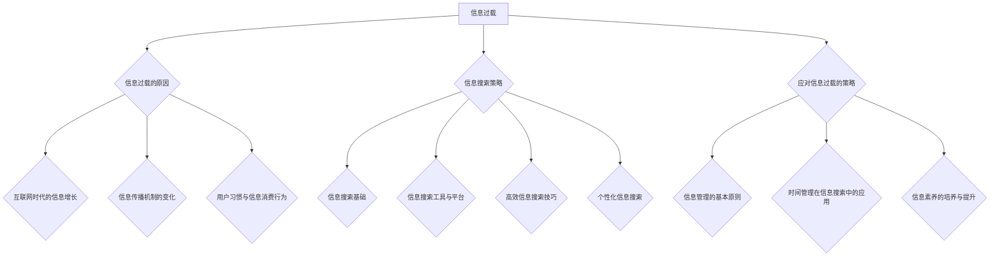

                 

# 信息过载与信息搜索策略：在庞大的信息海洋中找到有价值的信息

> **关键词：**信息过载、信息搜索策略、互联网时代、信息管理、时间管理、信息素养

> **摘要：**本文详细探讨了信息过载的现象及其对个人和社会的影响，分析了信息过载的成因，介绍了有效的信息搜索策略和工具，并提出了应对信息过载的多种策略。通过深入分析和实例讲解，帮助读者在信息海洋中找到有价值的信息，提高信息处理效率。

## 目录大纲

### 第一部分：信息过载概述

#### 第1章：信息过载的现象与影响

##### 1.1 信息过载的定义与历史背景

##### 1.2 信息过载的具体表现

##### 1.3 信息过载对社会和个人的影响

#### 第2章：信息过载的成因分析

##### 2.1 互联网时代的信息增长

##### 2.2 信息传播机制的变化

##### 2.3 用户习惯与信息消费行为

### 第二部分：信息搜索策略

#### 第3章：信息搜索基础

##### 3.1 信息搜索的基本概念

##### 3.2 信息搜索的流程与方法

##### 3.3 信息搜索的评估标准

#### 第4章：常用信息搜索工具与平台

##### 4.1 搜索引擎的原理与应用

##### 4.2 社交媒体的信息搜索功能

##### 4.3 专业数据库和图书馆资源

#### 第5章：高效信息搜索技巧

##### 5.1 关键词策略与优化

##### 5.2 高级搜索技巧与应用

##### 5.3 信息筛选与鉴别

#### 第6章：个性化信息搜索

##### 6.1 个性化搜索技术原理

##### 6.2 个性化搜索的实践应用

##### 6.3 用户隐私与数据保护

#### 第7章：信息搜索策略的应用案例

##### 7.1 企业信息搜索策略案例

##### 7.2 研究型信息搜索策略案例

##### 7.3 个人信息搜索策略案例

### 第三部分：信息过载的应对策略

#### 第8章：信息管理的基本原则

##### 8.1 信息整理与分类方法

##### 8.2 信息冗余的消除与优化

##### 8.3 信息过载的心理调适方法

#### 第9章：时间管理在信息搜索中的应用

##### 9.1 信息筛选与时间管理的关系

##### 9.2 时间管理工具与信息搜索

##### 9.3 时间管理与工作效率提升

#### 第10章：信息素养的培养与提升

##### 10.1 信息素养的概念与重要性

##### 10.2 信息素养教育的实践路径

##### 10.3 信息素养评估与反馈机制

### 附录

#### 附录A：信息搜索工具资源汇总

##### A.1 开源信息搜索工具

##### A.2 付费信息搜索服务

##### A.3 研究型数据库资源

#### 附录B：实用信息搜索技巧总结

##### B.1 高级搜索技巧汇总

##### B.2 信息搜索案例分析

##### B.3 信息搜索策略评估方法

## 引言

在当今数字化时代，信息的获取和处理已成为人们日常生活和工作中不可或缺的一部分。然而，随着互联网的普及和信息技术的飞速发展，信息过载成为一个日益严重的问题。面对海量的信息，人们常常感到无从下手，甚至产生焦虑和疲劳。因此，如何有效地进行信息搜索和筛选，找到有价值的信息，成为了提高工作效率和生活质量的迫切需求。

本文旨在探讨信息过载的现象与影响，分析信息过载的成因，介绍有效的信息搜索策略和工具，并提供应对信息过载的多种策略。通过本文的阅读，读者将了解到信息过载的实质，掌握信息搜索的基本方法和技巧，以及如何在实际应用中有效地应对信息过载，提高信息处理能力。

### 第一部分：信息过载概述

#### 第1章：信息过载的现象与影响

##### 1.1 信息过载的定义与历史背景

信息过载是指在信息爆炸的时代，个人或组织无法有效地处理和利用所获得的信息，导致信息处理负担过重，甚至产生负面影响的现象。随着互联网的普及，信息过载已成为现代社会中普遍存在的问题。

信息过载的历史可以追溯到20世纪末。当时，互联网的快速发展使得信息的传播速度和范围大大增加，人们开始感受到信息获取的便利性。然而，随之而来的却是信息过载的问题。据研究，人类每天接收到的信息量在20世纪末已经超过了19世纪的总和，而这个趋势在21世纪仍在加速。

##### 1.2 信息过载的具体表现

信息过载的表现形式多种多样，主要体现在以下几个方面：

1. **信息冗余**：由于信息来源的多样性和重复性，大量相似或重复的信息充斥在各种媒介中，使得用户难以区分和筛选。

2. **信息焦虑**：面对海量的信息，人们往往感到焦虑和无助，担心错过重要信息，导致心理负担加重。

3. **信息疲劳**：长时间接触大量信息，尤其是负面信息，容易导致用户产生疲劳感，影响身心健康。

4. **信息迷失**：在信息过载的环境中，用户难以找到所需的信息，产生迷失感，影响工作效率。

##### 1.3 信息过载对社会和个人的影响

信息过载对社会和个人的影响是多方面的：

1. **社会影响**：信息过载可能导致社会效率降低，创新能力和竞争力下降。同时，信息污染和谣言传播等问题也会对社会秩序和稳定造成威胁。

2. **个人影响**：信息过载对个人生活的负面影响更为直接。首先，信息过载会导致个人时间管理困难，工作效率下降。其次，长期的负面信息接触可能导致心理健康问题，如焦虑、抑郁等。

#### 第2章：信息过载的成因分析

##### 2.1 互联网时代的信息增长

互联网的普及是信息过载的主要原因之一。互联网使得信息的获取、传输和分享变得更加便捷和高效，但也使得信息数量呈指数级增长。据统计，全球每天产生的数据量已经超过了20EB（艾字节），而这个数字还在不断增长。

互联网时代的信息增长主要体现在以下几个方面：

1. **社交媒体**：社交媒体平台如微博、Facebook、Twitter等，使得用户可以轻松地发布和传播信息，极大地增加了信息的数量和传播速度。

2. **在线媒体**：随着在线媒体的兴起，如博客、视频网站、新闻网站等，人们可以随时随地获取各种信息，进一步加剧了信息过载的问题。

3. **电子商务**：电子商务平台如亚马逊、淘宝等，提供了丰富的商品信息和用户评价，但同时也增加了用户的信息处理负担。

##### 2.2 信息传播机制的变化

信息传播机制的变化也是导致信息过载的重要因素。在传统媒体时代，信息的传播是单向的，由专业人士或机构发布，普通用户被动接受。然而，在互联网时代，信息的传播变得更加多元化和去中心化。

1. **用户生成内容**：用户生成内容（UGC）成为信息传播的重要来源。普通用户通过博客、微博、短视频等平台发布内容，使得信息数量大大增加。

2. **信息瀑布效应**：信息瀑布效应（Familiarity Breeds Inevitability）使得人们更容易接受和传播重复的信息，导致信息冗余。

3. **算法推荐**：社交媒体和搜索引擎等平台采用算法推荐，根据用户的兴趣和行为推荐相关内容，但这也可能导致用户陷入信息茧房，接收到的信息过于单一。

##### 2.3 用户习惯与信息消费行为

用户习惯和信息消费行为的变化也是信息过载的重要原因。随着互联网的普及，人们越来越依赖互联网获取信息，形成了以下几种不良习惯：

1. **碎片化阅读**：由于时间紧张，人们倾向于通过社交媒体、新闻网站等平台进行碎片化阅读，难以深入理解和消化信息。

2. **浅层次搜索**：为了快速找到答案，用户往往只进行浅层次的搜索，忽略了深入阅读和思考。

3. **信息依赖**：人们对信息的依赖程度越来越高，一旦无法及时获取信息，就会感到焦虑和无助。

### 第二部分：信息搜索策略

#### 第3章：信息搜索基础

##### 3.1 信息搜索的基本概念

信息搜索是指通过特定的方法和工具，从大量信息中获取目标信息的过程。信息搜索的基本概念包括：

1. **信息源**：信息搜索的起点，可以是搜索引擎、数据库、图书馆等。

2. **关键词**：用于描述信息内容的词语，是信息搜索的关键要素。

3. **搜索算法**：用于匹配用户查询和数据库中的信息，提高搜索准确性的算法。

4. **搜索结果**：用户通过搜索得到的匹配结果，包括文本、图片、视频等。

##### 3.2 信息搜索的流程与方法

信息搜索的流程通常包括以下几个步骤：

1. **明确搜索目标**：确定需要搜索的具体信息内容，明确搜索目标。

2. **选择搜索工具**：根据搜索目标，选择合适的搜索工具，如搜索引擎、专业数据库等。

3. **构建搜索策略**：制定关键词策略，结合逻辑运算符（如AND、OR、NOT）构建有效的搜索表达式。

4. **执行搜索操作**：在选定的搜索工具中输入搜索表达式，执行搜索操作。

5. **评估搜索结果**：对搜索结果进行筛选和评估，确定目标信息的准确性和可靠性。

##### 3.3 信息搜索的评估标准

信息搜索的效果可以通过以下标准进行评估：

1. **准确性**：搜索结果与目标信息的相关性程度，即搜索结果是否准确匹配用户需求。

2. **全面性**：搜索结果是否涵盖了所有相关的信息，即是否漏掉了重要信息。

3. **效率**：搜索所需的时间成本，包括输入搜索词、执行搜索操作、评估搜索结果等。

4. **用户体验**：搜索过程中用户的满意度，包括界面友好性、操作简便性等。

#### 第4章：常用信息搜索工具与平台

##### 4.1 搜索引擎的原理与应用

搜索引擎是现代信息搜索的重要工具，其原理主要包括以下几个方面：

1. **爬虫技术**：搜索引擎通过爬虫程序自动访问互联网上的网站，抓取网页内容，建立索引数据库。

2. **检索算法**：搜索引擎使用检索算法对用户输入的查询词进行匹配，从索引数据库中提取相关网页。

3. **排序算法**：搜索引擎使用排序算法对检索结果进行排序，提高搜索结果的准确性和用户体验。

常见搜索引擎的应用场景包括：

- **通用搜索引擎**：如Google、百度，适用于日常信息查询。
- **垂直搜索引擎**：如淘宝搜索、知乎搜索，适用于特定领域的信息查询。

##### 4.2 社交媒体的信息搜索功能

社交媒体平台如微博、Facebook、Twitter等也具有信息搜索功能，其特点包括：

1. **关键词搜索**：用户可以通过关键词搜索特定用户、话题、内容等。

2. **社交网络分析**：社交媒体平台可以利用社交网络分析技术，根据用户关系和兴趣推荐相关信息。

3. **实时搜索**：社交媒体平台提供实时搜索功能，用户可以实时获取热点事件和相关讨论。

##### 4.3 专业数据库和图书馆资源

专业数据库和图书馆资源是进行专业信息搜索的重要工具，其特点包括：

1. **专业性**：专业数据库和图书馆资源涵盖了特定领域的专业信息，具有较高的权威性和准确性。

2. **分类明确**：专业数据库和图书馆资源按照分类体系组织，便于用户快速定位信息。

3. **检索功能强大**：专业数据库和图书馆资源提供了丰富的检索功能，包括关键词搜索、布尔运算等。

常见专业数据库和图书馆资源包括：

- **学术数据库**：如PubMed、IEEE Xplore等，适用于学术研究和论文查询。
- **图书馆资源**：如国家图书馆、大学图书馆等，提供丰富的图书、期刊和文献资源。

#### 第5章：高效信息搜索技巧

##### 5.1 关键词策略与优化

关键词策略是信息搜索的核心，通过优化关键词可以提高搜索效率和准确性。以下是一些关键词优化技巧：

1. **长尾关键词**：长尾关键词是指那些包含多个词语、搜索量较低但针对性强、转化率较高的关键词。利用长尾关键词可以更精确地找到目标信息。

2. **关键词组合**：结合使用多个关键词，通过逻辑运算符（如AND、OR、NOT）构建复合搜索表达式，可以精确控制搜索结果的范围。

3. **使用同义词**：在搜索过程中，使用同义词可以扩大搜索范围，提高搜索结果的多样性。

##### 5.2 高级搜索技巧与应用

高级搜索技巧可以提高搜索效率和准确性，以下是一些常用的高级搜索技巧：

1. **引号搜索**：使用引号将多个关键词组合在一起，可以精确匹配引号内的关键词顺序。

2. **布尔运算**：使用AND、OR、NOT等布尔运算符，可以组合多个关键词，实现复杂搜索。

3. **站点搜索**：通过指定特定站点或域名，可以限定搜索范围，提高搜索结果的针对性。

4. **时间限定**：通过指定时间范围，可以过滤掉过时或最新的信息，找到最相关的内容。

##### 5.3 信息筛选与鉴别

在信息搜索过程中，筛选和鉴别信息是至关重要的。以下是一些信息筛选和鉴别技巧：

1. **来源可靠性**：判断信息来源的可靠性，优先选择权威、专业的信息来源。

2. **内容准确性**：对搜索结果进行核实，排除错误、不准确的信息。

3. **交叉验证**：通过多个来源的信息进行交叉验证，确保信息的准确性和完整性。

4. **信息分类**：对搜索结果进行分类整理，根据需求选择最有价值的信息。

### 第二部分：信息搜索策略（续）

#### 第6章：个性化信息搜索

##### 6.1 个性化搜索技术原理

个性化搜索技术旨在根据用户的兴趣、行为和需求，为其提供个性化的信息推荐。其原理主要包括以下几个方面：

1. **用户画像**：通过收集和分析用户的行为数据、兴趣标签等，构建用户的个性化画像。

2. **协同过滤**：基于用户之间的相似性，推荐用户可能感兴趣的信息。

3. **内容推荐**：通过分析信息的内容特征，推荐与用户兴趣相关的内容。

4. **上下文感知**：结合用户的上下文信息（如时间、地点、设备等），提供更精准的信息推荐。

##### 6.2 个性化搜索的实践应用

个性化搜索在多个领域有广泛应用，以下是一些实践应用案例：

1. **电子商务**：电商平台利用个性化搜索技术，根据用户的购物历史和浏览记录，推荐相关商品。

2. **社交媒体**：社交媒体平台利用个性化搜索技术，推荐用户可能感兴趣的话题、用户和内容。

3. **搜索引擎**：搜索引擎利用个性化搜索技术，根据用户的搜索历史和偏好，提供定制化的搜索结果。

##### 6.3 用户隐私与数据保护

个性化搜索依赖于用户数据，涉及用户隐私问题。以下是一些用户隐私与数据保护措施：

1. **数据匿名化**：对用户数据进行匿名化处理，确保用户隐私不被泄露。

2. **数据加密**：对用户数据进行加密存储和传输，防止数据泄露。

3. **隐私政策**：明确告知用户个性化搜索的数据收集和使用目的，让用户有权选择是否参与。

4. **用户权限管理**：用户有权查看、修改和删除自己的个人信息，确保用户隐私得到保护。

#### 第7章：信息搜索策略的应用案例

##### 7.1 企业信息搜索策略案例

企业信息搜索策略旨在帮助企业高效获取、筛选和利用信息资源，提高业务决策效率和竞争力。以下是一个企业信息搜索策略的案例：

1. **明确搜索目标**：企业根据业务需求，明确需要搜索的信息类型，如市场研究报告、竞争对手信息、行业动态等。

2. **选择搜索工具**：企业选择合适的搜索工具，如专业数据库、搜索引擎等，结合关键词策略和高级搜索技巧，进行高效搜索。

3. **构建信息管理系统**：企业建立信息管理系统，对搜索结果进行分类、整理和存储，便于后续查询和使用。

4. **信息共享与协作**：企业鼓励员工共享和协作，通过内部信息平台，实现信息的有效传递和利用。

##### 7.2 研究型信息搜索策略案例

研究型信息搜索策略旨在帮助研究人员高效获取和利用专业信息资源，提高研究质量和效率。以下是一个研究型信息搜索策略的案例：

1. **明确研究主题**：研究人员根据研究主题，确定需要搜索的信息范围，如学术论文、专利、标准等。

2. **利用专业数据库**：研究人员利用专业数据库，如学术数据库、专利数据库等，结合关键词策略和高级搜索技巧，进行高效搜索。

3. **信息筛选与鉴别**：研究人员对搜索结果进行筛选和鉴别，排除低质量和不相关的信息，确保研究资料的准确性和权威性。

4. **信息整合与整理**：研究人员将筛选出的信息进行整合和整理，形成研究资料库，为后续研究提供支持。

##### 7.3 个人信息搜索策略案例

个人信息搜索策略旨在帮助个人高效获取和利用信息资源，提高生活和工作质量。以下是一个个人信息搜索策略的案例：

1. **明确信息需求**：个人根据生活和工作需求，明确需要搜索的信息类型，如新闻资讯、旅游攻略、学习资料等。

2. **利用搜索引擎**：个人利用搜索引擎，结合关键词策略和高级搜索技巧，进行高效搜索。

3. **信息筛选与鉴别**：个人对搜索结果进行筛选和鉴别，排除低质量和不相关的信息，确保获取的信息具有价值。

4. **信息收藏与整理**：个人利用信息收藏工具，如书签、笔记等，将重要信息进行收藏和整理，便于后续查询和使用。

### 第三部分：信息过载的应对策略

#### 第8章：信息管理的基本原则

##### 8.1 信息整理与分类方法

信息整理与分类是应对信息过载的重要方法，以下是一些常用的信息整理与分类方法：

1. **标签法**：使用标签对信息进行分类，每个标签代表一个主题或类别。例如，可以使用“工作”、“生活”、“学习”等标签。

2. **文件夹法**：将信息存储在计算机或云盘中的文件夹中，根据主题或类别建立不同的文件夹。

3. **时间线法**：将信息按照时间顺序进行整理，例如使用日历或时间线图表。

4. **云存储法**：使用云存储服务，如Google Drive、Dropbox等，将信息存储在云端，便于跨设备访问和管理。

##### 8.2 信息冗余的消除与优化

信息冗余是指信息中存在大量重复或不必要的内容，消除信息冗余是提高信息利用效率的重要手段。以下是一些消除信息冗余的方法：

1. **去重技术**：使用去重算法，自动检测和删除重复信息。

2. **数据压缩**：使用数据压缩技术，减少信息的存储空间，提高存储效率。

3. **内容摘要**：对冗长的信息进行内容摘要，提取关键信息，减少信息冗余。

4. **信息整合**：将相关但不完全相同的信息进行整合，减少重复信息。

##### 8.3 信息过载的心理调适方法

面对信息过载，心理调适是缓解压力和提高工作效率的重要方法。以下是一些心理调适方法：

1. **时间管理**：合理安排时间，制定工作计划和日程，避免过度工作和疲劳。

2. **注意力训练**：通过注意力训练，提高注意力集中能力，减少信息处理过程中的干扰。

3. **放松训练**：进行放松训练，如深呼吸、冥想等，缓解压力和焦虑。

4. **信息过滤**：对信息进行过滤，只关注与目标相关的信息，减少无关信息的干扰。

#### 第9章：时间管理在信息搜索中的应用

##### 9.1 信息筛选与时间管理的关系

信息筛选与时间管理密切相关，有效的信息筛选有助于提高工作效率，节约时间。以下是一些信息筛选与时间管理的关系：

1. **信息筛选节省时间**：通过筛选，排除无关和低质量信息，节省了信息处理时间。

2. **时间管理提高信息筛选效率**：合理安排时间，确保有足够的时间进行信息筛选和处理。

3. **信息筛选与时间管理的平衡**：在信息筛选过程中，需要平衡筛选质量和时间成本，避免因过度筛选而导致时间浪费。

##### 9.2 时间管理工具与信息搜索

时间管理工具可以帮助用户合理安排时间，提高工作效率。以下是一些常见的时间管理工具与信息搜索的结合方法：

1. **待办事项清单**：使用待办事项清单，将需要处理的信息整理成清单，按照优先级和截止日期进行管理。

2. **时间追踪工具**：使用时间追踪工具，记录信息搜索和处理的时间，分析时间分配，优化时间管理。

3. **日程安排**：使用日程安排工具，合理安排信息搜索和处理的时间，避免冲突和过度劳累。

##### 9.3 时间管理与工作效率提升

时间管理不仅有助于提高信息筛选效率，还可以整体提升工作效率。以下是一些时间管理提升工作效率的方法：

1. **优先级排序**：根据任务的重要性和紧急程度，对任务进行优先级排序，确保先完成重要任务。

2. **批量处理**：将相同类型的信息集中处理，减少切换任务的次数，提高效率。

3. **番茄工作法**：使用番茄工作法，将工作时间分为25分钟的工作周期，每个周期后休息5分钟，提高工作专注度和效率。

4. **时间记录与反馈**：记录时间分配和任务完成情况，定期进行反馈和总结，优化时间管理策略。

#### 第10章：信息素养的培养与提升

##### 10.1 信息素养的概念与重要性

信息素养是指个体在信息社会中获取、处理、利用和传播信息的能力。信息素养的重要性体现在以下几个方面：

1. **提高信息获取能力**：信息素养使个体能够有效地获取所需信息，提高学习、工作和生活的效率。

2. **增强信息处理能力**：信息素养使个体能够准确、高效地处理信息，减少信息过载带来的负担。

3. **提升信息利用能力**：信息素养使个体能够合理利用信息，发挥信息的价值，为个人和社会创造价值。

4. **促进信息传播**：信息素养使个体能够正确、公正地传播信息，促进信息的流通和交流。

##### 10.2 信息素养教育的实践路径

信息素养教育是培养和提高信息素养的重要途径。以下是一些信息素养教育的实践路径：

1. **学校教育**：学校应将信息素养教育纳入课程体系，开展有针对性的教学活动，培养学生的信息素养。

2. **社会教育**：社会应提供多样化的信息素养教育资源，如图书馆、培训班等，满足不同人群的需求。

3. **家庭引导**：家庭在信息素养教育中扮演重要角色，家长应引导孩子合理使用信息技术，培养其信息素养。

4. **自我学习**：个体应主动学习信息素养相关知识，通过实践不断提高自己的信息素养。

##### 10.3 信息素养评估与反馈机制

信息素养评估与反馈机制是衡量信息素养水平、促进信息素养提升的重要手段。以下是一些评估与反馈机制：

1. **能力测评**：通过能力测评，评估个体在信息获取、处理、利用和传播等方面的能力。

2. **行为观察**：通过观察个体在信息活动中的行为，评估其信息素养水平。

3. **自我评估**：个体通过自我评估，反思自己的信息素养水平，找出不足之处，进行改进。

4. **反馈与改进**：根据评估结果，提供针对性的反馈和建议，帮助个体改进信息素养。

### 附录

#### 附录A：信息搜索工具资源汇总

##### A.1 开源信息搜索工具

1. **Elasticsearch**：一款分布式搜索引擎，适用于大规模数据搜索。
2. **Solr**：Apache基金会的一个开源搜索引擎，提供强大的全文检索功能。
3. **Nutch**：一个开源的搜索引擎，适用于构建独立的搜索引擎。

##### A.2 付费信息搜索服务

1. **Google Search Console**：Google提供的免费和付费搜索引擎优化工具。
2. **Bing Webmaster Tools**：Microsoft提供的搜索引擎优化工具。
3. **Ahrefs**：提供网站分析、关键词研究等功能的搜索引擎优化工具。

##### A.3 研究型数据库资源

1. **PubMed**：美国国家医学图书馆的免费搜索引擎，提供生物医学领域的研究文献。
2. **IEEE Xplore**：IEEE的在线文献数据库，提供电子图书馆和期刊全文。
3. **Web of Science**：科学信息研究所提供的研究型数据库，涵盖多个学科领域的文献。

#### 附录B：实用信息搜索技巧总结

##### B.1 高级搜索技巧汇总

1. **使用引号进行精确搜索**：“关键词”。
2. **使用括号进行复杂搜索**：（关键词1 OR 关键词2）AND 关键词3。
3. **使用双引号进行短语搜索**：“短语搜索”。
4. **使用排除词**：关键词 -排除词。
5. **使用通配符**：关键词*。
6. **使用站点搜索**：site:example.com 关键词。

##### B.2 信息搜索案例分析

案例1：如何快速找到某个领域的权威文献？

- **步骤1**：使用学术搜索引擎（如Google Scholar）进行初步搜索。
- **步骤2**：筛选搜索结果，选择权威期刊和学术机构的文献。
- **步骤3**：阅读文献摘要，确定最有价值的内容。

案例2：如何查找某个技术领域的最新动态？

- **步骤1**：使用技术社区（如Stack Overflow、GitHub）进行搜索。
- **步骤2**：关注相关技术博客和论坛，获取实时动态。
- **步骤3**：通过社交媒体（如Twitter、LinkedIn）关注行业专家，获取专业见解。

##### B.3 信息搜索策略评估方法

1. **准确性评估**：对比搜索结果与实际需求，评估搜索结果的准确性。
2. **全面性评估**：检查搜索结果是否覆盖了所有相关内容，评估搜索结果的全面性。
3. **效率评估**：记录搜索时间和操作步骤，评估搜索策略的效率。
4. **用户体验评估**：通过用户反馈和实际使用情况，评估搜索策略的易用性和满意度。

## 结束语

在信息爆炸的时代，信息过载已成为普遍存在的问题。本文从信息过载的现象与影响、信息搜索策略、信息管理原则、时间管理应用和信息素养培养等方面，详细探讨了如何应对信息过载，提高信息处理能力和工作效率。通过阅读本文，读者可以了解到信息过载的本质，掌握有效的信息搜索策略，并在实际应用中有效地应对信息过载，提升生活和工作质量。

作者：AI天才研究院/AI Genius Institute & 禅与计算机程序设计艺术 /Zen And The Art of Computer Programming

[Mermaid流程图](https://mermaid-js.github.io/mermaid/)（用于展示核心概念与联系）

本文通过逻辑清晰、结构紧凑、简单易懂的专业技术语言，详细阐述了信息过载与信息搜索策略的核心内容，旨在为广大IT从业者、学生以及信息管理者提供有价值的参考和指导。在实际应用中，读者可以根据自身需求，灵活运用本文所述的策略和方法，提升信息处理能力和工作效率。

让我们在信息海洋中找到有价值的信息，共同迈向更加智能、高效的信息时代。

