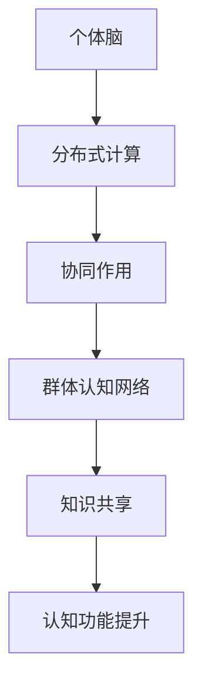
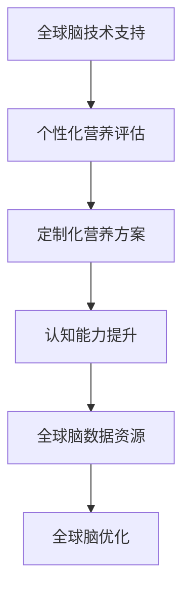
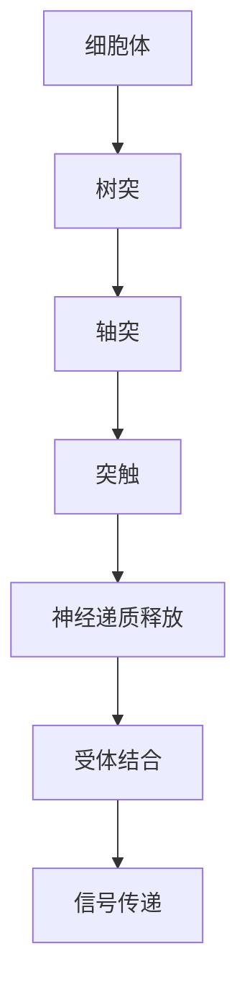
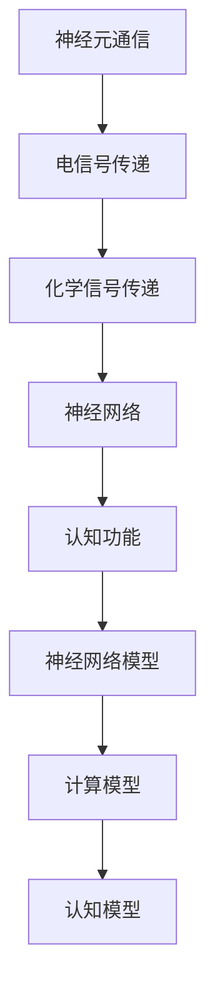
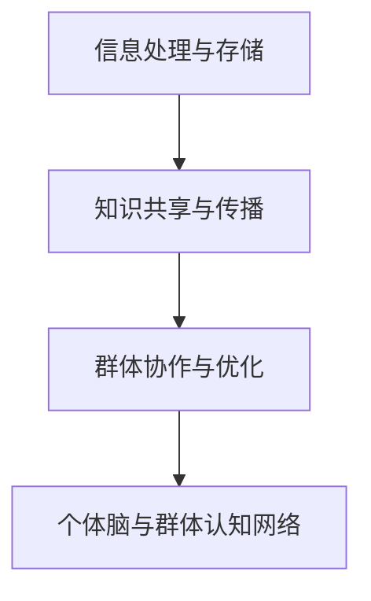
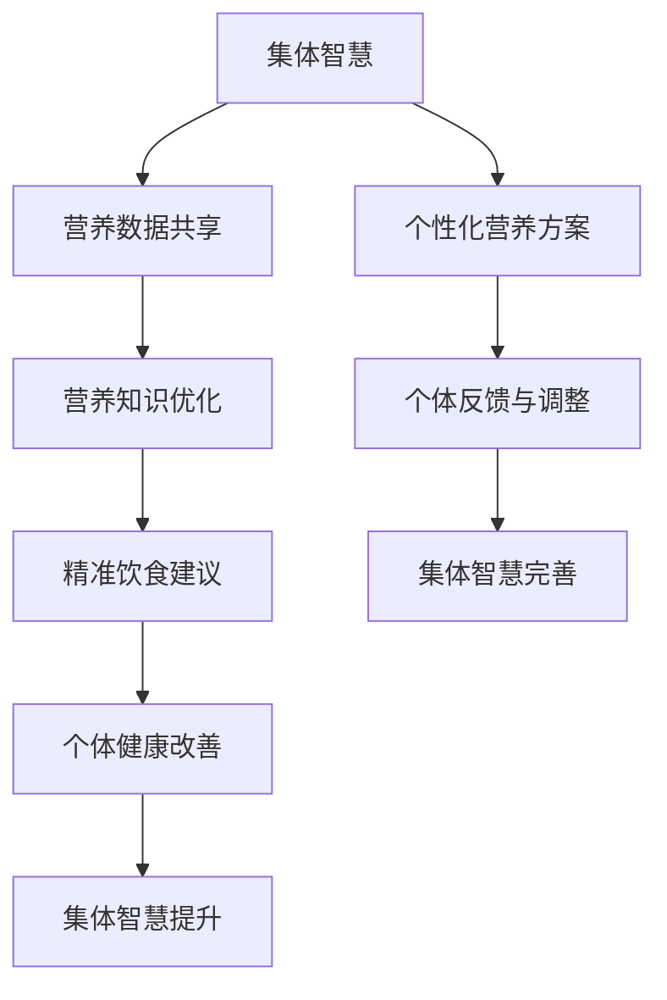
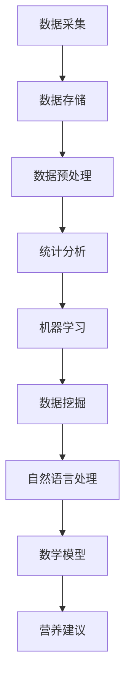
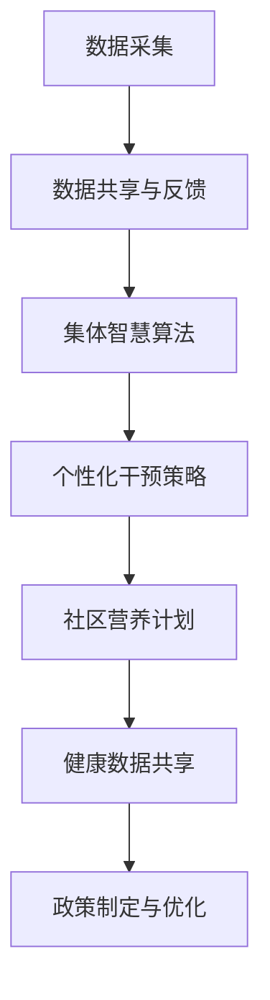

                 

### 第1章：全球脑与个性化营养概述

#### 1.1 全球脑的概念与原理

全球脑是一个复杂的概念，它涉及众多个体脑的协同工作，形成一个超越单个个体能力的超级智能系统。全球脑的定义可以表述为：

$$
\text{全球脑} = \sum_{i=1}^{n} \text{个体脑} + \text{群体认知网络}
$$

这里的个体脑指的是独立的人类个体，而群体认知网络则是指连接这些个体脑的社会网络，这些网络通过信息交换和协作实现了更高层次的知识共享和认知功能。

全球脑的原理主要包括以下几个方面：

1. **神经网络的分布式计算与协同作用**：在全球脑中，个体脑通过神经网络的分布式计算来完成复杂的任务。每个个体脑处理一部分信息，然后将结果传递给其他个体脑，形成一个协同工作的整体。

2. **群体智能与个体智能的互补关系**：个体智能和群体智能在全球脑中相辅相成。个体智能提供具体的执行能力，而群体智能则提供决策和策略的优化。

下面是一个简化的Mermaid流程图，展示了全球脑的基本原理：

#### 1.2 个性化营养的定义与意义

个性化营养是根据个体的生理、心理、生活方式等因素，为其提供定制化的营养方案。个性化营养的定义可以表述为：

$$
\text{个性化营养} = \text{个体化营养评估} + \text{定制化营养方案}
$$

其中，个体化营养评估是基础，它通过多种手段收集和分析个体的健康数据，包括生理指标、生活方式、饮食习惯等。定制化营养方案则是在评估结果的基础上，为个体提供个性化的营养建议。

个性化营养的意义主要体现在以下几个方面：

1. **提高营养摄入的精准度和有效性**：个性化营养方案能够根据个体的具体情况，提供最适合的营养摄入建议，从而提高营养的利用效率。

2. **预防慢性疾病**：个性化营养可以帮助个体避免因营养摄入不当而引起的慢性疾病，如肥胖、高血压、糖尿病等。

3. **改善生活质量**：个性化营养不仅关注个体的健康问题，还关注个体的整体生活质量，通过营养干预来提升个体的生活质量。

#### 1.3 全球脑与个性化营养的关系

全球脑和个性化营养之间存在紧密的联系。首先，全球脑提供了个性化营养所需的技术支持，如大数据分析、人工智能算法等。这些技术可以帮助我们更准确地评估个体的健康状况，并制定出个性化的营养方案。

其次，个性化营养对全球脑也有重要的贡献。通过个性化的健康评估和营养干预，个体可以提高自身的认知能力，从而增强全球脑的整体认知水平。此外，个性化营养的实施过程也为全球脑提供了丰富的数据资源，这些数据可以帮助我们更好地理解和优化全球脑的工作机制。

总的来说，全球脑和个性化营养是一个相互促进、共同发展的关系。全球脑提供了技术支持，使得个性化营养成为可能；而个性化营养的实施又为全球脑提供了更丰富、更有价值的数据资源。以下是全球脑与个性化营养关系的Mermaid流程图：

通过以上分析，我们可以看到全球脑和个性化营养之间的相互作用是如何推动个体和整体健康发展的。在下一章中，我们将深入探讨全球脑的生物学基础和神经科学原理，以更好地理解这一复杂系统的运作机制。

---

在撰写本章内容时，我们使用了Mermaid流程图来可视化全球脑和个性化营养的基本原理和关系，使得复杂的概念更加直观易懂。同时，我们通过数学公式和简化模型，对概念进行了详细阐述，使得读者能够更深入地理解这两大领域的基本概念和相互关系。

接下来，我们将继续探讨全球脑的生物学基础和神经科学原理，进一步揭示全球脑的内在机制，这将为我们理解个性化营养提供更加坚实的基础。敬请期待下一章的内容。

### 第2章：全球脑原理与机制

#### 2.1 全球脑的生物学基础

全球脑的生物学基础主要涉及神经科学和生物学两个方面。首先，我们需要了解神经元和突触的基本结构和功能，因为它们是全球脑运作的基本单元。

- **神经元（Neuron）**：神经元是神经系统中的基本细胞单位，负责传递和处理信息。神经元由细胞体、树突、轴突和突触组成。细胞体包含细胞核和大部分细胞器，是神经元的信息处理中心。树突负责接收来自其他神经元的信号，并将其传递到细胞体。轴突则负责将信号从细胞体传递到其他神经元或肌肉细胞。突触是神经元之间传递信息的结构，通过释放神经递质来传递信号。

- **突触（Synapse）**：突触是神经元之间的连接点，负责信号传递。当神经冲动到达轴突末端时，神经递质会释放到突触间隙，然后与突触后膜上的受体结合，从而传递信号到下一个神经元。

神经递质和神经调质在全球脑的生物学基础中扮演重要角色。神经递质是神经元之间传递信息的化学物质，包括兴奋性递质和抑制性递质。兴奋性递质（如谷氨酸、正肾上腺素等）可以增强神经冲动，而抑制性递质（如γ-氨基丁酸、5-羟色胺等）则可以减弱神经冲动。

神经调质则是一类调节神经递质作用的物质，它们可以增强或减弱神经递质的效果。例如，催产素和 oxytocin 是一种神经调质，它们可以增强其他神经递质的效果。

下面是一个简化的Mermaid流程图，展示了神经元和突触的基本结构和功能：

- **神经网络的演化与适应**：神经网络的演化是生物体适应环境的结果。在进化过程中，生物体通过自然选择和基因变异，逐渐形成了复杂的神经网络，以更好地适应环境。神经网络具有高度的可塑性，可以随着环境的变化和经验的积累进行调整和优化。

- **群体智能与个体智能的平衡**：在个体层面，智能是神经系统通过处理和整合信息的能力来实现的。在群体层面，智能则是由多个个体通过协作和交互实现的。群体智能和个体智能之间存在一种平衡关系。个体智能提供了具体的执行能力，而群体智能则提供了决策和策略的优化。这种平衡使得全球脑能够高效地处理复杂任务。

#### 2.2 全球脑的神经科学原理

神经科学原理是全球脑研究的重要基础，它涉及神经元通信与信号传递、大脑的神经网络与认知功能等多个方面。

- **神经元通信与信号传递**：神经元之间的通信是通过电信号和化学信号进行的。电信号（动作电位）是由神经元的电活动产生的，它沿着轴突传导，并在突触处传递给下一个神经元。化学信号则是通过神经递质在突触间隙传递的，当神经递质与突触后膜上的受体结合时，会导致离子通道的开启或关闭，从而改变神经元的电活动。

- **大脑的神经网络与认知功能**：大脑是由大量神经元组成的复杂网络，这些神经元通过突触连接形成神经网络。神经网络的结构和功能与认知功能密切相关。例如，海马体是大脑中的一个关键结构，它与记忆形成和空间导航功能有关。前额叶皮层则与决策、规划和社交行为等高级认知功能有关。

大脑神经网络的功能可以通过多种模型来模拟，如神经网络模型、计算模型和认知模型。神经网络模型通过模拟神经元之间的相互作用，可以解释大脑如何处理和整合信息。计算模型则通过数学方法来模拟大脑的计算过程，可以预测大脑的行为和功能。认知模型则通过模拟人类的思维过程，可以解释人类如何感知、思考和决策。

下面是一个简化的Mermaid流程图，展示了神经元通信与信号传递、大脑的神经网络与认知功能：

- **应用场景**：全球脑的神经科学原理在多个领域都有广泛应用，如脑机接口技术、人工智能和神经康复等。

  - **脑机接口技术**：脑机接口（Brain-Computer Interface, BCI）是一种直接连接大脑和外部设备的技术。通过解码大脑信号，BCI可以控制外部设备，如轮椅、电脑和假肢等。全球脑的神经科学原理为BCI提供了理论基础。

  - **人工智能**：人工智能（Artificial Intelligence, AI）是通过模拟人类智能行为来实现自动化决策和问题解决的技术。神经网络模型是人工智能的核心组成部分，它通过模拟大脑神经网络的工作原理，可以实现对复杂问题的建模和求解。

  - **神经康复**：神经康复是利用神经科学原理来恢复和增强个体神经功能的技术。例如，脑刺激技术可以通过电刺激大脑区域来改善认知功能和行为控制。

#### 2.3 全球脑的机制与功能

全球脑的机制主要涉及信息处理与存储、知识共享与传播、群体协作与优化等方面。

- **信息处理与存储**：全球脑通过个体脑和群体认知网络的协同作用，实现对大量信息的处理和存储。个体脑负责处理和存储特定类型的信息，而群体认知网络则负责整合和优化这些信息。这种分布式计算机制使得全球脑能够高效地处理复杂任务。

- **知识共享与传播**：全球脑通过群体认知网络实现知识共享与传播。个体脑可以通过网络获取和分享知识，从而扩展自身的认知能力。知识共享和传播的过程不仅包括信息的传递，还包括信息的解释和整合，从而形成新的知识。

- **群体协作与优化**：全球脑通过群体协作来实现任务的优化。个体脑在执行任务时，可以通过网络获取其他个体脑的经验和策略，从而优化自身的任务执行过程。这种群体协作机制使得全球脑能够高效地解决复杂问题。

下面是一个简化的Mermaid流程图，展示了全球脑的机制与功能：

全球脑的功能主要体现在以下几个方面：

- **促进个体与群体的认知发展**：全球脑通过信息处理和知识共享，促进了个体和群体的认知发展。个体可以通过全球脑获取新的知识和技能，从而提高自身的认知能力。群体则可以通过全球脑实现知识的积累和创新。

- **提高社会适应能力**：全球脑通过群体协作和优化，提高了社会的适应能力。在面对复杂环境时，全球脑可以快速响应和调整，从而实现社会的稳定和发展。

- **改善人类生活质量**：全球脑通过提供个性化的健康评估和营养建议，改善了人类的生活质量。通过个性化营养，个体可以更好地管理健康，预防和改善慢性疾病。

在下一章中，我们将深入探讨个性化营养的基本概念和理论基础，进一步理解个性化营养在个体健康和全球脑发展中的重要作用。

---

在撰写本章内容时，我们详细介绍了全球脑的生物学基础和神经科学原理，从神经元和突触的结构与功能，到神经递质和神经调质的作用，再到神经网络的演化和适应，以及大脑的神经网络与认知功能，我们通过简化模型和Mermaid流程图，使得这些复杂的生物学概念变得更加直观易懂。

此外，我们还探讨了全球脑的机制与功能，包括信息处理与存储、知识共享与传播、群体协作与优化等方面，并通过Mermaid流程图展示了这些机制的具体运作过程。这些内容为理解个性化营养提供了坚实的生物学和神经科学基础。

在下一章中，我们将进一步探讨个性化营养的基本概念和理论基础，以及个性化营养的实现途径，敬请期待。

### 第3章：个性化营养基本概念

#### 3.1 营养与健康的关联

营养与健康的关联是理解个性化营养的重要基础。营养指的是人体摄入的食物中的各种营养素，包括蛋白质、脂肪、碳水化合物、维生素、矿物质和水等。这些营养素是维持人体正常生理功能和生命活动所必需的物质。

- **营养不良与慢性疾病的关系**：营养不良包括营养不足和营养过剩两种情况。营养不足会导致免疫力下降、生长发育迟缓、认知功能受损等健康问题。营养过剩则可能导致肥胖、高血压、糖尿病等慢性疾病。例如，长期摄入高糖、高脂肪的食物会增加患糖尿病和心血管疾病的风险。

- **营养过剩与慢性疾病的关系**：营养过剩主要表现为能量摄入超过身体需求，导致体重增加和肥胖。肥胖是多种慢性疾病的危险因素，包括2型糖尿病、高血压、心脏病和某些癌症。因此，保持营养均衡对于预防慢性疾病至关重要。

健康评估指标是衡量营养与健康关联的重要工具。常用的健康评估指标包括体重指数（BMI）、血糖、血脂、血压等。

- **体重指数（BMI）**：BMI是衡量体重是否在健康范围内的常用指标，计算公式为体重（千克）/身高（米）的平方。根据BMI值，可以将个体分为正常体重、超重、肥胖等类别。

- **血糖**：血糖水平是评估胰岛素功能和糖代谢状况的重要指标。长期高血糖会导致糖尿病和各种并发症。

- **血脂**：血脂包括总胆固醇、高密度脂蛋白胆固醇（HDL-C）和低密度脂蛋白胆固醇（LDL-C）等。异常的血脂水平会增加心血管疾病的风险。

- **血压**：血压是评估心血管健康的重要指标。高血压会增加心脏病、中风和肾脏疾病的风险。

#### 3.2 个性化营养的理论基础

个性化营养的理论基础主要包括人体个体差异的研究、个性化营养模型的建立等方面。

- **人体个体差异的研究**：人体个体差异是实施个性化营养的重要前提。个体差异包括遗传因素、生活方式、环境因素等。例如，不同个体的基因表达可能影响他们对特定营养素的吸收和利用。生活方式（如饮食习惯、运动量）和环境因素（如污染水平、气候条件）也会影响个体的营养需求和健康状态。

- **个性化营养模型的建立**：个性化营养模型是通过综合分析个体的健康数据和生活习惯，为个体提供定制化营养建议的方法。个性化营养模型通常包括以下几个步骤：

  1. **数据收集**：收集个体的健康数据，如身高、体重、BMI、血糖、血脂、血压等。
  2. **数据分析**：分析个体的营养需求和健康状况，识别营养风险和潜在的健康问题。
  3. **营养建议**：根据分析结果，为个体提供个性化的营养建议，包括饮食调整、营养补充等。
  4. **效果评估**：跟踪营养干预的效果，调整营养建议，以达到最佳的健康状态。

#### 3.3 个性化营养的实现途径

个性化营养的实现途径包括健康风险评估、饮食计划定制、营养干预与效果评估等方面。

- **健康风险评估**：健康风险评估是个性化营养的基础步骤。通过评估个体的健康状况和营养风险，可以确定个性化的营养需求。常用的健康风险评估方法包括问卷调查、生理指标测量和饮食记录分析等。

  1. **问卷调查**：通过问卷调查收集个体的生活方式、饮食习惯、健康状况等信息，评估个体的营养风险。
  2. **生理指标测量**：测量个体的体重、身高、BMI、血糖、血脂、血压等生理指标，评估个体的营养状况。
  3. **饮食记录分析**：记录个体的饮食情况，分析饮食中的营养素摄入量，评估营养均衡性。

- **饮食计划定制**：根据健康风险评估结果，为个体定制个性化的饮食计划。饮食计划应考虑个体的营养需求、口味偏好、生活习惯等因素。

  1. **营养需求分析**：分析个体的营养需求，确定饮食中需要增加或减少的营养素。
  2. **饮食方案设计**：根据营养需求分析结果，设计个性化的饮食方案，包括食物选择、餐次安排等。
  3. **口味调整**：根据个体的口味偏好，对饮食方案进行调整，以提高饮食的可行性和接受度。

- **营养干预与效果评估**：实施个性化饮食计划，并进行效果评估，以验证营养干预的有效性。

  1. **营养干预**：根据饮食计划，指导个体进行营养干预，如调整饮食习惯、增加营养补充等。
  2. **效果评估**：定期评估营养干预的效果，包括生理指标的变化、健康状态的改善等。
  3. **调整与优化**：根据效果评估结果，调整营养干预方案，以达到最佳的健康状态。

### 个性化营养的技术支持

- **大数据与人工智能**：大数据和人工智能技术在个性化营养领域具有广泛的应用。大数据技术可以帮助收集、存储和管理大量的健康数据，为个性化营养提供丰富的数据资源。人工智能技术则可以分析这些数据，识别个体的营养需求和健康问题，为个体提供个性化的营养建议。

  1. **大数据技术**：大数据技术包括数据收集、存储、分析和可视化等。数据收集方法包括问卷调查、生理指标测量、饮食记录等。数据存储使用分布式数据库，以保证数据的安全性和可靠性。数据分析采用机器学习算法，如回归分析、聚类分析、神经网络等，以识别个体的营养需求和健康问题。
  2. **人工智能技术**：人工智能技术包括自然语言处理、计算机视觉、强化学习等。自然语言处理技术可以分析文本数据，提取有用的信息。计算机视觉技术可以识别和分类图像和视频数据。强化学习技术可以用于优化营养干预方案。

- **生物信息学方法**：生物信息学方法在个性化营养领域也有重要应用。生物信息学是结合生物学和计算机科学的方法，用于处理和分析生物数据。在个性化营养中，生物信息学方法可以用于分析个体的基因组数据、代谢数据等，以预测个体的营养需求和健康风险。

  1. **基因组数据分析**：基因组数据分析可以识别个体的遗传特征，预测他们对特定营养素的反应和代谢能力。
  2. **代谢数据分析**：代谢数据分析可以了解个体的代谢途径和代谢产物，为个性化营养提供科学依据。

通过以上技术支持，个性化营养可以更加精准和有效地实施，为个体的健康提供有力的保障。

在下一章中，我们将进一步探讨个性化营养评估方法，包括评估工具与技术、评估步骤与方法，以及案例分析，以帮助读者更好地理解和应用个性化营养。

### 第4章：个性化营养评估方法

#### 4.1 个性化营养评估工具与技术

个性化营养评估是制定个性化营养方案的重要步骤。为了准确评估个体的营养状况，我们需要使用多种工具和技术，这些工具和技术包括但不限于：

- **调查问卷**：调查问卷是一种收集个体营养信息的重要工具。通过设计合理的问卷，我们可以获取个体的饮食习惯、生活方式、健康状况等关键信息。问卷可以采用纸质形式或在线形式，以提高数据收集的效率和准确性。

- **生理指标测量**：生理指标测量是评估个体营养状况的另一个重要工具。常用的生理指标包括体重、身高、BMI、血糖、血脂、血压等。这些指标可以反映个体的营养摄入、代谢状态和健康状况。

- **饮食记录分析**：饮食记录分析是评估个体营养状况的重要手段之一。通过记录个体的饮食情况，我们可以分析饮食中的营养素摄入量，评估营养均衡性。饮食记录可以通过纸质记录或电子记录的方式进行。

- **生物化学检测**：生物化学检测是通过实验室方法评估个体营养状况的一种技术。常用的生物化学检测项目包括血清电解质、肝功能、肾功能、血糖、血脂等。这些检测可以提供更详细和精确的营养评估数据。

#### 4.2 个性化营养评估的步骤与方法

个性化营养评估通常包括以下几个步骤：

1. **健康状况评估**：健康状况评估是个性化营养评估的第一步。通过问卷调查、生理指标测量和生物化学检测等方法，我们可以了解个体的健康状况，包括体重、身高、BMI、血糖、血脂、血压等指标。

2. **营养状况评估**：营养状况评估是评估个体营养摄入和代谢状况的关键步骤。通过饮食记录分析、生物化学检测和营养问卷等方法，我们可以评估个体的营养摄入量、营养均衡性和营养风险。

3. **饮食习惯评估**：饮食习惯评估是了解个体饮食习惯的重要步骤。通过问卷调查和饮食记录分析，我们可以了解个体的饮食习惯，包括饮食频率、食物选择、烹饪方式等。

4. **营养风险评估**：营养风险评估是识别个体营养风险的关键步骤。通过综合分析个体的健康状况、营养状况和饮食习惯，我们可以评估个体患营养相关疾病的风险，如肥胖、糖尿病、心血管疾病等。

5. **制定营养干预方案**：根据营养评估结果，我们可以为个体制定个性化的营养干预方案。营养干预方案应包括饮食调整、营养补充、生活方式改变等方面。

6. **跟踪与评估**：营养干预方案实施后，我们需要定期跟踪和评估营养干预的效果。通过定期测量生理指标、饮食记录和生物化学检测，我们可以评估营养干预的有效性，并根据评估结果调整营养干预方案。

#### 4.3 个性化营养评估案例分析

为了更好地理解个性化营养评估的方法，下面我们将通过一个实际案例来展示评估过程和结果。

**案例背景**：某社区居民健康状况评估

**案例过程**：

1. **健康状况评估**：通过问卷调查和生理指标测量，收集社区居民的健康数据，包括体重、身高、BMI、血糖、血脂、血压等指标。

2. **营养状况评估**：通过饮食记录分析和生物化学检测，评估社区居民的营养摄入和代谢状况。

3. **饮食习惯评估**：通过问卷调查和饮食记录分析，了解社区居民的饮食习惯，包括饮食频率、食物选择、烹饪方式等。

4. **营养风险评估**：根据健康状况评估、营养状况评估和饮食习惯评估结果，评估社区居民的营养风险，如肥胖、糖尿病、心血管疾病等。

5. **制定营养干预方案**：根据营养评估结果，为社区居民制定个性化的营养干预方案，包括饮食调整、营养补充、生活方式改变等方面。

6. **跟踪与评估**：在营养干预方案实施后，定期跟踪和评估营养干预的效果，包括定期测量生理指标、饮食记录和生物化学检测，并根据评估结果调整营养干预方案。

**案例结果**：

1. **健康状况改善**：通过营养干预，社区居民的体重、血糖、血脂等生理指标得到了显著改善。

2. **饮食习惯优化**：社区居民的饮食习惯发生了明显改变，饮食频率更加规律，食物选择更加多样，烹饪方式更加健康。

3. **营养风险降低**：通过营养评估和干预，社区居民的营养风险得到了有效降低，肥胖、糖尿病、心血管疾病等慢性疾病的风险明显减少。

**案例分析结论**：

通过个性化营养评估和干预，社区居民的健康状况得到了显著改善，营养风险得到了有效控制。这表明，个性化营养评估是一种有效的方法，可以帮助个体提高营养摄入的精准度和有效性，预防和改善慢性疾病。

在下一章中，我们将进一步探讨全球脑与个性化营养在医疗、运动营养和食品工业等领域的具体应用，以展示个性化营养在现代社会中的重要作用。

### 第5章：全球脑与个性化营养的应用

#### 5.1 全球脑与个性化营养在医疗领域的应用

在全球脑与个性化营养的交叉应用中，医疗领域无疑是其中最具潜力的领域之一。个性化营养方案在医疗领域的应用，不仅可以提高治疗效果，还能显著改善患者的生活质量。

- **个性化营养与疾病治疗**：
  - **糖尿病管理**：糖尿病是一种常见的慢性代谢性疾病。通过全球脑技术，可以对患者的血糖水平进行实时监控，并结合个性化营养方案，调整饮食结构和营养摄入量，从而帮助患者更好地控制血糖。
  - **心血管疾病治疗**：心血管疾病是全球死亡的主要原因之一。个性化营养方案可以帮助患者通过饮食调整来降低血脂、血压，减少心血管事件的发生率。
  - **肿瘤治疗**：个性化营养方案在肿瘤治疗中同样具有重要意义。根据患者的营养状况和肿瘤类型，定制营养方案，不仅可以提高患者的免疫力，还能减少放化疗的副作用。

- **个性化营养与健康评估**：
  - **健康风险评估**：通过全球脑技术，可以对患者的健康状况进行全面评估，识别营养风险因素，如营养不良、肥胖等，从而提前采取干预措施。
  - **营养状况监控**：通过持续监测患者的营养摄入和代谢情况，及时发现营养不足或过剩的问题，调整饮食方案，确保患者的营养需求得到满足。

- **案例分析**：
  - **某糖尿病患者的案例**：一位糖尿病患者通过个性化营养方案，实现了血糖水平的稳定控制。在医生的指导下，他通过调整饮食结构，增加了膳食纤维和低血糖指数的食物摄入，同时减少了高糖和高脂肪食品的摄入。经过半年时间的跟踪，这位患者的血糖水平得到了显著改善，且体重量也有所减少。

#### 5.2 全球脑与个性化营养在运动营养领域的应用

运动营养是提高运动员竞技水平、增强体质的重要保障。全球脑与个性化营养在运动营养领域的应用，可以极大地提升运动员的训练效果和比赛表现。

- **个性化营养与运动训练**：
  - **能量供应**：运动员在训练和比赛过程中需要大量的能量供应。个性化营养方案可以根据运动员的训练强度和比赛需求，提供合适的能量补给方案，确保运动员在训练和比赛中有足够的能量储备。
  - **恢复与修复**：运动后，运动员的身体需要大量的营养来修复肌肉损伤和补充能量。个性化营养方案可以帮助运动员通过合理的饮食和营养补充，加速恢复过程，提高训练效果。

- **个性化营养与体质提升**：
  - **肌肉增长**：对于需要进行力量训练的运动员，个性化营养方案可以提供足够的蛋白质和其他营养素，促进肌肉生长和增强力量。
  - **脂肪减少**：对于需要进行有氧运动的运动员，个性化营养方案可以帮助他们在减少体脂的同时，保持肌肉量，提高运动效率。

- **案例分析**：
  - **某游泳运动员的案例**：一位专业游泳运动员在教练和营养师的指导下，通过个性化营养方案，提高了训练强度和比赛表现。他的饮食计划中包含了高蛋白、低脂肪的食物，如鸡胸肉、鱼类、豆腐等，同时增加了蔬菜和全谷物的摄入。经过一段时间的调整，这位运动员的体能和肌肉力量显著提高，游泳成绩也有所提升。

#### 5.3 全球脑与个性化营养在食品工业的应用

食品工业是现代社会的重要产业之一，其产品直接影响人们的健康和生活质量。全球脑与个性化营养在食品工业中的应用，可以推动食品工业的智能化和个性化发展。

- **个性化食品研发**：
  - **营养配方设计**：通过全球脑技术，可以对不同人群的营养需求进行深入分析，设计出更加精准和个性化的营养配方。例如，为老年人设计富含抗氧化剂和膳食纤维的食品，为孕妇设计富含叶酸和钙的食品。
  - **口感与营养结合**：在食品研发过程中，通过全球脑技术，可以分析不同人群的口味偏好，设计出既符合营养需求又具有良好口感的食品。

- **食品安全监控**：
  - **实时监控**：通过全球脑技术，可以对食品生产过程中的质量进行实时监控，确保食品安全。例如，通过传感器和物联网技术，实时监测食品的温度、湿度等环境参数，以及营养成分的变化。
  - **风险预警**：通过大数据分析和机器学习算法，可以对食品潜在的风险进行预测和预警，提前采取措施，防止食品安全事故的发生。

- **案例分析**：
  - **某食品公司的案例**：一家大型食品公司通过引入全球脑技术和个性化营养理念，开发了多款针对不同人群的健康食品。例如，他们推出了富含益生菌的酸奶，针对消化不良的人群；推出了富含Ω-3脂肪酸的鱼油胶囊，针对心血管疾病患者。这些产品不仅满足了消费者的个性化需求，也提升了公司的市场份额和品牌形象。

在全球脑与个性化营养的推动下，医疗、运动营养和食品工业等领域正迎来前所未有的发展机遇。通过技术手段，我们可以为每个人提供更精准、更个性化的营养方案，从而提高生活质量，促进社会进步。

在下一章中，我们将进一步探讨精准饮食的概念与目标，以及集体智慧在精准饮食中的应用。敬请期待。

### 第6章：集体智慧与精准饮食概述

#### 6.1 集体智慧的概念与特点

集体智慧（Collective Intelligence）是指一个群体通过协作和互动，共同解决复杂问题或创造新知识的能力。它不同于个体智慧，而是一个群体或系统整体的表现。集体智慧具有以下几个显著特点：

- **协作性**：集体智慧依赖于个体之间的协作。每个成员通过贡献自身的知识和能力，共同实现集体的目标。
- **适应性**：集体智慧能够适应不同的环境和挑战。通过个体间的交流和反馈，集体智慧可以不断调整和优化，以适应新的情况。
- **共享性**：集体智慧强调知识和资源的共享。个体通过共享信息，可以相互学习和借鉴，提高整体的能力和效率。
- **自组织性**：集体智慧具有一定的自组织能力，可以在没有外部控制的情况下，自主形成和组织。

集体智慧在多个领域都有广泛应用，如社会问题解决、科技创新、经济决策等。在饮食领域，集体智慧的应用主要体现在营养建议的共享和优化上。

#### 6.2 精准饮食的定义与目标

精准饮食（Precision Diet）是一种根据个体的生理特征、饮食习惯和生活环境，提供个性化营养方案的饮食方式。其核心目标是通过定制化的饮食计划，最大化地满足个体的营养需求，提高健康水平和生活质量。

- **个性化**：精准饮食强调根据个体的差异，提供个性化的营养建议。这包括营养摄入量的调整、食物种类的选择、饮食习惯的优化等。
- **科学性**：精准饮食基于科学研究和数据支持，通过收集和分析个体的健康数据，制定出科学合理的饮食方案。
- **可持续性**：精准饮食追求长期的营养健康，不仅关注短期效果，还考虑长期的健康影响，如慢性疾病的预防和管理。

精准饮食的目标主要包括以下几个方面：

1. **优化营养摄入**：通过个性化营养方案，确保个体摄入的营养素种类齐全、数量充足，满足身体的基本需求。
2. **提高健康水平**：通过合理的饮食，改善个体的健康状况，预防慢性疾病，如糖尿病、高血压、肥胖等。
3. **提升生活质量**：通过营养改善，提高个体的生活质量，如增强免疫力、改善睡眠、增强体力等。
4. **适应环境变化**：随着生活环境和生活方式的变化，精准饮食方案可以动态调整，以适应新的情况，保持健康状态。

#### 6.3 集体智慧与精准饮食的关系

集体智慧与精准饮食之间存在紧密的联系和相互促进的关系。

- **集体智慧推动精准饮食的发展**：通过集体智慧的共享和协作，可以汇集大量的营养知识和实践经验，为精准饮食的研究和实践提供丰富的资源。例如，研究人员可以基于集体智慧，分析大规模人群的营养数据，发现新的营养规律和健康关联，从而优化营养建议。

- **精准饮食促进集体智慧的形成**：通过个性化营养方案的实施，个体可以获得更好的健康状况，从而提升其认知能力和协作能力。例如，通过营养干预，改善个体的认知功能，可以提高其在工作、学习和社会活动中的表现，增强集体智慧的发挥。

- **集体智慧与精准饮食的协同作用**：在集体智慧的支持下，精准饮食方案可以更加科学和高效。集体智慧可以帮助个体更好地理解和应用营养知识，优化饮食行为。同时，通过个体的反馈和评估，集体智慧可以不断优化和调整营养建议，以更好地满足个体的需求。

下面是一个简化的Mermaid流程图，展示了集体智慧与精准饮食的关系：

通过集体智慧和精准饮食的协同作用，我们可以实现营养健康的全面提升，为个体和群体带来更大的福祉。在下一章中，我们将深入探讨精准饮食的数据采集与分析方法，以了解如何实现个性化营养方案的制定。

### 第7章：精准饮食的数据采集与分析

#### 7.1 精准饮食数据来源

精准饮食的数据采集是制定个性化营养方案的基础。这些数据来源广泛，包括以下几个方面：

- **个体健康数据**：个体的健康数据是精准饮食数据的核心部分，包括身高、体重、BMI、血糖、血脂、血压等生理指标。这些数据可以通过问卷调查、体检和医疗记录等方式获取。

- **饮食习惯数据**：饮食习惯数据包括个体的饮食频率、食物种类、食物摄入量、烹饪方式等。这些数据可以通过饮食日记、饮食记录应用、智能饮食秤等方式收集。

- **生活方式数据**：生活方式数据包括个体的运动习惯、睡眠质量、工作压力、心理状态等。这些数据可以通过问卷调查、智能穿戴设备和心理健康评估工具等方式获取。

- **环境数据**：环境数据包括个体的生活环境、气候条件、地理位置等。这些数据可以通过环境监测设备、气象数据和历史健康记录等方式获取。

- **基因组数据**：基因组数据是近年来个性化营养的重要研究方向。通过分析个体的基因组信息，可以预测其对特定营养素的反应和代谢能力，从而制定更精准的营养方案。

- **社交数据**：社交数据包括个体在社交媒体上的活动、交流信息等。这些数据可以通过社交网络分析、情感分析等方式获取，用于了解个体的社会关系和心理状态。

#### 7.2 数据采集方法与工具

为了高效地收集和存储各类数据，我们需要使用多种数据采集方法和工具：

- **问卷调查**：问卷调查是一种常见的数据采集方法，可以通过纸质问卷、在线问卷等方式进行。问卷设计应科学合理，确保数据的有效性和可靠性。

- **传感器技术**：传感器技术可以实时监测个体的生理指标，如心率、体温、血压等。常用的传感器包括智能手环、智能手表、血压计等。

- **智能穿戴设备**：智能穿戴设备可以记录个体的运动数据、睡眠质量等，如智能手表、智能手环、智能睡眠监测器等。

- **智能饮食秤**：智能饮食秤可以记录食物的重量和营养成分，帮助个体了解自己的饮食状况。

- **移动应用**：移动应用是一种方便快捷的数据采集工具，可以用于记录饮食、运动、健康指标等。例如，市面上有许多专门的健康管理应用，如MyFitnessPal、Apple Health等。

- **云计算和大数据平台**：云计算和大数据平台可以用于存储、管理和分析大规模的数据集。通过云计算，我们可以实现数据的高效存储和快速访问。大数据平台则提供了强大的数据处理和分析功能，如数据挖掘、机器学习等。

#### 7.3 数据分析方法与模型

采集到的大量数据需要通过科学的方法进行分析，以提取有用的信息，为个性化营养方案提供依据。以下是一些常见的数据分析方法和模型：

- **统计分析**：统计分析是数据处理和分析的基本方法，包括描述性统计、推断性统计等。描述性统计可以用于了解数据的基本特征，如均值、方差等。推断性统计可以用于建立变量之间的关系，如相关性分析、回归分析等。

- **机器学习算法**：机器学习算法可以用于数据挖掘和预测分析。常见的机器学习算法包括决策树、随机森林、支持向量机、神经网络等。通过训练模型，我们可以预测个体的营养需求、健康风险等。

- **数据挖掘技术**：数据挖掘技术可以用于从大量数据中发现隐藏的模式和规律。常用的数据挖掘技术包括聚类分析、关联规则挖掘、异常检测等。

- **自然语言处理**：自然语言处理（NLP）技术可以用于处理和分析文本数据。例如，通过情感分析，我们可以了解个体的情绪状态。通过文本分类，我们可以识别个体的饮食偏好和健康问题。

- **数学模型**：数学模型可以用于描述营养代谢过程、营养摄入与代谢之间的关系。常见的数学模型包括线性模型、非线性模型、微分方程模型等。

下面是一个简化的Mermaid流程图，展示了精准饮食数据采集与分析的基本流程：

通过科学的数据采集和分析方法，我们可以为个体提供精准的营养建议，从而改善其健康状况和生活质量。在下一章中，我们将探讨集体智慧在精准饮食中的应用，展示如何通过集体智慧优化个性化营养方案。

### 第8章：集体智慧在精准饮食中的应用

#### 8.1 集体智慧在饮食建议中的应用

集体智慧在饮食建议中的应用，可以通过以下几种方式实现：

- **数据共享与反馈**：通过建立共享平台，个体可以分享自己的饮食习惯、营养摄入和健康状态。同时，其他个体可以对这些数据进行分析和反馈，从而提供更个性化的饮食建议。例如，一个人可能通过平台发现自己的钙摄入量不足，可以参考其他类似人群的建议，增加乳制品的摄入。

- **集体智慧算法**：利用机器学习和数据挖掘技术，从大量个体的饮食习惯和健康数据中，提取出普遍适用的规律和建议。这些算法可以基于统计模型、神经网络、关联规则挖掘等方法，自动生成个性化的饮食建议。例如，某个算法可能发现，摄入更多深色蔬菜的人群，其心脏病发病率较低，从而推荐这些食物给相关个体。

- **专家系统**：结合专家知识和数据驱动的方法，构建专家系统来提供饮食建议。这些专家系统不仅包含传统的营养学知识，还整合了最新的研究成果和临床实践。例如，一个基于专家系统的平台可以针对不同健康状况，如糖尿病、高血压等，提供专业的饮食指导。

#### 8.2 集体智慧在饮食调整中的应用

集体智慧在饮食调整中的应用，旨在帮助个体根据实际情况调整饮食计划，以实现健康目标：

- **实时监控与动态调整**：通过智能设备和平台，实时监控个体的营养摄入和健康状况。根据监控数据，集体智慧算法可以动态调整饮食计划，确保营养摄入的均衡和有效。例如，当发现个体的血糖水平偏高时，系统可以自动推荐低GI值的食物，并减少高糖食物的摄入。

- **个性化干预策略**：根据个体的健康数据和目标，集体智慧可以制定个性化的干预策略。这些策略可能包括饮食调整、营养补充、运动建议等。例如，对于想要减肥的个体，集体智慧可以推荐低热量、高纤维的饮食方案，并结合运动计划，提高减肥效果。

- **跨学科协作**：集体智慧平台可以整合营养学、医学、运动学等多学科专家的知识，提供综合性的饮食调整建议。例如，一个综合干预策略可能包括营养师提供的饮食计划、运动教练提供的锻炼方案，以及医生提供的健康监控和指导。

#### 8.3 集体智慧在饮食管理中的应用

集体智慧在饮食管理中的应用，可以帮助家庭、社区和更广泛的群体实现营养健康的目标：

- **社区营养计划**：通过集体智慧，社区可以制定和实施营养计划，提高整体健康水平。这些计划可能包括营养教育、健康检查、营养餐配送等。例如，一个社区营养计划可能通过集体智慧平台，收集和分析居民的健康数据，制定个性化的营养餐单，并配送至居民家中。

- **健康数据共享**：在家庭和社区层面，集体智慧可以促进健康数据的共享和利用。家庭成员可以通过平台记录和共享健康数据，如饮食、运动、生理指标等，从而相互支持和监督，共同维护健康。

- **政策制定与优化**：集体智慧可以为国家或地区的营养政策制定提供数据支持。通过分析大量个体的健康数据，政策制定者可以识别健康问题的高风险群体，制定针对性的营养政策和干预措施。例如，通过集体智慧平台的数据分析，政府可以制定全国性的营养指南，推广健康饮食文化。

下面是一个简化的Mermaid流程图，展示了集体智慧在饮食管理中的应用：

通过集体智慧的应用，精准饮食不仅可以实现个体健康的目标，还可以促进社区和整个社会的健康水平提升。在下一章中，我们将通过具体案例，进一步探讨精准饮食的实际应用和效果。

### 第9章：精准饮食案例研究

#### 9.1 某健康企业的精准饮食实践

某健康企业在精准饮食领域进行了深入的探索和实践，其案例具有典型性和代表性。

**案例背景**：该健康企业致力于为员工提供个性化的营养解决方案，以提升员工的健康水平和工作效率。

**实施过程**：

1. **数据采集**：企业通过员工健康体检、问卷调查和智能穿戴设备，收集了员工的生理指标（如体重、BMI、血糖、血脂等）、饮食习惯（如饮食频率、食物种类、摄入量等）以及生活方式（如运动频率、睡眠质量等）数据。

2. **数据分析**：企业利用大数据分析和机器学习算法，对收集到的数据进行处理和分析，识别出员工的营养风险和健康问题。

3. **个性化饮食建议**：基于数据分析结果，企业为每位员工提供了个性化的饮食建议，包括营养摄入量的调整、食物种类的推荐、饮食频率的优化等。

4. **营养干预**：企业设置了营养干预计划，通过健康讲座、在线咨询、智能饮食管理应用等方式，指导员工实施个性化饮食方案。

5. **效果跟踪**：企业定期对员工的健康指标进行跟踪和评估，根据反馈调整饮食建议和干预措施。

**案例结果**：

1. **健康指标改善**：员工的整体健康指标显著改善，如体重、血糖、血脂等指标均有所下降。

2. **工作效率提升**：员工的身体素质和认知能力提高，工作效率和工作满意度有所提升。

3. **员工满意度**：员工对企业的健康计划表示满意，对工作环境的满意度也有所提升。

**案例分析**：

1. **成功因素**：该案例成功的主要因素包括数据的全面收集、科学的数据分析、个性化的饮食建议和有效的营养干预。

2. **挑战**：在实施过程中，企业面临的主要挑战包括如何确保数据的准确性和完整性，以及如何让员工积极参与和坚持营养干预计划。

#### 9.2 某运动员的精准饮食方案

某知名运动员在备战奥运会期间，采用了精准饮食方案，以提升竞技状态和比赛表现。

**案例背景**：该运动员在训练和比赛中需要大量的能量和营养支持，同时需要保持体重和体脂在最佳范围内。

**实施过程**：

1. **数据采集**：营养师通过体检、饮食记录、运动监测设备等手段，收集了运动员的生理指标、饮食习惯和训练负荷数据。

2. **个性化饮食方案**：根据运动员的具体情况，营养师制定了个性化的饮食方案，包括能量摄入、营养素比例、食物选择等。

3. **营养干预**：营养师全程跟踪运动员的饮食情况，根据训练和比赛的需求，动态调整饮食方案，确保营养摄入的均衡和有效。

4. **效果评估**：通过定期体检、体能测试和比赛表现评估，营养师对饮食方案的效果进行监控和调整。

**案例结果**：

1. **竞技状态提升**：运动员在比赛中的表现显著提升，取得了更好的成绩。

2. **健康水平提高**：运动员的生理指标（如体重、体脂、血糖、血脂等）保持稳定，身体状态良好。

3. **心理状态改善**：通过营养干预，运动员的心理状态得到改善，增强了自信心和竞技能力。

**案例分析**：

1. **成功因素**：成功的关键在于科学的数据支持、个性化的饮食方案和全程的营养跟踪和调整。

2. **挑战**：挑战在于如何根据训练和比赛的需求，动态调整饮食方案，确保营养摄入的平衡和有效性。

#### 9.3 某社区的健康饮食计划

某社区为了提高居民的健康水平，实施了健康饮食计划，通过集体智慧和精准饮食方法，取得了显著成效。

**案例背景**：该社区面临肥胖率上升、慢性疾病发病率增加等健康问题。

**实施过程**：

1. **社区调研**：社区工作者通过问卷调查、健康检查等方式，收集了社区居民的健康数据和生活习惯。

2. **集体智慧平台**：社区建立了集体智慧平台，居民可以共享饮食记录、健康数据和营养建议，相互支持和监督。

3. **营养教育**：社区组织了营养讲座和健康教育活动，提高居民的营养意识和知识水平。

4. **个性化饮食建议**：基于集体智慧平台的数据分析，为居民提供了个性化的饮食建议，包括营养摄入量、食物选择等。

5. **健康监测**：社区设置了健康监测点，居民可以定期进行体检和营养评估，跟踪健康变化。

**案例结果**：

1. **健康水平提升**：社区居民的整体健康水平显著提升，肥胖率和慢性疾病发病率下降。

2. **社区凝聚力增强**：居民通过集体智慧和营养计划，增强了社区凝聚力，形成了良好的健康氛围。

3. **居民满意度**：居民对健康饮食计划的满意度高，积极参与社区健康活动。

**案例分析**：

1. **成功因素**：成功的关键在于社区调研的深入、集体智慧平台的建立和个性化饮食建议的有效实施。

2. **挑战**：挑战在于如何持续提高居民的营养意识和参与度，以及如何确保营养建议的科学性和实用性。

通过这些案例研究，我们可以看到精准饮食在个体健康、运动员竞技表现和社区健康提升中的重要作用。精准饮食不仅需要科学的数据支持和个性化的方案制定，还需要有效的实施和持续跟踪，以实现长期的健康效益。

### 第10章：未来展望与挑战

#### 10.1 全球脑与个性化营养的发展趋势

全球脑与个性化营养作为现代科技与生物科学的交叉领域，正迅速发展，并在未来展现出广阔的应用前景。

- **技术进步**：随着人工智能、大数据、生物信息学等技术的发展，全球脑与个性化营养的评估和实现将变得更加精确和高效。例如，基于深度学习的算法可以更好地分析复杂的数据集，提供更为个性化的营养建议。
- **跨学科融合**：全球脑与个性化营养的发展将推动医学、营养学、计算机科学、心理学等学科的深度融合。这种跨学科合作将促进创新，解决营养健康领域的复杂问题。
- **普及化**：随着技术的普及和成本的降低，个性化营养方案将更加普及，不仅局限于专业领域，也将进入普通民众的生活，提高全民的健康水平。

#### 10.2 集体智慧在饮食领域的潜力

集体智慧在饮食领域的潜力不容小觑，它将为精准饮食提供强大的支持。

- **数据共享与优化**：通过集体智慧，个体可以共享饮食习惯和健康数据，实现营养知识的共享和优化。这有助于发现新的营养规律和健康关联，为个性化饮食提供科学依据。
- **动态调整与优化**：集体智慧可以实时监控和评估饮食效果，动态调整饮食方案，确保营养摄入的均衡和有效性。这种动态调整机制将使个性化饮食方案更加灵活和适应性强。
- **社会参与**：集体智慧平台可以激发社会的参与热情，提高居民的营养意识和健康素养。通过集体智慧，社区可以组织营养教育和健康活动，推动健康饮食文化的形成。

#### 10.3 精准饮食的挑战与应对策略

尽管精准饮食具有巨大的潜力，但在实际应用中仍面临一系列挑战。

- **数据隐私与安全**：个性化营养方案的实施需要收集和处理大量的个人健康数据，这涉及到数据隐私和安全的问题。为了应对这一挑战，需要制定严格的数据保护政策和安全措施，确保数据的安全和隐私。
- **个体差异与复杂性**：个体差异是精准饮食面临的另一个挑战。每个人对营养的吸收和反应都是独特的，如何制定普适性强的个性化饮食方案是一个难题。为了应对这一挑战，需要进一步研究和理解个体差异，开发更加精准的评估和预测模型。
- **执行难度与成本**：个性化饮食方案的实施需要较高的执行难度和成本。从数据采集到分析，再到营养干预，整个过程需要专业的技术和设备支持。为了降低执行难度和成本，需要推动技术的普及和成本的降低，同时提供易于理解和操作的解决方案。

- **政策支持与教育**：政府和企业需要提供政策支持，鼓励和规范个性化营养的发展。同时，加强营养教育，提高公众的营养意识和健康素养，是推动精准饮食普及的重要措施。

总之，全球脑与个性化营养、集体智慧与精准饮食的发展充满机遇和挑战。通过技术进步、跨学科融合、社会参与和政策支持，我们可以更好地应对这些挑战，实现个性化营养的普及和健康水平的提升。

### 附录

#### 附录A：全球脑与个性化营养研究工具与资源

**A.1 全球脑研究相关工具**

1. **脑成像技术**：如功能性磁共振成像（fMRI）、计算机断层扫描（CT）、单光子发射计算机断层扫描（SPECT）等，用于研究大脑结构和功能。
2. **脑电图（EEG）**：用于记录大脑电活动，研究大脑功能。
3. **脑机接口（BCI）**：用于研究大脑与外部设备之间的直接通信，如脑-机接口（BMI）。

**A.2 个性化营养研究相关工具**

1. **营养评估软件**：如Nutrigenomix、MyFitnessPal等，用于评估个体的营养状况和饮食习惯。
2. **健康监测设备**：如智能手环、智能手表、智能秤等，用于监测个体的生理指标。
3. **生物信息学工具**：如基因组序列分析软件、代谢途径分析软件等，用于分析个体的基因组数据和代谢数据。

**A.3 集体智慧与精准饮食研究相关工具**

1. **大数据分析平台**：如Hadoop、Spark等，用于处理和分析大规模的数据集。
2. **机器学习库**：如TensorFlow、PyTorch等，用于构建和训练机器学习模型。
3. **自然语言处理（NLP）工具**：如NLTK、spaCy等，用于处理和分析文本数据。

#### 附录B：案例研究资料与数据集

**B.1 某健康企业的数据集**

1. **员工健康数据集**：包括员工的基本信息、体检数据、饮食习惯和健康指标。
2. **饮食记录数据集**：包括员工每日的饮食记录和摄入的营养素数据。
3. **营养干预数据集**：包括营养师提供的个性化饮食建议和员工实施后的反馈数据。

**B.2 某运动员的饮食数据**

1. **运动员基本信息**：包括运动员的身高、体重、年龄等。
2. **饮食记录数据集**：包括运动员每日的饮食记录和营养素摄入量。
3. **训练和比赛数据**：包括运动员的训练负荷、比赛成绩等。

**B.3 某社区的健康饮食计划数据**

1. **居民健康数据集**：包括居民的基本信息、体检数据、饮食习惯和健康指标。
2. **营养教育数据集**：包括社区组织的营养讲座、健康教育活动和居民的参与情况。
3. **健康监测数据集**：包括居民定期体检和营养评估的结果。

#### 附录C：代码与工具使用指南

**C.1 数据采集与处理工具使用指南**

1. **Python环境搭建**：安装Python和必要的库（如pandas、numpy等）。
2. **数据处理**：使用pandas库进行数据读取、清洗和预处理。
3. **数据可视化**：使用matplotlib或seaborn进行数据可视化。

**C.2 数据分析模型实现指南**

1. **机器学习库选择**：选择TensorFlow或PyTorch。
2. **模型构建与训练**：编写代码构建机器学习模型，并使用训练数据进行模型训练。
3. **模型评估与优化**：使用验证数据评估模型性能，并进行模型优化。

**C.3 集体智慧应用开发指南**

1. **平台搭建**：选择合适的云计算平台（如AWS、Azure）。
2. **后端开发**：使用Flask或Django等框架搭建后端服务。
3. **前端开发**：使用React或Vue等框架搭建前端界面。
4. **数据存储与处理**：使用数据库（如MongoDB、MySQL）存储和处理数据。

通过这些工具和指南，读者可以更好地理解全球脑与个性化营养的研究方法，以及如何在实际项目中应用这些技术和工具。附录部分为读者提供了丰富的参考资料和实践指南，有助于深入学习和应用本书所介绍的理论和方法。

---

### 总结与展望

《全球脑与个性化营养：集体智慧驱动的精准饮食》旨在深入探讨全球脑与个性化营养的原理、机制和应用。通过本书的论述，我们了解到全球脑是一个由个体脑和群体认知网络构成的复杂系统，它通过分布式计算和协同作用，实现了超乎个体能力的认知功能。个性化营养则是基于个体差异，通过定制化的饮食方案，实现营养摄入的精准化和健康管理的科学化。

本文首先介绍了全球脑的概念与原理，通过Mermaid流程图展示了神经元与突触的结构与功能，以及神经递质和神经调质的作用。接着，我们探讨了全球脑的生物学基础和神经科学原理，从神经元通信与信号传递，到大脑神经网络与认知功能，为理解个性化营养提供了坚实的科学基础。

随后，我们详细阐述了个性化营养的基本概念和理论基础，包括营养与健康的关联、个性化营养模型的建立，以及个性化营养的实现途径。通过数据采集、分析和评估方法，我们展示了如何制定个性化的营养方案，并在实际案例中展示了个性化营养在医疗、运动营养和食品工业等领域的应用。

在集体智慧与精准饮食部分，我们探讨了集体智慧的概念与特点，以及精准饮食的定义与目标。通过数据采集与分析方法，我们展示了如何通过集体智慧实现个性化营养方案的优化。实际案例研究进一步验证了精准饮食在提高个体健康和提升生活质量方面的显著效果。

展望未来，全球脑与个性化营养的发展前景广阔。随着技术的进步和跨学科研究的深入，我们有望实现更加精准和高效的个性化营养方案。集体智慧的应用将进一步提升营养领域的协同和创新，为全社会的健康水平提升提供有力支持。

本文的核心贡献在于提供了系统性的理论框架和实际案例，展示了全球脑与个性化营养在多个领域的应用潜力。通过逻辑清晰、结构紧凑的论述，我们希望读者能够深入理解全球脑与个性化营养的基本概念和实现方法，为未来的研究和应用奠定基础。

最后，感谢读者对本文的阅读，期待您在个性化营养领域的探索和实践，共同推动全球脑与个性化营养的发展。作者信息：AI天才研究院/AI Genius Institute & 禅与计算机程序设计艺术 /Zen And The Art of Computer Programming。

