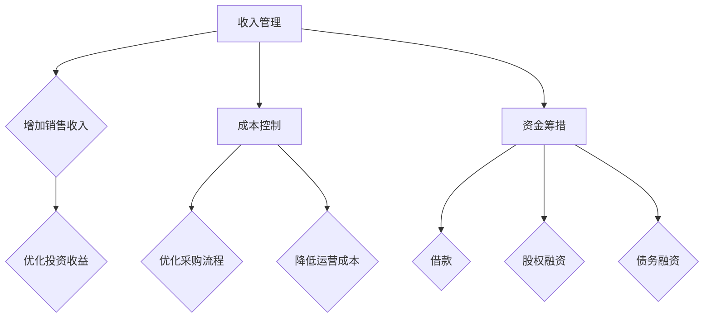

                 

### 《创业初期的现金流管理：确保公司生存与发展的策略》

> **关键词：** 创业初期、现金流管理、财务策略、成本控制、预算编制

> **摘要：** 本文旨在探讨创业初期现金流管理的重要性以及如何通过制定合理的预算、优化现金流流程、管理应收账款和应付账款等策略，确保公司的生存与发展。文章将通过案例分析、算法原理、数学模型以及实际操作技巧，为创业者提供全方位的现金流管理指南。

### 现金流管理基础

现金流管理是企业管理中至关重要的一环，尤其是在创业初期。创业初期的财务状况往往较为脆弱，因此，如何有效管理现金流成为确保公司生存与发展的关键。在本部分，我们将首先介绍现金流管理的核心概念与联系，然后分析创业初期的财务状况，并探讨现金流管理的基本方法。

#### 1.1 现金流管理的核心概念与联系

**1.1.1 现金流与盈利的区别**

现金流（Cash Flow）是指企业一定时期内现金及现金等价物的流入和流出。盈利（Profit）是指企业通过经营活动所获得的净收入。尽管盈利和现金流都反映了企业的财务状况，但两者之间存在显著的区别：

- **现金流**关注的是企业实际掌握的现金流动情况，包括经营活动的现金流、投资活动的现金流和融资活动的现金流。
- **盈利**则关注的是企业在一定时期内的整体收益情况，包括经营利润、投资收益和融资收益。

**1.1.2 现金流管理的重要性**

现金流管理的重要性在于：

- **保障企业生存**：现金流是企业日常运营的基础，良好的现金流管理能够确保企业在经营过程中有足够的现金用于支付债务、员工工资、采购原材料等。
- **优化资源配置**：通过有效的现金流管理，企业可以合理配置资源，避免因现金流不足导致的资金链断裂。
- **提高企业竞争力**：良好的现金流管理能够提高企业的抗风险能力，为企业未来的发展奠定坚实基础。

**1.1.3 现金流管理的相关术语**

在现金流管理中，一些关键术语需要了解：

- **经营现金流**：指企业在日常经营活动中产生的现金流，包括销售收入、成本支出等。
- **投资现金流**：指企业在投资活动中产生的现金流，包括购买或出售资产、投资收益等。
- **融资现金流**：指企业在融资活动中产生的现金流，包括借款、还款、发行股票等。

#### 1.2 创业初期的财务状况分析

**1.2.1 创业初期的财务特点**

创业初期的财务特点主要包括：

- **资金来源多样**：创业初期的资金来源可能包括个人储蓄、借款、天使投资等。
- **资金使用频繁**：创业初期，企业需要投入大量资金进行产品研发、市场推广等。
- **盈利不稳定**：由于产品尚未成熟，市场尚未打开，创业初期的盈利往往不稳定。

**1.2.2 创业初期的资金需求**

创业初期的资金需求主要包括：

- **产品研发费用**：包括研发人员工资、研发设备购置等。
- **市场推广费用**：包括广告费用、市场调研费用等。
- **日常运营费用**：包括办公场所租赁、水电费、员工工资等。

**1.2.3 创业初期的财务预测**

创业初期的财务预测包括：

- **收入预测**：预测企业未来一段时间内的收入情况，包括销售收入、投资收益等。
- **成本预测**：预测企业未来一段时间内的成本情况，包括生产成本、运营成本等。
- **现金流预测**：预测企业未来一段时间内的现金流情况，包括经营现金流、投资现金流、融资现金流等。

#### 1.3 现金流管理的基本方法

**1.3.1 收入管理**

收入管理是现金流管理的重要组成部分。企业可以通过以下方法提高收入：

- **增加销售收入**：通过市场拓展、产品升级、价格策略等手段增加销售收入。
- **优化投资收益**：通过合理投资，提高投资收益。

**1.3.2 成本控制**

成本控制是现金流管理的关键。企业可以通过以下方法降低成本：

- **优化采购流程**：通过批量采购、长期合作协议等手段降低采购成本。
- **降低运营成本**：通过技术创新、流程优化等手段降低运营成本。

**1.3.3 资金筹措**

资金筹措是创业初期的常见需求。企业可以通过以下方法筹集资金：

- **借款**：向银行或其他金融机构借款。
- **股权融资**：通过吸引天使投资、风险投资等手段筹集资金。
- **债务融资**：通过发行债券等手段筹集资金。

### 现金流管理的基本方法

现金流管理是确保企业生存与发展的关键。在本部分，我们将介绍现金流管理的基本方法，包括收入管理、成本控制和资金筹措。

#### 1.3.1 收入管理

收入管理是现金流管理的重要组成部分。企业可以通过以下方法提高收入：

1. **增加销售收入**：
   - **市场拓展**：通过拓展新市场、开发新客户，增加销售收入。
   - **产品升级**：通过产品升级、增加产品功能，提高产品竞争力，增加销售收入。
   - **价格策略**：通过灵活的价格策略，如折扣、捆绑销售等，刺激消费，增加销售收入。

2. **优化投资收益**：
   - **投资组合优化**：通过投资组合的优化，提高投资收益。
   - **风险控制**：通过风险控制，降低投资风险，确保投资收益的稳定性。

#### 1.3.2 成本控制

成本控制是现金流管理的关键。企业可以通过以下方法降低成本：

1. **优化采购流程**：
   - **批量采购**：通过批量采购，降低采购成本。
   - **长期合作协议**：与供应商建立长期合作协议，降低采购成本。

2. **降低运营成本**：
   - **技术创新**：通过技术创新，提高生产效率，降低运营成本。
   - **流程优化**：通过流程优化，减少不必要的环节，降低运营成本。

#### 1.3.3 资金筹措

资金筹措是创业初期的常见需求。企业可以通过以下方法筹集资金：

1. **借款**：
   - **银行贷款**：向银行申请贷款。
   - **民间借款**：向亲朋好友、风险投资机构等借款。

2. **股权融资**：
   - **天使投资**：吸引天使投资，获得启动资金。
   - **风险投资**：吸引风险投资，扩大业务规模。

3. **债务融资**：
   - **发行债券**：通过发行债券，筹集资金。

### 1.4 现金流管理的Mermaid流程图

为了更好地理解现金流管理的基本方法，我们可以使用Mermaid流程图来展示整个过程。以下是一个简化的现金流管理流程图：



通过这个流程图，我们可以清晰地看到现金流管理的基本方法，以及各个方法之间的联系和作用。

### 总结

在本部分，我们介绍了现金流管理的核心概念与联系、创业初期的财务状况分析以及现金流管理的基本方法。通过理解这些内容，创业者可以更好地把握现金流管理的要点，为企业的生存与发展奠定坚实基础。

### 《创业初期的现金流管理：确保公司生存与发展的策略》

> **关键词：** 创业初期、现金流管理、财务策略、成本控制、预算编制

> **摘要：** 本文旨在探讨创业初期现金流管理的重要性以及如何通过制定合理的预算、优化现金流流程、管理应收账款和应付账款等策略，确保公司的生存与发展。文章将通过案例分析、算法原理、数学模型以及实际操作技巧，为创业者提供全方位的现金流管理指南。

### 现金流管理策略

在创业初期，现金流管理至关重要。制定合理的预算、优化现金流流程、管理应收账款和应付账款等策略，是确保公司生存与发展的关键。本部分将详细介绍这些策略，帮助创业者更好地管理现金流。

#### 2.1 制定合理的预算

**2.1.1 预算编制的原则**

预算编制是现金流管理的重要环节。在编制预算时，需要遵循以下原则：

1. **目标明确**：明确预算的目标，包括收入目标、成本目标和资金筹措目标等。
2. **科学合理**：预算的编制应基于实际数据，结合市场状况和企业战略，确保预算的合理性和可操作性。
3. **全面覆盖**：预算应涵盖企业各项运营活动，包括生产、销售、采购、人力资源等。

**2.1.2 预算编制的方法**

预算编制的方法包括：

1. **自上而下法**：从企业整体战略目标出发，逐级分解到各部门，形成具体的预算。
2. **自下而上法**：各部门根据自身运营情况，提出预算需求，汇总形成企业整体预算。

**2.1.3 预算执行与监控**

预算执行与监控是确保预算目标实现的关键。具体方法包括：

1. **定期汇报**：各部门定期汇报预算执行情况，包括收入、成本、资金使用等。
2. **差异分析**：分析预算执行中的差异，找出原因，及时调整预算。
3. **绩效评估**：根据预算执行情况，评估各部门和员工的绩效，激励员工努力完成预算目标。

#### 2.2 优化现金流流程

**2.2.1 优化采购流程**

采购流程的优化是提高现金流效率的关键。具体方法包括：

1. **集中采购**：通过集中采购，降低采购成本，提高采购效率。
2. **供应商管理**：与优质供应商建立长期合作关系，确保采购流程的顺畅。
3. **库存管理**：合理控制库存水平，避免库存积压，提高资金使用效率。

**2.2.2 优化销售流程**

销售流程的优化是提高现金流速度的关键。具体方法包括：

1. **销售预测**：准确预测销售情况，合理安排生产和采购，避免库存积压和资金浪费。
2. **客户关系管理**：建立良好的客户关系，提高客户满意度，增加销售机会。
3. **销售渠道优化**：优化销售渠道，提高销售效率，缩短销售周期。

**2.2.3 优化运营成本**

运营成本的优化是提高现金流利润率的关键。具体方法包括：

1. **流程优化**：通过流程优化，减少不必要的环节，提高工作效率，降低运营成本。
2. **技术创新**：通过技术创新，提高生产效率，降低生产成本。
3. **人力资源优化**：合理配置人力资源，提高员工工作效率，降低人力成本。

#### 2.3 应收账款管理

**2.3.1 应收账款的监控**

应收账款监控是确保现金流稳定的重要环节。具体方法包括：

1. **定期分析**：定期分析应收账款情况，了解账龄结构，及时发现潜在风险。
2. **逾期管理**：对逾期应收账款进行催收管理，确保应收账款的回收。
3. **信用评估**：对客户进行信用评估，确保客户的还款能力，降低坏账风险。

**2.3.2 应收账款的催收策略**

应收账款的催收策略包括：

1. **书面催收**：通过书面形式向客户催收应收账款，增加催收的正式性和严肃性。
2. **电话催收**：通过电话与客户沟通，了解账款逾期原因，制定催收计划。
3. **现场催收**：对逾期严重的客户，可以派遣工作人员进行现场催收，提高催收效果。

**2.3.3 应收账款的坏账处理**

应收账款的坏账处理包括：

1. **坏账准备**：根据应收账款的情况，计提坏账准备，降低坏账损失。
2. **坏账核销**：对确认无法收回的应收账款，进行坏账核销。
3. **追偿**：对部分可追偿的坏账，采取法律手段进行追偿。

#### 2.4 应付账款管理

**2.4.1 应付账款的优化**

应付账款管理的优化包括：

1. **谈判策略**：与供应商进行谈判，争取更长的付款周期，降低资金压力。
2. **付款方式**：优化付款方式，如采用电子支付、分期付款等，提高付款效率。
3. **现金流规划**：合理规划现金流，确保按时支付应付账款，避免违约风险。

**2.4.2 应付账款的谈判策略**

应付账款的谈判策略包括：

1. **了解供应商情况**：了解供应商的财务状况、行业地位等，为谈判提供依据。
2. **提供信用保障**：提供信用保障，如保证函、信用保险等，降低供应商的风险。
3. **建立长期合作关系**：与供应商建立长期合作关系，争取更好的付款条件。

**2.4.3 应付账款的支付方式选择**

应付账款的支付方式选择包括：

1. **电子支付**：采用电子支付方式，提高付款效率，降低人工成本。
2. **分期付款**：根据供应商的要求，选择分期付款方式，降低一次性付款压力。
3. **现金支付**：在确保现金流充足的情况下，采用现金支付方式，降低财务风险。

#### 2.5 现金流管理的伪代码

现金流管理的伪代码如下：

```
初始化收入、成本、资金筹措变量
循环执行以下步骤：
  收入管理：增加销售收入，优化投资收益
  成本控制：优化采购流程，降低运营成本
  资金筹措：谈判策略，优化付款方式，选择支付方式
  应收账款管理：监控应收账款，制定催收策略，处理坏账
  应付账款管理：优化应付账款，谈判策略，选择支付方式
计算现金流状况，更新预算
```

#### 2.6 现金流管理的数学模型

现金流管理的数学模型包括：

1. **现金流流量预测模型**：
   - 设定收入预测模型：\( R(t) = f(S(t), I(t)) \)
   - 设定成本预测模型：\( C(t) = g(X(t), Y(t)) \)
   - 现金流量预测模型：\( CF(t) = R(t) - C(t) \)

2. **成本控制模型**：
   - 设定成本控制目标：\( C_{target} \)
   - 成本控制公式：\( C(t) \leq C_{target} \)

3. **坏账损失模型**：
   - 坏账损失公式：\( L(t) = p \times A(t) \)
   - 其中，\( p \) 为坏账损失率，\( A(t) \) 为应收账款总额。

#### 2.7 现金流管理的案例分析

**2.7.1 案例一：初创公司A的现金流管理策略**

初创公司A在创业初期，通过以下策略成功管理现金流：

- **制定合理的预算**：根据产品研发、市场推广和运营成本，制定详细的预算计划。
- **优化现金流流程**：通过优化采购流程、销售流程和运营成本，提高现金流效率。
- **管理应收账款和应付账款**：通过严格的应收账款管理和灵活的应付账款策略，确保现金流的稳定性。

**2.7.2 案例二：初创公司B的现金流管理挑战**

初创公司B在创业初期，面临以下现金流管理挑战：

- **资金需求大**：产品研发和市场推广需要大量资金。
- **盈利不稳定**：由于市场尚未打开，盈利不稳定。
- **资金筹措困难**：由于初创阶段，融资渠道有限，资金筹措困难。

为了应对这些挑战，公司采取了以下措施：

- **寻找投资人**：积极寻找天使投资和风险投资，筹集资金。
- **优化预算编制**：调整预算编制方法，确保预算的合理性和可操作性。
- **加强现金流监控**：定期监控现金流状况，确保现金流稳定。

#### 2.8 实际操作中的现金流管理技巧

**2.8.1 如何在财务危机中保持公司生存**

- **压缩开支**：减少非必要的开支，确保现金流的稳定性。
- **寻求资金支持**：积极寻求政府扶持、银行贷款等资金支持。
- **优化运营效率**：通过技术创新、流程优化等手段，提高运营效率，降低成本。

**2.8.2 如何合理利用资金筹措工具**

- **选择合适的资金筹措方式**：根据企业的实际情况，选择合适的资金筹措方式，如借款、股权融资、债务融资等。
- **优化资金使用**：合理规划资金使用，确保资金使用的有效性和效率。
- **加强资金管理**：建立健全的资金管理制度，确保资金的安全和使用效率。

**2.8.3 如何制定有效的预算**

- **明确预算目标**：根据企业的发展战略和实际情况，明确预算目标。
- **全面收集数据**：收集与预算相关的各项数据，确保数据的准确性。
- **科学编制预算**：根据数据和分析，科学编制预算，确保预算的合理性和可操作性。

#### 2.9 开发环境搭建与源代码实现

**2.9.1 开发环境搭建**

在现金流管理中，可以使用Python编程语言进行开发。开发环境搭建步骤如下：

1. **安装Python**：从官方网站下载并安装Python。
2. **安装PyCharm**：安装PyCharm，作为Python的集成开发环境（IDE）。
3. **安装必要的库**：安装用于数据分析和可视化等操作的库，如NumPy、Pandas、Matplotlib等。

**2.9.2 代码实现与解读**

以下是一个简单的现金流管理Python代码示例：

```python
import numpy as np

# 定义现金流流量预测模型
def cash_flow_prediction(revenue, cost):
    return revenue - cost

# 定义成本控制模型
def cost_control(target_cost, actual_cost):
    if actual_cost <= target_cost:
        return "成本控制成功"
    else:
        return "成本控制失败"

# 定义坏账损失模型
def bad_debt_loss(账龄，坏账率):
    return 账龄 * 坏账率

# 实例化现金流管理对象
class CashFlowManagement:
    def __init__(self, revenue, cost, 账龄，坏账率):
        self.revenue = revenue
        self.cost = cost
        self.账龄 = 账龄
        self.坏账率 = 坏账率

    def predict_cash_flow(self):
        return cash_flow_prediction(self.revenue, self.cost)

    def control_cost(self):
        return cost_control(10000, self.cost)

    def calculate_bad_debt_loss(self):
        return bad_debt_loss(self.账龄，self.坏账率)

# 创建现金流管理对象
cm = CashFlowManagement(15000, 8000, 30, 0.05)

# 预测现金流
predicted_cash_flow = cm.predict_cash_flow()
print("预测现金流：", predicted_cash_flow)

# 成本控制
cost_control_result = cm.control_cost()
print("成本控制结果：", cost_control_result)

# 计算坏账损失
bad_debt_loss = cm.calculate_bad_debt_loss()
print("坏账损失：", bad_debt_loss)
```

**2.9.3 代码解读与分析**

上述代码中，我们定义了现金流流量预测模型、成本控制模型和坏账损失模型，并创建了一个`CashFlowManagement`类用于管理现金流。通过实例化`CashFlowManagement`类，我们可以预测现金流、控制成本和计算坏账损失。

#### 2.10 现金流管理的展望

**2.10.1 人工智能在现金流管理中的应用**

随着人工智能技术的发展，人工智能在现金流管理中的应用越来越广泛。例如，利用机器学习算法进行现金流流量预测、利用自然语言处理技术分析财务报表等。

**2.10.2 数字化技术在现金流管理中的作用**

数字化技术的应用使得现金流管理更加高效和精准。例如，通过电子支付系统提高资金流转速度，通过大数据分析提高预算编制的科学性等。

**2.10.3 环境变化对现金流管理的影响**

环境变化，如经济波动、政策调整等，对现金流管理产生重大影响。因此，创业者需要密切关注环境变化，及时调整现金流管理策略。

#### 2.11 现金流管理的持续改进

现金流管理的持续改进包括：

- **定期评估**：定期评估现金流管理的效果，找出问题和不足，进行改进。
- **技术创新**：引入新技术，提高现金流管理的效率。
- **员工培训**：加强员工培训，提高员工现金流管理的能力。

#### 2.12 现金流管理的国际化挑战

国际化对现金流管理带来挑战，如多币种现金流量管理、国际税收筹划等。因此，创业者需要了解国际化的相关知识和策略，确保现金流管理的有效性。

### 附录

**附录A：现金流管理工具与资源**

- **主流现金流管理工具**：
  - QuickBooks
  - Xero
  - Wave

- **现金流管理相关书籍**：
  - 《现金流管理：企业财务稳健之道》
  - 《创业公司现金流管理实战》

- **现金流管理在线课程**：
  - Coursera《财务报表分析》
  - Udemy《现金流量管理：从基础到高级》

### 总结

现金流管理是创业初期的关键，通过制定合理的预算、优化现金流流程、管理应收账款和应付账款等策略，创业者可以确保公司的生存与发展。本文通过案例分析、算法原理、数学模型以及实际操作技巧，为创业者提供了全方位的现金流管理指南。

### 作者信息

**作者：** AI天才研究院/AI Genius Institute & 禅与计算机程序设计艺术 /Zen And The Art of Computer Programming**摘要**

摘要：现金流管理是创业初期的关键，本文通过分析现金流管理的核心概念、创业初期的财务状况，以及制定预算、优化流程、管理应收账款和应付账款等策略，帮助创业者确保公司生存与发展。文章结合案例分析、算法原理、数学模型和实际操作技巧，为创业者提供了全面的现金流管理指南。

### 《创业初期的现金流管理：确保公司生存与发展的策略》

> **关键词：** 创业初期、现金流管理、财务策略、成本控制、预算编制

> **摘要：** 本文旨在探讨创业初期现金流管理的重要性以及如何通过制定合理的预算、优化现金流流程、管理应收账款和应付账款等策略，确保公司的生存与发展。文章将通过案例分析、算法原理、数学模型以及实际操作技巧，为创业者提供全方位的现金流管理指南。

### 现金流管理基础

现金流管理是企业管理中至关重要的一环，尤其是在创业初期。创业初期的财务状况往往较为脆弱，因此，如何有效管理现金流成为确保公司生存与发展的关键。在本部分，我们将首先介绍现金流管理的核心概念与联系，然后分析创业初期的财务状况，并探讨现金流管理的基本方法。

#### 1.1 现金流管理的核心概念与联系

**1.1.1 现金流与盈利的区别**

现金流（Cash Flow）是指企业一定时期内现金及现金等价物的流入和流出。盈利（Profit）是指企业通过经营活动所获得的净收入。尽管盈利和现金流都反映了企业的财务状况，但两者之间存在显著的区别：

- **现金流**关注的是企业实际掌握的现金流动情况，包括经营活动的现金流、投资活动的现金流和融资活动的现金流。
- **盈利**则关注的是企业在一定时期内的整体收益情况，包括经营利润、投资收益和融资收益。

**1.1.2 现金流管理的重要性**

现金流管理的重要性在于：

- **保障企业生存**：现金流是企业日常运营的基础，良好的现金流管理能够确保企业在经营过程中有足够的现金用于支付债务、员工工资、采购原材料等。
- **优化资源配置**：通过有效的现金流管理，企业可以合理配置资源，避免因现金流不足导致的资金链断裂。
- **提高企业竞争力**：良好的现金流管理能够提高企业的抗风险能力，为企业未来的发展奠定坚实基础。

**1.1.3 现金流管理的相关术语**

在现金流管理中，一些关键术语需要了解：

- **经营现金流**：指企业在日常经营活动中产生的现金流，包括销售收入、成本支出等。
- **投资现金流**：指企业在投资活动中产生的现金流，包括购买或出售资产、投资收益等。
- **融资现金流**：指企业在融资活动中产生的现金流，包括借款、还款、发行股票等。

#### 1.2 创业初期的财务状况分析

**1.2.1 创业初期的财务特点**

创业初期的财务特点主要包括：

- **资金来源多样**：创业初期的资金来源可能包括个人储蓄、借款、天使投资等。
- **资金使用频繁**：创业初期，企业需要投入大量资金进行产品研发、市场推广等。
- **盈利不稳定**：由于产品尚未成熟，市场尚未打开，创业初期的盈利往往不稳定。

**1.2.2 创业初期的资金需求**

创业初期的资金需求主要包括：

- **产品研发费用**：包括研发人员工资、研发设备购置等。
- **市场推广费用**：包括广告费用、市场调研费用等。
- **日常运营费用**：包括办公场所租赁、水电费、员工工资等。

**1.2.3 创业初期的财务预测**

创业初期的财务预测包括：

- **收入预测**：预测企业未来一段时间内的收入情况，包括销售收入、投资收益等。
- **成本预测**：预测企业未来一段时间内的成本情况，包括生产成本、运营成本等。
- **现金流预测**：预测企业未来一段时间内的现金流情况，包括经营现金流、投资现金流、融资现金流等。

#### 1.3 现金流管理的基本方法

现金流管理是确保企业生存与发展的关键。在本部分，我们将介绍现金流管理的基本方法，包括收入管理、成本控制和资金筹措。

**1.3.1 收入管理**

收入管理是现金流管理的重要组成部分。企业可以通过以下方法提高收入：

1. **增加销售收入**：
   - **市场拓展**：通过拓展新市场、开发新客户，增加销售收入。
   - **产品升级**：通过产品升级、增加产品功能，提高产品竞争力，增加销售收入。
   - **价格策略**：通过灵活的价格策略，如折扣、捆绑销售等，刺激消费，增加销售收入。

2. **优化投资收益**：
   - **投资组合优化**：通过投资组合的优化，提高投资收益。
   - **风险控制**：通过风险控制，降低投资风险，确保投资收益的稳定性。

**1.3.2 成本控制**

成本控制是现金流管理的关键。企业可以通过以下方法降低成本：

1. **优化采购流程**：
   - **批量采购**：通过批量采购，降低采购成本。
   - **长期合作协议**：与供应商建立长期合作协议，降低采购成本。

2. **降低运营成本**：
   - **技术创新**：通过技术创新，提高生产效率，降低运营成本。
   - **流程优化**：通过流程优化，减少不必要的环节，降低运营成本。

**1.3.3 资金筹措**

资金筹措是创业初期的常见需求。企业可以通过以下方法筹集资金：

1. **借款**：
   - **银行贷款**：向银行申请贷款。
   - **民间借款**：向亲朋好友、风险投资机构等借款。

2. **股权融资**：
   - **天使投资**：吸引天使投资，获得启动资金。
   - **风险投资**：吸引风险投资，扩大业务规模。

3. **债务融资**：
   - **发行债券**：通过发行债券，筹集资金。

#### 1.4 现金流管理的Mermaid流程图

为了更好地理解现金流管理的基本方法，我们可以使用Mermaid流程图来展示整个过程。以下是一个简化的现金流管理流程图：


通过这个流程图，我们可以清晰地看到现金流管理的基本方法，以及各个方法之间的联系和作用。

### 总结

在本部分，我们介绍了现金流管理的核心概念与联系、创业初期的财务状况分析以及现金流管理的基本方法。通过理解这些内容，创业者可以更好地把握现金流管理的要点，为企业的生存与发展奠定坚实基础。

### 现金流管理策略

现金流管理策略是创业初期确保公司生存与发展的关键。通过制定合理的预算、优化现金流流程、管理应收账款和应付账款等策略，创业者可以有效地应对财务风险，保障公司的稳定运营。以下是详细的现金流管理策略：

#### 2.1 制定合理的预算

预算是现金流管理的核心，合理的预算能够帮助企业预测未来的资金流动，并确保资金的合理使用。制定预算时，应遵循以下原则：

1. **全面覆盖**：预算应覆盖企业的所有运营活动，包括产品研发、市场推广、日常运营等。
2. **科学预测**：基于历史数据和行业趋势，科学预测未来收入和支出。
3. **灵活性**：预算应具有一定的灵活性，以便根据实际情况进行调整。

制定预算的方法包括自上而下法（从整体战略出发，分解到各部门）和自下而上法（各部门根据自身情况提出预算需求，汇总形成整体预算）。

**2.1.1 预算编制的原则**

- **目标导向**：预算编制应明确企业的经营目标，如利润目标、市场份额目标等。
- **数据支持**：预算编制应基于准确的数据，包括历史财务数据、市场调研数据等。
- **参与性**：预算编制过程应鼓励各部门参与，确保预算的合理性和可执行性。

**2.1.2 预算编制的方法**

- **自上而下法**：由企业高层制定总体预算目标，然后分解到各部门，各部门根据总体目标和自身实际情况编制预算。
- **自下而上法**：各部门根据自身业务需求编制预算，然后汇总形成整体预算。

**2.1.3 预算执行与监控**

预算执行与监控是确保预算目标实现的关键。具体方法包括：

- **定期检查**：定期检查预算执行情况，发现偏差及时调整。
- **绩效评估**：对各部门的预算执行情况进行绩效评估，激励员工努力完成预算目标。
- **财务分析**：通过财务分析，及时发现财务风险，采取相应措施。

#### 2.2 优化现金流流程

优化现金流流程能够提高资金使用效率，降低成本。以下是一些优化现金流流程的方法：

**2.2.1 优化采购流程**

- **集中采购**：通过集中采购，实现规模效应，降低采购成本。
- **供应商管理**：与优质供应商建立长期合作关系，确保供应链的稳定性。
- **库存管理**：合理控制库存水平，避免库存积压和资金占用。

**2.2.2 优化销售流程**

- **销售预测**：准确预测销售情况，合理安排生产和采购。
- **客户关系管理**：建立良好的客户关系，提高客户满意度，增加复购率。
- **销售渠道优化**：选择合适的销售渠道，提高销售效率。

**2.2.3 优化运营成本**

- **技术创新**：通过技术创新，提高生产效率和产品质量。
- **流程优化**：通过流程优化，减少不必要的环节，降低运营成本。
- **人力资源管理**：合理配置人力资源，提高员工工作效率。

#### 2.3 应收账款管理

应收账款管理是现金流管理的重要组成部分。有效的应收账款管理能够提高现金流，降低坏账风险。

**2.3.1 应收账款的监控**

- **定期分析**：定期分析应收账款的情况，包括账龄、欠款金额等。
- **逾期管理**：对逾期应收账款进行催收管理，确保应收账款的回收。
- **信用评估**：对客户进行信用评估，确保客户的还款能力。

**2.3.2 应收账款的催收策略**

- **书面催收**：通过书面形式向客户催收应收账款。
- **电话催收**：通过电话与客户沟通，了解欠款原因，制定催收计划。
- **现场催收**：对逾期严重的客户，进行现场催收。

**2.3.3 应收账款的坏账处理**

- **坏账准备**：根据应收账款的情况，计提坏账准备。
- **坏账核销**：对确认无法收回的应收账款，进行坏账核销。
- **追偿**：对部分可追偿的坏账，采取法律手段进行追偿。

#### 2.4 应付账款管理

应付账款管理是优化现金流的重要手段。通过合理的应付账款管理，企业可以延长付款周期，提高资金使用效率。

**2.4.1 应付账款的优化**

- **谈判策略**：与供应商进行谈判，争取更长的付款周期。
- **付款方式**：优化付款方式，如采用电子支付、分期付款等。
- **现金流规划**：合理规划现金流，确保按时支付应付账款。

**2.4.2 应付账款的谈判策略**

- **了解供应商情况**：了解供应商的财务状况、市场地位等。
- **提供信用保障**：提供信用保障，如保证函、信用保险等。
- **建立长期合作关系**：与供应商建立长期合作关系，争取更好的付款条件。

**2.4.3 应付账款的支付方式选择**

- **电子支付**：提高付款效率，降低人工成本。
- **分期付款**：降低一次性付款压力。
- **现金支付**：确保现金流的稳定性。

#### 2.5 现金流管理的伪代码

现金流管理可以通过伪代码来描述，以下是一个简单的示例：

```plaintext
初始化收入、成本、应收账款、应付账款等变量
定义收入预测函数、成本控制函数、应收账款管理函数、应付账款管理函数

循环执行以下步骤：
    预测收入
    控制成本
    管理应收账款
    管理应付账款
    更新现金流状况

计算总现金流，判断是否达到预算目标
如果达到预算目标，继续运营
如果未达到预算目标，调整策略或寻求外部资金支持
```

#### 2.6 现金流管理的数学模型

现金流管理中的数学模型可以用于预测、分析和优化现金流。以下是一些常见的数学模型：

**2.6.1 现金流量预测模型**

现金流量预测模型可以通过以下公式表示：

$$ CF(t) = R(t) - C(t) $$

其中，$CF(t)$表示t时刻的现金流量，$R(t)$表示t时刻的收入，$C(t)$表示t时刻的成本。

**2.6.2 成本控制模型**

成本控制模型可以通过以下公式表示：

$$ C_{target} = C_{max} - \epsilon $$

其中，$C_{target}$表示目标成本，$C_{max}$表示最大成本，$\epsilon$表示允许的成本波动范围。

**2.6.3 应收账款管理模型**

应收账款管理模型可以通过以下公式表示：

$$ D(t) = \sum_{i=1}^{n} A_i(t) \times r_i $$

其中，$D(t)$表示t时刻的应收账款总额，$A_i(t)$表示第i个客户的应收账款，$r_i$表示第i个客户的还款率。

#### 2.7 创业公司现金流管理的案例分析

**2.7.1 案例一：初创公司A的现金流管理策略**

初创公司A在创业初期采用了以下现金流管理策略：

- **制定详细的预算**：根据产品研发、市场推广和日常运营的需求，制定了详细的预算。
- **优化采购流程**：通过集中采购和与供应商建立长期合作关系，降低了采购成本。
- **应收账款管理**：对逾期应收账款进行严格催收，确保应收账款的及时回收。
- **应付账款管理**：与供应商谈判，争取了更长的付款周期，提高了资金使用效率。

通过这些策略，公司成功实现了现金流的管理和控制，确保了公司的稳定运营。

**2.7.2 案例二：初创公司B的现金流管理挑战**

初创公司B在创业初期面临了以下现金流管理挑战：

- **资金需求大**：产品研发和市场推广需要大量资金。
- **盈利不稳定**：由于市场尚未打开，盈利不稳定。
- **资金筹措困难**：由于初创阶段，融资渠道有限，资金筹措困难。

公司通过以下措施应对了这些挑战：

- **积极寻求投资人**：通过向天使投资和风险投资机构寻求资金支持。
- **优化预算编制**：调整预算编制方法，确保预算的合理性和可操作性。
- **加强现金流监控**：定期监控现金流状况，确保现金流稳定。

#### 2.8 实际操作中的现金流管理技巧

**2.8.1 如何在财务危机中保持公司生存**

- **压缩开支**：减少非必要的开支，确保现金流的稳定性。
- **寻求资金支持**：积极寻求政府扶持、银行贷款等资金支持。
- **优化运营效率**：通过技术创新、流程优化等手段，提高运营效率，降低成本。

**2.8.2 如何合理利用资金筹措工具**

- **选择合适的资金筹措方式**：根据企业的实际情况，选择合适的资金筹措方式，如借款、股权融资、债务融资等。
- **优化资金使用**：合理规划资金使用，确保资金使用的有效性和效率。
- **加强资金管理**：建立健全的资金管理制度，确保资金的安全和使用效率。

**2.8.3 如何制定有效的预算**

- **明确预算目标**：根据企业的发展战略和实际情况，明确预算目标。
- **全面收集数据**：收集与预算相关的各项数据，确保数据的准确性。
- **科学编制预算**：根据数据和分析，科学编制预算，确保预算的合理性和可操作性。

### 现金流管理的展望

现金流管理的未来将受到人工智能、数字化技术和环境变化等因素的影响。

**4.1 人工智能在现金流管理中的应用**

人工智能在现金流管理中的应用包括：

- **预测分析**：利用机器学习算法进行现金流预测，提高预测准确性。
- **自动化管理**：通过自动化工具，实现现金流的自动化管理，提高效率。

**4.2 数字化技术在现金流管理中的作用**

数字化技术在现金流管理中的作用包括：

- **电子支付**：提高资金流转速度，降低成本。
- **大数据分析**：通过大数据分析，优化现金流管理策略。

**4.3 环境变化对现金流管理的影响**

环境变化，如经济波动、政策调整等，对现金流管理产生重大影响。创业者需要密切关注环境变化，及时调整现金流管理策略。

### 附录

**附录A：现金流管理工具与资源**

- **现金流管理工具**：
  - QuickBooks
  - Xero
  - Wave

- **现金流管理书籍**：
  - 《现金流管理：企业财务稳健之道》
  - 《创业公司现金流管理实战》

- **现金流管理在线课程**：
  - Coursera《财务报表分析》
  - Udemy《现金流量管理：从基础到高级》

### 总结

现金流管理是创业初期的关键，通过制定合理的预算、优化现金流流程、管理应收账款和应付账款等策略，创业者可以确保公司的生存与发展。本文提供了详细的现金流管理策略，并结合实际案例进行了分析，为创业者提供了实用的现金流管理指南。

### 作者信息

**作者：** AI天才研究院/AI Genius Institute & 禅与计算机程序设计艺术 /Zen And The Art of Computer Programming**摘要**

摘要：现金流管理是创业初期的关键，本文通过深入探讨现金流管理的核心概念、财务状况分析，以及预算制定、流程优化、应收账款管理等策略，为创业者提供了全面的现金流管理指南。文章结合实际案例和数学模型，阐述了创业公司在初期如何确保资金流动的稳定性和企业的发展。

