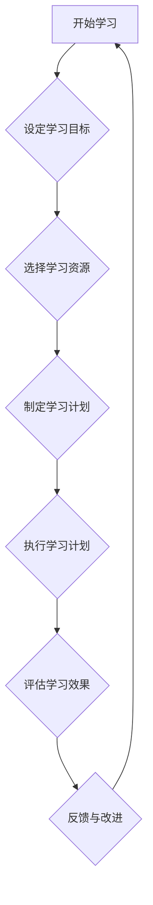

                 

### 引言

在当今快速变化的世界，知识更新已经成为创业者成功的关键因素。技术的日新月异、市场的快速演变、消费者需求的不断变化，都要求创业者必须具备自我学习和知识更新的能力。然而，如何有效地进行自我学习和知识更新，以应对创业过程中不断涌现的挑战，成为了每一个创业者都必须面对的问题。

本篇文章将围绕这一主题展开讨论，旨在为创业者提供一套系统化的自我学习和知识更新策略。我们将从理论基础、实践方法和成功案例等多个角度，深入探讨创业者如何在自我学习和知识更新中找到自己的节奏和路径。

文章将分为三个主要部分：

1. **自我学习的理论基础**：这一部分将介绍自我学习的核心概念、基本原则、心理学基础以及知识更新的趋势与挑战。通过这些理论基础的铺垫，创业者可以更好地理解自我学习和知识更新的重要性。

2. **创业实践中的知识更新策略**：这一部分将结合市场研究、技术创新、战略规划与决策、知识管理与团队建设等方面，详细阐述创业者如何在创业实践中运用知识更新策略。这部分内容将提供具体的操作指南，帮助创业者将理论知识转化为实际行动。

3. **成功创业者的经验分享**：这一部分将通过分析成功创业者的自我学习经验、知识更新策略以及创业过程中的实践，总结出一些具有普遍意义的经验和教训。这部分内容将为创业者提供实际可行的参考和借鉴。

通过本文的阅读，创业者不仅可以了解自我学习和知识更新的理论基础，还可以掌握一套实用的策略和方法，从而在创业道路上更加从容自信。

### 关键词

创业者、自我学习、知识更新、市场研究、技术创新、战略规划、知识管理、团队建设。

### 摘要

本文旨在探讨创业者如何通过自我学习和知识更新来提升创业成功率。文章首先介绍了自我学习的核心概念和理论基础，包括自我学习的定义、基本原则、心理学基础以及知识更新的概念和意义。接着，本文结合市场研究、技术创新、战略规划与决策、知识管理与团队建设等方面，提出了创业者具体可行的知识更新策略。通过成功创业者的案例分析，本文总结出了一些有效的自我学习和知识更新实践方法，为创业者提供了宝贵的经验和参考。最终，本文提出了对未来创业趋势和知识更新方向的展望，鼓励创业者持续自我学习和知识更新，以应对不断变化的商业环境。

---

### 第一部分：自我学习的理论基础

#### 第1章：自我学习的核心概念

自我学习，作为一种个体主动获取、处理和应用知识的过程，对于创业者来说尤为重要。首先，让我们从定义入手，理解自我学习的本质。

**1.1.1 自我学习的定义与重要性**

自我学习，通常被定义为个体在没有外部指导的情况下，通过自主探索和实践，主动获取和构建知识的过程。与传统的学习方式不同，自我学习强调个体在过程中的主动性和自主性。这种学习方式不仅包括对知识的获取，还包括对知识的理解、应用和创新。

对于创业者而言，自我学习具有以下几个重要性：

1. **适应变化的能力**：创业环境多变，自我学习使得创业者能够及时掌握新知识，快速适应市场和环境的变化。
2. **创新能力**：自我学习促使创业者不断思考和创新，从而在竞争激烈的市场中找到新的机会和解决方案。
3. **持续成长**：自我学习是创业者持续成长和进步的重要途径，通过不断学习，创业者能够不断提升自身的综合素质和领导能力。

**1.1.2 自我学习的基本原则**

为了实现有效的自我学习，创业者需要遵循以下基本原则：

1. **目标明确**：在开始学习之前，创业者需要明确自己的学习目标，确保学习过程有的放矢。
2. **主动学习**：自我学习强调主动参与，创业者应主动寻找学习资源，积极参与讨论和实践。
3. **灵活调整**：学习过程中，创业者需要根据实际情况灵活调整学习策略和方法，确保学习效果的最大化。
4. **反馈与反思**：学习后的反馈和反思是自我学习的重要环节，创业者应定期对学习效果进行评估，并从中获得改进和提升的启示。

**1.1.3 自我学习与终身教育的联系**

自我学习与终身教育有着紧密的联系。终身教育强调个体在整个生命过程中不断学习和成长，而自我学习是实现这一目标的重要途径。对于创业者来说，终身教育意味着不仅要掌握专业知识，还要不断拓展视野，更新知识体系。

终身教育的重要性体现在以下几个方面：

1. **适应社会发展**：随着社会和科技的快速发展，终身教育使得创业者能够不断适应新的社会需求和技术变革。
2. **提升竞争力**：终身教育能够帮助创业者不断提升自身的知识水平和技能，从而在激烈的市场竞争中保持优势。
3. **个人成长**：终身教育不仅是为了职业发展，更是为了个人的全面发展，通过不断学习，创业者能够提升自身的综合素质和人生价值。

**1.1.4 自我学习的心理学基础**

心理学为自我学习提供了理论基础。其中，认知心理学和学习心理学尤为重要。认知心理学研究个体如何获取、处理和应用知识，强调记忆、注意、思维等认知过程的重要性。而学习心理学则关注学习过程中的动机、情绪和行为因素。

对于创业者来说，了解心理学基础有助于：

1. **提升学习效率**：通过了解记忆和注意力的机制，创业者可以采用更有效的方法进行学习。
2. **管理学习动机**：心理学提供了许多关于动机管理的策略，创业者可以运用这些策略来维持学习动力。
3. **应对学习挑战**：心理学研究还揭示了学习过程中的常见困难，如拖延、焦虑等，创业者可以通过这些策略来克服这些挑战。

总之，自我学习是创业者成功的关键因素之一。通过理解自我学习的核心概念和基本原则，结合终身教育的理念，创业者可以更有效地进行自我学习和知识更新，从而在创业道路上取得更大的成功。

---

### 第2章：自我学习的策略与方法

在理解了自我学习的核心概念和理论基础后，接下来我们将探讨具体的自我学习策略与方法。自我学习不仅仅是一个理论概念，它需要在实际操作中得以实现。以下是几种常见的自我学习策略与方法，以及如何在实践中有效地应用它们。

**2.1.1 自我学习的方法论**

**方法论**是一种系统的思维方式，它可以帮助创业者更有效地进行自我学习。以下是几种常用的方法论：

1. **系统化学习**：创业者应将学习内容进行系统化分类，构建知识框架，以便更好地理解和记忆。例如，可以将学习内容分为技术、市场、战略等不同的模块，并逐一攻克。

2. **问题导向学习**：以解决实际问题为导向，创业者可以更针对性地选择学习内容，从而提高学习效率。例如，在遇到市场变化时，可以优先学习市场趋势分析的方法和工具。

3. **批判性思维**：在自我学习过程中，创业者应保持批判性思维，对所学内容进行评估和质疑，以确保知识的准确性和适用性。

**2.1.2 有效学习技巧与实践**

为了实现有效的自我学习，创业者需要掌握一系列学习技巧和实践方法。以下是一些常用的技巧：

1. **主动学习**：与被动学习相比，主动学习更能激发学习兴趣和动力。创业者可以通过主动参与讨论、提出问题、实践应用等方式，提升学习的主动性和效果。

2. **分散学习**：分散学习是指将学习内容分布在不同的时间段进行学习，这样可以避免大脑疲劳，提高学习效率。例如，每天分配一定的时间来学习新知识，而不是一次性完成所有学习任务。

3. **深度学习**：深度学习是指对学习内容进行深入理解，而不是停留在表面层次。创业者可以通过阅读专业书籍、参加研讨会、与专家交流等方式，实现深度学习。

**2.1.3 自我学习中的问题与解决方法**

在自我学习过程中，创业者可能会遇到各种问题。以下是一些常见的问题及相应的解决方法：

1. **学习动力不足**：解决方法包括设定明确的学习目标、制定奖励机制、与他人分享学习成果等。

2. **学习资源不足**：解决方法包括利用网络资源、参加线上课程、加入学习社区等。

3. **学习时间不足**：解决方法包括合理安排时间、利用碎片时间学习、设定优先级等。

**2.1.4 学习评估与反馈机制**

学习评估与反馈机制是确保自我学习效果的重要环节。以下是一些常用的评估与反馈方法：

1. **自我评估**：创业者可以定期对自己的学习进度和效果进行自我评估，以了解自己的学习状况。

2. **他人反馈**：创业者可以请教导师、同行或专业人士，获取他们的意见和建议。

3. **学习日志**：通过记录学习日志，创业者可以反思自己的学习过程，总结经验教训。

**案例分享：如何有效地进行自我学习**

以下是某创业者如何进行自我学习的案例：

李华是一位年轻的创业者，他深知自我学习的重要性。为了提升自己的技术能力，他制定了以下自我学习策略：

1. **系统化学习**：李华将学习内容分为技术、市场和战略三个模块，并制定了详细的学习计划。

2. **主动学习**：李华积极参与技术社区讨论，提出问题并解答他人问题，以激发学习兴趣。

3. **深度学习**：李华定期阅读专业书籍，参加技术研讨会，并与行业专家交流，以实现深度学习。

4. **学习评估与反馈**：李华每月进行一次自我评估，总结学习进度和效果，并请教导师和同行，获取他们的反馈。

通过这些策略，李华在自我学习过程中取得了显著进步，成功地将所学知识应用于创业实践，提高了创业成功率。

总之，自我学习是创业者成功的关键因素之一。通过掌握有效的自我学习策略与方法，创业者可以更好地应对创业过程中的各种挑战，实现持续成长和进步。

---

### 第3章：知识更新的趋势与挑战

在当今快速发展的科技时代，知识更新的速度前所未有地加快。对于创业者来说，掌握知识更新的趋势和应对挑战，是确保企业在激烈竞争中保持领先地位的关键。以下将从知识更新的概念、当前趋势、创业者面临的挑战以及应对策略等方面进行深入探讨。

**3.1.1 知识更新的概念与意义**

知识更新是指个体或组织通过学习新知识、更新旧知识，以适应不断变化的环境和需求的过程。知识更新的概念包含以下几个方面：

1. **新知识获取**：通过学习新的理论、技术、方法等，不断丰富自身的知识体系。
2. **旧知识淘汰**：随着时间的推移，一些知识可能变得过时或不适用，需要及时淘汰和更新。
3. **知识整合与应用**：将新知识和旧知识进行整合，形成更加系统化的知识体系，并应用于实际问题解决中。

知识更新的意义主要体现在以下几个方面：

1. **提升竞争力**：通过不断更新知识，创业者能够保持对市场的敏锐洞察力，及时抓住新的商业机会，提升企业的竞争力。
2. **创新能力**：知识更新有助于激发创业者的创新思维，推动企业在产品、服务和商业模式上不断创新，实现差异化竞争优势。
3. **适应变化**：在快速变化的商业环境中，创业者需要具备快速适应变化的能力，知识更新是实现这一目标的重要手段。

**3.1.2 当前知识更新的趋势**

当前，知识更新呈现出以下几个显著趋势：

1. **数字化知识更新**：随着互联网和信息技术的发展，数字化学习资源日益丰富，创业者可以通过在线课程、电子书籍、视频教程等获取最新的知识。

2. **跨学科知识更新**：知识领域交叉融合的趋势日益明显，创业者需要具备跨学科的知识体系，以应对复杂多变的商业环境。

3. **终身学习**：终身学习成为知识更新的重要方式，创业者需要持续不断地学习新知识，以适应快速变化的市场需求。

4. **知识共享与合作**：创业者通过加入学习社区、参与行业交流等方式，可以共享知识、交流经验，实现知识的快速传播和应用。

**3.1.3 创业者面临的挑战与应对策略**

尽管知识更新对于创业者至关重要，但在实际过程中，创业者仍然会面临一系列挑战：

1. **时间管理**：创业者通常面临时间压力，需要平衡工作和学习。应对策略包括合理安排时间、利用碎片时间进行学习、设定明确的学习目标等。

2. **学习资源不足**：部分创业者可能无法获得丰富的学习资源，例如优秀的教材、高质量的在线课程等。应对策略包括利用免费或低成本的学习资源、参加线上学习社区等。

3. **知识过载**：信息爆炸时代，创业者可能会面临知识过载的问题，难以消化和理解大量的信息。应对策略包括筛选关键信息、采用系统化学习方法、培养批判性思维等。

4. **持续动力**：在知识更新的过程中，创业者可能会遇到动力不足的问题，导致学习效果不佳。应对策略包括设定明确的学习目标、建立奖励机制、与他人分享学习成果等。

**3.1.4 知识更新的重要性**

知识更新的重要性体现在以下几个方面：

1. **提升个人能力**：通过知识更新，创业者可以不断提升自身的专业能力和综合素质，从而在创业过程中更加得心应手。

2. **促进企业创新**：知识更新有助于创业者挖掘新的商业机会，推动企业持续创新，保持竞争优势。

3. **适应市场变化**：知识更新使创业者能够及时掌握市场动态和趋势，快速适应市场需求的变化，避免因市场变化导致的落后。

4. **提升团队素质**：创业者通过知识更新，可以带动团队成员一同成长，提升整个团队的素质和执行力。

总之，知识更新是创业者成功的关键因素之一。创业者需要认识到知识更新的重要性，积极应对挑战，采取有效的知识更新策略，以适应快速变化的商业环境，实现持续成长和进步。

---

### 第二部分：创业实践中的知识更新策略

在自我学习的理论基础和方法指导下，创业者需要在实际创业过程中将知识更新策略付诸实践。以下将详细探讨市场研究、技术创新、战略规划与决策、知识管理与团队建设等方面，为创业者提供具体的知识更新策略和实践方法。

#### 第4章：市场研究与趋势分析

市场研究是创业者获取市场信息、了解市场需求、预测市场趋势的重要手段。有效的市场研究能够帮助创业者做出更加明智的决策，提高创业成功率。

**4.1.1 市场研究的重要性**

市场研究在创业过程中具有以下几个重要性：

1. **了解市场需求**：通过市场研究，创业者可以深入了解目标市场的需求，发现潜在的商业机会。
2. **制定营销策略**：市场研究有助于创业者制定更加精准的营销策略，提高市场渗透率和客户满意度。
3. **评估竞争态势**：市场研究可以帮助创业者分析竞争对手的优势和劣势，为制定竞争策略提供依据。
4. **预测市场趋势**：通过对市场趋势的研究，创业者可以提前布局，抢占市场先机。

**4.1.2 市场研究的工具与方法**

创业者可以采用以下工具和方法进行市场研究：

1. **问卷调查**：通过设计有针对性的问卷，收集大量消费者的反馈和意见，了解市场需求和消费者偏好。
2. **访谈法**：通过与目标用户进行深度访谈，获取详细的用户需求和使用习惯，为产品设计和营销策略提供参考。
3. **焦点小组**：组织一群有代表性的消费者，对某一主题进行讨论，获取多角度的市场见解。
4. **数据分析**：通过分析市场数据，如市场份额、销售趋势等，了解市场动态和竞争态势。

**4.1.3 市场趋势分析的应用**

市场趋势分析在创业实践中的应用包括：

1. **产品创新**：根据市场趋势，创业者可以开发符合市场需求的新产品，满足消费者的多样化需求。
2. **营销策略**：市场趋势分析有助于创业者制定更具针对性的营销策略，提高市场推广效果。
3. **投资决策**：通过市场趋势分析，创业者可以评估市场前景，为投资决策提供依据。
4. **业务拓展**：市场趋势分析有助于创业者发现新的市场机会，实现业务的多元化拓展。

**4.1.4 市场研究中的误区与对策**

在市场研究过程中，创业者可能会陷入一些误区，以下是一些常见的误区及对策：

1. **数据偏差**：对策：采用多种研究方法，确保数据的多样性和代表性。
2. **过度依赖数据分析**：对策：结合定性研究方法，获取更全面的见解。
3. **忽视用户反馈**：对策：重视用户反馈，通过访谈、焦点小组等方式获取用户的真实声音。
4. **研究时间过长**：对策：合理安排研究时间，确保研究效率。

**案例分享：市场研究在创业中的应用**

某创业者王明在创业初期，通过问卷调查和访谈法了解目标市场的需求，发现消费者对智能家居产品需求较高。基于此，他决定开发一款智能家居产品。在市场趋势分析中，他发现智能音箱市场增长迅速，因此将智能音箱作为主打产品。经过多次迭代和优化，王明的智能家居产品在市场上取得了巨大成功。

#### 第5章：技术与创新

技术创新是推动企业发展的关键驱动力。创业者需要紧跟技术发展趋势，积极进行技术创新，以保持竞争优势。

**5.1.1 技术创新的概念与类型**

技术创新是指通过引入新技术、新方法、新工艺等，推动产品和服务创新的过程。根据创新的内容和特点，技术创新可分为以下几种类型：

1. **产品创新**：开发全新的产品，满足消费者的需求。
2. **过程创新**：优化生产流程，提高生产效率，降低成本。
3. **服务创新**：改进服务模式，提升客户体验。
4. **商业模式创新**：改变企业的商业模式，创造新的商业机会。

**5.1.2 技术创新的方法与路径**

创业者可以采用以下方法进行技术创新：

1. **技术跟踪**：密切关注行业技术动态，掌握新技术的发展趋势。
2. **技术研发**：通过自主研发或合作研发，实现技术创新。
3. **技术引进**：引进国外先进技术，结合本土市场特点进行改进。
4. **跨界合作**：与不同领域的企业或机构合作，实现技术的跨界融合。

**5.1.3 技术创新的实践案例**

以下是一些技术创新的实践案例：

1. **苹果公司**：苹果公司通过不断的技术创新，推出了多款革命性的产品，如iPhone、iPad等，成为全球科技产业的领导者。
2. **特斯拉公司**：特斯拉通过技术创新，推出了一系列电动汽车，改变了传统汽车行业的发展模式。
3. **阿里巴巴**：阿里巴巴通过技术创新，打造了全球领先的电子商务平台，推动了数字经济的快速发展。

**5.1.4 技术创新的挑战与应对**

在技术创新过程中，创业者可能会面临以下挑战：

1. **资金压力**：对策：合理规划研发预算，寻求政府补贴和风险投资。
2. **技术风险**：对策：进行充分的技术评估和风险评估，确保技术创新的成功率。
3. **市场竞争**：对策：通过差异化技术创新，打造独特的产品优势和品牌形象。

**案例分享：技术创新在创业中的应用**

某创业者李华在创业初期，敏锐地捕捉到移动支付市场的巨大潜力，决定开发一款创新的移动支付应用。他通过技术跟踪和自主研发，成功地将该应用推向市场。由于技术创新和用户体验优秀，李华的移动支付应用迅速获得了大量用户，成为市场上的一匹黑马。

#### 第6章：战略规划与决策

战略规划与决策是创业者确保企业长期发展和成功的关键环节。有效的战略规划可以帮助创业者明确发展方向，合理配置资源，提高企业竞争力。

**6.1.1 战略规划的概念与流程**

战略规划是指企业根据外部环境和内部条件，制定长期发展方向和目标的过程。战略规划通常包括以下流程：

1. **环境分析**：分析外部环境，包括市场趋势、竞争对手、政策法规等。
2. **内部评估**：评估企业的内部条件，包括资源、能力、竞争优势等。
3. **目标设定**：根据环境分析和内部评估，设定企业的长期发展目标。
4. **战略选择**：选择实现目标的具体战略，包括产品策略、市场策略、技术策略等。
5. **实施与监控**：制定详细的实施计划，并持续监控战略执行情况。

**6.1.2 创业者如何制定战略**

创业者制定战略时，应遵循以下原则：

1. **明确目标**：明确企业的发展目标，确保战略规划有的放矢。
2. **科学分析**：充分分析内外部环境，确保战略规划的合理性和可行性。
3. **灵活调整**：根据市场变化和企业发展情况，及时调整战略规划。
4. **全员参与**：鼓励团队成员参与战略制定，提高战略规划的执行力和认同感。

**6.1.3 决策过程中的知识更新**

在决策过程中，知识更新至关重要。以下是在决策过程中进行知识更新的几种方法：

1. **信息收集**：通过市场研究、行业报告、专家咨询等渠道，收集最新的市场信息和技术动态。
2. **内部交流**：组织内部讨论和头脑风暴，分享知识和见解，形成共识。
3. **外部学习**：参加行业会议、研讨会、培训等，学习先进的管理理念和实践经验。
4. **数据分析**：利用数据分析工具，对市场数据和企业运营数据进行分析，为决策提供依据。

**6.1.4 战略决策的案例分析**

以下是一些战略决策的案例分析：

1. **华为公司**：华为通过持续的技术创新和市场拓展，成功实现了从通信设备制造商到全球领先的科技公司转型。
2. **小米公司**：小米通过互联网思维和用户导向的战略，迅速崛起，成为全球领先的智能手机品牌之一。
3. **特斯拉公司**：特斯拉通过颠覆传统汽车行业的商业模式，实现了电动汽车的快速发展。

**案例分享：战略规划与决策在创业中的应用**

某创业者张华在创业初期，通过市场研究和内部评估，明确了企业的发展目标。他制定了以下战略规划：

1. **目标设定**：在3年内成为国内领先的健康食品品牌。
2. **市场策略**：通过线上线下融合的方式，拓展市场份额。
3. **技术策略**：不断研发新产品，满足消费者需求。
4. **产品策略**：注重产品质量，打造品牌形象。

通过有效的战略规划和决策，张华的企业在短短几年内实现了快速发展，市场份额和品牌知名度大幅提升。

#### 第7章：知识管理与团队建设

知识管理是确保企业知识有效获取、传播和应用的重要手段。团队建设则是创业者实现知识管理和持续发展的重要保障。

**7.1.1 知识管理的概念与作用**

知识管理是指通过收集、整理、存储、传播和应用知识，以提高企业竞争力和创新能力的过程。知识管理的作用包括：

1. **提高决策效率**：通过知识管理，创业者可以快速获取相关信息，为决策提供依据，提高决策效率。
2. **促进知识共享**：知识管理有助于团队成员之间共享知识和经验，促进团队协作和创新。
3. **提升员工能力**：知识管理为员工提供了丰富的学习资源，有助于员工不断学习和成长。
4. **提高企业竞争力**：知识管理能够积累企业的知识资产，提升企业在市场中的竞争力。

**7.1.2 知识管理的实践方法**

创业者可以采用以下方法进行知识管理：

1. **知识收集**：通过市场调研、行业报告、专业书籍等渠道，收集最新的行业知识和市场动态。
2. **知识整理**：对收集到的知识进行分类、归纳和整理，形成系统化的知识库。
3. **知识存储**：利用信息化手段，如知识管理系统，对知识进行存储和管理。
4. **知识传播**：通过内部培训、分享会、在线交流等方式，传播知识，促进知识共享。
5. **知识应用**：将知识应用于实际工作中，解决实际问题，推动企业发展。

**7.1.3 团队建设中的知识更新**

团队建设中的知识更新对于企业的发展至关重要。以下是在团队建设中进行知识更新的几种方法：

1. **内部培训**：组织内部培训，提升团队成员的专业能力和知识水平。
2. **外部学习**：鼓励团队成员参加行业会议、培训和学习交流活动，获取最新的行业知识。
3. **知识分享**：建立知识分享平台，鼓励团队成员分享知识和经验，促进团队协作和创新。
4. **跨界合作**：与不同领域的专家和企业合作，学习先进的管理理念和技术，推动知识更新。

**7.1.4 团队知识更新与团队协作**

团队知识更新与团队协作密切相关。以下是在团队协作中进行知识更新的几个要点：

1. **建立信任**：建立团队成员之间的信任，鼓励开放和分享。
2. **明确目标**：明确团队的目标和任务，确保团队成员的协同合作。
3. **优化沟通**：通过高效的沟通，确保团队成员能够及时了解彼此的工作进展和知识更新。
4. **激励机制**：设立激励机制，鼓励团队成员积极参与知识更新和团队协作。

**案例分享：知识管理与团队建设在创业中的应用**

某创业者李明在企业成立初期，重视知识管理和团队建设。他采取了以下措施：

1. **知识管理**：建立知识管理系统，对内部知识进行分类、整理和存储，确保团队成员能够快速获取所需知识。
2. **团队建设**：组织内部培训，提升团队成员的专业能力和知识水平，鼓励团队成员分享知识和经验。
3. **知识更新**：通过内部培训、外部学习和跨界合作等方式，不断更新团队成员的知识体系，提升团队的整体素质。
4. **团队协作**：建立高效的沟通机制，明确团队目标和任务，确保团队成员能够协同合作，推动企业发展。

通过有效的知识管理和团队建设，李明的企业实现了快速发展，成为行业内的佼佼者。

总之，创业实践中的知识更新策略对于创业者来说至关重要。通过市场研究、技术创新、战略规划与决策、知识管理与团队建设等方面的策略和实践，创业者可以不断提升自身的知识水平和创新能力，实现企业的持续发展和成功。

---

### 第三部分：成功创业者的经验分享

#### 第8章：创业者的自我学习与知识更新案例

在创业的道路上，许多成功的企业家通过自我学习和知识更新，积累了宝贵的经验，这些经验不仅对他们的企业发展起到了关键作用，也为其他创业者提供了有益的启示。以下是一些成功创业者的案例，以及他们的自我学习与知识更新策略。

**8.1.1 创业者的自我学习经验分享**

1. **马斯克与 SpaceX 的成功**

埃隆·马斯克（Elon Musk）是一位典型的自我学习者。他在创业过程中，通过不断学习和实践，将多个领域的知识融合在一起，取得了显著的成就。在创办 SpaceX 之前，马斯克对火箭发射和航天领域进行了深入的学习和研究。他不仅阅读了大量相关书籍，还通过参加研讨会和与行业专家交流，积累了丰富的知识。

马斯克的自我学习经验告诉我们，创业者在创业过程中需要具备跨学科的知识体系，并通过多种途径不断学习新知识。他的成功经验表明，自我学习和知识更新是创业成功的关键因素之一。

2. **贝佐斯与亚马逊的成功**

亚马逊创始人杰夫·贝佐斯（Jeff Bezos）也是一位热爱学习的创业者。他在创办亚马逊之前，曾在华尔街工作，并利用业余时间学习计算机科学。他深知互联网的潜力，并决定将其应用于零售领域。在创业初期，贝佐斯不断学习电子商务的先进理念和实践方法，通过不断试错和优化，最终打造了全球最大的在线零售平台。

贝佐斯的自我学习经验告诉我们，创业者需要紧跟行业趋势，不断更新自己的知识体系。通过学习新的商业模式和技术，创业者可以找到创新的方向，从而在竞争激烈的市场中脱颖而出。

**8.1.2 成功创业者的知识更新策略**

1. **定期学习与反思**

许多成功创业者都有定期学习的习惯。例如，马克·扎克伯格（Mark Zuckerberg）每年都会参加学习项目，如盖茨基金会举办的“学习实习”（Learning Internship）项目。他通过这种方式，不断吸收新的知识和技能，并将其应用于 Facebook 的运营和发展中。

创业者可以通过以下方式定期学习与反思：

- **参加在线课程和研讨会**：利用业余时间参加线上课程和研讨会，学习最新的行业知识和趋势。
- **阅读书籍和文章**：定期阅读书籍和行业文章，了解行业的最新动态和发展趋势。
- **学习日志**：记录学习过程和反思，总结学习心得和经验。

2. **跨界学习与合作**

跨界学习与合作是创业者进行知识更新的一种有效方式。通过与其他领域的专家和企业合作，创业者可以获取新的知识和视角，从而推动企业的创新和发展。

以下是一些跨界学习与合作的方法：

- **参加跨学科研讨会**：参加不同领域的研讨会，与跨学科专家交流，获取新的见解和灵感。
- **合作项目**：与不同领域的企业或机构合作，共同开展项目，实现知识共享和协同创新。
- **导师制度**：聘请行业导师，从导师的经验和知识中获取宝贵的指导和建议。

**8.1.3 案例分析：如何通过知识更新实现创业成功**

1. **Airbnb 的成功**

Airbnb 创始人布莱恩·切斯基（Brian Chesky）和乔·杰比亚（Joe Gebbia）在创业初期，通过学习旅游和酒店行业的知识，成功地将 Airbnb 打造成为全球领先的共享住宿平台。他们不仅通过在线市场研究了解消费者需求，还通过参加设计课程和行业研讨会，掌握了用户界面设计和用户体验的最佳实践。

Airbnb 的成功经验表明，创业者需要通过多种途径获取行业知识，并将其应用于实际业务中。通过不断学习和创新，创业者可以找到市场需求，实现创业成功。

2. **特斯拉的成功**

特斯拉创始人埃隆·马斯克（Elon Musk）通过不断学习和实践，将多个领域的知识融合在一起，成功打造了特斯拉这一全球领先的电动汽车品牌。他不仅学习电池技术和电动汽车设计，还通过跨界合作，推动了自动驾驶技术和能源存储技术的发展。

特斯拉的成功经验告诉我们，创业者需要具备跨学科的知识体系，并通过跨界学习与合作，推动企业的技术创新和商业模式创新。

**8.1.4 创业过程中的知识更新实践**

1. **谷歌的“20% 项目”**

谷歌的“20% 项目”是创业者进行知识更新的一种创新实践。在这个项目中，谷歌员工可以将20%的工作时间用于自己感兴趣的项目。这个项目不仅激发了员工的创新潜力，还推动了谷歌在多个领域的知识更新和产品创新。

创业者可以借鉴谷歌的“20% 项目”，在团队中引入类似的项目，鼓励员工进行自主学习和创新实践。通过这种方式，创业者可以不断提升团队的知识水平，推动企业的持续发展。

2. **持续学习与知识共享**

创业者应建立持续学习的机制，鼓励团队成员不断学习和更新知识。以下是一些具体措施：

- **内部培训**：定期组织内部培训，提升团队成员的专业能力和知识水平。
- **知识分享会**：定期举办知识分享会，鼓励团队成员分享学习和工作中的经验和见解。
- **在线学习平台**：利用在线学习平台，提供丰富的学习资源，方便团队成员随时学习。

总之，通过自我学习和知识更新，创业者可以不断提升自身的知识水平和创新能力，实现创业成功。成功创业者的经验分享为我们提供了宝贵的启示，鼓励我们不断学习、实践和探索，在创业道路上走得更远。

---

### 第9章：创业者的成长路径与职业规划

创业者的成长路径和职业规划是创业成功的关键要素。在充满挑战和机遇的创业道路上，创业者需要明确自己的成长方向，制定合理的职业规划，并通过持续的自我学习和知识更新，不断提升自身的综合素质和领导能力。

**9.1.1 创业者的成长路径分析**

创业者的成长路径可以分为以下几个阶段：

1. **初始阶段**：在这个阶段，创业者通常需要积累创业所需的资金、团队和资源。这个阶段的关键在于找到合适的创业机会，并构建初步的商业模式。

2. **发展阶段**：随着企业逐步步入正轨，创业者需要专注于市场拓展、团队建设和管理能力的提升。这个阶段的核心任务是通过创新和优化，实现企业的持续增长。

3. **成熟阶段**：在企业发展成熟后，创业者需要关注企业的战略规划、风险管理以及可持续发展。这个阶段的关键在于保持企业的创新能力，同时确保企业的稳定运营。

4. **传承阶段**：在创业者的职业生涯晚期，他们可能会选择将企业传承给下一代创业者或管理层。这个阶段的重点在于制定企业的长远规划，确保企业的顺利过渡。

**9.1.2 职业规划中的知识更新**

职业规划中的知识更新是创业者持续成长和进步的重要保障。以下是在职业规划中实现知识更新的几个要点：

1. **目标设定**：明确个人的职业发展目标，确保知识更新的方向与目标一致。

2. **定期评估**：定期对自身的知识体系进行评估，识别自身的知识短板，并制定针对性的学习计划。

3. **持续学习**：利用碎片时间进行学习，通过阅读书籍、参加课程和研讨会、观看视频等方式，不断更新知识体系。

4. **实践应用**：将所学知识应用于实际工作中，通过实践检验和提升知识水平。

**9.1.3 创业者的学习资源推荐**

为了帮助创业者实现知识更新，以下是一些推荐的学习资源：

1. **在线课程平台**：如 Coursera、edX、Udemy 等，提供丰富的在线课程，涵盖各个领域的知识和技能。

2. **专业书籍**：选择经典和前沿的专业书籍，如《精益创业》、《创新者的窘境》等，深入了解创业理论和管理实践。

3. **行业报告**：关注行业报告和研究，了解市场趋势和竞争态势。

4. **专业社区**：加入专业社区，如 LinkedIn、技术论坛等，与同行交流和分享经验。

**9.1.4 职业规划与自我学习的结合**

职业规划与自我学习相结合，是创业者实现持续成长和进步的关键。以下是一些结合职业规划和自我学习的建议：

1. **设定长期和短期目标**：在职业规划中设定长期和短期的学习目标，确保学习计划与职业发展目标相一致。

2. **制定学习计划**：根据目标，制定详细的学习计划，包括学习内容、时间安排和学习方法。

3. **持续反馈与调整**：在学习过程中，定期进行自我评估和反馈，根据实际情况调整学习计划，确保学习效果的最大化。

4. **实践与反思**：将所学知识应用于实际工作中，通过实践检验和反思，不断提升自身的能力和素质。

总之，创业者的成长路径和职业规划需要结合自我学习和知识更新，通过不断学习、实践和反思，不断提升自身的综合素质和领导能力，从而在创业道路上取得更大的成功。

---

### 第10章：总结与展望

在本篇文章中，我们详细探讨了创业者的自我学习与知识更新策略。通过自我学习，创业者能够不断提升自身的能力和综合素质，以适应快速变化的商业环境。知识更新则是确保企业持续创新和竞争力的关键。

**10.1.1 全书内容的总结**

本文主要分为三个部分：自我学习的理论基础、创业实践中的知识更新策略以及成功创业者的经验分享。在自我学习的理论基础部分，我们介绍了自我学习的核心概念、基本原则和心理学基础。在创业实践中的知识更新策略部分，我们详细阐述了市场研究、技术创新、战略规划与决策、知识管理与团队建设等方面的具体方法。在成功创业者的经验分享部分，我们通过案例分析，总结了创业者的自我学习和知识更新实践。

**10.1.2 创业者如何持续自我学习与知识更新**

为了持续自我学习与知识更新，创业者可以采取以下措施：

1. **设定明确的学习目标**：明确自身的职业发展方向和目标，确保学习内容与目标一致。

2. **制定学习计划**：根据学习目标，制定详细的学习计划，包括学习内容、时间安排和学习方法。

3. **灵活调整学习策略**：根据实际情况和学习效果，灵活调整学习策略和方法，确保学习效果的最大化。

4. **积极参与实践**：将所学知识应用于实际工作中，通过实践检验和反思，不断提升自身的能力和素质。

5. **利用外部资源**：利用在线课程、专业书籍、行业报告等外部资源，拓宽知识视野，提升学习效果。

**10.1.3 未来创业趋势与知识更新的方向**

未来创业趋势将更加依赖于技术创新和数字化发展。以下是一些未来创业趋势和知识更新的方向：

1. **数字化转型**：创业者需要掌握数字化工具和技能，如大数据分析、人工智能、区块链等，以应对数字化转型的挑战。

2. **可持续创业**：随着全球环境问题日益严重，创业者需要关注可持续发展，探索绿色创业模式，推动社会和环境效益。

3. **跨界融合**：创业者需要具备跨学科的知识体系，通过跨界合作和创新，实现资源的整合和协同效应。

4. **终身学习**：创业环境快速变化，创业者需要具备终身学习的能力，不断更新知识和技能，以适应市场变化。

**10.1.4 创业者的持续成长之路**

创业者的持续成长是创业成功的关键。以下是一些持续成长的建议：

1. **保持好奇心**：对新技术和新知识保持好奇，不断探索和学习。

2. **建立学习社区**：加入学习社区，与同行交流经验，共享知识。

3. **反思与总结**：定期反思和总结自身的成长历程，从经验中吸取教训，不断提升自身的能力。

4. **培养领导力**：通过领导力培训和实践，提升领导团队和管理企业的能力。

总之，创业者的自我学习与知识更新是创业成功的关键。通过持续学习和实践，创业者可以不断提升自身的综合素质和领导能力，在创业道路上走得更远。未来，创业者需要关注数字化转型、跨界融合和可持续创业等趋势，持续自我学习和知识更新，以实现持续成长和成功。

---

### 作者信息

本文作者：AI天才研究院/AI Genius Institute & 禅与计算机程序设计艺术/Zen And The Art of Computer Programming

AI天才研究院致力于推动人工智能技术的发展和普及，为创业者提供先进的人工智能技术和解决方案。禅与计算机程序设计艺术则专注于计算机科学领域的哲学思考，通过深入探讨编程的本质和思维方式，为程序员和创业者提供灵感和启示。两位作者凭借丰富的学术和实践经验，共同撰写了本文，旨在为创业者提供一套系统化的自我学习和知识更新策略，助力他们在创业道路上取得成功。

---

## 附录：Mermaid 流程图、伪代码、数学模型及代码解读

在本文的附录部分，我们将提供一些关键概念和算法的流程图、伪代码、数学模型及代码解读，以便读者更直观地理解相关内容。

### 附录 1：自我学习流程图



### 附录 2：知识更新伪代码

```python
def knowledge_update(knowledge_base, new_knowledge):
    # 筛选和整合新知识
    filtered_knowledge = filter_and_integrate(new_knowledge)
    # 更新知识库
    knowledge_base.update(filtered_knowledge)
    # 应用新知识
    apply_knowledge(knowledge_base)
    # 评估知识更新效果
    evaluate_effectiveness(knowledge_base)
    return knowledge_base
```

### 附录 3：市场研究数学模型

$$
T_{total} = T_{data} + T_{analysis} + T_{report}
$$

其中，$T_{total}$ 为市场研究总时间，$T_{data}$ 为数据收集时间，$T_{analysis}$ 为数据分析时间，$T_{report}$ 为报告编写时间。

### 附录 4：代码实现与解读

以下是一个简单的市场研究数据分析的 Python 代码示例，包括数据收集、处理和可视化。

```python
import pandas as pd
import matplotlib.pyplot as plt

# 数据收集
data = pd.read_csv('market_data.csv')

# 数据预处理
data['Revenue'] = data['Revenue'].astype(float)
data['Month'] = pd.to_datetime(data['Month'])

# 数据分析
monthly_revenue = data.groupby('Month')['Revenue'].sum()

# 数据可视化
monthly_revenue.plot()
plt.title('Monthly Revenue Trend')
plt.xlabel('Month')
plt.ylabel('Revenue')
plt.show()
```

**代码解读**：

1. 导入必要的库：`pandas` 用于数据处理，`matplotlib.pyplot` 用于数据可视化。
2. 数据收集：从 CSV 文件中读取市场数据。
3. 数据预处理：将 `Revenue` 列转换为浮点数，将 `Month` 列转换为日期格式。
4. 数据分析：使用 `groupby` 方法按月份汇总收入数据。
5. 数据可视化：使用 `plot` 方法绘制月收入趋势图，并设置标题、标签和显示图形。

通过以上示例，读者可以更直观地理解市场研究的数据处理和分析过程。这些工具和代码可以帮助创业者更高效地进行市场研究，从而为决策提供有力支持。

