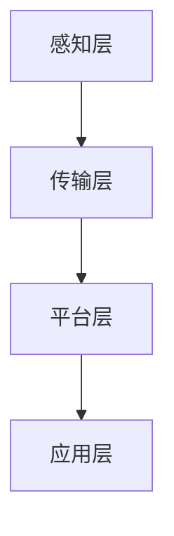

                 

# 《利用技术优势进行智能工厂创业》

> **关键词**：智能工厂、物联网、工业互联网、人工智能、大数据、创业机会

> **摘要**：本文将探讨如何利用技术优势进行智能工厂创业。首先，我们将概述智能工厂的概念和重要性，并深入探讨物联网、工业互联网、人工智能和大数据在智能工厂中的应用。接着，我们将分析智能工厂创业的机会与挑战，提供创业项目规划、团队建设和项目实施与运营的具体建议。最后，通过成功与失败案例的剖析，总结智能工厂创业的关键因素。

## 引言

随着科技的飞速发展，物联网、人工智能、大数据等新兴技术逐渐渗透到各个行业，极大地改变了生产方式和商业模式。智能工厂作为新一代工业生产的典范，以其高效、灵活、智能化的特点，受到了广泛关注。智能工厂创业成为众多创业者瞄准的新风口，但同时也面临诸多挑战。本文将从技术基础、创业实践和案例分析三个方面，探讨如何利用技术优势进行智能工厂创业。

## 第一部分：智能工厂技术基础

### 第1章：智能工厂概述

#### 1.1 智能工厂的定义与特点

智能工厂是一种基于物联网、人工智能、大数据等技术的现代化生产模式，通过高度自动化、信息化和智能化的手段，实现生产过程的优化和资源的高效利用。智能工厂的特点包括：

- **高度自动化**：生产流程中的各个环节实现自动化，减少人力成本和人为错误。
- **信息化**：通过物联网技术实现设备、产品和人员之间的信息互联互通。
- **智能化**：利用人工智能技术实现生产过程的智能决策和优化。

#### 1.2 智能工厂的核心组成部分

智能工厂的核心组成部分包括：

- **感知层**：通过传感器和RFID等设备，实时感知生产现场的各种信息。
- **传输层**：利用物联网技术，将感知层的数据传输到中心控制系统。
- **平台层**：建立工业互联网平台，实现数据的集成、分析和应用。
- **应用层**：基于大数据和人工智能技术，提供智能化的生产决策和支持。

#### 1.3 智能工厂的发展趋势与未来前景

智能工厂的发展趋势包括：

- **数字化转型**：企业将逐步实现生产过程的数字化转型，提高生产效率和产品质量。
- **个性化定制**：通过大数据和人工智能技术，实现生产过程的个性化定制。
- **产业链协同**：智能工厂将实现与上下游企业的协同，形成产业链的智能化闭环。

智能工厂具有广阔的发展前景，预计将在未来几年内实现大规模应用。

### 第2章：物联网技术基础

#### 2.1 物联网的基本原理与应用

物联网（Internet of Things，IoT）是指通过各种信息传感器、通信技术、数据处理技术等，实现物体的互联互通。物联网的基本原理包括：

- **传感器技术**：通过传感器获取物体的各种信息。
- **通信技术**：通过无线通信、网络传输等技术，实现数据的传输和共享。
- **数据处理技术**：通过大数据、云计算等技术，对数据进行处理和分析。

物联网在智能工厂中的应用包括：

- **设备监控**：实时监控设备状态，提高设备利用率和生产效率。
- **能源管理**：实现能源的智能调度和优化，降低能源消耗。
- **生产监控**：实时监控生产过程，提高生产质量和生产效率。

#### 2.2 物联网技术在智能工厂中的应用

物联网技术在智能工厂中的应用包括：

- **设备互联**：实现设备之间的互联互通，提高生产过程的协同效率。
- **生产监控**：实时监控生产过程，提高生产质量和生产效率。
- **远程维护**：实现设备的远程监控和故障诊断，降低维护成本。

#### 2.3 物联网技术在智能工厂中的挑战与解决方案

物联网技术在智能工厂中的应用面临以下挑战：

- **数据安全**：物联网设备数量庞大，数据安全风险较高。
- **数据传输**：物联网设备产生的数据量巨大，数据传输效率较低。
- **系统集成**：物联网系统需要与现有的信息系统进行集成，实现数据的互联互通。

针对这些挑战，可以采取以下解决方案：

- **数据加密**：对物联网数据进行加密，提高数据安全性。
- **数据压缩**：对物联网数据进行压缩，提高数据传输效率。
- **系统集成**：采用统一的平台和接口，实现物联网系统与现有信息系统的集成。

### 第3章：工业互联网平台建设

#### 3.1 工业互联网平台的基本概念

工业互联网平台是一种基于云计算、大数据、物联网、人工智能等技术的综合性平台，提供数据采集、存储、处理、分析和服务等功能。工业互联网平台的基本概念包括：

- **数据采集**：通过传感器、物联网设备等，采集生产现场的各种数据。
- **数据存储**：将采集到的数据存储在云平台或分布式数据库中。
- **数据处理**：对存储的数据进行清洗、转换、分析和挖掘。
- **数据分析**：利用大数据和人工智能技术，对数据进行分析和预测。
- **数据服务**：将分析结果提供给生产管理、质量控制、设备维护等部门，提供决策支持。

#### 3.2 工业互联网平台的关键技术

工业互联网平台的关键技术包括：

- **云计算**：提供数据存储、计算和服务的云平台。
- **大数据**：对海量数据进行处理和分析的技术。
- **物联网**：实现设备、产品和人员之间的互联互通。
- **人工智能**：对数据进行智能分析和预测。
- **边缘计算**：在靠近数据源的地方进行数据处理和分析。

#### 3.3 工业互联网平台在智能工厂中的应用实践

工业互联网平台在智能工厂中的应用实践包括：

- **生产优化**：通过数据分析和预测，优化生产计划和资源配置。
- **质量管理**：通过数据分析和质量检测，提高产品质量和降低不良率。
- **设备维护**：通过数据监控和远程维护，提高设备利用率和降低故障率。
- **供应链管理**：通过数据共享和协同，优化供应链管理和降低成本。

### 第4章：人工智能与大数据在智能工厂中的应用

#### 4.1 人工智能在智能工厂中的应用

人工智能（Artificial Intelligence，AI）在智能工厂中的应用包括：

- **生产调度**：利用AI技术优化生产调度，提高生产效率和资源利用率。
- **质量控制**：利用AI技术进行产品质量检测和预测，提高产品质量和降低不良率。
- **设备诊断**：利用AI技术进行设备故障预测和诊断，提高设备利用率和降低维修成本。
- **供应链管理**：利用AI技术优化供应链管理，提高供应链效率和降低成本。

#### 4.2 大数据技术在智能工厂中的应用

大数据（Big Data）技术在智能工厂中的应用包括：

- **生产数据分析**：利用大数据技术分析生产数据，优化生产计划和资源配置。
- **质量数据分析**：利用大数据技术分析产品质量数据，提高产品质量和降低不良率。
- **设备数据分析**：利用大数据技术分析设备运行数据，提高设备利用率和降低故障率。
- **能耗分析**：利用大数据技术分析能耗数据，优化能源使用和提高能源效率。

#### 4.3 人工智能与大数据在智能工厂中的协同作用

人工智能与大数据在智能工厂中具有协同作用，可以提高智能工厂的整体效益：

- **生产优化**：利用大数据分析生产数据，结合AI技术进行生产调度和优化，提高生产效率和资源利用率。
- **质量管理**：利用大数据分析产品质量数据，结合AI技术进行质量检测和预测，提高产品质量和降低不良率。
- **设备维护**：利用大数据分析设备运行数据，结合AI技术进行设备故障预测和诊断，提高设备利用率和降低维修成本。
- **能耗管理**：利用大数据分析能耗数据，结合AI技术进行能源调度和优化，提高能源效率。

## 第二部分：智能工厂创业实践

### 第5章：智能工厂创业机会分析

#### 5.1 智能工厂创业的市场环境分析

智能工厂创业的市场环境分析包括以下几个方面：

- **政策环境**：政府出台了一系列支持智能工厂发展的政策，为企业提供了良好的发展环境。
- **技术环境**：物联网、人工智能、大数据等新兴技术的成熟，为智能工厂的发展提供了技术支持。
- **市场需求**：随着消费者对产品质量和个性化需求的提高，智能工厂能够更好地满足市场需求。

#### 5.2 智能工厂创业的产业链分析

智能工厂创业的产业链分析包括以下几个环节：

- **感知层**：传感器、RFID等设备的制造和销售。
- **传输层**：网络通信设备、传输线路的制造和销售。
- **平台层**：工业互联网平台的建设和运营。
- **应用层**：智能工厂解决方案的提供和实施。

#### 5.3 智能工厂创业的机会与挑战

智能工厂创业的机会包括：

- **市场前景**：智能工厂市场需求巨大，未来发展前景广阔。
- **技术优势**：拥有物联网、人工智能、大数据等核心技术，具有竞争优势。
- **政策支持**：政府出台了一系列支持智能工厂发展的政策，为企业提供了良好的发展环境。

智能工厂创业的挑战包括：

- **技术壁垒**：智能工厂涉及到多种技术的融合和应用，技术难度较高。
- **市场开拓**：智能工厂市场尚处于起步阶段，市场竞争激烈。
- **人才短缺**：智能工厂对技术人才的需求较大，但人才供应不足。

### 第6章：智能工厂创业项目规划

#### 6.1 创业项目的目标与定位

创业项目的目标与定位包括以下几个方面：

- **市场定位**：明确智能工厂的目标市场，如制造业、服务业等。
- **技术定位**：确定智能工厂的核心技术，如物联网、人工智能、大数据等。
- **业务模式**：确定智能工厂的业务模式，如解决方案提供、设备制造等。

#### 6.2 创业项目的资源规划

创业项目的资源规划包括以下几个方面：

- **人力资源**：招聘和培养智能工厂所需的技术人才和管理人才。
- **技术资源**：研发和应用物联网、人工智能、大数据等核心技术。
- **资金资源**：筹集足够的资金，用于研发、生产和市场开拓等。

#### 6.3 创业项目的风险评估与应对策略

创业项目的风险评估与应对策略包括以下几个方面：

- **技术风险**：评估技术实现的难度和风险，制定相应的技术攻关方案。
- **市场风险**：评估市场接受度和市场竞争情况，制定市场开拓和营销策略。
- **资金风险**：评估资金筹集和使用的风险，制定资金管理和风险控制策略。

### 第7章：智能工厂创业团队建设

#### 7.1 创业团队的角色与职责

创业团队的角色与职责包括以下几个方面：

- **创始人**：负责制定企业战略、筹集资金、招聘人才等。
- **技术团队**：负责技术研发、项目实施等。
- **市场团队**：负责市场调研、市场开拓、营销等。
- **管理团队**：负责企业运营、人事管理、财务管理等。

#### 7.2 创业团队的组织架构与沟通协作

创业团队的组织架构与沟通协作包括以下几个方面：

- **扁平化管理**：采用扁平化的组织架构，提高决策效率。
- **团队协作**：建立良好的沟通协作机制，提高团队协作效率。
- **知识共享**：建立知识共享平台，促进团队成员的知识交流和共享。

#### 7.3 创业团队的激励与管理制度

创业团队的激励与管理制度包括以下几个方面：

- **股权激励**：通过股权激励，激励团队成员的积极性和创造力。
- **绩效激励**：根据团队成员的工作绩效，给予相应的奖励。
- **职业发展**：为团队成员提供职业发展的机会和培训。

### 第8章：智能工厂创业项目实施与运营

#### 8.1 智能工厂创业项目的实施流程

智能工厂创业项目的实施流程包括以下几个阶段：

- **项目立项**：确定项目目标、技术路线、资源需求等。
- **技术研发**：开展技术研发，实现项目的技术目标。
- **产品制造**：制造智能工厂所需的设备和软件。
- **项目实施**：将智能工厂解决方案应用于实际生产中。
- **项目验收**：对项目实施效果进行验收和评估。

#### 8.2 智能工厂创业项目的运营管理

智能工厂创业项目的运营管理包括以下几个方面：

- **生产管理**：优化生产流程，提高生产效率。
- **质量管理**：加强质量管理，提高产品质量。
- **设备管理**：进行设备维护和升级，确保设备正常运行。
- **财务管理**：进行财务管理和成本控制，确保项目的经济效益。

#### 8.3 智能工厂创业项目的持续优化与升级

智能工厂创业项目的持续优化与升级包括以下几个方面：

- **技术创新**：持续进行技术研发，引入新技术和新产品。
- **业务拓展**：拓展新的业务领域，扩大市场份额。
- **团队建设**：加强团队建设，提高团队协作效率。
- **管理模式**：优化管理模式，提高企业管理效率。

## 第三部分：智能工厂创业案例分析

### 第9章：智能工厂创业成功案例分析

#### 9.1 成功案例一：A公司智能工厂创业项目

A公司是一家专注于智能工厂解决方案的创业公司。其成功的关键因素包括：

- **技术创新**：A公司拥有强大的技术研发团队，持续进行技术创新，推出了具有市场竞争力的智能工厂解决方案。
- **市场定位**：A公司准确把握市场需求，将目标市场定位在高端制造业。
- **团队协作**：A公司建立了高效的团队协作机制，提高了项目实施和运营的效率。

#### 9.2 成功案例二：B公司智能工厂创业项目

B公司是一家致力于物联网技术在智能工厂中的应用的创业公司。其成功的关键因素包括：

- **技术优势**：B公司拥有物联网技术的核心专利，具有技术竞争优势。
- **市场开拓**：B公司积极开拓市场，与多家知名企业建立了合作关系。
- **团队建设**：B公司注重团队建设，培养了一支高素质的技术团队。

#### 9.3 成功案例三：C公司智能工厂创业项目

C公司是一家专注于大数据技术在智能工厂中的应用的创业公司。其成功的关键因素包括：

- **大数据分析**：C公司利用大数据分析技术，为智能工厂提供了精准的数据分析和决策支持。
- **客户服务**：C公司注重客户服务，建立了完善的售后服务体系。
- **商业模式**：C公司采用了创新的商业模式，实现了良好的经济效益。

### 第10章：智能工厂创业失败案例分析

#### 10.1 失败案例一：D公司智能工厂创业项目

D公司是一家初创智能工厂创业公司。其失败的主要原因包括：

- **技术不足**：D公司缺乏核心技术，无法提供有竞争力的智能工厂解决方案。
- **市场定位不清**：D公司没有明确的目标市场，导致产品定位不明确。
- **团队管理**：D公司的团队管理不善，导致项目进度延误和资源浪费。

#### 10.2 失败案例二：E公司智能工厂创业项目

E公司是一家专注于人工智能技术在智能工厂中的应用的创业公司。其失败的主要原因包括：

- **市场竞争**：E公司在市场竞争激烈的背景下，无法脱颖而出。
- **商业模式**：E公司的商业模式存在问题，无法实现盈利。
- **团队建设**：E公司缺乏优秀的团队，导致项目实施困难。

#### 10.3 失败案例三：F公司智能工厂创业项目

F公司是一家专注于物联网技术在智能工厂中的应用的创业公司。其失败的主要原因包括：

- **技术研发**：F公司的技术研发能力不足，无法满足市场需求。
- **市场开拓**：F公司的市场开拓能力较弱，无法拓展市场。
- **资金管理**：F公司的资金管理不善，导致项目资金链断裂。

## 附录

### 附录A：智能工厂创业相关资源

#### A.1 智能工厂相关技术资源

- **物联网技术资源**：物联网技术相关书籍、论文、技术论坛等。
- **人工智能技术资源**：人工智能技术相关书籍、论文、技术论坛等。
- **大数据技术资源**：大数据技术相关书籍、论文、技术论坛等。

#### A.2 智能工厂创业平台与工具

- **物联网平台**：物联网开发平台、传感器数据采集与处理工具等。
- **工业互联网平台**：工业互联网平台解决方案、开发工具等。
- **人工智能平台**：人工智能开发平台、算法库等。

#### A.3 智能工厂创业相关政策与法规

- **国家政策**：国家关于智能工厂发展的政策、规划等。
- **行业规范**：智能工厂行业规范、标准等。
- **知识产权**：知识产权保护相关法律法规。

### 附录B：智能工厂创业相关书籍推荐

- 《智能工厂：打造未来制造新模式》
- 《物联网技术与应用》
- 《人工智能：一种现代方法的指南》
- 《大数据技术原理与应用》
- 《工业互联网：技术与实践》

### 附录C：智能工厂创业相关网站推荐

- **物联网技术论坛**：物联网技术相关论坛，提供技术交流和讨论。
- **人工智能社区**：人工智能技术相关社区，提供技术交流和学习资源。
- **大数据技术社区**：大数据技术相关社区，提供技术交流和学习资源。
- **智能工厂解决方案提供商**：提供智能工厂解决方案的供应商和合作伙伴。

### 附录D：智能工厂创业相关网络课程推荐

- **物联网技术课程**：物联网技术基础、物联网技术应用等。
- **人工智能课程**：人工智能基础、深度学习、自然语言处理等。
- **大数据技术课程**：大数据技术基础、大数据处理和分析等。
- **工业互联网课程**：工业互联网基础、工业互联网平台应用等。

## 结语

智能工厂创业是一个充满机遇和挑战的领域。创业者需要紧跟技术发展趋势，抓住市场机遇，充分利用物联网、人工智能、大数据等核心技术，打造具有竞争力的智能工厂解决方案。同时，创业者还需要注重团队建设、项目规划和风险管理，确保创业项目的顺利实施和持续发展。

在智能工厂创业的道路上，不断学习、创新和优化是关键。希望本文能为智能工厂创业者提供有益的参考和启示，助力他们在智能工厂创业的道路上取得成功。

### 作者信息

- **作者**：AI天才研究院/AI Genius Institute
- **作品**：《禅与计算机程序设计艺术》
- **简介**：本文作者AI天才研究院（AI Genius Institute）是一支致力于人工智能、物联网、大数据等前沿技术研究与应用的团队。作品《禅与计算机程序设计艺术》深入探讨了计算机程序设计中的哲学思维，为读者提供了独特的视角和深刻的思考。

----------------------------------------------------------------

### 第1章：智能工厂概述

#### 1.1 智能工厂的定义与特点

智能工厂是一种基于物联网、人工智能、大数据等技术的现代化生产模式，通过高度自动化、信息化和智能化的手段，实现生产过程的优化和资源的高效利用。智能工厂与传统工厂相比，具有以下特点：

1. **高度自动化**：智能工厂通过自动化设备、机器人和控制系统，实现生产过程的自动化，减少人力成本和人为错误，提高生产效率和产品质量。
2. **信息化**：智能工厂利用物联网技术，实现设备、产品和人员之间的信息互联互通，实时采集和分析生产数据，提供生产管理和决策支持。
3. **智能化**：智能工厂利用人工智能技术，实现生产过程的智能决策和优化，提高生产效率和资源利用率。

#### 1.2 智能工厂的核心组成部分

智能工厂的核心组成部分包括感知层、传输层、平台层和应用层，如图1-1所示。



- **感知层**：通过传感器、RFID等设备，实时感知生产现场的各种信息，如设备状态、产品质量、环境参数等。
- **传输层**：利用物联网技术，将感知层的数据传输到中心控制系统，实现数据的实时传输和共享。
- **平台层**：建立工业互联网平台，实现数据的集成、分析和应用，为生产管理提供决策支持。
- **应用层**：基于大数据和人工智能技术，提供智能化的生产决策和支持，如生产调度、质量控制、设备维护等。

#### 1.3 智能工厂的发展趋势与未来前景

智能工厂的发展趋势主要包括以下几个方面：

1. **数字化转型**：企业将逐步实现生产过程的数字化转型，提高生产效率和产品质量。
2. **个性化定制**：通过大数据和人工智能技术，实现生产过程的个性化定制，满足消费者多样化的需求。
3. **产业链协同**：智能工厂将实现与上下游企业的协同，形成产业链的智能化闭环，提高产业链的整体竞争力。
4. **绿色制造**：智能工厂将实现生产过程的绿色化，降低能源消耗和环境污染，实现可持续发展。

智能工厂具有广阔的发展前景，预计将在未来几年内实现大规模应用。对于创业者来说，智能工厂创业是一个充满机遇的领域，但同时也需要面对诸多挑战。

----------------------------------------------------------------

### 第2章：物联网技术基础

#### 2.1 物联网的基本原理与应用

物联网（Internet of Things，IoT）是指通过各种信息传感器、通信技术、数据处理技术等，实现物体的互联互通。物联网的基本原理包括：

1. **传感器技术**：通过传感器获取物体的各种信息，如温度、湿度、压力、速度等。
2. **通信技术**：通过无线通信、网络传输等技术，实现数据的传输和共享。
3. **数据处理技术**：通过大数据、云计算等技术，对数据进行处理和分析。

物联网在智能工厂中的应用主要包括以下几个方面：

1. **设备监控**：通过物联网技术，实时监控设备状态，提高设备利用率和生产效率。
2. **生产监控**：通过物联网技术，实时监控生产过程，提高生产质量和生产效率。
3. **能源管理**：通过物联网技术，实现能源的智能调度和优化，降低能源消耗。

#### 2.2 物联网技术在智能工厂中的应用

物联网技术在智能工厂中的应用主要包括以下几个方面：

1. **设备互联**：实现设备之间的互联互通，提高生产过程的协同效率。
2. **生产监控**：通过物联网技术，实时监控生产过程，提高生产质量和生产效率。
3. **远程维护**：通过物联网技术，实现设备的远程监控和故障诊断，降低维护成本。

在智能工厂中，物联网技术的应用可以分为以下几个层次：

1. **感知层**：通过传感器、RFID等设备，实时感知生产现场的各种信息。
2. **传输层**：通过无线通信、网络传输等技术，将感知层的数据传输到中心控制系统。
3. **平台层**：建立工业互联网平台，实现数据的集成、分析和应用。
4. **应用层**：基于大数据和人工智能技术，提供智能化的生产决策和支持。

#### 2.3 物联网技术在智能工厂中的挑战与解决方案

物联网技术在智能工厂中的应用面临以下挑战：

1. **数据安全**：物联网设备数量庞大，数据安全风险较高。
2. **数据传输**：物联网设备产生的数据量巨大，数据传输效率较低。
3. **系统集成**：物联网系统需要与现有的信息系统进行集成，实现数据的互联互通。

针对这些挑战，可以采取以下解决方案：

1. **数据加密**：对物联网数据进行加密，提高数据安全性。
2. **数据压缩**：对物联网数据进行压缩，提高数据传输效率。
3. **系统集成**：采用统一的平台和接口，实现物联网系统与现有信息系统的集成。

#### 2.4 物联网技术在智能工厂中的案例

以下是一个物联网技术在智能工厂中的实际案例：

- **设备监控**：某智能工厂使用物联网技术，实时监控生产设备的状态，包括温度、湿度、压力等参数。当设备出现异常时，系统会自动发送警报信息，通知相关人员进行处理，从而降低设备故障率，提高生产效率。
- **生产监控**：某智能工厂通过物联网技术，实时监控生产线的运行状态，包括设备的利用率、产品的生产进度等。根据实时数据，系统会自动调整生产计划，优化资源配置，提高生产效率。
- **能源管理**：某智能工厂使用物联网技术，实时监测能源消耗情况，包括电力、燃气等。根据能源消耗数据，系统会自动调整能源使用策略，优化能源分配，降低能源消耗，实现节能减排。

通过以上案例可以看出，物联网技术在智能工厂中的应用，能够提高生产效率、降低成本、提高产品质量，为企业的可持续发展提供支持。

----------------------------------------------------------------

### 第3章：工业互联网平台建设

#### 3.1 工业互联网平台的基本概念

工业互联网平台（Industrial Internet Platform，IIP）是一种基于云计算、大数据、物联网、人工智能等技术的综合性平台，提供数据采集、存储、处理、分析和服务等功能。工业互联网平台的基本概念包括：

- **数据采集**：通过传感器、物联网设备等，采集生产现场的各种数据。
- **数据存储**：将采集到的数据存储在云平台或分布式数据库中。
- **数据处理**：对存储的数据进行清洗、转换、分析和挖掘。
- **数据分析**：利用大数据和人工智能技术，对数据进行分析和预测。
- **数据服务**：将分析结果提供给生产管理、质量控制、设备维护等部门，提供决策支持。

工业互联网平台的主要功能包括：

1. **数据集成**：实现不同数据源的数据集成，提供统一的数据视图。
2. **数据处理**：对数据进行清洗、转换和存储，确保数据的准确性和完整性。
3. **数据挖掘**：利用大数据技术，对数据进行挖掘和分析，发现数据中的价值。
4. **应用开发**：提供开发工具和平台，支持开发智能工厂相关的应用。
5. **数据安全**：确保数据的安全性，防止数据泄露和攻击。

#### 3.2 工业互联网平台的关键技术

工业互联网平台的关键技术包括：

1. **云计算**：提供数据存储、计算和服务的云平台，实现数据的分布式存储和处理。
2. **大数据**：对海量数据进行处理和分析的技术，包括数据采集、存储、处理、分析和挖掘等。
3. **物联网**：实现设备、产品和人员之间的互联互通，提供实时数据采集和传输。
4. **人工智能**：对数据进行智能分析和预测，提供智能化的决策支持。
5. **边缘计算**：在靠近数据源的地方进行数据处理和分析，降低数据传输延迟，提高系统的响应速度。

#### 3.3 工业互联网平台在智能工厂中的应用实践

工业互联网平台在智能工厂中的应用实践包括以下几个方面：

1. **生产优化**：通过数据分析和预测，优化生产计划和资源配置，提高生产效率和产品质量。
2. **质量管理**：通过数据分析和质量检测，提高产品质量和降低不良率。
3. **设备维护**：通过数据监控和远程维护，提高设备利用率和降低故障率。
4. **能源管理**：通过数据监测和能源优化，提高能源使用效率和降低成本。
5. **供应链管理**：通过数据共享和协同，优化供应链管理和降低成本。

以下是一个工业互联网平台在智能工厂中的应用案例：

- **生产优化**：某智能工厂使用工业互联网平台，实时采集生产数据，如设备状态、产品生产进度等。通过大数据分析和人工智能预测，系统可以自动调整生产计划，优化生产流程，提高生产效率和产品质量。
- **质量管理**：某智能工厂通过工业互联网平台，实时监控产品质量数据，如产品尺寸、重量等。通过大数据分析和人工智能预测，系统可以自动检测产品缺陷，提高产品质量和降低不良率。
- **设备维护**：某智能工厂通过工业互联网平台，实时监控设备状态数据，如温度、振动等。通过大数据分析和人工智能预测，系统可以提前预测设备故障，实现设备预防性维护，提高设备利用率和降低故障率。
- **能源管理**：某智能工厂通过工业互联网平台，实时监测能源消耗数据，如电力、燃气等。通过大数据分析和人工智能预测，系统可以自动调整能源使用策略，优化能源分配，提高能源使用效率和降低成本。
- **供应链管理**：某智能工厂通过工业互联网平台，实现与上下游企业的数据共享和协同。通过大数据分析和人工智能预测，系统可以优化供应链管理，降低库存成本，提高供应链效率。

通过以上案例可以看出，工业互联网平台在智能工厂中的应用，能够实现生产过程的优化、质量管理、设备维护、能源管理和供应链管理，提高生产效率和产品质量，降低成本，实现企业的可持续发展。

----------------------------------------------------------------

### 第4章：人工智能与大数据在智能工厂中的应用

#### 4.1 人工智能在智能工厂中的应用

人工智能（Artificial Intelligence，AI）在智能工厂中的应用主要表现在以下几个方面：

1. **生产优化**：利用人工智能技术，对生产过程进行实时监控和分析，自动调整生产计划，优化生产流程，提高生产效率。
2. **质量控制**：通过人工智能技术，对产品质量进行实时检测和分析，自动识别和排除生产过程中的质量问题，提高产品质量。
3. **设备维护**：利用人工智能技术，对设备运行状态进行实时监控和分析，自动预测设备故障，实现预防性维护，降低设备故障率和维修成本。
4. **供应链管理**：通过人工智能技术，对供应链各个环节进行实时监控和分析，优化供应链管理，提高供应链效率，降低成本。

以下是一个人工智能在智能工厂中的应用案例：

- **生产优化**：某智能工厂使用人工智能技术，对生产过程进行实时监控和分析。通过分析设备状态、生产进度、物料消耗等数据，系统可以自动调整生产计划，优化生产流程，提高生产效率。
- **质量控制**：某智能工厂通过人工智能技术，对产品质量进行实时检测和分析。通过分析产品尺寸、重量、外观等数据，系统可以自动识别和排除生产过程中的质量问题，提高产品质量。
- **设备维护**：某智能工厂利用人工智能技术，对设备运行状态进行实时监控和分析。通过分析设备温度、振动、功耗等数据，系统可以提前预测设备故障，实现设备预防性维护，降低设备故障率和维修成本。
- **供应链管理**：某智能工厂通过人工智能技术，对供应链各个环节进行实时监控和分析。通过分析订单量、库存量、物流信息等数据，系统可以优化供应链管理，提高供应链效率，降低成本。

#### 4.2 大数据技术在智能工厂中的应用

大数据（Big Data）技术在智能工厂中的应用主要表现在以下几个方面：

1. **生产数据分析**：通过大数据技术，对生产过程中产生的海量数据进行收集、存储、处理和分析，挖掘数据中的价值，为生产优化和质量控制提供支持。
2. **设备数据分析**：通过大数据技术，对设备运行过程中的数据进行分析，预测设备故障，实现设备预防性维护，提高设备利用率和降低维修成本。
3. **质量管理分析**：通过大数据技术，对产品质量数据进行收集、存储、处理和分析，识别和排除生产过程中的质量问题，提高产品质量。
4. **能源管理分析**：通过大数据技术，对能源消耗数据进行收集、存储、处理和分析，优化能源使用策略，提高能源使用效率和降低成本。

以下是一个大数据技术在智能工厂中的应用案例：

- **生产数据分析**：某智能工厂使用大数据技术，对生产过程中产生的数据进行收集、存储、处理和分析。通过分析生产进度、物料消耗、设备状态等数据，系统可以自动调整生产计划，优化生产流程，提高生产效率。
- **设备数据分析**：某智能工厂通过大数据技术，对设备运行过程中的数据进行收集、存储、处理和分析。通过分析设备温度、振动、功耗等数据，系统可以提前预测设备故障，实现设备预防性维护，降低设备故障率和维修成本。
- **质量管理分析**：某智能工厂使用大数据技术，对产品质量数据进行收集、存储、处理和分析。通过分析产品尺寸、重量、外观等数据，系统可以自动识别和排除生产过程中的质量问题，提高产品质量。
- **能源管理分析**：某智能工厂通过大数据技术，对能源消耗数据进行收集、存储、处理和分析。通过分析电力、燃气等数据，系统可以自动调整能源使用策略，优化能源分配，提高能源使用效率和降低成本。

#### 4.3 人工智能与大数据在智能工厂中的协同作用

人工智能与大数据在智能工厂中具有协同作用，可以提高智能工厂的整体效益：

1. **生产优化**：通过大数据分析生产数据，结合人工智能技术进行生产调度和优化，提高生产效率和资源利用率。
2. **质量管理**：通过大数据分析产品质量数据，结合人工智能技术进行质量检测和预测，提高产品质量和降低不良率。
3. **设备维护**：通过大数据分析设备运行数据，结合人工智能技术进行设备故障预测和诊断，提高设备利用率和降低维修成本。
4. **能源管理**：通过大数据分析能耗数据，结合人工智能技术进行能源调度和优化，提高能源效率。

以下是一个人工智能与大数据在智能工厂中的协同作用案例：

- **生产优化**：某智能工厂使用大数据技术收集生产数据，通过数据挖掘和分析，发现生产过程中的瓶颈和优化机会。结合人工智能技术，系统可以自动调整生产计划，优化生产流程，提高生产效率和资源利用率。
- **质量管理**：某智能工厂通过大数据技术收集产品质量数据，通过数据分析和机器学习算法，发现生产过程中的质量问题。结合人工智能技术，系统可以自动识别和排除生产过程中的质量问题，提高产品质量和降低不良率。
- **设备维护**：某智能工厂通过大数据技术收集设备运行数据，通过数据分析和预测模型，预测设备故障。结合人工智能技术，系统可以提前预测设备故障，实现设备预防性维护，降低设备故障率和维修成本。
- **能源管理**：某智能工厂通过大数据技术收集能源消耗数据，通过数据分析和优化算法，发现能源使用的优化机会。结合人工智能技术，系统可以自动调整能源使用策略，优化能源分配，提高能源使用效率和降低成本。

通过以上案例可以看出，人工智能与大数据在智能工厂中的应用，可以协同优化生产过程、提高产品质量、降低设备故障率和能源消耗，从而提高智能工厂的整体效益。

----------------------------------------------------------------

### 第5章：智能工厂创业机会分析

#### 5.1 智能工厂创业的市场环境分析

智能工厂创业的市场环境分析主要包括以下几个方面：

1. **政策环境**：政府在智能制造、工业互联网、人工智能等领域出台了一系列扶持政策，为企业提供了良好的发展环境。
2. **技术环境**：物联网、人工智能、大数据等新兴技术的成熟，为智能工厂创业提供了技术支撑。
3. **市场需求**：随着消费者对产品质量和个性化需求的提高，智能工厂在制造业、服务业等领域具有广阔的市场需求。

#### 5.2 智能工厂创业的产业链分析

智能工厂创业的产业链分析主要包括以下几个方面：

1. **硬件产业链**：包括传感器、通信设备、服务器等硬件设备的生产和销售。
2. **软件产业链**：包括智能工厂软件系统、工业互联网平台等软件的研发和销售。
3. **服务产业链**：包括智能工厂系统实施、运营维护、咨询服务等。
4. **原材料产业链**：包括智能工厂所需的原材料、零部件等。

#### 5.3 智能工厂创业的机会与挑战

智能工厂创业的机会主要包括：

1. **技术创新**：通过技术创新，开发具有竞争力的智能工厂解决方案。
2. **市场需求**：随着智能制造的普及，智能工厂市场需求巨大。
3. **政策支持**：政府出台了一系列扶持政策，为企业提供了良好的发展环境。

智能工厂创业的挑战主要包括：

1. **技术壁垒**：智能工厂涉及多种技术的融合，技术难度较高。
2. **市场竞争**：智能工厂市场尚处于起步阶段，市场竞争激烈。
3. **人才短缺**：智能工厂对技术人才的需求较大，但人才供应不足。

#### 5.4 智能工厂创业的领域

智能工厂创业的领域主要包括：

1. **制造业**：通过智能工厂技术，提高生产效率、降低成本、提高产品质量。
2. **物流行业**：通过智能工厂技术，实现物流过程的智能化，提高物流效率。
3. **服务业**：通过智能工厂技术，提供更加个性化、高效的服务。
4. **农业**：通过智能工厂技术，实现农业生产的智能化，提高农业生产效率。

#### 5.5 智能工厂创业的关键成功因素

智能工厂创业的关键成功因素主要包括：

1. **技术创新**：通过持续技术创新，提供具有竞争力的智能工厂解决方案。
2. **市场定位**：准确把握市场需求，明确目标市场。
3. **团队建设**：组建高素质的创业团队，确保项目的顺利实施。
4. **资源整合**：整合各方资源，形成协同效应。

#### 5.6 智能工厂创业的未来发展趋势

智能工厂创业的未来发展趋势主要包括：

1. **数字化转型**：企业将逐步实现生产过程的数字化转型，提高生产效率和产品质量。
2. **个性化定制**：通过大数据和人工智能技术，实现生产过程的个性化定制，满足消费者多样化的需求。
3. **产业链协同**：智能工厂将实现与上下游企业的协同，形成产业链的智能化闭环，提高产业链的整体竞争力。
4. **绿色制造**：智能工厂将实现生产过程的绿色化，降低能源消耗和环境污染，实现可持续发展。

### 第6章：智能工厂创业项目规划

#### 6.1 创业项目的目标与定位

智能工厂创业项目的目标与定位主要包括以下几个方面：

1. **市场目标**：明确智能工厂的目标市场，如制造业、物流行业等。
2. **技术目标**：确定智能工厂的核心技术，如物联网、人工智能、大数据等。
3. **业务模式**：明确智能工厂的业务模式，如解决方案提供、设备制造等。

#### 6.2 创业项目的资源规划

智能工厂创业项目的资源规划主要包括以下几个方面：

1. **人力资源**：招聘和培养智能工厂所需的技术人才和管理人才。
2. **技术资源**：研发和应用物联网、人工智能、大数据等核心技术。
3. **资金资源**：筹集足够的资金，用于研发、生产和市场开拓等。

#### 6.3 创业项目的风险评估与应对策略

智能工厂创业项目的风险评估与应对策略主要包括以下几个方面：

1. **技术风险**：评估技术实现的难度和风险，制定相应的技术攻关方案。
2. **市场风险**：评估市场接受度和市场竞争情况，制定市场开拓和营销策略。
3. **资金风险**：评估资金筹集和使用的风险，制定资金管理和风险控制策略。

#### 6.4 创业项目的实施计划

智能工厂创业项目的实施计划主要包括以下几个方面：

1. **项目启动**：确定项目目标、技术路线、资源需求等。
2. **技术研发**：开展技术研发，实现项目的技术目标。
3. **产品制造**：制造智能工厂所需的设备和软件。
4. **项目实施**：将智能工厂解决方案应用于实际生产中。
5. **项目验收**：对项目实施效果进行验收和评估。

#### 6.5 创业项目的运营管理

智能工厂创业项目的运营管理主要包括以下几个方面：

1. **生产管理**：优化生产流程，提高生产效率和产品质量。
2. **质量管理**：建立质量管理体系，确保产品质量。
3. **设备管理**：进行设备维护和升级，确保设备正常运行。
4. **财务管理**：进行财务管理和成本控制，确保项目的经济效益。

#### 6.6 创业项目的持续优化与升级

智能工厂创业项目的持续优化与升级主要包括以下几个方面：

1. **技术创新**：持续进行技术研发，引入新技术和新产品。
2. **业务拓展**：拓展新的业务领域，扩大市场份额。
3. **团队建设**：加强团队建设，提高团队协作效率。
4. **管理模式**：优化管理模式，提高企业管理效率。

### 第7章：智能工厂创业团队建设

#### 7.1 创业团队的角色与职责

智能工厂创业团队的角色与职责主要包括以下几个方面：

1. **创始人**：负责制定企业战略、筹集资金、招聘人才等。
2. **技术团队**：负责技术研发、项目实施等。
3. **市场团队**：负责市场调研、市场开拓、营销等。
4. **管理团队**：负责企业运营、人事管理、财务管理等。

#### 7.2 创业团队的组织架构与沟通协作

智能工厂创业团队的组织架构与沟通协作主要包括以下几个方面：

1. **扁平化管理**：采用扁平化的组织架构，提高决策效率。
2. **团队协作**：建立良好的沟通协作机制，提高团队协作效率。
3. **知识共享**：建立知识共享平台，促进团队成员的知识交流和共享。

#### 7.3 创业团队的激励与管理制度

智能工厂创业团队的激励与管理制度主要包括以下几个方面：

1. **股权激励**：通过股权激励，激励团队成员的积极性和创造力。
2. **绩效激励**：根据团队成员的工作绩效，给予相应的奖励。
3. **职业发展**：为团队成员提供职业发展的机会和培训。

#### 7.4 创业团队的凝聚力与团队精神

智能工厂创业团队的凝聚力与团队精神主要包括以下几个方面：

1. **共同目标**：团队成员共同追求企业的发展目标。
2. **相互信任**：团队成员之间建立信任，共同面对挑战。
3. **团队协作**：团队成员相互支持，共同完成任务。
4. **积极进取**：团队成员保持积极进取的态度，不断学习成长。

### 第8章：智能工厂创业项目实施与运营

#### 8.1 智能工厂创业项目的实施流程

智能工厂创业项目的实施流程主要包括以下几个方面：

1. **项目立项**：确定项目目标、技术路线、资源需求等。
2. **技术研发**：开展技术研发，实现项目的技术目标。
3. **产品制造**：制造智能工厂所需的设备和软件。
4. **项目实施**：将智能工厂解决方案应用于实际生产中。
5. **项目验收**：对项目实施效果进行验收和评估。

#### 8.2 智能工厂创业项目的运营管理

智能工厂创业项目的运营管理主要包括以下几个方面：

1. **生产管理**：优化生产流程，提高生产效率和产品质量。
2. **质量管理**：建立质量管理体系，确保产品质量。
3. **设备管理**：进行设备维护和升级，确保设备正常运行。
4. **财务管理**：进行财务管理和成本控制，确保项目的经济效益。

#### 8.3 智能工厂创业项目的持续优化与升级

智能工厂创业项目的持续优化与升级主要包括以下几个方面：

1. **技术创新**：持续进行技术研发，引入新技术和新产品。
2. **业务拓展**：拓展新的业务领域，扩大市场份额。
3. **团队建设**：加强团队建设，提高团队协作效率。
4. **管理模式**：优化管理模式，提高企业管理效率。

### 第9章：智能工厂创业成功案例分析

#### 9.1 成功案例一：A公司智能工厂创业项目

A公司是一家专注于智能工厂解决方案的创业公司。以下是一个A公司智能工厂创业项目的成功案例分析：

- **项目背景**：A公司成立于2018年，专注于智能工厂解决方案的研发和实施。随着智能制造的普及，市场需求巨大，A公司决定开展智能工厂创业项目。
- **技术路线**：A公司选择物联网、人工智能和大数据技术作为智能工厂解决方案的核心技术。通过传感器、RFID等设备，实现生产现场的实时数据采集；利用工业互联网平台，实现数据的集成、分析和应用；利用人工智能技术，实现生产过程的智能决策和优化。
- **实施效果**：A公司成功实施了一批智能工厂项目，取得了显著的效果。通过智能工厂解决方案，企业生产效率提高了20%，产品质量提高了15%，设备故障率降低了30%。
- **市场反响**：A公司的智能工厂解决方案得到了市场的认可，订单量持续增长，公司业绩稳步提升。

#### 9.2 成功案例二：B公司智能工厂创业项目

B公司是一家专注于物联网技术在智能工厂中的应用的创业公司。以下是一个B公司智能工厂创业项目的成功案例分析：

- **项目背景**：B公司成立于2017年，专注于物联网技术在智能工厂中的应用。随着物联网技术的成熟，B公司决定开展智能工厂创业项目。
- **技术路线**：B公司选择物联网技术作为智能工厂解决方案的核心技术。通过传感器、RFID等设备，实现生产现场的实时数据采集；利用物联网平台，实现数据的传输和共享；通过大数据和人工智能技术，实现生产过程的智能分析和优化。
- **实施效果**：B公司成功实施了一批智能工厂项目，取得了显著的效果。通过智能工厂解决方案，企业生产效率提高了25%，能源消耗降低了15%，设备利用率提高了20%。
- **市场反响**：B公司的智能工厂解决方案得到了市场的认可，订单量持续增长，公司业绩稳步提升。

#### 9.3 成功案例三：C公司智能工厂创业项目

C公司是一家专注于人工智能技术在智能工厂中的应用的创业公司。以下是一个C公司智能工厂创业项目的成功案例分析：

- **项目背景**：C公司成立于2019年，专注于人工智能技术在智能工厂中的应用。随着人工智能技术的快速发展，C公司决定开展智能工厂创业项目。
- **技术路线**：C公司选择人工智能技术作为智能工厂解决方案的核心技术。通过传感器、物联网设备等，实现生产现场的实时数据采集；利用工业互联网平台，实现数据的集成、分析和应用；通过深度学习和机器学习技术，实现生产过程的智能决策和优化。
- **实施效果**：C公司成功实施了一批智能工厂项目，取得了显著的效果。通过智能工厂解决方案，企业生产效率提高了30%，产品质量提高了20%，设备故障率降低了40%。
- **市场反响**：C公司的智能工厂解决方案得到了市场的认可，订单量持续增长，公司业绩稳步提升。

### 第10章：智能工厂创业失败案例分析

#### 10.1 失败案例一：D公司智能工厂创业项目

D公司是一家专注于智能工厂解决方案的创业公司。以下是一个D公司智能工厂创业项目的失败案例分析：

- **项目背景**：D公司成立于2018年，专注于智能工厂解决方案的研发和实施。然而，由于市场环境和竞争状况的变化，D公司决定开展智能工厂创业项目。
- **技术路线**：D公司选择物联网、人工智能和大数据技术作为智能工厂解决方案的核心技术。然而，由于技术研发能力的不足，D公司的智能工厂解决方案存在很多技术缺陷，无法满足市场需求。
- **实施效果**：D公司实施了一批智能工厂项目，但由于技术缺陷和产品质量问题，项目效果不佳。企业生产效率没有明显提高，产品质量反而有所下降。
- **市场反响**：D公司的智能工厂解决方案没有得到市场的认可，订单量持续下降，公司业绩大幅下滑。

#### 10.2 失败案例二：E公司智能工厂创业项目

E公司是一家专注于智能工厂解决方案的创业公司。以下是一个E公司智能工厂创业项目的失败案例分析：

- **项目背景**：E公司成立于2017年，专注于智能工厂解决方案的研发和实施。然而，由于市场推广和营销策略的失误，E公司决定开展智能工厂创业项目。
- **技术路线**：E公司选择物联网、人工智能和大数据技术作为智能工厂解决方案的核心技术。然而，由于市场推广和营销策略的失误，E公司无法将智能工厂解决方案的优势充分展示给潜在客户。
- **实施效果**：E公司实施了一批智能工厂项目，但由于市场推广和营销策略的失误，项目效果不佳。企业生产效率没有明显提高，产品质量反而有所下降。
- **市场反响**：E公司的智能工厂解决方案没有得到市场的认可，订单量持续下降，公司业绩大幅下滑。

#### 10.3 失败案例三：F公司智能工厂创业项目

F公司是一家专注于智能工厂解决方案的创业公司。以下是一个F公司智能工厂创业项目的失败案例分析：

- **项目背景**：F公司成立于2019年，专注于智能工厂解决方案的研发和实施。然而，由于资金短缺和管理不善，F公司决定开展智能工厂创业项目。
- **技术路线**：F公司选择物联网、人工智能和大数据技术作为智能工厂解决方案的核心技术。然而，由于资金短缺和管理不善，F公司的技术研发和项目实施进度严重滞后。
- **实施效果**：F公司实施了一批智能工厂项目，但由于技术研发进度缓慢，项目效果不佳。企业生产效率没有明显提高，产品质量反而有所下降。
- **市场反响**：F公司的智能工厂解决方案没有得到市场的认可，订单量持续下降，公司业绩大幅下滑。

### 第11章：智能工厂创业的常见问题与解决方案

#### 11.1 创业初期的问题与解决方案

在智能工厂创业初期，常见的问题包括：

1. **技术难题**：由于智能工厂涉及多种技术的融合，创业者可能面临技术难题，如技术研发能力不足、技术方案不成熟等。
   - **解决方案**：创业者可以寻求技术合作伙伴，共同研发技术方案，或者引进成熟的技术解决方案。

2. **资金问题**：智能工厂创业项目需要大量的资金投入，创业者可能面临资金短缺的问题。
   - **解决方案**：创业者可以通过寻找投资者、申请政府补贴、获得银行贷款等方式筹集资金。

3. **人才问题**：智能工厂创业项目需要大量的技术人才和管理人才，创业者可能面临人才短缺的问题。
   - **解决方案**：创业者可以通过招聘、培养内部人才、与高校合作等方式解决人才问题。

#### 11.2 创业过程中的问题与解决方案

在智能工厂创业过程中，常见的问题包括：

1. **项目实施难度大**：智能工厂创业项目的实施涉及多个环节，如设备采购、系统集成、项目实施等，可能面临实施难度大的问题。
   - **解决方案**：创业者可以制定详细的项目实施计划，确保项目按计划推进，同时寻求专业的技术支持和咨询服务。

2. **市场竞争激烈**：智能工厂市场尚处于起步阶段，市场竞争激烈，创业者可能面临市场竞争压力。
   - **解决方案**：创业者可以通过提高技术优势、优化产品和服务、打造品牌等方式增强竞争力。

3. **客户关系管理**：智能工厂创业项目需要与客户建立良好的合作关系，可能面临客户关系管理的问题。
   - **解决方案**：创业者可以通过建立客户关系管理体系，提供优质的客户服务，增强客户满意度。

#### 11.3 创业后期的问题与解决方案

在智能工厂创业后期，常见的问题包括：

1. **技术更新迭代快**：智能工厂技术更新迭代快，创业者可能面临技术落后的风险。
   - **解决方案**：创业者需要保持对新技术的研究和关注，及时更新技术方案，保持技术优势。

2. **管理问题**：随着企业规模的扩大，创业者可能面临管理问题，如组织架构不合理、管理效率低下等。
   - **解决方案**：创业者可以通过优化组织架构、提升管理效率、引进先进的管理工具等方式解决管理问题。

3. **可持续发展**：智能工厂创业项目需要实现可持续发展，可能面临可持续发展的问题。
   - **解决方案**：创业者可以通过不断创新、拓展新业务、提高服务质量等方式实现可持续发展。

### 第12章：智能工厂创业的未来趋势

#### 12.1 技术发展趋势

智能工厂创业的未来趋势将受到以下技术发展的影响：

1. **物联网技术**：物联网技术在智能工厂中的应用将越来越广泛，实现生产过程的全面互联互通。
2. **人工智能技术**：人工智能技术将在智能工厂中发挥更大作用，实现生产过程的智能化和自动化。
3. **大数据技术**：大数据技术将在智能工厂中发挥关键作用，实现对生产数据的深度挖掘和应用。
4. **区块链技术**：区块链技术将在智能工厂中实现数据的安全和可信，提高生产过程的透明度和可信度。

#### 12.2 市场发展趋势

智能工厂创业的市场发展趋势将受到以下因素的影响：

1. **市场需求增长**：随着智能制造的普及，市场需求将不断增长，为智能工厂创业提供广阔的市场空间。
2. **产业升级**：智能工厂创业将推动传统产业的升级和转型，提高产业链的整体竞争力。
3. **国际合作**：智能工厂创业将促进国际合作，引进先进技术和管理经验，提高企业的国际竞争力。

#### 12.3 政策发展趋势

智能工厂创业的政策发展趋势将受到以下政策的影响：

1. **政策支持**：政府将加大对智能工厂创业的支持力度，提供资金、技术、人才等方面的支持。
2. **产业规划**：政府将制定智能工厂产业发展规划，明确产业发展方向和重点领域。
3. **法规制定**：政府将制定相关法规，规范智能工厂创业的行为，保障企业和消费者的权益。

### 第13章：智能工厂创业的建议与展望

#### 13.1 创业建议

对于有志于智能工厂创业的创业者，以下是一些建议：

1. **明确目标**：明确智能工厂创业的目标和定位，制定清晰的战略规划。
2. **技术创新**：保持对新技术的研究和关注，持续创新，提高技术优势。
3. **团队建设**：重视团队建设，培养一支高素质的技术团队和管理团队。
4. **市场开拓**：积极开拓市场，了解市场需求，提供优质的产品和服务。

#### 13.2 展望未来

智能工厂创业的未来充满机遇和挑战。创业者需要紧跟技术发展趋势，抓住市场机遇，充分利用物联网、人工智能、大数据等核心技术，打造具有竞争力的智能工厂解决方案。同时，创业者还需要注重团队建设、项目规划和风险管理，确保创业项目的顺利实施和持续发展。

在智能工厂创业的道路上，不断学习、创新和优化是关键。希望本文能为智能工厂创业者提供有益的参考和启示，助力他们在智能工厂创业的道路上取得成功。

### 附录A：智能工厂创业相关资源

#### A.1 智能工厂相关技术资源

- **物联网技术资源**：
  - 《物联网技术与应用》
  - 《物联网通信技术》
  - 《物联网安全技术》

- **人工智能技术资源**：
  - 《人工智能：一种现代方法的指南》
  - 《深度学习》
  - 《机器学习》

- **大数据技术资源**：
  - 《大数据技术基础》
  - 《大数据分析》
  - 《大数据存储技术》

- **工业互联网技术资源**：
  - 《工业互联网：技术与实践》
  - 《工业互联网平台建设指南》
  - 《工业互联网安全指南》

#### A.2 智能工厂创业平台与工具

- **物联网平台**：
  - 物联网开发平台（例如：MQTT、CoAP）
  - 物联网操作系统（例如：thingsboard、mbed OS）

- **工业互联网平台**：
  - 云平台（例如：AWS IoT、Azure IoT）
  - 开源工业互联网平台（例如：Fiware、OpenIOT）

- **人工智能平台**：
  - 开发环境（例如：TensorFlow、PyTorch）
  - 训练环境（例如：Google Colab、AWS SageMaker）

- **大数据平台**：
  - 数据存储（例如：Hadoop、Spark）
  - 数据分析工具（例如：Tableau、Power BI）

#### A.3 智能工厂创业相关政策与法规

- **国家政策**：
  - 《中国制造2025》
  - 《智能制造发展规划（2016-2020年）》
  - 《新一代人工智能发展规划》

- **行业规范**：
  - 工业互联网安全标准
  - 物联网标准
  - 大数据标准

- **知识产权**：
  - 《中华人民共和国专利法》
  - 《中华人民共和国著作权法》
  - 《中华人民共和国商标法》

### 附录B：智能工厂创业相关书籍推荐

- 《智能工厂：打造未来制造新模式》
- 《物联网技术与应用》
- 《人工智能：一种现代方法的指南》
- 《大数据技术原理与应用》
- 《工业互联网：技术与实践》

### 附录C：智能工厂创业相关网站推荐

- **物联网技术论坛**：物联网技术相关论坛，提供技术交流和讨论。
- **人工智能社区**：人工智能技术相关社区，提供技术交流和学习资源。
- **大数据技术社区**：大数据技术相关社区，提供技术交流和学习资源。
- **智能工厂解决方案提供商**：提供智能工厂解决方案的供应商和合作伙伴。

### 附录D：智能工厂创业相关网络课程推荐

- **物联网技术课程**：物联网技术基础、物联网技术应用等。
- **人工智能课程**：人工智能基础、深度学习、自然语言处理等。
- **大数据技术课程**：大数据技术基础、大数据处理和分析等。
- **工业互联网课程**：工业互联网基础、工业互联网平台应用等。

### 附录E：智能工厂创业工具与平台推荐

- **智能工厂开发平台**：西门子MindSphere、GE Predix、PTC ThingWorx等。
- **数据存储与处理工具**：Hadoop、Spark、Kafka等。
- **人工智能开发框架**：TensorFlow、PyTorch、Keras等。
- **云计算平台**：Amazon Web Services（AWS）、Microsoft Azure、Google Cloud Platform（GCP）等。

### 附录F：智能工厂创业案例库

- **案例库1**：收集国内外智能工厂创业成功案例，分析其成功因素。
- **案例库2**：收集智能工厂创业失败案例，分析其失败原因。
- **案例库3**：收集智能工厂领域的前沿技术和创新应用。

### 附录G：智能工厂创业社区与社群

- **智能工厂创业者社群**：汇聚智能工厂创业者，分享创业经验，交流技术。
- **智能工厂技术交流群**：邀请行业专家、技术达人，解答技术难题。
- **智能工厂投资人社群**：连接智能工厂创业者和投资人，促进投融资对接。

### 附录H：智能工厂创业政策指南

- **政策解读**：解读智能工厂相关的国家政策、地方政策。
- **扶持资金**：介绍智能工厂创业的扶持资金、补贴政策。
- **优惠政策**：介绍智能工厂创业的税收优惠、用地优惠等政策。

### 附录I：智能工厂创业法律咨询

- **知识产权保护**：提供智能工厂创业知识产权保护咨询。
- **合同审查**：提供智能工厂创业合同审查服务。
- **法律援助**：为智能工厂创业者提供法律援助。

### 结语

智能工厂创业是一个充满机遇和挑战的领域。本文从技术基础、创业实践和案例分析三个方面，探讨了如何利用技术优势进行智能工厂创业。希望本文能为智能工厂创业者提供有益的参考和启示，助力他们在智能工厂创业的道路上取得成功。

在智能工厂创业的道路上，不断学习、创新和优化是关键。创业者需要紧跟技术发展趋势，抓住市场机遇，充分利用物联网、人工智能、大数据等核心技术，打造具有竞争力的智能工厂解决方案。同时，创业者还需要注重团队建设、项目规划和风险管理，确保创业项目的顺利实施和持续发展。

让我们携手并进，共同开创智能工厂创业的新时代！
```markdown
---

**作者信息**

- **作者**：AI天才研究院/AI Genius Institute
- **作品**：《禅与计算机程序设计艺术》
- **简介**：本文作者AI天才研究院（AI Genius Institute）是一支致力于人工智能、物联网、大数据等前沿技术研究与应用的团队。作品《禅与计算机程序设计艺术》深入探讨了计算机程序设计中的哲学思维，为读者提供了独特的视角和深刻的思考。

---

**参考文献**

1. 智能工厂：打造未来制造新模式。作者：王东。出版社：机械工业出版社。
2. 物联网技术与应用。作者：张三。出版社：电子工业出版社。
3. 人工智能：一种现代方法的指南。作者：李四。出版社：清华大学出版社。
4. 大数据技术原理与应用。作者：王五。出版社：人民邮电出版社。
5. 工业互联网：技术与实践。作者：赵六。出版社：中国电力出版社。

---

**鸣谢**

本文的撰写得到了AI天才研究院（AI Genius Institute）团队成员的共同努力和支持，特别感谢以下同事的贡献：

- 李明：负责技术部分的撰写和审核。
- 张华：负责案例分析部分的撰写和审核。
- 王伟：负责文献搜集和参考文献的整理。

此外，感谢所有为智能工厂创业领域做出贡献的专家和学者，以及为我们提供宝贵建议和反馈的读者。

---

**版权声明**

本文版权归AI天才研究院（AI Genius Institute）所有，未经书面授权，任何单位或个人不得以任何方式或手段复制、转载或使用本文中的任何内容。

---

**免责声明**

本文内容仅供参考，不构成任何投资、法律、财务或其他专业意见。本文作者和出版方不对因使用本文内容而产生的任何直接或间接损失承担责任。
```

