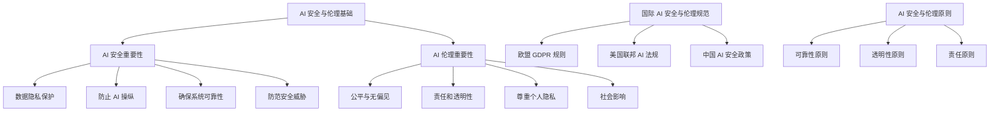
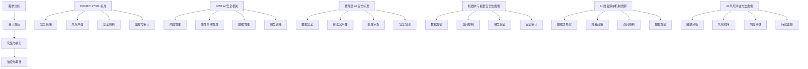
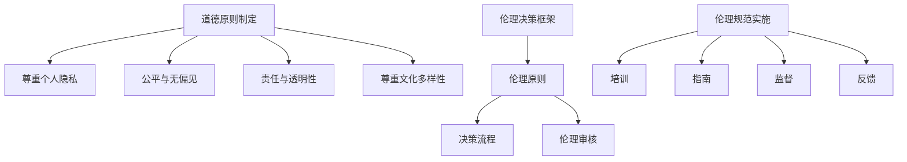

                 

### 《制定 AI 安全规范和伦理准则：规范 AI 技术应用》

> **关键词：** AI 安全、AI 伦理、规范、技术应用、隐私保护、偏见、风险评估、社会责任

> **摘要：** 本文旨在深入探讨制定 AI 安全规范和伦理准则的重要性。我们将分析 AI 安全和伦理的基本概念、挑战和核心原则，详细介绍国际 AI 安全与伦理规范。此外，本文还将探讨 AI 安全规范的制定流程、AI 伦理准则的制定流程以及 AI 安全和伦理在实际应用中的具体实践。最后，我们将展望 AI 安全和伦理的未来发展趋势，并总结相关资源和工具。

### 目录大纲

#### 第一部分：AI 安全和伦理基础知识

- **1.1 AI 安全与伦理的重要性**
  - 1.1.1 AI 安全的重要性
  - 1.1.2 AI 伦理的重要性

- **1.2 AI 安全与伦理的挑战**
  - 1.2.1 数据隐私问题
  - 1.2.2 AI 操纵和偏见
  - 1.2.3 AI 对就业的影响

- **1.3 AI 安全与伦理的核心原则**
  - 1.3.1 可靠性原则
  - 1.3.2 透明性原则
  - 1.3.3 责任原则

- **1.4 国际 AI 安全与伦理规范**
  - 1.4.1 欧盟 GDPR 规则
  - 1.4.2 美国联邦 AI 法规
  - 1.4.3 中国 AI 安全政策

- **1.5 AI 安全与伦理的 Mermaid 流程图**

#### 第二部分：AI 安全规范制定

- **2.1 AI 安全规范制定流程**
  - 2.1.1 需求分析
  - 2.1.2 设计规范
  - 2.1.3 实施与执行
  - 2.1.4 监控与审计

- **2.2 AI 安全标准与框架**
  - 2.2.1 ISO/IEC 27001 标准
  - 2.2.2 NIST AI 安全框架
  - 2.2.3 教育部 AI 安全标准

- **2.3 AI 安全规范案例研究**
  - 2.3.1 机器学习模型安全性
  - 2.3.2 AI 隐私保护机制
  - 2.3.3 AI 风险评估方法

- **2.4 AI 安全规范的 Mermaid 流程图**

#### 第三部分：AI 伦理准则制定

- **3.1 AI 伦理准则制定流程**
  - 3.1.1 道德原则制定
  - 3.1.2 伦理决策框架
  - 3.1.3 伦理规范实施

- **3.2 AI 伦理准则的核心原则**
  - 3.2.1 尊重个人隐私
  - 3.2.2 公平与无偏见
  - 3.2.3 责任与透明性
  - 3.2.4 尊重文化多样性

- **3.3 AI 伦理准则案例研究**
  - 3.3.1 健康医疗领域的 AI 伦理
  - 3.3.2 金融行业的 AI 伦理
  - 3.3.3 教育领域的 AI 伦理

- **3.4 AI 伦理准则的 Mermaid 流程图**

#### 第四部分：AI 安全和伦理的实践应用

- **4.1 AI 安全与伦理在企业中的应用**
  - 4.1.1 企业 AI 安全与伦理策略
  - 4.1.2 企业 AI 安全与伦理培训
  - 4.1.3 企业 AI 安全与伦理审计

- **4.2 AI 安全与伦理在政府与公共部门中的应用**
  - 4.2.1 政府 AI 安全与伦理管理
  - 4.2.2 公共部门的 AI 伦理审查
  - 4.2.3 社会治理中的 AI 伦理问题

- **4.3 AI 安全与伦理在学术界中的应用**
  - 4.3.1 学术研究中的 AI 伦理问题
  - 4.3.2 学术出版的 AI 伦理
  - 4.3.3 学术会议中的 AI 伦理讨论

- **4.4 AI 安全与伦理的案例分析**
  - 4.4.1 广泛应用的 AI 产品安全案例
  - 4.4.2 AI 伦理争议案例分析
  - 4.4.3 AI 安全与伦理改进实例

#### 第五部分：AI 安全和伦理的未来展望

- **5.1 AI 安全与伦理发展趋势**
  - 5.1.1 全球 AI 安全与伦理法规趋势
  - 5.1.2 人工智能技术的未来挑战
  - 5.1.3 AI 安全与伦理的未来研究方向

- **5.2 AI 安全与伦理教育**
  - 5.2.1 教育体系中的 AI 安全与伦理教育
  - 5.2.2 AI 安全与伦理的培训与认证
  - 5.2.3 AI 安全与伦理研究与创新

- **5.3 AI 安全与伦理的社会责任**
  - 5.3.1 企业在 AI 安全与伦理方面的社会责任
  - 5.3.2 社会组织在 AI 安全与伦理中的作用
  - 5.3.3 公众参与 AI 安全与伦理讨论

#### 附录

- **附录 A：AI 安全与伦理相关资源**
  - **附录 B：AI 安全与伦理工具与平台**### 第一部分：AI 安全和伦理基础知识

#### 1.1 AI 安全与伦理的重要性

##### 1.1.1 AI 安全的重要性

随着人工智能（AI）技术的快速发展，其在各个领域的应用也越来越广泛。然而，随之而来的是一系列安全和伦理问题。AI 安全的重要性主要体现在以下几个方面：

1. **保护用户隐私**：AI 系统通常需要大量的用户数据来训练和优化模型。如果这些数据泄露，可能会导致用户的隐私受到侵犯，甚至引发严重的后果。

2. **防止 AI 操纵**：恶意攻击者可能会利用 AI 技术进行操纵，例如，通过深度伪造技术伪造视频或音频，从而误导公众。

3. **确保系统可靠性**：AI 系统需要具备高可靠性和鲁棒性，以避免因故障或错误导致严重后果，如自动驾驶汽车的失控。

4. **防范安全威胁**：随着 AI 技术的普及，网络攻击者可能会利用 AI 系统的漏洞进行攻击，如利用 AI 生成伪造的网络安全警报。

##### 1.1.2 AI 伦理的重要性

AI 伦理是指关于 AI 技术在开发、部署和使用过程中应当遵循的道德原则和规范。AI 伦理的重要性体现在以下几个方面：

1. **公平与无偏见**：AI 系统在决策过程中可能存在偏见，这可能会导致不公平的结果，如歧视性算法。

2. **责任和透明性**：AI 系统的决策过程通常是不透明的，这可能导致责任难以追溯。因此，确保 AI 系统的透明性和责任性至关重要。

3. **尊重个人隐私**：AI 技术的广泛应用可能会侵犯个人隐私，因此，在开发和部署 AI 系统时，必须保护个人隐私。

4. **社会影响**：AI 技术的快速发展可能对社会产生深远影响，如就业变化、隐私侵犯等。因此，在制定 AI 规范和伦理准则时，需要充分考虑社会影响。

#### 1.2 AI 安全与伦理的挑战

##### 1.2.1 数据隐私问题

随着 AI 技术的广泛应用，对数据的依赖性也越来越高。然而，数据隐私问题也随之而来：

1. **数据收集和处理**：在收集和处理数据时，需要确保用户隐私不受侵犯。

2. **数据泄露**：如果数据泄露，可能会导致用户隐私受到侵犯，甚至引发严重的后果。

3. **跨境数据传输**：在全球化的背景下，跨境数据传输可能涉及不同国家的数据隐私法规，这增加了数据隐私保护难度。

##### 1.2.2 AI 操纵和偏见

AI 操纵和偏见是 AI 安全和伦理领域的重要挑战：

1. **操纵**：恶意攻击者可能会利用 AI 系统的弱点进行操纵，如利用深度伪造技术伪造视频或音频。

2. **偏见**：AI 系统在决策过程中可能存在偏见，这可能会导致不公平的结果。例如，某些算法可能对某些群体存在偏见，导致歧视。

##### 1.2.3 AI 对就业的影响

AI 技术的快速发展可能会对就业产生深远影响：

1. **自动化替代**：许多传统的就业岗位可能会被自动化替代，导致失业率上升。

2. **技能需求变化**：随着 AI 技术的普及，对某些技能的需求可能会减少，而对其他技能的需求可能会增加。

3. **就业结构变化**：AI 技术可能会改变就业结构，导致就业市场的不稳定。

#### 1.3 AI 安全与伦理的核心原则

##### 1.3.1 可靠性原则

可靠性原则是指 AI 系统在设计和开发过程中应当遵循的原则，以确保系统的稳定性和可靠性：

1. **系统稳定**：确保 AI 系统在各种环境下都能稳定运行。

2. **故障处理**：在系统出现故障时，能够快速响应并恢复正常运行。

3. **性能优化**：持续优化 AI 系统的性能，以提高系统的可靠性和效率。

##### 1.3.2 透明性原则

透明性原则是指 AI 系统的决策过程应当是可解释和可追溯的：

1. **可解释性**：确保 AI 系统的决策过程是可解释的，以便用户了解决策背后的原因。

2. **可追溯性**：确保 AI 系统的决策过程是可追溯的，以便在出现问题时能够进行调查和修复。

##### 1.3.3 责任原则

责任原则是指 AI 系统的开发者、部署者和使用者应当承担的责任：

1. **开发者责任**：确保 AI 系统的质量和安全性，遵循相关法规和伦理准则。

2. **部署者责任**：确保 AI 系统在部署过程中遵循最佳实践，确保系统的可靠性和透明性。

3. **使用者责任**：确保合理使用 AI 系统，避免滥用和误用。

#### 1.4 国际 AI 安全与伦理规范

##### 1.4.1 欧盟 GDPR 规则

欧盟 GDPR（通用数据保护条例）是国际上最具影响力的数据隐私法规之一。它对 AI 技术的数据隐私保护提出了严格的要求：

1. **数据收集和处理**：在收集和处理数据时，必须获得用户的明确同意。

2. **数据保护**：必须采取适当的技术和组织措施，确保数据的安全性和保密性。

3. **数据可移植性**：用户有权要求获取其数据，并能够将其转移到其他服务提供商。

##### 1.4.2 美国联邦 AI 法规

美国联邦 AI 法规主要包括联邦航空管理局（FAA）和联邦铁路管理局（FRA）等机构发布的指南和标准。这些法规主要关注 AI 技术在航空和铁路等关键领域的应用：

1. **安全性评估**：在部署 AI 系统前，必须进行充分的安全性评估。

2. **可靠性要求**：AI 系统必须满足高可靠性的要求，以确保系统的稳定性和安全性。

3. **透明性要求**：AI 系统的决策过程必须具备透明性，以便监管机构进行审查。

##### 1.4.3 中国 AI 安全政策

中国 AI 安全政策主要包括《新一代人工智能发展规划》和《人工智能安全管理办法》等文件。这些政策旨在推动 AI 技术的健康发展，并确保其安全性和伦理性：

1. **数据安全**：加强对数据安全的监管，确保数据不被滥用。

2. **算法公平性**：推动算法公平性的研究，防止算法偏见和不公平现象。

3. **伦理审查**：在 AI 技术的开发和应用过程中，必须进行伦理审查，确保其符合伦理规范。

#### 1.5 AI 安全与伦理的 Mermaid 流程图

### 第二部分：AI 安全规范制定

#### 2.1 AI 安全规范制定流程

##### 2.1.1 需求分析

在制定 AI 安全规范时，首先需要进行分析需求。需求分析的主要目标是确定 AI 系统的安全需求，包括以下几个方面：

1. **安全目标**：明确 AI 系统需要保护的安全目标，如用户隐私、系统可靠性、防范操纵等。

2. **安全威胁**：识别可能对 AI 系统构成威胁的因素，如数据泄露、AI 操纵、恶意攻击等。

3. **安全需求**：基于安全目标和安全威胁，制定具体的安全需求，如数据加密、访问控制、安全审计等。

##### 2.1.2 设计规范

在需求分析的基础上，设计 AI 安全规范。设计规范的主要目标是制定具体的 AI 安全措施和策略，包括以下几个方面：

1. **安全策略**：制定 AI 系统的安全策略，如数据保护策略、访问控制策略、安全审计策略等。

2. **安全架构**：设计 AI 系统的安全架构，如网络安全架构、数据保护架构、安全监控架构等。

3. **安全措施**：制定具体的 AI 安全措施，如数据加密、访问控制、入侵检测、安全审计等。

##### 2.1.3 实施与执行

在制定 AI 安全规范后，需要将其落实到实际操作中。实施与执行的主要目标是确保 AI 安全规范得到有效执行，包括以下几个方面：

1. **培训**：对 AI 系统的相关人员进行安全培训，确保他们了解和掌握 AI 安全规范。

2. **部署**：将 AI 安全规范部署到实际操作中，确保 AI 系统按照规范运行。

3. **监控**：实时监控 AI 系统的安全状态，及时发现和应对安全事件。

##### 2.1.4 监控与审计

在 AI 安全规范实施后，需要定期进行监控与审计，确保 AI 系统的安全性和合规性。监控与审计的主要目标是：

1. **安全监控**：实时监控 AI 系统的安全状态，及时发现和应对安全事件。

2. **审计**：定期审计 AI 系统的安全措施和运行情况，确保其符合安全规范。

3. **改进**：根据监控和审计结果，不断改进 AI 安全规范和措施，提高系统的安全性。

#### 2.2 AI 安全标准与框架

##### 2.2.1 ISO/IEC 27001 标准

ISO/IEC 27001 是国际标准化组织（ISO）和国际电工委员会（IEC）共同发布的网络安全管理标准。该标准主要包括以下几个方面：

1. **安全策略**：明确组织的安全目标和安全策略，确保安全措施的执行。

2. **风险评估**：定期进行风险评估，识别和应对潜在的安全威胁。

3. **安全控制**：制定和实施安全控制措施，确保 AI 系统的安全性和合规性。

4. **监控与审计**：实时监控 AI 系统的安全状态，定期进行安全审计，确保安全措施的有效执行。

##### 2.2.2 NIST AI 安全框架

NIST AI 安全框架是由美国国家标准与技术研究院（NIST）发布的 AI 安全指南。该框架主要包括以下四个关键方面：

1. **风险管理**：对 AI 系统的潜在风险进行识别、评估和优先级排序。

2. **生命周期管理**：确保在整个 AI 系统生命周期中，从开发到部署都遵循最佳实践。

3. **数据管理**：确保数据的质量、完整性、隐私性以及与数据源的关系。

4. **模型训练**：包括模型验证、模型验证、模型解释以及模型更新。

##### 2.2.3 教育部 AI 安全标准

教育部 AI 安全标准是我国教育部发布的针对 AI 技术在教育领域的安全指南。该标准主要包括以下几个方面：

1. **数据安全**：加强对教育数据的保护，确保学生和教师的隐私不受侵犯。

2. **算法公平性**：推动算法公平性的研究，防止算法偏见和不公平现象。

3. **伦理审查**：在 AI 技术的开发和应用过程中，必须进行伦理审查，确保其符合伦理规范。

4. **安全培训**：加强对教师和学生的安全培训，提高他们的安全意识和能力。

#### 2.3 AI 安全规范案例研究

##### 2.3.1 机器学习模型安全性

在一家金融公司中，使用机器学习模型进行风险评估。为了确保模型的安全性，公司采取以下措施：

1. **数据加密**：对训练数据和使用数据进行加密，确保数据在传输和存储过程中不被窃取。

2. **访问控制**：设置严格的访问控制策略，确保只有授权人员才能访问模型和数据。

3. **模型验证**：对训练好的模型进行验证，确保其准确性和可靠性。

4. **安全审计**：定期进行安全审计，检查模型的安全性和合规性。

##### 2.3.2 AI 隐私保护机制

在一家互联网公司中，为了保护用户隐私，采取以下措施：

1. **数据匿名化**：对用户数据进行匿名化处理，确保用户身份不被泄露。

2. **隐私政策**：制定详细的隐私政策，告知用户其数据将被如何使用和保护。

3. **访问控制**：设置严格的访问控制策略，确保只有授权人员才能访问用户数据。

4. **数据加密**：对用户数据进行加密，确保数据在传输和存储过程中不被窃取。

##### 2.3.3 AI 风险评估方法

在一家科技公司中，为了评估 AI 系统的风险，采取以下方法：

1. **威胁分析**：识别可能对 AI 系统构成威胁的因素，如数据泄露、AI 操纵、恶意攻击等。

2. **风险排序**：根据威胁的严重程度和可能性，对风险进行排序。

3. **风险评估**：对高风险进行详细评估，制定相应的风险缓解措施。

4. **持续监控**：实时监控 AI 系统的安全状态，及时发现和应对安全事件。

#### 2.4 AI 安全规范的 Mermaid 流程图

### 第三部分：AI 伦理准则制定

#### 3.1 AI 伦理准则制定流程

##### 3.1.1 道德原则制定

在制定 AI 伦理准则时，首先需要明确道德原则。道德原则是指 AI 系统在开发、部署和使用过程中应当遵循的基本道德规范。道德原则的制定主要包括以下几个方面：

1. **尊重个人隐私**：在 AI 系统的收集、处理和使用个人数据时，应当尊重用户的隐私权，确保数据不被滥用。

2. **公平与无偏见**：AI 系统的决策过程应当是公平和无私的，避免对特定群体或个体产生歧视。

3. **责任和透明性**：AI 系统的开发者、部署者和使用者应当对其决策过程承担责任，确保决策过程的透明性，以便用户了解和监督。

4. **社会影响**：在制定 AI 伦理准则时，应当充分考虑 AI 系统对社会的影响，确保其不会对社会产生负面影响。

##### 3.1.2 伦理决策框架

在制定道德原则的基础上，需要建立伦理决策框架。伦理决策框架是指用于指导 AI 系统开发、部署和使用过程中伦理决策的工具和方法。伦理决策框架主要包括以下几个方面：

1. **伦理原则**：将道德原则具体化为可操作的伦理原则，如隐私保护、公平性、透明性等。

2. **决策流程**：明确伦理决策的流程，包括伦理评估、决策制定、决策执行等环节。

3. **伦理审核**：设立伦理审核委员会，对 AI 系统的伦理决策进行审查和监督，确保其符合伦理准则。

##### 3.1.3 伦理规范实施

在制定伦理决策框架后，需要将其落实到实际操作中。伦理规范实施的主要目标是确保 AI 系统的伦理决策得到有效执行，包括以下几个方面：

1. **培训**：对 AI 系统的相关人员进行伦理培训，确保他们了解和掌握伦理规范。

2. **指南**：制定详细的伦理指南，指导 AI 系统的开发者、部署者和使用者如何遵循伦理规范。

3. **监督**：建立伦理监督机制，对 AI 系统的伦理决策进行监督和评估，确保其符合伦理准则。

4. **反馈**：鼓励用户和公众参与伦理决策，通过反馈机制及时调整和改进伦理规范。

#### 3.2 AI 伦理准则的核心原则

##### 3.2.1 尊重个人隐私

尊重个人隐私是 AI 伦理准则的核心原则之一。在 AI 系统的收集、处理和使用个人数据时，应当遵循以下原则：

1. **合法收集**：在收集个人数据时，应当遵循法律法规的规定，确保数据收集的合法性。

2. **告知同意**：在收集和使用个人数据前，应当告知用户其数据将被如何使用，并取得用户的同意。

3. **数据最小化**：在收集个人数据时，应当遵循数据最小化原则，仅收集必要的数据，并确保数据的准确性和完整性。

4. **数据保护**：在存储、传输和使用个人数据时，应当采取适当的技术和管理措施，确保数据的安全性和保密性。

##### 3.2.2 公平与无偏见

公平与无偏见是 AI 伦理准则的另一个核心原则。在 AI 系统的决策过程中，应当避免对特定群体或个体产生歧视。以下原则用于指导 AI 系统的公平性和无偏见性：

1. **数据多样性**：在训练 AI 模型时，应当使用多样化的数据集，以避免模型对特定群体产生偏见。

2. **算法透明性**：确保 AI 系统的决策过程是透明的，用户可以理解决策的依据和原因。

3. **算法公平性评估**：对训练好的 AI 模型进行公平性评估，确保其在决策过程中不会对特定群体产生不公平待遇。

4. **持续改进**：定期对 AI 系统的决策过程进行评估和改进，确保其公平性和无偏见性。

##### 3.2.3 责任与透明性

责任与透明性是 AI 伦理准则的关键原则。在 AI 系统的决策过程中，应当明确各方责任，并确保决策过程具有透明性。以下原则用于指导 AI 系统的责任与透明性：

1. **责任划分**：明确 AI 系统的开发者、部署者和使用者的责任，确保各方对其行为承担责任。

2. **决策可追溯**：确保 AI 系统的决策过程是可追溯的，用户可以了解决策的依据和原因。

3. **透明性报告**：定期发布 AI 系统的透明性报告，向用户和社会公开系统的运行情况和决策过程。

4. **用户反馈**：鼓励用户和社会参与 AI 系统的决策过程，通过反馈机制及时调整和改进系统。

##### 3.2.4 尊重文化多样性

尊重文化多样性是 AI 伦理准则的重要原则。在 AI 系统的设计、开发和应用过程中，应当尊重不同文化和社会价值观的差异。以下原则用于指导 AI 系统的文化多样性：

1. **文化敏感性**：在设计 AI 系统时，应当充分考虑不同文化的敏感性，避免对特定文化产生歧视或冒犯。

2. **本地化适应**：在应用 AI 系统时，应当根据不同地区的文化特点进行本地化适应，确保系统的适用性和公平性。

3. **多元价值观考虑**：在训练 AI 模型时，应当使用多样化的数据集，以反映不同文化和社会价值观的多样性。

4. **文化咨询**：在设计和开发 AI 系统时，应当寻求专业文化顾问的意见，确保系统的文化适应性和公平性。

#### 3.3 AI 伦理准则案例研究

##### 3.3.1 健康医疗领域的 AI 伦理

在健康医疗领域，AI 伦理问题主要集中在以下几个方面：

1. **数据隐私保护**：在收集和处理患者数据时，需要确保患者的隐私不受侵犯。

2. **算法偏见**：AI 模型在诊断和治疗决策过程中，可能存在对特定群体或个体的偏见。

3. **责任与透明性**：在 AI 系统的决策过程中，需要明确各方的责任，并确保决策过程具有透明性。

4. **文化多样性**：在应用 AI 系统时，需要尊重不同地区的文化特点，确保系统的适用性和公平性。

##### 3.3.2 金融行业的 AI 伦理

在金融行业，AI 伦理问题主要集中在以下几个方面：

1. **数据隐私保护**：在处理客户数据时，需要确保客户的隐私不受侵犯。

2. **算法偏见**：AI 模型在风险评估和信用评分过程中，可能存在对特定群体或个体的偏见。

3. **责任与透明性**：在 AI 系统的决策过程中，需要明确各方的责任，并确保决策过程具有透明性。

4. **公平性**：确保 AI 系统的决策是公平和无偏见的，避免对特定群体产生歧视。

##### 3.3.3 教育领域的 AI 伦理

在教育领域，AI 伦理问题主要集中在以下几个方面：

1. **数据隐私保护**：在收集和处理学生数据时，需要确保学生的隐私不受侵犯。

2. **算法偏见**：AI 模型在成绩评估和学习支持过程中，可能存在对特定群体或个体的偏见。

3. **责任与透明性**：在 AI 系统的决策过程中，需要明确各方的责任，并确保决策过程具有透明性。

4. **文化多样性**：在应用 AI 系统时，需要尊重不同地区的文化特点，确保系统的适用性和公平性。

#### 3.4 AI 伦理准则的 Mermaid 流程图

### 第四部分：AI 安全和伦理的实践应用

#### 4.1 AI 安全与伦理在企业中的应用

##### 4.1.1 企业 AI 安全与伦理策略

企业 AI 安全与伦理策略是企业应对 AI 安全和伦理问题的总体规划和指导方针。企业应当从以下几个方面制定 AI 安全与伦理策略：

1. **安全目标**：明确企业 AI 安全与伦理的目标，如保护用户隐私、确保系统可靠性、防范 AI 操纵等。

2. **合规要求**：了解并遵守相关法律法规，如欧盟 GDPR、美国联邦 AI 法规、中国 AI 安全政策等。

3. **风险评估**：定期对企业 AI 系统进行风险评估，识别潜在的安全和伦理风险，并制定相应的风险管理措施。

4. **培训与意识**：对企业员工进行 AI 安全与伦理培训，提高员工的安全意识和伦理素养。

5. **审计与改进**：建立审计机制，定期对 AI 系统进行安全与伦理审计，发现问题并及时改进。

##### 4.1.2 企业 AI 安全与伦理培训

企业 AI 安全与伦理培训是提高员工安全意识和伦理素养的重要手段。培训内容应当包括以下几个方面：

1. **AI 安全基础知识**：介绍 AI 系统的基本原理、常见安全隐患和防范措施。

2. **AI 伦理原则**：讲解 AI 伦理的基本原则，如尊重个人隐私、公平与无偏见、责任与透明性等。

3. **实际案例分析**：通过实际案例，分析 AI 安全与伦理问题的发生原因、影响以及解决方案。

4. **应急响应**：教授员工在 AI 安全与伦理事件发生时的应急响应流程，如数据泄露、AI 操纵等。

##### 4.1.3 企业 AI 安全与伦理审计

企业 AI 安全与伦理审计是确保企业 AI 系统合规性和安全性的重要环节。审计过程应当包括以下几个方面：

1. **合规性检查**：检查企业 AI 系统是否符合相关法律法规和行业标准，如欧盟 GDPR、美国联邦 AI 法规、ISO/IEC 27001 等。

2. **安全措施评估**：评估企业 AI 系统的安全措施是否有效，如数据加密、访问控制、安全审计等。

3. **伦理规范执行**：检查企业 AI 系统的伦理规范是否得到有效执行，如隐私保护、公平与无偏见、责任与透明性等。

4. **问题与改进建议**：根据审计结果，提出改进建议，帮助企业提高 AI 安全与伦理水平。

#### 4.2 AI 安全与伦理在政府与公共部门中的应用

##### 4.2.1 政府 AI 安全与伦理管理

政府 AI 安全与伦理管理是确保公共部门 AI 系统安全性和伦理性的重要任务。政府应当从以下几个方面加强 AI 安全与伦理管理：

1. **法律法规制定**：制定相关法律法规，规范公共部门 AI 系统的运行和管理。

2. **标准与规范**：制定 AI 安全与伦理标准，指导公共部门 AI 系统的合规性建设。

3. **监督与审计**：建立监督与审计机制，对公共部门 AI 系统进行定期审计，确保其符合安全与伦理要求。

4. **培训与意识**：对政府工作人员进行 AI 安全与伦理培训，提高其安全意识和伦理素养。

##### 4.2.2 公共部门的 AI 伦理审查

公共部门的 AI 伦理审查是确保 AI 系统符合伦理要求的重要环节。AI 伦理审查应当包括以下几个方面：

1. **伦理问题识别**：识别 AI 系统在运行过程中可能产生的伦理问题，如隐私侵犯、偏见、不公平等。

2. **风险评估**：对识别出的伦理问题进行风险评估，确定其严重程度和影响范围。

3. **解决方案制定**：根据风险评估结果，制定相应的解决方案，如技术改进、政策调整、人员培训等。

4. **持续监督**：建立持续监督机制，确保 AI 系统在运行过程中始终符合伦理要求。

##### 4.2.3 社会治理中的 AI 伦理问题

社会治理中的 AI 伦理问题主要涉及 AI 技术在公共安全、社会管理、公共服务等领域的应用。以下是一些典型的 AI 伦理问题：

1. **隐私保护**：在运用 AI 技术进行社会管理时，可能涉及大量个人数据的收集和处理，需要确保个人隐私不受侵犯。

2. **算法偏见**：AI 系统在决策过程中可能存在对特定群体或个体的偏见，影响社会公平性。

3. **责任归属**：在 AI 系统出现故障或错误时，需要明确责任归属，确保各方承担责任。

4. **透明性**：AI 系统的决策过程需要具备透明性，以便社会监督和信任。

#### 4.3 AI 安全与伦理在学术界中的应用

##### 4.3.1 学术研究中的 AI 伦理问题

学术研究中的 AI 伦理问题主要集中在以下几个方面：

1. **数据隐私**：在研究过程中，可能涉及对个人数据的收集和处理，需要确保数据隐私得到保护。

2. **算法偏见**：在训练 AI 模型时，可能使用不公正的数据集，导致算法偏见。

3. **责任归属**：在 AI 研究过程中，需要明确各方的责任，如研究人员、机构、资金提供方等。

4. **透明性**：研究过程和结果需要具备透明性，以便同行评审和社会监督。

##### 4.3.2 学术出版的 AI 伦理

学术出版的 AI 伦理问题主要集中在以下几个方面：

1. **论文造假**：利用 AI 技术进行论文造假，影响学术诚信。

2. **数据共享**：在出版论文时，需要确保数据的真实性和可重复性。

3. **审稿过程**：审稿过程中可能存在算法偏见和主观性，影响论文质量。

4. **透明性**：审稿过程和决策需要具备透明性，以便同行评审和社会监督。

##### 4.3.3 学术会议中的 AI 伦理讨论

学术会议中的 AI 伦理讨论是推动 AI 伦理研究和发展的重要平台。以下是一些典型的讨论议题：

1. **AI 安全**：讨论 AI 系统的安全性和可靠性，提出防范措施。

2. **AI 伦理**：讨论 AI 技术在学术界中的应用可能带来的伦理问题，如隐私保护、责任归属等。

3. **AI 公平性**：讨论 AI 技术在决策过程中可能存在的偏见，提出改进措施。

4. **AI 透明性**：讨论 AI 系统的决策过程如何实现透明化，以便同行评审和社会监督。

### 第四部分：AI 安全与伦理的实践应用（续）

#### 4.4 AI 安全与伦理的案例分析

##### 4.4.1 广泛应用的 AI 产品安全案例

1. **案例背景**：一家知名互联网公司推出了一款 AI 辅助驾驶系统，旨在提高交通安全。

2. **安全漏洞**：该系统被发现存在多个安全漏洞，如数据泄露、远程操控等。

3. **影响评估**：安全漏洞可能导致驾驶者隐私泄露，车辆被恶意操控，甚至引发交通事故。

4. **解决方案**：公司迅速采取了修复措施，包括漏洞修补、数据加密、安全审计等。

5. **经验教训**：强调 AI 产品在开发过程中需要严格的安全审查和持续的安全监测。

##### 4.4.2 AI 伦理争议案例分析

1. **案例背景**：一家金融公司使用 AI 算法进行信用评分。

2. **伦理争议**：AI 算法对特定群体存在偏见，导致不公平的信用评分。

3. **影响评估**：可能加剧社会不平等，影响受影响群体的权益。

4. **解决方案**：公司进行了算法公平性评估，调整了算法参数，并进行了公众反馈。

5. **经验教训**：AI 算法的开发和部署需要充分考虑公平性和无偏见性。

##### 4.4.3 AI 安全与伦理改进实例

1. **案例背景**：一家科技公司开发了一款 AI 健康诊断系统。

2. **安全改进**：公司采用了多层次的安全措施，包括数据加密、访问控制、安全审计等。

3. **伦理改进**：公司设立了伦理审查委员会，确保系统符合伦理规范，并定期进行伦理培训。

4. **效果评估**：改进措施提高了系统的安全性和伦理水平，增强了用户信任。

5. **经验教训**：AI 系统的安全和伦理改进需要持续进行，以适应不断变化的挑战。

### 第五部分：AI 安全与伦理的未来展望

#### 5.1 AI 安全与伦理发展趋势

##### 5.1.1 全球 AI 安全与伦理法规趋势

随着 AI 技术的快速发展，全球各国和地区纷纷出台相关法规和标准，以规范 AI 技术的应用。以下是一些主要趋势：

1. **数据隐私保护**：越来越多的国家和地区加强了对数据隐私的保护，如欧盟 GDPR、中国个人信息保护法等。

2. **算法透明性**：各国开始关注算法透明性，要求 AI 系统的决策过程具备可解释性。

3. **伦理审查**：政府和企业逐步建立伦理审查机制，确保 AI 系统在开发和应用过程中符合伦理规范。

4. **国际合作**：各国在 AI 安全与伦理领域加强合作，共同应对全球性挑战。

##### 5.1.2 人工智能技术的未来挑战

随着 AI 技术的进步，未来将面临一系列挑战：

1. **技术复杂性**：AI 技术日益复杂，对开发者和使用者提出了更高的要求。

2. **安全威胁**：AI 系统可能成为新的攻击目标，需要不断更新和强化安全防护措施。

3. **伦理争议**：AI 技术在决策过程中可能引发新的伦理争议，如算法偏见、隐私侵犯等。

4. **社会影响**：AI 技术的广泛应用可能对社会产生深远影响，需要平衡技术进步和社会利益。

##### 5.1.3 AI 安全与伦理的未来研究方向

未来 AI 安全与伦理的研究方向主要包括：

1. **可解释性 AI**：研究如何提高 AI 系统的可解释性，使其决策过程更透明。

2. **隐私保护技术**：研究新的隐私保护技术，如差分隐私、联邦学习等。

3. **算法公平性**：研究如何消除 AI 算法的偏见，确保公平性。

4. **伦理决策框架**：构建更完善的伦理决策框架，指导 AI 系统的伦理决策。

#### 5.2 AI 安全与伦理教育

##### 5.2.1 教育体系中的 AI 安全与伦理教育

在教育和培训体系中，应当加强对 AI 安全与伦理的教育，包括：

1. **课程设置**：在计算机科学、人工智能等专业中，增加 AI 安全与伦理的相关课程。

2. **实践培训**：通过实验和实践，让学生了解 AI 安全与伦理的实际应用。

3. **师资培训**：对教师进行 AI 安全与伦理培训，提高其教学水平和专业素养。

##### 5.2.2 AI 安全与伦理的培训与认证

1. **培训内容**：培训内容应当涵盖 AI 安全与伦理的基本原则、法律法规、实际案例等。

2. **认证体系**：建立 AI 安全与伦理认证体系，对完成培训的人员进行认证。

3. **持续教育**：定期举办研讨会、工作坊等，更新培训内容，提高培训质量。

##### 5.2.3 AI 安全与伦理研究与创新

1. **研究项目**：鼓励和支持 AI 安全与伦理研究项目，推动技术进步。

2. **国际合作**：加强与国际组织和研究机构的合作，共同应对全球性挑战。

3. **创新应用**：探索 AI 安全与伦理的新应用，如 AI 伦理审查平台、隐私保护技术等。

#### 5.3 AI 安全与伦理的社会责任

##### 5.3.1 企业在 AI 安全与伦理方面的社会责任

企业在 AI 安全与伦理方面承担着重要社会责任，包括：

1. **合规经营**：遵守相关法律法规，确保 AI 技术的应用符合伦理规范。

2. **透明沟通**：向公众和社会公开 AI 系统的运行情况和决策过程，提高透明度。

3. **社会责任报告**：定期发布社会责任报告，详细说明企业在 AI 安全与伦理方面的举措和成果。

##### 5.3.2 社会组织在 AI 安全与伦理中的作用

社会组织在 AI 安全与伦理方面发挥着重要作用，包括：

1. **监督与评估**：对 AI 系统的运行情况进行监督和评估，确保其符合伦理规范。

2. **咨询与服务**：为企业和政府提供 AI 安全与伦理方面的咨询服务，推动行业健康发展。

3. **公众宣传**：通过宣传和教育，提高公众对 AI 安全与伦理的认识和关注。

##### 5.3.3 公众参与 AI 安全与伦理讨论

公众参与 AI 安全与伦理讨论是确保 AI 技术发展符合社会利益的重要途径，包括：

1. **意见征集**：在制定 AI 规范和伦理准则时，广泛征求公众意见，确保其具有广泛性和代表性。

2. **公众论坛**：定期举办公众论坛，讨论 AI 安全与伦理问题，促进公众参与和互动。

3. **教育宣传**：通过教育和宣传，提高公众对 AI 安全与伦理问题的认识和关注。

### 附录

#### 附录 A：AI 安全与伦理相关资源

##### A.1 相关组织与论坛

1. **国际人工智能联合会议（IJCAI）**：世界顶级的人工智能学术会议，涵盖 AI 安全与伦理等多个领域。

2. **欧盟人工智能联盟（AI Alliance）**：欧盟官方的 AI 伦理和规范组织，致力于推动全球 AI 发展。

3. **人工智能协会（AAAI）**：国际人工智能顶级学术组织，提供丰富的 AI 安全与伦理资源。

##### A.2 学术期刊与论文

1. **《人工智能》（AI Magazine）**：人工智能领域的顶级期刊，涵盖 AI 安全与伦理等多个方面。

2. **《计算机安全杂志》（Journal of Computer Security）**：专门讨论计算机安全问题的期刊。

3. **《人工智能与法律》（AI & Law）**：关注 AI 在法律和伦理领域应用的期刊。

##### A.3 AI 安全与伦理书籍推荐

1. **《人工智能伦理学》（Ethics and Moral Philosophy for Artificial Intelligence）**：全面介绍 AI 伦理学的基本理论和应用。

2. **《人工智能安全与隐私》（AI Security and Privacy）**：深入探讨 AI 安全和隐私保护技术。

3. **《算法伦理学》（Algorithmic Ethics）**：探讨算法在伦理和道德问题上的影响。

#### 附录 B：AI 安全与伦理工具与平台

##### B.1 安全分析工具

1. **OWASP ZAP**：一款免费的开源 Web 应用程序安全测试工具，可用于检测和修复安全漏洞。

2. **AI Fairness 360**：一款开源工具，用于评估和改进 AI 模型的公平性。

3. **AI Explainability 360**：一款开源工具，用于提高 AI 模型的可解释性。

##### B.2 伦理审查平台

1. **AI Ethics Review Tool**：一款在线伦理审查工具，用于评估 AI 项目是否符合伦理要求。

2. **Ethical Networks**：一款伦理审查平台，提供 AI 伦理咨询和培训服务。

3. **Ethical AI**：一款专注于 AI 伦理问题的在线平台，提供伦理审查资源和案例研究。

##### B.3 AI 风险评估工具

1. **AI Risk Matrix**：一款用于评估 AI 风险的工具，基于定量和定性分析。

2. **AI Risk Assessment Toolkit**：一款综合性的 AI 风险评估工具，涵盖多个领域。

3. **AI Risk Analyzer**：一款自动化的 AI 风险分析工具，可用于实时监测和评估 AI 风险。

