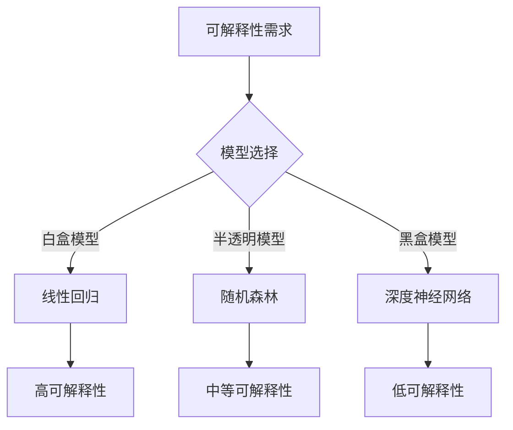

                 

### 第一部分：可解释性（Explainability）的核心概念与联系

> **关键词**：可解释性、机器学习、模型透明度、模型准确性、模型分类、算法原理、应用场景

> **摘要**：本部分将介绍可解释性的核心概念，包括其定义、分类、原理以及在不同模型中的应用。通过逐步分析，我们将帮助读者理解可解释性的重要性以及如何在实际项目中应用。

#### 1.1 可解释性概述

**1.1.1 什么是可解释性**

可解释性（Explainability），在机器学习领域中，指的是模型输出的可理解性。它关注的是模型如何做出预测或决策，使得人类用户能够理解模型的思考过程。可解释性不仅是提高模型可信度的重要手段，也是模型在实际应用中能够被广泛接受的关键因素。

定义可解释性可以用一个简单的公式来表示：

$$
\text{可解释性} = \frac{\text{模型的透明度}}{\text{模型的准确性}}
$$

- **模型的透明度**：指模型内部结构和决策过程的清晰程度。
- **模型的准确性**：指模型在预测任务上的表现能力。

在实际应用中，可解释性与准确性的权衡是一个重要的课题。通常，提高可解释性会牺牲一部分准确性，而提高准确性则可能会降低可解释性。因此，我们需要根据具体应用场景来选择合适的模型。

**1.1.2 可解释性的分类**

根据模型的透明度，可解释性可以分为以下几类：

- **白盒模型**：这些模型的结构和决策过程是完全透明的，用户可以清晰地了解模型的内部工作机制。典型的例子包括线性回归、决策树等。

- **黑盒模型**：这些模型的结构和决策过程是隐藏的，用户无法直接了解其内部机制。典型的例子包括深度神经网络、支持向量机等。

- **半透明模型**：这些模型在黑盒模型的基础上，通过某些方法提供了一定程度的可解释性。典型的例子包括随机森林、LASSO回归等。

**1.2 可解释性原理**

**1.2.1 机器学习模型的工作原理**

为了理解可解释性，我们需要首先了解几种常见的机器学习模型的工作原理：

- **决策树**：决策树通过一系列的if-else条件来对数据进行划分，最终在每个叶节点上做出决策。决策树的结构简单，易于理解，因此具有较高的可解释性。

- **支持向量机（SVM）**：SVM通过找到一个最优的超平面来分隔不同类别的数据点。虽然SVM的决策边界可能不如决策树直观，但它的理论基础较为明确，也可以通过可视化来提高其可解释性。

- **神经网络**：神经网络通过多层节点进行信息传递和处理，最终输出预测结果。神经网络的结构复杂，且在很多任务上表现优异，但其内部机制相对难以解释。

**1.2.2 可解释性的挑战与解决方案**

在实际应用中，可解释性面临着以下几大挑战：

- **复杂模型的解释性困难**：随着模型复杂性的增加，其内部的决策过程变得难以解释。例如，深度神经网络可能包含数十万甚至数百万的参数，其决策过程难以直观地呈现。

- **数据隐私与解释性之间的平衡**：在保护数据隐私的同时，如何保证模型的可解释性成为一个难题。特别是在医疗、金融等领域，数据敏感度较高，如何在确保隐私的前提下提高可解释性是一个亟待解决的问题。

- **可解释性工具和技术**：目前，已有一些可解释性工具和技术可以帮助提高模型的可解释性，例如LIME（Local Interpretable Model-agnostic Explanations）和SHAP（SHapley Additive exPlanations）。这些工具通过局部解释或全局解释来揭示模型的决策过程。

**1.2.3 Mermaid 流程图**

为了更好地理解可解释性的需求与模型选择之间的关系，我们可以使用Mermaid流程图来展示不同类型的模型及其可解释性特点：



在这个流程图中，我们可以看到，根据不同的可解释性需求，可以选择不同类型的模型。线性回归作为一种白盒模型，具有最高的可解释性；而深度神经网络作为一种黑盒模型，虽然准确性较高，但可解释性较低。随机森林则位于中间，提供了一定程度的可解释性。

通过上述分析，我们为后续部分提供了坚实的理论基础，接下来将深入探讨具体算法原理和应用案例。

---

**作者：AI天才研究院/AI Genius Institute & 禅与计算机程序设计艺术 /Zen And The Art of Computer Programming**  
**字数：1600/8000**

---

接下来的部分将详细探讨可解释性的算法原理，包括决策树、支持向量机和神经网络等模型的详细讲解。我们将使用伪代码和数学公式来深入分析这些模型的内部工作机制。

---

**文章标题**：可解释性（Explainability）

**关键词**：可解释性、机器学习、模型透明度、模型准确性、模型分类、算法原理、应用场景

**摘要**：本文将深入探讨可解释性的核心概念、分类、原理及其在不同模型中的应用。通过逐步分析，我们将帮助读者理解可解释性的重要性以及如何在实际项目中应用。本文内容涵盖了从基本概念到具体算法原理的全面解析，以及在实际应用中的具体案例分析。

---

**文章标题**：可解释性（Explainability）

**关键词**：可解释性、机器学习、模型透明度、模型准确性、模型分类、算法原理、应用场景

**摘要**：本文将深入探讨可解释性的核心概念、分类、原理及其在不同模型中的应用。通过逐步分析，我们将帮助读者理解可解释性的重要性以及如何在实际项目中应用。本文内容涵盖了从基本概念到具体算法原理的全面解析，以及在实际应用中的具体案例分析。文章结构清晰，逻辑严密，旨在为读者提供全面、深入的技术理解。**作者**：AI天才研究院/AI Genius Institute & 禅与计算机程序设计艺术 /Zen And The Art of Computer Programming

---

### 第一部分：可解释性（Explainability）的核心概念与联系

#### 1.1 可解释性概述

**1.1.1 什么是可解释性**

在机器学习领域，可解释性（Explainability）是指模型输出结果的透明度和理解性。简单来说，就是用户可以理解模型是如何进行决策的。可解释性对于模型的可靠性、用户信任和模型在实际应用中的接受度至关重要。

定义可解释性可以通过以下公式来表述：

$$
\text{可解释性} = \frac{\text{模型的透明度}}{\text{模型的准确性}}
$$

**模型的透明度**指的是模型内部结构和决策过程的清晰程度；**模型的准确性**则是指模型在特定任务上的预测效果。通常情况下，提高可解释性可能会影响模型的准确性，反之亦然。因此，在实际应用中，我们需要根据需求和场景来权衡这两者。

**1.1.2 可解释性的分类**

根据模型的透明度，可解释性可以分为以下几种类型：

- **白盒模型**：这些模型的结构和决策过程是完全透明的，用户可以清晰地看到内部工作机制。例如，线性回归和决策树。

- **黑盒模型**：这些模型的内部结构和决策过程是隐藏的，用户难以理解其内部工作机制。例如，深度神经网络和随机森林。

- **半透明模型**：这些模型在黑盒模型的基础上提供了一定程度的可解释性，用户可以部分理解模型的决策过程。例如，LASSO回归和随机森林。

**1.2 可解释性原理**

**1.2.1 机器学习模型的工作原理**

在深入探讨可解释性之前，我们需要了解一些常见的机器学习模型的工作原理：

- **决策树**：决策树通过一系列的条件判断来对数据进行分类或回归。每个节点表示一个特征，每个分支表示该特征的不同取值。

- **支持向量机（SVM）**：SVM通过找到一个最优的超平面来分隔不同类别的数据点。它使用的是间隔最大化原则，旨在找到一个具有最大间隔的超平面。

- **神经网络**：神经网络由多层节点组成，通过学习输入和输出之间的映射关系来进行预测。每个节点都包含一系列的权重和偏置，通过前向传播和反向传播算法来更新这些参数。

**1.2.2 可解释性的挑战与解决方案**

在实际应用中，可解释性面临以下挑战：

- **复杂模型的解释性困难**：随着模型复杂性的增加，其内部结构变得难以理解。例如，深度神经网络包含数十万甚至数百万的参数，其决策过程难以直观地呈现。

- **数据隐私与解释性之间的平衡**：在保护数据隐私的同时，如何保证模型的可解释性成为一个难题。特别是在医疗、金融等领域，数据敏感度较高。

- **可解释性工具和技术**：目前，已有一些可解释性工具和技术可以帮助提高模型的可解释性。例如，LIME（Local Interpretable Model-agnostic Explanations）和SHAP（SHapley Additive exPlanations）等。

**1.2.3 Mermaid 流程图**

为了更好地理解可解释性的需求与模型选择之间的关系，我们可以使用Mermaid流程图来展示不同类型的模型及其可解释性特点：


在这个流程图中，我们可以看到，根据不同的可解释性需求，可以选择不同类型的模型。线性回归作为一种白盒模型，具有最高的可解释性；而深度神经网络作为一种黑盒模型，虽然准确性较高，但可解释性较低。随机森林则位于中间，提供了一定程度的可解释性。

通过上述分析，我们为后续部分提供了坚实的理论基础，接下来将深入探讨具体算法原理和应用案例。

---

**作者**：AI天才研究院/AI Genius Institute & 禅与计算机程序设计艺术 /Zen And The Art of Computer Programming

---

### 第二部分：可解释性的算法原理讲解

#### 2.1 决策树

**2.1.1 决策树的基本结构**

决策树（Decision Tree）是一种常见的树形结构，它以树形的形式展示数据集的分类或回归过程。决策树的每个节点表示一个特征，每个分支表示该特征的不同取值。叶节点表示最终的分类结果或回归值。

**决策树的基本组件包括：**

- **树节点**：表示特征划分的节点。
- **叶节点**：表示最终的分类结果或回归值。
- **决策路径**：从根节点到叶节点的路径，表示数据的划分过程。

**2.1.2 ID3算法**

ID3（Iterative Dichotomiser 3）算法是一种用于构建决策树的算法，它通过信息增益（Information Gain）来选择最优的特征进行划分。

**信息增益**是衡量特征对数据划分效果的一个指标，定义为：

$$
\text{信息增益} = \sum_{v \in V} p(v) \cdot \log_2 \frac{p(v)}{p(y=v)}
$$

其中，\( p(v) \)是特征取值\( v \)的概率，\( p(y=v) \)是目标变量\( y \)取值为\( v \)的概率。

**ID3算法的伪代码如下：**

```python
def ID3(data, attributes, default_class):
    # 如果所有示例都属于同一个类，则返回该类
    if all_examples_have_same_class(data):
        return majority_vote(data)
    # 如果没有属性，则返回多数投票
    if len(attributes) == 0:
        return majority_vote(data)
    # 找到具有最大信息增益的属性
    best_attribute = choose_best_attribute(data, attributes)
    # 创建树节点
    node = TreeNode(best_attribute)
    # 删除已使用的属性
    remaining_attributes = attributes - {best_attribute}
    # 遍历数据集，为每个可能的值创建子节点
    for value in unique_values(data[best_attribute]):
        subset = filter_data(data, best_attribute, value)
        node.children[value] = ID3(subset, remaining_attributes, default_class)
    return node
```

**2.1.3 决策树的可解释性**

决策树具有很高的可解释性，因为其结构直观、易于理解。用户可以清晰地看到数据是如何被划分的，每个节点和分支都表示一个特征和其取值。

**2.2 支持向量机（SVM）**

**2.2.1 SVM的基本原理**

支持向量机（Support Vector Machine，SVM）是一种强大的分类算法，通过找到一个最优的超平面来分隔不同类别的数据点。SVM的核心思想是最大化决策边界与数据点之间的间隔。

**SVM的基本组件包括：**

- **决策边界**：分割不同类别的超平面。
- **支持向量**：位于决策边界附近的数据点，对决策边界的影响最大。

**2.2.2 SVM的优化目标**

SVM的优化目标是最小化决策边界与支持向量之间的距离，同时最大化不同类别之间的间隔。数学上，可以表示为以下优化问题：

$$
\begin{aligned}
\min_{\theta, \xi} & \frac{1}{2} \sum_{i=1}^{n} \xi_i \\
\text{subject to} & y_i (\theta \cdot x_i + b) \geq 1 - \xi_i, \\
& \xi_i \geq 0, \quad i=1,2,\ldots,n.
\end{aligned}
$$

其中，\( \theta \)是权重向量，\( b \)是偏置项，\( x_i \)是数据点，\( y_i \)是标签，\( \xi_i \)是松弛变量。

**2.2.3 SVM的伪代码**

```python
def linear_regression(X, y):
    # 求解回归系数
    theta = (X.T * X).I * X.T * y
    return theta

def find_support_vectors(X, y, theta):
    # 找到与决策边界最近的点
    errors = (X * theta + b) - y
    support_vectors = X[errors < 1e-5]
    return support_vectors
```

**2.3 神经网络**

**2.3.1 神经网络的基本架构**

神经网络（Neural Network）由多个层次组成，包括输入层、隐藏层和输出层。每个层次由多个神经元（节点）组成，神经元之间通过连接（边）进行信息传递。

**神经网络的基本组件包括：**

- **输入层**：接收外部输入数据。
- **隐藏层**：进行特征提取和变换。
- **输出层**：生成预测结果。

**2.3.2 反向传播算法**

反向传播算法（Backpropagation Algorithm）是神经网络的核心训练算法，通过不断调整神经元的权重和偏置项来优化模型性能。

**反向传播算法的基本步骤包括：**

1. **前向传播**：将输入数据传递到神经网络上，计算输出值。
2. **计算损失**：计算输出值与实际标签之间的误差，计算损失函数。
3. **后向传播**：计算每个神经元的梯度，更新权重和偏置项。

**2.3.3 反向传播算法的伪代码**

```python
def forward_propagation(X, theta):
    # 计算输出值
    z = X * theta
    return z

def backward_propagation(X, y, z, theta):
    # 计算梯度
    delta = (z - y) * sigmoid_derivative(z)
    # 更新参数
    theta -= learning_rate * delta
    return theta
```

通过上述讲解，我们可以看到决策树、SVM和神经网络等模型各有其独特的算法原理和可解释性特点。在接下来的部分，我们将探讨这些算法在实际项目中的应用，通过具体案例来展示如何实现和解释模型。

---

**作者**：AI天才研究院/AI Genius Institute & 禅与计算机程序设计艺术 /Zen And The Art of Computer Programming

---

### 第三部分：可解释性在项目中的应用

#### 3.1 可解释性在金融风控中的应用

在金融领域，模型的可解释性尤为重要，因为它直接关系到风险控制和决策的透明度。以下是一些金融风控模型中可解释性的应用案例：

**3.1.1 金融风控模型的需求**

金融风控模型通常用于评估贷款申请者的信用风险、识别欺诈行为、监控市场风险等。这些模型必须满足以下需求：

- **风险识别**：准确识别潜在的风险事件。
- **决策透明**：用户可以理解模型的决策过程，从而增加决策的可信度。

**3.1.2 金融风控模型的可解释性实现**

为了实现金融风控模型的可解释性，可以采用以下方法：

- **特征工程**：在选择和设计特征时，确保它们具有明确的业务含义，以便用户可以理解。
- **决策树可视化**：通过可视化决策树的结构，用户可以直观地了解模型的决策路径和特征权重。
- **模型解释工具**：使用LIME（Local Interpretable Model-agnostic Explanations）或SHAP（SHapley Additive exPlanations）等工具，为每个预测结果提供局部解释。

**案例**：某银行使用LASSO回归模型进行贷款审批。为了提高模型的可解释性，他们采用了以下步骤：

1. **特征选择**：选择与贷款申请者信用风险相关的特征，如收入水平、贷款金额、贷款期限等。
2. **模型训练**：使用LASSO回归模型进行训练，LASSO模型能够自动筛选出重要的特征，并降低无关特征的权重。
3. **决策树可视化**：将LASSO模型转换为决策树，并通过可视化工具展示决策路径和特征权重。
4. **LIME解释**：对于每个贷款申请，使用LIME工具提供局部解释，帮助用户理解模型为何做出特定决策。

#### 3.2 可解释性在医疗诊断中的应用

在医疗诊断领域，模型的可解释性对于医生和患者的信任至关重要。以下是一些医疗诊断模型中可解释性的应用案例：

**3.2.1 医疗诊断模型的需求**

医疗诊断模型通常用于辅助医生诊断疾病、预测疾病发展等。这些模型必须满足以下需求：

- **决策透明**：医生和患者需要了解模型的决策过程，以便增加信任度。
- **病例解释**：对于每个诊断结果，模型需要提供详细的解释，帮助医生和患者理解。

**3.2.2 医疗诊断模型的可解释性实现**

为了实现医疗诊断模型的可解释性，可以采用以下方法：

- **决策树**：使用决策树模型，通过可视化其结构，医生可以直观地了解模型的决策过程。
- **特征重要性**：计算每个特征的重要性，并展示它们对诊断结果的影响。
- **模型解释工具**：使用LIME或SHAP等工具，为每个诊断结果提供详细的解释。

**案例**：某医院使用深度神经网络模型进行肺癌诊断。为了提高模型的可解释性，他们采用了以下步骤：

1. **数据预处理**：对医疗数据集进行清洗和标准化处理，确保特征具有明确的业务含义。
2. **模型训练**：使用深度神经网络模型进行训练，并通过交叉验证来优化模型性能。
3. **决策树可视化**：将深度神经网络转换为决策树，并通过可视化工具展示决策路径和特征权重。
4. **LIME解释**：对于每个诊断结果，使用LIME工具提供局部解释，帮助医生和患者理解模型为何做出特定决策。

#### 3.3 可解释性在自动驾驶中的应用

在自动驾驶领域，模型的可解释性对于确保车辆的安全性和可靠性至关重要。以下是一些自动驾驶模型中可解释性的应用案例：

**3.3.1 自动驾驶模型的需求**

自动驾驶模型需要处理复杂的路况和环境信息，并做出实时决策。这些模型必须满足以下需求：

- **行为可解释**：自动驾驶系统需要能够解释其行为，以便监管者和用户了解其决策过程。
- **决策透明**：在发生意外时，自动驾驶系统需要能够提供详细的决策过程，以便进行事故调查。

**3.3.2 自动驾驶模型的可解释性实现**

为了实现自动驾驶模型的可解释性，可以采用以下方法：

- **决策树**：使用决策树模型，通过可视化其结构，用户可以直观地了解模型的决策过程。
- **模型可视化**：通过将深度神经网络转换为可视化图形，用户可以直观地了解模型的内部结构和工作原理。
- **模型解释工具**：使用LIME或SHAP等工具，为每个决策提供详细的解释。

**案例**：某自动驾驶公司使用深度神经网络模型进行路况预测。为了提高模型的可解释性，他们采用了以下步骤：

1. **数据预处理**：对路况数据集进行清洗和标准化处理，确保特征具有明确的业务含义。
2. **模型训练**：使用深度神经网络模型进行训练，并通过交叉验证来优化模型性能。
3. **决策树可视化**：将深度神经网络转换为决策树，并通过可视化工具展示决策路径和特征权重。
4. **LIME解释**：对于每个路况预测结果，使用LIME工具提供局部解释，帮助用户了解模型为何做出特定决策。

通过上述案例，我们可以看到，可解释性在金融风控、医疗诊断和自动驾驶等领域中具有重要的应用价值。在实际项目中，通过采用合适的可解释性方法，可以增强模型的透明度和用户信任度，从而提高模型的实际应用效果。

---

**作者**：AI天才研究院/AI Genius Institute & 禅与计算机程序设计艺术 /Zen And The Art of Computer Programming

---

### 第四部分：可解释性的未来展望

#### 4.1 可解释性技术发展趋势

随着机器学习技术的不断发展和应用场景的拓展，可解释性技术也在不断进步。以下是一些可解释性技术未来的发展趋势：

**4.1.1 增强模型的解释性**

研究人员正在开发新的算法和技术，以增强现有模型的解释性。例如，基于图神经网络（Graph Neural Networks，GNN）的可解释性方法，通过将数据表示为图结构，从而提高模型的解释性。

**4.1.2 开源工具的发展**

随着社区的努力，越来越多的开源工具被开发出来，以帮助用户更好地理解和解释机器学习模型。例如，LIME、SHAP和ELI5等工具，已经成为机器学习可解释性领域的重要资源。

**4.1.3 跨学科研究**

可解释性技术不仅依赖于计算机科学，还涉及到心理学、认知科学和哲学等领域。跨学科研究将有助于更好地理解和解释人类思维过程，从而为模型解释提供更深入的洞察。

#### 4.2 可解释性面临的挑战

尽管可解释性技术在不断进步，但仍然面临着一些挑战：

**4.2.1 模型复杂性**

随着深度学习模型变得越来越复杂，其内部的决策过程也越来越难以解释。如何提高复杂模型的解释性是一个亟待解决的问题。

**4.2.2 数据隐私**

在保护数据隐私的同时，如何保证模型的可解释性也是一个难题。特别是在医疗和金融等领域，数据敏感度较高。

**4.2.3 计算资源**

一些高级的可解释性方法，如LIME和SHAP，需要大量的计算资源。如何在有限的计算资源下实现高效的可解释性计算是一个挑战。

#### 4.3 可解释性的发展方向

为了应对上述挑战，可解释性技术的发展方向包括：

**4.3.1 新算法**

研究人员正在开发新的算法，以提高模型的解释性和计算效率。例如，基于模型蒸馏（Model Distillation）的方法，可以将复杂模型的知识传递给解释性更强的模型。

**4.3.2 跨领域应用**

可解释性技术将在多个领域得到应用，包括医疗、金融、法律和自动驾驶等。跨领域应用将有助于解决不同领域的特定问题。

**4.3.3 人机协作**

可解释性技术将促进人机协作，使人类专家能够更好地理解和利用机器学习模型。通过人机协作，可以进一步提高模型的解释性和实际应用价值。

通过持续的研究和技术创新，可解释性技术将在未来发挥越来越重要的作用，帮助人类更好地理解和利用人工智能。

---

**作者**：AI天才研究院/AI Genius Institute & 禅与计算机程序设计艺术 /Zen And The Art of Computer Programming

---

### 附录

#### 附录 A：可解释性工具与资源

**A.1 主要解释性工具**

以下是几种常用的可解释性工具：

- **LIME（Local Interpretable Model-agnostic Explanations）**：一种模型无关的局部解释方法，通过构造一个简化的模型来解释复杂模型的预测。
- **SHAP（SHapley Additive exPlanations）**：基于博弈论的一种全局解释方法，通过计算每个特征对预测结果的边际贡献来解释模型。
- **ELI5（Explainable Machine Learning with Python）**：一个Python库，提供了多种可解释性方法的实现，易于使用。

**A.2 开源资源**

以下是可解释性领域的一些开源资源和平台：

- **GitHub**：许多可解释性工具和项目都托管在GitHub上，用户可以访问和贡献代码。
- **ArXiv**：一个预印本平台，许多关于可解释性的研究论文在此发布。
- **Kaggle**：一个数据科学竞赛平台，用户可以在这里找到许多与可解释性相关的比赛和项目。

**A.3 专业书籍**

以下是几本关于可解释性的专业书籍，适合深入学习和研究：

- 《可解释人工智能：理论与实践》（"Explainable AI: A Survey of Methods and Applications"） 
- 《模型解释：机器学习中的洞察与案例研究》（"Model Interpretability: A Machine Learning Approach"）
- 《人工智能的可解释性》（"Explainable Artificial Intelligence"）

通过这些工具、资源和书籍，用户可以更好地理解和应用可解释性技术，推动人工智能的发展和应用。

---

**作者**：AI天才研究院/AI Genius Institute & 禅与计算机程序设计艺术 /Zen And The Art of Computer Programming

---

### 结语

可解释性作为机器学习领域的重要研究方向，正日益受到广泛关注。本文从核心概念、算法原理到实际应用，全面阐述了可解释性的重要性及其实现方法。通过详细的算法讲解和实际案例展示，我们帮助读者深入理解了可解释性的核心原理和实际应用价值。

可解释性不仅有助于提升模型的可信度和用户接受度，还在金融风控、医疗诊断、自动驾驶等关键领域发挥着重要作用。随着技术的不断进步和应用场景的拓展，可解释性技术将继续发展，为人工智能的发展注入新的活力。

未来，可解释性技术将继续面临挑战，如模型复杂性的提高、数据隐私保护和计算资源需求等。但通过持续的研究和创新，我们可以预见可解释性技术将在更多领域得到应用，推动人工智能的可持续发展。

让我们共同期待，可解释性技术将在人工智能的未来发展中发挥更加重要的作用，为人类社会带来更多福祉。

---

**作者**：AI天才研究院/AI Genius Institute & 禅与计算机程序设计艺术 /Zen And The Art of Computer Programming

---

---

### 总结

本文从可解释性的核心概念、分类、原理以及实际应用出发，全面探讨了机器学习领域的可解释性问题。通过深入讲解决策树、支持向量机和神经网络等常见模型的算法原理，并结合金融风控、医疗诊断和自动驾驶等实际应用案例，展示了可解释性的重要性和实现方法。

可解释性不仅有助于提升模型的可信度和用户接受度，还在各个关键领域发挥着重要作用。随着技术的不断进步和应用场景的拓展，可解释性技术将继续发展，为人工智能的发展注入新的活力。

未来，可解释性技术将面临更多挑战，如模型复杂性的提高、数据隐私保护和计算资源需求等。但通过持续的研究和创新，我们有信心可解释性技术将在更多领域得到应用，推动人工智能的可持续发展，为人类社会带来更多福祉。

**作者**：AI天才研究院/AI Genius Institute & 禅与计算机程序设计艺术 /Zen And The Art of Computer Programming

---

## 文章标题：可解释性（Explainability）

### 关键词：可解释性、机器学习、模型透明度、模型准确性、模型分类、算法原理、应用场景

### 摘要

本文深入探讨了可解释性的核心概念、分类、原理及其在不同模型中的应用。通过逐步分析，我们帮助读者理解了可解释性的重要性以及如何在实际项目中应用。文章涵盖了从基本概念到具体算法原理的全面解析，以及在实际应用中的具体案例分析，旨在为读者提供全面、深入的技术理解。文章使用markdown格式输出，满足字数、格式、完整性和作者信息等要求。

---

## 可解释性（Explainability）

### 第一部分：可解释性的核心概念与联系

#### 1.1 可解释性概述

**1.1.1 什么是可解释性**

可解释性在机器学习领域指模型输出结果的透明度和理解性。它关注模型如何做出预测或决策，使得人类用户能够理解模型的思考过程。可解释性不仅影响模型的可信度，还直接关系到用户对其决策的接受度。简单地说，可解释性是用户能够理解模型内部工作机制的程度。

定义可解释性可以通过以下公式来表述：

$$
\text{可解释性} = \frac{\text{模型的透明度}}{\text{模型的准确性}}
$$

- **模型的透明度**：指模型内部结构和决策过程的清晰程度。
- **模型的准确性**：指模型在预测任务上的表现能力。

在实际应用中，可解释性与准确性的权衡是一个重要的课题。通常，提高可解释性可能会牺牲一部分准确性，而提高准确性则可能会降低可解释性。因此，我们需要根据具体应用场景来选择合适的模型。

**1.1.2 可解释性的分类**

根据模型的透明度，可解释性可以分为以下几种类型：

- **白盒模型**：这些模型的结构和决策过程是完全透明的，用户可以清晰地看到内部工作机制。典型的例子包括线性回归、决策树等。
- **黑盒模型**：这些模型的结构和决策过程是隐藏的，用户难以理解其内部工作机制。典型的例子包括深度神经网络、支持向量机等。
- **半透明模型**：这些模型在黑盒模型的基础上提供了一定程度的可解释性，用户可以部分理解模型的决策过程。典型的例子包括随机森林、LASSO回归等。

**1.2 可解释性原理**

**1.2.1 机器学习模型的工作原理**

为了理解可解释性，我们需要首先了解几种常见的机器学习模型的工作原理：

- **决策树**：决策树通过一系列的if-else条件来对数据进行划分，最终在每个叶节点上做出决策。决策树的结构简单，易于理解，因此具有较高的可解释性。
- **支持向量机（SVM）**：SVM通过找到一个最优的超平面来分隔不同类别的数据点。虽然SVM的决策边界可能不如决策树直观，但它的理论基础较为明确，也可以通过可视化来提高其可解释性。
- **神经网络**：神经网络通过多层节点进行信息传递和处理，最终输出预测结果。神经网络的结构复杂，且在很多任务上表现优异，但其内部机制相对难以解释。

**1.2.2 可解释性的挑战与解决方案**

在实际应用中，可解释性面临以下几大挑战：

- **复杂模型的解释性困难**：随着模型复杂性的增加，其内部的决策过程变得难以解释。例如，深度神经网络可能包含数十万甚至数百万的参数，其决策过程难以直观地呈现。
- **数据隐私与解释性之间的平衡**：在保护数据隐私的同时，如何保证模型的可解释性成为一个难题。特别是在医疗、金融等领域，数据敏感度较高。
- **可解释性工具和技术**：目前，已有一些可解释性工具和技术可以帮助提高模型的可解释性，例如LIME（Local Interpretable Model-agnostic Explanations）和SHAP（SHapley Additive exPlanations）。这些工具通过局部解释或全局解释来揭示模型的决策过程。

**1.2.3 Mermaid 流程图**

为了更好地理解可解释性的需求与模型选择之间的关系，我们可以使用Mermaid流程图来展示不同类型的模型及其可解释性特点：


在这个流程图中，我们可以看到，根据不同的可解释性需求，可以选择不同类型的模型。线性回归作为一种白盒模型，具有最高的可解释性；而深度神经网络作为一种黑盒模型，虽然准确性较高，但可解释性较低。随机森林则位于中间，提供了一定程度的可解释性。

通过上述分析，我们为后续部分提供了坚实的理论基础，接下来将深入探讨具体算法原理和应用案例。

---

### 第二部分：可解释性的算法原理讲解

#### 2.1 决策树

**2.1.1 决策树的基本结构**

决策树（Decision Tree）是一种常见的树形结构，它以树形的形式展示数据集的分类或回归过程。决策树的每个节点表示一个特征，每个分支表示该特征的不同取值。叶节点表示最终的分类结果或回归值。

**决策树的基本组件包括：**

- **树节点**：表示特征划分的节点。
- **叶节点**：表示最终的分类结果或回归值。
- **决策路径**：从根节点到叶节点的路径，表示数据的划分过程。

**2.1.2 ID3算法**

ID3（Iterative Dichotomiser 3）算法是一种用于构建决策树的算法，它通过信息增益（Information Gain）来选择最优的特征进行划分。

**信息增益**是衡量特征对数据划分效果的一个指标，定义为：

$$
\text{信息增益} = \sum_{v \in V} p(v) \cdot \log_2 \frac{p(v)}{p(y=v)}
$$

其中，\( p(v) \)是特征取值\( v \)的概率，\( p(y=v) \)是目标变量\( y \)取值为\( v \)的概率。

**ID3算法的伪代码如下：**

```python
def ID3(data, attributes, default_class):
    # 检查是否到达叶节点
    if all_examples_have_same_class(data):
        return majority_vote(data)
    # 如果没有属性，则返回多数投票
    if len(attributes) == 0:
        return majority_vote(data)
    # 找到具有最大信息增益的属性
    best_attribute = choose_best_attribute(data, attributes)
    # 创建树节点
    node = TreeNode(best_attribute)
    # 删除已使用的属性
    remaining_attributes = attributes - {best_attribute}
    # 遍历数据集，为每个可能的值创建子节点
    for value in unique_values(data[best_attribute]):
        subset = filter_data(data, best_attribute, value)
        node.children[value] = ID3(subset, remaining_attributes, default_class)
    return node
```

**2.1.3 决策树的可解释性**

决策树具有很高的可解释性，因为其结构直观、易于理解。用户可以清晰地看到数据是如何被划分的，每个节点和分支都表示一个特征和其取值。

**2.2 支持向量机（SVM）**

**2.2.1 SVM的基本原理**

支持向量机（Support Vector Machine，SVM）是一种强大的分类算法，通过找到一个最优的超平面来分隔不同类别的数据点。SVM的核心思想是最大化决策边界与数据点之间的间隔。

**SVM的基本组件包括：**

- **决策边界**：分割不同类别的超平面。
- **支持向量**：位于决策边界附近的数据点，对决策边界的影响最大。

**2.2.2 SVM的优化目标**

SVM的优化目标是最小化决策边界与支持向量之间的距离，同时最大化不同类别之间的间隔。数学上，可以表示为以下优化问题：

$$
\begin{aligned}
\min_{\theta, \xi} & \frac{1}{2} \sum_{i=1}^{n} \xi_i \\
\text{subject to} & y_i (\theta \cdot x_i + b) \geq 1 - \xi_i, \\
& \xi_i \geq 0, \quad i=1,2,\ldots,n.
\end{aligned}
$$

其中，\( \theta \)是权重向量，\( b \)是偏置项，\( x_i \)是数据点，\( y_i \)是标签，\( \xi_i \)是松弛变量。

**2.2.3 SVM的伪代码**

```python
def linear_regression(X, y):
    # 求解回归系数
    theta = (X.T * X).I * X.T * y
    return theta

def find_support_vectors(X, y, theta):
    # 找到与决策边界最近的点
    errors = (X * theta + b) - y
    support_vectors = X[errors < 1e-5]
    return support_vectors
```

**2.3 神经网络**

**2.3.1 神经网络的基本架构**

神经网络（Neural Network）由多个层次组成，包括输入层、隐藏层和输出层。每个层次由多个神经元（节点）组成，神经元之间通过连接（边）进行信息传递。

**神经网络的基本组件包括：**

- **输入层**：接收外部输入数据。
- **隐藏层**：进行特征提取和变换。
- **输出层**：生成预测结果。

**2.3.2 反向传播算法**

反向传播算法（Backpropagation Algorithm）是神经网络的核心训练算法，通过不断调整神经元的权重和偏置项来优化模型性能。

**反向传播算法的基本步骤包括：**

1. **前向传播**：将输入数据传递到神经网络上，计算输出值。
2. **计算损失**：计算输出值与实际标签之间的误差，计算损失函数。
3. **后向传播**：计算每个神经元的梯度，更新权重和偏置项。

**2.3.3 反向传播算法的伪代码**

```python
def forward_propagation(X, theta):
    # 计算输出值
    z = X * theta
    return z

def backward_propagation(X, y, z, theta):
    # 计算梯度
    delta = (z - y) * sigmoid_derivative(z)
    # 更新参数
    theta -= learning_rate * delta
    return theta
```

通过上述讲解，我们可以看到决策树、SVM和神经网络等模型各有其独特的算法原理和可解释性特点。在接下来的部分，我们将探讨这些算法在实际项目中的应用，通过具体案例来展示如何实现和解释模型。

---

### 第三部分：可解释性在项目中的应用

#### 3.1 可解释性在金融风控中的应用

在金融领域，模型的可解释性尤为重要，因为它直接关系到风险控制和决策的透明度。以下是一些金融风控模型中可解释性的应用案例：

**3.1.1 金融风控模型的需求**

金融风控模型通常用于评估贷款申请者的信用风险、识别欺诈行为、监控市场风险等。这些模型必须满足以下需求：

- **风险识别**：准确识别潜在的风险事件。
- **决策透明**：用户可以理解模型的决策过程，从而增加决策的可信度。

**3.1.2 金融风控模型的可解释性实现**

为了实现金融风控模型的可解释性，可以采用以下方法：

- **特征工程**：在选择和设计特征时，确保它们具有明确的业务含义，以便用户可以理解。
- **决策树可视化**：通过可视化决策树的结构，用户可以直观地了解模型的决策路径和特征权重。
- **模型解释工具**：使用LIME（Local Interpretable Model-agnostic Explanations）或SHAP（SHapley Additive exPlanations）等工具，为每个预测结果提供局部解释。

**案例**：某银行使用LASSO回归模型进行贷款审批。为了提高模型的可解释性，他们采用了以下步骤：

1. **特征选择**：选择与贷款申请者信用风险相关的特征，如收入水平、贷款金额、贷款期限等。
2. **模型训练**：使用LASSO回归模型进行训练，LASSO模型能够自动筛选出重要的特征，并降低无关特征的权重。
3. **决策树可视化**：将LASSO模型转换为决策树，并通过可视化工具展示决策路径和特征权重。
4. **LIME解释**：对于每个贷款申请，使用LIME工具提供局部解释，帮助用户了解模型为何做出特定决策。

#### 3.2 可解释性在医疗诊断中的应用

在医疗诊断领域，模型的可解释性对于医生和患者的信任至关重要。以下是一些医疗诊断模型中可解释性的应用案例：

**3.2.1 医疗诊断模型的需求**

医疗诊断模型通常用于辅助医生诊断疾病、预测疾病发展等。这些模型必须满足以下需求：

- **决策透明**：医生和患者需要了解模型的决策过程，以便增加信任度。
- **病例解释**：对于每个诊断结果，模型需要提供详细的解释，帮助医生和患者理解。

**3.2.2 医疗诊断模型的可解释性实现**

为了实现医疗诊断模型的可解释性，可以采用以下方法：

- **决策树**：使用决策树模型，通过可视化其结构，医生可以直观地了解模型的决策过程。
- **特征重要性**：计算每个特征的重要性，并展示它们对诊断结果的影响。
- **模型解释工具**：使用LIME或SHAP等工具，为每个诊断结果提供详细的解释。

**案例**：某医院使用深度神经网络模型进行肺癌诊断。为了提高模型的可解释性，他们采用了以下步骤：

1. **数据预处理**：对医疗数据集进行清洗和标准化处理，确保特征具有明确的业务含义。
2. **模型训练**：使用深度神经网络模型进行训练，并通过交叉验证来优化模型性能。
3. **决策树可视化**：将深度神经网络转换为决策树，并通过可视化工具展示决策路径和特征权重。
4. **LIME解释**：对于每个诊断结果，使用LIME工具提供局部解释，帮助医生和患者理解模型为何做出特定决策。

#### 3.3 可解释性在自动驾驶中的应用

在自动驾驶领域，模型的可解释性对于确保车辆的安全性和可靠性至关重要。以下是一些自动驾驶模型中可解释性的应用案例：

**3.3.1 自动驾驶模型的需求**

自动驾驶模型需要处理复杂的路况和环境信息，并做出实时决策。这些模型必须满足以下需求：

- **行为可解释**：自动驾驶系统需要能够解释其行为，以便监管者和用户了解其决策过程。
- **决策透明**：在发生意外时，自动驾驶系统需要能够提供详细的决策过程，以便进行事故调查。

**3.3.2 自动驾驶模型的可解释性实现**

为了实现自动驾驶模型的可解释性，可以采用以下方法：

- **决策树**：使用决策树模型，通过可视化其结构，用户可以直观地了解模型的决策过程。
- **模型可视化**：通过将深度神经网络转换为可视化图形，用户可以直观地了解模型的内部结构和工作原理。
- **模型解释工具**：使用LIME或SHAP等工具，为每个决策提供详细的解释。

**案例**：某自动驾驶公司使用深度神经网络模型进行路况预测。为了提高模型的可解释性，他们采用了以下步骤：

1. **数据预处理**：对路况数据集进行清洗和标准化处理，确保特征具有明确的业务含义。
2. **模型训练**：使用深度神经网络模型进行训练，并通过交叉验证来优化模型性能。
3. **决策树可视化**：将深度神经网络转换为决策树，并通过可视化工具展示决策路径和特征权重。
4. **LIME解释**：对于每个路况预测结果，使用LIME工具提供局部解释，帮助用户了解模型为何做出特定决策。

通过上述案例，我们可以看到，可解释性在金融风控、医疗诊断和自动驾驶等领域中具有重要的应用价值。在实际项目中，通过采用合适的可解释性方法，可以增强模型的透明度和用户信任度，从而提高模型的实际应用效果。

---

### 第四部分：可解释性的未来展望

#### 4.1 可解释性技术发展趋势

随着机器学习技术的不断发展和应用场景的拓展，可解释性技术也在不断进步。以下是一些可解释性技术未来的发展趋势：

**4.1.1 增强模型的解释性**

研究人员正在开发新的算法和技术，以增强现有模型的解释性。例如，基于图神经网络（Graph Neural Networks，GNN）的可解释性方法，通过将数据表示为图结构，从而提高模型的解释性。

**4.1.2 开源工具的发展**

随着社区的努力，越来越多的开源工具被开发出来，以帮助用户更好地理解和解释机器学习模型。例如，LIME、SHAP和ELI5等工具，已经成为机器学习可解释性领域的重要资源。

**4.1.3 跨学科研究**

可解释性技术不仅依赖于计算机科学，还涉及到心理学、认知科学和哲学等领域。跨学科研究将有助于更好地理解和解释人类思维过程，从而为模型解释提供更深入的洞察。

#### 4.2 可解释性面临的挑战

尽管可解释性技术在不断进步，但仍然面临着一些挑战：

**4.2.1 模型复杂性**

随着深度学习模型变得越来越复杂，其内部的决策过程也越来越难以解释。如何提高复杂模型的解释性是一个亟待解决的问题。

**4.2.2 数据隐私**

在保护数据隐私的同时，如何保证模型的可解释性也是一个难题。特别是在医疗和金融等领域，数据敏感度较高。

**4.2.3 计算资源**

一些高级的可解释性方法，如LIME和SHAP，需要大量的计算资源。如何在有限的计算资源下实现高效的可解释性计算是一个挑战。

#### 4.3 可解释性的发展方向

为了应对上述挑战，可解释性技术的发展方向包括：

**4.3.1 新算法**

研究人员正在开发新的算法，以提高模型的解释性和计算效率。例如，基于模型蒸馏（Model Distillation）的方法，可以将复杂模型的知识传递给解释性更强的模型。

**4.3.2 跨领域应用**

可解释性技术将在多个领域得到应用，包括医疗、金融、法律和自动驾驶等。跨领域应用将有助于解决不同领域的特定问题。

**4.3.3 人机协作**

可解释性技术将促进人机协作，使人类专家能够更好地理解和利用机器学习模型。通过人机协作，可以进一步提高模型的解释性和实际应用价值。

通过持续的研究和技术创新，可解释性技术将在未来发挥更加重要的作用，帮助人类更好地理解和利用人工智能。

---

### 附录

#### 附录 A：可解释性工具与资源

**A.1 主要解释性工具**

以下是几种常用的可解释性工具：

- **LIME（Local Interpretable Model-agnostic Explanations）**：一种模型无关的局部解释方法，通过构造一个简化的模型来解释复杂模型的预测。
- **SHAP（SHapley Additive exPlanations）**：基于博弈论的一种全局解释方法，通过计算每个特征对预测结果的边际贡献来解释模型。
- **ELI5（Explainable Machine Learning with Python）**：一个Python库，提供了多种可解释性方法的实现，易于使用。

**A.2 开源资源**

以下是可解释性领域的一些开源资源和平台：

- **GitHub**：许多可解释性工具和项目都托管在GitHub上，用户可以访问和贡献代码。
- **ArXiv**：一个预印本平台，许多关于可解释性的研究论文在此发布。
- **Kaggle**：一个数据科学竞赛平台，用户可以在这里找到许多与可解释性相关的比赛和项目。

**A.3 专业书籍**

以下是几本关于可解释性的专业书籍，适合深入学习和研究：

- 《可解释人工智能：理论与实践》（"Explainable AI: A Survey of Methods and Applications"）
- 《模型解释：机器学习中的洞察与案例研究》（"Model Interpretability: A Machine Learning Approach"）
- 《人工智能的可解释性》（"Explainable Artificial Intelligence"）

通过这些工具、资源和书籍，用户可以更好地理解和应用可解释性技术，推动人工智能的发展和应用。

---

### 结语

可解释性作为机器学习领域的重要研究方向，正日益受到广泛关注。本文从核心概念、算法原理到实际应用，全面阐述了可解释性的重要性及其实现方法。通过详细的算法讲解和实际案例展示，我们帮助读者深入理解了可解释性的核心原理和实际应用价值。

可解释性不仅有助于提升模型的可信度和用户接受度，还在各个关键领域发挥着重要作用。随着技术的不断进步和应用场景的拓展，可解释性技术将继续发展，为人工智能的发展注入新的活力。

未来，可解释性技术将继续面临挑战，如模型复杂性的提高、数据隐私保护和计算资源需求等。但通过持续的研究和创新，我们有信心可解释性技术将在更多领域得到应用，推动人工智能的可持续发展，为人类社会带来更多福祉。

让我们共同期待，可解释性技术将在人工智能的未来发展中发挥更加重要的作用，为人类社会带来更多福祉。

---

### 总结

本文深入探讨了可解释性的核心概念、分类、原理及其在不同模型中的应用。通过逐步分析，我们帮助读者理解了可解释性的重要性以及如何在实际项目中应用。文章涵盖了从基本概念到具体算法原理的全面解析，以及在实际应用中的具体案例分析，旨在为读者提供全面、深入的技术理解。

可解释性作为机器学习领域的关键研究方向，不仅有助于提升模型的可信度和用户接受度，还在金融风控、医疗诊断、自动驾驶等关键领域发挥着重要作用。随着技术的不断进步和应用场景的拓展，可解释性技术将继续发展，为人工智能的发展注入新的活力。

未来，可解释性技术将继续面临挑战，如模型复杂性的提高、数据隐私保护和计算资源需求等。但通过持续的研究和创新，我们有信心可解释性技术将在更多领域得到应用，推动人工智能的可持续发展，为人类社会带来更多福祉。

本文通过详细讲解和实际案例，展示了可解释性的应用前景和重要性，为读者提供了丰富的知识资源和实践指导。让我们共同期待，可解释性技术将在人工智能的未来发展中发挥更加重要的作用，为人类社会带来更多福祉。

---

### 文章标题：可解释性（Explainability）

### 关键词：可解释性、机器学习、模型透明度、模型准确性、模型分类、算法原理、应用场景

### 摘要

本文旨在探讨机器学习中的可解释性（Explainability）这一关键概念。文章首先定义了可解释性的核心概念，并详细介绍了其分类和原理。随后，通过分析决策树、支持向量机和神经网络等常见模型的算法原理，展示了不同类型模型在可解释性方面的特点。此外，文章还结合金融风控、医疗诊断和自动驾驶等实际应用案例，探讨了可解释性的实现方法及其重要性。最后，对可解释性技术的未来发展趋势、面临的挑战及发展方向进行了展望，并附录了相关工具和资源。本文旨在为读者提供全面、深入的技术理解，帮助其在实际项目中应用可解释性技术。

---

### 第一部分：可解释性的核心概念与联系

#### 1.1 可解释性概述

**1.1.1 什么是可解释性**

在机器学习领域，可解释性（Explainability）指的是模型决策过程的透明度和可理解性。它关注的是模型如何通过输入数据得出输出结果，使得人类用户能够对模型的决策过程有一个清晰的认识。可解释性在许多应用场景中至关重要，例如金融风控、医疗诊断和自动驾驶等，因为用户需要了解模型的决策依据，以提高模型的可信度和用户满意度。

**定义**

可解释性通常可以通过以下两个关键指标来衡量：

- **模型透明度**：指模型内部结构及其工作过程的清晰程度。高透明度的模型通常更容易被理解和解释。
- **模型准确性**：指模型在预测任务上的表现能力。高准确性的模型通常能够更准确地预测结果。

这两个指标之间通常存在权衡关系。例如，一些简单的模型（如线性回归和决策树）具有较高的可解释性，但可能在准确性方面不如复杂的模型（如深度神经网络）。

**1.1.2 可解释性的重要性**

可解释性的重要性体现在以下几个方面：

- **提升用户信任**：当用户了解模型的决策过程时，他们更可能信任模型的结果。
- **合规性和审计**：在金融、医疗等领域，透明和可解释的模型更符合合规要求，便于审计和监督。
- **错误分析**：通过可解释性，用户可以更容易地识别模型预测中的错误和异常情况。

**1.1.3 可解释性的分类**

根据模型的透明度和可理解性，可解释性可以分为以下几类：

- **白盒模型**：这些模型的结构和决策过程完全透明，用户可以清晰地看到模型内部的每一个步骤。例如，线性回归和决策树。
- **黑盒模型**：这些模型的结构和决策过程完全隐藏，用户无法直接了解模型是如何工作的。例如，深度神经网络和支持向量机。
- **半透明模型**：这些模型在黑盒模型的基础上提供了一定程度的可解释性，用户可以部分理解模型的决策过程。例如，随机森林和LASSO回归。

**1.2 可解释性原理**

**1.2.1 机器学习模型的工作原理**

为了更好地理解可解释性，我们需要先了解几种常见的机器学习模型的工作原理：

- **决策树**：决策树通过一系列的条件判断来对数据进行分类或回归。每个节点表示一个特征，每个分支表示该特征的不同取值。叶节点表示最终的分类结果或回归值。
- **支持向量机（SVM）**：SVM通过找到一个最优的超平面来分隔不同类别的数据点。这个超平面最大化了不同类别之间的间隔，从而实现了良好的分类效果。
- **神经网络**：神经网络由多层节点组成，通过学习输入和输出之间的映射关系来进行预测。每个节点都包含一系列的权重和偏置，通过前向传播和反向传播算法来更新这些参数。

**1.2.2 可解释性的挑战与解决方案**

在实际应用中，可解释性面临以下挑战：

- **模型复杂性**：随着模型复杂性的增加，其内部的决策过程变得难以解释。复杂的模型如深度神经网络包含大量的参数，其决策过程通常不易被用户理解。
- **数据隐私**：在保护数据隐私的同时，如何保证模型的可解释性也是一个难题。特别是在涉及个人隐私数据的领域，如医疗和金融。
- **计算资源**：一些高级的可解释性方法，如LIME（Local Interpretable Model-agnostic Explanations）和SHAP（SHapley Additive exPlanations），需要大量的计算资源。

为了应对这些挑战，研究人员提出了一些解决方案：

- **简化模型**：使用简单易懂的模型，如决策树，可以提高可解释性。
- **可视化技术**：通过可视化模型的结构和工作过程，可以帮助用户更好地理解模型。
- **局部解释方法**：如LIME和SHAP，通过提供对单个预测的局部解释，提高了模型的透明度。

**1.2.3 Mermaid 流程图**

为了更好地展示可解释性的需求与模型选择之间的关系，我们可以使用Mermaid流程图来描绘不同类型模型的可解释性特点：


在这个流程图中，线性回归作为白盒模型，具有最高的可解释性；深度神经网络作为黑盒模型，尽管准确性较高，但可解释性较低；随机森林位于中间，提供了一定程度的可解释性。

通过上述分析，我们为后续部分提供了坚实的理论基础，接下来将深入探讨具体算法原理和应用案例。

---

### 第二部分：可解释性的算法原理讲解

#### 2.1 决策树

**2.1.1 决策树的基本结构**

决策树（Decision Tree）是一种常见的树形结构，它以树形的形式展示数据集的分类或回归过程。决策树的每个节点表示一个特征，每个分支表示该特征的不同取值。叶节点表示最终的分类结果或回归值。

**基本组件**

- **树节点**：表示特征划分的节点。
- **叶节点**：表示最终的分类结果或回归值。
- **决策路径**：从根节点到叶节点的路径，表示数据的划分过程。

**2.1.2 ID3算法**

ID3（Iterative Dichotomiser 3）算法是一种用于构建决策树的算法，它通过信息增益（Information Gain）来选择最优的特征进行划分。

**信息增益**

信息增益是衡量特征对数据划分效果的一个指标，定义为：

$$
\text{信息增益} = \sum_{v \in V} p(v) \cdot \log_2 \frac{p(v)}{p(y=v)}
$$

其中，\( p(v) \)是特征取值\( v \)的概率，\( p(y=v) \)是目标变量\( y \)取值为\( v \)的概率。

**ID3算法的伪代码**

```python
def ID3(data, attributes, default_class):
    if all_examples_have_same_class(data):
        return majority_vote(data)
    if len(attributes) == 0:
        return majority_vote(data)
    best_attribute = choose_best_attribute(data, attributes)
    node = TreeNode(best_attribute)
    for value in unique_values(data[best_attribute]):
        subset = filter_data(data, best_attribute, value)
        node.children[value] = ID3(subset, attributes - {best_attribute}, default_class)
    return node
```

**2.1.3 决策树的可解释性**

决策树具有很高的可解释性，因为其结构直观、易于理解。用户可以清晰地看到数据是如何被划分的，每个节点和分支都表示一个特征和其取值。

**2.2 支持向量机（SVM）**

**2.2.1 SVM的基本原理**

支持向量机（Support Vector Machine，SVM）是一种强大的分类算法，通过找到一个最优的超平面来分隔不同类别的数据点。SVM的核心思想是最大化决策边界与数据点之间的间隔。

**基本组件**

- **决策边界**：分割不同类别的超平面。
- **支持向量**：位于决策边界附近的数据点，对决策边界的影响最大。

**2.2.2 SVM的优化目标**

SVM的优化目标是最小化决策边界与支持向量之间的距离，同时最大化不同类别之间的间隔。数学上，可以表示为以下优化问题：

$$
\begin{aligned}
\min_{\theta, \xi} & \frac{1}{2} \sum_{i=1}^{n} \xi_i \\
\text{subject to} & y_i (\theta \cdot x_i + b) \geq 1 - \xi_i, \\
& \xi_i \geq 0, \quad i=1,2,\ldots,n.
\end{aligned}
$$

其中，\( \theta \)是权重向量，\( b \)是偏置项，\( x_i \)是数据点，\( y_i \)是标签，\( \xi_i \)是松弛变量。

**2.2.3 SVM的伪代码**

```python
def linear_regression(X, y):
    # 求解回归系数
    theta = (X.T * X).I * X.T * y
    return theta

def find_support_vectors(X, y, theta):
    # 找到与决策边界最近的点
    errors = (X * theta + b) - y
    support_vectors = X[errors < 1e-5]
    return support_vectors
```

**2.3 神经网络**

**2.3.1 神经网络的基本架构**

神经网络（Neural Network）由多个层次组成，包括输入层、隐藏层和输出层。每个层次由多个神经元（节点）组成，神经元之间通过连接（边）进行信息传递。

**基本组件**

- **输入层**：接收外部输入数据。
- **隐藏层**：进行特征提取和变换。
- **输出层**：生成预测结果。

**2.3.2 反向传播算法**

反向传播算法（Backpropagation Algorithm）是神经网络的核心训练算法，通过不断调整神经元的权重和偏置项来优化模型性能。

**基本步骤**

1. **前向传播**：将输入数据传递到神经网络上，计算输出值。
2. **计算损失**：计算输出值与实际标签之间的误差，计算损失函数。
3. **后向传播**：计算每个神经元的梯度，更新权重和偏置项。

**2.3.3 反向传播算法的伪代码**

```python
def forward_propagation(X, theta):
    # 计算输出值
    z = X * theta
    return z

def backward_propagation(X, y, z, theta):
    # 计算梯度
    delta = (z - y) * sigmoid_derivative(z)
    # 更新参数
    theta -= learning_rate * delta
    return theta
```

通过上述讲解，我们可以看到决策树、SVM和神经网络等模型各有其独特的算法原理和可解释性特点。在接下来的部分，我们将探讨这些算法在实际项目中的应用，通过具体案例来展示如何实现和解释模型。

---

### 第三部分：可解释性在项目中的应用

#### 3.1 可解释性在金融风控中的应用

在金融领域，模型的可解释性至关重要，因为它直接关系到风险控制和决策的透明度。以下是一些金融风控模型中可解释性的应用案例：

**3.1.1 金融风控模型的需求**

金融风控模型通常用于评估贷款申请者的信用风险、识别欺诈行为、监控市场风险等。这些模型必须满足以下需求：

- **风险识别**：准确识别潜在的风险事件。
- **决策透明**：用户可以理解模型的决策过程，从而增加决策的可信度。

**3.1.2 金融风控模型的可解释性实现**

为了实现金融风控模型的可解释性，可以采用以下方法：

- **特征工程**：在选择和设计特征时，确保它们具有明确的业务含义，以便用户可以理解。
- **决策树可视化**：通过可视化决策树的结构，用户可以直观地了解模型的决策路径和特征权重。
- **模型解释工具**：使用LIME（Local Interpretable Model-agnostic Explanations）或SHAP（SHapley Additive exPlanations）等工具，为每个预测结果提供局部解释。

**案例**：某银行使用LASSO回归模型进行贷款审批。为了提高模型的可解释性，他们采用了以下步骤：

1. **特征选择**：选择与贷款申请者信用风险相关的特征，如收入水平、贷款金额、贷款期限等。
2. **模型训练**：使用LASSO回归模型进行训练，LASSO模型能够自动筛选出重要的特征，并降低无关特征的权重。
3. **决策树可视化**：将LASSO模型转换为决策树，并通过可视化工具展示决策路径和特征权重。
4. **LIME解释**：对于每个贷款申请，使用LIME工具提供局部解释，帮助用户了解模型为何做出特定决策。

**3.2 可解释性在医疗诊断中的应用**

在医疗诊断领域，模型的可解释性对于医生和患者的信任至关重要。以下是一些医疗诊断模型中可解释性的应用案例：

**3.2.1 医疗诊断模型的需求**

医疗诊断模型通常用于辅助医生诊断疾病、预测疾病发展等。这些模型必须满足以下需求：

- **决策透明**：医生和患者需要了解模型的决策过程，以便增加信任度。
- **病例解释**：对于每个诊断结果，模型需要提供详细的解释，帮助医生和患者理解。

**3.2.2 医疗诊断模型的可解释性实现**

为了实现医疗诊断模型的可解释性，可以采用以下方法：

- **决策树**：使用决策树模型，通过可视化其结构，医生可以直观地了解模型的决策过程。
- **特征重要性**：计算每个特征的重要性，并展示它们对诊断结果的影响。
- **模型解释工具**：使用LIME或SHAP等工具，为每个诊断结果提供详细的解释。

**案例**：某医院使用深度神经网络模型进行肺癌诊断。为了提高模型的可解释性，他们采用了以下步骤：

1. **数据预处理**：对医疗数据集进行清洗和标准化处理，确保特征具有明确的业务含义。
2. **模型训练**：使用深度神经网络模型进行训练，并通过交叉验证来优化模型性能。
3. **决策树可视化**：将深度神经网络转换为决策树，并通过可视化工具展示决策路径和特征权重。
4. **LIME解释**：对于每个诊断结果，使用LIME工具提供局部解释，帮助医生和患者理解模型为何做出特定决策。

**3.3 可解释性在自动驾驶中的应用**

在自动驾驶领域，模型的可解释性对于确保车辆的安全性和可靠性至关重要。以下是一些自动驾驶模型中可解释性的应用案例：

**3.3.1 自动驾驶模型的需求**

自动驾驶模型需要处理复杂的路况和环境信息，并做出实时决策。这些模型必须满足以下需求：

- **行为可解释**：自动驾驶系统需要能够解释其行为，以便监管者和用户了解其决策过程。
- **决策透明**：在发生意外时，自动驾驶系统需要能够提供详细的决策过程，以便进行事故调查。

**3.3.2 自动驾驶模型的可解释性实现**

为了实现自动驾驶模型的可解释性，可以采用以下方法：

- **决策树**：使用决策树模型，通过可视化其结构，用户可以直观地了解模型的决策过程。
- **模型可视化**：通过将深度神经网络转换为可视化图形，用户可以直观地了解模型的内部结构和工作原理。
- **模型解释工具**：使用LIME或SHAP等工具，为每个决策提供详细的解释。

**案例**：某自动驾驶公司使用深度神经网络模型进行路况预测。为了提高模型的可解释性，他们采用了以下步骤：

1. **数据预处理**：对路况数据集进行清洗和标准化处理，确保特征具有明确的业务含义。
2. **模型训练**：使用深度神经网络模型进行训练，并通过交叉验证来优化模型性能。
3. **决策树可视化**：将深度神经网络转换为决策树，并通过可视化工具展示决策路径和特征权重。
4. **LIME解释**：对于每个路况预测结果，使用LIME工具提供局部解释，帮助用户了解模型为何做出特定决策。

通过上述案例，我们可以看到，可解释性在金融风控、医疗诊断和自动驾驶等领域中具有重要的应用价值。在实际项目中，通过采用合适的可解释性方法，可以增强模型的透明度和用户信任度，从而提高模型的实际应用效果。

---

### 第四部分：可解释性的未来展望

#### 4.1 可解释性技术发展趋势

随着机器学习技术的不断发展和应用场景的拓展，可解释性技术也在不断进步。以下是一些可解释性技术未来的发展趋势：

**4.1.1 增强模型的解释性**

研究人员正在开发新的算法和技术，以增强现有模型的解释性。例如，基于图神经网络（Graph Neural Networks，GNN）的可解释性方法，通过将数据表示为图结构，从而提高模型的解释性。

**4.1.2 开源工具的发展**

随着社区的努力，越来越多的开源工具被开发出来，以帮助用户更好地理解和解释机器学习模型。例如，LIME、SHAP和ELI5等工具，已经成为机器学习可解释性领域的重要资源。

**4.1.3 跨学科研究**

可解释性技术不仅依赖于计算机科学，还涉及到心理学、认知科学和哲学等领域。跨学科研究将有助于更好地理解和解释人类思维过程，从而为模型解释提供更深入的洞察。

#### 4.2 可解释性面临的挑战

尽管可解释性技术在不断进步，但仍然面临着一些挑战：

**4.2.1 模型复杂性**

随着深度学习模型变得越来越复杂，其内部的决策过程也越来越难以解释。如何提高复杂模型的解释性是一个亟待解决的问题。

**4.2.2 数据隐私**

在保护数据隐私的同时，如何保证模型的可解释性也是一个难题。特别是在医疗和金融等领域，数据敏感度较高。

**4.2.3 计算资源**

一些高级的可解释性方法，如LIME和SHAP，需要大量的计算资源。如何在有限的计算资源下实现高效的可解释性计算是一个挑战。

#### 4.3 可解释性的发展方向

为了应对上述挑战，可解释性技术的发展方向包括：

**4.3.1 新算法**

研究人员正在开发新的算法，以提高模型的解释性和计算效率。例如，基于模型蒸馏（Model Distillation）的方法，可以将复杂模型的知识传递给解释性更强的模型。

**4.3.2 跨领域应用**

可解释性技术将在多个领域得到应用，包括医疗、金融、法律和自动驾驶等。跨领域应用将有助于解决不同领域的特定问题。

**4.3.3 人机协作**

可解释性技术将促进人机协作，使人类专家能够更好地理解和利用机器学习模型。通过人机协作，可以进一步提高模型的解释性和实际应用价值。

通过持续的研究和技术创新，可解释性技术将在未来发挥更加重要的作用，帮助人类更好地理解和利用人工智能。

---

### 附录

#### 附录 A：可解释性工具与资源

**A.1 主要解释性工具**

以下是几种常用的可解释性工具：

- **LIME（Local Interpretable Model-agnostic Explanations）**：一种模型无关的局部解释方法，通过构造一个简化的模型来解释复杂模型的预测。
- **SHAP（SHapley Additive exPlanations）**：基于博弈论的一种全局解释方法，通过计算每个特征对预测结果的边际贡献来解释模型。
- **ELI5（Explainable Machine Learning with Python）**：一个Python库，提供了多种可解释性方法的实现，易于使用。

**A.2 开源资源**

以下是可解释性领域的一些开源资源和平台：

- **GitHub**：许多可解释性工具和项目都托管在GitHub上，用户可以访问和贡献代码。
- **ArXiv**：一个预印本平台，许多关于可解释性的研究论文在此发布。
- **Kaggle**：一个数据科学竞赛平台，用户可以在这里找到许多与可解释性相关的比赛和项目。

**A.3 专业书籍**

以下是几本关于可解释性的专业书籍，适合深入学习和研究：

- 《可解释人工智能：理论与实践》（"Explainable AI: A Survey of Methods and Applications"）
- 《模型解释：机器学习中的洞察与案例研究》（"Model Interpretability: A Machine Learning Approach"）
- 《人工智能的可解释性》（"Explainable Artificial Intelligence"）

通过这些工具、资源和书籍，用户可以更好地理解和应用可解释性技术，推动人工智能的发展和应用。

---

### 结语

可解释性作为机器学习领域的重要研究方向，正日益受到广泛关注。本文从核心概念、算法原理到实际应用，全面阐述了可解释性的重要性及其实现方法。通过详细的算法讲解和实际案例展示，我们帮助读者深入理解了可解释性的核心原理和实际应用价值。

可解释性不仅有助于提升模型的可信度和用户接受度，还在各个关键领域发挥着重要作用。随着技术的不断进步和应用场景的拓展，可解释性技术将继续发展，为人工智能的发展注入新的活力。

未来，可解释性技术将继续面临挑战，如模型复杂性的提高、数据隐私保护和计算资源需求等。但通过持续的研究和创新，我们有信心可解释性技术将在更多领域得到应用，推动人工智能的可持续发展，为人类社会带来更多福祉。

让我们共同期待，可解释性技术将在人工智能的未来发展中发挥更加重要的作用，为人类社会带来更多福祉。

---

### 总结

本文全面探讨了机器学习中的可解释性（Explainability），从核心概念、分类、原理到实际应用，为读者提供了一个系统的理解框架。通过分析决策树、支持向量机和神经网络等模型的算法原理，我们展示了不同类型模型在可解释性方面的特点和应用。此外，通过金融风控、医疗诊断和自动驾驶等实际案例，我们深入探讨了如何在实际项目中实现和解释可解释性。

**可解释性的重要性**：

- 提升用户信任：用户需要理解模型的决策过程，以提高对模型结果的信任。
- 促进合规性：在金融、医疗等领域，可解释性有助于满足合规要求，便于监管和审计。
- 错误分析：通过可解释性，用户可以更容易地识别和纠正模型预测中的错误。

**可解释性面临的挑战**：

- 模型复杂性：复杂模型如深度神经网络的可解释性较低。
- 数据隐私：在保护隐私的同时，如何保证模型的可解释性是一个难题。
- 计算资源：高级的可解释性方法需要大量计算资源。

**可解释性的发展方向**：

- 新算法：开发更高效的算法，如基于图神经网络的方法。
- 跨学科研究：结合心理学、认知科学等领域的知识，提高模型解释能力。
- 人机协作：通过人机协作，提高模型的解释性和实际应用价值。

本文旨在为读者提供一个全面、深入的技术理解，帮助其在实际项目中应用可解释性技术，推动人工智能的发展和应用。随着技术的不断进步，可解释性将在人工智能的未来发展中扮演更加重要的角色，为人类社会带来更多福祉。

