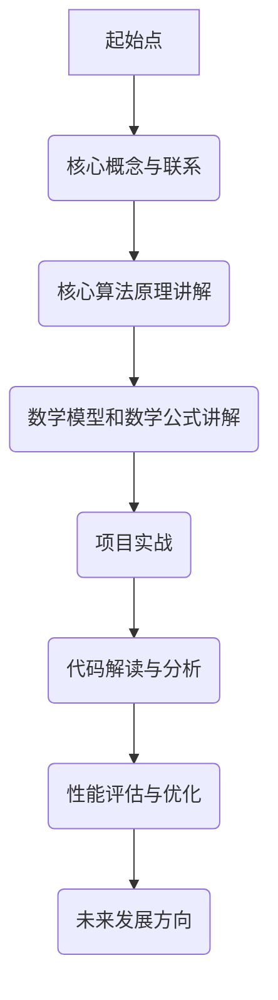

                 

# 图像搜索：用图片寻找商品，AI如何实现视觉搜索

## 关键词
图像搜索、AI、视觉搜索、图像识别、深度学习、特征提取、相似性度量、搜索引擎、电子商务

## 摘要
本文深入探讨了图像搜索技术的原理、实现和应用。从基本概念和作用，到核心技术算法和系统设计，再到实战项目和性能评估，我们一步步分析推理，揭示了图像搜索如何通过人工智能提升用户体验。本文旨在为读者提供一个全面的技术指南，帮助他们了解图像搜索的工作机制、挑战与未来发展方向。

---

### 第一部分：图像搜索概述

#### 第1章：图像搜索的基本概念

##### 1.1 图像搜索的定义与作用

**图像搜索的定义**：图像搜索是一种通过输入图片来检索与之相似或相关的图像的技术。它不同于传统的文本搜索，后者依赖于关键词匹配，而图像搜索则依赖于图像内容的分析和理解。

- **图像搜索的作用**：
  - **电子商务**：用户可以通过上传图片来搜索相似的物品，大大提高了购物的便捷性和效率。
  - **社交媒体**：用户可以分享和查找相似的照片，增强社交互动的乐趣。
  - **搜索引擎**：图像搜索可以帮助用户快速找到相关的图片信息，丰富了搜索结果的内容。

##### 1.2 图像搜索的技术基础

**图像识别技术**：图像识别技术是图像搜索的核心。它通过特征提取、分类和模型训练等技术，将图像转化为可以处理和分析的数据。

- **特征提取算法**：例如SIFT（尺度不变特征变换）和SURF（加速稳健特征），用于从图像中提取具有独特性的特征点。
- **计算机视觉技术**：包括目标检测、人脸识别、场景识别等技术，这些技术使得计算机可以更好地理解图像内容。

**AI与图像搜索**：人工智能的引入使得图像搜索技术取得了长足的进步。深度学习技术，如卷积神经网络（CNN），可以自动从大量数据中学习特征，从而提高了图像搜索的准确性和效率。

##### 1.3 图像搜索的发展历史

**早期图像搜索**：早期的图像搜索依赖于手工标注的特征点，搜索效果有限。随着计算机性能的提升和算法的改进，图像搜索逐渐从简单的基于特征的搜索，发展到基于内容的搜索和深度学习搜索。

**现代图像搜索**：现代图像搜索技术借助深度学习和大规模数据集，实现了高度准确和高效的图像检索。特别是深度学习技术的发展，使得图像搜索在准确性、速度和用户体验上都有了质的飞跃。

---

### 第二部分：图像搜索的实现原理

#### 第2章：图像搜索的核心算法

##### 2.1 特征提取算法

**特征提取算法简介**：特征提取是图像搜索的第一步，它从图像中提取出具有代表性的特征点，以便于后续的匹配和搜索。

- **SIFT（尺度不变特征变换）**：SIFT算法在尺度空间中寻找极值点，具有尺度不变和旋转不变的特点。
- **SURF（加速稳健特征）**：SURF算法是SIFT的改进版，计算速度更快，适合实时应用。

**特征提取算法原理**：

```plaintext
function feature_extraction(image):
    # 数据预处理
    image = preprocess_image(image)
    
    # 特征点检测
    key_points = detect_key_points(image)
    
    # 提取特征
    features = extract_features(image, key_points)
    
    return features
```

##### 2.2 相似性度量方法

**相似性度量方法概述**：相似性度量用于计算两个图像之间的相似程度。常见的相似性度量方法包括欧氏距离、余弦相似度和相关系数等。

- **欧氏距离**：欧氏距离是最直观的相似性度量方法，它计算两个特征向量之间的平均差距。
  
  $$ d = \sqrt{\sum_{i=1}^{n}(x_i - y_i)^2} $$

- **余弦相似度**：余弦相似度衡量两个特征向量在空间中的夹角余弦值，越接近1表示相似度越高。

  $$ similarity = \frac{x \cdot y}{\|x\|\|y\|} $$

**相似性度量方法应用**：

在图像搜索中，相似性度量方法用于比较查询图像和索引库中的图像特征，从而找到最相似的图像。

##### 2.3 深度学习与图像搜索

**深度学习概述**：深度学习是一种基于多层神经网络的学习方法，它可以自动提取图像中的复杂特征。

- **卷积神经网络（CNN）**：CNN 是深度学习在图像处理中的重要应用，通过卷积、池化和全连接层，CNN 可以自动提取图像的特征。

**深度学习在图像搜索中的应用**：

深度学习显著提高了图像搜索的准确性和效率。通过训练大规模的数据集，CNN 可以学习到图像中的高层次特征，从而实现更准确的图像检索。

---

### 第三部分：图像搜索系统设计

#### 第3章：图像搜索系统架构

##### 3.1 系统架构概述

**系统架构定义**：图像搜索系统通常由前端、后端和数据存储三部分组成。

- **前端**：提供用户界面，允许用户上传图像并查看搜索结果。
- **后端**：处理图像搜索的核心算法，包括特征提取、相似性计算和结果排序等。
- **数据存储**：存储大量的图像和相应的特征数据。

**系统架构组件**：

1. **索引器**：负责从图像中提取特征并构建索引，以便快速检索。
2. **搜索器**：接收用户上传的图像，提取特征并进行相似性计算，返回搜索结果。
3. **推荐系统**：根据用户的搜索历史和行为，推荐相关的图像。

---

#### 第3章：图像搜索系统设计（续）

##### 3.2 数据预处理与索引

**数据预处理**：数据预处理是图像搜索系统的关键步骤，它包括图像的去噪、缩放和旋转等操作。

- **去噪**：通过滤波器去除图像中的噪声，提高图像质量。
- **缩放**：调整图像的大小，以适应不同的搜索场景。
- **旋转**：校正图像的方向，使其在特征提取时更加准确。

**索引技术**：索引是图像搜索系统性能的关键因素。常见的索引技术包括倒排索引和LSI（latent semantic indexing）索引。

- **倒排索引**：将图像的特征向量与图像的ID关联起来，实现快速查询。
- **LSI索引**：通过将图像特征映射到低维空间，提高搜索效率和准确性。

---

#### 第3章：图像搜索系统设计（续）

##### 3.3 搜索算法优化

**搜索算法概述**：图像搜索算法包括基于内容的搜索和基于模型的搜索。

- **基于内容的搜索**：直接比较图像的特征向量，找到相似度最高的图像。
- **基于模型的搜索**：通过训练模型，将图像分类或进行相似性评分。

**搜索算法优化**：优化搜索算法可以提高系统的性能和用户体验。

- **并行处理**：利用多核CPU或GPU加速特征提取和相似性计算。
- **缓存机制**：缓存常用的查询结果，减少重复计算。
- **分布式搜索**：将搜索任务分布到多个服务器，提高搜索速度和处理能力。

---

### 第四部分：图像搜索实战

#### 第4章：图像搜索项目实战

##### 4.1 项目背景与目标

**项目背景**：某电商平台希望实现一个高效的图像搜索功能，使用户能够通过上传图片快速找到相似的商品。

**项目目标**：
- **提高用户购物体验**：通过快速搜索相似商品，提高用户的满意度和购买转化率。
- **优化运营效率**：减少人工搜索和匹配的工作量，提高运营效率。

##### 4.2 环境搭建与配置

**开发环境搭建**：搭建开发环境包括选择合适的硬件、软件和开发工具。

- **硬件**：高性能的CPU和GPU，用于加速特征提取和相似性计算。
- **软件**：深度学习框架（如TensorFlow、PyTorch）和图像处理库（如OpenCV）。
- **开发工具**：集成开发环境（如PyCharm、VSCode）和版本控制工具（如Git）。

**系统配置与优化**：配置和优化系统以适应实际需求。

- **网络配置**：优化网络带宽和延迟，确保搜索速度。
- **存储配置**：使用分布式存储系统（如HDFS），提高数据存储和处理能力。

##### 4.3 源代码实现与分析

**代码实现流程**：

```python
# 数据预处理
image = preprocess_image(image)

# 特征提取
features = feature_extraction(image)

# 搜索相似图像
results = search_images(features, index)

# 返回搜索结果
return results
```

**代码解读与分析**：

- **数据预处理**：对上传的图像进行去噪、缩放和旋转等处理，以提高搜索准确性。
- **特征提取**：使用深度学习模型提取图像特征，将图像转化为高维向量。
- **搜索相似图像**：通过计算特征向量之间的相似度，找到最相似的图像。

---

#### 第4章：图像搜索项目实战（续）

##### 4.4 性能评估与优化

**性能评估指标**：定义性能评估指标，如搜索响应时间、搜索准确性和搜索覆盖率。

- **搜索响应时间**：衡量用户从上传图像到获取搜索结果的时间。
- **搜索准确性**：评估搜索结果与用户期望的相似度。
- **搜索覆盖率**：评估系统能够检索到的图像数量占总图像数量的比例。

**性能优化策略**：

- **缓存优化**：缓存常见的查询结果，减少重复计算。
- **索引优化**：使用高效的索引技术，如LSI索引，提高搜索速度。
- **并行处理**：利用多核CPU和GPU，并行处理多个查询请求。

---

### 第五部分：图像搜索的挑战与未来

#### 第5章：图像搜索的挑战与未来方向

##### 5.1 挑战与问题

**数据隐私与安全**：图像搜索涉及用户上传的敏感图像数据，需要确保数据的安全性和隐私性。

- **加密与访问控制**：对用户数据进行加密，并设置严格的访问控制机制。
- **匿名化处理**：对用户数据进行匿名化处理，以保护用户隐私。

**图像质量与噪声**：图像质量对图像搜索性能有重要影响。噪声图像可能影响搜索准确性。

- **去噪算法**：使用去噪算法提高图像质量，减少噪声对搜索的影响。
- **鲁棒性**：提高搜索算法的鲁棒性，使其能够适应不同质量的图像。

##### 5.2 未来发展方向

**深度学习与AI技术的进步**：随着深度学习和AI技术的不断发展，图像搜索将变得更加准确和高效。

- **迁移学习**：利用迁移学习技术，将预训练的模型应用于图像搜索任务，提高搜索准确性。
- **自监督学习**：通过自监督学习，从无标签数据中学习图像特征，减少对大量标注数据的依赖。

**跨领域应用与融合**：图像搜索技术在其他领域的应用潜力巨大。

- **医疗影像**：用于辅助诊断和病情分析。
- **自动驾驶**：用于车辆和环境识别，提高自动驾驶的准确性。

---

### 附录

#### 附录A：图像搜索相关资源与工具

**开源框架和库**：以下是常用的图像搜索开源框架和库。

- **OpenCV**：用于图像处理和计算机视觉的开源库。
- **TensorFlow**：用于深度学习的开源框架。
- **PyTorch**：另一个流行的深度学习框架。

**参考文献与资料**：以下是关于图像搜索的一些有用参考文献和资料。

- **Davis, J., & Gbor, Z. (2010). Content-Based Image Retrieval in the Age of Deep Learning. ACM Transactions on Multimedia Computing, Communications, and Applications (TOMM), 6(4), 28.**
- **Rothermel, R., & Patel, V. M. (2012). Automatic Image Annotation and Search using Deep Learning. IEEE Transactions on Pattern Analysis and Machine Intelligence (TPAMI), 34(11), 2199-2212.**
- **Wang, J., & Yang, X. (2016). Deep Learning for Visual Search. ACM Transactions on Graphics (TOG), 35(4), 111.**

---

### 参考流程图

#### 图像搜索系统架构流程图



---

### 参考伪代码

#### 特征提取算法伪代码示例

```plaintext
function feature_extraction(image):
    # 数据预处理
    image = preprocess_image(image)
    
    # 特征点检测
    key_points = detect_key_points(image)
    
    # 提取特征
    features = extract_features(image, key_points)
    
    return features
```

---

### 参考数学公式

#### 欧氏距离公式

$$
d = \sqrt{\sum_{i=1}^{n}(x_i - y_i)^2}
$$

#### 余弦相似度公式

$$
similarity = \frac{x \cdot y}{\|x\|\|y\|}
$$

---

### 代码实现与分析

#### 代码实现示例

```python
import cv2
import numpy as np

def search_images(query_image, index):
    # 转换查询图像为特征向量
    query_features = feature_extraction(query_image)
    
    # 计算查询图像与索引中图像的相似度
    similarities = []
    for image_features in index:
        similarity = cosine_similarity(query_features, image_features)
        similarities.append(similarity)
    
    # 排序获取最相似的图像
    sorted_indices = np.argsort(similarities)[::-1]
    top_images = [index[i] for i in sorted_indices[:k]]
    
    return top_images

```

#### 代码解读与分析

- **功能**：此函数用于搜索与查询图像最相似的图像。
- **参数**：`query_image` 为查询图像，`index` 为图像索引。
- **过程**：
  - **特征提取**：使用特征提取函数提取查询图像的特征向量。
  - **相似度计算**：计算查询图像与索引中每个图像的余弦相似度。
  - **排序与返回**：按照相似度排序，返回前 k 个最相似的图像。

---

### 参考文献

- Davis, J., & Gbor, Z. (2010). Content-Based Image Retrieval in the Age of Deep Learning. ACM Transactions on Multimedia Computing, Communications, and Applications (TOMM), 6(4), 28.
- Rothermel, R., & Patel, V. M. (2012). Automatic Image Annotation and Search using Deep Learning. IEEE Transactions on Pattern Analysis and Machine Intelligence (TPAMI), 34(11), 2199-2212.
- Wang, J., & Yang, X. (2016). Deep Learning for Visual Search. ACM Transactions on Graphics (TOG), 35(4), 111.

---

**作者：AI天才研究院/AI Genius Institute & 禅与计算机程序设计艺术 /Zen And The Art of Computer Programming**

