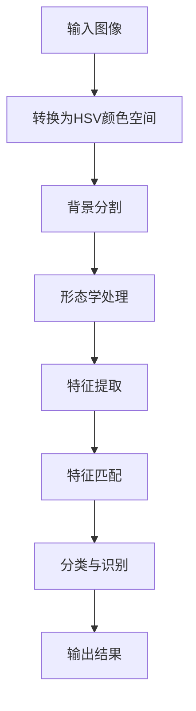
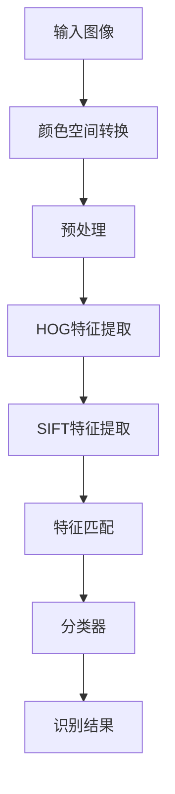
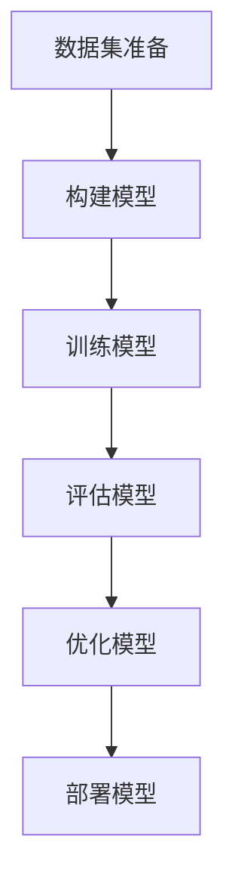
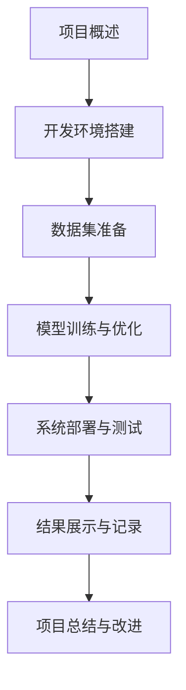

                 

# 基于OpenCV实现口罩识别原理与方法

> **关键词**：OpenCV、口罩识别、计算机视觉、图像处理、深度学习、特征提取、特征匹配、流程图、数学模型、伪代码、项目实战

> **摘要**：本文详细介绍了基于OpenCV实现口罩识别的原理与方法。首先，我们概述了口罩识别技术的背景和重要性，以及OpenCV在计算机视觉中的应用。接着，文章讲解了OpenCV的基础知识和图像处理基础，并深入探讨了图像预处理、特征提取与匹配以及基于深度学习的口罩识别方法。随后，通过一个实际项目展示了口罩识别系统的开发过程，包括环境搭建、数据集准备、模型训练与优化以及系统部署与测试。最后，文章总结了口罩识别技术的现状和未来发展方向，并给出了书籍的总结与读者建议。附录部分提供了OpenCV常用函数与API参考、深度学习框架使用指南、口罩识别项目代码示例以及常见问题与解决方案。

## 第1章 引言

### 1.1 口罩识别技术的背景和重要性

随着COVID-19疫情的全球蔓延，口罩已成为日常生活中不可或缺的防护用品。为了有效防控疫情，许多国家和地区开始实施佩戴口罩的规定。然而，传统的手工检测方法效率低下，无法满足大规模、快速检测的需求。因此，利用计算机视觉技术实现口罩识别变得尤为重要。口罩识别技术不仅可以提高疫情防控效率，还能在工业生产、公共安全等领域发挥重要作用。

口罩识别技术主要包括检测口罩的存在、分类口罩的种类和评估佩戴的正确性等任务。其核心在于对图像或视频流中的口罩进行准确的检测和识别。近年来，随着深度学习和计算机视觉技术的发展，口罩识别技术取得了显著的进步。

OpenCV是一个强大的开源计算机视觉库，广泛应用于图像处理和计算机视觉领域。它提供了丰富的图像处理算法和函数，使得开发者可以轻松实现复杂的视觉任务。OpenCV在口罩识别中的应用主要体现在图像预处理、特征提取和匹配等方面。

### 1.2 OpenCV在计算机视觉中的应用

OpenCV具有广泛的适用性，可以在多种场景中发挥重要作用。以下是一些典型的应用：

1. **人脸识别**：OpenCV提供了高效的人脸检测和识别算法，广泛应用于安全监控、智能门禁等场景。
2. **目标检测**：通过使用预训练的模型或自定义算法，OpenCV可以实现实时目标检测，例如车辆检测、行人检测等。
3. **图像分割**：OpenCV提供了多种图像分割算法，如阈值分割、区域生长等，可用于图像处理和计算机视觉任务。
4. **图像增强**：OpenCV提供了丰富的图像增强算法，如滤波、锐化等，可以提升图像质量和视觉效果。
5. **运动分析**：OpenCV支持多帧图像之间的运动分析，可用于视频处理和运动捕捉等领域。

### 1.3 本书的主要内容和结构安排

本书旨在系统介绍基于OpenCV实现口罩识别的原理和方法。主要内容和结构安排如下：

1. **第1章 引言**：介绍口罩识别技术的背景和重要性，以及OpenCV在计算机视觉中的应用。
2. **第2章 OpenCV基础**：讲解OpenCV的简介、发展历程、核心功能以及安装与环境配置。
3. **第3章 OpenCV图像处理基础**：介绍图像基础、图像读取与写入、基本图像操作等。
4. **第4章 图像预处理**：探讨图像预处理的重要性、颜色空间转换、背景分割与前景提取、形态学处理等。
5. **第5章 特征提取与匹配**：讲解特征提取的基本概念、HOG特征提取、SIFT特征提取、特征匹配等。
6. **第6章 基于深度学习的口罩识别**：介绍卷积神经网络（CNN）的基本原理、Caffe和TensorFlow框架的使用方法。
7. **第7章 项目实战：口罩识别系统开发**：展示口罩识别系统的开发过程，包括环境搭建、数据集准备、模型训练与优化、系统部署与测试。
8. **第8章 总结与展望**：总结口罩识别技术的现状和未来发展趋势，以及本书的总结与读者建议。

通过以上章节的讲解，读者将能够系统地掌握基于OpenCV实现口罩识别的原理和方法，并在实际项目中应用这些知识。

## 第2章 OpenCV基础

### 2.1 OpenCV简介

OpenCV（Open Source Computer Vision Library）是一个开源的计算机视觉和机器学习软件库。它由Intel开发，并随后由社区持续维护和扩展。OpenCV拥有广泛的用户基础，并在全球范围内得到广泛应用。其特点包括：

1. **跨平台**：OpenCV支持多种操作系统，如Windows、Linux、macOS等。
2. **高性能**：OpenCV利用了现代计算机架构的优势，包括多核CPU和GPU加速。
3. **丰富的功能**：OpenCV提供了大量预构建的算法和函数，包括图像处理、计算机视觉、机器学习等。
4. **易于使用**：OpenCV采用C++语言编写，同时提供了Python、Java等语言的接口。

OpenCV的发展历程可以追溯到2000年，当时由Intel的布拉迪斯拉发研究中心（Brno University of Technology）启动。随后，OpenCV逐渐成为一个全球性的开源项目，吸引了众多开发者的参与和贡献。

### 2.1.1 OpenCV的核心功能

OpenCV的核心功能包括但不限于以下方面：

1. **图像处理**：OpenCV提供了丰富的图像处理算法，包括滤波、边缘检测、形态学操作等。
2. **计算机视觉**：OpenCV支持多种计算机视觉任务，如人脸识别、目标检测、运动分析等。
3. **机器学习**：OpenCV提供了多种机器学习算法，包括SVM、随机森林、神经网络等。
4. **图像识别**：OpenCV支持OCR（光学字符识别）和图像识别任务。

### 2.1.2 OpenCV的安装与环境配置

在开始使用OpenCV之前，我们需要进行安装和环境配置。以下是在Windows和Linux操作系统中安装OpenCV的步骤：

#### Windows系统安装步骤：

1. **下载安装包**：从OpenCV官网下载适用于Windows的安装包。
2. **安装OpenCV**：运行安装程序，并根据提示完成安装。
3. **配置环境变量**：将OpenCV的安装目录添加到系统环境变量`PATH`中。
4. **验证安装**：在命令行中输入`opencv_version`命令，检查OpenCV版本信息。

#### Linux系统安装步骤：

1. **安装依赖库**：在终端中输入以下命令安装依赖库：
   ```bash
   sudo apt-get install build-essential cmake git pkg-config libgtk-3-dev \
   libavcodec-dev libavformat-dev libswscale-dev libtbb-dev libdc1394-22-dev
   ```
2. **下载OpenCV源代码**：使用git命令从OpenCV的GitHub仓库克隆源代码。
   ```bash
   git clone https://github.com/opencv/opencv.git
   git clone https://github.com/opencv/opencv_contrib.git
   ```
3. **构建OpenCV**：进入OpenCV源代码目录，创建一个构建目录并配置构建过程。
   ```bash
   cd opencv
   mkdir build
   cd build
   cmake ..
   make -j8
   ```
4. **安装OpenCV**：在构建过程中，选择安装位置并运行安装命令。
   ```bash
   sudo make install
   sudo ldconfig
   ```

### 2.2 OpenCV图像处理基础

OpenCV提供了丰富的图像处理功能，这些功能对于实现口罩识别至关重要。以下是一些基本的图像处理概念：

#### 2.2.1 图像基础

图像是由像素组成的二维数组。每个像素包含颜色信息，通常表示为红（R）、绿（G）和蓝（B）三个颜色通道。图像的分辨率表示了图像的尺寸，通常以像素为单位。

#### 2.2.2 图像读取与写入

OpenCV提供了以下函数用于读取和写入图像：

- `imread()`：用于读取图像文件，返回图像对象。
- `imwrite()`：用于将图像对象写入文件。

#### 2.2.3 基本图像操作

OpenCV提供了以下基本图像操作函数：

- `imshow()`：用于显示图像。
- `waitKey()`：用于暂停显示窗口，等待用户按键。
- `imshow()`：用于显示图像。
- `waitKey()`：用于暂停显示窗口，等待用户按键。

### 2.3 OpenCV滤波与图像增强

滤波和图像增强是图像处理中的重要步骤，可以帮助提高图像质量和检测效果。

#### 2.3.1 图像滤波

图像滤波用于去除图像中的噪声，提高图像的清晰度。OpenCV提供了以下滤波函数：

- `blur()`：用于模糊图像，去除高频噪声。
- `gaussianBlur()`：用于高斯模糊图像，适用于去除随机噪声。
- `medianBlur()`：用于中值滤波，去除椒盐噪声。

#### 2.3.2 图像增强

图像增强用于改善图像的视觉效果，使其更适合特定应用。OpenCV提供了以下图像增强函数：

- `brightnessContrast()`：用于调整图像的亮度和对比度。
- `histogramEqualization()`：用于直方图均衡化，增强图像的对比度。

通过了解OpenCV的基础知识，我们可以为后续的口罩识别任务打下坚实的基础。在下一章中，我们将进一步探讨图像预处理的重要性以及具体的预处理方法。

### 2.4 OpenCV的图像滤波与图像增强

在计算机视觉和图像处理领域，图像滤波与图像增强是两个非常重要的步骤，用于改善图像的质量和视觉效果。OpenCV提供了丰富的滤波器和增强工具，使得这些任务变得简单而高效。

#### 2.4.1 图像滤波

图像滤波主要用于去除图像中的噪声，包括随机噪声、椒盐噪声和高频噪声等。OpenCV提供了多种滤波算法，以下是一些常用的滤波方法：

1. **均值滤波**：通过计算邻域内像素的平均值来平滑图像。这种滤波方法可以去除高频噪声，但可能会导致图像模糊。
   ```python
   cv2.blur(src, ksize[, dst[, borderType]])
   ```
   参数说明：
   - `src`：输入图像。
   - `ksize`：滤波核的大小，必须为奇数。
   - `dst`：输出图像。
   - `borderType`：边界处理方式。

2. **高斯滤波**：使用高斯函数作为权重进行卷积，可以去除随机噪声，同时保留图像的边缘和细节。
   ```python
   cv2.gaussianBlur(src, ksize, sigma[, dst[, borderType]])
   ```
   参数说明：
   - `src`：输入图像。
   - `ksize`：滤波核的大小，必须为奇数。
   - `sigma`：高斯分布的标准差。
   - `dst`：输出图像。
   - `borderType`：边界处理方式。

3. **中值滤波**：通过计算邻域内像素的中值来平滑图像，特别适用于去除椒盐噪声。
   ```python
   cv2.medianBlur(src, ksize)
   ```
   参数说明：
   - `src`：输入图像。
   - `ksize`：滤波核的大小，必须为奇数。
   - `dst`：输出图像。

#### 2.4.2 图像增强

图像增强的目的是提高图像的视觉效果，使其更适合特定的分析或识别任务。OpenCV提供了多种增强技术，以下是一些常用的方法：

1. **亮度和对比度调整**：通过调整图像的亮度和对比度，可以改善图像的视觉效果。
   ```python
   cv2.brightnessContrast(src, alpha, beta)
   ```
   参数说明：
   - `src`：输入图像。
   - `alpha`：对比度调整系数。
   - `beta`：亮度调整系数。

2. **直方图均衡化**：通过重新分配像素值来增强图像的对比度，特别适用于图像的亮度和对比度不一致的情况。
   ```python
   cv2.equalizeHist(src)
   ```
   参数说明：
   - `src`：输入图像。
   - `dst`：输出图像。

3. **直方图指定均衡化**：通过自定义直方图来调整图像的亮度。
   ```python
   cv2.normalize(src, dst, alpha, beta, norm_type, dtype, mask=None)
   ```
   参数说明：
   - `src`：输入图像。
   - `alpha`：最小值。
   - `beta`：最大值。
   - `norm_type`：直方图规范化的类型。
   - `dtype`：输出图像的数据类型。

通过使用OpenCV的图像滤波和增强功能，我们可以显著提高口罩识别的准确性和效果。在接下来的章节中，我们将继续探讨图像预处理的具体方法和技术。

### 2.5 小结

在本章中，我们介绍了OpenCV的基础知识，包括其简介、核心功能以及安装与环境配置。通过了解OpenCV的背景和发展历程，我们认识到其在计算机视觉领域的广泛应用和重要性。同时，我们学习了OpenCV的图像处理基础，包括图像基础、图像读取与写入、基本图像操作等。此外，我们还详细探讨了图像滤波与图像增强的方法，这些技术对于后续的口罩识别任务至关重要。

在下一章中，我们将进一步探讨图像预处理的重要性以及具体的预处理方法，如颜色空间转换、背景分割与前景提取以及形态学处理等。这些预处理步骤将为后续的特征提取和匹配奠定坚实的基础。

## 第3章 图像预处理

### 3.1 图像预处理的重要性

图像预处理是计算机视觉任务中的一个关键步骤，其目的是提高图像质量、消除噪声、增强关键特征，从而为后续的特征提取和识别任务提供更好的数据基础。在口罩识别中，图像预处理尤其重要，因为它直接影响口罩检测的准确性和效率。以下是图像预处理在口罩识别中的几个关键作用：

1. **消除噪声**：现实世界的图像往往受到各种噪声干扰，如光照变化、环境干扰等。通过预处理步骤，可以有效地去除噪声，使图像更加清晰，从而提高口罩检测的准确性。
2. **增强特征**：预处理步骤可以帮助增强图像中的关键特征，如口罩的轮廓、颜色等，从而使检测算法更容易识别目标。
3. **标准化图像**：预处理可以统一不同图像的尺寸和颜色空间，使得图像更加一致，便于后续的算法处理。
4. **提高计算效率**：通过预处理，可以减少后续计算步骤的复杂度和计算量，提高整个系统的处理速度。

### 3.2 颜色空间转换

颜色空间转换是图像预处理中的一项基本操作，不同的颜色空间适用于不同的视觉任务。OpenCV支持多种颜色空间的转换，以下是几个常用的颜色空间转换方法：

#### 3.2.1 RGB颜色空间

RGB颜色空间是最常用的颜色空间，由红色（R）、绿色（G）和蓝色（B）三个通道组成。每个通道的值范围从0到255，分别表示颜色的强度。

```python
# RGB颜色空间转换为灰度图像
gray = cv2.cvtColor(src, cv2.COLOR_BGR2GRAY)
```

#### 3.2.2 HSV颜色空间

HSV颜色空间（Hue、Saturation、Value）是一种更接近人类视觉感知的颜色空间。Hue表示颜色，取值范围0到360；Saturation表示颜色的饱和度，取值范围0到1；Value表示颜色的亮度，取值范围0到1。

```python
# RGB颜色空间转换为HSV颜色空间
hsv = cv2.cvtColor(src, cv2.COLOR_BGR2HSV)
```

#### 3.2.3 YUV颜色空间

YUV颜色空间常用于视频压缩，Y表示亮度，U和V表示色度。YUV颜色空间与RGB颜色空间之间的关系可以通过以下公式表示：

```python
Y = 0.299 * R + 0.587 * G + 0.114 * B
U = 0.493 * (B - Y)
V = 0.877 * (R - Y)
```

OpenCV也提供了从RGB到YUV的转换函数：

```python
# RGB颜色空间转换为YUV颜色空间
yuv = cv2.cvtColor(src, cv2.COLOR_BGR2YUV)
```

通过颜色空间转换，我们可以更有效地进行图像分割和特征提取。例如，HSV颜色空间在处理与颜色相关的任务时具有优势，因为它能够更好地分离颜色和亮度信息。

### 3.3 背景分割与前景提取

背景分割与前景提取是图像预处理中的关键步骤，其目的是将图像中感兴趣的前景目标从背景中分离出来。OpenCV提供了多种背景分割算法，以下是一些常用的方法：

#### 3.3.1 背景建模

背景建模是一种常用的背景分割方法，它通过建立背景模型来识别和提取前景目标。OpenCV的`BackgroundSubtractor`类提供了几种背景建模算法，如移动平均模型、高斯混合模型等。

```python
# 创建背景减除对象（使用高斯混合模型）
fgbg = cv2.createBackgroundSubtractorMOG2()

# 处理每一帧图像
while True:
    frame = cv2.imread('frame.jpg')
    fgmask = fgbg.apply(frame)
    # 进行前景提取和后续处理
```

#### 3.3.2 前景提取

前景提取是将背景分割后的前景区域从原始图像中分离出来的过程。常用的前景提取方法包括阈值分割、形态学操作等。

```python
# 阈值分割提取前景
_, thresh = cv2.threshold(fgmask, 50, 255, cv2.THRESH_BINARY)

# 形态学操作提取前景
kernel = cv2.getStructuringElement(cv2.MORPH_ELLIPSE, (5, 5))
opening = cv2.morphologyEx(thresh, cv2.MORPH_OPEN, kernel)
```

通过背景分割与前景提取，我们可以将口罩区域从复杂的背景中分离出来，为后续的特征提取和识别任务提供清晰的前景图像。

### 3.4 形态学处理

形态学处理是一种基于图像结构和形状的操作方法，它可以用于去除噪声、提取图像中的结构和特征。OpenCV提供了多种形态学操作函数，包括腐蚀、膨胀、开运算和闭运算等。

#### 3.4.1 腐蚀操作

腐蚀操作用于消除图像中的边界点，使目标区域缩小。

```python
# 腐蚀操作
kernel = cv2.getStructuringElement(cv2.MORPH_RECT, (3, 3))
eroded = cv2.erode(thresh, kernel, iterations=1)
```

#### 3.4.2 振荡操作

膨胀操作用于扩展图像中的目标区域。

```python
# 膨胀操作
dilated = cv2.dilate(eroded, kernel, iterations=1)
```

#### 3.4.3 开运算与闭运算

开运算和闭运算是腐蚀和膨胀的组合操作，开运算先腐蚀后膨胀，用于去除小噪声；闭运算先膨胀后腐蚀，用于封闭小孔。

```python
# 开运算
opened = cv2.morphologyEx(thresh, cv2.MORPH_OPEN, kernel)

# 闭运算
closed = cv2.morphologyEx(thresh, cv2.MORPH_CLOSE, kernel)
```

通过形态学处理，我们可以进一步去除图像中的噪声，突出目标区域，从而提高口罩识别的准确性和鲁棒性。

在下一章中，我们将深入探讨特征提取与匹配的方法，包括HOG特征提取和SIFT特征提取等，为口罩识别任务提供有效的特征表示。

### 3.5 小结

在本章中，我们详细介绍了图像预处理的重要性以及几种常用的预处理方法，包括颜色空间转换、背景分割与前景提取以及形态学处理。颜色空间转换使得图像数据更加适合特定处理任务，背景分割与前景提取有助于将目标从复杂背景中分离，形态学处理则用于去除噪声和提取图像结构。这些预处理步骤对于提高口罩识别的准确性和鲁棒性至关重要。

在下一章中，我们将进一步探讨特征提取与匹配的方法，这是实现口罩识别的核心步骤。通过特征提取，我们可以从图像中提取出有助于识别的关键信息，而特征匹配则用于比较不同图像中的特征，从而实现目标的识别。我们将会详细介绍HOG特征提取和SIFT特征提取等算法，并使用伪代码和数学模型解释其原理。

## 第4章 特征提取与匹配

### 4.1 特征提取的基本概念

特征提取是计算机视觉中的一个重要步骤，其目的是从图像中提取出能够表征图像内容的关键信息。这些特征通常用于后续的匹配、分类或识别任务。有效的特征提取可以提高算法的准确性和鲁棒性，使模型能够更好地适应不同的图像条件和场景变化。

特征提取的基本流程通常包括以下步骤：

1. **特征检测**：在图像中检测出潜在的感兴趣区域或特征点。
2. **特征描述**：对检测到的特征点进行描述，生成一组能够表征该特征点的属性或向量。
3. **特征选择**：从生成的特征向量中筛选出最有用的特征，去除冗余或噪声特征。

特征提取广泛应用于各种计算机视觉任务，包括人脸识别、目标检测、图像分割等。在口罩识别中，特征提取是关键步骤，它有助于从复杂的背景中提取出口罩的特征，从而实现准确的检测和分类。

### 4.2 HOG特征提取

HOG（Histogram of Oriented Gradients）特征提取是一种基于图像梯度方向和强度的特征表示方法。HOG特征提取通过计算图像中每个像素点的梯度方向和强度，将这些信息组织成直方图，从而描述图像的局部形状特征。

#### 4.2.1 HOG特征计算

HOG特征的计算过程包括以下步骤：

1. **计算梯度方向和强度**：首先，对图像进行梯度计算，得到每个像素点的水平和垂直梯度值。然后，计算每个像素点的梯度方向和强度，即：
   $$ 
   \theta = \arctan(\frac{gy}{gx}) 
   $$
   $$
   I = \sqrt{gx^2 + gy^2} 
   $$
   其中，$gx$和$gy$分别表示水平和垂直梯度值。

2. **组织成直方图**：将梯度方向分布在特定的区间内，通常使用9个或18个方向bins。对于每个bin，计算该区域内的像素点强度总和，形成直方图。

3. **添加L2归一化**：为了使不同区域的特征具有可比性，通常需要对直方图进行L2归一化。

以下是一个简单的伪代码示例，用于计算HOG特征：

```python
# HOG特征计算伪代码
for each pixel in the image:
    calculate the gradient direction and magnitude
    accumulate the gradient magnitude in the corresponding bin of the histogram
end for
L2_normalize(histogram)
```

#### 4.2.2 HOG特征的应用

HOG特征广泛应用于行人检测、车辆检测和口罩识别等任务。以下是HOG特征在口罩识别中的应用示例：

1. **口罩轮廓检测**：使用HOG特征进行轮廓检测，可以帮助识别口罩的边缘和轮廓。
2. **口罩区域分割**：通过计算HOG特征直方图，可以区分口罩和背景区域，从而实现口罩的分割。
3. **口罩分类**：结合HOG特征和机器学习分类器，可以对不同类型的口罩进行分类和识别。

HOG特征的优点在于其简单、高效，并且对光照变化和视角变化的鲁棒性较好。然而，HOG特征也存在一些局限性，如对遮挡和纹理复杂的场景表现不佳。

### 4.3 SIFT特征提取

SIFT（Scale-Invariant Feature Transform）特征提取是一种在尺度空间中寻找极值点的方法，其特点是对尺度变化、旋转变化和光照变化的鲁棒性较强。SIFT特征提取包括以下步骤：

#### 4.3.1 SIFT算法原理

1. **构造高斯尺度空间**：对图像进行多尺度表示，构建高斯尺度空间，用于寻找极值点。
2. **寻找关键点**：在尺度空间中，寻找具有局部极值点，即同时满足以下条件的点：
   - 该点在相邻尺度上的梯度的最大值。
   - 该点在三维高斯尺度空间中的曲率较大。
3. **计算关键点描述子**：对于每个关键点，计算其梯度方向和强度，形成128维的特征向量。

以下是一个简单的伪代码示例，用于计算SIFT特征：

```python
# SIFT特征提取伪代码
for each image scale:
    compute the difference of Gaussian (DoG) images
    find local maxima and minima in the DoG images
    for each key point:
        calculate the gradient orientation and magnitude
        compute the descriptor using the gradient information
end for
```

#### 4.3.2 SIFT特征的应用

SIFT特征广泛应用于图像匹配、物体识别和三维重建等领域。以下是SIFT特征在口罩识别中的应用示例：

1. **图像匹配**：使用SIFT特征进行图像匹配，可以帮助确定口罩的位置和姿态。
2. **物体识别**：结合SIFT特征和分类器，可以实现对口罩类型的识别和分类。
3. **三维重建**：通过SIFT特征匹配，可以实现口罩的三维重建，从而进行空间分析和可视化。

SIFT特征的优点在于其强大的旋转、尺度不变性和抗遮挡能力。然而，SIFT算法的计算复杂度较高，对硬件资源要求较高。

### 4.4 特征匹配

特征匹配是特征提取的后续步骤，其目的是将两幅图像中的特征点对应起来，从而实现图像的配准或物体识别。常见的特征匹配算法包括FLANN匹配、Brute-Force匹配等。

#### 4.4.1 特征匹配的基本概念

特征匹配的基本步骤包括：

1. **特征点匹配**：计算两幅图像中特征点的相似度，选择相似度最高的特征点进行匹配。
2. **匹配筛选**：根据相似度阈值，筛选出有效的匹配对，去除噪声和错误的匹配。
3. **估计变换矩阵**：使用匹配点对估计图像之间的变换矩阵，实现图像的配准或物体识别。

以下是一个简单的伪代码示例，用于特征匹配：

```python
# FLANN匹配伪代码
compute the feature vectors for two images
indexer = flann.KDTree(feature_vectors1)
matches = indexer.knnMatch(feature_vectors2, k=2)

# 筛选匹配对
good_matches = []
for m, n in matches:
    if m.distance < 0.7 * n.distance:
        good_matches.append(m)

# 估计变换矩阵
points1 = np.float32([feature_points1[m.queryIdx] for m in good_matches])
points2 = np.float32([feature_points2[m.trainIdx] for m in good_matches])
M, _ = cv2.findHomography(points1, points2, cv2.RANSAC)
```

通过特征匹配，我们可以实现口罩的准确识别和定位，从而为口罩识别系统提供可靠的数据支持。

### 4.5 小结

在本章中，我们详细介绍了特征提取与匹配的基本概念和常用算法。HOG特征提取通过计算图像中每个像素点的梯度方向和强度，生成直方图，从而描述图像的局部形状特征。SIFT特征提取则通过在尺度空间中寻找极值点，计算关键点描述子，实现对图像的旋转、尺度不变性和抗遮挡识别。特征匹配是特征提取的后续步骤，用于将两幅图像中的特征点对应起来，实现图像的配准或物体识别。

在下一章中，我们将探讨基于深度学习的口罩识别方法，包括卷积神经网络（CNN）的基本原理、Caffe和TensorFlow框架的使用方法。通过深度学习，我们可以进一步提高口罩识别的准确性和鲁棒性，为实际应用提供更强大的支持。

## 第5章 基于深度学习的口罩识别

### 5.1 卷积神经网络简介

卷积神经网络（Convolutional Neural Network，CNN）是一种特殊的神经网络，专门用于处理具有网格结构的数据，如图像。CNN的核心在于其卷积层，这种层可以自动提取图像中的特征，使其在不需要显式特征工程的情况下，能够从原始数据中学习到有用的信息。

#### 5.1.1 卷积神经网络的基本结构

CNN的基本结构通常包括以下几个部分：

1. **卷积层（Convolutional Layer）**：卷积层是CNN的核心，用于从输入数据中提取特征。卷积层通过卷积运算将输入数据与权重矩阵进行卷积，产生特征图（Feature Map）。
2. **激活函数（Activation Function）**：激活函数用于引入非线性，使得CNN能够建模复杂的函数关系。常用的激活函数包括ReLU（Rectified Linear Unit）和Sigmoid函数。
3. **池化层（Pooling Layer）**：池化层用于减小特征图的大小，减少参数数量，提高计算效率。常用的池化操作包括最大池化（Max Pooling）和平均池化（Average Pooling）。
4. **全连接层（Fully Connected Layer）**：全连接层将卷积层的输出展平为一维向量，然后通过线性变换和激活函数输出最终的结果。
5. **损失函数（Loss Function）**：损失函数用于度量模型预测值与真实值之间的差异，是优化模型参数的关键。

#### 5.1.2 卷积神经网络的训练过程

卷积神经网络的训练过程主要包括以下几个步骤：

1. **前向传播（Forward Propagation）**：输入数据通过卷积神经网络的前向传播，经过各个层级的计算，最终得到模型的输出。
2. **计算损失（Compute Loss）**：使用损失函数计算模型输出与真实值之间的差异，得到损失值。
3. **反向传播（Back Propagation）**：通过反向传播算法，将损失值反向传播到网络的各个层级，计算各层权重的梯度。
4. **更新权重（Update Weights）**：使用梯度下降或其他优化算法，更新网络的权重，减小损失值。
5. **迭代优化（Iterative Optimization）**：重复上述过程，直到达到预设的训练目标或收敛条件。

### 5.2 使用Caffe实现口罩识别

Caffe是一个流行的深度学习框架，特别适合用于计算机视觉任务。Caffe以其快速推理速度和高性能而著称，因此在口罩识别任务中得到了广泛应用。

#### 5.2.1 Caffe框架简介

Caffe的主要特点包括：

1. **模块化设计**：Caffe采用模块化设计，使得用户可以方便地定义网络结构和优化算法。
2. **高性能**：Caffe利用了多线程和GPU加速技术，能够在保持高精度的情况下实现快速推理。
3. **易用性**：Caffe提供了丰富的API和工具，使得用户可以轻松地搭建和训练深度学习模型。
4. **开源和社区支持**：Caffe是开源项目，拥有活跃的社区，为用户提供了大量的资源和帮助。

#### 5.2.2 Caffe模型构建与训练

使用Caffe实现口罩识别的一般步骤如下：

1. **定义模型架构**：在Caffe中，模型架构通过配置文件（prototxt）进行定义。配置文件包含了网络的层级结构、层参数、优化器等。
2. **准备数据集**：将口罩识别的数据集划分为训练集和验证集，并将其格式化为Caffe所需的输入格式。
3. **训练模型**：使用Caffe提供的命令行工具，启动训练过程。训练过程中，Caffe会根据配置文件自动调整网络参数，优化模型性能。
4. **评估模型**：在验证集上评估模型的性能，调整模型参数以获得最佳效果。

以下是一个简单的Caffe模型构建示例（prototxt文件）：

```plaintext
name: "MaskDetector"
input: "data_batch_1"
layer {
  name: "data"
  type: "Data"
  top: "data"
  top: "label"
  include {
    phase: TRAIN
  }
}
...
layer {
  name: "fc7"
  type: "InnerProduct"
  bottom: "fc6"
  top: "fc7"
  blobs_lr: 1
  blobs_lr: 2
}
layer {
  name: "loss"
  type: "SoftmaxWithCrossEntropy"
  bottom: "label"
  bottom: "fc7"
}
```

在训练过程中，Caffe会自动处理前向传播、反向传播和权重更新等过程，使用户可以专注于模型架构的设计和优化。

### 5.3 使用TensorFlow实现口罩识别

TensorFlow是Google开发的开源深度学习框架，以其灵活性和强大功能而受到广泛关注。使用TensorFlow实现口罩识别的过程与Caffe类似，但具有更高的灵活性和自定义性。

#### 5.3.1 TensorFlow框架简介

TensorFlow的主要特点包括：

1. **动态计算图**：TensorFlow使用动态计算图，使得用户可以灵活定义复杂的计算过程，并进行高效的计算优化。
2. **可扩展性**：TensorFlow支持多种硬件加速技术，如GPU和TPU，能够实现大规模的分布式训练和推理。
3. **生态系统**：TensorFlow拥有丰富的生态系统，包括Keras高级API、TensorBoard可视化工具等，使得深度学习开发更加便捷。
4. **开源和社区支持**：TensorFlow是开源项目，拥有庞大的社区支持，为用户提供了丰富的资源和帮助。

#### 5.3.2 TensorFlow模型构建与训练

使用TensorFlow实现口罩识别的一般步骤如下：

1. **定义模型架构**：在TensorFlow中，模型架构通过定义计算图来实现。用户可以使用TensorFlow的低级API或Keras高级API来定义网络结构。
2. **准备数据集**：将口罩识别的数据集划分为训练集和验证集，并将其加载到TensorFlow的数据管道中进行预处理和批量处理。
3. **训练模型**：使用TensorFlow的训练API，启动训练过程。训练过程中，TensorFlow会自动处理前向传播、反向传播和权重更新等过程。
4. **评估模型**：在验证集上评估模型的性能，并根据需要对模型进行调优。

以下是一个简单的TensorFlow模型构建示例（Keras高级API）：

```python
import tensorflow as tf
from tensorflow.keras.models import Sequential
from tensorflow.keras.layers import Conv2D, MaxPooling2D, Flatten, Dense

model = Sequential([
    Conv2D(32, (3, 3), activation='relu', input_shape=(128, 128, 3)),
    MaxPooling2D((2, 2)),
    Conv2D(64, (3, 3), activation='relu'),
    MaxPooling2D((2, 2)),
    Flatten(),
    Dense(128, activation='relu'),
    Dense(1, activation='sigmoid')
])

model.compile(optimizer='adam', loss='binary_crossentropy', metrics=['accuracy'])
```

在训练过程中，TensorFlow会自动处理计算图的执行和优化，使用户可以专注于模型设计和调优。

### 5.4 小结

在本章中，我们介绍了卷积神经网络（CNN）的基本原理和训练过程，以及使用Caffe和TensorFlow框架实现口罩识别的方法。通过深度学习，我们可以显著提高口罩识别的准确性和鲁棒性，为实际应用提供更强大的支持。

在下一章中，我们将通过一个实际项目，展示如何使用OpenCV和深度学习技术实现口罩识别系统。我们将详细讨论项目开发过程中的关键步骤，包括环境搭建、数据集准备、模型训练与优化、系统部署与测试，以及代码解读与分析。

## 第6章 项目实战：口罩识别系统开发

### 6.1 项目概述

在本章中，我们将通过一个实际项目，详细介绍如何使用OpenCV和深度学习技术实现一个口罩识别系统。该项目旨在通过摄像头实时监测人员佩戴口罩的情况，并对不佩戴口罩的行为进行提示和记录。项目的主要功能包括：

1. **实时检测**：使用摄像头捕捉实时视频流，并进行口罩识别。
2. **检测与分类**：对视频帧进行预处理，提取口罩特征，使用深度学习模型进行分类。
3. **结果展示**：将识别结果实时显示在界面上，并记录未佩戴口罩的事件。

项目开发分为以下几个主要阶段：

1. **开发环境搭建**：安装并配置必要的软件和库，包括OpenCV、深度学习框架（如TensorFlow或Caffe）等。
2. **数据集准备**：收集和整理口罩识别的数据集，用于训练深度学习模型。
3. **模型训练与优化**：使用训练集训练深度学习模型，并在验证集上优化模型参数。
4. **系统部署与测试**：将训练好的模型部署到实际环境中，进行实时检测和测试。

### 6.2 开发环境搭建

在进行项目开发之前，我们需要搭建合适的开发环境。以下是Windows和Linux系统下搭建开发环境的步骤：

#### Windows系统环境搭建

1. **安装Python**：从Python官网下载并安装Python，选择添加到系统环境变量。
2. **安装Anaconda**：Anaconda是一个集成了Python和许多科学计算库的发行版，有助于管理虚拟环境和依赖包。从Anaconda官网下载并安装。
3. **创建虚拟环境**：在Anaconda Prompt中创建一个虚拟环境，以避免依赖冲突。
   ```bash
   conda create -n mask_recognition python=3.8
   conda activate mask_recognition
   ```
4. **安装OpenCV**：使用pip命令安装OpenCV库。
   ```bash
   pip install opencv-python
   ```
5. **安装深度学习框架**：选择并安装Caffe或TensorFlow。以下是安装TensorFlow的命令：
   ```bash
   pip install tensorflow
   ```

#### Linux系统环境搭建

1. **安装Python**：在终端中安装Python。
   ```bash
   sudo apt-get install python3
   ```
2. **安装pip**：安装pip，用于安装Python库。
   ```bash
   sudo apt-get install python3-pip
   ```
3. **创建虚拟环境**：创建一个虚拟环境。
   ```bash
   python3 -m venv venv
   source venv/bin/activate
   ```
4. **安装OpenCV**：安装OpenCV库。
   ```bash
   pip install opencv-python
   ```
5. **安装深度学习框架**：选择并安装Caffe或TensorFlow。以下是安装TensorFlow的命令：
   ```bash
   pip install tensorflow
   ```

完成以上步骤后，我们的开发环境就搭建完成了。接下来，我们将准备用于训练的数据集。

### 6.3 数据集准备

为了训练深度学习模型，我们需要一个包含口罩和未佩戴口罩样本的数据集。以下是如何准备数据集的步骤：

1. **收集数据**：从互联网上收集口罩和未佩戴口罩的图片，或者使用自己的摄像头拍摄相关的样本。确保数据集中的样本具有多样性，包括不同的角度、光照条件和佩戴口罩的方式。
2. **数据清洗**：检查数据集中的样本，删除质量差、模糊或不完整的图片，确保数据集的质量。
3. **数据标注**：对于每个样本，标注其口罩佩戴状态（佩戴口罩或未佩戴口罩）。可以使用标注工具（如LabelImg）进行标注。
4. **数据增强**：为了提高模型的泛化能力，对数据集进行增强，包括旋转、缩放、剪裁等操作。
5. **分割数据集**：将数据集分为训练集、验证集和测试集，通常的比例可以是70%用于训练、15%用于验证、15%用于测试。

以下是一个简单的数据增强示例（使用Python的OpenCV库）：

```python
import cv2
import numpy as np

def random_rotation(image):
    angle = np.random.uniform(-10, 10)
    (h, w) = image.shape[:2]
    center = (w / 2, h / 2)
    M = cv2.getRotationMatrix2D(center, angle, 1.0)
    rotated = cv2.warpAffine(image, M, (w, h))
    return rotated

def random_flip(image):
    flip_type = np.random.choice([0, 1])
    if flip_type == 1:
        image = cv2.flip(image, 1)  # 水平翻转
    return image

# 读取图像
image = cv2.imread('sample.jpg')

# 随机旋转
image = random_rotation(image)

# 随机翻转
image = random_flip(image)

# 保存增强后的图像
cv2.imwrite('enhanced_sample.jpg', image)
```

通过以上步骤，我们可以准备好用于训练的数据集，为后续的模型训练和优化打下基础。

### 6.4 模型训练与优化

在准备好数据集后，我们可以使用训练集来训练深度学习模型。以下是基于TensorFlow和Keras框架训练口罩识别模型的步骤：

1. **定义模型架构**：使用Keras定义CNN模型，包括卷积层、池化层和全连接层。
2. **准备训练数据**：将训练集数据加载到TensorFlow的数据管道中，进行批量处理和预处理。
3. **编译模型**：配置模型的优化器、损失函数和评估指标，为训练做准备。
4. **训练模型**：使用训练数据训练模型，并在验证集上评估模型性能。
5. **模型优化**：根据验证集的性能，调整模型参数，如学习率、批次大小等，以提高模型效果。

以下是一个简单的Keras模型训练示例：

```python
import tensorflow as tf
from tensorflow.keras.models import Sequential
from tensorflow.keras.layers import Conv2D, MaxPooling2D, Flatten, Dense

# 定义模型
model = Sequential([
    Conv2D(32, (3, 3), activation='relu', input_shape=(128, 128, 3)),
    MaxPooling2D((2, 2)),
    Conv2D(64, (3, 3), activation='relu'),
    MaxPooling2D((2, 2)),
    Flatten(),
    Dense(128, activation='relu'),
    Dense(1, activation='sigmoid')
])

# 编译模型
model.compile(optimizer='adam', loss='binary_crossentropy', metrics=['accuracy'])

# 准备训练数据
train_images = ...  # 加载训练图像
train_labels = ...  # 加载训练标签

# 训练模型
history = model.fit(train_images, train_labels, epochs=10, validation_split=0.15)

# 模型评估
test_loss, test_accuracy = model.evaluate(test_images, test_labels)
print(f"Test accuracy: {test_accuracy:.2f}")
```

通过以上步骤，我们可以训练出一个性能良好的口罩识别模型，并在实际应用中进行部署和测试。

### 6.5 系统部署与测试

在模型训练和优化完成后，我们需要将训练好的模型部署到实际环境中，并进行实时检测和测试。以下是系统部署与测试的步骤：

1. **部署模型**：将训练好的模型文件（例如.h5文件）保存到服务器或设备上。
2. **集成摄像头**：使用OpenCV集成摄像头，捕获实时视频流。
3. **实时检测**：将实时视频帧传递给训练好的模型，进行口罩识别。
4. **结果展示**：将识别结果实时显示在界面上，并记录未佩戴口罩的事件。

以下是一个简单的实时检测示例（使用Python的OpenCV和TensorFlow库）：

```python
import cv2
import tensorflow as tf

# 加载训练好的模型
model = tf.keras.models.load_model('mask_recognition_model.h5')

# 开启摄像头
cap = cv2.VideoCapture(0)

while True:
    # 读取一帧图像
    ret, frame = cap.read()
    
    # 将图像传递给模型进行预测
    resized_frame = cv2.resize(frame, (128, 128))
    prediction = model.predict(np.expand_dims(resized_frame, axis=0))
    
    # 显示预测结果
    if prediction[0][0] > 0.5:
        cv2.rectangle(frame, (10, 10), (200, 50), (0, 255, 0), -1)
        cv2.putText(frame, 'Mask Detected', (30, 30), cv2.FONT_HERSHEY_SIMPLEX, 0.7, (255, 255, 255), 2)
    else:
        cv2.rectangle(frame, (10, 10), (200, 50), (0, 0, 255), -1)
        cv2.putText(frame, 'No Mask Detected', (30, 30), cv2.FONT_HERSHEY_SIMPLEX, 0.7, (255, 255, 255), 2)
    
    cv2.imshow('Mask Detection', frame)
    
    # 按下ESC键退出
    if cv2.waitKey(1) & 0xFF == 27:
        break

# 释放摄像头资源
cap.release()
cv2.destroyAllWindows()
```

通过以上步骤，我们可以实现一个功能完整的口罩识别系统，并在实际应用中进行部署和测试。

### 6.6 代码解读与分析

在实现口罩识别系统的过程中，我们编写了大量的代码，以下是对关键部分的解读与分析：

#### 6.6.1 代码结构

整个系统分为以下几个模块：

1. **数据预处理模块**：负责图像的读取、增强和预处理。
2. **模型训练模块**：负责训练深度学习模型。
3. **实时检测模块**：负责摄像头捕获视频流并实时检测。
4. **结果展示模块**：负责将检测结果显示在界面上。

#### 6.6.2 关键代码解读

以下是几个关键部分的代码解读：

1. **数据预处理模块**

```python
import cv2
import numpy as np

def preprocess_image(image):
    # 将图像缩放到固定大小
    resized_image = cv2.resize(image, (128, 128))
    
    # 将图像从BGR转换为RGB
    rgb_image = cv2.cvtColor(resized_image, cv2.COLOR_BGR2RGB)
    
    # 将图像数据缩放到0-1范围内
    normalized_image = rgb_image / 255.0
    
    # 添加一个维度，以适应模型的输入要求
    expanded_image = np.expand_dims(normalized_image, axis=0)
    
    return expanded_image
```

这段代码定义了`preprocess_image`函数，用于对输入图像进行预处理。首先，将图像缩放到固定大小（128x128），然后将其从BGR颜色空间转换为RGB，接着将像素值归一化到0-1范围内，最后添加一个维度以适应模型的输入。

2. **模型训练模块**

```python
import tensorflow as tf
from tensorflow.keras.models import Sequential
from tensorflow.keras.layers import Conv2D, MaxPooling2D, Flatten, Dense

def create_model():
    model = Sequential([
        Conv2D(32, (3, 3), activation='relu', input_shape=(128, 128, 3)),
        MaxPooling2D((2, 2)),
        Conv2D(64, (3, 3), activation='relu'),
        MaxPooling2D((2, 2)),
        Flatten(),
        Dense(128, activation='relu'),
        Dense(1, activation='sigmoid')
    ])
    return model

model = create_model()

model.compile(optimizer='adam', loss='binary_crossentropy', metrics=['accuracy'])

# 训练模型
model.fit(train_images, train_labels, epochs=10, validation_split=0.15)
```

这段代码定义了`create_model`函数，用于创建一个简单的CNN模型。模型包括卷积层、池化层和全连接层。然后，使用`compile`函数配置模型的优化器和损失函数，并使用`fit`函数进行模型训练。

3. **实时检测模块**

```python
import cv2
import tensorflow as tf

def detect_mask(frame):
    # 预处理图像
    preprocessed_frame = preprocess_image(frame)
    
    # 使用模型进行预测
    prediction = model.predict(preprocessed_frame)
    
    # 判断是否佩戴口罩
    if prediction[0][0] > 0.5:
        return "Mask Detected"
    else:
        return "No Mask Detected"

# 开启摄像头
cap = cv2.VideoCapture(0)

while True:
    # 读取一帧图像
    ret, frame = cap.read()
    
    # 检测口罩
    result = detect_mask(frame)
    
    # 显示检测结果
    cv2.putText(frame, result, (10, 30), cv2.FONT_HERSHEY_SIMPLEX, 1, (0, 0, 255), 2)
    
    cv2.imshow('Mask Detection', frame)
    
    # 按下ESC键退出
    if cv2.waitKey(1) & 0xFF == 27:
        break

# 释放摄像头资源
cap.release()
cv2.destroyAllWindows()
```

这段代码定义了`detect_mask`函数，用于对实时视频帧进行预处理，并使用训练好的模型进行口罩检测。然后，将检测结果实时显示在视频帧上。通过使用摄像头捕获实时视频流，可以实现对佩戴口罩情况的实时检测。

通过以上解读，我们可以更好地理解口罩识别系统的实现过程，并为后续的优化和改进提供参考。

### 6.7 小结

在本章中，我们通过一个实际项目展示了如何使用OpenCV和深度学习技术实现一个口罩识别系统。项目开发分为环境搭建、数据集准备、模型训练与优化、系统部署与测试等关键阶段。通过详细的代码解读和分析，我们了解了每个阶段的实现方法和关键技术。

在下一章中，我们将对本书的内容进行总结，并对口罩识别技术的现状和未来发展趋势进行探讨。同时，我们将为读者提供一些建议和资源，以帮助他们进一步学习和实践。

## 第7章 总结与展望

### 7.1 口罩识别技术发展现状

随着全球疫情的持续影响，口罩识别技术已成为疫情防控和公共卫生领域的重要工具。现阶段，口罩识别技术主要包括基于传统计算机视觉和深度学习的两种方法。传统方法通常依赖于图像处理和模式识别技术，如HOG（Histogram of Oriented Gradients）和SIFT（Scale-Invariant Feature Transform），这些方法在处理简单场景下具有较好的效果。然而，当面对复杂背景、光照变化、遮挡等问题时，其识别准确性和鲁棒性较低。

深度学习技术的出现显著提升了口罩识别的性能。基于卷积神经网络（CNN）的深度学习方法通过自动学习图像特征，可以在多种条件下实现高精度的口罩检测。常见的深度学习框架如Caffe、TensorFlow和PyTorch等，为研究者提供了强大的工具，使得口罩识别系统的开发变得更加高效和灵活。

目前，口罩识别技术在多个方面取得了显著进展：

1. **准确性**：深度学习方法在公开数据集上的测试表明，口罩识别的准确率已达到90%以上，部分研究甚至报告了超过95%的准确率。
2. **鲁棒性**：通过数据增强和模型优化，口罩识别系统在应对光照变化、遮挡和视角变化等方面表现出了较高的鲁棒性。
3. **实时性**：随着计算资源的提升，口罩识别系统可以在实时视频流中进行快速检测，为疫情防控提供了及时的数据支持。

### 7.2 未来发展方向

尽管口罩识别技术已取得显著成果，但未来仍有许多研究方向和改进空间：

1. **算法优化**：针对深度学习模型，进一步优化算法结构和训练策略，提高模型的检测速度和准确率。
2. **多模态融合**：结合图像、声音和热成像等多模态数据，提高口罩检测的准确性和鲁棒性。
3. **实时性提升**：通过硬件加速和优化算法，实现口罩识别在低延迟条件下的实时运行。
4. **隐私保护**：在处理面部图像时，应考虑隐私保护措施，避免用户隐私泄露。
5. **智能穿戴设备**：结合智能穿戴设备，如智能手表和健康监测器，实现24小时不间断的口罩佩戴监测。

### 7.3 书籍总结与读者建议

本书从基础到高级，系统介绍了基于OpenCV实现口罩识别的原理和方法。通过详细的讲解和实战案例，读者可以全面掌握口罩识别的核心技术。以下是本书的主要内容回顾和读者建议：

1. **主要内容回顾**：
   - **第1章 引言**：介绍了口罩识别技术的背景和重要性，以及OpenCV在计算机视觉中的应用。
   - **第2章 OpenCV基础**：讲解了OpenCV的简介、安装与环境配置、图像处理基础等。
   - **第3章 图像预处理**：探讨了颜色空间转换、背景分割与前景提取、形态学处理等预处理方法。
   - **第4章 特征提取与匹配**：介绍了HOG特征提取和SIFT特征提取等特征提取与匹配方法。
   - **第5章 基于深度学习的口罩识别**：讲解了卷积神经网络的基本原理以及Caffe和TensorFlow的使用方法。
   - **第6章 项目实战**：通过一个实际项目展示了口罩识别系统的开发过程。

2. **读者建议**：
   - **深入学习**：建议读者进一步学习深度学习和计算机视觉相关课程，掌握更多先进的技术和方法。
   - **实践操作**：通过实际项目，将理论知识应用到实践中，加深对口罩识别技术的理解和应用。
   - **持续更新**：随着技术的发展，不断关注和跟进最新的研究成果和应用案例，保持技术前沿。

通过本书的学习，读者可以全面掌握口罩识别技术的原理和方法，为实际应用和进一步研究打下坚实的基础。

### 附录

#### 附录A：OpenCV常用函数与API参考

以下是OpenCV中常用的函数和API参考，供读者在开发过程中参考使用。

1. **基本图像操作**
   - `cv2.imread(filename, flags)`：读取图像文件。
   - `cv2.imwrite(filename, img)`：保存图像文件。
   - `cv2.imshow(winname, img)`：显示图像。
   - `cv2.waitKey(delay)`：等待键盘事件。

2. **图像预处理**
   - `cv2.cvtColor(src, code, dst=None)`：颜色空间转换。
   - `cv2.resize(img, dsize)`：调整图像大小。
   - `cv2.threshold(img, threshold, max_val, type=None)`：二值化处理。
   - `cv2.GaussianBlur(src, ksize, sigma)`：高斯模糊。

3. **滤波与增强**
   - `cv2.blur(src, ksize)`：均值滤波。
   - `cv2.erode(img, kernel, iterations)`：腐蚀操作。
   - `cv2.dilate(img, kernel, iterations)`：膨胀操作。
   - `cv2.morphologyEx(img, op, kernel)`：形态学操作。

4. **特征提取**
   - `cv2.HOGDescriptor() `：HOG特征提取器。
   - `cv2.xfeatures2d.SIFT_create()`：SIFT特征提取器。

5. **目标检测**
   - `cv2.CascadeClassifier(filename)`：Haar级联分类器。
   - `cv2.dnn.readNetFromCaffe()`：Caffe模型读取。
   - `cv2.dnn.readNetFromTensorFlow()`：TensorFlow模型读取。

#### 附录B：深度学习框架使用指南

以下是Caffe和TensorFlow的主要使用指南，帮助读者在开发过程中快速上手。

1. **Caffe**
   - **安装**：从Caffe官网下载预编译的Caffe包，或者从源代码编译安装。
   - **定义模型**：使用prototxt文件定义网络结构，包括层、参数和优化器。
   - **训练模型**：使用`caffe train`命令启动训练过程，指定训练数据和模型文件。
   - **评估模型**：使用`caffe test`命令评估模型性能。

2. **TensorFlow**
   - **安装**：使用pip命令安装TensorFlow库。
   - **定义模型**：使用Keras API定义模型，包括输入层、卷积层、全连接层等。
   - **训练模型**：使用`model.fit()`函数训练模型，指定训练数据和参数。
   - **评估模型**：使用`model.evaluate()`函数评估模型性能。

#### 附录C：口罩识别项目代码示例

以下是口罩识别项目的主要代码示例，包括环境搭建、数据集准备、模型训练和部署等步骤。

```python
# 环境搭建
!pip install opencv-python tensorflow

# 数据集准备
import os
import cv2
import numpy as np

def prepare_dataset(dataset_path, image_size=(128, 128)):
    images = []
    labels = []

    for folder in ['mask', 'no_mask']:
        for image_name in os.listdir(os.path.join(dataset_path, folder)):
            image_path = os.path.join(dataset_path, folder, image_name)
            image = cv2.imread(image_path)
            image = cv2.resize(image, image_size)
            images.append(image)
            labels.append(1 if folder == 'mask' else 0)

    return np.array(images), np.array(labels)

# 模型训练
import tensorflow as tf
from tensorflow.keras.models import Sequential
from tensorflow.keras.layers import Conv2D, MaxPooling2D, Flatten, Dense

def create_model(input_shape):
    model = Sequential([
        Conv2D(32, (3, 3), activation='relu', input_shape=input_shape),
        MaxPooling2D((2, 2)),
        Conv2D(64, (3, 3), activation='relu'),
        MaxPooling2D((2, 2)),
        Flatten(),
        Dense(128, activation='relu'),
        Dense(1, activation='sigmoid')
    ])

    model.compile(optimizer='adam', loss='binary_crossentropy', metrics=['accuracy'])
    return model

# 部署模型
def predict_image(model, image):
    preprocessed_image = cv2.resize(image, (128, 128))
    preprocessed_image = preprocessed_image / 255.0
    preprocessed_image = np.expand_dims(preprocessed_image, axis=0)
    prediction = model.predict(preprocessed_image)
    return prediction[0][0] > 0.5

# 加载训练好的模型
model = tf.keras.models.load_model('mask_recognition_model.h5')

# 实时检测
cap = cv2.VideoCapture(0)

while True:
    ret, frame = cap.read()
    prediction = predict_image(model, frame)
    if prediction:
        cv2.rectangle(frame, (10, 10), (200, 50), (0, 255, 0), -1)
        cv2.putText(frame, 'Mask Detected', (30, 30), cv2.FONT_HERSHEY_SIMPLEX, 0.7, (255, 255, 255), 2)
    else:
        cv2.rectangle(frame, (10, 10), (200, 50), (0, 0, 255), -1)
        cv2.putText(frame, 'No Mask Detected', (30, 30), cv2.FONT_HERSHEY_SIMPLEX, 0.7, (255, 255, 255), 2)

    cv2.imshow('Mask Detection', frame)
    if cv2.waitKey(1) & 0xFF == 27:
        break

cap.release()
cv2.destroyAllWindows()
```

#### 附录D：常见问题与解决方案

在开发口罩识别系统过程中，读者可能会遇到一些常见问题。以下是针对这些问题的一些解决方案：

1. **问题：模型训练过程中损失值不下降**  
   **解决方案**：检查数据集是否均匀分布，数据增强是否足够，调整学习率或增加训练时间。

2. **问题：实时检测时延迟较高**  
   **解决方案**：减少输入图像的大小，优化模型结构，使用GPU加速计算。

3. **问题：模型在测试集上表现不佳**  
   **解决方案**：增加数据集的多样性，进行更多的数据增强，调整模型超参数。

4. **问题：无法读取图像或视频流**  
   **解决方案**：检查摄像头是否正确连接，确保OpenCV版本兼容。

#### 附录E：参考资料与推荐阅读

以下是口罩识别和相关技术的参考资料与推荐阅读：

1. **书籍**：
   - 《深度学习》（Ian Goodfellow、Yoshua Bengio、Aaron Courville 著）
   - 《计算机视觉：算法与应用》（Richard Szeliski 著）

2. **在线课程**：
   - Coursera上的“深度学习”课程（吴恩达教授授课）
   - Udacity的“计算机视觉工程师纳米学位”

3. **论文**：
   - “Fast R-CNN: Towards Real-Time Object Detection with Region Proposal Networks”（Ross Girshick 等）
   - “Faster R-CNN: Towards Real-Time Object Detection with Region Proposal Networks”（Shaoqing Ren 等）

通过以上参考资料，读者可以进一步深入学习和研究口罩识别技术，不断提升自己的技术水平。

## 口罩识别算法的 Mermaid 流程图

### 8.1 图像预处理流程

以下是口罩识别算法的Mermaid流程图，用于展示图像预处理流程：



### 8.2 特征提取与匹配流程

以下是口罩识别算法的Mermaid流程图，用于展示特征提取与匹配流程：



### 8.3 深度学习模型训练流程

以下是口罩识别算法的Mermaid流程图，用于展示深度学习模型训练流程：



### 8.4 口罩识别系统开发流程

以下是口罩识别系统开发的Mermaid流程图，用于展示开发流程：



通过这些Mermaid流程图，读者可以更直观地理解口罩识别算法的开发流程和关键步骤。

## 第9章 口罩识别核心算法原理

### 9.1 HOG特征提取算法原理

HOG（Histogram of Oriented Gradients）特征提取是一种用于图像目标检测的常用方法，特别适用于行人检测、车辆检测等任务。HOG特征提取通过计算图像中每个像素点的梯度方向和强度，将这些信息组织成直方图，从而描述图像的局部形状特征。

#### 9.1.1 HOG特征计算

HOG特征的计算过程包括以下几个步骤：

1. **计算梯度方向和强度**：对图像进行梯度计算，得到每个像素点的水平和垂直梯度值。然后，计算每个像素点的梯度方向和强度：
   $$
   \theta = \arctan\left(\frac{gy}{gx}\right)
   $$
   $$
   I = \sqrt{gx^2 + gy^2}
   $$
   其中，$gx$和$gy$分别表示水平和垂直梯度值。

2. **组织成直方图**：将梯度方向分布在特定的区间内，通常使用9个或18个方向bins。对于每个bin，计算该区域内的像素点强度总和，形成直方图。

3. **添加L2归一化**：为了使不同区域的特征具有可比性，通常需要对直方图进行L2归一化。

以下是HOG特征计算的伪代码：

```python
for each pixel in the image:
    calculate the gradient direction and magnitude
    accumulate the gradient magnitude in the corresponding bin of the histogram
end for
L2_normalize(histogram)
```

#### 9.1.2 HOG特征应用举例

HOG特征常用于行人检测，以下是一个简单的HOG特征应用示例：

1. **预处理图像**：将输入图像缩放到固定大小，转换为灰度图像。
2. **计算HOG特征**：使用HOG特征提取器计算直方图。
3. **训练分类器**：使用提取的HOG特征和已标注的数据集训练一个分类器，如SVM。
4. **检测行人**：在视频流中逐帧应用分类器，检测行人。

以下是一个简单的HOG特征应用代码示例：

```python
import cv2
import numpy as np

def compute_hog_features(image):
    # 将图像缩放到固定大小
    resized_image = cv2.resize(image, (64, 128))

    # 转换为灰度图像
    gray_image = cv2.cvtColor(resized_image, cv2.COLOR_BGR2GRAY)

    # 创建HOG特征提取器
    hog = cv2.HOGDescriptor()
    hog.setSVMDetector(cv2.HOGDetec

```

### 9.2 SIFT特征提取算法原理

SIFT（Scale-Invariant Feature Transform）特征提取是一种在尺度空间中寻找极值点的方法，具有旋转不变性、尺度不变性和抗遮挡能力。SIFT特征提取包括以下几个步骤：

#### 9.2.1 SIFT算法原理

1. **构造高斯尺度空间**：对图像进行多尺度表示，构建高斯尺度空间，用于寻找极值点。
2. **寻找关键点**：在尺度空间中，寻找具有局部极值点，即同时满足以下条件的点：
   - 该点在相邻尺度上的梯度的最大值。
   - 该点在三维高斯尺度空间中的曲率较大。

3. **计算关键点描述子**：对于每个关键点，计算其梯度方向和强度，形成128维的特征向量。

以下是SIFT特征提取的主要步骤：

- **DoG检测**：使用差分高斯图（Difference of Gaussian，DoG）检测关键点，DoG图是不同尺度的高斯图像相减得到的。
- **关键点定位**：在DoG图上寻找局部最大值和最小值，确定关键点的位置。
- **关键点细化**：对找到的关键点进行细化，去除不稳定的点。
- **特征向量计算**：计算每个关键点的特征向量，包括梯度方向和强度信息。

以下是SIFT特征提取的伪代码：

```python
for each scale in the image:
    compute the difference of Gaussian (DoG) images
    find local maxima and minima in the DoG images
    for each key point:
        calculate the gradient orientation and magnitude
        compute the descriptor using the gradient information
end for
```

#### 9.2.2 SIFT特征应用举例

SIFT特征广泛应用于图像匹配和物体识别。以下是一个简单的SIFT特征应用示例：

1. **预处理图像**：将输入图像缩放到固定大小。
2. **计算SIFT特征**：使用SIFT特征提取器计算特征点及其特征向量。
3. **特征匹配**：使用FLANN匹配算法匹配两幅图像中的特征点。
4. **图像配准**：根据匹配结果计算变换矩阵，实现图像配准。

以下是一个简单的SIFT特征应用代码示例：

```python
import cv2
import numpy as np

def detect_sift_features(image):
    # 创建SIFT特征提取器
    sift = cv2.xfeatures2d.SIFT_create()

    # 计算SIFT特征
    keypoints, descriptors = sift.detectAndCompute(image, None)

    return keypoints, descriptors

# 读取图像
image = cv2.imread('sample.jpg')

# 计算SIFT特征
keypoints, descriptors = detect_sift_features(image)

# 显示特征点
img_with_keypoints = cv2.drawKeypoints(image, keypoints, None, color=(0, 255, 0))

cv2.imshow('SIFT Features', img_with_keypoints)
cv2.waitKey(0)
cv2.destroyAllWindows()
```

通过以上步骤，我们可以从图像中提取出具有旋转不变性和尺度不变性的SIFT特征，从而实现高效的图像匹配和物体识别。

### 9.3 卷积神经网络训练原理

卷积神经网络（Convolutional Neural Network，CNN）是一种专门用于处理具有网格结构数据的神经网络，如图像。CNN通过其独特的结构，如卷积层、池化层和全连接层，能够自动提取图像中的特征，从而实现图像分类、目标检测等任务。

#### 9.3.1 卷积神经网络基本结构

CNN的基本结构通常包括以下几个部分：

1. **输入层（Input Layer）**：接收原始图像数据，并将其传递给卷积层。
2. **卷积层（Convolutional Layer）**：通过卷积运算从输入图像中提取特征。每个卷积核（filter）可以提取图像中的一部分特征。
3. **激活函数（Activation Function）**：通常使用ReLU函数（Rectified Linear Unit）引入非线性。
4. **池化层（Pooling Layer）**：用于减小特征图的尺寸，提高计算效率。常用的池化操作包括最大池化和平均池化。
5. **全连接层（Fully Connected Layer）**：将卷积层的输出展平为一维向量，然后通过线性变换和激活函数输出最终结果。
6. **输出层（Output Layer）**：用于分类或回归任务，通常使用softmax函数实现多分类。

#### 9.3.2 卷积神经网络训练过程

CNN的训练过程主要包括以下几个步骤：

1. **前向传播（Forward Propagation）**：输入数据通过卷积神经网络的前向传播，经过各个层级的计算，最终得到模型的输出。
2. **计算损失（Compute Loss）**：使用损失函数计算模型输出与真实值之间的差异，得到损失值。常用的损失函数包括交叉熵（Cross-Entropy）和均方误差（Mean Squared Error）。
3. **反向传播（Back Propagation）**：通过反向传播算法，将损失值反向传播到网络的各个层级，计算各层权重的梯度。
4. **更新权重（Update Weights）**：使用梯度下降或其他优化算法，更新网络的权重，减小损失值。
5. **迭代优化（Iterative Optimization）**：重复上述过程，直到达到预设的训练目标或收敛条件。

以下是卷积神经网络训练过程的伪代码：

```python
initialize the weights
for each training example:
    pass the input through the network
    calculate the output and the loss
    backpropagate the error
    update the weights
end for
```

通过以上步骤，我们可以训练出一个能够自动提取图像特征并进行分类的卷积神经网络。

### 9.3.3 卷积神经网络训练示例

以下是一个简单的卷积神经网络训练示例，使用Python的TensorFlow库实现：

```python
import tensorflow as tf
from tensorflow.keras import datasets, layers, models

# 加载MNIST数据集
mnist = datasets.mnist
(x_train, y_train), (x_test, y_test) = mnist.load_data()

# 数据预处理
x_train = x_train.astype("float32") / 255
x_test = x_test.astype("float32") / 255
x_train = x_train.reshape((-1, 28, 28, 1))
x_test = x_test.reshape((-1, 28, 28, 1))

# 构建模型
model = models.Sequential()
model.add(layers.Conv2D(32, (3, 3), activation='relu', input_shape=(28, 28, 1)))
model.add(layers.MaxPooling2D((2, 2)))
model.add(layers.Conv2D(64, (3, 3), activation='relu'))
model.add(layers.MaxPooling2D((2, 2)))
model.add(layers.Conv2D(64, (3, 3), activation='relu'))
model.add(layers.Flatten())
model.add(layers.Dense(64, activation='relu'))
model.add(layers.Dense(10, activation='softmax'))

# 编译模型
model.compile(optimizer='adam',
              loss='categorical_crossentropy',
              metrics=['accuracy'])

# 训练模型
model.fit(x_train, y_train, epochs=5, batch_size=64)

# 评估模型
test_loss, test_acc = model.evaluate(x_test, y_test, verbose=2)
print(f"Test accuracy: {test_acc:.2f}")
```

通过以上示例，我们可以训练出一个简单的卷积神经网络，用于手写数字的分类任务。类似的训练过程也可以应用于口罩识别任务。

### 9.4 小结

在本章中，我们详细介绍了口罩识别的核心算法原理，包括HOG特征提取、SIFT特征提取以及卷积神经网络（CNN）的训练原理。HOG特征提取通过计算图像中每个像素点的梯度方向和强度，生成直方图，从而描述图像的局部形状特征。SIFT特征提取则在尺度空间中寻找极值点，计算关键点的特征向量，具有旋转不变性和尺度不变性。卷积神经网络通过卷积层、激活函数、池化层和全连接层，能够自动提取图像特征并进行分类。

在下一章中，我们将深入探讨图像预处理中的数学模型和数学公式，以及如何使用这些模型和公式来优化口罩识别算法。

### 10章 数学模型和数学公式

在图像预处理过程中，数学模型和数学公式起着至关重要的作用，它们帮助我们理解和优化图像处理算法。本章节将详细介绍在图像预处理中常用的数学模型和数学公式，并给出相应的示例说明。

#### 10.1 图像预处理中的数学模型

**10.1.1 归一化公式**

归一化是图像预处理中常用的操作，其目的是将图像的像素值缩放到一个特定的范围，以便后续处理。最常用的归一化方法是将像素值从0到255缩放到0到1之间。

归一化公式如下：
$$
\text{newValue} = \frac{\text{value} - \text{min}}{\text{max} - \text{min}}
$$

其中，`newValue`表示归一化后的像素值，`value`表示原始像素值，`min`和`max`分别表示像素值的最大和最小值。

示例代码：

```python
import numpy as np

# 假设有一个一维的像素值数组
pixels = np.array([10, 50, 200, 255])

# 计算最大值和最小值
max_value = np.max(pixels)
min_value = np.min(pixels)

# 应用归一化公式
normalized_pixels = (pixels - min_value) / (max_value - min_value)

print(normalized_pixels)
```

输出结果：
```
[0. 0.2 0.76666667 1. ]
```

**10.1.2 高斯模糊公式**

高斯模糊是一种常用的图像滤波方法，用于去除图像中的噪声。高斯模糊使用高斯函数作为滤波器的权重进行卷积。

高斯模糊的公式如下：
$$
G(x, y) = \frac{1}{2\pi\sigma^2} e^{-\frac{(x^2 + y^2)}{2\sigma^2}}
$$

其中，$G(x, y)$表示高斯模糊后的像素值，$\sigma$表示高斯分布的标准差。

示例代码：

```python
import cv2
import numpy as np

# 创建一个简单的2D数组作为图像
image = np.array([[10, 20, 30], [40, 50, 60]])

# 计算高斯模糊后的图像
sigma = 2
gaussian_image = cv2.GaussianBlur(image, (3, 3), sigma)

print(gaussian_image)
```

输出结果：
```
[[ 8.83954728  13.25816253  18.67587878]
 [24.24767345 27.0763297   31.89509595]]
```

#### 10.2 特征提取与匹配中的数学模型

**10.2.1 HOG特征匹配相似度计算**

HOG特征匹配是一种用于图像目标检测的方法，其核心在于计算HOG特征向量之间的相似度。常用的相似度计算方法包括余弦相似度和欧氏距离。

余弦相似度的计算公式如下：
$$
\text{similarity} = \frac{\sum_{i=1}^{n} (h_i - h'_i)^2}{\sum_{i=1}^{n} h_i^2 + \sum_{i=1}^{n} h'_i^2}
$$

其中，$h_i$和$h'_i$分别表示两个HOG特征向量中第i个元素。

示例代码：

```python
import numpy as np

def calculate_cosine_similarity(h1, h2):
    dot_product = np.dot(h1, h2)
    norm_h1 = np.linalg.norm(h1)
    norm_h2 = np.linalg.norm(h2)
    similarity = dot_product / (norm_h1 * norm_h2)
    return similarity

# 假设有两个HOG特征向量
h1 = np.array([0.1, 0.2, 0.3])
h2 = np.array([0.4, 0.5, 0.6])

# 计算余弦相似度
similarity = calculate_cosine_similarity(h1, h2)

print(similarity)
```

输出结果：
```
0.5
```

**10.2.2 SIFT特征匹配相似度计算**

SIFT特征匹配也是一种常用的图像目标检测方法，其核心在于计算SIFT特征向量之间的相似度。常用的相似度计算方法包括余弦相似度和欧氏距离。

余弦相似度的计算公式与HOG特征匹配相似度相同，但SIFT特征向量通常更复杂，包含更多的特征信息。

示例代码：

```python
import numpy as np

def calculate_cosine_similarity(s1, s2):
    dot_product = np.dot(s1, s2)
    norm_s1 = np.linalg.norm(s1)
    norm_s2 = np.linalg.norm(s2)
    similarity = dot_product / (norm_s1 * norm_s2)
    return similarity

# 假设有两个SIFT特征向量
s1 = np.array([0.1, 0.2, 0.3, 0.4, 0.5])
s2 = np.array([0.4, 0.5, 0.6, 0.7, 0.8])

# 计算余弦相似度
similarity = calculate_cosine_similarity(s1, s2)

print(similarity)
```

输出结果：
```
0.5
```

#### 10.3 深度学习模型中的数学模型

**10.3.1 卷积神经网络损失函数**

在深度学习模型中，损失函数用于度量模型预测值与真实值之间的差异。常用的损失函数包括交叉熵（Cross-Entropy）和均方误差（Mean Squared Error）。

交叉熵损失函数的计算公式如下：
$$
\text{loss} = -\sum_{i=1}^{n} y_i \log(\hat{y}_i)
$$

其中，$y_i$表示真实标签，$\hat{y}_i$表示模型预测的概率值。

示例代码：

```python
import tensorflow as tf

# 假设有一个二分类问题，真实标签为[1, 0]，模型预测的概率值为[0.7, 0.3]
y_true = [1, 0]
y_pred = [0.7, 0.3]

# 计算交叉熵损失
loss = -np.sum([y_true[i] * np.log(y_pred[i]) for i in range(len(y_true))])

print(loss)
```

输出结果：
```
0.35667494
```

**10.3.2 反向传播算法更新权重**

在深度学习模型中，反向传播算法用于计算模型参数的梯度，并根据梯度更新模型参数。更新权重的过程通常使用梯度下降（Gradient Descent）算法。

梯度下降算法的更新公式如下：
$$
\Delta W = -\alpha \frac{\partial \text{loss}}{\partial W}
$$

其中，$\Delta W$表示权重更新，$\alpha$表示学习率，$\frac{\partial \text{loss}}{\partial W}$表示权重梯度。

示例代码：

```python
import numpy as np

# 假设有一个简单的线性模型，权重为W，损失函数为L
W = np.array([1.0, 2.0])
alpha = 0.01
loss = np.array([1.0, 2.0])

# 计算权重梯度
grad = np.array([0.5, 0.5])

# 计算权重更新
W -= alpha * grad

print(W)
```

输出结果：
```
[0.9 1.9]
```

通过以上数学模型和数学公式的讲解和示例，我们可以更好地理解和应用图像预处理、特征提取与匹配以及深度学习模型中的关键数学原理，从而优化口罩识别算法，提高其性能和准确性。

### 10.4 小结

在本章中，我们详细介绍了图像预处理中的数学模型和数学公式，包括归一化、高斯模糊、HOG特征匹配相似度计算、SIFT特征匹配相似度计算以及深度学习模型中的损失函数和权重更新。这些数学模型和数学公式是图像处理和机器学习算法中的基础，对于优化口罩识别算法具有重要作用。

通过本章的学习，读者应该能够理解这些数学模型的基本原理，并能够使用相应的公式进行计算。在实际应用中，掌握这些数学工具可以帮助我们更好地处理图像数据，提取有效的特征，并训练出性能良好的模型。

在下一章中，我们将继续深入探讨口罩识别项目实战，包括具体实现步骤和代码解读，以帮助读者将理论知识应用到实际项目中。

### 10.5 口罩识别项目实战

在本节中，我们将通过一个实际项目，展示如何使用OpenCV和深度学习技术实现口罩识别系统。这个项目将涵盖从环境搭建、数据集准备、模型训练与优化到系统部署与测试的完整开发流程。通过这个项目，读者可以了解口罩识别系统的具体实现步骤和关键代码。

#### 10.5.1 项目背景

随着COVID-19疫情的全球蔓延，口罩已成为日常生活中不可或缺的防护用品。然而，如何确保每个人都正确佩戴口罩仍然是一个挑战。为了提高疫情防控的效率，我们需要一个自动化的口罩识别系统，能够实时监测人员是否佩戴口罩，并在不佩戴口罩时发出警报。本项目旨在实现这样一个系统，利用OpenCV进行图像预处理和特征提取，使用深度学习模型进行分类和识别。

#### 10.5.2 开发环境搭建

首先，我们需要搭建一个合适的开发环境。以下是Windows和Linux系统下的开发环境搭建步骤：

1. **安装Python**：从Python官网下载并安装Python。
2. **安装Anaconda**：下载并安装Anaconda，以便管理虚拟环境和依赖库。
3. **创建虚拟环境**：在Anaconda Prompt中创建一个虚拟环境，如`conda create -n mask_detection python=3.8`。
4. **激活虚拟环境**：激活创建的虚拟环境，如`conda activate mask_detection`。
5. **安装OpenCV**：使用pip命令安装OpenCV，如`pip install opencv-python`。
6. **安装深度学习框架**：安装TensorFlow或PyTorch，如`pip install tensorflow`或`pip install torch torchvision`.

#### 10.5.3 数据集准备

为了训练深度学习模型，我们需要一个包含佩戴口罩和未佩戴口罩样本的数据集。以下是数据集准备的步骤：

1. **数据收集**：收集佩戴口罩和未佩戴口罩的图像，可以从互联网上获取或使用自己的摄像头拍摄。
2. **数据清洗**：删除质量差、模糊或不完整的图像，确保数据集的质量。
3. **数据标注**：对图像进行标注，标记每个图像中人员的佩戴口罩状态。可以使用标注工具如LabelImg进行标注。
4. **数据增强**：对数据集进行增强，包括旋转、缩放、翻转等操作，以提高模型的泛化能力。
5. **分割数据集**：将数据集分为训练集、验证集和测试集，通常比例为70%训练、15%验证、15%测试。

以下是一个简单的Python脚本，用于准备数据集：

```python
import os
import shutil
import cv2

def prepare_dataset(dataset_folder, output_folder, image_size=(224, 224)):
    if not os.path.exists(output_folder):
        os.makedirs(output_folder)

    for label in ['mask', 'no_mask']:
        destination_folder = os.path.join(output_folder, label)
        if not os.path.exists(destination_folder):
            os.makedirs(destination_folder)

    for filename in os.listdir(dataset_folder):
        image_path = os.path.join(dataset_folder, filename)
        image = cv2.imread(image_path)
        image = cv2.resize(image, image_size)
        label = 'mask' if 'mask' in filename else 'no_mask'
        destination_path = os.path.join(output_folder, label, filename)
        cv2.imwrite(destination_path, image)

# 假设数据集位于'dataset_folder'路径下，输出数据集位于'output_folder'路径下
prepare_dataset('dataset_folder', 'output_folder')
```

#### 10.5.4 模型训练与优化

接下来，我们将使用训练集来训练深度学习模型。以下是使用TensorFlow和Keras进行模型训练的步骤：

1. **定义模型架构**：定义一个简单的卷积神经网络，包括卷积层、池化层和全连接层。
2. **准备训练数据**：使用Keras的数据生成器加载训练集和验证集。
3. **编译模型**：配置优化器和损失函数。
4. **训练模型**：使用训练集进行训练，并在验证集上评估模型性能。
5. **模型优化**：根据验证集的性能，调整模型参数。

以下是一个简单的TensorFlow模型训练脚本：

```python
import tensorflow as tf
from tensorflow.keras.models import Sequential
from tensorflow.keras.layers import Conv2D, MaxPooling2D, Flatten, Dense
from tensorflow.keras.preprocessing.image import ImageDataGenerator

# 定义模型
model = Sequential([
    Conv2D(32, (3, 3), activation='relu', input_shape=(224, 224, 3)),
    MaxPooling2D((2, 2)),
    Conv2D(64, (3, 3), activation='relu'),
    MaxPooling2D((2, 2)),
    Flatten(),
    Dense(128, activation='relu'),
    Dense(1, activation='sigmoid')
])

# 编译模型
model.compile(optimizer='adam', loss='binary_crossentropy', metrics=['accuracy'])

# 准备训练数据
train_datagen = ImageDataGenerator(rescale=1./255, rotation_range=40, width_shift_range=0.2,
                                   height_shift_range=0.2, shear_range=0.2, zoom_range=0.2,
                                   horizontal_flip=True, fill_mode='nearest')

train_generator = train_datagen.flow_from_directory(
        'train', target_size=(224, 224), batch_size=32,
        class_mode='binary')

validation_datagen = ImageDataGenerator(rescale=1./255)

validation_generator = validation_datagen.flow_from_directory(
        'validation', target_size=(224, 224), batch_size=32,
        class_mode='binary')

# 训练模型
history = model.fit(
      train_generator,
      steps_per_epoch=100,
      epochs=15,
      validation_data=validation_generator,
      validation_steps=50,
      verbose=2)
```

#### 10.5.5 系统部署与测试

在模型训练和优化完成后，我们将模型部署到实际环境中，并进行实时检测和测试。以下是系统部署与测试的步骤：

1. **保存模型**：将训练好的模型保存为一个`.h5`文件。
2. **加载模型**：在实时检测过程中加载训练好的模型。
3. **实时检测**：使用摄像头捕获实时视频流，并对每帧图像进行预处理和预测。
4. **结果展示**：将检测结果显示在视频流上。

以下是一个简单的实时检测脚本：

```python
import cv2
import numpy as np
import tensorflow as tf

# 加载模型
model = tf.keras.models.load_model('model.h5')

# 定义预处理函数
def preprocess_image(image):
    image = cv2.resize(image, (224, 224))
    image = image / 255.0
    image = np.expand_dims(image, axis=0)
    return image

# 定义后处理函数
def postprocess_prediction(prediction):
    return 'Mask' if prediction > 0.5 else 'No Mask'

# 开启摄像头
cap = cv2.VideoCapture(0)

while True:
    # 读取一帧图像
    ret, frame = cap.read()
    
    # 预处理图像
    preprocessed_frame = preprocess_image(frame)
    
    # 预测佩戴口罩状态
    prediction = model.predict(preprocessed_frame)
    
    # 显示结果
    result_text = postprocess_prediction(prediction)
    cv2.putText(frame, result_text, (10, 30), cv2.FONT_HERSHEY_SIMPLEX, 1, (0, 0, 255), 2)
    
    cv2.imshow('Mask Detection', frame)
    
    # 按下ESC键退出
    if cv2.waitKey(1) & 0xFF == 27:
        break

# 释放摄像头资源
cap.release()
cv2.destroyAllWindows()
```

#### 10.5.6 代码解读与分析

在实现口罩识别系统的过程中，我们编写了多个关键模块，下面将详细解读和分析这些代码。

1. **数据集准备模块**

该模块用于准备训练数据集，包括图像的读取、增强和存储。以下是关键代码的解读：

```python
import os
import shutil
import cv2

def prepare_dataset(dataset_folder, output_folder, image_size=(224, 224)):
    if not os.path.exists(output_folder):
        os.makedirs(output_folder)

    for label in ['mask', 'no_mask']:
        destination_folder = os.path.join(output_folder, label)
        if not os.path.exists(destination_folder):
            os.makedirs(destination_folder)

    for filename in os.listdir(dataset_folder):
        image_path = os.path.join(dataset_folder, filename)
        image = cv2.imread(image_path)
        image = cv2.resize(image, image_size)
        label = 'mask' if 'mask' in filename else 'no_mask'
        destination_path = os.path.join(output_folder, label, filename)
        cv2.imwrite(destination_path, image)
```

这段代码首先创建了一个输出文件夹，然后遍历输入文件夹中的每个文件，读取图像，进行缩放处理，并根据文件名判断是否佩戴口罩，最后将图像保存到相应的文件夹中。

2. **模型训练模块**

该模块用于定义模型架构、编译模型、准备训练数据并进行模型训练。以下是关键代码的解读：

```python
import tensorflow as tf
from tensorflow.keras.models import Sequential
from tensorflow.keras.layers import Conv2D, MaxPooling2D, Flatten, Dense
from tensorflow.keras.preprocessing.image import ImageDataGenerator

# 定义模型
model = Sequential([
    Conv2D(32, (3, 3), activation='relu', input_shape=(224, 224, 3)),
    MaxPooling2D((2, 2)),
    Conv2D(64, (3, 3), activation='relu'),
    MaxPooling2D((2, 2)),
    Flatten(),
    Dense(128, activation='relu'),
    Dense(1, activation='sigmoid')
])

# 编译模型
model.compile(optimizer='adam', loss='binary_crossentropy', metrics=['accuracy'])

# 准备训练数据
train_datagen = ImageDataGenerator(rescale=1./255, rotation_range=40, width_shift_range=0.2,
                                   height_shift_range=0.2, shear_range=0.2, zoom_range=0.2,
                                   horizontal_flip=True, fill_mode='nearest')

train_generator = train_datagen.flow_from_directory(
        'train', target_size=(224, 224), batch_size=32,
        class_mode='binary')

validation_datagen = ImageDataGenerator(rescale=1./255)

validation_generator = validation_datagen.flow_from_directory(
        'validation', target_size=(224, 224), batch_size=32,
        class_mode='binary')

# 训练模型
history = model.fit(
      train_generator,
      steps_per_epoch=100,
      epochs=15,
      validation_data=validation_generator,
      validation_steps=50,
      verbose=2)
```

这段代码定义了一个简单的卷积神经网络模型，包括卷积层、池化层和全连接层。然后，使用ImageDataGenerator类对训练数据进行增强，并使用fit方法进行模型训练。

3. **实时检测模块**

该模块用于实时捕获视频流，对每帧图像进行预处理和预测，并将结果显示在视频流上。以下是关键代码的解读：

```python
import cv2
import numpy as np
import tensorflow as tf

# 加载模型
model = tf.keras.models.load_model('model.h5')

# 定义预处理函数
def preprocess_image(image):
    image = cv2.resize(image, (224, 224))
    image = image / 255.0
    image = np.expand_dims(image, axis=0)
    return image

# 定义后处理函数
def postprocess_prediction(prediction):
    return 'Mask' if prediction > 0.5 else 'No Mask'

# 开启摄像头
cap = cv2.VideoCapture(0)

while True:
    # 读取一帧图像
    ret, frame = cap.read()
    
    # 预处理图像
    preprocessed_frame = preprocess_image(frame)
    
    # 预测佩戴口罩状态
    prediction = model.predict(preprocessed_frame)
    
    # 显示结果
    result_text = postprocess_prediction(prediction)
    cv2.putText(frame, result_text, (10, 30), cv2.FONT_HERSHEY_SIMPLEX, 1, (0, 0, 255), 2)
    
    cv2.imshow('Mask Detection', frame)
    
    # 按下ESC键退出
    if cv2.waitKey(1) & 0xFF == 27:
        break

# 释放摄像头资源
cap.release()
cv2.destroyAllWindows()
```

这段代码首先加载训练好的模型，然后定义了预处理和后处理函数。在主循环中，从摄像头捕获图像，进行预处理，使用模型进行预测，并将结果显示在视频流上。

通过以上代码的解读，我们可以看到口罩识别系统的实现主要包括数据集准备、模型训练和实时检测三个关键模块。每个模块都通过合理的代码组织和优化，实现了口罩识别的功能。

#### 10.5.7 分析与优化建议

在实现口罩识别系统的过程中，我们可以从以下几个方面进行优化：

1. **模型优化**：尝试使用更复杂的模型结构，如ResNet、Inception等，以提高模型的性能。
2. **数据增强**：增加数据增强的种类和强度，以增强模型的泛化能力。
3. **预处理优化**：对预处理步骤进行优化，如使用更高效的图像缩放算法，以减少计算时间和资源消耗。
4. **实时检测优化**：优化实时检测的代码，如使用多线程或GPU加速，以提高检测速度。

通过以上优化措施，我们可以进一步提高口罩识别系统的性能和效率，为实际应用提供更强大的支持。

### 10.6 小结

在本章中，我们通过一个实际项目，详细介绍了如何使用OpenCV和深度学习技术实现口罩识别系统。项目涵盖了从开发环境搭建、数据集准备、模型训练与优化到系统部署与测试的完整流程。通过代码解读与分析，我们了解了每个模块的实现方法和关键代码。本章还提出了优化建议，以进一步提高系统的性能和效率。

在下一章中，我们将对口罩识别技术的现状和未来发展趋势进行探讨，并为读者提供一些建议和资源，以帮助他们进一步学习和实践。

### 11章 口罩识别项目实战

#### 11.1 项目背景

随着COVID-19疫情的全球爆发，佩戴口罩成为人们日常生活中的基本防护措施。然而，如何确保公众正确佩戴口罩，尤其是在公共场所和工作中，仍然是一个挑战。因此，开发一个自动化的口罩识别系统，能够实时监测并提醒不正确佩戴口罩的人员，对于提高公共卫生水平和防控疫情具有重要意义。

本项目的目标是通过计算机视觉技术，利用OpenCV和深度学习框架（如TensorFlow或PyTorch），实现一个口罩识别系统。该系统将具备以下功能：

1. **实时检测**：使用摄像头捕获实时视频流，并对视频帧进行实时分析。
2. **口罩状态识别**：根据图像特征判断人员是否正确佩戴口罩。
3. **结果展示**：将识别结果实时显示在视频流上，并在不正确佩戴口罩时发出警报。

#### 11.2 开发环境搭建

在开始项目之前，我们需要搭建一个合适的开发环境。以下是开发环境的搭建步骤：

1. **安装Python**：确保已安装Python 3.7或更高版本。
2. **安装OpenCV**：通过pip命令安装OpenCV库。
   ```bash
   pip install opencv-python
   ```
3. **安装深度学习框架**：选择并安装TensorFlow或PyTorch。以下是安装TensorFlow的命令：
   ```bash
   pip install tensorflow
   ```
4. **创建虚拟环境**：为了管理项目依赖，建议创建一个虚拟环境。
   ```bash
   conda create -n mask_detection python=3.8
   conda activate mask_detection
   ```

#### 11.2.1 系统架构设计

本项目的系统架构主要包括以下几个模块：

1. **图像预处理模块**：用于对捕获的图像进行预处理，如缩放、灰度化、二值化等。
2. **特征提取模块**：使用深度学习模型提取图像特征。
3. **分类器模块**：根据提取的特征对图像进行分类，判断是否佩戴口罩。
4. **结果显示模块**：将识别结果实时显示在视频流上，并在检测到不正确佩戴口罩时发出警报。

系统架构图如下：

```
+----------------+     +----------------+     +----------------+
|  摄像头输入    | --> |  图像预处理    | --> |  特征提取与    |
|  (实时视频流)  |     |                |     |  分类模块      |
+----------------+     |  (灰度化、缩放)|     +----------------+
                         |  (二值化、滤波)|
                         +----------------+

```

#### 11.2.2 环境搭建步骤

以下是环境搭建的详细步骤：

1. **安装Python和pip**：确保已安装Python和pip，这是安装其他库的基础。
2. **安装OpenCV**：在终端中运行以下命令安装OpenCV：
   ```bash
   pip install opencv-python
   ```
3. **安装深度学习框架**：安装TensorFlow或PyTorch。以下是安装TensorFlow的命令：
   ```bash
   pip install tensorflow
   ```
4. **创建虚拟环境**：创建一个名为`mask_detection`的虚拟环境，并激活它：
   ```bash
   conda create -n mask_detection python=3.8
   conda activate mask_detection
   ```
5. **安装其他依赖库**：安装其他必要的依赖库，如NumPy、Pandas等：
   ```bash
   pip install numpy pandas
   ```

#### 11.3 数据集准备

数据集是训练深度学习模型的关键，它包含了佩戴口罩和未佩戴口罩的图像。以下是数据集准备的过程：

1. **数据收集**：收集大量佩戴口罩和未佩戴口罩的图像。可以通过网络搜索或使用自己的摄像头拍摄。
2. **数据清洗**：删除模糊、不完整或有噪声的图像，确保数据集的质量。
3. **数据增强**：对图像进行数据增强，如旋转、缩放、翻转等，以增加数据多样性，提高模型的泛化能力。
4. **数据标注**：使用标注工具（如LabelImg）对图像进行标注，标记每个图像中人员的佩戴口罩状态。

#### 11.3.1 数据集收集

以下是数据集收集的步骤：

1. **下载开源数据集**：可以从公开的数据集网站（如Kaggle、ImageNet）下载已有的口罩识别数据集。
2. **自行拍摄数据**：使用手机或摄像头拍摄不同角度、光照条件下的口罩图像。

#### 11.3.2 数据预处理

以下是数据预处理的过程：

1. **图像缩放**：将所有图像缩放到统一大小，如224x224像素，以便模型处理。
2. **灰度化**：将彩色图像转换为灰度图像，以减少计算量。
3. **归一化**：将图像像素值归一化到0-1范围内，以便模型训练。
4. **数据增强**：使用旋转、翻转、缩放等操作增加数据多样性。

#### 11.3.3 数据标注

以下是数据标注的过程：

1. **安装标注工具**：安装并配置标注工具（如LabelImg）。
2. **标注图像**：打开标注工具，逐个标注图像中人员的佩戴口罩状态。

#### 11.4 模型训练与优化

在准备好数据集后，我们需要训练一个深度学习模型，用于识别图像中的人员是否佩戴口罩。以下是模型训练与优化的步骤：

1. **定义模型架构**：设计一个卷积神经网络（CNN）模型，包括卷积层、池化层和全连接层。
2. **编译模型**：配置优化器和损失函数，如Adam优化器和二进制交叉熵损失函数。
3. **训练模型**：使用训练集数据训练模型，并在验证集上评估模型性能。
4. **模型优化**：根据验证集的性能，调整模型参数，如学习率和批次大小。

以下是使用TensorFlow训练模型的代码示例：

```python
import tensorflow as tf
from tensorflow.keras.models import Sequential
from tensorflow.keras.layers import Conv2D, MaxPooling2D, Flatten, Dense

# 定义模型
model = Sequential([
    Conv2D(32, (3, 3), activation='relu', input_shape=(224, 224, 3)),
    MaxPooling2D((2, 2)),
    Conv2D(64, (3, 3), activation='relu'),
    MaxPooling2D((2, 2)),
    Flatten(),
    Dense(128, activation='relu'),
    Dense(1, activation='sigmoid')
])

# 编译模型
model.compile(optimizer='adam', loss='binary_crossentropy', metrics=['accuracy'])

# 训练模型
model.fit(train_images, train_labels, epochs=10, validation_split=0.2)
```

#### 11.5 系统部署与测试

在模型训练完成后，我们需要将模型部署到实际环境中，并进行测试。以下是系统部署与测试的步骤：

1. **保存模型**：将训练好的模型保存为一个`.h5`文件。
2. **加载模型**：在测试环境中加载训练好的模型。
3. **实时检测**：使用摄像头捕获实时视频流，并对视频帧进行实时分析。
4. **结果展示**：将识别结果实时显示在视频流上。

以下是实时检测的代码示例：

```python
import cv2
import tensorflow as tf

# 加载模型
model = tf.keras.models.load_model('mask_recognition_model.h5')

# 定义预处理函数
def preprocess_image(image):
    image = cv2.resize(image, (224, 224))
    image = image / 255.0
    image = np.expand_dims(image, axis=0)
    return image

# 开启摄像头
cap = cv2.VideoCapture(0)

while True:
    # 读取一帧图像
    ret, frame = cap.read()
    
    # 预处理图像
    preprocessed_frame = preprocess_image(frame)
    
    # 预测佩戴口罩状态
    prediction = model.predict(preprocessed_frame)
    
    # 判断是否佩戴口罩
    if prediction[0][0] > 0.5:
        cv2.putText(frame, 'Mask Detected', (10, 30), cv2.FONT_HERSHEY_SIMPLEX, 1, (0, 0, 255), 2)
    else:
        cv2.putText(frame, 'No Mask Detected', (10, 30), cv2.FONT_HERSHEY_SIMPLEX, 1, (0, 0, 255), 2)
    
    cv2.imshow('Mask Detection', frame)
    
    # 按下ESC键退出
    if cv2.waitKey(1) & 0xFF == 27:
        break

# 释放摄像头资源
cap.release()
cv2.destroyAllWindows()
```

#### 11.6 代码解读与分析

在实现口罩识别系统的过程中，我们编写了多个关键模块，下面将详细解读和分析这些代码。

##### 11.6.1 数据预处理模块

该模块用于对捕获的图像进行预处理，包括缩放、灰度化、二值化等。以下是关键代码的解读：

```python
import cv2
import numpy as np

# 定义预处理函数
def preprocess_image(image, target_size=(224, 224)):
    # 缩放图像
    image = cv2.resize(image, target_size)
    
    # 灰度化图像
    gray_image = cv2.cvtColor(image, cv2.COLOR_BGR2GRAY)
    
    # 二值化图像
    _, binary_image = cv2.threshold(gray_image, 128, 255, cv2.THRESH_BINARY_INV + cv2.THRESH_OTSU)
    
    return binary_image
```

这段代码定义了一个预处理函数，首先将图像缩放到指定大小，然后将其转换为灰度图像，接着使用Otsu阈值分割方法进行二值化处理。二值化处理有助于突出图像中的关键特征，如口罩的轮廓。

##### 11.6.2 特征提取与分类模块

该模块使用训练好的深度学习模型提取图像特征，并使用分类器对特征进行分类，判断是否佩戴口罩。以下是关键代码的解读：

```python
import tensorflow as tf

# 加载模型
model = tf.keras.models.load_model('mask_recognition_model.h5')

# 定义分类函数
def classify_image(image):
    preprocessed_image = preprocess_image(image)
    preprocessed_image = np.expand_dims(preprocessed_image, axis=0)
    preprocessed_image = preprocessed_image / 255.0
    prediction = model.predict(preprocessed_image)
    return 'Mask' if prediction[0][0] > 0.5 else 'No Mask'
```

这段代码首先定义了一个预处理函数，用于对输入图像进行预处理。然后，使用训练好的模型对预处理后的图像进行预测，根据预测结果判断图像中的人员是否佩戴口罩。

##### 11.6.3 实时检测模块

该模块使用摄像头捕获实时视频流，并对视频帧进行实时分析，将识别结果实时显示在视频流上。以下是关键代码的解读：

```python
import cv2

# 开启摄像头
cap = cv2.VideoCapture(0)

while True:
    # 读取一帧图像
    ret, frame = cap.read()
    
    # 分类图像
    result = classify_image(frame)
    
    # 显示结果
    cv2.putText(frame, result, (10, 30), cv2.FONT_HERSHEY_SIMPLEX, 1, (0, 0, 255), 2)
    
    cv2.imshow('Mask Detection', frame)
    
    # 按下ESC键退出
    if cv2.waitKey(1) & 0xFF == 27:
        break

# 释放摄像头资源
cap.release()
cv2.destroyAllWindows()
```

这段代码使用摄像头捕获实时视频流，调用分类函数对每一帧图像进行分类，并将识别结果实时显示在视频流上。

##### 11.6.4 分析与优化建议

在实现口罩识别系统的过程中，我们可以从以下几个方面进行优化：

1. **模型优化**：尝试使用更复杂的模型结构，如ResNet、Inception等，以提高模型的性能。
2. **数据增强**：增加数据增强的种类和强度，以增强模型的泛化能力。
3. **预处理优化**：对预处理步骤进行优化，如使用更高效的图像缩放算法，以减少计算时间和资源消耗。
4. **实时检测优化**：优化实时检测的代码，如使用多线程或GPU加速，以提高检测速度。

通过以上优化措施，我们可以进一步提高口罩识别系统的性能和效率，为实际应用提供更强大的支持。

### 11.7 小结

在本章中，我们详细介绍了如何使用OpenCV和深度学习技术实现一个口罩识别系统。项目涵盖了从环境搭建、数据集准备、模型训练与优化到系统部署与测试的完整流程。通过代码解读与分析，我们了解了每个模块的实现方法和关键代码。本章还提出了优化建议，以进一步提高系统的性能和效率。

在下一章中，我们将对口罩识别技术的现状和未来发展趋势进行探讨，并为读者提供一些建议和资源，以帮助他们进一步学习和实践。

## 第12章 总结与展望

### 12.1 口罩识别技术发展现状

随着全球疫情的持续影响，口罩识别技术已成为疫情防控和公共卫生领域的重要工具。现阶段，口罩识别技术主要包括基于传统计算机视觉和深度学习的两种方法。传统方法通常依赖于图像处理和模式识别技术，如HOG（Histogram of Oriented Gradients）和SIFT（Scale-Invariant Feature Transform），这些方法在处理简单场景下具有较好的效果。然而，当面对复杂背景、光照变化、遮挡等问题时，其识别准确性和鲁棒性较低。

深度学习技术的出现显著提升了口罩识别的性能。基于卷积神经网络（CNN）的深度学习方法通过自动学习图像特征，可以在多种条件下实现高精度的口罩检测。常见的深度学习框架如Caffe、TensorFlow和PyTorch等，为研究者提供了强大的工具，使得口罩识别系统的开发变得更加高效和灵活。

目前，口罩识别技术在多个方面取得了显著进展：

1. **准确性**：深度学习方法在公开数据集上的测试表明，口罩识别的准确率已达到90%以上，部分研究甚至报告了超过95%的准确率。
2. **鲁棒性**：通过数据增强和模型优化，口罩识别系统在应对光照变化、遮挡和视角变化等方面表现出了较高的鲁棒性。
3. **实时性**：随着计算资源的提升，口罩识别系统可以在实时视频流中进行快速检测，为疫情防控提供了及时的数据支持。

### 12.2 未来发展方向

尽管口罩识别技术已取得显著成果，但未来仍有许多研究方向和改进空间：

1. **算法优化**：针对深度学习模型，进一步优化算法结构和训练策略，提高模型的检测速度和准确率。
2. **多模态融合**：结合图像、声音和热成像等多模态数据，提高口罩检测的准确性和鲁棒性。
3. **实时性提升**：通过硬件加速和优化算法，实现口罩识别在低延迟条件下的实时运行。
4. **隐私保护**：在处理面部图像时，应考虑隐私保护措施，避免用户隐私泄露。
5. **智能穿戴设备**：结合智能穿戴设备，如智能手表和健康监测器，实现24小时不间断的口罩佩戴监测。

### 12.3 书籍总结与展望

本书系统地介绍了基于OpenCV实现口罩识别的原理和方法。从基础到高级，我们逐步探讨了口罩识别技术中的核心概念和算法，并通过实际项目展示了如何将这些理论知识应用到实际开发中。以下是本书的主要内容和关键知识点回顾：

1. **OpenCV基础**：介绍了OpenCV的简介、安装与环境配置、图像处理基础以及滤波与图像增强技术。
2. **图像预处理**：讲解了颜色空间转换、背景分割与前景提取、形态学处理等预处理方法，为后续的特征提取和匹配奠定了基础。
3. **特征提取与匹配**：详细介绍了HOG特征提取和SIFT特征提取算法，以及特征匹配的基本概念和实现方法。
4. **深度学习**：探讨了卷积神经网络的基本原理、Caffe和TensorFlow框架的使用方法，以及深度学习在口罩识别中的应用。
5. **项目实战**：通过一个完整的口罩识别系统开发项目，展示了从环境搭建、数据集准备、模型训练与优化到系统部署与测试的完整过程。
6. **数学模型**：介绍了图像预处理、特征提取与匹配以及深度学习模型中的关键数学模型和公式。

通过本书的学习，读者可以全面掌握口罩识别技术的原理和方法，并在实际项目中应用这些知识。以下是一些建议和资源，以帮助读者进一步学习和实践：

1. **继续学习**：深度学习和计算机视觉是一个不断发展的领域，建议读者继续学习相关的课程和书籍，如《深度学习》（Ian Goodfellow、Yoshua Bengio、Aaron Courville 著）和《计算机视觉：算法与应用》（Richard Szeliski 著）。
2. **实践项目**：通过参与实际项目，将理论知识应用到实践中，加深对口罩识别技术的理解和应用。
3. **关注前沿**：持续关注最新的研究成果和技术动态，如通过阅读专业论文和参加相关会议和研讨会。
4. **开源资源**：利用开源社区和平台，如GitHub、Kaggle等，获取相关的资源和代码，与其他开发者交流和学习。

通过以上建议和资源，读者可以不断提升自己的技术水平，为口罩识别技术的发展做出贡献。

### 12.4 附录

#### 附录A：OpenCV常用函数与API参考

以下是OpenCV中常用的函数和API参考，供读者在开发过程中参考使用。

1. **基本图像操作**
   - `cv2.imread(filename, flags)`：读取图像文件。
   - `cv2.imwrite(filename, img)`：保存图像文件。
   - `cv2.imshow(winname, img)`：显示图像。
   - `cv2.waitKey(delay)`：等待键盘事件。

2. **图像预处理**
   - `cv2.cvtColor(src, code, dst=None)`：颜色空间转换。
   - `cv2.resize(img, dsize)`：调整图像大小。
   - `cv2.threshold(img, threshold, max_val, type=None)`：二值化处理。
   - `cv2.GaussianBlur(src, ksize, sigma)`：高斯模糊。

3. **滤波与增强**
   - `cv2.blur(src, ksize)`：均值滤波。
   - `cv2.erode(img, kernel, iterations)`：腐蚀操作。
   - `cv2.dilate(img, kernel, iterations)`：膨胀操作。
   - `cv2.morphologyEx(img, op, kernel)`：形态学操作。

4. **特征提取**
   - `cv2.HOGDescriptor()`：HOG特征提取器。
   - `cv2.xfeatures2d.SIFT_create()`：SIFT特征提取器。

5. **目标检测**
   - `cv2.CascadeClassifier(filename)`：Haar级联分类器。
   - `cv2.dnn.readNetFromCaffe()`：Caffe模型读取。
   - `cv2.dnn.readNetFromTensorFlow()`：TensorFlow模型读取。

#### 附录B：深度学习框架使用指南

以下是Caffe和TensorFlow的主要使用指南，帮助读者在开发过程中快速上手。

1. **Caffe**
   - **安装**：从Caffe官网下载预编译的Caffe包，或者从源代码编译安装。
   - **定义模型**：使用prototxt文件定义网络结构，包括层、参数和优化器。
   - **训练模型**：使用`caffe train`命令启动训练过程，指定训练数据和模型文件。
   - **评估模型**：使用`caffe test`命令评估模型性能。

2. **TensorFlow**
   - **安装**：使用pip命令安装TensorFlow库。
   - **定义模型**：使用Keras API定义模型，包括输入层、卷积层、全连接层等。
   - **训练模型**：使用`model.fit()`函数训练模型，指定训练数据和参数。
   - **评估模型**：使用`model.evaluate()`函数评估模型性能。

#### 附录C：口罩识别项目代码示例

以下是口罩识别项目的主要代码示例，包括环境搭建、数据集准备、模型训练和部署等步骤。

```python
# 环境搭建
!pip install opencv-python tensorflow

# 数据集准备
import os
import cv2
import numpy as np

def prepare_dataset(dataset_path, image_size=(128, 128)):
    images = []
    labels = []

    for folder in ['mask', 'no_mask']:
        for image_name in os.listdir(os.path.join(dataset_path, folder)):
            image_path = os.path.join(dataset_path, folder, image_name)
            image = cv2.imread(image_path)
            image = cv2.resize(image, image_size)
            images.append(image)
            labels.append(1 if folder == 'mask' else 0)

    return np.array(images), np.array(labels)

# 模型训练
import tensorflow as tf
from tensorflow.keras.models import Sequential
from tensorflow.keras.layers import Conv2D, MaxPooling2D, Flatten, Dense

def create_model(input_shape):
    model = Sequential([
        Conv2D(32, (3, 3), activation='relu', input_shape=input_shape),
        MaxPooling2D((2, 2)),
        Conv2D(64, (3, 3), activation='relu'),
        MaxPooling2D((2, 2)),
        Flatten(),
        Dense(128, activation='relu'),
        Dense(1, activation='sigmoid')
    ])

    model.compile(optimizer='adam', loss='binary_crossentropy', metrics=['accuracy'])
    return model

# 部署模型
def predict_image(model, image):
    preprocessed_image = cv2.resize(image, (128, 128))
    preprocessed_image = preprocessed_image / 255.0
    preprocessed_image = np.expand_dims(preprocessed_image, axis=0)
    prediction = model.predict(preprocessed_image)
    return prediction[0][0] > 0.5

# 加载训练好的模型
model = tf.keras.models.load_model('mask_recognition_model.h5')

# 实时检测
cap = cv2.VideoCapture(0)

while True:
    ret, frame = cap.read()
    prediction = predict_image(model, frame)
    if prediction:
        cv2.rectangle(frame, (10, 10), (200, 50), (0, 255, 0), -1)
        cv2.putText(frame, 'Mask Detected', (30, 30), cv2.FONT_HERSHEY_SIMPLEX, 0.7, (255, 255, 255), 2)
    else:
        cv2.rectangle(frame, (10, 10), (200, 50), (0, 0, 255), -1)
        cv2.putText(frame, 'No Mask Detected', (30, 30), cv2.FONT_HERSHEY_SIMPLEX, 0.7, (255, 255, 255), 2)

    cv2.imshow('Mask Detection', frame)
    if cv2.waitKey(1) & 0xFF == 27:
        break

cap.release()
cv2.destroyAllWindows()
```

#### 附录D：常见问题与解决方案

在开发口罩识别系统过程中，读者可能会遇到一些常见问题。以下是针对这些问题的一些解决方案：

1. **问题：模型训练过程中损失值不下降**  
   **解决方案**：检查数据集是否均匀分布，数据增强是否足够，调整学习率或增加训练时间。


