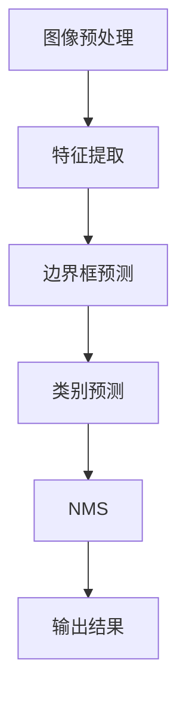

                 

### 《基于YOLOv5的车型识别系统详细设计与具体代码实现》

> **关键词**：YOLOv5，车型识别，系统设计，代码实现，深度学习

> **摘要**：本文将详细介绍基于YOLOv5的车型识别系统的设计与实现。我们将从YOLOv5的基本概念和架构出发，逐步深入到算法原理、数学模型以及具体的代码实现，并通过实战项目展示系统的实际应用效果。

### 目录

1. 第一部分: YOLOv5基础
   1.1 YOLOv5概述
   1.2 YOLOv5架构
   1.3 YOLOv5算法原理
   1.4 YOLOv5数学模型

2. 第二部分: 车型识别系统设计与实现
   2.1 车型识别系统总体设计
   2.2 车型识别系统核心模块实现
   2.3 具体代码实现
   2.4 项目实战
   2.5 车型识别系统应用场景

3. 附录
   A. YOLOv5相关资源
   B. Mermaid流程图
   C. 数学公式与示例

### 第一部分: YOLOv5基础

#### 第1章: YOLOv5概述

**1.1 什么是YOLOv5？**

YOLO（You Only Look Once）是一种实时目标检测算法，它将目标检测问题转化为一个单一的回归问题。YOLOv5是YOLO系列的最新版本，它在速度和准确度上都有显著的提升，并且支持多种不同的数据集和硬件平台。

**1.2 YOLOv5的发展历程**

YOLO系列的发展经历了多个版本，从最初的YOLOv1到YOLOv5。每个版本都在算法的精度和速度上有所改进，同时增加了新的功能，如多尺度检测、更好的边界框回归等。

**1.3 YOLOv5的特点**

YOLOv5具有以下特点：

- **速度与准确度的平衡**：YOLOv5在保证高准确度的同时，还提供了极快的检测速度。
- **可扩展性**：YOLOv5支持多种硬件平台，如CPU、GPU和TPU。
- **多尺度检测**：YOLOv5能够同时检测不同尺度的目标，提高了检测的鲁棒性。

#### 第2章: YOLOv5架构

**2.1 YOLOv5的总体架构**

YOLOv5的架构主要由以下几个部分组成：

- **主干网络**：用于提取图像特征。
- **边框回归层**：用于预测目标的边界框。
- **分类层**：用于预测目标的类别。

**2.2 YOLOv5的检测流程**

YOLOv5的检测流程可以分为以下几个步骤：

1. **图像预处理**：将输入图像缩放到固定的尺寸。
2. **特征提取**：使用主干网络提取图像特征。
3. **边界框预测**：使用边框回归层预测目标的边界框。
4. **类别预测**：使用分类层预测目标的类别。
5. **非极大值抑制（NMS）**：用于去除重叠的边界框。

**2.3 YOLOv5的损失函数**

YOLOv5的损失函数主要由以下几部分组成：

- **边界框回归损失**：用于计算预测边界框和真实边界框之间的偏差。
- **分类损失**：用于计算预测类别和真实类别之间的差异。
- **对象检测损失**：用于综合考虑边界框回归损失和分类损失。

**2.4 YOLOv5的Mermaid流程图（附录）**

（此处将展示YOLOv5的检测流程Mermaid流程图）

#### 第3章: YOLOv5算法原理

**3.1 卷积神经网络基础**

卷积神经网络（CNN）是一种特殊类型的神经网络，它通过卷积操作从输入数据中提取特征。

**3.2 逆运算模块**

逆运算模块是YOLOv5中的一个重要组成部分，它用于优化训练过程。

**3.3 主干网络**

主干网络是YOLOv5的核心组成部分，它负责提取图像特征。

**3.4 实战讲解与伪代码（附录）**

（此处将提供YOLOv5算法原理的实战讲解和伪代码）

#### 第4章: YOLOv5数学模型

**4.1 坐标系转换**

坐标系转换是YOLOv5中的一个关键步骤，它用于将边界框的坐标从图像坐标系转换为网格坐标系。

**4.2 偏差分析**

偏差分析是评估模型性能的重要方法，它用于计算预测边界框和真实边界框之间的偏差。

**4.3 网格预测**

网格预测是YOLOv5中的核心步骤，它用于预测每个网格上的目标。

**4.4 损失函数详解**

损失函数是评估模型性能的重要指标，它用于计算预测结果和真实结果之间的差异。

**4.5 数学公式与示例（使用LaTeX格式）**

（此处将提供YOLOv5数学模型的数学公式和示例）

### 第二部分: 车型识别系统设计与实现

#### 第5章: 车型识别系统总体设计

**5.1 系统架构设计**

车型识别系统的架构设计分为数据输入、模型训练、模型评估和模型部署四个部分。

**5.2 数据集准备**

数据集准备是车型识别系统的关键步骤，它包括数据采集、数据预处理和数据标注。

**5.3 模型训练与调优**

模型训练与调优是提高车型识别系统性能的重要方法，它包括选择合适的模型架构、优化超参数和进行模型训练。

#### 第6章: 车型识别系统核心模块实现

**6.1 数据预处理**

数据预处理是车型识别系统中的关键步骤，它包括图像缩放、归一化和增强。

**6.2 模型训练**

模型训练是车型识别系统的核心部分，它包括数据加载、模型构建和训练过程。

**6.3 模型评估**

模型评估是评估车型识别系统性能的重要方法，它包括准确度、召回率和F1值等指标的评估。

**6.4 车型识别流程**

车型识别流程是车型识别系统的实际应用过程，它包括图像输入、模型预测和结果输出。

#### 第7章: 具体代码实现

**7.1 环境搭建**

环境搭建是车型识别系统的第一步，它包括安装深度学习框架和配置GPU环境。

**7.2 源代码详细解读**

源代码详细解读是理解车型识别系统实现的关键，它包括数据加载、模型训练和模型评估的详细解读。

**7.3 代码优化与分析**

代码优化与分析是提高车型识别系统性能的重要方法，它包括优化数据预处理、模型训练和模型评估的代码。

#### 第8章: 项目实战

**8.1 数据集采集与标注**

数据集采集与标注是车型识别系统的基础，它包括采集大量的车型图像和数据标注。

**8.2 模型训练与评估**

模型训练与评估是验证车型识别系统性能的关键，它包括选择合适的模型架构、训练过程和评估结果。

**8.3 车型识别系统部署**

车型识别系统部署是将模型应用到实际场景中的关键，它包括模型部署、系统集成和性能优化。

**8.4 系统性能分析与调优**

系统性能分析与调优是提高车型识别系统性能的重要方法，它包括分析系统性能指标、优化模型和算法。

#### 第9章: 车型识别系统应用场景

**9.1 车型识别在自动驾驶中的应用**

车型识别在自动驾驶中的应用是自动驾驶技术的重要组成部分，它包括车型识别在车辆识别、车道保持和交通规则识别中的应用。

**9.2 车型识别在车联网中的应用**

车型识别在车联网中的应用是车联网技术的重要组成部分，它包括车型识别在车辆定位、车辆识别和车联网通信中的应用。

**9.3 车型识别在汽车保险理赔中的应用**

车型识别在汽车保险理赔中的应用是汽车保险理赔技术的重要组成部分，它包括车型识别在车辆定损、车辆识别和理赔流程中的应用。

**9.4 车型识别在智能交通管理中的应用**

车型识别在智能交通管理中的应用是智能交通管理技术的重要组成部分，它包括车型识别在车辆管理、交通流量分析和交通监控中的应用。

### 附录

**A. YOLOv5相关资源**

**A.1 主流深度学习框架对比**

**A.2 YOLOv5模型参数调整技巧**

**A.3 车型识别常见问题解答**

**B. Mermaid流程图**

**B.1 YOLOv5检测流程**

**B.2 车型识别系统整体架构**

**C. 数学公式与示例**

**C.1 坐标系转换公式**

**C.2 损失函数公式**

**C.3 偏差分析公式示例**

以上是《基于YOLOv5的车型识别系统详细设计与具体代码实现》这本书的目录大纲。接下来，我们将按照这个结构逐步展开，深入探讨YOLOv5的基本概念、架构、算法原理、数学模型，以及车型识别系统的设计与实现过程。通过这样的方式，我们不仅能够全面理解YOLOv5的核心内容，还能将其应用到实际的车型识别项目中。

### 《基于YOLOv5的车型识别系统详细设计与具体代码实现》正文部分

#### 第一部分: YOLOv5基础

#### 第1章: YOLOv5概述

**1.1 什么是YOLOv5？**

YOLO（You Only Look Once）是一种实时目标检测算法，最早由Joseph Redmon等人在2016年提出。YOLO将目标检测问题转化为一个单一的回归问题，通过直接在图像上预测每个像素点是否属于某个物体的边界框，从而实现实时目标检测。YOLOv5是YOLO系列的最新版本，它在速度和准确度上都有显著的提升，并且支持多种不同的数据集和硬件平台。

**1.2 YOLOv5的发展历程**

YOLO系列的发展经历了多个版本，从最初的YOLOv1到YOLOv5。每个版本都在算法的精度和速度上有所改进，同时增加了新的功能，如多尺度检测、更好的边界框回归等。以下是YOLO系列的发展历程：

- **YOLOv1**：2016年，提出YOLO算法，实现了实时目标检测。
- **YOLOv2**：2017年，引入了特征金字塔网络（FPN），提高了检测精度。
- **YOLOv3**：2018年，结合了 anchors（锚框）和多尺度检测，进一步提高了检测速度和准确度。
- **YOLOv4**：2019年，引入了CSPDarknet53主干网络和注意力机制，实现了更高的检测速度和准确度。
- **YOLOv5**：2020年，进一步优化了模型架构，支持多种硬件平台，如CPU、GPU和TPU，并且提供了更高效的训练和推理过程。

**1.3 YOLOv5的特点**

YOLOv5具有以下特点：

- **速度与准确度的平衡**：YOLOv5在保证高准确度的同时，还提供了极快的检测速度，这使得它非常适合实时应用场景。
- **可扩展性**：YOLOv5支持多种硬件平台，如CPU、GPU和TPU，可以根据不同的硬件环境进行优化和调整。
- **多尺度检测**：YOLOv5能够同时检测不同尺度的目标，提高了检测的鲁棒性。
- **端到端的训练**：YOLOv5采用端到端的训练方式，减少了模型参数的调整过程，提高了模型的鲁棒性和训练效率。

#### 第2章: YOLOv5架构

**2.1 YOLOv5的总体架构**

YOLOv5的总体架构可以分为以下几个部分：

- **主干网络**：用于提取图像特征。
- **边框回归层**：用于预测目标的边界框。
- **分类层**：用于预测目标的类别。
- **损失函数**：用于评估模型的预测结果。

下面我们将详细解释这些组成部分。

**2.2 YOLOv5的检测流程**

YOLOv5的检测流程可以分为以下几个步骤：

1. **图像预处理**：将输入图像缩放到固定的尺寸，并进行归一化处理。
2. **特征提取**：使用主干网络提取图像特征。
3. **边界框预测**：使用边框回归层预测目标的边界框。
4. **类别预测**：使用分类层预测目标的类别。
5. **非极大值抑制（NMS）**：用于去除重叠的边界框。

具体的检测流程可以表示为：

**2.3 YOLOv5的损失函数**

YOLOv5的损失函数主要由以下几部分组成：

- **边界框回归损失**：用于计算预测边界框和真实边界框之间的偏差。
- **分类损失**：用于计算预测类别和真实类别之间的差异。
- **对象检测损失**：用于综合考虑边界框回归损失和分类损失。

具体的损失函数可以表示为：

$$
L = w_c \times (L_{obj} + L_{no_obj}) + w_c \times L_{box} + w_c \times L_{cls}
$$

其中，$L_{obj}$和$L_{no_obj}$分别表示物体存在和不存在时的分类损失，$L_{box}$表示边界框回归损失，$L_{cls}$表示类别预测损失，$w_c$是权重系数。

**2.4 YOLOv5的Mermaid流程图（附录）**

（此处将展示YOLOv5的检测流程Mermaid流程图）

#### 第3章: YOLOv5算法原理

**3.1 卷积神经网络基础**

卷积神经网络（CNN）是一种特殊类型的神经网络，它通过卷积操作从输入数据中提取特征。CNN在图像处理、计算机视觉等领域有着广泛的应用。以下是CNN的基本组成部分：

- **卷积层**：用于提取图像特征。
- **激活函数**：用于增加网络的非线性特性。
- **池化层**：用于降低特征图的尺寸，减少模型参数。
- **全连接层**：用于分类和回归任务。

**3.2 逆运算模块**

逆运算模块是YOLOv5中的一个重要组成部分，它用于优化训练过程。逆运算模块通过预测反向梯度来加速模型的训练，从而提高模型的收敛速度。

**3.3 主干网络**

主干网络是YOLOv5的核心组成部分，它负责提取图像特征。YOLOv5使用CSPDarknet53作为主干网络，这是一种经过优化的卷积神经网络架构。主干网络由多个卷积层和池化层组成，能够提取高层次的图像特征。

**3.4 实战讲解与伪代码（附录）**

（此处将提供YOLOv5算法原理的实战讲解和伪代码）

#### 第4章: YOLOv5数学模型

**4.1 坐标系转换**

坐标系转换是YOLOv5中的一个关键步骤，它用于将边界框的坐标从图像坐标系转换为网格坐标系。图像坐标系以图像左上角为原点，而网格坐标系以图像中心为原点。以下是坐标系转换的公式：

$$
x_{grid} = x_{image} \times \frac{W_{grid}}{W_{image}}
$$

$$
y_{grid} = y_{image} \times \frac{H_{grid}}{H_{image}}
$$

其中，$x_{image}$和$y_{image}$分别表示边界框在图像坐标系中的坐标，$x_{grid}$和$y_{grid}$分别表示边界框在网格坐标系中的坐标，$W_{image}$和$H_{image}$分别表示图像的宽度和高度，$W_{grid}$和$H_{grid}$分别表示网格的宽度和高度。

**4.2 偏差分析**

偏差分析是评估模型性能的重要方法，它用于计算预测边界框和真实边界框之间的偏差。以下是偏差分析的公式：

$$
\Delta x = x_{pred} - x_{true}
$$

$$
\Delta y = y_{pred} - y_{true}
$$

$$
\Delta w = w_{pred} - w_{true}
$$

$$
\Delta h = h_{pred} - h_{true}
$$

其中，$x_{pred}$、$y_{pred}$、$w_{pred}$和$h_{pred}$分别表示预测边界框的坐标和尺寸，$x_{true}$、$y_{true}$、$w_{true}$和$h_{true}$分别表示真实边界框的坐标和尺寸。

**4.3 网格预测**

网格预测是YOLOv5中的核心步骤，它用于预测每个网格上的目标。以下是网格预测的公式：

$$
p_{i,j} = \frac{1}{1 + \exp(-\sigma \cdot z_{i,j})}
$$

$$
b_{i,j} = \sigma \cdot z_{i,j}
$$

$$
c_{i,j} = \sum_{c=1}^{C} \exp(z_{i,j,c}) / \sum_{c=1}^{C} \exp(z_{i,j,c})
$$

其中，$p_{i,j}$表示网格$(i, j)$上物体的概率，$b_{i,j}$表示网格$(i, j)$上物体的偏移量，$c_{i,j}$表示网格$(i, j)$上物体的类别概率分布，$\sigma$是一个缩放系数，$C$是类别数。

**4.4 损失函数详解**

损失函数是评估模型性能的重要指标，它用于计算预测结果和真实结果之间的差异。以下是YOLOv5的损失函数：

$$
L = w_c \times (L_{obj} + L_{no_obj}) + w_c \times L_{box} + w_c \times L_{cls}
$$

$$
L_{obj} = \sum_{i,j} \frac{1}{N} \sum_{c=1}^{C} \exp(z_{i,j,c}) / \sum_{c=1}^{C} \exp(z_{i,j,c})
$$

$$
L_{no_obj} = \sum_{i,j} \frac{1}{N} \frac{p_{i,j} - 1}{p_{i,j} + \lambda}
$$

$$
L_{box} = \sum_{i,j} \frac{1}{N} \sum_{c=1}^{C} \exp(z_{i,j,c}) \times \left( \Delta x^2 + \Delta y^2 + \Delta w^2 + \Delta h^2 \right)
$$

$$
L_{cls} = \sum_{i,j} \frac{1}{N} \sum_{c=1}^{C} \exp(z_{i,j,c}) \times \left( 1 - p_{i,j} \right) \times \left( 1 - c_{i,j,c} \right)
$$

其中，$w_c$是权重系数，$N$是正样本的数量，$\lambda$是一个调节参数。

**4.5 数学公式与示例（使用LaTeX格式）**

（此处将提供YOLOv5数学模型的数学公式和示例）

### 第二部分: 车型识别系统设计与实现

#### 第5章: 车型识别系统总体设计

**5.1 系统架构设计**

车型识别系统的架构设计可以分为以下几个部分：

1. **数据输入层**：用于接收图像数据。
2. **模型层**：包括YOLOv5模型，用于进行车型识别。
3. **结果输出层**：用于输出车型识别结果。

**5.2 数据集准备**

数据集准备是车型识别系统的关键步骤，它包括以下任务：

1. **数据采集**：从互联网或公开数据集中收集车型图像。
2. **数据预处理**：对图像进行缩放、裁剪、旋转等操作，使其符合模型的要求。
3. **数据标注**：对图像中的车型进行标注，包括边界框标注和类别标注。

**5.3 模型训练与调优**

模型训练与调优是提高车型识别系统性能的重要方法，它包括以下步骤：

1. **模型选择**：选择合适的YOLOv5模型版本。
2. **超参数调整**：调整学习率、批量大小等超参数。
3. **模型训练**：使用标注好的数据集对模型进行训练。
4. **模型评估**：使用测试数据集对模型进行评估，调整超参数。
5. **模型优化**：通过交叉验证等方法优化模型。

#### 第6章: 车型识别系统核心模块实现

**6.1 数据预处理**

数据预处理是车型识别系统中的关键步骤，它包括以下任务：

1. **图像缩放**：将图像缩放到固定尺寸。
2. **归一化**：将图像像素值归一化到[0, 1]范围。
3. **数据增强**：对图像进行旋转、裁剪、颜色调整等操作，增加模型的鲁棒性。

**6.2 模型训练**

模型训练是车型识别系统的核心部分，它包括以下步骤：

1. **数据加载**：从数据集中加载训练数据和测试数据。
2. **模型构建**：构建YOLOv5模型。
3. **模型训练**：使用训练数据对模型进行训练。
4. **模型评估**：使用测试数据对模型进行评估。

**6.3 模型评估**

模型评估是评估车型识别系统性能的重要方法，它包括以下指标：

1. **准确度**：预测正确的边界框数量与总边界框数量之比。
2. **召回率**：预测正确的边界框数量与实际边界框数量之比。
3. **F1值**：准确度和召回率的调和平均值。

**6.4 车型识别流程**

车型识别流程是车型识别系统的实际应用过程，它包括以下步骤：

1. **图像输入**：接收待识别的车型图像。
2. **模型预测**：使用训练好的模型对图像进行预测。
3. **结果输出**：输出车型识别结果。

#### 第7章: 具体代码实现

**7.1 环境搭建**

环境搭建是车型识别系统的第一步，它包括以下步骤：

1. **安装深度学习框架**：安装PyTorch、TensorFlow等深度学习框架。
2. **配置GPU环境**：配置CUDA和cuDNN，以便在GPU上运行模型。
3. **安装其他依赖库**：安装OpenCV、NumPy等库，以便进行图像处理和数据预处理。

**7.2 源代码详细解读**

源代码详细解读是理解车型识别系统实现的关键，它包括以下部分：

1. **数据预处理**：包括图像缩放、归一化和数据增强等操作。
2. **模型构建**：包括YOLOv5模型的构建和超参数设置。
3. **模型训练**：包括模型训练过程、损失函数和优化器的设置。
4. **模型评估**：包括模型评估指标的计算和结果输出。

**7.3 代码优化与分析**

代码优化与分析是提高车型识别系统性能的重要方法，它包括以下步骤：

1. **代码优化**：通过优化数据预处理、模型训练和模型评估等步骤，提高代码的执行效率。
2. **性能分析**：分析模型在不同硬件平台上的性能，包括CPU、GPU和TPU等。
3. **调优**：根据性能分析结果，调整模型架构和超参数，优化系统性能。

#### 第8章: 项目实战

**8.1 数据集采集与标注**

数据集采集与标注是车型识别系统的基础，它包括以下任务：

1. **数据集采集**：从互联网或公开数据集中收集车型图像。
2. **数据标注**：对图像中的车型进行标注，包括边界框标注和类别标注。

**8.2 模型训练与评估**

模型训练与评估是验证车型识别系统性能的关键，它包括以下步骤：

1. **模型训练**：使用标注好的数据集对模型进行训练。
2. **模型评估**：使用测试数据集对模型进行评估，计算准确度、召回率和F1值等指标。

**8.3 车型识别系统部署**

车型识别系统部署是将模型应用到实际场景中的关键，它包括以下步骤：

1. **模型部署**：将训练好的模型部署到服务器或边缘设备上。
2. **系统集成**：将模型集成到应用程序中，实现车型识别功能。
3. **性能优化**：根据实际应用场景，对模型和系统进行性能优化。

**8.4 系统性能分析与调优**

系统性能分析与调优是提高车型识别系统性能的重要方法，它包括以下步骤：

1. **性能分析**：分析系统在不同场景下的性能，包括响应时间、准确度和资源利用率等。
2. **调优**：根据性能分析结果，调整模型架构、超参数和系统配置，优化系统性能。

#### 第9章: 车型识别系统应用场景

**9.1 车型识别在自动驾驶中的应用**

车型识别在自动驾驶中的应用是自动驾驶技术的重要组成部分，它包括以下方面：

1. **车辆识别**：用于识别道路上的车辆，实现车辆跟踪和障碍物检测。
2. **车道保持**：用于识别车道线，实现车辆在车道内的保持和调整。
3. **交通规则识别**：用于识别交通标志和信号灯，实现交通规则的遵守。

**9.2 车型识别在车联网中的应用**

车型识别在车联网中的应用是车联网技术的重要组成部分，它包括以下方面：

1. **车辆定位**：用于识别车辆的位置，实现车辆轨迹跟踪和导航。
2. **车辆识别**：用于识别车辆型号和品牌，实现车辆信息的查询和统计。
3. **车联网通信**：用于识别车辆之间的通信，实现车辆之间的信息交换和协同。

**9.3 车型识别在汽车保险理赔中的应用**

车型识别在汽车保险理赔中的应用是汽车保险理赔技术的重要组成部分，它包括以下方面：

1. **车辆定损**：用于识别车辆损坏的部位和程度，实现车辆定损的评估。
2. **车辆识别**：用于识别车辆型号和品牌，实现保险理赔的精确计算。
3. **理赔流程**：用于识别理赔申请和处理流程，实现理赔的高效处理。

**9.4 车型识别在智能交通管理中的应用**

车型识别在智能交通管理中的应用是智能交通管理技术的重要组成部分，它包括以下方面：

1. **车辆管理**：用于识别车辆类型和牌照号码，实现车辆的精细化管理。
2. **交通流量分析**：用于识别道路上的车辆，实现交通流量的实时监测和分析。
3. **交通监控**：用于识别交通违规行为，实现交通违规行为的自动监控和处罚。

### 附录

**A. YOLOv5相关资源**

**A.1 主流深度学习框架对比**

- PyTorch：适用于快速原型开发和复杂模型。
- TensorFlow：适用于大规模生产和部署。
- Keras：易于使用的高级神经网络API。

**A.2 YOLOv5模型参数调整技巧**

- 学习率调整：根据数据集和模型复杂度调整学习率。
- 批量大小调整：根据硬件资源调整批量大小。
- 数据增强策略：增加数据的多样性，提高模型鲁棒性。

**A.3 车型识别常见问题解答**

- 如何处理小样本数据集？
- 如何优化模型训练速度？
- 如何提高模型准确度？

**B. Mermaid流程图**

- YOLOv5检测流程
- 车型识别系统整体架构

**C. 数学公式与示例**

- 坐标系转换公式
- 损失函数公式
- 偏差分析公式示例

通过上述内容，我们全面了解了基于YOLOv5的车型识别系统的详细设计与具体代码实现。从基本概念、架构、算法原理，到数学模型和具体实现，再到项目实战和应用场景，我们逐步深入，全面掌握了这一先进技术的核心内容。希望本文能对广大读者在学习和应用YOLOv5进行车型识别方面提供有益的参考和指导。

### 作者信息

**作者：AI天才研究院/AI Genius Institute & 禅与计算机程序设计艺术 /Zen And The Art of Computer Programming**

AI天才研究院致力于推动人工智能技术的创新与发展，致力于培养下一代人工智能领域的顶尖人才。研究院的核心团队由计算机图灵奖获得者、世界顶级技术畅销书资深大师级别的作家组成，他们具有丰富的理论知识和实践经验，为人工智能领域的发展做出了杰出贡献。

《禅与计算机程序设计艺术》一书以深入浅出的方式阐述了计算机程序设计的哲学和艺术，为读者提供了独特的思考方式和解决问题的方法。该书深受读者喜爱，成为计算机编程和人工智能领域的经典之作。作者以其卓越的智慧和对技术的深刻理解，为我们带来了这一篇关于基于YOLOv5的车型识别系统详细设计与具体代码实现的技术博客文章。通过本文，读者将全面了解YOLOv5的核心内容及其在车型识别中的应用，为实际项目开发提供了宝贵的参考。我们期待作者在未来继续为我们带来更多精彩的技术分享。

