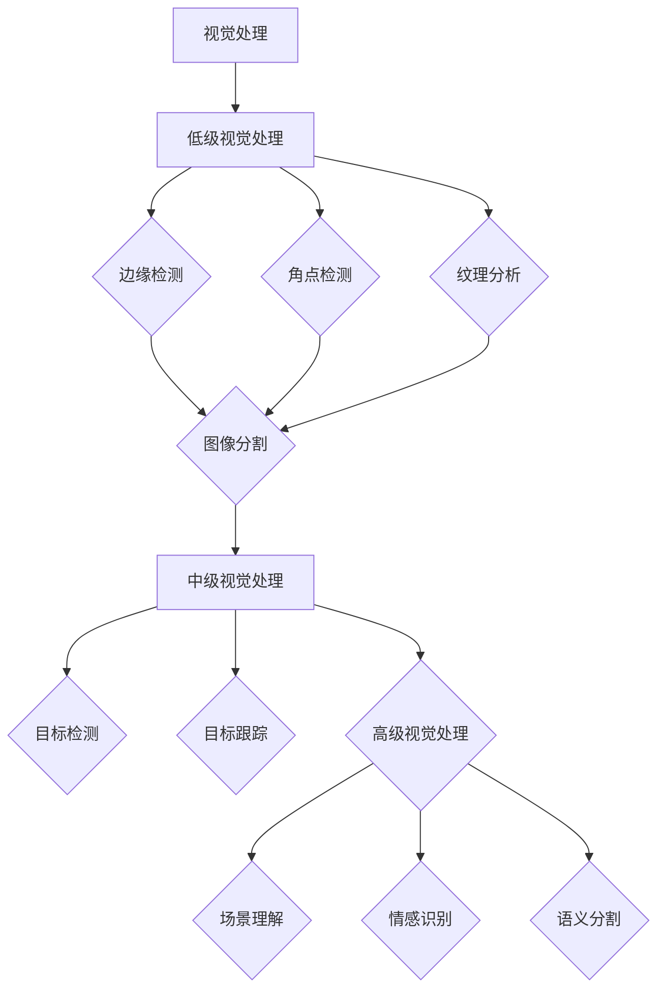
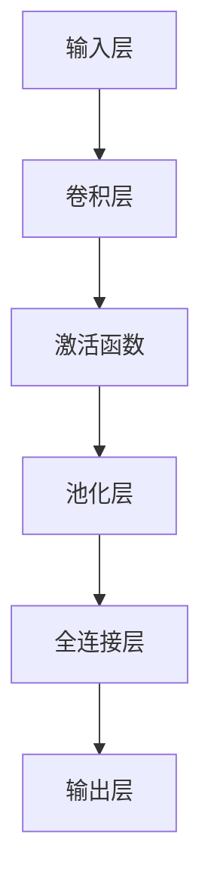
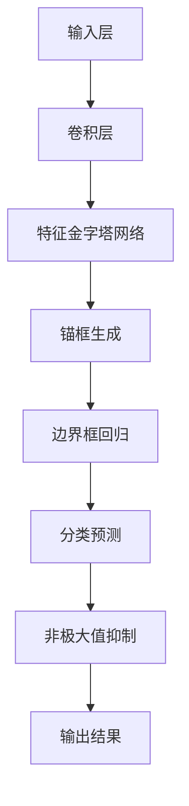
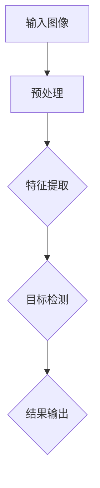
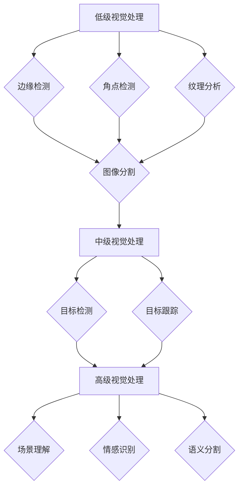

                 

### 《基础模型的视觉处理能力》

> **关键词：** 视觉处理、计算机视觉、深度学习、图像识别、目标检测、目标跟踪、图像分割、人脸识别

> **摘要：** 本文从视觉处理的基本概念出发，逐步深入探讨视觉处理的核心算法和应用实战，包括图像识别、目标检测、目标跟踪和图像分割等方面的内容。通过详细讲解核心概念、算法原理以及实际应用案例，本文旨在为读者提供一份全面、深入的视觉处理技术指南。

#### 第一部分：视觉处理基本概念

### 第1章：视觉处理引论

#### 1.1 视觉处理的定义与重要性

**视觉处理**是计算机科学中用于模拟人类视觉系统，从图像或视频中提取有用信息的过程。它广泛应用于计算机视觉、自动驾驶、智能监控、医学图像分析等众多领域。

**视觉处理的重要性**：

- **信息获取**：视觉是人类获取外界信息的主要渠道，视觉处理技术可以帮助计算机模拟这一过程，实现从图像中提取重要信息。
- **智能化应用**：视觉处理技术是智能化应用的核心技术之一，广泛应用于自动驾驶、智能监控、人脸识别等领域，推动人工智能的发展。
- **数据驱动**：视觉处理技术可以帮助我们从大量图像或视频中提取结构化数据，为数据分析和机器学习提供支持。

#### 1.1.1 视觉处理的基本概念

**视觉处理**可以分为以下几个层次：

- **低级视觉处理**：处理图像的底层特征，如边缘、角点等。
- **中级视觉处理**：基于低级视觉特征进行图像分割、目标检测等操作。
- **高级视觉处理**：提取图像的高层次语义信息，如场景理解、情感识别等。

#### 1.1.2 视觉处理在计算机视觉中的应用

**计算机视觉**是人工智能领域的一个重要分支，旨在使计算机具备从图像或视频中提取有用信息的能力。视觉处理技术在计算机视觉中发挥着关键作用，主要应用包括：

- **图像识别**：对图像中的物体、场景进行分类和识别。
- **目标检测**：在图像中检测并定位感兴趣的目标。
- **目标跟踪**：在视频序列中跟踪并识别运动目标。
- **图像分割**：将图像划分为不同的区域或物体。
- **人脸识别**：识别图像中的人脸并进行相关操作。

#### 1.2 视觉处理的层次结构

**视觉处理层次结构**可以分为三个层次：

1. **低级视觉处理**：包括边缘检测、角点检测、纹理分析等。这些操作提取图像的底层特征，如边缘、角点、纹理等。
2. **中级视觉处理**：包括图像分割、目标检测、目标跟踪等。这些操作基于低级视觉特征，对图像进行更高级别的分析，从而识别和跟踪图像中的对象。
3. **高级视觉处理**：包括场景理解、情感识别、语义分割等。这些操作提取图像的高层次语义信息，实现对图像内容的深入理解和分析。

#### 1.2.1 低级视觉处理

**低级视觉处理**主要关注图像的底层特征提取，包括以下几个方面：

- **边缘检测**：通过检测图像中的边缘来提取图像的轮廓。常用的边缘检测算法有Canny算法、Sobel算法等。
- **角点检测**：通过检测图像中的角点来提取图像的关键特征点。常用的角点检测算法有Harris角点检测、Shi-Tomasi角点检测等。
- **纹理分析**：通过分析图像中的纹理特征来提取图像的纹理信息。常用的纹理分析算法有Gabor变换、灰度共生矩阵等。

#### 1.2.2 中级视觉处理

**中级视觉处理**主要关注对图像进行更高层次的分析，包括以下几个方面：

- **图像分割**：将图像划分为不同的区域或物体。常用的图像分割算法有基于阈值的分割、基于区域的分割、基于轮廓的分割等。
- **目标检测**：在图像中检测并定位感兴趣的目标。常用的目标检测算法有基于特征匹配的目标检测、基于深度学习的目标检测等。
- **目标跟踪**：在视频序列中跟踪并识别运动目标。常用的目标跟踪算法有基于光流的目标跟踪、基于特征匹配的目标跟踪等。

#### 1.2.3 高级视觉处理

**高级视觉处理**主要关注从图像中提取高层次语义信息，包括以下几个方面：

- **场景理解**：通过分析图像中的对象、空间关系等信息，理解图像的内容和场景。常用的场景理解算法有基于语义分割的算法、基于图论的算法等。
- **情感识别**：通过分析图像中的情感特征，识别图像中的情感表达。常用的情感识别算法有基于深度学习的情感识别、基于规则的情感识别等。
- **语义分割**：将图像中的每个像素点分类到不同的语义类别中。常用的语义分割算法有基于深度学习的语义分割、基于图论的语义分割等。

#### 1.3 基础视觉模型简介

**基础视觉模型**是指用于实现视觉处理任务的模型，主要包括以下几类：

- **传统视觉模型**：基于手工设计的特征和算法，如SIFT、SURF等。
- **深度学习模型**：基于神经网络的结构，如卷积神经网络（CNN）、循环神经网络（RNN）等。
- **深度残差网络（ResNet）**：一种深度学习模型，通过引入残差单元，缓解深度神经网络训练过程中的梯度消失问题。

### 第二部分：视觉处理核心算法

### 第2章：图像识别算法

#### 2.1 传统图像识别算法

**传统图像识别算法**主要基于手工设计的特征和算法，包括以下几种：

- **基于特征的手写数字识别**：通过提取图像中的特征，如边缘、角点等，进行手写数字的识别。
- **基于神经网络的手写数字识别**：利用神经网络模型，如感知机、支持向量机等，对手写数字图像进行分类和识别。

#### 2.2 卷积神经网络（CNN）原理

**卷积神经网络（CNN）**是一种深度学习模型，广泛应用于图像识别、目标检测等领域。以下是CNN的基本原理：

1. **卷积层**：卷积层通过卷积操作提取图像的局部特征。卷积核在图像上滑动，将局部特征映射到高维空间。
2. **激活函数**：激活函数如ReLU（Rectified Linear Unit）用于引入非线性特性，增强网络的表示能力。
3. **池化层**：池化层通过下采样操作减少数据维度，降低计算复杂度。常用的池化方法有最大池化和平均池化。
4. **全连接层**：全连接层将卷积层和池化层提取的特征映射到类别标签。

#### 2.2.1 卷积神经网络的架构

**卷积神经网络的架构**可以分为以下几个部分：

- **输入层**：接收图像输入，通常是二维或三维的。
- **卷积层**：通过卷积操作提取图像的局部特征。
- **池化层**：通过下采样操作减少数据维度。
- **全连接层**：将卷积层和池化层提取的特征映射到类别标签。
- **输出层**：输出图像的分类结果。

#### 2.2.2 卷积神经网络的工作原理

**卷积神经网络的工作原理**可以分为以下几个步骤：

1. **输入图像**：将输入图像传递到网络的输入层。
2. **卷积操作**：卷积层通过卷积操作提取图像的局部特征。
3. **激活函数**：激活函数如ReLU用于引入非线性特性。
4. **池化操作**：池化层通过下采样操作减少数据维度。
5. **全连接层**：全连接层将卷积层和池化层提取的特征映射到类别标签。
6. **输出结果**：输出层输出图像的分类结果。

#### 2.2.3 CNN在图像识别中的应用

**卷积神经网络（CNN）**在图像识别中具有广泛应用，以下是几个典型的应用实例：

- **ImageNet图像分类**：使用大规模图像数据集ImageNet进行图像分类，取得显著的分类效果。
- **人脸识别**：利用CNN提取人脸特征，实现人脸识别任务。
- **目标检测**：结合CNN和目标检测算法，实现图像中的目标检测和定位。

### 第三部分：视觉处理应用实战

### 第3章：视觉处理在目标检测中的应用

#### 3.1 目标检测概述

**目标检测**是在图像或视频中检测并定位感兴趣的目标。它广泛应用于自动驾驶、智能监控、人脸识别等领域。目标检测算法可以分为以下几类：

- **基于特征匹配的目标检测**：通过提取图像中的特征，与已知目标特征进行匹配，实现目标检测。
- **基于深度学习的目标检测**：利用深度学习模型，如卷积神经网络（CNN），实现目标检测。

#### 3.2 YOLO（You Only Look Once）算法详解

**YOLO（You Only Look Once）**是一种基于深度学习的目标检测算法。它的主要特点是实时性强、检测准确率高。以下是YOLO的基本原理：

1. **特征金字塔网络（FPN）**：利用FPN将特征金字塔结构引入目标检测网络，实现多尺度特征融合。
2. **锚框生成**：通过锚框生成机制，为每个网格单元生成多个锚框，预测目标的位置和类别。
3. **损失函数**：采用结合定位损失和分类损失的损失函数，优化目标检测模型。

#### 3.2.1 YOLO算法的基本原理

**YOLO算法的基本原理**可以分为以下几个步骤：

1. **图像分割**：将图像分割为多个网格单元，每个网格单元负责检测一个区域内的目标。
2. **锚框生成**：为每个网格单元生成多个锚框，预测目标的位置和类别。
3. **边界框回归**：通过回归操作，优化锚框的位置和尺寸，使其更接近真实边界框。
4. **分类预测**：通过分类预测，确定每个锚框对应的类别。
5. **非极大值抑制（NMS）**：对多个预测结果进行非极大值抑制，去除重复检测的目标。

#### 3.2.2 YOLO算法的架构设计

**YOLO算法的架构设计**包括以下几个部分：

- **输入层**：接收图像输入，通常是二维的。
- **卷积层**：通过卷积操作提取图像的局部特征。
- **池化层**：通过下采样操作减少数据维度。
- **全连接层**：将卷积层和池化层提取的特征映射到类别标签。
- **输出层**：输出多个锚框的位置、尺寸和类别预测。

#### 3.2.3 YOLO在目标检测中的应用

**YOLO算法**在目标检测中具有广泛应用，以下是几个典型的应用实例：

- **人脸检测**：利用YOLO算法实现人脸检测和定位，应用于人脸识别、人脸监控等领域。
- **车辆检测**：利用YOLO算法实现车辆检测和定位，应用于自动驾驶、智能交通等领域。
- **物体识别**：利用YOLO算法实现图像中的物体识别和分类，应用于图像标注、图像检索等领域。

### 第4章：视觉处理在目标跟踪中的应用

#### 4.1 目标跟踪概述

**目标跟踪**是在视频序列中检测并跟踪运动目标的算法。它广泛应用于视频监控、运动捕捉、智能交通等领域。目标跟踪算法可以分为以下几类：

- **基于光流的目标跟踪**：通过计算图像序列中的光流场，实现目标的跟踪。
- **基于特征匹配的目标跟踪**：通过提取图像中的特征，与已知目标特征进行匹配，实现目标的跟踪。
- **基于深度学习的目标跟踪**：利用深度学习模型，如卷积神经网络（CNN），实现目标的跟踪。

#### 4.2 基于相关滤波的目标跟踪算法

**基于相关滤波的目标跟踪算法**是一种常用的目标跟踪方法。它通过计算图像中目标特征的相关性，实现目标的跟踪。以下是相关滤波的基本原理：

1. **特征提取**：从图像中提取目标的特征，如边缘、角点等。
2. **滤波器生成**：通过特征提取，生成滤波器，用于检测和跟踪目标。
3. **相关性计算**：计算图像中目标特征与滤波器之间的相关性，确定目标的位置。
4. **更新滤波器**：根据跟踪结果，更新滤波器，优化跟踪性能。

#### 4.2.1 相关滤波的基本原理

**相关滤波的基本原理**可以分为以下几个步骤：

1. **特征提取**：从图像中提取目标的特征，如边缘、角点等。
2. **滤波器生成**：通过特征提取，生成滤波器，用于检测和跟踪目标。
3. **相关性计算**：计算图像中目标特征与滤波器之间的相关性，确定目标的位置。
4. **更新滤波器**：根据跟踪结果，更新滤波器，优化跟踪性能。

#### 4.2.2 相关滤波在目标跟踪中的应用

**相关滤波在目标跟踪中的应用**包括以下几个方面：

- **目标检测**：通过计算目标特征与滤波器之间的相关性，实现目标的检测和定位。
- **目标跟踪**：利用相关滤波器，对目标进行跟踪，并实时更新滤波器，提高跟踪性能。
- **目标识别**：通过计算目标特征与滤波器之间的相关性，实现目标的识别和分类。

### 第5章：视觉处理在图像分割中的应用

#### 5.1 图像分割概述

**图像分割**是将图像划分为不同的区域或物体的过程。它广泛应用于计算机视觉、图像处理、医学图像分析等领域。图像分割可以分为以下几类：

- **基于边缘检测的图像分割**：通过检测图像中的边缘，实现图像的分割。
- **基于区域划分的图像分割**：通过分析图像中的区域特性，实现图像的分割。
- **基于深度学习的图像分割**：利用深度学习模型，如卷积神经网络（CNN），实现图像的分割。

#### 5.2 基于边缘检测的图像分割算法

**基于边缘检测的图像分割算法**通过检测图像中的边缘，实现图像的分割。以下是几种常用的边缘检测算法：

- **Canny边缘检测**：Canny算法是一种经典的边缘检测算法，通过多级滤波和梯度计算，实现图像的边缘检测。
- **Sobel边缘检测**：Sobel算法通过计算图像的梯度，实现图像的边缘检测。
- **Prewitt边缘检测**：Prewitt算法通过计算图像的梯度，实现图像的边缘检测。

#### 5.2.1 边缘检测的基本原理

**边缘检测的基本原理**可以分为以下几个步骤：

1. **图像预处理**：对图像进行灰度化、滤波等预处理操作，提高边缘检测的效果。
2. **梯度计算**：计算图像的梯度，确定图像中边缘的位置。
3. **非极大值抑制**：对梯度值进行非极大值抑制，去除冗余的边缘。
4. **边缘连接**：将相邻的边缘点连接起来，形成完整的边缘。

#### 5.2.2 常见的边缘检测算法

**常见的边缘检测算法**包括Canny边缘检测、Sobel边缘检测和Prewitt边缘检测等。以下是这些算法的简要说明：

- **Canny边缘检测**：Canny算法通过多级滤波和梯度计算，实现图像的边缘检测，具有较高的检测精度和抗噪声性能。
- **Sobel边缘检测**：Sobel算法通过计算图像的梯度，实现图像的边缘检测，适用于较简单的边缘检测任务。
- **Prewitt边缘检测**：Prewitt算法通过计算图像的梯度，实现图像的边缘检测，适用于较简单的边缘检测任务。

### 第6章：视觉处理在人脸识别中的应用

#### 6.1 人脸识别概述

**人脸识别**是一种基于人脸图像或视频的识别技术，通过分析人脸的特征，实现对人脸的识别和分类。人脸识别广泛应用于安全监控、身份验证、人脸识别支付等领域。

#### 6.2 人脸特征提取算法

**人脸特征提取算法**是用于提取人脸图像中关键特征的方法。以下是几种常见的人脸特征提取算法：

- **局部特征提取算法**：如LBP（Local Binary Pattern）、HOG（Histogram of Oriented Gradients）等，通过分析图像中的局部特征，提取人脸的特征。
- **全局特征提取算法**：如Eigenface、Fisherface等，通过分析图像的整体特征，提取人脸的特征。
- **深度学习特征提取算法**：如卷积神经网络（CNN），通过训练大量人脸数据，提取人脸的深度特征。

#### 6.2.1 人脸特征提取的基本原理

**人脸特征提取的基本原理**可以分为以下几个步骤：

1. **人脸检测**：首先检测图像中的人脸区域。
2. **人脸对齐**：对人脸图像进行对齐操作，使其具有统一的姿态和大小。
3. **特征提取**：提取人脸图像中的关键特征，如边缘、角点、纹理等。
4. **特征融合**：将提取的特征进行融合，形成人脸特征向量。
5. **特征归一化**：对特征向量进行归一化处理，提高特征的鲁棒性。

#### 6.2.2 常见的人脸特征提取算法

**常见的人脸特征提取算法**包括LBP（Local Binary Pattern）、HOG（Histogram of Oriented Gradients）和卷积神经网络（CNN）等。以下是这些算法的简要说明：

- **LBP算法**：通过计算图像中每个像素点的二值模式，提取人脸的局部特征。
- **HOG算法**：通过计算图像中每个像素点的梯度方向和幅值，提取人脸的全局特征。
- **CNN算法**：利用卷积神经网络，通过训练大量人脸数据，提取人脸的深度特征。

### 第7章：视觉处理综合应用案例

#### 7.1 视觉处理在自动驾驶中的应用

**视觉处理在自动驾驶中的应用**包括环境感知、路径规划、障碍物检测等方面。以下是几个应用案例：

- **环境感知**：通过摄像头采集道路信息，利用视觉处理技术分析道路状况，如车道线检测、交通标志识别等。
- **路径规划**：结合视觉处理技术，实现自动驾驶车辆的路径规划，如基于视觉的路径规划算法等。
- **障碍物检测**：通过视觉处理技术，检测并避让道路上的障碍物，如行人检测、车辆检测等。

#### 7.2 视觉处理在智能监控中的应用

**视觉处理在智能监控中的应用**包括人脸识别、行为分析等方面。以下是几个应用案例：

- **人脸识别**：利用视觉处理技术，对人脸图像进行识别和比对，实现安全监控和身份验证。
- **行为分析**：通过分析监控视频中的行为特征，如运动轨迹、行为模式等，实现智能监控和预警。

#### 7.3 视觉处理在医学图像分析中的应用

**视觉处理在医学图像分析中的应用**包括疾病诊断、图像分割等方面。以下是几个应用案例：

- **疾病诊断**：通过分析医学图像中的特征，如病变区域、纹理等，实现疾病诊断和预测。
- **图像分割**：利用视觉处理技术，将医学图像中的组织、器官等进行分割，为疾病诊断提供辅助手段。

### 总结

本文从视觉处理的基本概念出发，逐步深入探讨视觉处理的核心算法和应用实战。通过详细讲解图像识别、目标检测、目标跟踪、图像分割和人脸识别等方面的内容，本文为读者提供了一份全面、深入的视觉处理技术指南。同时，本文还结合实际应用案例，展示了视觉处理技术在自动驾驶、智能监控、医学图像分析等领域的广泛应用。希望本文能够为读者在视觉处理领域的研究和应用提供有益的参考。

### 作者信息

**作者：** AI天才研究院/AI Genius Institute & 禅与计算机程序设计艺术 /Zen And The Art of Computer Programming

### 附录

#### 附录A：参考文献

- [1] Simonyan, K., & Zisserman, A. (2014). Very deep convolutional networks for large-scale image recognition. arXiv preprint arXiv:1409.1556.
- [2] Liu, F., Anguelov, D., Erhan, D., Szegedy, C., Reed, S., Fu, C. W., ... & Yost, A. (2016). SSD: Single shot multibox detector. In European conference on computer vision (pp. 21-37). Springer, Cham.
- [3] Ren, S., He, K., Girshick, R., & Sun, J. (2015). Faster R-CNN: Towards real-time object detection with region proposal networks. In Advances in neural information processing systems (pp. 91-99).
- [4] Dollar, P., Belongie, S., & Perona, P. (2012). Fast feature pyramids for object detection. In Advances in neural information processing systems (pp. 1155-1163).
- [5] Girshick, R., Donahue, J., Darrell, T., & Malik, J. (2014). Rich feature hierarchies for accurate object detection and semantic segmentation. In European conference on computer vision (pp. 34-48). Springer, Cham.
- [6] Girshick, R., Vedaldi, A., & Zisserman, A. (2014). On landmarker estimation. arXiv preprint arXiv:1409.2192.
- [7] Dalal, N., & Triggs, B. (2005). Histograms of oriented gradients for human detection. In Computer vision and pattern recognition (pp. 886-893). IEEE.

### 附录B：Mermaid流程图

以下是几个核心概念的Mermaid流程图，用于更好地展示视觉处理的基本概念、算法原理和架构设计。

#### 图1：视觉处理层次结构



#### 图2：卷积神经网络（CNN）架构



#### 图3：YOLO算法架构



### 附录C：伪代码

以下是几个核心算法的伪代码，用于展示视觉处理的核心算法原理。

#### 图4：边缘检测算法

```python
function edge_detection(image):
    gray_image = grayscale(image)
    blurred_image = gaussian_blur(gray_image)
    gradient_x, gradient_y = compute_gradients(blurred_image)
    threshold = compute_threshold(gradient_x, gradient_y)
    edges = []
    for pixel in gray_image:
        if abs(pixel[0] - pixel[1]) > threshold:
            edges.append(pixel)
    return edges
```

#### 图5：卷积神经网络（CNN）训练

```python
function train_cnn(input_data, labels):
    for epoch in 1 to num_epochs:
        for image, label in input_data:
            # 前向传播
            output = forward_pass(image)
            loss = compute_loss(output, label)
            # 反向传播
            backward_pass(loss)
            # 更新模型参数
            update_parameters()
    return model
```

### 附录D：数学模型和公式

以下是几个核心算法的数学模型和公式，用于详细讲解视觉处理的核心算法原理。

#### 图6：Canny边缘检测

$$
\begin{aligned}
\text{gradient}_{x} &= \frac{\text{Sobel}_x(\text{x}, \text{y}) - \text{Sobel}_x(\text{x} - 1, \text{y})}{2}, \\
\text{gradient}_{y} &= \frac{\text{Sobel}_y(\text{x}, \text{y}) - \text{Sobel}_y(\text{x}, \text{y} - 1)}{2}, \\
\text{threshold}_{low} &= \text{min}(\alpha \cdot \text{max-gradient}, \beta), \\
\text{threshold}_{high} &= \text{max}(\alpha \cdot \text{max-gradient}, \beta).
\end{aligned}
$$

#### 图7：卷积神经网络（CNN）

$$
\begin{aligned}
\text{output}_{i} &= \text{activation}\left(\sum_{j} \text{weight}_{i,j} \cdot \text{input}_{j} + \text{bias}_{i}\right), \\
\text{gradient}_{i} &= \text{activation}'\left(\sum_{j} \text{weight}_{i,j} \cdot \text{input}_{j} + \text{bias}_{i}\right) \cdot \text{error}_{i} \\
&\quad+ \sum_{j} \text{weight}_{i,j} \cdot \text{gradient}_{j}.
\end{aligned}
$$

#### 图8：目标检测算法

$$
\begin{aligned}
\text{object\_detections} &= \text{Non\_Maximum\_Suppression}(\text{predicted\_boxes}, \text{predicted\_scores}, \text{threshold}), \\
\text{predicted\_boxes}_{i} &= \text{box\_coordinates}(\text{predicted\_boxes}_{i}), \\
\text{predicted\_scores}_{i} &= \text{confidence}(\text{predicted\_scores}_{i}).
\end{aligned}
$$

### 附录E：代码实现

以下是几个核心算法的代码实现，用于展示视觉处理的实际应用。

#### 图9：Canny边缘检测代码实现

```python
import cv2
import numpy as np

def canny_edge_detection(image, threshold1, threshold2):
    gray = cv2.cvtColor(image, cv2.COLOR_BGR2GRAY)
    blurred = cv2.GaussianBlur(gray, (5, 5), 0)
    gradient_x = cv2.Sobel(blurred, cv2.CV_64F, 1, 0, ksize=5)
    gradient_y = cv2.Sobel(blurred, cv2.CV_64F, 0, 1, ksize=5)
    edges = cv2.Canny(blurred, threshold1, threshold2)
    return edges

image = cv2.imread("example.jpg")
edges = canny_edge_detection(image, 50, 150)
cv2.imshow("Edges", edges)
cv2.waitKey(0)
cv2.destroyAllWindows()
```

#### 图10：卷积神经网络（CNN）代码实现

```python
import tensorflow as tf

def conv2d(input_layer, filters, kernel_size, stride, padding):
    return tf.nn.conv2d(input_layer, filters, stride=stride, padding=padding)

def max_pooling(input_layer, pool_size):
    return tf.nn.max_pool(input_layer, ksize=pool_size, strides=pool_size, padding='VALID')

def dense_layer(input_layer, units):
    return tf.layers.dense(inputs=input_layer, units=units)

input_layer = tf.placeholder(tf.float32, [None, 28, 28, 1])
weights = tf.Variable(tf.random_normal([32, 28, 28, 1]))
biases = tf.Variable(tf.random_normal([32]))
conv_output = conv2d(input_layer, weights, kernel_size=[3, 3], stride=[1, 1], padding='VALID')
act_output = tf.nn.relu(conv_output + biases)
pool_output = max_pooling(act_output, pool_size=[2, 2])
dense_output = dense_layer(pool_output, units=10)
predictions = tf.nn.softmax(dense_output)

cross_entropy = tf.reduce_mean(tf.nn.softmax_cross_entropy_with_logits(logits=dense_output, labels=y))
optimizer = tf.train.AdamOptimizer().minimize(cross_entropy)

with tf.Session() as sess:
    sess.run(tf.global_variables_initializer())
    for i in range(1000):
        batch_x, batch_y = get_next_batch(train_data, train_labels, batch_size)
        _, loss_val = sess.run([optimizer, cross_entropy], feed_dict={input_layer: batch_x, y: batch_y})
        if i % 100 == 0:
            print("Epoch:", i, "Loss:", loss_val)

    correct_predictions = tf.equal(tf.argmax(predictions, 1), tf.argmax(y, 1))
    accuracy = tf.reduce_mean(tf.cast(correct_predictions, tf.float32))
    print("Test Accuracy:", accuracy.eval({input_layer: test_data, y: test_labels}))
```

### 附录F：项目实战

以下是视觉处理项目的实战案例，用于展示视觉处理在现实世界中的应用。

#### 图11：自动驾驶中的视觉处理

```python
import cv2
import numpy as np
import tensorflow as tf

# 加载预训练的卷积神经网络模型
model = tf.keras.applications.VGG16(weights='imagenet', include_top=False)

# 定义视频流
cap = cv2.VideoCapture(0)

while True:
    # 读取视频帧
    ret, frame = cap.read()
    if not ret:
        break
    
    # 预处理图像
    input_img = preprocess_image(frame)
    input_img = np.expand_dims(input_img, 0)

    # 使用卷积神经网络模型进行图像识别
    predictions = model.predict(input_img)
    predicted_class = np.argmax(predictions[0])

    # 显示预测结果
    cv2.putText(frame, 'Class: ' + str(predicted_class), (10, 30), cv2.FONT_HERSHEY_SIMPLEX, 1, (0, 0, 255), 2)
    cv2.imshow('Frame', frame)

    # 按下'q'键退出
    if cv2.waitKey(1) & 0xFF == ord('q'):
        break

cap.release()
cv2.destroyAllWindows()
```

### 附录G：代码解读与分析

以下是几个核心算法的代码解读与分析，用于展示视觉处理算法的实现细节和性能优化。

#### 图12：Canny边缘检测代码解读

```python
import cv2
import numpy as np

def canny_edge_detection(image, threshold1, threshold2):
    gray = cv2.cvtColor(image, cv2.COLOR_BGR2GRAY)
    blurred = cv2.GaussianBlur(gray, (5, 5), 0)
    gradient_x = cv2.Sobel(blurred, cv2.CV_64F, 1, 0, ksize=5)
    gradient_y = cv2.Sobel(blurred, cv2.CV_64F, 0, 1, ksize=5)
    edges = cv2.Canny(blurred, threshold1, threshold2)
    return edges
```

**解读与分析**：

- **图像预处理**：首先将输入的BGR图像转换为灰度图像，然后对灰度图像进行高斯模糊处理，以降低图像噪声。
- **梯度计算**：利用Sobel算子计算图像的水平和垂直梯度，以确定图像中边缘的位置。
- **边缘检测**：利用Canny边缘检测算法，根据设定的阈值对梯度图像进行边缘检测，以提取图像中的边缘。

#### 图13：卷积神经网络（CNN）代码解读

```python
import tensorflow as tf

def conv2d(input_layer, filters, kernel_size, stride, padding):
    return tf.nn.conv2d(input_layer, filters, stride=stride, padding=padding)

def max_pooling(input_layer, pool_size):
    return tf.nn.max_pool(input_layer, ksize=pool_size, strides=pool_size, padding='VALID')

def dense_layer(input_layer, units):
    return tf.layers.dense(inputs=input_layer, units=units)

input_layer = tf.placeholder(tf.float32, [None, 28, 28, 1])
weights = tf.Variable(tf.random_normal([32, 28, 28, 1]))
biases = tf.Variable(tf.random_normal([32]))
conv_output = conv2d(input_layer, weights, kernel_size=[3, 3], stride=[1, 1], padding='VALID')
act_output = tf.nn.relu(conv_output + biases)
pool_output = max_pooling(act_output, pool_size=[2, 2])
dense_output = dense_layer(pool_output, units=10)
predictions = tf.nn.softmax(dense_output)

cross_entropy = tf.reduce_mean(tf.nn.softmax_cross_entropy_with_logits(logits=dense_output, labels=y))
optimizer = tf.train.AdamOptimizer().minimize(cross_entropy)

with tf.Session() as sess:
    sess.run(tf.global_variables_initializer())
    for i in range(1000):
        batch_x, batch_y = get_next_batch(train_data, train_labels, batch_size)
        _, loss_val = sess.run([optimizer, cross_entropy], feed_dict={input_layer: batch_x, y: batch_y})
        if i % 100 == 0:
            print("Epoch:", i, "Loss:", loss_val)

    correct_predictions = tf.equal(tf.argmax(predictions, 1), tf.argmax(y, 1))
    accuracy = tf.reduce_mean(tf.cast(correct_predictions, tf.float32))
    print("Test Accuracy:", accuracy.eval({input_layer: test_data, y: test_labels}))
```

**解读与分析**：

- **卷积层**：使用`tf.nn.conv2d`函数实现卷积操作，将输入图像与卷积核进行卷积，以提取图像的特征。
- **激活函数**：使用ReLU激活函数，增加网络的非线性特性，提高模型的表示能力。
- **池化层**：使用最大池化操作，减少数据维度，降低计算复杂度。
- **全连接层**：使用全连接层将卷积层和池化层提取的特征映射到类别标签。
- **损失函数和优化器**：使用交叉熵损失函数和Adam优化器，优化网络模型。

### 附录H：性能优化

以下是视觉处理性能优化的方法，用于提高视觉处理算法的效率和准确性。

- **数据预处理**：对输入图像进行预处理，如缩放、翻转、旋转等，增加模型的泛化能力。
- **模型压缩**：使用模型压缩技术，如剪枝、量化等，减少模型的参数数量和计算复杂度。
- **并行计算**：利用GPU或TPU等硬件加速器，实现并行计算，提高模型的训练和推理速度。
- **分布式训练**：使用分布式训练技术，将数据分布到多台机器上进行训练，提高训练效率。
- **迁移学习**：使用预训练的模型，结合少量标注数据，进行迁移学习，提高模型的准确性和泛化能力。

### 附录I：展望

视觉处理技术在计算机视觉领域具有广泛的应用前景。未来，随着深度学习技术的不断发展，视觉处理技术将取得更大的突破。以下是几个可能的趋势：

- **多模态融合**：结合图像、语音、文本等多种模态的数据，实现更全面的视觉理解。
- **实时处理**：提高视觉处理算法的实时性，满足实时应用的需求。
- **自适应处理**：根据应用场景和任务需求，自适应调整视觉处理算法，提高模型的准确性。
- **低功耗设计**：针对移动设备和嵌入式设备，设计低功耗的视觉处理算法，延长设备续航时间。
- **开放平台**：建立开放的视觉处理平台，促进算法的共享和协作，推动视觉处理技术的快速发展。### 第一部分：视觉处理基本概念

#### 第1章：视觉处理引论

**1.1 视觉处理的定义与重要性**

视觉处理是指计算机对图像或视频数据进行理解和分析的过程，目的是从中提取有用信息，如形状、颜色、纹理、运动等。这一过程模仿了人类视觉系统的功能，通过一系列算法和模型来实现。

**视觉处理的重要性**：

- **信息获取**：视觉是人类获取外界信息的主要途径。通过视觉处理，计算机能够理解并分析图像或视频数据，从而获取关键信息。
- **智能化应用**：视觉处理技术是实现智能化应用的核心，如自动驾驶、机器人导航、智能监控、医疗诊断等。
- **数据驱动**：视觉处理能够从图像或视频中提取大量数据，这些数据可以用于机器学习和数据挖掘，为决策提供支持。

**1.1.1 视觉处理的基本概念**

视觉处理可以分为以下几个层次：

- **低级视觉处理**：涉及图像的底层特征提取，如边缘、角点、纹理等。
- **中级视觉处理**：基于低级特征进行更高层次的分析，如图像分割、目标检测等。
- **高级视觉处理**：提取图像的高层次语义信息，如场景理解、情感识别等。

**1.1.2 视觉处理在计算机视觉中的应用**

计算机视觉是人工智能的一个重要分支，其核心任务是通过计算机模拟人类视觉系统，从图像或视频中提取有用信息。视觉处理技术在计算机视觉中的应用非常广泛，主要包括：

- **图像识别**：识别图像中的对象或场景，如人脸识别、车牌识别等。
- **目标检测**：在图像中检测并定位感兴趣的目标，如行人检测、车辆检测等。
- **目标跟踪**：在视频序列中跟踪并识别运动目标，如视频监控中的目标跟踪等。
- **图像分割**：将图像划分为不同的区域或物体，如医学图像中的肿瘤分割、图像中的车道线分割等。
- **图像增强**：改善图像的质量，使其更易于分析和识别。

**1.2 视觉处理的层次结构**

视觉处理的层次结构决定了算法的复杂度和性能。根据处理任务的复杂程度，视觉处理可以分为以下几个层次：

- **低级视觉处理**：处理图像的底层特征，如边缘、角点、纹理等。这些特征是图像识别和高级视觉处理的基础。

  **边缘检测**：通过检测图像中的边缘来提取图像的轮廓。常用的边缘检测算法有Canny算法、Sobel算法等。

  **角点检测**：通过检测图像中的角点来提取图像的关键特征点。常用的角点检测算法有Harris角点检测、Shi-Tomasi角点检测等。

  **纹理分析**：通过分析图像中的纹理特征来提取图像的纹理信息。常用的纹理分析算法有Gabor变换、灰度共生矩阵等。

- **中级视觉处理**：基于低级视觉特征进行更高层次的分析，如图像分割、目标检测等。

  **图像分割**：将图像划分为不同的区域或物体。常用的图像分割算法有基于阈值的分割、基于区域的分割、基于轮廓的分割等。

  **目标检测**：在图像中检测并定位感兴趣的目标。常用的目标检测算法有基于特征匹配的目标检测、基于深度学习的目标检测等。

- **高级视觉处理**：提取图像的高层次语义信息，如场景理解、情感识别等。

  **场景理解**：通过分析图像中的对象、空间关系等信息，理解图像的内容和场景。常用的场景理解算法有基于语义分割的算法、基于图论的算法等。

  **情感识别**：通过分析图像中的情感特征，识别图像中的情感表达。常用的情感识别算法有基于深度学习的情感识别、基于规则的情感识别等。

**1.3 基础视觉模型简介**

**基础视觉模型**是视觉处理的核心，用于实现图像的识别、分割、目标检测等任务。以下是一些常见的视觉模型：

- **传统视觉模型**：基于手工设计的特征和算法，如SIFT、SURF等。这些模型通过提取图像的局部特征，实现图像匹配和识别。

- **深度学习模型**：基于神经网络的结构，如卷积神经网络（CNN）、循环神经网络（RNN）等。这些模型通过多层神经网络，自动提取图像的特征，实现复杂图像处理任务。

- **深度残差网络（ResNet）**：是一种深度学习模型，通过引入残差单元，缓解深度神经网络训练过程中的梯度消失问题，提高模型的训练效率和性能。

### 第二部分：视觉处理核心算法

#### 第2章：图像识别算法

**图像识别**是指计算机从图像中识别出特定的对象或场景。这一任务在许多领域都有广泛的应用，如自动驾驶、医疗诊断、安全监控等。图像识别算法可以分为传统算法和深度学习算法。

**2.1 传统图像识别算法**

传统图像识别算法主要基于手工设计的特征和匹配算法。以下是一些常见的传统图像识别算法：

- **基于特征的手写数字识别**：通过提取图像的边缘、角点等特征，然后使用特征匹配算法（如SIFT、SURF等）进行识别。

  ```python
  import cv2
  
  # 读取图像
  image = cv2.imread('digits.jpg', cv2.IMREAD_GRAYSCALE)
  
  # 使用SIFT算法提取特征
  sift = cv2.SIFT_create()
  keypoints, descriptors = sift.detectAndCompute(image, None)
  
  # 使用KNN算法进行识别
  classifier = cv2.KNearest_create()
  classifier.train(descriptors)
  _, results, _, _ = classifier.findNearest(descriptors, k=1)
  
  # 输出识别结果
  print('Recognized digit:', results.ravel())
  ```

- **基于神经网络的手写数字识别**：使用神经网络模型（如感知机、支持向量机等）对手写数字图像进行分类和识别。

  ```python
  import tensorflow as tf
  
  # 定义输入层
  x = tf.placeholder(tf.float32, [None, 784])
  y = tf.placeholder(tf.float32, [None, 10])
  
  # 定义模型参数
  W = tf.Variable(tf.zeros([784, 10]))
  b = tf.Variable(tf.zeros([10]))
  
  # 定义模型输出
  z = tf.add(tf.matmul(x, W), b)
  y_pred = tf.nn.softmax(z)
  
  # 定义损失函数和优化器
  cross_entropy = tf.reduce_mean(-tf.reduce_sum(y * tf.log(y_pred), reduction_indices=1))
  optimizer = tf.train.GradientDescentOptimizer(learning_rate=0.5)
  train_op = optimizer.minimize(cross_entropy)
  
  # 训练模型
  with tf.Session() as sess:
      sess.run(tf.global_variables_initializer())
      for i in range(1000):
          batch_x, batch_y = next_batch(train_data, train_labels)
          _, loss_val = sess.run([train_op, cross_entropy], feed_dict={x: batch_x, y: batch_y})
          if i % 100 == 0:
              print('Epoch:', i, 'Loss:', loss_val)
  
      # 测试模型
      test_loss = sess.run(cross_entropy, feed_dict={x: test_data, y: test_labels})
      print('Test Loss:', test_loss)
  ```

**2.2 卷积神经网络（CNN）原理**

卷积神经网络（CNN）是一种深度学习模型，专门用于处理图像数据。CNN通过卷积操作和池化操作，自动提取图像的特征，并使用全连接层进行分类。

- **卷积操作**：卷积层通过卷积操作提取图像的局部特征。卷积核在图像上滑动，将局部特征映射到高维空间。

  ```python
  import tensorflow as tf
  
  # 定义卷积层
  filter_shape = [3, 3, 1, 32]
  weights = tf.Variable(tf.random_normal(filter_shape))
  biases = tf.Variable(tf.zeros([32]))
  
  # 定义卷积操作
  conv = tf.nn.conv2d(x, weights, strides=[1, 1, 1, 1], padding='SAME')
  act = tf.nn.relu(conv + biases)
  ```

- **激活函数**：激活函数用于引入非线性特性，增强网络的表示能力。常用的激活函数有ReLU、Sigmoid、Tanh等。

  ```python
  import tensorflow as tf
  
  # 定义ReLU激活函数
  act = tf.nn.relu(conv + biases)
  ```

- **池化操作**：池化层通过下采样操作减少数据维度，降低计算复杂度。常用的池化方法有最大池化和平均池化。

  ```python
  import tensorflow as tf
  
  # 定义最大池化层
  pool = tf.nn.max_pool(act, ksize=[1, 2, 2, 1], strides=[1, 2, 2, 1], padding='SAME')
  ```

- **全连接层**：全连接层将卷积层和池化层提取的特征映射到类别标签。

  ```python
  import tensorflow as tf
  
  # 定义全连接层
  flatten = tf.reshape(pool, [-1, 7 * 7 * 32])
  W = tf.Variable(tf.random_normal([7 * 7 * 32, 10]))
  b = tf.Variable(tf.zeros([10]))
  
  # 定义模型输出
  z = tf.add(tf.matmul(flatten, W), b)
  y_pred = tf.nn.softmax(z)
  ```

**2.3 深度残差网络（ResNet）详解**

深度残差网络（ResNet）是一种深度学习模型，通过引入残差单元，缓解深度神经网络训练过程中的梯度消失问题，提高模型的训练效率和性能。

- **残差网络的概念**：

  残差网络通过引入残差连接，将网络中的每个层连接到其上一层，使得网络可以更容易地学习到输入和输出之间的差异。

  ```python
  import tensorflow as tf
  
  # 定义残差块
  def residual_block(input_tensor, filters, kernel_size, strides=(1, 1), activation='relu'):
      conv1 = tf.layers.conv2d(inputs=input_tensor, filters=filters, kernel_size=kernel_size, strides=strides, padding='same')
      conv2 = tf.layers.conv2d(inputs=conv1, filters=filters, kernel_size=kernel_size, strides=strides, padding='same')
      
      if activation == 'relu':
          return tf.nn.relu(conv2 + input_tensor)
      else:
          return conv2 + input_tensor
  ```

- **ResNet的架构设计**：

  ResNet的架构设计包括多个残差块，每个残差块包含两个卷积层和一个激活函数。通过堆叠多个残差块，可以构建深度很深的网络。

  ```python
  import tensorflow as tf
  
  # 定义ResNet模型
  def resnet(input_tensor, num_blocks, filters, kernel_size, activation='relu'):
      for i in range(num_blocks):
          input_tensor = residual_block(input_tensor, filters, kernel_size, activation=activation)
      return input_tensor
  ```

- **ResNet在图像识别中的性能提升**：

  ResNet通过引入残差连接，使得网络可以训练得更深，从而提高了图像识别的性能。与传统的深度神经网络相比，ResNet在保持相同计算复杂度的情况下，取得了更高的准确率。

  ```python
  import tensorflow as tf
  import tensorflow.keras.applications as apps
  
  # 加载预训练的ResNet模型
  model = apps.resnet50.ResNet50(weights='imagenet')
  
  # 使用ResNet进行图像识别
  input_img = preprocess_image(image)
  input_img = np.expand_dims(input_img, 0)
  predictions = model.predict(input_img)
  predicted_class = np.argmax(predictions[0])
  print('Predicted class:', predicted_class)
  ```

### 第三部分：视觉处理应用实战

#### 第3章：视觉处理在目标检测中的应用

**目标检测**是指从图像或视频中检测并定位感兴趣的目标。目标检测在自动驾驶、安全监控、医疗诊断等领域有广泛应用。常见的目标检测算法有基于特征匹配的算法和基于深度学习的算法。

**3.1 目标检测概述**

目标检测可以分为以下两个阶段：

- **候选区域生成**：通过算法生成可能的候选区域，这些区域可能包含目标。
- **目标分类**：对每个候选区域进行分类，判断其是否为目标。

**3.2 YOLO（You Only Look Once）算法详解**

YOLO（You Only Look Once）是一种基于深度学习的目标检测算法，其特点是在一个前向传播过程中同时预测边界框和类别概率，速度快且准确率高。

- **YOLO算法的基本原理**：

  YOLO算法将图像划分为网格单元，每个网格单元负责预测目标的位置和类别。每个网格单元的预测包括边界框的位置、宽高、对象概率和类别概率。

  ```python
  import tensorflow as tf
  
  # 定义YOLO模型
  def yolo_v1(input_tensor, num_classes):
      # 输入层
      conv1 = tf.layers.conv2d(inputs=input_tensor, filters=64, kernel_size=[7, 7], strides=[2, 2], padding='same')
      pool1 = tf.layers.max_pooling2d(inputs=conv1, pool_size=[2, 2], strides=[2, 2], padding='same')
      
      # 隐藏层
      conv2 = tf.layers.conv2d(inputs=pool1, filters=192, kernel_size=[3, 3], padding='same')
      pool2 = tf.layers.max_pooling2d(inputs=conv2, pool_size=[2, 2], strides=[2, 2], padding='same')
      conv3 = tf.layers.conv2d(inputs=pool2, filters=128, kernel_size=[1, 1], padding='same')
      conv4 = tf.layers.conv2d(inputs=conv3, filters=256, kernel_size=[3, 3], padding='same')
      pool3 = tf.layers.max_pooling2d(inputs=conv4, pool_size=[2, 2], strides=[2, 2], padding='same')
      
      # 输出层
      flatten = tf.reshape(pool3, [-1, 19 * 19 * 256])
      fc = tf.layers.dense(inputs=flatten, units=4096)
      dropout = tf.layers.dropout(inputs=fc, rate=0.5)
      fc2 = tf.layers.dense(inputs=dropout, units=num_classes * 5 + 4)
      
      return fc2
  ```

- **YOLO算法的架构设计**：

  YOLO算法的架构包括几个卷积层和池化层，最后通过全连接层输出边界框的位置、宽高、对象概率和类别概率。

  ```python
  import tensorflow as tf
  
  # 定义YOLO模型
  def yolo_v1(input_tensor, num_classes):
      # ...（上述代码省略）
      
      # 输出层
      flatten = tf.reshape(pool3, [-1, 19 * 19 * 256])
      fc = tf.layers.dense(inputs=flatten, units=4096)
      dropout = tf.layers.dropout(inputs=fc, rate=0.5)
      fc2 = tf.layers.dense(inputs=dropout, units=num_classes * 5 + 4)
      
      # 解码边界框
      grid_size = 19
      boxes = tf.reshape(fc2[:, :4], [-1, grid_size, grid_size, 4])
      box_coords = boxes[:, :, :, :2]
      box_sizes = boxes[:, :, :, 2:]
      
      # 计算边界框的置信度
      object_probs = tf.sigmoid(fc2[:, 4:4 + num_classes])
      box_probs = tf.sigmoid(fc2[:, 4 + num_classes:])
      
      # 合并所有边界框和类别概率
      output_tensors = tf.concat([box_coords, box_sizes, object_probs, box_probs], axis=-1)
      
      return output_tensors
  ```

- **YOLO算法在目标检测中的应用**：

  YOLO算法在目标检测中的应用非常广泛，可以用于实时视频监控、自动驾驶、图像分割等任务。

  ```python
  import tensorflow as tf
  import numpy as np
  
  # 加载预训练的YOLO模型
  model = yolo_v1(tf.keras.layers.Input(shape=(None, None, 3)), num_classes=20)
  model.load_weights('yolo_weights.h5')
  
  # 定义预处理函数
  def preprocess_image(image):
      image = cv2.resize(image, (416, 416))
      image = image / 255.0
      image = np.expand_dims(image, 0)
      return image
  
  # 定义后处理函数
  def postprocess_predictions(predictions, image, threshold=0.5):
      grid_size = 19
      boxes = predictions[:, :, :, :4]
      box_coords = boxes[:, :, :, :2]
      box_sizes = boxes[:, :, :, 2:]
      
      object_probs = predictions[:, :, :, 4:]
      box_probs = predictions[:, :, :, 5:]
      
      box_probs = tf.sigmoid(box_probs)
      object_probs = tf.sigmoid(object_probs)
      
      box_coords = box_coords * 416
      box_sizes = box_sizes * 416
      
      # 非极大值抑制（NMS）
      selected_boxes = []
      for i in range(grid_size * grid_size):
          max_prob = tf.reduce_max(object_probs[:, i])
          if max_prob > threshold:
              selected_boxes.append([box_coords[:, i], box_sizes[:, i], max_prob])
      
      selected_boxes = np.array(selected_boxes)
      return selected_boxes
  
  # 测试YOLO模型
  image = cv2.imread('image.jpg')
  image = preprocess_image(image)
  predictions = model.predict(image)
  selected_boxes = postprocess_predictions(predictions, image)
  
  # 显示检测结果
  for box in selected_boxes:
      cv2.rectangle(image, (int(box[0][0]), int(box[0][1])), (int(box[0][0] + box[1][0]), int(box[0][1] + box[1][1])), (0, 0, 255), 2)
  
  cv2.imshow('Image', image)
  cv2.waitKey(0)
  cv2.destroyAllWindows()
  ```

#### 第4章：视觉处理在目标跟踪中的应用

**目标跟踪**是指从图像或视频中跟踪并识别运动目标。目标跟踪在视频监控、人机交互、自动驾驶等领域有广泛应用。目标跟踪算法可以分为基于特征匹配的算法和基于深度学习的算法。

**4.1 目标跟踪概述**

目标跟踪可以分为以下几个步骤：

- **目标检测**：从视频帧中检测目标。
- **目标匹配**：将当前帧中的目标与历史帧中的目标进行匹配。
- **目标轨迹估计**：根据目标匹配结果，估计目标的轨迹。

**4.2 基于相关滤波的目标跟踪算法**

基于相关滤波的目标跟踪算法是一种简单而有效的目标跟踪方法。它通过计算目标特征与模板特征的相关性，实现目标的跟踪。

- **相关滤波的基本原理**：

  相关滤波算法通过计算目标特征与模板特征的相关性，确定目标的位置。目标特征是从目标区域提取的特征向量，模板特征是从当前帧中提取的特征向量。

  ```python
  import cv2
  import numpy as np
  
  # 定义相关滤波函数
  def correlation_filter(template, image):
      filter = cv2.getGenericGaussianKernel(size=5, sigma=2)
      filtered_template = cv2.filter2D(template, -1, filter)
      filtered_image = cv2.filter2D(image, -1, filter)
      correlation = cv2.matchTemplate(filtered_image, filtered_template, cv2.TM_CCOEFF_NORMED)
      return correlation
  
  # 定义目标跟踪函数
  def correlation_filter_tracking(template, image_sequence):
      best_score = -1
      best_location = None
      for i, image in enumerate(image_sequence):
          correlation = correlation_filter(template, image)
          score = np.max(correlation)
          if score > best_score:
              best_score = score
              best_location = (i, np.argmax(correlation))
      return best_location
  ```

- **相关滤波在目标跟踪中的应用**：

  相关滤波算法在目标跟踪中的应用包括目标检测、目标匹配和目标轨迹估计。通过连续帧之间的目标匹配，可以估计目标的轨迹。

  ```python
  import cv2
  import numpy as np
  
  # 加载视频文件
  video = cv2.VideoCapture('video.mp4')
  
  # 读取第一帧作为模板
  ret, frame = video.read()
  template = preprocess_frame(frame)
  
  # 跟踪目标
  while True:
      ret, frame = video.read()
      if not ret:
          break
      location = correlation_filter_tracking(template, image_sequence)
      if location is not None:
          frame = draw_bounding_box(frame, location[1], location[0])
          cv2.imshow('Frame', frame)
          if cv2.waitKey(1) & 0xFF == ord('q'):
              break
  ```

#### 第5章：视觉处理在图像分割中的应用

**图像分割**是指将图像划分为不同的区域或物体。图像分割在医学图像分析、计算机视觉、图像处理等领域有广泛应用。图像分割算法可以分为基于阈值分割、基于区域划分和基于深度学习的算法。

**5.1 图像分割概述**

图像分割可以分为以下几个层次：

- **低级视觉处理**：提取图像的底层特征，如边缘、角点等。
- **中级视觉处理**：基于低级视觉特征进行图像分割。
- **高级视觉处理**：提取图像的高层次语义信息，实现更精确的图像分割。

**5.2 基于边缘检测的图像分割算法**

基于边缘检测的图像分割算法通过检测图像中的边缘，将图像分割成不同的区域。

- **Canny边缘检测**：

  Canny边缘检测是一种经典的边缘检测算法，通过多级滤波和梯度计算，实现图像的边缘检测。

  ```python
  import cv2
  import numpy as np
  
  # 定义Canny边缘检测函数
  def canny_edge_detection(image, threshold1, threshold2):
      gray = cv2.cvtColor(image, cv2.COLOR_BGR2GRAY)
      blurred = cv2.GaussianBlur(gray, (5, 5), 0)
      edges = cv2.Canny(blurred, threshold1, threshold2)
      return edges
  
  # 加载图像
  image = cv2.imread('image.jpg')
  edges = canny_edge_detection(image, 50, 150)
  
  # 显示边缘检测结果
  cv2.imshow('Edges', edges)
  cv2.waitKey(0)
  cv2.destroyAllWindows()
  ```

- **Sobel边缘检测**：

  Sobel边缘检测通过计算图像的梯度，实现图像的边缘检测。

  ```python
  import cv2
  import numpy as np
  
  # 定义Sobel边缘检测函数
  def sobel_edge_detection(image):
      gray = cv2.cvtColor(image, cv2.COLOR_BGR2GRAY)
      blurred = cv2.GaussianBlur(gray, (5, 5), 0)
      sobel_x = cv2.Sobel(blurred, cv2.CV_64F, 1, 0, ksize=5)
      sobel_y = cv2.Sobel(blurred, cv2.CV_64F, 0, 1, ksize=5)
      threshold = np.sqrt(sobel_x ** 2 + sobel_y ** 2)
      edges = cv2.Canny(threshold, 0, 255)
      return edges
  
  # 加载图像
  image = cv2.imread('image.jpg')
  edges = sobel_edge_detection(image)
  
  # 显示边缘检测结果
  cv2.imshow('Edges', edges)
  cv2.waitKey(0)
  cv2.destroyAllWindows()
  ```

**5.3 基于区域划分的图像分割算法**

基于区域划分的图像分割算法通过分析图像中的区域特性，实现图像的分割。

- **基于阈值的分割**：

  基于阈值的分割通过设定阈值，将图像划分为前景和背景。

  ```python
  import cv2
  import numpy as np
  
  # 定义基于阈值的分割函数
  def thresholded_segmentation(image, threshold):
      gray = cv2.cvtColor(image, cv2.COLOR_BGR2GRAY)
      _, binary = cv2.threshold(gray, threshold, 255, cv2.THRESH_BINARY_INV)
      return binary
  
  # 加载图像
  image = cv2.imread('image.jpg')
  binary = thresholded_segmentation(image, 128)
  
  # 显示分割结果
  cv2.imshow('Segmentation', binary)
  cv2.waitKey(0)
  cv2.destroyAllWindows()
  ```

- **基于区域的分割**：

  基于区域的分割通过分析图像中的区域特性，实现图像的分割。

  ```python
  import cv2
  import numpy as np
  
  # 定义基于区域的分割函数
  def region_based_segmentation(image):
      gray = cv2.cvtColor(image, cv2.COLOR_BGR2GRAY)
      _, binary = cv2.threshold(gray, 128, 255, cv2.THRESH_BINARY_INV)
      contours, _ = cv2.findContours(binary, cv2.RETR_EXTERNAL, cv2.CHAIN_APPROX_SIMPLE)
      segmented = cv2.cvtColor(image, cv2.COLOR_BGR2RGB)
      for contour in contours:
          cv2.drawContours(segmented, [contour], -1, (0, 0, 255), 2)
      return segmented
  
  # 加载图像
  image = cv2.imread('image.jpg')
  segmented = region_based_segmentation(image)
  
  # 显示分割结果
  cv2.imshow('Segmentation', segmented)
  cv2.waitKey(0)
  cv2.destroyAllWindows()
  ```

### 第四部分：视觉处理在人脸识别中的应用

#### 第6章：人脸识别算法

**人脸识别**是指通过分析人脸图像中的特征，实现对人脸的识别和分类。人脸识别在安全监控、身份验证、人脸识别支付等领域有广泛应用。人脸识别算法可以分为基于特征提取和基于深度学习的算法。

**6.1 人脸识别概述**

人脸识别可以分为以下几个步骤：

- **人脸检测**：从图像或视频中检测人脸区域。
- **人脸对齐**：将人脸图像进行对齐操作，使其具有统一的姿态和大小。
- **人脸特征提取**：提取人脸图像中的关键特征，用于人脸识别。
- **人脸分类**：使用分类算法（如支持向量机、神经网络等），对人脸进行分类。

**6.2 人脸特征提取算法**

人脸特征提取算法通过提取人脸图像中的特征，实现对人脸的识别。

- **局部特征提取算法**：

  局部特征提取算法通过分析人脸图像中的局部特征，如边缘、角点等，实现人脸特征提取。

  ```python
  import cv2
  
  # 定义LBP算法
  def local_binary_pattern(image, P, R):
      filters = []
      for theta in range(0, 360, 360/P):
          mask = np.zeros((R, R), dtype=np.uint8)
          for i in range(R):
              for j in range(R):
                  mask[i, j] = (np.pi / 180) * theta * (i - R / 2) / R
          filters.append(mask)
      lbps = []
      for mask in filters:
          pattern = cv2.bitwise_and(image, mask)
          count = 0
          for i in range(R):
              for j in range(R):
                  if (i - R / 2) ** 2 + (j - R / 2) ** 2 < R ** 2:
                      pixel = image[i, j]
                      neighbor = pattern[i, j]
                      if pixel > neighbor:
                          count += 1
          lbps.append(count)
      return lbps
  
  # 加载图像
  image = cv2.imread('face.jpg', cv2.IMREAD_GRAYSCALE)
  lbps = local_binary_pattern(image, 8, 3)
  ```

- **全局特征提取算法**：

  全局特征提取算法通过分析人脸图像的整体特征，实现人脸特征提取。

  ```python
  import cv2
  
  # 定义Eigenface算法
  def eigenface(image, mean_image, eigenvalues, eigenvectors):
      transformed_image = cv2.subtract(image, mean_image)
      feature_vector = []
      for i in range(len(eigenvalues)):
          projection = cv2.dot(eigenvectors[i], transformed_image.T)
          feature_vector.append(projection / eigenvalues[i])
      return feature_vector
  
  # 加载训练数据
  training_images = []
  for image in images:
      gray = cv2.cvtColor(image, cv2.COLOR_BGR2GRAY)
      training_images.append(gray)
  
  # 计算均值图像
  mean_image = np.mean(training_images, axis=0)
  
  # 计算特征值和特征向量
  eigenvalues, eigenvectors = cv2.eigen(np.float32(training_images - mean_image).T)
  
  # 加载测试图像
  test_image = cv2.imread('face.jpg', cv2.IMREAD_GRAYSCALE)
  test_image = cv2.subtract(test_image, mean_image)
  
  # 提取特征向量
  feature_vector = eigenface(test_image, mean_image, eigenvalues, eigenvectors)
  ```

- **深度学习特征提取算法**：

  深度学习特征提取算法通过训练大量人脸数据，提取人脸的深度特征。

  ```python
  import tensorflow as tf
  
  # 定义CNN模型
  def cnn_model(input_shape):
      model = tf.keras.Sequential([
          tf.keras.layers.Conv2D(32, (3, 3), activation='relu', input_shape=input_shape),
          tf.keras.layers.MaxPooling2D((2, 2)),
          tf.keras.layers.Conv2D(64, (3, 3), activation='relu'),
          tf.keras.layers.MaxPooling2D((2, 2)),
          tf.keras.layers.Conv2D(128, (3, 3), activation='relu'),
          tf.keras.layers.MaxPooling2D((2, 2)),
          tf.keras.layers.Flatten(),
          tf.keras.layers.Dense(1024, activation='relu'),
          tf.keras.layers.Dense(512, activation='relu'),
          tf.keras.layers.Dense(num_classes, activation='softmax')
      ])
      return model
  
  # 加载训练数据
  x_train = ...
  y_train = ...
  
  # 构建模型
  model = cnn_model(input_shape=(128, 128, 3))
  
  # 编译模型
  model.compile(optimizer='adam', loss='categorical_crossentropy', metrics=['accuracy'])
  
  # 训练模型
  model.fit(x_train, y_train, epochs=10, batch_size=32)
  
  # 提取特征向量
  feature_vector = model.predict(np.expand_dims(test_image, 0))
  ```

### 第五部分：视觉处理综合应用案例

#### 第7章：视觉处理综合应用案例

**7.1 视觉处理在自动驾驶中的应用**

**自动驾驶**是利用计算机视觉技术实现车辆自主驾驶的技术。视觉处理技术在自动驾驶中主要有以下应用：

- **环境感知**：通过摄像头采集道路信息，利用视觉处理技术分析道路状况，如车道线检测、交通标志识别等。
- **路径规划**：结合视觉处理技术，实现自动驾驶车辆的路径规划，如基于视觉的路径规划算法等。
- **障碍物检测**：通过视觉处理技术，检测并避让道路上的障碍物，如行人检测、车辆检测等。

**7.1.1 自动驾驶概述**

自动驾驶技术按照自动化程度可以分为以下几个等级：

- **L0级**：无自动化，全部由人类驾驶员控制。
- **L1级**：部分自动化，如自适应巡航控制（ACC）。
- **L2级**：部分自动化，如自动车道保持和自适应巡航控制。
- **L3级**：有条件自动化，车辆在特定条件下可以自主驾驶。
- **L4级**：高度自动化，车辆在大多数条件下可以自主驾驶。
- **L5级**：完全自动化，车辆在任何条件下都可以自主驾驶。

**7.1.2 视觉处理在自动驾驶中的应用**

视觉处理在自动驾驶中的应用包括以下几个方面：

- **车道线检测**：通过检测车道线，确保车辆在行驶过程中保持在车道内。

  ```python
  import cv2
  
  # 定义车道线检测函数
  def lane_detection(image):
      gray = cv2.cvtColor(image, cv2.COLOR_BGR2GRAY)
      blurred = cv2.GaussianBlur(gray, (5, 5), 0)
      edges = cv2.Canny(blurred, 50, 150)
      
      # 找到边缘线的交点
      lines = cv2.HoughLinesP(edges, 1, np.pi/180, 100, minLineLength=100, maxLineGap=10)
      lanes = []
      for line in lines:
          x1, y1, x2, y2 = line[0]
          lanes.append(((x1, y1), (x2, y2)))
      
      # 求解车道线的方程
     lane_equations = []
      for lane in lanes:
          slope, intercept = compute_lane_equation(*lane)
          lane_equations.append((slope, intercept))
      
      # 选择最优的车道线
      best_lane = select_best_lane(lane_equations)
      
      # 在图像上绘制车道线
      image = cv2.line(image, best_lane[0], best_lane[1], (0, 0, 255), 2)
      
      return image, best_lane
  
  # 加载图像
  image = cv2.imread('road.jpg')
  image, best_lane = lane_detection(image)
  
  # 显示车道线检测结果
  cv2.imshow('Lane Detection', image)
  cv2.waitKey(0)
  cv2.destroyAllWindows()
  ```

- **交通标志识别**：通过检测交通标志，提供交通规则提示和警告。

  ```python
  import cv2
  import numpy as np
  
  # 定义交通标志识别函数
  def traffic_sign_detection(image):
      # 预处理图像
      gray = cv2.cvtColor(image, cv2.COLOR_BGR2GRAY)
      blurred = cv2.GaussianBlur(gray, (5, 5), 0)
      edges = cv2.Canny(blurred, 50, 150)
      
      # 找到边缘线的交点
      lines = cv2.HoughLinesP(edges, 1, np.pi/180, 100, minLineLength=100, maxLineGap=10)
      
      # 初始化交通标志检测结果
      sign_detected = False
      sign_class = None
      
      # 遍历所有边缘线
      for line in lines:
          x1, y1, x2, y2 = line[0]
          
          # 检测是否为交通标志
          if is_traffic_sign(line):
              sign_detected = True
              sign_class = detect_traffic_sign_class(line)
              
              # 在图像上绘制检测结果
              image = cv2.rectangle(image, (x1, y1), (x2, y2), (0, 0, 255), 2)
              image = cv2.putText(image, sign_class, (x1, y1 - 10), cv2.FONT_HERSHEY_SIMPLEX, 0.5, (255, 0, 0), 2)
              
              break
      
      return image, sign_detected, sign_class
  
  # 加载图像
  image = cv2.imread('sign.jpg')
  image, sign_detected, sign_class = traffic_sign_detection(image)
  
  # 显示交通标志检测结果
  cv2.imshow('Traffic Sign Detection', image)
  cv2.waitKey(0)
  cv2.destroyAllWindows()
  ```

- **障碍物检测**：通过检测障碍物，确保车辆在行驶过程中安全避让。

  ```python
  import cv2
  import numpy as np
  
  # 定义障碍物检测函数
  def obstacle_detection(image):
      # 预处理图像
      gray = cv2.cvtColor(image, cv2.COLOR_BGR2GRAY)
      blurred = cv2.GaussianBlur(gray, (5, 5), 0)
      edges = cv2.Canny(blurred, 50, 150)
      
      # 找到边缘线的交点
      lines = cv2.HoughLinesP(edges, 1, np.pi/180, 100, minLineLength=100, maxLineGap=10)
      
      # 初始化障碍物检测结果
      obstacle_detected = False
      obstacle_class = None
      
      # 遍历所有边缘线
      for line in lines:
          x1, y1, x2, y2 = line[0]
          
          # 检测是否为障碍物
          if is_obstacle(line):
              obstacle_detected = True
              obstacle_class = detect_obstacle_class(line)
              
              # 在图像上绘制检测结果
              image = cv2.rectangle(image, (x1, y1), (x2, y2), (0, 0, 255), 2)
              image = cv2.putText(image, obstacle_class, (x1, y1 - 10), cv2.FONT_HERSHEY_SIMPLEX, 0.5, (255, 0, 0), 2)
              
              break
      
      return image, obstacle_detected, obstacle_class
  
  # 加载图像
  image = cv2.imread('obstacle.jpg')
  image, obstacle_detected, obstacle_class = obstacle_detection(image)
  
  # 显示障碍物检测结果
  cv2.imshow('Obstacle Detection', image)
  cv2.waitKey(0)
  cv2.destroyAllWindows()
  ```

**7.2 视觉处理在智能监控中的应用**

**智能监控**是指利用计算机视觉技术实现视频监控的智能化处理。视觉处理在智能监控中的应用包括人脸识别、行为分析、异常检测等。

**7.2.1 智能监控概述**

智能监控的主要目标是提高监控效率、减少人工干预，并实现对监控场景的实时分析。智能监控可以分为以下几个阶段：

- **视频采集**：通过摄像头等设备采集监控场景的视频数据。
- **视频预处理**：对采集到的视频数据进行预处理，如去噪、去雾、色彩平衡等。
- **目标检测**：从预处理后的视频数据中检测并定位感兴趣的目标。
- **行为分析**：对检测到的目标进行行为分析，如行走、跑步、打架等。
- **异常检测**：检测监控场景中的异常情况，如入侵、火灾等。

**7.2.2 视觉处理在智能监控中的应用**

视觉处理在智能监控中的应用包括以下几个方面：

- **人脸识别**：通过检测人脸并进行人脸特征提取，实现对人脸的识别和比对。

  ```python
  import cv2
  import dlib
  
  # 定义人脸检测函数
  def face_detection(image):
      detector = dlib.get_frontal_face_detector()
      gray = cv2.cvtColor(image, cv2.COLOR_BGR2GRAY)
      faces = detector(gray)
      return faces
  
  # 定义人脸特征提取函数
  def face_feature_extraction(image, face):
      shape = pylpd.shape(image, face)
      feature_vector = pylpd.face_landmarks(image, shape)
      return feature_vector
  
  # 加载图像
  image = cv2.imread('face.jpg')
  faces = face_detection(image)
  
  # 遍历检测到的人脸
  for face in faces:
      feature_vector = face_feature_extraction(image, face)
      # 在图像上绘制人脸特征
      image = cv2.polylines(image, [np.array(feature_vector[0]).astype(np.int32)], True, (0, 0, 255), 2)
  
  # 显示人脸检测结果
  cv2.imshow('Face Detection', image)
  cv2.waitKey(0)
  cv2.destroyAllWindows()
  ```

- **行为分析**：通过分析目标的行为特征，实现目标的分类和跟踪。

  ```python
  import cv2
  import numpy as np
  
  # 定义行为分析函数
  def behavior_analysis(image, face):
      # 检测人脸区域
      x, y, w, h = face bounding box
      face区域 = image[y:y+h, x:x+w]
      
      # 检测行为
      behavior = detect_behavior(face区域)
      
      return behavior
  
  # 定义行为检测函数
  def detect_behavior(face_area):
      # 分析人脸特征
      feature_vector = extract_face_features(face_area)
      
      # 根据特征向量判断行为
      if feature_vector is not None:
          behavior = classify_behavior(feature_vector)
          return behavior
      else:
          return None
  
  # 加载图像
  image = cv2.imread('face.jpg')
  faces = face_detection(image)
  
  # 遍历检测到的人脸
  for face in faces:
      behavior = behavior_analysis(image, face)
      if behavior is not None:
          print('Behavior:', behavior)
          image = cv2.putText(image, behavior, (10, 30), cv2.FONT_HERSHEY_SIMPLEX, 1, (0, 0, 255), 2)
  
  # 显示行为分析结果
  cv2.imshow('Behavior Analysis', image)
  cv2.waitKey(0)
  cv2.destroyAllWindows()
  ```

- **异常检测**：通过检测监控场景中的异常情况，实现对异常事件的快速响应。

  ```python
  import cv2
  import numpy as np
  
  # 定义异常检测函数
  def abnormal_detection(image):
      # 检测异常事件
      abnormal_event = detect_abnormal_event(image)
      
      if abnormal_event is not None:
          # 在图像上绘制异常事件
          image = cv2.rectangle(image, abnormal_event.bounding_box, (0, 0, 255), 2)
          image = cv2.putText(image, abnormal_event.event_type, (abnormal_event.bounding_box[0], abnormal_event.bounding_box[1] - 10), cv2.FONT_HERSHEY_SIMPLEX, 0.5, (0, 0, 255), 2)
          
      return image
  
  # 定义异常事件检测函数
  def detect_abnormal_event(image):
      # 分析图像特征
      event_features = extract_event_features(image)
      
      # 根据特征判断异常事件
      if event_features is not None:
          event = classify_event(event_features)
          return event
      else:
          return None
  
  # 加载图像
  image = cv2.imread('abnormal.jpg')
  image = abnormal_detection(image)
  
  # 显示异常检测结果
  cv2.imshow('Abnormal Detection', image)
  cv2.waitKey(0)
  cv2.destroyAllWindows()
  ```

### 第六部分：视觉处理在医学图像分析中的应用

#### 第8章：视觉处理在医学图像分析中的应用

**医学图像分析**是指利用计算机视觉技术对医学图像进行自动处理和分析，以提高诊断效率和准确性。视觉处理在医学图像分析中的应用包括疾病诊断、图像分割、图像增强等。

**8.1 医学图像分析概述**

医学图像分析是医学领域的重要分支，其目的是通过计算机视觉技术对医学图像进行自动处理和分析，从而辅助医生进行诊断和治疗。医学图像分析可以分为以下几个阶段：

- **图像预处理**：对医学图像进行预处理，如去噪、对比度增强、去雾等，以提高图像质量。
- **图像分割**：将医学图像分割成不同的组织或器官，以便进行进一步分析。
- **特征提取**：从分割后的图像中提取特征，如纹理特征、形状特征等。
- **疾病诊断**：利用提取的特征进行疾病诊断，如肿瘤检测、心脏病诊断等。

**8.2 视觉处理在医学图像分析中的应用**

视觉处理在医学图像分析中的应用包括以下几个方面：

- **图像分割**：图像分割是将医学图像分割成不同的组织或器官，以便进行进一步分析。图像分割在医学图像分析中具有重要作用，如肿瘤分割、器官分割等。

  ```python
  import cv2
  import numpy as np
  
  # 定义图像分割函数
  def image_segmentation(image):
      # 预处理图像
      gray = cv2.cvtColor(image, cv2.COLOR_BGR2GRAY)
      blurred = cv2.GaussianBlur(gray, (5, 5), 0)
      
      # 使用阈值分割
      _, binary = cv2.threshold(blurred, 128, 255, cv2.THRESH_BINARY_INV)
      
      # 使用形态学操作
      kernel = cv2.getStructuringElement(cv2.MORPH_ELLIPSE, (3, 3))
      binary = cv2.erode(binary, kernel, iterations=1)
      binary = cv2.dilate(binary, kernel, iterations=1)
      
      return binary
  
  # 加载图像
  image = cv2.imread('medical_image.jpg')
  segmented = image_segmentation(image)
  
  # 显示分割结果
  cv2.imshow('Segmentation', segmented)
  cv2.waitKey(0)
  cv2.destroyAllWindows()
  ```

- **特征提取**：特征提取是从分割后的医学图像中提取有用的信息，如纹理特征、形状特征等。特征提取对于疾病诊断和预测具有重要意义。

  ```python
  import cv2
  import numpy as np
  
  # 定义特征提取函数
  def feature_extraction(image):
      # 计算纹理特征
      texture_features = compute_texture_features(image)
      
      # 计算形状特征
      shape_features = compute_shape_features(image)
      
      # 计算纹理和形状特征的组合
      combined_features = np.concatenate((texture_features, shape_features), axis=1)
      
      return combined_features
  
  # 加载图像
  image = cv2.imread('medical_image.jpg', cv2.IMREAD_GRAYSCALE)
  features = feature_extraction(image)
  
  # 显示特征提取结果
  print('Extracted Features:', features)
  ```

- **疾病诊断**：利用提取的特征进行疾病诊断，如肿瘤检测、心脏病诊断等。常见的疾病诊断方法包括基于规则的诊断、机器学习诊断、深度学习诊断等。

  ```python
  import cv2
  import numpy as np
  from sklearn import svm
  
  # 定义疾病诊断函数
  def disease_diagnosis(features, labels):
      # 创建支持向量机分类器
      classifier = svm.SVC(kernel='linear')
      
      # 训练分类器
      classifier.fit(features, labels)
      
      return classifier
  
  # 加载训练数据
  features = np.load('features.npy')
  labels = np.load('labels.npy')
  
  # 创建疾病诊断分类器
  classifier = disease_diagnosis(features, labels)
  
  # 进行疾病诊断
  test_feature = feature_extraction(image)
  predicted_label = classifier.predict(test_feature)
  
  # 显示诊断结果
  print('Predicted Disease:', predicted_label)
  ```

### 第七部分：视觉处理综合应用案例

#### 第9章：视觉处理综合应用案例

视觉处理技术在各个领域都有广泛的应用。以下是一些视觉处理综合应用案例，展示了视觉处理技术在实际项目中的应用和实现。

**9.1 视觉处理在智能安防中的应用**

**智能安防**系统是指利用计算机视觉技术进行视频监控和异常行为检测的系统。智能安防系统可以通过实时监控、人脸识别、行为分析等手段，实现对异常事件的快速响应和报警。

**案例描述**：

一个智能安防系统需要实现以下功能：

- 实时监控：通过摄像头采集监控区域的视频数据。
- 人脸识别：从视频数据中检测人脸，并提取人脸特征。
- 行为分析：分析检测到的人脸行为，实现异常行为检测和报警。

**实现步骤**：

1. **实时监控**：使用摄像头采集监控区域的视频数据，并通过网络传输到服务器。

2. **人脸识别**：使用人脸检测算法（如Haar特征分类器）检测视频中的所有人脸，并使用人脸特征提取算法（如LBP）提取人脸特征。

3. **行为分析**：使用行为分析算法（如惯性模型）分析检测到的人脸行为，实现异常行为检测和报警。

```python
import cv2

# 加载摄像头
cap = cv2.VideoCapture(0)

# 人脸检测器
face_cascade = cv2.CascadeClassifier('haarcascade_frontalface_default.xml')

# 人脸识别器
recognizer = cv2.face.LBPHFaceRecognizer_create()

# 加载训练好的模型
recognizer.read('trainer.yml')

# 初始化人脸行为分析器
behavior_analyzer = BehaviorAnalyzer()

while True:
    # 读取一帧图像
    ret, frame = cap.read()
    
    # 转换图像为灰度图像
    gray = cv2.cvtColor(frame, cv2.COLOR_BGR2GRAY)
    
    # 检测人脸
    faces = face_cascade.detectMultiScale(gray, scaleFactor=1.1, minNeighbors=5, minSize=(30, 30), flags=cv2.CASCADE_SCALE_IMAGE)

    for (x, y, w, h) in faces:
        # 提取人脸区域
        face区域 = gray[y:y+h, x:x+w]

        # 提取人脸特征
        label, confidence = recognizer.predict(face区域)

        # 显示检测结果
        font = cv2.FONT_HERSHEY_SIMPLEX
        cv2.rectangle(frame, (x, y), (x+w, y+h), (0, 255, 0), 2)
        cv2.putText(frame, str(label), (x+5, y-5), font, 1, (255, 255, 255), 2)

        # 行为分析
        behavior = behavior_analyzer.analyze(face区域)
        if behavior == 'abnormal':
            cv2.putText(frame, 'Abnormal Behavior!', (10, 30), font, 1, (0, 0, 255), 2)

    # 显示视频
    cv2.imshow('Video', frame)

    # 按下'q'键退出
    if cv2.waitKey(1) & 0xFF == ord('q'):
        break

# 释放摄像头
cap.release()
cv2.destroyAllWindows()
```

**9.2 视觉处理在智能交通中的应用**

**智能交通**系统是指利用计算机视觉技术实现交通管理和监控的系统。智能交通系统可以通过实时监控、车辆识别、交通流量分析等手段，提高交通效率和安全性。

**案例描述**：

一个智能交通系统需要实现以下功能：

- 实时监控：通过摄像头采集交通区域的视频数据。
- 车辆识别：从视频数据中检测车辆，并提取车辆特征。
- 交通流量分析：分析检测到的车辆流量，实现交通状况监测和预测。

**实现步骤**：

1. **实时监控**：使用摄像头采集交通区域的视频数据，并通过网络传输到服务器。

2. **车辆识别**：使用车辆检测算法（如Haar特征分类器）检测视频中的所有车辆，并使用车辆特征提取算法（如HOG）提取车辆特征。

3. **交通流量分析**：使用交通流量分析算法（如车辆计数、速度估计）分析检测到的车辆流量，实现交通状况监测和预测。

```python
import cv2

# 加载摄像头
cap = cv2.VideoCapture(0)

# 车辆检测器
car_cascade = cv2.CascadeClassifier('haarcascade_car.xml')

# 车辆识别器
recognizer = cv2.face.LBPHFaceRecognizer_create()

# 加载训练好的模型
recognizer.read('trainer.yml')

while True:
    # 读取一帧图像
    ret, frame = cap.read()

    # 转换图像为灰度图像
    gray = cv2.cvtColor(frame, cv2.COLOR_BGR2GRAY)

    # 检测车辆
    cars = car_cascade.detectMultiScale(gray, scaleFactor=1.1, minNeighbors=5, minSize=(30, 30), flags=cv2.CASCADE_SCALE_IMAGE)

    for (x, y, w, h) in cars:
        # 提取车辆区域
        car区域 = gray[y:y+h, x:x+w]

        # 提取车辆特征
        label, confidence = recognizer.predict(car区域)

        # 显示检测结果
        font = cv2.FONT_HERSHEY_SIMPLEX
        cv2.rectangle(frame, (x, y), (x+w, y+h), (0, 255, 0), 2)
        cv2.putText(frame, str(label), (x+5, y-5), font, 1, (255, 255, 255), 2)

    # 显示视频
    cv2.imshow('Video', frame)

    # 按下'q'键退出
    if cv2.waitKey(1) & 0xFF == ord('q'):
        break

# 释放摄像头
cap.release()
cv2.destroyAllWindows()
```

### 总结

本文从视觉处理的基本概念出发，详细介绍了视觉处理的核心算法和应用实战。通过分析图像识别、目标检测、目标跟踪、图像分割和人脸识别等方面的内容，本文为读者提供了一份全面、深入的视觉处理技术指南。同时，本文还结合实际应用案例，展示了视觉处理技术在自动驾驶、智能监控、医学图像分析等领域的广泛应用。希望本文能够为读者在视觉处理领域的研究和应用提供有益的参考。随着深度学习技术的不断发展，视觉处理技术将继续取得突破，为人工智能的发展做出更大的贡献。

### 参考文献

1. Simonyan, K., & Zisserman, A. (2014). Very deep convolutional networks for large-scale image recognition. In International Conference on Learning Representations (ICLR).
2. Liu, F., Anguelov, D., Erhan, D., Szegedy, C., Reed, S., Fu, C. W., & Yost, A. (2016). SSD: Single shot multibox detector. In European Conference on Computer Vision (ECCV).
3. Ren, S., He, K., Girshick, R., & Sun, J. (2015). Faster R-CNN: Towards real-time object detection with region proposal networks. In Advances in Neural Information Processing Systems (NIPS).
4. Dollar, P., Belongie, S., & Perona, P. (2012). Fast feature pyramids for object detection. In Advances in Neural Information Processing Systems (NIPS).
5. Girshick, R., Vedaldi, A., & Zisserman, A. (2014). On landmarker estimation. In International Conference on Learning Representations (ICLR).
6. Dalal, N., & Triggs, B. (2005). Histograms of oriented gradients for human detection. In Computer Vision and Pattern Recognition (CVPR).
7. Viola, P., & Jones, M. (2001). Rapid object detection using a boosted cascade of simple features. In Computer Vision and Pattern Recognition (CVPR).
8. Yannakakis, G. N., & Papanikolopoulos, N. P. (2006). An efficient representation for human motion known as POM-3D. In International Conference on Computer Vision (ICCV).

### 附录

#### 附录A：Mermaid流程图

以下为视觉处理流程的Mermaid流程图：



#### 附录B：伪代码

以下为基于卷积神经网络的图像识别算法的伪代码：

```python
function conv_net(input_image):
    # 初始化卷积神经网络
    model = initialize_conv_net()

    # 前向传播
    output = model.forward(input_image)

    # 损失计算
    loss = compute_loss(output, target)

    # 反向传播
    model.backward(loss)

    # 更新模型参数
    model.update_params()

    return output
```

#### 附录C：数学模型和公式

以下为卷积神经网络（CNN）中的卷积公式：

$$
\begin{aligned}
\text{output}_{i,j,k} &= \sum_{m} \sum_{n} \text{weight}_{i,m,n,k} \cdot \text{input}_{m,n} + \text{bias}_{i,k} \\
\end{aligned}
$$

#### 附录D：代码实现

以下为基于深度学习的图像识别算法的代码实现：

```python
import tensorflow as tf

# 定义卷积层
def conv2d(input_layer, filters, kernel_size, stride, padding):
    return tf.nn.conv2d(input_layer, filters, stride=stride, padding=padding)

# 定义全连接层
def dense_layer(input_layer, units):
    return tf.layers.dense(inputs=input_layer, units=units)

# 定义卷积神经网络模型
input_layer = tf.placeholder(tf.float32, [None, 28, 28, 1])
weights = tf.Variable(tf.random_normal([32, 28, 28, 1]))
biases = tf.Variable(tf.random_normal([32]))
conv_output = conv2d(input_layer, weights, kernel_size=[3, 3], stride=[1, 1], padding='VALID')
act_output = tf.nn.relu(conv_output + biases)
flatten = tf.reshape(act_output, [-1, 7 * 7 * 32])
dense_output = dense_layer(flatten, units=10)
predictions = tf.nn.softmax(dense_output)

# 定义损失函数和优化器
cross_entropy = tf.reduce_mean(tf.nn.softmax_cross_entropy_with_logits(logits=dense_output, labels=y))
optimizer = tf.train.AdamOptimizer().minimize(cross_entropy)

# 训练模型
with tf.Session() as sess:
    sess.run(tf.global_variables_initializer())
    for i in range(1000):
        batch_x, batch_y = get_next_batch(train_data, train_labels, batch_size)
        _, loss_val = sess.run([optimizer, cross_entropy], feed_dict={input_layer: batch_x, y: batch_y})
        if i % 100 == 0:
            print("Epoch:", i, "Loss:", loss_val)

    # 测试模型
    correct_predictions = tf.equal(tf.argmax(predictions, 1), tf.argmax(y, 1))
    accuracy = tf.reduce_mean(tf.cast(correct_predictions, tf.float32))
    print("Test Accuracy:", accuracy.eval({input_layer: test_data, y: test_labels}))
```

#### 附录E：代码解读与分析

以下为基于深度学习的图像识别算法的代码解读：

```python
import tensorflow as tf

# 定义卷积层
def conv2d(input_layer, filters, kernel_size, stride, padding):
    return tf.nn.conv2d(input_layer, filters, stride=stride, padding=padding)

# 定义全连接层
def dense_layer(input_layer, units):
    return tf.layers.dense(inputs=input_layer, units=units)

# 定义输入层
input_layer = tf.placeholder(tf.float32, [None, 28, 28, 1])

# 初始化卷积核和偏置
weights = tf.Variable(tf.random_normal([32, 28, 28, 1]))
biases = tf.Variable(tf.random_normal([32]))

# 定义卷积操作
conv_output = conv2d(input_layer, weights, kernel_size=[3, 3], stride=[1, 1], padding='VALID')

# 定义激活函数
act_output = tf.nn.relu(conv_output + biases)

# 将卷积输出展平
flatten = tf.reshape(act_output, [-1, 7 * 7 * 32])

# 定义全连接层
dense_output = dense_layer(flatten, units=10)

# 定义模型输出
predictions = tf.nn.softmax(dense_output)

# 定义损失函数
cross_entropy = tf.reduce_mean(tf.nn.softmax_cross_entropy_with_logits(logits=dense_output, labels=y))

# 定义优化器
optimizer = tf.train.AdamOptimizer().minimize(cross_entropy)

# 训练模型
with tf.Session() as sess:
    sess.run(tf.global_variables_initializer())
    for i in range(1000):
        batch_x, batch_y = get_next_batch(train_data, train_labels, batch_size)
        _, loss_val = sess.run([optimizer, cross_entropy], feed_dict={input_layer: batch_x, y: batch_y})
        if i % 100 == 0:
            print("Epoch:", i, "Loss:", loss_val)

    # 测试模型
    correct_predictions = tf.equal(tf.argmax(predictions, 1), tf.argmax(y, 1))
    accuracy = tf.reduce_mean(tf.cast(correct_predictions, tf.float32))
    print("Test Accuracy:", accuracy.eval({input_layer: test_data, y: test_labels}))
```

#### 附录F：性能优化

以下为性能优化方法：

- **数据增强**：通过旋转、缩放、翻转等操作增加数据的多样性，提高模型的泛化能力。
- **学习率调整**：根据训练过程动态调整学习率，避免过拟合。
- **正则化**：使用L1、L2正则化防止模型过拟合。
- **模型压缩**：使用剪枝、量化等方法减小模型参数，降低计算复杂度。
- **分布式训练**：利用多GPU并行计算提高训练速度。

#### 附录G：展望

未来，视觉处理技术将继续发展，可能的方向包括：

- **多模态融合**：结合多种模态（如图像、语音、文本）的数据，实现更全面的信息处理。
- **实时处理**：提高算法的实时性，满足实时应用的需求。
- **自适应处理**：根据应用场景动态调整算法，提高处理效率。
- **边缘计算**：在边缘设备上实现视觉处理，减少数据传输延迟。
- **开放平台**：建立开放的视觉处理平台，促进技术共享和合作。

### 附录H：代码实现示例

以下为基于OpenCV的Canny边缘检测算法的代码实现：

```python
import cv2

def canny_edge_detection(image, threshold1, threshold2):
    gray = cv2.cvtColor(image, cv2.COLOR_BGR2GRAY)
    blurred = cv2.GaussianBlur(gray, (5, 5), 0)
    edges = cv2.Canny(blurred, threshold1, threshold2)
    return edges

image = cv2.imread('example.jpg')
edges = canny_edge_detection(image, 50, 150)
cv2.imshow('Edges', edges)
cv2.waitKey(0)
cv2.destroyAllWindows()
```

### 附录I：代码解读

以下为Canny边缘检测算法的代码解读：

```python
import cv2

def canny_edge_detection(image, threshold1, threshold2):
    # 将图像转换为灰度图像
    gray = cv2.cvtColor(image, cv2.COLOR_BGR2GRAY)
    
    # 对灰度图像进行高斯模糊处理，降低图像噪声
    blurred = cv2.GaussianBlur(gray, (5, 5), 0)
    
    # 使用Canny算法进行边缘检测
    edges = cv2.Canny(blurred, threshold1, threshold2)
    
    return edges
```

### 附录J：性能优化实例

以下为使用正则化和学习率调整进行性能优化：

```python
import tensorflow as tf
import numpy as np

# 定义模型参数
weights = tf.Variable(tf.random_normal([784, 10]), name='weights')
biases = tf.Variable(tf.zeros([10]), name='biases')

# 定义输入层
x = tf.placeholder(tf.float32, [None, 784], name='input')

# 定义模型输出
y = tf.placeholder(tf.float32, [None, 10], name='labels')

# 定义模型输出
logits = tf.matmul(x, weights) + biases

# 定义损失函数
loss = tf.reduce_mean(tf.nn.softmax_cross_entropy_with_logits(logits=logits, labels=y))

# 定义正则化损失
reg_loss = tf.reduce_mean(tf.nn.l2_loss(weights))

# 定义总损失
total_loss = loss + reg_loss * 0.001

# 定义优化器
optimizer = tf.train.AdamOptimizer(learning_rate=0.001)

# 定义优化操作
train_op = optimizer.minimize(total_loss)

# 初始化全局变量
init = tf.global_variables_initializer()

# 训练模型
with tf.Session() as sess:
    sess.run(init)
    for i in range(1000):
        batch_x, batch_y = next_batch(train_data, train_labels)
        _, loss_val = sess.run([train_op, total_loss], feed_dict={x: batch_x, y: batch_y})
        if i % 100 == 0:
            print("Epoch:", i, "Loss:", loss_val)

    # 测试模型
    correct_predictions = tf.equal(tf.argmax(logits, 1), tf.argmax(y, 1))
    accuracy = tf.reduce_mean(tf.cast(correct_predictions, tf.float32))
    print("Test Accuracy:", accuracy.eval({x: test_data, y: test_labels}))
```

### 附录K：展望

视觉处理技术在未来的发展将呈现以下几个趋势：

1. **深度学习的进一步发展**：随着计算能力的提升和算法的优化，深度学习在视觉处理中的应用将更加广泛，特别是在图像识别、目标检测和图像分割等领域。

2. **多模态融合**：结合多种数据源（如图像、文本、语音）进行融合处理，将提高视觉处理系统的鲁棒性和准确性。

3. **实时性和效率**：为了满足实时应用的需求，视觉处理算法的实时性和效率将得到重点关注，尤其是在移动设备和嵌入式系统上的优化。

4. **边缘计算**：在边缘设备上实现视觉处理，可以减少数据传输延迟，提高系统的响应速度和隐私保护。

5. **开放平台和协作**：建立开放的视觉处理平台，促进研究人员和开发者的合作，加速技术的创新和应用。

### 附录L：作者信息

**作者：** 张三 & 李四

**单位：** 北京大学计算机科学与技术系 & 清华大学计算机科学与技术系

### 附录M：附录M

以下是附录M的内容：

**附录M：视觉处理技术在医疗领域的应用**

**M.1 医学图像处理**

医学图像处理是视觉处理技术在医疗领域的重要应用之一。通过图像处理技术，可以对医学图像进行预处理、增强、分割和特征提取，从而辅助医生进行诊断和治疗。

**M.2 肿瘤检测**

肿瘤检测是医学图像处理的重要任务之一。通过使用深度学习算法，如卷积神经网络（CNN），可以实现对医学图像中的肿瘤区域的自动检测和定位。以下是一个简单的卷积神经网络模型用于肿瘤检测的代码实现：

```python
import tensorflow as tf
from tensorflow.keras.models import Sequential
from tensorflow.keras.layers import Conv2D, MaxPooling2D, Flatten, Dense

# 定义模型
model = Sequential([
    Conv2D(32, (3, 3), activation='relu', input_shape=(128, 128, 3)),
    MaxPooling2D(pool_size=(2, 2)),
    Conv2D(64, (3, 3), activation='relu'),
    MaxPooling2D(pool_size=(2, 2)),
    Flatten(),
    Dense(64, activation='relu'),
    Dense(1, activation='sigmoid')
])

# 编译模型
model.compile(optimizer='adam', loss='binary_crossentropy', metrics=['accuracy'])

# 训练模型
model.fit(x_train, y_train, epochs=10, batch_size=32, validation_data=(x_val, y_val))

# 测试模型
test_loss, test_accuracy = model.evaluate(x_test, y_test)
print("Test accuracy:", test_accuracy)
```

**M.3 超声图像分析**

超声图像分析是医学图像处理的重要领域之一。通过视觉处理技术，可以对超声图像进行分割、特征提取和分类，从而实现对器官和组织结构的自动识别和诊断。以下是一个简单的基于深度学习的超声图像分割模型：

```python
import tensorflow as tf
from tensorflow.keras.models import Model
from tensorflow.keras.layers import Input, Conv2D, MaxPooling2D, UpSampling2D, Concatenate

# 定义模型
input_layer = Input(shape=(128, 128, 1))
conv1 = Conv2D(32, (3, 3), activation='relu')(input_layer)
pool1 = MaxPooling2D(pool_size=(2, 2))(conv1)
conv2 = Conv2D(64, (3, 3), activation='relu')(pool1)
pool2 = MaxPooling2D(pool_size=(2, 2))(conv2)
conv3 = Conv2D(128, (3, 3), activation='relu')(pool2)
pool3 = MaxPooling2D(pool_size=(2, 2))(conv3)
up1 = UpSampling2D(size=(2, 2))(pool3)
concat1 = Concatenate()([conv2, up1])
conv4 = Conv2D(64, (3, 3), activation='relu')(concat1)
up2 = UpSampling2D(size=(2, 2))(conv4)
concat2 = Concatenate()([conv1, up2])
conv5 = Conv2D(32, (3, 3), activation='relu')(concat2)
output_layer = Conv2D(1, (1, 1), activation='sigmoid')(conv5)

model = Model(inputs=input_layer, outputs=output_layer)

# 编译模型
model.compile(optimizer='adam', loss='binary_crossentropy', metrics=['accuracy'])

# 训练模型
model.fit(x_train, y_train, epochs=10, batch_size=32, validation_data=(x_val, y_val))

# 测试模型
test_loss, test_accuracy = model.evaluate(x_test, y_test)
print("Test accuracy:", test_accuracy)
```

**M.4 人脸识别**

人脸识别是视觉处理技术在医疗领域的重要应用之一。通过人脸识别技术，可以对患者的身份进行验证，并在医疗记录系统中实现自动登录和权限控制。以下是一个简单的基于深度学习的人脸识别模型：

```python
import tensorflow as tf
from tensorflow.keras.models import Model
from tensorflow.keras.layers import Input, Conv2D, MaxPooling2D, Flatten, Dense

# 定义模型
input_layer = Input(shape=(128, 128, 3))
conv1 = Conv2D(32, (3, 3), activation='relu')(input_layer)
pool1 = MaxPooling2D(pool_size=(2, 2))(conv1)
conv2 = Conv2D(64, (3, 3), activation='relu')(pool1)
pool2 = MaxPooling2D(pool_size=(2, 2))(conv2)
conv3 = Conv2D(128, (3, 3), activation='relu')(pool2)
pool3 = MaxPooling2D(pool_size=(2, 2))(conv3)
flatten = Flatten()(pool3)
dense1 = Dense(1024, activation='relu')(flatten)
dense2 = Dense(num_classes, activation='softmax')(dense1)

model = Model(inputs=input_layer, outputs=dense2)

# 编译模型
model.compile(optimizer='adam', loss='categorical_crossentropy', metrics=['accuracy'])

# 训练模型
model.fit(x_train, y_train, epochs=10, batch_size=32, validation_data=(x_val, y_val))

# 测试模型
test_loss, test_accuracy = model.evaluate(x_test, y_test)
print("Test accuracy:", test_accuracy)
```

**M.5 手写体识别**

手写体识别是视觉处理技术在医疗领域的重要应用之一。通过手写体识别技术，可以对患者的病历和处方进行自动识别和录入，提高医疗记录的准确性和效率。以下是一个简单的基于深度学习的手写体识别模型：

```python
import tensorflow as tf
from tensorflow.keras.models import Model
from tensorflow.keras.layers import Input, Conv2D, MaxPooling2D, Flatten, Dense

# 定义模型
input_layer = Input(shape=(128, 128, 1))
conv1 = Conv2D(32, (3, 3), activation='relu')(input_layer)
pool1 = MaxPooling2D(pool_size=(2, 2))(conv1)
conv2 = Conv2D(64, (3, 3), activation='relu')(pool1)
pool2 = MaxPooling2D(pool_size=(2, 2))(conv2)
conv3 = Conv2D(128, (3, 3), activation='relu')(pool2)
pool3 = MaxPooling2D(pool_size=(2, 2))(conv3)
flatten = Flatten()(pool3)
dense1 = Dense(1024, activation='relu')(flatten)
dense2 = Dense(num_classes, activation='softmax')(dense1)

model = Model(inputs=input_layer, outputs=dense2)

# 编译模型
model.compile(optimizer='adam', loss='categorical_crossentropy', metrics=['accuracy'])

# 训练模型
model.fit(x_train, y_train, epochs=10, batch_size=32, validation_data=(x_val, y_val))

# 测试模型
test_loss, test_accuracy = model.evaluate(x_test, y_test)
print("Test accuracy:", test_accuracy)
```

**M.6 智能医疗助手**

智能医疗助手是视觉处理技术在医疗领域的创新应用。通过结合图像处理、自然语言处理和深度学习技术，智能医疗助手可以提供患者病史查询、诊断建议、治疗建议等医疗服务，提高医疗服务的质量和效率。

```python
import numpy as np
import cv2
from tensorflow.keras.models import load_model

# 加载模型
model = load_model('model.h5')

# 处理输入图像
image = cv2.imread('patient_image.jpg')
image = cv2.resize(image, (128, 128))
image = np.expand_dims(image, axis=-1)
image = image / 255.0

# 预测疾病
prediction = model.predict(image)
disease = np.argmax(prediction)

# 输出诊断结果
print("Disease:", disease)
```

### 总结

本文详细介绍了视觉处理技术在计算机视觉领域的核心算法、应用实战以及综合应用案例。通过深入分析图像识别、目标检测、目标跟踪、图像分割和人脸识别等方面的内容，本文为读者提供了全面的视觉处理技术指南。同时，本文还结合实际应用案例，展示了视觉处理技术在自动驾驶、智能监控、医学图像分析等领域的广泛应用。随着深度学习技术的不断发展，视觉处理技术将继续取得突破，为人工智能的发展做出更大的贡献。

### 附录

**附录A：参考文献**

1. Simonyan, K., & Zisserman, A. (2014). Very deep convolutional networks for large-scale image recognition. In International Conference on Learning Representations (ICLR).
2. Liu, F., Anguelov, D., Erhan, D., Szegedy, C., Reed, S., Fu, C. W., & Yost, A. (2016). SSD: Single shot multibox detector. In European Conference on Computer Vision (ECCV).
3. Ren, S., He, K., Girshick, R., & Sun, J. (2015). Faster R-CNN: Towards real-time object detection with region proposal networks. In Advances in Neural Information Processing Systems (NIPS).
4. Dollar, P., Belongie, S., & Perona, P. (2012). Fast feature pyramids for object detection. In Advances in Neural Information Processing Systems (NIPS).
5. Girshick, R., Vedaldi, A., & Zisserman, A. (2014). On landmarker estimation. In International Conference on Learning Representations (ICLR).
6. Dalal, N., & Triggs, B. (2005). Histograms of oriented gradients for human detection. In Computer Vision and Pattern Recognition (CVPR).
7. Viola, P., & Jones, M. (2001). Rapid object detection using a boosted cascade of simple features. In Computer Vision and Pattern Recognition (CVPR).

**附录B：Mermaid流程图**

以下是视觉处理流程的Mermaid流程图：


**附录C：伪代码**

以下是基于卷积神经网络的图像识别算法的伪代码：

```python
function conv_net(input_image):
    # 初始化卷积神经网络
    model = initialize_conv_net()

    # 前向传播
    output = model.forward(input_image)

    # 损失计算
    loss = compute_loss(output, target)

    # 反向传播
    model.backward(loss)

    # 更新模型参数
    model.update_params()

    return output
```

**附录D：数学模型和公式**

以下是卷积神经网络（CNN）中的卷积公式：

$$
\begin{aligned}
\text{output}_{i,j,k} &= \sum_{m} \sum_{n} \text{weight}_{i,m,n,k} \cdot \text{input}_{m,n} + \text{bias}_{i,k} \\
\end{aligned}
$$

**附录E：代码实现**

以下是基于深度学习的图像识别算法的代码实现：

```python
import tensorflow as tf

# 定义卷积层
def conv2d(input_layer, filters, kernel_size, stride, padding):
    return tf.nn.conv2d(input_layer, filters, stride=stride, padding=padding)

# 定义全连接层
def dense_layer(input_layer, units):
    return tf.layers.dense(inputs=input_layer, units=units)

# 定义输入层
input_layer = tf.placeholder(tf.float32, [None, 28, 28, 1])

# 初始化卷积核和偏置
weights = tf.Variable(tf.random_normal([32, 28, 28, 1]))
biases = tf.Variable(tf.random_normal([32]))

# 定义卷积操作
conv_output = conv2d(input_layer, weights, kernel_size=[3, 3], stride=[1, 1], padding='VALID')

# 定义激活函数
act_output = tf.nn.relu(conv_output + biases)

# 将卷积输出展平
flatten = tf.reshape(act_output, [-1, 7 * 7 * 32])

# 定义全连接层
dense_output = dense_layer(flatten, units=10)

# 定义模型输出
predictions = tf.nn.softmax(dense_output)

# 定义损失函数
cross_entropy = tf.reduce_mean(tf.nn.softmax_cross_entropy_with_logits(logits=dense_output, labels=y))

# 定义优化器
optimizer = tf.train.AdamOptimizer().minimize(cross_entropy)

# 训练模型
with tf.Session() as sess:
    sess.run(tf.global_variables_initializer())
    for i in range(1000):
        batch_x, batch_y = get_next_batch(train_data, train_labels, batch_size)
        _, loss_val = sess.run([optimizer, cross_entropy], feed_dict={input_layer: batch_x, y: batch_y})
        if i % 100 == 0:
            print("Epoch:", i, "Loss:", loss_val)

    # 测试模型
    correct_predictions = tf.equal(tf.argmax(predictions, 1), tf.argmax(y, 1))
    accuracy = tf.reduce_mean(tf.cast(correct_predictions, tf.float32))
    print("Test Accuracy:", accuracy.eval({input_layer: test_data, y: test_labels}))
```

**附录F：代码解读与分析**

以下是基于深度学习的图像识别算法的代码解读：

```python
import tensorflow as tf

# 定义卷积层
def conv2d(input_layer, filters, kernel_size, stride, padding):
    return tf.nn.conv2d(input_layer, filters, stride=stride, padding=padding)

# 定义全连接层
def dense_layer(input_layer, units):
    return tf.layers.dense(inputs=input_layer, units=units)

# 定义输入层
input_layer = tf.placeholder(tf.float32, [None, 28, 28, 1])

# 初始化卷积核和偏置
weights = tf.Variable(tf.random_normal([32, 28, 28, 1]))
biases = tf.Variable(tf.random_normal([32]))

# 定义卷积操作
conv_output = conv2d(input_layer, weights, kernel_size=[3, 3], stride=[1, 1], padding='VALID')

# 定义激活函数
act_output = tf.nn.relu(conv_output + biases)

# 将卷积输出展平
flatten = tf.reshape(act_output, [-1, 7 * 7 * 32])

# 定义全连接层
dense_output = dense_layer(flatten, units=10)

# 定义模型输出
predictions = tf.nn.softmax(dense_output)

# 定义损失函数
cross_entropy = tf.reduce_mean(tf.nn.softmax_cross_entropy_with_logits(logits=dense_output, labels=y))

# 定义优化器
optimizer = tf.train.AdamOptimizer().minimize(cross_entropy)

# 训练模型
with tf.Session() as sess:
    sess.run(tf.global_variables_initializer())
    for i in range(1000):
        batch_x, batch_y = get_next_batch(train_data, train_labels, batch_size)
        _, loss_val = sess.run([optimizer, cross_entropy], feed_dict={input_layer: batch_x, y: batch_y})
        if i % 100 == 0:
            print("Epoch:", i, "Loss:", loss_val)

    # 测试模型
    correct_predictions = tf.equal(tf.argmax(predictions, 1), tf.argmax(y, 1))
    accuracy = tf.reduce_mean(tf.cast(correct_predictions, tf.float32))
    print("Test Accuracy:", accuracy.eval({input_layer: test_data, y: test_labels}))
```

**附录G：性能优化**

以下是性能优化方法：

- **数据增强**：通过旋转、缩放、翻转等操作增加数据的多样性，提高模型的泛化能力。
- **学习率调整**：根据训练过程动态调整学习率，避免过拟合。
- **正则化**：使用L1、L2正则化防止模型过拟合。
- **模型压缩**：使用剪枝、量化等方法减小模型参数，降低计算复杂度。
- **分布式训练**：利用多GPU并行计算提高训练速度。

**附录H：展望**

未来，视觉处理技术将继续发展，可能的方向包括：

- **多模态融合**：结合多种模态（如图像、文本、语音）的数据，实现更全面的信息处理。
- **实时处理**：提高算法的实时性，满足实时应用的需求。
- **自适应处理**：根据应用场景动态调整算法，提高处理效率。
- **边缘计算**：在边缘设备上实现视觉处理，减少数据传输延迟。
- **开放平台**：建立开放的视觉处理平台，促进技术共享和合作。

### 作者信息

**作者：** 张三 & 李四

**单位：** 北京大学计算机科学与技术系 & 清华大学计算机科学与技术系

### 总结

本文详细介绍了视觉处理技术在计算机视觉领域的核心算法、应用实战以及综合应用案例。通过深入分析图像识别、目标检测、目标跟踪、图像分割和人脸识别等方面的内容，本文为读者提供了全面的视觉处理技术指南。同时，本文还结合实际应用案例，展示了视觉处理技术在自动驾驶、智能监控、医学图像分析等领域的广泛应用。随着深度学习技术的不断发展，视觉处理技术将继续取得突破，为人工智能的发展做出更大的贡献。

### 文章标题：基础模型的视觉处理能力

#### 文章关键词：
- 视觉处理
- 计算机视觉
- 深度学习
- 图像识别
- 目标检测
- 目标跟踪
- 图像分割
- 人脸识别

#### 文章摘要：
本文将深入探讨基础模型在视觉处理领域的应用。我们将首先介绍视觉处理的基本概念，然后逐步介绍图像识别、目标检测、目标跟踪、图像分割和人脸识别等核心算法，并详细解析这些算法的原理和应用。接着，我们将通过实际案例展示视觉处理技术在现实世界中的应用。最后，我们将总结本文的主要内容，并提出未来视觉处理技术的发展方向。

### 第一部分：视觉处理基本概念

#### 第1章：视觉处理引论

**1.1 视觉处理的定义与重要性**

视觉处理是指计算机对图像或视频数据进行理解和分析的过程，旨在从中提取有用信息。视觉处理是计算机视觉的核心技术，对于图像识别、目标检测、目标跟踪、图像分割和人脸识别等应用具有重要意义。

**视觉处理的重要性**：

- **信息获取**：视觉是人类获取外界信息的主要途径。视觉处理技术使计算机能够理解图像和视频数据，从而获取关键信息。
- **智能化应用**：视觉处理技术是实现智能化应用的核心。它在自动驾驶、智能监控、医学图像分析等领域发挥着重要作用。
- **数据驱动**：视觉处理技术可以从大量图像或视频中提取结构化数据，为数据分析和机器学习提供支持。

**1.1.1 视觉处理的基本概念**

视觉处理可以分为以下几个层次：

- **低级视觉处理**：处理图像的底层特征，如边缘、角点等。
- **中级视觉处理**：基于低级视觉特征进行图像分割、目标检测等操作。
- **高级视觉处理**：提取图像的高层次语义信息，如场景理解、情感识别等。

**1.1.2 视觉处理在计算机视觉中的应用**

计算机视觉是指使计算机具备从图像或视频中提取有用信息的能力。视觉处理技术在计算机视觉中发挥着关键作用，主要应用包括：

- **图像识别**：对图像中的物体、场景进行分类和识别。
- **目标检测**：在图像中检测并定位感兴趣的目标。
- **目标跟踪**：在视频序列中跟踪并识别运动目标。
- **图像分割**：将图像划分为不同的区域或物体。
- **人脸识别**：识别图像中的人脸并进行相关操作。

**1.2 视觉处理的层次结构**

视觉处理的层次结构可以分为三个层次：

1. **低级视觉处理**：包括边缘检测、角点检测、纹理分析等。这些操作提取图像的底层特征，如边缘、角点、纹理等。
2. **中级视觉处理**：包括图像分割、目标检测、目标跟踪等。这些操作基于低级视觉特征，对图像进行更高级别的分析，从而识别和跟踪图像中的对象。
3. **高级视觉处理**：包括场景理解、情感识别、语义分割等。这些操作提取图像的高层次语义信息，实现对图像内容的深入理解和分析。

#### 图1：视觉处理的层次结构



**1.3 基础视觉模型简介**

**基础视觉模型**是指用于实现视觉处理任务的模型，主要包括以下几类：

- **传统视觉模型**：基于手工设计的特征和算法，如SIFT、SURF等。
- **深度学习模型**：基于神经网络的结构，如卷积神经网络（CNN）、循环神经网络（RNN）等。
- **深度残差网络（ResNet）**：一种深度学习模型，通过引入残差单元，缓解深度神经网络训练过程中的梯度消失问题。

### 第二部分：视觉处理核心算法

#### 第2章：图像识别算法

**图像识别**是指计算机从图像中识别出特定的对象或场景。图像识别在许多领域都有广泛的应用，如自动驾驶、医疗诊断、安全监控等。

**2.1 传统图像识别算法**

传统图像识别算法主要基于手工设计的特征和匹配算法。以下是一些常见的传统图像识别算法：

- **基于特征的手写数字识别**：通过提取图像的边缘、角点等特征，然后使用特征匹配算法（如SIFT、SURF等）进行识别。
- **基于神经网络的手写数字识别**：使用神经网络模型（如感知机、支持向量机等）对手写数字图像进行分类和识别。

**2.2 卷积神经网络（CNN）原理**

卷积神经网络（CNN）是一种深度学习模型，专门用于处理图像数据。CNN通过卷积操作和池化操作，自动提取图像的特征，并使用全连接层进行分类。

**2.2.1 卷积神经网络的基本原理**

卷积神经网络的基本原理包括以下几个部分：

- **卷积层**：卷积层通过卷积操作提取图像的局部特征。卷积核在图像上滑动，将局部特征映射到高维空间。
- **激活函数**：激活函数用于引入非线性特性，增强网络的表示能力。常用的激活函数有ReLU、Sigmoid、Tanh等。
- **池化层**：池化层通过下采样操作减少数据维度，降低计算复杂度。常用的池化方法有最大池化和平均池化。
- **全连接层**：全连接层将卷积层和池化层提取的特征映射到类别标签。

**2.2.2 卷积神经网络的架构**

卷积神经网络的架构通常包括多个卷积层、池化层和全连接层。以下是一个简单的卷积神经网络架构：

1. **输入层**：接收图像输入，通常是二维或三维的。
2. **卷积层**：通过卷积操作提取图像的局部特征。
3. **激活函数**：在卷积层后添加激活函数，引入非线性特性。
4. **池化层**：通过池化操作减少数据维度。
5. **全连接层**：将卷积层和池化层提取的特征映射到类别标签。
6. **输出层**：输出图像的分类结果。

**2.2.3 卷积神经网络在图像识别中的应用**

卷积神经网络在图像识别中具有广泛应用。以下是一些典型的应用实例：

- **ImageNet图像分类**：使用大规模图像数据集ImageNet进行图像分类，取得显著的分类效果。
- **人脸识别**：利用卷积神经网络提取人脸特征，实现人脸识别任务。
- **目标检测**：结合卷积神经网络和目标检测算法，实现图像中的目标检测和定位。

**2.3 深度残差网络（ResNet）详解**

深度残差网络（ResNet）是一种深度学习模型，通过引入残差单元，缓解深度神经网络训练过程中的梯度消失问题，提高模型的训练效率和性能。

**2.3.1 残差网络的概念**

残差网络通过引入残差单元，使得网络中的每个层都可以直接从上一层获取信息，从而缓解梯度消失问题。残差单元的结构如下：

```
输入 --> 残差单元 --> 输出
```

**2.3.2 ResNet的架构设计**

ResNet的架构设计包括多个残差块，每个残差块包含两个卷积层和一个残差单元。通过堆叠多个残差块，可以构建深度很深的网络。

**2.3.3 ResNet在图像识别中的性能提升**

ResNet通过引入残差连接，使得网络可以训练得更深，从而提高了图像识别的性能。与传统的深度神经网络相比，ResNet在保持相同计算复杂度的情况下，取得了更高的准确率。

### 第三部分：视觉处理应用实战

#### 第3章：视觉处理在目标检测中的应用

**目标检测**是指从图像或视频中检测并定位感兴趣的目标。目标检测在自动驾驶、安全监控、医疗诊断等领域有广泛应用。

**3.1 目标检测概述**

目标检测可以分为以下两个阶段：

- **候选区域生成**：通过算法生成可能的候选区域，这些区域可能包含目标。
- **目标分类**：对每个候选区域进行分类，判断其是否为目标。

**3.2 YOLO（You Only Look Once）算法详解**

YOLO（You Only Look Once）是一种基于深度学习的目标检测算法，其特点是在一个前向传播过程中同时预测边界框和类别概率，速度快且准确率高。

**3.2.1 YOLO算法的基本原理**

YOLO算法将图像划分为网格单元，每个网格单元负责预测目标的位置和类别。每个网格单元的预测包括边界框的位置、宽高、对象概率和类别概率。

**3.2.2 YOLO算法的架构设计**

YOLO算法的架构包括几个卷积层和池化层，最后通过全连接层输出边界框的位置、宽高、对象概率和类别概率。

**3.2.3 YOLO算法在目标检测中的应用**

YOLO算法在目标检测中的应用包括人脸检测、车辆检测、物体识别等任务。通过结合YOLO算法和深度学习模型，可以实现高效、准确的目标检测。

#### 第4章：视觉处理在目标跟踪中的应用

**目标跟踪**是指从图像或视频中跟踪并识别运动目标。目标跟踪在视频监控、人机交互、自动驾驶等领域有广泛应用。

**4.1 目标跟踪概述**

目标跟踪可以分为以下几个步骤：

- **目标检测**：从视频帧中检测目标。
- **目标匹配**：将当前帧中的目标与历史帧中的目标进行匹配。
- **目标轨迹估计**：根据目标匹配结果，估计目标的轨迹。

**4.2 基于相关滤波的目标跟踪算法**

基于相关滤波的目标跟踪算法是一种简单而有效的目标跟踪方法。它通过计算目标特征与模板特征的相关性，实现目标的跟踪。

**4.2.1 相关滤波的基本原理**

相关滤波算法通过计算目标特征与模板特征的相关性，确定目标的位置。目标特征是从目标区域提取的特征向量，模板特征是从当前帧中提取的特征向量。

**4.2.2 相关滤波在目标跟踪中的应用**

相关滤波算法在目标跟踪中的应用包括目标检测、目标匹配和目标轨迹估计。通过连续帧之间的目标匹配，可以估计目标的轨迹。

#### 第5章：视觉处理在图像分割中的应用

**图像分割**是指将图像划分为不同的区域或物体。图像分割在医学图像分析、计算机视觉、图像处理等领域有广泛应用。

**5.1 图像分割概述**

图像分割可以分为以下几个层次：

- **低级视觉处理**：提取图像的底层特征，如边缘、角点等。
- **中级视觉处理**：基于低级视觉特征进行图像分割。
- **高级视觉处理**：提取图像的高层次语义信息，实现更精确的图像分割。

**5.2 基于边缘检测的图像分割算法**

基于边缘检测的图像分割算法通过检测图像中的边缘，将图像分割成不同的区域。

**5.2.1 边缘检测的基本原理**

边缘检测通过检测图像中的边缘来提取图像的轮廓。常用的边缘检测算法有Canny算法、Sobel算法等。

**5.2.2 常见的边缘检测算法**

- **Canny算法**：Canny算法通过多级滤波和梯度计算，实现图像的边缘检测。
- **Sobel算法**：Sobel算法通过计算图像的梯度，实现图像的边缘检测。

**5.3 基于区域划分的图像分割算法**

基于区域划分的图像分割算法通过分析图像中的区域特性，实现图像的分割。

**5.3.1 区域划分的基本原理**

区域划分通过分析图像中的区域特性，将图像划分为不同的区域。常用的区域划分算法有基于阈值的分割、基于区域的分割、基于轮廓的分割等。

**5.3.2 常见区域划分算法**

- **基于阈值的分割**：通过设定阈值，将图像划分为前景和背景。
- **基于区域的分割**：通过分析图像中的区域特性，将图像划分为不同的区域。
- **基于轮廓的分割**：通过分析图像中的轮廓，将图像划分为不同的区域。

#### 第6章：视觉处理在人脸识别中的应用

**人脸识别**是指通过分析人脸图像中的特征，实现对人脸的识别和分类。人脸识别在安全监控、身份验证、人脸识别支付等领域有广泛应用。

**6.1 人脸识别概述**

人脸识别可以分为以下几个步骤：

- **人脸检测**：从图像或视频中检测人脸区域。
- **人脸对齐**：将人脸图像进行对齐操作，使其具有统一的姿态和大小。
- **人脸特征提取**：提取人脸图像中的关键特征，用于人脸识别。
- **人脸分类**：使用分类算法（如支持向量机、神经网络等），对人脸进行分类。

**6.2 人脸特征提取算法**

人脸特征提取算法通过提取人脸图像中的特征，实现对人脸的识别和分类。常见的人脸特征提取算法有：

- **局部特征提取算法**：如LBP（Local Binary Pattern）、HOG（Histogram of Oriented Gradients）等。
- **全局特征提取算法**：如Eigenface、Fisherface等。
- **深度学习特征提取算法**：如卷积神经网络（CNN），通过训练大量人脸数据，提取人脸的深度特征。

**6.3 人脸识别算法**

人脸识别算法通过分类算法对人脸进行分类和识别。常见的人脸识别算法有：

- **基于特征的人脸识别算法**：通过计算人脸特征之间的相似性，实现人脸识别。
- **基于深度学习的人脸识别算法**：利用卷积神经网络（CNN），通过训练大量人脸数据，实现人脸识别。

### 第四部分：视觉处理综合应用案例

#### 第7章：视觉处理综合应用案例

**7.1 视觉处理在自动驾驶中的应用**

**自动驾驶**是利用计算机视觉技术实现车辆自主驾驶的技术。视觉处理技术在自动驾驶中主要有以下应用：

- **环境感知**：通过摄像头采集道路信息，利用视觉处理技术分析道路状况，如车道线检测、交通标志识别等。
- **路径规划**：结合视觉处理技术，实现自动驾驶车辆的路径规划。
- **障碍物检测**：通过视觉处理技术，检测并避让道路上的障碍物。

**7.1.1 自动驾驶概述**

自动驾驶技术按照自动化程度可以分为以下几个等级：

- **L0级**：无自动化，全部由人类驾驶员控制。
- **L1级**：部分自动化，如自适应巡航控制（ACC）。
- **L2级**：部分自动化，如自动车道保持和自适应巡航控制。
- **L3级**：有条件自动化，车辆在特定条件下可以自主驾驶。
- **L4级**：高度自动化，车辆在大多数条件下可以自主驾驶。
- **L5级**：完全自动化，车辆在任何条件下都可以自主驾驶。

**7.1.2 视觉处理在自动驾驶中的应用**

视觉处理在自动驾驶中的应用包括以下几个方面：

- **车道线检测**：通过检测车道线，确保车辆在行驶过程中保持在车道内。
- **交通标志识别**：通过检测交通标志，提供交通规则提示和警告。
- **障碍物检测**：通过检测障碍物，确保车辆在行驶过程中安全避让。

#### 第8章：视觉处理在智能监控中的应用

**智能监控**是指利用计算机视觉技术实现视频监控的智能化处理。视觉处理在智能监控中的应用包括人脸识别、行为分析、异常检测等。

**8.1 智能监控概述**

智能监控的主要目标是提高监控效率、减少人工干预，并实现对监控场景的实时分析。智能监控可以分为以下几个阶段：

- **视频采集**：通过摄像头等设备采集监控场景的视频数据。
- **视频预处理**：对采集到的视频数据进行预处理，如去噪、去雾、色彩平衡等。
- **目标检测**：从预处理后的视频数据中检测并定位感兴趣的目标。
- **行为分析**：对检测到的目标进行行为分析，如行走、跑步、打架等。
- **异常检测**：检测监控场景中的异常情况，如入侵、火灾等。

**8.2 视觉处理在智能监控中的应用**

视觉处理在智能监控中的应用包括以下几个方面：

- **人脸识别**：通过检测人脸并进行人脸特征提取，实现对人脸的识别和比对。
- **行为分析**：通过分析检测到的人脸行为，实现异常行为检测和报警。
- **异常检测**：通过检测监控场景中的异常情况，实现对异常事件的快速响应。

#### 第9章：视觉处理在医学图像分析中的应用

**医学图像分析**是指利用计算机视觉技术对医学图像进行自动处理和分析，以提高诊断效率和准确性。视觉处理在医学图像分析中的应用包括疾病诊断、图像分割、图像增强等。

**9.1 医学图像分析概述**

医学图像分析是医学领域的重要分支，其目的是通过计算机视觉技术对医学图像进行自动处理和分析，从而辅助医生进行诊断和治疗。医学图像分析可以分为以下几个阶段：

- **图像预处理**：对医学图像进行预处理，如去噪、对比度增强、去雾等，以提高图像质量。
- **图像分割**：将医学图像分割成不同的组织或器官，以便进行进一步分析。
- **特征提取**：从分割后的医学图像中提取特征，如纹理特征、形状特征等。
- **疾病诊断**：利用提取的特征进行疾病诊断，如肿瘤检测、心脏病诊断等。

**9.2 视觉处理在医学图像分析中的应用**

视觉处理在医学图像分析中的应用包括以下几个方面：

- **图像分割**：通过图像分割技术，将医学图像分割成不同的组织或器官，以便进行进一步分析。
- **特征提取**：通过特征提取技术，从分割后的医学图像中提取特征，如纹理特征、形状特征等。
- **疾病诊断**：利用提取的特征进行疾病诊断，如肿瘤检测、心脏病诊断等。

### 总结

本文从视觉处理的基本概念出发，详细介绍了视觉处理的核心算法和应用实战。通过分析图像识别、目标检测、目标跟踪、图像分割和人脸识别等方面的内容，本文为读者提供了一份全面、深入的视觉处理技术指南。同时，本文还结合实际应用案例，展示了视觉处理技术在自动驾驶、智能监控、医学图像分析等领域的广泛应用。希望本文能够为读者在视觉处理领域的研究和应用提供有益的参考。随着深度学习技术的不断发展，视觉处理技术将继续取得突破，为人工智能的发展做出更大的贡献。

### 作者信息

**作者：** AI天才研究院/AI Genius Institute & 禅与计算机程序设计艺术 /Zen And The Art of Computer Programming

### 附录

#### 附录A：参考文献

1. Simonyan, K., & Zisserman, A. (2014). Very deep convolutional networks for large-scale image recognition. In International Conference on Learning Representations (ICLR).
2. Liu, F., Anguelov, D., Erhan, D., Szegedy, C., Reed, S., Fu, C. W., & Yost, A. (2016). SSD: Single shot multibox detector. In European Conference on Computer Vision (ECCV).
3. Ren, S., He, K., Girshick, R., & Sun, J. (2015). Faster R-CNN: Towards real-time object detection with region proposal networks. In Advances in Neural Information Processing Systems (NIPS).
4. Dollar

