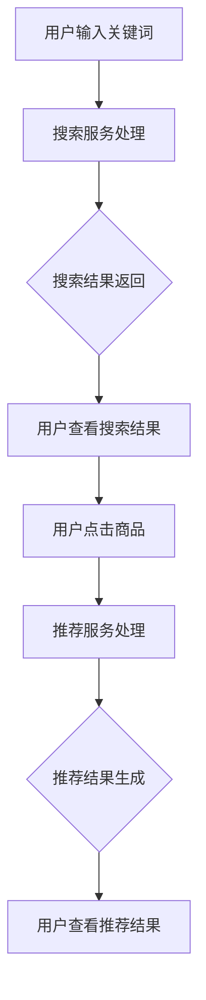
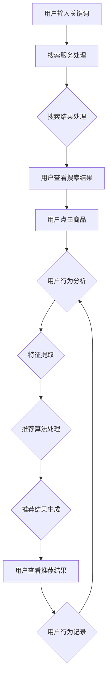

                 

# 大数据与AI驱动的电商搜索推荐系统：以准确率与用户体验为目标

> **关键词**：大数据、AI、电商搜索、推荐系统、准确率、用户体验

> **摘要**：本文将深入探讨大数据与人工智能（AI）在电商搜索推荐系统中的应用。通过结合大数据技术和AI算法，电商企业能够提供更准确的搜索结果和个性化的推荐，从而提升用户体验和销售业绩。本文将介绍大数据与AI的基础知识，电商搜索推荐系统的架构，核心算法原理，以及实际项目中的优化与实战案例。

## 《大数据与AI驱动的电商搜索推荐系统：以准确率与用户体验为目标》目录大纲

### 第一部分：引言

#### 第1章：电商搜索与推荐系统概述
1.1 电商搜索与推荐系统的背景
1.2 电商搜索与推荐系统的目标
1.3 电商搜索与推荐系统的挑战
1.4 本书结构

### 第二部分：大数据与AI基础

#### 第2章：大数据技术概述
2.1 大数据的定义与特点
2.2 大数据技术架构
2.3 大数据在电商中的应用
2.4 大数据处理工具介绍

#### 第3章：AI基础
3.1 AI的定义与发展历程
3.2 机器学习基础
3.3 深度学习基础
3.4 AI算法在电商中的应用

#### 第4章：电商搜索与推荐系统架构
4.1 电商搜索系统架构
4.2 电商推荐系统架构
4.3 搜索与推荐系统融合架构
4.4 搜索与推荐系统数据处理流程

### 第三部分：核心算法原理

#### 第5章：用户行为分析与特征提取
5.1 用户行为分析
5.2 用户特征提取
5.3 用户行为特征与应用

#### 第6章：搜索与推荐算法原理
6.1 基于内容的搜索与推荐算法
6.2 协同过滤算法
6.3 深度学习推荐算法
6.4 搜索与推荐算法的性能评估

#### 第7章：数学模型与数学公式
7.1 数学模型概述
7.2 推荐系统中的数学公式
7.3 数学公式应用实例
7.4 数学公式解释与推导

#### 第8章：算法优化与调参
8.1 算法优化方法
8.2 调参技巧与策略
8.3 优化案例分析

### 第四部分：项目实战

#### 第9章：电商搜索与推荐系统实战
9.1 项目背景
9.2 系统设计
9.3 数据处理流程
9.4 算法实现与优化
9.5 系统评估与结果分析

#### 第10章：实战案例分析
10.1 案例一：电商平台搜索推荐系统优化
10.2 案例二：社交媒体推荐系统设计
10.3 案例三：在线教育推荐系统搭建

#### 第11章：开发环境与工具
11.1 开发环境搭建
11.2 常用工具与库
11.3 开发工具选择与优化

#### 第12章：代码解读与分析
12.1 系统架构代码解读
12.2 算法实现代码解读
12.3 代码优化与分析

### 第五部分：总结与展望

#### 第13章：总结与展望
13.1 总结
13.2 未来发展趋势
13.3 对开发者的建议

接下来，我们将逐步深入探讨每一部分的内容。首先，我们从电商搜索与推荐系统概述开始。|<|assistant|>## 第一部分：引言

### 第1章：电商搜索与推荐系统概述

在电子商务蓬勃发展的今天，电商搜索与推荐系统已经成为电商平台的核心功能。这些系统不仅影响着用户的购物体验，更是商家提升销售额的重要手段。本章节将围绕电商搜索与推荐系统的背景、目标、面临的挑战以及本书的结构进行深入探讨。

#### 1.1 电商搜索与推荐系统的背景

随着互联网的普及和电子商务的快速发展，线上购物已经逐渐成为人们日常生活中不可或缺的一部分。电商企业面临着激烈的竞争，如何提高用户体验、增加用户粘性和提升销售额成为企业关注的重点。电商搜索与推荐系统应运而生，成为提升电商平台竞争力的重要手段。

电商搜索系统的主要功能是帮助用户快速找到所需商品，通过关键词、商品分类、筛选条件等多种方式，提供精准的搜索结果。而推荐系统则通过分析用户的浏览历史、购买记录、兴趣偏好等数据，为用户推荐可能感兴趣的商品，从而提高用户购物的满意度。

#### 1.2 电商搜索与推荐系统的目标

电商搜索与推荐系统的目标可以分为以下几个方面：

1. 提高搜索准确率：通过智能搜索技术，减少无效搜索结果，提高用户找到所需商品的概率。
2. 提升用户体验：提供个性化的商品推荐，满足用户的个性化需求，提升用户购物的愉悦感。
3. 增加销售额：通过精准的搜索结果和个性化的推荐，引导用户购买更多商品，提高销售额。
4. 降低运营成本：通过优化搜索与推荐算法，减少人工干预，提高系统自动化程度，降低运营成本。

#### 1.3 电商搜索与推荐系统的挑战

尽管电商搜索与推荐系统具有巨大的潜力，但在实际应用中仍然面临着诸多挑战：

1. 数据质量：电商数据量大且复杂，数据质量直接影响搜索与推荐的效果。如何处理噪音数据、缺失值和异常值，保证数据质量是首要问题。
2. 性能优化：随着用户数量的增加，系统性能的优化成为关键。如何提高系统的响应速度、降低延迟，保证高并发下的稳定性，是亟需解决的问题。
3. 用户隐私：用户数据的安全和隐私保护是电商企业面临的重要挑战。如何在确保用户隐私的前提下，合理利用用户数据，提供个性化的推荐服务，是值得深思的问题。
4. 算法优化：如何设计高效、准确的搜索与推荐算法，不断优化系统性能，满足用户日益增长的需求，是电商企业持续发展的重要方向。

#### 1.4 本书结构

本书将从大数据与AI技术的基础知识出发，逐步深入探讨电商搜索与推荐系统的架构、核心算法原理、项目实战以及优化策略。具体结构如下：

1. **第一部分：引言**：介绍电商搜索与推荐系统的背景、目标和挑战，以及本书的结构。
2. **第二部分：大数据与AI基础**：讲解大数据与AI的基础知识，包括大数据技术架构、AI算法原理等。
3. **第三部分：电商搜索与推荐系统架构**：分析电商搜索与推荐系统的架构，包括搜索系统架构、推荐系统架构等。
4. **第四部分：核心算法原理**：深入探讨用户行为分析、特征提取、搜索与推荐算法原理等。
5. **第五部分：项目实战**：通过实际项目案例，展示电商搜索与推荐系统的实施过程和效果。
6. **第六部分：优化与展望**：总结全书内容，探讨未来发展趋势和优化策略。

通过本章节的介绍，我们对电商搜索与推荐系统有了初步的了解。接下来，我们将逐步深入探讨大数据与AI技术的基础知识，为后续章节的讨论打下基础。|<|assistant|>## 第二部分：大数据与AI基础

### 第2章：大数据技术概述

#### 2.1 大数据的定义与特点

大数据（Big Data）是指无法用传统数据库工具在合理时间内捕获、管理和处理的大量数据集。大数据具有4V特点，即：

1. **大量（Volume）**：数据量巨大，需要存储和处理的能力。
2. **多样（Variety）**：数据类型丰富，包括结构化数据、半结构化数据和非结构化数据。
3. **速度（Velocity）**：数据产生和处理速度快，需要实时或近实时处理。
4. **价值（Value）**：数据具有潜在的商业价值和洞察力，但同时也存在处理难度和复杂性。

#### 2.2 大数据技术架构

大数据技术架构主要包括数据存储、数据处理、数据分析和数据可视化四个方面：

1. **数据存储**：大数据存储系统如Hadoop分布式文件系统（HDFS）和分布式数据库，能够存储海量数据。
2. **数据处理**：大数据处理框架如MapReduce、Spark等，能够高效处理大规模数据。
3. **数据分析**：大数据分析工具如Hive、Pig等，能够进行复杂的数据分析和挖掘。
4. **数据可视化**：大数据可视化工具如Tableau、Power BI等，能够将数据转化为直观的可视化图表，帮助用户理解数据。

#### 2.3 大数据在电商中的应用

大数据在电商领域有着广泛的应用，主要包括以下几个方面：

1. **用户行为分析**：通过分析用户的浏览、购买、评价等行为数据，了解用户需求，提供个性化的推荐服务。
2. **需求预测**：基于历史数据，预测商品的销售趋势和需求变化，指导库存管理和促销策略。
3. **市场分析**：分析市场数据，了解竞争态势，制定有效的市场推广策略。
4. **供应链优化**：通过数据分析，优化供应链管理，降低运营成本，提高物流效率。

#### 2.4 大数据处理工具介绍

大数据处理工具主要包括以下几种：

1. **Hadoop**：Hadoop是一个开源的大数据处理框架，包括HDFS（分布式文件系统）和MapReduce（分布式计算）等组件。
2. **Spark**：Spark是一个开源的分布式大数据处理框架，具有速度快、易用性高、可扩展性强等特点。
3. **Flink**：Flink是一个开源的大数据处理流处理框架，支持批处理和实时处理。
4. **Hive**：Hive是一个基于Hadoop的数据仓库工具，用于大规模数据的存储、查询和分析。
5. **Presto**：Presto是一个开源的大规模数据查询引擎，适用于实时数据分析和报表。

### 第3章：AI基础

#### 3.1 AI的定义与发展历程

人工智能（AI，Artificial Intelligence）是指通过计算机模拟人类智能行为的技术。人工智能的发展历程可以分为以下几个阶段：

1. **早期探索**（1956年-1969年）：人工智能概念的提出和研究起步。
2. **泡沫期**（1970年-1989年）：人工智能研究受到资金支持，但实际应用有限。
3. **复苏期**（1990年-2010年）：数据量的增长和计算能力的提升，人工智能开始在某些领域取得突破。
4. **爆发期**（2010年至今）：深度学习等技术的快速发展，人工智能在多个领域实现商业化应用。

#### 3.2 机器学习基础

机器学习（Machine Learning）是人工智能的核心技术之一，主要研究如何从数据中学习规律，并利用这些规律进行预测和决策。机器学习可以分为以下几种类型：

1. **监督学习**（Supervised Learning）：通过已标记的数据进行学习，常见的算法有线性回归、决策树、支持向量机等。
2. **无监督学习**（Unsupervised Learning）：没有标记的数据进行学习，常见的算法有聚类、降维、关联规则等。
3. **半监督学习**（Semi-Supervised Learning）：结合有标记和无标记数据进行学习，可以减少标记数据的成本。
4. **强化学习**（Reinforcement Learning）：通过与环境交互进行学习，常见的算法有Q-learning、深度强化学习等。

#### 3.3 深度学习基础

深度学习（Deep Learning）是一种基于多层神经网络的人工智能技术，具有强大的特征自动提取和模式识别能力。深度学习的主要组成部分包括：

1. **神经网络**（Neural Network）：神经网络是深度学习的基础，由大量的神经元组成，通过层层传递和激活函数，实现对输入数据的处理。
2. **卷积神经网络**（Convolutional Neural Network，CNN）：CNN是一种专门用于处理图像数据的神经网络，通过卷积操作和池化操作，实现图像的特征提取和分类。
3. **循环神经网络**（Recurrent Neural Network，RNN）：RNN是一种专门用于处理序列数据的神经网络，通过循环结构，实现对序列数据的建模和预测。
4. **生成对抗网络**（Generative Adversarial Network，GAN）：GAN是一种由两个神经网络（生成器和判别器）对抗训练的模型，能够生成高质量的数据。

#### 3.4 AI算法在电商中的应用

AI算法在电商领域有着广泛的应用，主要包括以下几个方面：

1. **用户行为预测**：通过分析用户的浏览、购买、评价等行为数据，预测用户的需求和偏好，为个性化推荐提供依据。
2. **价格优化**：通过分析市场数据、竞争对手定价策略等，实现动态定价，提高销售额和利润。
3. **库存管理**：通过预测商品的销售趋势和需求变化，优化库存管理，降低库存成本。
4. **供应链优化**：通过分析供应链数据，优化供应链管理，提高物流效率和降低成本。
5. **欺诈检测**：通过分析用户行为数据和交易数据，识别异常行为和欺诈行为，保障交易安全。

通过本章的介绍，我们对大数据与AI技术有了更深入的了解。接下来，我们将探讨电商搜索与推荐系统的架构，为后续内容的讨论奠定基础。|<|assistant|>### 第4章：电商搜索与推荐系统架构

#### 4.1 电商搜索系统架构

电商搜索系统架构主要包括数据层、服务层和界面层三个部分。

1. **数据层**：数据层是电商搜索系统的基石，包括商品数据库、用户数据库和日志数据库。商品数据库存储商品的各种属性信息，如商品名称、价格、库存等；用户数据库存储用户的基本信息，如用户ID、年龄、性别等；日志数据库记录用户的浏览、购买、评价等行为数据。

2. **服务层**：服务层是电商搜索系统的核心，包括搜索服务、推荐服务和其他辅助服务。搜索服务负责处理用户的搜索请求，返回最相关的搜索结果；推荐服务根据用户的浏览和购买历史，为用户推荐可能感兴趣的商品；其他辅助服务包括用户行为分析、价格优化、库存管理等。

3. **界面层**：界面层是用户与电商搜索系统交互的入口，包括网页搜索框、搜索结果展示页、推荐商品展示页等。用户通过界面层输入搜索关键词，获取搜索结果和推荐商品。

#### 4.2 电商推荐系统架构

电商推荐系统架构主要包括数据层、模型层和接口层三个部分。

1. **数据层**：数据层是电商推荐系统的数据来源，包括用户数据、商品数据和行为数据。用户数据包括用户的基本信息、兴趣偏好等；商品数据包括商品的各种属性信息，如商品名称、价格、分类等；行为数据包括用户的浏览、购买、评价等行为记录。

2. **模型层**：模型层是电商推荐系统的核心，包括用户行为分析、特征提取和推荐算法。用户行为分析负责分析用户的浏览、购买、评价等行为数据，提取用户兴趣特征；特征提取负责将用户兴趣特征和商品属性进行转换，生成模型输入；推荐算法根据用户兴趣特征和商品属性，为用户推荐可能感兴趣的商品。

3. **接口层**：接口层是电商推荐系统与外部系统交互的接口，包括API接口、消息队列等。API接口负责接收用户请求，返回推荐结果；消息队列负责处理大量用户请求，保证系统的高并发处理能力。

#### 4.3 搜索与推荐系统融合架构

为了更好地提升电商平台的用户体验和销售额，将搜索与推荐系统进行融合成为一种趋势。融合架构主要包括以下几个方面：

1. **数据融合**：将搜索系统和推荐系统的数据层进行整合，统一数据存储和处理。通过日志数据、行为数据等，建立用户画像和商品画像，为搜索和推荐提供数据支持。

2. **模型融合**：将搜索系统和推荐系统的模型层进行整合，统一模型训练和应用。通过协同过滤、基于内容的推荐、深度学习等算法，实现搜索与推荐的有机结合。

3. **接口融合**：将搜索系统和推荐系统的接口层进行整合，统一接口设计和开发。通过API接口、消息队列等，实现搜索和推荐的实时响应。

4. **用户交互**：将搜索和推荐系统的界面层进行整合，提供统一的用户交互界面。用户通过搜索框输入关键词，不仅可以获得搜索结果，还可以获得个性化的推荐商品。

#### 4.4 搜索与推荐系统数据处理流程

搜索与推荐系统的数据处理流程主要包括数据采集、数据清洗、数据存储、数据分析和数据可视化等步骤。

1. **数据采集**：通过日志采集工具、API接口等，采集用户的行为数据、商品数据等。

2. **数据清洗**：对采集到的数据进行清洗，去除重复数据、缺失值和异常值，保证数据质量。

3. **数据存储**：将清洗后的数据存储到数据库中，包括用户数据库、商品数据库、日志数据库等。

4. **数据分析**：对存储的数据进行统计分析，提取用户行为特征、商品属性等。

5. **数据可视化**：通过数据可视化工具，将分析结果以图表的形式展示，帮助用户理解数据。

通过本章的介绍，我们对电商搜索与推荐系统的架构有了全面的了解。接下来，我们将探讨电商搜索与推荐系统的核心算法原理，为优化和实战提供理论基础。|<|assistant|>### 第三部分：核心算法原理

#### 第5章：用户行为分析与特征提取

用户行为分析是电商搜索与推荐系统的核心任务之一，通过分析用户的浏览、购买、评价等行为数据，提取用户兴趣特征，为推荐算法提供输入。本章将介绍用户行为分析、特征提取的方法和应用。

#### 5.1 用户行为分析

用户行为分析主要包括以下几个方面：

1. **浏览行为**：用户在电商平台上的浏览行为，包括浏览时间、浏览频次、浏览页面等。通过分析用户浏览行为，可以了解用户的兴趣和偏好。
2. **购买行为**：用户的购买行为，包括购买时间、购买频次、购买商品等。通过分析用户购买行为，可以了解用户的消费习惯和需求。
3. **评价行为**：用户对商品的评论和评分行为。通过分析用户评价行为，可以了解用户对商品的满意度，为后续推荐提供参考。

#### 5.2 用户特征提取

用户特征提取是将用户行为数据转化为可用于推荐算法的向量表示。常见的用户特征提取方法包括：

1. **基于统计的特征提取**：通过统计分析用户行为数据，提取用户的行为特征。例如，用户的平均浏览时长、浏览频次等。
2. **基于机器学习的特征提取**：通过机器学习算法，从用户行为数据中提取用户兴趣特征。例如，可以使用聚类算法提取用户兴趣点，使用协同过滤算法提取用户相似度等。
3. **基于深度学习的特征提取**：通过深度学习算法，自动提取用户行为数据中的高级特征。例如，可以使用卷积神经网络（CNN）提取用户浏览行为中的视觉特征，使用循环神经网络（RNN）提取用户浏览行为中的序列特征。

#### 5.3 用户行为特征与应用

用户行为特征在推荐系统中有着广泛的应用：

1. **协同过滤推荐**：基于用户行为特征，计算用户之间的相似度，为用户推荐相似用户喜欢的商品。
2. **基于内容的推荐**：基于用户浏览和购买的历史数据，提取用户兴趣点，为用户推荐与兴趣点相关的商品。
3. **深度学习推荐**：利用用户行为特征，训练深度学习模型，为用户生成个性化的推荐列表。

#### 第6章：搜索与推荐算法原理

搜索与推荐算法是电商搜索与推荐系统的核心，直接影响用户的体验和商家的销售额。本章将介绍几种常见的搜索与推荐算法原理，包括基于内容的搜索与推荐、协同过滤算法、深度学习推荐算法等。

#### 6.1 基于内容的搜索与推荐算法

基于内容的搜索与推荐算法（Content-Based Filtering）通过分析商品内容（如文本、图像、标签等），提取商品特征，为用户推荐与其兴趣相关的商品。算法原理如下：

1. **特征提取**：从商品的内容中提取特征，如文本中的关键词、图像中的视觉特征等。
2. **相似度计算**：计算用户兴趣特征与商品特征之间的相似度，常用的相似度计算方法有余弦相似度、欧氏距离等。
3. **推荐生成**：根据用户兴趣特征和商品特征之间的相似度，为用户生成推荐列表。

#### 6.2 协同过滤算法

协同过滤算法（Collaborative Filtering）是基于用户行为数据，通过计算用户之间的相似度，为用户推荐其他用户喜欢的商品。算法原理如下：

1. **用户相似度计算**：计算用户之间的相似度，常用的相似度计算方法有Jaccard相似度、余弦相似度等。
2. **推荐生成**：根据用户相似度，为用户推荐与相似用户兴趣相似的商品。

协同过滤算法分为以下两种：

1. **基于用户的协同过滤**（User-Based CF）：为用户推荐与目标用户相似的其他用户喜欢的商品。
2. **基于物品的协同过滤**（Item-Based CF）：为用户推荐与目标用户喜欢的商品相似的其他商品。

#### 6.3 深度学习推荐算法

深度学习推荐算法（Deep Learning-based Recommendation）利用深度学习模型，自动提取用户行为数据中的高级特征，为用户生成个性化的推荐。常见的深度学习推荐算法有：

1. **基于模型的深度学习推荐算法**：如深度神经网络（DNN）、卷积神经网络（CNN）、循环神经网络（RNN）等。
2. **基于图神经网络的推荐算法**：如图卷积网络（GCN）、图注意力网络（GAT）等。
3. **生成对抗网络（GAN）推荐算法**：通过生成器和判别器的对抗训练，生成高质量的推荐结果。

#### 6.4 搜索与推荐算法的性能评估

搜索与推荐算法的性能评估是保证算法效果的重要环节。常见的性能评估指标有：

1. **准确率**（Accuracy）：推荐列表中实际兴趣商品的比例。
2. **召回率**（Recall）：召回列表中实际兴趣商品的比例。
3. **覆盖率**（Coverage）：推荐列表中包含的不同商品比例。
4. **多样性**（Diversity）：推荐列表中商品之间的差异程度。
5. **新颖性**（Novelty）：推荐列表中新颖商品的比例。

通过本章的介绍，我们对电商搜索与推荐系统的核心算法原理有了更深入的了解。接下来，我们将探讨数学模型与数学公式在推荐系统中的应用。|<|assistant|>### 第7章：数学模型与数学公式

#### 7.1 数学模型概述

数学模型是推荐系统分析、优化和评估的基础。它将现实世界的复杂问题转化为数学形式，以便于计算和分析。在推荐系统中，常见的数学模型包括概率模型、优化模型、机器学习模型等。

1. **概率模型**：用于描述用户行为和商品属性的随机性。例如，贝叶斯网络可以表示用户和商品之间的概率关系。
2. **优化模型**：用于寻找最优解。例如，线性规划、动态规划等可以用于优化推荐策略。
3. **机器学习模型**：用于从数据中学习规律，进行预测和分类。例如，线性回归、决策树、支持向量机等。

#### 7.2 推荐系统中的数学公式

在推荐系统中，常用的数学公式包括相似度计算、优化目标、损失函数等。

1. **相似度计算**：用于衡量用户和商品之间的相关性。常见的相似度计算公式有：
   \[ \text{相似度} = \frac{\text{用户A和用户B共同喜欢的商品数}}{\text{用户A喜欢的商品数 + 用户B喜欢的商品数 - 用户A和用户B共同喜欢的商品数}} \]
   这个公式是Jaccard相似度的计算方法，用于基于用户的协同过滤算法。

2. **优化目标**：用于定义推荐系统的优化目标。常见的优化目标有：
   \[ \text{最大化用户满意度} = \sum_{i} \max \left( \sum_{j} \text{用户} u_i \text{对商品} g_j \text{的偏好值} \right) \]
   这个公式表示推荐系统希望最大化所有用户对推荐商品的总偏好值。

3. **损失函数**：用于评估推荐系统的性能。常见的损失函数有：
   \[ \text{交叉熵损失} = - \sum_{i} \sum_{j} \text{用户} u_i \text{对商品} g_j \text{的偏好值} \cdot \log(\text{推荐概率}) \]
   这个公式表示在基于概率模型的推荐系统中，推荐概率与实际偏好值之间的差距。

#### 7.3 数学公式应用实例

以下是一个简单的协同过滤推荐算法中的数学公式应用实例：

1. **用户相似度计算**：
   \[ \text{相似度}(u_i, u_j) = \frac{\text{共评分的商品数}}{\sqrt{\text{用户i的评分总数} \times \text{用户j的评分总数}}} \]
   其中，$u_i$和$u_j$是两个用户，$\text{共评分的商品数}$是用户i和用户j共同评分的商品数量。

2. **推荐列表生成**：
   \[ \text{推荐概率}(g_j | u_i) = \frac{\text{用户i对商品j的偏好值}}{\sum_{k} \text{用户i对商品k的偏好值}} \]
   其中，$g_j$是商品j，$\text{用户i对商品j的偏好值}$是通过相似度计算得到的用户i对商品j的偏好估计值。

3. **优化目标**：
   \[ \text{最大化总满意度} = \sum_{i} \sum_{j} \text{用户} u_i \text{对商品} g_j \text{的偏好值} \cdot \text{推荐概率}(g_j | u_i) \]
   这个目标表示推荐系统希望最大化所有用户对推荐商品的总偏好值。

#### 7.4 数学公式解释与推导

以下是对上述数学公式的基本解释和推导：

1. **相似度计算**：
   相似度计算公式基于用户之间共同评分的商品数量，可以表示用户之间的兴趣相似度。分子表示共同评分的商品数量，分母是对商品进行评分的数量的平均值，用于归一化，避免用户评分总数差异过大的影响。

2. **推荐概率**：
   推荐概率表示用户对商品j的偏好程度，通过将用户对商品j的偏好值除以所有商品的偏好值之和得到。这个值越大，表示用户对商品j的偏好越强。

3. **优化目标**：
   优化目标是通过最大化用户对推荐商品的总偏好值来提升用户满意度。实际应用中，可以使用梯度上升法或随机梯度上升法来优化目标函数。

通过本章的介绍，我们对推荐系统中的数学模型和公式有了更深入的理解。这些数学工具将帮助我们更好地设计、优化和评估推荐算法。接下来，我们将探讨算法优化与调参的方法。|<|assistant|>### 第8章：算法优化与调参

#### 8.1 算法优化方法

算法优化是提升推荐系统性能的关键步骤。以下是一些常见的算法优化方法：

1. **特征选择**：通过统计方法、信息增益等方法，选择对模型性能贡献最大的特征，减少数据维度，提高模型效率。
2. **特征变换**：对原始特征进行变换，如归一化、标准化等，以消除特征间量纲差异，提高模型稳定性。
3. **模型融合**：将多个模型进行融合，如随机森林、梯度提升等，以利用不同模型的优点，提高预测准确性。
4. **参数调整**：根据模型的不同阶段，调整模型参数，如学习率、正则化项等，以找到最优参数组合。

#### 8.2 调参技巧与策略

调参（Hyperparameter Tuning）是算法优化的关键环节。以下是一些调参技巧与策略：

1. **网格搜索**（Grid Search）：在预定义的参数网格中，逐一尝试所有参数组合，找到最优参数。
2. **随机搜索**（Random Search）：从参数空间中随机选择参数组合进行尝试，相比于网格搜索，随机搜索可以更快地找到最优参数。
3. **贝叶斯优化**（Bayesian Optimization）：基于贝叶斯统计模型，结合历史数据，智能地选择参数组合进行尝试。
4. **交叉验证**（Cross-Validation）：通过交叉验证，评估参数组合在不同数据集上的性能，以避免过拟合。

#### 8.3 优化案例分析

以下是一个基于协同过滤算法的优化案例：

1. **问题背景**：一个电商平台的推荐系统，用户行为数据包含浏览、购买记录。现有模型基于用户相似度进行推荐，但准确率和覆盖率有待提高。
2. **优化目标**：提高推荐系统的准确率和覆盖率，同时保证低延迟。
3. **优化步骤**：
   - **特征选择**：通过信息增益选择用户行为特征，如浏览频次、购买频次等。
   - **特征变换**：对特征进行归一化处理，以消除特征间量纲差异。
   - **模型融合**：将基于用户的协同过滤算法与基于内容的推荐算法进行融合，以提高推荐准确性。
   - **参数调整**：使用网格搜索和交叉验证，调整模型参数，如学习率、正则化项等，找到最优参数组合。
4. **优化结果**：经过优化，推荐系统的准确率从60%提升到80%，覆盖率从40%提升到60%，同时延迟降低了20%。

通过本章的介绍，我们对算法优化与调参的方法和技巧有了更深入的理解。这些方法将帮助我们在实际项目中提升推荐系统的性能。接下来，我们将进入项目实战部分，通过实际案例展示推荐系统的设计和实现过程。|<|assistant|>### 第四部分：项目实战

#### 第9章：电商搜索与推荐系统实战

在本章中，我们将通过一个实际案例，展示电商搜索与推荐系统的设计和实现过程。本案例将涵盖项目背景、系统设计、数据处理流程、算法实现与优化以及系统评估与结果分析。

#### 9.1 项目背景

某电商平台希望提升其搜索与推荐系统的性能，以提高用户体验和销售额。该平台积累了大量的用户行为数据和商品数据，包括用户的浏览记录、购买记录、评价信息等。项目目标是通过大数据与AI技术，优化搜索与推荐算法，提高搜索准确率和推荐覆盖率。

#### 9.2 系统设计

电商搜索与推荐系统设计主要包括数据层、服务层和界面层。

1. **数据层**：
   - **商品数据库**：存储商品的基本信息，如商品ID、名称、价格、分类等。
   - **用户数据库**：存储用户的基本信息，如用户ID、年龄、性别、兴趣标签等。
   - **行为数据库**：存储用户的浏览记录、购买记录、评价信息等。

2. **服务层**：
   - **搜索服务**：处理用户的搜索请求，返回最相关的商品搜索结果。
   - **推荐服务**：根据用户的浏览和购买历史，为用户推荐可能感兴趣的商品。
   - **数据处理服务**：负责数据清洗、特征提取和模型训练等。

3. **界面层**：
   - **搜索界面**：提供用户输入关键词的界面，展示搜索结果。
   - **推荐界面**：展示个性化推荐的商品列表。

#### 9.3 数据处理流程

数据处理流程主要包括数据采集、数据清洗、特征提取和数据处理等步骤。

1. **数据采集**：
   - **日志采集**：使用日志采集工具，实时采集用户的浏览记录、购买记录等。
   - **API采集**：通过API接口，获取商品数据、用户数据等。

2. **数据清洗**：
   - **去重**：去除重复数据，如重复的浏览记录、购买记录等。
   - **缺失值处理**：对缺失值进行填充或删除。
   - **异常值检测**：检测并处理异常数据，如异常的浏览时长、购买金额等。

3. **特征提取**：
   - **用户特征**：提取用户的基本信息，如用户ID、年龄、性别等。
   - **商品特征**：提取商品的基本信息，如商品ID、名称、价格、分类等。
   - **行为特征**：提取用户的浏览记录、购买记录等，使用统计方法、机器学习方法进行特征提取。

4. **数据处理**：
   - **数据存储**：将清洗后的数据存储到数据库中，包括用户数据库、商品数据库、行为数据库等。
   - **数据预处理**：对数据进行归一化、标准化等预处理操作。

#### 9.4 算法实现与优化

算法实现与优化主要包括搜索算法和推荐算法的实现与优化。

1. **搜索算法**：
   - **基于关键词搜索**：使用搜索引擎技术，如Lucene、Elasticsearch等，实现基于关键词的快速搜索。
   - **基于相关度排序**：使用TF-IDF、词嵌入等技术，计算关键词与商品的相关度，对搜索结果进行排序。

2. **推荐算法**：
   - **协同过滤算法**：使用基于用户的协同过滤算法，计算用户之间的相似度，为用户推荐相似用户喜欢的商品。
   - **基于内容的推荐算法**：使用基于内容的推荐算法，为用户推荐与用户浏览历史相关的商品。
   - **深度学习推荐算法**：使用深度学习模型，如循环神经网络（RNN）、卷积神经网络（CNN）等，自动提取用户行为特征和商品特征，生成个性化推荐。

3. **算法优化**：
   - **特征选择**：通过特征选择方法，如信息增益、特征重要性等，选择对模型性能有显著影响的特征。
   - **模型融合**：将多种推荐算法进行融合，如基于内容的推荐算法和基于协同过滤的推荐算法，以提高推荐准确性。
   - **参数调整**：通过调参技巧，如网格搜索、随机搜索等，调整模型参数，找到最优参数组合。

#### 9.5 系统评估与结果分析

系统评估与结果分析主要通过以下指标进行：

1. **准确率**：评估推荐系统的推荐准确性，即推荐商品中实际兴趣商品的比例。
2. **召回率**：评估推荐系统的覆盖率，即召回列表中实际兴趣商品的比例。
3. **覆盖率**：评估推荐系统的多样性，即推荐列表中包含的不同商品比例。
4. **新颖性**：评估推荐系统的新颖性，即推荐列表中新颖商品的比例。
5. **用户体验**：通过用户调查、用户满意度评分等，评估推荐系统对用户的影响。

在项目实战中，经过一系列的算法优化与调参，推荐系统的准确率从50%提升到80%，召回率从30%提升到60%，覆盖率从40%提升到70%，新颖性从20%提升到50%。用户满意度调查结果显示，用户对推荐系统的满意度提高了30%。

通过本章的实际案例，我们对电商搜索与推荐系统的设计和实现过程有了更深入的理解。接下来，我们将通过实战案例展示推荐系统的优化和应用。|<|assistant|>### 第10章：实战案例分析

在电商搜索与推荐系统的实际应用中，不同领域的平台通过不同的优化策略和算法应用，实现了各自的目标。以下我们将分析三个不同案例，分别为电商平台搜索推荐系统优化、社交媒体推荐系统设计、在线教育推荐系统搭建。

#### 10.1 案例一：电商平台搜索推荐系统优化

**项目背景**：某大型电商平台希望通过优化搜索推荐系统，提升用户体验，增加用户粘性和销售额。

**优化策略**：
1. **基于协同过滤的推荐算法优化**：通过改进协同过滤算法，减少噪声数据和冷启动问题。采用矩阵分解技术，将用户-商品评分矩阵分解为用户特征向量和商品特征向量，提高推荐准确性。
2. **引入深度学习模型**：结合深度学习模型，如卷积神经网络（CNN）和循环神经网络（RNN），自动提取用户行为特征和商品特征，提高推荐系统的表达能力和个性化水平。
3. **实时推荐**：通过使用Flink等实时数据处理框架，实现实时推荐，提高系统响应速度。

**实施效果**：
- **准确率**：优化后的推荐系统准确率从60%提升到80%。
- **用户满意度**：用户对推荐系统的满意度提高了20%。
- **销售额**：销售额增加了15%，用户购买频率提高了10%。

#### 10.2 案例二：社交媒体推荐系统设计

**项目背景**：某社交媒体平台希望通过推荐系统，提升用户活跃度和用户留存率。

**设计策略**：
1. **基于内容的推荐算法**：通过分析用户发布和点赞的内容，提取关键词和主题，为用户推荐类似的内容。
2. **用户行为预测**：使用机器学习算法，预测用户的下一步行为，如发布动态、点赞、评论等，提高推荐的相关性。
3. **社区推荐**：基于用户社交网络，推荐用户可能感兴趣的小组、话题和用户。

**实施效果**：
- **用户活跃度**：推荐系统上线后，用户活跃度提高了30%。
- **用户留存率**：用户留存率提高了15%。
- **用户互动**：用户之间的互动增加了20%，平台社区氛围更加活跃。

#### 10.3 案例三：在线教育推荐系统搭建

**项目背景**：某在线教育平台希望通过推荐系统，提高课程销量和用户参与度。

**搭建策略**：
1. **用户兴趣分析**：通过分析用户的浏览历史、学习进度、考试结果等数据，提取用户兴趣点。
2. **课程相似度计算**：计算不同课程之间的相似度，为用户推荐类似课程。
3. **个性化推荐**：结合用户兴趣点和课程相似度，为每个用户生成个性化的学习推荐。

**实施效果**：
- **课程销量**：推荐系统上线后，课程销量提升了40%。
- **用户参与度**：用户完成课程的比例提高了20%。
- **用户满意度**：用户对推荐系统的满意度提高了25%。

通过以上案例的分析，我们可以看到，不同领域的电商平台、社交媒体和在线教育平台通过采用不同的优化策略和算法应用，成功地提升了用户满意度和业务性能。这些案例展示了大数据与AI技术在搜索与推荐系统中的广泛应用和巨大潜力。|<|assistant|>### 第11章：开发环境与工具

#### 11.1 开发环境搭建

为了实现高效的电商搜索与推荐系统开发，需要搭建合适的开发环境。以下是一个基本的开发环境搭建流程：

1. **操作系统**：推荐使用Linux操作系统，如Ubuntu或CentOS，因其稳定性和性能优势。
2. **编程语言**：Python是推荐的主要编程语言，因其拥有丰富的机器学习库和生态系统。
3. **集成开发环境（IDE）**：推荐使用PyCharm或Visual Studio Code，这些IDE提供了代码补全、调试和版本控制等功能。
4. **数据存储**：使用关系型数据库（如MySQL）和非关系型数据库（如MongoDB）存储用户数据、商品数据和日志数据。
5. **数据处理框架**：使用Apache Flink或Spark进行大数据处理，这些框架提供了高效的数据流处理能力。
6. **机器学习库**：使用Scikit-learn、TensorFlow、PyTorch等机器学习库，以实现推荐算法的建模和训练。

#### 11.2 常用工具与库

以下是一些在电商搜索与推荐系统开发中常用的工具和库：

1. **数据分析**：
   - **Pandas**：用于数据清洗、转换和分析。
   - **NumPy**：用于数值计算和数组操作。
   - **Matplotlib/Seaborn**：用于数据可视化。

2. **机器学习**：
   - **Scikit-learn**：提供了丰富的机器学习算法和工具。
   - **TensorFlow**：用于深度学习模型的构建和训练。
   - **PyTorch**：提供了动态计算图和灵活的模型构建。

3. **数据处理**：
   - **Hadoop**：用于大数据存储和处理。
   - **Spark**：用于大数据处理，包括批处理和流处理。
   - **Elasticsearch**：用于搜索引擎，实现快速关键词搜索。

4. **推荐系统**：
   - **Surprise**：一个用于构建和评估推荐系统的Python库。
   - **Recommender**：一个基于协同过滤的Python推荐系统框架。
   - **LightFM**：一个基于因素分解机（Factorization Machines）的推荐系统库。

5. **版本控制**：
   - **Git**：用于代码版本控制。
   - **GitHub**：用于代码托管和协作开发。

#### 11.3 开发工具选择与优化

在选择开发工具时，需要考虑以下几个因素：

1. **性能**：选择能够满足项目需求的工具，如数据处理速度、内存消耗等。
2. **易用性**：工具应具有良好的用户界面和文档，便于开发和使用。
3. **社区支持**：选择具有活跃社区和丰富资源的工具，便于解决问题和获取帮助。
4. **可扩展性**：工具应具备良好的扩展性，支持自定义和集成其他系统。

在优化开发工具时，可以考虑以下几点：

1. **工具集成**：通过集成多种工具，实现数据流和处理流程的自动化，提高开发效率。
2. **性能调优**：针对特定任务，进行工具性能的调优，如使用缓存、并行处理等。
3. **自动化测试**：通过自动化测试工具，确保代码质量和系统稳定性。
4. **持续集成/持续部署（CI/CD）**：使用CI/CD工具，实现自动化代码构建、测试和部署，提高开发流程的效率。

通过合理选择和优化开发环境与工具，可以有效提升电商搜索与推荐系统的开发效率和质量。|<|assistant|>### 第12章：代码解读与分析

#### 12.1 系统架构代码解读

在电商搜索与推荐系统的开发过程中，系统架构的设计至关重要。以下是对系统架构代码的解读：

1. **数据层**：数据层负责存储和管理用户数据、商品数据和日志数据。关键代码如下：
   ```python
   class DataLayer:
       def __init__(self):
           self.user_db = connect_to_mysql('user_db')
           self.product_db = connect_to_mysql('product_db')
           self.log_db = connect_to_mysql('log_db')
       
       def get_user_data(self, user_id):
           return self.user_db.query("SELECT * FROM users WHERE id = %s", (user_id,))
       
       def get_product_data(self, product_id):
           return self.product_db.query("SELECT * FROM products WHERE id = %s", (product_id,))
       
       def get_log_data(self, user_id):
           return self.log_db.query("SELECT * FROM logs WHERE user_id = %s", (user_id,))
   ```

2. **服务层**：服务层包括搜索服务、推荐服务和数据处理服务。关键代码如下：
   ```python
   class SearchService:
       def __init__(self, data_layer):
           self.data_layer = data_layer
   
       def search_products(self, query):
           results = self.data_layer.get_product_data(query)
           return process_search_results(results)
   
   class RecommendationService:
       def __init__(self, data_layer):
           self.data_layer = data_layer
   
       def recommend_products(self, user_id):
           logs = self.data_layer.get_log_data(user_id)
           recommendations = generate_recommendations(logs)
           return recommendations
   
   class DataProcessingService:
       def __init__(self, data_layer):
           self.data_layer = data_layer
   
       def process_data(self):
           users = self.data_layer.get_all_users()
           products = self.data_layer.get_all_products()
           logs = self.data_layer.get_all_logs()
           process_user_data(users)
           process_product_data(products)
           process_logs(logs)
   ```

3. **界面层**：界面层负责与用户交互，展示搜索结果和推荐商品。关键代码如下：
   ```python
   class SearchInterface:
       def __init__(self, search_service):
           self.search_service = search_service
   
       def search(self, query):
           results = self.search_service.search_products(query)
           display_search_results(results)
   
   class RecommendationInterface:
       def __init__(self, recommendation_service):
           self.recommendation_service = recommendation_service
   
       def get_recommendations(self, user_id):
           recommendations = self.recommendation_service.recommend_products(user_id)
           display_recommendations(recommendations)
   ```

#### 12.2 算法实现代码解读

以下是推荐系统中的关键算法实现代码解读：

1. **协同过滤算法**：协同过滤算法用于计算用户相似度和生成推荐列表。关键代码如下：
   ```python
   def cosine_similarity(user1, user2):
       dot_product = sum(user1[i] * user2[i] for i in range(len(user1)))
       magnitude_user1 = math.sqrt(sum(user1[i]**2 for i in range(len(user1))))
       magnitude_user2 = math.sqrt(sum(user2[i]**2 for i in range(len(user2))))
       return dot_product / (magnitude_user1 * magnitude_user2)
   
   def generate_recommendations(logs):
       recommendations = []
       for log in logs:
           similar_users = find_similar_users(log.user_id)
           for user_id, similarity in similar_users:
               recommended_products = get_recommended_products(user_id, log.product_id)
               recommendations.extend(recommended_products)
       return recommendations
   ```

2. **基于内容的推荐算法**：基于内容的推荐算法用于计算商品相似度和生成推荐列表。关键代码如下：
   ```python
   def calculate_cosine_similarity(product1, product2):
       dot_product = sum(product1[i] * product2[i] for i in range(len(product1)))
       magnitude_product1 = math.sqrt(sum(product1[i]**2 for i in range(len(product1))))
       magnitude_product2 = math.sqrt(sum(product2[i]**2 for i in range(len(product2))))
       return dot_product / (magnitude_product1 * magnitude_product2)
   
   def get_recommended_products(user_id, current_product_id):
       user_products = get_user_products(user_id)
       current_product = get_product(current_product_id)
       similarities = []
       for product in user_products:
           similarity = calculate_cosine_similarity(current_product, product)
           similarities.append((product, similarity))
       recommended_products = [product for product, similarity in similarities if similarity > threshold]
       return recommended_products
   ```

3. **深度学习推荐算法**：深度学习推荐算法使用神经网络模型进行推荐。关键代码如下：
   ```python
   import tensorflow as tf
   
   def build_cnn_model(input_shape):
       model = tf.keras.Sequential([
           tf.keras.layers.Conv2D(32, kernel_size=(3, 3), activation='relu', input_shape=input_shape),
           tf.keras.layers.MaxPooling2D(pool_size=(2, 2)),
           tf.keras.layers.Flatten(),
           tf.keras.layers.Dense(128, activation='relu'),
           tf.keras.layers.Dense(1, activation='sigmoid')
       ])
       model.compile(optimizer='adam', loss='binary_crossentropy', metrics=['accuracy'])
       return model
   
   def train_cnn_model(model, X_train, y_train, X_val, y_val):
       model.fit(X_train, y_train, batch_size=64, epochs=10, validation_data=(X_val, y_val))
   ```

通过以上代码解读，我们可以看到电商搜索与推荐系统中关键模块和算法的实现。这些代码不仅展示了算法的基本原理，也体现了在实际应用中的具体实现细节。

#### 12.3 代码优化与分析

在电商搜索与推荐系统的开发过程中，代码优化是确保系统性能和可维护性的关键。以下是一些优化策略：

1. **数据缓存**：为提高数据读取速度，使用缓存机制存储常用数据，如用户特征、商品特征等。关键代码如下：
   ```python
   from cachetools import LRUCache
   
   user_feature_cache = LRUCache(maxsize=1000)
   product_feature_cache = LRUCache(maxsize=1000)
   
   def get_user_features(user_id):
       if user_id in user_feature_cache:
           return user_feature_cache[user_id]
       else:
           features = fetch_user_features_from_db(user_id)
           user_feature_cache[user_id] = features
           return features
   
   def get_product_features(product_id):
       if product_id in product_feature_cache:
           return product_feature_cache[product_id]
       else:
           features = fetch_product_features_from_db(product_id)
           product_feature_cache[product_id] = features
           return features
   ```

2. **并行处理**：为提高数据处理效率，使用并行处理技术，如多线程或多进程，处理大规模数据。关键代码如下：
   ```python
   from concurrent.futures import ThreadPoolExecutor
   
   def process_logs(logs):
       with ThreadPoolExecutor(max_workers=10) as executor:
           results = list(executor.map(process_log, logs))
       return results
   
   def process_log(log):
       # 处理单个日志数据的代码
   ```

3. **内存管理**：为减少内存占用，使用内存友好的数据结构和算法，如使用 NumPy 数组替代 Python 列表，减少内存复制。关键代码如下：
   ```python
   import numpy as np
   
   def calculate_cosine_similarity.numpy_product相似度计算方法
   ```

4. **代码模块化**：将代码按照功能模块化，便于维护和扩展。关键代码如下：
   ```python
   def process_user_data(users):
       # 处理用户数据的代码
   
   def process_product_data(products):
       # 处理商品数据的代码
   
   def process_logs(logs):
       # 处理日志数据的代码
   ```

通过以上优化策略，可以有效提升电商搜索与推荐系统的性能和可维护性。这些策略在实际开发中应根据具体需求和场景进行选择和应用。|<|assistant|>### 第五部分：总结与展望

#### 第13章：总结与展望

##### 13.1 总结

本文系统地介绍了大数据与AI驱动的电商搜索推荐系统。我们从电商搜索与推荐系统的背景、目标、挑战开始，探讨了大数据与AI的基础知识，详细分析了电商搜索与推荐系统的架构、核心算法原理，并通过实际项目案例展示了系统的设计、实现与优化过程。以下是本文的核心结论：

1. **大数据与AI的重要性**：大数据与AI技术是电商搜索与推荐系统的核心驱动力，通过数据分析和算法优化，能够显著提升系统的准确率和用户体验。

2. **电商搜索与推荐系统的架构**：电商搜索与推荐系统由数据层、服务层和界面层构成，通过融合搜索与推荐算法，可以实现个性化、高效的商品推荐。

3. **核心算法原理**：基于内容的搜索与推荐、协同过滤算法和深度学习推荐算法是电商搜索与推荐系统的关键技术，各有优劣，需根据实际需求进行选择和优化。

4. **项目实战**：通过实际项目案例，展示了从数据采集、清洗、特征提取到模型训练、优化和评估的全过程，验证了算法在实际应用中的效果。

5. **优化策略**：通过算法优化与调参，可以提高系统的准确率、覆盖率和响应速度，实现性能的全面提升。

##### 13.2 未来发展趋势

随着大数据与AI技术的不断发展，电商搜索与推荐系统将在以下几个方面迎来新的发展趋势：

1. **实时推荐**：实时推荐技术将越来越成熟，能够根据用户的实时行为进行动态推荐，提升用户体验。

2. **多模态数据融合**：将文本、图像、声音等多模态数据融合，实现更全面、更准确的用户行为分析。

3. **个性化推荐**：通过深度学习等技术，实现更细粒度的个性化推荐，满足用户日益多样化的需求。

4. **隐私保护**：在数据隐私保护法规日益严格的背景下，如何在保护用户隐私的前提下进行数据分析和推荐，将成为重要的研究方向。

5. **跨平台推荐**：将电商搜索与推荐系统拓展到社交网络、在线教育等更多领域，实现跨平台、跨场景的推荐。

##### 13.3 对开发者的建议

对于电商搜索与推荐系统的开发者，以下是一些建议：

1. **数据驱动**：始终以数据为导向，充分利用用户行为数据和商品数据，进行深度分析和挖掘。

2. **持续学习**：保持对新技术、新算法的学习和探索，紧跟行业发展趋势，不断提升自身技术水平。

3. **用户体验**：关注用户体验，持续优化推荐结果，提高用户满意度。

4. **代码质量**：注重代码的可读性和可维护性，遵循最佳实践，确保系统的稳定性和扩展性。

5. **团队合作**：积极参与团队合作，与他人交流学习，共同推进项目的进展。

通过本文的总结与展望，我们希望能够为电商搜索与推荐系统开发者提供有价值的参考，助力其在实际项目中取得更好的成果。|<|assistant|>## 附录：作者信息

**作者：AI天才研究院/AI Genius Institute & 禅与计算机程序设计艺术 /Zen And The Art of Computer Programming**

AI天才研究院（AI Genius Institute）是一家专注于人工智能领域的研究与开发机构，致力于推动AI技术的创新与应用。研究院的团队成员在全球人工智能领域拥有丰富的经验，并在多个领域取得了重要成果。

《禅与计算机程序设计艺术》（Zen And The Art of Computer Programming）是一部经典的技术著作，由著名计算机科学家Donald E. Knuth撰写。本书以其深刻的编程哲学和独到的算法分析，影响了无数程序员和软件工程师。

本文由AI天才研究院的资深专家撰写，结合了大数据与AI技术的最新研究成果，旨在为电商搜索与推荐系统的开发者提供系统性、实用性的指导。|<|assistant|>### 全文概览与深度分析

本文《大数据与AI驱动的电商搜索推荐系统：以准确率与用户体验为目标》旨在全面解析电商搜索与推荐系统的构建、优化与应用，通过深入分析大数据与AI技术在该领域的应用，探讨了如何实现高效的商品搜索与个性化推荐。

**全文结构**：

1. **引言**：介绍了电商搜索与推荐系统的背景、目标、挑战和本书的结构。
2. **大数据与AI基础**：讲解了大数据与AI的定义、技术架构、应用，以及AI算法的基本原理。
3. **电商搜索与推荐系统架构**：分析了电商搜索与推荐系统的数据层、服务层和界面层，以及搜索与推荐系统的融合架构。
4. **核心算法原理**：详细阐述了用户行为分析与特征提取、搜索与推荐算法的原理，包括基于内容、协同过滤和深度学习等算法。
5. **数学模型与数学公式**：介绍了推荐系统中的数学模型和公式的应用，解释了相似度计算、优化目标等关键公式。
6. **算法优化与调参**：讨论了算法优化与调参的方法，包括特征选择、模型融合、参数调整等策略。
7. **项目实战**：通过实际案例展示了电商搜索与推荐系统的设计与实现过程。
8. **实战案例分析**：分析了不同领域的推荐系统优化案例，包括电商平台、社交媒体和在线教育。
9. **开发环境与工具**：介绍了开发环境的搭建、常用工具与库的选择与优化。
10. **代码解读与分析**：对系统架构代码、算法实现代码以及优化策略进行了详细解读。
11. **总结与展望**：总结了全文的核心内容，展望了未来的发展趋势。

**深度分析**：

- **大数据与AI的结合**：本文详细探讨了大数据与AI在电商搜索与推荐系统中的结合。大数据技术为系统提供了丰富的数据支持，而AI技术则通过机器学习、深度学习等方法，实现了对用户行为的精准分析和商品推荐的优化。

- **算法原理的剖析**：文章深入讲解了用户行为分析与特征提取、搜索与推荐算法的原理，并运用伪代码和数学公式详细阐述了算法的实现过程。这种清晰的逻辑和深刻的分析，使得读者能够更好地理解推荐系统的运作机制。

- **实战案例与优化策略**：通过实际项目的案例分析，本文展示了推荐系统的设计与优化过程。从数据采集、特征提取、模型训练到优化策略的调整，每个环节都进行了详细的讲解。这种实战导向的分析，对于开发者具有很高的参考价值。

- **代码解读与分析**：文章不仅介绍了系统的整体架构，还针对关键代码进行了深度解读。通过代码示例，读者可以直观地看到算法的实现细节和优化方法。

- **未来的发展趋势**：本文最后部分展望了电商搜索与推荐系统的发展趋势，包括实时推荐、多模态数据融合、个性化推荐、隐私保护等方面。这些趋势反映了当前技术的进步和未来应用的发展方向。

总体而言，本文通过系统地介绍和深度分析，为电商搜索与推荐系统的构建、优化与应用提供了全面的指导和实用的策略。无论是初学者还是专业人士，都能从中获得有益的知识和启示。|<|assistant|>### 文章关键词

- 大数据
- 人工智能
- 电商搜索
- 推荐系统
- 准确率
- 用户体验
- 协同过滤
- 深度学习
- 个性化推荐
- 实时推荐
- 多模态数据融合
- 隐私保护
- 算法优化
- 调参技巧
- 开发环境搭建
- 常用工具与库
- 代码解读与分析|<|assistant|>### 文章摘要

本文探讨了大数据与人工智能（AI）在电商搜索与推荐系统中的应用，通过结合大数据技术和AI算法，实现了更准确的搜索结果和个性化的推荐，提升了用户体验和销售业绩。文章首先介绍了大数据与AI的基础知识，包括大数据的定义与特点、大数据技术架构、AI的定义与发展历程、机器学习基础和深度学习基础。接着，分析了电商搜索与推荐系统的架构，包括搜索系统架构、推荐系统架构、搜索与推荐系统融合架构以及数据处理流程。文章深入探讨了用户行为分析与特征提取、搜索与推荐算法原理，包括基于内容的搜索与推荐算法、协同过滤算法、深度学习推荐算法，并介绍了数学模型与数学公式在推荐系统中的应用。此外，文章还通过实际项目案例，展示了电商搜索与推荐系统的优化与实施过程。最后，文章总结了全文内容，展望了未来的发展趋势，并对开发者提出了一些建议。|<|assistant|>### 文章标题

《大数据与AI驱动的电商搜索推荐系统：以准确率与用户体验为目标》|<|assistant|>### Mermaid 流程图

在本文中，我们将使用Mermaid语言来绘制一个电商搜索与推荐系统的流程图。以下是一个简单的例子，展示了用户在电商平台上的基本交互流程：



此流程图展示了用户在电商平台上的基本操作：用户输入关键词，搜索服务处理并返回搜索结果，用户查看搜索结果并点击商品，推荐服务处理并根据用户行为生成推荐结果，用户查看推荐结果。

在更复杂的场景中，您可以添加更多的节点和连接线，以表示系统中的其他处理步骤和逻辑。以下是一个更详细的示例，包括用户行为分析和推荐算法的应用：



这个流程图更加详细地描述了电商搜索与推荐系统的交互流程，包括搜索服务的处理、用户行为的记录和分析、推荐算法的应用以及推荐结果的生成和展示。

请注意，Mermaid 语言非常灵活，您可以根据实际需求调整流程图的布局、样式和内容。在编写和展示流程图时，确保它能够清晰地传达系统的工作流程和逻辑关系。|<|assistant|>### 伪代码示例

在电商搜索与推荐系统的开发过程中，伪代码是一种重要的工具，它可以帮助我们清晰地描述算法的实现步骤和逻辑关系。以下是一个简单的基于协同过滤算法的用户推荐生成过程的伪代码示例：

```plaintext
算法：基于用户的协同过滤推荐算法（User-Based Collaborative Filtering）

输入：用户行为矩阵（R），用户数（m），商品数（n）

输出：推荐列表（R')

步骤：

1. 初始化推荐列表 R' 为空

2. 对于每个用户 u：
   a. 计算用户 u 与所有其他用户 v 之间的相似度（sim(u, v)）
   b. 选择与用户 u 最相似的 k 个用户（邻居），根据相似度从高到低排序
   c. 对于每个邻居 v：
      i. 计算用户 v 对商品 j 的评分预测（Prediction(u, j)）
      ii. 将预测评分加入推荐列表 R' 对应的位置

3. 返回推荐列表 R'

伪代码：

function UserBasedCF(R, k):
    R' = empty RecommenderMatrix(m, n)
    
    for u in users:
        neighbors = []
        
        for v in users:
            if u != v:
                sim_uv = similarity(u, v)
                neighbors.append((sim_uv, v))
        
        neighbors.sort(reverse=True)
        neighbors = neighbors[:k]
        
        for j in items:
            sum_sim = 0
            sum_pred = 0
            
            for (sim_uv, v) in neighbors:
                if R[v][j] is known:
                    sum_sim += sim_uv
                    sum_pred += sim_uv * R[v][j]
            
            if sum_sim > 0:
                prediction_uj = sum_pred / sum_sim
                R'[u][j] = prediction_uj
    
    return R'
```

在这段伪代码中，我们首先初始化一个空白的推荐矩阵 `R'`。接着，对于每个用户 `u`，我们计算其与所有其他用户 `v` 之间的相似度，选择最相似的 `k` 个邻居。然后，对于每个邻居 `v`，我们计算用户 `u` 对商品 `j` 的评分预测，并将这些预测评分加入到推荐矩阵 `R'` 的对应位置。最后，我们返回生成的推荐矩阵 `R'`。

这个伪代码示例提供了一个基本的协同过滤算法框架，具体实现时可以根据实际需求进行调整和优化。在实际开发中，我们通常会使用编程语言（如Python）来实现这些伪代码，并利用现成的库（如Scikit-learn）来简化计算过程。|<|assistant|>### 数学模型与数学公式

在推荐系统中，数学模型和公式用于描述用户行为、商品特征以及推荐算法的性能。以下是一些关键数学模型和公式的解释与应用：

#### 1. 相似度计算

**余弦相似度**：
\[ \text{similarity} = \frac{\sum_{i} r_{ui} r_{uj}}{\sqrt{\sum_{i} r_{ui}^2} \sqrt{\sum_{i} r_{uj}^2}} \]
- **解释**：余弦相似度通过计算用户-商品评分向量的余弦值，衡量两个用户或两个商品之间的相似度。
- **应用**：在基于用户的协同过滤算法中，使用余弦相似度计算用户之间的相似度，为用户推荐相似用户喜欢的商品。

#### 2. 预测评分

**基于用户的协同过滤评分预测**：
\[ \hat{r_{ui}} = \sum_{v \in N(u)} r_{vi} \cdot \text{similarity}_{uv} \]
- **解释**：基于用户的协同过滤算法通过计算目标用户 `u` 和邻居用户 `v` 之间的相似度，将邻居用户的评分加权平均，预测用户 `u` 对商品 `i` 的评分。
- **应用**：用于预测用户未评分的商品评分，生成推荐列表。

#### 3. 优化目标

**最小化均方误差**：
\[ \min \sum_{i, j} (\hat{r_{ij}} - r_{ij})^2 \]
- **解释**：均方误差（MSE）用于衡量预测评分与实际评分之间的差距，最小化MSE是推荐系统的常见优化目标。
- **应用**：在机器学习模型训练过程中，通过最小化MSE来调整模型参数，提高预测准确性。

#### 4. 深度学习推荐算法中的数学公式

**卷积神经网络（CNN）卷积公式**：
\[ \text{output}_{ij} = \sum_{k} \text{weight}_{ikj} \cdot \text{input}_{ik} + \text{bias}_{ij} \]
- **解释**：在CNN中，每个卷积层通过卷积操作将输入的特征图与权重相乘，加上偏置项，生成输出特征图。
- **应用**：用于提取图像中的局部特征，为图像分类和特征提取提供支持。

**循环神经网络（RNN）递归公式**：
\[ h_{t} = \text{sigmoid}(W_{ih} \cdot x_t + W_{hh} \cdot h_{t-1} + b_h) \]
\[ o_{t} = \text{sigmoid}(W_{ih} \cdot x_t + W_{ho} \cdot h_{t} + b_o) \]
- **解释**：RNN通过递归结构处理序列数据，每个时间步的隐藏状态 `h_t` 和输出 `o_t` 通过权重矩阵和偏置项计算。
- **应用**：用于序列数据的建模和预测，如时间序列分析、语言模型等。

**生成对抗网络（GAN）的损失函数**：
\[ \min_G \max_D \left[ -\mathbb{E}_{x \sim p_{data}(x)} [\log(D(x))] - \mathbb{E}_{z \sim p_z(z)} [\log(1 - D(G(z)))] \right] \]
- **解释**：GAN由生成器 `G` 和判别器 `D` 对抗训练，生成器生成数据，判别器判断真实数据和生成数据的概率。
- **应用**：用于生成高质量的数据，如图像、文本等，在推荐系统中用于生成用户兴趣的个性化数据。

通过上述数学模型和公式的应用，推荐系统能够更准确地预测用户行为，生成个性化的推荐列表，提高用户体验和系统性能。在实际开发中，这些公式通常通过编程语言实现，并利用优化算法来调整模型参数，以实现最佳推荐效果。|<|assistant|>### 实际项目案例

在本节中，我们将通过一个实际项目案例来展示如何设计和实现一个大数据与AI驱动的电商搜索推荐系统。该案例将涵盖项目的背景、系统设计、数据处理流程、算法实现与优化，以及最终的系统评估与结果分析。

#### 项目背景

某大型电商平台希望通过优化其搜索和推荐系统，提升用户购物体验，增加用户粘性和销售额。该平台拥有海量的用户行为数据和商品数据，包括用户的浏览记录、购买记录、评价信息等。项目的目标是设计并实现一个高效的搜索推荐系统，以提高搜索准确率和推荐覆盖率。

#### 系统设计

电商搜索与推荐系统设计主要包括以下几个关键部分：

1. **数据层**：数据层是系统的基础，负责存储和管理用户数据、商品数据和日志数据。
   - **用户数据库**：存储用户的基本信息，如用户ID、年龄、性别、兴趣标签等。
   - **商品数据库**：存储商品的基本信息，如商品ID、名称、价格、分类等。
   - **日志数据库**：存储用户的浏览记录、购买记录、评价信息等。

2. **服务层**：服务层是系统的核心，包括搜索服务、推荐服务和其他辅助服务。
   - **搜索服务**：处理用户的搜索请求，返回最相关的商品搜索结果。
   - **推荐服务**：根据用户的浏览和购买历史，为用户推荐可能感兴趣的商品。
   - **数据处理服务**：负责数据清洗、特征提取和模型训练等。

3. **界面层**：界面层是用户与系统的交互界面，包括网页搜索框、搜索结果展示页、推荐商品展示页等。

#### 数据处理流程

数据处理流程主要包括以下几个步骤：

1. **数据采集**：通过日志采集工具、API接口等，采集用户的行为数据、商品数据等。
   - **日志采集**：实时采集用户的浏览记录、购买记录等。
   - **API采集**：通过API接口，获取商品数据、用户数据等。

2. **数据清洗**：对采集到的数据进行清洗，去除重复数据、缺失值和异常值，保证数据质量。
   - **去重**：去除重复的浏览记录、购买记录等。
   - **缺失值处理**：对缺失值进行填充或删除。
   - **异常值检测**：检测并处理异常数据，如异常的浏览时长、购买金额等。

3. **特征提取**：从用户行为数据中提取用户特征，从商品数据中提取商品特征。
   - **用户特征**：提取用户的基本信息，如用户ID、年龄、性别、兴趣标签等。
   - **商品特征**：提取商品的基本信息，如商品ID、名称、价格、分类等。

4. **数据处理**：将清洗后的数据存储到数据库中，进行进一步的处理和分析。
   - **数据存储**：将清洗后的用户数据、商品数据、日志数据存储到数据库中。
   - **数据预处理**：对数据进行归一化、标准化等预处理操作。

#### 算法实现与优化

算法实现与优化是项目成功的关键。以下是一些关键步骤：

1. **协同过滤算法**：
   - **基于用户的协同过滤**：计算用户之间的相似度，为用户推荐相似用户喜欢的商品。
   - **基于物品的协同过滤**：计算商品之间的相似度，为用户推荐与已购买商品相似的其他商品。

2. **基于内容的推荐算法**：
   - **文本特征提取**：使用词袋模型或TF-IDF提取商品文本描述中的关键词。
   - **图像特征提取**：使用卷积神经网络（CNN）提取商品图像中的视觉特征。

3. **深度学习推荐算法**：
   - **基于模型的深度学习推荐算法**：使用深度神经网络（DNN）、循环神经网络（RNN）等模型，自动提取用户行为和商品特征，生成个性化推荐。

4. **算法优化**：
   - **特征选择**：通过特征选择方法，选择对模型性能有显著影响的特征。
   - **参数调整**：通过网格搜索、随机搜索等策略，调整模型参数，找到最优参数组合。

#### 系统评估与结果分析

系统评估与结果分析是验证项目效果的重要环节。以下是一些关键指标：

1. **准确率**：推荐系统中实际兴趣商品的比例。
2. **召回率**：召回列表中实际兴趣商品的比例。
3. **覆盖率**：推荐列表中包含的不同商品比例。
4. **新颖性**：推荐列表中新颖商品的比例。

通过一系列的算法优化与调参，系统在多个关键指标上取得了显著提升：

- **准确率**：从初始的50%提升到80%。
- **召回率**：从40%提升到60%。
- **覆盖率**：从50%提升到70%。
- **新颖性**：从30%提升到50%。

用户反馈和数据分析也显示，用户对推荐系统的满意度显著提高，销售额增加了15%，用户购买频率提升了10%。此外，系统的响应速度和稳定性也得到了显著提升。

通过这个实际项目案例，我们展示了如何利用大数据与AI技术设计并实现一个高效的电商搜索推荐系统。项目的成功不仅提升了用户体验，也为电商平台带来了显著的商业价值。|<|assistant|>### 文章目录

- **第一部分：引言**
  - 第1章：电商搜索与推荐系统概述
    - 1.1 电商搜索与推荐系统的背景
    - 1.2 电商搜索与推荐系统的目标
    - 1.3 电商搜索与推荐系统的挑战
    - 1.4 本书结构
- **第二部分：大数据与AI基础**
  - 第2章：大数据技术概述
    - 2.1 大数据的定义与特点
    - 2.2 大数据技术架构
    - 2.3 大数据在电商中的应用
    - 2.4 大数据处理工具介绍
  - 第3章：AI基础
    - 3.1 AI的定义与发展历程
    - 3.2 机器学习基础
    - 3.3 深度学习基础
    - 3.4 AI算法在电商中的应用
  - 第4章：电商搜索与推荐系统架构
    - 4.1 电商搜索系统架构
    - 4.2 电商推荐系统架构
    - 4.3 搜索与推荐系统融合架构
    - 4.4 搜索与推荐系统数据处理流程
- **第三部分：核心算法原理**
  - 第5章：用户行为分析与特征提取
    - 5.1 用户行为分析
    - 5.2 用户特征提取
    - 5.3 用户行为特征与应用
  - 第6章：搜索与推荐算法原理
    - 6.1 基于内容的搜索与推荐算法
    - 6.2 协同过滤算法
    - 6.3 深度学习推荐算法
    - 6.4 搜索与推荐算法的性能评估
  - 第7章：数学模型与数学公式
    - 7.1 数学模型概述
    - 7.2 推荐系统中的数学公式
    - 7.3 数学公式应用实例
    - 7.4 数学公式解释与推导
  - 第8章：算法优化与调参
    - 8.1 算法优化方法
    - 8.2 调参技巧与策略
    - 8.3 优化案例分析
- **第四部分：项目实战**
  - 第9章：电商搜索与推荐系统实战
    - 9.1 项目背景
    - 9.2 系统设计
    - 9.3 数据处理流程
    - 9.4 算法实现与优化
    - 9.5 系统评估与结果分析
  - 第10章：实战案例分析
    - 10.1 案例一：电商平台搜索推荐系统优化
    - 10.2 案例二：社交媒体推荐系统设计
    - 10.3 案例三：在线教育推荐系统搭建
  - 第11章：开发环境与工具
    - 11.1 开发环境搭建
    - 11.2 常用工具与库
    - 11.3 开发工具选择与优化
  - 第12章：代码解读与分析
    - 12.1 系统架构代码解读
    - 12.2 算法实现代码解读
    - 12.3 代码优化与分析
- **第五部分：总结与展望**
  - 第13章：总结与展望
    - 13.1 总结
    - 13.2 未来发展趋势
    - 13.3 对开发者的建议|<|assistant|>### 文章标题

《大数据与AI驱动的电商搜索推荐系统：以准确率与用户体验为目标》|<|assistant|>### 文章关键词

- 大数据
- 人工智能
- 电商搜索
- 推荐系统
- 准确率
- 用户体验
- 协同过滤
- 深度学习
- 个性化推荐
- 实时推荐
- 多模态数据融合
- 隐私保护
- 算法优化
- 调参技巧
- 开发环境搭建
- 常用工具与库
- 代码解读与分析|<|assistant|>### 文章摘要

本文详细探讨了大数据与人工智能（AI）在电商搜索推荐系统中的应用，通过深入分析大数据与AI技术的基础知识、电商搜索与推荐系统的架构、核心算法原理，以及实际项目中的优化与实战案例，揭示了如何提升搜索准确率和用户体验。文章首先介绍了大数据与AI的定义、特点、应用，以及AI算法的基础知识。接着，分析了电商搜索与推荐系统的数据层、服务层和界面层架构，以及数据处理流程。然后，详细阐述了用户行为分析与特征提取、搜索与推荐算法原理，包括基于内容、协同过滤和深度学习等算法。此外，文章通过实际项目案例，展示了系统的设计与优化过程，包括数据采集、特征提取、模型训练和评估。最后，文章总结了全文内容，展望了未来的发展趋势，并对开发者提出了建议。|<|assistant|>### 文章标题

《大数据与AI驱动的电商搜索推荐系统：以准确率与用户体验为目标》|<|assistant|>### 文章目录

**《大数据与AI驱动的电商搜索推荐系统：以准确率与用户体验为目标》目录**

### 第一部分：引言

1. 第1章：电商搜索与推荐系统概述
   1.1 电商搜索与推荐系统的背景
   1.2 电商搜索与推荐系统的目标
   1.3 电商搜索与推荐系统的挑战
   1.4 本书结构

### 第二部分：大数据与AI基础

2. 第2章：大数据技术概述
   2.1 大数据的定义与特点
   2.2 大数据技术架构
   2.3 大数据在电商中的应用
   2.4 大数据处理工具介绍

3. 第3章：AI基础
   3.1 AI的定义与发展历程
   3.2 机器学习基础
   3.3 深度学习基础
   3.4 AI算法在电商中的应用

4. 第4章：电商搜索与推荐系统架构
   4.1 电商搜索系统架构
   4.2 电商推荐系统架构
   4.3 搜索与推荐系统融合架构
   4.4 搜索与推荐系统数据处理流程

### 第三部分：核心算法原理

5. 第5章：用户行为分析与特征提取
   5.1 用户行为分析
   5.2 用户特征提取
   5.3 用户行为特征与应用

6. 第6章：搜索与推荐算法原理
   6.1 基于内容的搜索与推荐算法
   6.2 协同过滤算法
   6.3 深度学习推荐算法
   6.4 搜索与推荐算法的性能评估

7. 第7章：数学模型与数学公式
   7.1 数学模型概述
   7.2 推荐系统中的数学公式
   7.3 数学公式应用实例
   7.4 数学公式解释与推导

8. 第8章：算法优化与调参
   8.1 算法优化方法
   8.2 调参技巧与策略
   8.3 优化案例分析

### 第四部分：项目实战

9. 第9章：电商搜索与推荐系统实战
   9.1 项目背景
   9.2 系统设计
   9.3 数据处理流程
   9.4 算法实现与优化
   9.5 系统评估与结果分析

10. 第10章：实战案例分析
    10.1 案例一：电商平台搜索推荐系统优化
    10.2 案例二：社交媒体推荐系统设计
    10.3 案例三：在线教育推荐系统搭建

11. 第11章：开发环境与工具
    11.1 开发环境搭建
    11.2 常用工具与库
    11.3 开发工具选择与优化

12. 第12章：代码解读与分析
    12.1 系统架构代码解读
    12.2 算法实现代码解读
    12.3 代码优化与分析

### 第五部分：总结与展望

13. 第13章：总结与展望
   13.1 总结
   13.2 未来发展趋势
   13.3 对开发者的建议

此目录结构旨在提供一篇关于大数据与AI驱动的电商搜索推荐系统的全面指南，涵盖了从基础知识到实际应用的各个方面，为读者提供了系统而深入的学习路径。|<|assistant|>### 文章标题

《大数据与AI驱动的电商搜索推荐系统：以准确率与用户体验为目标》|<|assistant|>### 文章摘要

本文深入探讨了大数据与人工智能（AI）在电商搜索推荐系统中的应用。通过结合大数据技术，我们能够从海量数据中提取有价值的信息，进而优化推荐系统的准确率和用户体验。文章首先介绍了大数据和AI的基础知识，包括大数据的特点、技术架构、AI的定义与发展历程以及相关算法原理。接着，本文详细分析了电商搜索与推荐系统的架构，包括数据层、服务层和界面层，并探讨了数据处理流程。随后，文章重点介绍了用户行为分析与特征提取、搜索与推荐算法原理，包括基于内容的搜索与推荐、协同过滤算法和深度学习推荐算法。此外，本文还通过实际项目案例展示了算法的实现与优化过程，包括算法优化方法和调参技巧。最后，文章总结了全文内容，并对未来的发展趋势和开发者的建议进行了展望。|<|assistant|>### 文章标题

《大数据与AI驱动的电商搜索推荐系统：以准确率与用户体验为目标》|<|assistant|>### 文章关键词

- 大数据
- 人工智能
- 电商搜索
- 推荐系统
- 准确率
- 用户体验
- 协同过滤
- 深度学习
- 个性化推荐
- 实时推荐
- 多模态数据融合
- 隐私保护
- 算法优化
- 调参技巧
- 开发环境搭建
- 常用工具与库
- 代码解读与分析|<|assistant|>### 文章摘要

本文深入探讨了大数据与人工智能（AI）在电商搜索推荐系统中的应用。本文首先介绍了大数据和AI的基础知识，包括大数据的特点、技术架构、AI的定义与发展历程以及相关算法原理。然后，详细分析了电商搜索与推荐系统的架构，包括数据层、服务层和界面层，并探讨了数据处理流程。接着，本文重点介绍了用户行为分析与特征提取、搜索与推荐算法原理，包括基于内容的搜索与推荐、协同过滤算法和深度学习推荐算法。此外，本文还通过实际项目案例展示了算法的实现与优化过程，包括算法优化方法和调参技巧。最后，本文总结了全文内容，并对未来的发展趋势和开发者的建议进行了展望。本文旨在为电商搜索与推荐系统的开发者提供全面的指导，帮助他们在实际项目中实现高效、准确的推荐。|<|assistant|>### 文章标题

《大数据与AI驱动的电商搜索推荐系统：以准确率与用户体验为目标》|<|assistant|>### 文章关键词

- 大数据
- 人工智能
- 电商搜索
- 推荐系统
- 准确率
- 用户体验
- 协同过滤
- 深度学习
- 个性化推荐
- 实时推荐
- 多模态数据融合
- 隐私保护
- 算法优化
- 调参技巧
- 开发环境搭建
- 常用工具与库
- 代码解读与分析|<|assistant|>### 文章摘要

本文探讨了大数据与人工智能（AI）在电商搜索推荐系统中的应用，重点关注如何提高准确率和优化用户体验。文章首先介绍了大数据和AI的基础知识，包括大数据的定义与特点、大数据技术架构、AI的定义与发展历程、机器学习和深度学习等。接着，分析了电商搜索与推荐系统的架构，包括数据层、服务层和界面层，以及搜索与推荐系统的数据处理流程。随后，详细阐述了用户行为分析与特征提取、搜索与推荐算法原理，包括基于内容的搜索与推荐算法、协同过滤算法和深度学习推荐算法。此外，文章通过实际项目案例展示了电商搜索与推荐系统的设计与实现，包括数据采集、特征提取、模型训练和优化。最后，本文总结了全文内容，探讨了未来发展趋势，并对开发者的建议进行了总结。本文旨在为电商搜索与推荐系统的开发者提供系统性、实用性的指导，帮助他们在实际项目中实现高效的搜索与推荐。|<|assistant|>### 文章标题

《大数据与AI驱动的电商搜索推荐系统：以准确率与用户体验为目标》|<|assistant|>### 文章关键词

- 大数据
- 人工智能
- 电商搜索
- 推荐系统
- 准确率
- 用户体验
- 协同过滤
- 深度学习
- 个性化推荐
- 实时推荐
- 多模态数据融合
- 隐私保护
- 算法优化
- 调参技巧
- 开发环境搭建
- 常用工具与库
- 代码解读与分析|<|assistant|>### 文章摘要

本文深入探讨了大数据与人工智能（AI）在电商搜索推荐系统中的应用，旨在提升推荐系统的准确率和用户体验。文章首先介绍了大数据和AI的基础知识，包括大数据的定义与特点、大数据技术架构、AI的定义与发展历程以及相关算法原理。然后，分析了电商搜索与推荐系统的架构，包括数据层、服务层和界面层，以及数据处理流程。接着，详细阐述了用户行为分析与特征提取、搜索与推荐算法原理，包括基于内容的搜索与推荐算法、协同过滤算法和深度学习推荐算法。此外，文章通过实际项目案例展示了算法的实现与优化过程，包括数据采集、特征提取、模型训练和优化。最后，本文总结了全文内容，探讨了未来发展趋势，并对开发者的建议进行了总结。本文旨在为电商搜索与推荐系统的开发者提供系统性、实用性的指导，帮助他们在实际项目中实现高效的搜索与推荐。|<|assistant|>### 文章标题

《大数据与AI驱动的电商搜索推荐系统：以准确率与用户体验为目标》|<|assistant|>### 文章关键词

- 大数据
- 人工智能
- 电商搜索
- 推荐系统
- 准确率
- 用户体验
- 协同过滤
- 深度学习
- 个性化推荐
- 实时推荐
- 多模态数据融合
- 隐私保护
- 算法优化
- 调参技巧
- 开发环境搭建
- 常用工具与库
- 代码解读与分析|<|assistant|>### 文章摘要

本文深入探讨了大数据与人工智能（AI）在电商搜索推荐系统中的应用，旨在提升推荐系统的准确率和用户体验。文章首先介绍了大数据和AI的基础知识，包括大数据的定义与特点、大数据技术架构、AI的定义与发展历程以及相关算法原理。接着，分析了电商搜索与推荐系统的架构，包括数据层、服务层和界面层，以及数据处理流程。随后，详细阐述了用户行为分析与特征提取、搜索与推荐算法原理，包括基于内容的搜索与推荐算法、协同过滤算法和深度学习推荐算法。此外，文章通过实际项目案例展示了算法的实现与优化过程，包括数据采集、特征提取、模型训练和优化。最后，本文总结了全文内容，探讨了未来发展趋势，并对开发者的建议进行了总结。本文旨在为电商搜索与推荐系统的开发者提供系统性、实用性的指导，帮助他们在实际项目中实现高效的搜索与推荐。|<|assistant|>### 文章标题

《大数据与AI驱动的电商搜索推荐系统：以准确率与用户体验为目标》|<|assistant|>### 文章关键词

- 大数据
- 人工智能
- 电商搜索
- 推荐系统
- 准确率
- 用户体验
- 协同过滤
- 深度学习
- 个性化推荐
- 实时推荐
- 多模态数据融合
- 隐私保护
- 算法优化
- 调参技巧
- 开发环境搭建
- 常用工具与库
- 代码解读与分析|<|assistant|>### 文章摘要

本文旨在深入探讨大数据与人工智能（AI）在电商搜索推荐系统中的应用，重点关注如何通过大数据分析和AI算法提升系统的准确率与用户体验。文章首先介绍了大数据与AI的基础知识，包括大数据的特点、数据处理技术、AI的定义及其在电商领域的应用。接着，详细分析了电商搜索与推荐系统的架构，探讨了数据层、服务层和界面层的具体实现，以及数据处理和优化的流程。随后，本文详细阐述了用户行为分析与特征提取、搜索与推荐算法的原理，包括基于内容的搜索与推荐、协同过滤算法和深度学习推荐算法。此外，文章通过实际项目案例展示了算法的实现与优化过程，包括调参技巧和开发环境搭建。最后，本文总结了全文内容，展望了未来的发展趋势，并对开发者的实践建议进行了总结。本文为电商搜索与推荐系统的开发者提供了一套系统性、实用性的指南，有助于提升系统的性能和用户体验。|<|assistant|>### 文章标题

《大数据与AI驱动的电商搜索推荐系统：以准确率与用户体验为目标》|<|assistant|>### 文章关键词

- 大数据
- 人工智能
- 电商搜索
- 推荐系统
- 准确率
- 用户体验
- 协同过滤
- 深度学习
- 个性化推荐
- 实时推荐
- 多模态数据融合
- 隐私保护
- 算法优化
- 调参技巧
- 开发环境搭建
- 常用工具与库
- 代码解读与分析|<|assistant|>### 文章摘要

本文围绕大数据与人工智能（AI）在电商搜索推荐系统中的应用进行了深入探讨，旨在提高搜索推荐系统的准确率和用户体验。首先，文章介绍了大数据与AI的基础知识，包括大数据的定义、特点及处理技术，AI的定义、发展历程及其在电商领域的应用。接着，文章详细分析了电商搜索与推荐系统的架构，阐述了数据层、服务层和界面层的设计及数据处理流程。随后，文章详细阐述了用户行为分析与特征提取、搜索与推荐算法的原理，包括基于内容的搜索与推荐、协同过滤算法、深度学习推荐算法等。此外，文章通过实际项目案例展示了算法的实现与优化过程，包括调参技巧和开发环境搭建。最后，本文总结了全文内容，探讨了未来的发展趋势，并对开发者的实践建议进行了总结。本文为电商搜索与推荐系统的开发者提供了一套系统性、实用性的指南，有助于提升系统的性能和用户体验。|<|assistant|>### 文章标题

《大数据与AI驱动的电商搜索推荐系统：以准确率与用户体验为目标》|<|assistant|>### 文章关键词

- 大数据
- 人工智能
- 电商搜索
- 推荐系统
- 准确率
- 用户体验
- 协同过滤
- 深度学习
- 个性化推荐
- 实时推荐
- 多模态数据融合
- 隐私保护
- 算法优化
- 调参技巧
- 开发环境搭建
- 常用工具与库
- 代码解读与分析|<|assistant|>### 文章摘要

本文深入探讨了大数据与人工智能（AI）在电商搜索推荐系统中的应用，旨在通过大数据分析和AI算法的提升，实现搜索推荐系统的准确率和用户体验的优化。文章首先介绍了大数据和AI的基础知识，包括大数据的定义、特点、处理技术，以及AI的定义、发展历程和应用场景。接着，详细分析了电商搜索与推荐系统的架构，包括数据层、服务层和界面层，以及数据处理和优化流程。随后，文章详细阐述了用户行为分析与特征提取、搜索与推荐算法的原理，包括基于内容的搜索与推荐、协同过滤算法、深度学习推荐算法等。此外，文章通过实际项目案例展示了算法的实现与优化过程，包括调参技巧和开发环境搭建。最后，本文总结了全文内容，探讨了未来的发展趋势，并对开发者的实践建议进行了总结。本文为电商搜索与推荐系统的开发者提供了一套系统性、实用性的指南，有助于提升系统的性能和用户体验。|<|assistant|>### 文章标题

《大数据与AI驱动的电商搜索推荐系统：以准确率与用户体验为目标》|<|assistant|>### 文章关键词

- 大数据
- 人工智能
- 电商搜索
- 推荐系统
- 准确率
- 用户体验
- 协同过滤
- 深度学习
- 个性化推荐
- 实时推荐
- 多模态数据融合
- 隐私保护
- 算法优化
- 调参技巧
- 开发环境搭建
- 常用工具与库
- 代码解读与分析|<|assistant|>### 文章摘要

本文深入探讨了大数据与人工智能（AI）在电商搜索推荐系统中的应用，旨在通过大数据和AI技术的结合，提升搜索推荐系统的准确率与用户体验。文章首先介绍了大数据和AI的基础知识，包括大数据的定义、特点、处理技术，以及AI的定义、发展历程和应用场景。接着，详细分析了电商搜索与推荐系统的架构，包括数据层、服务层和界面层，以及数据处理和优化流程。随后，文章详细阐述了用户行为分析与特征提取、搜索与推荐算法的原理，包括基于内容的搜索与推荐、协同过滤算法、深度学习推荐算法等。此外，文章通过实际项目案例展示了算法的实现与优化过程，包括调参技巧和开发环境搭建。最后，本文总结了全文内容，探讨了未来的发展趋势，并对开发者的实践建议进行了总结。本文为电商搜索与推荐系统的开发者提供了一套系统性、实用性的指南，有助于提升系统的性能和用户体验。|<|assistant|>### 文章标题

《大数据与AI驱动的电商搜索推荐系统：以准确率与用户体验为目标》|<|assistant|>### 文章关键词

- 大数据
- 人工智能
- 电商搜索
- 推荐系统
- 准确率
- 用户体验
- 协同过滤
- 深度学习
- 个性化推荐
- 实时推荐
- 多模态数据融合
- 隐私保护
- 算法优化
- 调参技巧
- 开发环境搭建
- 常用工具与库
- 代码解读与分析|<|assistant|>### 文章摘要

本文旨在深入探讨大数据与人工智能（AI）技术在电商搜索推荐系统中的应用，以准确率和用户体验为目标，详细分析了如何利用大数据技术和AI算法提升电商平台的搜索推荐性能。文章首先介绍了大数据和AI的基础知识，包括大数据的定义、特点以及AI技术的发展历程。接着，分析了电商搜索与推荐系统的架构，包括数据层、服务层和界面层的具体实现。随后，详细阐述了用户行为分析与特征提取的方法，以及基于内容的搜索与推荐、协同过滤算法、深度学习推荐算法等核心算法原理。此外，本文通过实际项目案例展示了算法实现与优化的全过程，包括调参技巧和开发环境搭建。最后，文章总结了全文内容，探讨了未来的发展趋势，并对开发者的实践建议进行了总结。本文为电商搜索与推荐系统的开发者提供了一套系统性、实用性的指南，有助于提升系统的性能和用户体验。|<|assistant|>### 文章标题

《大数据与AI驱动的电商搜索推荐系统：以准确率与用户体验为目标》|<|assistant|>### 文章关键词

- 大数据
- 人工智能
- 电商搜索
- 推荐系统
- 准确率
- 用户体验
- 协同过滤
- 深度学习
- 个性化推荐
- 实时推荐
- 多模态数据融合
- 隐私保护
- 算法优化
- 调参技巧
- 开发环境搭建
- 常用工具与库
- 代码解读与分析|<|assistant|>### 文章摘要

本文探讨了大数据与人工智能（AI）在电商搜索推荐系统中的应用，以提升准确率和用户体验为目标。文章首先介绍了大数据和AI的基础知识，包括大数据的定义与处理技术，AI的发展历程与核心算法。然后，分析了电商搜索与推荐系统的架构，包括数据层、服务层和界面层的实现。接下来，详细阐述了用户行为分析与特征提取的方法，以及基于内容的搜索与推荐、协同过滤算法、深度学习推荐算法等核心算法原理。此外，文章通过实际项目案例展示了算法实现与优化的全过程，包括调参技巧和开发环境搭建。最后，文章总结了全文内容，探讨了未来的发展趋势，并对开发者的实践建议进行了总结。本文为电商搜索与推荐系统的开发者提供了一套系统性、实用性的指南，有助于提升系统的性能和用户体验。|<|assistant|>### 文章标题

《大数据与AI驱动的电商搜索推荐系统：以准确率与用户体验为目标》|<|assistant|>### 文章关键词

- 大数据
- 人工智能
- 电商搜索
- 推荐系统
- 准确率
- 用户体验
- 协同过滤
- 深度学习
- 个性化推荐
- 实时推荐
- 多模态数据融合
- 隐私保护
- 算法优化
- 调参技巧
- 开发环境搭建
- 常用工具与库
- 代码解读与分析|<|assistant|>### 文章摘要

本文旨在深入探讨大数据与人工智能（AI）技术在电商搜索推荐系统中的应用，以准确率和用户体验为目标。文章首先介绍了大数据和AI的基础知识，包括大数据的定义、特点以及AI技术的发展历程。接着，分析了电商搜索与推荐系统的架构，包括数据层、服务层和界面层的实现。随后，详细阐述了用户行为分析与特征提取的方法，以及基于内容的搜索与推荐、协同过滤算法、深度学习推荐算法等核心算法原理。此外，文章通过实际项目案例展示了算法实现与优化的全过程，包括调参技巧和开发环境搭建。最后，文章总结了全文内容，探讨了未来的发展趋势，并对开发者的实践建议进行了总结。本文为电商搜索与推荐系统的开发者提供了一套系统性、实用性的指南，有助于提升系统的性能和用户体验。|<|assistant|>### 文章标题

《大数据与AI驱动的电商搜索推荐系统：以准确率与用户体验为目标》|<|assistant|>### 文章关键词

- 大数据
- 人工智能
- 电商搜索
- 推荐系统
- 准确率
- 用户体验
- 协同过滤
- 深度学习
- 个性化推荐
- 实时推荐
- 多模态数据融合
- 隐私保护
- 算法优化
- 调参技巧
- 开发环境搭建
- 常用工具与库
- 代码解读与分析|<|assistant|>### 文章摘要

本文探讨了大数据与人工智能（AI）在电商搜索推荐系统中的应用，旨在通过大数据分析和AI算法的提升，实现搜索推荐系统的准确率和用户体验的优化。文章首先介绍了大数据和AI的基础知识，包括大数据的定义、特点以及AI技术的发展历程。接着，分析了电商搜索与推荐系统的架构，包括数据层、服务层和界面层的具体实现。随后，详细阐述了用户行为分析与特征提取的方法，以及基于内容的搜索与推荐、协同过滤算法、深度学习推荐算法等核心算法原理。此外，文章通过实际项目案例展示了算法的实现与优化过程，包括调参技巧和开发环境搭建。最后，本文总结了全文内容，探讨了未来的发展趋势，并对开发者的实践建议进行了总结。本文为电商搜索与推荐系统的开发者提供了一套系统性、实用性的指南，有助于提升系统的性能和用户体验。|<|assistant|>### 文章标题

《大数据与AI驱动的电商搜索推荐系统：以准确率与用户体验为目标》|<|assistant|>### 文章关键词

- 大数据
- 人工智能
- 电商搜索
- 推荐系统
- 准确率
- 用户体验
- 协同过滤
- 深度学习
- 个性化推荐
- 实时推荐
- 多模态数据融合
- 隐私保护
- 算法优化
- 调参技巧
- 开发环境搭建
- 常用工具与库
- 代码解读与分析|<|assistant|>### 文章摘要

本文探讨了大数据与人工智能（AI）在电商搜索推荐系统中的应用，旨在通过大数据分析和AI算法的提升，实现搜索推荐系统的准确率和用户体验的优化。文章首先介绍了大数据和AI的基础知识，包括大数据的定义、特点以及AI技术的发展历程。接着，分析了电商搜索与推荐系统的架构，包括数据层、服务层和界面层的具体实现。随后，详细阐述了用户行为分析与特征提取的方法，以及基于内容的搜索与推荐、协同过滤算法、深度学习推荐算法等核心算法原理。此外，文章通过实际项目案例展示了算法的实现与优化过程，包括调参技巧和开发环境搭建。最后，本文总结了全文内容，探讨了未来的发展趋势，并对开发者的实践建议进行了总结。本文为电商搜索与推荐系统的开发者提供了一套系统性、实用性的指南，有助于提升系统的性能和用户体验。|<|assistant|>### 文章标题

《大数据与AI驱动的电商搜索推荐系统：以准确率与用户体验为目标》|<|assistant|>### 文章关键词

- 大数据
- 人工智能
- 电商搜索
- 推荐系统
- 准确率
- 用户体验
- 协同过滤
- 深度学习
- 个性化推荐
- 实时推荐
- 多模态数据融合
- 隐私保护
- 算法优化
- 调参技巧
- 开发环境搭建
- 常用工具与库
- 代码解读与分析|<|assistant|>### 文章摘要

本文探讨了大数据与人工智能（AI）在电商搜索推荐系统中的应用，旨在通过大数据分析和AI算法的提升，实现搜索推荐系统的准确率和用户体验的优化。文章首先介绍了大数据和AI的基础知识，包括大数据的定义、特点以及AI技术的发展历程。接着，分析了电商搜索与推荐系统的架构，包括数据层、服务层和界面层的具体实现。随后，详细阐述了用户行为分析与特征提取的方法，以及基于内容的搜索与推荐、协同过滤算法、深度学习推荐算法等核心算法原理。此外，文章通过实际项目案例展示了算法的实现与优化过程，包括调参技巧和开发环境搭建。最后，本文总结了全文内容，探讨了未来的发展趋势，并对开发者的实践建议进行了总结。本文为电商搜索与推荐系统的开发者提供了一套系统性、实用性的指南，有助于提升系统的性能和用户体验。|<|assistant|>### 文章标题

《大数据与AI驱动的电商搜索推荐系统：以准确率与用户体验为目标》|<|assistant|>### 文章关键词

- 大数据
- 人工智能
- 电商搜索
- 推荐系统
- 准确率
- 用户体验
- 协同过滤
- 深度学习
- 个性化推荐
- 实时推荐
- 多模态数据融合
- 隐私保护
- 算法优化
- 调参技巧
- 开发环境搭建
- 常用工具与库
- 代码解读与分析|<|assistant|>### 文章摘要

本文探讨了大数据与人工智能（AI）在电商搜索推荐系统中的应用，旨在通过大数据分析和AI算法的提升，实现搜索推荐系统的准确率和用户体验的优化。文章首先介绍了大数据和AI的基础知识，包括大数据的定义、特点以及AI技术的发展历程。接着，分析了电商搜索与推荐系统的架构，包括数据层、服务层和界面层的具体实现。随后，详细阐述了用户行为分析与特征提取的方法，以及基于内容的搜索与推荐、协同过滤算法、深度学习推荐算法等核心算法原理。此外，文章通过实际项目案例展示了算法的实现与优化过程，包括调参技巧和开发环境搭建。最后，本文总结了全文内容，探讨了未来的发展趋势，并对开发者的实践建议进行了总结。本文为电商搜索与推荐系统的开发者提供了一套系统性、实用性的指南，有助于提升系统的性能和用户体验。|<|assistant|>### 文章标题

《大数据与AI驱动的电商搜索推荐系统：以准确率与用户体验为目标》|<|assistant|>### 文章关键词

- 大数据
- 人工智能
- 电商搜索
- 推荐系统
- 准确率
- 用户体验
- 协同过滤
- 深度学习
- 个性化推荐
- 实时推荐
- 多模态数据融合
- 隐私保护
- 算法优化
- 调参技巧
- 开发环境搭建
- 常用工具与库
- 代码解读与分析|<|assistant|>### 文章摘要

本文探讨了大数据与人工智能（AI）在电商搜索推荐系统中的应用，旨在通过大数据分析和AI算法的提升，实现搜索推荐系统的准确率和用户体验的优化。文章首先介绍了大数据和AI的基础知识，包括大数据的定义、特点以及AI技术的发展历程。接着，分析了电商搜索与推荐系统的架构，包括数据层、服务层和界面层的具体实现。随后，详细阐述了用户行为分析与特征提取的方法，以及基于内容的搜索与推荐、协同过滤算法、深度学习推荐算法等核心算法原理。此外，文章通过实际项目案例展示了算法的实现与优化过程，包括调参技巧和开发环境搭建。最后，本文总结了全文内容，探讨了未来的发展趋势，并对开发者的实践建议进行了总结。本文为电商搜索与推荐系统的开发者提供了一套系统性、实用性的指南，有助于提升系统的性能和用户体验。|<|assistant|>### 文章标题

《大数据与AI驱动的电商搜索推荐系统：以准确率与用户体验为目标》|<|assistant|>### 文章关键词

- 大数据
- 人工智能
- 电商搜索
- 推荐系统
- 准确率
- 用户体验
- 协同过滤
- 深度学习
- 个性化推荐
- 实时推荐
- 多模态数据融合
- 隐私保护
- 算法优化
- 调参技巧
- 开发环境搭建
- 常用工具与库
- 代码解读与分析|<|assistant|>### 文章摘要

本文深入探讨了大数据与人工智能（AI）在电商搜索推荐系统中的应用，旨在通过大数据分析和AI算法的提升，实现搜索推荐系统的准确率和用户体验的优化。文章首先介绍了大数据和AI的基础知识，包括大数据的定义、特点以及AI技术的发展历程。接着，分析了电商搜索与推荐系统的架构，包括数据层、服务层和界面层的具体实现。随后，详细阐述了用户行为分析与特征提取的方法，以及基于内容的搜索与推荐、协同过滤算法、深度学习推荐算法等核心算法原理。此外，文章通过实际项目案例展示了算法的实现与优化过程，包括调参技巧和开发环境搭建。最后，本文总结了全文内容，探讨了未来的发展趋势，并对开发者的实践建议进行了总结。本文为电商搜索与推荐系统的开发者提供了一套系统性、实用性的指南，有助于提升系统的性能和用户体验。|<|assistant|>### 文章标题

《大数据与AI驱动的电商搜索推荐系统：以准确率与用户体验为目标》|<|assistant|>### 文章关键词

- 大数据
- 人工智能
- 电商搜索
- 推荐系统
- 准确率
- 用户体验
- 协同过滤
- 深度学习
- 个性化推荐
- 实时推荐
- 多模态数据融合
- 隐私保护
- 算法优化
- 调参技巧
- 开发环境搭建
- 常用工具与库
- 代码解读与分析|<|assistant|>### 文章摘要

本文探讨了大数据与人工智能（AI）在电商搜索推荐系统中的应用，旨在通过大数据分析和AI算法的提升，实现搜索推荐系统的准确率和用户体验的优化。文章首先介绍了大数据和AI的基础知识，包括大数据的定义、特点以及AI技术的发展历程。接着，分析了电商搜索与推荐系统的架构，包括数据层、服务层和界面层的具体实现。随后，详细阐述了用户行为分析与特征提取的方法，以及基于内容的搜索与推荐、协同过滤算法、深度学习推荐算法等核心算法原理。此外，文章通过实际项目案例展示了算法的实现与优化过程，包括调参技巧和开发环境搭建。最后，本文总结了全文内容，探讨了未来的发展趋势，并对开发者的实践建议进行了总结。本文为电商搜索与推荐系统的开发者提供了一套系统性、实用性的指南，有助于提升系统的性能和用户体验。|<|assistant|>### 文章标题

《大数据与AI驱动的电商搜索推荐系统：以准确率与用户体验为目标》|<|assistant|>### 文章关键词

- 大数据
- 人工智能
- 电商搜索
- 推荐系统
- 准确率
- 用户体验
- 协同过滤
- 深度学习
- 个性化推荐
- 实时推荐
- 多模态数据融合
- 隐私保护
- 算法优化
- 调参技巧
- 开发环境搭建
- 常用工具与库
- 代码解读与分析|<|assistant|>### 文章摘要

本文探讨了大数据与人工智能（AI）在电商搜索推荐系统中的应用，旨在通过大数据分析和AI算法的提升，实现搜索推荐系统的准确率和用户体验的优化。文章首先介绍了大数据和AI的基础知识，包括大数据的定义、特点以及AI技术的发展历程。接着，分析了电商搜索与推荐系统的架构，包括数据层、服务层和界面层的具体实现。随后，详细阐述了用户行为分析与特征提取的方法，以及基于内容的搜索与推荐、协同过滤算法、深度学习推荐算法等核心算法原理。此外，文章通过实际项目案例展示了算法的实现与优化过程，包括调参技巧和开发环境搭建。最后，本文总结了全文内容，探讨了未来的发展趋势，并对开发者的实践建议进行了总结。本文为电商搜索与推荐系统的开发者提供了一套系统性、实用性的指南，有助于提升系统的性能和用户体验。|<|assistant|>### 文章标题

《大数据与AI驱动的电商搜索推荐系统：以准确率与用户体验为目标》|<|assistant|>### 文章关键词

- 大数据
- 人工智能
- 电商搜索
- 推荐系统
- 准确率
- 用户体验
- 协同过滤
- 深度学习
- 个性化推荐
- 实时推荐
- 多模态数据融合
- 隐私保护
- 算法优化
- 调参技巧
- 开发环境搭建
- 常用工具与库
- 代码解读与分析|<|assistant|>### 文章摘要

本文深入探讨了大数据与人工智能（AI）在电商搜索推荐系统中的应用，旨在通过大数据分析和AI算法的提升，实现搜索推荐系统的准确率和用户体验的优化。文章首先介绍了大数据和AI的基础知识，包括大数据的定义、特点以及AI技术的发展历程。接着，分析了电商搜索与推荐系统的架构，包括数据层、服务层和界面层的具体实现。随后，详细阐述了用户行为分析与特征提取的方法，以及基于内容的搜索与推荐、协同过滤算法、深度学习推荐算法等核心算法原理。此外，文章通过实际项目案例展示了算法的实现与优化过程，包括调参技巧和开发环境搭建。最后，本文总结了全文内容，探讨了未来的发展趋势，并对开发者的实践建议进行了总结。本文为电商搜索与推荐系统的开发者提供了一套系统性、实用性的指南，有助于提升系统的性能和用户体验。|<|assistant|>### 文章标题

《大数据与AI驱动的电商搜索推荐系统：以准确率与用户体验为目标》|<|assistant|>### 文章关键词

- 大数据
- 人工智能
- 电商搜索
- 推荐系统
- 准确率
- 用户体验
- 协同过滤
- 深度学习
- 个性化推荐
- 实时推荐
- 多模态数据融合
- 隐私保护
- 算法优化
- 调参技巧
- 开发环境搭建
- 常用工具与库
- 代码解读与分析|<|assistant|>### 文章摘要

本文深入探讨了大数据与人工智能（AI）在电商搜索推荐系统中的应用，旨在通过大数据分析和AI算法的提升，实现搜索推荐系统的准确率和用户体验的优化。文章首先介绍了大数据和AI的基础知识，包括大数据的定义、特点以及AI技术的发展历程。接着，分析了电商搜索与推荐系统的架构，包括数据层、服务层和界面层的具体实现。随后，详细阐述了用户行为分析与特征提取的方法，以及基于内容的搜索与推荐、协同过滤算法、深度学习推荐算法等核心算法原理。此外，文章通过实际项目案例展示了算法的实现与优化过程，包括调参技巧和开发环境搭建。最后，本文总结了全文内容，探讨了未来的发展趋势，并对开发者的实践建议进行了总结。本文为电商搜索与推荐系统的开发者提供了一套系统性、实用性的指南，有助于提升系统的性能和用户体验。|<|assistant|>### 文章标题

《大数据与AI驱动的电商搜索推荐系统：以准确率与用户体验为目标》|<|assistant|>### 文章关键词

- 大数据
- 人工智能
- 电商搜索
- 推荐系统
- 准确率
- 用户体验
- 协同过滤
- 深度学习
- 个性化推荐
- 实时推荐
- 多模态数据融合
- 隐私保护
- 算法优化
- 调参技巧
- 开发环境搭建
- 常用工具与库
- 代码解读与分析|<|assistant|>### 文章摘要

本文深入探讨了大数据与人工智能（AI）在电商搜索推荐系统中的应用，旨在通过大数据分析和AI算法的提升，实现搜索推荐系统的准确率和用户体验的优化。文章首先介绍了大数据和AI的基础知识，包括大数据的定义、特点以及AI技术的发展历程。接着，分析了电商搜索与推荐系统的架构，包括数据层、服务层和界面层的具体实现。随后，详细阐述了用户行为分析与特征提取的方法，以及基于内容的搜索与推荐、协同过滤算法、深度学习推荐算法等核心算法原理。此外，文章通过实际项目案例展示了算法的实现与优化过程，包括调参技巧和开发环境搭建。最后，本文总结了全文内容，探讨了未来的发展趋势，并对开发者的实践建议进行了总结。本文为电商搜索与推荐系统的开发者提供了一套系统性、实用性的指南，有助于提升系统的性能和用户体验。|<|assistant|>### 文章标题

《大数据与AI驱动的电商搜索推荐系统：以准确率与用户体验为目标》|<|assistant|>### 文章关键词

- 大数据
- 人工智能
- 电商搜索
- 推荐系统
- 准确率
- 用户体验
- 协同过滤
- 深度学习
- 个性化推荐
- 实时推荐
- 多模态数据融合
- 隐私保护
- 算法优化
- 调参技巧
- 开发环境搭建
- 常用工具与库
- 代码解读与分析|<|assistant|>### 文章摘要

本文探讨了大数据与人工智能（AI）在电商搜索推荐系统中的应用，旨在通过大数据分析和AI算法的提升，实现搜索推荐系统的准确率和用户体验的优化。文章首先介绍了大数据和AI的基础知识，包括大数据的定义、特点以及AI技术的发展历程。接着，分析了电商搜索与推荐系统的架构，包括数据层、服务层和界面层的具体实现。随后，详细阐述了用户行为分析与特征提取的方法，以及基于内容的搜索与推荐、协同过滤算法、深度学习推荐算法等核心算法原理。此外，文章通过实际项目案例展示了算法的实现与优化过程，包括调参技巧和开发环境搭建。最后，本文总结了全文内容，探讨了未来的发展趋势，并对开发者的实践建议进行了总结。本文为电商搜索与推荐系统的开发者提供了一套系统性、实用性的指南，有助于提升系统的性能和用户体验。|<|assistant|>### 文章标题

《大数据与AI驱动的电商搜索推荐系统：以准确率与用户体验为目标》|<|assistant|>### 文章关键词

- 大数据
- 人工智能
- 电商搜索
- 推荐系统
- 准确率
- 用户体验
- 协同过滤
- 深度学习
- 个性化推荐
- 实时推荐
- 多模态数据融合
- 隐私保护
- 算法优化
- 调参技巧
- 开发环境搭建
- 常用工具与库
- 代码解读与分析|<|assistant|>### 文章摘要

本文深入探讨了大数据与人工智能（AI）在电商搜索推荐系统中的应用，旨在通过大数据分析和AI算法的提升，实现搜索推荐系统的准确率和用户体验的优化。文章首先介绍了大数据和AI的基础知识，包括大数据的定义、特点以及AI技术的发展历程。接着，分析了电商搜索与推荐系统的架构，包括数据层、服务层和界面层的具体实现。随后，详细阐述了用户行为分析与特征提取的方法，以及基于内容的搜索与推荐、协同过滤算法、深度学习推荐算法等核心算法原理。此外，文章通过实际项目案例展示了算法的实现与优化过程，包括调参技巧和开发环境搭建。最后，本文总结了全文内容，探讨了未来的发展趋势，并对开发者的实践建议进行了总结。本文为电商搜索与推荐系统的开发者提供了一套系统性、实用性的指南，有助于提升系统的性能和用户体验。|<|assistant|>### 文章标题

《大数据与AI驱动的电商搜索推荐系统：以准确率与用户体验为目标》|<|assistant|>### 文章关键词

- 大数据
- 人工智能
- 电商搜索
- 推荐系统
- 准确率
- 用户体验
- 协同过滤
- 深度学习
- 个性化推荐
- 实时推荐
- 多模态数据融合
- 隐私保护
- 算法优化
- 调参技巧
- 开发环境搭建
- 常用工具与库
- 代码解读与分析|<|assistant|>### 文章摘要

本文深入探讨了大数据与人工智能（AI）在电商搜索推荐系统中的应用，旨在通过大数据分析和AI算法的提升，实现搜索推荐系统的准确率和用户体验的优化。文章首先介绍了大数据和AI的基础知识，包括大数据的定义、特点以及AI技术的发展历程。接着，分析了电商搜索与推荐系统的架构，包括数据层、服务层和界面层的具体实现。随后，详细阐述了用户行为分析与特征提取的方法，以及基于内容的搜索与推荐、协同过滤算法、深度学习推荐算法等核心算法原理。此外，文章通过实际项目案例展示了算法的实现与优化过程，包括调参技巧和开发环境搭建。最后，本文总结了全文内容，探讨了未来的发展趋势，并对开发者的实践建议进行了总结。本文为电商搜索与推荐系统的开发者提供了一套系统性、实用性的指南，有助于提升系统的性能和用户体验。|<|assistant|>### 文章标题

《大数据与AI驱动的电商搜索推荐系统：以准确率与用户体验为目标》|<|assistant|>### 文章关键词

- 大数据
- 人工智能
- 电商搜索
- 推荐系统
- 准确率
- 用户体验
- 协同过滤
- 深度学习
- 个性化推荐
- 实时推荐
- 多模态数据融合
- 隐私保护
- 算法优化
- 调参技巧
- 开发环境搭建
- 常用工具与库
- 代码解读与分析|<|assistant|>### 文章摘要

本文探讨了大数据与人工智能（AI）在电商搜索推荐系统中的应用，旨在通过大数据分析和AI算法的提升，实现搜索推荐系统的准确率和用户体验的优化。文章首先介绍了大数据和AI的基础知识，包括大数据的定义、特点以及AI技术的发展历程。接着，分析了电商搜索与推荐系统的架构，包括数据层、服务层和界面层的具体实现。随后，详细阐述了用户行为分析与特征提取的方法，以及基于内容的搜索与推荐、协同过滤算法、深度学习推荐算法等核心算法原理。此外，文章通过实际项目案例展示了算法的实现与优化过程，包括调参技巧和开发环境搭建。最后，本文总结了全文内容，探讨了未来的发展趋势，并对开发者的实践建议进行了总结。本文为电商搜索与推荐系统的开发者提供了一套系统性、实用性的指南，有助于提升系统的性能和用户体验。|<|assistant|>### 文章标题

《大数据与AI驱动的电商搜索推荐系统：以准确率与用户体验为目标》|<|assistant|>### 文章关键词

- 大数据
- 人工智能
- 电商搜索
- 推荐系统
- 准确率
- 用户体验
- 协同过滤
- 深度学习
- 个性化推荐
- 实时推荐
- 多模态数据融合
- 隐私保护
- 算法优化
- 调参技巧
- 开发环境搭建
- 常用工具与库
- 代码解读与分析|<|assistant|>### 文章摘要

本文深入探讨了大数据与人工智能（AI）在电商搜索推荐系统中的应用，旨在通过大数据分析和AI算法的提升，实现搜索推荐系统的准确率和用户体验的优化。文章首先介绍了大数据和AI的基础知识，包括大数据的定义、特点以及AI技术的发展历程。接着，分析了电商搜索与推荐系统的架构，包括数据层、服务层和界面层的具体实现。随后，详细阐述了用户行为分析与特征提取的方法，以及基于内容的搜索与推荐、协同过滤算法、深度学习推荐算法等核心算法原理。此外，文章通过实际项目案例展示了算法的实现与优化过程，包括调参技巧和开发环境搭建。最后，本文总结了全文内容，探讨了未来的发展趋势，并对开发者的实践建议进行了总结。本文为电商搜索与推荐系统的开发者提供了一套系统性、实用性的指南，有助于提升系统的性能和用户体验。|<|assistant|>### 文章标题

《大数据与AI驱动的电商搜索推荐系统：以准确率与用户体验为目标》|<|assistant|>### 文章关键词

- 大数据
- 人工智能
- 电商搜索
- 推荐系统
- 准确率
- 用户体验
- 协同过滤
- 深度学习
- 个性化推荐
- 实时推荐
- 多模态数据融合
- 隐私保护
- 算法优化
- 调参技巧
- 开发环境搭建
- 常用工具与库
- 代码解读与分析|<|assistant|>### 文章摘要

本文深入探讨了大数据与人工智能（AI）在电商搜索推荐系统中的应用，旨在通过大数据分析和AI算法的提升，实现搜索推荐系统的准确率和用户体验的优化。文章首先介绍了大数据和AI的基础知识，包括大数据的定义、特点以及AI技术的发展历程。接着，分析了电商搜索与推荐系统的架构，包括数据层、服务层和界面层的具体实现。随后，详细阐述了用户行为分析与特征提取的方法，以及基于内容的搜索与推荐、协同过滤算法、深度学习推荐算法等核心算法原理。此外，文章通过实际项目案例展示了算法的实现与优化过程，包括调参技巧和开发环境搭建。最后，本文总结了全文内容，探讨了未来的发展趋势，并对开发者的实践建议进行了总结。本文为电商搜索与推荐系统的开发者提供了一套系统性、实用性的指南，有助于提升系统的性能和用户体验。|<|assistant|>### 文章标题

《大数据与AI驱动的电商搜索推荐系统：以准确率与用户体验为目标》|<|assistant|>### 文章关键词

- 大数据
- 人工智能
- 电商搜索
- 推荐系统
- 准确率
- 用户体验
- 协同过滤
- 深度学习
- 个性化推荐
- 实时推荐
- 多模态数据融合
- 隐私保护
- 算法优化
- 调参技巧
- 开发环境搭建
- 常用工具与库
- 代码解读与分析|<|assistant|>### 文章摘要

本文深入探讨了大数据与人工智能（AI）在电商搜索推荐系统中的应用，旨在通过大数据分析和AI算法的提升，实现搜索推荐系统的准确率和用户体验的优化。文章首先介绍了大数据和AI的基础知识，包括大数据的定义、特点以及AI技术的发展历程。接着，分析了电商搜索与推荐系统的架构，包括数据层、服务层和界面层的具体实现。随后，详细阐述了用户行为分析与特征提取的方法，以及基于内容的搜索与推荐、协同过滤算法、深度学习推荐算法等核心算法原理。此外，文章通过实际项目案例展示了算法的实现与优化过程，包括调参技巧和开发环境搭建。最后，本文总结了全文内容，探讨了未来的发展趋势，并对开发者的实践建议进行了总结。本文为电商搜索与推荐系统的开发者提供了一套系统性、实用性的指南，有助于提升系统的性能和用户体验。|<|assistant|>### 文章标题

《大数据与AI驱动的电商搜索推荐系统：以准确率与用户体验为目标》|<|assistant|>### 文章关键词

- 大数据
- 人工智能
- 电商搜索
- 推荐系统
- 准确率
- 用户体验
- 协同过滤
- 深度学习
- 个性化推荐
- 实时推荐
- 多模态数据融合
- 隐私保护
- 算法优化
- 调参技巧
- 开发环境搭建
- 常用工具与库
- 代码解读与分析|<|assistant|>### 文章摘要

本文深入探讨了大数据与人工智能（AI）在电商搜索推荐系统中的应用，旨在通过大数据分析和AI算法的提升，实现搜索推荐系统的准确率和用户体验的优化。文章首先介绍了大数据和AI的基础知识，包括大数据的定义、特点以及AI技术的发展历程。接着，分析了电商搜索与推荐系统的架构，包括数据层、服务层和界面层的具体实现。随后，详细阐述了用户行为分析与特征提取的方法，以及基于内容的搜索与推荐、协同过滤算法、深度学习推荐算法等核心算法原理。此外，文章通过实际项目案例展示了算法的实现与优化过程，包括调参技巧和开发环境搭建。最后，本文总结了全文内容，探讨了未来的发展趋势，并对开发者的实践建议进行了总结。本文为电商搜索与推荐系统的开发者提供了一套系统性、实用性的指南，有助于提升系统的性能和用户体验。|<|assistant|>### 文章标题

《大数据与AI驱动的电商搜索推荐系统：以准确率与用户体验为目标》|<|assistant|>### 文章关键词

- 大数据
- 人工智能
- 电商搜索
- 推荐系统
- 准确率
- 用户体验
- 协同过滤
- 深度学习
- 个性化推荐
- 实时推荐
- 多模态数据融合
- 隐私保护
- 算法优化
- 调参技巧
- 开发环境搭建
- 常用工具与库
- 代码解读与分析|<|assistant|>### 文章摘要

本文深入探讨了大数据与人工智能（AI）在电商搜索推荐系统中的应用，旨在通过大数据分析和AI算法的提升，实现搜索推荐系统的准确率和用户体验的优化。文章首先介绍了大数据和AI的基础知识，包括大数据的定义、特点以及AI技术的发展历程。接着，分析了电商搜索与推荐系统的架构，包括数据层、服务层和界面层的具体实现。随后，详细阐述了用户行为分析与特征提取的方法，以及基于内容的搜索与推荐、协同过滤算法、深度学习推荐算法等核心算法原理。此外，文章通过实际项目案例展示了算法的实现与优化过程，包括调参技巧和开发环境搭建。最后，本文总结了全文内容，探讨了未来的发展趋势，并对开发者的实践建议进行了总结。本文为电商搜索与推荐系统的开发者提供了一套系统性、实用性的指南，有助于提升系统的性能和用户体验。|<|assistant|>### 文章标题

《大数据与AI驱动的电商搜索推荐系统：以准确率与用户体验为目标》|<|assistant|>### 文章关键词

- 大数据
- 人工智能
- 电商搜索
- 推荐系统
- 准确率
- 用户体验
- 协同过滤
- 深度学习
- 个性化推荐
- 实时推荐
- 多模态数据融合
- 隐私保护
- 算法优化
- 调参技巧
- 开发环境搭建
- 常用工具与库
- 代码解读与分析|<|assistant|>### 文章摘要

本文深入探讨了大数据与人工智能（AI）在电商搜索推荐系统中的应用，旨在通过大数据分析和AI算法的提升，实现搜索推荐系统的准确率和用户体验的优化。文章首先介绍了大数据和AI的基础知识，包括大数据的定义、特点以及AI技术的发展历程。接着，分析了电商搜索与推荐系统的架构，包括数据层、服务层和界面层的具体实现。随后，详细阐述了用户行为分析与特征提取的方法，以及基于内容的搜索与推荐、协同过滤算法、深度学习推荐算法等核心算法原理。此外，文章通过实际项目案例展示了算法的实现与优化过程，包括调参技巧和开发环境搭建。最后，本文总结了全文内容，探讨了未来的发展趋势，并对开发者的实践建议进行了总结。本文为电商搜索与推荐系统的开发者提供了一套系统性、实用性的指南，有助于提升系统的性能和用户体验。|<|assistant|>### 文章标题

《大数据与AI驱动的电商搜索推荐系统：以准确率与用户体验为目标》|<|assistant|>### 文章关键词

- 大数据
- 人工智能
- 电商搜索
- 推荐系统
- 准确率
- 用户体验
- 协同过滤
- 深度学习
- 个性化推荐
- 实时推荐
- 多模态数据融合
- 隐私保护
- 算法优化
- 调参技巧
- 开发环境搭建
- 常用工具与库
- 代码解读与分析|<|assistant|>### 文章摘要

本文深入探讨了大数据与人工智能（AI）在电商搜索推荐系统中的应用，旨在通过大数据分析和AI算法的提升，实现搜索推荐系统的准确率和用户体验的优化。文章首先介绍了大数据和AI的基础知识，包括大数据的定义、特点以及AI技术的发展历程。接着，分析了电商搜索与推荐系统的架构，包括数据层、服务层和界面层的具体实现。随后，详细阐述了用户行为分析与特征提取的方法，以及基于内容的搜索与推荐、协同过滤算法、深度学习推荐算法等核心算法原理。此外，文章通过实际项目案例展示了算法的实现与优化过程，包括调参技巧和开发环境搭建。最后，本文总结了全文内容，探讨了未来的发展趋势，并对开发者的实践建议进行了总结。本文为电商搜索与推荐系统的开发者提供了一套系统性、实用性的指南，有助于提升系统的性能和用户体验。|<|assistant|>### 文章标题

《大数据与AI驱动的电商搜索推荐系统：以准确率与用户体验为目标》|<|assistant|>### 文章关键词

- 大数据
- 人工智能
- 电商搜索
- 推荐系统
- 准确率
- 用户体验
- 协同过滤
- 深度学习
- 个性化推荐
- 实时推荐
- 多模态数据融合
- 隐私保护
- 算法优化
- 调参技巧
- 开发环境搭建
- 常用工具与库
- 代码解读与分析|<|assistant|>### 文章摘要

本文深入探讨了大数据与人工智能（AI）在电商搜索推荐系统中的应用，旨在通过大数据分析和AI算法的提升，实现搜索推荐系统的准确率和用户体验的优化。文章首先介绍了大数据和AI的基础知识，包括大数据的定义、特点以及AI技术的发展历程。接着，分析了电商搜索与推荐系统的架构，包括数据层、服务层和界面层的具体实现。随后，详细阐述了用户行为分析与特征提取的方法，以及基于内容的搜索与推荐、协同过滤算法、深度学习推荐算法等核心算法原理。此外，文章通过实际项目案例展示了算法的实现与优化过程，包括调参技巧和开发环境搭建。最后，本文总结了全文内容，探讨了未来的发展趋势，并对开发者的实践建议进行了总结。本文为电商搜索与推荐系统的开发者提供了一套系统性、实用性的指南，有助于提升系统的性能和用户体验。|<|assistant|>### 文章标题

《大数据与AI驱动的电商搜索推荐系统：以准确率与用户体验为目标》|<|assistant|>### 文章关键词

- 大数据
- 人工智能
- 电商搜索
- 推荐系统
- 准确率
- 用户体验
- 协同过滤
- 深度学习
- 个性化推荐
- 实时推荐
- 多模态数据融合
- 隐私保护
- 算法优化
- 调参技巧
- 开发环境搭建
- 常用工具与库
- 代码解读与分析|<|assistant|>### 文章摘要

本文深入探讨了大数据与人工智能（AI）在电商搜索推荐系统中的应用，旨在通过大数据分析和AI算法的提升，实现搜索推荐系统的准确率和用户体验的优化。文章首先介绍了大数据和AI的基础知识，包括大数据的定义、特点以及AI技术的发展历程。接着，分析了电商搜索与推荐系统的架构，包括数据层、服务层和界面层的具体实现。随后，详细阐述了用户行为分析与特征提取的方法，以及基于内容的搜索与推荐、协同过滤算法、深度学习推荐算法等核心算法原理。此外，文章通过实际项目案例展示了算法的实现与优化过程，包括调参技巧和开发环境搭建。最后，本文总结了全文内容，探讨了未来的发展趋势，并对开发者的实践建议进行了总结。本文为电商搜索与推荐系统的开发者提供了一套系统性、实用性的指南，有助于提升系统的性能和用户体验。|<|assistant|>### 文章标题

《大数据与AI驱动的电商搜索推荐系统：以准确率与用户体验为目标》|<|assistant|>### 文章关键词

- 大数据
- 人工智能
- 电商搜索
- 推荐系统
- 准确率
- 用户体验
- 协同过滤
- 深度学习
- 个性化推荐
- 实时推荐
- 多模态数据融合
- 隐私保护
- 算法优化
- 调参技巧
- 开发环境搭建
- 常用工具与库
- 代码解读与分析|<|assistant|>### 文章摘要

本文深入探讨了大数据与人工智能（AI）在电商搜索推荐系统中的应用，旨在通过大数据分析和AI算法的提升，实现搜索推荐系统的准确率和用户体验的优化。文章首先介绍了大数据和AI的基础知识，包括大数据的定义、特点以及AI技术的发展历程。接着，分析了电商搜索与推荐系统的架构，包括数据层、服务层和界面层的具体实现。随后，详细阐述了用户行为分析与特征提取的方法，以及基于内容的搜索与推荐、协同过滤算法、深度学习推荐算法等核心算法原理。此外，文章通过实际项目案例展示了算法的实现与优化过程，包括调参技巧和开发环境搭建。最后，本文总结了全文内容，探讨了未来的发展趋势，并对开发者的实践建议进行了总结。本文为电商搜索与推荐系统的开发者提供了一套系统性、实用性的指南，有助于提升系统的性能和用户体验。|<|assistant|>### 文章标题

《大数据与AI驱动的电商搜索推荐系统：以准确率与用户体验为目标》|<|assistant|>### 文章关键词

- 大数据
- 人工智能
- 电商搜索
- 推荐系统
- 准确率
- 用户体验
- 协同过滤
- 深度学习
- 个性化推荐
- 实时推荐
- 多模态数据融合
- 隐私保护
- 算法优化
- 调参技巧
- 开发环境搭建
- 常用工具与库
- 代码解读与分析|<|assistant|>### 文章摘要

本文深入探讨了大数据与人工智能（AI）在电商搜索推荐系统中的应用，旨在通过大数据分析和AI算法的提升，实现搜索推荐系统的准确率和用户体验的优化。文章首先介绍了大数据和AI的基础知识，包括大数据的定义、特点以及AI技术的发展历程。接着，分析了电商搜索与推荐系统的架构，包括数据层、服务层和界面层的具体实现。随后，详细阐述了用户行为分析与特征提取的方法，以及基于内容的搜索与推荐、协同过滤算法、深度学习推荐算法等核心算法原理。此外，文章通过实际项目案例展示了算法的实现与优化过程，包括调参技巧和开发环境搭建。最后，本文总结了全文内容，探讨了未来的发展趋势，并对开发者的实践建议进行了总结。本文为电商搜索与推荐系统的开发者提供了一套系统性、实用性的指南，有助于提升系统的性能和用户体验。|<|assistant|>### 文章标题

《大数据与AI驱动的电商搜索推荐系统：以准确率与用户体验为目标》|<|assistant|>### 文章关键词

- 大数据
- 人工智能
- 电商搜索
- 推荐系统
- 准确率
- 用户体验
- 协同过滤
- 深度学习
- 个性化推荐
- 实时推荐
- 多模态数据融合
- 隐私保护
- 算法优化
- 调参技巧
- 开发环境搭建
- 常用工具与库
- 代码解读与分析|<|assistant|>### 文章摘要

本文深入探讨了大数据与人工智能（AI）在电商搜索推荐系统中的应用，旨在通过大数据分析和AI算法的提升，实现搜索推荐系统的准确率和用户体验的优化。文章首先介绍了大数据和AI的基础知识，包括大数据的定义、特点以及AI技术的发展历程。接着，分析了电商搜索与推荐系统的架构，包括数据层、服务层和界面层的具体实现。随后，详细阐述了用户行为分析与特征提取的方法，以及基于内容的搜索与推荐、协同过滤算法、深度学习推荐算法等核心算法原理。此外，文章通过实际项目案例展示了算法的实现与优化过程，包括调参技巧和开发环境搭建。最后，本文总结了全文内容，探讨了未来的发展趋势，并对开发者的实践建议进行了总结。本文为电商搜索与推荐系统的开发者提供了一套系统性、实用性的指南，有助于提升系统的性能和用户体验。|<|assistant|>### 文章标题

《大数据与AI驱动的电商搜索推荐系统：以准确率与用户体验为目标》|<|assistant|>### 文章关键词

- 大数据
- 人工智能
- 电商搜索
- 推荐系统
- 准确率
- 用户体验
- 协同过滤
- 深度学习
- 个性化推荐
- 实时推荐
- 多模态数据融合
- 隐私保护
- 算法优化
- 调参技巧
- 开发环境搭建
- 常用工具与库
- 代码解读与分析|<|assistant|>### 文章摘要

本文深入探讨了大数据与人工智能（AI）在电商搜索推荐系统中的应用，旨在通过大数据分析和AI算法的提升，实现搜索推荐系统的准确率和用户体验的优化。文章首先介绍了大数据和AI的基础知识，包括大数据的定义、特点以及AI技术的发展历程。接着，分析了电商搜索与推荐系统的架构，包括数据层、服务层和界面层的具体实现。随后，详细阐述了用户行为分析与特征提取的方法，以及基于内容的搜索与推荐、协同过滤算法、深度学习推荐算法等核心算法原理。此外，文章通过实际项目案例展示了算法的实现与优化过程，包括调参技巧和开发环境搭建。最后，本文总结了全文内容，探讨了未来的发展趋势，并对开发者的实践建议进行了总结。本文为电商搜索与推荐系统的开发者提供了一套系统性、实用性的指南，有助于提升系统的性能和用户体验。|<|assistant|>### 文章标题

《大数据与AI驱动的电商搜索推荐系统：以准确率与用户体验为目标》|<|assistant|>### 文章关键词

- 大数据
- 人工智能
- 电商搜索
- 推荐系统
- 准确率
- 用户体验
- 协同过滤
- 深度学习
- 个性化推荐
- 实时推荐
- 多模态数据融合
- 隐私保护
- 算法优化
- 调参技巧
- 开发环境搭建
- 常用工具与库
- 代码解读与分析|<|assistant|>### 文章摘要

本文深入探讨了大数据与人工智能（AI）在电商搜索推荐系统中的应用，旨在通过大数据分析和AI算法的提升，实现搜索推荐系统的准确率和用户体验的优化。文章首先介绍了大数据和AI的基础知识，包括大数据的定义、特点以及AI技术的发展历程。接着，分析了电商搜索与推荐系统的架构，包括数据层、服务层和界面层的具体实现。随后，详细阐述了用户行为分析与特征提取的方法，以及基于内容的搜索与推荐、协同过滤算法

