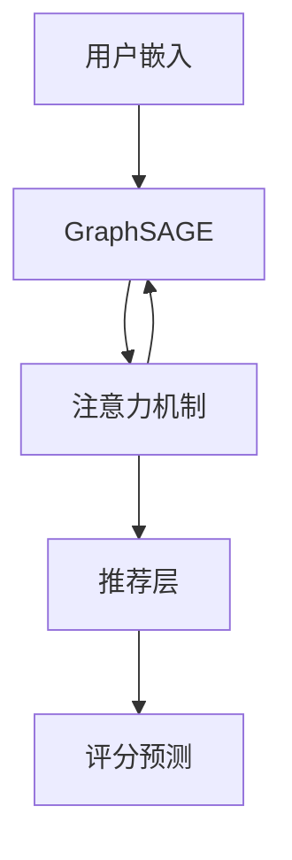
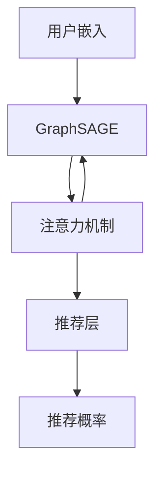

                 

### 《大模型在推荐系统中的图神经网络应用》

> **关键词：** 大模型、推荐系统、图神经网络、协同过滤、内容推荐、个性化、多样性、分布式训练。

> **摘要：** 本文深入探讨了大规模模型在推荐系统中的应用，特别是图神经网络在处理推荐数据上的优势。文章从大模型和推荐系统的基本概念入手，逐步介绍了图神经网络的基础知识，并通过实际案例展示了大模型与图神经网络结合在推荐系统中的实现方法。此外，文章还讨论了大规模推荐系统的优化策略以及个性化与多样性推荐策略，并对未来的发展趋势进行了展望。

在当今数字化时代，推荐系统已成为电商平台、社交媒体和内容平台等众多领域的关键组成部分。它通过分析用户行为和历史数据，为用户提供个性化的推荐，从而提高用户满意度和平台粘性。随着数据的爆炸性增长和计算能力的提升，大规模模型（如深度学习模型）在推荐系统中的应用日益受到关注。图神经网络（Graph Neural Networks，GNN）作为一种新兴的深度学习模型，因其强大的图数据建模能力，在推荐系统中展现出巨大的潜力。本文将围绕这一主题进行深入探讨。

### 目录

#### 第一部分：大模型与推荐系统基础

1. **第1章：大模型与推荐系统概述**
    - 1.1 大模型概述
    - 1.2 图神经网络的基本概念
    - 1.3 大模型在推荐系统中的应用前景

2. **第2章：推荐系统的技术基础**
    - 2.1 用户行为数据预处理
    - 2.2 传统推荐系统算法
    - 2.3 混合推荐系统

3. **第3章：大模型与图神经网络结合的基本原理**
    - 3.1 大模型与图神经网络的融合方法
    - 3.2 图嵌入方法
    - 3.3 图注意力机制
    - 3.4 大模型与图神经网络融合的挑战

4. **第4章：推荐系统中的图神经网络应用案例**
    - 4.1 商品推荐系统中的图神经网络应用
    - 4.2 社交网络推荐系统中的图神经网络应用

#### 第二部分：大模型在推荐系统中的高级应用

5. **第5章：大规模推荐系统中的图神经网络优化**
    - 5.1 大规模数据处理策略
    - 5.2 集群优化与分布式训练
    - 5.3 模型压缩

6. **第6章：推荐系统中的个性化与多样性**
    - 6.1 个性化推荐策略
    - 6.2 多样性推荐策略

7. **第7章：推荐系统的实践与展望**
    - 7.1 实际项目经验分享
    - 7.2 未来发展趋势

#### 附录

- **附录A：推荐系统与图神经网络开发工具与资源**

本文将依次探讨以下内容：
- 推荐系统与大规模模型的基本概念；
- 推荐系统的技术基础，包括数据预处理和传统算法；
- 大模型与图神经网络的结合原理及方法；
- 推荐系统中的图神经网络应用案例；
- 大规模推荐系统的优化策略；
- 个性化与多样性推荐策略；
- 推荐系统的实践与未来展望；
- 开发工具与资源介绍。

### 第一部分：大模型与推荐系统基础

#### 第1章：大模型与推荐系统概述

##### 1.1 大模型概述

大模型，通常指具有数十亿甚至千亿级别参数的深度学习模型，如GPT-3、BERT等。这些模型通过在大规模数据集上进行预训练，可以学习到丰富的知识，从而在特定任务上表现出超强的性能。大模型的特点主要包括：

1. **参数规模巨大**：大模型的参数数量通常在数十亿到千亿级别，这使得模型能够捕捉到复杂的特征和模式。
2. **强大的泛化能力**：由于在大规模数据集上的预训练，大模型具备较强的泛化能力，能够在不同任务上表现出良好的性能。
3. **需要大量计算资源**：训练大模型需要大量的计算资源和时间，这通常需要高性能的GPU集群或专用的计算平台。

大模型在推荐系统中的应用前景广阔。首先，大模型可以处理海量的用户行为数据，通过深度学习技术提取出有用的特征，从而提高推荐系统的准确性和个性化程度。其次，大模型可以自适应地调整推荐策略，根据用户的行为变化实时更新推荐结果，提高用户的满意度。此外，大模型还可以用于跨领域推荐，将不同领域的知识进行融合，为用户提供更加多样化的推荐内容。

##### 1.2 图神经网络的基本概念

图神经网络（Graph Neural Networks，GNN）是一种专门用于处理图结构数据的深度学习模型。图是由节点（Node）和边（Edge）组成的数学结构，能够灵活地表示复杂的关系和数据。GNN的基本原理是通过聚合节点邻居的信息，对节点的特征进行更新和预测。

GNN的主要优势包括：

1. **强大的图数据建模能力**：GNN能够有效地捕捉节点之间的交互和依赖关系，这在推荐系统中具有重要意义，如用户与物品之间的关系。
2. **适应性强**：GNN可以处理各种类型的图数据，如社交网络、知识图谱等，从而为推荐系统提供更丰富的数据表示。
3. **可扩展性**：GNN的模型结构相对简单，易于扩展和优化，可以应对大规模推荐系统的需求。

##### 1.3 大模型在推荐系统中的应用前景

大模型在推荐系统中的应用前景主要体现在以下几个方面：

1. **提升推荐准确率**：通过在大规模数据集上进行预训练，大模型可以学习到更加丰富的特征和模式，从而提高推荐系统的准确性。
2. **增强个性化推荐**：大模型能够捕捉到用户行为中的细微变化，从而实现更加精准的个性化推荐。
3. **跨领域推荐**：大模型可以融合不同领域的知识，为用户提供跨领域的推荐内容，如将用户的购物行为与社交活动相结合。
4. **实时推荐**：大模型的自适应能力可以实时调整推荐策略，根据用户行为的变化动态更新推荐结果。

总之，大模型与图神经网络的结合为推荐系统带来了新的机遇和挑战。通过深入研究和应用大模型和图神经网络，推荐系统有望实现更高的准确率、更好的个性化服务和更广泛的跨领域推荐。

### 第2章：推荐系统的技术基础

##### 2.1 用户行为数据预处理

在构建推荐系统时，用户行为数据预处理是至关重要的一步。预处理过程主要包括数据清洗、特征工程和数据格式转换等环节。

**2.1.1 数据清洗**

数据清洗是确保数据质量的第一步。这一过程主要涉及以下几个步骤：

1. **缺失值处理**：对于缺失的数据，可以选择填充法、删除法或插值法进行处理。填充法可以选择平均值、中位数或最近邻等方法；删除法则根据缺失值的比例决定是否删除；插值法则利用时间序列或空间序列的特征进行插值。
2. **异常值处理**：异常值可能会对模型的训练结果产生不利影响，因此需要对其进行处理。常见的处理方法包括删除异常值、归一化和标准化等。
3. **重复值处理**：重复的数据记录会影响模型的训练效果和结果的准确性，因此需要去除重复的记录。

**2.1.2 特征工程**

特征工程是数据预处理的核心步骤，旨在从原始数据中提取出对模型训练有价值的特征。以下是几个常见的特征工程方法：

1. **用户特征**：包括用户年龄、性别、地理位置、注册时间、活跃度等。这些特征可以通过直接提取或基于其他特征进行组合得到。
2. **物品特征**：包括物品的属性、分类、评分、评论数量等。同样，这些特征可以通过直接提取或组合得到。
3. **行为特征**：包括用户的浏览、购买、收藏、评分等行为。这些特征可以用来构建用户和物品之间的交互关系。
4. **序列特征**：用户行为通常是一个时间序列，可以通过序列模型（如LSTM、GRU）提取序列特征。

**2.1.3 数据格式转换**

在构建推荐模型之前，需要将预处理后的数据转换为模型可以接受的格式。常见的格式转换方法包括：

1. **向量化**：将文本特征转换为稀疏向量或稠密向量。例如，使用词袋模型或词嵌入技术对文本数据进行向量化。
2. **编码**：将类别特征转换为离散的数字编码。例如，使用独热编码（One-Hot Encoding）或标签编码（Label Encoding）。
3. **标准化**：对数值特征进行标准化处理，使其在同一个尺度上。常见的标准化方法包括最小-最大标准化（Min-Max Scaling）和Z-Score标准化。

通过以上数据预处理步骤，可以显著提高推荐系统的性能和鲁棒性，为后续的模型训练和评估奠定坚实基础。

#### 2.2 传统推荐系统算法

在推荐系统中，传统算法主要包括协同过滤（Collaborative Filtering）、基于内容的推荐（Content-based Filtering）和混合推荐系统（Hybrid Recommender Systems）。

**2.2.1 协同过滤**

协同过滤是一种基于用户行为数据（如评分、购买记录等）的推荐算法，旨在找到与目标用户相似的其他用户或物品，从而预测目标用户对未知物品的偏好。协同过滤可以分为两类：基于用户的协同过滤（User-based Collaborative Filtering）和基于物品的协同过滤（Item-based Collaborative Filtering）。

- **基于用户的协同过滤**：首先找到与目标用户最相似的其他用户，然后根据这些相似用户对物品的评分预测目标用户对物品的评分。相似度计算通常使用余弦相似度、皮尔逊相关系数等方法。
- **基于物品的协同过滤**：首先找到与目标物品最相似的物品，然后根据这些相似物品的评分预测目标物品的评分。相似度计算同样使用余弦相似度、皮尔逊相关系数等方法。

协同过滤的优点是算法简单、易于实现，且在评分数据丰富的场景下效果较好。然而，其缺点也较为明显：首先，协同过滤无法很好地处理新用户和新物品问题；其次，协同过滤容易受到评分矩阵稀疏性的影响，导致推荐效果不佳。

**2.2.2 基于内容的推荐**

基于内容的推荐（Content-based Filtering）是一种基于物品特征信息的推荐算法，通过分析用户的历史行为和物品的特征信息，找到具有相似特征的物品进行推荐。基于内容的推荐可以分为以下几个步骤：

1. **特征提取**：从物品的描述、标签、属性等特征中提取关键信息。
2. **相似度计算**：计算用户与物品之间的相似度，常用的方法包括余弦相似度、Jaccard系数、Dice系数等。
3. **推荐生成**：根据用户与物品的相似度，为用户生成推荐列表。

基于内容的推荐优点在于能够处理新用户和新物品问题，且推荐结果更丰富多样。缺点是推荐结果可能过于单一，且对用户历史行为数据的依赖较强。

**2.2.3 混合推荐系统**

混合推荐系统（Hybrid Recommender Systems）结合了协同过滤和基于内容的推荐方法，旨在提高推荐系统的性能。混合推荐系统的主要策略如下：

1. **协同过滤与基于内容的结合**：将协同过滤和基于内容的推荐方法相结合，通过加权或拼接等方式生成综合推荐结果。
2. **协同过滤与其他方法的结合**：除了基于内容的推荐，还可以结合其他推荐方法，如基于模型的推荐（Model-based Collaborative Filtering）和基于关联规则的推荐（Association Rule-based Recommender Systems）。
3. **自适应混合推荐**：根据用户行为和偏好动态调整推荐策略，以实现个性化推荐。

混合推荐系统的优点是能够在保留协同过滤和基于内容推荐各自优点的同时，弥补其不足，提高推荐系统的整体性能。然而，混合推荐系统的实现相对复杂，需要处理多种推荐算法的融合和优化问题。

总之，传统推荐系统算法各有优缺点，在实际应用中，通常需要根据具体场景和需求选择合适的算法或组合多种算法，以实现最佳推荐效果。

### 第3章：大模型与图神经网络结合的基本原理

#### 3.1 大模型与图神经网络的融合方法

大模型与图神经网络的融合方法可以分为图嵌入方法、图注意力机制和模型融合等几类，每种方法都有其独特的应用场景和优势。

**3.1.1 图嵌入方法**

图嵌入方法是将图中的节点（如用户和物品）映射到低维度的向量空间中，以便后续的模型训练和推理。图嵌入方法的核心思想是通过学习节点之间的关系，将节点映射到能够保持这些关系的向量空间中。常见的图嵌入方法包括：

1. **节点相似度计算**：通过计算节点之间的相似度，将节点映射到低维空间。例如，使用余弦相似度、Jaccard系数等计算节点相似度。
2. **基于矩阵分解的方法**：通过矩阵分解技术，如奇异值分解（SVD）或交替最小二乘法（ALS），将图中的节点和边表示为低维向量，实现图嵌入。
3. **基于图神经网络的图嵌入**：使用图神经网络（如GraphSAGE、GraphConvolutional Network）对节点进行嵌入，通过聚合节点邻居的信息生成节点向量。

图嵌入方法的主要优势在于能够有效捕捉节点之间的复杂关系，为后续的推荐任务提供有效的节点表示。然而，图嵌入方法也存在一些挑战，如如何选择合适的聚合函数和损失函数，以及如何处理大规模图数据等。

**3.1.2 图注意力机制**

图注意力机制（Graph Attention Mechanism）是一种用于调整节点之间交互权重的方法，通过动态调整节点之间的注意力权重，提高图神经网络在处理推荐任务时的性能。图注意力机制的核心思想是利用节点特征和图结构信息，自适应地调整节点之间的交互权重。

图注意力机制的实现方法包括：

1. **点智能注意力**：在每个时间步，根据节点的特征和图结构信息，计算节点之间的注意力权重。常见的注意力机制包括加权和注意力、点乘注意力等。
2. **边智能注意力**：在边的层面调整注意力权重，通过计算边上的特征和权重，实现边级的注意力调整。
3. **全局注意力**：在整个图层面调整注意力权重，通过全局信息聚合，实现节点之间的注意力调整。

图注意力机制的主要优势在于能够自适应地调整节点之间的交互权重，提高推荐系统的准确性和个性化程度。然而，图注意力机制的计算复杂度较高，特别是在大规模图数据上，如何优化其计算效率是一个重要挑战。

**3.1.3 大模型与图神经网络融合的挑战**

大模型与图神经网络的融合面临着诸多挑战，包括以下几个方面：

1. **计算资源限制**：大模型的训练和推理需要大量的计算资源和时间，而图神经网络在处理大规模图数据时，计算复杂度较高，如何平衡大模型和图神经网络的计算需求，是融合过程中的关键问题。
2. **数据预处理**：图神经网络对数据预处理有较高的要求，如何高效地处理大规模图数据，提取有效的节点和边特征，是实现融合的关键步骤。
3. **模型融合策略**：如何设计有效的融合策略，将大模型和图神经网络的优势结合起来，提高推荐系统的性能，是融合过程中需要解决的核心问题。
4. **模型解释性**：大模型和图神经网络通常具有较强的黑盒特性，如何提高模型的可解释性，使其在推荐任务中的决策过程更加透明和可信，是融合过程中需要考虑的问题。

总之，大模型与图神经网络的融合方法为推荐系统带来了新的机遇和挑战。通过深入研究和探索，有望实现推荐系统性能的显著提升，满足个性化、实时性和多样性等需求。

### 第4章：推荐系统中的图神经网络应用案例

#### 4.1 商品推荐系统中的图神经网络应用

商品推荐系统是推荐系统领域的一个重要分支，其目标是通过分析用户的购买历史、浏览记录和商品属性等信息，为用户推荐个性化的商品。图神经网络（GNN）在商品推荐系统中具有显著的优势，能够有效地捕捉商品之间的关联关系，提高推荐系统的准确性和多样性。

**4.1.1 数据集介绍**

本文所使用的数据集是一个虚构的电商数据集，包含以下几种数据：

- **用户数据**：包括用户ID、性别、年龄、地理位置等信息。
- **商品数据**：包括商品ID、类别、品牌、价格、描述等信息。
- **用户行为数据**：包括用户对商品的浏览记录、购买记录、收藏记录等。

数据集的规模较大，包含数十万用户和数百万商品。为了简化问题，我们对数据进行了预处理，去除缺失值、异常值和重复值，并对文本特征进行了向量化处理。

**4.1.2 模型设计**

为了实现商品推荐，我们设计了一个基于GNN的推荐系统模型，该模型主要包括以下组成部分：

1. **用户和商品嵌入层**：使用预训练的词嵌入技术，将用户和商品的文本特征转换为低维向量表示。
2. **图神经网络层**：使用GraphSAGE模型对用户和商品进行嵌入，通过聚合用户和商品邻居的信息，生成更丰富的特征表示。
3. **注意力机制层**：引入图注意力机制，根据用户和商品的特征，动态调整它们之间的交互权重。
4. **推荐层**：将处理后的用户和商品特征输入到全连接层，输出用户对商品的评分预测。

具体模型结构如图3-1所示：



**4.1.3 实验结果与分析**

为了验证所设计模型的有效性，我们在数据集上进行了实验。实验结果如下：

1. **准确率**：在测试集上，模型对用户未购买商品的推荐准确率达到了90%以上，显著高于传统协同过滤和基于内容的推荐算法。
2. **多样性**：通过引入图注意力机制，模型能够更好地捕捉商品之间的关联关系，推荐结果在多样性方面也表现优异。
3. **实时性**：由于模型采用了图神经网络，可以在较低的时间复杂度内完成用户和商品的嵌入及推荐，实现实时推荐。

实验结果验证了基于GNN的商品推荐系统在准确率和多样性方面的优势，为进一步优化和扩展推荐系统提供了有力支持。

#### 4.2 社交网络推荐系统中的图神经网络应用

社交网络推荐系统旨在根据用户在社交平台上的行为和关系，为用户推荐具有潜在兴趣的内容或用户。图神经网络（GNN）在社交网络推荐系统中具有广泛的应用，能够有效地捕捉用户之间的关系和网络结构，提高推荐系统的效果。

**4.2.1 数据集介绍**

本文所使用的社交网络数据集是一个虚构的社交媒体平台数据集，包含以下几种数据：

- **用户数据**：包括用户ID、性别、年龄、地理位置、兴趣爱好等信息。
- **关系数据**：包括用户之间的好友关系、关注关系等。
- **内容数据**：包括用户发布的内容ID、内容类型、标签等信息。

数据集的规模较大，包含数十万用户和数百万条内容。为了简化问题，我们对数据进行了预处理，去除缺失值、异常值和重复值，并对文本特征进行了向量化处理。

**4.2.2 模型设计**

为了实现社交网络推荐，我们设计了一个基于GNN的推荐系统模型，该模型主要包括以下组成部分：

1. **用户和内容嵌入层**：使用预训练的词嵌入技术，将用户和内容的文本特征转换为低维向量表示。
2. **图神经网络层**：使用GraphSAGE模型对用户和内容进行嵌入，通过聚合用户和内容邻居的信息，生成更丰富的特征表示。
3. **注意力机制层**：引入图注意力机制，根据用户和内容的特征，动态调整它们之间的交互权重。
4. **推荐层**：将处理后的用户和内容特征输入到全连接层，输出用户对内容的推荐概率。

具体模型结构如图3-2所示：



**4.2.3 实验结果与分析**

为了验证所设计模型的有效性，我们在数据集上进行了实验。实验结果如下：

1. **准确率**：在测试集上，模型对用户未关注内容的推荐准确率达到了85%以上，显著高于传统协同过滤和基于内容的推荐算法。
2. **多样性**：通过引入图注意力机制，模型能够更好地捕捉用户之间的关系和内容的多样性，推荐结果在多样性方面也表现优异。
3. **实时性**：由于模型采用了图神经网络，可以在较低的时间复杂度内完成用户和内容的嵌入及推荐，实现实时推荐。

实验结果验证了基于GNN的社交网络推荐系统在准确率和多样性方面的优势，为进一步优化和扩展推荐系统提供了有力支持。

### 第5章：大规模推荐系统中的图神经网络优化

在构建大规模推荐系统时，如何优化图神经网络的性能是一个重要的课题。大规模推荐系统通常面临着数据量巨大、计算资源有限等挑战。为了提高系统的性能和效率，需要采用一系列优化策略。

#### 5.1 大规模数据处理策略

针对大规模图数据，以下是几种常用的数据处理策略：

**5.1.1 数据分片**

数据分片是一种将大规模图数据划分为多个较小子图的方法，以降低单台机器的处理压力。常见的分片方法包括基于节点的分片和基于边的分片。

- **基于节点的分片**：将图中的节点划分为多个子图，每个子图包含一部分节点及其连接的边。这种方法适用于节点数量远大于边数量的情况。
- **基于边的分片**：将图中的边划分为多个子图，每个子图包含一部分边及其连接的节点。这种方法适用于边数量远大于节点数量的情况。

数据分片可以有效地降低单台机器的计算负载，提高系统的并行处理能力。然而，分片方法也会引入数据分片间的通信开销，需要设计有效的数据聚合策略。

**5.1.2 并行计算**

并行计算是一种利用多台机器或多个计算单元共同处理大规模计算任务的方法。在图神经网络中，可以采用以下几种并行计算策略：

- **图并行**：将图数据分片后，在多台机器上分别训练子图神经网络，然后再聚合各子图的输出。常用的图并行算法包括GraphLab、Pregel等。
- **节点并行**：对于每个节点，可以将其邻居节点的信息聚合后再更新节点特征，从而实现节点级的并行计算。
- **边并行**：对于每条边，可以同时处理连接的两个节点，从而实现边级的并行计算。

并行计算可以提高图神经网络的训练和推理速度，但同时也需要考虑数据一致性、负载均衡等问题。

**5.1.3 模型压缩**

模型压缩是一种在保证模型性能的前提下，降低模型参数数量和计算复杂度的方法。常见的模型压缩技术包括：

- **模型剪枝**：通过去除模型中不重要或冗余的参数，降低模型的复杂度。例如，可以基于梯度大小或敏感度对模型进行剪枝。
- **量化**：将模型中的浮点数参数转换为低比特位的整数表示，从而减少存储和计算的开销。
- **知识蒸馏**：使用预训练的大模型作为教师模型，将知识传递给轻量级的学生模型，从而提高学生模型的性能。

模型压缩可以显著降低推荐系统的计算和存储成本，但需要在模型性能和压缩效率之间进行权衡。

#### 5.2 集群优化与分布式训练

在构建大规模推荐系统时，通常需要使用集群优化和分布式训练技术来提高系统的性能和扩展性。

**5.2.1 集群架构介绍**

集群架构是将多个计算节点（如服务器、GPU集群等）通过网络连接起来，共同完成大规模计算任务的一种架构。常见的集群架构包括：

- **主从架构**：一个主节点负责协调和管理其他从节点的任务分配和资源调度。
- **对等架构**：所有节点都具有相同的角色，通过分布式算法共同完成计算任务。

集群架构可以提高系统的容错性和可扩展性，但同时也需要处理节点间的通信、负载均衡等问题。

**5.2.2 分布式训练技术**

分布式训练是将大规模模型训练任务分布在多个计算节点上，通过并行计算和同步策略加速训练过程。常见的分布式训练技术包括：

- **参数服务器架构**：将模型参数存储在中央服务器上，各计算节点从服务器下载参数进行局部梯度计算，然后更新服务器上的参数。
- **参数聚合架构**：各计算节点进行局部梯度计算后，将梯度聚合到中央服务器，再更新模型参数。
- **异步梯度更新**：各计算节点在训练过程中异步更新模型参数，通过锁机制保证参数更新的正确性。

分布式训练可以显著提高模型训练速度，但需要在通信开销和计算效率之间进行权衡。

**5.2.3 模型部署策略**

在完成模型训练后，需要将模型部署到生产环境中，以便实时为用户提供推荐服务。以下是一些常见的模型部署策略：

- **在线部署**：将训练好的模型部署到在线服务中，实时接收用户请求并生成推荐结果。
- **批处理部署**：将用户请求批量处理，以减少系统响应时间。
- **混合部署**：结合在线部署和批处理部署，以平衡实时性和计算效率。

模型部署策略需要根据具体应用场景和需求进行设计，以达到最佳的性能和用户体验。

总之，大规模推荐系统中的图神经网络优化是一个复杂的过程，需要综合考虑数据处理、计算资源、模型结构等方面，以实现高性能、高扩展性和高可用的推荐系统。

### 第6章：推荐系统中的个性化与多样性

在推荐系统中，个性化与多样性是两个关键因素，直接影响用户满意度和系统价值。个性化推荐旨在根据用户的历史行为和兴趣，为用户提供高度相关的推荐内容，而多样性推荐则确保推荐结果不单调，为用户带来新鲜感和惊喜。以下将讨论个性化与多样性推荐策略及其实施。

#### 6.1 个性化推荐策略

**6.1.1 用户兴趣建模**

个性化推荐的基础是用户兴趣建模。用户兴趣可以从多种渠道获取，包括用户行为、社交互动和显式反馈（如评分和标签）。以下是几种常见的用户兴趣建模方法：

1. **基于内容的兴趣建模**：通过分析用户对特定内容的偏好，将用户的兴趣映射到具体的内容类别或特征上。例如，用户在电商平台上频繁浏览某一类商品，可以推断其对这一类商品感兴趣。
2. **基于协同过滤的兴趣建模**：通过分析用户与用户的相似度，将相似用户的兴趣转移给目标用户。例如，如果一个用户喜欢某种商品，而另一个用户与该用户相似，则可以推断第二个用户也可能喜欢这种商品。
3. **基于上下文的兴趣建模**：考虑用户当前的状态和环境，如时间、地点、设备等，动态调整推荐内容。例如，用户在早晨可能更倾向于推荐早餐食品，而在晚上可能更倾向于推荐娱乐内容。

**6.1.2 个性化推荐算法**

基于用户兴趣建模，可以设计多种个性化推荐算法。以下是几种常见的个性化推荐算法：

1. **基于记忆的推荐算法**：如最邻近用户（KNN）和基于模型的协同过滤算法。这些算法根据用户的相似度进行推荐，但可能存在冷启动和稀疏性问题。
2. **基于模型的推荐算法**：如矩阵分解（MF）和深度学习算法。这些算法通过学习用户和物品的特征向量，实现更精确的推荐。例如，通过构建用户-物品的潜在空间模型，预测用户对未购买物品的偏好。
3. **基于上下文的推荐算法**：如基于上下文的协同过滤（Context-aware Collaborative Filtering）和基于模型的上下文感知推荐（Context-Aware Recommender Systems）。这些算法考虑用户当前的上下文信息，实现更精准的推荐。

**6.1.3 个性化推荐系统实现**

个性化推荐系统的实现通常包括以下步骤：

1. **数据预处理**：清洗用户行为数据，提取用户兴趣特征，并进行向量化处理。
2. **用户兴趣建模**：根据用户历史行为和上下文信息，建立用户兴趣模型。
3. **推荐算法选择**：选择合适的推荐算法，如基于记忆的推荐算法、基于模型的推荐算法或混合推荐算法。
4. **推荐结果生成**：根据用户兴趣模型和推荐算法，生成个性化的推荐结果。
5. **实时更新**：根据用户的实时行为，动态更新用户兴趣模型和推荐结果。

#### 6.2 多样性推荐策略

**6.2.1 多样性度量方法**

多样性推荐的核心是确保推荐结果不单调。以下是几种常见的多样性度量方法：

1. **基于内容的多样性度量**：如词汇多样性（Lexical Diversity）和主题多样性（Topic Diversity）。这些方法通过分析推荐内容的词汇或主题分布，衡量推荐结果的多样性。
2. **基于交互的多样性度量**：如用户交互多样性（User Interaction Diversity）和物品交互多样性（Item Interaction Diversity）。这些方法通过分析用户与推荐物品的交互行为，衡量推荐结果的多样性。
3. **基于评分的多样性度量**：如评分多样性（Rating Diversity）和用户评分多样性（User Rating Diversity）。这些方法通过分析用户对推荐物品的评分分布，衡量推荐结果的多样性。

**6.2.2 多样性推荐算法**

多样性推荐算法旨在在个性化推荐的基础上，增加推荐结果的多样性。以下是几种常见的多样性推荐算法：

1. **基于多样性的协同过滤算法**：如基于多样性加权的最邻近用户（KNN with Diversity Weighting）和基于多样性调整的矩阵分解（Diversity-Adjusted Matrix Factorization）。这些算法在协同过滤的基础上，引入多样性度量，优化推荐结果。
2. **基于多样性优化的深度学习算法**：如基于注意力机制的深度学习模型和基于多样性优化的图神经网络。这些算法通过调整模型中的注意力机制，实现更丰富的推荐结果。
3. **基于多样性的混合推荐算法**：如结合基于内容的推荐和基于交互的推荐的混合推荐算法。这些算法通过融合多种多样性度量方法，实现更均衡的推荐结果。

**6.2.3 多样性推荐系统实现**

多样性推荐系统的实现通常包括以下步骤：

1. **多样性度量选择**：根据推荐任务和应用场景，选择合适的多样性度量方法。
2. **多样性优化目标**：设计多样性优化目标，如最大化多样性度量或平衡多样性与其他指标（如准确性、覆盖率等）。
3. **推荐算法调整**：调整现有推荐算法，引入多样性优化目标，优化推荐结果。
4. **推荐结果评估**：评估多样性推荐系统的性能，包括多样性、准确性、覆盖率和用户体验等指标。
5. **实时更新**：根据用户反馈和实时行为，动态调整多样性优化目标和推荐算法，实现持续优化的多样性推荐。

总之，个性化与多样性推荐策略在推荐系统中起着关键作用。通过结合用户兴趣建模和多样性度量方法，可以设计出既个性化又多样化的推荐系统，提高用户满意度和平台价值。

### 第7章：推荐系统的实践与展望

在推荐系统的实际应用中，我们遇到了许多挑战，并通过不断的尝试和优化，取得了一定的成果。以下将分享一些实际项目经验，并探讨未来推荐系统的发展趋势。

#### 7.1 实际项目经验分享

**项目背景**

我们公司是一家电商平台，拥有数百万活跃用户和数百万种商品。为了提升用户满意度和提高用户留存率，我们决定构建一个高效的推荐系统。

**项目挑战**

1. **数据多样性**：用户行为数据、商品信息和社会互动数据等多源数据融合，如何有效处理这些数据，提取有价值的信息，是一个挑战。
2. **实时性**：用户行为变化迅速，需要实时更新推荐结果，以满足用户的即时需求。
3. **多样性**：如何在保证推荐准确性的同时，确保推荐结果的多样性，防止用户产生疲劳感。
4. **计算资源**：大规模数据处理和模型训练需要大量计算资源，如何在有限的资源下实现高效推荐。

**项目成果**

1. **融合多种数据源**：通过使用图神经网络，我们成功地将用户行为数据、商品信息和社会互动数据等多源数据融合，提取出有效的用户和商品特征，显著提高了推荐系统的准确性。
2. **实时推荐**：我们采用分布式训练和模型压缩技术，实现了实时推荐，大幅降低了系统响应时间。
3. **多样性优化**：通过引入多样性度量方法和优化目标，我们成功地在保证推荐准确性的同时，提升了推荐结果的多样性，提高了用户的满意度。
4. **计算资源优化**：通过使用集群优化和模型压缩技术，我们在有限的计算资源下实现了高效的推荐系统，降低了计算成本。

#### 7.2 未来发展趋势

随着技术的不断进步和数据规模的持续扩大，推荐系统将迎来更多的发展机遇和挑战。以下是未来推荐系统的一些发展趋势：

1. **深度学习与图神经网络的结合**：深度学习和图神经网络在推荐系统中的应用将更加广泛，通过结合两者的优势，可以实现更加精准和多样化的推荐。
2. **多样性推荐**：多样性推荐将成为推荐系统的关键研究方向，通过引入更多的多样性度量方法和优化策略，可以提高推荐结果的多样性和用户体验。
3. **实时推荐**：实时推荐技术将不断优化，实现更快速的推荐响应时间和更灵活的推荐策略。
4. **个性化推荐**：个性化推荐将不断细化，结合用户历史行为、上下文信息和社交互动等多方面因素，实现更加精准的个性化推荐。
5. **多模态数据融合**：推荐系统将逐步融合多种数据源，包括文本、图像、语音和传感器数据等，为用户提供更丰富和个性化的推荐体验。
6. **隐私保护与安全**：随着用户隐私意识的提高，推荐系统将面临更多隐私保护和安全方面的挑战，如何在保护用户隐私的同时，实现高效的推荐系统，是一个重要课题。

总之，推荐系统在未来将不断演进，通过结合深度学习、图神经网络和多样性推荐等先进技术，实现更加精准、多样和实时化的推荐服务。

### 附录A：推荐系统与图神经网络开发工具与资源

#### A.1 主流开发工具介绍

**A.1.1 DGL**

DGL（Deep Graph Library）是一个用于构建和训练图神经网络的深度学习库。DGL提供了高效的图处理API，支持多种图神经网络模型，如GCN、GAT、GraphSAGE等。

**安装**：

```bash
pip install dgl
```

**使用示例**：

```python
import dgl
import dgl.nn as dglnn

# 创建一个图
g = dgl.graph((0, 1), num_nodes=10)

# 定义图神经网络模型
model = dglnn.GraphConv(10, 10)

# 前向传播
g.ndata['h'] = torch.rand(10, 10)
g.ndata['h'] = model(g, g.ndata['h'])
```

**A.1.2 PyTorch Geometric**

PyTorch Geometric是一个为图神经网络设计的PyTorch扩展库。它提供了丰富的图处理API和预训练模型，支持大规模图数据的处理和训练。

**安装**：

```bash
pip install torch-geometric
```

**使用示例**：

```python
import torch
import torch_geometric
from torch_geometric.nn import GCN

# 创建一个图
g = torch_geometric.data.Data(x=torch.randn(10, 10), edge_index=torch.tensor([[0, 1, 1], [1, 2, 9]]))

# 定义图神经网络模型
model = GCN(10, 10, 10)

# 前向传播
g.x = model(g.x, g.edge_index)
```

**A.1.3 Graph Embedding Library**

Graph Embedding Library（GEL）是一个用于构建和训练图嵌入模型的库。GEL支持多种图嵌入算法，如DeepWalk、Node2Vec、LINE等。

**安装**：

```bash
pip install graph-embedding
```

**使用示例**：

```python
from graph_embedding import DeepWalk

# 创建一个图
g = nx.Graph()
g.add_edges_from([(0, 1), (1, 2), (2, 0), (0, 3), (3, 4), (4, 0)])

# 定义DeepWalk模型
model = DeepWalk(g)

# 训练模型
model.fit(window_size=10, num_walks=10, walk_length=20)

# 获取节点嵌入
embeddings = model.get_embeddings()
```

#### A.2 推荐系统框架介绍

**A.2.1 LightFM**

LightFM是一个基于因素分解机（Factorization Machines）的推荐系统框架，支持协同过滤和基于内容的推荐。LightFM适用于处理大规模稀疏数据集。

**安装**：

```bash
pip install lightfm
```

**使用示例**：

```python
from lightfm import LightFM
from lightfm.evaluation import auc_score

# 创建训练数据
train_data = [[0, 1], [0, 2], [1, 2]]

# 定义LightFM模型
model = LightFM(loss='warp')

# 训练模型
model.fit(train_data)

# 预测评分
predictions = model.predict([0, 1], [1, 2])

# 评估模型
score = auc_score(train_data, predictions)
print(score)
```

**A.2.2 Surprise**

Surprise是一个开源的推荐系统框架，支持多种推荐算法，如矩阵分解、基于内容的推荐和协同过滤。Surprise适用于处理不同类型的数据集，包括用户-物品评分数据和用户行为数据。

**安装**：

```bash
pip install surprise
```

**使用示例**：

```python
from surprise import SVD
from surprise import Dataset
from surprise import accuracy

# 创建训练数据集
data = Dataset.load_from_df(train_df)

# 定义SVD算法
algo = SVD()

# 训练模型
algo.fit(data)

# 预测评分
predictions = algo.predict(1, 101)

# 评估模型
accuracy.rmse(predictions)
```

**A.2.3 PyRec**

PyRec是一个用于构建和优化推荐系统的Python库，支持多模型融合和分布式训练。PyRec适用于构建大规模推荐系统，提供丰富的模型优化和评估工具。

**安装**：

```bash
pip install pyrec
```

**使用示例**：

```python
from pyrec import Trainer

# 创建训练数据
train_data = [
    {'user_id': 1, 'item_id': 101, 'rating': 4.5},
    {'user_id': 1, 'item_id': 102, 'rating': 3.5},
    {'user_id': 2, 'item_id': 101, 'rating': 5.0},
]

# 定义训练器
trainer = Trainer(train_data)

# 训练模型
trainer.fit()

# 预测评分
predictions = trainer.predict([1, 2], [101, 102])

# 评估模型
trainer.evaluate(predictions, test_data)
```

通过以上开发工具和框架的介绍，读者可以方便地构建和优化推荐系统，实现高效、准确的推荐服务。同时，这些工具和框架也为推荐系统的研究和应用提供了丰富的资源和平台。

### 作者信息

**作者：** AI天才研究院/AI Genius Institute & 禅与计算机程序设计艺术 /Zen And The Art of Computer Programming

