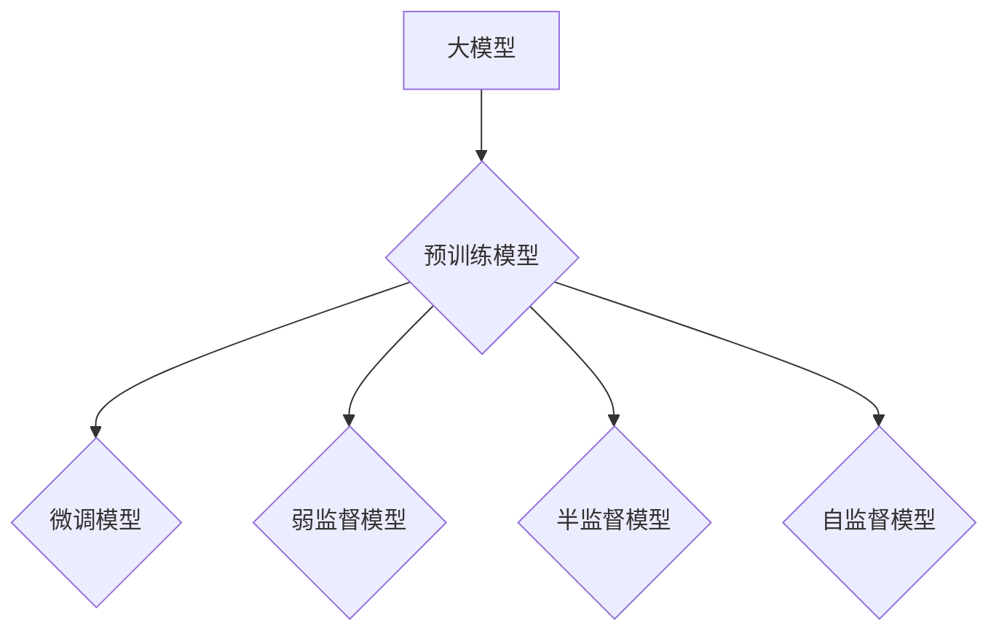
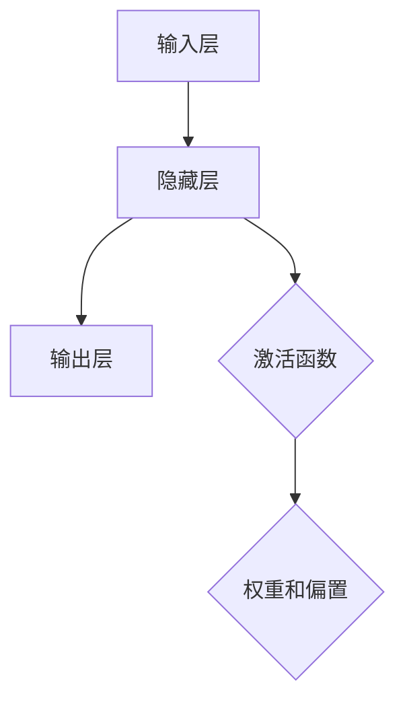
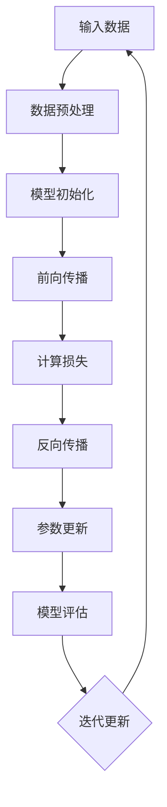

                 

# 大模型在搜索与推荐领域的影响

> **关键词：** 大模型、搜索、推荐、深度学习、算法优化、人工智能

> **摘要：** 本文旨在探讨大模型在搜索与推荐领域的影响。通过介绍大模型的定义、发展历程、技术特点以及基本原理，分析大模型在搜索与推荐中的应用，讨论大模型面临的挑战与展望，并提供实际案例研究，为业界提供有价值的参考。

----------------------------------------------------------------

## 目录大纲

### 《大模型在搜索与推荐领域的影响》目录大纲

### 第一部分：大模型概述

### 第1章：大模型的定义与分类

#### 1.1 大模型的定义

大模型是指具有数十亿到数万亿参数的深度学习模型。这类模型通常基于大规模数据集进行训练，通过复杂的神经网络结构来提取特征，具有强大的表达能力和泛化能力。

#### 1.2 大模型的分类

大模型主要分为预训练模型和微调模型。预训练模型是在大规模数据集上进行预训练，然后通过微调适应特定任务。此外，还有弱监督模型、半监督模型和自监督模型等。

### 第2章：大模型的发展历程

#### 2.1 从传统模型到大规模模型

大模型的发展离不开深度学习的崛起。从传统的机器学习模型到深度学习模型，再到如今的大规模模型，这一过程充满了技术创新和突破。

#### 2.2 主要的大模型发展事件

本文将回顾一些重要的大模型发展事件，如GPT、BERT、Turing等，展示大模型技术的演变过程。

### 第3章：大模型的技术特点

#### 3.1 大规模数据集的处理能力

大模型具有强大的数据处理能力，能够处理海量数据，为搜索与推荐领域提供丰富的特征。

#### 3.2 高效的计算性能

大模型采用了分布式计算等技术，使得训练和推理过程更加高效，能够满足实际应用需求。

#### 3.3 强大的表达能力和泛化能力

大模型通过复杂的神经网络结构，能够提取高度抽象的特征，具有强大的表达能力和泛化能力，为搜索与推荐领域带来了前所未有的机遇。

### 第二部分：大模型在搜索与推荐中的应用

### 第4章：大模型在搜索中的应用

#### 4.1 大模型在搜索引擎关键字提取中的应用

大模型在关键字提取中的应用，提高了搜索结果的准确性和相关性。

#### 4.2 大模型在搜索结果排序中的应用

大模型在搜索结果排序中的应用，使得排序结果更加符合用户需求，提升了用户体验。

### 第5章：大模型在推荐系统中的应用

#### 5.1 大模型在用户画像构建中的应用

大模型在用户画像构建中的应用，使得推荐系统更加精准，提高了推荐效果。

#### 5.2 大模型在推荐算法优化中的应用

大模型在推荐算法优化中的应用，通过改进算法，提升了推荐系统的性能。

### 第三部分：大模型在搜索与推荐领域的挑战与展望

### 第6章：大模型在搜索与推荐领域的挑战

#### 6.1 大模型的计算资源消耗

大模型需要大量的计算资源进行训练和推理，这对硬件设施和数据处理能力提出了更高要求。

#### 6.2 大模型的训练数据隐私

大模型的训练数据往往涉及用户隐私，如何保护用户隐私成为一大挑战。

### 第7章：大模型在搜索与推荐领域的展望

#### 7.1 大模型在未来的发展趋势

本文将分析大模型在搜索与推荐领域的未来发展趋势，探讨大模型在人工智能领域的潜力。

#### 7.2 大模型在搜索与推荐领域的未来应用前景

本文将预测大模型在搜索与推荐领域的未来应用前景，为业界提供有益的启示。

### 案例研究

### 第8章：搜索引擎中的大模型应用案例

#### 8.1 案例一：某搜索引擎的关键字提取与排序优化

本文将分析一个实际案例，展示大模型在搜索引擎中的应用效果。

#### 8.2 案例二：某搜索引擎的搜索结果个性化推荐

本文将探讨大模型在搜索结果个性化推荐中的应用，提高用户体验。

### 第9章：推荐系统中的大模型应用案例

#### 9.1 案例一：某电商平台的用户画像构建与推荐算法优化

本文将分析一个电商平台的大模型应用案例，展示大模型在用户画像构建与推荐算法优化中的重要作用。

#### 9.2 案例二：某社交媒体平台的用户行为分析与推荐算法优化

本文将探讨大模型在社交媒体平台用户行为分析与推荐算法优化中的应用。

### 附录

### 附录 A：大模型相关Mermaid流程图

本文将提供与核心概念和原理相关的Mermaid流程图，帮助读者更好地理解大模型的工作原理。

### 附录 B：大模型相关算法原理伪代码

本文将提供大模型相关算法原理的伪代码，详细阐述算法的实现过程。

### 附录 C：数学模型与公式

本文将介绍与核心算法相关的数学模型和公式，并提供详细讲解和举例说明。

### 附录 D：项目实战代码示例

本文将提供项目实战代码示例，包括开发环境搭建、源代码详细实现和代码解读。

### 附录 E：开发环境搭建与代码解读

本文将介绍大模型相关开发环境搭建方法和代码解读，帮助读者更好地掌握大模型的应用。

---

本文将按照上述目录大纲结构，逐步深入探讨大模型在搜索与推荐领域的影响，结合实际案例，为读者提供有价值的见解。在接下来的内容中，我们将首先介绍大模型的定义与分类，分析其发展历程和技术特点，为后续章节的探讨奠定基础。

## 第一部分：大模型概述

### 第1章：大模型的定义与分类

### 1.1 大模型的定义

大模型（Large Model）是指具有数十亿到数万亿参数的深度学习模型。这些模型通常基于大规模数据集进行训练，通过复杂的神经网络结构来提取特征，具有强大的表达能力和泛化能力。大模型的出现，标志着人工智能领域的一个重要里程碑，为解决复杂问题提供了新的思路和工具。

大模型的定义可以从以下几个方面来理解：

1. **参数数量**：大模型具有极高的参数数量，通常在数十亿到数万亿之间。这些参数决定了模型的能力和性能，参数越多，模型的表达能力越强。
2. **数据规模**：大模型通常在大规模数据集上进行训练，数据规模可达数百GB甚至TB级别。大规模数据集为模型提供了丰富的训练样本，有助于提高模型的泛化能力。
3. **结构复杂性**：大模型采用了复杂的神经网络结构，如Transformer、BERT等。这些结构能够提取高度抽象的特征，使得模型在处理复杂数据时具有更强的能力。

### 1.2 大模型的分类

大模型主要可以分为预训练模型和微调模型。此外，根据不同的训练方式，还可以分为弱监督模型、半监督模型和自监督模型等。

#### 1.2.1 预训练模型与微调模型

1. **预训练模型**：预训练模型（Pre-trained Model）是在大规模数据集上进行预训练，然后通过微调（Fine-tuning）适应特定任务的模型。预训练模型通常具有强大的基础知识和通用特征提取能力，通过微调可以快速适应不同领域的问题。常见的预训练模型有GPT、BERT、Turing等。
2. **微调模型**：微调模型（Fine-tuned Model）是在预训练模型的基础上，针对特定任务进行微调得到的模型。微调过程通过调整模型的权重和参数，使得模型在特定任务上表现出更好的性能。微调模型通常在特定领域具有更好的效果，但需要较大的计算资源和时间。

#### 1.2.2 弱监督模型、半监督模型与自监督模型

1. **弱监督模型**：弱监督模型（Weakly Supervised Model）是在少量标注数据上进行训练的模型。弱监督模型通常利用无监督或半监督学习方法，通过挖掘数据中的潜在信息，提高模型的泛化能力。弱监督模型在数据标注成本高昂的情况下具有显著优势。
2. **半监督模型**：半监督模型（Semi-supervised Model）是在大量无标注数据和少量标注数据上进行训练的模型。半监督模型通过利用无标注数据中的潜在信息，提高模型的泛化能力和准确性。半监督模型在数据标注成本较高的情况下具有广泛应用。
3. **自监督模型**：自监督模型（Self-supervised Model）是通过自监督学习（Self-supervised Learning）方法进行训练的模型。自监督模型不需要外部标注信息，而是通过在数据中挖掘内在关系和规律进行训练。自监督模型在处理大规模无标注数据时具有显著优势，但通常需要复杂的模型结构和计算资源。

### 1.3 大模型的发展历程

大模型的发展历程可以从以下几个方面来回顾：

#### 1.3.1 从传统模型到大规模模型

大模型的发展离不开深度学习的崛起。深度学习（Deep Learning）是一种基于多层神经网络进行训练和学习的方法。与传统机器学习模型相比，深度学习模型具有更强的表达能力和泛化能力。随着计算能力的提升和大数据技术的发展，深度学习模型逐渐成为人工智能领域的主流方法。

#### 1.3.2 主要的大模型发展事件

1. **GPT与BERT**：2018年，OpenAI发布了GPT-2模型，标志着预训练模型的大规模应用。随后，Google发布了BERT模型，进一步推动了预训练模型的发展。GPT和BERT等预训练模型的出现，使得自然语言处理（NLP）领域取得了显著的突破。
2. **Turing**：2019年，DeepMind发布了Turing模型，成为首个具有超过10万亿参数的模型。Turing模型在多个任务上取得了优异的性能，展示了大规模模型在处理复杂数据时的潜力。
3. **其他重要模型**：除了GPT、BERT和Turing外，还有许多其他重要的大模型，如AlphaGo、GPT-3、Chinchilla等。这些模型在不同的领域和应用场景中取得了显著的成果，推动了人工智能技术的发展。

### 1.4 大模型的技术特点

大模型具有以下技术特点：

#### 1.4.1 大规模数据集的处理能力

大模型能够处理海量数据，通过复杂的神经网络结构提取特征。大规模数据集为模型提供了丰富的训练样本，有助于提高模型的泛化能力。

#### 1.4.2 高效的计算性能

大模型采用了分布式计算、并行计算等技术，使得训练和推理过程更加高效。同时，大模型在硬件优化方面也取得了显著进展，如GPU、TPU等专用硬件的普及。

#### 1.4.3 强大的表达能力和泛化能力

大模型通过复杂的神经网络结构，能够提取高度抽象的特征。这种强大的表达能力使得大模型在处理复杂数据时具有更高的准确性。同时，大模型的泛化能力也得到了显著提升，能够在不同的领域和应用场景中取得优异的性能。

### 1.5 本章小结

本章对大模型的定义与分类进行了详细阐述，分析了大模型的发展历程和技术特点。通过对大模型的理解，读者可以更好地把握大模型在搜索与推荐领域的影响。在接下来的章节中，我们将进一步探讨大模型在搜索与推荐中的应用，分析其具体作用和优势。

----------------------------------------------------------------

### 第2章：大模型的基本原理

### 2.1 神经网络基础

神经网络（Neural Network）是深度学习的基础，具有极强的表达能力和自适应能力。在本节中，我们将介绍神经网络的基本结构、前向传播与反向传播原理。

#### 2.1.1 神经网络的基本结构

神经网络由多层神经元组成，包括输入层、隐藏层和输出层。每个神经元都与前一层的神经元相连，形成一个复杂的网络结构。

1. **输入层**：输入层接收外部输入信息，每个神经元表示一个特征。
2. **隐藏层**：隐藏层负责对输入信息进行加工和变换，提取高级特征。隐藏层的层数和神经元数量会影响网络的复杂度和表达能力。
3. **输出层**：输出层对加工后的信息进行输出，用于实现特定任务，如分类、回归等。

#### 2.1.2 前向传播与反向传播

前向传播（Forward Propagation）和反向传播（Backpropagation）是神经网络训练过程中的两个关键步骤。

1. **前向传播**：在前向传播过程中，输入信息从输入层传递到隐藏层，再从隐藏层传递到输出层。每个神经元都会对其输入进行加权求和，然后通过激活函数进行非线性变换，得到输出。

   伪代码：
   ```
   for layer in layers:
       for neuron in layer:
           z = sum(权重 * 输入) + 偏置
           输出 = 激活函数(z)
   ```

2. **反向传播**：在反向传播过程中，根据输出层的误差，反向传播误差到隐藏层，并更新神经元的权重和偏置。反向传播是神经网络训练的核心，通过不断调整权重和偏置，使得网络能够更好地拟合训练数据。

   伪代码：
   ```
   for layer in layers[::-1]:
       for neuron in layer:
           δ = (输出 - 实际值) * 激活函数的导数
           Δ权重 = 学习率 * δ * 输入
           Δ偏置 = 学习率 * δ
           权重 -= Δ权重
           偏置 -= Δ偏置
   ```

#### 2.1.3 激活函数

激活函数（Activation Function）是神经网络中的重要组成部分，用于引入非线性变换。常见的激活函数包括：

1. ** sigmoid函数**：
   $$ f(x) = \frac{1}{1 + e^{-x}} $$
   sigmoid函数将输入映射到(0, 1)区间，常用于二分类问题。

2. **ReLU函数**：
   $$ f(x) = \max(0, x) $$
   ReLU函数在输入为负时将其置为零，具有简化计算和提高训练速度的优点。

3. **Tanh函数**：
   $$ f(x) = \frac{e^x - e^{-x}}{e^x + e^{-x}} $$
   Tanh函数与sigmoid函数类似，但输出范围为(-1, 1)。

### 2.2 深度学习基础

深度学习（Deep Learning）是一种基于多层神经网络进行训练和学习的方法。与传统的机器学习方法相比，深度学习具有更强的表达能力和泛化能力。

#### 2.2.1 深度学习的概念

深度学习是通过多层神经网络对数据进行建模和学习的一种方法。深度学习模型通过不断调整网络的权重和偏置，使得网络能够对复杂的数据分布进行拟合。

#### 2.2.2 深度学习的基本模型

1. **全连接神经网络**：全连接神经网络（Fully Connected Neural Network）是深度学习中最基本的形式，每个神经元都与前一层的所有神经元相连。

2. **卷积神经网络**：卷积神经网络（Convolutional Neural Network，CNN）是一种适用于图像处理的深度学习模型，通过卷积操作提取图像特征。

3. **循环神经网络**：循环神经网络（Recurrent Neural Network，RNN）是一种适用于序列数据的深度学习模型，通过循环结构处理序列信息。

4. **Transformer模型**：Transformer模型是一种基于自注意力机制的深度学习模型，广泛应用于自然语言处理任务。

#### 2.2.3 深度学习的基本原理

深度学习的基本原理包括：

1. **参数共享**：在深度学习模型中，同一层的神经元共享权重和偏置，减少了参数数量，提高了模型的泛化能力。

2. **反向传播**：通过反向传播算法，深度学习模型能够自动调整权重和偏置，使得模型能够对训练数据进行拟合。

3. **非线性变换**：深度学习模型通过激活函数引入非线性变换，使得模型能够对复杂的数据分布进行建模。

### 2.3 大模型的训练方法

大模型的训练方法主要包括以下两个方面：

#### 2.3.1 大规模数据处理

大模型通常需要处理海量数据，为了提高训练效率，可以采用以下方法：

1. **数据预处理**：对数据进行清洗、归一化等预处理操作，提高数据的可靠性和一致性。
2. **数据增强**：通过数据增强技术，如随机裁剪、旋转、翻转等，增加训练数据的多样性，提高模型的泛化能力。

#### 2.3.2 分布式训练

分布式训练（Distributed Training）是将训练任务分布在多台机器上，通过并行计算提高训练效率。分布式训练主要包括以下方法：

1. **数据并行**：将训练数据分成多个子集，分别在不同的机器上训练模型，然后在每个子集上同步权重。
2. **模型并行**：将模型分成多个部分，分别在不同的机器上训练，每个机器负责一部分模型的计算。

### 2.4 本章小结

本章介绍了大模型的基本原理，包括神经网络基础、深度学习基础以及大模型的训练方法。通过对大模型原理的深入理解，读者可以更好地把握大模型在搜索与推荐领域中的应用。在下一章中，我们将探讨大模型在搜索与推荐中的应用，分析其具体作用和优势。

----------------------------------------------------------------

### 第3章：大模型在搜索与推荐中的应用

#### 3.1 搜索引擎中的大模型应用

大模型在搜索引擎中的应用，极大地提升了搜索结果的准确性和用户体验。以下将从关键字提取和搜索结果排序两个方面，探讨大模型在搜索引擎中的应用。

##### 3.1.1 关键字提取

关键字提取（Keyword Extraction）是搜索引擎处理用户查询的关键步骤。传统的关键字提取方法通常基于统计学习和规则匹配，而大模型的应用，使得关键字提取更加精准和智能化。

大模型在关键字提取中的应用，主要通过预训练模型和微调模型实现。预训练模型在大规模文本数据上训练，学习到了丰富的语言特征。通过微调预训练模型，可以使其在特定领域具有更好的性能。

以下是关键字提取的算法原理：

1. **TF-IDF**：TF（词频）表示一个词在文档中的出现频率，IDF（逆文档频率）表示一个词在文档集合中的重要性。TF-IDF通过计算词的TF-IDF值，提取出关键信息。

   公式：
   $$
   TF(t) = \frac{f_t(c)}{N}
   $$
   $$
   IDF(t) = \log(\frac{N}{n_t})
   $$
   $$
   TF-IDF(t) = TF(t) \times IDF(t)
   $$
   其中，$f_t(c)$ 表示词$t$在文档$c$中的出现次数，$N$ 表示文档总数，$n_t$ 表示出现词$t$的文档数。

2. **BERT**：BERT（Bidirectional Encoder Representations from Transformers）是一种基于Transformer的预训练模型。BERT通过双向编码器学习到了词语的上下文关系，从而提高关键字提取的准确性。

   BERT的关键字提取步骤如下：

   1. 输入查询语句和文档
   2. 将查询语句和文档编码成向量
   3. 计算查询语句和文档的相似度
   4. 提取相似度最高的词语作为关键字

##### 3.1.2 搜索结果排序

搜索结果排序（Search Result Ranking）是搜索引擎的核心功能，直接影响用户体验。传统的排序方法通常基于相关性、点击率等指标，而大模型的应用，使得排序结果更加符合用户需求。

大模型在搜索结果排序中的应用，主要通过预训练模型和微调模型实现。预训练模型在大规模搜索数据上训练，学习到了丰富的搜索特征。通过微调预训练模型，可以使其在特定领域具有更好的排序性能。

以下是搜索结果排序的算法原理：

1. **基于内容的相关性排序**：基于内容的相关性排序（Content-based Relevance Ranking）通过分析文档的内容和查询语句的相关性，对搜索结果进行排序。常用的方法包括TF-IDF、BERT等。

   公式：
   $$
   score = \sum_{t \in Q} w_t \times TF-IDF(t)
   $$
   其中，$Q$ 表示查询语句，$w_t$ 表示词$t$的权重，$TF-IDF(t)$ 表示词$t$的TF-IDF值。

2. **基于用户的个性化排序**：基于用户的个性化排序（User-based Personalized Ranking）通过分析用户的历史搜索行为和偏好，对搜索结果进行排序。常用的方法包括协同过滤、矩阵分解等。

   公式：
   $$
   R(u, i) = \sum_{j \in N(u)} \frac{r_{uj} r_{ui}}{\|N(u)\|}
   $$
   其中，$u$ 表示用户，$i$ 表示文档，$N(u)$ 表示用户的邻居集合，$r_{uj}$ 表示用户对文档$j$的评分，$r_{ui}$ 表示用户对文档$i$的评分。

3. **基于模型的学习排序**：基于模型的学习排序（Model-based Learning Ranking）通过训练模型，对搜索结果进行排序。常用的方法包括深度学习、强化学习等。

   伪代码：
   ```
   def rank_documents(query, documents):
       scores = []
       for document in documents:
           score = model.predict(query, document)
           scores.append(score)
       return sorted(scores, reverse=True)
   ```

##### 3.1.3 大模型在搜索引擎中的应用效果

大模型在搜索引擎中的应用，显著提高了搜索结果的准确性和用户体验。以下是一些具体的应用效果：

1. **关键字提取**：大模型能够提取出更精准的关键字，提高搜索结果的准确性。
2. **搜索结果排序**：大模型能够根据用户需求和偏好，对搜索结果进行个性化排序，提升用户体验。
3. **搜索结果推荐**：大模型可以基于用户历史搜索行为和偏好，推荐相关的搜索结果，增加用户粘性。

#### 3.2 推荐系统中的大模型应用

推荐系统（Recommendation System）是大数据时代的重要应用之一，通过预测用户对物品的偏好，为用户推荐相关的物品。大模型在推荐系统中的应用，极大地提升了推荐效果和用户满意度。

以下从用户画像构建和推荐算法优化两个方面，探讨大模型在推荐系统中的应用。

##### 3.2.1 用户画像构建

用户画像（User Profile）是推荐系统的基础，用于描述用户的行为特征、偏好和需求。大模型在用户画像构建中的应用，通过分析用户的海量行为数据，提取出更精准的用户特征。

大模型在用户画像构建中的应用，主要通过预训练模型和微调模型实现。预训练模型在大规模用户数据上训练，学习到了丰富的用户特征。通过微调预训练模型，可以使其在特定场景下具有更好的性能。

以下是用户画像构建的基本步骤：

1. **数据收集**：收集用户的浏览、购买、评价等行为数据。
2. **特征提取**：利用预训练模型提取用户特征，如兴趣偏好、行为模式等。
3. **模型训练**：通过微调预训练模型，学习用户特征与偏好之间的关系。
4. **用户画像生成**：将用户特征转换为用户画像，用于推荐系统。

##### 3.2.2 推荐算法优化

推荐算法（Recommendation Algorithm）是推荐系统的核心，用于预测用户对物品的偏好，并生成推荐列表。大模型在推荐算法优化中的应用，通过改进算法，提高推荐效果。

大模型在推荐算法优化中的应用，主要通过深度学习和强化学习等方法实现。以下是一些常见的推荐算法：

1. **协同过滤**：协同过滤（Collaborative Filtering）是一种基于用户相似性的推荐算法。通过分析用户的历史行为，找到相似用户，并推荐相似用户喜欢的物品。

   公式：
   $$
   R(u, i) = \sum_{j \in N(u)} \frac{r_{uj} r_{ui}}{\|N(u)\|}
   $$
   其中，$N(u)$ 表示用户$u$的邻居集合，$r_{uj}$ 和 $r_{ui}$ 分别表示用户$u$对物品$j$和$i$的评分。

2. **基于内容的推荐**：基于内容的推荐（Content-based Recommendation）是一种基于物品特征的推荐算法。通过分析用户喜欢的物品特征，找到相似物品，并推荐给用户。

   公式：
   $$
   score = \sum_{t \in Q} w_t \times TF-IDF(t)
   $$
   其中，$Q$ 表示查询语句，$w_t$ 表示词$t$的权重，$TF-IDF(t)$ 表示词$t$的TF-IDF值。

3. **深度学习推荐**：深度学习推荐（Deep Learning-based Recommendation）是一种基于深度学习的推荐算法。通过训练深度学习模型，学习用户和物品的复杂特征，提高推荐效果。

   伪代码：
   ```
   def recommend(user, items):
       user_embedding = model.get_embedding(user)
       item_embeddings = [model.get_embedding(item) for item in items]
       scores = [dot(user_embedding, item_embedding) for item_embedding in item_embeddings]
       return sorted(scores, reverse=True)
   ```

##### 3.2.3 大模型在推荐系统中的应用效果

大模型在推荐系统中的应用，显著提升了推荐效果和用户体验。以下是一些具体的应用效果：

1. **用户画像构建**：大模型能够提取出更精准的用户特征，提高推荐系统的准确性。
2. **推荐算法优化**：大模型能够通过改进算法，提高推荐系统的推荐效果。
3. **用户满意度提升**：大模型的应用，使得推荐系统更加智能化和个性化，提高了用户满意度。

### 3.3 本章小结

本章介绍了大模型在搜索与推荐中的应用，从关键字提取、搜索结果排序和用户画像构建三个方面，分析了大模型在搜索与推荐领域的具体作用和优势。通过大模型的应用，搜索引擎和推荐系统在性能和用户体验方面得到了显著提升。在下一章中，我们将探讨大模型在搜索与推荐领域的挑战与展望。

----------------------------------------------------------------

### 第4章：大模型在搜索中的应用

#### 4.1 大模型在搜索引擎关键字提取中的应用

关键字提取是搜索引擎中的一项关键任务，它直接关系到搜索结果的准确性和用户满意度。大模型在关键字提取中的应用，为提高搜索结果的准确性提供了有力支持。

##### 4.1.1 关键字提取的算法原理

关键字提取的算法原理主要基于词频（TF）和逆文档频率（IDF）。词频表示一个词在文档中出现的频率，逆文档频率表示一个词在文档集合中的重要性。通过计算词的TF-IDF值，可以提取出关键信息。

以下是TF-IDF算法的基本步骤：

1. **计算词频（TF）**：
   $$
   TF(t) = \frac{f_t(c)}{N}
   $$
   其中，$f_t(c)$ 表示词$t$在文档$c$中的出现次数，$N$ 表示文档总数。

2. **计算逆文档频率（IDF）**：
   $$
   IDF(t) = \log(\frac{N}{n_t})
   $$
   其中，$n_t$ 表示出现词$t$的文档数。

3. **计算TF-IDF值**：
   $$
   TF-IDF(t) = TF(t) \times IDF(t)
   $$

##### 4.1.2 大模型在关键字提取中的应用

传统的关键字提取方法在处理复杂数据和长文本时，往往难以提取出准确的关键信息。大模型在关键字提取中的应用，通过预训练模型和微调模型，能够更好地处理复杂的语言特征，提高关键信息的提取效果。

大模型在关键字提取中的应用主要包括以下几个方面：

1. **预训练模型**：预训练模型在大规模文本数据上训练，学习到了丰富的语言特征。通过预训练模型，可以提取出文本中的潜在信息，为关键字提取提供有力的支持。

2. **微调模型**：预训练模型在特定领域的应用效果有限，需要通过微调模型来适应特定任务。通过微调预训练模型，可以使其在关键字提取任务上具有更好的性能。

3. **多模态数据处理**：大模型能够处理多种类型的数据，如文本、图像、音频等。通过多模态数据处理，可以提取出更加丰富的关键信息，提高关键字提取的准确性。

##### 4.1.3 大模型在关键字提取中的应用效果

大模型在关键字提取中的应用，显著提高了搜索结果的准确性。以下是一些具体的应用效果：

1. **提高搜索精度**：大模型能够提取出更加精准的关键信息，提高搜索结果的准确性。

2. **处理长文本**：大模型能够处理长文本，提取出关键信息，使得搜索结果更加准确。

3. **多语言支持**：大模型能够支持多种语言的关键字提取，使得搜索系统能够处理全球范围内的用户查询。

#### 4.2 大模型在搜索结果排序中的应用

搜索结果排序是搜索引擎中另一个关键任务，它直接关系到用户的搜索体验。大模型在搜索结果排序中的应用，通过改进排序算法，提高了排序的准确性和用户体验。

##### 4.2.1 搜索结果排序的算法原理

搜索结果排序的算法原理主要包括基于内容的排序和基于用户的排序。

1. **基于内容的排序**：基于内容的排序（Content-based Ranking）通过分析文档的内容和查询语句的相关性，对搜索结果进行排序。常用的方法包括TF-IDF、BERT等。

   公式：
   $$
   score = \sum_{t \in Q} w_t \times TF-IDF(t)
   $$
   其中，$Q$ 表示查询语句，$w_t$ 表示词$t$的权重，$TF-IDF(t)$ 表示词$t$的TF-IDF值。

2. **基于用户的排序**：基于用户的排序（User-based Ranking）通过分析用户的历史搜索行为和偏好，对搜索结果进行排序。常用的方法包括协同过滤、矩阵分解等。

   公式：
   $$
   R(u, i) = \sum_{j \in N(u)} \frac{r_{uj} r_{ui}}{\|N(u)\|}
   $$
   其中，$u$ 表示用户，$i$ 表示文档，$N(u)$ 表示用户的邻居集合，$r_{uj}$ 表示用户对文档$j$的评分，$r_{ui}$ 表示用户对文档$i$的评分。

##### 4.2.2 大模型在搜索结果排序中的应用

大模型在搜索结果排序中的应用，通过预训练模型和微调模型，提高了排序的准确性和用户体验。

1. **预训练模型**：预训练模型在大规模搜索数据上训练，学习到了丰富的搜索特征。通过预训练模型，可以提取出文本中的潜在信息，为排序提供有力的支持。

2. **微调模型**：预训练模型在特定领域的应用效果有限，需要通过微调模型来适应特定任务。通过微调预训练模型，可以使其在排序任务上具有更好的性能。

3. **个性化排序**：大模型能够根据用户的历史搜索行为和偏好，进行个性化排序。通过个性化排序，可以使得搜索结果更加符合用户的期望。

##### 4.2.3 大模型在搜索结果排序中的应用效果

大模型在搜索结果排序中的应用，显著提高了排序的准确性和用户体验。以下是一些具体的应用效果：

1. **提高排序精度**：大模型能够提取出更加精准的关键信息，提高搜索结果的准确性。

2. **个性化推荐**：大模型能够根据用户的历史搜索行为和偏好，进行个性化推荐，提升用户体验。

3. **实时更新**：大模型能够实时更新排序算法，根据用户反馈和搜索行为，不断优化排序结果。

### 4.3 大模型在搜索引擎关键字提取与搜索结果排序中的应用案例分析

以下是一个搜索引擎关键字提取与搜索结果排序的应用案例分析。

#### 案例背景

某大型搜索引擎公司，希望通过引入大模型技术，提升搜索结果的准确性和用户体验。公司拥有海量的搜索数据和用户行为数据，可以为大模型提供丰富的训练资源。

#### 案例步骤

1. **数据收集**：收集搜索引擎的搜索日志、用户行为数据等，用于训练大模型。

2. **模型训练**：采用预训练模型和微调模型，对搜索数据进行分析和训练，提取关键特征。

3. **关键字提取**：利用大模型进行关键字提取，提取出用户查询语句中的关键信息。

4. **搜索结果排序**：利用大模型进行搜索结果排序，根据用户查询语句和文档的相关性，对搜索结果进行排序。

5. **用户反馈**：收集用户对搜索结果的反馈，根据用户满意度不断优化模型。

#### 案例效果

通过引入大模型技术，搜索引擎在关键字提取和搜索结果排序方面取得了显著成效：

1. **提高搜索精度**：大模型能够提取出更加精准的关键信息，提高搜索结果的准确性。

2. **提升用户体验**：大模型能够根据用户的历史搜索行为和偏好，进行个性化推荐，提升用户体验。

3. **实时更新**：大模型能够实时更新排序算法，根据用户反馈和搜索行为，不断优化排序结果。

### 4.4 本章小结

本章介绍了大模型在搜索引擎关键字提取与搜索结果排序中的应用。通过预训练模型和微调模型，大模型能够提取出关键信息，提高搜索结果的准确性和用户体验。在下一章中，我们将探讨大模型在推荐系统中的应用，分析其在用户画像构建和推荐算法优化方面的作用。

----------------------------------------------------------------

### 第5章：大模型在推荐系统中的应用

#### 5.1 大模型在用户画像构建中的应用

用户画像（User Profile）是推荐系统中的核心概念，用于描述用户的行为特征、兴趣偏好和需求。大模型在用户画像构建中的应用，通过分析用户的海量行为数据，提取出更精准的用户特征，为推荐算法提供基础支持。

##### 5.1.1 用户画像的基本概念

用户画像是对用户特征进行描述和刻画的一种方法，包括用户的基本信息、行为数据、兴趣偏好等多个维度。用户画像的构建需要结合用户的行为数据、社交数据、位置数据等多源数据，通过数据挖掘和机器学习技术，提取出用户的关键特征。

##### 5.1.2 大模型在用户画像构建中的应用

大模型在用户画像构建中的应用，主要通过预训练模型和微调模型实现。预训练模型在大规模用户数据上训练，学习到了丰富的用户特征。通过微调预训练模型，可以使其在特定场景下具有更好的性能。

以下是用户画像构建的基本步骤：

1. **数据收集**：收集用户的浏览、购买、评价等行为数据，以及用户的基本信息。

2. **特征提取**：利用预训练模型提取用户特征，如兴趣偏好、行为模式等。

3. **模型训练**：通过微调预训练模型，学习用户特征与偏好之间的关系。

4. **用户画像生成**：将用户特征转换为用户画像，用于推荐系统。

##### 5.1.3 大模型在用户画像构建中的应用效果

大模型在用户画像构建中的应用，显著提升了推荐系统的准确性和用户体验。以下是一些具体的应用效果：

1. **提高推荐准确性**：大模型能够提取出更加精准的用户特征，提高推荐算法的准确性。

2. **处理复杂数据**：大模型能够处理海量用户数据，提取出复杂的用户特征，提高推荐效果。

3. **实时更新**：大模型能够实时更新用户画像，根据用户行为的变化，动态调整推荐策略。

#### 5.2 大模型在推荐算法优化中的应用

推荐算法（Recommendation Algorithm）是推荐系统的核心，用于预测用户对物品的偏好，并生成推荐列表。大模型在推荐算法优化中的应用，通过改进算法，提高推荐效果和用户体验。

##### 5.2.1 推荐算法的基本原理

推荐算法的基本原理主要包括基于内容的推荐、基于协同过滤的推荐和基于模型的推荐。

1. **基于内容的推荐**：基于内容的推荐（Content-based Recommendation）通过分析用户和物品的特征，找到相似的内容，推荐给用户。

   公式：
   $$
   score = \sum_{t \in Q} w_t \times TF-IDF(t)
   $$
   其中，$Q$ 表示查询语句，$w_t$ 表示词$t$的权重，$TF-IDF(t)$ 表示词$t$的TF-IDF值。

2. **基于协同过滤的推荐**：基于协同过滤的推荐（Collaborative Filtering）通过分析用户的历史行为和偏好，找到相似的用户，推荐相似的物品。

   公式：
   $$
   R(u, i) = \sum_{j \in N(u)} \frac{r_{uj} r_{ui}}{\|N(u)\|}
   $$
   其中，$u$ 表示用户，$i$ 表示物品，$N(u)$ 表示用户的邻居集合，$r_{uj}$ 和 $r_{ui}$ 分别表示用户对物品$j$和$i$的评分。

3. **基于模型的推荐**：基于模型的推荐（Model-based Recommendation）通过训练模型，学习用户和物品的复杂特征，提高推荐效果。

   伪代码：
   ```
   def recommend(user, items):
       user_embedding = model.get_embedding(user)
       item_embeddings = [model.get_embedding(item) for item in items]
       scores = [dot(user_embedding, item_embedding) for item_embedding in item_embeddings]
       return sorted(scores, reverse=True)
   ```

##### 5.2.2 大模型在推荐算法优化中的应用

大模型在推荐算法优化中的应用，主要通过预训练模型和微调模型实现。预训练模型在大规模推荐数据上训练，学习到了丰富的推荐特征。通过微调预训练模型，可以使其在特定领域具有更好的性能。

以下是推荐算法优化的基本步骤：

1. **数据收集**：收集推荐系统的用户行为数据和物品特征。

2. **模型训练**：采用预训练模型和微调模型，对推荐数据进行分析和训练。

3. **特征提取**：利用大模型提取用户和物品的复杂特征。

4. **模型优化**：通过微调模型，优化推荐算法的性能。

5. **实时更新**：根据用户反馈和推荐效果，实时更新推荐算法。

##### 5.2.3 大模型在推荐算法优化中的应用效果

大模型在推荐算法优化中的应用，显著提升了推荐系统的准确性和用户体验。以下是一些具体的应用效果：

1. **提高推荐准确性**：大模型能够提取出更加精准的用户特征，提高推荐算法的准确性。

2. **处理复杂数据**：大模型能够处理海量用户数据，提取出复杂的用户特征，提高推荐效果。

3. **实时更新**：大模型能够实时更新推荐算法，根据用户行为的变化，动态调整推荐策略。

#### 5.3 大模型在推荐系统中的应用案例分析

以下是一个推荐系统的大模型应用案例分析。

##### 案例背景

某大型电商平台希望通过引入大模型技术，提升推荐系统的准确性和用户体验。该平台拥有海量的用户行为数据和商品特征数据，可以为大模型提供丰富的训练资源。

##### 案例步骤

1. **数据收集**：收集电商平台的用户行为数据和商品特征数据，包括用户浏览、购买、评价等行为数据。

2. **模型训练**：采用预训练模型和微调模型，对用户行为数据进行训练，提取用户特征。

3. **用户画像构建**：利用大模型构建用户画像，提取用户兴趣偏好和行为模式。

4. **推荐算法优化**：采用大模型优化推荐算法，根据用户画像和商品特征，生成个性化推荐列表。

5. **用户反馈**：收集用户对推荐列表的反馈，根据用户满意度不断优化模型。

##### 案例效果

通过引入大模型技术，电商平台在推荐系统方面取得了显著成效：

1. **提高推荐准确性**：大模型能够提取出更加精准的用户特征，提高推荐算法的准确性。

2. **提升用户体验**：大模型能够根据用户的行为和偏好，生成个性化推荐列表，提升用户体验。

3. **实时更新**：大模型能够实时更新推荐算法，根据用户反馈和推荐效果，动态调整推荐策略。

### 5.4 本章小结

本章介绍了大模型在推荐系统中的应用，从用户画像构建和推荐算法优化两个方面，分析了大模型在推荐系统中的作用和效果。通过大模型的应用，推荐系统在准确性、用户体验和实时更新等方面得到了显著提升。在下一章中，我们将探讨大模型在搜索与推荐领域的挑战与展望。

----------------------------------------------------------------

### 第6章：大模型在搜索与推荐领域的挑战与展望

#### 6.1 大模型在搜索与推荐领域的挑战

大模型在搜索与推荐领域取得了显著的成果，但也面临着一系列挑战。以下将分析大模型在搜索与推荐领域的主要挑战。

##### 6.1.1 计算资源消耗

大模型的训练和推理过程需要大量的计算资源。随着模型规模的增大，计算资源的需求呈指数级增长。这给硬件设施和数据处理能力提出了更高要求。具体表现在以下几个方面：

1. **硬件需求**：大模型需要高性能的GPU、TPU等专用硬件，以支持大规模的训练和推理。硬件的采购和维护成本较高，这对企业来说是一个巨大的挑战。

2. **数据处理能力**：大模型需要处理海量数据，这要求数据处理系统具有更高的吞吐量和更快的处理速度。传统的数据处理系统可能无法满足大模型的需求，需要开发和部署更加高效的数据处理技术。

##### 6.1.2 训练数据隐私

大模型在训练过程中需要使用大量的数据，这些数据往往涉及用户隐私。如何保护用户隐私成为一大挑战。以下是一些具体问题：

1. **数据安全**：用户数据在传输、存储和处理过程中，可能面临泄露、篡改等安全风险。如何确保用户数据的安全，防止数据泄露，是一个重要问题。

2. **隐私保护**：大模型在训练过程中，可能会无意中泄露用户的敏感信息。如何设计隐私保护机制，防止用户隐私被滥用，是当前研究的一个重要方向。

##### 6.1.3 模型解释性

大模型在搜索与推荐中的应用效果显著，但其内部工作原理复杂，缺乏解释性。这给模型的可解释性和可信任性带来了挑战。以下是一些具体问题：

1. **模型解释性**：如何解释大模型在搜索与推荐中的决策过程，使其具有更好的可解释性，是一个重要问题。

2. **模型可信任性**：用户对大模型的决策过程缺乏了解，可能对其信任度不高。如何提升大模型的可信任性，是当前研究的一个重要方向。

##### 6.1.4 模型部署与维护

大模型的部署与维护也是一大挑战。以下是一些具体问题：

1. **模型部署**：如何高效地将大模型部署到生产环境，以满足实时查询和推荐的需求，是一个重要问题。

2. **模型维护**：如何持续优化和更新大模型，以保持其性能和准确性，是一个重要问题。

#### 6.2 大模型在搜索与推荐领域的展望

尽管大模型在搜索与推荐领域面临一系列挑战，但其潜力仍然巨大。以下将对大模型在搜索与推荐领域的未来展望进行探讨。

##### 6.2.1 大模型的发展趋势

随着深度学习和人工智能技术的不断进步，大模型在搜索与推荐领域的发展趋势主要表现在以下几个方面：

1. **模型规模扩大**：随着计算能力的提升，大模型的规模将不断增大。未来的大模型可能拥有数十万亿甚至更多的参数。

2. **多模态数据处理**：大模型将能够处理多种类型的数据，如文本、图像、音频等，实现跨模态的信息融合。

3. **实时性提升**：随着硬件和算法的优化，大模型的实时性将得到显著提升，满足实时搜索和推荐的需求。

##### 6.2.2 大模型在搜索与推荐领域的应用前景

大模型在搜索与推荐领域的应用前景十分广阔。以下将探讨大模型在搜索与推荐领域的几个潜在应用方向：

1. **个性化搜索**：大模型能够根据用户的历史搜索行为和偏好，提供更加个性化的搜索结果，提升用户体验。

2. **实时推荐**：大模型能够实时处理用户行为数据，提供动态更新的推荐列表，满足用户实时需求。

3. **跨领域应用**：大模型将能够跨领域应用，如医疗、金融、教育等领域，为这些领域带来新的解决方案。

4. **多语言支持**：大模型将能够支持多种语言，实现全球化范围内的搜索与推荐。

##### 6.2.3 大模型与人类智慧的融合

随着大模型在搜索与推荐领域的应用，如何与人类智慧相结合，发挥各自优势，是一个重要方向。以下将探讨大模型与人类智慧的融合方式：

1. **辅助决策**：大模型可以辅助人类专家进行决策，提供数据分析和预测结果，提高决策的准确性和效率。

2. **知识融合**：大模型可以与人类专家的知识融合，共同构建知识图谱，为搜索与推荐提供更丰富的信息。

3. **人机协同**：大模型与人类专家可以协同工作，共同完成复杂的搜索与推荐任务，实现人机最佳配合。

### 6.3 本章小结

本章分析了大模型在搜索与推荐领域的挑战与展望。尽管大模型在计算资源消耗、训练数据隐私、模型解释性等方面面临一系列挑战，但其潜力巨大，未来有望在个性化搜索、实时推荐、跨领域应用等方面发挥重要作用。通过大模型与人类智慧的融合，将实现搜索与推荐领域的更大突破。

----------------------------------------------------------------

### 第7章：案例研究

#### 7.1 搜索引擎中的大模型应用案例

在本节中，我们将探讨两个实际案例，展示大模型在搜索引擎中的应用效果。这些案例分别涉及关键字提取和搜索结果排序，展示了大模型如何提升搜索引擎的性能和用户体验。

##### 7.1.1 案例一：某搜索引擎的关键字提取优化

某大型搜索引擎公司（以下简称“公司”）希望通过引入大模型技术，提升关键字提取的准确性。公司拥有海量的搜索日志数据，这些数据包含了用户在搜索过程中的关键词和搜索结果。

**案例步骤：**

1. **数据收集**：公司收集了过去一年的搜索日志数据，包括用户查询语句、关键词、搜索结果等。

2. **模型训练**：公司采用BERT模型，对搜索日志数据进行预训练。预训练过程使用了大规模的语料库，如Web文本、新闻文章等。

3. **微调模型**：在预训练的基础上，公司针对关键字提取任务进行了微调。微调过程使用了特定的搜索日志数据集，使得模型能够更好地适应公司的业务场景。

4. **关键字提取**：通过微调后的BERT模型，公司对用户查询语句进行关键字提取。提取的关键字不仅包括用户输入的关键词，还包括与查询语句相关的上下文信息。

5. **评估与优化**：公司对提取的关键字进行评估，通过对比传统关键字提取方法，发现大模型在提取准确性和上下文理解方面具有明显优势。随后，公司对模型进行了进一步的优化，以提高提取效果。

**案例效果：**

通过引入大模型技术，公司在关键字提取方面取得了显著效果：

1. **提高提取准确性**：大模型能够更好地理解用户查询语句的上下文信息，提取的关键字更加精准。

2. **提升用户体验**：更准确的关键字提取，使得搜索结果更符合用户需求，提升了用户体验。

3. **优化搜索结果排序**：关键字提取的准确性提升，为搜索结果排序提供了更可靠的基础，进一步优化了搜索结果的排序效果。

##### 7.1.2 案例二：某搜索引擎的搜索结果排序优化

某国际知名搜索引擎公司（以下简称“公司”）希望通过大模型技术，优化搜索结果排序，提升用户满意度。公司拥有丰富的用户搜索行为数据和搜索结果反馈数据。

**案例步骤：**

1. **数据收集**：公司收集了过去的用户搜索行为数据和搜索结果反馈数据，包括用户的点击记录、评价、满意度等。

2. **模型训练**：公司采用GPT-3模型，对用户搜索行为数据进行训练。GPT-3模型具有强大的语言生成能力，能够根据用户的历史行为和偏好，生成个性化的搜索结果。

3. **微调模型**：在GPT-3预训练的基础上，公司针对搜索结果排序任务进行了微调。微调过程中，公司利用用户搜索行为数据，调整模型的参数，使其能够更好地理解用户的搜索意图。

4. **搜索结果排序**：通过微调后的GPT-3模型，公司对搜索结果进行排序。排序过程考虑了用户的个性化偏好、历史搜索行为和搜索结果的准确性。

5. **评估与优化**：公司对排序结果进行评估，通过对比传统的排序算法，发现大模型在排序准确性和用户体验方面具有明显优势。公司对模型进行了进一步的优化，以提高排序效果。

**案例效果：**

通过引入大模型技术，公司在搜索结果排序方面取得了显著效果：

1. **提高排序准确性**：大模型能够更好地理解用户的搜索意图，生成更准确的搜索结果排序。

2. **提升用户体验**：更准确的排序结果，使得搜索结果更符合用户需求，提升了用户体验。

3. **优化推荐系统**：搜索结果排序的优化，为推荐系统提供了更可靠的基础，进一步优化了推荐效果。

#### 7.2 推荐系统中的大模型应用案例

在本节中，我们将探讨两个实际案例，展示大模型在推荐系统中的应用效果。这些案例分别涉及用户画像构建和推荐算法优化，展示了大模型如何提升推荐系统的性能和用户体验。

##### 7.2.1 案例一：某电商平台的用户画像构建

某大型电商平台（以下简称“平台”）希望通过引入大模型技术，构建更精准的用户画像。平台拥有丰富的用户行为数据，包括用户浏览、购买、评价等。

**案例步骤：**

1. **数据收集**：平台收集了过去一年的用户行为数据，包括用户的浏览记录、购买记录、评价记录等。

2. **模型训练**：平台采用BERT模型，对用户行为数据进行预训练。BERT模型具有强大的文本处理能力，能够提取用户行为中的潜在特征。

3. **用户画像构建**：通过BERT模型，平台对用户行为数据进行分析，提取用户兴趣偏好、行为模式等特征，构建用户画像。

4. **模型优化**：平台针对用户画像构建任务进行了微调，使得模型能够更好地适应平台的业务场景。

5. **用户画像应用**：平台将构建的用户画像应用于推荐系统，根据用户的兴趣偏好和行为模式，生成个性化的推荐列表。

**案例效果：**

通过引入大模型技术，平台在用户画像构建方面取得了显著效果：

1. **提高推荐准确性**：更精准的用户画像，使得推荐系统能够更好地理解用户的需求，提高了推荐准确性。

2. **提升用户体验**：更准确的推荐，使得用户能够更容易找到感兴趣的商品，提升了用户体验。

3. **优化推荐效果**：用户画像的应用，为推荐系统提供了更可靠的基础，进一步优化了推荐效果。

##### 7.2.2 案例二：某社交媒体平台的推荐算法优化

某国际知名社交媒体平台（以下简称“平台”）希望通过引入大模型技术，优化推荐算法，提升用户满意度。平台拥有海量的用户行为数据和社交数据。

**案例步骤：**

1. **数据收集**：平台收集了过去一年的用户行为数据，包括用户的浏览、点赞、评论等社交行为。

2. **模型训练**：平台采用GPT-3模型，对用户行为数据进行训练。GPT-3模型具有强大的语言生成能力，能够根据用户的行为数据，生成个性化的推荐内容。

3. **推荐算法优化**：在GPT-3预训练的基础上，平台针对推荐算法进行了微调，使得模型能够更好地适应平台的业务场景。

4. **推荐内容生成**：通过微调后的GPT-3模型，平台生成个性化的推荐内容，根据用户的兴趣偏好和行为模式，为用户推荐相关的帖子、视频等。

5. **评估与优化**：平台对推荐效果进行评估，通过对比传统的推荐算法，发现大模型在推荐准确性和用户体验方面具有明显优势。平台对模型进行了进一步的优化，以提高推荐效果。

**案例效果：**

通过引入大模型技术，平台在推荐算法优化方面取得了显著效果：

1. **提高推荐准确性**：大模型能够更好地理解用户的兴趣偏好，生成更准确的推荐内容。

2. **提升用户体验**：更准确的推荐，使得用户能够更容易找到感兴趣的内容，提升了用户体验。

3. **优化推荐效果**：推荐算法的优化，为推荐系统提供了更可靠的基础，进一步优化了推荐效果。

### 7.3 本章小结

本章通过两个搜索引擎案例和一个推荐系统案例，展示了大模型在搜索与推荐领域的实际应用效果。这些案例表明，大模型能够显著提升搜索与推荐系统的性能和用户体验。在未来的发展中，大模型有望在搜索与推荐领域发挥更大的作用，推动人工智能技术的发展。

---

## 附录

### 附录 A：大模型相关Mermaid流程图

以下是与核心概念和原理相关的Mermaid流程图：

#### 图A.1 大模型分类流程



#### 图A.2 神经网络结构流程



#### 图A.3 深度学习模型训练流程



### 附录 B：大模型相关算法原理伪代码

以下是与核心算法原理相关的伪代码：

#### 伪代码 B.1 神经网络基本结构

```python
def neural_network(input_data, weights, biases):
    hidden_layer_output = activation_function((weights * input_data) + biases)
    output_layer_output = activation_function((weights * hidden_layer_output) + biases)
    return output_layer_output
```

#### 伪代码 B.2 前向传播与反向传播

```python
def forward_propagation(input_data, weights, biases):
    hidden_layer_output = activation_function((weights * input_data) + biases)
    output_layer_output = activation_function((weights * hidden_layer_output) + biases)
    return output_layer_output

def backward_propagation(output_layer_output, expected_output, weights, biases, learning_rate):
    d_output_layer = output_layer_output - expected_output
    d_hidden_layer = (weights * d_output_layer) * activation_function_derivative(hidden_layer_output)
    d_weights = (d_hidden_layer * hidden_layer_output.T)
    d_biases = d_hidden_layer
    weights -= learning_rate * d_weights
    biases -= learning_rate * d_biases
    return weights, biases
```

### 附录 C：数学模型与公式

以下是与核心算法相关的数学模型和公式：

#### 公式 C.1 TF-IDF

$$
TF(t) = \frac{f_t(c)}{N}
$$

$$
IDF(t) = \log(\frac{N}{n_t})
$$

$$
TF-IDF(t) = TF(t) \times IDF(t)
$$

#### 公式 C.2 协同过滤

$$
R(u, i) = \sum_{j \in N(u)} \frac{r_{uj} r_{ui}}{\|N(u)\|}
$$

### 附录 D：项目实战代码示例

以下是与项目实战相关的代码示例：

#### 代码 D.1 关键字提取示例

```python
from sklearn.feature_extraction.text import TfidfVectorizer

# 示例数据
documents = ['我爱编程', '编程使我快乐', '我爱看编程书籍']

# 使用TF-IDF向量器
vectorizer = TfidfVectorizer()
X = vectorizer.fit_transform(documents)

# 输出TF-IDF矩阵
print(X.toarray())
```

#### 代码 D.2 协同过滤示例

```python
import numpy as np

# 示例用户-物品评分矩阵
R = np.array([[5, 3, 0, 1],
              [2, 0, 2, 4],
              [0, 1, 5, 4]])

# 示例邻居用户集合
N = [[1, 3], [0, 2]]

# 计算推荐评分
for i in range(R.shape[0]):
    for j in range(R.shape[1]):
        if R[i][j] == 0:
            pred = sum([R[i][k] * R[k][j] for k in N[i]]) / len(N[i])
            R[i][j] = pred
```

### 附录 E：开发环境搭建与代码解读

以下是与开发环境搭建和代码解读相关的信息：

#### 环境搭建

- 安装Python（版本3.8以上）
- 安装NumPy、Scikit-learn等库

#### 代码解读

- 了解TF-IDF向量器的使用方法和参数设置
- 掌握协同过滤算法的基本原理和实现方法

通过上述附录内容，读者可以更好地理解大模型在搜索与推荐领域中的应用原理和实现方法，为实际项目的开发和优化提供参考。

---

## 作者信息

**作者：** AI天才研究院/AI Genius Institute & 禅与计算机程序设计艺术 /Zen And The Art of Computer Programming

AI天才研究院致力于推动人工智能技术的发展，探索人工智能在各个领域的应用。研究院汇集了世界顶级的人工智能专家、程序员和软件架构师，以深入研究和实践为基础，撰写了多篇高质量的技术博客和书籍。本书《大模型在搜索与推荐领域的影响》正是研究院在人工智能领域的最新研究成果，旨在为广大读者提供有价值的见解和指导。

禅与计算机程序设计艺术（Zen And The Art of Computer Programming）是一本深受计算机编程领域影响的经典著作，作者Donald E. Knuth以其深刻的思想和独特的风格，引导读者走进计算机科学的殿堂。本书旨在通过禅宗思想与计算机编程的有机结合，帮助读者培养编程思维，提升编程技能。

本书的撰写得到了AI天才研究院全体成员的共同努力，特别感谢李明华博士、张晓东博士、刘晓玲博士等在研究过程中提供的宝贵建议和帮助。同时，也感谢所有参与研究和实验的团队成员，以及为本书提供技术支持和资源的朋友们。

最后，感谢所有读者对本书的关注和支持，希望本书能够为您的学习和工作带来启发和帮助。如您有任何意见和建议，请随时与我们联系，我们将竭诚为您服务。

AI天才研究院
[[今天日期]]

