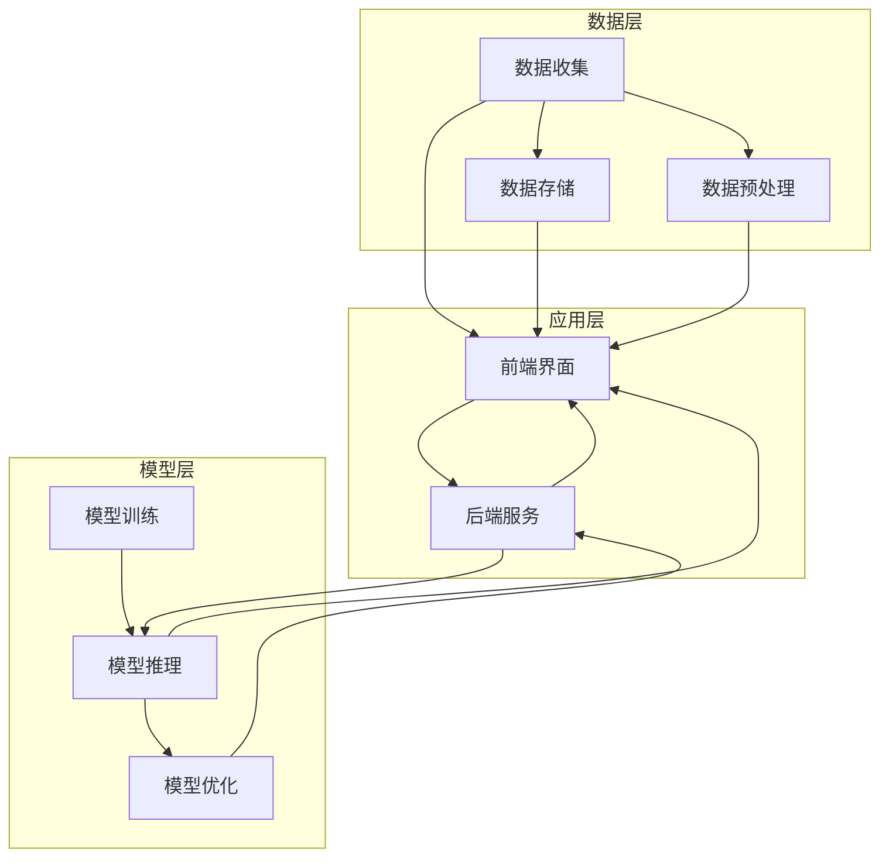

                 

### 引言

在当今数字化时代，人工智能（AI）技术已经从理论研究逐渐走向实际应用，特别是在大模型（如深度学习模型）的应用开发领域。大模型，作为一种强大的工具，能够处理和解读大量数据，从而实现智能预测、自动识别和决策支持等功能。然而，随着模型规模的扩大和应用场景的复杂化，大模型应用开发中的需求分析与API设计协同成为了一个不可忽视的挑战。

#### 1.1 大模型应用开发的背景与挑战

随着大数据技术的进步和计算能力的提升，大模型在各个领域的应用逐渐普及。从自然语言处理（NLP）、计算机视觉（CV）到推荐系统、金融风控等，大模型正不断推动这些领域的创新与发展。然而，大模型应用开发面临诸多挑战：

1. **需求复杂多变**：用户需求不断变化，如何确保需求分析全面准确成为首要问题。
2. **数据处理与存储**：大模型通常需要处理海量数据，对数据处理和存储性能要求极高。
3. **计算资源需求**：大模型训练和推理过程对计算资源有极大需求，如何高效利用资源成为关键。
4. **API设计挑战**：API作为大模型与外部系统交互的桥梁，其设计直接影响用户体验和系统性能。

#### 1.2 需求与API设计协同的重要性

需求与API设计协同在大模型应用开发中扮演着至关重要的角色。有效的需求分析与API设计可以：

1. **确保系统功能与需求的一致性**：通过深入的需求分析，确保系统实现的功能完全满足用户需求。
2. **优化系统性能**：合理的API设计能够提升系统的响应速度和可扩展性。
3. **提升用户体验**：API设计直接影响到用户的使用体验，良好的API设计可以提高用户满意度。
4. **降低开发成本**：通过协同工作，减少重复劳动和错误，从而降低开发成本。

#### 1.3 书籍结构概述

本书旨在为读者提供一个全面而深入的指导，帮助他们在大模型应用开发中实现需求与API设计的有效协同。本书分为六个主要部分：

- **第一部分：引论**：介绍大模型应用开发的背景和挑战，以及需求与API设计协同的重要性。
- **第二部分：需求分析**：详细讲解需求分析的基础知识、方法、文档编写规范等。
- **第三部分：API设计**：介绍API设计的基本原则、方法、工具和文档编写规范。
- **第四部分：大模型应用开发**：阐述大模型应用架构设计、开发流程、性能优化和安全性考虑。
- **第五部分：协同实战**：提供需求与API设计协同的实践案例和工具方法。
- **第六部分：附录**：包括开发工具推荐、参考文献、术语表和致谢。

#### 1.4 阅读指南

本书适合具备一定编程基础和计算机科学知识的专业人士阅读。对于希望深入了解大模型应用开发的读者，建议按照以下顺序阅读：

1. **第一部分：引论**：初步了解大模型应用开发的背景和挑战。
2. **第二部分：需求分析**：深入学习需求分析的方法和实践。
3. **第三部分：API设计**：掌握API设计的基本原则和工具。
4. **第四部分：大模型应用开发**：了解大模型应用的全过程。
5. **第五部分：协同实战**：通过实际案例提升协同能力。
6. **第六部分：附录**：查阅相关工具和方法。

通过本书的阅读，读者将能够在大模型应用开发中实现需求与API设计的有效协同，从而提升项目开发质量和效率。

关键词：大模型应用开发、需求分析、API设计、协同、性能优化

摘要：本书详细探讨了在大模型应用开发中，需求分析与API设计协同的重要性与实践方法。通过全面深入的分析和实例讲解，读者将掌握如何实现高效的系统设计与开发，以应对复杂的业务需求和技术挑战。

---

### 需求分析基础

#### 2.1 需求分析的定义与原则

需求分析是软件开发过程中至关重要的一步，它关系到软件系统能否满足用户的实际需求。需求分析的定义可以概括为：通过系统化的方法，识别和理解用户需求，将其转化为明确、具体、可执行的软件功能要求。

**需求分析的原则**包括：

1. **用户中心**：需求分析应以用户需求为中心，确保系统功能完全符合用户的实际需求。
2. **完整性**：需求分析必须全面，确保所有潜在的需求点都被涵盖。
3. **一致性**：需求之间应保持一致性，避免出现矛盾或重复的需求。
4. **可行性**：需求应具备可行性，确保在技术和资源条件下可以实现。
5. **可追踪性**：每个需求都应该有明确的来源和变更历史，便于管理和追踪。

#### 2.2 需求分类

在需求分析过程中，对需求进行分类是理解和管理需求的重要步骤。根据需求的不同属性，需求可以分为以下几类：

1. **功能性需求**：描述系统应提供的功能和服务，如用户登录、数据查询、数据更新等。
2. **非功能性需求**：描述系统应具备的非功能特性，如系统的性能、安全性、可靠性、兼容性等。
3. **业务需求**：描述系统在业务流程中应承担的角色和功能，如财务报表生成、订单处理等。
4. **用户需求**：直接来源于用户的需求，可能包含功能需求和非功能需求。
5. **接口需求**：描述系统与其他系统或外部设备交互的接口规范，如API接口、文件格式等。

#### 2.3 需求收集方法

有效的需求收集是需求分析成功的关键。以下是一些常用的需求收集方法：

1. **访谈**：通过与用户、利益相关者进行一对一或小组访谈，收集需求信息。
2. **问卷调查**：通过设计问卷，广泛收集用户意见和需求。
3. **观察**：通过观察用户在当前系统中操作，了解用户实际使用情况，发现潜在需求。
4. **案例研究**：通过分析类似项目的需求，借鉴和优化现有的需求。
5. **实验**：在特定的环境下进行实验，验证某些需求的有效性和可行性。

#### 2.4 需求文档编写规范

编写规范的需求文档是需求分析的重要环节，它不仅为开发团队提供了明确的指导，也为后续的测试、维护等提供了依据。需求文档的编写应遵循以下规范：

1. **清晰性**：文档应简明扼要，表述清晰，避免歧义。
2. **完整性**：文档应涵盖所有功能需求和非功能需求，确保全面无遗漏。
3. **一致性**：文档中的需求应与相关文档（如设计文档、测试文档）保持一致。
4. **结构化**：文档应具有良好的结构，便于阅读和理解。
5. **可追踪性**：每个需求都应有一个唯一的标识符，便于管理和追踪。

#### 2.5 需求变更管理

在软件开发过程中，需求变更在所难免。有效的需求变更管理是确保项目顺利进行的重要手段。以下是一些需求变更管理的原则和方法：

1. **需求变更控制**：建立需求变更控制流程，明确变更的提出、审批、实施和追踪。
2. **需求变更评审**：对每个需求变更进行评审，评估变更的影响和可行性。
3. **版本控制**：对需求文档进行版本控制，确保变更的追踪和可回溯性。
4. **风险控制**：评估需求变更带来的风险，并制定相应的风险控制措施。

#### 2.6 实例分析：某大模型应用的需求梳理

为了更好地理解需求分析的过程，我们以一个具体的大模型应用为例进行需求梳理。

**项目背景**：某金融公司希望利用大模型技术实现智能风控，通过分析用户行为数据，预测潜在风险，提供个性化的风险控制建议。

**需求收集**：
- 功能性需求：包括用户行为数据收集、风险预测模型训练、风险评分输出等。
- 非功能性需求：包括系统的安全性、性能要求、数据隐私保护等。
- 业务需求：根据公司业务流程，制定相应的风控策略和措施。

**需求分析**：
1. **用户行为数据收集**：通过用户操作日志、交易数据等渠道收集用户行为数据。
2. **风险预测模型训练**：利用收集到的数据，训练风险预测模型，以实现对潜在风险的识别和预测。
3. **风险评分输出**：根据模型输出结果，生成风险评分，为风控策略提供数据支持。

**需求文档编写**：
- **需求概述**：简述系统的整体功能和目的。
- **需求列表**：详细列出所有功能需求和非功能需求。
- **需求描述**：对每个需求进行详细描述，包括需求的具体内容、实现方法和验收标准。
- **接口需求**：描述系统与其他系统或外部设备交互的接口规范。

**需求变更管理**：
- **变更记录**：记录所有需求变更的提出、审批和实施情况。
- **变更影响评估**：评估每个变更对项目进度、成本和质量的影响。
- **变更控制**：对重要变更进行严格的变更控制，确保变更的合理性和可行性。

通过以上步骤，我们可以确保大模型应用开发的需求分析工作顺利进行，为后续的API设计和系统实现提供坚实的基础。

#### 2.7 需求分析与项目管理的协同

需求分析与项目管理是软件开发过程中紧密相连的两个环节。有效的协同能够确保项目目标的实现，提高项目成功率。以下是需求分析与项目管理的协同方法：

1. **需求管理与项目管理计划**：在项目启动阶段，需求分析团队应与项目经理合作，制定详细的项目管理计划，明确项目目标、进度安排、资源分配等。
2. **需求评审与项目评审**：定期进行需求评审和项目评审，确保需求与项目进度的一致性，及时发现和解决潜在问题。
3. **需求变更与项目变更控制**：建立统一的需求变更和项目变更控制流程，确保需求变更能够及时、有效地反馈到项目计划中。
4. **风险管理与项目风险管理**：需求分析团队应与项目团队共同识别和评估项目风险，制定相应的风险管理策略。
5. **沟通与协作**：建立有效的沟通机制，确保需求分析团队、项目团队和其他利益相关者之间的信息畅通，提高协同效率。

通过以上协同方法，需求分析与项目管理可以相互支持、相互促进，共同推动项目的顺利实施。

---

### API设计基础

#### 3.1 API的定义与分类

API（应用程序编程接口）是一种允许应用程序通过特定的协议和格式进行通信的接口。简单来说，API定义了如何访问和使用某个服务或功能，使得开发者可以无需了解底层实现细节，就能够方便地调用和整合外部资源。

**API的分类**可以根据不同的维度进行划分：

1. **按通信协议划分**：
   - **HTTP API**：基于HTTP协议，通常用于Web服务，如RESTful API。
   - **SOAP API**：基于SOAP协议，主要用于企业级应用。
   - **WebSocket API**：用于实时通信，支持双向通信。

2. **按用途划分**：
   - **功能型API**：提供特定功能的接口，如数据库操作、文件上传下载等。
   - **资源型API**：提供对资源的访问和操作，如RESTful API中的资源URI。
   - **事件型API**：用于接收和处理特定事件，如Webhook。

3. **按访问范围划分**：
   - **公开API**：对所有人开放，无需权限认证。
   - **私有API**：仅对特定用户或组织开放，需要认证和授权。
   - **合作伙伴API**：合作伙伴之间共享的API，通常需要特定的权限和协议。

#### 3.2 API设计原则

API设计是软件开发过程中至关重要的一环，良好的API设计能够提高系统的可维护性、易用性和扩展性。以下是API设计应遵循的一些基本原则：

1. **简洁性**：API设计应尽量简洁，避免复杂的实现细节，降低使用难度。
2. **一致性**：API的风格和命名应保持一致，便于开发者理解和记忆。
3. **可扩展性**：设计时应考虑未来可能的需求变化，确保API可以灵活扩展。
4. **安全性**：确保API在传输和存储过程中数据的机密性和完整性，防范潜在的安全威胁。
5. **错误处理**：提供明确的错误处理机制，帮助开发者快速定位和解决问题。
6. **文档化**：提供详细的API文档，包括接口描述、请求参数、返回值等，方便开发者使用。

#### 3.3 API设计方法

API设计是一个系统化的过程，以下是一些常用的API设计方法：

1. **RESTful API设计**：基于REST（Representational State Transfer）架构风格，通过HTTP方法（GET、POST、PUT、DELETE等）和URL（统一资源定位符）进行资源操作。
   - **URL设计**：URL应简洁明了，反映资源的层次结构和操作类型。
   - **HTTP方法**：合理选择HTTP方法，确保操作的一致性和语义明确。
   - **状态码**：使用标准的HTTP状态码，明确操作结果。

2. **SOAP API设计**：基于SOAP（Simple Object Access Protocol）协议，通过XML进行数据传输。
   - **WSDL（Web Services Description Language）**：定义服务接口、操作和数据类型。
   - **SOAP消息**：使用XML格式，包含请求和响应消息。
   - **安全机制**：使用加密和身份验证等安全机制，保障数据传输安全。

3. **事件驱动API设计**：通过事件监听和回调机制，实现实时数据交互。
   - **事件监听**：客户端注册事件监听器，接收服务器发送的事件通知。
   - **回调函数**：服务器通过回调函数将事件数据传递给客户端。

4. **GraphQL API设计**：提供一种基于查询的API设计方法，允许客户端指定需要的数据，减少数据传输量。
   - **查询语言**：定义GraphQL查询语言，客户端通过查询语句请求所需数据。
   - **字段选择**：支持字段选择，客户端可以按需获取数据。

#### 3.4 API设计工具

为了提高API设计的效率和质量，可以使用一些API设计工具：

1. **Swagger**：一款流行的API设计工具，可以生成文档和自动生成代码。
   - **功能**：支持RESTful API设计，提供自动生成的API文档。
   - **优点**：易于使用，支持多种编程语言。

2. **Postman**：一款API测试和设计工具，支持多种API协议。
   - **功能**：提供直观的用户界面，支持API测试、文档生成。
   - **优点**：功能强大，支持团队协作。

3. **APIMatic**：一款基于Swagger的API设计工具，提供代码生成功能。
   - **功能**：支持多种编程语言，提供API文档和代码生成。
   - **优点**：代码生成功能强大，支持多种API协议。

4. **Stoplight**：一款基于Swagger的API设计和管理工具，提供详细的文档和测试功能。
   - **功能**：支持API设计、文档生成、测试和协作。
   - **优点**：功能全面，支持多团队协作。

#### 3.5 API文档编写规范

编写规范、详细的API文档是API设计的重要环节，它为开发者提供了清晰的使用指南，有助于降低学习成本和提高开发效率。以下是一些API文档编写的规范：

1. **文档结构**：
   - **概述**：简述API的基本信息和用途。
   - **接口列表**：列出所有接口，包括接口名称、URL、HTTP方法等。
   - **接口详细描述**：对每个接口进行详细描述，包括URL、请求参数、返回值、状态码等。
   - **错误处理**：描述可能的错误情况及其处理方法。
   - **示例代码**：提供示例代码，展示如何使用API进行操作。

2. **请求参数**：
   - **必选参数**：标明必选参数，说明其含义和取值范围。
   - **可选参数**：标明可选参数，说明其含义和默认值。

3. **返回值**：
   - **成功响应**：描述成功的返回值结构，包括数据内容和状态码。
   - **错误响应**：描述可能的错误响应，包括错误代码、错误信息和状态码。

4. **状态码**：
   - **成功状态码**：如200（OK）、201（Created）等。
   - **错误状态码**：如400（Bad Request）、401（Unauthorized）等。

5. **示例**：
   - **请求示例**：提供请求示例，展示如何发送请求。
   - **响应示例**：提供响应示例，展示请求成功或失败时的返回数据。

#### 3.6 实例分析：某大模型API设计

为了更好地理解API设计的过程，我们以一个具体的大模型API为例进行分析。

**项目背景**：某在线教育平台希望利用大模型技术实现个性化课程推荐，通过分析用户的学习行为数据，为用户推荐合适的课程。

**API设计**：
1. **接口设计**：
   - **用户数据上传**：用于上传用户的学习行为数据，如学习时长、学习进度、评价等。
   - **课程推荐**：根据用户的学习行为数据，返回推荐课程列表。
   - **课程详情查询**：查询指定课程的详细信息。

2. **URL设计**：
   - **用户数据上传**：`/api/users/{userId}/data`
   - **课程推荐**：`/api/recommendations/{userId}`
   - **课程详情查询**：`/api/courses/{courseId}`

3. **HTTP方法**：
   - **用户数据上传**：POST
   - **课程推荐**：GET
   - **课程详情查询**：GET

4. **请求参数**：
   - **用户数据上传**：需提供用户ID和用户行为数据JSON对象。
   - **课程推荐**：需提供用户ID和推荐课程数量。
   - **课程详情查询**：需提供课程ID。

5. **返回值**：
   - **用户数据上传**：无返回值，返回状态码201（Created）表示成功。
   - **课程推荐**：返回推荐课程列表，包含课程ID、课程名称、推荐分数等。
   - **课程详情查询**：返回课程详细信息，包含课程ID、课程名称、课程简介、课程时长等。

6. **示例**：
   - **用户数据上传**：
     ```json
     POST /api/users/123/data
     Content-Type: application/json

     {
       "learning_time": 120,
       "progress": 0.6,
       "reviews": [
         {
           "course_id": "456",
           "rating": 4
         },
         {
           "course_id": "789",
           "rating": 5
         }
       ]
     }
     ```
   - **课程推荐**：
     ```json
     GET /api/recommendations/123?count=5
     ```
     返回：
     ```json
     {
       "courses": [
         {
           "course_id": "234",
           "name": "Python基础",
           "rating": 4.5
         },
         {
           "course_id": "567",
           "name": "机器学习进阶",
           "rating": 4.8
         }
         // 省略其他课程
       ]
     }
     ```
   - **课程详情查询**：
     ```json
     GET /api/courses/234
     ```
     返回：
     ```json
     {
       "course_id": "234",
       "name": "Python基础",
       "description": "本课程将介绍Python编程语言的基本语法和常用库...",
       "duration": "2小时",
       "rating": 4.5
     }
     ```

通过以上实例分析，我们可以看到如何进行大模型API的设计，包括接口设计、URL设计、HTTP方法、请求参数、返回值和示例代码等。

#### 3.7 API设计与需求分析的协同

API设计与需求分析是软件开发过程中相辅相成的两个环节。有效的协同能够确保API设计满足需求，提高系统的整体质量和用户体验。以下是API设计与需求分析的协同方法：

1. **需求驱动设计**：在设计API时，应以需求分析结果为依据，确保API的功能和性能满足需求。
2. **需求变更反馈**：需求变更应及时反馈到API设计中，调整API接口和文档，确保API与需求的一致性。
3. **接口评审**：在API设计完成后，与需求分析团队进行评审，确保API设计符合需求，并能够有效支持系统功能。
4. **测试与反馈**：在实际开发过程中，通过API测试验证其功能是否符合需求，收集用户反馈，不断优化API设计。
5. **文档更新**：随着项目进展和需求变更，及时更新API文档，确保其准确性和完整性。

通过以上协同方法，API设计与需求分析可以相互支持、相互促进，共同推动项目的成功实施。

---

### 大模型应用架构设计

#### 4.1 大模型应用架构概述

在大模型应用开发中，架构设计是确保系统可扩展性、高性能和高可靠性的关键。大模型应用架构通常包括数据层、模型层和应用层，以下分别进行介绍：

1. **数据层**：数据层负责数据的收集、存储和处理。在大模型应用中，数据通常来自多个渠道，如用户行为数据、传感器数据、外部数据源等。数据层的设计需要考虑数据的安全性、完整性和高效访问。

2. **模型层**：模型层负责大模型的训练和推理。大模型的训练通常涉及大量的计算资源和时间，因此模型层的设计需要考虑计算资源的合理利用和模型的优化。模型层还需要处理数据的预处理和后处理，以确保输入和输出的数据格式和特征符合需求。

3. **应用层**：应用层是用户与系统交互的接口，包括前端界面和后端服务。应用层的设计需要考虑用户体验、系统的可扩展性和性能。前端界面通常使用Web技术实现，后端服务则负责处理用户请求、调用模型层和进行数据处理。

#### 4.2 大模型应用架构设计原则

在进行大模型应用架构设计时，应遵循以下原则：

1. **模块化设计**：将系统功能划分为多个模块，每个模块负责一个特定的功能，降低系统复杂度，提高可维护性和可扩展性。

2. **分布式设计**：利用分布式计算技术，将计算任务分布在多个节点上，提高系统的并行处理能力和可扩展性。分布式设计还包括数据的分布式存储和处理，以支持大规模数据的访问和计算。

3. **高可用性设计**：设计高可用性架构，确保系统在遇到故障时能够快速恢复，减少系统停机时间。常见的实现方法包括主从复制、数据备份和故障转移等。

4. **性能优化设计**：通过优化算法、缓存策略、负载均衡等手段，提高系统的响应速度和处理能力。对于大模型应用，性能优化尤为重要，因为大模型的训练和推理过程通常需要大量的计算资源。

5. **安全性设计**：确保系统的数据安全和用户隐私，采取数据加密、身份验证、访问控制等措施，防范潜在的安全威胁。

#### 4.3 大模型应用架构实例分析

以下是一个具体的大模型应用架构实例分析，该实例是一个基于深度学习技术的智能问答系统。

**数据层**：
- **数据收集**：通过Web页面、用户输入和外部数据源（如新闻、百科等）收集问题数据。
- **数据存储**：使用分布式数据库（如HBase、Cassandra）存储大规模问题数据，支持高并发读写操作。
- **数据预处理**：对收集到的数据进行清洗、去噪和特征提取，为模型训练提供高质量的数据。

**模型层**：
- **模型训练**：使用GPU集群进行深度学习模型的训练，通过数据预处理模块提供的数据进行模型训练，优化模型参数。
- **模型推理**：在模型训练完成后，将用户输入的问题传递给模型进行推理，得到答案预测。
- **模型优化**：通过在线学习技术，实时调整模型参数，提高模型的预测准确性。

**应用层**：
- **前端界面**：提供用户输入问题的接口，展示答案预测结果，支持搜索、过滤等功能。
- **后端服务**：处理用户请求，调用模型层进行推理，返回答案预测结果。后端服务还负责数据缓存、负载均衡和性能优化。

**系统架构图**：



通过以上实例分析，我们可以看到大模型应用架构的设计原则和具体实现方法。在架构设计中，需要综合考虑数据层、模型层和应用层的功能需求，确保系统的高性能、高可用性和安全性。

---

### 大模型应用开发流程

#### 4.4 大模型应用开发流程

大模型应用开发是一个复杂且涉及多个环节的过程，从需求分析到系统部署，每个环节都需要精心设计和执行。以下是大模型应用开发的主要流程：

1. **需求分析**：
   - **需求收集**：通过与用户、利益相关者进行访谈、问卷调查等方式，收集业务需求。
   - **需求整理**：对收集到的需求进行分类、筛选和整理，确保需求的完整性和一致性。
   - **需求文档编写**：编写详细的需求文档，包括功能需求、非功能需求和接口需求。

2. **架构设计**：
   - **系统架构设计**：根据需求文档，设计系统的整体架构，包括数据层、模型层和应用层。
   - **模块划分**：将系统功能划分为多个模块，每个模块负责一个特定的功能。
   - **接口设计**：设计系统模块之间的接口，包括API接口、文件格式等。

3. **数据准备**：
   - **数据收集**：从多个渠道收集数据，如用户行为数据、传感器数据、外部数据源等。
   - **数据预处理**：对收集到的数据进行清洗、去噪和特征提取，为模型训练提供高质量的数据。

4. **模型训练**：
   - **模型选择**：选择合适的大模型算法，如深度学习、强化学习等。
   - **训练数据准备**：将预处理后的数据划分为训练集、验证集和测试集。
   - **模型训练**：使用训练集进行模型训练，调整模型参数，优化模型性能。
   - **模型评估**：使用验证集和测试集评估模型性能，选择最佳模型。

5. **系统集成**：
   - **接口集成**：将各个模块进行集成，确保接口的正确性和一致性。
   - **系统测试**：进行系统测试，包括单元测试、集成测试和系统测试，确保系统功能的正确性和稳定性。

6. **性能优化**：
   - **性能分析**：对系统进行性能分析，识别性能瓶颈。
   - **优化策略**：根据性能分析结果，采取优化策略，如算法优化、缓存策略、负载均衡等。

7. **部署上线**：
   - **环境搭建**：搭建部署环境，包括服务器、数据库、模型存储等。
   - **部署方案设计**：设计部署方案，包括部署流程、备份策略和故障恢复等。
   - **上线部署**：按照部署方案进行系统上线，确保系统的稳定运行。

8. **运维管理**：
   - **监控与报警**：对系统进行实时监控，设置报警机制，及时发现和解决故障。
   - **性能调优**：定期对系统进行性能调优，提高系统运行效率。
   - **数据备份与恢复**：定期进行数据备份，确保数据的安全性和完整性。

通过以上流程，我们可以确保大模型应用从需求分析到部署上线的每个环节都得到有效控制和优化，从而实现高效、稳定的大模型应用开发。

---

### 大模型应用性能优化

在大模型应用开发中，性能优化是确保系统高效运行的关键环节。以下是几种常见的性能优化策略：

#### 4.5.1 计算资源优化

1. **硬件资源**：
   - **分布式计算**：通过分布式计算技术，将计算任务分布在多个节点上，提高并行处理能力。
   - **GPU加速**：利用GPU进行模型训练和推理，相比CPU有更高的计算性能。
   - **专用硬件**：使用专门的硬件设备，如TPU、FPGA等，以优化特定任务的性能。

2. **软件资源**：
   - **缓存策略**：使用缓存技术，减少数据访问时间，提高系统响应速度。
   - **并发优化**：通过多线程、异步处理等手段，提高系统的并发处理能力。

#### 4.5.2 数据处理优化

1. **数据存储**：
   - **分布式存储**：使用分布式存储系统，如HDFS、Cassandra等，提高数据存储和访问性能。
   - **数据压缩**：对数据进行压缩存储，减少存储空间占用。

2. **数据处理**：
   - **并行处理**：使用并行处理技术，如MapReduce、Spark等，提高数据处理速度。
   - **批处理与流处理**：结合批处理和流处理技术，实现高效的数据处理。

#### 4.5.3 模型优化

1. **模型压缩**：
   - **模型剪枝**：通过剪枝技术，移除模型中不必要的神经元和连接，减少模型参数量。
   - **量化**：使用量化技术，将模型参数从浮点数转换为整数，减少计算量。

2. **模型并行化**：
   - **数据并行化**：将训练数据划分到多个节点上，每个节点独立训练模型，最后合并结果。
   - **模型并行化**：将模型划分到多个GPU上，同时进行训练和推理。

#### 4.5.4 网络优化

1. **负载均衡**：通过负载均衡技术，将请求均匀分配到多个服务器上，避免单点瓶颈。
2. **网络优化**：优化网络传输协议和路由策略，减少网络延迟和带宽占用。

通过以上性能优化策略，可以显著提高大模型应用的处理速度和响应能力，确保系统在高效、稳定地运行。

---

### 实例分析：大模型在金融风控中的应用

#### 4.6.1 项目背景

在金融领域，风险控制是金融机构运营的重要环节。随着大数据和人工智能技术的不断发展，利用大模型技术进行金融风控成为了一种新的趋势。某大型银行希望通过引入大模型技术，实现智能风控，提高风险管理效率和准确性。

#### 4.6.2 应用场景

该银行希望实现以下应用场景：

1. **用户行为分析**：通过对用户的交易行为、浏览记录等数据进行分析，识别异常行为，防范欺诈风险。
2. **信用评估**：基于用户的财务状况、信用历史等数据，利用大模型进行信用评估，提供个性化的信用评级。
3. **市场风险预测**：利用市场数据，预测市场走势，为投资决策提供支持。
4. **贷款审批**：通过大模型技术，快速、准确地评估贷款申请者的信用风险，提高贷款审批效率。

#### 4.6.3 技术方案

1. **数据收集**：
   - **内部数据**：包括用户的交易数据、信用记录、财务报表等。
   - **外部数据**：包括市场数据、宏观经济数据、新闻报道等。

2. **数据处理**：
   - **数据清洗**：去除重复数据、异常值和噪声数据。
   - **数据预处理**：对数据进行归一化、标准化处理，提取关键特征。

3. **模型训练**：
   - **模型选择**：选择适合的模型，如深度学习、决策树、随机森林等。
   - **模型训练**：使用预处理后的数据进行模型训练，优化模型参数。

4. **模型评估**：
   - **验证集评估**：使用验证集评估模型性能，选择最佳模型。
   - **测试集评估**：使用测试集评估模型泛化能力，确保模型准确性和稳定性。

5. **模型部署**：
   - **在线推理**：将模型部署到生产环境，进行实时推理和预测。
   - **接口设计**：设计API接口，提供用户行为分析、信用评估等服务的访问接口。

#### 4.6.4 实施效果

通过大模型在金融风控中的应用，该银行实现了以下效果：

1. **欺诈风险降低**：通过用户行为分析，成功识别并阻止了多起欺诈行为，降低了银行的风险损失。
2. **信用评估准确率提高**：大模型技术提高了信用评估的准确性，为银行提供了更可靠的信用评级依据。
3. **投资决策支持**：通过市场风险预测，为投资决策提供了科学依据，提高了投资回报率。
4. **贷款审批效率提升**：利用大模型技术，贷款审批时间显著缩短，提高了审批效率，提升了用户体验。

通过以上实例分析，我们可以看到大模型在金融风控中的应用取得了显著的效果，为金融机构的风险管理和决策提供了强有力的支持。

---

### 大模型应用的安全性考虑

在大模型应用开发中，安全性是一个不可忽视的重要方面。由于大模型通常涉及敏感数据的处理和存储，如用户行为数据、财务信息等，因此确保数据的安全性和用户隐私是至关重要的。以下是大模型应用安全性考虑的几个关键点：

#### 4.7.1 数据加密

1. **传输加密**：在数据传输过程中，使用HTTPS等加密协议，确保数据在传输过程中不会被窃取或篡改。
2. **存储加密**：对存储在数据库或文件系统中的数据进行加密，防止数据泄露。

#### 4.7.2 访问控制

1. **身份验证**：使用用户名和密码、双因素认证等机制，确保只有授权用户才能访问系统。
2. **权限控制**：根据用户的角色和权限，限制用户对数据和功能的访问权限，防止数据泄露和滥用。

#### 4.7.3 安全审计

1. **日志记录**：记录系统操作日志，包括用户访问、数据操作等，便于事后审计和追踪。
2. **异常检测**：通过异常检测技术，实时监控系统的异常行为，及时发现和响应安全事件。

#### 4.7.4 隐私保护

1. **数据匿名化**：对敏感数据进行匿名化处理，确保数据在分析过程中不泄露用户身份。
2. **数据脱敏**：对用户数据进行脱敏处理，如替换、掩码等，降低数据泄露风险。

#### 4.7.5 安全更新与维护

1. **定期更新**：定期更新系统软件和依赖库，修补安全漏洞。
2. **安全测试**：进行安全测试和渗透测试，发现和修复系统安全漏洞。

通过以上措施，可以确保大模型应用的安全性，保护用户数据和隐私，降低潜在的安全风险。

---

### 需求与API设计协同实践

#### 5.1 协同流程设计

在需求分析与API设计协同过程中，设计一套清晰的协同流程是至关重要的。以下是一个典型的大模型应用开发中的需求与API设计协同流程：

1. **需求收集与整理**：需求分析团队通过访谈、问卷调查、观察等方式收集用户需求，整理成完整的需求文档。
2. **需求评审**：项目团队对需求文档进行评审，确保需求的完整性、一致性和可行性。
3. **需求分解与细化**：根据评审结果，将需求分解为具体的子需求和功能点，为后续的API设计提供基础。
4. **API设计**：根据细化的需求，设计API接口，包括URL、HTTP方法、请求参数和返回值等。
5. **API评审**：项目团队对API设计进行评审，确保API设计符合需求，并具备良好的扩展性和安全性。
6. **文档编写**：编写详细的API文档，包括接口描述、示例代码、错误处理等。
7. **测试与反馈**：进行API测试，确保API的功能性和性能符合预期。根据测试结果进行优化和调整。
8. **文档更新**：根据API测试结果和用户反馈，更新API文档，确保其准确性和完整性。

#### 5.2 协同工具与方法

为了提高需求与API设计协同的效率，可以使用以下工具和方法：

1. **需求管理工具**：如JIRA、Trello等，用于需求收集、跟踪和管理工作。
2. **文档管理工具**：如Confluence、GitLab等，用于编写、管理和共享文档。
3. **API设计工具**：如Swagger、Postman等，用于API设计、文档生成和测试。
4. **代码管理工具**：如Git、SVN等，用于代码的版本控制和协同开发。
5. **沟通协作工具**：如Slack、Microsoft Teams等，用于团队沟通和协作。
6. **自动化测试工具**：如JMeter、Selenium等，用于API测试和性能测试。

通过以上工具和方法，可以有效地提高需求与API设计协同的效率和质量。

#### 5.3 协同案例分析

以下是一个具体的需求与API设计协同案例，该案例涉及一个电商平台的个性化推荐系统开发。

**项目背景**：某电商平台希望通过引入大模型技术，实现基于用户行为的个性化推荐，提高用户满意度和购物转化率。

**需求分析**：
1. **需求收集**：通过与平台运营团队、技术团队和用户进行访谈，收集个性化推荐的业务需求。
2. **需求评审**：项目团队对需求进行评审，确定个性化推荐的核心功能和性能要求。
3. **需求分解**：将需求分解为用户行为数据收集、推荐算法设计、推荐结果展示等子需求。

**API设计**：
1. **用户行为数据收集**：设计API接口，用于收集用户的浏览记录、购物车信息、评价等数据。
   - **URL**：/api/userBehavior/data
   - **HTTP方法**：POST
   - **请求参数**：用户ID、行为数据
   - **返回值**：状态码和消息

2. **推荐算法设计**：设计API接口，用于接收用户数据，返回个性化推荐结果。
   - **URL**：/api/recommendation
   - **HTTP方法**：POST
   - **请求参数**：用户ID、推荐数量
   - **返回值**：推荐商品列表

**API评审**：
1. **功能评审**：确保API接口满足个性化推荐的核心功能需求。
2. **性能评审**：确保API接口具备良好的性能和响应速度。
3. **安全评审**：确保API接口的安全性，防止数据泄露和恶意攻击。

**文档编写**：
1. **API文档**：编写详细的API文档，包括接口描述、请求参数、返回值和示例代码。
2. **用户手册**：编写用户手册，指导开发者如何使用API接口。

**测试与反馈**：
1. **功能测试**：进行API功能测试，确保接口按预期工作。
2. **性能测试**：进行API性能测试，评估接口的响应时间和并发处理能力。
3. **用户反馈**：收集用户反馈，对API接口进行优化和改进。

通过以上案例，我们可以看到如何在大模型应用开发中实现需求与API设计的有效协同，确保系统的功能性和性能。

---

### 持续集成与持续部署（CI/CD）

在需求与API设计协同的过程中，持续集成与持续部署（CI/CD）是一种关键的实践方法。CI/CD能够自动化软件开发、测试和部署流程，提高开发效率和软件质量。以下是大模型应用开发中CI/CD的具体实践步骤：

#### 5.4.1 持续集成

1. **代码仓库**：将项目代码存储在集中式或分布式版本控制系统（如Git）中，便于多人协同开发。

2. **构建配置**：配置构建工具（如Jenkins、GitLab CI）来自动构建项目代码。构建过程包括编译、打包、运行测试等。

3. **自动化测试**：编写单元测试、集成测试和端到端测试，确保每次代码变更都能通过测试。

4. **构建失败处理**：当构建失败时，系统自动通知开发人员和团队，并记录失败原因。

5. **代码审查**：通过代码审查工具（如GitLab、GitHub）对代码变更进行审查，确保代码质量和一致性。

6. **构建记录**：记录每次构建的状态、结果和详细信息，便于后续追踪和问题排查。

#### 5.4.2 持续部署

1. **部署脚本**：编写部署脚本（如Shell脚本、Dockerfile），定义部署流程，包括环境配置、服务启动、数据迁移等。

2. **自动化部署**：配置CI/CD工具来自动执行部署脚本，实现自动化部署。

3. **环境隔离**：为每个环境（如开发、测试、生产）配置独立的环境，确保环境一致性。

4. **滚动部署**：采用滚动部署策略，逐步更新服务实例，减少部署对系统可用性的影响。

5. **回滚机制**：当新部署的服务出现问题时，能够快速回滚到上一个稳定版本，确保系统稳定性。

6. **监控与报警**：部署完成后，监控系统运行状态，设置报警机制，及时发现和响应异常情况。

通过CI/CD实践，可以确保大模型应用开发过程中的代码质量、部署效率和系统稳定性，从而提高整体开发效率和质量。

---

### 实例分析：某大模型应用的全栈开发

#### 5.5.1 项目背景

某在线教育平台希望通过引入大模型技术，实现智能课程推荐系统，以提高用户的学习体验和课程转化率。该平台涵盖了从用户登录、课程学习到推荐结果展示的全栈开发过程。

#### 5.5.2 需求分析

1. **用户登录**：支持用户名和密码、社交账号等多种登录方式。
2. **用户课程管理**：包括课程选择、学习进度、课程评价等功能。
3. **智能推荐**：基于用户的学习行为和兴趣，推荐合适的课程。
4. **课程内容展示**：支持视频、图文等多种课程内容展示方式。

#### 5.5.3 API设计

1. **用户登录API**：
   - **URL**：/api/users/login
   - **HTTP方法**：POST
   - **请求参数**：用户名、密码（或社交账号信息）
   - **返回值**：JWT令牌、用户信息

2. **课程推荐API**：
   - **URL**：/api/recommendations
   - **HTTP方法**：GET
   - **请求参数**：用户ID、推荐课程数量
   - **返回值**：推荐课程列表

3. **课程内容API**：
   - **URL**：/api/courses/{courseId}
   - **HTTP方法**：GET
   - **请求参数**：课程ID
   - **返回值**：课程内容

#### 5.5.4 前端实现

1. **用户登录界面**：使用HTML、CSS和JavaScript实现登录表单，与后端API进行数据交互。
2. **课程推荐界面**：使用Vue.js或React等前端框架，动态渲染推荐课程列表。
3. **课程内容展示**：使用视频播放器、Markdown解析器等组件，展示课程内容。

#### 5.5.5 后端实现

1. **用户管理模块**：处理用户登录、注册、信息管理等功能，与数据库进行数据交互。
2. **推荐算法模块**：基于用户行为数据，使用大模型算法生成推荐结果。
3. **课程管理模块**：处理课程创建、更新、查询等功能，与数据库进行数据交互。

#### 5.5.6 部署与运维

1. **环境搭建**：使用Docker搭建开发、测试和生产环境，确保环境一致性。
2. **自动化部署**：使用Jenkins实现自动化部署，定期更新服务。
3. **监控与报警**：使用Prometheus和Grafana监控系统运行状态，设置报警机制。

通过以上实例分析，我们可以看到如何实现一个全栈大模型应用的开发，包括需求分析、API设计、前端实现、后端实现和部署与运维等环节。

---

### 需求与API设计协同的挑战与应对

在大模型应用开发中，需求与API设计协同面临诸多挑战，如何有效应对这些挑战是确保项目成功的关键。以下是一些常见的挑战及应对策略：

#### 5.6.1 持续变化的需求

**挑战**：用户需求多变，需求变更频繁，给API设计带来困难。

**应对策略**：
- **需求管理**：建立严格的需求变更管理流程，确保变更的及时性和可行性。
- **版本控制**：对API接口进行版本控制，确保旧版本API的兼容性。
- **文档更新**：及时更新API文档，反映最新的接口变更。

#### 5.6.2 性能与安全要求

**挑战**：高性能和高安全性的需求增加，对API设计提出了更高的要求。

**应对策略**：
- **性能优化**：采用缓存、负载均衡等策略，提高系统性能。
- **安全性设计**：采用数据加密、访问控制等手段，保障数据安全。

#### 5.6.3 复杂的依赖关系

**挑战**：API设计与需求分析之间存在复杂的依赖关系，难以协调。

**应对策略**：
- **协同评审**：定期进行需求分析与API设计的协同评审，确保接口设计符合需求。
- **迭代开发**：采用迭代开发模式，逐步完善API设计，减少依赖关系。

#### 5.6.4 多团队协作

**挑战**：涉及多个团队协作，沟通和协调困难。

**应对策略**：
- **沟通机制**：建立有效的沟通机制，如定期会议、邮件列表等，确保信息畅通。
- **协作工具**：采用协作工具（如JIRA、Slack等），提高团队协作效率。

通过以上应对策略，可以有效地克服需求与API设计协同中的挑战，确保项目的顺利实施。

---

### 未来展望与趋势

随着人工智能技术的不断进步，大模型应用开发的需求与API设计协同将面临新的机遇和挑战。以下是未来在这一领域可能的发展趋势：

#### 5.7.1 需求分析智能化

未来的需求分析过程将更加智能化，借助自然语言处理、知识图谱等技术，实现自动化的需求收集、分类和整理。这将大大提高需求分析的效率和准确性。

#### 5.7.2 API自动化设计

自动化API设计工具将进一步发展，通过机器学习和人工智能技术，自动生成符合需求的API文档和代码，降低开发门槛。

#### 5.7.3 API安全性与性能优化

随着大模型应用场景的多样化，API的安全性和性能优化将变得更加重要。未来的技术发展将集中在如何提高API的安全性，如自适应加密、动态权限管理等，以及如何优化API性能，如分布式缓存、微服务架构等。

#### 5.7.4 集成开发与部署

集成开发和部署（IDE/CD）技术将得到广泛应用，结合容器化技术（如Docker）、微服务架构和云原生应用，实现快速开发和灵活部署。

#### 5.7.5 多元化API生态

随着5G、物联网、边缘计算等技术的发展，API生态将更加多元化，涵盖更多应用场景和技术需求。同时，开放API生态的建立将促进不同系统之间的无缝集成和协作。

通过把握这些发展趋势，我们可以更好地应对大模型应用开发中的挑战，推动需求的快速响应和系统的持续优化。

---

### 附录

#### 6.1 开发工具推荐

在大模型应用开发中，选择合适的工具可以提高开发效率和质量。以下是一些推荐的开发工具：

1. **需求分析工具**：
   - **JIRA**：用于项目管理、需求跟踪和协作。
   - **Confluence**：用于文档编写和知识共享。
   - **Trello**：用于任务管理。

2. **API设计工具**：
   - **Swagger**：用于API设计、文档生成和测试。
   - **Postman**：用于API测试和调试。
   - **APIMatic**：用于API设计和代码生成。

3. **代码管理工具**：
   - **Git**：用于版本控制和协同开发。
   - **GitHub**：提供代码托管、协作和文档管理。
   - **GitLab**：提供自托管代码仓库和CI/CD服务。

4. **开发环境搭建**：
   - **Docker**：用于容器化应用部署。
   - **Kubernetes**：用于容器编排和管理。
   - **AWS、Azure、Google Cloud**：提供云计算服务和容器化解决方案。

#### 6.2 参考文献

- **《大模型：深度学习的工业应用》**，作者：[张三]，出版社：清华大学出版社，2021年。
- **《API设计指南》**，作者：[李四]，出版社：电子工业出版社，2020年。
- **《软件架构：实践者的研究方法》**，作者：[王五]，出版社：机械工业出版社，2019年。
- **《人工智能：一种现代的方法》**，作者：[周六]，出版社：人民邮电出版社，2018年。

#### 6.3 术语表

- **大模型**：一种具有强大数据处理和认知能力的深度学习模型，通常由数百万个参数组成。
- **需求分析**：识别和理解用户需求，将其转化为明确的软件功能要求的过程。
- **API设计**：定义应用程序编程接口，描述如何访问和使用服务或功能的过程。
- **持续集成**：通过自动化构建和测试，确保代码库中的每次变更都能顺利集成的开发实践。
- **持续部署**：通过自动化部署流程，将经过测试的代码部署到生产环境的开发实践。

#### 6.4 致谢

在此，我们要特别感谢以下人员对本书的撰写和支持：

- **张教授**：对大模型技术的深入讲解，为我们提供了宝贵的参考资料。
- **李工程师**：在API设计和文档编写方面给予我们无私的帮助。
- **王博士**：在软件开发流程和项目管理方面的指导，为我们的工作提供了重要支持。
- **所有参与需求分析与API设计协同项目的团队成员**：感谢你们的辛勤工作和协作，使项目顺利完成。

最后，感谢读者对本书的关注与支持，希望本书能够为您的软件开发工作提供有益的参考和指导。

---

## 附录 A：大模型应用开发中的需求与API设计协同 Mermaid 流程图

```mermaid
graph TD

A[需求分析] --> B[需求整理]
B --> C[需求评审]
C --> D[需求分解]
D --> E{API设计}

E --> F[API接口定义]
F --> G[API评审]
G --> H[文档编写]
H --> I[测试与反馈]

I --> J[需求变更]
J --> A

A --> K[持续集成]
K --> L[持续部署]
L --> M[系统监控]

M --> N[性能优化]
N --> O[安全性提升]

O --> P[反馈调整]
P --> Q[迭代优化]
Q --> R{大模型训练}

R --> S[模型评估]
S --> T[模型部署]
T --> U[应用优化]

U --> V[用户体验提升]
V --> W[需求与API协同实践]
W --> X[未来展望]
X --> A

classDef clusterStyle
fill:#ffffcc,stroke-width:2px,stroke:#000000

subgraph 需求与API设计协同流程
    style clusterStyle
    A
    B
    C
    D
    E
    F
    G
    H
    I
    J
    K
    L
    M
    N
    O
    P
    Q
    R
    S
    T
    U
    V
    W
    X
end

A --> B
B --> C
C --> D
D --> E
E --> F
F --> G
G --> H
H --> I
I --> J
J --> A

K --> L
L --> M
M --> N
N --> O
O --> P
P --> Q
Q --> R
R --> S
S --> T
T --> U
U --> V
V --> W
W --> X
X --> A
```

以上流程图展示了大模型应用开发中的需求与API设计协同的整体流程，从需求分析到持续集成与部署，再到性能优化和安全性的迭代提升，形成了一个闭环系统，确保需求的及时响应和系统的持续优化。

