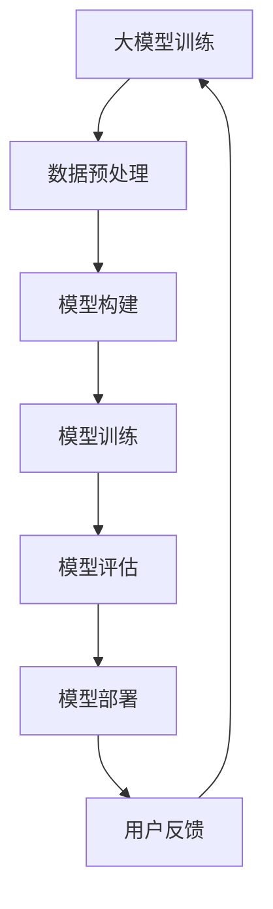
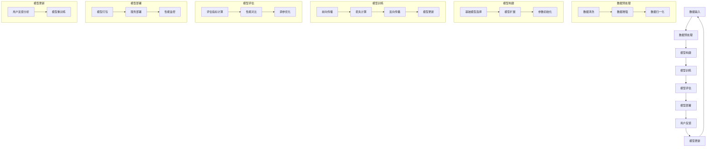

                 

## 《大模型应用的产品设计与用户体验提升策略》目录大纲

### 第一部分：概述与背景

#### 第1章：大模型应用的时代背景与趋势
- **1.1 大模型应用的崛起：技术驱动与市场需求**
  - 大模型应用的技术基础
  - 市场对大模型应用的需求
- **1.2 产品设计与用户体验的关系**
  - 用户需求与产品设计
  - 用户体验在产品设计中的重要性
- **1.3 大模型应用的产品设计原则**
  - 可用性原则
  - 交互性原则
  - 创新性原则
- **1.4 大模型应用的用户体验提升策略**
  - 提升用户体验的常见方法
  - 大模型应用中的用户体验挑战与解决方案

### 第二部分：大模型产品设计与用户体验提升策略

#### 第2章：大模型核心概念与架构
- **2.1 大模型的基础知识**
  - 大模型的基本定义
  - 大模型的类型与特点
- **2.2 大模型的技术架构**
  - 计算机视觉大模型
  - 自然语言处理大模型
  - 计算机听觉大模型
- **2.3 大模型的搭建与优化**
  - 数据集的准备
  - 大模型的训练与优化
  - 大模型的部署与维护

#### 第3章：产品设计与用户体验提升策略
- **3.1 产品设计流程**
  - 需求分析
  - 设计原型
  - 用户反馈与迭代
- **3.2 大模型在产品设计中的应用**
  - 大模型在需求分析中的应用
  - 大模型在原型设计中的应用
  - 大模型在用户反馈中的应用
- **3.3 用户体验提升策略**
  - 交互设计
  - 可访问性设计
  - 情感化设计

#### 第4章：大模型应用的产品实战案例
- **4.1 产品A：智能客服系统**
  - 产品背景
  - 产品设计与用户体验
  - 大模型的应用
- **4.2 产品B：智能教育平台**
  - 产品背景
  - 产品设计与用户体验
  - 大模型的应用
- **4.3 产品C：智能医疗诊断系统**
  - 产品背景
  - 产品设计与用户体验
  - 大模型的应用

#### 第5章：用户体验提升的实证研究
- **5.1 用户研究方法**
  - 调查问卷
  - 用户访谈
  - 用户行为分析
- **5.2 用户体验测量与评估**
  - 用户体验指标
  - 用户体验评估方法
- **5.3 用户体验改进案例研究**
  - 案例分析
  - 用户体验提升策略

#### 第6章：大模型应用的未来趋势
- **6.1 大模型应用的发展方向**
  - 大模型的技术趋势
  - 大模型在行业中的应用趋势
- **6.2 大模型应用中的挑战与应对**
  - 技术挑战
  - 用户体验挑战
  - 挑战与解决方案

#### 第7章：总结与展望
- **7.1 主要内容回顾**
  - 大模型应用的核心概念与架构
  - 产品设计与用户体验提升策略
  - 大模型应用的实际案例
- **7.2 未来研究方向与展望**
  - 大模型应用的创新方向
  - 大模型与用户体验提升的结合点

### 附录

#### 附录A：大模型应用开发工具与资源
- **A.1 大模型开发工具对比**
  - TensorFlow
  - PyTorch
  - Hugging Face Transformers
- **A.2 大模型应用开发资源**
  - 开源代码与数据集
  - 在线课程与教程
  - 行业报告与白皮书

#### 附录B：大模型应用的产品设计与用户体验提升策略总结
- **B.1 设计原则与策略**
  - 产品设计原则
  - 用户体验提升策略
- **B.2 实践案例总结**
  - 案例分析总结
  - 用户体验提升策略总结

**附录C：大模型架构的 Mermaid 流程图**

通过以上详细的目录大纲，我们可以看到文章的结构清晰，内容丰富，从概述背景到具体案例分析，再到用户体验提升的策略研究和未来趋势展望，全面而深入地探讨了“大模型应用的产品设计与用户体验提升策略”这一主题。接下来，我们将逐一展开每个章节的内容。

### 引言

随着科技的飞速发展，人工智能（AI）技术已经渗透到了各行各业，而其中最引人瞩目的当属大模型（Large Models）的应用。大模型，通常指的是那些拥有数百万至数十亿个参数的深度学习模型，它们在图像识别、自然语言处理、语音识别等领域取得了显著的突破。这些强大的人工智能工具不仅提升了计算能力，也改变了人们的生活和工作方式。

然而，大模型的应用并非仅仅是技术的进步，更涉及产品设计、用户体验等多个方面。优秀的用户体验（UX）设计能够显著提升产品的市场竞争力，而大模型的应用则为用户体验的提升提供了新的可能性。因此，如何在产品设计与用户体验提升中有效运用大模型，成为了当前IT领域的一个热点话题。

本文旨在探讨大模型应用的产品设计与用户体验提升策略。我们将首先回顾大模型的应用背景与趋势，理解其在产品设计中的重要性。接着，我们将深入探讨大模型的核心概念与架构，以及其在实际产品中的应用与优化方法。随后，我们将分析产品设计与用户体验提升的流程和策略，并通过具体案例进行详细解读。最后，我们将展望大模型应用的未来趋势，总结主要研究成果，并提出进一步的研究方向。

通过本文的阅读，读者将能够全面了解大模型在产品设计中的角色，掌握提升用户体验的有效策略，并预见到大模型应用的未来发展方向。让我们一同踏上这场技术革新与用户体验提升的旅程。

### 文章关键词

- 大模型（Large Models）
- 人工智能（Artificial Intelligence）
- 产品设计（Product Design）
- 用户需求（User Needs）
- 用户体验（User Experience）
- 设计原则（Design Principles）
- 技术架构（Technical Architecture）
- 模型优化（Model Optimization）
- 交互设计（Interactive Design）
- 可访问性设计（Accessibility Design）
- 情感化设计（Emotional Design）
- 实战案例（Case Studies）
- 用户研究（User Research）
- 用户体验提升（User Experience Enhancement）
- 未来趋势（Future Trends）

### 文章摘要

本文深入探讨了“大模型应用的产品设计与用户体验提升策略”。首先，我们回顾了大模型的应用背景与趋势，阐明了其在产品设计中的重要性。随后，我们详细介绍了大模型的核心概念与架构，包括计算机视觉、自然语言处理和计算机听觉等领域。接着，本文分析了大模型在产品设计与用户体验提升中的应用，讨论了设计原则、交互设计、可访问性设计以及情感化设计的策略。通过具体案例，如智能客服系统、智能教育平台和智能医疗诊断系统，我们展示了如何在大模型应用中提升用户体验。最后，本文展望了大模型应用的未来趋势，总结了主要研究成果，并提出了进一步的研究方向。通过本文的阅读，读者将全面了解大模型在产品设计中的角色，掌握提升用户体验的有效策略，并预见到大模型应用的未来发展方向。

### 第一部分：概述与背景

在当今科技迅猛发展的时代，大模型（Large Models）的应用成为了人工智能（AI）领域的重要突破点。本部分的目的是深入探讨大模型应用的时代背景与趋势，以及它们在产品设计和用户体验提升中的重要性。首先，我们将回顾大模型应用的崛起原因，接着分析产品设计与用户体验之间的关系，并介绍大模型应用中的产品设计原则和用户体验提升策略。

#### 第1章：大模型应用的时代背景与趋势

1. **1.1 大模型应用的崛起：技术驱动与市场需求**

随着深度学习（Deep Learning）技术的飞速发展，大模型的应用逐渐成为了人工智能领域的焦点。大模型通常拥有数百万至数十亿个参数，这使得它们能够处理复杂的数据，并从中提取出高层次的抽象特征。以下是推动大模型应用崛起的两个主要因素：

- **技术驱动**：随着计算能力的提升和大数据的普及，深度学习算法可以更有效地训练大模型。例如，GPU（图形处理器）和TPU（张量处理器）等硬件的优化，使得大规模模型训练变得更加高效和可行。
  
- **市场需求**：越来越多的行业意识到人工智能技术的重要性，并将其应用于各种实际场景中。例如，金融、医疗、教育、零售等行业都在寻求通过大模型应用来提升业务效率和用户体验。

2. **1.2 产品设计与用户体验的关系**

产品设计与用户体验（UX）密切相关。用户体验不仅仅是一个产品或服务的功能性表现，更包含了用户在使用过程中的情感体验和整体感受。以下是用户需求与产品设计、用户体验在产品设计中的重要性：

- **用户需求与产品设计**：产品设计始于对用户需求的理解和满足。通过用户研究和市场调研，设计师可以识别出用户的关键需求，并将其转化为具体的功能和界面元素。

- **用户体验在产品设计中的重要性**：用户体验直接影响产品的市场接受度和用户忠诚度。一个优秀的产品设计应该能够提供直观、流畅、愉悦的用户体验，从而提升用户满意度和产品价值。

3. **1.3 大模型应用的产品设计原则**

在大模型应用的产品设计中，需要遵循一些核心原则，以确保产品既具有技术先进性，又能够满足用户需求：

- **可用性原则**：确保产品易于使用，用户能够快速掌握操作方法，避免复杂和繁琐的步骤。

- **交互性原则**：设计直观且具有互动性的用户界面，使用户能够与产品进行自然的互动，增强用户体验。

- **创新性原则**：在保证功能性和可用性的基础上，通过创新的设计思路和技术手段，提升产品的独特性和吸引力。

4. **1.4 大模型应用的用户体验提升策略**

提升用户体验是大模型应用中的一个重要目标。以下是一些常见的用户体验提升方法和在大模型应用中的挑战与解决方案：

- **提升用户体验的常见方法**：
  - **交互设计**：通过改进用户界面和交互流程，提升用户的操作便捷性和效率。
  - **可访问性设计**：确保产品能够被不同能力水平的用户使用，包括视觉、听觉和肢体障碍者等。
  - **情感化设计**：通过设计元素传达情感信息，增强用户对产品的情感共鸣和品牌认同。

- **大模型应用中的用户体验挑战与解决方案**：
  - **复杂性挑战**：大模型的应用通常涉及复杂的算法和数据处理过程，需要设计简洁直观的界面来降低用户的认知负担。
  - **延迟挑战**：大模型的运算和响应速度可能较慢，需要通过优化算法和硬件性能来提升响应速度。
  - **隐私与安全挑战**：大模型应用中涉及大量的用户数据，需要确保数据的安全和隐私保护。

通过以上分析，我们可以看到大模型应用在当今科技时代的重要性，以及如何在产品设计和用户体验提升中充分利用大模型的优势。在接下来的章节中，我们将进一步探讨大模型的核心概念与架构，以及具体的设计和用户体验提升策略。

### 第1章：大模型应用的时代背景与趋势

随着深度学习技术的不断进步，大模型（Large Models）的应用已经成为了人工智能（AI）领域的一个热点。本节将深入探讨大模型应用的崛起原因、技术驱动与市场需求的动态变化，以及它们在产品设计中的重要性。

#### 1.1 大模型应用的崛起：技术驱动与市场需求

大模型的崛起离不开技术的推动和市场的需求。以下是两个关键因素：

**技术驱动：**

1. **计算能力的提升**：深度学习算法在大规模数据集上训练需要巨大的计算资源。随着GPU（图形处理器）和TPU（张量处理器）等专用硬件的发展，计算能力得到了显著提升，使得大规模模型训练变得更加高效和可行。

2. **分布式计算和云计算**：分布式计算和云计算技术的普及，使得大规模数据处理和模型训练变得更加便捷。通过利用多个计算节点和云服务器，可以大幅度降低计算成本和时间。

**市场需求：**

1. **智能化的需求**：各行业对智能化解决方案的需求日益增加。例如，金融行业希望通过AI技术进行风险控制和智能投顾，医疗行业希望通过AI进行疾病诊断和个性化治疗。

2. **用户体验的提升**：优秀的用户体验是产品成功的关键。大模型的应用能够通过更准确的预测和更智能的交互，显著提升用户体验，从而增加用户忠诚度和市场份额。

#### 1.2 产品设计与用户体验的关系

用户体验（UX）在产品设计中扮演着至关重要的角色。它不仅仅是产品的功能实现，更是用户在使用过程中的情感和认知体验。以下是用户需求、产品设计及用户体验在产品设计中的重要性：

**用户需求与产品设计：**

- **用户研究**：通过用户调研、访谈和反馈，了解用户的具体需求、痛点和期望。这些信息为产品设计提供了宝贵的指导。
- **需求分析**：根据用户需求，确定产品的核心功能和特性。设计过程中需要平衡功能丰富性与用户体验，避免过度复杂化。

**用户体验在产品设计中的重要性：**

- **提升用户满意度**：良好的用户体验能够使用户感到愉悦和满足，从而提升产品满意度和品牌忠诚度。
- **增加用户留存率**：易于使用和有吸引力的产品能够降低用户流失率，提高用户的长期使用意愿。
- **促进产品推广**：优秀的产品体验能够通过口碑传播，吸引更多的潜在用户，提升产品知名度和市场份额。

#### 1.3 大模型应用的产品设计原则

在大模型应用中，产品设计需要遵循以下原则：

**可用性原则：**

- **直观性**：设计应该直观易懂，用户能够快速学会如何操作。
- **一致性**：界面元素和交互方式应保持一致性，减少用户的认知负担。
- **可控性**：用户应能够轻松地控制产品的行为，包括撤销和重做等。

**交互性原则：**

- **响应速度**：大模型应用可能涉及复杂的计算过程，应优化算法和硬件性能，确保快速响应。
- **互动性**：设计互动性强的界面，使用户能够与产品进行自然且丰富的互动。

**创新性原则：**

- **突破性**：通过创新的设计思路和技术手段，提供独特且令人印象深刻的产品体验。
- **适应性**：设计应具备适应性，能够随着技术和市场的发展而不断迭代和优化。

#### 1.4 大模型应用的用户体验提升策略

提升用户体验是大模型应用中的一个关键目标。以下是一些常用的策略和方法：

**交互设计：**

- **简洁性**：通过简化界面元素和交互流程，降低用户的认知负荷。
- **反馈机制**：提供明确的反馈信息，帮助用户理解操作结果和系统状态。

**可访问性设计：**

- **无障碍设计**：确保产品能够被各类用户使用，包括视觉、听觉和肢体障碍者。
- **多语言支持**：提供多种语言选项，以满足不同语言背景的用户需求。

**情感化设计：**

- **情感共鸣**：通过设计元素传达情感信息，增强用户对产品的情感共鸣和认同。
- **品牌体验**：设计应与品牌理念相一致，提升用户对品牌的认同感。

**挑战与解决方案：**

- **复杂性挑战**：大模型应用可能涉及复杂的算法和数据处理过程，需要设计简洁直观的界面来降低用户的认知负担。
- **延迟挑战**：大模型的运算和响应速度可能较慢，需要通过优化算法和硬件性能来提升响应速度。
- **隐私与安全挑战**：大模型应用中涉及大量的用户数据，需要确保数据的安全和隐私保护。

通过深入分析大模型应用的时代背景与趋势，我们可以更好地理解其在产品设计中的重要性，以及如何通过有效的用户体验提升策略，实现产品的成功。

### 第2章：大模型核心概念与架构

大模型作为人工智能（AI）领域的核心组件，其应用范围涵盖了计算机视觉、自然语言处理和计算机听觉等多个领域。在本章中，我们将详细探讨大模型的基础知识、技术架构及其在具体应用中的搭建与优化方法。

#### 2.1 大模型的基础知识

**大模型的基本定义**

大模型通常指的是那些拥有数百万至数十亿个参数的深度学习模型。这些模型通过学习大量的数据，能够提取出高层次的抽象特征，从而实现强大的预测和分类能力。大模型的主要特点包括：

- **高参数数量**：大模型拥有大量的参数，这使得它们能够捕捉数据中的复杂模式和特征。
- **较强的泛化能力**：由于训练数据量庞大，大模型能够较好地泛化到未见过的数据上，从而具有更高的准确性和鲁棒性。
- **需要大量计算资源**：大模型的训练和推理过程需要大量的计算资源和时间，因此通常采用分布式计算和云计算技术来加速训练过程。

**大模型的类型与特点**

根据应用领域和具体任务，大模型可以分为多种类型，主要包括：

1. **计算机视觉大模型**：如ImageNet上的ResNet、EfficientNet等，这些模型用于图像分类、目标检测和图像生成等任务。
2. **自然语言处理大模型**：如BERT、GPT等，这些模型在文本分类、机器翻译、问答系统和文本生成等方面表现出色。
3. **计算机听觉大模型**：如Transformer模型在语音识别任务上的应用，这些模型在音频信号处理和语音生成方面具备显著优势。

#### 2.2 大模型的技术架构

大模型的技术架构通常包括以下几个关键组件：

**数据预处理**

数据预处理是搭建大模型的重要步骤，主要包括以下任务：

- **数据清洗**：去除噪声数据和异常值，保证数据的质量。
- **数据增强**：通过旋转、缩放、裁剪等方法，增加训练数据多样性，提升模型的泛化能力。
- **数据归一化**：将数据转换为标准化的形式，便于模型训练。

**模型构建**

模型构建是搭建大模型的核心步骤，通常包括以下几个步骤：

- **选择基础模型**：根据任务需求，选择合适的基础模型，如卷积神经网络（CNN）或循环神经网络（RNN）。
- **模型扩展**：在基础模型的基础上，通过增加层、调整层结构或使用特殊的网络结构，构建更复杂的大模型。
- **参数初始化**：初始化模型的参数，常用的方法包括随机初始化、高斯初始化等。

**模型训练**

模型训练是使大模型学会对数据进行预测的关键步骤，主要包括以下步骤：

- **数据输入**：将预处理后的数据输入到模型中，通过前向传播计算模型的输出。
- **损失计算**：计算模型的输出与真实值之间的差异，即损失值。
- **反向传播**：通过反向传播算法，更新模型的参数，减小损失值。
- **训练循环**：重复上述步骤，进行多次迭代，直到模型收敛。

**模型评估**

模型评估是验证大模型性能的重要环节，主要包括以下步骤：

- **评估指标**：选择合适的评估指标，如准确率、召回率、F1值等，衡量模型在训练集和测试集上的表现。
- **性能对比**：将模型在训练集和测试集上的性能进行对比，判断模型是否过拟合或欠拟合。
- **调参优化**：根据评估结果，调整模型参数和训练策略，进一步提升模型性能。

**模型部署**

模型部署是将训练好的大模型应用于实际场景的关键步骤，主要包括以下任务：

- **模型打包**：将训练好的模型转换为可以在生产环境中运行的格式，如TensorFlow SavedModel、PyTorch Script等。
- **服务部署**：将模型部署到服务器或云计算平台上，供应用程序调用。
- **持续监控**：对模型进行实时监控和性能分析，确保模型在生产环境中的稳定性和高效性。

#### 2.3 大模型的搭建与优化

**数据集的准备**

数据集是训练大模型的基础，其质量直接影响模型的表现。以下是一些关键步骤：

- **数据收集**：从各种来源收集与任务相关的数据，如图像、文本和音频等。
- **数据清洗**：去除错误数据、重复数据和异常值，保证数据的一致性和完整性。
- **数据增强**：通过旋转、缩放、裁剪等数据增强方法，增加数据的多样性和模型的泛化能力。

**大模型的训练与优化**

训练大模型是一个复杂的过程，需要精心设计训练策略和优化方法。以下是一些关键步骤：

- **超参数选择**：选择合适的学习率、批量大小、正则化参数等超参数，优化模型训练过程。
- **模型训练**：使用梯度下降算法等优化方法，逐步更新模型参数，减小损失值。
- **模型验证**：通过验证集和测试集，评估模型的性能，避免过拟合和欠拟合。
- **调参优化**：根据验证结果，调整模型参数和训练策略，提升模型性能。

**大模型的部署与维护**

部署大模型是将模型应用于实际场景的关键步骤，需要考虑以下因素：

- **硬件资源**：确保有足够的计算资源和存储资源来支持大模型的训练和推理。
- **服务部署**：将训练好的模型部署到服务器或云计算平台上，供应用程序调用。
- **性能监控**：对模型的性能进行实时监控，包括响应时间、准确率和资源消耗等，确保模型的稳定性和高效性。
- **持续更新**：根据用户反馈和业务需求，定期更新模型，优化其性能和用户体验。

通过以上步骤，我们可以搭建和优化大模型，使其在具体的任务中发挥出最大的作用。在接下来的章节中，我们将探讨如何在大模型应用中提升用户体验，并通过具体案例进行深入分析。

### 第3章：产品设计与用户体验提升策略

在了解了大模型的核心概念与架构之后，我们将进一步探讨如何在大模型应用中设计和优化产品，以提升用户体验。本章将详细介绍产品设计流程、大模型在产品设计中的应用、以及提升用户体验的具体策略，包括交互设计、可访问性设计、情感化设计等。

#### 3.1 产品设计流程

产品设计的核心在于满足用户需求，提供优质的用户体验。以下是产品设计的常见流程：

**需求分析**

需求分析是产品设计的第一步，其目的是了解用户需求和市场趋势。主要任务包括：

- **用户调研**：通过访谈、问卷调查等方式，收集用户的需求和痛点。
- **市场研究**：分析竞争对手的产品特点和市场表现，为产品设计提供参考。

**设计原型**

设计原型是将需求转化为具体设计方案的过程。主要任务包括：

- **功能设计**：确定产品的功能模块和用户界面。
- **界面设计**：设计直观、易用的用户界面，确保用户能够快速上手。
- **交互设计**：设计用户与产品的交互流程，确保操作流畅和便捷。

**用户反馈与迭代**

用户反馈与迭代是产品设计的重要环节，其目的是通过持续改进，提升用户体验。主要任务包括：

- **用户测试**：邀请用户对设计原型进行测试，收集反馈意见。
- **数据分析**：分析用户行为数据，识别设计中的问题和改进点。
- **迭代优化**：根据用户反馈和数据分析结果，对设计方案进行优化和迭代。

#### 3.2 大模型在产品设计中的应用

大模型在产品设计中的应用可以为用户带来诸多好处，如更准确的预测、更智能的交互等。以下是几个关键应用场景：

**大模型在需求分析中的应用**

- **用户画像分析**：通过分析用户行为数据和社交媒体数据，生成详细的用户画像，为产品功能设计提供依据。
- **市场预测**：利用大模型进行市场趋势预测，帮助产品规划者制定更具前瞻性的产品策略。

**大模型在原型设计中的应用**

- **交互设计优化**：通过大模型进行交互模拟，预测用户在不同场景下的操作行为，优化交互流程和界面布局。
- **界面个性化**：根据用户的兴趣和行为，动态调整界面内容和功能，提供个性化的用户体验。

**大模型在用户反馈中的应用**

- **反馈分类**：利用大模型对用户反馈进行分类，快速识别关键问题和改进点。
- **情感分析**：通过情感分析技术，了解用户的情感状态，为产品设计提供情感化设计的依据。

#### 3.3 用户体验提升策略

提升用户体验是产品设计的核心目标，以下是一些常用的策略和方法：

**交互设计**

- **简洁性**：通过简化界面元素和交互流程，降低用户的认知负荷。
- **反馈机制**：提供及时的反馈信息，帮助用户理解操作结果和系统状态。
- **个性化**：根据用户的兴趣和行为，提供个性化的内容和功能。

**可访问性设计**

- **无障碍设计**：确保产品能够被各类用户使用，包括视觉、听觉和肢体障碍者。
- **多语言支持**：提供多种语言选项，以满足不同语言背景的用户需求。
- **辅助功能**：为有特殊需求的用户提供辅助功能，如语音导航、屏幕阅读器等。

**情感化设计**

- **情感共鸣**：通过设计元素传达情感信息，增强用户对产品的情感共鸣和认同。
- **品牌体验**：设计应与品牌理念相一致，提升用户对品牌的认同感。
- **情感引导**：通过情感引导，帮助用户在情感上与产品建立联系，提升用户忠诚度。

#### 3.4 挑战与解决方案

在大模型应用的产品设计中，可能会面临以下挑战：

**复杂性挑战**

- **用户教育**：大模型应用通常涉及复杂的算法和数据处理过程，需要为用户提供必要的教育和指导，降低认知负担。
- **界面简化**：设计简洁直观的界面，使用户能够快速掌握操作方法，避免复杂和繁琐的步骤。

**延迟挑战**

- **算法优化**：通过优化算法，提高模型的计算效率，减少响应时间。
- **硬件加速**：利用GPU、TPU等硬件加速技术，提升模型训练和推理的速度。

**隐私与安全挑战**

- **数据保护**：确保用户数据的安全和隐私保护，采取加密、访问控制等技术手段。
- **合规性**：遵守相关法律法规，确保产品的合规性。

通过以上分析，我们可以看到大模型在产品设计和用户体验提升中的重要作用。通过合理的设计和优化策略，可以有效提升用户体验，实现产品的成功。在接下来的章节中，我们将通过具体案例，进一步探讨如何在大模型应用中提升用户体验。

### 第4章：大模型应用的产品实战案例

为了更直观地展示大模型在产品设计和用户体验提升中的实际应用，我们将分析三个具体的实战案例：智能客服系统、智能教育平台和智能医疗诊断系统。通过这些案例，我们将深入了解大模型在这些产品中的具体应用场景、产品设计与用户体验的优化策略，以及取得的成效。

#### 4.1 产品A：智能客服系统

**产品背景**

智能客服系统是利用大模型技术提供自动客户服务和支持的系统。这种系统通常应用于电子商务、银行、电信等多个行业，以快速响应客户的咨询和问题，提高客户满意度和企业运营效率。

**产品设计与用户体验**

- **交互设计**：智能客服系统的界面设计简洁直观，通过自然语言处理（NLP）大模型，实现与用户的自然对话。用户可以通过文字或语音与系统互动，获得实时回答。
- **个性化**：系统根据用户的历史交互记录，利用用户画像分析大模型，提供个性化的服务和建议，增强用户粘性。
- **情感化设计**：通过情感分析大模型，系统可以识别用户的情绪状态，并调整回答的语气和内容，提升用户体验。

**大模型的应用**

- **自然语言处理大模型**：用于处理用户输入的文本，识别意图和情感，生成合适的回答。
- **对话管理大模型**：管理对话流程，确保回答的连贯性和一致性。
- **知识库更新**：通过用户反馈和交互数据，不断优化和扩展知识库，提高系统的智能化水平。

**成效**

- **效率提升**：智能客服系统能够24小时在线服务，显著提高了客户问题处理的效率。
- **成本降低**：减少了对人工客服的依赖，降低了运营成本。
- **用户体验**：通过个性化服务和情感化设计，提升了用户满意度。

#### 4.2 产品B：智能教育平台

**产品背景**

智能教育平台是利用大模型技术提供个性化学习和智能辅导的系统。这种平台广泛应用于K-12教育、高等教育和在线教育等领域，旨在提升学生的学习效果和兴趣。

**产品设计与用户体验**

- **交互设计**：智能教育平台的用户界面设计简洁，易于操作。学生可以通过文本、语音和视频等多种方式与平台互动，获取学习资源。
- **个性化**：系统根据学生的学习行为和成绩，利用学习行为分析大模型，提供个性化的学习建议和辅导方案。
- **情感化设计**：通过情感分析大模型，系统可以识别学生的情绪状态，提供针对性的心理辅导和情绪支持。

**大模型的应用**

- **学习行为分析大模型**：用于分析学生的学习行为和成绩，识别学习瓶颈和个性化需求。
- **个性化辅导大模型**：根据学生的个性化需求，提供定制化的学习内容和辅导方案。
- **情感分析大模型**：用于识别学生的情绪状态，提供情感支持和心理辅导。

**成效**

- **学习效果提升**：智能教育平台通过个性化辅导和情感支持，显著提高了学生的学习效果和兴趣。
- **学习效率提升**：系统自动为学生推荐最适合的学习内容和路径，提高了学习效率。
- **用户体验**：通过个性化的学习体验和情感关怀，增强了学生对平台的认同感和忠诚度。

#### 4.3 产品C：智能医疗诊断系统

**产品背景**

智能医疗诊断系统是利用大模型技术进行疾病诊断和辅助决策的系统。这种系统广泛应用于医学影像分析、基因测序、药物研发等领域，为医生提供辅助决策支持。

**产品设计与用户体验**

- **交互设计**：智能医疗诊断系统的界面设计专业且直观，医生可以通过上传医学影像和输入病例信息，获取诊断建议。
- **个性化**：系统根据医生的诊断经验和医疗数据，利用专家系统大模型，提供个性化的诊断建议和治疗方案。
- **情感化设计**：通过情感分析大模型，系统可以识别医生的疲劳状态和情绪波动，提供心理支持和工作建议。

**大模型的应用**

- **医学影像分析大模型**：用于自动识别医学影像中的异常和病变，辅助医生进行疾病诊断。
- **基因测序分析大模型**：用于分析基因序列，预测疾病风险和药物反应。
- **专家系统大模型**：根据医生的诊断经验和医疗知识，提供个性化的诊断建议和治疗方案。

**成效**

- **诊断准确率提升**：智能医疗诊断系统通过大模型的分析和辅助，显著提高了诊断准确率和效率。
- **工作效率提升**：系统自动处理大量的医学数据和影像，减轻了医生的工作负担。
- **用户体验**：通过个性化的诊断支持和情感关怀，增强了医生对平台的信任感和依赖度。

通过以上三个案例，我们可以看到大模型在智能客服系统、智能教育平台和智能医疗诊断系统中的应用，不仅提升了产品的功能性和效率，还显著改善了用户体验。这些案例表明，大模型在产品设计和用户体验提升中具有巨大的潜力，是未来智能化产品发展的重要方向。

### 第5章：用户体验提升的实证研究

用户体验的提升是一个系统的工程，需要通过多种方法进行实证研究，以获取有效的数据支持，进而优化产品设计。本章节将详细介绍用户研究方法、用户体验测量与评估的方法，并分享一个具体的用户体验改进案例研究。

#### 5.1 用户研究方法

用户研究是理解用户需求和行为的关键步骤，以下是一些常用的用户研究方法：

**调查问卷**

调查问卷是一种简单且有效的用户研究方法，通过设计结构化的问卷，收集用户对产品的态度、满意度、使用习惯等信息。以下是设计调查问卷的几个关键点：

- **明确研究目标**：确定调查问卷要解决的主要问题，确保问卷内容与目标紧密相关。
- **问题设计**：设计清晰、简洁的问题，避免使用专业术语和复杂句式，确保用户能够理解和回答。
- **问题类型**：合理搭配选择题、量表题、开放性问题等，获取多角度的用户反馈。
- **样本选择**：选择具有代表性的用户群体，确保问卷结果具有广泛性和准确性。

**用户访谈**

用户访谈是一种深入理解用户需求和行为的方法，通过与用户进行一对一的面对面交流，获取详细、真实的用户反馈。以下是进行用户访谈的几个关键点：

- **准备充分**：提前设计访谈大纲和问题列表，确保访谈过程的有序和高效。
- **营造轻松氛围**：与用户建立良好的沟通氛围，让用户感到舒适和放松，从而更愿意分享真实想法。
- **引导与倾听**：在访谈过程中，引导用户表达自己的想法，同时认真倾听，确保获取全面和深入的信息。

**用户行为分析**

用户行为分析是一种通过监控和分析用户在产品中的行为，获取用户行为模式、偏好和问题的方法。以下是进行用户行为分析的几个关键点：

- **数据收集**：收集用户在产品中的行为数据，如点击路径、停留时间、转化率等。
- **数据预处理**：清洗和整理行为数据，确保数据的质量和一致性。
- **数据分析**：使用数据分析工具，如Python、R等，对行为数据进行分析，提取有价值的用户行为模式。

#### 5.2 用户体验测量与评估

用户体验的测量与评估是优化产品设计的重要环节，以下是一些常用的用户体验测量与评估方法：

**用户体验指标**

用户体验指标（UX Metrics）是衡量用户体验的重要指标，以下是一些常见的人均用户体验指标：

- **用户满意度（User Satisfaction）**：通过调查问卷和用户访谈，获取用户对产品的满意度评分。
- **净推荐值（Net Promoter Score, NPS）**：通过调查问卷，获取用户对产品的推荐意愿，计算NPS得分。
- **任务完成率（Task Success Rate）**：通过用户行为分析，计算用户完成特定任务的比率。
- **用户留存率（User Retention Rate）**：通过用户行为分析，计算在一定时间范围内，持续使用产品的用户比率。

**用户体验评估方法**

用户体验评估方法是通过一系列方法对用户体验进行综合评估的过程。以下是一些常见的方法：

- **现场测试（Usability Testing）**：邀请用户在实际使用产品环境中，完成一系列任务，观察和记录用户的行为和反馈。
- **A/B测试（A/B Testing）**：通过对比不同版本的界面或功能，评估哪种设计方案更能满足用户需求。
- **评估模型（Evaluation Models）**：如SUS（System Usability Scale）、SUPR-Q（Standardized User Perception Questionnaire）等，通过量化指标评估用户体验。

#### 5.3 用户体验改进案例研究

**案例背景**

某智能教育平台希望通过用户体验改进，提升学生的学习效果和满意度。该平台提供在线课程、作业提交、成绩反馈等功能，主要用户群体为中小学生。

**案例过程**

1. **用户研究方法应用**

   - **调查问卷**：设计并发放了200份调查问卷，收集用户对课程内容、学习界面、交互体验等方面的意见。
   - **用户访谈**：进行了20次用户访谈，深入了解了用户在使用平台过程中遇到的问题和需求。
   - **用户行为分析**：通过监控和分析用户在平台上的行为数据，识别出用户在任务完成、页面停留时间等环节的痛点。

2. **用户体验测量与评估**

   - **用户体验指标**：通过调查问卷，获取了用户满意度平均分为4.2（满分5分），NPS得分为35。
   - **现场测试**：邀请10名学生进行了现场测试，观察和记录了他们在完成任务过程中的操作行为和反馈。
   - **A/B测试**：对比了旧版和新版学习界面的用户行为数据，发现新版界面在任务完成率和用户满意度方面有显著提升。

3. **用户体验改进策略**

   - **交互设计优化**：根据用户反馈和调查结果，对学习界面进行了优化，简化了操作流程，提高了界面清晰度。
   - **个性化推荐**：引入了个性化推荐算法，根据学生的兴趣和学习行为，推荐更适合的课程和作业。
   - **情感化设计**：增加了反馈机制，学生可以在提交作业后收到及时的反馈和鼓励，提升学习动力。

4. **效果评估**

   - **用户体验指标**：通过后续的问卷调查和用户访谈，发现用户满意度平均分为4.7（满分5分），NPS得分提升至45。
   - **用户留存率**：在用户体验改进后的三个月内，用户留存率提高了15%，学生活跃度显著提升。
   - **学习效果**：根据学生成绩分析，发现学习效果在用户体验改进后有了显著提升，作业完成率和正确率均有提高。

通过以上案例，我们可以看到，通过系统的用户研究和用户体验评估，以及有针对性的优化策略，智能教育平台显著提升了用户体验，增强了用户满意度和忠诚度，从而实现了业务目标。

### 第6章：大模型应用的未来趋势

随着技术的不断进步和市场的深入探索，大模型应用在未来将迎来更多的机遇与挑战。本章节将探讨大模型应用的发展方向、技术趋势以及面临的主要挑战和应对策略。

#### 6.1 大模型应用的发展方向

**1. 人工智能在各行业的深入应用**

未来，大模型应用将继续在多个行业中深入渗透，特别是在金融、医疗、教育、零售等关键领域。这些行业将利用大模型技术实现自动化决策、智能诊断、个性化服务等功能，从而提升业务效率和用户体验。

**2. 多模态大模型的广泛应用**

多模态大模型能够处理多种类型的输入数据，如文本、图像、音频和视频等。这种模型的应用将显著扩展，从目前的文本和图像处理扩展到更多领域，如语音识别、视频分析、虚拟现实等。

**3. 自适应大模型的研发**

自适应大模型能够根据用户的交互行为和实时数据，动态调整模型参数和功能，提供更加个性化的服务。未来，自适应大模型将在个性化推荐、智能客服、智能医疗等领域得到广泛应用。

#### 6.2 大模型应用的技术趋势

**1. 计算能力的提升**

随着硬件技术的不断进步，如GPU、TPU等专用计算设备的普及，大模型的计算能力将显著提升。这将使得大模型的训练和推理过程更加高效，进一步降低成本。

**2. 算法的优化与创新**

大模型应用的性能将依赖于算法的优化和创新。未来，深度学习算法将继续发展，如自监督学习、元学习等新算法的引入，将使大模型的训练过程更加高效和灵活。

**3. 数据处理能力的提升**

随着大数据技术的不断发展，数据处理和分析能力将得到显著提升。这将为大模型提供更多高质量的数据，从而进一步提升模型的表现。

#### 6.3 大模型应用中的挑战与应对

**1. 挑战**

**技术挑战**：

- **计算资源需求**：大模型的训练和推理过程需要大量的计算资源，如何在有限资源下高效训练大模型是一个重要挑战。
- **模型可解释性**：大模型通常被视为“黑盒”，其内部工作机制不透明，难以解释和理解，这对某些应用场景（如医疗诊断）提出了挑战。

**用户体验挑战**：

- **延迟问题**：大模型的运算速度相对较慢，这可能导致用户体验不佳。
- **隐私与安全**：大模型应用中涉及大量用户数据，如何确保数据的安全和隐私是一个关键问题。

**2. 应对策略**

**技术应对**：

- **分布式计算**：利用分布式计算技术，将大模型训练和推理任务分散到多个计算节点上，提高计算效率。
- **模型压缩与量化**：通过模型压缩和量化技术，减少模型参数数量，降低计算资源需求。
- **增强模型可解释性**：通过开发可解释性算法和工具，提高大模型的可解释性，帮助用户理解模型的工作原理。

**用户体验应对**：

- **优化算法**：通过优化算法，提高大模型的运算速度，减少响应时间。
- **交互设计**：设计简洁直观的界面，使用户能够快速上手，降低认知负荷。
- **隐私保护**：采用加密、匿名化等技术手段，确保用户数据的安全和隐私。

#### 6.4 未来研究方向与展望

未来，大模型应用的研究方向将包括：

- **新型算法的研发**：如自监督学习和元学习等，以提高大模型的训练效率和泛化能力。
- **多模态融合技术**：研究如何有效地融合多种模态数据，提升模型的综合能力。
- **跨领域应用探索**：探索大模型在不同领域的应用，如智能交通、环境监测等。

通过不断的技术创新和应用探索，大模型应用将在未来继续发挥重要作用，推动人工智能技术向更高水平发展。

### 第7章：总结与展望

在本篇文章中，我们系统地探讨了“大模型应用的产品设计与用户体验提升策略”。首先，我们回顾了大模型应用的崛起背景和趋势，理解了其在当今科技时代的重要性。接着，我们详细介绍了大模型的核心概念与架构，包括计算机视觉、自然语言处理和计算机听觉等领域。随后，我们分析了大模型在产品设计与用户体验提升中的应用，讨论了设计原则、交互设计、可访问性设计以及情感化设计的策略。通过具体案例，如智能客服系统、智能教育平台和智能医疗诊断系统，我们展示了如何在大模型应用中提升用户体验。此外，我们还通过用户体验提升的实证研究和未来趋势分析，进一步探讨了大模型应用的前景和挑战。

#### 主要内容回顾

1. **大模型应用的时代背景与趋势**：我们分析了大模型应用的崛起原因，包括技术驱动和市场需求，并讨论了其在产品设计中的重要性。
2. **大模型核心概念与架构**：我们介绍了大模型的基础知识、技术架构，以及搭建与优化的方法。
3. **产品设计与用户体验提升策略**：我们详细讨论了产品设计流程、大模型在产品设计中的应用，以及提升用户体验的具体策略。
4. **实战案例研究**：我们通过智能客服系统、智能教育平台和智能医疗诊断系统的案例，展示了大模型在实际产品中的应用和用户体验提升。
5. **用户体验提升的实证研究**：我们介绍了用户研究方法、用户体验测量与评估的方法，并通过一个具体案例展示了用户体验改进的过程。
6. **未来趋势**：我们探讨了大模型应用的发展方向、技术趋势以及面临的挑战和应对策略。

#### 未来研究方向与展望

在未来，大模型应用的产品设计与用户体验提升将继续成为研究的重点。以下是一些可能的研究方向和展望：

1. **多模态融合与交互**：探索如何有效地融合多种模态数据，提升大模型在复杂任务中的表现，并设计出更自然、更流畅的用户交互界面。
2. **个性化与情感化设计**：进一步研究如何通过个性化推荐和情感化设计，提升用户体验和用户满意度。
3. **隐私保护与安全**：研究在大模型应用中如何确保用户数据的安全和隐私保护，以应对不断增长的数据隐私关注。
4. **模型可解释性与透明性**：开发可解释性算法和工具，提高大模型的可解释性，帮助用户理解模型的工作原理。
5. **跨领域应用探索**：探索大模型在不同领域的应用，如智能交通、环境监测等，以推动人工智能技术在更广泛领域的应用。

通过持续的技术创新和应用探索，大模型应用将在未来继续发挥重要作用，为产品和用户体验的提升带来更多的可能性。

### 附录A：大模型应用开发工具与资源

在大模型应用的开发过程中，选择合适的工具和资源至关重要。以下将对常用的大模型开发工具进行对比，并介绍一些常用的开发资源。

#### A.1 大模型开发工具对比

1. **TensorFlow**

   TensorFlow 是由 Google 开发的一个开源深度学习框架，广泛应用于各种深度学习任务。其优势包括：

   - **强大的生态系统**：拥有丰富的模型库和预训练模型。
   - **支持分布式训练**：可以通过分布式计算来加速训练过程。
   - **易于使用**：提供了高层次的API，便于开发人员使用。

2. **PyTorch**

   PyTorch 是由 Facebook AI 研究团队开发的一个开源深度学习框架，以其动态计算图和灵活的编程接口而闻名。其优势包括：

   - **动态计算图**：便于调试和实现复杂的模型。
   - **易用性**：提供了直观的Python接口，易于学习和使用。
   - **社区支持**：拥有庞大的用户社区，资源丰富。

3. **Hugging Face Transformers**

   Hugging Face Transformers 是一个基于 PyTorch 的开源库，专门用于自然语言处理任务。其优势包括：

   - **预训练模型**：提供了大量的预训练模型，如 GPT、BERT 等。
   - **高效性**：优化了模型训练和推理过程，提高了性能。
   - **易于集成**：与其他深度学习框架和工具具有良好的兼容性。

#### A.2 大模型应用开发资源

1. **开源代码与数据集**

   - **GitHub**：许多大模型的开源代码和数据集可以在 GitHub 上找到，如 TensorFlow、PyTorch 的官方仓库，以及各种深度学习项目的仓库。
   - **Kaggle**：提供各种数据集和竞赛，有助于提升模型训练和调优的能力。

2. **在线课程与教程**

   - **Coursera**、**edX** 和 **Udacity** 等在线教育平台提供了许多关于深度学习和大模型的应用课程，适合不同层次的开发者。
   - **MOOC**：许多大学和研究机构提供了免费的在线课程和教程，如斯坦福大学、清华大学等。

3. **行业报告与白皮书**

   - **市场调研公司报告**：如 Gartner、IDC、Forrester 等公司的报告，提供了行业趋势、市场分析和技术评估。
   - **技术公司白皮书**：如 Google、Facebook、Microsoft 等公司的白皮书，分享了他们在大模型应用方面的研究成果和实践经验。

通过利用这些工具和资源，开发者可以更高效地进行大模型应用的开发，提升产品质量和用户体验。

### 附录B：大模型应用的产品设计与用户体验提升策略总结

#### B.1 设计原则与策略

**1. 可用性原则**

- **设计简洁直观**：确保用户界面简洁易懂，操作步骤简洁明了，避免复杂和冗长的流程。
- **一致性**：保持界面元素和交互方式的一致性，减少用户的学习成本。
- **反馈机制**：提供及时的反馈信息，让用户明确操作结果和系统状态。

**2. 交互性原则**

- **快速响应**：优化算法和硬件性能，确保大模型应用能够快速响应用户操作。
- **互动性**：设计互动性强的用户界面，使用户能够与产品进行自然且丰富的互动。
- **个性化**：根据用户的行为和偏好，提供个性化的内容和功能，增强用户的参与感。

**3. 创新性原则**

- **突破性**：通过创新的设计思路和技术手段，提供独特且令人印象深刻的产品体验。
- **适应性**：设计应具备适应性，能够随着技术和市场的发展而不断迭代和优化。

#### B.2 实践案例总结

**智能客服系统**

- **产品设计**：界面简洁直观，采用自然语言处理（NLP）大模型，实现与用户的自然对话。
- **用户体验提升**：通过个性化服务、情感化设计和实时反馈机制，提升了用户满意度。

**智能教育平台**

- **产品设计**：界面设计简洁，提供多种学习资源和个性化推荐，利用学习行为分析大模型提供个性化辅导。
- **用户体验提升**：通过情感支持和即时反馈，提高了学生的学习效果和兴趣。

**智能医疗诊断系统**

- **产品设计**：界面专业且直观，利用医学影像分析和基因测序大模型提供诊断建议。
- **用户体验提升**：通过个性化诊断、情感关怀和实时监控，提升了医生的工作效率和用户体验。

通过这些实践案例，我们可以看到，遵循设计原则和策略，结合大模型的应用，可以显著提升产品的可用性、交互性和创新性，从而提升用户体验，实现产品的成功。

### 附录C：大模型架构的 Mermaid 流程图

以下是一个用 Mermaid 语言编写的，关于大模型架构的流程图示例：

该流程图详细展示了大模型从数据输入到用户反馈分析的整个过程，包括数据预处理、模型构建、模型训练、模型评估、模型部署以及模型更新的各个步骤。通过这个流程图，我们可以更直观地理解大模型的架构和运作机制。

