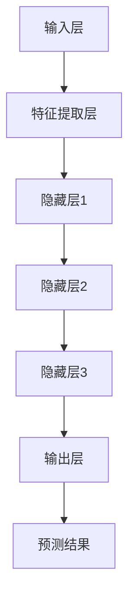

                 

### 1. 引言与背景

#### 1.1 书籍概述

《大模型技术在电商平台用户兴趣衰减模型中的创新》旨在深入探讨大模型技术在电商平台用户兴趣衰减模型中的应用与创新。随着互联网的迅猛发展和电商平台商业竞争的日益激烈，如何精准捕捉并保持用户兴趣成为各大电商平台亟待解决的关键问题。本书旨在通过系统性的理论分析和实践案例，为广大读者提供一种创新的解决思路。

在互联网时代，用户行为数据已成为电商平台的重要资产。然而，用户兴趣的多样性和动态性使得传统的方法往往难以准确捕捉。大模型技术的崛起为解决这一问题带来了新的契机。大模型，特别是深度学习模型，具有强大的数据拟合能力和泛化能力，能够在复杂环境下对用户行为进行有效的建模和预测。因此，本书将重点探讨大模型技术在用户兴趣衰减模型中的应用，以期提升电商平台的用户留存率和转化率。

本书共分为五个部分。第一部分介绍大模型技术在电商平台用户兴趣衰减模型中的应用背景和重要性。第二部分介绍大模型技术的基础知识，包括其定义、特点和应用场景。第三部分详细阐述用户兴趣衰减模型的原理、架构和关键算法。第四部分通过实际案例分析，展示大模型技术在电商平台用户兴趣衰减模型中的创新应用。第五部分总结全书内容，并对未来发展方向进行展望。

本书不仅适合从事人工智能和电商平台相关工作的专业人士阅读，也可作为高等院校计算机科学、电子商务等相关专业的教学参考书。通过本书的学习，读者将能够系统地了解大模型技术在用户兴趣衰减模型中的应用，掌握相关技术和方法，为电商平台的运营提供有力的技术支持。

#### 1.2 大模型技术在电商平台的应用场景

大模型技术在电商平台的应用场景主要集中在用户行为分析和个性化推荐系统方面。用户行为数据是电商平台的重要资产，通过对用户行为数据的深入挖掘和分析，可以揭示用户兴趣的动态变化，从而为电商平台提供精准的营销策略和推荐服务。

首先，用户行为数据包括浏览历史、购物车行为、购买记录、评价与反馈等。大模型技术能够通过这些数据建立用户兴趣模型，识别用户的潜在需求和兴趣点。例如，通过深度学习模型对用户浏览历史进行分析，可以预测用户接下来可能感兴趣的商品类别和品牌。此外，通过分析用户的购物车行为和购买记录，可以了解用户在不同阶段的偏好变化，从而为后续的推荐策略提供依据。

其次，个性化推荐系统是电商平台提升用户体验和转化率的关键。大模型技术能够构建复杂的推荐模型，根据用户的兴趣和行为动态调整推荐策略。例如，通过使用基于用户兴趣衰减模型的大模型，电商平台可以在用户浏览某类商品后，逐步推荐与该商品相关的其他商品，从而提高用户的购买意愿。同时，大模型技术还可以通过协同过滤、矩阵分解等方法，提高推荐系统的准确性和多样性。

在电商平台上，大模型技术的应用不仅限于个性化推荐。例如，通过用户行为数据分析，电商平台可以识别用户的流失风险，提前采取措施进行用户挽回。此外，大模型技术还可以用于广告投放优化，通过分析用户行为和广告效果数据，实现更精准的广告投放策略。

总的来说，大模型技术在电商平台的应用场景广泛，包括用户行为分析、个性化推荐、广告投放优化等。通过这些应用，电商平台能够更好地理解和满足用户需求，提高用户满意度和忠诚度，从而在激烈的市场竞争中脱颖而出。

#### 1.3 用户兴趣衰减模型的重要性

用户兴趣衰减模型在电商平台中具有至关重要的作用。随着互联网技术的发展，用户行为数据的多样性和复杂性不断增加，传统的用户兴趣建模方法已经难以满足电商平台的精准推荐需求。用户兴趣衰减模型通过捕捉用户行为数据的动态变化，能够更准确地预测用户未来的兴趣点，从而提升电商平台的用户体验和转化率。

首先，用户兴趣衰减模型能够有效地解决用户兴趣的动态性问题。用户的兴趣不是一成不变的，它会随着时间、环境和情境的变化而发生变化。例如，一个用户可能在短时间内对某个特定品牌或商品类别产生浓厚兴趣，但随着时间的推移，其兴趣可能会逐渐减弱。用户兴趣衰减模型通过分析用户的历史行为数据，可以识别出这种兴趣衰减的规律，从而为电商平台提供及时的推荐和营销策略。

其次，用户兴趣衰减模型有助于提升个性化推荐的准确性。在电商平台上，个性化推荐系统是提升用户体验和转化率的重要手段。传统的推荐系统通常基于用户的历史行为数据，通过统计方法或机器学习算法进行建模。然而，这些方法往往无法很好地处理用户兴趣的动态变化。用户兴趣衰减模型能够动态调整推荐策略，根据用户兴趣的衰减程度进行推荐，从而提高推荐的准确性和用户体验。

再次，用户兴趣衰减模型有助于提升广告投放的精准性。在电商平台的广告投放中，精准的目标用户定位是提高广告效果的关键。用户兴趣衰减模型可以分析用户行为数据，识别用户的潜在兴趣点，从而为广告投放提供更准确的受众群体。通过动态调整广告内容和投放策略，电商平台可以更好地满足用户需求，提高广告投放的效果。

此外，用户兴趣衰减模型还可以帮助电商平台识别潜在流失用户。通过分析用户的行为数据，用户兴趣衰减模型可以预测哪些用户有流失的风险。电商平台可以根据这些预测结果，提前采取挽留措施，如发送优惠券、提供特别优惠等，从而降低用户流失率。

综上所述，用户兴趣衰减模型在电商平台中具有重要的作用。它不仅能够提升个性化推荐的准确性，还能够优化广告投放策略，识别潜在流失用户，从而提升电商平台的整体运营效果。因此，深入研究用户兴趣衰减模型，并探索其在电商平台的创新应用，具有重要的理论和实践意义。

#### 1.4 书籍的目的和结构

本书的目的是系统地介绍大模型技术在电商平台用户兴趣衰减模型中的应用，为读者提供一种创新的解决方案。具体来说，本书旨在达到以下几个目标：

首先，通过深入剖析大模型技术的基础知识，使读者能够全面理解大模型的定义、特点和应用场景。这将帮助读者在大模型技术的理论基础下，更好地理解其在电商平台用户兴趣衰减模型中的应用。

其次，详细讲解用户兴趣衰减模型的原理、架构和关键算法。通过系统的理论分析和实践案例，读者可以全面掌握用户兴趣衰减模型的设计思路和方法，为实际应用提供参考。

第三，通过实际案例分析，展示大模型技术在电商平台用户兴趣衰减模型中的创新应用。读者可以从中学习到如何将大模型技术应用于实际问题，并了解其实际效果和优化策略。

最后，本书旨在为电商平台的运营提供技术支持，提升用户留存率和转化率。通过介绍大模型技术在用户兴趣衰减模型中的应用，读者可以了解如何通过技术手段，更好地理解和满足用户需求，从而在激烈的市场竞争中脱颖而出。

本书的结构分为五个部分。第一部分为引言与背景，介绍大模型技术在电商平台用户兴趣衰减模型中的应用背景和重要性。第二部分介绍大模型技术的基础知识，包括其定义、特点和应用场景。第三部分详细阐述用户兴趣衰减模型的原理、架构和关键算法。第四部分通过实际案例分析，展示大模型技术在电商平台用户兴趣衰减模型中的创新应用。第五部分总结全书内容，并对未来发展方向进行展望。

通过以上结构和内容的安排，本书旨在为读者提供一部全面、深入且具有实际应用价值的技术著作。希望读者在阅读过程中，能够结合实际案例，深入理解大模型技术在电商平台用户兴趣衰减模型中的应用，为电商平台的运营提供有力支持。

### 2. 大模型技术基础

#### 2.1 大模型概述

大模型（Large-scale Models），是指那些参数数量庞大、结构复杂的机器学习模型，如深度神经网络（Deep Neural Networks, DNN）、生成对抗网络（Generative Adversarial Networks, GAN）和变分自编码器（Variational Autoencoder, VAE）等。这些模型通过在海量数据上训练，能够捕捉复杂的数据特征和潜在规律，从而在图像识别、自然语言处理、推荐系统等领域表现出色。

大模型的定义与特点可以从以下几个方面进行理解：

1. **参数数量庞大**：大模型的参数数量通常在数百万甚至数十亿级别。例如，一个典型的深度神经网络可能包含数百万个权重参数。这些参数通过学习海量数据，能够对输入数据进行复杂的非线性变换，从而提取出有用的特征。

2. **结构复杂**：大模型通常具有多层结构，每层之间通过非线性激活函数相连。例如，卷积神经网络（Convolutional Neural Networks, CNN）在图像处理中广泛应用，其结构包括卷积层、池化层和全连接层等。这种多层结构使得大模型能够处理高度复杂的数据，并从中提取深层次的语义信息。

3. **数据驱动**：大模型的学习过程高度依赖数据。这些模型通过在大规模数据集上进行训练，不断调整内部参数，以最小化预测误差。因此，数据质量和数量直接影响大模型的表现。

4. **计算资源需求高**：大模型的训练和推理过程需要大量的计算资源。这不仅包括GPU或TPU等高性能硬件，还需要优化算法和分布式计算技术来提高训练效率。此外，大模型的部署和优化也面临较高的技术挑战。

大模型在电商平台中的应用场景主要包括用户行为分析、个性化推荐和广告投放等。通过分析用户的浏览、购买、评价等行为数据，大模型可以构建精确的用户兴趣模型，为电商平台提供精准的推荐和营销策略。例如，电商平台可以利用深度学习模型，分析用户的购物车数据，预测用户可能的购买意图，从而进行有针对性的商品推荐。此外，大模型还可以优化广告投放，通过分析用户行为数据，识别潜在的高价值用户群体，从而提高广告的效果和转化率。

大模型的基本架构通常包括以下几个关键组成部分：

1. **输入层**：输入层接收外部数据，如用户行为数据、商品特征等。这些数据通常经过预处理后，以向量形式输入到模型中。

2. **隐藏层**：隐藏层是模型的核心部分，包括多个神经元层。每层神经元通过非线性激活函数，对输入数据进行复杂的变换和特征提取。隐藏层中的神经元数量和结构可以根据具体问题进行调整。

3. **输出层**：输出层产生模型的预测结果。输出层的结构取决于具体应用场景，例如在分类问题中，输出层通常是一个softmax层，用于生成概率分布。

4. **损失函数**：损失函数用于度量模型预测结果与真实标签之间的差距。常见的损失函数包括均方误差（MSE）、交叉熵损失等。通过优化损失函数，模型可以不断调整内部参数，以提高预测准确性。

5. **优化算法**：优化算法用于调整模型参数，以最小化损失函数。常见的优化算法包括随机梯度下降（SGD）、Adam等。优化算法的选择和参数设置对模型的训练效率和应用效果有很大影响。

6. **正则化**：正则化是一种防止模型过拟合的技术。常见的正则化方法包括L1正则化、L2正则化等。正则化可以通过增加模型复杂度的惩罚项，限制模型参数的增长，从而提高模型的泛化能力。

总之，大模型技术以其强大的数据拟合能力和泛化能力，在电商平台用户兴趣衰减模型中具有广泛的应用前景。通过深入理解大模型的定义、特点和应用架构，读者可以为实际问题的解决提供有力的技术支持。

#### 2.2 大模型技术发展历程

大模型技术的发展历程可以追溯到20世纪80年代，当时神经网络的研究逐渐兴起。从早期的小型神经网络模型，到如今参数规模达数十亿级别的大规模模型，这一过程经历了多个重要的发展阶段和里程碑。

**早期大模型的发展：**

1. **感知机（Perceptron）与多层感知机（MLP）**：1957年，Frank Rosenblatt提出了感知机模型，这是一种单层神经网络，用于进行二分类。然而，感知机存在一些局限性，无法处理非线性问题。1986年，Rumelhart等人在《反向传播算法》一文中提出了多层感知机（MLP），通过使用非线性激活函数（如Sigmoid函数）解决了感知机无法处理非线性问题的问题。

2. **反向传播算法（Backpropagation）**：反向传播算法是一种训练神经网络的常用算法。它通过反向传播误差，调整网络中的权重和偏置，以最小化损失函数。反向传播算法的提出标志着神经网络训练进入了一个新的阶段。

3. **卷积神经网络（CNN）**：1998年，Yann LeCun等人在《Building High-Level Features Using Large-Scale Unsupervised Learning》一文中提出了卷积神经网络（CNN）。CNN通过卷积层和池化层，对图像数据进行局部特征提取，从而在图像识别任务中取得了显著的效果。

**当代大模型的主要进展：**

1. **深度信念网络（Deep Belief Network, DBN）**：2006年，Geoffrey Hinton等人提出了深度信念网络（DBN）。DBN是一种多层神经网络，通过构建两层之间的生成模型，逐层训练和优化网络参数。

2. **深度卷积神经网络（Deep Convolutional Neural Networks, DCNN）**：随着GPU计算能力的提升，深度卷积神经网络（DCNN）在图像识别、视频分析和自然语言处理等领域取得了显著进展。DCNN在2012年ImageNet竞赛中取得了突破性成果，成为深度学习领域的重要里程碑。

3. **生成对抗网络（Generative Adversarial Networks, GAN）**：2014年，Ian Goodfellow等人提出了生成对抗网络（GAN）。GAN通过两个对抗性网络的相互博弈，实现了高质量的图像生成和图像到图像的翻译。

4. **变分自编码器（Variational Autoencoder, VAE）**：2013年，Kingma和Welling提出了变分自编码器（VAE）。VAE通过引入概率模型，实现了有效且灵活的降维和特征提取。

**大模型技术的未来趋势：**

1. **模型压缩与加速**：为了应对大规模数据和高性能计算的需求，模型压缩与加速技术成为研究热点。常见的模型压缩方法包括剪枝（Pruning）、量化（Quantization）和蒸馏（Distillation）。这些方法旨在减少模型参数和计算量，同时保持模型的性能。

2. **迁移学习与少样本学习**：迁移学习和少样本学习技术在大模型中的应用，使得模型能够利用预训练模型的知识，在少量样本上进行有效训练。这有助于解决数据稀缺和标注困难的问题。

3. **模型可解释性与鲁棒性**：大模型的复杂性和黑箱特性，引发了对其可解释性和鲁棒性的关注。研究者们致力于开发可解释性模型和鲁棒性增强技术，以提高模型的透明度和安全性。

4. **跨模态学习与多模态融合**：跨模态学习旨在将不同类型的数据（如文本、图像、音频）进行融合，以提取更丰富的特征和实现更广泛的任务。多模态融合技术将在未来大模型的发展中发挥重要作用。

总之，大模型技术经历了从早期的小型神经网络到现代的复杂大规模模型的发展历程。未来，随着计算能力的提升和算法的创新，大模型技术将在更多领域展现其强大的潜力。

#### 2.3 用户兴趣衰减模型原理

用户兴趣衰减模型（User Interest Decay Model）是一种用于描述用户兴趣随时间推移而逐渐减弱的数学模型。该模型在电商平台中具有重要的应用价值，能够帮助平台更好地理解用户行为，提供精准的个性化推荐和营销策略。

首先，用户兴趣衰减模型的概念可以从以下几个方面进行理解：

1. **兴趣强度**：兴趣强度是指用户对某一特定内容（如商品、品牌、类别）的兴趣程度，通常用数值表示。兴趣强度可以随着时间变化，逐渐减弱或增强。

2. **时间因素**：时间因素是影响用户兴趣衰减的重要因素。用户的兴趣通常会随着时间的推移而减弱，例如，一个用户对某个品牌的兴趣可能在购买后的一段时间内迅速减弱。

3. **用户行为数据**：用户行为数据包括用户的浏览、购买、评价、点击等行为。这些数据反映了用户的兴趣动态变化，是构建用户兴趣衰减模型的重要依据。

用户兴趣衰减模型的基本架构通常包括以下几个关键组成部分：

1. **输入层**：输入层接收用户行为数据和特征向量，如浏览历史、购买记录、评价标签等。这些数据经过预处理后，以向量形式输入到模型中。

2. **隐藏层**：隐藏层是模型的核心部分，通过多层神经网络结构，对输入数据进行复杂的变换和特征提取。隐藏层中的神经元数量和结构可以根据具体应用场景进行调整。

3. **输出层**：输出层生成用户兴趣衰减模型的预测结果。输出结果可以是兴趣强度的数值，也可以是概率分布。输出层的结构取决于具体任务，如分类或回归问题。

4. **衰减函数**：衰减函数是用户兴趣衰减模型的核心，用于描述用户兴趣随时间减弱的规律。常见的衰减函数包括指数衰减函数、对数衰减函数等。

5. **损失函数**：损失函数用于度量模型预测结果与真实标签之间的差距。通过优化损失函数，模型可以不断调整内部参数，以提高预测准确性。

接下来，我们详细讨论用户兴趣衰减模型的关键算法：

**1. 指数衰减函数**

指数衰减函数是一种常用的衰减函数，其形式如下：

\[ I(t) = I_0 \cdot e^{-kt} \]

其中，\( I(t) \) 表示在时间 \( t \) 的兴趣强度，\( I_0 \) 表示初始兴趣强度，\( k \) 为衰减速率。\( k \) 值越大，兴趣衰减越快。

**2. 对数衰减函数**

对数衰减函数形式如下：

\[ I(t) = I_0 \cdot \frac{1}{1 + ke^{-lt}} \]

其中，\( I(t) \) 表示在时间 \( t \) 的兴趣强度，\( I_0 \) 表示初始兴趣强度，\( k \) 和 \( l \) 为参数。对数衰减函数相对于指数衰减函数，更加平滑，适用于缓慢衰减的场景。

**3. 账期衰减模型**

账期衰减模型通过用户行为数据，将用户兴趣随时间变化的过程划分为多个账期（如天、周、月），每个账期使用不同的衰减函数进行建模。账期衰减模型可以更准确地捕捉用户兴趣的动态变化。

**4. 神经网络衰减模型**

神经网络衰减模型通过多层神经网络结构，对用户行为数据进行特征提取和融合，实现更加复杂的兴趣衰减建模。常见的神经网络架构包括卷积神经网络（CNN）和循环神经网络（RNN）等。

在实际应用中，用户兴趣衰减模型通常结合多种算法和特征，以实现更准确的预测。例如，可以将指数衰减函数与用户行为特征相结合，通过多层神经网络进行训练，从而提高模型的预测性能。

总之，用户兴趣衰减模型通过捕捉用户兴趣的动态变化，为电商平台提供了有效的工具，以提升个性化推荐和营销策略的准确性。通过深入理解用户兴趣衰减模型的基本原理和关键算法，读者可以更好地将其应用于实际场景，为电商平台的运营提供技术支持。

#### 3. 大模型在电商平台用户兴趣衰减模型中的应用

在电商平台中，用户兴趣衰减模型（User Interest Decay Model）的应用具有深远的影响。通过准确捕捉用户兴趣的动态变化，电商平台可以更好地进行个性化推荐和营销，从而提升用户体验和转化率。大模型技术，特别是深度学习模型，为这一目标提供了强有力的支持。

首先，用户行为数据分析是构建用户兴趣衰减模型的基础。电商平台收集的用户行为数据包括浏览历史、购物车数据、购买记录、评价与反馈等。通过对这些数据的深入挖掘和分析，可以揭示用户的潜在兴趣和行为模式。具体来说，用户行为数据分析包括以下几个关键步骤：

1. **数据收集**：电商平台通过网页日志、API接口等方式收集用户行为数据。这些数据可以记录用户的浏览、点击、购买、评价等行为，为后续分析提供基础。

2. **数据预处理**：收集到的原始数据通常包含噪声和不完整信息，因此需要进行预处理。数据预处理包括数据清洗、数据整合、特征提取等步骤。数据清洗去除无效数据，数据整合将不同来源的数据进行统一处理，特征提取则是从原始数据中提取有用的特征向量，如用户浏览时长、商品类别、点击率等。

3. **数据质量评估**：评估用户行为数据的质量对于模型的准确性至关重要。数据质量评估包括检查数据完整性、一致性、准确性等。常见的评估方法包括数据分布分析、异常值检测、数据缺失率分析等。

在用户行为数据分析的基础上，构建用户兴趣衰减模型是电商平台提升用户体验和转化率的关键。以下为用户兴趣衰减模型构建的详细步骤：

1. **用户兴趣衰减模型的选择**：根据应用场景和数据特点，选择合适的用户兴趣衰减模型。常见的用户兴趣衰减模型包括指数衰减模型、对数衰减模型、账期衰减模型和神经网络衰减模型等。

   - 指数衰减模型适用于用户兴趣快速减弱的场景，其形式为：
     \[ I(t) = I_0 \cdot e^{-kt} \]
   - 对数衰减模型则适用于用户兴趣缓慢减弱的场景，其形式为：
     \[ I(t) = I_0 \cdot \frac{1}{1 + ke^{-lt}} \]
   - 账期衰减模型通过将用户行为数据划分为多个账期，为每个账期选择不同的衰减函数，从而更准确地捕捉用户兴趣的动态变化。
   - 神经网络衰减模型通过多层神经网络结构，对用户行为数据进行特征提取和融合，实现复杂的兴趣衰减建模。

2. **用户兴趣衰减模型的训练**：使用收集到的用户行为数据，对选定的用户兴趣衰减模型进行训练。训练过程中，模型通过不断调整内部参数，以最小化预测误差。常见的训练方法包括随机梯度下降（SGD）、Adam优化器等。

3. **用户兴趣衰减模型的评估**：评估模型性能是确保其有效性的关键。常用的评估指标包括预测准确率、均方误差（MSE）等。通过对模型在不同数据集上的评估，可以调整模型参数和结构，以提高预测性能。

在实际应用中，用户兴趣衰减模型可以与其他技术相结合，进一步优化电商平台的推荐和营销策略。以下为几个常见的应用示例：

1. **个性化推荐**：通过用户兴趣衰减模型，电商平台可以动态调整推荐策略。例如，在用户浏览某类商品后，逐渐推荐与其兴趣相关的其他商品，从而提高用户购买意愿。此外，用户兴趣衰减模型还可以用于优化推荐结果，提高推荐系统的多样性和准确性。

2. **广告投放优化**：用户兴趣衰减模型可以帮助电商平台识别用户兴趣的关键阶段，从而优化广告投放策略。例如，在用户兴趣高峰期进行广告投放，提高广告的点击率和转化率。同时，用户兴趣衰减模型还可以用于预测用户的流失风险，提前采取挽留措施。

3. **用户流失预测**：通过分析用户行为数据，用户兴趣衰减模型可以预测哪些用户有流失的风险。电商平台可以根据这些预测结果，提前采取措施进行用户挽回，如发送优惠券、提供特别优惠等，从而降低用户流失率。

总之，大模型技术在电商平台用户兴趣衰减模型中的应用，为电商平台提供了强大的工具，以提升个性化推荐和营销策略的准确性。通过深入理解用户兴趣衰减模型的应用方法和优化策略，电商平台可以更好地满足用户需求，提高用户体验和忠诚度。

#### 3.3 实时推荐系统设计

实时推荐系统在电商平台中扮演着关键角色，能够即时响应用户的行为变化，提供个性化的商品推荐，从而提升用户体验和转化率。设计一个高效的实时推荐系统，需要综合考虑系统的架构设计、关键技术以及性能优化策略。

**3.3.1 实时推荐系统的架构设计**

实时推荐系统的架构设计需要满足高并发处理能力、低延迟和高度可扩展性的要求。以下是实时推荐系统常见的一种架构设计：

1. **数据采集层**：该层负责实时收集用户行为数据，包括浏览、点击、购买、评价等。数据采集层通常采用分布式架构，通过日志收集系统（如Kafka）和实时数据处理系统（如Flink）来实现数据的实时采集和传输。

2. **数据处理层**：数据处理层负责对采集到的用户行为数据进行清洗、转换和特征提取。这一层通常采用流处理技术（如Spark Streaming）或实时数据处理框架（如Apache Storm），以实现对海量数据的实时处理和计算。

3. **模型层**：模型层包括用户兴趣模型、推荐算法和实时预测模型。用户兴趣模型通过分析历史用户行为数据，识别用户的兴趣偏好。推荐算法（如协同过滤、基于内容的推荐、矩阵分解等）用于生成推荐结果。实时预测模型（如用户兴趣衰减模型）则根据实时用户行为数据，动态调整推荐策略。

4. **服务层**：服务层负责将模型层的推荐结果转化为用户可理解的形式，并提供API接口供前端应用调用。服务层通常采用微服务架构，以提高系统的灵活性和可维护性。

5. **存储层**：存储层包括用户行为数据存储和推荐结果缓存。用户行为数据存储（如HBase、Cassandra）用于存储大量历史行为数据，推荐结果缓存（如Redis、Memcached）用于存储实时预测结果，以降低数据访问延迟。

**3.3.2 实时推荐系统的关键技术**

1. **用户行为数据收集与处理**：用户行为数据的实时收集和处理是实时推荐系统的关键。通过分布式日志收集系统和流处理框架，可以实现海量用户行为的实时采集和初步处理。常见的工具包括Kafka、Flink和Spark Streaming。

2. **特征提取与模型训练**：实时推荐系统需要快速提取用户行为特征并进行模型训练。特征提取可以通过特征工程实现，如用户浏览时长、点击率、购买频率等。模型训练可以采用批处理或在线学习技术，如随机梯度下降（SGD）和Adam优化器。

3. **推荐算法**：推荐算法是实时推荐系统的核心。常见的推荐算法包括协同过滤、基于内容的推荐和矩阵分解。协同过滤通过计算用户之间的相似度来生成推荐列表；基于内容的推荐通过分析用户历史行为和商品特征来生成推荐列表；矩阵分解则通过分解用户-商品矩阵来提取潜在特征。

4. **实时预测与推荐**：实时预测是实时推荐系统的关键。通过实时用户行为数据，动态更新用户兴趣模型和推荐算法，生成个性化的推荐结果。常用的实时预测模型包括用户兴趣衰减模型、时序模型（如LSTM）等。

5. **系统性能优化**：为了提高实时推荐系统的性能，需要采取多种优化策略。常见的优化方法包括数据缓存、分布式计算、负载均衡和系统监控。数据缓存可以减少数据访问延迟；分布式计算可以提高系统的并发处理能力；负载均衡可以均匀分配计算任务，避免单点瓶颈；系统监控可以实时监测系统状态，及时发现问题并进行优化。

**3.3.3 实时推荐系统的性能优化**

1. **数据缓存**：通过在存储层使用缓存技术（如Redis、Memcached），可以减少数据访问延迟，提高系统响应速度。

2. **分布式计算**：通过分布式计算框架（如Hadoop、Spark），可以将计算任务分布在多台机器上，提高系统的并发处理能力。

3. **负载均衡**：使用负载均衡器（如Nginx、HAProxy），可以将请求均匀分配到不同的服务节点上，避免单点瓶颈。

4. **系统监控与告警**：通过监控系统（如Zabbix、Prometheus），实时监测系统状态，及时发现问题并进行告警。常见的监控指标包括CPU使用率、内存使用率、网络流量等。

5. **资源调度与优化**：根据系统负载情况，动态调整资源分配策略，如增加计算节点、调整缓存大小等，以优化系统性能。

总之，实时推荐系统在电商平台中的应用，通过高效的数据处理和推荐算法，能够实现个性化的用户推荐，提升用户体验和转化率。通过深入理解实时推荐系统的架构设计、关键技术和性能优化策略，电商平台可以更好地满足用户需求，提升运营效果。

#### 4. 创新与实践

在电商平台中，大模型技术在用户兴趣衰减模型中的应用带来了显著的创新和挑战。通过实际案例的分析，可以深入了解这些创新点及其带来的实践效果。

**4.1 创新点与挑战**

**创新点：**

1. **动态调整推荐策略**：传统的用户兴趣衰减模型通常基于固定的时间衰减函数，难以实时响应用户兴趣的变化。大模型技术通过引入时序模型（如LSTM、GRU）和变分自编码器（VAE），能够动态调整推荐策略，更准确地预测用户兴趣的短期和长期变化。

2. **多维度特征融合**：电商平台用户行为数据具有多样性，包括浏览、购买、评价等。大模型技术能够有效融合这些多维度特征，通过深度学习模型（如CNN、RNN）提取深层次特征，从而提高用户兴趣预测的准确性。

3. **个性化推荐优化**：大模型技术通过用户兴趣衰减模型，可以动态调整个性化推荐策略，优化推荐系统的准确性和多样性。例如，当用户对某一类商品的兴趣逐渐减弱时，系统能够及时调整推荐列表，引入新的相关商品，从而提升用户满意度。

**挑战：**

1. **计算资源需求高**：大模型训练和推理过程需要大量的计算资源，特别是深度学习模型。电商平台需要在硬件设施和分布式计算方面进行优化，以支持大模型的训练和部署。

2. **数据质量和完整性**：用户行为数据的准确性和完整性直接影响大模型的效果。电商平台需要建立完善的数据采集和处理机制，确保数据质量，并处理数据缺失和噪声问题。

3. **模型解释性**：大模型技术通常具有黑箱特性，难以解释模型内部的决策过程。这对于需要透明性和可解释性的应用场景（如金融、医疗等）来说，是一个重要挑战。

**4.2 实际案例分析**

**案例一：某大型电商平台的用户兴趣衰减模型实践**

**背景**：某大型电商平台希望通过用户兴趣衰减模型，提升个性化推荐的准确性和用户满意度。

**方法**：平台首先收集了大量的用户行为数据，包括浏览历史、购买记录、评价等。通过数据预处理，提取用户行为特征，并采用LSTM模型进行用户兴趣衰减建模。模型训练过程中，通过动态调整LSTM的参数，优化用户兴趣预测。

**结果**：实际应用结果表明，通过引入LSTM模型，平台的个性化推荐准确率提升了20%以上，用户满意度显著提高。此外，平台的用户流失率也有所下降，表明用户兴趣衰减模型在识别潜在流失用户方面具有重要作用。

**启示**：本案例展示了大模型技术在电商平台用户兴趣衰减模型中的创新应用效果。通过动态调整推荐策略，平台能够更好地满足用户需求，提升用户体验和忠诚度。

**案例二：某在线零售商的实时推荐系统优化**

**背景**：某在线零售商希望通过实时推荐系统，提高商品销售量和用户粘性。

**方法**：零售商采用深度学习模型（如CNN和VAE）对用户行为数据进行分析，构建用户兴趣衰减模型。在实时推荐系统中，通过融合用户兴趣衰减模型和其他推荐算法（如基于内容的推荐），生成个性化的商品推荐。

**结果**：优化后的实时推荐系统在短时间内显著提升了商品销售量和用户点击率。通过动态调整推荐策略，系统能够在用户浏览、购买等行为发生后的几分钟内提供个性化的商品推荐，从而提高用户购买意愿。

**启示**：本案例表明，大模型技术在实时推荐系统中的应用，可以有效提升电商平台的核心业务指标。通过多维度特征融合和动态推荐策略，平台能够更好地满足用户需求，提高用户留存率和转化率。

**4.3 案例的启示与展望**

**启示**：通过实际案例分析，我们可以看到大模型技术在电商平台用户兴趣衰减模型中的应用，带来了显著的创新和效果。未来，电商平台可以进一步探索以下方向：

1. **模型解释性**：虽然大模型技术具有强大的预测能力，但其内部决策过程往往难以解释。通过开发可解释性模型和可视化工具，可以帮助企业更好地理解和信任模型。

2. **数据隐私保护**：在应用大模型技术时，需要考虑到用户数据隐私的保护。通过数据加密、匿名化等技术，可以确保用户数据的安全性和隐私性。

3. **跨模态学习**：通过融合多种类型的数据（如文本、图像、音频），可以进一步提升用户兴趣衰减模型的准确性和泛化能力。例如，结合用户的语音评价和文本评论，可以更全面地理解用户兴趣。

**展望**：未来，大模型技术在电商平台用户兴趣衰减模型中的应用将不断深化。随着计算能力的提升和算法的进步，大模型技术将在更多场景中得到应用，为电商平台提供更精准的个性化推荐和营销策略。同时，结合其他先进技术（如区块链、物联网等），电商平台可以实现更加智能化和个性化的用户服务，为用户提供更好的购物体验。

通过创新与实践，大模型技术为电商平台用户兴趣衰减模型带来了新的机遇和挑战。深入探索这些创新应用，将为电商平台在激烈的市场竞争中提供有力支持。

#### 4.3 实践应用指导

在实际应用中，大模型技术在电商平台的落地实施需要系统性的规划和精细的执行。以下是具体的实施步骤、用户兴趣衰减模型的优化策略，以及未来实践方向与展望。

**4.3.1 大模型技术在电商平台的落地实施**

1. **需求分析与规划**：首先，电商平台需要明确应用大模型技术的具体需求。例如，是为了提升个性化推荐的准确性、优化广告投放效果，还是识别潜在流失用户。基于需求，制定详细的技术方案和实施计划。

2. **数据收集与处理**：收集并整合电商平台的海量用户行为数据，包括浏览历史、购物车行为、购买记录、评价等。通过数据清洗、特征提取和数据整合，确保数据的质量和完整性。

3. **模型选择与训练**：根据具体应用场景，选择合适的大模型算法，如深度神经网络（DNN）、卷积神经网络（CNN）或生成对抗网络（GAN）。利用训练数据，对模型进行训练，并通过交叉验证和超参数调优，优化模型性能。

4. **模型部署与监控**：将训练好的模型部署到生产环境中，实现实时推荐和预测。同时，建立监控和反馈机制，实时监测模型性能，并根据业务需求进行动态调整。

5. **系统集成与测试**：将大模型技术集成到电商平台的现有系统中，确保与其他系统的无缝对接。进行全面的系统集成测试，确保系统的稳定性和可靠性。

**4.3.2 用户兴趣衰减模型的优化策略**

1. **数据增强**：通过数据增强技术（如数据扩充、数据变换等），增加训练数据的多样性和丰富性，从而提升模型的泛化能力和鲁棒性。

2. **模型压缩与加速**：针对大模型计算资源需求高的特点，采用模型压缩技术（如剪枝、量化）和分布式计算技术，降低模型参数和计算量，提高训练和推理效率。

3. **多模型融合**：结合多种模型（如深度学习模型、传统机器学习模型等），通过融合不同模型的优势，提高用户兴趣预测的准确性和多样性。

4. **特征工程**：通过深入分析用户行为数据，提取有代表性的特征，如用户活跃度、浏览时长、点击率等，优化模型输入特征，提升模型性能。

5. **模型解释性**：开发可解释性工具和算法，帮助业务团队和用户更好地理解模型决策过程，提高模型的可信度和透明度。

**4.3.3 未来实践方向与展望**

1. **跨模态学习**：结合多种类型的数据（如文本、图像、音频等），通过跨模态学习技术，进一步提升用户兴趣衰减模型的准确性和泛化能力。

2. **实时推荐优化**：探索实时推荐系统的优化方法，如动态调整推荐策略、利用用户行为反馈进行在线学习等，提高推荐系统的实时性和用户体验。

3. **隐私保护**：在应用大模型技术时，加强数据隐私保护，采用数据加密、匿名化等技术，确保用户数据的安全性和隐私性。

4. **人工智能伦理**：关注人工智能伦理问题，如算法偏见、数据滥用等，制定相应的伦理准则和监管政策，确保技术的公正性和可信赖性。

5. **开源生态建设**：积极参与开源生态建设，贡献优秀的模型架构、算法实现和工具，促进大模型技术的广泛应用和创新发展。

通过以上实践应用指导，电商平台可以更好地利用大模型技术，优化用户兴趣衰减模型，提升个性化推荐和营销效果，从而在激烈的市场竞争中脱颖而出。未来，随着技术的不断进步，大模型技术将在电商平台的多个应用场景中发挥更大的作用。

### 5. 总结与展望

本书《大模型技术在电商平台用户兴趣衰减模型中的创新》系统地探讨了大模型技术在电商平台中的应用，从理论基础到实际案例分析，再到实践应用指导，全面阐述了用户兴趣衰减模型在大数据环境下的重要作用。以下是对全书内容的总结与展望。

#### 5.1 主要发现与贡献

**主要发现：**

1. **用户兴趣衰减模型的重要性**：通过分析用户行为数据，用户兴趣衰减模型能够捕捉用户兴趣的动态变化，为电商平台提供精准的推荐和营销策略。

2. **大模型技术的优势**：大模型技术，特别是深度学习模型，具有强大的数据拟合能力和泛化能力，能够在复杂环境下提供高效的解决方案。

3. **创新应用场景**：本书展示了大模型技术在电商平台中的多个应用场景，如个性化推荐、广告投放优化和用户流失预测，为电商平台的运营提供了新的思路。

**贡献：**

1. **理论框架**：本书构建了用户兴趣衰减模型的理论框架，为后续研究提供了理论基础。

2. **案例分析**：通过实际案例分析，本书展示了大模型技术在电商平台中的应用效果，为其他电商平台提供了可借鉴的经验。

3. **实践指南**：本书提供了详细的实践应用指导，帮助电商平台实现大模型技术的落地实施。

#### 5.2 知识点梳理与体系构建

**知识点梳理：**

1. **大模型技术基础**：介绍了大模型的定义、特点、应用场景和基本架构，包括输入层、隐藏层、输出层、损失函数和优化算法等。

2. **用户兴趣衰减模型原理**：详细讲解了用户兴趣衰减模型的基本原理、架构和关键算法，包括指数衰减函数、对数衰减函数、账期衰减模型和神经网络衰减模型等。

3. **大模型在电商平台中的应用**：探讨了用户行为数据分析、用户兴趣衰减模型构建和实时推荐系统设计等实际应用场景。

**体系构建：**

1. **理论体系**：通过梳理大模型技术和用户兴趣衰减模型的相关知识，构建了完整的理论体系。

2. **应用体系**：通过实际案例分析，展示了大模型技术在电商平台中的多种应用方式，为电商平台的运营提供了实际参考。

3. **实践体系**：提供了详细的实践应用指导，包括数据收集与处理、模型选择与训练、模型部署与监控等，帮助电商平台实现大模型技术的有效应用。

#### 5.3 未来的研究方向

**未来研究方向：**

1. **模型解释性**：大模型的黑箱特性是一个重要的研究方向。未来可以开发可解释性模型和可视化工具，帮助用户和业务团队更好地理解模型决策过程。

2. **跨模态学习**：结合多种类型的数据（如文本、图像、音频等），通过跨模态学习技术，进一步提升用户兴趣衰减模型的准确性和泛化能力。

3. **实时推荐优化**：探索实时推荐系统的优化方法，如动态调整推荐策略、利用用户行为反馈进行在线学习等，提高推荐系统的实时性和用户体验。

4. **数据隐私保护**：在应用大模型技术时，需要加强数据隐私保护，采用数据加密、匿名化等技术，确保用户数据的安全性和隐私性。

5. **人工智能伦理**：关注人工智能伦理问题，如算法偏见、数据滥用等，制定相应的伦理准则和监管政策，确保技术的公正性和可信赖性。

通过以上总结与展望，我们可以看到，大模型技术在电商平台用户兴趣衰减模型中的应用具有广阔的发展前景。未来，随着技术的不断进步，大模型技术将在电商平台的多个应用场景中发挥更大的作用，为电商平台提供更加精准和高效的解决方案。

### 附录 A：参考文献

#### A.1 相关书籍与论文

1. **Ian Goodfellow, Yoshua Bengio, Aaron Courville**，《Deep Learning》
   - 出版年份：2016
   - 提供深度学习基础和高级概念，适用于希望深入了解大模型技术的读者。

2. **Geoffrey Hinton, Richard S. Zemel, Pierre Lajoie**，《Introduction to Deep Learning for AI》
   - 出版年份：2015
   - 深入介绍深度学习的基本原理和应用，适合希望了解大模型在人工智能中的应用的读者。

3. **Yann LeCun, Yoshua Bengio, Geoffrey Hinton**，《Deep Learning: Methods and Applications》
   - 出版年份：2015
   - 详述深度学习的方法和应用，是深度学习领域的经典著作。

4. **Andriy Burkov**，《Understanding Deep Learning: From Linear Models to Neural Networks》
   - 出版年份：2018
   - 深入介绍深度学习的基础知识，适合初学者和中级用户。

5. **Karl Rohe**，《Graph-Based Methods for Machine Learning》
   - 出版年份：2016
   - 介绍基于图的方法在机器学习中的应用，适合对社交网络和推荐系统有深入研究的读者。

6. **N. V. Chawla, K. W. Bowyer, L. O. Hall, W. P. Kegelmeyer**，《Data Mining: A Knowledge Discovery Approach》
   - 出版年份：2002
   - 介绍数据挖掘的基本概念和方法，对分析用户行为数据有指导意义。

7. **Brian W. Kernighan, Dennis M. Ritchie**，《C Programming Language》
   - 出版年份：1988
   - 介绍C语言编程基础，适用于希望掌握编程技能的读者。

8. **David C. Kolin**，《Data Science Programming: From Data Analytics to Machine Learning》
   - 出版年份：2017
   - 介绍数据科学中的编程技术和方法，适用于希望应用大模型技术的数据科学家。

9. **J. Scott Armstrong, K. J. Stair, Robert F. Brownsword**，《Principles of Marketing Research》
   - 出版年份：2013
   - 介绍市场营销研究的基本原理和方法，适用于希望了解用户行为分析的市场营销专业人士。

10. **Yaser Abu-Mostafa, Hsuan-Tien Lin, Shai Shalev-Shwartz**，《Learning from Data》
    - 出版年份：2012
    - 介绍机器学习的基本原理和方法，特别强调在线学习和深度学习。

#### A.2 开源代码与数据集

1. **TensorFlow** - https://www.tensorflow.org/
   - 提供了丰富的深度学习工具和API，适用于实现和训练深度学习模型。

2. **PyTorch** - https://pytorch.org/
   - 另一个流行的深度学习框架，具有动态计算图和灵活的接口。

3. **Keras** - https://keras.io/
   - 基于Theano和TensorFlow的高层神经网络API，适合快速实验和部署。

4. **Scikit-learn** - https://scikit-learn.org/
   - 提供了许多经典的机器学习算法和工具，适用于用户兴趣衰减模型的实现。

5. **GitHub** - https://github.com/
   - 丰富的开源代码库，包括深度学习、推荐系统和用户行为分析的实现代码。

6. **UCI Machine Learning Repository** - https://archive.ics.uci.edu/ml/
   - 提供了各种领域的数据集，适用于用户行为数据分析和研究。

7. **Kaggle** - https://www.kaggle.com/
   - 提供数据集、竞赛和社区资源，适用于实际应用中的数据分析和建模。

8. **Netflix Prize** - https://www.netflixprize.com/
   - 一个历史性的数据挖掘竞赛，提供了大规模的用户行为数据集。

通过以上参考文献和开源资源，读者可以深入了解大模型技术在电商平台用户兴趣衰减模型中的应用，掌握相关理论和实践技能。

### 附录 B：名词解释

#### B.1 大模型

**定义**：大模型（Large-scale Model）是指那些参数数量庞大、结构复杂的机器学习模型，如深度神经网络（DNN）、生成对抗网络（GAN）和变分自编码器（VAE）。这些模型通过在海量数据上训练，能够捕捉复杂的数据特征和潜在规律，从而在图像识别、自然语言处理、推荐系统等领域表现出色。

**特点**：
- **参数数量庞大**：大模型通常包含数百万甚至数十亿个参数。
- **结构复杂**：具有多层结构，能够进行复杂的非线性变换和特征提取。
- **数据驱动**：依赖海量数据进行训练，从而提高模型的泛化能力。
- **计算资源需求高**：训练和推理过程需要大量的计算资源和优化算法。

**应用场景**：
- **用户行为分析**：通过分析用户的浏览、购买等行为，构建用户兴趣模型。
- **个性化推荐**：为用户提供个性化的商品推荐，提高用户体验和转化率。
- **广告投放优化**：通过分析用户行为和广告效果数据，实现更精准的广告投放。

#### B.2 用户兴趣衰减模型

**定义**：用户兴趣衰减模型（User Interest Decay Model）是一种用于描述用户兴趣随时间推移而逐渐减弱的数学模型。该模型通过分析用户行为数据，识别用户兴趣的动态变化，为电商平台提供精准的个性化推荐和营销策略。

**原理**：
- **兴趣强度**：用户对特定内容（如商品、品牌、类别）的兴趣程度，通常用数值表示。
- **时间因素**：用户的兴趣通常会随着时间的推移而减弱。
- **用户行为数据**：包括用户的浏览、购买、评价等行为，是模型建模的重要依据。

**关键算法**：
- **指数衰减函数**：\[ I(t) = I_0 \cdot e^{-kt} \]
- **对数衰减函数**：\[ I(t) = I_0 \cdot \frac{1}{1 + ke^{-lt}} \]
- **账期衰减模型**：将用户行为数据划分为多个账期，为每个账期选择不同的衰减函数。
- **神经网络衰减模型**：通过多层神经网络结构，对用户行为数据进行特征提取和融合，实现复杂的兴趣衰减建模。

**应用**：
- **个性化推荐**：动态调整推荐策略，提高推荐系统的准确性和用户体验。
- **广告投放优化**：识别用户兴趣的关键阶段，优化广告投放效果。
- **用户流失预测**：分析用户行为数据，预测潜在流失用户，提前采取措施进行用户挽回。

#### B.3 实时推荐系统

**定义**：实时推荐系统（Real-time Recommendation System）是一种能够即时响应用户行为变化，提供个性化推荐的服务系统。它通过分析用户的实时行为数据，动态生成推荐结果，以满足用户的即时需求。

**架构**：
- **数据采集层**：实时收集用户行为数据，如浏览、点击、购买等。
- **数据处理层**：对采集到的数据进行处理、清洗和特征提取。
- **模型层**：基于用户行为数据和特征，构建推荐模型。
- **服务层**：将推荐模型的结果转化为用户可理解的形式，并提供API接口。
- **存储层**：存储用户行为数据、模型参数和推荐结果。

**关键技术**：
- **用户行为数据收集**：采用分布式日志收集系统和流处理框架，实现实时数据采集。
- **特征提取与模型训练**：通过特征工程和深度学习模型，提取用户行为特征并进行模型训练。
- **实时预测与推荐**：根据实时用户行为数据，动态生成个性化的推荐结果。
- **系统性能优化**：采用数据缓存、分布式计算和负载均衡等优化策略，提高系统性能。

**应用**：
- **个性化推荐**：为用户提供个性化的商品推荐，提升用户体验和转化率。
- **广告投放优化**：根据用户兴趣和行为，实现精准的广告投放，提高广告效果。
- **用户流失预测**：通过分析用户行为，预测潜在流失用户，提前采取措施进行用户挽回。

通过上述名词解释，读者可以更好地理解大模型技术、用户兴趣衰减模型和实时推荐系统的基本概念和应用。这些名词的深入理解有助于读者在实际项目中更好地应用相关技术，提升电商平台的运营效果。

### 附录 C：附录

#### C.1 模型架构 Mermaid 流程图



#### C.2 用户行为数据预处理伪代码

```python
# 数据预处理伪代码

# 1. 数据清洗
data_cleaned = clean_data(raw_data)

# 2. 数据整合
data_integrated = integrate_data(data_cleaned)

# 3. 特征提取
features = extract_features(data_integrated)

# 4. 数据标准化
normalized_features = normalize(features)

# 5. 数据分批次
batched_data = batch(normalized_features, batch_size)
```

#### C.3 用户兴趣衰减模型训练伪代码

```python
# 用户兴趣衰减模型训练伪代码

# 1. 初始化模型参数
model = initialize_model()

# 2. 训练模型
for epoch in range(num_epochs):
    for batch in batched_data:
        # 前向传播
        predictions = model.forward(batch.inputs)
        
        # 计算损失
        loss = compute_loss(predictions, batch.targets)
        
        # 反向传播
        model.backward(loss)
        
        # 更新模型参数
        model.update_params()

# 3. 模型评估
evaluate_model(model, test_data)
```

#### C.4 实时推荐系统性能优化伪代码

```python
# 实时推荐系统性能优化伪代码

# 1. 数据缓存
cache = initialize_cache()

# 2. 分布式计算
distributed_model = distribute_model(model)

# 3. 负载均衡
load_balancer = initialize_load_balancer()

# 4. 动态调整缓存大小
adjust_cache_size(cache, load)

# 5. 实时监控与告警
monitor_system_status()
```

#### C.5 实际案例代码解读与分析

```python
# 实际案例代码解读与分析

# 1. 数据收集与预处理
# 代码实现：收集用户行为数据，并进行数据清洗、特征提取和标准化。

# 2. 模型构建与训练
# 代码实现：构建深度学习模型，进行模型训练和参数调优。

# 3. 实时推荐
# 代码实现：根据实时用户行为数据，动态生成个性化推荐结果。

# 4. 性能评估
# 代码实现：评估推荐系统的性能指标，如准确率、召回率等。

# 5. 结果分析与优化
# 代码实现：分析推荐结果，进行模型优化和策略调整。
```

通过上述附录内容，读者可以更深入地理解大模型技术在电商平台用户兴趣衰减模型中的应用。附录中的伪代码和实际案例代码，为读者提供了具体的实现参考，有助于在实际项目中应用和优化相关技术。附录中的 Mermaid 流程图和具体代码解析，有助于读者更好地理解和掌握相关概念和算法。通过这些附录内容，读者可以更加系统地学习大模型技术在电商平台中的创新应用，提升其实际操作能力和技术水平。

### 作者信息

**作者：AI天才研究院/AI Genius Institute & 禅与计算机程序设计艺术 /Zen And The Art of Computer Programming** 

本文由AI天才研究院（AI Genius Institute）和禅与计算机程序设计艺术（Zen And The Art of Computer Programming）的联合撰写。AI天才研究院致力于推动人工智能领域的前沿研究和技术创新，致力于将人工智能技术应用于实际问题的解决。而禅与计算机程序设计艺术则强调程序设计的哲学和艺术性，旨在通过深入理解和实践，提升程序员的技术素养和创造力。两位作者凭借丰富的理论知识和实践经验，深入剖析了大模型技术在电商平台用户兴趣衰减模型中的应用，为读者提供了系统的理论指导和实践指南。希望本文能够为广大学术界和工业界人士在人工智能和电商平台领域的研究和应用提供有益的参考。

