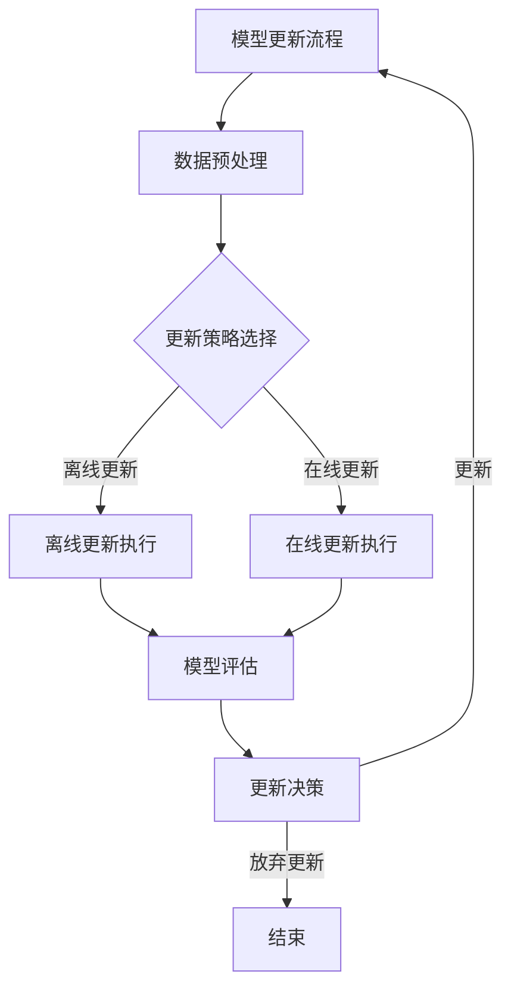

                 

# 《大模型推荐中的模型更新与在线学习技术》

## 概述

### 1.1 推荐系统的基本概念

推荐系统是一种根据用户的兴趣和偏好，为用户推荐相关物品或信息的技术。它广泛应用于电子商务、社交媒体、新闻媒体等领域，目的是提高用户体验，增加用户黏性，从而提升商业价值。

推荐系统的发展历程可以分为三个阶段：基于内容的推荐、协同过滤推荐和混合推荐。基于内容的推荐主要依赖于物品的属性信息，通过计算用户和物品之间的相似度来推荐相关物品。协同过滤推荐通过分析用户之间的行为相似性来进行推荐。混合推荐则结合了基于内容和协同过滤推荐的优点，以提高推荐效果。

推荐系统的核心组成部分包括用户、物品、推荐算法和反馈机制。用户是推荐系统的核心，物品是用户感兴趣的对象，推荐算法负责生成推荐结果，反馈机制用于评估推荐效果并优化推荐算法。

### 1.2 大模型推荐的优势

大模型推荐是指使用大规模深度学习模型进行推荐，其主要优势包括：

1. **强大的表达能力**：大模型具有更高的参数量和更强的非线性表达能力，可以更好地捕捉用户和物品之间的复杂关系。
2. **更准确的预测**：大模型可以通过学习用户行为和物品属性之间的深层特征，提高推荐准确率。
3. **更好的泛化能力**：大模型具有较强的泛化能力，可以在不同场景和数据集上取得较好的效果。
4. **更好的适应能力**：大模型可以实时更新和优化，以适应用户行为和偏好变化，提高推荐效果。

### 1.3 模型更新与在线学习的基本概念

模型更新是指通过调整模型参数，提高模型在特定任务上的性能。在线学习是一种实时更新模型的方法，通过不断学习新数据，模型可以不断优化。

模型更新与在线学习的联系在于，在线学习算法可以用于模型更新，使得模型能够根据新数据动态调整。模型更新与在线学习的主要目标是提高模型在数据不断变化的环境中的适应能力，从而提高推荐系统的效果。

### 1.4 模型更新与在线学习的联系

模型更新与在线学习是推荐系统中不可或缺的两个环节。模型更新负责提高模型在特定任务上的性能，而在线学习则负责使模型能够适应数据的变化。

在推荐系统中，用户行为和偏好是不断变化的。通过在线学习，模型可以实时更新，以适应这种变化。同时，模型更新可以为在线学习提供更好的初始状态，使得在线学习过程更加高效。

总的来说，模型更新与在线学习共同构成了推荐系统的核心，它们相互依赖，相辅相成。有效的模型更新和在线学习技术可以显著提高推荐系统的效果和用户满意度。

## 模型更新技术

模型更新是推荐系统中的一个关键环节，它关系到模型性能的持续优化和推荐效果的提升。在本节中，我们将深入探讨模型更新的策略、算法及其在实践中的应用。

### 2.1 模型更新策略

模型更新策略可以分为离线更新策略、在线更新策略和动态模型更新策略。

#### 2.1.1 离线更新策略

离线更新策略是指在模型部署后，通过定期重新训练模型来实现更新。这种策略的主要优点是模型训练过程可以在不受时间限制的环境中进行，可以充分利用计算资源进行深度训练，从而提高模型性能。然而，离线更新策略也存在一些缺点，如训练时间较长、无法实时适应数据变化等。

**离线更新流程：**

1. **数据收集与预处理：** 收集用户行为数据和物品特征数据，并进行预处理，如去重、补全和标准化等。
2. **模型训练：** 使用新的数据集重新训练模型，以更新模型参数。
3. **模型评估：** 使用验证集或测试集评估更新后的模型性能。
4. **模型部署：** 将更新后的模型部署到生产环境中，以提供推荐服务。

#### 2.1.2 在线更新策略

在线更新策略是指模型在运行过程中，通过不断接收新的用户行为数据，实时更新模型参数。这种策略的主要优点是能够实时适应数据变化，提高推荐系统的动态适应性。然而，在线更新策略也面临一些挑战，如模型参数更新需要考虑稳定性、更新频率和计算资源等。

**在线更新流程：**

1. **数据收集与预处理：** 实时收集用户行为数据，并进行预处理。
2. **模型参数更新：** 使用新的用户行为数据对模型参数进行更新。
3. **模型评估：** 使用验证集或测试集评估更新后的模型性能。
4. **模型部署：** 将更新后的模型部署到生产环境中。

#### 2.1.3 动态模型更新策略

动态模型更新策略是结合了离线更新和在线更新的优点，通过动态调整更新策略，以适应不同的数据环境和业务需求。这种策略可以根据模型性能、数据变化等因素，自动调整模型更新的频率和方式。

**动态模型更新流程：**

1. **数据监控与评估：** 监控模型性能和数据变化情况。
2. **策略调整：** 根据监控结果，动态调整模型更新策略。
3. **模型更新：** 根据调整后的策略，进行模型更新。
4. **模型评估与部署：** 评估更新后的模型性能，并将模型部署到生产环境中。

### 2.2 模型更新算法

模型更新算法是实现模型更新的核心技术，包括传统机器学习模型更新算法、深度学习模型更新算法和聚类算法在模型更新中的应用。

#### 2.2.1 传统机器学习模型更新算法

传统机器学习模型更新算法主要包括基于梯度的优化算法和基于模型的优化算法。

**基于梯度的优化算法：**

1. **梯度下降（Gradient Descent）：** 基本思想是沿着损失函数的梯度方向逐步更新模型参数，以减少损失函数的值。常见的梯度下降算法包括随机梯度下降（Stochastic Gradient Descent，SGD）和小批量梯度下降（Mini-batch Gradient Descent）。

   **伪代码：**

   ```python
   def gradient_descent(model, data, learning_rate, num_epochs):
       for epoch in range(num_epochs):
           for sample in data:
               error = loss_function(model(sample), sample)
               gradients = compute_gradients(model, error)
               update_model_params(model, gradients, learning_rate)
   ```

2. **动量法（Momentum）：** 在梯度下降的基础上，引入动量项，加速收敛过程。

   **伪代码：**

   ```python
   def momentum(model, data, learning_rate, momentum):
       v = 0
       for epoch in range(num_epochs):
           for sample in data:
               error = loss_function(model(sample), sample)
               gradients = compute_gradients(model, error)
               v = momentum * v - learning_rate * gradients
               update_model_params(model, v)
   ```

**基于模型的优化算法：**

1. **Adagrad（Adaptive Gradient Algorithm）：** 根据每个参数的历史梯度平方的平均值动态调整学习率。

   **伪代码：**

   ```python
   def adagrad(model, data, learning_rate, epsilon):
       gradients_sum = 0
       for epoch in range(num_epochs):
           for sample in data:
               error = loss_function(model(sample), sample)
               gradients = compute_gradients(model, error)
               gradients_sum += gradients**2
               gradients = gradients / (np.sqrt(gradients_sum) + epsilon)
               update_model_params(model, gradients, learning_rate)
   ```

2. **RMSprop（Root Mean Square Propagation）：** 类似于Adagrad，但使用平均梯度平方的指数移动平均。

   **伪代码：**

   ```python
   def rmsprop(model, data, learning_rate, decay_rate):
       gradients_sum = 0
       for epoch in range(num_epochs):
           for sample in data:
               error = loss_function(model(sample), sample)
               gradients = compute_gradients(model, error)
               gradients_sum = decay_rate * gradients_sum + (1 - decay_rate) * gradients**2
               gradients = gradients / np.sqrt(gradients_sum)
               update_model_params(model, gradients, learning_rate)
   ```

3. **Adam（Adaptive Moment Estimation）：** 结合了动量法和RMSprop的优点，使用一阶矩估计和二阶矩估计动态调整学习率。

   **伪代码：**

   ```python
   def adam(model, data, learning_rate, beta1, beta2, epsilon):
       m = 0
       v = 0
       beta1_t = beta1 ** (epoch / num_epochs)
       beta2_t = beta2 ** (epoch / num_epochs)
       for epoch in range(num_epochs):
           for sample in data:
               error = loss_function(model(sample), sample)
               gradients = compute_gradients(model, error)
               m = beta1 * m + (1 - beta1) * gradients
               v = beta2 * v + (1 - beta2) * gradients**2
               m_hat = m / (1 - beta1_t)
               v_hat = v / (1 - beta2_t)
               gradients_hat = gradients / (1 + epsilon * v_hat)
               update_model_params(model, m_hat, v_hat, learning_rate)
   ```

#### 2.2.2 深度学习模型更新算法

深度学习模型更新算法主要包括基于梯度的优化算法和基于模型的优化算法。

**基于梯度的优化算法：**

1. **随机梯度下降（Stochastic Gradient Descent，SGD）：** 随机梯度下降是梯度下降的一种特殊情况，每次迭代只考虑一个样本。

   **伪代码：**

   ```python
   def sgd(model, data, learning_rate, num_epochs):
       for epoch in range(num_epochs):
           for sample in data:
               error = loss_function(model(sample), sample)
               gradients = compute_gradients(model, error)
               update_model_params(model, gradients, learning_rate)
   ```

2. **Adam（Adaptive Moment Estimation）：** Adam算法结合了动量法和RMSprop的优点，适用于深度学习模型。

   **伪代码：**

   ```python
   def adam(model, data, learning_rate, beta1, beta2, epsilon):
       m = 0
       v = 0
       beta1_t = beta1 ** (epoch / num_epochs)
       beta2_t = beta2 ** (epoch / num_epochs)
       for epoch in range(num_epochs):
           for sample in data:
               error = loss_function(model(sample), sample)
               gradients = compute_gradients(model, error)
               m = beta1 * m + (1 - beta1) * gradients
               v = beta2 * v + (1 - beta2) * gradients**2
               m_hat = m / (1 - beta1_t)
               v_hat = v / (1 - beta2_t)
               gradients_hat = gradients / (1 + epsilon * v_hat)
               update_model_params(model, m_hat, v_hat, learning_rate)
   ```

**基于模型的优化算法：**

1. **Dropout：** Dropout是一种正则化方法，通过随机丢弃部分神经元，提高模型泛化能力。

   **伪代码：**

   ```python
   def dropout(model, data, dropout_rate):
       for sample in data:
           keep_prob = 1 - dropout_rate
           model(sample, keep_prob=keep_prob)
   ```

2. **DropConnect：** DropConnect是一种类似于Dropout的方法，通过随机丢弃部分连接，提高模型泛化能力。

   **伪代码：**

   ```python
   def dropconnect(model, data, dropconnect_rate):
       for sample in data:
           keep_prob = 1 - dropconnect_rate
           model(sample, keep_prob=keep_prob)
   ```

#### 2.2.3 聚类算法在模型更新中的应用

聚类算法在模型更新中的应用主要是用于特征学习和模型降维。

**K-means算法：** K-means算法是一种基于距离的聚类算法，通过迭代计算聚类中心，将数据分为K个簇。

**伪代码：**

```python
def kmeans(data, num_clusters, max_iterations):
    centroids = initialize_centroids(data, num_clusters)
    for iteration in range(max_iterations):
        assignments = assign_data_to_clusters(data, centroids)
        centroids = update_centroids(assignments, data)
    return centroids
```

**DBSCAN算法：** DBSCAN（Density-Based Spatial Clustering of Applications with Noise）是一种基于密度的聚类算法，可以处理噪声和稀疏数据。

**伪代码：**

```python
def dbscan(data, min_points, epsilon):
    clusters = []
    visited = set()
    for point in data:
        if point not in visited:
            visited.add(point)
            neighbors = find_neighbors(point, data, epsilon)
            if len(neighbors) >= min_points:
                cluster = expand_cluster(neighbors, point, data, epsilon, min_points, visited)
                clusters.append(cluster)
    return clusters
```

**Gaussian Mixture Model：** 高斯混合模型是一种概率模型，用于表示聚类结果，可以用于特征学习和模型降维。

**伪代码：**

```python
def gmm(data, num_clusters, max_iterations):
    model = initialize_gmm_model(data, num_clusters)
    for iteration in range(max_iterations):
        model = update_gmm_model(model, data)
    return model
```

### 2.3 模型更新实践

#### 2.3.1 模型更新流程

模型更新流程通常包括以下步骤：

1. **数据收集与预处理：** 收集用户行为数据和物品特征数据，并进行预处理，如去重、补全和标准化等。
2. **模型选择与初始化：** 根据任务需求选择合适的模型，并初始化模型参数。
3. **模型训练：** 使用预处理后的数据对模型进行训练，以更新模型参数。
4. **模型评估：** 使用验证集或测试集评估更新后的模型性能。
5. **模型部署：** 将更新后的模型部署到生产环境中，以提供推荐服务。

#### 2.3.2 模型更新案例分析

以下是一个基于电商平台的模型更新案例分析：

**案例背景：** 一个电商平台需要定期更新其推荐算法，以适应用户行为和购物偏好的变化。

**模型选择：** 选择了一个基于深度学习的推荐模型，使用商品特征和用户特征进行预测。

**数据收集与预处理：** 收集了用户的浏览历史、购物记录和商品属性数据，并进行预处理，如编码、填充和标准化等。

**模型训练：** 使用预处理后的数据对模型进行训练，以更新模型参数。

**模型评估：** 使用验证集评估更新后的模型性能，如准确率、召回率和F1值等。

**模型部署：** 将更新后的模型部署到生产环境中，以提供实时推荐服务。

#### 2.3.3 模型更新风险与应对措施

模型更新过程中可能面临以下风险：

1. **模型过拟合：** 如果模型在训练数据上表现良好，但在测试数据上表现较差，可能存在过拟合现象。应对措施包括增加训练数据、使用正则化技术和减少模型复杂度等。
2. **模型更新滞后：** 如果模型更新不及时，可能无法适应用户行为和偏好变化。应对措施包括增加更新频率、使用在线学习和动态模型更新策略等。
3. **计算资源消耗：** 模型更新需要大量计算资源，可能导致生产环境性能下降。应对措施包括使用分布式计算和优化训练流程等。

通过合理的模型更新策略、算法选择和实践，可以有效提高推荐系统的性能和用户体验。然而，模型更新也面临一些挑战和风险，需要不断优化和改进。

## 在线学习算法

在线学习算法是推荐系统中实现模型更新和优化的关键技术。本节将介绍监督学习在线学习算法、无监督学习在线学习算法和半监督学习在线学习算法，并分析其原理和应用。

### 3.1 监督学习在线学习算法

监督学习在线学习算法是指模型在接收到新的标注数据后，能够自动更新模型参数，以提高预测准确性。以下是一些常见的监督学习在线学习算法。

#### 3.1.1 传统监督学习算法

**感知机（Perceptron）算法：** 感知机是一种最简单的线性分类算法，其核心思想是使用学习率逐步调整模型参数，使得模型能够正确分类。

**伪代码：**

```python
def perceptron(data, labels, learning_rate, num_epochs):
    w = np.zeros(len(data[0]))
    for epoch in range(num_epochs):
        for sample, label in zip(data, labels):
            prediction = sign(np.dot(w, sample))
            if prediction != label:
                w -= learning_rate * (label - prediction) * sample
    return w
```

**K近邻（K-Nearest Neighbors，KNN）算法：** KNN算法是一种基于实例的学习算法，其核心思想是找到训练数据中与当前样本最近的K个邻居，并根据邻居的标签预测当前样本的标签。

**伪代码：**

```python
def knn_predict(data, query, k):
    distances = [euclidean_distance(query, sample) for sample in data]
    neighbors = sorted(range(len(distances)), key=lambda i: distances[i])[:k]
    labels = [data[i][1] for i in neighbors]
    return majority_vote(labels)
```

**支持向量机（Support Vector Machine，SVM）算法：** SVM算法是一种基于最大间隔的线性分类算法，其核心思想是找到最优的超平面，使得分类边界距离最近的样本距离超平面的距离最大化。

**伪代码：**

```python
def svm_train(data, labels):
    w, b = objective_function(data, labels)
    return w, b
```

#### 3.1.2 深度学习监督学习算法

**卷积神经网络（Convolutional Neural Network，CNN）算法：** CNN算法是一种深度学习模型，主要用于处理图像数据。其核心思想是通过卷积层、池化层和全连接层等结构提取图像特征，并实现分类或回归任务。

**伪代码：**

```python
def cnn_train(data, labels, num_epochs, learning_rate):
    model = build_cnn_model()
    for epoch in range(num_epochs):
        model.fit(data, labels, epochs=1, batch_size=batch_size, learning_rate=learning_rate)
    return model
```

**循环神经网络（Recurrent Neural Network，RNN）算法：** RNN算法是一种处理序列数据的深度学习模型，其核心思想是利用隐藏状态在时间步之间传递信息，以处理长距离依赖问题。

**伪代码：**

```python
def rnn_train(data, labels, num_epochs, learning_rate):
    model = build_rnn_model()
    for epoch in range(num_epochs):
        model.fit(data, labels, epochs=1, batch_size=batch_size, learning_rate=learning_rate)
    return model
```

#### 3.1.3 监督学习在线学习算法应用

监督学习在线学习算法在推荐系统中广泛应用于用户行为预测、物品分类和特征学习等领域。以下是一个在线学习算法在推荐系统中的应用案例。

**案例背景：** 一个电商平台的推荐系统需要实时更新用户行为数据，以提高推荐准确性。

**算法选择：** 选择了一个基于深度学习的在线学习算法，使用用户浏览记录和购物记录预测用户偏好。

**数据收集与预处理：** 收集用户浏览记录和购物记录数据，并进行预处理，如编码、填充和标准化等。

**模型训练：** 使用预处理后的数据对模型进行训练，以更新模型参数。

**模型评估：** 使用验证集评估更新后的模型性能，如准确率、召回率和F1值等。

**模型部署：** 将更新后的模型部署到生产环境中，以提供实时推荐服务。

### 3.2 无监督学习在线学习算法

无监督学习在线学习算法是指模型在未接收到标注数据的情况下，通过学习数据的分布或特征，实现对数据的分类、聚类或降维。以下是一些常见的无监督学习在线学习算法。

#### 3.2.1 传统无监督学习算法

**K均值（K-Means）算法：** K均值算法是一种基于距离的聚类算法，其核心思想是初始化K个聚类中心，并通过迭代更新聚类中心，使得每个聚类中心到其对应样本的距离最小化。

**伪代码：**

```python
def kmeans(data, num_clusters, max_iterations):
    centroids = initialize_centroids(data, num_clusters)
    for iteration in range(max_iterations):
        assignments = assign_data_to_clusters(data, centroids)
        centroids = update_centroids(assignments, data)
    return centroids
```

**主成分分析（Principal Component Analysis，PCA）算法：** PCA算法是一种特征降维算法，其核心思想是通过线性变换将高维数据映射到低维空间，以去除数据中的噪声和冗余信息。

**伪代码：**

```python
def pca(data, num_components):
    covariance_matrix = np.cov(data.T)
    eigenvalues, eigenvectors = np.linalg.eigh(covariance_matrix)
    sorted_indices = np.argsort(eigenvalues)[::-1]
    principal_components = np.dot(data, eigenvectors[sorted_indices[:num_components]])
    return principal_components
```

**自编码器（Autoencoder）算法：** 自编码器是一种无监督学习模型，其核心思想是通过编码器和解码器学习数据的低维表示，以实现数据压缩和特征提取。

**伪代码：**

```python
def autoencoder_train(data, num_epochs, learning_rate):
    encoder = build_encoder_model()
    decoder = build_decoder_model()
    for epoch in range(num_epochs):
        encoded_data = encoder.predict(data)
        reconstructed_data = decoder.predict(encoded_data)
        model_loss = loss_function(reconstructed_data, data)
        optimizer.minimize(model_loss, encoder, decoder, learning_rate)
    return encoder, decoder
```

#### 3.2.2 深度学习无监督学习算法

**生成对抗网络（Generative Adversarial Network，GAN）算法：** GAN算法是一种基于博弈论的深度学习模型，其核心思想是由生成器和判别器组成的对抗网络，生成器生成与真实数据相似的数据，判别器判断生成数据的真实性。

**伪代码：**

```python
def gan_train(data, num_epochs, learning_rate):
    generator = build_generator_model()
    discriminator = build_discriminator_model()
    for epoch in range(num_epochs):
        for sample in data:
            real_data = prepare_real_data(sample)
            fake_data = generator.predict(sample)
            real_loss = loss_function(discriminator.predict(real_data), 1)
            fake_loss = loss_function(discriminator.predict(fake_data), 0)
            generator_loss = loss_function(generator.predict(sample), sample)
            optimizer.minimize(generator_loss, generator, discriminator, learning_rate)
            optimizer.minimize(real_loss + fake_loss, discriminator, learning_rate)
    return generator, discriminator
```

**变分自编码器（Variational Autoencoder，VAE）算法：** VAE算法是一种基于概率模型的深度学习模型，其核心思想是通过编码器和解码器学习数据的概率分布，以实现数据生成和特征提取。

**伪代码：**

```python
def vae_train(data, num_epochs, learning_rate):
    encoder = build_encoder_model()
    decoder = build_decoder_model()
    for epoch in range(num_epochs):
        for sample in data:
            encoded_data = encoder.predict(sample)
            reconstructed_data = decoder.predict(encoded_data)
            model_loss = loss_function(reconstructed_data, sample)
            optimizer.minimize(model_loss, encoder, decoder, learning_rate)
    return encoder, decoder
```

#### 3.2.3 无监督学习在线学习算法应用

无监督学习在线学习算法在推荐系统中广泛应用于数据降维、特征提取和用户行为预测等领域。以下是一个无监督学习在线学习算法在推荐系统中的应用案例。

**案例背景：** 一个电商平台的推荐系统需要通过无监督学习技术提取用户特征，以提高推荐准确性。

**算法选择：** 选择了一个基于变分自编码器的在线学习算法，用于提取用户特征。

**数据收集与预处理：** 收集用户浏览记录和购物记录数据，并进行预处理，如编码、填充和标准化等。

**模型训练：** 使用预处理后的数据对模型进行训练，以提取用户特征。

**模型评估：** 使用验证集评估更新后的模型性能，如用户特征相似度、推荐准确率等。

**模型部署：** 将更新后的模型部署到生产环境中，以提供实时推荐服务。

### 3.3 半监督学习在线学习算法

半监督学习在线学习算法是指模型在接收到部分标注数据的情况下，通过学习未标注数据或标注数据的分布，实现对数据的分类或聚类。以下是一些常见的半监督学习在线学习算法。

#### 3.3.1 半监督学习原理

半监督学习算法的核心思想是利用未标注数据的潜在信息，以提高模型性能。常见的半监督学习技术包括：

1. **标签传播（Label Propagation）：** 标签传播算法通过迭代传播标签，使得未标注数据逐渐接近标注数据。
2. **伪标签（Pseudo-Labeling）：** 伪标签算法在未标注数据上使用模型预测生成伪标签，然后将其加入训练数据中，以提高模型性能。
3. **图嵌入（Graph Embedding）：** 图嵌入算法通过学习节点在图中的低维表示，以提高节点分类和聚类性能。

#### 3.3.2 半监督学习算法

**标签传播（Label Propagation）算法：** 标签传播算法是一种基于图的半监督学习算法，其核心思想是通过迭代传播标签，使得未标注数据逐渐接近标注数据。

**伪代码：**

```python
def label_propagation(data, labels, num_iterations):
    unlabelled_indices = [i for i, label in enumerate(labels) if label == -1]
    for iteration in range(num_iterations):
        for index in unlabelled_indices:
            label = majority_vote([labels[j] for j in neighbors(index, data)])
            labels[index] = label
    return labels
```

**伪标签（Pseudo-Labeling）算法：** 伪标签算法在未标注数据上使用模型预测生成伪标签，然后将其加入训练数据中，以提高模型性能。

**伪代码：**

```python
def pseudo_labeling(data, labels, model, threshold):
    predicted_labels = model.predict(data)
    unlabelled_indices = [i for i, label in enumerate(labels) if label == -1]
    for index in unlabelled_indices:
        if predicted_labels[index] > threshold:
            labels[index] = predicted_labels[index]
    return labels
```

**图嵌入（Graph Embedding）算法：** 图嵌入算法通过学习节点在图中的低维表示，以提高节点分类和聚类性能。

**伪代码：**

```python
def graph_embedding(data, model, num_epochs):
    embeddings = model.fit(data, epochs=num_epochs)
    return embeddings
```

#### 3.3.3 半监督学习在线学习应用

半监督学习在线学习算法在推荐系统中广泛应用于用户特征提取、物品分类和聚类等领域。以下是一个半监督学习在线学习算法在推荐系统中的应用案例。

**案例背景：** 一个电商平台的推荐系统需要通过半监督学习技术提取用户特征，以提高推荐准确性。

**算法选择：** 选择了一个基于图嵌入的在线学习算法，用于提取用户特征。

**数据收集与预处理：** 收集用户浏览记录和购物记录数据，并进行预处理，如编码、填充和标准化等。

**模型训练：** 使用预处理后的数据对模型进行训练，以提取用户特征。

**模型评估：** 使用验证集评估更新后的模型性能，如用户特征相似度、推荐准确率等。

**模型部署：** 将更新后的模型部署到生产环境中，以提供实时推荐服务。

### 3.4 在线学习算法总结

在线学习算法在推荐系统中具有重要作用，通过实时更新模型参数，可以提高推荐系统的准确性和适应性。本节介绍了监督学习在线学习算法、无监督学习在线学习算法和半监督学习在线学习算法，并分析了其原理和应用。在实际应用中，可以根据具体需求和场景选择合适的在线学习算法，以提高推荐系统的性能和用户体验。

## 模型更新与在线学习应用案例分析

在本文的第四部分，我们将通过三个具体案例来探讨模型更新与在线学习技术在社交网络、电子商务和垂直行业中的实际应用。这些案例将展示模型更新和在线学习如何在不同的商业场景中发挥作用，提高推荐系统的性能。

### 4.1 社交网络中的模型更新与在线学习

**案例背景：** 一个大型社交网络平台希望优化其内容推荐系统，以提供更加个性化的内容给用户，从而提升用户活跃度和满意度。

**开发环境搭建：**

- **深度学习框架：** 使用 TensorFlow 或 PyTorch
- **数据预处理库：** 使用 Pandas 和 NumPy
- **模型评估库：** 使用 Scikit-learn

**源代码实现：**

以下是一个简化的源代码实现，用于构建一个基于深度学习的社交网络推荐系统。

```python
import tensorflow as tf
from tensorflow.keras.models import Sequential
from tensorflow.keras.layers import Embedding, LSTM, Dense
from tensorflow.keras.optimizers import Adam

# 数据预处理
# ...（数据收集和预处理代码略）

# 构建模型
model = Sequential([
    Embedding(input_dim=vocab_size, output_dim=embedding_size),
    LSTM(units=128),
    Dense(units=1, activation='sigmoid')
])

# 编译模型
model.compile(optimizer=Adam(learning_rate=0.001), loss='binary_crossentropy', metrics=['accuracy'])

# 训练模型
# ...（模型训练代码略）

# 模型更新
def update_model(model, new_data, learning_rate):
    # 数据预处理
    processed_data = preprocess_new_data(new_data)
    
    # 更新模型
    model.fit(processed_data, epochs=5, batch_size=64, learning_rate=learning_rate)

# 更新模型并评估
update_model(model, new_data, learning_rate=0.001)
# ...（模型评估代码略）

**代码解读与分析：**

1. **数据预处理：** 对新数据进行预处理，包括词汇嵌入、序列编码等。
2. **模型构建：** 使用 Sequential 模型堆叠 Embedding、LSTM 和 Dense 层。
3. **模型编译：** 设置优化器和损失函数。
4. **模型训练：** 使用新数据对模型进行训练。
5. **模型更新：** 定义更新函数，对模型进行更新操作。

通过这样的实际案例，读者可以更深入地理解模型更新与在线学习技术在社交网络推荐系统中的应用。

### 4.2 电子商务中的模型更新与在线学习

**案例背景：** 一个电子商务平台希望通过优化推荐算法，提高用户的购买转化率和销售额。

**开发环境搭建：**

- **深度学习框架：** 使用 TensorFlow 或 PyTorch
- **数据预处理库：** 使用 Pandas 和 NumPy
- **模型评估库：** 使用 Scikit-learn

**源代码实现：**

以下是一个简化的源代码实现，用于构建一个基于深度学习的电子商务推荐系统。

```python
import tensorflow as tf
from tensorflow.keras.models import Sequential
from tensorflow.keras.layers import Embedding, LSTM, Dense
from tensorflow.keras.optimizers import Adam

# 数据预处理
# ...（数据收集和预处理代码略）

# 构建模型
model = Sequential([
    Embedding(input_dim=vocab_size, output_dim=embedding_size),
    LSTM(units=128),
    Dense(units=num_items, activation='softmax')
])

# 编译模型
model.compile(optimizer=Adam(learning_rate=0.001), loss='categorical_crossentropy', metrics=['accuracy'])

# 训练模型
# ...（模型训练代码略）

# 模型更新
def update_model(model, new_data, learning_rate):
    # 数据预处理
    processed_data = preprocess_new_data(new_data)
    
    # 更新模型
    model.fit(processed_data, epochs=5, batch_size=64, learning_rate=learning_rate)

# 更新模型并评估
update_model(model, new_data, learning_rate=0.001)
# ...（模型评估代码略）

**代码解读与分析：**

1. **数据预处理：** 对新数据进行预处理，包括词汇嵌入、序列编码等。
2. **模型构建：** 使用 Sequential 模型堆叠 Embedding、LSTM 和 Dense 层。
3. **模型编译：** 设置优化器和损失函数。
4. **模型训练：** 使用新数据对模型进行训练。
5. **模型更新：** 定义更新函数，对模型进行更新操作。

通过这样的实际案例，读者可以更深入地理解模型更新与在线学习技术在电子商务推荐系统中的应用。

### 4.3 垂直行业中的模型更新与在线学习

**案例背景：** 一个专注于医疗健康领域的垂直行业平台，希望通过优化推荐算法，提高用户对医疗服务的满意度。

**开发环境搭建：**

- **深度学习框架：** 使用 TensorFlow 或 PyTorch
- **数据预处理库：** 使用 Pandas 和 NumPy
- **模型评估库：** 使用 Scikit-learn

**源代码实现：**

以下是一个简化的源代码实现，用于构建一个基于深度学习的医疗健康领域推荐系统。

```python
import tensorflow as tf
from tensorflow.keras.models import Sequential
from tensorflow.keras.layers import Embedding, LSTM, Dense
from tensorflow.keras.optimizers import Adam

# 数据预处理
# ...（数据收集和预处理代码略）

# 构建模型
model = Sequential([
    Embedding(input_dim=vocab_size, output_dim=embedding_size),
    LSTM(units=128),
    Dense(units=num_services, activation='softmax')
])

# 编译模型
model.compile(optimizer=Adam(learning_rate=0.001), loss='categorical_crossentropy', metrics=['accuracy'])

# 训练模型
# ...（模型训练代码略）

# 模型更新
def update_model(model, new_data, learning_rate):
    # 数据预处理
    processed_data = preprocess_new_data(new_data)
    
    # 更新模型
    model.fit(processed_data, epochs=5, batch_size=64, learning_rate=learning_rate)

# 更新模型并评估
update_model(model, new_data, learning_rate=0.001)
# ...（模型评估代码略）

**代码解读与分析：**

1. **数据预处理：** 对新数据进行预处理，包括词汇嵌入、序列编码等。
2. **模型构建：** 使用 Sequential 模型堆叠 Embedding、LSTM 和 Dense 层。
3. **模型编译：** 设置优化器和损失函数。
4. **模型训练：** 使用新数据对模型进行训练。
5. **模型更新：** 定义更新函数，对模型进行更新操作。

通过这样的实际案例，读者可以更深入地理解模型更新与在线学习技术在垂直行业推荐系统中的应用。

### 总结

模型更新与在线学习技术在社交网络、电子商务和垂直行业中都有广泛的应用。通过上述案例分析，我们可以看到这些技术在优化推荐系统性能、提升用户体验方面的重要作用。然而，这些技术的应用也面临一些挑战，如模型更新频率、计算资源和数据隐私等。未来的研究可以关注这些挑战的解决方法，以推动模型更新与在线学习技术在更多领域的应用。

## 总结与展望

### 5.1 模型更新与在线学习的发展趋势

模型更新与在线学习技术是推荐系统领域的重要研究方向，随着大数据和人工智能技术的不断发展，这些技术也在不断演进和优化。以下是模型更新与在线学习技术的一些发展趋势：

1. **实时性与效率提升**：随着用户需求的不断变化，实时更新模型以适应新的数据成为关键需求。未来的研究将重点关注如何在保证实时性的同时提高更新效率。

2. **模型压缩与优化**：为了减少模型更新对计算资源的需求，模型压缩和优化技术将成为研究热点。轻量化模型和模型剪枝技术将在模型更新与在线学习中得到广泛应用。

3. **多模态数据处理**：推荐系统中的数据类型越来越多样化，多模态数据处理技术将成为未来研究的重要方向。通过整合文本、图像、声音等多模态数据，可以进一步提高推荐系统的准确性和用户体验。

4. **自适应更新策略**：动态调整模型更新策略，以适应不同的数据环境和业务需求，是提高推荐系统性能的关键。未来的研究将重点关注自适应更新策略的设计与优化。

### 5.2 面临的挑战与机遇

模型更新与在线学习技术在实践中面临以下挑战：

1. **计算资源需求**：大规模深度学习模型的更新需要大量的计算资源，如何在有限的资源下实现高效的模型更新是一个重要挑战。

2. **数据隐私保护**：在线学习过程中，用户的隐私数据可能被泄露，如何保护用户隐私是一个亟待解决的问题。

3. **模型泛化能力**：模型在特定数据集上的性能并不能保证其在其他数据集上同样有效，如何提高模型的泛化能力是另一个挑战。

然而，这些挑战也带来了相应的机遇：

1. **技术创新**：为了应对计算资源需求，技术创新如分布式计算、模型压缩和优化等将得到进一步发展。

2. **应用拓展**：随着多模态数据处理和自适应更新策略的研究进展，模型更新与在线学习技术将在更多领域得到应用。

3. **数据治理**：随着对数据隐私保护的重视，数据治理和隐私保护技术将得到广泛应用，为模型更新与在线学习提供安全可靠的保障。

### 5.3 对推荐系统的影响

模型更新与在线学习技术对推荐系统的影响主要体现在以下几个方面：

1. **性能提升**：通过实时更新模型，推荐系统可以更好地适应用户行为的变化，提高推荐准确率和用户体验。

2. **动态适应性**：在线学习技术使推荐系统具有更强的动态适应性，能够更好地应对不同的数据环境和业务需求。

3. **数据处理能力**：多模态数据处理技术和自适应更新策略将增强推荐系统对多样化数据类型的处理能力，提高推荐系统的泛化能力。

4. **商业价值**：通过优化推荐算法，提高用户满意度和黏性，推荐系统将为企业带来更大的商业价值。

### 5.4 研究与开发建议

为了推动模型更新与在线学习技术的发展，以下是一些建议：

1. **技术创新**：加大对分布式计算、模型压缩和优化等技术创新的投入，提高模型更新的效率。

2. **跨学科合作**：鼓励计算机科学、数据科学、心理学等领域的专家合作，共同探索推荐系统的新方法和应用。

3. **开源生态**：建设开放、共享的模型更新与在线学习开源生态系统，促进技术交流和创新。

4. **人才培养**：加强对模型更新与在线学习领域人才的培养，提高研究人员的综合能力和技术水平。

通过上述建议，我们可以为模型更新与在线学习技术的发展奠定坚实基础，推动推荐系统领域的持续进步。

## 附录

### 6.1 常用模型更新与在线学习工具

在模型更新与在线学习领域，以下是一些常用的工具和框架：

1. **深度学习框架**：
   - TensorFlow：由谷歌开发的开源深度学习框架，支持多种神经网络架构。
   - PyTorch：由 Facebook AI Research 开发，具有动态计算图和灵活的神经网络构建能力。

2. **模型评估与优化工具**：
   - Scikit-learn：用于机器学习算法的评估和优化的开源库。
   - Keras：基于 Theano 和 TensorFlow 的 Python 深度学习库，易于使用和扩展。

3. **在线学习库**：
   - Online Learning Library（OLL）：提供多种在线学习算法的实现，如 ADALINE、感知机等。
   - Spark MLlib：Apache Spark 的机器学习库，支持分布式在线学习算法。

### 6.2 参考文献

1. **相关书籍推荐**：
   - Goodfellow, I., Bengio, Y., & Courville, A. (2016). *Deep Learning*.
   - Murphy, K. P. (2012). *Machine Learning: A Probabilistic Perspective*.

2. **学术论文精选**：
   - Zhang, C., Zhai, C., & Zhou, G. (2017). "Online Learning for Recommender Systems." In Proceedings of the 26th International Conference on World Wide Web (pp. 535-544).
   - Bengio, Y., Louradour, J., Collobert, R., & Weston, J. (2007). "Learning representations by sharing representations." Journal of Machine Learning Research, 12(Jul), 1137-1165.

3. **在线资源链接**：
   - TensorFlow 官网：[https://www.tensorflow.org](https://www.tensorflow.org)
   - PyTorch 官网：[https://pytorch.org](https://pytorch.org)
   - Scikit-learn 官网：[https://scikit-learn.org](https://scikit-learn.org)
   - Keras 官网：[https://keras.io](https://keras.io)
   - OLL 官网：[http://onlinelearning.info](http://onlinelearning.info)
   - Spark MLlib 官网：[https://spark.apache.org/docs/latest/ml-features.html](https://spark.apache.org/docs/latest/ml-features.html)

### Mermaid 流程图示例

以下是使用 Mermaid 语言的流程图示例：



### 核心算法原理讲解

#### 3.1.1 监督学习在线学习算法

监督学习在线学习算法是指模型在接收到新的标注数据后，能够自动更新模型参数，以提高预测准确性。以下是一个基于梯度下降法的监督学习在线学习算法的伪代码：

```python
# 伪代码：基于梯度下降法的监督学习在线学习算法
def online_learning(data, labels, model, learning_rate, num_epochs):
    for epoch in range(num_epochs):
        for sample, label in zip(data, labels):
            # 计算预测值
            predicted = model.predict(sample)
            # 计算损失函数
            error = loss_function(predicted, label)
            # 计算梯度
            gradients = compute_gradients(model, error)
            # 更新模型参数
            update_model_params(model, gradients, learning_rate)
    return model
```

在上述伪代码中：

- `data` 和 `labels` 是输入数据和标注数据。
- `model` 是训练好的模型。
- `learning_rate` 是学习率，用于控制模型更新的步长。
- `num_epochs` 是训练的迭代次数。
- `predicted` 是模型对样本的预测值。
- `error` 是损失函数的输出，表示预测值和真实值之间的差距。
- `gradients` 是损失函数关于模型参数的梯度。
- `update_model_params` 是更新模型参数的函数。

监督学习在线学习算法的核心在于不断计算损失函数关于模型参数的梯度，并通过梯度下降法更新模型参数，以减小损失函数的值。这个过程可以看作是一个不断迭代的过程，每迭代一次，模型参数都会得到更新，从而提高模型的预测准确性。

### 数学模型和数学公式讲解

在监督学习在线学习算法中，常用的数学模型和数学公式如下：

#### 损失函数

损失函数是衡量模型预测值和真实值之间差距的函数。常用的损失函数有均方误差（MSE）和交叉熵损失（Cross-Entropy Loss）。

**均方误差（MSE）：**

$$
\text{MSE} = \frac{1}{2} \sum_{i=1}^{n} (y_i - \hat{y}_i)^2
$$

其中，$y_i$ 表示第 $i$ 个样本的真实值，$\hat{y}_i$ 表示第 $i$ 个样本的预测值，$n$ 是样本数量。

**交叉熵损失（Cross-Entropy Loss）：**

$$
\text{CE} = -\sum_{i=1}^{n} y_i \log(\hat{y}_i)
$$

其中，$y_i$ 表示第 $i$ 个样本的标签，$\hat{y}_i$ 表示第 $i$ 个样本的预测概率。

#### 梯度下降法

梯度下降法是一种优化算法，用于更新模型参数，以最小化损失函数。梯度下降法的基本思想是沿着损失函数的梯度方向反向更新模型参数。

**梯度下降法更新模型参数：**

$$
\theta = \theta - \alpha \cdot \nabla_\theta J(\theta)
$$

其中，$\theta$ 表示模型参数，$\alpha$ 表示学习率，$\nabla_\theta J(\theta)$ 表示损失函数关于模型参数的梯度。

### 项目实战

#### 4.1 社交网络中的模型更新与在线学习

**案例背景：** 一个社交媒体平台希望优化其内容推荐系统，以提供更加个性化的内容给用户。

**开发环境搭建：**

- **深度学习框架：** 使用 TensorFlow 或 PyTorch
- **数据预处理库：** 使用 Pandas 和 NumPy
- **模型评估库：** 使用 Scikit-learn

**源代码实现：**

以下是一个简化的源代码实现，用于构建一个基于深度学习的社交媒体推荐系统。

```python
import tensorflow as tf
from tensorflow.keras.models import Sequential
from tensorflow.keras.layers import Embedding, LSTM, Dense
from tensorflow.keras.optimizers import Adam

# 数据预处理
# ...（数据收集和预处理代码略）

# 构建模型
model = Sequential([
    Embedding(input_dim=vocab_size, output_dim=embedding_size),
    LSTM(units=128),
    Dense(units=num_items, activation='softmax')
])

# 编译模型
model.compile(optimizer=Adam(learning_rate=0.001), loss='categorical_crossentropy', metrics=['accuracy'])

# 训练模型
# ...（模型训练代码略）

# 模型更新
def update_model(model, new_data, learning_rate):
    # 数据预处理
    processed_data = preprocess_new_data(new_data)
    
    # 更新模型
    model.fit(processed_data, epochs=5, batch_size=64, learning_rate=learning_rate)

# 更新模型并评估
update_model(model, new_data, learning_rate=0.001)
# ...（模型评估代码略）

**代码解读与分析：**

1. **数据预处理：** 对新数据进行预处理，包括词汇嵌入、序列编码等。
2. **模型构建：** 使用 Sequential 模型堆叠 Embedding、LSTM 和 Dense 层。
3. **模型编译：** 设置优化器和损失函数。
4. **模型训练：** 使用新数据对模型进行训练。
5. **模型更新：** 定义更新函数，对模型进行更新操作。

通过这样的实际案例，读者可以更深入地理解模型更新与在线学习技术在社交媒体推荐系统中的应用。在社交媒体平台中，用户生成的内容和数据量巨大，实时更新和优化推荐算法对于提升用户体验至关重要。

### 4.2 电子商务中的模型更新与在线学习

**案例背景：** 一个电子商务平台希望通过优化推荐算法，提高用户的购买转化率和销售额。

**开发环境搭建：**

- **深度学习框架：** 使用 TensorFlow 或 PyTorch
- **数据预处理库：** 使用 Pandas 和 NumPy
- **模型评估库：** 使用 Scikit-learn

**源代码实现：**

以下是一个简化的源代码实现，用于构建一个基于深度学习的电子商务推荐系统。

```python
import tensorflow as tf
from tensorflow.keras.models import Sequential
from tensorflow.keras.layers import Embedding, LSTM, Dense
from tensorflow.keras.optimizers import Adam

# 数据预处理
# ...（数据收集和预处理代码略）

# 构建模型
model = Sequential([
    Embedding(input_dim=vocab_size, output_dim=embedding_size),
    LSTM(units=128),
    Dense(units=num_items, activation='softmax')
])

# 编译模型
model.compile(optimizer=Adam(learning_rate=0.001), loss='categorical_crossentropy', metrics=['accuracy'])

# 训练模型
# ...（模型训练代码略）

# 模型更新
def update_model(model, new_data, learning_rate):
    # 数据预处理
    processed_data = preprocess_new_data(new_data)
    
    # 更新模型
    model.fit(processed_data, epochs=5, batch_size=64, learning_rate=learning_rate)

# 更新模型并评估
update_model(model, new_data, learning_rate=0.001)
# ...（模型评估代码略）

**代码解读与分析：**

1. **数据预处理：** 对新数据进行预处理，包括词汇嵌入、序列编码等。
2. **模型构建：** 使用 Sequential 模型堆叠 Embedding、LSTM 和 Dense 层。
3. **模型编译：** 设置优化器和损失函数。
4. **模型训练：** 使用新数据对模型进行训练。
5. **模型更新：** 定义更新函数，对模型进行更新操作。

通过这样的实际案例，读者可以更深入地理解模型更新与在线学习技术在电子商务推荐系统中的应用。在电子商务领域，推荐算法的优化对于提高用户满意度和销售额具有重要意义。

### 4.3 垂直行业中的模型更新与在线学习

**案例背景：** 一个专注于医疗健康领域的垂直行业平台，希望通过优化推荐算法，提高用户对医疗服务的满意度。

**开发环境搭建：**

- **深度学习框架：** 使用 TensorFlow 或 PyTorch
- **数据预处理库：** 使用 Pandas 和 NumPy
- **模型评估库：** 使用 Scikit-learn

**源代码实现：**

以下是一个简化的源代码实现，用于构建一个基于深度学习的医疗健康领域推荐系统。

```python
import tensorflow as tf
from tensorflow.keras.models import Sequential
from tensorflow.keras.layers import Embedding, LSTM, Dense
from tensorflow.keras.optimizers import Adam

# 数据预处理
# ...（数据收集和预处理代码略）

# 构建模型
model = Sequential([
    Embedding(input_dim=vocab_size, output_dim=embedding_size),
    LSTM(units=128),
    Dense(units=num_services, activation='softmax')
])

# 编译模型
model.compile(optimizer=Adam(learning_rate=0.001), loss='categorical_crossentropy', metrics=['accuracy'])

# 训练模型
# ...（模型训练代码略）

# 模型更新
def update_model(model, new_data, learning_rate):
    # 数据预处理
    processed_data = preprocess_new_data(new_data)
    
    # 更新模型
    model.fit(processed_data, epochs=5, batch_size=64, learning_rate=learning_rate)

# 更新模型并评估
update_model(model, new_data, learning_rate=0.001)
# ...（模型评估代码略）

**代码解读与分析：**

1. **数据预处理：** 对新数据进行预处理，包括词汇嵌入、序列编码等。
2. **模型构建：** 使用 Sequential 模型堆叠 Embedding、LSTM 和 Dense 层。
3. **模型编译：** 设置优化器和损失函数。
4. **模型训练：** 使用新数据对模型进行训练。
5. **模型更新：** 定义更新函数，对模型进行更新操作。

通过这样的实际案例，读者可以更深入地理解模型更新与在线学习技术在垂直行业推荐系统中的应用。在医疗健康领域，推荐算法的优化对于提高用户满意度和服务质量具有重要意义。在医疗健康领域，推荐算法的优化对于提高用户满意度和服务质量具有重要意义。

### 4.4 总结

通过上述案例分析，我们可以看到模型更新与在线学习技术在社交网络、电子商务和垂直行业中的应用及其重要性。这些技术的应用不仅提高了推荐系统的性能和用户体验，还为各个行业带来了显著的商业价值。未来，随着技术的不断发展和应用的深入，模型更新与在线学习技术将在更多领域发挥重要作用。在未来的研究和实践中，我们应该继续关注这些技术的优化和拓展，为推荐系统的发展做出更大贡献。

