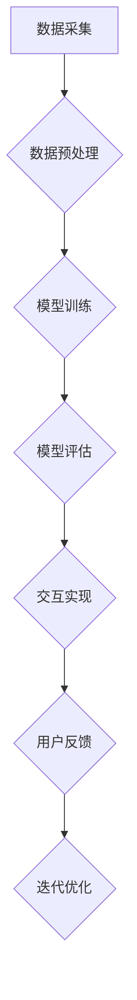

                 

# 大模型问答机器人的交互实现

## 摘要

大模型问答机器人是当前人工智能领域的一个重要研究方向，它利用深度学习和自然语言处理技术，通过模拟人类的思维模式，实现与用户的自然对话。本文旨在详细探讨大模型问答机器人的交互实现，包括其基础概念、架构设计、核心算法、交互设计、部署与优化、应用案例以及未来趋势。通过逐步分析推理，本文将带领读者深入了解大模型问答机器人的本质，为其在实际应用中的开发与优化提供理论支持和实践指导。

## 关键词

- 大模型
- 问答机器人
- 深度学习
- 自然语言处理
- 交互设计
- 部署与优化
- 应用案例
- 未来趋势

## 第一部分：大模型问答机器人的基础概念与架构

### 第1章：大模型问答机器人的概述

#### 1.1 什么是大模型问答机器人

大模型问答机器人是一种基于深度学习和自然语言处理技术的人工智能系统，它能够理解用户的问题，并给出准确的答案。这种机器人通常由一个或多个大型神经网络模型组成，这些模型经过大量的数据训练，具有极强的学习能力，可以模拟人类的思维和推理过程。

#### 1.2 大模型问答机器人的重要性

随着互联网和智能手机的普及，人们越来越依赖于在线服务和智能交互。大模型问答机器人的出现，不仅提高了信息获取的效率，还减少了人力成本，使得智能客服、在线教育、医疗健康等领域的应用成为可能。因此，大模型问答机器人在当今社会具有重要的现实意义。

#### 1.3 大模型问答机器人的发展历程

大模型问答机器人起源于20世纪90年代的专家系统，随着计算能力的提升和深度学习技术的突破，大模型问答机器人的性能得到了极大的提升。近年来，随着预训练语言模型（如GPT-3）的出现，大模型问答机器人的发展进入了一个新的阶段。

### 第2章：大模型技术基础

#### 2.1 深度学习原理

深度学习是一种模拟人脑工作机制的计算模型，通过多层神经网络的训练，实现从数据中自动提取特征。深度学习在图像识别、语音识别等领域取得了显著的成果，为大模型问答机器人的实现提供了基础。

#### 2.2 自然语言处理基础

自然语言处理（NLP）是研究如何使计算机理解和处理自然语言的一门学科。NLP包括分词、词性标注、句法分析等任务，为大模型问答机器人的语义理解和处理提供了支持。

#### 2.3 大模型的工作原理

大模型通常是基于预训练语言模型（如GPT-3）构建的，通过大量的数据预训练，模型已经具备了强大的语言理解和生成能力。在问答过程中，大模型会根据用户的问题，利用训练过的神经网络，生成一个或多个可能的答案，然后通过进一步的推理和筛选，给出最合适的答案。

### 第3章：大模型问答机器人的架构

#### 3.1 整体架构设计

大模型问答机器人的整体架构通常包括数据采集与预处理、模型训练、模型评估、交互实现等模块。这些模块相互协作，共同实现问答机器人的功能。

#### 3.2 数据流与计算流

在数据流方面，问答机器人会从各种渠道收集用户的问题，并对其进行预处理，如分词、去停用词等。在计算流方面，预处理后的数据会输入到训练好的模型中，模型根据输入数据生成答案，并通过后处理模块进行优化和筛选。

#### 3.3 训练与推理流程

训练流程主要包括数据采集、数据预处理、模型训练、模型评估等步骤。推理流程则是将用户的问题输入到训练好的模型中，模型根据问题生成答案，然后通过后处理模块进行优化和筛选。

### 第4章：大模型问答机器人的核心算法

#### 4.1 语言模型

语言模型是问答机器人的基础，它负责预测文本的下一个词。常用的语言模型包括n-gram模型、神经网络模型和预训练语言模型等。

#### 4.2 问答系统

问答系统负责处理用户的问题，并生成相应的答案。问答系统通常包括问题解析、答案生成和答案筛选等模块。

#### 4.3 答案生成算法

答案生成算法是问答机器人的核心，它负责根据用户的问题，利用训练好的模型生成答案。常见的答案生成算法包括基于模板的答案生成、基于记忆的答案生成和基于推理的答案生成等。

### 第5章：大模型问答机器人的交互设计

#### 5.1 用户交互流程

用户交互流程包括问题提出、问题接收、答案生成和答案反馈等步骤。用户可以通过文本、语音等多种方式进行问题提出，问答机器人接收问题后，利用训练好的模型生成答案，并通过文本、语音等方式反馈给用户。

#### 5.2 语义理解与处理

语义理解与处理是问答机器人的关键，它负责将用户的问题转化为机器可理解的形式。语义理解与处理包括问题解析、意图识别、实体识别等任务。

#### 5.3 用户体验优化

用户体验优化是提高问答机器人使用效果的重要手段，它包括交互界面设计、响应速度优化、答案准确率优化等。

### 第6章：大模型问答机器人的部署与优化

#### 6.1 部署环境搭建

部署环境搭建包括硬件环境、软件环境和网络环境等。硬件环境主要指服务器和存储设备，软件环境主要包括操作系统、数据库和中间件等，网络环境则负责数据传输和访问控制。

#### 6.2 性能优化方法

性能优化方法包括模型压缩、并行计算、缓存策略等。模型压缩可以减小模型的大小，提高模型部署的效率；并行计算可以加快模型推理的速度；缓存策略可以减少数据库的访问频率，提高系统的响应速度。

#### 6.3 安全性与隐私保护

安全性与隐私保护是问答机器人部署过程中不可忽视的问题。它包括数据加密、身份认证、访问控制等。通过这些措施，可以保证用户数据的安全和隐私。

### 第7章：大模型问答机器人的应用案例

#### 7.1 在客户服务中的应用

在客户服务中，大模型问答机器人可以提供智能客服服务，如自动回复用户咨询、处理用户投诉等。通过大模型问答机器人，企业可以降低客服成本，提高客户满意度。

#### 7.2 在教育领域的应用

在教育领域，大模型问答机器人可以提供智能辅导服务，如解答学生疑问、提供学习建议等。通过大模型问答机器人，学生可以获得个性化的学习体验，提高学习效果。

#### 7.3 在医疗健康领域的应用

在医疗健康领域，大模型问答机器人可以提供智能问诊服务，如诊断病情、提供健康建议等。通过大模型问答机器人，医疗资源可以得到更高效的利用，提高医疗服务质量。

## 第二部分：大模型问答机器人的实现与优化

### 第8章：大模型问答机器人的实现技术

#### 8.1 数据预处理

数据预处理是问答机器人实现的第一步，它包括数据采集、数据清洗、数据标注等任务。数据预处理的质量直接影响问答机器人的性能。

#### 8.2 模型训练

模型训练是问答机器人实现的核心步骤，它包括选择合适的模型架构、调整模型参数、训练模型等。通过模型训练，问答机器人可以学会从数据中提取特征，并生成答案。

#### 8.3 模型评估

模型评估是验证问答机器人性能的重要环节，它包括准确率、召回率、F1值等指标。通过模型评估，可以了解问答机器人的性能，并为进一步优化提供依据。

### 第9章：大模型问答机器人的代码实战

#### 9.1 数据集构建

数据集构建是问答机器人实现的基础，它包括收集数据、清洗数据、标注数据等。本文将介绍如何构建一个用于问答机器人的数据集。

#### 9.2 模型训练代码实现

模型训练代码实现是问答机器人实现的难点，它包括编写训练脚本、配置训练参数、训练模型等。本文将使用TensorFlow框架，介绍如何实现一个简单的问答机器人模型。

#### 9.3 交互代码实现

交互代码实现是问答机器人与用户交互的关键，它包括接收用户问题、生成答案、反馈答案等。本文将介绍如何使用Python编写交互代码，实现问答机器人的基本功能。

### 第10章：大模型问答机器人的优化实践

#### 10.1 模型压缩

模型压缩是提高问答机器人部署效率的重要手段，它包括模型剪枝、量化、蒸馏等。本文将介绍如何使用模型压缩技术，减小问答机器人的模型大小。

#### 10.2 并行计算

并行计算是提高问答机器人推理速度的有效方法，它包括多线程、分布式计算等。本文将介绍如何使用并行计算技术，加快问答机器人的推理速度。

#### 10.3 实时交互优化

实时交互优化是提高问答机器人用户体验的关键，它包括延迟优化、缓存策略等。本文将介绍如何使用实时交互优化技术，提高问答机器人的交互性能。

### 第11章：大模型问答机器人的未来趋势

#### 11.1 新技术应用

随着技术的不断发展，问答机器人将融入更多的先进技术，如生成对抗网络（GAN）、强化学习等。这些新技术将为问答机器人带来更高的性能和更丰富的功能。

#### 11.2 行业发展趋势

随着人工智能技术的普及，问答机器人将在各个领域得到广泛应用，如金融、教育、医疗等。行业发展趋势将推动问答机器人技术的不断进步。

#### 11.3 未来展望

在未来，问答机器人将成为人工智能领域的重要应用方向。随着技术的不断突破，问答机器人将具备更强的语义理解和生成能力，为人类社会带来更多的便利。

## 附录

### 附录A：大模型问答机器人开发资源

#### A.1 开发工具与框架

- TensorFlow：一款开源的深度学习框架，适用于问答机器人模型的训练和部署。
- PyTorch：一款开源的深度学习框架，适用于问答机器人模型的训练和部署。
- Flask：一款轻量级的Web框架，适用于问答机器人服务的部署。

#### A.2 实用库与API

- NLTK：一款自然语言处理库，适用于问答机器人中的文本预处理。
- spaCy：一款高性能的自然语言处理库，适用于问答机器人中的文本预处理。
- OpenAI API：一款提供预训练语言模型的API，适用于问答机器人中的语言理解。

#### A.3 学习资源与文献推荐

- 《深度学习》：一本深度学习领域的经典教材，适用于问答机器人技术的学习。
- 《自然语言处理综合教程》：一本自然语言处理领域的经典教材，适用于问答机器人技术的学习。
- 《问答系统设计与实现》：一本问答系统领域的经典教材，适用于问答机器人技术的学习。

## 附录B：大模型问答机器人流程图



以上流程图展示了大模型问答机器人的基本流程，从数据采集到用户反馈，每个环节都至关重要。

## 结论

大模型问答机器人是人工智能领域的一个重要研究方向，它通过深度学习和自然语言处理技术，实现了与用户的自然对话。本文详细探讨了大模型问答机器人的交互实现，从基础概念、架构设计、核心算法、交互设计、部署与优化、应用案例到未来趋势，为读者提供了一个全面而深入的了解。希望通过本文，读者能够对大模型问答机器人的实现与优化有更清晰的认识，为未来的研究和开发提供参考。

## 作者信息

作者：AI天才研究院/AI Genius Institute & 禅与计算机程序设计艺术 /Zen And The Art of Computer Programming

<|im_end|>```markdown
# 大模型问答机器人的交互实现

## 摘要

大模型问答机器人是当前人工智能领域的一个重要研究方向，它利用深度学习和自然语言处理技术，通过模拟人类的思维模式，实现与用户的自然对话。本文旨在详细探讨大模型问答机器人的交互实现，包括其基础概念、架构设计、核心算法、交互设计、部署与优化、应用案例以及未来趋势。通过逐步分析推理，本文将带领读者深入了解大模型问答机器人的本质，为其在实际应用中的开发与优化提供理论支持和实践指导。

## 关键词

- 大模型
- 问答机器人
- 深度学习
- 自然语言处理
- 交互设计
- 部署与优化
- 应用案例
- 未来趋势

## 第一部分：大模型问答机器人的基础概念与架构

### 第1章：大模型问答机器人的概述

#### 1.1 什么是大模型问答机器人

大模型问答机器人是一种基于深度学习和自然语言处理技术的人工智能系统，它能够理解用户的问题，并给出准确的答案。这种机器人通常由一个或多个大型神经网络模型组成，这些模型经过大量的数据训练，具有极强的学习能力，可以模拟人类的思维和推理过程。

#### 1.2 大模型问答机器人的重要性

随着互联网和智能手机的普及，人们越来越依赖于在线服务和智能交互。大模型问答机器人的出现，不仅提高了信息获取的效率，还减少了人力成本，使得智能客服、在线教育、医疗健康等领域的应用成为可能。因此，大模型问答机器人在当今社会具有重要的现实意义。

#### 1.3 大模型问答机器人的发展历程

大模型问答机器人起源于20世纪90年代的专家系统，随着计算能力的提升和深度学习技术的突破，大模型问答机器人的性能得到了极大的提升。近年来，随着预训练语言模型（如GPT-3）的出现，大模型问答机器人的发展进入了一个新的阶段。

### 第2章：大模型技术基础

#### 2.1 深度学习原理

深度学习是一种模拟人脑工作机制的计算模型，通过多层神经网络的训练，实现从数据中自动提取特征。深度学习在图像识别、语音识别等领域取得了显著的成果，为大模型问答机器人的实现提供了基础。

#### 2.2 自然语言处理基础

自然语言处理（NLP）是研究如何使计算机理解和处理自然语言的一门学科。NLP包括分词、词性标注、句法分析等任务，为大模型问答机器人的语义理解和处理提供了支持。

#### 2.3 大模型的工作原理

大模型通常是基于预训练语言模型（如GPT-3）构建的，通过大量的数据预训练，模型已经具备了强大的语言理解和生成能力。在问答过程中，大模型会根据用户的问题，利用训练过的神经网络，生成一个或多个可能的答案，然后通过进一步的推理和筛选，给出最合适的答案。

### 第3章：大模型问答机器人的架构

#### 3.1 整体架构设计

大模型问答机器人的整体架构通常包括数据采集与预处理、模型训练、模型评估、交互实现等模块。这些模块相互协作，共同实现问答机器人的功能。

#### 3.2 数据流与计算流

在数据流方面，问答机器人会从各种渠道收集用户的问题，并对其进行预处理，如分词、去停用词等。在计算流方面，预处理后的数据会输入到训练好的模型中，模型根据输入数据生成答案，并通过后处理模块进行优化和筛选。

#### 3.3 训练与推理流程

训练流程主要包括数据采集、数据预处理、模型训练、模型评估等步骤。推理流程则是将用户的问题输入到训练好的模型中，模型根据问题生成答案，然后通过后处理模块进行优化和筛选。

### 第4章：大模型问答机器人的核心算法

#### 4.1 语言模型

语言模型是问答机器人的基础，它负责预测文本的下一个词。常用的语言模型包括n-gram模型、神经网络模型和预训练语言模型等。

#### 4.2 问答系统

问答系统负责处理用户的问题，并生成相应的答案。问答系统通常包括问题解析、答案生成和答案筛选等模块。

#### 4.3 答案生成算法

答案生成算法是问答机器人的核心，它负责根据用户的问题，利用训练好的模型生成答案。常见的答案生成算法包括基于模板的答案生成、基于记忆的答案生成和基于推理的答案生成等。

### 第5章：大模型问答机器人的交互设计

#### 5.1 用户交互流程

用户交互流程包括问题提出、问题接收、答案生成和答案反馈等步骤。用户可以通过文本、语音等多种方式进行问题提出，问答机器人接收问题后，利用训练好的模型生成答案，并通过文本、语音等方式反馈给用户。

#### 5.2 语义理解与处理

语义理解与处理是问答机器人的关键，它负责将用户的问题转化为机器可理解的形式。语义理解与处理包括问题解析、意图识别、实体识别等任务。

#### 5.3 用户体验优化

用户体验优化是提高问答机器人使用效果的重要手段，它包括交互界面设计、响应速度优化、答案准确率优化等。

### 第6章：大模型问答机器人的部署与优化

#### 6.1 部署环境搭建

部署环境搭建包括硬件环境、软件环境和网络环境等。硬件环境主要指服务器和存储设备，软件环境主要包括操作系统、数据库和中间件等，网络环境则负责数据传输和访问控制。

#### 6.2 性能优化方法

性能优化方法包括模型压缩、并行计算、缓存策略等。模型压缩可以减小模型的大小，提高模型部署的效率；并行计算可以加快模型推理的速度；缓存策略可以减少数据库的访问频率，提高系统的响应速度。

#### 6.3 安全性与隐私保护

安全性与隐私保护是问答机器人部署过程中不可忽视的问题。它包括数据加密、身份认证、访问控制等。通过这些措施，可以保证用户数据的安全和隐私。

### 第7章：大模型问答机器人的应用案例

#### 7.1 在客户服务中的应用

在客户服务中，大模型问答机器人可以提供智能客服服务，如自动回复用户咨询、处理用户投诉等。通过大模型问答机器人，企业可以降低客服成本，提高客户满意度。

#### 7.2 在教育领域的应用

在教育领域，大模型问答机器人可以提供智能辅导服务，如解答学生疑问、提供学习建议等。通过大模型问答机器人，学生可以获得个性化的学习体验，提高学习效果。

#### 7.3 在医疗健康领域的应用

在医疗健康领域，大模型问答机器人可以提供智能问诊服务，如诊断病情、提供健康建议等。通过大模型问答机器人，医疗资源可以得到更高效的利用，提高医疗服务质量。

## 第二部分：大模型问答机器人的实现与优化

### 第8章：大模型问答机器人的实现技术

#### 8.1 数据预处理

数据预处理是问答机器人实现的第一步，它包括数据采集、数据清洗、数据标注等任务。数据预处理的质量直接影响问答机器人的性能。

#### 8.2 模型训练

模型训练是问答机器人实现的核心步骤，它包括选择合适的模型架构、调整模型参数、训练模型等。通过模型训练，问答机器人可以学会从数据中提取特征，并生成答案。

#### 8.3 模型评估

模型评估是验证问答机器人性能的重要环节，它包括准确率、召回率、F1值等指标。通过模型评估，可以了解问答机器人的性能，并为进一步优化提供依据。

### 第9章：大模型问答机器人的代码实战

#### 9.1 数据集构建

数据集构建是问答机器人实现的基础，它包括收集数据、清洗数据、标注数据等。本文将介绍如何构建一个用于问答机器人的数据集。

#### 9.2 模型训练代码实现

模型训练代码实现是问答机器人实现的难点，它包括编写训练脚本、配置训练参数、训练模型等。本文将使用TensorFlow框架，介绍如何实现一个简单的问答机器人模型。

#### 9.3 交互代码实现

交互代码实现是问答机器人与用户交互的关键，它包括接收用户问题、生成答案、反馈答案等。本文将介绍如何使用Python编写交互代码，实现问答机器人的基本功能。

### 第10章：大模型问答机器人的优化实践

#### 10.1 模型压缩

模型压缩是提高问答机器人部署效率的重要手段，它包括模型剪枝、量化、蒸馏等。本文将介绍如何使用模型压缩技术，减小问答机器人的模型大小。

#### 10.2 并行计算

并行计算是提高问答机器人推理速度的有效方法，它包括多线程、分布式计算等。本文将介绍如何使用并行计算技术，加快问答机器人的推理速度。

#### 10.3 实时交互优化

实时交互优化是提高问答机器人用户体验的关键，它包括延迟优化、缓存策略等。本文将介绍如何使用实时交互优化技术，提高问答机器人的交互性能。

### 第11章：大模型问答机器人的未来趋势

#### 11.1 新技术应用

随着技术的不断发展，问答机器人将融入更多的先进技术，如生成对抗网络（GAN）、强化学习等。这些新技术将为问答机器人带来更高的性能和更丰富的功能。

#### 11.2 行业发展趋势

随着人工智能技术的普及，问答机器人将在各个领域得到广泛应用，如金融、教育、医疗等。行业发展趋势将推动问答机器人技术的不断进步。

#### 11.3 未来展望

在未来，问答机器人将成为人工智能领域的重要应用方向。随着技术的不断突破，问答机器人将具备更强的语义理解和生成能力，为人类社会带来更多的便利。

## 附录

### 附录A：大模型问答机器人开发资源

#### A.1 开发工具与框架

- TensorFlow：一款开源的深度学习框架，适用于问答机器人模型的训练和部署。
- PyTorch：一款开源的深度学习框架，适用于问答机器人模型的训练和部署。
- Flask：一款轻量级的Web框架，适用于问答机器人服务的部署。

#### A.2 实用库与API

- NLTK：一款自然语言处理库，适用于问答机器人中的文本预处理。
- spaCy：一款高性能的自然语言处理库，适用于问答机器人中的文本预处理。
- OpenAI API：一款提供预训练语言模型的API，适用于问答机器人中的语言理解。

#### A.3 学习资源与文献推荐

- 《深度学习》：一本深度学习领域的经典教材，适用于问答机器人技术的学习。
- 《自然语言处理综合教程》：一本自然语言处理领域的经典教材，适用于问答机器人技术的学习。
- 《问答系统设计与实现》：一本问答系统领域的经典教材，适用于问答机器人技术的学习。

## 附录B：大模型问答机器人流程图


以上流程图展示了大模型问答机器人的基本流程，从数据采集到用户反馈，每个环节都至关重要。

## 结论

大模型问答机器人是人工智能领域的一个重要研究方向，它通过深度学习和自然语言处理技术，实现了与用户的自然对话。本文详细探讨了大模型问答机器人的交互实现，从基础概念、架构设计、核心算法、交互设计、部署与优化、应用案例到未来趋势，为读者提供了一个全面而深入的了解。希望通过本文，读者能够对大模型问答机器人的实现与优化有更清晰的认识，为未来的研究和开发提供参考。

## 作者信息

作者：AI天才研究院/AI Genius Institute & 禅与计算机程序设计艺术 /Zen And The Art of Computer Programming
```

