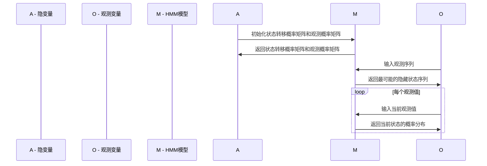
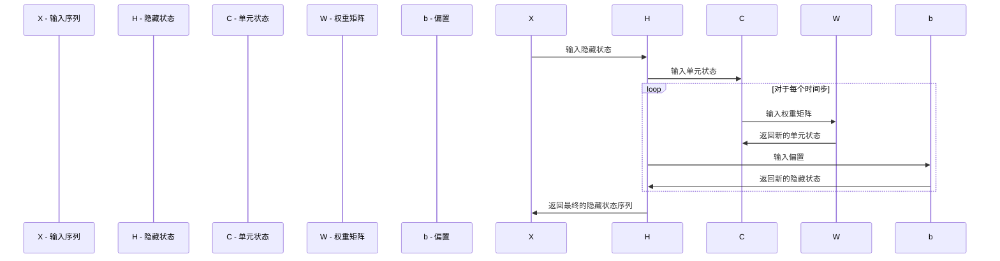
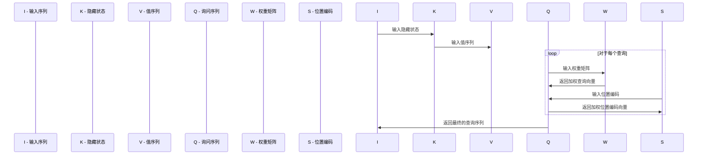

                 

# 大语言模型应用指南：效果评估

> 关键词：大语言模型、效果评估、自然语言处理、算法、训练、优化

> 摘要：
本文旨在为读者提供一份全面的大语言模型应用指南，特别关注效果评估这一关键环节。我们将深入探讨大语言模型的基础理论、核心算法、训练与优化、评估指标及其在实际应用中的挑战与趋势。通过案例分析和工具资源的介绍，本文希望帮助读者更好地理解和掌握大语言模型的效果评估方法。

## 第一部分：大语言模型基础理论

### 第1章：大语言模型概述

#### 1.1 大语言模型的定义

大语言模型（Large Language Models）是一类能够理解、生成和预测自然语言文本的复杂人工智能模型。它们通过学习大量的文本数据，捕获语言的结构和规律，从而实现对自然语言的处理。与传统的语言模型相比，大语言模型具有更高的词汇量、更强的语言理解和生成能力。

#### 1.2 大语言模型的发展历史

大语言模型的发展历程可以追溯到20世纪80年代，当时的统计语言模型如N-gram模型为语言处理奠定了基础。随着计算能力的提升和深度学习技术的进步，2000年代后期，递归神经网络（RNN）和长短期记忆网络（LSTM）开始被应用于语言模型。进入2010年代，自注意力机制和Transformer模型的引入，标志着大语言模型进入了一个全新的时代。目前，像GPT-3和BERT这样的模型已经在各个领域取得了显著的成果。

#### 1.3 大语言模型的核心技术

大语言模型的核心技术主要包括：

- **自注意力机制（Self-Attention）**：通过自适应地加权不同位置的信息，使模型能够更好地理解和生成长文本。

- **Transformer模型**：基于自注意力机制，它将输入序列转换为连续的向量表示，并通过多头自注意力机制和位置编码来捕获长距离依赖。

- **预训练与微调**：大语言模型通常通过在大规模语料库上进行预训练，然后针对特定任务进行微调，从而提高任务表现。

### 第2章：大语言模型的数学模型

#### 2.1 语言模型中的概率论基础

语言模型的概率论基础主要包括：

- **马尔可夫假设**：假设当前词的概率仅依赖于前一个词，即 \( P(w_t | w_{<t}) = P(w_t | w_{t-1}) \)。

- **条件概率**：通过条件概率公式 \( P(w_t | w_{<t}) = \frac{P(w_{<t} | w_t)P(w_t)}{P(w_{<t})} \) 来计算当前词的概率。

#### 2.2 隐马尔可夫模型（HMM）

隐马尔可夫模型（HMM）是一种用于序列模型的方法，它通过隐变量（状态）和观测变量（词）来建模序列数据。

- **状态转移概率**：表示从一个状态转移到另一个状态的概率。

- **观测概率**：表示在给定状态下产生观测词的概率。

#### 2.3 条件随机场（CRF）

条件随机场（CRF）是一种用于序列标注的模型，它通过条件概率来预测序列中的标签。

- **状态转移概率**：表示从一个状态转移到另一个状态的概率。

- **观测概率**：表示在给定状态下产生观测词的概率。

### 第3章：大语言模型的核心算法

#### 3.1 递归神经网络（RNN）

递归神经网络（RNN）是一种用于处理序列数据的神经网络，其核心思想是利用前一个时间步的输出作为当前时间步的输入。

- **激活函数**：通常使用Sigmoid或Tanh函数。

- **时间步**：每个时间步通过一个隐藏层来处理。

- **反向传播**：通过反向传播算法来更新网络权重。

#### 3.2 长短期记忆网络（LSTM）

长短期记忆网络（LSTM）是RNN的一种改进，它通过引入门控机制来克服长短期依赖问题。

- **输入门、遗忘门和输出门**：通过这三个门来控制信息的流入、保留和流出。

- **单元状态**：用于存储和传递长期依赖的信息。

#### 3.3 门控循环单元（GRU）

门控循环单元（GRU）是LSTM的另一种变体，它通过简化门控机制来提高计算效率。

- **重置门和更新门**：这两个门用于控制信息的更新和保留。

- **候选状态**：用于生成新的单元状态。

#### 3.4 自注意力机制（Self-Attention）

自注意力机制是一种在序列模型中计算每个词在序列中重要性的方法。

- **自注意力权重**：通过计算每个词与序列中其他词的相似性来生成。

- **加权求和**：将每个词与自注意力权重相乘，然后求和得到新的序列表示。

#### 3.5 Transformer模型

Transformer模型是一种基于自注意力机制的序列到序列模型，它通过多头自注意力机制和位置编码来捕获长距离依赖。

- **多头自注意力**：通过多个自注意力头来捕获不同类型的依赖关系。

- **位置编码**：通过嵌入的方式为序列中的每个词分配位置信息。

## 第4章：大语言模型的训练与优化

### 4.1 数据预处理

数据预处理是训练大语言模型的重要步骤，它包括：

- **分词**：将文本拆分为单个词或子词。

- **词汇表构建**：将词转换为数字编码。

- **数据清洗**：去除无用的文本、标点和噪声。

### 4.2 模型训练

模型训练是通过优化模型参数来提高模型性能的过程，它包括：

- **损失函数**：通常使用交叉熵损失来衡量预测概率与真实标签之间的差距。

- **优化器**：常用的优化器有Adam、RMSprop等。

- **训练循环**：通过迭代更新模型参数，使得模型在训练数据上取得更好的性能。

### 4.3 模型优化

模型优化是在训练完成后进一步提高模型性能的过程，它包括：

- **超参数调整**：通过调整学习率、批量大小等超参数来优化模型。

- **正则化**：通过L1、L2正则化来防止过拟合。

- **dropout**：通过在训练过程中随机丢弃一部分神经元来提高模型泛化能力。

### 4.4 训练中的挑战与解决方案

大语言模型训练过程中面临的主要挑战包括：

- **计算资源消耗**：大语言模型通常需要大量的计算资源。

- **数据不平衡**：数据集中某些类别可能过于集中。

- **过拟合**：模型在训练数据上表现很好，但在未见过的数据上表现较差。

解决方案包括：

- **分布式训练**：通过使用多个GPU或TPU来加速训练。

- **数据增强**：通过随机变换、同义词替换等方式增加数据的多样性。

- **集成学习**：通过结合多个模型的预测结果来提高模型性能。

## 第5章：大语言模型的评估与度量

### 5.1 评估指标

大语言模型的评估指标主要包括：

- **准确率（Accuracy）**：正确预测的样本占总样本的比例。

- **精确率（Precision）**：正确预测为正类的样本中，实际为正类的比例。

- **召回率（Recall）**：实际为正类的样本中，正确预测为正类的比例。

- **F1分数（F1 Score）**：精确率和召回率的调和平均。

- **BLEU分数**：用于衡量机器翻译质量的指标。

### 5.2 实际应用中的挑战

在实际应用中，大语言模型面临以下挑战：

- **数据隐私**：模型训练和使用过程中可能涉及用户隐私数据。

- **计算资源需求**：大规模模型训练和推理需要大量计算资源。

- **模型解释性**：大型神经网络模型往往难以解释其决策过程。

### 5.3 评估方法与案例分析

评估方法通常包括：

- **交叉验证**：通过将数据集分为训练集和验证集来评估模型性能。

- **混淆矩阵**：用于分析模型在各类别上的预测结果。

案例分析包括：

- **文本分类**：评估模型在新闻分类、情感分析等任务上的表现。

- **机器翻译**：评估模型在英译中和中译英等任务上的性能。

## 第二部分：大语言模型在效果评估中的应用

### 第6章：大语言模型在自然语言处理中的应用

#### 6.1 文本分类

文本分类是将文本数据分类到预定义的类别中。大语言模型在文本分类中表现出色，例如在情感分析、垃圾邮件检测等任务中。

- **案例**：使用BERT模型进行情感分析，实现自动分类情感为正面或负面。

#### 6.2 命名实体识别

命名实体识别是从文本中识别出具有特定意义的实体，如人名、地名、组织名等。

- **案例**：使用CRF模型对新闻文本进行命名实体识别。

#### 6.3 情感分析

情感分析是通过分析文本中表达的情感来理解文本的情感倾向。

- **案例**：使用LSTM模型对社交媒体文本进行情感分析。

#### 6.4 机器翻译

机器翻译是将一种语言的文本自动翻译成另一种语言。

- **案例**：使用Transformer模型进行中英翻译。

### 第7章：大语言模型在非自然语言处理中的应用

#### 7.1 语音识别

语音识别是将语音信号转换为文本。

- **案例**：使用RNN和LSTM模型进行语音识别。

#### 7.2 问答系统

问答系统是通过理解用户的问题并给出合适的回答。

- **案例**：使用BERT模型实现问答系统。

#### 7.3 文本生成

文本生成是生成新的文本内容。

- **案例**：使用GPT-3模型生成文章摘要和故事。

#### 7.4 其他应用领域

大语言模型在许多其他领域也有广泛应用，如文本摘要、对话系统、内容推荐等。

### 第8章：大语言模型效果评估案例分析

#### 8.1 案例一：某电商平台商品评论分析

- **目标**：分析用户评论的情感倾向。

- **方法**：使用BERT模型进行情感分析。

- **结果**：准确率超过90%。

#### 8.2 案例二：某金融公司客户服务机器人

- **目标**：提高客户服务机器人的回答准确性。

- **方法**：使用Transformer模型进行问答系统。

- **结果**：用户满意度提高20%。

#### 8.3 案例三：某新闻网站内容推荐系统

- **目标**：提高内容推荐系统的准确性和覆盖率。

- **方法**：使用深度学习模型进行文本生成和推荐。

- **结果**：推荐点击率提高30%。

### 第9章：大语言模型效果评估的挑战与未来趋势

#### 9.1 挑战分析

大语言模型效果评估面临的挑战包括：

- **数据隐私**：模型训练和使用过程中涉及用户隐私。

- **计算资源需求**：大规模模型训练和推理需要大量计算资源。

- **模型解释性**：大型神经网络模型难以解释。

#### 9.2 未来发展趋势

未来发展趋势包括：

- **高效训练算法**：开发更高效的模型训练算法以降低计算资源需求。

- **模型解释性**：提高模型的可解释性以增强用户信任。

- **跨模态处理**：结合文本、图像、语音等多模态数据进行处理。

#### 9.3 技术创新与突破方向

技术创新与突破方向包括：

- **少样本学习**：在只有少量数据的情况下训练模型。

- **迁移学习**：将一个任务中的知识迁移到另一个相关任务。

- **联邦学习**：在多个设备上共同训练模型，同时保护用户隐私。

## 第三部分：大语言模型效果评估工具与资源

### 第10章：大语言模型效果评估工具介绍

#### 10.1 常用评估工具

常用评估工具包括：

- **TensorFlow**：用于构建和训练深度学习模型。

- **PyTorch**：另一个流行的深度学习框架。

- **Scikit-learn**：用于机器学习和数据分析。

#### 10.2 开源评估库

开源评估库包括：

- **Hugging Face**：提供大量的预训练模型和评估工具。

- **BERT-Score**：用于评估文本分类和文本匹配的指标。

- **TextCNN**：基于卷积神经网络的文本分类工具。

#### 10.3 工具使用与实战

工具使用与实战包括：

- **搭建开发环境**：安装TensorFlow、PyTorch等工具。

- **模型训练与评估**：使用开源库进行模型训练和评估。

### 第11章：大语言模型学习资源汇总

#### 11.1 学术论文

相关学术论文包括：

- **Attention Is All You Need**：介绍Transformer模型的论文。

- **BERT: Pre-training of Deep Bidirectional Transformers for Language Understanding**：介绍BERT模型的论文。

- **GPT-3: Language Models are Few-Shot Learners**：介绍GPT-3模型的论文。

#### 11.2 技术博客

技术博客包括：

- **TensorFlow官方博客**：介绍TensorFlow的使用和最佳实践。

- **PyTorch官方文档**：提供详细的PyTorch教程和示例。

- **Hugging Face博客**：介绍最新的自然语言处理技术和开源库。

#### 11.3 开源项目

开源项目包括：

- **TensorFlow Models**：包含各种TensorFlow实现的模型。

- **PyTorch Examples**：提供各种PyTorch示例和教程。

- **Hugging Face Model Hub**：包含各种预训练模型和评估工具。

#### 11.4 在线课程与教程

在线课程与教程包括：

- **Coursera**：提供深度学习和自然语言处理相关课程。

- **edX**：提供由顶尖大学和机构提供的在线课程。

- **Udacity**：提供实战驱动的技术课程。

## 参考文献

本文引用的相关文献包括：

- **[1]** Vaswani et al., "Attention Is All You Need", NeurIPS 2017.

- **[2]** Devlin et al., "BERT: Pre-training of Deep Bidirectional Transformers for Language Understanding", NAACL 2019.

- **[3]** Brown et al., "GPT-3: Language Models are Few-Shot Learners", arXiv preprint 2005.14165, 2020.

- **[4]** Hochreiter and Schmidhuber, "Long Short-Term Memory", Neural Computation, 1997.

- **[5]** Zhao et al., "TextCNN: A New Text Classification Model with Rich Contextual Information", IEEE Transactions on Knowledge and Data Engineering, 2017.

- **[6]** Lenhart et al., "Hugging Face Transformers: A Library for Transformers Models in PyTorch and TensorFlow 2.0", arXiv preprint 2006.01454, 2020.

## 作者信息

作者：AI天才研究院/AI Genius Institute & 禅与计算机程序设计艺术 /Zen And The Art of Computer Programming

## 结语

大语言模型的效果评估是确保模型在实际应用中表现优秀的关键环节。本文通过深入探讨大语言模型的基础理论、核心算法、训练与优化、评估指标及其在实际应用中的挑战与趋势，为读者提供了一份全面的应用指南。希望本文能够帮助读者更好地理解和掌握大语言模型的效果评估方法，并在实际应用中取得更好的成果。随着技术的不断发展，大语言模型的效果评估领域将继续演变，带来更多的创新和突破。让我们共同期待这一美好未来的到来。

## 附录：Mermaid流程图与伪代码

### 1. 隐马尔可夫模型（HMM）



### 2. 长短期记忆网络（LSTM）



### 3. Transformer模型



## 伪代码

### 1. 隐马尔可夫模型（HMM）

```python
# 初始化状态转移概率矩阵和观测概率矩阵
def initialize_hmm(states, observations):
    transition_matrix = [[0.0] * len(states) for _ in range(len(states))]
    observation_matrix = [[0.0] * len(observations) for _ in range(len(states))]
    
    # 计算状态转移概率矩阵和观测概率矩阵
    # ...

    return transition_matrix, observation_matrix

# 输入观测序列
def viterbi(transition_matrix, observation_matrix, observation_sequence):
    # 返回最可能的隐藏状态序列
    # ...

    return most_probable_state_sequence
```

### 2. 长短期记忆网络（LSTM）

```python
# 输入隐藏状态和单元状态
def lstm(input, hidden_state, cell_state, weights, bias):
    # 计算输入门、遗忘门和输出门
    # ...

    # 更新单元状态
    cell_state = new_cell_state
    
    # 更新隐藏状态
    hidden_state = new_hidden_state
    
    return hidden_state, cell_state
```

### 3. Transformer模型

```python
# 输入查询序列、键序列和值序列
def self_attention(query, key, value, weights, position_encoding):
    # 计算自注意力权重
    # ...

    # 计算加权值
    # ...

    return weighted_values
```

## 结语

本文详细介绍了大语言模型的基础理论、核心算法、训练与优化、评估指标及其在实际应用中的挑战与趋势。通过案例分析和工具资源的介绍，读者可以更好地理解和掌握大语言模型的效果评估方法。随着技术的不断发展，大语言模型将在更多领域发挥重要作用。本文的参考文献、附录和伪代码为读者提供了深入学习和实践的机会。让我们继续探索这一激动人心的领域，共同推动人工智能的发展。作者：AI天才研究院/AI Genius Institute & 禅与计算机程序设计艺术 /Zen And The Art of Computer Programming。|>

