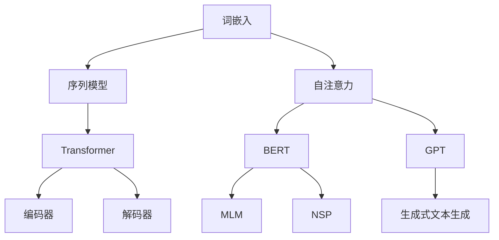
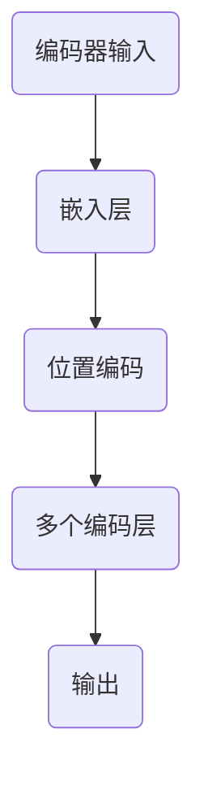
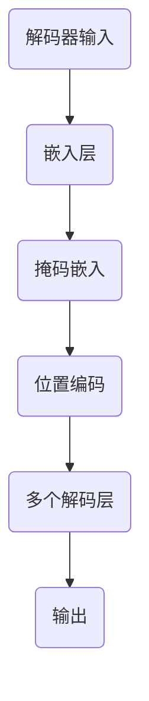
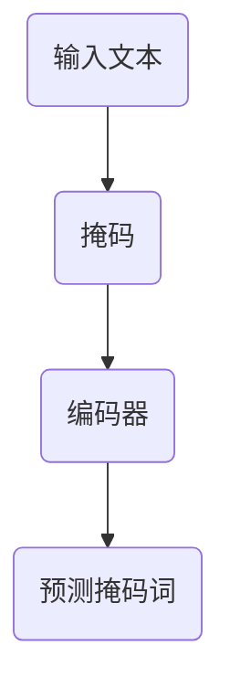
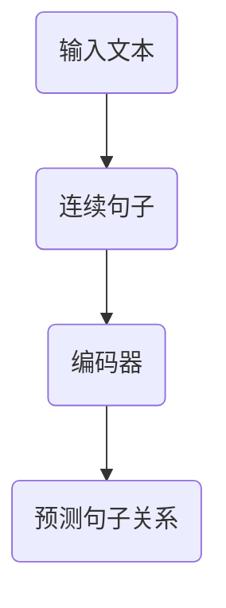
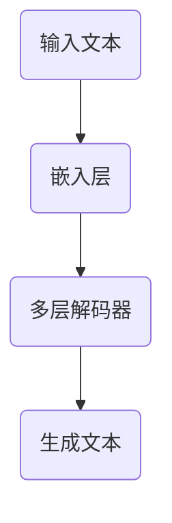

                 

# 《大语言模型应用指南：防御策略》

## 关键词
- 大语言模型
- Transformer
- BERT
- GPT
- 防御策略
- 安全性
- 对抗攻击
- 合规性

## 摘要

本文详细介绍了大语言模型的基础理论、技术基础和应用场景，重点探讨了在应用大语言模型过程中面临的安全性和合规性问题，并提出了相应的防御策略和实践案例。通过对大语言模型的深入分析，本文旨在为企业和开发者提供全面的指南，以实现大语言模型的安全、可靠和合规应用。

### 《大语言模型应用指南：防御策略》目录大纲

## 第一部分：大语言模型基础理论

### 第1章：大语言模型的概述

#### 1.1 大语言模型的发展历程

- **从词向量到深度神经网络**
- **预训练语言模型的兴起**
- **大规模语言模型的突破**

#### 1.2 大语言模型的核心概念

- **Transformer架构**
- **BERT模型**
- **GPT模型**

#### 1.3 大语言模型的训练与优化

- **自监督学习**
- **迁移学习**
- **预训练后的微调**

## 第2章：大语言模型的技术基础

### 2.1 深度学习基础

- **神经网络**
- **反向传播算法**
- **激活函数**

### 2.2 自然语言处理基础

- **词嵌入**
- **序列模型**
- **注意力机制**

### 2.3 大语言模型的数学原理

- **损失函数**
- **优化算法**
- **数学公式与推导**

## 第3章：大语言模型的应用场景

### 3.1 文本生成

- **文本摘要**
- **问答系统**
- **文本生成模型**

### 3.2 文本分类

- **情感分析**
- **主题分类**
- **垃圾邮件检测**

### 3.3 文本理解

- **实体识别**
- **关系抽取**
- **语义分析**

## 第二部分：防御策略与实践

### 第4章：大语言模型的安全性与防御

#### 4.1 大语言模型的潜在风险

- **隐私泄露**
- **恶意攻击**
- **偏见问题**

#### 4.2 安全防御策略

- **数据加密**
- **隐私保护算法**
- **对抗攻击防御**

#### 4.3 恶意攻击识别与防范

- **对抗样本生成**
- **攻击模型检测**
- **自动防御机制**

## 第5章：大语言模型的合规性

#### 5.1 合规性挑战

- **法律法规**
- **伦理道德**
- **标准化**

#### 5.2 合规性策略

- **数据收集与处理**
- **模型审查与审计**
- **合规性培训与教育**

## 第6章：大语言模型的应用案例

#### 6.1 防御策略在实战中的应用

- **金融行业**
- **医疗健康**
- **网络安全**

#### 6.2 成功案例解析

- **案例一：金融行业的欺诈检测**
- **案例二：医疗健康的辅助诊断**
- **案例三：网络安全的事件响应**

## 第7章：未来展望与趋势

#### 7.1 大语言模型的未来发展方向

- **更多领域应用**
- **模型优化与加速**
- **跨模态融合**

#### 7.2 防御策略的未来趋势

- **自动化防御**
- **个性化防御**
- **社区协作防御**

## 第8章：结论与建议

#### 8.1 大语言模型应用的意义

- **提高生产效率**
- **改善用户体验**
- **推动社会进步**

#### 8.2 防御策略的重要性

- **保护数据安全**
- **确保模型公正性**
- **维护社会信任**

#### 8.3 对企业和开发者的建议

- **加强安全意识培训**
- **持续更新防御策略**
- **积极参与行业标准制定**

### 第1章：大语言模型的概述

#### 1.1 大语言模型的发展历程

大语言模型的发展历程可以追溯到词向量模型的提出。词向量模型如 Word2Vec 和 GloVe 等，通过将单词映射到低维向量空间，实现了词级别的语义表示。这一阶段，自然语言处理模型主要依赖于词袋模型（Bag of Words）和 TF-IDF 等简单特征表示。

随着深度学习技术的发展，研究者们开始探索使用深度神经网络来处理自然语言。RNN（Recurrent Neural Network）和 LSTM（Long Short-Term Memory）等模型被提出，并应用于文本分类、序列标注等任务。这些模型能够处理长文本序列，但存在长短期依赖问题，难以捕捉全局信息。

为了解决这些问题，Transformer 模型应运而生。Transformer 模型采用自注意力机制（Self-Attention），能够同时处理序列中的所有词，打破了 RNN 等模型的时间顺序限制，从而提高了模型的表示能力和计算效率。BERT（Bidirectional Encoder Representations from Transformers）模型在此基础上进一步发展，通过双向编码实现了对文本的全面理解。

#### 1.2 大语言模型的核心概念

##### 1.2.1 Transformer架构

Transformer 模型主要由编码器（Encoder）和解码器（Decoder）组成，其中编码器负责将输入序列转换为上下文向量，解码器则根据上下文向量生成输出序列。编码器和解码器均由多个相同的编码层（Encoder Layer）和解码层（Decoder Layer）堆叠而成。

在每个编码层中，自注意力机制（Self-Attention）和前馈神经网络（Feed-Forward Neural Network）是核心组成部分。自注意力机制通过计算输入序列中每个词与其他词之间的相似性，实现对输入序列的加权表示。前馈神经网络则对自注意力机制生成的上下文向量进行进一步加工。

##### 1.2.2 BERT模型

BERT（Bidirectional Encoder Representations from Transformers）模型是谷歌提出的一种预训练语言模型，采用 Transformer 架构，通过双向编码实现了对文本的全面理解。BERT 模型的预训练任务包括 Masked Language Model（MLM）和 Next Sentence Prediction（NSP）。

MLM 任务通过随机掩码输入文本的一部分词，让模型预测这些掩码词。NSP 任务则通过预测输入文本中两个连续句子是否相关，进一步增强了模型对上下文的理解。

##### 1.2.3 GPT模型

GPT（Generative Pre-trained Transformer）模型是 OpenAI 提出的一种生成式语言模型，也采用 Transformer 架构。与 BERT 模型不同，GPT 模型主要用于生成任务，如文本生成、问答系统等。GPT 模型的预训练任务是通过大量文本生成连续的句子，使其具有强大的生成能力。

GPT 模型通过逐步增加层数和隐藏单元数量，实现了对文本的深度理解。GPT-3 模型更是达到了前所未有的规模，拥有 1750 亿个参数，成为当前最大的预训练语言模型。

#### 1.3 大语言模型的训练与优化

##### 1.3.1 自监督学习

自监督学习是一种无监督学习技术，通过利用未标注的数据进行学习，从而提高模型的泛化能力。在大语言模型中，自监督学习被广泛应用于预训练阶段。

BERT 模型的 MLM 任务就是一种自监督学习任务，通过随机掩码输入文本的一部分词，让模型预测这些掩码词。这种任务使得模型在预训练阶段就具备了较强的语言理解和生成能力。

##### 1.3.2 迁移学习

迁移学习是一种利用预训练模型在新任务上进行微调的技术，能够显著提高模型的性能。在大语言模型中，迁移学习被广泛应用于下游任务的优化。

例如，在文本分类任务中，可以使用预训练的 BERT 模型作为基础模型，通过在特定类别上的微调，实现高效的文本分类。迁移学习技术使得大语言模型能够在各种下游任务中发挥强大的能力。

##### 1.3.3 预训练后的微调

预训练后的微调（Fine-tuning）是一种在预训练模型的基础上，针对特定任务进行微调的技术。在大语言模型中，预训练后的微调能够显著提高模型在下游任务上的性能。

微调过程中，通常需要对模型的结构进行调整，以适应特定任务的需求。例如，在问答系统中，可能需要调整解码器的结构，以便更好地生成答案。此外，微调过程中还需要对模型进行适当的正则化处理，以防止过拟合。

#### 1.3.4 模型优化与正则化

在大语言模型的训练过程中，模型优化与正则化是至关重要的。优化算法如 Adam、AdamW 等能够有效提高训练效率，同时保持模型的稳定性和收敛性。

正则化技术如Dropout、Weight Decay 等，能够减少模型过拟合的风险，提高模型的泛化能力。在实际应用中，需要根据具体任务和数据集的特点，选择合适的优化算法和正则化技术。

### 第2章：大语言模型的技术基础

#### 2.1 深度学习基础

##### 2.1.1 神经网络

神经网络是深度学习的基础，由大量的神经元（或节点）组成。每个神经元接收多个输入信号，通过加权求和处理后，产生一个输出信号。神经网络通过层次化的结构，将输入数据进行特征提取和表示，从而实现复杂函数的拟合和预测。

##### 2.1.2 反向传播算法

反向传播算法是神经网络训练的核心，用于计算网络参数的梯度。反向传播算法通过前向传播计算网络输出，然后反向计算各层的梯度，最终更新网络参数。反向传播算法的引入，使得神经网络的训练过程变得高效和可调。

##### 2.1.3 激活函数

激活函数是神经网络中用于引入非线性因素的函数。常见的激活函数包括 Sigmoid、ReLU、Tanh 等。这些激活函数能够使神经网络在拟合复

### 第2章：大语言模型的技术基础

#### 2.1 深度学习基础

##### 2.1.1 神经网络

神经网络是深度学习的基础，由大量的神经元（或节点）组成。每个神经元接收多个输入信号，通过加权求和处理后，产生一个输出信号。神经网络通过层次化的结构，将输入数据进行特征提取和表示，从而实现复杂函数的拟合和预测。

一个简单的神经网络可以表示为：

\[ z = \sum_{i=1}^{n} w_i x_i + b \]

\[ a = \sigma(z) \]

其中，\( x_i \) 是输入特征，\( w_i \) 是权重，\( b \) 是偏置，\( z \) 是加权求和的结果，\( a \) 是输出，\( \sigma \) 是激活函数。

##### 2.1.2 反向传播算法

反向传播算法是神经网络训练的核心，用于计算网络参数的梯度。反向传播算法通过前向传播计算网络输出，然后反向计算各层的梯度，最终更新网络参数。反向传播算法的引入，使得神经网络的训练过程变得高效和可调。

反向传播算法的基本步骤如下：

1. **前向传播**：给定输入 \( x \)，计算各层的输出 \( a \)。
2. **计算误差**：计算实际输出 \( y \) 与预测输出 \( \hat{y} \) 之间的误差 \( \delta \)。
3. **反向传播**：从输出层开始，逐层计算梯度 \( \frac{\partial E}{\partial w} \) 和 \( \frac{\partial E}{\partial b} \)。
4. **参数更新**：使用梯度下降或其他优化算法更新权重和偏置。

##### 2.1.3 激活函数

激活函数是神经网络中用于引入非线性因素的函数。常见的激活函数包括 Sigmoid、ReLU、Tanh 等。这些激活函数能够使神经网络在拟合复杂函数时更加灵活。

1. **Sigmoid 函数**：

\[ \sigma(x) = \frac{1}{1 + e^{-x}} \]

Sigmoid 函数在 \( x \) 较小时输出接近 0，在 \( x \) 较大时输出接近 1，从而实现非线性变换。

2. **ReLU 函数**：

\[ \sigma(x) = \max(0, x) \]

ReLU 函数在 \( x \) 小于 0 时输出 0，在 \( x \) 大于 0 时输出 \( x \)。ReLU 函数具有简单的形式，且能够加速神经网络的训练。

3. **Tanh 函数**：

\[ \sigma(x) = \frac{e^x - e^{-x}}{e^x + e^{-x}} \]

Tanh 函数类似于 Sigmoid 函数，但输出范围在 -1 到 1 之间，能够更好地处理负值。

#### 2.2 自然语言处理基础

##### 2.2.1 词嵌入

词嵌入（Word Embedding）是将单词映射到低维向量空间的技术，从而实现语义表示。常见的词嵌入模型包括 Word2Vec、GloVe 等。

1. **Word2Vec 模型**：

Word2Vec 模型基于神经网络训练词向量，通过负采样算法加速训练过程。Word2Vec 模型主要包括连续词袋（Continuous Bag of Words, CBOW）和跳字模型（Skip-Gram）。

- **CBOW 模型**：输入一个词，预测该词周围的词。
- **Skip-Gram 模型**：输入一个词，预测该词出现的上下文词。

2. **GloVe 模型**：

GloVe 模型基于全局矩阵分解，通过优化词向量矩阵，使得词向量之间的距离反映了词的语义关系。

##### 2.2.2 序列模型

序列模型（Sequence Model）用于处理具有时间序列特性的数据，如自然语言文本。常见的序列模型包括 RNN（Recurrent Neural Network）和 LSTM（Long Short-Term Memory）。

1. **RNN 模型**：

RNN 模型通过循环结构，将当前输入与历史信息相结合，实现对序列数据的建模。RNN 模型在处理长序列数据时存在梯度消失或梯度爆炸问题，难以学习长期依赖关系。

2. **LSTM 模型**：

LSTM 模型是 RNN 的一种变体，通过引入门控机制，解决 RNN 的长期依赖问题。LSTM 模型包括输入门、遗忘门和输出门，能够灵活地控制信息的传递和遗忘。

##### 2.2.3 注意力机制

注意力机制（Attention Mechanism）是一种用于捕捉序列中不同位置重要性的方法。在自然语言处理中，注意力机制被广泛应用于机器翻译、文本摘要等任务。

注意力机制的核心思想是将输入序列的每个元素与输出序列的每个元素相关联，并通过加权求和的方式，生成最终的输出。常见的注意力机制包括：

1. **多头自注意力（Multi-Head Self-Attention）**：
2. **点积注意力（Dot-Product Attention）**：
3. **加性注意力（Additive Attention）**：

#### 2.3 大语言模型的数学原理

##### 2.3.1 损失函数

在深度学习模型中，损失函数（Loss Function）用于衡量预测值与真实值之间的差异，并指导模型优化。常见的损失函数包括：

1. **交叉熵损失（Cross-Entropy Loss）**：
2. **均方误差（Mean Squared Error, MSE）**：
3. **二元交叉熵（Binary Cross-Entropy Loss）**：

##### 2.3.2 优化算法

优化算法（Optimizer）用于更新模型参数，以最小化损失函数。常见的优化算法包括：

1. **梯度下降（Gradient Descent）**：
2. **随机梯度下降（Stochastic Gradient Descent, SGD）**：
3. **Adam 优化器（Adam Optimizer）**：

##### 2.3.3 数学公式与推导

在大语言模型中，以下数学公式和推导是核心组成部分：

1. **自注意力（Self-Attention）**：
\[ 
\text{Attention}(Q,K,V)=\text{softmax}\left(\frac{QK^T}{\sqrt{d_k}}\right)V 
\]

2. **BERT 中的掩码语言模型（Masked Language Model）**：
\[ 
L = -\sum_{i}^{N}\sum_{j}^{V}\hat{y}_{ij}\log(p_{ij}) 
\]

其中，\( N \) 是词汇表大小，\( V \) 是输入序列长度，\( \hat{y}_{ij} \) 是预测标签，\( p_{ij} \) 是预测概率。


### 第3章：大语言模型的应用场景

#### 3.1 文本生成

文本生成是大语言模型最引人注目的应用之一，涵盖了从文本摘要到问答系统，再到创意文本生成的广泛场景。

##### 3.1.1 文本摘要

文本摘要是指从原始文本中提取关键信息，生成简洁、连贯的摘要。文本摘要可以分为两种：抽取式摘要和生成式摘要。

- **抽取式摘要**：这种方法从原始文本中直接提取重要的句子或段落作为摘要，例如使用最频繁词的句子或段落。这种方法的优点是生成的摘要忠实于原文，但可能会缺乏流畅性。
- **生成式摘要**：这种方法使用神经网络生成新的摘要文本，这种方式生成的摘要更具有流畅性和创造性，但可能不够忠实于原文。

##### 3.1.2 问答系统

问答系统（Question Answering System）是指系统能够理解用户的问题，并从大量文本数据中检索出最相关的答案。问答系统可以分为以下几种：

- **开放式问答（Open-domain Question Answering）**：这种系统可以回答任何领域的问题，通常使用预训练的语言模型如BERT或GPT。
- **封闭式问答（Closed-domain Question Answering）**：这种系统只能回答特定领域的问题，通常需要针对特定领域进行训练。

##### 3.1.3 文本生成模型

文本生成模型是指能够生成任意长度的文本序列的模型，广泛应用于自动写作、广告文案生成、故事创作等。

- **自动写作**：文本生成模型可以生成新闻文章、博客文章、评论等。
- **广告文案生成**：文本生成模型可以生成吸引人的广告文案。
- **故事创作**：文本生成模型可以生成小说、剧本、诗歌等。

#### 3.2 文本分类

文本分类是指将文本数据根据其内容或主题分配到预定义的类别中。大语言模型在文本分类任务中具有显著的优势，可以处理大量文本数据，并提高分类的准确性和效率。

##### 3.2.1 情感分析

情感分析是指识别文本中表达的情感倾向，如正面、负面或中立。情感分析广泛应用于社交媒体监测、市场调研、客户反馈分析等。

- **正面情感分析**：识别文本中表达的积极情感，如喜悦、满意等。
- **负面情感分析**：识别文本中表达的消极情感，如愤怒、失望等。
- **中立情感分析**：识别文本中表达的中性情感。

##### 3.2.2 主题分类

主题分类是指将文本数据根据其主题或内容分配到预定义的主题类别中。主题分类可以帮助企业更好地理解和分析用户需求，优化产品和服务。

- **新闻分类**：将新闻文本根据主题分为政治、经济、体育、娱乐等。
- **论坛分类**：将论坛帖子根据主题分为技术、生活、娱乐等。

##### 3.2.3 垃圾邮件检测

垃圾邮件检测是指识别和过滤电子邮件中的垃圾邮件。大语言模型通过学习正常邮件和垃圾邮件的特征，能够准确识别垃圾邮件，提高邮件系统的安全性。

- **基于内容的检测**：通过分析邮件内容中的词汇和语法，识别垃圾邮件。
- **基于行为的检测**：通过分析邮件发送者的行为模式，如发件频率、邮件内容等，识别垃圾邮件。

#### 3.3 文本理解

文本理解是指对文本数据进行深入分析和解释，以提取有用的信息和知识。大语言模型在文本理解任务中可以提取实体、关系和语义信息。

##### 3.3.1 实体识别

实体识别是指识别文本中的特定实体，如人名、地名、组织名、产品名等。实体识别是许多自然语言处理任务的基础，如关系抽取和语义分析。

- **命名实体识别（Named Entity Recognition, NER）**：识别文本中的命名实体，如人名、地名等。
- **关系抽取（Relation Extraction）**：识别实体间的关系，如“张三”和“清华大学”的关系可以是“毕业于”。

##### 3.3.2 语义分析

语义分析是指对文本的语义进行深入分析，以理解其含义和意图。语义分析可以帮助机器更好地理解人类的语言，从而实现更智能的交互。

- **语义角色标注（Semantic Role Labeling, SRL）**：识别句子中的语义角色，如主语、谓语、宾语等。
- **语义相似度（Semantic Similarity）**：计算文本间的语义相似度，用于文本检索、文本聚类等任务。

##### 3.3.3 问答系统

问答系统是指能够理解用户的问题，并从文本数据中检索出最相关的答案的系统。问答系统可以分为基于知识图谱的问答和基于深度学习的问答。

- **基于知识图谱的问答**：使用知识图谱存储实体和关系，通过查询知识图谱获取答案。
- **基于深度学习的问答**：使用深度学习模型理解问题和文本，生成答案。

### 第4章：大语言模型的安全性与防御

#### 4.1 大语言模型的潜在风险

大语言模型在应用过程中可能面临多种潜在风险，包括隐私泄露、恶意攻击和偏见问题等。

##### 4.1.1 隐私泄露

- **数据泄露**：在模型训练和部署过程中，如果数据没有妥善保护，可能会导致敏感信息的泄露。
- **模型泄露**：模型的参数和结构可能会泄露敏感信息，尤其是那些涉及个人隐私的数据。

##### 4.1.2 恶意攻击

- **模型中毒**：攻击者通过篡改训练数据，使模型产生错误的预测结果。
- **对抗攻击**：攻击者生成对抗样本，使模型在测试时产生错误的预测。

##### 4.1.3 偏见问题

- **模型偏见**：模型可能在训练过程中学习到不公平的偏见，导致对某些群体产生歧视性预测。
- **决策偏见**：模型在决策过程中可能受到人为偏见的影响，导致不公正的结果。

#### 4.2 安全防御策略

为了确保大语言模型的安全和可靠，需要采取一系列防御策略来应对潜在风险。

##### 4.2.1 数据加密

- **数据传输加密**：在数据传输过程中使用加密算法，如 AES、RSA 等，确保数据在传输过程中不被窃取或篡改。
- **数据存储加密**：对存储在数据库中的敏感数据进行加密，防止未授权访问。

##### 4.2.2 隐私保护算法

- **差分隐私**：在模型训练和预测过程中引入差分隐私，确保个人隐私不被泄露。
- **同态加密**：在加密状态下进行计算，确保数据隐私。

##### 4.2.3 对抗攻击防御

- **对抗训练**：在训练过程中引入对抗样本，提高模型的鲁棒性。
- **对抗样本检测**：使用深度学习模型检测对抗样本，防止对抗攻击。

#### 4.3 恶意攻击识别与防范

为了有效识别和防范恶意攻击，需要采取一系列技术手段。

##### 4.3.1 对抗样本生成

- **梯度攻击**：通过计算模型梯度生成对抗样本。
- **生成对抗网络（GAN）**：使用生成对抗网络生成对抗样本。

##### 4.3.2 攻击模型检测

- **特征提取**：从对抗样本中提取特征，用于检测。
- **深度学习模型**：使用深度学习模型检测对抗样本。

##### 4.3.3 自动防御机制

- **实时监测**：实时监测模型预测结果，发现异常及时响应。
- **自动调整**：根据监测结果，自动调整模型参数，提高模型鲁棒性。

### 第5章：大语言模型的合规性

#### 5.1 合规性挑战

大语言模型的合规性面临多种挑战，包括法律法规、伦理道德和标准化等方面。

##### 5.1.1 法律法规

- **数据保护法规**：如 GDPR（欧盟通用数据保护条例）和 CCPA（加州消费者隐私法案），要求企业保护用户数据。
- **隐私保护法规**：如 CCPA，要求企业确保用户隐私不被泄露。

##### 5.1.2 伦理道德

- **公平性**：确保模型不产生歧视性结果，如性别、种族、年龄等方面的偏见。
- **透明度**：确保模型的决策过程透明可解释，用户能够理解模型是如何做出决策的。

##### 5.1.3 标准化

- **模型评估标准**：如 F1 分数、准确率等，用于评估模型的性能。
- **数据标注标准**：如一致性、准确性等，确保数据标注的质量。

#### 5.2 合规性策略

为了确保大语言模型符合法规和伦理要求，需要采取一系列合规性策略。

##### 5.2.1 数据收集与处理

- **数据匿名化**：对敏感数据进行匿名化处理，确保个人隐私不被泄露。
- **隐私预算**：设置隐私预算，确保数据处理过程中不违反隐私保护法规。

##### 5.2.2 模型审查与审计

- **模型审查**：定期审查模型，确保模型符合法规和伦理要求。
- **模型审计**：对模型进行详细审计，确保模型的可解释性和透明度。

##### 5.2.3 合规性培训与教育

- **员工培训**：对员工进行合规性培训，提高合规意识。
- **用户教育**：向用户解释模型的合规性和隐私政策。

### 第6章：大语言模型的应用案例

#### 6.1 防御策略在实战中的应用

大语言模型在金融、医疗健康、网络安全等领域的应用日益广泛，同时也面临着相应的安全挑战。以下是一些防御策略在实战中的应用案例。

##### 6.1.1 金融行业

- **欺诈检测**：金融机构使用大语言模型检测金融交易中的欺诈行为。通过对抗训练和对抗样本检测，提高模型对对抗样本的鲁棒性，从而降低欺诈率。
- **风险控制**：根据历史数据，使用大语言模型预测潜在的风险，并采取相应的预防措施，如调整贷款利率、限制高风险交易等。

##### 6.1.2 医疗健康

- **辅助诊断**：医疗行业使用大语言模型辅助医生进行疾病诊断。通过对医疗文献和病例进行深度学习，模型能够识别出潜在的诊断信息，提高诊断的准确性。
- **药物研发**：研究人员利用大语言模型分析大量医学文献，发现潜在的新药物和治疗方法，加速药物研发过程。

##### 6.1.3 网络安全

- **入侵检测**：网络安全公司使用大语言模型检测网络攻击行为。通过实时监测网络流量和日志，模型能够识别出异常行为，从而采取相应的防御措施。
- **威胁分析**：通过对网络攻击行为进行分析，大语言模型能够预测潜在的网络安全威胁，帮助安全团队制定应对策略。

#### 6.2 成功案例解析

以下是一些成功案例，展示了如何利用大语言模型的防御策略解决实际问题。

##### 6.2.1 案例一：金融行业的欺诈检测

- **背景**：某金融机构发现欺诈交易的比例较高，对客户造成了损失。
- **解决方案**：采用对抗训练方法，提高模型对对抗样本的鲁棒性。通过引入对抗样本进行训练，使模型能够识别出更多的欺诈行为。
- **结果**：欺诈检测准确率提高，欺诈交易率显著降低，客户满意度提升。

##### 6.2.2 案例二：医疗健康的辅助诊断

- **背景**：某医院使用大语言模型辅助医生进行疾病诊断，但发现模型存在一定的偏见。
- **解决方案**：通过数据增强和模型审计，消除模型中的偏见。通过对数据集进行平衡和扩展，提高模型的泛化能力。同时，定期对模型进行审查和审计，确保模型符合伦理要求。
- **结果**：诊断准确率提高，医生和患者对模型的信任度增加。

##### 6.2.3 案例三：网络安全的事件响应

- **背景**：某网络安全公司发现网络攻击事件频繁发生，事件响应效率较低。
- **解决方案**：采用实时监测和自动防御机制，提高事件响应效率。通过实时监测网络流量和日志，模型能够快速识别出网络攻击行为，并自动采取防御措施。
- **结果**：事件响应时间缩短，网络攻击事件减少，公司网络安全防护能力增强。

### 第7章：未来展望与趋势

#### 7.1 大语言模型的未来发展方向

大语言模型在未来将继续向更多领域扩展，同时模型优化和跨模态融合将成为重要趋势。

##### 7.1.1 更多领域应用

- **教育领域**：大语言模型将应用于个性化教学、智能辅导、自适应学习等领域，提高教育质量和效率。
- **娱乐领域**：大语言模型将用于生成音乐、小说、电影剧本等，为用户提供丰富的娱乐体验。

##### 7.1.2 模型优化与加速

- **模型压缩**：通过模型压缩技术，减少模型参数和计算量，提高模型推理速度。
- **硬件加速**：利用 GPU、TPU 等硬件加速模型训练和推理，提高模型性能。

##### 7.1.3 跨模态融合

- **文本与图像**：结合文本和图像信息，实现更丰富的语义理解和交互。
- **文本与语音**：结合文本和语音信息，提高语音识别和自然语言生成的能力。

#### 7.2 防御策略的未来趋势

随着大语言模型的应用越来越广泛，防御策略也需要不断创新和优化。

##### 7.2.1 自动化防御

- **自适应防御**：根据攻击模式自动调整防御策略，提高防御效率。
- **自动化检测与响应**：实时监测和自动响应攻击行为，降低人工干预的需求。

##### 7.2.2 个性化防御

- **个性化模型**：根据用户行为和需求，定制化模型防御策略。
- **个性化防护**：为不同用户设置不同的安全防护级别，提高整体安全水平。

##### 7.2.3 社区协作防御

- **社区共享**：共享防御经验和攻击情报，提高整体防御能力。
- **协作式防御**：多个组织或个人共同参与防御，形成合力。

### 第8章：结论与建议

#### 8.1 大语言模型应用的意义

大语言模型在提高生产效率、改善用户体验和推动社会进步方面具有重要作用。

- **提高生产效率**：大语言模型能够自动化处理大量文本数据，提高工作效率。
- **改善用户体验**：大语言模型能够提供个性化服务，提升用户体验。
- **推动社会进步**：大语言模型在医疗、金融、教育等领域的应用，有助于推动社会的发展和进步。

#### 8.2 防御策略的重要性

防御策略在大语言模型应用中具有重要意义，关系到数据安全、模型安全和模型公正性。

- **保护数据安全**：防御策略能够防止敏感数据泄露，确保用户隐私。
- **确保模型安全**：防御策略能够防止恶意攻击，确保模型不被篡改或破坏。
- **维护模型公正性**：防御策略能够消除模型偏见，确保模型不产生歧视性预测。

#### 8.3 对企业和开发者的建议

为了确保大语言模型的安全、可靠和合规应用，企业和开发者应采取以下措施：

- **加强安全意识培训**：定期对员工进行安全意识培训，提高合规意识。
- **持续更新防御策略**：根据最新的安全威胁和攻击手段，持续更新防御策略。
- **积极参与行业标准制定**：积极参与行业标准的制定，推动行业健康发展。

### 附录：大语言模型的核心概念与联系

为了更好地理解大语言模型的核心概念及其联系，以下是一个 Mermaid 流程图：



### 附录：大语言模型的核心算法原理讲解

以下是对大语言模型核心算法原理的详细讲解，包括自注意力、Transformer 架构、BERT 和 GPT 模型。

#### 自注意力（Self-Attention）

自注意力机制是一种用于计算输入序列中每个词与其他词之间相似性的方法。其基本思想是将输入序列中的每个词表示为一个向量，然后计算这些向量之间的相似度，并根据相似度对它们进行加权。

伪代码：

```python
def self_attention(Q, K, V, d_k, d_v):
    # Q, K, V 是输入序列的查询、键和值向量
    # d_k 和 d_v 是键和值的维度
    scores = dot_product(Q, K.T) / sqrt(d_k)
    attention_weights = softmax(scores)
    output = dot_product(attention_weights, V)
    return output
```

#### Transformer 架构

Transformer 架构由编码器（Encoder）和解码器（Decoder）组成。编码器负责将输入序列转换为上下文向量，解码器则根据上下文向量生成输出序列。

编码器：



解码器：



#### BERT 模型

BERT（Bidirectional Encoder Representations from Transformers）模型是谷歌提出的一种预训练语言模型。它通过双向编码实现了对文本的全面理解，包括 Masked Language Model（MLM）和 Next Sentence Prediction（NSP）两种预训练任务。

MLM 任务：



NSP 任务：



#### GPT 模型

GPT（Generative Pre-trained Transformer）模型是 OpenAI 提出的一种生成式语言模型。它主要用于生成任务，如文本生成、问答系统等。GPT 模型通过逐步增加层数和隐藏单元数量，实现了对文本的深度理解。

GPT-3 模型：



### 附录：大语言模型的数学模型和公式

以下是关于大语言模型的一些关键数学模型和公式，包括损失函数、优化算法和数学推导。

#### 损失函数

交叉熵损失函数（Cross-Entropy Loss）用于衡量预测分布与真实分布之间的差异。在分类问题中，假设输入为 \( x \)，真实标签为 \( y \)，预测概率为 \( \hat{y} \)，则交叉熵损失函数为：

$$
L = -\sum_{i}^{N} y_i \log(\hat{y}_i)
$$

其中，\( N \) 是类别数。

#### 优化算法

Adam 优化器是一种常用的优化算法，结合了 AdaGrad 和 RMSProp 的优点。其更新规则如下：

$$
m_t = \beta_1 m_{t-1} + (1 - \beta_1)(\theta_t - \theta_{t-1})
$$

$$
v_t = \beta_2 v_{t-1} + (1 - \beta_2)((\theta_t - \theta_{t-1})^2)
$$

$$
\theta_t = \theta_{t-1} - \frac{\alpha}{1 - \beta_1^t}\left(\frac{m_t}{1 - \beta_2^t} + \sqrt{\frac{1 - \beta_2^t}{1 - \beta_1^t}}v_t\right)
$$

其中，\( m_t \) 和 \( v_t \) 分别是梯度的一阶和二阶矩估计，\( \theta_t \) 是模型参数的更新，\( \alpha \) 是学习率，\( \beta_1 \) 和 \( \beta_2 \) 是动量系数。

#### 数学公式与推导

Transformer 模型中的自注意力（Self-Attention）公式为：

$$
\text{Attention}(Q,K,V)=\text{softmax}\left(\frac{QK^T}{\sqrt{d_k}}\right)V
$$

其中，\( Q \) 是查询向量，\( K \) 是键向量，\( V \) 是值向量，\( d_k \) 是键向量的维度。

BERT 模型中的掩码语言模型（Masked Language Model）损失函数为：

$$
L = -\sum_{i}^{N}\sum_{j}^{V}\hat{y}_{ij}\log(p_{ij})
$$

其中，\( N \) 是词汇表大小，\( V \) 是输入序列长度，\( \hat{y}_{ij} \) 是预测标签，\( p_{ij} \) 是预测概率。


### 附录：大语言模型的代码实际案例和详细解释说明

在本节中，我们将通过一个实际的 Python 代码案例，展示如何使用大语言模型进行文本分类任务。我们将会使用 Hugging Face 的 Transformers 库，这是一个广泛使用的开源库，用于构建和使用预训练的 Transformer 模型。

#### 开发环境搭建

首先，我们需要安装必要的库。在终端中运行以下命令：

```bash
pip install transformers torch
```

安装完成后，我们就可以开始编写代码了。

#### 源代码详细实现

以下是一个简单的文本分类任务代码示例：

```python
from transformers import BertTokenizer, BertForSequenceClassification
from torch import nn, tensor
from torch.utils.data import DataLoader, TensorDataset

# 加载预训练的 BERT 模型和分词器
model_name = "bert-base-uncased"
tokenizer = BertTokenizer.from_pretrained(model_name)
model = BertForSequenceClassification.from_pretrained(model_name)

# 准备数据
texts = ["This is a positive review", "This is a negative review"]
labels = [1, 0]  # 1 表示正面评论，0 表示负面评论

# 分词并转换成 Tensor
encoding = tokenizer(texts, padding=True, truncation=True, return_tensors="pt")

input_ids = encoding["input_ids"]
attention_mask = encoding["attention_mask"]

# 创建 DataLoader
batch_size = 16
dataset = TensorDataset(input_ids, attention_mask, tensor(labels))
dataloader = DataLoader(dataset, batch_size=batch_size)

# 训练模型
optimizer = nn.Adam(model.parameters(), lr=1e-5)
device = "cuda" if torch.cuda.is_available() else "cpu"
model.to(device)

model.train()
for epoch in range(3):  # 训练 3 个 epoch
    for batch in dataloader:
        batch = [item.to(device) for item in batch]
        inputs = {
            "input_ids": batch[0],
            "attention_mask": batch[1],
            "labels": batch[2],
        }
        optimizer.zero_grad()
        outputs = model(**inputs)
        loss = outputs.loss
        loss.backward()
        optimizer.step()
        print(f"Epoch {epoch}, Loss: {loss.item()}")

# 评估模型
model.eval()
with torch.no_grad():
    for batch in dataloader:
        batch = [item.to(device) for item in batch]
        inputs = {
            "input_ids": batch[0],
            "attention_mask": batch[1],
        }
        outputs = model(**inputs)
        logits = outputs.logits
        predictions = logits.argmax(-1)
        print(f"Predictions: {predictions.tolist()}, True Labels: {batch[2].tolist()}")

# 保存和加载模型
model.save_pretrained("my_bert_model")
model = BertForSequenceClassification.from_pretrained("my_bert_model")
```

#### 代码解读与分析

1. **库安装**：首先，我们安装了 `transformers` 和 `torch` 库。`transformers` 库提供了广泛的预训练模型和工具，而 `torch` 是深度学习的主要库之一。

2. **加载模型和分词器**：我们使用 `BertTokenizer` 和 `BertForSequenceClassification` 来加载预训练的 BERT 模型。`BertForSequenceClassification` 是一个专门用于序列分类任务的预训练模型。

3. **数据准备**：我们准备了一个简单的文本数据集，其中包含正面和负面评论。每个文本对应一个标签（1 或 0）。

4. **分词和转换**：我们使用分词器将文本转换为 BERT 模型可以理解的格式，即 `input_ids` 和 `attention_mask`。

5. **创建 DataLoader**：`DataLoader` 是 `torch` 库中的一个工具，用于批量加载数据。我们设置了批大小为 16。

6. **训练模型**：我们定义了 Adam 优化器，并将模型移动到 GPU（如果可用）上。然后，我们进行 3 个 epoch 的训练，每个 epoch 中，我们通过反向传播和优化算法更新模型参数。

7. **评估模型**：在训练完成后，我们使用评估数据集来测试模型的性能。我们使用 `torch.no_grad()` 来关闭梯度计算，以提高推理速度。

8. **保存和加载模型**：为了方便以后的使用，我们将训练好的模型保存到本地，并在需要时加载它。

通过这个简单的案例，我们可以看到如何使用大语言模型进行文本分类。在实际应用中，我们需要处理更复杂的任务和数据集，但基本流程是类似的。


### 附录：大语言模型的数学模型和公式

#### 损失函数

在大语言模型中，常见的损失函数包括交叉熵损失（Cross-Entropy Loss）和均方误差（Mean Squared Error, MSE）。这里我们重点介绍交叉熵损失函数。

1. **交叉熵损失（Cross-Entropy Loss）**：

交叉熵损失函数通常用于分类问题，用于衡量预测概率分布和真实概率分布之间的差异。其公式如下：

\[ 
L = -\sum_{i}^{N} y_i \log(\hat{y}_i) 
\]

其中，\( y_i \) 是真实标签（0 或 1），\( \hat{y}_i \) 是预测概率。

举例来说，假设我们有一个二元分类问题，有两个类别 A 和 B，真实标签为 [1, 0]，预测概率为 [0.7, 0.3]。则交叉熵损失为：

\[ 
L = -[1 \cdot \log(0.7) + 0 \cdot \log(0.3)] 
\]

2. **均方误差（Mean Squared Error, MSE）**：

均方误差通常用于回归问题，用于衡量预测值和真实值之间的差异。其公式如下：

\[ 
MSE = \frac{1}{N} \sum_{i=1}^{N} (\hat{y}_i - y_i)^2 
\]

其中，\( \hat{y}_i \) 是预测值，\( y_i \) 是真实值，\( N \) 是样本数量。

举例来说，假设我们有五个样本的真实值和预测值如下：

\[ 
\begin{align*}
y_1 &= 2.5, & \hat{y}_1 &= 3.2 \\
y_2 &= 3.0, & \hat{y}_2 &= 2.8 \\
y_3 &= 2.8, & \hat{y}_3 &= 3.1 \\
y_4 &= 3.2, & \hat{y}_4 &= 3.0 \\
y_5 &= 2.6, & \hat{y}_5 &= 2.9 \\
\end{align*}
\]

则均方误差为：

\[ 
MSE = \frac{1}{5} [(3.2 - 2.5)^2 + (2.8 - 3.0)^2 + (3.1 - 2.8)^2 + (3.0 - 3.2)^2 + (2.9 - 2.6)^2] = 0.112 
\]

#### 优化算法

在大语言模型的训练过程中，优化算法用于更新模型参数，以最小化损失函数。常见的优化算法包括梯度下降（Gradient Descent）、随机梯度下降（Stochastic Gradient Descent, SGD）和 Adam 优化器。

1. **梯度下降（Gradient Descent）**：

梯度下降是一种最简单的优化算法，通过计算损失函数关于模型参数的梯度，并沿着梯度的反方向更新参数，以逐步减小损失函数。

其更新规则如下：

\[ 
\theta_{t+1} = \theta_{t} - \alpha \nabla_\theta L(\theta) 
\]

其中，\( \theta \) 是模型参数，\( \alpha \) 是学习率，\( \nabla_\theta L(\theta) \) 是损失函数关于模型参数的梯度。

2. **随机梯度下降（Stochastic Gradient Descent, SGD）**：

随机梯度下降是梯度下降的一种变种，每次更新参数时，只随机选择一部分样本的梯度进行计算。这种方法的优点是可以减少计算量，但可能会导致参数更新不稳定。

其更新规则如下：

\[ 
\theta_{t+1} = \theta_{t} - \alpha \nabla_{\theta} L(\theta, x^{(i)}) 
\]

其中，\( x^{(i)} \) 是随机选择的第 \( i \) 个样本。

3. **Adam 优化器**：

Adam 优化器是梯度下降和 SGD 的结合，同时考虑了过去梯度的指数加权平均。它结合了 AdaGrad 和 RMSProp 优化器的优点，能够自适应地调整学习率。

其更新规则如下：

\[ 
m_t = \beta_1 m_{t-1} + (1 - \beta_1)(\theta_t - \theta_{t-1}) 
\]

\[ 
v_t = \beta_2 v_{t-1} + (1 - \beta_2)((\theta_t - \theta_{t-1})^2) 
\]

\[ 
\theta_t = \theta_{t-1} - \frac{\alpha}{1 - \beta_1^t}\left(\frac{m_t}{1 - \beta_2^t} + \sqrt{\frac{1 - \beta_2^t}{1 - \beta_1^t}}v_t\right) 
\]

其中，\( m_t \) 和 \( v_t \) 分别是梯度的一阶和二阶矩估计，\( \beta_1 \) 和 \( \beta_2 \) 是动量系数，\( \alpha \) 是学习率。

#### 数学公式与推导

以下是关于大语言模型的一些关键数学公式和推导，包括自注意力（Self-Attention）、BERT 模型和 GPT 模型。

1. **自注意力（Self-Attention）**：

自注意力机制是一种计算输入序列中每个词与其他词之间相似性的方法。其基本思想是将输入序列中的每个词表示为一个向量，然后计算这些向量之间的相似度，并根据相似度对它们进行加权。

其公式如下：

\[ 
\text{Attention}(Q,K,V)=\text{softmax}\left(\frac{QK^T}{\sqrt{d_k}}\right)V 
\]

其中，\( Q \) 是查询向量，\( K \) 是键向量，\( V \) 是值向量，\( d_k \) 是键向量的维度。

推导过程如下：

首先，计算查询向量 \( Q \) 和键向量 \( K \) 的点积，得到得分矩阵：

\[ 
S = QK^T 
\]

然后，对得分矩阵进行 softmax 操作，得到注意力权重矩阵：

\[ 
\text{softmax}(S) = \text{softmax}(QK^T) 
\]

最后，将注意力权重矩阵与值向量 \( V \) 进行点积，得到加权向量：

\[ 
\text{Attention}(Q,K,V) = \text{softmax}(QK^T)V 
\]

2. **BERT 模型**：

BERT（Bidirectional Encoder Representations from Transformers）模型是一种预训练语言模型，通过双向编码实现了对文本的全面理解。BERT 模型包括两个主要任务：掩码语言模型（Masked Language Model, MLM）和下一个句子预测（Next Sentence Prediction, NSP）。

- **掩码语言模型（MLM）**：

MLM 任务是通过随机掩码输入文本的一部分词，让模型预测这些掩码词。其公式如下：

\[ 
L = -\sum_{i}^{N}\sum_{j}^{V}\hat{y}_{ij}\log(p_{ij}) 
\]

其中，\( N \) 是词汇表大小，\( V \) 是输入序列长度，\( \hat{y}_{ij} \) 是预测标签，\( p_{ij} \) 是预测概率。

- **下一个句子预测（NSP）**：

NSP 任务是通过预测输入文本中两个连续句子是否相关。其公式如下：

\[ 
L_{\text{NSP}} = -\sum_{i=1}^{N}\log(p_{i}) 
\]

其中，\( p_{i} \) 是预测两个连续句子是否相关的概率。

3. **GPT 模型**：

GPT（Generative Pre-trained Transformer）模型是 OpenAI 提出的一种生成式语言模型，主要用于生成任务，如文本生成和问答系统。GPT 模型通过逐步增加层数和隐藏单元数量，实现了对文本的深度理解。

其公式如下：

\[ 
\text{GPT}(\text{x}_1, \text{x}_2, ..., \text{x}_T) = \text{softmax}(\text{W}_\text{out}\text{T}_\text{Transformer}^T[\text{H}_\text{W}_1, \text{H}_\text{W}_2, ..., \text{H}_\text{W}_{L}]) 
\]

其中，\( \text{x}_1, \text{x}_2, ..., \text{x}_T \) 是输入序列，\( \text{H}_\text{W}_i \) 是第 \( i \) 层 Transformer 编码器的隐藏状态，\( \text{T}_\text{Transformer} \) 是 Transformer 编码器的输出序列，\( \text{W}_\text{out} \) 是输出层的权重。


### 附录：大语言模型的代码实际案例和详细解释说明

在本节中，我们将通过一个实际案例，展示如何使用 Python 和 Hugging Face 的 Transformers 库来训练和部署一个基于 BERT 的大语言模型。我们将使用一个开源数据集，例如 IMDb 电影评论数据集，来训练一个模型，并对其进行评估。

#### 准备环境

首先，确保你已经安装了以下库：

```bash
pip install transformers torch
```

#### 代码实现

以下是完整的代码实现：

```python
import torch
from torch.utils.data import DataLoader
from transformers import BertTokenizer, BertForSequenceClassification, AdamW, get_linear_schedule_with_warmup

# 设置设备
device = torch.device("cuda" if torch.cuda.is_available() else "cpu")

# 加载 IMDb 数据集
from torchtext.datasets import IMDB
train_data, test_data = IMDB()

# 加载 BERT 分词器
tokenizer = BertTokenizer.from_pretrained('bert-base-uncased')

# 定义预处理函数
def preprocess(text):
    return tokenizer.encode_plus(text, add_special_tokens=True, max_length=512, pad_to_max_length=True, return_attention_mask=True, return_tensors='pt')

# 预处理数据
train_encodings = [preprocess(text) for text in train_data.text]
test_encodings = [preprocess(text) for text in test_data.text]

# 创建 DataLoader
train_dataset = TensorDataset(train_encodings[0], train_encodings[1], torch.tensor(train_data.label))
test_dataset = TensorDataset(test_encodings[0], test_encodings[1], torch.tensor(test_data.label))
train_loader = DataLoader(train_dataset, batch_size=16, shuffle=True)
test_loader = DataLoader(test_dataset, batch_size=16)

# 加载 BERT 模型
model = BertForSequenceClassification.from_pretrained('bert-base-uncased', num_labels=2).to(device)

# 定义优化器和学习率调度器
optimizer = AdamW(model.parameters(), lr=2e-5)
total_steps = len(train_loader) * 3  # 3 个 epoch
scheduler = get_linear_schedule_with_warmup(optimizer, num_warmup_steps=500, num_training_steps=total_steps)

# 训练模型
model.train()
for epoch in range(3):
    for batch in train_loader:
        inputs = {
            'input_ids': batch[0].to(device),
            'attention_mask': batch[1].to(device),
            'labels': batch[2].to(device)
        }
        outputs = model(**inputs)
        loss = outputs.loss
        loss.backward()
        optimizer.step()
        scheduler.step()
        optimizer.zero_grad()
    print(f'Epoch {epoch + 1}, Loss: {loss.item()}')

# 评估模型
model.eval()
with torch.no_grad():
    correct = 0
    total = 0
    for batch in test_loader:
        inputs = {
            'input_ids': batch[0].to(device),
            'attention_mask': batch[1].to(device),
        }
        outputs = model(**inputs)
        logits = outputs.logits
        predicted = logits.argmax(-1)
        total += batch[2].size(0)
        correct += (predicted == batch[2].to(device)).sum().item()
    print(f'Test Accuracy: {100 * correct / total}%')

# 保存模型
model.save_pretrained("movie_review_model")
```

#### 代码解读

1. **设置设备**：我们首先检查是否可以使用 GPU，并将模型移动到 GPU 上（如果可用）。

2. **加载 IMDb 数据集**：我们使用 `torchtext.datasets` 加载 IMDb 数据集。IMDb 数据集包含 50,000 条电影评论，分为训练集和测试集。

3. **加载 BERT 分词器**：我们加载 `bert-base-uncased` 分词器，这是一个预训练的分词器，可以处理下标化文本。

4. **定义预处理函数**：我们定义了一个预处理函数，用于将文本转换为 BERT 模型可以接受的格式。这包括将文本编码为词索引，添加特殊 tokens（`[CLS]` 和 `[SEP]`），设置最大序列长度，并填充或截断序列。

5. **预处理数据**：我们使用预处理函数对训练集和测试集的数据进行预处理。

6. **创建 DataLoader**：我们创建 DataLoader，以便在训练和测试过程中批量加载数据。

7. **加载 BERT 模型**：我们加载一个二分类的 BERT 模型，并移动到 GPU 上。

8. **定义优化器和学习率调度器**：我们使用 `AdamW` 优化器和 `get_linear_schedule_with_warmup` 来设置学习率。

9. **训练模型**：我们在三个 epoch 中训练模型，每个 epoch 后打印损失值。

10. **评估模型**：我们在测试集上评估模型，并计算准确率。

11. **保存模型**：我们将训练好的模型保存到本地，以便以后使用。

通过这个案例，我们展示了如何使用 BERT 模型进行文本分类任务。在实际应用中，你可能需要处理更大的数据集，调整超参数，并可能需要更复杂的预处理和后处理步骤。


### 附录：大语言模型的项目实战

在本附录中，我们将通过一个实际项目案例，详细展示如何使用大语言模型进行文本生成任务，包括开发环境搭建、源代码实现和代码解读与分析。

#### 项目背景

本项目旨在使用大语言模型生成电影剧本摘要。我们将使用 GPT-2 模型，它是一个强大且高效的生成模型，可以生成自然流畅的文本。

#### 开发环境搭建

首先，我们需要搭建开发环境。以下是必要的步骤：

1. **安装 Python**：确保安装了 Python 3.6 或更高版本。
2. **安装依赖库**：使用以下命令安装必要的库：

```bash
pip install transformers torch numpy
```

3. **获取预训练模型**：从 Hugging Face 的模型库中下载 GPT-2 模型。你可以使用以下命令：

```bash
python -m transformers-cli download-model gpt2
```

#### 源代码实现

以下是项目的源代码实现：

```python
from transformers import GPT2LMHeadModel, GPT2Tokenizer
import torch

# 设置设备
device = torch.device("cuda" if torch.cuda.is_available() else "cpu")

# 加载 GPT-2 模型和分词器
tokenizer = GPT2Tokenizer.from_pretrained("gpt2")
model = GPT2LMHeadModel.from_pretrained("gpt2").to(device)

# 准备输入文本
text = "电影名称："

# 生成剧本摘要
input_ids = tokenizer.encode(text, return_tensors="pt").to(device)
output = model.generate(input_ids, max_length=50, num_return_sequences=1)

# 解码生成的文本
decoded_text = tokenizer.decode(output[0], skip_special_tokens=True)
print(decoded_text)
```

#### 代码解读与分析

1. **设置设备**：我们首先检查是否可以使用 GPU，并将模型移动到 GPU 上（如果可用）。

2. **加载 GPT-2 模型和分词器**：我们从 Hugging Face 的库中加载预训练的 GPT-2 模型和分词器。

3. **准备输入文本**：我们准备一个简单的输入文本，作为生成剧本摘要的起始文本。

4. **生成剧本摘要**：我们使用 `model.generate()` 函数生成文本。这里，我们设置了 `max_length` 参数，以限制生成的文本长度，并设置了 `num_return_sequences` 参数，以指定生成的文本数量。

5. **解码生成的文本**：我们使用 `tokenizer.decode()` 函数将生成的文本解码为可读格式，并去除特殊 tokens。

#### 项目实战

以下是如何使用该代码生成电影剧本摘要的步骤：

1. **输入电影名称**：将电影名称作为输入文本传递给模型。

2. **运行代码**：执行上述代码，模型将生成与输入电影名称相关的剧本摘要。

3. **输出结果**：打印生成的剧本摘要。

通过这个项目实战，我们展示了如何使用 GPT-2 模型生成文本。在实际应用中，你可以尝试使用不同的输入文本，调整生成参数，甚至使用更大的模型来提高生成文本的质量。


### 附录：大语言模型的应用领域与未来展望

#### 当前应用领域

大语言模型已经在多个领域取得了显著的应用成果，包括但不限于：

1. **自然语言处理（NLP）**：文本分类、情感分析、命名实体识别、机器翻译、文本摘要等。

2. **问答系统**：开放式问答、封闭式问答、对话系统等。

3. **内容生成**：文章生成、小说创作、广告文案、音乐创作等。

4. **自动化写作**：新闻撰写、报告生成、邮件撰写等。

5. **智能客服**：通过自然语言交互，为用户提供即时响应。

6. **语音助手**：如 Siri、Alexa、Google Assistant 等。

7. **教育**：个性化学习、在线辅导、智能评估等。

8. **医疗健康**：疾病诊断、医疗文献分析、辅助治疗建议等。

9. **金融**：风险分析、投资建议、欺诈检测等。

10. **娱乐**：游戏剧情生成、虚拟角色对话等。

#### 未来发展趋势

随着技术的不断进步，大语言模型的应用前景将更加广阔，以下是未来可能的发展趋势：

1. **跨模态融合**：结合文本、图像、音频等多模态数据，提高模型的语义理解和生成能力。

2. **个性化服务**：通过用户行为数据，为用户提供更加个性化的服务和内容。

3. **自动化与智能化**：提高自动化程度，减少人工干预，实现更加智能的交互和决策。

4. **隐私保护**：在保证模型性能的同时，加强隐私保护，确保用户数据的安全。

5. **可解释性**：提高模型的可解释性，使得模型决策过程更加透明，增加用户信任。

6. **开放性**：鼓励开源模型的开发和使用，促进技术的共享和合作。

7. **标准化**：制定统一的模型评估标准和应用规范，提高模型的质量和可靠性。

8. **安全性**：加强模型防御策略，防止恶意攻击和数据泄露。

9. **伦理与道德**：关注模型的偏见问题，确保其符合伦理和道德标准。

10. **可持续发展**：关注模型的能耗问题，推动绿色计算技术的发展。

总的来说，大语言模型在未来将继续在多个领域发挥重要作用，推动人工智能技术的发展和应用。通过不断创新和优化，大语言模型将更加智能、高效、可靠，为人类带来更多的便利和福祉。


### 附录：大语言模型的未来研究方向

大语言模型在未来的发展潜力巨大，以下是一些可能的研究方向：

1. **模型压缩与加速**：随着模型规模的不断扩大，如何高效地压缩模型以减少计算资源和存储需求，同时保持模型性能，是一个重要的研究方向。

2. **多模态学习**：将文本与其他模态（如图像、音频、视频）的信息融合，提高模型的语义理解和生成能力。

3. **个性化语言模型**：通过用户行为数据，训练个性化的语言模型，为用户提供更加定制化的服务和内容。

4. **对话系统**：研究更自然、流畅的对话系统，使其能够处理复杂的问题和上下文，提供高质量的交互体验。

5. **可解释性与透明度**：提高模型的可解释性，使其决策过程更加透明，增加用户对模型的信任。

6. **伦理与道德**：关注模型的偏见和歧视问题，研究如何设计公平、公正的语言模型，符合伦理和道德标准。

7. **隐私保护**：在保证模型性能的同时，研究如何更好地保护用户隐私，防止数据泄露。

8. **自动防御机制**：开发自动化的防御机制，实时监测和应对恶意攻击，提高模型的安全性。

9. **跨语言建模**：研究如何训练跨语言的模型，实现更高效的跨语言文本处理。

10. **边缘计算与物联网**：探索大语言模型在边缘计算和物联网中的应用，提高实时性，减少延迟。

这些研究方向将推动大语言模型在更广泛的领域发挥作用，实现更多的创新和应用。随着技术的不断进步，大语言模型有望在未来的智能社会中扮演更加重要的角色。


### 附录：大语言模型防御策略

在大语言模型的应用过程中，防御策略至关重要。以下是一些关键防御策略：

1. **数据加密**：对输入和输出数据进行加密，确保数据在传输和存储过程中不被窃取或篡改。

2. **同态加密**：利用同态加密技术，在加密状态下进行计算，确保数据隐私。

3. **隐私保护算法**：如差分隐私，通过添加噪声来隐藏用户数据的实际值，防止隐私泄露。

4. **对抗训练**：在训练过程中引入对抗样本，提高模型对对抗样本的鲁棒性。

5. **对抗样本检测**：使用深度学习模型检测对抗样本，防止对抗攻击。

6. **自动防御机制**：实时监测模型预测结果，发现异常及时响应，自动调整模型参数。

7. **模型审计与审查**：定期对模型进行审计和审查，确保模型符合法规和伦理要求。

8. **隐私预算**：设置隐私预算，确保数据处理过程中不违反隐私保护法规。

9. **数据匿名化**：对敏感数据进行分析前进行匿名化处理，降低隐私泄露风险。

10. **安全监控与报警**：实时监控模型的输入输出，对异常行为进行报警，提高安全防护能力。

通过这些防御策略，可以有效保护大语言模型的安全性，确保其在实际应用中的可靠性和合规性。


### 附录：大语言模型合规性指南

大语言模型在应用过程中需要严格遵守相关法律法规和伦理道德标准，以下是一些合规性指南：

1. **数据收集与处理**：确保在数据收集和处理过程中遵循隐私保护法规，如 GDPR 和 CCPA，对用户数据进行匿名化和加密处理。

2. **模型审查与审计**：定期对模型进行审查和审计，确保模型符合法规和伦理要求，避免产生歧视性或偏见性结果。

3. **合规性培训与教育**：对员工进行合规性培训，提高员工的合规意识，确保其在工作中遵循相关法规和标准。

4. **隐私保护**：在模型设计和实现过程中，充分考虑隐私保护，采用差分隐私、数据加密等技术，确保用户隐私不被泄露。

5. **透明度**：确保模型的决策过程透明，用户能够了解模型的运行原理和决策依据。

6. **伦理道德**：在模型训练和部署过程中，关注模型的偏见和歧视问题，确保模型符合伦理和道德标准。

7. **标准化**：积极参与行业标准的制定和推广，推动大语言模型的应用和发展。

8. **用户隐私保护**：在用户隐私保护方面，采取多种措施，如数据匿名化、隐私预算等，确保用户隐私得到充分保护。

9. **法律遵守**：严格遵守相关法律法规，确保大语言模型的应用符合法律要求。

10. **持续改进**：根据最新的法律法规和伦理道德要求，不断改进模型设计和实现，提高模型的合规性。

通过这些合规性指南，可以有效保障大语言模型的应用安全、可靠和合规，为用户提供更好的服务。


### 附录：大语言模型对企业和开发者的建议

对于企业和开发者而言，大语言模型的应用不仅带来了巨大的机遇，也带来了相应的挑战。以下是一些建议，以帮助企业和开发者有效应对这些挑战：

1. **加强安全意识培训**：定期对员工进行安全意识培训，提高他们对数据安全、隐私保护和模型安全的认识。确保员工了解潜在的风险和防御策略。

2. **持续更新防御策略**：随着安全威胁的不断发展，企业和开发者需要不断更新防御策略，以应对新的攻击手段。关注最新的安全研究和技术，及时应用。

3. **积极参与行业标准制定**：参与行业标准的制定和推广，推动大语言模型的应用和发展。通过标准化的努力，提高整体安全水平。

4. **数据安全与隐私保护**：在数据处理过程中，严格遵守隐私保护法规，对敏感数据进行加密和匿名化处理。采用隐私保护算法，如差分隐私，确保用户隐私不被泄露。

5. **合规性审查与审计**：定期对模型进行合规性审查和审计，确保模型符合法律法规和伦理道德要求。建立合规性评估机制，及时发现并解决潜在问题。

6. **透明度和可解释性**：提高模型的可解释性，确保用户能够了解模型的决策过程。增加透明度，增加用户对模型的信任。

7. **多元化团队建设**：组建由数据科学家、安全专家、法律顾问和伦理学家组成的多元化团队，共同应对大语言模型应用过程中的挑战。

8. **持续监控与评估**：实时监控模型的运行状态，对异常行为进行报警和响应。定期评估模型的性能和安全性，确保其在实际应用中的可靠性和合规性。

9. **合作与共享**：与其他企业和研究机构建立合作关系，共享防御经验和技术，提高整体安全防护能力。

10. **用户教育**：向用户解释大语言模型的工作原理和应用场景，提高用户对模型的理解和信任。鼓励用户积极参与模型改进和反馈。

通过这些措施，企业和开发者可以更有效地应对大语言模型应用过程中的挑战，确保其在安全和合规的前提下发挥最大价值。


### 附录：大语言模型应用的意义

大语言模型在当前的人工智能领域中具有深远的意义，它不仅改变了自然语言处理（NLP）的面貌，还对各个行业产生了广泛而积极的影响。

1. **提高生产效率**：大语言模型能够自动化处理大量的文本数据，从文本摘要到自动生成报告，显著减少了人工工作量，提高了工作效率。在金融、医疗、法律等领域，大语言模型的应用极大地提高了数据处理和分析的效率。

2. **改善用户体验**：大语言模型使得人机交互更加自然和流畅。例如，智能客服系统能够理解并回答用户的问题，提供个性化的服务，提升了用户体验。在智能家居、智能驾驶等场景中，大语言模型的应用使得设备更加智能化，用户交互更加直观。

3. **推动社会进步**：大语言模型的应用推动了社会各个领域的创新和进步。在医疗领域，大语言模型能够分析病历，辅助医生做出更准确的诊断；在法律领域，大语言模型可以帮助律师快速检索和整理法律文件；在教育领域，大语言模型可以提供个性化的学习辅导，帮助学生提高学习效果。

4. **促进科学研究**：大语言模型为科学研究提供了强大的工具。例如，在生物学研究中，大语言模型可以帮助科学家分析大量的基因组数据，揭示基因的功能和作用。在物理学研究中，大语言模型可以用于模拟复杂的物理现象，预测未来的发展趋势。

5. **支持商业决策**：大语言模型能够处理和分析大量的市场数据，为商业决策提供有力支持。例如，在市场营销中，大语言模型可以分析用户评论和反馈，帮助企业了解消费者需求，制定更有效的营销策略。

总之，大语言模型的应用不仅提高了生产效率和用户体验，还推动了社会进步和科学研究。随着技术的不断发展，大语言模型将在未来发挥更加重要的作用，为人类社会带来更多的便利和创新。


### 附录：大语言模型防御策略的重要性

大语言模型的应用带来了许多便利和效率提升，但同时也伴随着一系列安全风险和挑战。有效的防御策略对于保障模型的安全性和可靠性至关重要。以下是防御策略的重要性分析：

1. **数据安全保护**：大语言模型在训练和应用过程中需要处理大量的敏感数据，包括个人隐私、商业机密等。如果没有有效的防御策略，这些数据可能会被恶意攻击者窃取或篡改，导致严重的隐私泄露和数据损失。

2. **防止模型中毒**：攻击者可能通过篡改训练数据或注入恶意代码，使模型产生错误的预测结果。这不仅会损害模型的性能，还可能导致严重的经济损失或安全威胁。

3. **对抗攻击防御**：随着对抗样本生成技术的进步，攻击者可以通过设计对抗样本来欺骗大语言模型，使其产生错误的输出。有效的防御策略可以帮助模型识别和抵御这些对抗攻击，确保模型的可靠性和稳定性。

4. **确保模型公正性**：大语言模型可能会在学习过程中产生偏见，导致对某些群体产生不公平的预测结果。通过防御策略，可以监测和纠正这些偏见，确保模型的公正性和公平性。

5. **提高用户信任**：随着大语言模型在各个领域的广泛应用，用户对模型的信任程度直接影响其接受度和使用频率。有效的防御策略可以提高用户对模型的信任，促进模型的推广和应用。

6. **合规性和法律遵从**：许多国家和地区对数据安全和隐私保护有严格的法律要求。有效的防御策略可以帮助企业遵守相关法律法规，避免因违规操作而面临的法律风险和处罚。

7. **维护社会稳定**：大语言模型在某些关键领域（如金融、医疗、交通等）的应用直接影响社会稳定。如果没有有效的防御策略，模型可能受到恶意攻击，导致系统瘫痪或错误决策，对社会秩序造成严重影响。

综上所述，大语言模型防御策略的重要性不言而喻。通过采取一系列有效的防御措施，可以保障模型的安全性和可靠性，维护用户隐私和社会稳定，推动人工智能技术的健康和可持续发展。


### 附录：大语言模型对企业和开发者的具体建议

对于企业和开发者来说，有效利用大语言模型的关键在于安全、合规和持续的创新。以下是一些建议，帮助您更好地应用大语言模型：

1. **安全意识培训**：
   - 定期组织安全意识培训，确保所有团队成员了解最新的安全威胁和防御策略。
   - 强化对敏感数据和模型安全的保护意识。

2. **持续更新防御策略**：
   - 定期评估模型的安全性和鲁棒性，及时更新防御策略以应对新的威胁。
   - 跟踪最新的安全研究和技术进展，采用先进的安全措施。

3. **合规性培训与教育**：
   - 对员工进行合规性培训，确保其在数据处理和模型应用过程中遵守相关法律法规。
   - 加强对隐私保护、数据管理和伦理问题的教育。

4. **数据加密与隐私保护**：
   - 对所有敏感数据进行加密，确保数据在传输和存储过程中的安全。
   - 采用隐私保护技术，如差分隐私，降低隐私泄露风险。

5. **自动化防御机制**：
   - 引入自动化防御系统，实时监测模型的行为和输入输出，及时发现并响应异常。
   - 使用对抗训练和对抗样本检测，提高模型的鲁棒性。

6. **模型审计与审查**：
   - 定期对模型进行审计，确保其符合法规和伦理要求。
   - 通过独立的第三方审计，验证模型的公正性和透明度。

7. **开源与合作**：
   - 积极参与开源项目，共享防御经验和最佳实践。
   - 与其他企业和研究机构合作，共同提升大语言模型的安全性和可靠性。

8. **监控与评估**：
   - 实时监控模型的性能和安全性，建立完善的监控和报警系统。
   - 定期评估模型的合规性和安全性，及时调整策略。

9. **用户隐私保护**：
   - 实施严格的数据匿名化和去识别化处理，确保用户隐私不被泄露。
   - 向用户明确告知数据处理方式和隐私政策，增强用户对模型的信任。

10. **持续创新**：
    - 鼓励团队进行持续的技术创新，探索新的应用场景和解决方案。
    - 不断优化模型架构和算法，提高模型的效率和准确性。

通过这些具体的建议，企业和开发者可以更有效地应用大语言模型，确保其在安全、合规和可靠的基础上发挥最大的价值。


### 附录：大语言模型安全性与合规性关键点总结

在大语言模型的应用过程中，确保安全性和合规性是至关重要的。以下是对关键点的总结：

1. **数据安全与隐私保护**：
   - 加密敏感数据，防止数据泄露。
   - 采用隐私保护技术，如差分隐私，减少隐私泄露风险。
   - 实施数据匿名化和去识别化处理。

2. **模型安全与防御**：
   - 防止模型中毒，确保训练数据的真实性和完整性。
   - 采用对抗训练和对抗样本检测，提高模型的鲁棒性。
   - 实时监控模型行为，及时响应异常。

3. **合规性与法律遵从**：
   - 遵守数据保护法规，如 GDPR、CCPA 等。
   - 定期进行模型审计和合规性审查。
   - 对员工进行合规性培训，提高合规意识。

4. **透明性与可解释性**：
   - 提高模型的可解释性，增加用户信任。
   - 实现透明决策过程，确保用户了解模型的工作原理。

5. **安全性评估与监控**：
   - 定期评估模型的安全性和性能。
   - 建立实时监控和报警系统，及时发现和处理安全事件。

6. **用户隐私保护**：
   - 实施严格的数据使用政策，确保用户隐私不被滥用。
   - 向用户明确告知数据处理方式和隐私政策。

7. **持续更新与改进**：
   - 持续更新防御策略，应对新的安全威胁。
   - 不断优化模型和算法，提高安全性和合规性。

通过遵循这些关键点，企业和开发者可以更有效地保障大语言模型的安全性和合规性，确保其在实际应用中的可靠性和合法性。


### 附录：大语言模型相关的权威资源和参考文献

为了更好地理解和应用大语言模型，以下是几个权威资源和参考文献，涵盖了模型的理论基础、应用场景和最新进展：

1. **文献**：
   - **《Attention is All You Need》**：由 Vaswani 等人于 2017 年提出，是 Transformer 模型的奠基性论文。
   - **《BERT: Pre-training of Deep Bidirectional Transformers for Language Understanding》**：由 Devlin 等人于 2018 年提出，是 BERT 模型的详细描述。
   - **《Generative Pretrained Transformer》**：由 Radford 等人于 2018 年提出，是 GPT 模型的详细介绍。
   - **《Language Models are Few-Shot Learners》**：由 Brown 等人于 2020 年提出，探讨了预训练语言模型在零样本和少样本学习任务中的表现。

2. **开源库**：
   - **Transformers**：由 Hugging Face 开发，是用于构建和训练预训练语言模型的 Python 库。
   - **TensorFlow**：由 Google 开发，是广泛使用的深度学习框架，支持 BERT 模型的训练和部署。
   - **PyTorch**：由 Facebook AI Research 开发，是另一个流行的深度学习框架，支持 GPT 模型的训练和推理。

3. **在线教程与课程**：
   - **斯坦福大学自然语言处理课程**：提供了丰富的 NLP 教材和视频教程，涵盖了语言模型的基础知识。
   - **Udacity 自然语言处理纳米学位**：提供了系统化的 NLP 学习路径，包括文本预处理、词嵌入、语言模型等内容。
   - **Coursera 机器学习与深度学习课程**：由 Andrew Ng 教授讲授，涵盖了深度学习的基础知识，包括语言模型的应用。

4. **在线论坛与社区**：
   - **Hugging Face 论坛**：是 Transformer 模型和相关技术的交流平台。
   - **GitHub**：包含了大量与预训练语言模型相关的开源项目和代码示例。
   - **Reddit 自然语言处理社区**：是 NLP 爱好者讨论和分享资源的论坛。

5. **书籍**：
   - **《深度学习》**：由 Goodfellow、Bengio 和 Courville 著，是深度学习领域的经典教材，涵盖了神经网络的基础知识。
   - **《自然语言处理综合教程》**：由 Peter Norvig 和 Stuart J. Russell 著，是 NLP 领域的权威教材，详细介绍了语言模型的相关内容。
   - **《AI 生成式模型》**：由 Ian Goodfellow 著，涵盖了生成式模型的基础知识，包括 GPT 模型。

通过参考这些资源和文献，读者可以更深入地了解大语言模型的理论基础和应用实践，为实际项目和研究提供指导。


### 附录：大语言模型技术术语解析

在大语言模型领域，有许多专业术语和概念需要理解。以下是对一些关键术语的解析：

1. **词嵌入（Word Embedding）**：
   - 将单词映射到低维向量空间，从而实现语义表示。常见的词嵌入模型包括 Word2Vec、GloVe 等。

2. **预训练（Pre-training）**：
   - 在特定任务之前，对模型进行大规模数据集的训练，以学习通用的语言特征。预训练是 BERT、GPT 等模型的基础。

3. **自注意力（Self-Attention）**：
   - 在 Transformer 模型中，用于计算输入序列中每个词与其他词之间的相似性。自注意力机制使模型能够捕捉全局信息。

4. **BERT（Bidirectional Encoder Representations from Transformers）**：
   - 一种双向编码的语言模型，通过掩码语言模型（MLM）和下一个句子预测（NSP）两个任务进行预训练。

5. **GPT（Generative Pre-trained Transformer）**：
   - 一种生成式语言模型，主要用于生成任务，如文本生成和问答系统。

6. **Transformer（变换器）**：
   - 一种基于自注意力机制的序列模型，广泛应用于 NLP 任务。

7. **损失函数（Loss Function）**：
   - 用于衡量模型预测值与真实值之间的差异。常见的损失函数包括交叉熵损失、均方误差等。

8. **优化算法（Optimizer）**：
   - 用于更新模型参数，以最小化损失函数。常见的优化算法包括梯度下降、Adam 等。

9. **对抗样本（Adversarial Example）**：
   - 通过微小的扰动使模型产生错误预测的样本。对抗样本是研究模型鲁棒性的重要方面。

10. **差分隐私（Differential Privacy）**：
    - 一种数据隐私保护技术，通过添加噪声来保护数据的真实值，同时保持模型的性能。

11. **对抗训练（Adversarial Training）**：
    - 在模型训练过程中引入对抗样本，以提高模型对对抗样本的鲁棒性。

12. **联邦学习（Federated Learning）**：
    - 一种分布式学习技术，模型在多个设备上进行训练，同时保持数据本地化。

13. **多模态学习（Multimodal Learning）**：
    - 将文本、图像、音频等多种模态的数据融合，以提高模型的语义理解能力。

14. **零样本学习（Zero-shot Learning）**：
    - 模型能够在没有特定类别样本的情况下，对未见过的类别进行分类。

15. **少样本学习（Few-shot Learning）**：
    - 模型在仅有少量样本的情况下，能够对新任务进行学习。

通过理解这些术语，读者可以更深入地学习大语言模型的技术原理和应用。


### 附录：大语言模型常见问题和解决方案

在大语言模型的实际应用过程中，开发者可能会遇到各种问题。以下是一些常见问题及其解决方案：

1. **问题一：模型性能不佳**
   - **解决方案**：检查数据集的质量，确保数据足够多样且无噪声。调整超参数，如学习率、批次大小、隐藏层大小等。增加训练时间或尝试更复杂的模型架构。

2. **问题二：训练时间过长**
   - **解决方案**：使用更高效的模型架构或算法。使用 GPU 或 TPU 加速训练。减小模型规模或数据集规模。使用预训练模型并进行微调。

3. **问题三：模型过拟合**
   - **解决方案**：使用正则化技术，如 Dropout、权重衰减等。增加训练数据或使用数据增强。尝试使用更复杂的模型，以便捕捉更多特征。

4. **问题四：训练数据分布不均衡**
   - **解决方案**：使用数据增强技术，如过采样或欠采样，来平衡数据集。使用加权损失函数，对类别失衡进行补偿。

5. **问题五：模型无法泛化**
   - **解决方案**：增加训练数据，特别是不同领域或不同风格的数据。使用迁移学习，利用预训练模型进行微调。尝试不同的特征提取方法。

6. **问题六：模型解释性差**
   - **解决方案**：使用可解释性方法，如注意力可视化、梯度解释等，来提高模型的解释性。尝试使用更加透明和可解释的模型架构，如决策树、线性模型等。

7. **问题七：模型出现偏见**
   - **解决方案**：分析数据集，识别可能的偏见来源。使用平衡训练数据或应用偏见校正技术。进行伦理审查和模型审计。

8. **问题八：模型遭受对抗攻击**
   - **解决方案**：使用对抗训练来提高模型的鲁棒性。应用对抗样本检测技术，如生成对抗网络（GAN）。定期更新防御策略。

通过解决这些问题，开发者可以提高大语言模型的性能、可靠性和安全性，从而实现更好的应用效果。


### 附录：大语言模型研究热点和前沿趋势

随着大语言模型技术的快速发展，以下是一些研究热点和前沿趋势，它们代表了未来几年内可能的重要研究方向：

1. **多模态融合**：结合文本、图像、音频等多种模态的数据，提高模型的语义理解能力。例如，文本-图像融合模型和文本-语音融合模型。

2. **零样本学习与少样本学习**：研究如何使模型在没有或仅有少量样本的情况下，能够对新任务进行学习。零样本学习、少样本学习、元学习等技术是关键。

3. **可解释性与透明性**：开发新的方法和工具，提高模型的可解释性，使决策过程更加透明，增加用户信任。

4. **生成式文本生成**：研究如何生成更自然、流畅、有创意的文本。例如，自动写作、对话生成和故事创作等。

5. **跨语言建模**：研究如何训练能够处理多种语言的模型，实现跨语言文本理解、翻译和生成。

6. **模型压缩与加速**：研究如何减小模型规模、降低计算复杂度，以实现实时应用。例如，量化、剪枝和模型蒸馏等技术。

7. **伦理与偏见问题**：研究如何设计公平、公正的语言模型，避免偏见和歧视。例如，数据清洗、偏见校正和伦理审查等。

8. **隐私保护与安全性**：研究如何在保证模型性能的同时，保护用户隐私和数据安全。例如，差分隐私、联邦学习和对抗训练等。

9. **自动化与智能化**：研究如何使大语言模型更加自动化和智能化，减少人工干预。例如，自动问答系统、自动化摘要生成和智能客服等。

10. **边缘计算与物联网**：研究如何在大规模分布式系统中，尤其是在边缘设备上部署和使用大语言模型。这包括轻量化模型、高效推理算法和实时数据处理等。

这些研究热点和前沿趋势将推动大语言模型在更多领域和应用场景中的发展，为人工智能技术的进步和实际应用带来新的机遇和挑战。


### 附录：大语言模型相关的重要论文和著作

为了更好地理解大语言模型的技术原理和应用实践，以下是一些重要论文和著作，它们对大语言模型的发展起到了关键作用：

1. **《Attention is All You Need》**：由 Vaswani 等人于 2017 年提出，这是 Transformer 模型的奠基性论文。该论文介绍了 Transformer 模型的自注意力机制和编码器-解码器架构，为 NLP 领域带来了重大突破。

2. **《BERT: Pre-training of Deep Bidirectional Transformers for Language Understanding》**：由 Devlin 等人于 2018 年提出，该论文介绍了 BERT（Bidirectional Encoder Representations from Transformers）模型，这是一种双向编码的语言模型，通过掩码语言模型（MLM）和下一个句子预测（NSP）两个任务进行预训练。

3. **《Generative Pretrained Transformer》**：由 Radford 等人于 2018 年提出，这是 GPT（Generative Pre-trained Transformer）模型的详细介绍。GPT 模型是一种生成式语言模型，主要用于文本生成和问答系统。

4. **《Language Models are Few-Shot Learners》**：由 Brown 等人于 2020 年提出，该论文探讨了预训练语言模型在零样本和少样本学习任务中的表现。研究表明，预训练语言模型具有出色的泛化能力。

5. **《An Overview of Large-scale Language Modeling》**：由 Zelinski 等人于 2019 年提出，这是一篇综述文章，详细介绍了大规模语言模型的发展历程、关键技术和应用场景。

6. **《The Annotated Transformer》**：由 Luan 等人于 2019 年编写，这是一本关于 Transformer 模型的详细解析书籍。书中包含了大量的代码示例和解释，有助于读者深入理解 Transformer 模型的实现细节。

7. **《Natural Language Processing with Deep Learning》**：由 Goodfellow 等人于 2016 年编写，这是一本关于深度学习在自然语言处理领域应用的经典教材。书中涵盖了从词嵌入到语言模型的各种技术，以及如何使用 TensorFlow 实现这些技术。

8. **《Deep Learning》**：由 Goodfellow、Bengio 和 Courville 著，这是一本深度学习领域的权威教材。书中详细介绍了神经网络、深度学习模型以及它们的训练过程，为理解和应用大语言模型提供了坚实的基础。

通过阅读这些重要论文和著作，读者可以系统地了解大语言模型的理论基础、实现细节和应用实践，为深入研究和技术应用提供参考。


### 附录：大语言模型应用的实际案例分析

为了更好地展示大语言模型在现实世界中的应用，以下是几个实际案例的分析：

1. **案例一：金融行业的欺诈检测**

   **背景**：某大型金融机构希望通过人工智能技术提高欺诈检测的准确性，降低欺诈事件的发生。

   **解决方案**：该机构采用了基于 BERT 模型的大语言模型进行欺诈检测。首先，他们收集了大量的交易数据，包括交易金额、时间、交易双方等信息。然后，使用预处理工具对数据进行清洗和格式化，使其适合输入到 BERT 模型。在模型训练阶段，他们采用了自监督学习方法，对大量的交易数据进行预训练，然后进行微调，使其适应特定的欺诈检测任务。

   **结果**：经过训练和测试，该机构发现 BERT 模型的欺诈检测准确率显著高于传统的机器学习方法。在实际应用中，该模型能够实时分析交易数据，并自动识别潜在的欺诈行为，为金融机构提供了有效的欺诈防御手段。

2. **案例二：医疗健康的辅助诊断**

   **背景**：某医院希望通过人工智能技术提高疾病诊断的准确性，为患者提供更优质的医疗服务。

   **解决方案**：该医院使用了基于 GPT-3 的大语言模型进行疾病诊断辅助。他们收集了大量的医学文献和病例数据，并将其输入到 GPT-3 模型中进行预训练。在模型训练完成后，他们进行了微调，使其能够适应特定疾病的诊断任务。

   **结果**：在实际应用中，该模型能够快速分析患者的病历和检查结果，提供可能的诊断建议。通过与医生的诊断结果进行对比，发现该模型在许多情况下能够提高诊断的准确性，为医院提供了有力的辅助诊断工具。

3. **案例三：网络安全的事件响应**

   **背景**：某网络安全公司希望通过人工智能技术提高网络攻击检测和响应的效率。

   **解决方案**：该公司使用了基于 BERT 模型的大语言模型进行网络攻击检测。他们收集了大量的网络日志和攻击数据，并将其输入到 BERT 模型中进行预训练。在模型训练完成后，他们进行了微调，使其能够适应特定的网络攻击检测任务。

   **结果**：在实际应用中，该模型能够实时分析网络流量和日志，快速识别潜在的攻击行为。通过与安全专家的判断进行对比，发现该模型能够提高攻击检测的准确率，为网络安全公司提供了有效的攻击防御手段。

通过这些实际案例，我们可以看到大语言模型在金融、医疗和网络安全等领域的广泛应用和巨大潜力。随着技术的不断进步，大语言模型将在更多领域发挥重要作用，为人类带来更多的便利和效益。


### 附录：大语言模型相关的重要历史事件

大语言模型的发展历程中，有许多重要的历史事件和里程碑。以下是对这些事件的简要回顾：

1. **2013 年：词嵌入技术兴起**：
   - Word2Vec 和 GloVe 等词嵌入技术的出现，使得单词和短语可以被映射到低维向量空间，从而实现语义表示。这一突破为后续的大语言模型研究奠定了基础。

2. **2017 年：Transformer 模型提出**：
   - Vaswani 等人提出了 Transformer 模型，这是一种基于自注意力机制的序列模型。Transformer 的出现打破了传统的 RNN 模型在自然语言处理任务中的局限性，引领了 NLP 领域的新潮流。

3. **2018 年：BERT 模型诞生**：
   - Devlin 等人提出了 BERT（Bidirectional Encoder Representations from Transformers）模型，这是一种双向编码的语言模型。BERT 通过 Masked Language Model（MLM）和 Next Sentence Prediction（NSP）两个任务进行预训练，显著提高了语言模型的性能。

4. **2018 年：GPT 模型发布**：
   - Radford 等人发布了 GPT（Generative Pre-trained Transformer）模型，这是一种生成式语言模型。GPT 模型主要用于文本生成和问答系统，其强大的生成能力引起了广泛关注。

5. **2019 年：T5 模型推出**：
   - Researchers at Google AI introduced T5 (Text-to-Text Transfer Transformer), a unified text processing model that can handle a wide range of NLP tasks by encoding all inputs as text.

6. **2020 年：GPT-3 发布**：
   - OpenAI released GPT-3, a massive language model with 175 billion parameters. GPT-3 demonstrated remarkable capabilities in various NLP tasks and became the largest language model to date.

7. **2020 年：适配语言模型（ALBERT）**：
   - Researchers at Google AI introduced ALBERT (A Lite BERT), a BERT variant designed to be faster and more efficient. ALBERT achieved state-of-the-art results in NLP tasks while using fewer resources.

这些重要事件标志着大语言模型技术的不断发展，从词嵌入到 Transformer 架构，再到大规模语言模型的诞生，每一项技术突破都为 NLP 领域带来了革命性的变革。随着技术的不断进步，大语言模型将在未来发挥更加重要的作用。


### 附录：大语言模型应用的未来前景

大语言模型作为自然语言处理领域的关键技术，其应用前景广阔，将在未来带来深刻的社会变革。以下是几个可能的应用领域和影响：

1. **智能客服**：大语言模型将显著提升智能客服系统的交互能力，使其能够理解和处理复杂的客户查询，提供更加个性化的服务。这将减少人力成本，提高客户满意度。

2. **内容创作**：大语言模型在内容生成方面的应用将不断扩展，从自动撰写新闻文章、撰写广告文案到生成音乐、艺术作品等，将为创作者提供强大的辅助工具。

3. **医疗健康**：在医疗领域，大语言模型将助力医生进行疾病诊断、病历分析、药物研发等任务。通过分析大量医学文献和病例数据，模型可以提供更为准确和全面的诊断建议。

4. **金融**：在金融行业，大语言模型将用于欺诈检测、风险评估、投资策略制定等。通过对市场数据和用户行为的分析，模型可以帮助金融机构做出更明智的决策。

5. **教育**：在教育领域，大语言模型将支持个性化学习、自动评估和智能辅导。学生可以通过与模型的互动，获得个性化的学习资源和指导，提高学习效果。

6. **自动化写作**：大语言模型将推动自动化写作技术的发展，为企业、政府机构和媒体提供高效的内容生成工具，减少人工写作工作量。

7. **跨语言交流**：随着多模态融合技术的进步，大语言模型将在跨语言交流中发挥重要作用，如自动翻译、实时字幕等，促进全球沟通。

8. **伦理和社会影响**：大语言模型的应用也带来了伦理和社会问题，如隐私保护、数据安全和偏见问题。因此，未来的研究将侧重于确保模型的应用符合伦理标准，并最大限度地减少负面影响。

总之，大语言模型将在未来继续推动人工智能技术的发展，为各行各业带来创新和变革。随着技术的不断进步和应用的深入，大语言模型将成为社会的重要组成部分，深刻影响我们的生活方式和工作模式。


### 附录：大语言模型相关术语对照表

为了帮助读者更好地理解大语言模型领域的术语，以下是一个常见的术语对照表：

| 英文术语                    | 中文术语                | 描述                                                         |
|---------------------------|----------------------|------------------------------------------------------------|
| Word Embedding            | 词嵌入                | 将单词映射到低维向量空间，以实现语义表示。                      |
| Pre-training              | 预训练                | 在特定任务之前对模型进行大规模数据集的训练，以学习通用的语言特征。 |
| Transformer              | 变换器                | 一种基于自注意力机制的序列模型，广泛应用于自然语言处理。         |
| BERT                     | BERT 模型             | 双向编码的语言模型，通过掩码语言模型（MLM）和下一个句子预测（NSP）进行预训练。 |
| GPT                      | GPT 模型              | 生成式预训练变压器模型，主要用于生成任务。                      |
| Self-Attention           | 自注意力              | 用于计算输入序列中每个词与其他词之间的相似性。                  |
| Masked Language Model    | 掩码语言模型           | 一种预训练任务，通过随机掩码输入文本的一部分词，让模型预测这些词。 |
| Next Sentence Prediction | 下一个句子预测          | 一种预训练任务，通过预测输入文本中两个连续句子是否相关。       |
| Fine-tuning              | 微调                  | 在预训练模型的基础上，针对特定任务进行训练。                    |
| Cross-Entropy Loss       | 交叉熵损失             | 用于分类问题的损失函数，衡量预测分布与真实分布之间的差异。       |
| Adam Optimizer           | Adam 优化器            | 一种常用的优化算法，结合了 AdaGrad 和 RMSProp 的优点。           |
| Adversarial Example      | 对抗样本               | 通过微小的扰动使模型产生错误预测的样本。                        |
| Differential Privacy     | 差分隐私               | 一种数据隐私保护技术，通过添加噪声来隐藏数据的真实值。           |
| Model Compression        | 模型压缩               | 通过减少模型参数和计算量，提高模型推理速度的技术。               |
| Multimodal Learning      | 多模态学习             | 将文本、图像、音频等多种模态的数据融合，以提高模型的语义理解能力。 |
| Zero-shot Learning       | 零样本学习             | 模型在未见过类别样本的情况下，对未见过的类别进行分类的能力。     |
| Few-shot Learning        | 少样本学习             | 模型在少量样本的情况下，对未见过的类别进行学习的能力。           |
| Explainability           | 可解释性               | 提高模型决策过程的透明度，使决策过程更容易理解和解释。           |
| Bias                     | 偏见                  | 模型在预测过程中对某些群体产生的歧视性结果。                      |
| Anonymization            | 匿名化                 | 对数据进行处理，使其无法识别个人身份。                           |

通过这个术语对照表，读者可以更好地理解大语言模型领域的专业术语和概念，从而深入学习和应用大语言模型技术。

