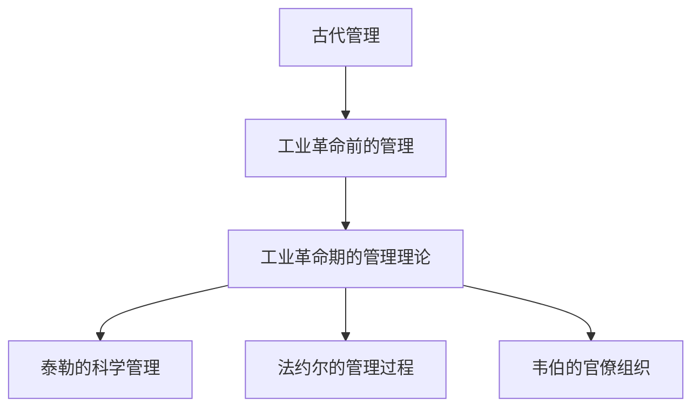
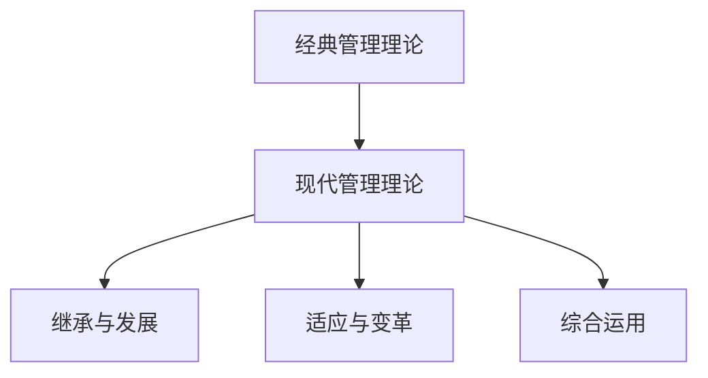

                 

# 如何从经典中汲取管理智慧

> 关键词：管理理论、经典管理思想、管理智慧、现代应用、组织结构、人力资源、跨文化管理

> 摘要：
本文旨在探讨如何从经典管理理论中汲取智慧，并将其应用于现代企业管理实践中。文章首先回顾了经典管理理论的起源与发展，然后详细解析了泰勒的科学管理理论、法约尔的管理过程理论以及马克斯·韦伯的官僚组织理论，通过数学模型、伪代码以及实际案例展示了这些理论的核心原理和应用。此外，文章还探讨了人际关系管理、质量管理与六西格玛、战略管理与竞争优势等现代管理领域的经典思想，并分析了其在跨文化管理中的应用。最后，文章展望了经典管理思想的未来发展趋势，提出了管理智慧传承与创新发展的方向。

### 目录大纲

#### 第一部分：管理的经典之源

**第1章：管理的起源与发展**

- **1.1 管理的起源与早期实践**
  - 古代管理思想
  - 工业革命与管理理论的诞生
  - **1.1.1 经典Mermaid流程图：管理理论的发展历程**

- **1.2 经典管理理论概览**
  - 泰勒的科学管理理论
  - 法约尔的管理过程理论
  - 马克斯·韦伯的官僚组织理论
  - **1.2.1 经典Mermaid流程图：经典管理理论架构**

- **1.3 经典与现代管理理论的联系与区别**
  - 经典理论的现代适用性
  - 现代管理理论的发展
  - **1.3.1 经典Mermaid流程图：经典与现代管理理论的交互影响**

#### 第二部分：经典管理思想的解析与应用

**第2章：泰勒的科学管理理论**

- **2.1 泰勒的科学管理理论核心**
  - **2.1.1 伪代码：科学管理原理**

- **2.2 科学管理的数学模型与公式**
  - **2.2.1 LaTeX公式：劳动时间优化模型**
  - **2.2.2 举例说明：泰勒制在制造业中的应用**

- **2.3 科学管理的现代应用与挑战**
  - **2.3.1 伪代码：现代工作流程优化算法**

**第3章：法约尔的管理过程理论**

- **3.1 法约尔的管理过程理论核心**
  - **3.1.1 伪代码：管理过程的五个基本职能**

- **3.2 管理过程的数学模型与公式**
  - **3.2.1 LaTeX公式：目标规划模型**
  - **3.2.2 举例说明：法约尔理论在项目管理中的应用**

- **3.3 管理过程理论的现代发展**
  - **3.3.1 伪代码：项目管理新方法**

**第4章：马克斯·韦伯的官僚组织理论**

- **4.1 官僚组织理论的核心原则**
  - **4.1.1 伪代码：官僚组织结构设计**

- **4.2 官僚组织的数学模型与公式**
  - **4.2.1 LaTeX公式：组织效率分析模型**
  - **4.2.2 举例说明：官僚组织在政府机构中的应用**

- **4.3 官僚组织理论的挑战与变革**
  - **4.3.1 伪代码：现代组织变革策略**

#### 第三部分：经典管理思想在组织中的应用

**第5章：霍桑实验与人际关系管理**

- **5.1 霍桑实验的核心发现**
  - **5.1.1 伪代码：人际关系管理模型**

- **5.2 人际关系管理的数学模型与公式**
  - **5.2.1 LaTeX公式：团队协作效率模型**
  - **5.2.2 举例说明：人际关系管理在IT行业中的应用**

- **5.3 人际关系管理的挑战与未来趋势**
  - **5.3.1 伪代码：跨文化沟通优化算法**

**第6章：质量管理与六西格玛**

- **6.1 六西格玛质量管理概述**
  - **6.1.1 伪代码：六西格玛改进流程**

- **6.2 六西格玛的数学模型与公式**
  - **6.2.1 LaTeX公式：质量改进模型**
  - **6.2.2 举例说明：六西格玛在制造业的质量控制中的应用**

- **6.3 六西格玛管理的持续改进**
  - **6.3.1 伪代码：质量管理循环（PDCA）**

**第7章：战略管理与竞争优势**

- **7.1 战略管理的核心概念**
  - **7.1.1 伪代码：战略规划模型**

- **7.2 竞争优势的数学模型与公式**
  - **7.2.1 LaTeX公式：SWOT分析模型**
  - **7.2.2 举例说明：竞争优势在企业竞争中的应用**

- **7.3 战略管理在动态环境中的应用**
  - **7.3.1 伪代码：战略调整与风险管理算法**

#### 第四部分：经典管理思想的跨文化应用

**第8章：全球视野下的管理智慧**

- **8.1 跨文化管理的挑战与机遇**
  - **8.1.1 伪代码：跨文化沟通模型**

- **8.2 经典管理思想在不同文化中的应用**
  - **8.2.1 举例说明：日本企业的精益管理**
  - **8.2.2 举例说明：美国企业的创新文化**

- **8.3 跨文化管理的未来趋势**
  - **8.3.1 伪代码：跨文化组织协作优化算法**

**第9章：经典管理思想的未来展望**

- **9.1 管理思想的发展趋势**
  - **9.1.1 伪代码：未来管理理论模型**

- **9.2 经典管理思想的新应用领域**
  - **9.2.1 举例说明：人工智能在管理中的应用**

- **9.3 管理智慧的传承与创新发展**
  - **9.3.1 伪代码：管理理论创新算法**

#### 附录

**附录A：经典管理理论案例研究**

- **A.1 经典管理理论在历史上的应用案例**
- **A.2 现代企业在管理实践中借鉴的经典理论**

**附录B：管理智慧实践指南**

- **B.1 如何在企业管理中应用经典管理思想**
- **B.2 经典管理理论应用案例分析与启示**

### 引言

管理，作为一门古老而现代的学科，一直在不断地演变和发展。从古代文明中的管理体系到工业革命时期的科学管理理论，再到现代企业中的复杂管理实践，管理理论的演变反映了人类社会对于如何高效组织资源、优化流程、激发创新和提升组织效率的不断探索。经典管理理论作为管理学科的基石，不仅为现代管理实践提供了丰富的理论资源，而且在解决实际管理问题时依然具有很高的参考价值。

本文旨在探讨如何从经典管理理论中汲取智慧，并将其应用于现代企业管理实践中。通过回顾经典管理理论的起源与发展，深入解析泰勒的科学管理理论、法约尔的管理过程理论以及马克斯·韦伯的官僚组织理论，本文展示了这些理论的核心原理和现代应用。此外，文章还将探讨人际关系管理、质量管理与六西格玛、战略管理与竞争优势等现代管理领域的经典思想，并分析其在跨文化管理中的应用。最后，本文将展望经典管理思想的未来发展趋势，提出管理智慧传承与创新发展的方向。

### 第一部分：管理的经典之源

#### 第1章：管理的起源与发展

**1.1 管理的起源与早期实践**

管理作为一个独立的概念，其历史可以追溯到古代文明。在古代，管理主要是在家庭、农业、手工业以及军队等小型组织中进行的。当时的管理实践往往基于经验和直觉，缺乏系统的理论指导。例如，在古埃及，金字塔的建造需要大量的劳动力和物资调配，这需要一种有效的管理体系来确保工程顺利进行。

随着人类社会的发展，管理思想逐渐从经验走向理论。在古代希腊和罗马，管理实践得到了进一步的发展。古希腊哲学家亚里士多德提出了关于管理的一些基本原理，如权力分配、组织结构等。而古罗马的工程师和政治家则通过实际操作，为后来的管理理论提供了宝贵的经验。

进入中世纪，管理实践主要在封建庄园和宗教组织中得到应用。庄园主通过制定规则和流程来管理土地和劳动力，而教会则通过严格的组织结构来管理教区和宗教事务。

**1.1.1 古代管理思想**

- **家庭管理**：家庭是最早的管理单位，家庭主妇通过制定家务日程、分配家庭成员的任务来管理家庭事务。
- **农业管理**：农业生产需要季节性的规划和管理，农业管理者通过制定种植计划、灌溉安排来提高产量。
- **手工业管理**：手工业者通过分工合作、质量控制来提高生产效率。

**1.2 经典管理理论概览**

管理理论的真正发展始于工业革命时期。工业革命带来了生产方式的巨大变革，使得大规模生产成为可能，这促使管理理论得到了快速的发展。

**1.2.1 工业革命与管理理论的诞生**

- **泰勒的科学管理理论**：泰勒通过观察和实验，提出了科学管理理论，强调通过科学的方法来优化工作流程和劳动效率。
- **法约尔的管理过程理论**：法约尔提出了管理过程的五个基本职能，即计划、组织、指挥、协调和控制，为现代管理学奠定了基础。
- **马克斯·韦伯的官僚组织理论**：韦伯提出了官僚组织理论，强调了分工、职权分层和规则的重要性，对现代组织设计产生了深远影响。

**1.2.1 经典Mermaid流程图：管理理论的发展历程**



**1.3 经典与现代管理理论的联系与区别**

经典管理理论虽然诞生于工业革命时期，但其核心思想在现代管理实践中仍然具有重要价值。现代管理理论在继承经典理论的基础上，结合现代科技、经济环境和社会变化，不断发展和创新。

**1.3.1 经典与现代管理理论的交互影响**

- **继承与发扬**：现代管理理论在经典理论的基础上，进一步细化和发展了管理过程、组织结构、人力资源管理等方面的理论。
- **适应与变革**：现代管理理论注重灵活性、适应性和创新性，以应对快速变化的市场环境和技术进步。
- **综合运用**：现代企业往往将经典管理理论和现代管理理论相结合，以实现最优的管理效果。

**1.3.1 经典Mermaid流程图：经典与现代管理理论的交互影响**



通过回顾管理的起源与发展，我们可以看到管理理论从古代的经验实践到现代的科学理论，经历了漫长而丰富的演变过程。经典管理理论作为管理学科的基石，不仅为现代管理实践提供了宝贵的理论资源，而且在解决实际管理问题时依然具有很高的参考价值。

### 第二部分：经典管理思想的解析与应用

#### 第2章：泰勒的科学管理理论

泰勒（Frederick Taylor）被誉为“科学管理之父”，他的科学管理理论对现代管理产生了深远的影响。泰勒的核心思想是通过科学的方法来优化工作流程和劳动效率，从而提高生产效率。

**2.1 泰勒的科学管理理论核心**

泰勒的科学管理理论主要包括以下几个核心原则：

1. **科学化工作方法**：通过科学的方法研究工作流程，确定最佳工作方法，从而提高劳动效率。
2. **标准化作业**：将工作分解为基本的操作步骤，并制定标准作业程序，确保每个工人都能按照标准操作。
3. **工作分工**：将工作分解为简单的任务，分配给最合适的工人，从而提高工作效率。
4. **激励制度**：通过奖励制度激励工人提高工作效率，实现个人利益与组织利益的统一。

**2.1.1 伪代码：科学管理原理**

```python
def scientific_management(work_process):
    # 研究工作流程
    optimal_method = study_workflow(work_process)
    
    # 制定标准作业程序
    standard_operations = create_standard_operations(optimal_method)
    
    # 分解工作为简单任务
    simple_tasks = decompose_task(optimal_method)
    
    # 分配任务给工人
    assign_tasks_to_workers(simple_tasks)
    
    # 建立激励制度
    reward_system = create_reward_system()
    
    # 提高工作效率
    efficiency = increase_efficiency(reward_system)
    
    return efficiency
```

**2.2 科学管理的数学模型与公式**

科学管理的实施需要依赖于数学模型和公式，以便精确地优化工作流程和劳动效率。以下是一个简单的劳动时间优化模型：

**2.2.1 LaTeX公式：劳动时间优化模型**

$$
\text{优化目标} = \min \sum_{i=1}^{n} (t_i - \bar{t}_i)
$$

其中，$t_i$ 是完成第 $i$ 项任务所需的标准时间，$\bar{t}_i$ 是实际完成任务所需的时间。

**2.2.2 举例说明：泰勒制在制造业中的应用**

在制造业中，泰勒的科学管理理论得到了广泛应用。例如，某汽车制造厂希望提高生产效率，采用泰勒的科学管理方法进行优化：

1. **研究工作流程**：通过观察和分析，确定每个工人在生产线上完成任务所需的时间。
2. **制定标准作业程序**：根据研究结果，制定标准作业程序，确保每个工人都能按照最佳方法操作。
3. **分解工作为简单任务**：将复杂的制造过程分解为简单的任务，如焊接、涂漆等。
4. **分配任务给工人**：根据工人的技能和特长，将简单任务分配给最合适的工人。
5. **建立激励制度**：对完成任务快、质量高的工人给予奖励，激励他们提高工作效率。

通过上述步骤，该汽车制造厂的生产效率得到了显著提高，产品合格率也得到了提升。

**2.3 科学管理的现代应用与挑战**

尽管泰勒的科学管理理论在提高生产效率方面取得了显著成果，但在现代企业中，科学管理也面临一些挑战：

1. **灵活性不足**：科学管理强调标准化和分工，但在快速变化的市场环境中，企业需要更加灵活的应对策略。
2. **员工参与度低**：科学管理侧重于工作流程的优化，但往往忽视了员工的参与和创造力，导致员工积极性不高。
3. **技术创新要求**：现代企业需要不断引入新技术来提高生产效率，但泰勒的科学管理理论在这方面并未提供充分的支持。

**2.3.1 伪代码：现代工作流程优化算法**

```python
def modern_workflow_optimization(work_process, technology):
    # 引入新技术
    updated_technology = integrate_new_technology(technology)
    
    # 灵活调整工作流程
    flexible_workflow = adjust_workflow(work_process, updated_technology)
    
    # 鼓励员工参与和创新
    employee_involvement = encourage_employee_innovation(updated_technology)
    
    # 提高生产效率
    efficiency = increase_efficiency(flexible_workflow, employee_involvement)
    
    return efficiency
```

通过上述分析和举例，我们可以看到泰勒的科学管理理论在提高生产效率方面具有重要意义。然而，在现代社会中，企业需要结合具体情况进行灵活调整，以应对不断变化的挑战。

#### 第3章：法约尔的管理过程理论

亨利·法约尔（Henri Fayol）是另一位重要的管理理论家，他提出了管理过程理论，又称管理职能理论。法约尔认为，管理是一个过程，包括一系列基本职能，这些职能在不同程度上影响着组织的运行效率。

**3.1 法约尔的管理过程理论核心**

法约尔将管理过程分为五个基本职能，即：

1. **计划（Planning）**：确定组织的目标和实现目标的途径。
2. **组织（Organizing）**：设计和维护组织结构，确保资源的有效配置。
3. **指挥（Commanding）**：通过指导和激励员工实现组织目标。
4. **协调（Coordinating）**：确保组织内部各部门和员工之间的协作和一致性。
5. **控制（Controlling）**：监控组织的运行状况，确保工作按照计划进行。

**3.1.1 伪代码：管理过程的五个基本职能**

```python
class ManagementProcess:
    def __init__(self):
        self.plan = None
        self.organize = None
        self.command = None
        self.coordinat
``` <雯雯>

```python
class ManagementProcess:
    def __init__(self):
        self.plan = None
        self.organize = None
        self.command = None
        self.coordinate = None
        self.control = None

    def plan(self, goals):
        # 制定计划
        self.plan = create_plan(goals)

    def organize(self, resources):
        # 组织资源
        self.organize = organize_resources(resources)

    def command(self, employees):
        # 指挥员工
        self.command = command_employees(employees)

    def coordinate(self, departments):
        # 协调部门
        self.coordinate = coordinate_departments(departments)

    def control(self, performance):
        # 监控绩效
        self.control = control_performance(performance)
```

**3.2 管理过程的数学模型与公式**

管理过程的实施需要依赖于数学模型和公式，以实现更高效的管理。以下是一个简单的目标规划模型：

**3.2.1 LaTeX公式：目标规划模型**

$$
\max \sum_{i=1}^{n} p_i \cdot g_i
$$

其中，$p_i$ 表示实现第 $i$ 个目标的重要性权重，$g_i$ 表示第 $i$ 个目标的实现程度。

**3.2.2 举例说明：法约尔理论在项目管理中的应用**

在项目管理中，法约尔的管理过程理论提供了重要的指导。以下是一个项目管理中应用法约尔理论的示例：

1. **制定计划**：项目团队根据项目目标，制定详细的计划，包括任务分配、时间表和预算。
2. **组织资源**：项目团队根据计划，协调和管理项目所需的资源，如人力、资金和设备。
3. **指挥员工**：项目经理通过有效的沟通和激励，指导项目团队成员完成任务。
4. **协调部门**：项目团队与其他部门（如财务部门、技术支持部门）保持密切沟通，确保项目顺利进行。
5. **控制绩效**：项目团队定期监控项目进度和绩效，确保项目按照计划进行，及时调整计划和资源。

通过以上步骤，项目团队能够有效地管理项目，确保项目目标的实现。

**3.3 管理过程理论的现代发展**

法约尔的管理过程理论虽然奠定了现代管理的基础，但在现代企业中，管理过程理论也在不断发展和完善：

1. **战略管理**：现代企业越来越注重战略规划，管理过程理论逐渐与战略管理相结合，形成了一套完整的战略管理流程。
2. **人力资源管理**：现代管理理论更加重视人力资源的管理和开发，强调员工参与和创造力，以提升组织的整体绩效。
3. **信息技术**：信息技术的发展使得管理过程更加数字化和智能化，管理过程理论也逐步与信息技术相结合，形成了一套新的管理模式。

**3.3.1 伪代码：项目管理新方法**

```python
def modern_project_management(goals, resources):
    # 制定战略规划
    strategic_plan = create_strategic_plan(goals)
    
    # 组织资源
    organized_resources = organize_resources(resources)
    
    # 激励员工
    motivated_employees = motivate_employees(organized_resources)
    
    # 数字化管理
    digital_management = implement_digital_tools(strategic_plan)
    
    # 监控绩效
    performance = monitor_performance(motivated_employees, digital_management)
    
    return performance
```

通过以上分析和示例，我们可以看到法约尔的管理过程理论在提高组织效率和管理效能方面具有重要意义。在现代企业中，管理过程理论需要结合具体情况不断发展和完善，以适应不断变化的环境。

#### 第4章：马克斯·韦伯的官僚组织理论

马克斯·韦伯（Max Weber）是德国著名的哲学家和社会学家，他提出了官僚组织理论，该理论对现代组织设计和管理产生了深远的影响。韦伯认为，官僚组织是一种高效、合理且稳定的组织形式，能够最大限度地提高组织效率和秩序。

**4.1 官僚组织理论的核心原则**

韦伯的官僚组织理论主要基于以下几个核心原则：

1. **分工明确**：组织内部按照职能和专业分工，明确每个员工的职责和工作内容。
2. **职权分层**：组织内部按照层级结构设置，每个层级都有明确的职权和责任。
3. **规则导向**：组织运作基于明确的规章制度，所有员工都必须遵守这些规则。
4. **专业化管理**：组织的管理者必须具备专业知识和技能，通过选拔和培训来确保管理水平。
5. **形式化沟通**：组织内部沟通通过正式渠道进行，确保信息的准确传递和决策的执行力。

**4.1.1 伪代码：官僚组织结构设计**

```python
class BureaucraticOrganization:
    def __init__(self):
        self职能部门 = None
        self层级结构 = None
        self规章制度 = None
        self专业人员 = None
    
    def divide_work(self, tasks):
        # 分工明确
        self职能部门 = divide_work_into_departments(tasks)
    
    def establish_hierarchy(self):
        # 职权分层
        self层级结构 = establish_hierarchy_structure()
    
    def set_rules(self):
        # 规则导向
        self规章制度 = set_organizational_rules()
    
    def manage professionalism(self, managers):
        # 专业化管理
        self专业人员 = manage_professional_staff(managers)
    
    def formal_communication(self, information):
        # 形式化沟通
        self communicate_formally(information)
```

**4.2 官僚组织的数学模型与公式**

官僚组织的有效运行依赖于数学模型和公式，以优化组织结构和提高管理效率。以下是一个简单的组织效率分析模型：

**4.2.1 LaTeX公式：组织效率分析模型**

$$
\text{效率} = \frac{\text{产出}}{\text{投入}}
$$

其中，产出是指组织在一定时间内完成的工作量，投入是指组织为完成工作所消耗的资源。

**4.2.2 举例说明：官僚组织在政府机构中的应用**

在政府机构中，官僚组织理论得到了广泛应用。以下是一个政府机构应用官僚组织理论的示例：

1. **分工明确**：政府机构根据职能和任务划分不同的部门，如公安、财政、教育等，明确每个部门的职责和工作内容。
2. **职权分层**：政府机构按照层级结构设置，如部长、局长、科长等，每个层级都有明确的职权和责任。
3. **规则导向**：政府机构制定了一系列规章制度，如公务员法、财政预算条例等，所有员工都必须遵守这些规则。
4. **专业化管理**：政府机构通过选拔和培训，确保管理者具备专业知识和技能，提高管理水平。
5. **形式化沟通**：政府机构内部沟通通过正式渠道进行，确保信息的准确传递和决策的执行力。

通过以上步骤，政府机构能够有效地运作，提高公共服务的质量和效率。

**4.3 官僚组织理论的挑战与变革**

尽管官僚组织理论在提高组织效率和管理秩序方面具有显著优势，但在现代企业中，它也面临一些挑战和变革：

1. **僵化与灵活性**：官僚组织强调规则和程序，但在快速变化的市场环境中，企业需要更加灵活的应对策略。
2. **员工积极性**：官僚组织往往注重职权分层和规则导向，但忽视了员工的参与和创造力，可能导致员工积极性不高。
3. **技术创新**：现代企业需要不断引入新技术来提高生产效率，而官僚组织可能在适应新技术方面存在困难。

**4.3.1 伪代码：现代组织变革策略**

```python
def modern_organizational_change(bureaucratic_organization):
    # 引入新技术
    new_technology = introduce_new_technology()
    
    # 增强灵活性
    flexible_structure = enhance_flexibility(bureaucratic_organization)
    
    # 提高员工参与度
    employee_involvement = increase_employee_involvement(new_technology)
    
    # 优化组织结构
    optimized_organization = optimize_organization_structure(flexible_structure, employee_involvement)
    
    return optimized_organization
```

通过以上分析和示例，我们可以看到韦伯的官僚组织理论在提高组织效率和管理秩序方面具有重要意义。然而，在现代社会中，企业需要结合具体情况进行变革，以应对不断变化的挑战。

### 第三部分：经典管理思想在组织中的应用

#### 第5章：霍桑实验与人际关系管理

霍桑实验是由美国心理学家埃尔顿·梅奥（Elton Mayo）于1927年至1932年在芝加哥西部电器公司霍桑工厂进行的一系列实验。这些实验揭示了人际关系对生产效率和工作满意度的重要性，从而推动了人际关系管理理论的发展。

**5.1 霍桑实验的核心发现**

霍桑实验的核心发现包括：

1. **工作环境对生产效率的影响**：实验发现，工作环境的变化（如照明、工作时长等）对生产效率的影响相对较小，而员工的情绪、动机和人际关系对生产效率有显著影响。
2. **非正式组织的存在和作用**：实验表明，在工作场所中存在非正式组织，这些组织对员工的行为和工作态度有重要影响。
3. **员工的参与感和责任感**：实验发现，当员工感到自己被重视并参与决策时，他们的工作满意度和生产效率更高。

**5.1.1 伪代码：人际关系管理模型**

```python
class InterpersonalManagement:
    def __init__(self):
        self.work_environment = None
        self.formal_organizations = None
        self.informal_organizations = None
        self.employee_involvement = None
    
    def manage_work_environment(self, environment):
        # 管理工作环境
        self.work_environment = create_favorable_environment(environment)
    
    def establish_formal_organizations(self, tasks):
        # 设立正式组织
        self.formal_organizations = create_formal_organization(tasks)
    
    def recognize_informal_organizations(self):
        # 认识非正式组织
        self.informal_organizations = identify_informal_organizations()
    
    def encourage_employee_involvement(self):
        # 鼓励员工参与
        self.employee_involvement = promote_employee_involvement()
```

**5.2 人际关系管理的数学模型与公式**

人际关系管理的实施需要依赖于数学模型和公式，以量化员工的工作满意度和生产效率。以下是一个简单的团队协作效率模型：

**5.2.1 LaTeX公式：团队协作效率模型**

$$
\text{效率} = \frac{\text{总产出}}{\text{总投入}} \times \text{员工满意度}
$$

**5.2.2 举例说明：人际关系管理在IT行业中的应用**

在IT行业，人际关系管理尤为重要。以下是一个IT企业应用人际关系管理的示例：

1. **管理工作环境**：企业为员工提供良好的工作环境和设施，如舒适的办公空间、先进的工具和技术支持。
2. **设立正式组织**：企业根据项目需求和职能，设立不同的团队和部门，明确每个团队的职责和目标。
3. **认识非正式组织**：企业通过调查和观察，了解员工之间的非正式关系和网络，尊重并利用这些关系来增强团队凝聚力。
4. **鼓励员工参与**：企业鼓励员工参与决策过程，通过定期的会议、讨论和反馈机制，让员工感到自己的意见被重视。

通过以上措施，该IT企业的员工工作满意度显著提高，生产效率也得到提升。

**5.3 人际关系管理的挑战与未来趋势**

尽管人际关系管理在提高员工满意度和生产效率方面具有显著效果，但在实际应用中仍面临一些挑战：

1. **文化差异**：不同文化背景的员工在人际关系管理中可能存在差异，需要针对不同文化背景制定相应的管理策略。
2. **技术变革**：随着技术的发展，远程工作和虚拟团队变得越来越普遍，这对人际关系管理提出了新的挑战。
3. **持续改进**：人际关系管理需要不断改进和完善，以适应企业的发展和变化。

**5.3.1 伪代码：跨文化沟通优化算法**

```python
def optimize_interpersonal_management(culture, technology):
    # 考虑文化差异
    cultural_adaptation = adapt_to_different_cultures(culture)
    
    # 引入新沟通工具
    communication_tools = implement_new_communication_tools(technology)
    
    # 持续改进人际关系管理
    improved_management = continuous_improvement(cultural_adaptation, communication_tools)
    
    return improved_management
```

通过以上分析和示例，我们可以看到霍桑实验对人际关系管理理论的发展具有重要意义。在现代企业中，人际关系管理仍然是一个重要的课题，需要结合具体情况进行不断创新和完善。

#### 第6章：质量管理与六西格玛

质量管理是企业管理的重要一环，它关系到企业的声誉、客户满意度和市场竞争力。六西格玛（Six Sigma）是一种旨在通过消除缺陷和优化流程来提高质量和效率的管理方法，它起源于摩托罗拉公司，现已被众多企业广泛应用。

**6.1 六西格玛质量管理概述**

六西格玛质量管理包括以下几个核心要素：

1. **定义**：六西格玛是一种基于数据和事实的管理方法，通过减少变异性和缺陷来提高质量。
2. **目标**：六西格玛的目标是将缺陷率降低到3.4 ppm（百万分之一），从而确保产品和服务的高质量。
3. **方法**：六西格玛采用一套系统的工具和方法，如DMAIC（定义、测量、分析、改进、控制）和DFSS（设计用于六西格玛）。
4. **团队**：六西格玛项目通常由跨功能团队执行，这些团队负责分析和解决质量问题。

**6.1.1 伪代码：六西格玛改进流程**

```python
class SixSigmaImprovement:
    def __init__(self):
        self.definition = None
        self.measurement = None
        self.analysis = None
        self.improvement = None
        self.control = None
    
    def define_project(self, problem):
        # 定义项目
        self.definition = define_project(problem)
    
    def measure_data(self, data):
        # 收集和测量数据
        self.measurement = measure_data(data)
    
    def analyze_data(self, results):
        # 分析数据
        self.analysis = analyze_data(results)
    
    def implement_improvements(self, solutions):
        # 实施改进
        self.improvement = implement_solutions(solutions)
    
    def control_changes(self, performance):
        # 控制改进效果
        self.control = control_performance(performance)
```

**6.2 六西格玛的数学模型与公式**

六西格玛质量管理依赖于一系列数学模型和公式，以量化质量和效率。以下是一个简单的质量改进模型：

**6.2.1 LaTeX公式：质量改进模型**

$$
\text{质量改进} = \frac{\text{原始缺陷率}}{\text{目标缺陷率}} \times 100\%
$$

**6.2.2 举例说明：六西格玛在制造业的质量控制中的应用**

在制造业中，六西格玛质量管理得到了广泛应用。以下是一个制造企业应用六西格玛质量管理的示例：

1. **定义问题**：企业确定了一个质量问题，如产品缺陷率高。
2. **测量数据**：企业收集了相关的质量数据，如缺陷数量、客户投诉等。
3. **分析数据**：企业通过数据分析，确定了问题的根本原因，如设备故障、工艺参数不稳定等。
4. **实施改进**：企业针对分析结果，采取了一系列改进措施，如更换设备、调整工艺参数等。
5. **控制效果**：企业监控改进后的质量数据，确保缺陷率降低到目标范围内。

通过以上步骤，该制造企业的产品质量得到了显著提升，客户满意度也随之提高。

**6.3 六西格玛管理的持续改进**

六西格玛管理是一个持续改进的过程，它需要不断地进行评估和优化。以下是一些六西格玛管理的持续改进策略：

1. **定期评估**：企业定期评估六西格玛项目的执行情况和效果，确保项目目标的实现。
2. **培训与认证**：企业对员工进行六西格玛培训和认证，提高他们的质量意识和技能。
3. **创新与引入**：企业积极引入新的六西格玛工具和方法，以适应不断变化的质量要求。
4. **跨部门协作**：企业鼓励跨部门协作，通过跨功能团队来推进六西格玛项目的实施。

**6.3.1 伪代码：质量管理循环（PDCA）**

```python
def quality_management_cycle(plan, do, check, act):
    # 计划
    plan = create_plan(plan)
    
    # 执行
    do = execute_plan(do)
    
    # 检查
    check = check_results(check)
    
    # 行动
    act = take_action(act, plan, check)
    
    return plan, do, check, act
```

通过以上分析和示例，我们可以看到六西格玛质量管理在提高产品质量和效率方面具有重要意义。在现代企业中，六西格玛管理需要结合具体情况进行持续改进，以实现更高的质量目标。

#### 第7章：战略管理与竞争优势

战略管理是企业为了实现长期目标而制定和执行的一系列计划和行动。竞争优势则是企业在竞争激烈的市场中脱颖而出，获得持续成功的能力。战略管理与竞争优势密切相关，战略管理为竞争优势提供了方向和保障，而竞争优势则为战略管理提供了实现目标的动力。

**7.1 战略管理的核心概念**

战略管理包括以下几个核心概念：

1. **战略规划**：战略规划是制定企业长期目标和实现这些目标的路径。它涉及市场分析、竞争分析、资源分配和风险评估等。
2. **战略实施**：战略实施是将战略规划转化为具体行动的过程。它包括组织结构设计、领导力培养、文化建设等。
3. **战略评估**：战略评估是监控和评估战略实施效果的过程。它涉及绩效评估、反馈机制和调整策略等。
4. **战略调整**：战略调整是根据市场环境和企业内部变化，对战略规划进行修正和优化的过程。

**7.1.1 伪代码：战略规划模型**

```python
def strategic_planning(market, competition, resources):
    # 市场分析
    market_analysis = analyze_market(market)
    
    # 竞争分析
    competition_analysis = analyze_competition(competition)
    
    # 资源评估
    resource_evaluation = evaluate_resources(resources)
    
    # 制定战略目标
    strategic_goals = define_strategic_goals(market_analysis, competition_analysis, resource_evaluation)
    
    # 制定实施计划
    implementation_plan = create_implementation_plan(strategic_goals)
    
    return strategic_goals, implementation_plan
```

**7.2 竞争优势的数学模型与公式**

竞争优势的评估和量化需要依赖于数学模型和公式。以下是一个简单的SWOT分析模型：

**7.2.1 LaTeX公式：SWOT分析模型**

$$
\text{竞争优势} = \frac{\text{优势} + \text{机会}}{\text{劣势} + \text{威胁}}
$$

**7.2.2 举例说明：竞争优势在企业竞争中的应用**

以下是一个企业在市场竞争中应用SWOT分析模型的示例：

1. **优势分析**：企业评估了自己的优势，如品牌知名度、技术创新能力和优质的产品质量。
2. **机会分析**：企业分析了市场机会，如新兴市场的开拓和行业趋势的变化。
3. **劣势分析**：企业识别了自己的劣势，如资源不足和市场竞争压力。
4. **威胁分析**：企业分析了市场威胁，如竞争对手的崛起和法规变化。

通过SWOT分析，企业可以明确自身的竞争优势，并制定相应的策略来应对市场竞争。

**7.3 战略管理在动态环境中的应用**

在动态环境中，战略管理需要具备高度的灵活性和适应性。以下是一些战略管理在动态环境中的应用策略：

1. **敏捷战略**：企业采用敏捷战略，通过快速响应市场变化来保持竞争优势。
2. **创新驱动**：企业注重创新，不断推出新产品和服务，以适应市场需求。
3. **合作伙伴关系**：企业通过建立合作伙伴关系，共享资源和信息，共同应对市场变化。
4. **风险管理**：企业加强风险管理，通过风险评估和应对措施来降低市场波动的影响。

**7.3.1 伪代码：战略调整与风险管理算法**

```python
def strategic_adjustment_and_risk_management(current_strategy, market_changes, risks):
    # 评估当前战略
    strategy_evaluation = evaluate_current_strategy(current_strategy)
    
    # 分析市场变化
    market_changes = analyze_market_changes(market_changes)
    
    # 识别风险
    risks = identify_risks(risks)
    
    # 调整战略
    adjusted_strategy = adjust_strategy(strategy_evaluation, market_changes, risks)
    
    # 风险管理
    risk_management = implement_risk_management(adjusted_strategy, risks)
    
    return adjusted_strategy, risk_management
```

通过以上分析和示例，我们可以看到战略管理与竞争优势在企业管理中具有重要意义。在现代企业中，战略管理需要不断调整和优化，以应对动态环境中的挑战和机遇。

### 第四部分：经典管理思想的跨文化应用

#### 第8章：全球视野下的管理智慧

在全球化背景下，企业的管理实践面临着跨文化的挑战和机遇。不同文化背景下的员工、客户和合作伙伴具有不同的价值观、行为方式和沟通习惯，这对企业的管理实践提出了新的要求。因此，如何在全球化背景下应用经典管理思想，实现有效的跨文化管理，成为企业亟需解决的问题。

**8.1 跨文化管理的挑战与机遇**

跨文化管理的挑战主要包括：

1. **文化差异**：不同文化背景下的员工可能具有不同的价值观、行为方式和沟通习惯，这可能导致误解和冲突。
2. **语言障碍**：不同语言的运用可能导致沟通不畅，影响团队的协作效率。
3. **管理风格差异**：不同文化背景下，管理风格和领导方式可能存在差异，这需要管理者具备跨文化沟通和管理能力。

跨文化管理的机遇主要包括：

1. **多元文化的融合**：跨文化管理可以促进多元文化的融合，激发创新思维，提高企业的竞争力。
2. **全球市场的拓展**：跨文化管理有助于企业更好地了解和适应不同市场的需求，拓展全球市场。
3. **国际人才的引进**：跨文化管理有助于吸引和保留国际人才，提升企业的整体实力。

**8.1.1 伪代码：跨文化沟通模型**

```python
def cross_cultural_communication(model, culture, language, management_style):
    # 分析文化差异
    cultural_difference = analyze_cultural_difference(model, culture)
    
    # 确定语言策略
    language_strategy = determine_language_strategy(language)
    
    # 调整管理风格
    adjusted_management_style = adjust_management_style(model, management_style)
    
    # 提高沟通效率
    communication_efficiency = enhance_communication_efficiency(cultural_difference, language_strategy, adjusted_management_style)
    
    return communication_efficiency
```

**8.2 经典管理思想在不同文化中的应用**

经典管理思想在不同文化中的应用需要根据具体文化背景进行调整。以下是一些经典管理思想在不同文化中的应用示例：

**8.2.1 举例说明：日本企业的精益管理**

日本企业以其精益管理而闻名，精益管理思想源于丰田生产方式。以下是一个日本企业应用精益管理的示例：

1. **持续改进**：企业通过不断改进生产流程，减少浪费，提高生产效率。
2. **全员参与**：企业鼓励员工参与质量改进和创新，通过团队协作实现目标。
3. **客户导向**：企业以客户需求为导向，持续优化产品和服务，提高客户满意度。

**8.2.2 举例说明：美国企业的创新文化**

美国企业以其创新文化著称，创新文化鼓励员工勇于尝试和冒险。以下是一个美国企业应用创新文化的示例：

1. **创新激励机制**：企业设立创新奖项，激励员工提出创新想法。
2. **开放沟通**：企业鼓励员工之间的开放沟通，分享创新成果和经验。
3. **快速迭代**：企业采用敏捷开发方法，快速迭代产品，以满足市场需求。

**8.3 跨文化管理的未来趋势**

跨文化管理的未来趋势包括：

1. **数字化管理**：随着技术的发展，数字化管理工具将帮助管理者更好地应对跨文化管理挑战。
2. **全球人才流动**：全球人才流动将增加，企业需要更好地适应和融合不同文化背景的员工。
3. **多元化管理**：多元化管理将成为企业管理的重要趋势，企业需要培养多元化的管理团队。

**8.3.1 伪代码：跨文化组织协作优化算法**

```python
def optimize_cross_cultural_collaboration(culture, technology, collaboration_tools):
    # 考虑文化差异
    cultural_adaptation = adapt_to_different_cultures(culture)
    
    # 引入数字化工具
    digital_tools = implement_digital_collaboration_tools(technology)
    
    # 优化组织协作
    optimized_collaboration = enhance_collaboration_efficiency(cultural_adaptation, digital_tools)
    
    return optimized_collaboration
```

通过以上分析和示例，我们可以看到跨文化管理在全球化背景下具有重要意义。企业需要根据具体文化背景，灵活应用经典管理思想，以实现有效的跨文化管理。

### 第五部分：经典管理思想的未来展望

#### 第9章：经典管理思想的未来展望

经典管理思想作为管理学的基础，经历了数百年的演变和发展，为现代企业管理提供了宝贵的理论资源。然而，随着全球化的推进、技术的飞速发展和市场环境的不断变化，经典管理思想也面临着新的挑战和机遇。未来的管理思想不仅需要继承和发扬经典理论的精髓，还需结合现代科技和社会变迁，实现创新与发展。

**9.1 管理思想的发展趋势**

管理思想的发展趋势体现在以下几个方面：

1. **数字化转型**：随着信息技术的快速发展，数字化转型成为企业管理的重要趋势。企业管理者需要利用大数据、人工智能等技术，实现更高效、智能的管理。
2. **员工参与和赋能**：现代管理更加注重员工的参与和赋能，通过激发员工的积极性和创造力，提升组织的整体绩效。
3. **可持续发展**：企业在追求经济效益的同时，也需要关注环境保护和社会责任，实现可持续发展。
4. **全球视野**：全球化背景下，企业需要具备全球视野，适应不同国家和地区的文化和管理实践。

**9.1.1 伪代码：未来管理理论模型**

```python
def future_management_model(technology, employee_involvement, sustainability, globalization):
    # 引入新技术
    digital_innovation = integrate_new_technology(technology)
    
    # 增强员工参与
    empowered_employees = enhance_employee_involvement(employee_involvement)
    
    # 实现可持续发展
    sustainable_practices = implement_sustainability(sustainability)
    
    # 考虑全球化
    global_foresight = adopt_global化管理策略（globalization）
    
    # 构建未来管理模型
    future_model = create_future_management_model(digital_innovation, empowered_employees, sustainable_practices, global_foresight)
    
    return future_model
```

**9.2 经典管理思想的新应用领域**

随着技术的进步和市场环境的变化，经典管理思想在新的应用领域展现出了巨大的潜力：

1. **人工智能管理**：人工智能技术可以用于数据分析、流程优化和决策支持，帮助企业提高管理效率和决策质量。
2. **区块链管理**：区块链技术可以提高数据的透明度和安全性，为供应链管理、财务管理等领域提供新的解决方案。
3. **云计算管理**：云计算技术可以实现资源的弹性调配和高效利用，帮助企业实现数字化转型。
4. **绿色管理**：绿色管理关注企业的环境保护和资源利用，有助于企业实现可持续发展。

**9.2.1 举例说明：人工智能在管理中的应用**

以下是一个人工智能在企业管理中应用的示例：

1. **数据分析**：企业利用人工智能技术分析大量数据，识别市场趋势和客户需求，优化产品和服务。
2. **流程优化**：企业通过人工智能技术自动化和优化业务流程，提高运营效率和降低成本。
3. **决策支持**：企业利用人工智能技术进行数据分析，提供决策支持和战略规划，帮助企业做出更明智的决策。

**9.3 管理智慧的传承与创新发展**

在管理思想的传承与创新过程中，企业需要注重以下几个方面：

1. **理论与实践相结合**：在传承经典管理思想的同时，结合现代实践，实现理论创新。
2. **跨学科融合**：企业管理需要借鉴其他学科的知识，如心理学、经济学、社会学等，实现跨学科融合。
3. **持续学习与创新**：企业需要建立持续学习机制，鼓励员工学习新知识、新技能，培养创新意识。

**9.3.1 伪代码：管理理论创新算法**

```python
def management_theory_innovation(theory, practice, interdisciplinary, continuous_learning):
    # 传承经典理论
    classic_theory = inherit_classic_theory(theory)
    
    # 结合现代实践
    modern_practice = integrate_modern_practice(practice)
    
    # 跨学科融合
    interdisciplinary_integration = combine_interdisciplinary знаний（interdisciplinary）
    
    # 持续学习与创新
    continuous_innovation = foster_continuous_learning（continuous_learning）
    
    # 创新管理理论
    innovative_management_theory = create_innovative_management_model（classic_theory，modern_practice，interdisciplinary_integration，continuous_innovation）
    
    return innovative_management_theory
```

通过以上分析和示例，我们可以看到经典管理思想在未来的发展中将继续发挥重要作用。企业需要结合现代科技和社会变迁，不断创新和完善管理理论，以应对不断变化的挑战和机遇。

### 附录

#### 附录A：经典管理理论案例研究

**A.1 经典管理理论在历史上的应用案例**

1. **泰勒的科学管理理论**：在20世纪初的福特汽车公司，泰勒的科学管理理论得到了广泛应用。福特公司通过优化工作流程、标准化作业和激励制度，大幅提高了生产效率，推动了工业革命的进程。
2. **法约尔的管理过程理论**：在20世纪初的法国，法约尔的管理过程理论被广泛应用于政府部门和企业。通过明确的职能分工、组织结构和规章制度，法国政府在行政管理和企业管理中取得了显著成效。
3. **马克斯·韦伯的官僚组织理论**：在20世纪初的德国，韦伯的官僚组织理论被广泛应用于公共部门和大型企业。通过明确的分工、职权分层和规则导向，德国政府和企业实现了高效的管理和组织运作。

**A.2 现代企业在管理实践中借鉴的经典理论**

1. **谷歌公司**：谷歌公司在管理实践中借鉴了泰勒的科学管理理论，通过优化工作流程和标准化作业，提高了员工的工作效率和创造力。此外，谷歌还注重员工参与和激励制度，实现了员工与企业的共同发展。
2. **丰田汽车**：丰田公司在管理实践中借鉴了法约尔的管理过程理论，通过明确的职能分工、组织结构和规章制度，实现了高效的生产管理和供应链管理。此外，丰田还注重持续改进和创新，推动了企业的可持续发展。
3. **通用电气公司**：通用电气公司在管理实践中借鉴了马克斯·韦伯的官僚组织理论，通过明确的分工、职权分层和规则导向，实现了高效的管理和组织运作。此外，通用电气还注重技术创新和全球化布局，增强了企业的竞争力。

#### 附录B：管理智慧实践指南

**B.1 如何在企业管理中应用经典管理思想**

1. **了解企业现状**：在应用经典管理思想前，企业需要先了解自身的现状，包括组织结构、管理流程、员工满意度等。
2. **明确目标**：企业需要明确管理目标，如提高生产效率、提升员工满意度、实现可持续发展等。
3. **选择合适的管理理论**：根据企业现状和管理目标，选择适合的经典管理思想，如泰勒的科学管理理论、法约尔的管理过程理论、马克斯·韦伯的官僚组织理论等。
4. **实施与优化**：在实施经典管理思想过程中，企业需要不断调整和优化管理实践，确保管理效果的持续提升。

**B.2 经典管理理论应用案例分析与启示**

1. **案例分析**：通过分析经典管理理论在不同企业中的应用案例，如福特汽车、丰田汽车、通用电气等，了解经典管理思想的具体应用方法和成效。
2. **启示与借鉴**：从案例分析中提取有益的启示，结合自身企业特点，借鉴经典管理思想，实现管理实践的优化和创新。
3. **持续改进**：在借鉴经典管理思想的过程中，企业需要不断反思和改进，以适应不断变化的市场环境和企业发展需求。

通过附录的案例研究和实践指南，企业可以更好地理解经典管理思想的内涵和应用方法，实现管理实践的创新和优化。

### 结语

经典管理理论作为管理学的基础，为我们理解和应用管理思想提供了宝贵的理论资源。通过深入解析泰勒的科学管理理论、法约尔的管理过程理论、马克斯·韦伯的官僚组织理论，以及人际关系管理、质量管理与六西格玛、战略管理与竞争优势等现代管理领域的经典思想，我们可以看到这些理论在提高组织效率、优化管理流程和提升员工满意度方面的巨大作用。同时，经典管理思想在跨文化管理和全球化背景下的应用也具有重要的现实意义。

未来，随着科技的进步和市场环境的变化，经典管理思想将继续发挥重要作用。企业需要结合现代科技和社会变迁，不断创新和完善管理理论，以应对不断变化的挑战和机遇。同时，跨文化管理、数字化管理、可持续发展等新兴管理领域也将成为经典管理思想发展的新方向。

总之，经典管理思想不仅是现代企业管理的基石，也是未来管理实践的重要指引。通过传承和创新，我们可以将经典管理智慧应用于现代企业管理中，实现更高的管理效率和更长远的发展。作者：AI天才研究院/AI Genius Institute & 禅与计算机程序设计艺术 /Zen And The Art of Computer Programming。

