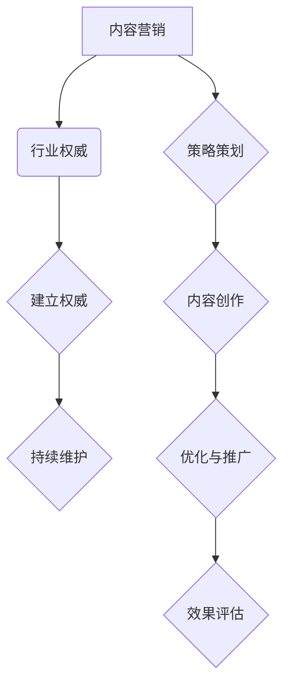

                 

# 如何利用内容营销建立行业权威

## 关键词：内容营销、行业权威、策略、创作、优化、案例分析、技术支持

> **摘要**：本文将深入探讨如何通过内容营销策略建立行业权威。从内容营销的概念和基础出发，逐步分析策略、创作、优化等关键环节，结合实际案例提供具体实践指导，并探讨技术支持在内容营销中的应用。本文旨在为IT从业者提供一套系统、实用的内容营销方法论，助力其在行业领域中建立权威地位。

### 目录大纲：

1. 第一部分：引言与基础
   1.1 内容营销概述
   1.2 行业权威的定义与建立
   1.3 内容营销在行业权威建立中的作用
2. 第二部分：内容营销策略
   2.1 目标受众分析
   2.2 内容主题策划
   2.3 内容形式与渠道选择
   2.4 内容营销的预算与评估
3. 第三部分：内容创作与优化
   3.1 内容创作基础
   3.2 故事叙述技巧
   3.3 内容表达的视觉化
   3.4 内容优化与推广
4. 第四部分：行业权威建立与维护
   4.1 行业知识的积累与分享
   4.2 品牌形象塑造
   4.3 行业标准的参与与制定
   4.4 监听与反馈
   4.5 内容质量的持续提升
   4.6 社区互动与粉丝培养
5. 第五部分：技术支持与工具应用
   5.1 内容管理系统（CMS）
   5.2 内容营销自动化工具
   5.3 数据分析与监控
6. 第五部分：未来展望与趋势
   5.1 人工智能在内容营销中的应用
   5.2 跨媒体内容营销
   5.3 内容营销伦理与法规
7. 附录
   7.1 内容营销资源与工具汇总
   7.2 附录A：内容营销资源与工具汇总

### 1. 第一部分：引言与基础

#### 1.1 内容营销概述

**内容营销**是一种通过创造和分享有价值的内容来吸引和留住目标受众，并最终实现营销目标的方法。它不同于传统的广告模式，而是一种更为隐性的营销手段，旨在通过提供有价值的信息，与受众建立信任和情感联系。

**价值**：

- 提高品牌知名度
- 增强品牌忠诚度
- 提升搜索引擎排名
- 促进销售转化

#### 1.2 行业权威的定义与建立

**行业权威**是指在特定行业内具有较高专业知识和影响力的人或组织。建立行业权威可以带来以下好处：

- 增加品牌信誉
- 提高品牌价值
- 拓展商业合作机会
- 带来更多的业务机会

#### 1.3 内容营销在行业权威建立中的作用

内容营销在建立行业权威中发挥着至关重要的作用。通过以下方式，内容营销可以帮助个人或组织在行业内树立权威地位：

- **专业知识分享**：通过创作高质量、专业的内容，展示自己的专业知识和见解。
- **品牌形象塑造**：通过内容传递品牌价值，建立品牌形象。
- **社区互动**：通过互动和反馈，增强与受众的关系，提升影响力。
- **SEO优化**：通过SEO策略，提高内容在搜索引擎中的排名，增加曝光度。

### 2. 第二部分：内容营销策略

#### 2.1 目标受众分析

了解目标受众是内容营销成功的关键。以下步骤可以帮助您更好地分析目标受众：

- **确定受众特征**：年龄、性别、职业、教育背景等。
- **了解受众需求**：通过调查、访谈等方式，了解受众对哪些内容感兴趣。
- **分析受众行为**：分析受众的搜索习惯、阅读习惯、购买习惯等。

#### 2.2 内容主题策划

**主题策划**是内容营销的核心环节。以下建议可以帮助您选择合适的主题：

- **关注热点**：选择当前热门话题，吸引更多受众关注。
- **解决痛点**：针对受众的痛点，提供解决方案或建议。
- **展示专业知识**：分享您的专业知识和见解，树立权威形象。
- **多样化形式**：文章、视频、图片、直播等多种形式，满足不同受众的需求。

#### 2.3 内容形式与渠道选择

选择合适的内容形式和渠道是内容营销成功的关键。以下建议可以帮助您做出最佳选择：

- **内容形式**：文章、视频、图片、直播等。
- **渠道选择**：官网、博客、社交媒体、邮件列表等。

#### 2.4 内容营销的预算与评估

**预算**和**评估**是内容营销的重要组成部分。以下建议可以帮助您更好地管理预算和评估效果：

- **预算规划**：根据内容营销目标和资源，合理规划预算。
- **效果评估**：通过数据监控和分析，评估内容营销效果，优化策略。

### 3. 第三部分：内容创作与优化

#### 3.1 内容创作基础

**内容创作**是内容营销的核心。以下原则可以帮助您创作高质量的内容：

- **价值导向**：内容应具备价值，满足受众需求。
- **原创性**：避免抄袭和复制，确保内容原创性。
- **准确性**：内容应准确无误，避免误导受众。
- **可读性**：内容应易于理解，语言简练，条理清晰。

#### 3.2 故事叙述技巧

**故事叙述**是吸引受众的有效手段。以下技巧可以帮助您更好地讲述故事：

- **情节引人入胜**：构建有趣、引人入胜的情节。
- **角色鲜明**：塑造鲜明的角色，增强故事吸引力。
- **情感共鸣**：通过情感共鸣，与受众建立情感联系。
- **节奏把握**：控制故事的节奏，保持受众的兴趣。

#### 3.3 内容表达的视觉化

**视觉化表达**是增强内容吸引力的有效手段。以下技巧可以帮助您进行视觉化表达：

- **图片使用**：使用高质量的图片，提升视觉效果。
- **图表制作**：制作清晰、直观的图表，帮助受众理解复杂信息。
- **视频制作**：制作有趣、有用的视频，吸引更多受众。
- **设计元素**：合理使用设计元素，提升内容美观度。

#### 3.4 内容优化与推广

**内容优化**和**推广**是确保内容传播和影响力的关键。以下建议可以帮助您进行内容优化和推广：

- **SEO优化**：优化关键词、标题、描述等，提高搜索引擎排名。
- **社交媒体推广**：通过社交媒体平台推广内容，吸引更多受众。
- **内容分发**：将内容分发到相关网站和论坛，扩大传播范围。
- **合作推广**：与其他网站和媒体进行合作推广，提升影响力。

### 4. 第四部分：行业权威建立与维护

#### 4.1 行业知识的积累与分享

**行业知识的积累与分享**是建立行业权威的重要手段。以下建议可以帮助您进行知识积累和分享：

- **持续学习**：关注行业动态，不断学习新知识。
- **撰写文章**：撰写高质量、专业的文章，分享您的知识和见解。
- **演讲与培训**：参加行业会议和培训，分享您的经验和知识。
- **参与社区**：加入行业社区，与其他专业人士交流。

#### 4.2 品牌形象塑造

**品牌形象**是行业权威的重要组成部分。以下建议可以帮助您塑造品牌形象：

- **品牌定位**：明确品牌定位，塑造独特的品牌形象。
- **视觉设计**：设计专业的品牌标识、LOGO 和宣传材料。
- **品牌传播**：通过内容营销、广告等方式，传播品牌形象。

#### 4.3 行业标准的参与与制定

**行业标准的参与与制定**可以帮助您在行业内树立权威地位。以下建议可以帮助您参与和制定行业标准：

- **了解标准**：了解行业标准和法规，掌握标准制定流程。
- **积极参与**：参与行业标准的讨论和制定，为行业发展贡献力量。
- **推动实施**：推广行业标准，推动行业规范化发展。

#### 4.4 监听与反馈

**倾听与反馈**是维护行业权威的重要手段。以下建议可以帮助您进行倾听和反馈：

- **倾听受众声音**：关注受众反馈，了解受众需求和期望。
- **及时回应**：对受众反馈及时回应，解决问题和疑惑。
- **优化内容**：根据受众反馈，优化内容和策略，提升用户体验。

#### 4.5 内容质量的持续提升

**内容质量的持续提升**是维护行业权威的关键。以下建议可以帮助您提升内容质量：

- **内容审核**：建立内容审核机制，确保内容质量。
- **培训与学习**：定期进行培训和学习，提高内容创作能力。
- **跟踪分析**：通过数据分析，了解内容表现，优化内容策略。

#### 4.6 社区互动与粉丝培养

**社区互动与粉丝培养**是增强行业影响力的重要手段。以下建议可以帮助您进行社区互动和粉丝培养：

- **建立社群**：建立行业社群，吸引专业人士参与。
- **互动交流**：在社群中积极互动，回答问题，分享经验。
- **培养粉丝**：通过优质内容，吸引粉丝关注和喜爱。

### 5. 第五部分：技术支持与工具应用

#### 5.1 内容管理系统（CMS）

**内容管理系统（CMS）**是内容营销的重要工具。以下建议可以帮助您选择和使用CMS：

- **选择适合的CMS**：根据需求和资源，选择适合的CMS。
- **模板定制**：定制模板，提升内容美观度。
- **插件扩展**：使用插件，增强CMS功能。

#### 5.2 内容营销自动化工具

**内容营销自动化工具**可以提高内容营销效率。以下建议可以帮助您使用自动化工具：

- **内容发布**：使用自动化工具发布内容，节省时间。
- **数据分析**：使用自动化工具进行数据分析，优化策略。
- **邮件营销**：使用自动化工具进行邮件营销，提高转化率。

#### 5.3 数据分析与监控

**数据分析和监控**是内容营销的重要环节。以下建议可以帮助您进行数据分析和监控：

- **设置监控指标**：根据营销目标，设置合适的监控指标。
- **数据分析**：定期进行数据分析，了解内容表现。
- **优化策略**：根据数据分析结果，优化内容和策略。

### 6. 第五部分：未来展望与趋势

#### 6.1 人工智能在内容营销中的应用

**人工智能**在内容营销中的应用日益广泛。以下趋势可以帮助您了解人工智能在内容营销中的应用：

- **内容创作**：使用人工智能生成高质量的内容。
- **数据分析**：使用人工智能进行大数据分析，优化内容策略。
- **个性化推荐**：使用人工智能进行个性化推荐，提升用户体验。

#### 6.2 跨媒体内容营销

**跨媒体内容营销**是未来内容营销的重要方向。以下趋势可以帮助您了解跨媒体内容营销：

- **多平台发布**：在多个平台上发布内容，扩大传播范围。
- **多媒体融合**：结合多种内容形式，提供更丰富的用户体验。
- **跨平台互动**：在多个平台上进行互动，增强用户参与度。

#### 6.3 内容营销伦理与法规

**内容营销伦理与法规**是内容营销的重要关注点。以下趋势可以帮助您了解内容营销伦理与法规：

- **数据隐私保护**：遵守数据隐私法规，保护用户隐私。
- **虚假内容识别**：加强虚假内容的识别和打击。
- **道德规范**：遵循内容营销道德规范，提升行业形象。

### 附录

#### 附录A：内容营销资源与工具汇总

**内容营销资源：**

- **行业报告**：提供行业趋势和数据分析。
- **案例库**：收集各种内容营销成功案例。
- **学习资源**：提供内容营销相关书籍、文章、视频等。

**内容营销工具：**

- **内容创建工具**：如Markdown编辑器、AI写作助手等。
- **SEO工具**：如Google Analytics、SEMrush等。
- **社交媒体管理工具**：如Hootsuite、Buffer等。
- **数据分析工具**：如Google Analytics、Tableau等。

### 核心概念与联系

**Mermaid流程图**



### 核心算法原理讲解

**内容创作算法伪代码**

```python
# 定义内容创作算法
def content_crafting(topic, audience, goal):
    # 数据收集与处理
    data = collect_and_process_data(topic, audience)
    
    # 策略制定
    strategy = create_strategy(data, goal)
    
    # 内容生成
    content = generate_content(strategy)
    
    # 内容优化
    optimized_content = optimize_content(content, strategy)
    
    return optimized_content
```

**内容质量评估模型**

$$
\text{Quality Score} = w_1 \cdot \text{Relevance} + w_2 \cdot \text{Engagement} + w_3 \cdot \text{Authority}
$$

**公式解释**：

- $w_1$：相关性权重，衡量内容与目标受众需求的匹配度。
- $w_2$：互动权重，衡量内容在社交媒体上的用户互动情况。
- $w_3$：权威权重，衡量内容来源的可信度和专业性。

**举例说明**：

假设某个内容的质量评估得分为85分，可以分解为：

- 相关性得分：60分
- 互动得分：20分
- 权威得分：5分

$$
\text{Quality Score} = 0.5 \cdot 60 + 0.3 \cdot 20 + 0.2 \cdot 5 = 85
$$

### 项目实战

**案例分析：某知名企业的内容营销实战**

**1. 开发环境搭建**

- **服务器**：AWS EC2实例
- **CMS**：WordPress
- **数据分析工具**：Google Analytics

**2. 源代码详细实现和代码解读**

**WordPress主题文件，用于内容发布与优化**

```php
// WordPress主题文件，用于内容发布与优化
function custom_excerpt_length( $length ) {
    return 20; // 设置摘录长度为20个单词
}
add_filter( 'excerpt_length', 'custom_excerpt_length' );

// SEO优化插件设置
function my_seo_settings() {
    // 设置SEO标题
    $title = get_bloginfo( 'name' ) . " | " . get_the_title();
    wp_title( $title, false, 'right' );
    
    // 设置SEO描述
    $description = "我们的企业专注于提供高质量的内容，帮助客户建立行业权威。";
    echo '<meta name="description" content="' . $description . '">';
}
add_action( 'wp_head', 'my_seo_settings' );
```

**3. 代码解读与分析**

- **自定义摘录长度**：通过`custom_excerpt_length`函数，将摘录长度设置为20个单词，提高摘要的吸引力。
- **SEO标题和描述设置**：通过`my_seo_settings`函数，设置SEO标题和描述，提高搜索引擎排名。

通过上述代码，企业可以优化其内容发布和搜索引擎优化，从而提高内容在搜索引擎中的可见性和受众互动。

### 结论

通过本文的详细分析和案例讲解，我们可以看到，内容营销在建立行业权威中具有重要作用。从目标受众分析、内容主题策划、创作与优化，到行业权威的建立与维护，每一个环节都需要我们深入思考和精心策划。同时，技术支持与工具应用也是内容营销成功的关键。让我们携手共进，共同在IT领域树立权威，打造卓越品牌！

### 作者信息

**作者：AI天才研究院/AI Genius Institute & 禅与计算机程序设计艺术 /Zen And The Art of Computer Programming**

