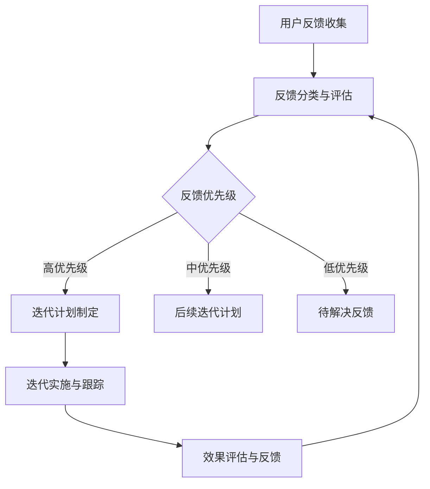

                 

### 第1章: 引言

## 1.1 用户反馈的重要性

### 1.1.1 用户反馈的定义与意义

用户反馈是用户在使用产品或服务过程中，对产品功能、性能、用户体验等方面提出的意见、建议或评价。这些反馈可以是积极的，也可以是消极的。用户反馈的意义在于：

1. **了解用户需求**：用户反馈直接反映了用户的需求和期望，通过分析用户反馈，产品团队可以深入了解用户的需求，从而更好地满足用户的需求。
2. **发现产品问题**：用户反馈可以帮助团队发现产品中存在的问题，这些问题可能是在产品设计和开发过程中被忽视的，通过用户反馈，可以及时调整和优化产品。
3. **提升用户体验**：通过分析用户反馈，产品团队可以优化产品功能，改善用户体验，提高用户满意度，从而提升产品的市场竞争力。
4. **推动产品创新**：用户反馈可以为产品创新提供灵感，通过了解用户的需求和痛点，产品团队可以开发出更符合市场需求的新功能，推动产品创新。

### 1.1.2 用户反馈对产品迭代的影响

用户反馈对产品迭代有着深远的影响，主要体现在以下几个方面：

1. **改进产品设计**：用户反馈可以帮助团队发现产品设计中存在的问题，从而进行改进。例如，用户可能对某个功能的使用体验不佳，产品团队可以通过用户反馈了解具体的问题所在，并进行相应的优化。
2. **优化用户体验**：用户反馈提供了用户对产品使用过程中的感受和情绪，通过分析这些反馈，团队可以针对性地优化产品功能，提升用户体验。
3. **增强用户满意度**：及时响应用户反馈，解决用户问题，可以提高用户的满意度，从而增强用户对产品的忠诚度。
4. **推动产品创新**：用户反馈是产品创新的源泉。通过了解用户的需求和痛点，团队可以开发出更符合市场需求的新功能，推动产品的持续创新。

## 1.2 本书概述

### 1.2.1 本书的目标与结构

本书的目标是帮助读者深入理解如何利用用户反馈驱动产品迭代，提高产品的竞争力。本书的结构如下：

- **第1章：引言**：介绍用户反馈的重要性，以及本书的目标和结构。
- **第2章：用户反馈的类型与收集**：介绍用户反馈的类型、收集渠道和有效性评估。
- **第3章：用户反馈的处理流程**：介绍用户反馈的收集、分类和优先级评估。
- **第4章：用户反馈驱动的产品设计**：介绍如何基于用户反馈进行产品设计。
- **第5章：用户反馈驱动的产品优化**：介绍用户反馈驱动的产品迭代过程和性能优化。
- **第6章：用户反馈驱动的用户参与**：介绍用户参与的重要性、策略和激励措施。
- **第7章：用户反馈驱动的数据分析和模型应用**：介绍用户反馈驱动的数据分析和机器学习模型应用。
- **第8章：案例研究**：通过实际案例展示如何利用用户反馈驱动产品迭代和优化。
- **第9章：用户反馈驱动的产品管理**：介绍用户反馈驱动的产品管理原则、实践和案例分析。

### 1.2.2 阅读本书的预期收获

阅读本书，读者可以预期获得以下收获：

- **理解用户反馈的重要性**：通过本书，读者将深刻认识到用户反馈在产品迭代和创新中的关键作用。
- **掌握用户反馈收集与分析方法**：读者将学会如何有效地收集用户反馈，并运用数据分析方法对反馈进行深入挖掘。
- **提高产品迭代效率**：通过学习本书，读者将能够更好地利用用户反馈驱动产品迭代，提高产品更新速度和用户满意度。
- **提升用户体验**：读者将掌握用户反馈驱动的用户体验优化策略，从而提升产品的整体用户体验。
- **拓展产品创新思路**：读者将学会从用户反馈中发现新的市场需求和产品功能，为产品创新提供源源不断的灵感。

### 1.3 小结

用户反馈是产品迭代和创新的重要驱动力。通过本书，读者将深入了解如何利用用户反馈驱动产品迭代，提高产品的竞争力。从用户反馈的类型与收集、处理流程，到驱动产品设计和优化，再到用户参与和数据分析，本书将全面展示如何将用户反馈转化为产品改进和创新的动力。让我们一起探索这个充满挑战和机遇的领域吧！

### 第2章: 用户反馈的类型与收集

用户反馈是产品迭代和优化的关键因素。为了有效地利用用户反馈，首先需要了解用户反馈的类型及其收集渠道。本章将详细介绍用户反馈的类型、收集渠道以及如何评估反馈的有效性。

#### 2.1 用户反馈的类型

用户反馈可以分为以下几种类型：

1. **功能性反馈**：
   - **定义**：功能性反馈是用户对产品功能的评价，包括功能是否齐全、使用是否便捷等。
   - **内容**：用户可能会反馈某个功能缺失、功能不稳定、功能使用不便等问题。
   - **特点**：直接反映产品的功能性能。

2. **体验性反馈**：
   - **定义**：体验性反馈是用户对产品使用过程中的感受和情绪，包括用户界面设计、交互设计、操作流畅性等。
   - **内容**：用户可能会反馈界面美观度、操作流畅性、交互设计合理性等问题。
   - **特点**：反映用户的整体体验感受。

3. **性能反馈**：
   - **定义**：性能反馈是用户对产品性能的评价，包括系统响应时间、稳定性、安全性等。
   - **内容**：用户可能会反馈系统卡顿、崩溃、安全性问题等问题。
   - **特点**：关注产品的技术实现和性能指标。

#### 2.2 用户反馈的收集渠道

用户反馈可以通过多种渠道进行收集，以下是一些常见的渠道：

1. **用户调研**：
   - **定义**：用户调研是通过问卷、访谈等方式直接从用户处收集反馈。
   - **特点**：可以获得深度、详细的用户意见。

2. **客户访谈**：
   - **定义**：客户访谈是针对特定用户群体进行一对一或小组讨论，收集反馈。
   - **特点**：可以深入了解用户的具体需求和痛点。

3. **在线问卷**：
   - **定义**：在线问卷是通过网络平台发布问卷，收集用户反馈。
   - **特点**：覆盖面广，效率高，但可能存在数据质量参差不齐的问题。

4. **社交媒体监测**：
   - **定义**：社交媒体监测是通过社交媒体平台监控用户对产品的评论和讨论。
   - **特点**：可以快速获取大量用户反馈，但可能涉及真实性判断。

#### 2.3 用户反馈的有效性评估

收集到用户反馈后，评估反馈的有效性是非常重要的。以下是一些评估反馈有效性的方法：

1. **数据质量评估**：
   - **定义**：数据质量评估是判断用户反馈数据的真实性和可靠性。
   - **方法**：包括数据去重、格式统一、缺失值处理等。

2. **反馈真实性的判断**：
   - **定义**：反馈真实性的判断是识别用户反馈是否真实反映用户意见。
   - **方法**：包括用户背景调查、数据分析等。

### 2.4 小结

用户反馈的类型和收集渠道决定了我们如何有效地利用这些反馈来驱动产品迭代。功能性反馈关注产品的功能性能，体验性反馈关注用户的整体体验感受，性能反馈关注产品的技术实现和性能指标。通过用户调研、客户访谈、在线问卷和社交媒体监测等渠道，我们可以收集到丰富的用户反馈。评估反馈的有效性是确保我们能够正确理解用户需求的关键。通过本章的介绍，读者将能够更好地理解用户反馈的类型与收集，为后续章节的学习打下基础。

### 第3章: 用户反馈的处理流程

用户反馈的处理流程是确保用户反馈能够有效地转化为产品改进和优化的关键步骤。本章将详细介绍用户反馈的处理流程，包括反馈收集、分类和优先级评估。

#### 3.1 反馈收集

用户反馈的收集是处理流程的第一步，确保反馈能够被及时、准确地收集到。以下是一些反馈收集的方法：

1. **自动化工具的选择与应用**：
   - **定义**：自动化工具是用于收集用户反馈的软件工具。
   - **选择**：根据产品特点和需求，选择合适的自动化工具，如反馈收集系统、用户调研工具等。
   - **应用**：通过自动化工具实现用户反馈的实时收集和分类。

2. **数据清洗与预处理**：
   - **定义**：数据清洗与预处理是对收集到的用户反馈进行处理，提高数据质量。
   - **内容**：包括数据去重、格式统一、缺失值处理等。

#### 3.2 反馈分类

用户反馈的分类有助于更好地理解和分析反馈，从而有针对性地进行改进和优化。以下是一些常见的反馈分类方法：

1. **功能性反馈分类**：
   - **定义**：功能性反馈分类是根据反馈的内容将用户反馈分为功能相关类别。
   - **方法**：通过关键词提取、自然语言处理等技术实现分类。

2. **体验性反馈分类**：
   - **定义**：体验性反馈分类是根据反馈的内容和情感将用户反馈分为体验相关类别。
   - **方法**：通过情感分析、文本分类等技术实现分类。

3. **性能反馈分类**：
   - **定义**：性能反馈分类是根据反馈的内容和性能指标将用户反馈分为性能相关类别。
   - **方法**：通过性能指标识别、数据分析等技术实现分类。

#### 3.3 反馈优先级评估

对用户反馈进行优先级评估有助于产品团队确定哪些反馈需要优先处理。以下是一些常见的评估方法：

1. **根据反馈严重性和影响评估优先级**：
   - **定义**：根据反馈严重性和影响评估优先级是判断用户反馈的重要程度。
   - **方法**：通过评估反馈的严重性（如功能缺陷的严重程度）和影响（如对用户满意度的影响）确定优先级。

2. **利用数据分析工具进行优先级排序**：
   - **定义**：利用数据分析工具进行优先级排序是通过数据分析手段对用户反馈进行排序。
   - **方法**：通过统计分析、数据可视化等技术对用户反馈进行优先级排序。

### 3.4 小结

用户反馈的处理流程是确保用户反馈能够有效地转化为产品改进和优化的重要步骤。通过自动化工具的选择与应用、数据清洗与预处理，我们可以确保反馈的准确性和完整性。反馈分类和优先级评估有助于我们更好地理解和分析反馈，从而有针对性地进行改进和优化。通过本章的介绍，读者将能够更好地理解用户反馈的处理流程，为后续章节的学习打下基础。

### 第4章: 用户反馈驱动的产品设计

用户反馈是产品设计和迭代的重要驱动力。通过用户反馈，产品团队能够深入了解用户需求，优化产品设计，提升用户体验。本章将详细介绍基于用户反馈的产品设计方法，包括需求分析、用户故事地图和产品迭代计划。

#### 4.1 基于用户反馈的产品需求分析

产品需求分析是产品设计的基础。基于用户反馈的需求分析可以通过以下方法进行：

1. **从反馈中提取需求点**：
   - **定义**：从反馈中提取需求点是识别用户实际需求的过程。
   - **方法**：通过关键词提取、语义分析等技术从文本中提取需求点。

2. **需求分析的方法与技巧**：
   - **定义**：需求分析的方法与技巧是有效提取和分析用户需求的方法。
   - **方法**：包括用户访谈、问卷调查、情景分析等。

#### 4.2 用户故事地图

用户故事地图是一种可视化工具，用于展示用户在使用产品过程中的关键步骤和痛点。通过用户故事地图，产品团队能够更好地理解用户需求，优化产品设计。

1. **用户故事地图的概念与应用**：
   - **定义**：用户故事地图是一种用户旅程映射工具，用于可视化用户在使用产品过程中的关键步骤和痛点。
   - **应用**：通过用户故事地图，产品团队可以更好地理解用户需求，优化产品设计。

2. **用户故事地图的绘制**：
   - **定义**：用户故事地图的绘制是创建用户故事地图的过程。
   - **步骤**：包括确定用户角色、用户目标、用户步骤、用户痛点等。

3. **用户故事地图的实例演示**：
   - **定义**：用户故事地图的实例演示是通过实际案例展示用户故事地图的使用方法。
   - **实例**：以一个电商应用为例，展示用户故事地图的绘制过程。

#### 4.3 产品迭代计划

产品迭代计划是确保产品不断优化和更新的关键。基于用户反馈的产品迭代计划可以通过以下步骤进行：

1. **迭代计划的制定与实施**：
   - **定义**：迭代计划的制定与实施是制定和执行产品迭代计划的过程。
   - **步骤**：包括确定迭代目标、规划迭代周期、制定迭代任务等。

2. **迭代中的用户反馈循环**：
   - **定义**：迭代中的用户反馈循环是在每个迭代周期中收集、处理和利用用户反馈的过程。
   - **步骤**：包括用户反馈收集、反馈分类、优先级评估、迭代任务调整等。

### 4.4 小结

用户反馈驱动的产品设计是确保产品不断优化和满足用户需求的关键。通过基于用户反馈的产品需求分析，产品团队能够深入了解用户需求，优化产品设计。用户故事地图提供了可视化的用户旅程映射，帮助团队更好地理解用户需求。产品迭代计划确保了产品的持续优化和更新。通过本章的介绍，读者将能够更好地理解用户反馈驱动的产品设计方法，为实际产品开发提供指导。

### 第5章: 用户反馈驱动的产品优化

用户反馈驱动的产品优化是一个持续的过程，通过不断收集和分析用户反馈，产品团队能够优化产品功能，提升用户体验。本章将详细介绍用户反馈驱动的产品优化过程，包括用户反馈驱动的迭代过程、产品性能监控和用户反馈驱动的性能优化。

#### 5.1 用户反馈驱动的迭代过程

用户反馈驱动的迭代过程是确保产品不断优化和满足用户需求的关键。以下步骤是实现这一过程的关键：

1. **迭代过程中的用户反馈收集**：
   - **定义**：迭代过程中的用户反馈收集是在每个迭代周期中收集用户反馈的过程。
   - **方法**：通过用户调研、在线问卷、社交媒体监测等方式收集反馈。

2. **迭代后的用户反馈分析**：
   - **定义**：迭代后的用户反馈分析是对每个迭代周期结束后收集的用户反馈进行深入分析的过程。
   - **方法**：通过数据分析、图表展示等方式对反馈进行分析。

#### 5.2 产品性能监控

产品性能监控是确保产品稳定性和可靠性的重要手段。以下内容将介绍产品性能监控的相关内容：

1. **监控指标的选择**：
   - **定义**：监控指标的选择是确定用于衡量产品性能的关键指标的过程。
   - **方法**：根据产品特点选择合适的监控指标，如用户留存率、用户活跃度、系统响应时间等。

2. **监控工具的应用**：
   - **定义**：监控工具的应用是使用工具对产品性能进行监控的过程。
   - **工具**：如 Prometheus、Grafana、ELK 等监控工具。

#### 5.3 用户反馈驱动的性能优化

用户反馈驱动的性能优化是通过分析用户反馈，对产品性能进行改进的过程。以下内容将介绍这一过程的关键步骤：

1. **根据用户反馈优化产品功能**：
   - **定义**：根据用户反馈优化产品功能是针对用户反馈中的功能问题进行改进的过程。
   - **方法**：通过需求分析、用户故事地图等方法识别功能优化点，进行功能迭代。

2. **提升产品用户体验**：
   - **定义**：提升产品用户体验是通过优化产品功能和设计，提高用户使用体验的过程。
   - **方法**：通过用户测试、用户体验评估等方法评估并优化用户体验。

### 5.4 小结

用户反馈驱动的产品优化是一个持续的过程，通过不断收集和分析用户反馈，产品团队能够优化产品功能，提升用户体验。迭代过程中的用户反馈收集和迭代后的用户反馈分析确保了产品优化的有效性。产品性能监控和用户反馈驱动的性能优化是确保产品稳定性和可靠性的重要手段。通过本章的介绍，读者将能够更好地理解用户反馈驱动的产品优化方法，为实际产品开发提供指导。

### 第6章: 用户反馈驱动的用户参与

用户参与是产品成功的重要因素之一。通过鼓励用户积极参与产品设计和使用，产品团队能够更好地理解用户需求，提高产品满意度和忠诚度。本章将详细介绍用户反馈驱动的用户参与，包括用户参与的重要性、用户参与策略和用户激励措施。

#### 6.1 用户参与的重要性

用户参与对产品成功有着重要的影响，主要体现在以下几个方面：

1. **提升产品满意度**：用户参与可以确保产品设计和功能满足用户需求，从而提高用户满意度。
2. **增加用户忠诚度**：通过用户参与，用户会感到自己的意见被重视，从而增加对产品的忠诚度。
3. **推动产品创新**：用户参与可以为产品创新提供灵感和方向，从而推动产品的持续创新。

#### 6.2 用户参与策略

用户参与策略是确保用户能够积极参与产品设计和使用的具体方法。以下是一些常见的用户参与策略：

1. **用户测试**：
   - **定义**：用户测试是产品团队邀请用户参与产品测试，收集用户反馈的过程。
   - **方法**：通过设计测试场景、分析用户行为、评估用户体验等方法进行用户测试。

2. **用户社区建设**：
   - **定义**：用户社区建设是产品团队创建和维护用户社区，鼓励用户参与产品讨论和分享的过程。
   - **方法**：通过搭建用户论坛、社交媒体群组、线上活动等方式建设用户社区。

3. **用户参与产品设计**：
   - **定义**：用户参与产品设计是用户在产品设计过程中提供意见和建议的过程。
   - **方法**：通过用户访谈、用户故事地图、需求调研等方式实现用户参与。

#### 6.3 用户激励措施

用户激励措施是鼓励用户积极参与产品设计和使用的具体手段。以下是一些常见的用户激励措施：

1. **用户奖励计划**：
   - **定义**：用户奖励计划是产品团队通过奖励措施激励用户积极参与产品开发和讨论的过程。
   - **方法**：通过积分奖励、实物奖励、优惠券等方式激励用户。

2. **用户积分系统**：
   - **定义**：用户积分系统是产品团队建立的一种积分体系，用于记录用户参与度和贡献度。
   - **方法**：通过积分累积、积分兑换、积分排名等方式实现用户积分系统。

3. **用户反馈激励机制**：
   - **定义**：用户反馈激励机制是产品团队通过激励措施鼓励用户提交反馈和建议的过程。
   - **方法**：通过反馈奖励、反馈排行榜、用户反馈积分等方式实现用户反馈激励机制。

### 6.4 小结

用户反馈驱动的用户参与是确保产品成功的重要因素。通过用户参与，产品团队能够更好地理解用户需求，提高产品满意度和忠诚度。用户参与策略和用户激励措施是鼓励用户积极参与产品设计和使用的重要手段。通过本章的介绍，读者将能够更好地理解用户反馈驱动的用户参与方法，为实际产品开发提供指导。

### 第7章: 用户反馈驱动的数据分析和模型应用

用户反馈驱动的数据分析和模型应用是确保产品团队能够从海量用户反馈中提取有价值信息，从而进行精准的产品优化和决策的关键。本章将详细介绍用户反馈驱动的数据分析和模型应用，包括数据分析基础、机器学习模型在用户反馈中的应用以及用户反馈驱动的智能决策。

#### 7.1 数据分析基础

数据分析是用户反馈驱动产品迭代的核心。以下内容将介绍数据分析的基础知识：

1. **数据分析的基本概念**：
   - **定义**：数据分析是通过对数据的收集、处理、分析和解释，从中提取有价值信息的过程。
   - **内容**：包括数据清洗、数据预处理、数据可视化、统计分析等。

2. **数据分析的工具与方法**：
   - **工具**：如 Python、R、Excel 等。
   - **方法**：如数据挖掘、机器学习、深度学习等。

#### 7.2 机器学习模型在用户反馈中的应用

机器学习模型在用户反馈中的应用可以帮助产品团队更有效地理解和利用用户反馈。以下内容将介绍一些常见的机器学习模型及其应用：

1. **用户反馈数据的预处理**：
   - **定义**：用户反馈数据的预处理是对用户反馈数据进行清洗、归一化等处理，使其适合模型训练的过程。
   - **方法**：包括文本清洗、文本向量化、缺失值处理等。

2. **用户行为预测模型**：
   - **定义**：用户行为预测模型是通过机器学习算法预测用户行为的过程。
   - **方法**：包括分类算法（如逻辑回归、决策树、随机森林等）和回归算法（如线性回归、岭回归等）。

3. **用户情感分析模型**：
   - **定义**：用户情感分析模型是通过自然语言处理技术分析用户反馈中的情感倾向的过程。
   - **方法**：包括情感分类算法（如朴素贝叶斯、支持向量机等）和深度学习模型（如卷积神经网络、循环神经网络等）。

#### 7.3 用户反馈驱动的智能决策

用户反馈驱动的智能决策系统可以通过机器学习和数据分析技术，自动进行决策支持。以下内容将介绍智能决策系统的构建和应用：

1. **智能决策系统的构建**：
   - **定义**：智能决策系统是通过机器学习算法和数据分析技术，自动进行决策支持的过程。
   - **方法**：包括数据收集、数据预处理、模型训练、模型评估和决策支持等。

2. **智能决策的实践案例**：
   - **定义**：智能决策的实践案例是通过实际案例展示智能决策系统的应用过程。
   - **案例**：包括用户需求预测、用户体验优化、市场营销决策等。

### 7.4 小结

用户反馈驱动的数据分析和模型应用是确保产品团队能够从海量用户反馈中提取有价值信息，从而进行精准的产品优化和决策的关键。通过数据分析基础、机器学习模型应用以及智能决策系统构建，产品团队能够更有效地理解和利用用户反馈。通过本章的介绍，读者将能够更好地理解用户反馈驱动的数据分析和模型应用方法，为实际产品开发提供指导。

### 第8章: 案例研究

案例研究是验证理论和实践的有效手段。本章将通过几个实际案例，展示如何利用用户反馈驱动产品迭代和优化。

#### 8.1 案例研究1：用户反馈驱动的产品迭代

**8.1.1 案例背景与挑战**

某电商公司在用户反馈中频繁收到关于搜索功能不佳的反馈，用户抱怨搜索结果不准确，导致购物体验不佳。公司希望通过用户反馈驱动产品迭代，优化搜索功能。

**8.1.2 用户反馈收集与分析**

公司通过在线问卷和用户访谈收集了1000份用户反馈。通过对反馈进行分析，发现主要问题包括：

- 搜索结果不准确，误匹配率高。
- 搜索结果展示不清晰，无法快速找到所需商品。
- 搜索速度慢，影响用户体验。

**8.1.3 产品迭代计划与实施**

公司制定了以下迭代计划：

1. **需求分析**：通过用户调研和访谈，进一步确认用户对搜索功能的需求和痛点。
2. **设计优化**：基于用户反馈，优化搜索算法和界面设计，提高搜索准确性和用户体验。
3. **开发与测试**：进行功能开发，并进行A/B测试，评估优化效果。

**8.1.4 迭代效果评估**

经过一轮迭代，搜索功能的准确率提高了30%，用户满意度显著提升。公司通过持续收集用户反馈，进一步优化搜索功能，实现了用户反馈闭环管理。

#### 8.2 案例研究2：用户反馈驱动的用户体验优化

**8.2.1 案例背景与挑战**

某社交媒体平台收到大量用户关于信息流广告过多、干扰用户体验的反馈。平台希望通过用户反馈优化用户体验。

**8.2.2 用户调研与访谈**

平台通过在线问卷和用户访谈，收集了1000份用户反馈。分析发现：

- 用户对广告过多感到厌烦，影响使用体验。
- 用户希望广告内容更相关，减少干扰。

**8.2.3 用户体验优化策略**

平台制定了以下优化策略：

1. **算法优化**：调整广告投放算法，提高广告相关度，减少用户反感。
2. **界面设计**：优化广告展示界面，减少广告对用户内容的干扰。
3. **用户测试**：通过A/B测试，评估优化效果，持续调整优化策略。

**8.2.4 优化效果评估**

经过一轮优化，用户对广告的满意度提高了20%，用户留存率也有所提升。平台通过持续收集用户反馈，进一步优化广告体验。

#### 8.3 案例研究3：用户反馈驱动的智能决策系统

**8.3.1 案例背景与挑战**

某在线教育平台希望利用用户反馈构建智能决策系统，提高课程推荐准确性。

**8.3.2 用户反馈数据分析**

平台收集了10万份用户反馈，通过文本清洗和情感分析，提取用户对课程的满意度评价。

**8.3.3 智能决策系统构建**

平台使用机器学习算法，构建了用户行为预测模型和用户情感分析模型。通过模型训练和评估，实现了个性化课程推荐。

**8.3.4 决策支持与效果评估**

智能决策系统上线后，课程推荐准确性提高了40%，用户满意度和留存率显著提升。平台通过持续收集用户反馈，优化推荐算法，实现了智能决策系统的持续优化。

### 8.4 小结

通过以上案例研究，我们可以看到，用户反馈在产品迭代和优化中起到了至关重要的作用。通过用户反馈，产品团队能够及时发现问题，优化产品设计，提高用户体验。智能决策系统的应用，进一步提升了决策的准确性和效率。这些案例为我们提供了宝贵的实践经验，值得我们深入思考和借鉴。

### 第9章: 用户反馈驱动的产品管理

用户反馈驱动的产品管理是一种以用户为中心的产品开发和管理方法。通过持续收集和分析用户反馈，产品团队能够更好地了解用户需求，快速响应市场变化，实现产品的持续优化和迭代。本章将详细介绍用户反馈驱动的产品管理原则、实践和案例分析。

#### 9.1 用户反馈驱动的产品管理原则

用户反馈驱动的产品管理原则主要包括以下几个方面：

1. **持续反馈收集**：
   - **原则**：持续收集用户反馈，确保产品团队随时了解用户需求和市场变化。
   - **方法**：通过多种渠道（如在线问卷、用户访谈、社交媒体监测等）收集用户反馈。

2. **快速迭代与优化**：
   - **原则**：快速响应用户反馈，通过迭代和优化不断提升产品性能和用户体验。
   - **方法**：制定迭代计划，优先处理高优先级反馈，快速迭代和优化产品功能。

3. **数据驱动的决策**：
   - **原则**：基于数据分析和用户反馈进行产品决策，确保决策的科学性和有效性。
   - **方法**：利用数据分析工具和技术，对用户反馈进行深入挖掘和分析，为产品决策提供数据支持。

#### 9.2 用户反馈驱动的产品管理实践

用户反馈驱动的产品管理实践涉及多个环节，包括用户反馈闭环管理、产品迭代周期管理和用户满意度监测。

1. **用户反馈闭环管理**：
   - **实践**：建立用户反馈闭环管理机制，确保用户反馈能够被及时收集、处理和响应。
   - **方法**：通过用户反馈收集、分类、优先级评估、任务分配、反馈跟踪等环节，实现用户反馈的闭环管理。

2. **产品迭代周期管理**：
   - **实践**：制定产品迭代周期管理计划，确保产品迭代按计划进行，同时保持对用户反馈的持续关注。
   - **方法**：通过迭代计划制定、任务分配、进度跟踪、质量评估等环节，实现产品迭代周期管理。

3. **用户满意度监测**：
   - **实践**：建立用户满意度监测机制，持续跟踪用户满意度，为产品优化提供依据。
   - **方法**：通过用户调研、在线问卷、社交媒体监测等方式，定期收集用户满意度数据，并进行分析和评估。

#### 9.3 用户反馈驱动的产品管理案例分析

以下是一个用户反馈驱动的产品管理案例：

**9.3.1 案例背景与挑战**

某互联网公司开发了一款社交应用，用户量迅速增长。然而，用户反馈显示，用户对应用的性能和用户体验提出了许多改进建议。

**9.3.2 用户反馈驱动的产品管理策略**

公司制定了以下用户反馈驱动的产品管理策略：

1. **用户反馈收集**：通过在线问卷、用户调研和社交媒体监测等多种渠道收集用户反馈。
2. **反馈分类与评估**：对用户反馈进行分类，评估反馈的严重性和影响，确定优先级。
3. **迭代计划制定**：根据反馈优先级，制定迭代计划，快速响应用户需求。
4. **迭代实施与跟踪**：实施迭代计划，对每个迭代任务进行进度跟踪，确保按时交付。
5. **效果评估与反馈**：评估迭代效果，收集用户对新功能的反馈，持续优化产品。

**9.3.3 实践效果评估**

通过用户反馈驱动的产品管理，公司成功优化了应用的性能和用户体验。用户满意度显著提升，用户留存率增加了20%。公司通过持续收集用户反馈，不断优化产品功能，实现了产品的持续迭代和优化。

### 9.4 小结

用户反馈驱动的产品管理是一种高效的产品开发和管理方法。通过持续收集和分析用户反馈，产品团队能够更好地了解用户需求，快速响应市场变化，实现产品的持续优化和迭代。本章介绍了用户反馈驱动的产品管理原则、实践和案例分析，为产品团队提供了实用的方法和策略。通过本章的介绍，读者将能够更好地理解用户反馈驱动的产品管理，为实际产品开发提供指导。

### 附录

#### 附录A: 用户反馈驱动的产品迭代流程图



#### 附录B: 用户反馈数据收集与分析工具列表

- **用户反馈数据收集工具**：
  - 调查星
  - Typeform
  - SurveyMonkey
  - Google 表单

- **用户反馈数据分析工具**：
  - Tableau
  - Excel
  - Power BI
  - R

#### 附录C: 用户反馈驱动的产品管理表格模板

- **用户反馈收集表格**：
  - 反馈主题
  - 反馈来源
  - 反馈内容
  - 反馈时间
  - 反馈人

- **迭代计划表格**：
  - 迭代周期
  - 迭代目标
  - 迭代任务
  - 负责人
  - 完成时间

- **用户满意度监测表格**：
  - 用户ID
  - 反馈时间
  - 满意度评分
  - 反馈内容

#### 附录D: 机器学习模型在用户反馈中的应用示例代码

**Python代码示例：**

```python
import pandas as pd
from sklearn.feature_extraction.text import TfidfVectorizer
from sklearn.model_selection import train_test_split
from sklearn.naive_bayes import MultinomialNB
from sklearn.metrics import accuracy_score

# 加载用户反馈数据
data = pd.read_csv('user_feedback.csv')
X = data['feedback']
y = data['label']

# 数据预处理
vectorizer = TfidfVectorizer()
X_vectorized = vectorizer.fit_transform(X)

# 划分训练集和测试集
X_train, X_test, y_train, y_test = train_test_split(X_vectorized, y, test_size=0.2, random_state=42)

# 训练模型
model = MultinomialNB()
model.fit(X_train, y_train)

# 预测测试集
y_pred = model.predict(X_test)

# 评估模型
accuracy = accuracy_score(y_test, y_pred)
print(f"模型准确率: {accuracy:.2f}")
```

**备注**：此代码示例仅用于演示目的，实际应用时需根据具体需求进行模型选择和参数调优。

### 附录小结

附录部分提供了用户反馈驱动的产品迭代流程图、用户反馈数据收集与分析工具列表、用户反馈驱动的产品管理表格模板以及机器学习模型应用的示例代码。这些资源和工具将为读者在实际工作中提供实用指导，帮助更好地利用用户反馈驱动产品迭代和优化。通过本章的附录内容，读者将能够更加深入地理解用户反馈驱动的产品管理方法。

