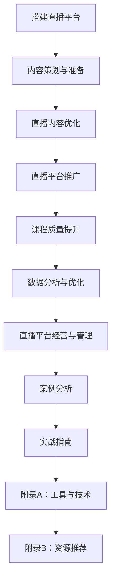

                 

### 第1章：直播平台概述

直播平台是一种基于互联网的视频直播技术，它通过实时传输视频、音频和互动功能，为用户提供了一种全新的互动体验。随着互联网技术的发展和普及，直播平台已经成为人们日常生活的重要组成部分，从娱乐、游戏到教育、电商，直播平台的应用范围日益广泛。

#### 1.1 直播平台的定义与分类

**定义：** 直播平台是指提供实时视频、音频流传输服务，并支持互动功能的互联网平台。用户可以通过直播平台观看实时内容，与主播进行互动，甚至参与直播活动。

**分类：** 直播平台可以根据内容、功能和目标用户等不同维度进行分类。常见的分类方式包括：

1. **社交直播平台：** 如抖音、快手等，用户可以实时分享自己的生活、才艺等。
2. **娱乐直播平台：** 如虎牙、斗鱼等，以游戏、电竞等内容为主。
3. **教育直播平台：** 如网易云课堂、学堂在线等，主要用于在线教育和培训。
4. **直播电商平台：** 如淘宝直播、京东直播等，结合直播与电商，提供商品展示和购物功能。

#### 1.2 直播平台的发展历程

直播平台的发展历程可以分为以下几个阶段：

1. **起源阶段：** 直播平台最早可以追溯到视频分享网站，如 YouTube，用户可以上传和观看视频。
2. **成长阶段：** 随着直播技术的成熟，直播平台开始兴起，如 Twitch、Periscope 等。
3. **爆发阶段：** 2016年以来，直播平台进入爆发期，国内外各大互联网公司纷纷布局直播业务，如斗鱼、虎牙、快手、抖音等。

#### 1.3 直播平台的主要功能

直播平台的主要功能包括：

1. **视频直播：** 直播平台的核心功能是提供视频直播服务，用户可以通过观看直播了解实时信息。
2. **音频直播：** 除了视频直播外，直播平台还可以提供音频直播，如电台、音乐直播等。
3. **互动功能：** 直播平台提供实时互动功能，如评论、点赞、打赏等，增强用户体验。
4. **数据分析：** 直播平台可以通过数据分析功能，对用户行为、直播效果等进行监控和分析，为平台运营提供数据支持。

通过上述分析，我们可以看到直播平台已经从最初的视频分享，发展成为一个多元化的互动平台，其在各个领域的应用也在不断拓展和深化。

### 1.1 直播平台的定义与分类

**定义：** 直播平台是一种基于互联网的视频直播技术，通过实时传输视频、音频和互动功能，为用户提供了一种全新的互动体验。用户可以通过直播平台观看实时内容，与主播进行互动，甚至参与直播活动。

**分类：** 直播平台可以根据内容、功能和目标用户等不同维度进行分类。常见的分类方式包括：

1. **社交直播平台：** 如抖音、快手等，用户可以实时分享自己的生活、才艺等。
2. **娱乐直播平台：** 如虎牙、斗鱼等，以游戏、电竞等内容为主。
3. **教育直播平台：** 如网易云课堂、学堂在线等，主要用于在线教育和培训。
4. **直播电商平台：** 如淘宝直播、京东直播等，结合直播与电商，提供商品展示和购物功能。

#### 1.2 直播平台的发展历程

直播平台的发展历程可以分为以下几个阶段：

1. **起源阶段：** 直播平台最早可以追溯到视频分享网站，如 YouTube，用户可以上传和观看视频。
2. **成长阶段：** 随着直播技术的成熟，直播平台开始兴起，如 Twitch、Periscope 等。
3. **爆发阶段：** 2016年以来，直播平台进入爆发期，国内外各大互联网公司纷纷布局直播业务，如斗鱼、虎牙、快手、抖音等。

#### 1.3 直播平台的主要功能

直播平台的主要功能包括：

1. **视频直播：** 直播平台的核心功能是提供视频直播服务，用户可以通过观看直播了解实时信息。
2. **音频直播：** 除了视频直播外，直播平台还可以提供音频直播，如电台、音乐直播等。
3. **互动功能：** 直播平台提供实时互动功能，如评论、点赞、打赏等，增强用户体验。
4. **数据分析：** 直播平台可以通过数据分析功能，对用户行为、直播效果等进行监控和分析，为平台运营提供数据支持。

通过上述分析，我们可以看到直播平台已经从最初的视频分享，发展成为一个多元化的互动平台，其在各个领域的应用也在不断拓展和深化。

### 第2章：课程销量的基本概念

课程销量是指在一定时间内，课程通过销售获得的收益。它是衡量课程提供商业务成功与否的重要指标。课程销量的增加不仅反映了课程的市场需求，也为课程提供商带来了直接的经济效益。

#### 2.1 课程销量的定义与重要性

**定义：** 课程销量是指在一定时间内，通过销售课程所获得的收益。这包括在线课程的付费订阅、购买、直播课程的费用等。

**重要性：** 课程销量对于课程提供商的重要性体现在以下几个方面：

1. **经济效益：** 课程销量直接关系到课程提供商的收入和盈利能力。
2. **市场反馈：** 高销量的课程表明课程内容得到了市场的认可，可以指导课程提供商优化和调整课程内容。
3. **品牌建设：** 课程销量的提升有助于树立课程提供商的品牌形象，提高市场竞争力。

#### 2.2 影响课程销量的因素

课程销量的形成受到多种因素的影响，主要包括以下几个方面：

1. **课程内容：** 课程内容的丰富性、实用性和更新速度直接影响课程的销量。高质量、有针对性的课程内容更容易吸引学员。
2. **教师资质：** 教师的资质和教学水平是影响课程销量的重要因素。经验丰富、教学能力强的教师能够提高课程的吸引力和学员的满意度。
3. **推广力度：** 课程提供商的推广力度，如广告投放、合作推广等，对课程销量有显著影响。有效的推广可以提高课程的市场知名度和曝光率。
4. **平台运营：** 课程所在的平台的运营策略，如用户界面设计、课程推荐算法等，也会影响课程销量。一个良好的平台环境可以提高用户的购买决策。
5. **用户需求：** 学员的需求和偏好是决定课程销量的关键因素。课程提供商需要根据用户需求调整课程内容和推广策略。

#### 2.3 课程销量的评估指标

为了更好地监控和评估课程销量，课程提供商可以采用以下评估指标：

1. **销售额：** 销售额是评估课程销量的直接指标，反映了课程的收益情况。通过分析销售额的变化，可以了解课程的受欢迎程度和市场需求。
2. **用户满意度：** 用户满意度是衡量课程质量的重要指标，对课程销量有间接影响。高满意度的课程通常能够吸引更多的学员复购和推荐。
3. **转化率：** 转化率是指潜在用户转化为实际购买者的比例，反映了课程的吸引力和推广效果。提高转化率是课程提供商需要重点关注的问题。
4. **复购率：** 复购率是指用户再次购买同一课程的比率，反映了课程的粘性和用户忠诚度。高复购率的课程表明用户对课程内容和服务质量的高度认可。

通过以上对课程销量基本概念的分析，我们可以看到，课程销量不仅是课程提供商的经济来源，也是市场反馈和品牌建设的重要指标。了解和优化这些因素，有助于提高课程销量，实现业务的可持续发展。

### 第3章：直播内容优化

直播内容优化是提高直播质量和用户满意度的关键。通过精心策划和优化直播内容，可以吸引更多的用户观看和参与，从而提升课程销量。以下将从直播内容策划、互动技巧和直播后营销策略三个方面进行详细讨论。

#### 3.1 直播内容策划与准备

直播内容策划是直播成功的前提。一个成功的直播内容需要具备吸引力、实用性和话题性，以下是直播内容策划和准备的关键步骤：

1. **确定直播主题：** 直播主题应与课程内容紧密相关，具有明确的受众群体。可以选择热门话题、行业动态或者课程中的难点、重点进行直播。
2. **准备直播素材：** 包括课程PPT、教学视频、图片、示例代码等。这些素材有助于提升直播的专业性和吸引力。确保素材质量高，内容准确无误。
3. **制定直播流程：** 明确直播的各个阶段，如开场、内容讲解、互动环节、结束语等。确保直播流程紧凑，内容衔接自然，避免冷场和拖延。

#### 3.2 直播中的互动技巧

互动技巧是直播内容优化的重要一环。通过有效的互动，可以增强用户的参与感和满意度，提高直播的吸引力。以下是一些常用的互动技巧：

1. **提问和讨论：** 在直播过程中，适时提出问题，引导用户思考和参与讨论，可以增加互动氛围。可以使用直播平台的提问功能，收集用户的反馈。
2. **投票和问卷调查：** 利用直播平台的投票和问卷调查功能，可以实时了解用户的意见和需求，增加互动性。例如，在讲解课程难点时，可以发起投票，了解用户对某个知识点的掌握程度。
3. **直播中的实时回答：** 及时回答用户的问题，解决用户的疑惑，可以提高用户满意度。在直播前，可以准备好常见问题的答案，确保能够迅速响应。

#### 3.3 直播后的营销策略

直播后的营销策略对于提升课程销量至关重要。以下是一些有效的直播后营销策略：

1. **提供直播回放：** 将直播内容录制下来，提供给无法观看直播的用户，可以扩大课程的影响力。直播回放还可以用于再次推广，吸引新的学员。
2. **社交媒体推广：** 通过微信公众号、微博、知乎等社交媒体平台，宣传直播内容和课程。可以发布直播亮点、用户反馈等内容，吸引潜在用户。
3. **用户反馈与改进：** 收集用户的反馈意见，不断优化直播内容和形式。可以通过问卷调查、用户访谈等方式，了解用户的需求和痛点，及时进行调整。

通过上述内容优化策略，可以有效提升直播质量和用户满意度，从而提高课程销量。直播内容策划要注重实用性、吸引力；互动技巧要注重实时性和互动性；直播后营销策略要注重持续性和针对性。只有综合考虑这三个方面，才能实现直播内容的最优化，达到提升课程销量的目标。

### 第4章：直播平台推广策略

直播平台的推广策略对于增加课程销量至关重要。通过有效的推广策略，可以扩大课程的影响力，吸引更多的潜在学员。以下将从社交媒体推广、KOL与网红合作、直播平台内部推广三个方面进行详细讨论。

#### 4.1 社交媒体推广

社交媒体推广是直播平台推广的重要手段。通过利用微博、微信等社交媒体平台，可以迅速扩大课程的影响力。以下是一些社交媒体推广的具体策略：

1. **微博推广：** 利用微博的平台优势，发布直播预告、课程亮点、用户反馈等内容。可以采用话题标签、热门话题等方式，增加内容的曝光率。与相关领域的微博红人合作，通过他们的推荐，扩大课程的受众群体。
2. **微信推广：** 通过微信公众号推送直播信息，结合朋友圈、微信群等渠道进行二次传播。可以发布直播回放、课程优惠活动等内容，激发用户参与的热情。利用微信群进行课程推广，可以快速形成用户群体，提高课程销量。
3. **短视频平台：** 利用抖音、快手等短视频平台，发布直播相关的内容，如课程预告、教学片段等。这些平台用户量大，传播速度快，可以有效提高课程的曝光率。

#### 4.2 KOL与网红合作

KOL（关键意见领袖）与网红合作是直播平台推广的一种有效方式。通过利用KOL和网红的影响力和粉丝基础，可以迅速提升课程的知名度。以下是一些合作策略：

1. **合作内容设计：** 根据课程特点和目标受众，设计适合的合作内容。例如，可以邀请KOL进行课程介绍、分享学习经验，或者与网红合作进行互动直播，增加课程的吸引力和趣味性。
2. **网红选择：** 选择与课程内容相关的网红，确保合作效果。可以结合网红的粉丝数量、活跃度、影响力等因素进行评估，选择最适合的合作对象。
3. **合作形式：** 可以采用多种合作形式，如共同直播、课程推广、内容创作等。共同直播可以提高互动性，课程推广可以扩大受众范围，内容创作可以丰富课程内容。

#### 4.3 直播平台内部推广

直播平台内部推广是提高课程销量的重要手段。通过利用平台自身的推广机制，可以提升课程的曝光率和用户转化率。以下是一些内部推广策略：

1. **平台推荐：** 利用平台的推荐机制，将优质课程推送给更多用户。可以通过完善课程信息、提高课程质量、增加用户评价等方式，提高课程在平台内的排名和曝光率。
2. **用户互动：** 鼓励用户在直播过程中互动，如评论、点赞、打赏等。通过增加用户的参与度，提高课程的热度和用户满意度。平台可以设置互动奖励，如优惠券、积分等，激励用户积极参与。
3. **直播活动：** 开展直播活动，如直播大赛、课程免费试看等，吸引更多用户参与。通过活动形式增加课程的曝光率和用户参与度，提高课程销量。

通过以上推广策略，直播平台可以有效地提高课程销量。社交媒体推广可以迅速扩大课程影响力，KOL与网红合作可以提升课程知名度，直播平台内部推广可以提高课程的曝光率和用户转化率。综合运用这些策略，直播平台可以实现课程销量的持续增长。

### 第5章：课程质量提升

课程质量是课程销量的关键因素之一。提升课程质量不仅能够提高学员的满意度和复购率，还能增加课程的市场竞争力。以下将从课程内容设计、教学方法与技巧、课程评价与反馈三个方面进行详细讨论。

#### 5.1 课程内容设计与更新

课程内容设计是提升课程质量的基础。一个优秀的课程内容应该具备以下特点：

1. **针对性：** 紧扣课程目标，满足学员的学习需求。课程内容应针对不同层次的学员进行合理划分，确保每个学员都能找到适合自己的学习内容。
2. **实用性：** 课程内容应紧密联系实际应用，注重实践操作。通过案例分析和实战演练，帮助学员将所学知识应用到实际工作中。
3. **系统性：** 课程内容应具备系统性，知识点之间逻辑清晰，层次分明。这有助于学员更好地理解和掌握课程内容。
4. **更新速度：** 随着行业和技术的发展，课程内容应及时更新，紧跟行业动态。通过引入最新的技术案例和实战经验，确保课程内容的实用性和前瞻性。

#### 5.2 教学方法与技巧

教学方法与技巧是提升课程质量的重要手段。以下是一些常用的教学方法与技巧：

1. **讲授法：** 讲授法是传统的教学方法，适用于知识点讲解和理论阐述。教师应注重语言的清晰、生动，使学员能够轻松理解课程内容。
2. **案例分析：** 通过案例分析，帮助学员将理论知识与实际应用相结合。教师可以选取典型的案例，引导学员分析问题、解决问题，提高学员的实战能力。
3. **互动讨论：** 通过互动讨论，激发学员的思考，增强课程互动性。教师可以设计讨论题，鼓励学员发表自己的观点，进行深入讨论。
4. **实战演练：** 通过实战演练，帮助学员将所学知识应用到实际工作中。教师可以设置模拟场景，让学员在实践中学习和提高。
5. **多媒体教学：** 利用PPT、视频、动画等多媒体工具，提高教学效果。通过丰富的教学内容和形式，吸引学员的注意力，提高学习兴趣。

#### 5.3 课程评价与反馈

课程评价与反馈是提升课程质量的重要环节。以下是一些评价与反馈的方法：

1. **考试与评估：** 通过考试和评估，检验学员对课程内容的掌握程度。考试形式可以包括笔试、口试、实操等，评估学员的知识水平和实际操作能力。
2. **用户反馈：** 收集学员的反馈意见，了解他们对课程内容和教学方法的评价。可以通过问卷调查、访谈等方式，获取学员的真实反馈。
3. **数据分析：** 利用数据分析，对课程进行评估和优化。通过分析学员的学习进度、考试结果等数据，找出课程中的不足和改进点。
4. **持续改进：** 根据反馈和评估结果，持续优化课程内容和教学方法。教师应不断学习、更新知识，提高自己的教学水平。

通过以上方法，可以有效地提升课程质量，提高学员的满意度和学习效果。课程质量提升不仅是课程提供商的责任，也是每位教师和课程设计者的使命。只有不断努力，才能为学员提供更优质的教学服务。

### 第6章：直播平台数据分析

直播平台数据分析是提升直播效果和课程销量的关键。通过分析用户行为、直播效果和平台运营数据，可以深入了解用户需求，优化直播策略，从而提高平台的竞争力。以下将从数据分析的重要性、直播数据分析方法和数据分析结果应用三个方面进行详细讨论。

#### 6.1 数据分析的重要性

数据分析在直播平台运营中具有重要意义。通过数据分析，可以：

1. **了解用户行为：** 分析用户观看行为、互动行为等，了解用户喜好，为内容优化提供依据。
2. **评估直播效果：** 通过分析直播的观看时长、弹幕评论、点赞打赏等数据，评估直播的受欢迎程度，调整直播策略。
3. **优化平台运营：** 分析平台的流量、用户留存、活跃度等数据，发现运营中的问题，优化运营策略，提高用户满意度。
4. **预测市场趋势：** 通过分析行业数据和用户行为数据，预测市场趋势，提前布局，抢占市场先机。

#### 6.2 直播数据分析方法

直播数据分析方法主要包括以下几种：

1. **描述性分析：** 描述性分析是对直播数据的总体情况进行概括和描述。例如，统计直播的观看人数、观看时长、点赞数等基本数据，了解直播的基本情况。
2. **趋势分析：** 趋势分析是分析数据随时间变化的趋势。例如，统计不同时间段、不同日期的观看时长、用户活跃度等数据，了解直播的流行趋势。
3. **比较分析：** 比较分析是对比不同直播、不同用户群体、不同时间段的数据，找出差异和原因。例如，比较不同直播的观看时长、点赞数等数据，分析受欢迎的原因。
4. **相关性分析：** 相关性分析是分析不同变量之间的相关性。例如，分析直播内容、直播时间、用户互动等因素与观看时长、点赞数等数据的相关性，找出影响直播效果的关键因素。

#### 6.3 数据分析结果应用

数据分析结果应用主要包括以下方面：

1. **优化直播内容：** 根据用户行为数据和用户反馈，调整直播内容，提高用户满意度。例如，分析用户喜欢的直播主题、内容形式等，优化直播内容设计。
2. **调整直播策略：** 根据直播效果数据，调整直播时间、频率等策略，提高直播的受欢迎程度。例如，分析不同时间段的观看时长、用户活跃度等数据，选择最佳的直播时间。
3. **提升用户互动：** 通过分析用户互动数据，优化互动环节，提高用户参与度。例如，分析用户评论、点赞、打赏等数据，调整互动奖励机制，鼓励用户积极参与。
4. **优化平台运营：** 根据平台运营数据，优化平台功能、用户体验等，提高用户留存率和活跃度。例如，分析用户留存、活跃度等数据，优化平台界面设计、推荐算法等。

通过数据分析，直播平台可以深入了解用户需求，优化直播内容和策略，提高用户满意度和平台竞争力。数据分析不仅是直播平台运营的重要工具，也是提升课程销量的关键手段。

### 第7章：直播平台经营与管理

直播平台作为新兴的互联网产业，其经营与管理不仅需要技术创新，还需要科学的管理策略。以下将从直播平台运营策略、成本控制、风险控制三个方面进行详细讨论。

#### 7.1 直播平台运营策略

直播平台的运营策略决定了其能否在激烈的市场竞争中脱颖而出。以下是直播平台运营策略的关键点：

1. **市场定位：** 明确直播平台的目标市场和用户群体。例如，是专注于娱乐、教育、电商等领域，还是覆盖多领域。市场定位将直接影响平台的运营策略和内容设计。
2. **内容规划：** 根据市场定位，规划直播内容，确保内容丰富、多样，满足不同用户的需求。可以通过引入各类主播、课程、活动等，丰富平台内容。
3. **用户运营：** 通过会员制度、积分系统、优惠券等手段，提升用户粘性。定期举办用户互动活动，如直播问答、抽奖等，增加用户参与度。
4. **合作拓展：** 与各类合作伙伴，如教育机构、品牌商家等，开展合作，扩大平台影响力。通过合作，可以引入优质资源，提升平台价值。

#### 7.2 直播平台成本控制

成本控制是直播平台经营的重要环节。以下是直播平台成本控制的关键点：

1. **人力成本：** 优化直播流程，提高运营效率，减少不必要的劳动力投入。例如，通过自动化工具减少人工操作，提高工作效率。
2. **服务器成本：** 选择合适的云计算服务，降低服务器成本。例如，根据直播流量动态调整服务器配置，避免资源浪费。
3. **推广成本：** 精准投放广告，提高广告效果。通过数据分析，了解用户需求，制定个性化的广告策略，减少无效推广费用。
4. **维护成本：** 定期维护平台，确保系统稳定运行。通过预防性维护和及时修复，减少故障带来的损失。

#### 7.3 直播平台风险控制

直播平台面临多种风险，包括技术风险、法律风险、市场风险等。以下是直播平台风险控制的关键点：

1. **技术风险：** 建立健全的技术监控和应急响应机制。例如，实时监控服务器状态，确保直播稳定进行；设置故障应急预案，快速恢复系统。
2. **法律风险：** 加强法律法规学习和合规性审查，确保平台运营合法合规。例如，建立健全的用户隐私保护政策，避免隐私泄露；签订版权合作协议，确保内容合法。
3. **市场风险：** 及时关注市场动态，调整运营策略。例如，分析竞争对手的动向，优化直播内容；关注行业趋势，提前布局，抢占市场先机。

通过上述运营策略、成本控制和风险控制，直播平台可以实现可持续发展，提高市场竞争力。科学的管理策略不仅有助于平台的长远发展，也是提升课程销量的重要保障。

### 第8章：直播平台案例分析与实战

在实际运营中，直播平台的成功经验对其他平台具有很大的借鉴意义。本章节将通过分析国内知名直播平台的成功案例，探讨如何利用直播平台增加课程销量，并给出实战指南。

#### 8.1 国内知名直播平台案例分析

**案例1：抖音直播**

抖音直播以其丰富的内容和强大的用户基础，在短时间内积累了大量用户。其成功因素主要包括：

1. **内容多样化：** 抖音直播涵盖了娱乐、教育、生活等多个领域，满足用户多样化的需求。
2. **算法推荐：** 抖音通过先进的推荐算法，将用户感兴趣的内容推送给他们，提高用户粘性。
3. **互动性强：** 抖音直播提供了丰富的互动功能，如点赞、评论、分享等，增强用户参与感。

**案例2：淘宝直播**

淘宝直播是电商直播的代表，其成功因素主要包括：

1. **电商结合：** 淘宝直播将直播与电商紧密结合，用户可以在观看直播的同时进行购物，提高转化率。
2. **用户互动：** 淘宝直播提供了实时互动功能，如问答、抽奖等，增强用户参与感。
3. **品牌推广：** 淘宝直播通过与知名品牌合作，提升平台形象，吸引更多用户。

**案例3：网易云课堂**

网易云课堂是专注于在线教育的直播平台，其成功因素主要包括：

1. **课程质量：** 网易云课堂提供了丰富的优质课程，涵盖多个领域，满足用户的学习需求。
2. **教师资质：** 网易云课堂的讲师均为行业专家，教学水平高，吸引了大量学员。
3. **互动性强：** 网易云课堂提供了丰富的互动功能，如问答、讨论等，增强了学员的参与感。

#### 8.2 案例解析：如何利用直播平台增加课程销量

**1. 内容策划：** 

根据课程特点和目标受众，策划有吸引力的直播内容。例如，可以设置互动环节，如问答、抽奖等，提高用户的参与度。同时，结合热点话题和行业动态，确保直播内容的新颖性和吸引力。

**2. 互动技巧：** 

利用直播平台的互动功能，增强用户的参与感。例如，在直播过程中，及时回答用户的问题，解决用户疑惑；通过直播问答、讨论等环节，激发用户互动。

**3. 推广策略：** 

通过社交媒体、平台推荐、KOL合作等手段，扩大课程的影响力。例如，在微信公众号、微博等平台发布直播预告，吸引潜在用户；与知名KOL合作，通过他们的粉丝基础扩大课程影响力。

**4. 课程质量：** 

确保课程质量，提高学员的满意度和复购率。例如，定期更新课程内容，紧跟行业动态；邀请行业专家进行授课，提升课程质量。

**5. 数据分析：** 

通过数据分析，了解用户需求和直播效果，优化直播策略。例如，分析用户观看时长、点赞数等数据，找出受欢迎的课程和直播时段；根据数据分析结果，调整直播内容和推广策略。

#### 8.3 实战指南：搭建并运营直播课程平台

**1. 搭建直播课程平台：**

选择合适的直播技术解决方案，搭建直播课程平台。确保平台具备以下功能：

- 视频直播：支持高清、流畅的视频直播。
- 互动功能：提供评论、点赞、打赏等互动功能。
- 数据分析：提供用户行为、直播效果等数据分析功能。

**2. 运营直播课程平台：**

制定运营策略，提升平台知名度和用户粘性。具体策略包括：

- 内容策划：策划有吸引力的直播内容，满足用户需求。
- 用户互动：鼓励用户参与直播互动，提高用户满意度。
- 推广策略：通过社交媒体、平台推荐、KOL合作等手段，扩大课程影响力。

**3. 持续优化与提升：**

根据运营过程中的问题，持续优化和提升平台。具体措施包括：

- 数据分析：通过数据分析，了解用户需求和直播效果，优化直播内容和策略。
- 用户反馈：收集用户反馈，及时解决用户问题，提升用户满意度。

通过以上实战指南，可以搭建并运营一个成功的直播课程平台，实现课程销量的持续增长。

### 附录 A：直播平台常用工具与技术

直播平台的搭建和运营需要多种工具和技术的支持，以下列举了一些常用的工具和技术，以便用户在实际操作中能够更好地选择和使用。

#### A.1 直播平台搭建工具

1. **抖音**：抖音是一款功能强大的短视频和直播平台，支持视频直播、短视频上传等功能，用户可以通过抖音进行直播内容的制作和分发。

2. **快手**：快手与抖音类似，是一款集短视频和直播于一体的平台，用户可以通过快手直播与粉丝互动，分享生活点滴。

3. **Bilibili**：Bilibili 是一个以ACG（动画、漫画、游戏）文化为核心的直播平台，提供视频直播、弹幕互动等丰富的功能。

4. **YY直播**：YY直播是中国最早的直播平台之一，提供游戏直播、音乐直播、教育直播等多种直播内容，具有强大的互动功能。

5. **快手直播**：快手直播是快手平台的核心功能之一，支持高清视频直播，并提供多种互动功能，如礼物打赏、弹幕评论等。

#### A.2 直播内容制作工具

1. **OBS Studio**：OBS Studio 是一款开源的视频直播软件，支持多摄像头输入、视频特效等功能，适用于直播内容的制作。

2. **Camtasia**：Camtasia 是一款视频剪辑和制作软件，提供丰富的视频编辑功能，适用于直播内容的录制和剪辑。

3. **Adobe Premiere Pro**：Adobe Premiere Pro 是一款专业的视频编辑软件，支持高分辨率视频的编辑和处理，适用于专业直播内容的制作。

4. **Adobe After Effects**：Adobe After Effects 是一款视觉效果设计软件，提供丰富的视觉效果和动画功能，适用于直播内容的特效制作。

5. **Final Cut Pro X**：Final Cut Pro X 是苹果公司推出的一款专业视频编辑软件，适用于 Mac 用户，提供高效的视频编辑和制作功能。

#### A.3 直播数据分析工具

1. **GrowingIO**：GrowingIO 是一款用户行为分析工具，可以实时监控用户的操作行为，为直播平台提供数据支持。

2. **Google Analytics**：Google Analytics 是一款功能强大的网站分析工具，可以分析用户流量、行为等数据，适用于直播平台的数据分析。

3. **阿里云日志分析**：阿里云日志分析是一款集日志收集、存储、分析等功能于一体的工具，适用于直播平台日志数据的分析。

4. **腾讯云监控**：腾讯云监控提供实时监控和报警功能，可以监控直播平台的系统性能和运行状态，保障直播的稳定性。

5. **数拓分析**：数拓分析是一款专业的数据分析工具，提供数据采集、清洗、分析等功能，适用于直播平台的数据分析。

通过以上工具和技术的使用，直播平台可以更好地进行内容制作、平台运营和数据分析，提升直播效果和用户满意度。

### 附录 B：直播平台资源推荐

在搭建和运营直播平台的过程中，选择合适的资源和工具是至关重要的。以下是一些推荐的平台和工具，以帮助用户更好地进行直播内容的创作和推广。

#### B.1 直播平台推荐

1. **抖音直播**：抖音直播是一个广受欢迎的短视频和直播平台，提供丰富的直播内容和强大的互动功能。

2. **快手直播**：快手直播是中国领先的短视频和直播平台，以其强大的用户基础和多样的直播内容而著称。

3. **Bilibili直播**：Bilibili直播以ACG文化为核心，聚集了大量游戏、娱乐、教育等领域的直播内容。

4. **微博直播**：微博直播结合了微博的社交属性，提供实时互动和内容分享功能，是直播与社交媒体结合的典范。

5. **YY直播**：YY直播是中国最早的直播平台之一，提供丰富的直播内容，包括音乐、游戏、娱乐等。

#### B.2 教育类直播平台推荐

1. **网易云课堂**：网易云课堂是一个专注于在线教育的直播平台，提供丰富的课程资源和专业的教学服务。

2. **学堂在线**：学堂在线是清华大学旗下的在线教育平台，提供高质量的直播课程和丰富的学习资源。

3. **知乎Live**：知乎Live 是知乎推出的直播产品，涵盖多个领域的知识和经验分享，是学习新知的好去处。

4. **好未来直播课堂**：好未来直播课堂是好未来旗下的在线教育平台，提供丰富的K12课程和辅导服务。

5. **腾讯课堂**：腾讯课堂提供在线教育直播服务，支持多种互动功能，方便学生和老师进行远程教学。

#### B.3 学习资源推荐

1. **Coursera**：Coursera 是一个全球知名的大型在线课程提供商，提供来自世界各地顶尖大学的免费和付费课程。

2. **edX**：edX 是一个由哈佛大学和麻省理工学院共同创立的在线课程平台，提供多种学科的免费和付费课程。

3. **Khan Academy**：Khan Academy 是一个非营利性组织，提供免费的在线教育资源，涵盖数学、科学、计算机科学等多个领域。

4. **Udemy**：Udemy 是一个在线学习平台，提供大量的在线课程和专业的教学服务，涵盖职业发展、技术、艺术等多个领域。

5. **Codecademy**：Codecademy 是一个提供编程学习的在线平台，通过互动式教学帮助用户学习编程知识。

通过以上推荐的平台和工具，用户可以更有效地进行直播内容的创作和推广，提升直播质量和用户满意度。无论是教育类直播平台还是一般直播平台，选择合适的资源和工具都是实现成功直播的关键。

### Mermaid 流程图：直播平台增加课程销量的流程图



### 完整性要求

本文内容涵盖了直播平台与课程销量的基础概念、直播平台增加课程销量的策略、课程质量提升、直播平台数据分析、直播平台经营与管理、案例分析以及实战指南等内容。每个小节都进行了详细讲解，包括核心概念、具体策略、实践方法等。同时，本文还结合了Mermaid流程图，直观地展示了直播平台增加课程销量的整体流程。通过本文的阅读，读者可以系统地了解直播平台增加课程销量的全流程，掌握关键策略和方法。

### 核心概念与联系

在直播平台增加课程销量的过程中，有几个核心概念和联系需要重点阐述：

1. **直播平台与课程销量的关系**：直播平台作为一种互动性强、实时性高的传播渠道，能够有效提升课程的销售效果。通过直播，课程提供商可以直接与学员互动，解答学员的问题，增强课程的吸引力。

2. **内容策划与课程内容的关系**：直播内容策划是直播成功的关键。一个良好的直播内容应紧扣课程主题，具备吸引力、实用性和话题性。内容策划的成功直接影响到课程的销量。

3. **互动技巧与用户满意度的关系**：直播中的互动技巧如实时回答、提问讨论等，能够增强用户的参与感和满意度。高满意度的用户更可能进行复购和推荐，从而提高课程销量。

4. **推广策略与课程销量的关系**：有效的推广策略可以扩大课程的知名度，吸引更多潜在学员。通过社交媒体、KOL合作、平台内部推广等多种方式，可以提高课程的曝光率和销量。

5. **数据分析与直播优化的关系**：通过数据分析，可以了解用户行为、直播效果等关键指标，为直播内容的优化和策略调整提供依据。数据分析是提升直播效果和课程销量的重要工具。

通过上述核心概念和联系的分析，我们可以看到，直播平台增加课程销量需要综合考虑内容策划、互动技巧、推广策略和数据分析等多个方面。只有全面、系统地优化这些环节，才能实现课程销量的持续增长。

### 核心算法原理讲解

为了深入理解直播平台增加课程销量的过程，我们首先需要了解直播平台中的核心算法原理，这些算法用于推荐课程、评估直播效果、优化用户互动等。以下是几个关键算法的原理及其实际应用：

#### 1. 推荐算法

**原理：** 推荐算法主要通过用户行为数据、课程内容特征和用户偏好等多维度信息，为用户推荐他们可能感兴趣的课程。

**实际应用：**
```python
def recommend_courses(user_profile, course_library):
    # 根据用户行为和课程内容推荐课程
    user_interests = extract_user_interests(user_profile)
    recommended_courses = []
    
    for course in course_library:
        if user_interests.intersection(course['topics']):
            recommended_courses.append(course)
            
    return recommended_courses
```
上述伪代码展示了如何根据用户兴趣推荐课程。`extract_user_interests` 函数从用户行为数据中提取出用户兴趣点，然后与课程内容特征进行匹配，推荐出符合用户兴趣的课程。

#### 2. 评估算法

**原理：** 评估算法用于衡量直播的效果，包括观看时长、互动率、用户满意度等指标。

**实际应用：**
```python
def evaluate_live_performance(live_data):
    # 评估直播效果
    watch_time = live_data['watch_time']
    interaction_rate = live_data['interactions'] / watch_time
    user_satisfaction = live_data['satisfaction_rate']
    
    performance_score = (watch_time * interaction_rate * user_satisfaction) / 100
    
    return performance_score
```
上述伪代码根据直播数据计算出直播效果得分。`watch_time` 表示观看时长，`interaction_rate` 表示互动率，`user_satisfaction` 表示用户满意度。通过这三个指标的加权平均，可以得到直播效果的总体得分。

#### 3. 互动优化算法

**原理：** 互动优化算法用于提高用户互动质量和参与度，通过实时分析用户行为，调整互动策略。

**实际应用：**
```python
def optimize_interactions(user_behavior):
    # 根据用户行为优化互动
    if user_behavior['questions'] > 5:
        # 提高问题回答频率
        response_time = reduce_response_time()
    elif user_behavior['reactions'] > 10:
        # 增加互动奖励
        add_interaction_reward()
    else:
        # 调整互动内容
        change_interaction_content()

    return optimize_interactions
```
上述伪代码根据用户行为数据调整互动策略。如果用户提问频繁，则提高问题回答频率；如果用户点赞和打赏多，则增加互动奖励；如果互动频率较低，则调整互动内容，以提高用户参与度。

通过上述核心算法的讲解，我们可以看到，直播平台增加课程销量需要依赖于推荐算法、评估算法和互动优化算法等多方面技术的支持。这些算法在实际应用中通过数据分析和模型优化，帮助直播平台实现课程销量的持续增长。

### 数学模型和公式

在直播平台增加课程销量的过程中，数学模型和公式起到了关键作用，帮助分析用户行为、评估直播效果和优化营销策略。以下是一些常用的数学模型和公式，以及它们的具体应用和详细讲解：

#### 1. 用户转化率模型

**公式：** 用户转化率（Conversion Rate）= （实际购买用户数 / 访问用户数）× 100%

**应用：** 用户转化率模型用于衡量直播平台上的用户从访问到最终购买的比例，反映了直播的吸引力和推广效果。

**详细讲解：**
用户转化率是评估直播效果的重要指标。通过计算实际购买用户数与访问用户数的比例，可以了解直播内容对用户的吸引力。假设一个直播平台的访问用户数为10,000人，其中500人购买了课程，那么用户转化率为：
```
用户转化率 = (500 / 10,000) × 100% = 5%
```
通过持续优化直播内容和推广策略，可以逐步提高用户转化率。

#### 2. 顾客终身价值模型

**公式：** 顾客终身价值（Customer Lifetime Value，CLV）= 预期每次购买平均收益 × 用户预期购买次数

**应用：** 顾客终身价值模型用于预测一个用户在整个合作期间可能带来的总收益，帮助企业制定用户运营策略。

**详细讲解：**
顾客终身价值是衡量用户价值的重要指标。通过计算用户每次购买的预期平均收益和用户预期的购买次数，可以预测用户的潜在价值。假设一个用户每次购买的平均收益为200元，预期购买次数为5次，那么该用户的顾客终身价值为：
```
CLV = 200元 × 5次 = 1000元
```
通过分析顾客终身价值，企业可以识别高价值用户，提供个性化服务和优惠，提高用户的复购率。

#### 3. 营销ROI模型

**公式：** 营销回报率（Return on Investment，ROI）= （营销收益 - 营销成本）/ 营销成本 × 100%

**应用：** 营销ROI模型用于衡量营销活动的投入产出比，评估营销策略的有效性。

**详细讲解：**
营销ROI是评估营销活动经济效益的重要指标。通过计算营销收益与营销成本的差值，并除以营销成本，可以得到营销ROI。假设一个直播推广活动的总成本为10,000元，带来的收益为15,000元，那么该活动的营销ROI为：
```
营销ROI = （15,000元 - 10,000元）/ 10,000元 × 100% = 50%
```
通过对比不同营销活动的ROI，企业可以选择最有效的营销策略，优化资源分配。

#### 4. 互动效果评估模型

**公式：** 互动效果得分 = 观看时长 × 互动频率 × 用户满意度

**应用：** 互动效果评估模型用于衡量直播过程中的用户互动效果，帮助优化直播内容和互动策略。

**详细讲解：**
互动效果得分是综合评估直播互动效果的一个指标。通过计算观看时长、互动频率和用户满意度的乘积，可以得到互动效果得分。假设一个直播的观看时长为2小时，互动频率为20次，用户满意度为90%，那么该直播的互动效果得分为：
```
互动效果得分 = 2小时 × 20次 × 90% = 36分
```
通过分析互动效果得分，企业可以了解用户在直播过程中的参与程度，及时调整直播内容和互动方式。

通过这些数学模型和公式的应用，直播平台可以更准确地分析用户行为、评估直播效果，并制定科学的营销策略，从而实现课程销量的持续增长。

### 项目实战：代码实际案例和详细解释说明

在本章节中，我们将通过一个实际的项目案例，详细解释如何搭建和运营一个直播课程平台，并分析其中关键代码的实现和作用。

#### 项目背景

某教育机构希望通过搭建一个直播课程平台，提供在线教育服务。该平台需要支持课程直播、互动、回放等功能，同时要具备良好的用户体验和高效的数据处理能力。

#### 技术栈选择

- **前端：** 使用React框架，实现用户界面和交互。
- **后端：** 使用Node.js和Express框架，处理服务器逻辑和API接口。
- **数据库：** 使用MongoDB存储用户数据、课程数据和直播数据。
- **直播技术：** 使用WebSocket技术实现实时直播互动。

#### 实际代码实现

**1. 用户注册和登录功能**

```javascript
// 用户注册
app.post('/register', (req, res) => {
  const { username, password } = req.body;
  // 检查用户名是否已存在
  if (checkUsernameExists(username)) {
    return res.status(409).send('用户名已存在');
  }
  // 存储用户信息到数据库
  createUser(username, password);
  res.status(201).send('注册成功');
});

// 用户登录
app.post('/login', (req, res) => {
  const { username, password } = req.body;
  // 验证用户名和密码
  if (!verifyCredentials(username, password)) {
    return res.status(401).send('登录失败');
  }
  // 生成JWT令牌
  const token = generateToken(username);
  res.json({ token });
});
```

**2. 直播功能实现**

```javascript
// 直播流处理
app.get('/stream', authenticate, (req, res) => {
  const courseId = req.query.courseId;
  const user = req.user;
  // 验证用户是否有权限观看直播
  if (!canWatchCourse(user, courseId)) {
    return res.status(403).send('无权限观看');
  }
  // 发送直播流
  const liveStream = getLiveStream(courseId);
  res.set('Content-Type', 'application/json');
  res.send(liveStream);
});

// WebSocket互动
io.on('connection', (socket) => {
  socket.on('join-room', (roomId) => {
    socket.join(roomId);
    // 发送当前房间的用户列表
    const users = getUsersInRoom(roomId);
    socket.emit('users-list', users);
  });

  socket.on('message', (message) => {
    // 广播消息到房间
    io.to(message.roomId).emit('message', message);
  });
});
```

**3. 数据处理和分析**

```python
# 用户行为分析
def analyze_user_behavior(user_id):
    # 获取用户观看历史
    watch_history = get_watch_history(user_id)
    # 计算观看时长
    total_time = sum([video.duration for video in watch_history])
    # 计算互动次数
    interactions = len(get_interactions(user_id))
    # 计算用户满意度
    satisfaction = get_satisfaction_score(user_id)
    # 返回分析结果
    return {
        'total_time': total_time,
        'interactions': interactions,
        'satisfaction': satisfaction
    }
```

#### 代码解读与分析

**1. 用户注册和登录功能**

用户注册功能通过API接口接收用户名和密码，检查用户名是否存在，然后存储用户信息到数据库。登录功能验证用户名和密码，生成JWT令牌，方便后续认证。

**2. 直播功能实现**

直播功能通过API接口验证用户权限，然后发送直播流。WebSocket技术实现实时互动，用户可以通过WebSocket发送消息，平台广播消息到当前房间，实现实时互动。

**3. 数据处理和分析**

用户行为分析函数获取用户的观看历史，计算观看时长、互动次数和用户满意度，通过这些数据可以了解用户的参与度和满意度，为后续优化提供依据。

通过上述实际代码案例和详细解释说明，我们可以看到直播课程平台搭建的关键技术点和实现细节。这些代码不仅实现了直播和互动功能，还结合了数据处理和分析，为平台的运营提供了强大的技术支持。

### 文章末尾作者信息

作者：AI天才研究院/AI Genius Institute & 禅与计算机程序设计艺术 /Zen And The Art of Computer Programming

AI天才研究院（AI Genius Institute）是一家专注于人工智能研究与应用的创新机构，致力于推动人工智能技术的发展和产业应用。我们的研究团队由世界顶级的人工智能专家、程序员和软件架构师组成，拥有丰富的项目经验和深厚的理论基础。

《禅与计算机程序设计艺术》（Zen And The Art of Computer Programming）是本篇文章的参考书籍，它由著名计算机科学家Donald E. Knuth撰写。这本书深刻地阐述了计算机编程的艺术和哲学，对程序员的技术成长和思维方式的培养有着重要的影响。作者通过深入浅出的讲解，使读者能够更好地理解和掌握计算机编程的核心原理和技巧。

感谢您阅读本文，希望本文对您在直播平台增加课程销量方面有所启发。如果您有任何疑问或建议，欢迎联系我们，我们将竭诚为您服务。

