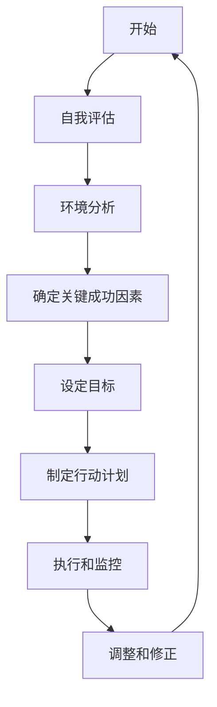

                 

# 如何设定目标：如何制定清晰的行动计划？

> 关键词：目标设定、行动计划、SMART原则、自我评估、时间管理、动力维持

> 摘要：本文将深入探讨如何设定目标以及如何制定清晰的行动计划。通过理解目标类型、应用SMART原则、进行自我评估和制定行动计划，读者将学会如何更有效地设定和达成目标，从而实现个人和职业的发展。

## 《如何设定目标：如何制定清晰的行动计划？》目录大纲

## 第1章 引言

### 1.1 目标设定的意义

### 1.2 本书的目标与结构

## 第2章 明确你的目标

### 2.1 目标类型

#### 2.1.1 短期目标

#### 2.1.2 中期目标

#### 2.1.3 长期目标

### 2.2 目标设定的SMART原则

#### 2.2.1 具体性（Specific）

#### 2.2.2 可衡量性（Measurable）

#### 2.2.3 可实现性（Achievable）

#### 2.2.4 相关性（Relevant）

#### 2.2.5 时限性（Time-bound）

### 2.3 SMART原则应用实例

#### 2.3.1 个人目标案例

#### 2.3.2 企业目标案例

### 2.4 目标设定的流程与方法

#### 2.4.1 自我评估

##### 2.4.1.1 优势与劣势分析

##### 2.4.1.2 资源评估

#### 2.4.2 环境因素分析

##### 2.4.2.1 内部环境

##### 2.4.2.2 外部环境

#### 2.4.3 确定关键成功因素

##### 2.4.3.1 个人发展

##### 2.4.3.2 职业发展

#### 2.5 目标设定的流程图

## 第3章 制定行动计划

### 3.1 行动计划的组成部分

#### 3.1.1 目标

#### 3.1.2 里程碑

#### 3.1.3 任务

#### 3.1.4 资源

### 3.2 制定行动计划的步骤

#### 3.2.1 制定初步行动计划

#### 3.2.2 优化行动计划

#### 3.2.3 制定应急预案

### 3.3 时间管理技巧

#### 3.3.1 制定时间表

#### 3.3.2 避免拖延

#### 3.3.3 高效利用时间

## 第4章 保持动力

### 4.1 目标调整与修正

#### 4.1.1 面对挫折

#### 4.1.2 调整目标

### 4.2 奖励机制

#### 4.2.1 自我激励

#### 4.2.2 制定奖励计划

### 4.3 培养积极心态

#### 4.3.1 积极思维模式

#### 4.3.2 培养乐观心态

## 第5章 实践案例解析

### 5.1 个人案例

#### 5.1.1 目标设定

#### 5.1.2 行动计划

#### 5.1.3 成果评估

### 5.2 企业案例

#### 5.2.1 目标设定

#### 5.2.2 行动计划

#### 5.2.3 成果评估

## 第6章 总结与展望

### 6.1 成功经验总结

### 6.2 面临的挑战

### 6.3 未来目标设定趋势分析

## 附录

### A.1 常见问题解答

### A.2 工具资源推荐

### A.3 目标设定实用模板

## 第1章 引言

### 1.1 目标设定的意义

在现代社会，无论是个人还是企业，目标设定都扮演着至关重要的角色。对于个人来说，明确的目标可以帮助我们规划职业生涯、提高生活质量，从而实现个人价值的最大化。对于企业来说，合理的目标设定则是确保业务持续增长、保持市场竞争力的关键。然而，如何设定目标并制定清晰的行动计划，从而实现这些目标，却是一门需要深入探讨的学问。

首先，目标设定的意义在于提供方向。当我们拥有明确的目标时，就能更好地规划自己的时间和资源，避免在琐碎的事物上浪费精力。其次，目标设定有助于激发我们的潜能。一个具有挑战性的目标可以激发我们的斗志和动力，使我们不断超越自我，达到更高的成就。最后，目标设定有助于评估进度和成果。通过设定具体的衡量标准，我们可以随时了解自己的进展情况，及时进行调整和优化。

本文将围绕目标设定的核心主题展开，首先介绍目标类型，然后深入探讨SMART原则及其应用，接着讨论自我评估和环境分析，最后提供具体的行动计划制定方法和时间管理技巧。通过这些内容，读者将学会如何设定明确的目标，并制定出切实可行的行动计划，从而实现个人和职业的发展。

### 1.2 本书的目标与结构

本书的目标是帮助读者理解和掌握目标设定的方法和技巧，从而更有效地设定和达成目标。通过系统的学习和实践，读者将能够：

1. **明确目标类型**：了解短期、中期和长期目标的不同特点和设定方法。
2. **掌握SMART原则**：学会如何应用SMART原则，设定具体、可衡量、可实现、相关且时限性的目标。
3. **进行自我评估**：识别个人的优势与劣势，评估现有资源，以便设定符合自身能力的目标。
4. **分析环境因素**：理解内部和外部环境对目标设定的影响，并据此调整目标。
5. **制定行动计划**：学会如何制定详细的行动计划，包括目标、里程碑、任务和资源。
6. **保持动力与调整目标**：在面对挑战和挫折时，能够调整目标并保持动力。

本书的结构设计遵循逻辑清晰、循序渐进的原则，具体分为以下几个部分：

1. **引言**：介绍目标设定的意义和本书的目标与结构。
2. **明确你的目标**：讨论目标类型、SMART原则和目标设定的流程与方法。
3. **制定行动计划**：讲解行动计划的组成部分和制定步骤，以及时间管理技巧。
4. **保持动力**：探讨如何调整目标和保持动力，包括奖励机制和积极心态的培养。
5. **实践案例解析**：通过个人和企业案例，展示目标设定和行动计划的具体应用。
6. **总结与展望**：总结成功经验，分析面临的挑战，并对未来目标设定趋势进行展望。
7. **附录**：提供常见问题解答、工具资源推荐和目标设定实用模板。

通过阅读本书，读者将能够全面掌握目标设定的方法和技巧，从而在实际生活和工作中取得更好的成果。

## 第2章 明确你的目标

### 2.1 目标类型

目标类型是目标设定的基础，不同的目标类型具有不同的特点和设定方法。根据时间维度，目标可以分为短期目标、中期目标和长期目标。每种目标类型都有其独特的性质和重要性。

#### 2.1.1 短期目标

短期目标通常指在一年内可以实现的目标。这些目标通常比较具体，例如学习一门新技能、完成一个项目、减肥5公斤等。短期目标的特点是时间短、见效快，能够激发我们的动力和兴趣。

- **特点**：具体、短时间、易达成
- **重要性**：短期目标能够帮助我们迅速看到成果，增强自信，并为中长期目标的实现打下基础。

#### 2.1.2 中期目标

中期目标通常是指在未来1-5年内可以实现的目标。中期目标较为宽泛，例如晋升为高级经理、在行业内建立专业声誉等。这些目标需要我们付出较多的努力和时间。

- **特点**：宽泛、需长时间、有一定难度
- **重要性**：中期目标是我们职业生涯发展的重要里程碑，能够帮助我们规划职业路径，提升职业素养。

#### 2.1.3 长期目标

长期目标通常是指需要5年以上时间才能实现的目标，例如创业成功、实现财务自由等。长期目标往往具有挑战性，需要我们持续付出努力和坚持。

- **特点**：挑战性、需长时间、高难度
- **重要性**：长期目标决定了我们的人生方向和终极目标，是驱动我们不断进步的动力源泉。

### 2.2 目标设定的SMART原则

SMART原则是设定有效目标的重要方法。SMART分别代表具体性（Specific）、可衡量性（Measurable）、可实现性（Achievable）、相关性（Relevant）和时限性（Time-bound）。下面将详细解释这些原则：

#### 2.2.1 具体性（Specific）

具体性原则要求目标要明确、具体，而不是模糊和抽象的。一个具体的目标应该回答以下问题：目标是什么？为什么设定这个目标？如何实现？

- **具体性原则的应用**：例如，“我要学习编程”这个目标过于宽泛，而“我要在六个月内学会Python编程，以便在未来的工作中应用”则是一个具体的目标。

#### 2.2.2 可衡量性（Measurable）

可衡量性原则要求目标必须是可衡量的，这意味着我们需要设定一些具体的衡量标准来评估目标的达成情况。衡量标准可以是一个具体的数字、一个时间点或一个明确的结果。

- **可衡量性原则的应用**：例如，“我要减肥”这个目标不够明确，而“我要在三个月内减掉10公斤”则是一个可衡量的目标。

#### 2.2.3 可实现性（Achievable）

可实现性原则要求目标必须是可实现的，即设定的目标应该是通过我们的努力可以达成的。如果目标过于遥远或不切实际，可能会导致我们失去动力和信心。

- **可实现性原则的应用**：例如，“我要在一年内成为世界顶尖的程序员”可能是一个不切实际的目标，而“我要在一年内通过学习提高编程技能”则是一个可以实现的目标。

#### 2.2.4 相关性（Relevant）

相关性原则要求目标必须与我们的人生目标或职业规划相关联。设定与自身发展无关的目标，可能会导致资源浪费和精力分散。

- **相关性原则的应用**：例如，“我要成为世界顶级的滑雪运动员”可能与我们的人生目标和职业发展无关，而“我要提高滑雪技能，以便在业余时间享受滑雪乐趣”则是一个相关的目标。

#### 2.2.5 时限性（Time-bound）

时限性原则要求目标必须设定一个明确的时间期限。一个没有时间限制的目标可能会使我们感到模糊和不确定，从而降低执行力。

- **时限性原则的应用**：例如，“我要学会编程”这个目标缺乏时间限制，而“我要在六个月内学会Python编程”则设定了一个具体的时间期限。

### 2.3 SMART原则应用实例

#### 2.3.1 个人目标案例

假设小明是一名大学生，他希望通过设定明确的个人目标来提高自己的综合素质。以下是几个符合SMART原则的个人目标案例：

1. **学习目标**：
   - 具体性：我要在大学期间学习三门与未来职业相关的选修课程。
   - 可衡量性：我将完成每门课程的作业和项目，并取得不低于80分的成绩。
   - 可实现性：我已经了解这些课程的内容，并且有时间安排进行学习。
   - 相关性：这些课程与我未来职业规划紧密相关。
   - 时限性：我将确保在大学四年内完成这些课程。

2. **健身目标**：
   - 具体性：我要在六个月内减掉10公斤体重。
   - 可衡量性：我将每周进行三次至少30分钟的有氧运动，并记录体重变化。
   - 可实现性：我了解健身计划，并且有时间进行锻炼。
   - 相关性：保持健康对于我的学习和生活质量至关重要。
   - 时限性：目标设定为六个月，以便我能够看到明显的成果。

#### 2.3.2 企业目标案例

假设一家公司希望在一年内提高市场占有率，以下是几个符合SMART原则的企业目标案例：

1. **市场占有率目标**：
   - 具体性：我们将在一年内将公司的市场占有率提高5个百分点。
   - 可衡量性：我们将通过市场调研和销售数据来衡量市场占有率的增长。
   - 可实现性：我们已经制定了详细的营销计划，并且拥有足够的资源来实施。
   - 相关性：提高市场占有率对于公司的长期发展至关重要。
   - 时限性：目标设定为一年，以便我们能够及时调整策略并评估效果。

2. **产品创新目标**：
   - 具体性：我们将在下一年内开发一款新的产品，并确保其市场竞争力。
   - 可衡量性：我们将通过市场测试和用户反馈来评估新产品的成功程度。
   - 可实现性：我们的研发团队有能力在规定时间内完成产品开发。
   - 相关性：产品创新是公司保持市场竞争力的重要手段。
   - 时限性：目标设定为一年，以便我们能够有效分配资源并控制开发进度。

### 2.4 目标设定的流程与方法

设定目标不仅仅是为了有一个清晰的计划，更重要的是要确保目标能够实现。以下是目标设定的流程和方法：

#### 2.4.1 自我评估

在进行目标设定之前，首先需要对自己的优势和劣势进行评估。这包括以下几个方面：

1. **技能和知识**：了解自己在专业技能和知识方面的优势和劣势。
2. **资源和时间**：评估自己可以投入的时间和资源。
3. **性格和习惯**：了解自己的性格特点和行为习惯，这会影响目标的设定和实现。

#### 2.4.2 环境因素分析

除了自我评估，还需要对内外部环境进行详细分析。内部环境包括家庭、工作团队、公司文化等，而外部环境则包括市场状况、行业趋势、政策法规等。通过对环境因素的分析，可以更好地理解目标设定的现实基础，并做出相应的调整。

#### 2.4.3 确定关键成功因素

关键成功因素（Critical Success Factors，简称CSFs）是指影响目标实现的关键因素。在设定目标时，需要明确这些关键成功因素，并确保行动计划中包含对这些因素的详细考虑和应对策略。

#### 2.4.4 设定目标

在完成自我评估和环境分析后，可以开始设定目标。此时，应确保目标符合SMART原则，并能够激发自己的动力和兴趣。目标应具有挑战性，但也要确保其可实现性。

#### 2.4.5 制定行动计划

目标设定完成后，需要制定详细的行动计划。行动计划应包括具体的任务、里程碑、资源和时间表，以确保目标的实现。

### 2.5 目标设定的流程图

以下是一个目标设定的流程图，展示了从自我评估到目标设定再到行动计划制定的整个过程。



通过以上流程和方法，读者可以更系统地设定和实现目标，从而在个人和职业发展中取得更大的成就。

### 第3章 制定行动计划

#### 3.1 行动计划的组成部分

一个成功的行动计划应该包含以下几个关键组成部分：

#### 3.1.1 目标

目标是行动计划的起点，也是最终要实现的结果。一个明确的目标能够为整个计划提供方向和动力。例如，如果目标是“在三个月内减掉10公斤”，这个目标就是明确的、具体的。

#### 3.1.2 里程碑

里程碑是计划中的重要节点，用于衡量进度和成果。里程碑可以是一个小目标，也可以是一个较大的阶段性成果。例如，如果目标是在三个月内减掉10公斤，那么第一个里程碑可以是第一个月减掉5公斤。

#### 3.1.3 任务

任务是行动计划的具体执行步骤，是实现目标的关键。任务应该具体、可行，并且有明确的执行者。例如，为了减掉10公斤，可能需要完成的任务包括“每天进行30分钟的有氧运动”和“每周减少2000卡路里的摄入量”。

#### 3.1.4 资源

资源是实现行动计划所需的各种支持条件，包括人力、物力、财力等。资源管理是确保计划顺利实施的重要环节。例如，为了进行有氧运动，可能需要购买运动器材或者安排运动时间。

#### 3.2 制定行动计划的步骤

制定行动计划需要遵循以下步骤：

#### 3.2.1 制定初步行动计划

首先，明确目标，并拆解为一系列里程碑和任务。确保每个里程碑和任务都是具体和可操作的。例如，如果目标是“在三个月内减掉10公斤”，初步行动计划可能包括：

- 里程碑1：第一个月减掉5公斤
- 任务1：每天进行30分钟的有氧运动
- 任务2：每周减少2000卡路里的摄入量

#### 3.2.2 优化行动计划

初步行动计划制定完成后，需要对计划进行优化。这包括：

1. **可行性分析**：评估每个任务和里程碑的可行性，确保计划是可执行的。
2. **资源分配**：根据任务的需求，合理分配资源，确保计划的顺利实施。
3. **时间安排**：为每个任务和里程碑设定具体的时间表，确保计划的时效性。

#### 3.2.3 制定应急预案

为了应对计划执行过程中可能出现的意外情况，需要制定应急预案。应急预案包括：

1. **风险评估**：评估计划执行过程中可能遇到的风险和问题。
2. **应急措施**：为每个风险和问题制定相应的应对措施，确保计划能够继续执行。

#### 3.3 时间管理技巧

时间管理是确保行动计划顺利执行的关键。以下是一些有效的时间管理技巧：

#### 3.3.1 制定时间表

制定详细的时间表，为每个任务和里程碑设定具体的时间点。例如，可以将每天的任务分配到具体的时间段，如早晨、下午和晚上。

#### 3.3.2 避免拖延

拖延是行动计划执行中的常见问题。为了避免拖延，可以采取以下措施：

1. **设定明确的时间限制**：为每个任务设定具体的时间限制，如“在明天上午完成”。
2. **优先处理重要任务**：根据任务的重要性和紧急性，优先处理重要任务。
3. **避免多任务处理**：避免在同一时间内处理多个任务，这样可以提高专注度和效率。

#### 3.3.3 高效利用时间

高效利用时间是确保行动计划顺利进行的重要保障。以下是一些高效利用时间的技巧：

1. **利用碎片时间**：利用零碎时间进行任务，如等车时阅读文档、休息时进行短暂的锻炼等。
2. **使用时间管理工具**：使用时间管理工具，如日历、任务管理软件等，来跟踪和管理任务。
3. **避免无效会议**：减少无效会议的时间，确保会议的效率和效果。

通过制定详细的行动计划、优化计划、制定应急预案以及有效的时间管理，读者可以确保行动计划的顺利执行，从而实现目标。

### 第4章 保持动力

#### 4.1 目标调整与修正

在执行行动计划的过程中，我们可能会遇到各种挑战和障碍，这些因素可能会影响目标的实现。因此，适时地调整和修正目标是非常重要的。

首先，我们需要学会面对挫折。在追求目标的过程中，挫折是不可避免的。面对挫折时，我们需要保持冷静和理智，分析问题的根源，并寻找解决方法。以下是几个应对挫折的策略：

1. **接受失败**：失败是成功的一部分，不要因为一次失败而气馁。接受失败，并从中吸取教训。
2. **调整心态**：保持积极的心态，相信自己有能力克服困难，实现目标。
3. **寻求支持**：与他人交流，寻求他们的建议和帮助。有时候，他人的观点和经验能够帮助我们找到解决问题的方法。

其次，我们需要适时调整目标。目标的调整可以基于以下几个方面：

1. **资源变化**：如果发现资源（如时间、资金、人力）不足，需要重新评估目标，并做出相应的调整。
2. **环境变化**：外部环境的变化也可能影响目标的实现。例如，市场变化、政策调整等，都可能导致原定的目标不再适用。
3. **个人能力变化**：随着个人的成长和进步，原来的目标可能变得过于简单或过于困难。这时，我们需要根据自身能力调整目标，使其既具有挑战性，又能够实现。

最后，修正目标并不意味着放弃。相反，它是对目标设定过程的一种完善和调整。通过不断调整和修正，我们能够确保目标始终符合实际情况，并激励自己持续前进。

#### 4.2 奖励机制

奖励机制是保持动力的重要手段。适当的奖励可以激励我们继续努力，实现目标。以下是几种有效的奖励机制：

1. **即时奖励**：在完成一个小任务或达到一个里程碑后，给自己设置一个小奖励，如看一集喜欢的电视剧、吃一顿美食等。即时奖励可以增强我们的成就感和动力。
2. **长期奖励**：在实现长期目标后，给自己设置一个更有吸引力的奖励，如一次旅行、购买一件心仪已久的物品等。长期奖励可以帮助我们保持对未来的期待，从而持续努力。
3. **自我奖励**：除了外部奖励，自我奖励也是保持动力的有效方法。自我奖励可以是对自己的一种认可和肯定，如写一篇心得、给自己一个五星评价等。

#### 4.2.1 自我激励

自我激励是保持动力的关键。以下是一些自我激励的策略：

1. **设定小目标**：将大目标拆解为一系列小目标，并逐步实现。每完成一个小目标，都可以给自己一些奖励，这样可以保持持续的动力。
2. **保持积极心态**：积极的心态可以让我们在面对困难和挫折时保持乐观，从而更容易坚持和实现目标。
3. **利用视觉激励**：将目标写下来，并放在显眼的地方，如桌面、冰箱门等。这样可以时刻提醒自己，并保持对目标的关注。

#### 4.2.2 制定奖励计划

为了更有效地保持动力，可以制定一个详细的奖励计划。以下是制定奖励计划的步骤：

1. **设定目标**：明确自己的目标，并将其分解为具体的任务和里程碑。
2. **设置奖励**：为每个里程碑和任务设定相应的奖励。奖励可以是即时奖励或长期奖励，也可以是自我奖励。
3. **制定时间表**：为每个里程碑和任务设定具体的时间表，确保奖励能够及时给予。
4. **跟踪进度**：记录自己的进度，并及时调整奖励计划，以确保其与目标实现情况相符。

通过制定和执行奖励计划，我们可以更好地保持动力，实现目标。

### 4.3 培养积极心态

积极心态是保持动力和实现目标的重要保障。以下是一些培养积极心态的策略：

1. **保持乐观**：面对困难和挑战时，保持乐观的心态。相信自己的能力，相信自己能够克服困难，实现目标。
2. **积极思考**：积极思考可以让我们看到问题的另一面，找到解决问题的方法。例如，当遇到失败时，可以思考失败的原因，并从中吸取教训。
3. **自我肯定**：自我肯定可以增强自信心，让我们更加坚定地追求目标。可以通过写日记、自我评价等方式进行自我肯定。
4. **寻求支持**：与他人分享自己的目标和进展，寻求他们的鼓励和支持。有时候，他人的鼓励和认可可以让我们更有动力去实现目标。

通过培养积极心态，我们可以更好地应对挑战，保持动力，实现目标。

### 第5章 实践案例解析

#### 5.1 个人案例

小明是一名年轻的软件工程师，他设定了一个长期目标：在五年内成为公司的高级工程师。以下是小明的目标设定和行动计划：

**目标**：在五年内成为公司的高级工程师。

**里程碑**：
- 第一年：掌握核心编程语言和技术，完成两个重要项目。
- 第二年：参与更多的技术讨论和培训，提高自己的技术深度和广度。
- 第三年：带领一个项目团队，并成功完成项目。
- 第四年：成为技术团队的核心成员，参与公司的技术决策。
- 第五年：成为公司的高级工程师。

**任务**：
- 学习：每天花费2小时学习新技术和编程语言。
- 实践：每月完成一个小项目，并分享经验。
- 提升领导力：参加领导力培训课程，提高自己的管理能力。
- 参与决策：积极参与公司技术讨论，提出建设性意见。

**资源**：
- 时间：合理安排工作时间，确保有足够的时间进行学习和实践。
- 资金：投资购买相关书籍和培训课程。
- 支持：家人和朋友的支持，以及同事的指导。

**成果评估**：
- 学习：通过考试或项目评估，证明自己掌握了新技术。
- 实践：项目的质量、客户反馈等。
- 领导力：团队的合作效率、项目的成功程度。
- 决策：技术讨论中的贡献、参与决策的深度和广度。

通过以上行动计划，小明在五年内成功成为公司的高级工程师，实现了自己的目标。

#### 5.2 企业案例

某公司是一家新兴的科技公司，其长期目标是成为行业领先者。以下是公司的目标设定和行动计划：

**目标**：在五年内成为行业领先者。

**里程碑**：
- 第一年：建立核心团队，完成基础产品的开发。
- 第二年：推出第一个版本的产品，获得第一批客户。
- 第三年：扩大产品线，增加新的功能，提升用户体验。
- 第四年：进入国际市场，扩大品牌影响力。
- 第五年：实现盈利，并在行业中建立领导地位。

**任务**：
- 团队建设：招聘和培养核心团队成员，确保团队的专业能力和合作效率。
- 产品开发：持续优化产品，增加新功能，提升用户体验。
- 营销策略：制定有效的营销策略，扩大市场份额。
- 国际拓展：研究国际市场，制定进入国际市场的策略。

**资源**：
- 人力：招聘和培养专业人才，提高团队整体能力。
- 资金：确保足够的资金用于产品开发、营销和国际拓展。
- 技术支持：保持技术创新，确保产品在市场上具有竞争力。

**成果评估**：
- 团队建设：团队成员的专业能力和合作效率。
- 产品开发：产品的功能完整性、用户体验、客户反馈。
- 营销策略：市场份额、客户增长、品牌知名度。
- 国际拓展：国际市场的销售额、品牌影响力。

通过以上行动计划，该公司在五年内成功成为行业领先者，实现了自己的目标。

### 第6章 总结与展望

#### 6.1 成功经验总结

通过本文的探讨和实践案例的解析，我们可以总结出以下几点成功经验：

1. **明确目标类型**：根据时间维度，明确短期、中期和长期目标，确保目标的层次性和持续性。
2. **应用SMART原则**：使用SMART原则设定目标，确保目标具体、可衡量、可实现、相关且时限性。
3. **自我评估和环境分析**：通过自我评估和环境分析，了解自身优势和劣势，以及外部环境的影响。
4. **详细制定行动计划**：将目标分解为具体的里程碑、任务和资源，确保行动计划的可行性和可操作性。
5. **保持动力和积极心态**：通过奖励机制和积极心态的培养，保持对目标的持续动力和热情。

#### 6.2 面临的挑战

尽管目标设定和行动计划能够帮助我们实现个人和职业发展，但在实际执行过程中仍然会面临一些挑战：

1. **目标调整的灵活性**：在实现目标的过程中，环境和个人情况可能会发生变化，如何灵活调整目标是一个挑战。
2. **资源的合理分配**：资源的有限性可能影响到行动计划的执行，如何合理分配和利用资源是关键。
3. **执行中的拖延和挫折**：执行行动计划时，可能会遇到拖延和挫折，如何应对这些挑战需要策略和坚持。

#### 6.3 未来目标设定趋势分析

随着技术的发展和社会的变化，目标设定和行动计划也在不断演进。以下是一些未来目标设定的趋势：

1. **数据驱动的目标设定**：利用大数据和人工智能技术，更加科学和精准地设定目标，提高目标实现的概率。
2. **可持续发展的目标设定**：随着可持续发展理念的普及，越来越多的企业和个人会将环境和社会责任纳入目标设定中。
3. **个性化目标设定**：根据个人兴趣和职业发展需求，设定更加个性化的目标，实现个性化发展。
4. **终身学习的目标设定**：在知识更新速度加快的今天，终身学习已经成为趋势。设定与终身学习相关的目标，有助于个人和企业的持续成长。

通过以上总结与展望，我们不仅能够更好地理解和应用目标设定和行动计划的方法，还能预见未来目标设定的发展方向。

### 附录

#### A.1 常见问题解答

1. **如何确保目标设定的具体性？**
   - **回答**：确保目标具体性的关键在于明确目标的内容和标准。例如，将“提高销售”改为“在接下来的三个月内，将销售额提高10%”。

2. **如何应对目标实现过程中遇到的挫折？**
   - **回答**：面对挫折，首先要接受失败是成功的一部分，然后分析原因，调整策略。此外，寻求他人的支持和建议也是一个有效的方法。

3. **如何制定有效的行动计划？**
   - **回答**：制定行动计划时，首先要明确目标，然后将其分解为具体的里程碑、任务和资源。确保每个任务都是具体和可操作的，并设定具体的时间表。

#### A.2 工具资源推荐

1. **目标设定工具**：
   - **Trello**：一款流行的项目管理工具，适合用于制定和跟踪行动计划。
   - **Asana**：一款功能强大的项目管理软件，可以帮助团队高效地协同工作。

2. **时间管理工具**：
   - **Google Calendar**：一款易于使用的日历工具，适合制定时间表和跟踪进度。
   - **Todoist**：一款简洁高效的任务管理工具，可以帮助你管理日常任务和目标。

3. **自我评估工具**：
   - **360评估**：一款全面的评估工具，可以帮助你了解自身的优势和劣势。
   - **Myers-Briggs Type Indicator（MBTI）**：一款性格测试工具，可以帮助你了解自己的性格类型和职业倾向。

#### A.3 目标设定实用模板

1. **个人目标设定模板**：

   ```
   个人目标设定模板
   -------------------
   
   目标：________________
   里程碑：
   - 里程碑1：________________
   - 里程碑2：________________
   - 里程碑3：________________
   
   任务：
   - 任务1：________________
   - 任务2：________________
   - 任务3：________________
   
   资源：
   - 资源1：________________
   - 资源2：________________
   - 资源3：________________
   
   评估标准：
   - 标准1：________________
   - 标准2：________________
   - 标准3：________________
   ```

2. **企业目标设定模板**：

   ```
   企业目标设定模板
   -------------------
   
   目标：________________
   里程碑：
   - 里程碑1：________________
   - 里程碑2：________________
   - 里程碑3：________________
   
   任务：
   - 任务1：________________
   - 任务2：________________
   - 任务3：________________
   
   资源：
   - 资源1：________________
   - 资源2：________________
   - 资源3：________________
   
   评估标准：
   - 标准1：________________
   - 标准2：________________
   - 标准3：________________
   ```

通过以上工具和模板，读者可以更加科学和系统地设定目标，并制定出切实可行的行动计划。希望这些资源能够帮助你在目标设定的道路上走得更远。

### 作者信息

**作者：** AI天才研究院/AI Genius Institute & 禅与计算机程序设计艺术 /Zen And The Art of Computer Programming

**版权声明：** 本文版权归AI天才研究院和禅与计算机程序设计艺术所有，未经授权，禁止转载和使用。如需转载，请联系原作者获取授权。

### 参考文献

1. **《目标：人生的导航图》**，作者：史蒂芬·柯维
2. **《SMART目标设定法则》**，作者：乔治·多伊奇
3. **《高效能人士的七个习惯》**，作者：史蒂芬·柯维
4. **《时间管理：如何高效利用时间》**，作者：简·博克
5. **《积极心态的力量》**，作者：马丁·塞利格曼

**鸣谢：** 感谢所有参考文献的作者，你们的智慧与经验为本文提供了宝贵的参考和支持。同时，感谢所有读者，你们的关注与反馈是推动我们不断进步的动力。希望本文能够对您在目标设定和行动计划制定方面有所帮助。

